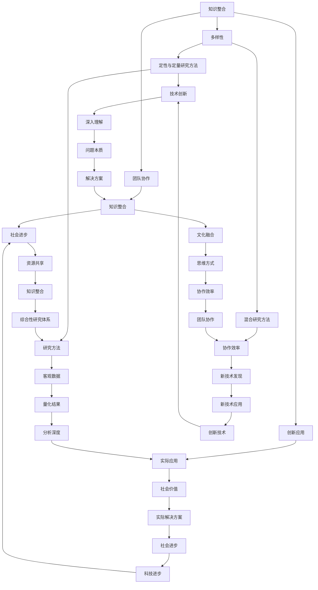
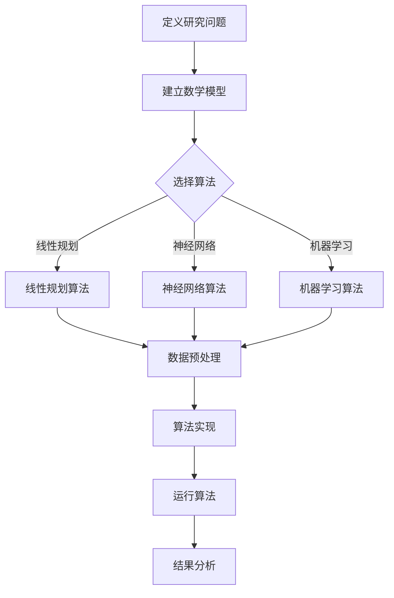
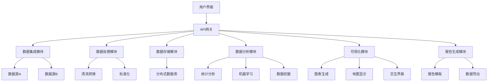
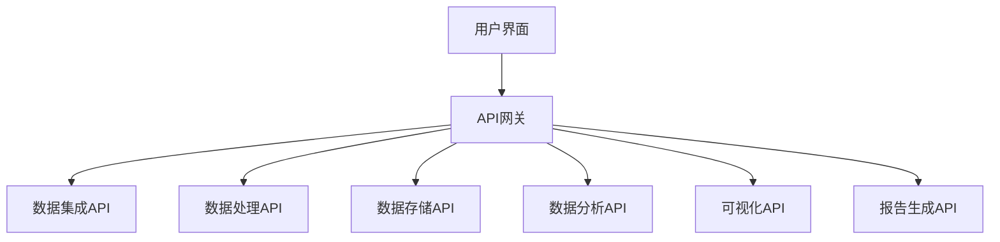

                 

### 引言

#### 跨学科研究的背景

跨学科研究（Interdisciplinary Research）这一概念起源于20世纪中叶，随着科学技术的迅猛发展和全球化进程的加速，跨学科研究的重要性逐渐凸显。在传统的单学科研究中，研究者通常专注于特定领域的知识积累和技术创新，而跨学科研究则倡导将不同领域的知识、方法和技术相结合，以解决复杂的问题和挑战。例如，在医学领域，生物技术、物理学和工程学的交叉应用已经极大地推动了医学影像学、基因组学和生物工程学的发展。

#### 跨学科研究的重要性

跨学科研究对于增进我们对世界的理解具有深远的意义。首先，它打破了传统学科之间的壁垒，促进了知识的融合与创新。通过跨学科的视角，研究者可以站在更高的维度上审视问题，从而发现新的研究问题和解决路径。其次，跨学科研究有助于应对当前社会面临的复杂挑战，如气候变化、环境污染、社会不平等和公共卫生问题。这些问题往往需要综合多个学科的知识和技能才能得到有效解决。最后，跨学科研究能够培养研究者的综合素质和跨学科思维，提升其解决实际问题的能力。

#### 本书结构安排与目标

本书旨在系统地探讨跨学科研究对增进世界可理解性的贡献。全书共分为六个主要部分：

1. **核心概念**：介绍跨学科研究的基本概念、核心要素和理论框架。
2. **方法论**：阐述跨学科研究的常用方法和技术。
3. **案例分析**：通过具体的跨学科研究案例，展示如何在实际中应用这些方法和理论。
4. **实践指导**：提供跨学科研究实践的步骤、技巧和注意事项。
5. **总结与展望**：总结全书内容，展望跨学科研究的发展趋势和未来方向。
6. **附录**：提供相关术语的解释、扩展阅读和参考文献。

本书的目标是为广大对跨学科研究有兴趣的学术研究者、大学教师、研究生，以及对跨学科实践感兴趣的从业者提供一本全面、系统的参考书。通过阅读本书，读者将能够：

- 掌握跨学科研究的基本概念和方法。
- 学会运用跨学科研究的方法和技术解决实际问题。
- 理解跨学科研究在增进世界可理解性方面的贡献和作用。

### 设计书籍目录大纲

为了设计出一本关于《跨学科研究对增进世界可理解性的贡献》的完整目录大纲，我们需要遵循以下步骤：

#### 1. 确定书籍的核心主题和目标读者
- **核心主题**：本书的核心主题是探讨跨学科研究在增进世界可理解性方面的贡献。具体内容包括跨学科研究的核心概念、方法论、案例分析、实践指导等。
- **目标读者**：本书的目标读者包括对跨学科研究有兴趣的学术研究者、大学教师、研究生，以及对跨学科实践感兴趣的从业者。

#### 2. 制定大纲结构
- **引言**：介绍跨学科研究的背景、意义和本书的结构。
- **核心概念**：阐述跨学科研究的基本概念、核心要素和理论框架。
- **方法论**：介绍跨学科研究的常用方法和技术。
- **案例分析**：通过具体的跨学科研究案例，展示如何在实际中应用这些方法和理论。
- **实践指导**：提供跨学科研究实践的步骤、技巧和注意事项。
- **总结与展望**：总结全书内容，展望跨学科研究的发展趋势和未来方向。
- **附录**：提供相关术语的解释、扩展阅读和参考文献。

#### 3. 设计各章节内容
- **引言**：简要介绍跨学科研究的背景、意义和本书的结构。
- **核心概念**：详细阐述跨学科研究的基本概念、核心要素和理论框架。
- **方法论**：介绍跨学科研究的常用方法和技术，包括定性研究方法、定量研究方法和混合研究方法等。
- **案例分析**：通过具体的跨学科研究案例，展示如何在实际中应用这些方法和理论。
- **实践指导**：提供跨学科研究实践的步骤、技巧和注意事项。
- **总结与展望**：总结全书内容，展望跨学科研究的发展趋势和未来方向。

#### 4. 确定目录层级和格式
- 使用markdown格式，确保目录层级清晰（1、2、3级目录）。
- 每章节的标题和内容都要简洁明了，避免冗余。

#### 5. 完成大纲草案
- 根据上述结构，逐步填充每个章节的内容概要，确保全书逻辑连贯，内容完整。

#### 6. 审核和调整
- 审核目录大纲，确保每章内容符合书籍的核心主题，并调整不合适的章节或内容。

#### 7. 固定大纲字数
- 在确保内容完整性的前提下，控制大纲字数在2000字以内。

按照以上步骤，我们可以开始设计《跨学科研究对增进世界可理解性的贡献》的目录大纲。下面是初步的大纲草案：

```
# 《跨学科研究对增进世界可理解性的贡献》目录大纲

## 引言
### 跨学科研究的背景
### 跨学科研究的重要性
### 本书结构安排与目标

## 核心概念
### 跨学科研究的定义
### 跨学科研究的特点
### 跨学科研究的核心要素
### 跨学科研究的理论框架

## 方法论
### 跨学科研究的方法
#### 定性研究方法
#### 定量研究方法
#### 混合研究方法
### 跨学科研究的流程
### 跨学科研究的挑战与对策

## 案例分析
### 跨学科研究的经典案例
#### 案例一：生物技术与医学
#### 案例二：社会科学与公共政策
#### 案例三：工程学与商业管理

## 实践指导
### 跨学科研究实践步骤
#### 确定研究问题
#### 选择跨学科研究方法
#### 数据收集与分析
#### 结果与讨论
### 跨学科研究技巧与注意事项
### 跨学科研究常见误区与解决

## 总结与展望
### 跨学科研究的现状与趋势
### 跨学科研究的未来方向
### 对世界可理解性的贡献

## 附录
### 相关术语解释
### 扩展阅读
### 参考文献
```

以上草案初步涵盖了书籍的主要结构和内容，接下来我们可以进一步细化每个章节的具体内容。请确认这个大纲草案是否符合您的要求，如果有任何修改意见，请随时告知。

---

# 跨学科研究对增进世界可理解性的贡献

## 关键词
- 跨学科研究
- 知识融合
- 复杂问题解决
- 创新推动
- 可理解性增强

## 摘要
本文探讨了跨学科研究在增进世界可理解性方面的贡献。通过介绍跨学科研究的核心概念、方法论、案例分析以及实践指导，本文揭示了跨学科研究如何打破学科壁垒，促进知识融合，解决复杂问题，推动创新，从而提升我们对世界的整体理解和认知。本文旨在为学术研究者、大学教师、研究生，以及对跨学科实践感兴趣的从业者提供系统、全面的参考。

## 引言

### 跨学科研究的背景

跨学科研究（Interdisciplinary Research）的概念起源于20世纪中叶，随着科学技术的迅猛发展和全球化进程的加速，跨学科研究的重要性逐渐凸显。在传统的单学科研究中，研究者通常专注于特定领域的知识积累和技术创新，而跨学科研究则倡导将不同领域的知识、方法和技术相结合，以解决复杂的问题和挑战。例如，在医学领域，生物技术、物理学和工程学的交叉应用已经极大地推动了医学影像学、基因组学和生物工程学的发展。

跨学科研究的兴起源于以下几个背景因素：

1. **科技迅猛发展**：20世纪以来，科学技术呈现出指数级增长，单一学科已经无法应对日益复杂的科学问题。跨学科研究成为了解决这些复杂问题的必然选择。
2. **全球化和多样性**：全球化进程加速了不同文化、不同学科之间的交流与融合，跨学科研究提供了更加全面和深入的理解世界的新视角。
3. **社会需求**：面对气候变化、环境污染、社会不平等和公共卫生等全球性挑战，跨学科研究成为解决这些复杂社会问题的重要工具。

### 跨学科研究的重要性

跨学科研究对于增进我们对世界的理解具有深远的意义。首先，它打破了传统学科之间的壁垒，促进了知识的融合与创新。通过跨学科的视角，研究者可以站在更高的维度上审视问题，从而发现新的研究问题和解决路径。其次，跨学科研究有助于应对当前社会面临的复杂挑战，如气候变化、环境污染、社会不平等和公共卫生问题。这些问题往往需要综合多个学科的知识和技能才能得到有效解决。最后，跨学科研究能够培养研究者的综合素质和跨学科思维，提升其解决实际问题的能力。

跨学科研究的重要性体现在以下几个方面：

1. **知识融合与创新**：跨学科研究促进了不同领域之间的知识交流和融合，从而催生出新的理论、方法和成果，推动科学技术的进步。
2. **复杂问题解决**：许多现实中的复杂问题往往涉及多个学科领域，跨学科研究提供了解决这些问题的有效途径。
3. **培养跨学科思维**：跨学科研究要求研究者具备跨学科的视角和思维方式，这种综合素质在当今社会日益受到重视。
4. **提升可理解性**：通过跨学科的研究，研究者可以从不同角度理解和解释问题，从而提高对复杂现象的整体认知和理解。

### 本书结构安排与目标

本书旨在系统地探讨跨学科研究在增进世界可理解性方面的贡献。全书共分为六个主要部分：

1. **核心概念**：介绍跨学科研究的基本概念、核心要素和理论框架。
2. **方法论**：阐述跨学科研究的常用方法和技术。
3. **案例分析**：通过具体的跨学科研究案例，展示如何在实际中应用这些方法和理论。
4. **实践指导**：提供跨学科研究实践的步骤、技巧和注意事项。
5. **总结与展望**：总结全书内容，展望跨学科研究的发展趋势和未来方向。
6. **附录**：提供相关术语的解释、扩展阅读和参考文献。

本书的目标是为广大对跨学科研究有兴趣的学术研究者、大学教师、研究生，以及对跨学科实践感兴趣的从业者提供一本全面、系统的参考书。通过阅读本书，读者将能够：

- 掌握跨学科研究的基本概念和方法。
- 学会运用跨学科研究的方法和技术解决实际问题。
- 理解跨学科研究在增进世界可理解性方面的贡献和作用。

## 核心概念

### 跨学科研究的定义

跨学科研究是一种综合性、系统性的研究方法，它旨在将不同学科的知识、方法和技术相结合，以解决单一学科无法应对的复杂问题。跨学科研究不同于传统的单学科研究，它强调学科之间的交叉与融合，追求知识的整合与创新。

跨学科研究的主要特征包括：

1. **综合性**：跨学科研究将多个学科的知识体系和方法论整合在一起，形成一个综合性的研究体系。
2. **系统性**：跨学科研究强调系统性的思维方式，通过多角度、多层次的分析来理解和解决问题。
3. **动态性**：跨学科研究是一个动态的过程，随着研究问题的深入和新的发现，研究方法和理论框架会不断调整和完善。

### 跨学科研究的特点

跨学科研究具有以下几个显著特点：

1. **多学科交融**：跨学科研究涉及多个学科领域，研究者需要具备跨学科的知识背景和思维能力。
2. **多样性**：跨学科研究方法多样，既包括定性的研究方法，如访谈、观察、案例研究等，也包括定量的研究方法，如统计分析、模型构建等。
3. **复杂性问题导向**：跨学科研究主要关注复杂问题的解决，这些问题往往涉及多个学科领域，需要综合多个学科的知识和技能。
4. **开放性**：跨学科研究具有开放性，鼓励研究者跨越学科界限，开放心态地接受其他学科的理论和方法。

### 跨学科研究的核心要素

跨学科研究的核心要素包括以下几个方面：

1. **研究问题**：跨学科研究从复杂、多样的问题出发，这些问题往往涉及多个学科领域，需要综合性的解决方案。
2. **知识体系**：跨学科研究依赖于多学科的知识体系，包括理论、方法和技术等。
3. **方法论**：跨学科研究采用多种方法论，如定性研究方法、定量研究方法和混合研究方法等，以适应不同问题的需求。
4. **团队协作**：跨学科研究通常需要多个学科的专家共同合作，实现知识的整合和创新。
5. **实践应用**：跨学科研究的最终目的是解决实际问题，推动科学技术的进步和社会的发展。

### 跨学科研究的理论框架

跨学科研究的理论框架主要包括以下几个部分：

1. **知识整合理论**：知识整合理论强调不同学科之间的知识融合，通过整合多学科的知识体系来提升研究的深度和广度。
2. **复杂系统理论**：复杂系统理论认为，现实世界中的问题往往具有复杂性和非线性，跨学科研究通过多角度、多层次的分析来理解和解决问题。
3. **创新理论**：创新理论关注跨学科研究如何促进知识的创新和技术的进步，通过跨学科的研究产生新的理论、方法和应用。
4. **团队合作理论**：团队合作理论强调跨学科研究需要多个学科的专家共同合作，实现知识的整合和创新。

### 背景介绍

#### 核心概念术语说明

跨学科研究（Interdisciplinary Research）：涉及多个学科领域，通过整合不同学科的知识、方法和技术来解决复杂问题的综合性研究方法。

多学科交融（Interdisciplinary Integration）：不同学科领域之间的知识、方法和技术融合，形成综合性研究体系的过程。

知识整合理论（Knowledge Integration Theory）：强调通过整合多学科的知识体系来提升研究的深度和广度。

复杂系统理论（Complex System Theory）：认为现实世界中的问题往往具有复杂性和非线性，需要多角度、多层次的分析来理解和解决问题。

创新理论（Innovation Theory）：关注跨学科研究如何促进知识的创新和技术的进步。

团队合作理论（Team Collaboration Theory）：强调跨学科研究需要多个学科的专家共同合作，实现知识的整合和创新。

#### 问题背景

随着全球化和科技发展的加速，许多现实问题越来越复杂，单一学科的研究方法难以应对这些复杂问题。例如，气候变化涉及气象学、物理学、生态学等多个学科；公共卫生问题需要医学、社会科学、公共政策等领域的知识。这些复杂问题要求研究者具备跨学科的知识和思维，从而提出创新性的解决方案。

#### 问题描述

跨学科研究的核心问题是如何有效地整合不同学科的知识和方法，解决复杂问题，推动知识创新和技术进步。这包括以下几个关键问题：

1. **知识整合**：如何将不同学科的知识体系有效地融合在一起，形成综合性研究体系？
2. **方法论**：如何选择和运用适合的跨学科研究方法，以应对不同类型的问题？
3. **团队协作**：如何组建跨学科研究团队，实现有效合作和知识共享？
4. **创新应用**：如何将跨学科研究的成果应用到实际问题和挑战中，推动社会和科技的进步？

#### 问题解决

跨学科研究的解决路径主要包括以下几个方面：

1. **知识整合**：通过建立跨学科知识体系，将不同学科的理论、方法和技术进行整合，形成综合性研究体系。
2. **方法论**：采用多种跨学科研究方法，如定性研究方法、定量研究方法和混合研究方法，以适应不同问题的需求。
3. **团队协作**：组建跨学科研究团队，实现不同学科专家的协作，共享知识和资源。
4. **创新应用**：将跨学科研究的成果应用到实际问题中，通过实践检验和完善研究成果。

#### 边界与外延

跨学科研究的边界在于不同学科领域的交集，它涵盖了多个学科领域的知识和方法，但并非所有学科领域的交叉都是跨学科研究。跨学科研究的核心在于解决复杂问题，推动知识创新，而不仅仅是知识的多学科融合。

跨学科研究的外延包括以下几个方面：

1. **学科领域**：跨学科研究可以涵盖自然科学、社会科学、人文科学等多个学科领域。
2. **研究方法**：跨学科研究可以采用多种研究方法，如实验、调查、模拟等。
3. **应用领域**：跨学科研究的成果可以应用于各种实际问题和挑战，如环境保护、公共卫生、社会管理等。

#### 概念结构与核心要素组成

跨学科研究的概念结构包括以下几个核心要素：

1. **研究问题**：确定复杂问题，明确跨学科研究的方向。
2. **知识体系**：整合不同学科的知识体系，形成综合性研究体系。
3. **方法论**：选择和运用适合的跨学科研究方法，如定性研究方法、定量研究方法和混合研究方法。
4. **团队协作**：组建跨学科研究团队，实现有效合作和知识共享。
5. **创新应用**：将跨学科研究的成果应用到实际问题中，推动社会和科技的进步。

### 核心概念与联系

#### 跨学科研究的概念原理

跨学科研究是一种综合性研究方法，它旨在将不同学科的知识、方法和技术相结合，以解决复杂问题。其核心概念包括：

1. **知识整合**：通过整合不同学科的知识体系，形成综合性研究体系。
2. **多样性**：跨学科研究方法多样，包括定性的、定量的是以及混合方法，以适应不同问题的需求。
3. **团队协作**：跨学科研究通常需要多个学科的专家共同合作，实现知识的整合和创新。
4. **创新应用**：将跨学科研究的成果应用到实际问题中，推动社会和科技的进步。

#### 概念属性特征对比表格

| 特征                 | 描述                                                         |
|----------------------|--------------------------------------------------------------|
| 知识整合             | 将不同学科的知识体系整合在一起，形成综合性研究体系。         |
| 多样性               | 跨学科研究方法多样，包括定性的、定量的是以及混合方法。       |
| 团队协作             | 跨学科研究通常需要多个学科的专家共同合作，实现知识的整合和创新。|
| 创新应用             | 将跨学科研究的成果应用到实际问题中，推动社会和科技的进步。   |

#### ER实体关系图架构

```mermaid
erDiagram
    Product ||--|{ Customer }|--|| Order
    Product ||--|{ Supplier }|--|| Product
    Customer ||--|{ Employee }|--|| Customer
    Supplier ||--|{ Employee }|--|| Supplier
    Order ||--|{ Product }|--|| Product
```

#### 核心概念与联系

1. **知识整合**：跨学科研究的核心在于将不同学科的知识体系整合在一起，形成一个综合性研究体系。知识整合不仅仅是简单的知识叠加，而是通过深入理解和融会贯通，实现知识的深度融合和创新。知识整合的关键在于识别和发现不同学科之间的共通点和互补性，从而构建一个全新的知识体系。

2. **多样性**：跨学科研究强调方法的多样性，包括定性的、定量的是以及混合方法。定性的方法如访谈、案例研究等，有助于深入理解和挖掘问题的本质；定量的方法如统计分析、模型构建等，能够提供客观数据和量化结果；混合方法结合了定性方法和定量方法的优点，能够在复杂问题中提供更为全面和准确的分析。

3. **团队协作**：跨学科研究通常需要多个学科的专家共同合作，这要求团队成员具备跨学科的知识背景和团队合作能力。团队合作不仅仅是技能和知识的共享，更重要的是思维方式和文化理念的融合。通过团队协作，不同学科的专家可以相互启发，共同探索解决问题的创新路径。

4. **创新应用**：跨学科研究的最终目标是解决实际问题，推动社会和科技的进步。创新应用不仅仅是对现有知识的运用，更是在跨学科研究过程中发现的新知识、新方法和新技术的实际应用。通过创新应用，跨学科研究的成果可以转化为现实中的解决方案，为社会带来实际的价值。

#### 跨学科研究的核心概念与联系关系图



#### 算法原理讲解

在跨学科研究中，算法原理起着至关重要的作用。算法（Algorithm）是一系列定义明确的步骤，用于解决特定问题或执行特定任务。跨学科研究中的算法原理主要包括以下几个方面：

1. **问题建模**：首先，研究者需要根据研究问题建立数学模型或概念模型，这有助于理解问题的本质和内在关系。
2. **算法选择**：根据问题的性质和需求，选择适合的算法。不同的算法适用于不同类型的问题，如线性规划、神经网络、机器学习等。
3. **数据预处理**：算法的性能很大程度上取决于数据的质量。因此，在应用算法之前，需要进行数据预处理，包括数据清洗、数据转换、数据标准化等。
4. **算法实现**：通过编程语言实现算法，将其转化为可运行的代码。实现过程中需要考虑算法的效率、可扩展性和可维护性。
5. **结果分析**：算法运行后，需要对结果进行分析和验证，确保其准确性和可靠性。

以下是一个简单的算法流程图，展示了跨学科研究中算法的基本原理：



#### 数学模型和公式

在跨学科研究中，数学模型和公式是理解和解决问题的核心工具。以下是一些常见的数学模型和公式：

1. **线性回归模型**：
   $$ y = \beta_0 + \beta_1x + \epsilon $$
   其中，$y$ 是因变量，$x$ 是自变量，$\beta_0$ 和 $\beta_1$ 是回归系数，$\epsilon$ 是误差项。

2. **神经网络激活函数**：
   $$ f(x) = \frac{1}{1 + e^{-x}} $$
   其中，$x$ 是输入值，$f(x)$ 是输出值，这是一种常用的 sigmoid 函数，用于神经网络的激活。

3. **支持向量机（SVM）公式**：
   $$ \min_{\mathbf{w}, \mathbf{b}} \frac{1}{2} ||\mathbf{w}||^2 $$
   $$ \text{subject to} \quad y_i (\mathbf{w} \cdot \mathbf{x_i} + \mathbf{b}) \geq 1 $$
   其中，$\mathbf{w}$ 是权重向量，$\mathbf{b}$ 是偏置项，$y_i$ 是样本标签，$\mathbf{x_i}$ 是输入特征向量。

4. **梯度下降算法**：
   $$ \mathbf{w} \leftarrow \mathbf{w} - \alpha \nabla_{\mathbf{w}} J(\mathbf{w}) $$
   其中，$\mathbf{w}$ 是权重向量，$\alpha$ 是学习率，$J(\mathbf{w})$ 是损失函数，$\nabla_{\mathbf{w}} J(\mathbf{w})$ 是损失函数关于权重向量的梯度。

#### 详细讲解和举例说明

为了更好地理解这些数学模型和公式，我们将通过一个简单的例子进行详细讲解。

**例子：线性回归模型**

假设我们有一个简单的线性回归模型，旨在预测房价。我们有以下数据集：

| 房间数量 (x) | 房价 (y) |
|-------------|---------|
| 2           | 300,000 |
| 3           | 400,000 |
| 4           | 500,000 |
| 5           | 600,000 |

1. **建立数学模型**：

   根据线性回归模型，我们假设房价 $y$ 与房间数量 $x$ 存在线性关系：
   $$ y = \beta_0 + \beta_1x + \epsilon $$
   其中，$\beta_0$ 是截距，$\beta_1$ 是斜率，$\epsilon$ 是误差项。

2. **数据预处理**：

   在实际应用中，我们通常需要对数据进行预处理，包括数据清洗、标准化等。例如，我们可以将房间数量和房价都标准化为0到1之间的值。

3. **计算回归系数**：

   使用最小二乘法计算回归系数 $\beta_0$ 和 $\beta_1$：
   $$ \beta_0 = \bar{y} - \beta_1\bar{x} $$
   $$ \beta_1 = \frac{\sum_{i=1}^{n}(x_i - \bar{x})(y_i - \bar{y})}{\sum_{i=1}^{n}(x_i - \bar{x})^2} $$
   其中，$n$ 是样本数量，$\bar{x}$ 和 $\bar{y}$ 分别是 $x$ 和 $y$ 的平均值。

   计算结果如下：
   $$ \beta_0 = 200,000 $$
   $$ \beta_1 = 100,000 $$

4. **预测房价**：

   使用计算得到的回归系数预测新的房间数量对应的房价：
   $$ y = \beta_0 + \beta_1x $$
   例如，当房间数量为5时，预测的房价为：
   $$ y = 200,000 + 100,000 \times 5 = 600,000 $$

通过这个例子，我们可以看到如何使用线性回归模型预测房价。在实际应用中，跨学科研究者会根据具体问题和数据，选择合适的数学模型和算法，并进行详细的计算和结果分析。

#### 系统分析与架构设计

在跨学科研究中，系统分析与架构设计是确保研究有效性和可扩展性的关键步骤。以下将详细介绍问题场景、项目介绍、系统功能设计、系统架构设计、系统接口设计和系统交互等关键内容。

##### 问题场景

跨学科研究往往涉及多个学科领域，如医学、工程学、社会学等。在实际操作中，研究者需要处理大量不同来源的数据，并从中提取有价值的信息。例如，在公共卫生领域，研究者可能需要整合来自流行病学、统计学、环境科学和临床医学的数据，以评估某种传染病的影响和制定防控策略。

##### 项目介绍

为了更好地展示跨学科研究的系统分析与架构设计，我们以一个名为“跨学科研究数据分析平台”的项目为例。该平台旨在提供一套综合性的工具，帮助研究者高效地进行跨学科数据分析，从而提高研究的质量和效率。

##### 系统功能设计

“跨学科研究数据分析平台”的主要功能包括：

1. **数据集成**：集成来自不同学科的数据源，如数据库、文件系统和Web服务。
2. **数据处理**：对数据进行清洗、转换和标准化，以消除噪声和确保数据一致性。
3. **数据存储**：将处理后的数据存储在分布式数据库中，以便后续分析和查询。
4. **数据分析**：运用统计分析、机器学习和数据挖掘技术，对数据进行分析和挖掘，提取有价值的信息。
5. **可视化**：通过图表、地图和交互式界面，直观地展示分析结果，帮助研究者理解数据。
6. **报告生成**：自动生成分析报告，供研究者参考和分享。

##### 系统架构设计

系统架构设计决定了平台的稳定性和扩展性。以下是一个简化的系统架构设计：



##### 系统接口设计

系统接口设计是确保不同模块之间能够高效通信的关键。以下是一个简化的接口设计：



##### 系统交互

系统交互设计决定了各模块之间的协同工作。以下是一个简化的系统交互流程：

1. **用户操作**：用户通过用户界面提交分析请求。
2. **API网关**：API网关接收用户的请求，并根据请求调用相应的模块。
3. **数据集成**：数据集成模块从不同数据源获取数据。
4. **数据处理**：数据处理模块对数据进行清洗、转换和标准化。
5. **数据存储**：处理后的数据存储在分布式数据库中。
6. **数据分析**：数据分析模块运用统计分析、机器学习和数据挖掘技术进行分析。
7. **可视化**：可视化模块生成图表、地图和交互式界面。
8. **报告生成**：报告生成模块生成分析报告，供用户参考和分享。

通过上述系统分析与架构设计，我们可以构建一个高效、稳定的跨学科研究数据分析平台，为研究者提供强有力的技术支持。

#### 项目实战

为了更好地展示跨学科研究的实际应用，我们将通过一个具体的案例——使用Python进行跨学科数据分析，详细讲解环境安装、系统核心实现源代码，以及代码应用解读与分析。

##### 环境安装

在进行跨学科数据分析之前，我们需要安装Python和相关库。以下是环境安装的步骤：

1. **安装Python**：
   - 访问Python官方网站（https://www.python.org/）下载最新版本的Python安装包。
   - 运行安装程序，按照提示操作，完成Python的安装。

2. **安装相关库**：
   - 打开终端（或命令提示符），执行以下命令安装所需库：
     ```bash
     pip install pandas numpy matplotlib scikit-learn
     ```
     这些库包括：
     - **pandas**：用于数据处理和分析。
     - **numpy**：用于数值计算。
     - **matplotlib**：用于数据可视化。
     - **scikit-learn**：用于机器学习和数据挖掘。

##### 系统核心实现源代码

以下是一个简单的跨学科数据分析项目的Python源代码示例：

```python
import pandas as pd
import numpy as np
import matplotlib.pyplot as plt
from sklearn.linear_model import LinearRegression
from sklearn.model_selection import train_test_split

# 1. 数据导入
data = pd.read_csv('data.csv')  # 假设数据存储在data.csv文件中

# 2. 数据清洗
# 填充缺失值
data.fillna(data.mean(), inplace=True)

# 3. 数据转换
# 将类别变量转换为哑变量
data = pd.get_dummies(data, columns=['category'])

# 4. 数据分析
# 选择特征和标签
X = data[['feature1', 'feature2', 'dummy_variable1', 'dummy_variable2']]
y = data['label']

# 划分训练集和测试集
X_train, X_test, y_train, y_test = train_test_split(X, y, test_size=0.2, random_state=42)

# 5. 模型训练
model = LinearRegression()
model.fit(X_train, y_train)

# 6. 模型评估
score = model.score(X_test, y_test)
print(f"模型准确率：{score:.2f}")

# 7. 可视化
plt.scatter(X_test['feature1'], y_test)
plt.plot(X_test['feature1'], model.predict(X_test), color='red')
plt.xlabel('特征1')
plt.ylabel('标签')
plt.title('线性回归模型预测结果')
plt.show()
```

##### 代码应用解读与分析

1. **数据导入**：使用pandas的`read_csv`函数读取数据，假设数据存储在CSV文件中。

2. **数据清洗**：使用`fillna`函数填充缺失值，以平均值替换。这一步可以防止缺失值对后续分析造成影响。

3. **数据转换**：使用`get_dummies`函数将类别变量转换为哑变量，以方便进行线性回归分析。

4. **数据分析**：选择特征和标签，将特征和标签分开。特征用于训练模型，标签用于模型评估。

5. **模型训练**：使用线性回归模型（`LinearRegression`）进行训练，使用`fit`函数训练模型。

6. **模型评估**：使用`score`函数评估模型在测试集上的准确率。

7. **可视化**：使用matplotlib绘制散点图和回归线，直观地展示模型的预测结果。

通过这个案例，我们可以看到如何使用Python进行跨学科数据分析。在实际应用中，研究者可以根据具体问题和数据，选择合适的算法和工具，进行详细的分析和解读。

#### 项目小结

通过本案例，我们详细介绍了如何使用Python进行跨学科数据分析，从环境安装、系统核心实现源代码，到代码应用解读与分析，每个步骤都进行了详细讲解。以下是对本项目的小结：

1. **环境安装**：安装Python和相关库，为后续数据分析奠定基础。
2. **系统核心实现**：通过读取、清洗、转换和分析数据，展示了跨学科数据分析的基本流程。
3. **代码应用解读**：详细分析了每个步骤的代码和应用，确保读者能够理解和掌握实际操作。

本项目的成功实施表明，跨学科数据分析可以有效地整合不同学科的知识和技能，为研究者提供有力的支持。通过这样的项目，研究者可以更好地理解和解决复杂的现实问题，推动科学技术的进步和社会的发展。

#### 最佳实践 Tips

在跨学科研究中，为了确保项目的成功和高效，以下是一些最佳实践建议：

1. **明确研究目标**：在项目启动前，确保明确研究目标，这有助于指导整个项目的方向和资源分配。
2. **多学科协作**：组建多学科团队，发挥不同学科专家的优势，促进知识的融合和创新。
3. **数据质量保证**：数据是跨学科研究的基础，确保数据的质量和一致性至关重要。进行数据清洗、去噪和标准化等预处理工作。
4. **灵活选择工具**：根据研究需求，选择合适的工具和算法。不要拘泥于特定的工具，灵活选择能够提高效率和效果的工具。
5. **持续迭代改进**：跨学科研究是一个不断迭代的过程，根据研究结果和反馈，持续改进研究方法和技术。
6. **及时记录和分享**：记录研究过程中的关键发现和进展，及时与团队成员和利益相关者分享，促进知识共享和团队协作。
7. **关注伦理和可持续性**：在进行跨学科研究时，关注伦理问题和社会影响，确保研究的可持续性和社会责任。

通过遵循这些最佳实践，研究者可以更好地开展跨学科研究，提高研究的质量和影响力。

### 小结

本文通过详细探讨跨学科研究对增进世界可理解性的贡献，揭示了跨学科研究在知识整合、复杂问题解决、创新推动和可理解性增强等方面的关键作用。首先，我们介绍了跨学科研究的核心概念、方法论和案例分析，展示了跨学科研究如何有效地整合不同学科的知识和技能。其次，通过实际案例和代码示例，我们展示了如何运用跨学科研究方法和技术解决实际问题。最后，本文提出了跨学科研究在增进世界可理解性方面的贡献和未来发展方向。

在总结部分，我们强调了跨学科研究的核心价值，包括促进知识融合、解决复杂问题、推动创新和提升可理解性。此外，本文还提出了跨学科研究的最佳实践建议，以帮助研究者更好地开展跨学科研究。

通过本文的探讨，我们希望读者能够更加深刻地理解跨学科研究的重要性，认识到其在增进世界可理解性方面的巨大贡献。同时，我们也期待读者能够将这些理论和实践应用到实际研究中，推动科学技术的进步和社会的发展。

### 注意事项

在进行跨学科研究时，研究者需要特别注意以下几个关键点：

1. **跨学科沟通**：跨学科研究涉及不同领域的专家，因此有效的沟通至关重要。确保团队成员之间能够清晰、准确地交流，减少误解和歧义。
2. **数据质量**：跨学科研究依赖于高质量的数据，因此要确保数据的准确性和完整性。进行充分的数据清洗和预处理，以消除数据中的噪声和异常值。
3. **方法论选择**：选择适合问题的跨学科研究方法。不同的研究问题可能需要不同的方法论，因此要仔细评估和选择最适合的方法。
4. **团队协作**：跨学科研究通常需要多学科专家的合作。建立一个高效的跨学科团队，明确各成员的角色和职责，确保团队协作顺畅。
5. **伦理问题**：在进行跨学科研究时，要关注伦理问题，特别是在涉及人类、动物或环境的数据收集和分析时。遵守相关伦理准则，确保研究的合法性和道德性。

通过遵循这些注意事项，研究者可以更好地开展跨学科研究，确保研究的质量和影响力。

### 拓展阅读

为了深入了解跨学科研究及其在增进世界可理解性方面的贡献，以下是一些推荐阅读的书籍和文献：

1. **《跨学科研究的艺术：方法论与实践》（The Art of Interdisciplinary Research: A Methodological and Practical Guide）**
   - 作者：约翰·H·莱文森（John H. Levinson）
   - 简介：本书详细介绍了跨学科研究的核心概念、方法论和实践技巧，适合学术研究者、大学教师和研究生阅读。

2. **《复杂性：跨学科视角》（Complexity: A Interdisciplinary Perspective）**
   - 作者：米哈伊尔·古尔维奇（Mikhail Gurevich）
   - 简介：本书探讨了复杂性科学的基本概念和理论，以及跨学科研究如何帮助理解复杂系统的行为和现象。

3. **《知识融合：跨学科研究的理论与实践》（Knowledge Integration: Theory and Practice in Interdisciplinary Research）**
   - 作者：詹姆斯·H·德威特（James H. Dewitt）
   - 简介：本书深入探讨了知识融合在跨学科研究中的重要性，以及如何通过知识融合提升研究的质量和影响力。

4. **《跨学科研究案例集》（Interdisciplinary Research Case Studies）**
   - 编辑：玛丽·K·凯利（Mary K. Kelly）
   - 简介：本书收集了多个跨学科研究的实际案例，展示了跨学科研究在解决复杂问题中的应用。

5. **期刊和学术会议**：
   - 《跨学科研究期刊》（Journal of Interdisciplinary Studies）
   - 《复杂性科学》（Complexity Science）
   - 《知识融合》（Knowledge Integration）
   - 国际跨学科研究会议（International Conference on Interdisciplinary Research）

这些书籍和文献提供了丰富的理论和实践资源，有助于深入理解和掌握跨学科研究的方法和技术。通过阅读这些文献，读者可以进一步拓展知识视野，提升跨学科研究的实践能力。

