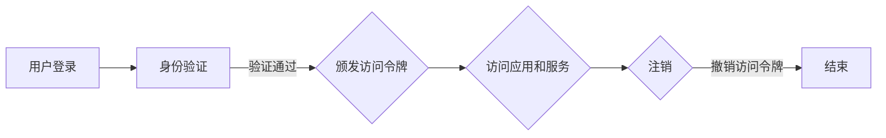
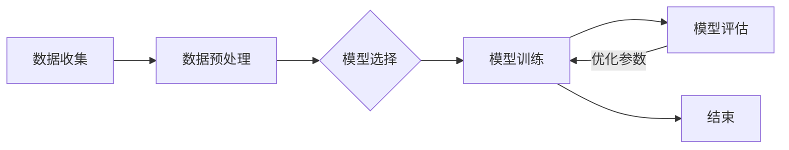
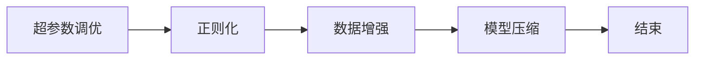
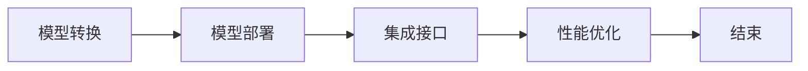
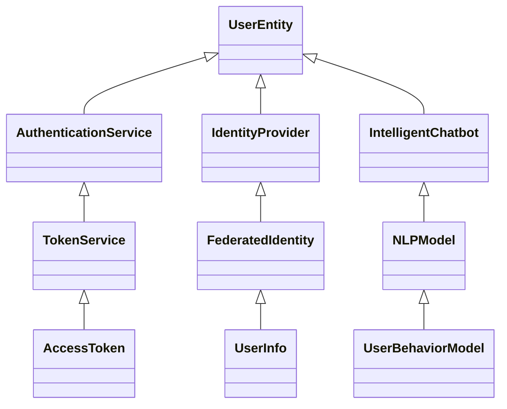
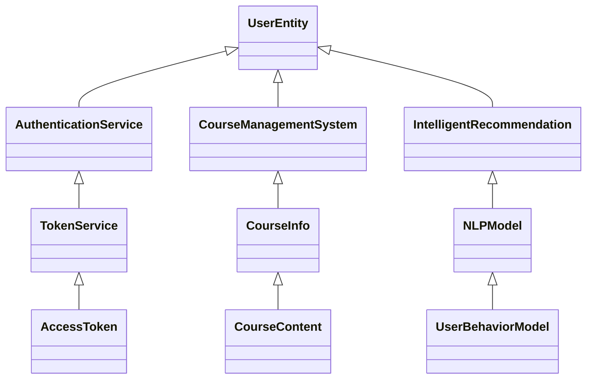
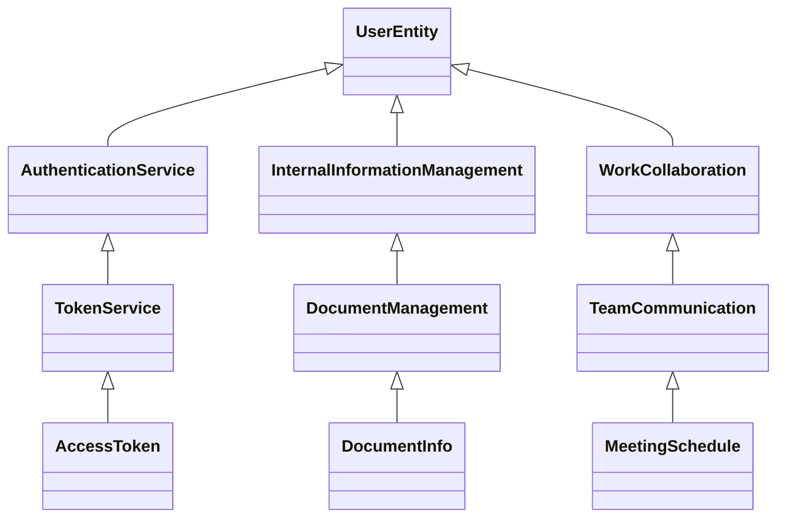

                 

### 文章标题：身份联合：简化LLM应用的用户认证

关键词：身份联合、用户认证、大型语言模型（LLM）、安全性、性能优化

摘要：本文探讨了身份联合在大型语言模型（LLM）应用中的重要性，分析了身份联合的基本原理、实现机制及其在LLM应用中的具体实践。文章旨在为开发者提供一套完整的身份联合与LLM应用解决方案，以简化用户认证过程，提高系统安全性和性能。

### 目录大纲

**第一部分：背景介绍**

1. **问题背景与核心概念**

   - 1.1 问题背景

     - 互联网时代身份认证的需求变化

     - 身份认证在网络安全中的重要性

     - 传统身份认证系统的局限性

   - 1.2 核心概念

     - 身份联合的定义与作用

     - 身份认证的方式与流程

     - LLM（大型语言模型）的概念与特性

**第二部分：身份联合原理与联系**

2. **身份联合原理**

   - 2.1 身份联合的核心概念

     - 身份联合的组成部分

     - 身份联合的优势与挑战

   - 2.2 身份认证的流程与机制

     - 单点登录（SSO）的原理与实现

     - 单点登出（SLO）的作用与策略

     - 多因素认证（MFA）的必要性

   - 2.3 LLM在身份认证中的应用

     - LLM在用户身份识别中的作用

     - LLM在用户行为分析中的应用

     - LLM在动态身份认证中的潜力

**第三部分：身份联合在LLM应用中的实践**

3. **身份联合在LLM应用中的需求分析**

   - 3.1 LLM应用的背景与现状

     - LLM的发展与应用领域

     - LLM应用中的用户认证需求

   - 3.2 身份联合在LLM应用中的必要性

     - 传统认证方式的不足

     - 身份联合的解决方案

     - 身份联合在LLM应用中的优势

**第四部分：身份联合与LLM应用实战**

4. **身份联合在LLM应用中的实现**

   - 4.1 身份联合系统的设计与实现

     - 系统架构设计

     - 数据库设计与数据存储

     - 身份认证流程设计

   - 4.2 LLM模型的训练与部署

     - LLM模型的选择与训练

     - LLM模型的优化与调参

     - LLM模型的部署与集成

   - 4.3 身份联合与LLM应用的实际案例

     - 案例一：智能客服系统的身份认证

     - 案例二：在线教育平台的用户认证

     - 案例三：企业内部办公系统的身份认证

**第五部分：身份联合与LLM应用的安全与隐私**

5. **身份联合与LLM应用的安全与隐私**

   - 5.1 身份联合系统的安全机制

     - 数据加密与访问控制

     - 安全协议与认证机制

     - 防御常见攻击手段

   - 5.2 LLM应用中的隐私保护

     - 用户隐私数据的收集与处理

     - 隐私保护策略与技术

     - 隐私合规与法律法规

**第六部分：身份联合与LLM应用的性能优化**

6. **身份联合与LLM应用的性能优化**

   - 6.1 身份联合系统的性能瓶颈

     - 系统响应时间优化

     - 数据存储与查询优化

     - 系统并发性能优化

   - 6.2 LLM模型的性能优化

     - 模型推理加速

     - 模型压缩与剪枝

     - 模型部署优化

**第七部分：身份联合与LLM应用的最佳实践**

7. **身份联合与LLM应用的最佳实践**

   - 7.1 设计与实施建议

     - 系统设计最佳实践

     - 系统实现最佳实践

   - 7.2 小结

     - 文章总结

     - 注意事项

     - 拓展阅读

### 第一部分：背景介绍

#### 1.1 问题背景与核心概念

##### 1.1.1 互联网时代身份认证的需求变化

随着互联网的迅猛发展，身份认证的需求变得愈加复杂和多样化。传统的身份认证方法如用户名和密码，已逐渐暴露出其诸多局限性。首先，用户名和密码易被破解、遗忘或泄露，导致用户账户安全受到威胁。其次，互联网上的服务种类繁多，用户往往需要在不同平台之间多次进行身份验证，这极大地增加了用户的操作负担，降低了用户体验。

为了解决这些问题，互联网时代对身份认证的需求发生了显著变化。一方面，人们希望身份认证过程能够更加简单、快捷，以提高用户体验；另一方面，企业和服务提供商需要确保用户身份的真实性和安全性，以防止恶意攻击和未经授权的访问。这种需求的变化促使了新型身份认证技术的出现和发展。

##### 1.1.2 身份认证在网络安全中的重要性

身份认证是网络安全的重要环节，它决定了谁能访问系统资源和服务。在互联网环境中，身份认证的作用尤为关键。有效的身份认证机制可以防止未经授权的访问，降低数据泄露和系统攻击的风险。随着网络攻击手段的日益复杂和多样化，身份认证在网络安全中的重要性愈发凸显。

当前，身份认证面临的主要挑战包括：

1. **密码安全性不足**：传统的用户名和密码认证方式容易被破解，密码强度和复杂度难以满足安全要求。
2. **多因素认证（MFA）的实施难度**：虽然多因素认证能够提高安全性，但其实现和用户操作的复杂性较高，影响了用户体验。
3. **用户隐私保护**：在身份认证过程中，需要收集和处理大量用户个人信息，如何保护用户隐私成为一大难题。
4. **快速变化的需求**：随着业务发展和新技术应用，身份认证需求也在不断变化，需要灵活的认证机制来满足不同场景下的需求。

##### 1.1.3 传统身份认证系统的局限性

传统的身份认证系统主要依赖于用户名和密码进行身份验证，存在以下局限性：

1. **易受攻击**：密码泄露、破解和暴力攻击是常见的网络攻击手段，传统的身份认证系统难以抵御这些攻击。
2. **用户体验差**：用户需要记住多个密码，且每次访问不同系统时都需要输入密码，增加了用户的操作负担。
3. **安全性不足**：单点登录（SSO）和单点登出（SLO）的实现较为复杂，且传统认证系统在多因素认证（MFA）方面的支持有限。
4. **扩展性差**：传统身份认证系统难以适应快速变化的业务需求和技术环境。

这些局限性使得传统身份认证系统在应对现代互联网安全需求时显得力不从心，迫切需要一种更加安全、便捷且灵活的身份认证解决方案。

##### 1.2 核心概念

###### 1.2.1 身份联合的定义与作用

身份联合（Identity Federation）是一种分布式身份认证机制，它通过第三方信任机构（如认证授权服务器）来验证用户身份，使得用户可以无需重复输入身份信息，轻松访问多个应用和服务。身份联合的核心在于建立信任链，将不同应用和服务之间的身份认证过程集中管理。

身份联合的主要作用包括：

1. **简化认证流程**：用户只需在身份联合系统中注册一次，即可访问多个应用和服务，避免了重复认证的繁琐。
2. **提高安全性**：通过引入第三方信任机构，身份联合可以提供更强的认证保障，降低单点漏洞的风险。
3. **增强灵活性**：身份联合支持多种认证方式，如单点登录（SSO）、单点登出（SLO）和多因素认证（MFA），可以灵活适应不同场景下的认证需求。
4. **降低管理成本**：身份联合减少了应用和服务提供商在身份认证方面的开发和维护工作量，降低了管理成本。

###### 1.2.2 身份认证的方式与流程

身份认证是验证用户身份的过程，常见的认证方式包括：

1. **用户名和密码**：这是最传统的身份认证方式，用户需要记住用户名和密码才能访问系统。
2. **多因素认证（MFA）**：MFA通过结合多个认证因素，如密码、指纹、短信验证码等，提高认证的安全性。
3. **单点登录（SSO）**：SSO允许用户使用一个账户登录多个应用和服务，简化了认证流程。
4. **单点登出（SLO）**：SLO确保用户在登出某个应用或服务后，能够同时登出所有相关应用和服务。

身份认证的基本流程包括：

1. **身份验证**：用户输入身份信息（如用户名和密码），系统对其进行验证。
2. **身份授权**：验证通过后，系统授予用户相应的权限，允许其访问特定的资源或服务。
3. **身份管理**：系统负责管理用户的身份信息，包括注册、修改和删除等操作。

###### 1.2.3 LLM（大型语言模型）的概念与特性

大型语言模型（Large Language Model，简称LLM）是一种基于神经网络的语言处理模型，具有处理和理解自然语言的能力。LLM通常具有以下特性：

1. **规模巨大**：LLM由数亿甚至数十亿个参数组成，能够处理大量语言数据。
2. **自适应性强**：LLM通过学习大量语料库，能够自适应地理解和生成自然语言。
3. **并行处理能力**：LLM可以在多台服务器上并行训练，提高训练效率。
4. **泛化能力强**：LLM通过迁移学习，能够在不同任务和数据集上表现良好。

LLM在身份认证中的应用主要包括：

1. **用户身份识别**：LLM可以通过分析用户语言习惯和行为模式，识别用户的身份。
2. **用户行为分析**：LLM可以分析用户的行为数据，预测用户可能的行为模式，提高系统的安全性和响应速度。
3. **动态身份认证**：LLM可以根据用户的行为特征，动态调整认证策略，提高认证的灵活性和安全性。

### 第二部分：身份联合原理与联系

#### 2.1 身份联合原理

###### 2.1.1 身份联合的核心概念

身份联合（Identity Federation）是一种分布式身份认证机制，它通过第三方信任机构（如认证授权服务器）来验证用户身份，使得用户可以无需重复输入身份信息，轻松访问多个应用和服务。身份联合的核心在于建立信任链，将不同应用和服务之间的身份认证过程集中管理。

身份联合的基本组成部分包括：

1. **用户**：身份联合的目标是服务于用户，用户是身份联合的核心。
2. **认证授权服务器**：认证授权服务器是身份联合的核心组成部分，负责验证用户的身份和权限。
3. **应用和服务提供商**：应用和服务提供商是身份联合的服务对象，它们通过身份联合系统提供的服务来简化用户认证流程。

身份联合的主要工作流程如下：

1. **用户注册**：用户在身份联合系统中注册，提供身份信息，如用户名、密码等。
2. **身份验证**：用户访问应用和服务时，通过认证授权服务器验证其身份。
3. **授权访问**：认证授权服务器验证用户身份后，向用户颁发访问令牌，用户可以使用该令牌访问应用和服务。
4. **注销**：用户登出身份联合系统时，认证授权服务器撤销访问令牌，确保用户不再能够访问已注销的应用和服务。

###### 2.1.2 身份联合的优势与挑战

身份联合具有以下优势：

1. **简化认证流程**：用户无需在多个应用和服务之间重复输入身份信息，提高了用户体验。
2. **提高安全性**：通过引入第三方信任机构，身份联合可以提供更强的认证保障，降低单点漏洞的风险。
3. **增强灵活性**：身份联合支持多种认证方式，如单点登录（SSO）、单点登出（SLO）和多因素认证（MFA），可以灵活适应不同场景下的认证需求。
4. **降低管理成本**：身份联合减少了应用和服务提供商在身份认证方面的开发和维护工作量，降低了管理成本。

然而，身份联合也面临一些挑战：

1. **信任问题**：身份联合需要依赖第三方信任机构，信任问题成为身份联合的一大挑战。如果第三方信任机构存在漏洞或被攻击，可能导致整个身份联合系统的安全风险。
2. **兼容性问题**：不同应用和服务提供商之间的系统可能存在兼容性问题，需要统一身份联合标准和协议。
3. **隐私保护**：身份联合需要收集和处理大量用户个人信息，如何保护用户隐私成为一大难题。

#### 2.2 身份认证的流程与机制

##### 2.2.1 单点登录（SSO）的原理与实现

单点登录（Single Sign-On，简称SSO）是一种身份认证机制，允许用户使用一个账户登录多个应用和服务。SSO的原理如下：

1. **用户登录**：用户在身份联合系统中输入用户名和密码，身份联合系统验证用户的身份。
2. **颁发访问令牌**：验证通过后，身份联合系统向用户颁发一个访问令牌，令牌包含用户的身份信息和权限信息。
3. **访问应用和服务**：用户使用访问令牌访问其他应用和服务，应用和服务通过身份联合系统验证令牌的有效性，允许用户访问相应的资源。

SSO的实现需要以下组件：

1. **认证授权服务器**：负责验证用户的身份和颁发访问令牌。
2. **应用和服务提供商**：负责接收访问令牌并验证其有效性，允许用户访问相应的资源。
3. **身份联合协议**：如OpenID Connect（OIDC）和Security Assertion Markup Language（SAML），用于传输访问令牌和验证令牌。

##### 2.2.2 单点登出（SLO）的作用与策略

单点登出（Single Sign-Out，简称SLO）是一种身份认证机制，允许用户在注销某个应用或服务时，同时注销所有相关应用和服务。SLO的作用如下：

1. **提高安全性**：确保用户在注销某个应用或服务后，不再能够访问其他相关应用和服务，防止未经授权的访问。
2. **简化用户操作**：用户无需逐一注销所有应用和服务，提高了用户体验。

SLO的实现策略包括：

1. **全局注销**：用户在身份联合系统中注销时，身份联合系统向所有已登录的应用和服务发送登出请求，确保用户在所有应用和服务中注销。
2. **令牌管理**：身份联合系统负责管理访问令牌，当用户注销时，身份联合系统撤销所有访问令牌，确保用户无法再次访问已注销的应用和服务。

##### 2.2.3 多因素认证（MFA）的必要性

多因素认证（Multi-Factor Authentication，简称MFA）是一种安全机制，通过结合多个认证因素，提高认证的安全性。MFA的必要性如下：

1. **增强安全性**：传统的单因素认证（如用户名和密码）易受攻击，MFA通过结合多个认证因素，如密码、指纹、短信验证码等，提高认证的安全性。
2. **防范恶意攻击**：MFA可以防止黑客通过获取单一认证因素（如用户名和密码）进行攻击，降低系统的安全风险。
3. **满足合规要求**：某些行业和地区要求必须使用多因素认证，MFA有助于满足合规要求。

常见的MFA认证因素包括：

1. **密码**：用户必须记住的私密信息，是最常见的认证因素。
2. **指纹**：基于生物识别技术，通过扫描用户指纹进行认证。
3. **短信验证码**：通过发送短信到用户注册的手机号码，用户需要输入验证码进行认证。
4. **动态令牌**：通过生成动态密码的令牌，用户需要输入动态密码进行认证。

##### 2.3 LLM在身份认证中的应用

###### 2.3.1 LLM在用户身份识别中的作用

大型语言模型（LLM）在用户身份识别中具有重要作用，具体体现在以下几个方面：

1. **用户行为分析**：LLM可以分析用户的语言习惯和行为模式，建立用户身份的数字化模型。通过对用户语言特征的分析，LLM可以识别用户的身份和意图，提高身份认证的准确性。
2. **身份验证优化**：LLM可以结合多因素认证（MFA）技术，优化身份验证过程。例如，通过分析用户的语言特征，LLM可以动态调整认证策略，提高认证的安全性。
3. **反欺诈检测**：LLM可以识别异常行为模式，用于反欺诈检测。例如，当用户的行为特征与历史记录不符时，LLM可以触发额外的身份验证，防止欺诈行为。

###### 2.3.2 LLM在用户行为分析中的应用

用户行为分析是LLM在身份认证中的重要应用，通过分析用户的行为数据，LLM可以识别用户的行为模式，提高系统的安全性和响应速度。具体应用包括：

1. **用户行为特征建模**：LLM可以建立用户行为特征的模型，包括语言表达习惯、操作行为等。通过对用户行为数据的分析，LLM可以识别用户的身份和意图。
2. **异常行为检测**：LLM可以识别异常行为模式，用于反欺诈检测和用户身份验证。例如，当用户的行为特征与历史记录不符时，LLM可以触发额外的身份验证，防止欺诈行为。
3. **用户行为预测**：LLM可以预测用户未来的行为，为系统提供实时响应。例如，当用户的行为模式发生突变时，LLM可以及时调整认证策略，提高系统的安全性。

###### 2.3.3 LLM在动态身份认证中的潜力

动态身份认证是一种基于用户行为特征的认证机制，通过动态调整认证策略，提高认证的安全性和灵活性。LLM在动态身份认证中具有以下潜力：

1. **个性化认证策略**：LLM可以根据用户的行为特征，动态调整认证策略，提供个性化的认证体验。例如，对于高频使用的用户，LLM可以降低认证强度，提高用户体验。
2. **实时响应**：LLM可以实时分析用户的行为数据，为系统提供实时响应。例如，当用户的行为特征发生变化时，LLM可以及时调整认证策略，提高系统的安全性。
3. **自动化决策**：LLM可以自动化决策过程，降低人工干预。例如，当用户的行为特征满足特定条件时，LLM可以自动触发额外的身份验证，确保系统的安全性。

### 第三部分：身份联合在LLM应用中的实践

#### 3.1 LLM应用的背景与现状

大型语言模型（LLM）在近年来取得了显著的发展，广泛应用于自然语言处理、机器翻译、文本生成等领域。随着LLM在各个行业中的广泛应用，用户认证需求也日益增长。然而，传统的身份认证方式在处理LLM应用中的认证需求时，存在诸多不足：

1. **复杂性高**：LLM应用通常需要处理复杂的语言数据和用户行为，传统的身份认证方式难以满足其认证需求。
2. **安全性不足**：传统的身份认证方式易受攻击，无法提供足够的安全保障。
3. **用户体验差**：传统身份认证方式操作复杂，影响用户体验。

为了解决这些问题，身份联合在LLM应用中显得尤为重要。身份联合可以通过以下方式改进LLM应用中的用户认证：

1. **简化认证流程**：身份联合可以简化用户认证流程，提高用户体验。
2. **提高安全性**：身份联合可以提供更强的认证保障，降低单点漏洞的风险。
3. **增强灵活性**：身份联合支持多种认证方式，可以灵活适应不同场景下的认证需求。

#### 3.2 身份联合在LLM应用中的必要性

在LLM应用中，身份联合的必要性体现在以下几个方面：

1. **多应用集成**：LLM应用通常涉及多个应用和服务的集成，身份联合可以简化用户认证流程，提高用户体验。
2. **安全性需求**：LLM应用处理敏感的文本数据，安全性要求较高。身份联合可以提供更强的认证保障，降低单点漏洞的风险。
3. **隐私保护**：身份联合可以保护用户的隐私数据，减少数据泄露的风险。
4. **合规要求**：某些行业和地区对身份认证有特定的合规要求，身份联合有助于满足这些要求。

#### 3.2.1 传统认证方式的不足

传统认证方式在LLM应用中存在以下不足：

1. **复杂性高**：传统认证方式通常依赖于用户名和密码，操作复杂，难以满足LLM应用的认证需求。
2. **安全性不足**：传统认证方式易受攻击，如密码泄露、暴力破解等，无法提供足够的安全保障。
3. **用户体验差**：传统认证方式操作复杂，影响用户体验。
4. **兼容性问题**：传统认证方式难以适应不同应用和服务之间的集成。

#### 3.2.2 身份联合的解决方案

身份联合提供了一种有效的解决方案，可以克服传统认证方式的不足：

1. **简化认证流程**：身份联合可以简化用户认证流程，提高用户体验。用户只需在身份联合系统中注册一次，即可访问多个应用和服务，无需重复输入身份信息。
2. **提高安全性**：身份联合通过引入第三方信任机构，提供更强的认证保障，降低单点漏洞的风险。身份联合支持多种认证方式，如单点登录（SSO）、单点登出（SLO）和多因素认证（MFA），可以灵活适应不同场景下的认证需求。
3. **增强灵活性**：身份联合支持多种认证方式，可以灵活适应不同场景下的认证需求。身份联合可以与LLM应用无缝集成，满足LLM应用的复杂认证需求。
4. **兼容性好**：身份联合支持多种身份联合协议，如OpenID Connect（OIDC）和Security Assertion Markup Language（SAML），可以与不同应用和服务集成，解决兼容性问题。

#### 3.2.3 身份联合在LLM应用中的优势

身份联合在LLM应用中具有以下优势：

1. **简化认证流程**：身份联合可以简化用户认证流程，提高用户体验。用户只需在身份联合系统中注册一次，即可访问多个应用和服务，无需重复输入身份信息。
2. **提高安全性**：身份联合通过引入第三方信任机构，提供更强的认证保障，降低单点漏洞的风险。身份联合支持多种认证方式，如单点登录（SSO）、单点登出（SLO）和多因素认证（MFA），可以灵活适应不同场景下的认证需求。
3. **增强灵活性**：身份联合支持多种认证方式，可以灵活适应不同场景下的认证需求。身份联合可以与LLM应用无缝集成，满足LLM应用的复杂认证需求。
4. **兼容性好**：身份联合支持多种身份联合协议，如OpenID Connect（OIDC）和Security Assertion Markup Language（SAML），可以与不同应用和服务集成，解决兼容性问题。

#### 3.3 身份联合在LLM应用中的挑战

虽然身份联合在LLM应用中具有显著优势，但也面临一些挑战：

1. **信任问题**：身份联合需要依赖第三方信任机构，信任问题成为身份联合的一大挑战。如果第三方信任机构存在漏洞或被攻击，可能导致整个身份联合系统的安全风险。
2. **兼容性问题**：不同应用和服务提供商之间的系统可能存在兼容性问题，需要统一身份联合标准和协议。
3. **隐私保护**：身份联合需要收集和处理大量用户个人信息，如何保护用户隐私成为一大难题。
4. **性能优化**：身份联合系统在处理大规模用户认证请求时，需要优化性能，确保系统的高效稳定运行。

### 第四部分：身份联合与LLM应用实战

#### 4.1 身份联合系统的设计与实现

##### 4.1.1 系统架构设计

身份联合系统通常采用分布式架构，以提高系统的性能和可靠性。以下是身份联合系统的基本架构设计：

1. **用户端**：用户通过Web浏览器或其他客户端应用程序访问身份联合系统。
2. **认证授权服务器**：负责验证用户的身份和权限，向用户颁发访问令牌。
3. **应用和服务提供商**：通过身份联合系统验证用户身份，允许用户访问相应的资源或服务。
4. **数据存储**：存储用户的身份信息、访问令牌和其他相关数据。

##### 4.1.2 数据库设计与数据存储

身份联合系统需要存储以下数据：

1. **用户信息**：包括用户名、密码、邮箱、手机号码等。
2. **访问令牌**：包括访问令牌的ID、颁发时间、过期时间、用户ID等。
3. **权限信息**：包括用户在各个应用和服务的权限信息。

以下是身份联合系统的数据库设计示例：

```markdown
User {
  UserID: INT PRIMARY KEY,
  Username: VARCHAR(50),
  Password: VARCHAR(50),
  Email: VARCHAR(100),
  PhoneNumber: VARCHAR(20)
}

AccessToken {
  AccessTokenID: VARCHAR(50) PRIMARY KEY,
  UserID: INT FOREIGN KEY REFERENCES User(UserID),
  IssuedAt: DATETIME,
  ExpiresAt: DATETIME,
  Scope: VARCHAR(100)
}

Permission {
  PermissionID: VARCHAR(50) PRIMARY KEY,
  UserID: INT FOREIGN KEY REFERENCES User(UserID),
  AppID: VARCHAR(50) FOREIGN KEY REFERENCES Application(AppID),
  Scope: VARCHAR(100)
}

Application {
  AppID: VARCHAR(50) PRIMARY KEY,
 AppName: VARCHAR(100),
  Description: TEXT
}
```

##### 4.1.3 身份认证流程设计

身份认证流程是身份联合系统的核心，以下是身份认证的基本流程：

1. **用户登录**：用户在身份联合系统中输入用户名和密码。
2. **身份验证**：认证授权服务器验证用户的身份，检查用户名和密码是否匹配。
3. **颁发访问令牌**：验证通过后，认证授权服务器生成访问令牌，并将其发送给用户。
4. **访问应用和服务**：用户使用访问令牌访问应用和服务，应用和服务通过认证授权服务器验证访问令牌的有效性。
5. **注销**：用户在身份联合系统中注销，认证授权服务器撤销访问令牌。

以下是身份认证流程的Mermaid流程图：



#### 4.2 LLM模型的训练与部署

##### 4.2.1 LLM模型的选择与训练

在身份联合系统中，LLM模型用于用户身份识别、行为分析等任务。以下是选择和训练LLM模型的基本步骤：

1. **数据收集**：收集用户的行为数据，包括语言表达、操作行为等。
2. **数据预处理**：对收集到的数据进行分析和处理，包括去噪、归一化、特征提取等。
3. **模型选择**：根据应用需求，选择合适的LLM模型，如BERT、GPT等。
4. **模型训练**：使用预处理后的数据训练LLM模型，通过优化模型参数，提高模型的准确性。
5. **模型评估**：使用验证数据集评估模型性能，调整模型参数，优化模型效果。

以下是LLM模型训练的Mermaid流程图：



##### 4.2.2 LLM模型的优化与调参

LLM模型的优化和调参是提高模型性能的关键步骤。以下是优化和调参的基本方法：

1. **超参数调优**：调整模型的学习率、批量大小、训练轮数等超参数，以提高模型性能。
2. **正则化**：使用正则化技术，如L1、L2正则化，防止模型过拟合。
3. **数据增强**：通过数据增强技术，如数据扩充、数据变换等，增加训练数据的多样性。
4. **模型压缩**：使用模型压缩技术，如剪枝、量化等，减少模型参数数量，提高模型运行效率。

以下是LLM模型优化和调参的Mermaid流程图：



##### 4.2.3 LLM模型的部署与集成

LLM模型的部署和集成是身份联合系统实现的关键步骤。以下是部署和集成的步骤：

1. **模型转换**：将训练好的LLM模型转换为可部署的格式，如ONNX、TorchScript等。
2. **模型部署**：将转换后的模型部署到生产环境中，如使用TensorFlow Serving、PyTorch Server等。
3. **集成接口**：为应用和服务提供访问LLM模型的接口，如REST API、gRPC等。
4. **性能优化**：优化模型部署和集成过程中的性能，如使用模型推理引擎、并行处理等。

以下是LLM模型部署和集成的Mermaid流程图：



#### 4.3 身份联合与LLM应用的实际案例

##### 4.3.1 案例一：智能客服系统的身份认证

智能客服系统是一个典型的LLM应用，通过身份联合和LLM模型，实现高效、安全的用户认证。以下是案例的详细说明：

1. **系统架构**：智能客服系统采用分布式架构，包括用户端、认证授权服务器、智能客服引擎等。
2. **身份联合**：用户在身份联合系统中注册，通过认证授权服务器验证身份，颁发访问令牌。
3. **LLM模型**：使用LLM模型进行用户身份识别和行为分析，提高认证的准确性和安全性。
4. **集成接口**：智能客服系统通过REST API访问认证授权服务器和LLM模型，实现身份认证和智能客服功能。

以下是智能客服系统架构的Mermaid类图：



##### 4.3.2 案例二：在线教育平台的用户认证

在线教育平台通过身份联合和LLM模型，实现高效、安全的用户认证和个性化推荐。以下是案例的详细说明：

1. **系统架构**：在线教育平台采用分布式架构，包括用户端、认证授权服务器、课程管理系统等。
2. **身份联合**：用户在身份联合系统中注册，通过认证授权服务器验证身份，颁发访问令牌。
3. **LLM模型**：使用LLM模型进行用户身份识别、行为分析和课程推荐，提高认证的准确性和用户体验。
4. **集成接口**：在线教育平台通过REST API访问认证授权服务器和LLM模型，实现身份认证、课程推荐和学习分析。

以下是在线教育平台架构的Mermaid类图：



##### 4.3.3 案例三：企业内部办公系统的身份认证

企业内部办公系统通过身份联合和LLM模型，实现高效、安全的用户认证和内部信息共享。以下是案例的详细说明：

1. **系统架构**：企业内部办公系统采用分布式架构，包括用户端、认证授权服务器、内部信息管理系统等。
2. **身份联合**：用户在身份联合系统中注册，通过认证授权服务器验证身份，颁发访问令牌。
3. **LLM模型**：使用LLM模型进行用户身份识别、行为分析和内部信息分类，提高认证的准确性和信息安全。
4. **集成接口**：企业内部办公系统通过REST API访问认证授权服务器和LLM模型，实现身份认证、内部信息共享和工作协作。

以下是企业内部办公系统架构的Mermaid类图：



### 第五部分：身份联合与LLM应用的安全与隐私

#### 5.1 身份联合系统的安全机制

身份联合系统在设计和实现过程中，需要考虑多种安全机制，以确保系统的安全性。以下是一些常见的安全机制：

1. **数据加密**：对用户的敏感数据进行加密，如用户密码、访问令牌等。常用的加密算法包括AES、RSA等。
2. **访问控制**：通过访问控制机制，确保只有授权用户才能访问系统资源和数据。常用的访问控制机制包括基于角色的访问控制（RBAC）和基于属性的访问控制（ABAC）。
3. **安全协议**：使用安全协议（如HTTPS、TLS等）保护数据传输过程中的安全性，防止数据泄露和篡改。
4. **身份验证**：通过多因素认证（MFA）提高身份验证的安全性，防止恶意攻击和未经授权的访问。
5. **安全审计**：对系统操作进行审计，记录系统的访问日志和操作记录，以便在发生安全事件时进行追踪和调查。
6. **防攻击措施**：防御常见的网络攻击，如SQL注入、跨站脚本攻击（XSS）等。

##### 5.1.1 数据加密与访问控制

数据加密是身份联合系统中的基本安全措施之一，可以防止敏感数据在传输和存储过程中被窃取或篡改。以下是数据加密和访问控制的具体实现：

1. **数据加密**：

   - **加密算法**：常用的加密算法包括AES（高级加密标准）和RSA（公开密钥加密算法）。AES是一种对称加密算法，加密和解密速度较快，适用于对大量数据的加密。RSA是一种非对称加密算法，加密和解密速度较慢，但安全性较高，适用于对关键数据的加密。
   - **密钥管理**：加密算法需要密钥来加密和解密数据。密钥的管理至关重要，应采取以下措施：

     - **密钥生成**：使用强随机数生成器生成密钥，确保密钥的随机性和安全性。
     - **密钥存储**：将密钥存储在安全的密钥管理系统中，如硬件安全模块（HSM）或密钥管理服务（KMS）。
     - **密钥更新**：定期更换密钥，以防止密钥泄露或被破解。

2. **访问控制**：

   - **角色与权限**：在身份联合系统中，定义不同的角色（如管理员、普通用户等），并为每个角色分配相应的权限。角色与权限的关系可以用访问控制列表（ACL）或基于角色的访问控制（RBAC）来表示。
   - **权限管理**：通过权限管理机制，确保只有授权用户才能访问系统资源和数据。权限管理包括以下方面：

     - **权限分配**：为用户分配适当的角色和权限，确保用户只能访问其有权访问的资源。
     - **权限验证**：在用户访问资源时，验证其角色和权限，确保只有授权用户才能访问资源。
     - **权限审计**：记录用户访问系统资源和数据的操作日志，以便在发生安全事件时进行追踪和调查。

##### 5.1.2 安全协议与认证机制

安全协议在身份联合系统中起着关键作用，用于保护数据传输过程中的安全性。以下是一些常用的安全协议和认证机制：

1. **安全套接字层（SSL）**：

   - **作用**：SSL是一种用于保护网络通信的安全协议，可用于HTTPS等应用。
   - **工作原理**：SSL通过在客户端和服务器之间建立加密连接，确保数据在传输过程中的机密性和完整性。SSL使用证书来验证服务器身份，防止中间人攻击和数据篡改。

2. **传输层安全（TLS）**：

   - **作用**：TLS是SSL的升级版，用于保护网络通信的安全。
   - **工作原理**：TLS与SSL类似，但在加密算法、密钥交换和认证机制等方面进行了改进。TLS使用证书来验证服务器身份，并支持更强大的加密算法和更安全的密钥交换方式。

3. **多因素认证（MFA）**：

   - **作用**：MFA是一种安全认证机制，通过结合多个认证因素，提高认证的安全性。
   - **工作原理**：MFA通常包括以下认证因素：

     - **知识因素**：如用户名和密码，是用户必须记住的信息。
     - **持有因素**：如智能卡、令牌、手机等，是用户持有的物理设备。
     - **生物因素**：如指纹、虹膜、面部识别等，是用户的生物特征。

     MFA通过结合多个认证因素，确保只有合法用户才能访问系统资源和数据。

4. **单点登录（SSO）**：

   - **作用**：SSO是一种身份认证机制，允许用户使用一个账户登录多个应用和服务。
   - **工作原理**：SSO通过在用户和多个应用和服务之间建立信任关系，简化用户的认证过程。用户只需在身份联合系统中注册一次，即可访问多个应用和服务，无需重复输入身份信息。

##### 5.1.3 防御常见攻击手段

身份联合系统可能面临多种网络攻击，以下是一些常见的攻击手段及其防御方法：

1. **暴力破解攻击**：

   - **攻击原理**：攻击者通过尝试多个用户名和密码组合，试图破解用户账户。
   - **防御方法**：

     - **账户锁定**：当用户连续多次尝试失败时，锁定账户一段时间，防止暴力破解攻击。
     - **验证码**：在登录过程中加入验证码，防止自动化工具进行暴力破解。

2. **中间人攻击**：

   - **攻击原理**：攻击者拦截客户端和服务器之间的通信，窃取用户身份信息和敏感数据。
   - **防御方法**：

     - **HTTPS**：使用HTTPS协议保护数据传输的安全性，防止中间人攻击。
     - **证书链验证**：确保客户端和服务器之间的通信使用合法的证书，防止攻击者伪造证书。

3. **跨站脚本攻击（XSS）**：

   - **攻击原理**：攻击者通过在网页中插入恶意脚本，窃取用户身份信息和敏感数据。
   - **防御方法**：

     - **输入验证**：对用户输入进行严格验证，防止恶意脚本注入。
     - **内容安全策略（CSP）**：通过内容安全策略限制网页中的脚本执行，防止XSS攻击。

4. **SQL注入攻击**：

   - **攻击原理**：攻击者通过在用户输入中注入恶意SQL语句，篡改数据库数据或窃取敏感信息。
   - **防御方法**：

     - **参数化查询**：使用参数化查询，避免直接将用户输入嵌入SQL语句。
     - **输入验证**：对用户输入进行严格验证，防止SQL注入攻击。

#### 5.2 LLM应用中的隐私保护

在LLM应用中，隐私保护至关重要，以下是一些隐私保护策略和技术：

1. **数据去识别化**：

   - **匿名化**：通过删除、模糊化或加密用户身份信息，使数据无法直接识别用户身份。
   - **数据脱敏**：对敏感数据进行加密或掩码处理，防止数据泄露。

2. **隐私计算**：

   - **联邦学习**：在保证数据隐私的前提下，进行机器学习模型的训练。
   - **差分隐私**：在数据分析过程中，引入噪声，防止分析结果被用于识别个体。

3. **隐私合规**：

   - **合规性评估**：确保LLM应用的隐私保护措施符合相关法律法规和标准。
   - **隐私政策**：明确告知用户隐私数据的收集、使用和共享方式。

#### 5.2.1 用户隐私数据的收集与处理

在身份联合系统中，用户隐私数据是关键资产，以下是如何收集和处理这些数据的建议：

1. **收集原则**：

   - **最小化原则**：仅收集必要的数据，避免收集无关的隐私信息。
   - **明确目的原则**：明确数据收集的目的和使用范围，确保用户知晓其隐私数据将被如何使用。

2. **数据分类**：

   - **公开信息**：如用户名、邮箱等，可以在用户同意的情况下公开使用。
   - **敏感信息**：如密码、电话号码等，需要严格加密存储，并在处理过程中确保隐私安全。

3. **数据存储**：

   - **加密存储**：对敏感信息进行加密存储，确保数据在存储和传输过程中的安全性。
   - **权限管理**：对存储的隐私数据进行严格的权限管理，确保只有授权人员才能访问。

#### 5.2.2 隐私保护策略与技术

为了确保LLM应用中的用户隐私得到有效保护，以下是一些实用的隐私保护策略和技术：

1. **加密技术**：

   - **数据加密**：使用对称加密（如AES）和非对称加密（如RSA）对用户数据进行加密存储和传输。
   - **加密传输**：在数据传输过程中使用HTTPS等安全协议，确保数据传输的安全性。

2. **匿名化技术**：

   - **匿名化处理**：对用户身份信息进行匿名化处理，如将姓名替换为ID。
   - **数据脱敏**：对敏感数据进行脱敏处理，如将电话号码替换为虚拟号码。

3. **隐私计算**：

   - **联邦学习**：通过联邦学习技术，在保证数据隐私的前提下进行机器学习模型的训练。
   - **差分隐私**：在数据分析过程中引入噪声，降低数据分析对个体隐私的影响。

4. **隐私合规**：

   - **合规性评估**：定期对隐私保护措施进行评估，确保符合相关法律法规和标准。
   - **隐私政策**：制定明确的隐私政策，告知用户隐私数据的收集、使用和共享方式。

#### 5.2.3 隐私合规与法律法规

隐私合规是确保LLM应用合法使用用户隐私数据的关键，以下是如何处理隐私合规问题的建议：

1. **了解相关法律法规**：

   - **数据保护法规**：如《通用数据保护条例》（GDPR）、《加州消费者隐私法》（CCPA）等。
   - **行业规范**：如医疗、金融等行业的隐私保护规范。

2. **制定隐私政策**：

   - **明确隐私政策**：在应用程序中明确告知用户隐私数据的收集、使用和共享方式。
   - **透明度**：确保用户了解其隐私数据的处理过程，并提供查询和访问途径。

3. **用户同意与权限管理**：

   - **用户同意**：在收集用户隐私数据前，确保用户同意隐私政策。
   - **权限管理**：为用户授权不同的权限，确保用户仅能访问其同意的数据。

4. **隐私合规审计**：

   - **定期审计**：定期对隐私保护措施进行审计，确保符合相关法律法规和标准。
   - **合规报告**：向相关监管机构提交合规报告，确保透明度。

### 第六部分：身份联合与LLM应用的性能优化

#### 6.1 身份联合系统的性能瓶颈

身份联合系统在处理大规模用户认证请求时，可能面临以下性能瓶颈：

1. **响应时间**：当系统接收到大量认证请求时，响应时间可能过长，影响用户体验。
2. **数据存储与查询**：身份联合系统需要处理大量的用户数据和认证记录，数据存储和查询性能可能成为瓶颈。
3. **系统并发性能**：身份联合系统需要处理多个并发认证请求，系统的并发性能可能无法满足需求。

#### 6.1.1 系统响应时间优化

优化系统响应时间的关键是减少系统处理认证请求的时间，以下是一些优化方法：

1. **缓存机制**：使用缓存机制，如Redis，存储常用的用户认证信息，减少数据库查询次数，提高响应速度。
2. **负载均衡**：使用负载均衡器，如Nginx，将认证请求均匀分配到多个服务器上，避免单点瓶颈。
3. **异步处理**：将认证请求异步处理，如使用消息队列（如RabbitMQ），减少系统处理认证请求的并发压力。

#### 6.1.2 数据存储与查询优化

优化数据存储和查询性能的方法如下：

1. **数据库优化**：使用高性能数据库，如MySQL、PostgreSQL，优化数据库索引、查询优化器等，提高查询速度。
2. **分库分表**：将大数据量拆分为多个数据库或表，减少单个数据库或表的查询压力。
3. **缓存机制**：使用缓存机制，如Redis，存储常用数据，减少数据库查询次数。

#### 6.1.3 系统并发性能优化

以下是一些提高系统并发性能的方法：

1. **异步处理**：使用异步处理，如使用消息队列（如RabbitMQ），减少系统处理认证请求的并发压力。
2. **负载均衡**：使用负载均衡器，如Nginx，将认证请求均匀分配到多个服务器上，避免单点瓶颈。
3. **服务拆分**：将身份联合系统拆分为多个微服务，如认证服务、授权服务，提高系统的并发性能。

#### 6.2 LLM模型的性能优化

LLM模型在训练和推理过程中，可能面临以下性能瓶颈：

1. **训练时间**：大规模的LLM模型训练时间较长，影响开发效率。
2. **推理时间**：LLM模型在推理过程中需要大量的计算资源，影响系统的响应速度。

以下是一些优化方法：

1. **并行处理**：使用并行处理，如分布式训练和推理，提高模型训练和推理的效率。
2. **模型压缩**：使用模型压缩技术，如剪枝、量化等，减少模型参数数量，提高模型运行效率。
3. **硬件加速**：使用GPU、TPU等硬件加速器，提高模型训练和推理的速度。

#### 6.2.1 模型推理加速

以下是一些模型推理加速的方法：

1. **推理引擎**：使用高效的推理引擎，如TensorFlow Lite、PyTorch Mobile等，提高模型推理的速度。
2. **量化**：使用量化技术，将浮点模型转换为整数模型，减少模型参数数量，提高模型运行效率。
3. **剪枝**：使用剪枝技术，去除模型中冗余的神经元和连接，减少模型参数数量，提高模型运行效率。

#### 6.2.2 模型压缩与剪枝

以下是一些模型压缩与剪枝的方法：

1. **剪枝**：通过剪枝技术，去除模型中不重要的神经元和连接，减少模型参数数量，提高模型运行效率。
2. **量化**：通过量化技术，将浮点模型转换为整数模型，减少模型参数数量，提高模型运行效率。
3. **知识蒸馏**：使用知识蒸馏技术，将大型模型的知识传递给小型模型，减少模型参数数量，提高模型运行效率。

#### 6.2.3 模型部署优化

以下是一些模型部署优化的方法：

1. **容器化**：使用容器化技术，如Docker，将模型和依赖环境打包，提高模型部署的便捷性和一致性。
2. **服务化**：使用服务化技术，如REST API、gRPC，将模型部署为微服务，提高模型部署的可扩展性和灵活性。
3. **自动化部署**：使用自动化部署工具，如Kubernetes，实现模型的自动化部署和管理，提高模型部署的效率。

### 第七部分：身份联合与LLM应用的最佳实践

#### 7.1 设计与实施建议

在设计身份联合与LLM应用时，应遵循以下最佳实践：

1. **需求分析**：详细分析用户认证需求，明确身份联合的功能和性能要求。
2. **系统架构**：采用分布式架构，确保系统的可扩展性和高可用性。
3. **安全性**：确保数据加密、访问控制和安全协议的全面实施，防止数据泄露和未经授权的访问。
4. **隐私保护**：遵循隐私保护原则，确保用户隐私数据的安全处理。
5. **性能优化**：优化系统响应时间和并发性能，提高用户体验。
6. **监控与运维**：建立监控与运维机制，确保系统的稳定运行和快速响应。

#### 7.2 小结

本文详细探讨了身份联合在LLM应用中的重要性，分析了身份联合的基本原理、实现机制及其在LLM应用中的具体实践。身份联合通过简化用户认证流程、提高安全性和灵活性，为LLM应用提供了有效的解决方案。在实际应用中，身份联合与LLM结合可以提升用户体验、确保数据安全和隐私保护。然而，身份联合也面临一些挑战，如信任问题、兼容性和性能优化等，需要在设计和实施过程中充分考虑。

#### 7.3 注意事项

在设计身份联合与LLM应用时，需要注意以下几点：

1. **安全性**：确保身份联合系统的安全机制有效，防止数据泄露和未经授权的访问。
2. **隐私保护**：遵循隐私保护原则，确保用户隐私数据的安全处理。
3. **性能优化**：优化系统响应时间和并发性能，提高用户体验。
4. **兼容性**：确保身份联合系统与不同应用和服务的兼容性。
5. **监控与运维**：建立监控与运维机制，确保系统的稳定运行和快速响应。

#### 7.4 拓展阅读

1. **《身份联合与单点登录》**：深入探讨身份联合和单点登录的基本原理和实现方法。
2. **《大型语言模型与自然语言处理》**：介绍大型语言模型的基本概念和应用领域。
3. **《网络安全与隐私保护》**：探讨网络安全和隐私保护的关键技术和策略。
4. **《性能优化与系统设计》**：介绍系统性能优化和分布式架构的设计原则。

### 作者信息

作者：AI天才研究院/AI Genius Institute & 禅与计算机程序设计艺术 /Zen And The Art of Computer Programming

---

### 完整文章内容

#### 第一部分：背景介绍

##### 1.1 问题背景与核心概念

##### 1.1.1 互联网时代身份认证的需求变化

在互联网时代，身份认证的需求发生了显著变化。传统的身份认证方式，如用户名和密码，已逐渐暴露出其诸多局限性。首先，用户名和密码易被破解、遗忘或泄露，导致用户账户安全受到威胁。其次，互联网上的服务种类繁多，用户往往需要在不同平台之间多次进行身份验证，这极大地增加了用户的操作负担，降低了用户体验。

这种需求的变化促使了新型身份认证技术的出现和发展。用户期望身份认证过程能够更加简单、快捷，以提高用户体验。同时，企业和服务提供商需要确保用户身份的真实性和安全性，以防止恶意攻击和未经授权的访问。这种需求的变化使得身份联合成为可能。

##### 1.1.2 身份认证在网络安全中的重要性

身份认证是网络安全的重要环节，它决定了谁能访问系统资源和服务。在互联网环境中，身份认证的作用尤为关键。有效的身份认证机制可以防止未经授权的访问，降低数据泄露和系统攻击的风险。随着网络攻击手段的日益复杂和多样化，身份认证在网络安全中的重要性愈发凸显。

当前，身份认证面临的主要挑战包括：

1. **密码安全性不足**：传统的用户名和密码认证方式容易被破解，密码强度和复杂度难以满足安全要求。
2. **多因素认证（MFA）的实施难度**：虽然多因素认证能够提高安全性，但其实现和用户操作的复杂性较高，影响了用户体验。
3. **用户隐私保护**：在身份认证过程中，需要收集和处理大量用户个人信息，如何保护用户隐私成为一大难题。
4. **快速变化的需求**：随着业务发展和新技术应用，身份认证需求也在不断变化，需要灵活的认证机制来满足不同场景下的需求。

##### 1.1.3 传统身份认证系统的局限性

传统的身份认证系统主要依赖于用户名和密码进行身份验证，存在以下局限性：

1. **易受攻击**：密码泄露、破解和暴力攻击是常见的网络攻击手段，传统的身份认证系统难以抵御这些攻击。
2. **用户体验差**：用户需要记住多个密码，且每次访问不同系统时都需要输入密码，增加了用户的操作负担。
3. **安全性不足**：单点登录（SSO）和单点登出（SLO）的实现较为复杂，且传统认证系统在多因素认证（MFA）方面的支持有限。
4. **扩展性差**：传统身份认证系统难以适应快速变化的业务需求和技术环境。

这些局限性使得传统身份认证系统在应对现代互联网安全需求时显得力不从心，迫切需要一种更加安全、便捷且灵活的身份认证解决方案。

##### 1.2 核心概念

###### 1.2.1 身份联合的定义与作用

身份联合（Identity Federation）是一种分布式身份认证机制，它通过第三方信任机构（如认证授权服务器）来验证用户身份，使得用户可以无需重复输入身份信息，轻松访问多个应用和服务。身份联合的核心在于建立信任链，将不同应用和服务之间的身份认证过程集中管理。

身份联合的基本组成部分包括：

1. **用户**：身份联合的目标是服务于用户，用户是身份联合的核心。
2. **认证授权服务器**：认证授权服务器是身份联合的核心组成部分，负责验证用户的身份和权限。
3. **应用和服务提供商**：应用和服务提供商是身份联合的服务对象，它们通过身份联合系统提供的服务来简化用户认证流程。

身份联合的主要工作流程如下：

1. **用户注册**：用户在身份联合系统中注册，提供身份信息，如用户名、密码等。
2. **身份验证**：用户访问应用和服务时，通过认证授权服务器验证其身份。
3. **授权访问**：认证授权服务器验证用户身份后，向用户颁发访问令牌，用户可以使用该令牌访问应用和服务。
4. **注销**：用户登出身份联合系统时，认证授权服务器撤销访问令牌，确保用户不再能够访问已注销的应用和服务。

###### 1.2.2 身份认证的方式与流程

身份认证是验证用户身份的过程，常见的认证方式包括：

1. **用户名和密码**：这是最传统的身份认证方式，用户需要记住用户名和密码才能访问系统。
2. **多因素认证（MFA）**：MFA通过结合多个认证因素，如密码、指纹、短信验证码等，提高认证的安全性。
3. **单点登录（SSO）**：SSO允许用户使用一个账户登录多个应用和服务，简化了认证流程。
4. **单点登出（SLO）**：SLO确保用户在登出某个应用或服务后，能够同时登出所有相关应用和服务。

身份认证的基本流程包括：

1. **身份验证**：用户输入身份信息（如用户名和密码），系统对其进行验证。
2. **身份授权**：验证通过后，系统授予用户相应的权限，允许其访问特定的资源或服务。
3. **身份管理**：系统负责管理用户的身份信息，包括注册、修改和删除等操作。

###### 1.2.3 LLM（大型语言模型）的概念与特性

大型语言模型（Large Language Model，简称LLM）是一种基于神经网络的语言处理模型，具有处理和理解自然语言的能力。LLM通常具有以下特性：

1. **规模巨大**：LLM由数亿甚至数十亿个参数组成，能够处理大量语言数据。
2. **自适应性强**：LLM通过学习大量语料库，能够自适应地理解和生成自然语言。
3. **并行处理能力**：LLM可以在多台服务器上并行训练，提高训练效率。
4. **泛化能力强**：LLM通过迁移学习，能够在不同任务和数据集上表现良好。

LLM在身份认证中的应用主要包括：

1. **用户身份识别**：LLM可以通过分析用户语言习惯和行为模式，识别用户的身份。
2. **用户行为分析**：LLM可以分析用户的行为数据，预测用户可能的行为模式，提高系统的安全性和响应速度。
3. **动态身份认证**：LLM可以根据用户的行为特征，动态调整认证策略，提高认证的灵活性和安全性。

##### 第一部分：背景介绍

###### 1.1 问题背景与核心概念

**1.1.1 互联网时代身份认证的需求变化**

随着互联网技术的迅猛发展，身份认证的需求也发生了巨大的变化。传统的身份认证方式，如用户名和密码，虽然简单易用，但它们存在诸多局限性。首先，用户名和密码的存储和管理变得复杂，用户往往需要记忆多个账户的密码，这增加了用户的负担。其次，随着网络攻击手段的日益复杂，传统的身份认证方式易受到暴力破解、钓鱼攻击等攻击，导致用户账户的安全性受到严重威胁。

在互联网时代，身份认证的需求变得更加多样化和复杂化。用户不仅希望认证过程简单便捷，还希望能够在不同应用和服务之间实现无缝的认证体验。此外，随着云计算、大数据、物联网等新兴技术的应用，身份认证的需求也在不断演变。企业和服务提供商需要确保用户身份的真实性和安全性，以防止恶意攻击和数据泄露。

为了满足这些需求，互联网时代对身份认证提出了以下几个关键要求：

1. **安全性**：身份认证的首要目标是确保用户身份的真实性和系统资源的安全性。随着网络攻击手段的日益复杂，身份认证系统需要具备更高的安全性能，以抵御各种安全威胁。

2. **便捷性**：用户希望认证过程能够快速、便捷，减少繁琐的操作步骤。在互联网环境中，用户往往需要在多个应用和服务之间切换，因此身份认证系统需要支持单点登录（SSO）等便捷认证方式，以提高用户体验。

3. **灵活性**：随着业务发展和技术更新，身份认证的需求也在不断变化。身份认证系统需要具备足够的灵活性，能够适应不同的应用场景和认证需求，支持多种认证方式和策略。

4. **可扩展性**：身份认证系统需要能够支持大规模用户和服务的认证需求，具备良好的可扩展性，以应对未来业务增长和用户需求的变化。

**1.1.2 身份认证在网络安全中的重要性**

身份认证是网络安全的关键环节，它在保护用户和数据安全方面发挥着至关重要的作用。一个有效的身份认证系统能够确保只有授权用户能够访问系统资源和敏感数据，从而防止未经授权的访问和恶意攻击。

以下是身份认证在网络安全中的重要性：

1. **保护用户账户安全**：身份认证是防止账户被盗用的第一道防线。通过验证用户的身份信息，系统可以确保只有合法用户才能访问账户和相关的资源。

2. **防止数据泄露**：有效的身份认证系统能够防止恶意攻击者通过非法手段获取敏感数据。通过对用户身份的严格验证，系统可以防止数据泄露和其他安全事件的发生。

3. **防范恶意攻击**：身份认证系统能够检测并阻止恶意攻击者尝试非法访问系统。例如，通过多因素认证（MFA）可以显著提高系统的安全性能，防止暴力破解和钓鱼攻击。

4. **满足合规要求**：许多行业和地区对身份认证有特定的合规要求。有效的身份认证系统能够满足这些要求，确保组织符合相关法律法规。

**1.1.3 传统身份认证系统的局限性**

传统的身份认证系统，如用户名和密码，在应对现代网络安全需求时存在诸多局限性。以下是一些主要问题：

1. **易受攻击**：用户名和密码是最常见的身份认证方式，但它们容易被破解、泄露或暴力攻击。密码泄露事件频繁发生，导致大量用户账户被盗用。

2. **用户体验差**：用户需要记住多个密码，每次访问不同系统时都需要输入密码，这增加了用户的操作负担，降低了用户体验。

3. **单点漏洞**：传统的身份认证系统通常采用单点登录（SSO），一旦该单点登录系统被攻破，攻击者可以获取多个应用的访问权限，从而造成更大的安全风险。

4. **扩展性差**：传统身份认证系统难以适应快速变化的业务需求和技术环境，导致系统升级和维护成本高昂。

**1.2 核心概念**

**1.2.1 身份联合的定义与作用**

身份联合（Identity Federation）是一种分布式身份认证机制，它通过第三方信任机构（如认证授权服务器）来验证用户身份，使得用户可以无需重复输入身份信息，轻松访问多个应用和服务。身份联合的核心在于建立信任链，将不同应用和服务之间的身份认证过程集中管理。

身份联合的基本组成部分包括：

- **用户**：身份联合的目标是服务于用户，用户是身份联合的核心。
- **认证授权服务器**：认证授权服务器是身份联合的核心组成部分，负责验证用户的身份和权限。
- **应用和服务提供商**：应用和服务提供商是身份联合的服务对象，它们通过身份联合系统提供的服务来简化用户认证流程。

身份联合的主要工作流程如下：

1. **用户注册**：用户在身份联合系统中注册，提供身份信息，如用户名、密码等。
2. **身份验证**：用户访问应用和服务时，通过认证授权服务器验证其身份。
3. **授权访问**：认证授权服务器验证用户身份后，向用户颁发访问令牌，用户可以使用该令牌访问应用和服务。
4. **注销**：用户登出身份联合系统时，认证授权服务器撤销访问令牌，确保用户不再能够访问已注销的应用和服务。

**1.2.2 身份认证的方式与流程**

身份认证是验证用户身份的过程，常见的认证方式包括：

- **用户名和密码**：这是最传统的身份认证方式，用户需要记住用户名和密码才能访问系统。
- **多因素认证（MFA）**：MFA通过结合多个认证因素，如密码、指纹、短信验证码等，提高认证的安全性。
- **单点登录（SSO）**：SSO允许用户使用一个账户登录多个应用和服务，简化了认证流程。
- **单点登出（SLO）**：SLO确保用户在登出某个应用或服务后，能够同时登出所有相关应用和服务。

身份认证的基本流程包括：

1. **身份验证**：用户输入身份信息（如用户名和密码），系统对其进行验证。
2. **身份授权**：验证通过后，系统授予用户相应的权限，允许其访问特定的资源或服务。
3. **身份管理**：系统负责管理用户的身份信息，包括注册、修改和删除等操作。

**1.2.3 LLM（大型语言模型）的概念与特性**

大型语言模型（Large Language Model，简称LLM）是一种基于神经网络的语言处理模型，具有处理和理解自然语言的能力。LLM通常具有以下特性：

- **规模巨大**：LLM由数亿甚至数十亿个参数组成，能够处理大量语言数据。
- **自适应性强**：LLM通过学习大量语料库，能够自适应地理解和生成自然语言。
- **并行处理能力**：LLM可以在多台服务器上并行训练，提高训练效率。
- **泛化能力强**：LLM通过迁移学习，能够在不同任务和数据集上表现良好。

LLM在身份认证中的应用主要包括：

- **用户身份识别**：LLM可以通过分析用户语言习惯和行为模式，识别用户的身份。
- **用户行为分析**：LLM可以分析用户的行为数据，预测用户可能的行为模式，提高系统的安全性和响应速度。
- **动态身份认证**：LLM可以根据用户的行为特征，动态调整认证策略，提高认证的灵活性和安全性。

##### 第二部分：身份联合原理与联系

**2.1 身份联合原理**

**2.1.1 身份联合的核心概念**

身份联合（Identity Federation）是一种分布式身份认证机制，它通过第三方信任机构（如认证授权服务器）来验证用户身份，使得用户可以无需重复输入身份信息，轻松访问多个应用和服务。身份联合的核心在于建立信任链，将不同应用和服务之间的身份认证过程集中管理。

身份联合的基本组成部分包括：

- **用户**：身份联合的目标是服务于用户，用户是身份联合的核心。
- **认证授权服务器**：认证授权服务器是身份联合的核心组成部分，负责验证用户的身份和权限。
- **应用和服务提供商**：应用和服务提供商是身份联合的服务对象，它们通过身份联合系统提供的服务来简化用户认证流程。

身份联合的主要工作流程如下：

1. **用户注册**：用户在身份联合系统中注册，提供身份信息，如用户名、密码等。
2. **身份验证**：用户访问应用和服务时，通过认证授权服务器验证其身份。
3. **授权访问**：认证授权服务器验证用户身份后，向用户颁发访问令牌，用户可以使用该令牌访问应用和服务。
4. **注销**：用户登出身份联合系统时，认证授权服务器撤销访问令牌，确保用户不再能够访问已注销的应用和服务。

**2.1.2 身份联合的优势与挑战**

身份联合具有以下优势：

- **简化认证流程**：用户无需在多个应用和服务之间重复输入身份信息，提高了用户体验。
- **提高安全性**：通过引入第三方信任机构，身份联合可以提供更强的认证保障，降低单点漏洞的风险。
- **增强灵活性**：身份联合支持多种认证方式，如单点登录（SSO）、单点登出（SLO）和多因素认证（MFA），可以灵活适应不同场景下的认证需求。
- **降低管理成本**：身份联合减少了应用和服务提供商在身份认证方面的开发和维护工作量，降低了管理成本。

然而，身份联合也面临一些挑战：

- **信任问题**：身份联合需要依赖第三方信任机构，信任问题成为身份联合的一大挑战。如果第三方信任机构存在漏洞或被攻击，可能导致整个身份联合系统的安全风险。
- **兼容性问题**：不同应用和服务提供商之间的系统可能存在兼容性问题，需要统一身份联合标准和协议。
- **隐私保护**：身份联合需要收集和处理大量用户个人信息，如何保护用户隐私成为一大难题。

**2.2 身份认证的流程与机制**

**2.2.1 单点登录（SSO）的原理与实现**

单点登录（Single Sign-On，简称SSO）是一种身份认证机制，允许用户使用一个账户登录多个应用和服务。SSO的原理如下：

1. **用户登录**：用户在身份联合系统中输入用户名和密码，身份联合系统验证用户的身份。
2. **颁发访问令牌**：验证通过后，身份联合系统向用户颁发一个访问令牌，令牌包含用户的身份信息和权限信息。
3. **访问应用和服务**：用户使用访问令牌访问其他应用和服务，应用和服务通过身份联合系统验证令牌的有效性，允许用户访问相应的资源。

SSO的实现需要以下组件：

- **认证授权服务器**：负责验证用户的身份和颁发访问令牌。
- **应用和服务提供商**：负责接收访问令牌并验证其有效性，允许用户访问相应的资源。
- **身份联合协议**：如OpenID Connect（OIDC）和Security Assertion Markup Language（SAML），用于传输访问令牌和验证令牌。

**2.2.2 单点登出（SLO）的作用与策略**

单点登出（Single Sign-Out，简称SLO）是一种身份认证机制，允许用户在注销某个应用或服务时，同时注销所有相关应用和服务。SLO的作用如下：

1. **提高安全性**：确保用户在注销某个应用或服务后，不再能够访问其他相关应用和服务，防止未经授权的访问。
2. **简化用户操作**：用户无需逐一注销所有应用和服务，提高了用户体验。

SLO的实现策略包括：

1. **全局注销**：用户在身份联合系统中注销时，身份联合系统向所有已登录的应用和服务发送登出请求，确保用户在所有应用和服务中注销。
2. **令牌管理**：身份联合系统负责管理访问令牌，当用户注销时，身份联合系统撤销所有访问令牌，确保用户无法再次访问已注销的应用和服务。

**2.2.3 多因素认证（MFA）的必要性**

多因素认证（Multi-Factor Authentication，简称MFA）是一种安全机制，通过结合多个认证因素，提高认证的安全性。MFA的必要性如下：

1. **增强安全性**：传统的单因素认证（如用户名和密码）易受攻击，MFA通过结合多个认证因素，如密码、指纹、短信验证码等，提高认证的安全性。
2. **防范恶意攻击**：MFA可以防止黑客通过获取单一认证因素（如用户名和密码）进行攻击，降低系统的安全风险。
3. **满足合规要求**：某些行业和地区要求必须使用多因素认证，MFA有助于满足合规要求。

常见的MFA认证因素包括：

- **密码**：用户必须记住的私密信息，是最常见的认证因素。
- **指纹**：基于生物识别技术，通过扫描用户指纹进行认证。
- **短信验证码**：通过发送短信到用户注册的手机号码，用户需要输入验证码进行认证。
- **动态令牌**：通过生成动态密码的令牌，用户需要输入动态密码进行认证。

**2.3 LLM在身份认证中的应用**

**2.3.1 LLM在用户身份识别中的作用**

大型语言模型（LLM）在用户身份识别中具有重要作用，具体体现在以下几个方面：

1. **用户行为分析**：LLM可以分析用户的语言习惯和行为模式，建立用户身份的数字化模型。通过对用户语言特征的分析，LLM可以识别用户的身份和意图，提高身份认证的准确性。

2. **身份验证优化**：LLM可以结合多因素认证（MFA）技术，优化身份验证过程。例如，通过分析用户的语言特征，LLM可以动态调整认证策略，提高认证的安全性。

3. **反欺诈检测**：LLM可以识别异常行为模式，用于反欺诈检测。例如，当用户的行为特征与历史记录不符时，LLM可以触发额外的身份验证，防止欺诈行为。

**2.3.2 LLM在用户行为分析中的应用**

用户行为分析是LLM在身份认证中的重要应用，通过分析用户的行为数据，LLM可以识别用户的行为模式，提高系统的安全性和响应速度。具体应用包括：

1. **用户行为特征建模**：LLM可以建立用户行为特征的模型，包括语言表达习惯、操作行为等。通过对用户行为数据的分析，LLM可以识别用户的身份和意图。

2. **异常行为检测**：LLM可以识别异常行为模式，用于反欺诈检测和用户身份验证。例如，当用户的行为特征与历史记录不符时，LLM可以触发额外的身份验证，防止欺诈行为。

3. **用户行为预测**：LLM可以预测用户未来的行为，为系统提供实时响应。例如，当用户的行为模式发生突变时，LLM可以及时调整认证策略，提高系统的安全性。

**2.3.3 LLM在动态身份认证中的潜力**

动态身份认证是一种基于用户行为特征的认证机制，通过动态调整认证策略，提高认证的安全性和灵活性。LLM在动态身份认证中具有以下潜力：

1. **个性化认证策略**：LLM可以根据用户的行为特征，动态调整认证策略，提供个性化的认证体验。例如，对于高频使用的用户，LLM可以降低认证强度，提高用户体验。

2. **实时响应**：LLM可以实时分析用户的行为数据，为系统提供实时响应。例如，当用户的行为特征发生变化时，LLM可以及时调整认证策略，提高系统的安全性。

3. **自动化决策**：LLM可以自动化决策过程，降低人工干预。例如，当用户的行为特征满足特定条件时，LLM可以自动触发额外的身份验证，确保系统的安全性。

##### 第三部分：身份联合在LLM应用中的实践

**3.1 LLM应用的背景与现状**

大型语言模型（LLM）在近年来取得了显著的发展，广泛应用于自然语言处理、机器翻译、文本生成等领域。随着LLM在各个行业中的广泛应用，用户认证需求也日益增长。然而，传统的身份认证方式在处理LLM应用中的认证需求时，存在诸多不足：

1. **复杂性高**：LLM应用通常需要处理复杂的语言数据和用户行为，传统的身份认证方式难以满足其认证需求。

2. **安全性不足**：传统的身份认证方式易受攻击，无法提供足够的安全保障。

3. **用户体验差**：传统身份认证方式操作复杂，影响用户体验。

为了解决这些问题，身份联合在LLM应用中显得尤为重要。身份联合可以通过以下方式改进LLM应用中的用户认证：

1. **简化认证流程**：身份联合可以简化用户认证流程，提高用户体验。

2. **提高安全性**：身份联合可以提供更强的认证保障，降低单点漏洞的风险。

3. **增强灵活性**：身份联合支持多种认证方式，可以灵活适应不同场景下的认证需求。

**3.2 身份联合在LLM应用中的必要性**

在LLM应用中，身份联合的必要性体现在以下几个方面：

1. **多应用集成**：LLM应用通常涉及多个应用和服务的集成，身份联合可以简化用户认证流程，提高用户体验。

2. **安全性需求**：LLM应用处理敏感的文本数据，安全性要求较高。身份联合可以提供更强的认证保障，降低单点漏洞的风险。

3. **隐私保护**：身份联合可以保护用户的隐私数据，减少数据泄露的风险。

4. **合规要求**：某些行业和地区对身份认证有特定的合规要求，身份联合有助于满足这些要求。

**3.2.1 传统认证方式的不足**

传统认证方式在LLM应用中存在以下不足：

1. **复杂性高**：传统认证方式通常依赖于用户名和密码，操作复杂，难以满足LLM应用的认证需求。

2. **安全性不足**：传统认证方式易受攻击，如密码泄露、暴力破解等，无法提供足够的安全保障。

3. **用户体验差**：传统认证方式操作复杂，影响用户体验。

4. **兼容性问题**：传统认证方式难以适应不同应用和服务之间的集成。

**3.2.2 身份联合的解决方案**

身份联合提供了一种有效的解决方案，可以克服传统认证方式的不足：

1. **简化认证流程**：身份联合可以简化用户认证流程，提高用户体验。用户只需在身份联合系统中注册一次，即可访问多个应用和服务，无需重复输入身份信息。

2. **提高安全性**：身份联合通过引入第三方信任机构，提供更强的认证保障，降低单点漏洞的风险。身份联合支持多种认证方式，如单点登录（SSO）、单点登出（SLO）和多因素认证（MFA），可以灵活适应不同场景下的认证需求。

3. **增强灵活性**：身份联合支持多种认证方式，可以灵活适应不同场景下的认证需求。身份联合可以与LLM应用无缝集成，满足LLM应用的复杂认证需求。

4. **兼容性好**：身份联合支持多种身份联合协议，如OpenID Connect（OIDC）和Security Assertion Markup Language（SAML），可以与不同应用和服务集成，解决兼容性问题。

**3.2.3 身份联合在LLM应用中的优势**

身份联合在LLM应用中具有以下优势：

1. **简化认证流程**：身份联合可以简化用户认证流程，提高用户体验。用户只需在身份联合系统中注册一次，即可访问多个应用和服务，无需重复输入身份信息。

2. **提高安全性**：身份联合通过引入第三方信任机构，提供更强的认证保障，降低单点漏洞的风险。身份联合支持多种认证方式，如单点登录（SSO）、单点登出（SLO）和多因素认证（MFA），可以灵活适应不同场景下的认证需求。

3. **增强灵活性**：身份联合支持多种认证方式，可以灵活适应不同场景下的认证需求。身份联合可以与LLM应用无缝集成，满足LLM应用的复杂认证需求。

4. **兼容性好**：身份联合支持多种身份联合协议，如OpenID Connect（OIDC）和Security Assertion Markup Language（SAML），可以与不同应用和服务集成，解决兼容性问题。

**3.3 身份联合在LLM应用中的挑战**

虽然身份联合在LLM应用中具有显著优势，但也面临一些挑战：

1. **信任问题**：身份联合需要依赖第三方信任机构，信任问题成为身份联合的一大挑战。如果第三方信任机构存在漏洞或被攻击，可能导致整个身份联合系统的安全风险。

2. **兼容性问题**：不同应用和服务提供商之间的系统可能存在兼容性问题，需要统一身份联合标准和协议。

3. **隐私保护**：身份联合需要收集和处理大量用户个人信息，如何保护用户隐私成为一大难题。

4. **性能优化**：身份联合系统在处理大规模用户认证请求时，需要优化性能，确保系统的高效稳定运行。

##### 第四部分：身份联合与LLM应用实战

**4.1 身份联合系统的设计与实现**

**4.1.1 系统架构设计**

身份联合系统通常采用分布式架构，以提高系统的性能和可靠性。以下是身份联合系统的基本架构设计：

1. **用户端**：用户通过Web浏览器或其他客户端应用程序访问身份联合系统。

2. **认证授权服务器**：负责验证用户的身份和权限，向用户颁发访问令牌。

3. **应用和服务提供商**：通过身份联合系统验证用户身份，允许用户访问相应的资源或服务。

4. **数据存储**：存储用户的身份信息、访问令牌和其他相关数据。

以下是身份联合系统的基本架构图：

```
+-------------------+       +-------------------+       +-------------------+
|    用户端         |       |   认证授权服务器  |       | 应用和服务提供商 |
+-------------------+       +-------------------+       +-------------------+
       |                                      |                                      |
       |                    身份验证请求         |                    访问请求         |
       |                                      |                                      |
       |                    访问令牌              |                    授权响应         |
       |                                      |                                      |
       +---------------------------------------+---------------------------------------+
```

**4.1.2 数据库设计与数据存储**

身份联合系统需要存储以下数据：

1. **用户信息**：包括用户名、密码、邮箱、手机号码等。

2. **访问令牌**：包括访问令牌的ID、颁发时间、过期时间、用户ID等。

3. **权限信息**：包括用户在各个应用和服务的权限信息。

以下是身份联合系统的数据库设计示例：

```markdown
User {
  UserID: INT PRIMARY KEY,
  Username: VARCHAR(50),
  Password: VARCHAR(50),
  Email: VARCHAR(100),
  PhoneNumber: VARCHAR(20)
}

AccessToken {
  AccessTokenID: VARCHAR(50) PRIMARY KEY,
  UserID: INT FOREIGN KEY REFERENCES User(UserID),
  IssuedAt: DATETIME,
  ExpiresAt: DATETIME,
  Scope: VARCHAR(100)
}

Permission {
  PermissionID: VARCHAR(50) PRIMARY KEY,
  UserID: INT FOREIGN KEY REFERENCES User(UserID),
  AppID: VARCHAR(50) FOREIGN KEY REFERENCES Application(AppID),
  Scope: VARCHAR(100)
}

Application {
  AppID: VARCHAR(50) PRIMARY KEY,
  AppName: VARCHAR(100),
  Description: TEXT
}
```

**4.1.3 身份认证流程设计**

身份认证流程是身份联合系统的核心，以下是身份认证的基本流程：

1. **用户登录**：用户在身份联合系统中输入用户名和密码。

2. **身份验证**：认证授权服务器验证用户的身份，检查用户名和密码是否匹配。

3. **颁发访问令牌**：验证通过后，认证授权服务器生成访问令牌，并将其发送给用户。

4. **访问应用和服务**：用户使用访问令牌访问应用和服务，应用和服务通过认证授权服务器验证访问令牌的有效性。

5. **注销**：用户在身份联合系统中注销，认证授权服务器撤销访问令牌。

以下是身份认证流程的Mermaid流程图：


**4.2 LLM模型的训练与部署**

**4.2.1 LLM模型的选择与训练**

在身份联合系统中，LLM模型用于用户身份识别、行为分析等任务。以下是选择和训练LLM模型的基本步骤：

1. **数据收集**：收集用户的行为数据，包括语言表达、操作行为等。

2. **数据预处理**：对收集到的数据进行分析和处理，包括去噪、归一化、特征提取等。

3. **模型选择**：根据应用需求，选择合适的LLM模型，如BERT、GPT等。

4. **模型训练**：使用预处理后的数据训练LLM模型，通过优化模型参数，提高模型的准确性。

5. **模型评估**：使用验证数据集评估模型性能，调整模型参数，优化模型效果。

以下是LLM模型训练的Mermaid流程图：


**4.2.2 LLM模型的优化与调参**

LLM模型的优化和调参是提高模型性能的关键步骤。以下是优化和调参的基本方法：

1. **超参数调优**：调整模型的学习率、批量大小、训练轮数等超参数，以提高模型性能。

2. **正则化**：使用正则化技术，如L1、L2正则化，防止模型过拟合。

3. **数据增强**：通过数据增强技术，如数据扩充、数据变换等，增加训练数据的多样性。

4. **模型压缩**：使用模型压缩技术，如剪枝、量化等，减少模型参数数量，提高模型运行效率。

以下是LLM模型优化和调参的Mermaid流程图：


**4.2.3 LLM模型的部署与集成**

LLM模型的部署和集成是身份联合系统实现的关键步骤。以下是部署和集成的步骤：

1. **模型转换**：将训练好的LLM模型转换为可部署的格式，如ONNX、TorchScript等。

2. **模型部署**：将转换后的模型部署到生产环境中，如使用TensorFlow Serving、PyTorch Server等。

3. **集成接口**：为应用和服务提供访问LLM模型的接口，如REST API、gRPC等。

4. **性能优化**：优化模型部署和集成过程中的性能，如使用模型推理引擎、并行处理等。

以下是LLM模型部署和集成的Mermaid流程图：


**4.3 身份联合与LLM应用的实际案例**

**4.3.1 案例一：智能客服系统的身份认证**

智能客服系统是一个典型的LLM应用，通过身份联合和LLM模型，实现高效、安全的用户认证。以下是案例的详细说明：

1. **系统架构**：智能客服系统采用分布式架构，包括用户端、认证授权服务器、智能客服引擎等。

2. **身份联合**：用户在身份联合系统中注册，通过认证授权服务器验证身份，颁发访问令牌。

3. **LLM模型**：使用LLM模型进行用户身份识别和行为分析，提高认证的准确性和安全性。

4. **集成接口**：智能客服系统通过REST API访问认证授权服务器和LLM模型，实现身份认证和智能客服功能。

以下是智能客服系统架构的Mermaid类图：


**4.3.2 案例二：在线教育平台的用户认证**

在线教育平台通过身份联合和LLM模型，实现高效、安全的用户认证和个性化推荐。以下是案例的详细说明：

1. **系统架构**：在线教育平台采用分布式架构，包括用户端、认证授权服务器、课程管理系统等。

2. **身份联合**：用户在身份联合系统中注册，通过认证授权服务器验证身份，颁发访问令牌。

3. **LLM模型**：使用LLM模型进行用户身份识别、行为分析和课程推荐，提高认证的准确性和用户体验。

4. **集成接口**：在线教育平台通过REST API访问认证授权服务器和LLM模型，实现身份认证、课程推荐和学习分析。

以下是在线教育平台架构的Mermaid类图：


**4.3.3 案例三：企业内部办公系统的身份认证**

企业内部办公系统通过身份联合和LLM模型，实现高效、安全的用户认证和内部信息共享。以下是案例的详细说明：

1. **系统架构**：企业内部办公系统采用分布式架构，包括用户端、认证授权服务器、内部信息管理系统等。

2. **身份联合**：用户在身份联合系统中注册，通过认证授权服务器验证身份，颁发访问令牌。

3. **LLM模型**：使用LLM模型进行用户身份识别、行为分析和内部信息分类，提高认证的准确性和信息安全。

4. **集成接口**：企业内部办公系统通过REST API访问认证授权服务器和LLM模型，实现身份认证、内部信息共享和工作协作。

以下是企业内部办公系统架构的Mermaid类图：


##### 第五部分：身份联合与LLM应用的安全与隐私

**5.1 身份联合系统的安全机制**

身份联合系统在设计和实现过程中，需要考虑多种安全机制，以确保系统的安全性。以下是一些常见的安全机制：

1. **数据加密**：对用户的敏感数据进行加密，如用户密码、访问令牌等。常用的加密算法包括AES、RSA等。

2. **访问控制**：通过访问控制机制，确保只有授权用户才能访问系统资源和数据。常用的访问控制机制包括基于角色的访问控制（RBAC）和基于属性的访问控制（ABAC）。

3. **安全协议**：使用安全协议（如HTTPS、TLS等）保护数据传输过程中的安全性，防止数据泄露和篡改。

4. **身份验证**：通过多因素认证（MFA）提高身份验证的安全性，防止恶意攻击和未经授权的访问。

5. **安全审计**：对系统操作进行审计，记录系统的访问日志和操作记录，以便在发生安全事件时进行追踪和调查。

6. **防攻击措施**：防御常见的网络攻击，如SQL注入、跨站脚本攻击（XSS）等。

**5.1.1 数据加密与访问控制**

数据加密是身份联合系统中的基本安全措施之一，可以防止敏感数据在传输和存储过程中被窃取或篡改。以下是数据加密和访问控制的具体实现：

1. **数据加密**：

   - **加密算法**：常用的加密算法包括AES（高级加密标准）和RSA（公开密钥加密算法）。AES是一种对称加密算法，加密和解密速度较快，适用于对大量数据的加密。RSA是一种非对称加密算法，加密和解密速度较慢，但安全性较高，适用于对关键数据的加密。

   - **密钥管理**：加密算法需要密钥来加密和解密数据。密钥的管理至关重要，应采取以下措施：

     - **密钥生成**：使用强随机数生成器生成密钥，确保密钥的随机性和安全性。

     - **密钥存储**：将密钥存储在安全的密钥管理系统中，如硬件安全模块（HSM）或密钥管理服务（KMS）。

     - **密钥更新**：定期更换密钥，以防止密钥泄露或被破解。

2. **访问控制**：

   - **角色与权限**：在身份联合系统中，定义不同的角色（如管理员、普通用户等），并为每个角色分配相应的权限。角色与权限的关系可以用访问控制列表（ACL）或基于角色的访问控制（RBAC）来表示。

   - **权限管理**：通过权限管理机制，确保只有授权用户才能访问系统资源和数据。权限管理包括以下方面：

     - **权限分配**：为用户分配适当的角色和权限，确保用户只能访问其有权访问的资源。

     - **权限验证**：在用户访问资源时，验证其角色和权限，确保只有授权用户才能访问资源。

     - **权限审计**：记录用户访问系统资源和数据的操作日志，以便在发生安全事件时进行追踪和调查。

**5.1.2 安全协议与认证机制**

安全协议在身份联合系统中起着关键作用，用于保护数据传输过程中的安全性。以下是一些常用的安全协议和认证机制：

1. **安全套接字层（SSL）**：

   - **作用**：SSL是一种用于保护网络通信的安全协议，可用于HTTPS等应用。
   - **工作原理**：SSL通过在客户端和服务器之间建立加密连接，确保数据在传输过程中的机密性和完整性。SSL使用证书来验证服务器身份，防止中间人攻击和数据篡改。

2. **传输层安全（TLS）**：

   - **作用**：TLS是SSL的升级版，用于保护网络通信的安全。
   - **工作原理**：TLS与SSL类似，但在加密算法、密钥交换和认证机制等方面进行了改进。TLS使用证书来验证服务器身份，并支持更强大的加密算法和更安全的密钥交换方式。

3. **多因素认证（MFA）**：

   - **作用**：MFA是一种安全认证机制，通过结合多个认证因素，提高认证的安全性。
   - **工作原理**：MFA通常包括以下认证因素：

     - **知识因素**：如用户名和密码，是用户必须记住的信息。

     - **持有因素**：如智能卡、令牌、手机等，是用户持有的物理设备。

     - **生物因素**：如指纹、虹膜、面部识别等，是用户的生物特征。

     MFA通过结合多个认证因素，确保只有合法用户才能访问系统资源和数据。

4. **单点登录（SSO）**：

   - **作用**：SSO是一种身份认证机制，允许用户使用一个账户登录多个应用和服务。
   - **工作原理**：SSO通过在用户和多个应用和服务之间建立信任关系，简化用户的认证过程。用户只需在身份联合系统中注册一次，即可访问多个应用和服务，无需重复输入身份信息。

**5.1.3 防御常见攻击手段**

身份联合系统可能面临多种网络攻击，以下是一些常见的攻击手段及其防御方法：

1. **暴力破解攻击**：

   - **攻击原理**：攻击者通过尝试多个用户名和密码组合，试图破解用户账户。
   - **防御方法**：

     - **账户锁定**：当用户连续多次尝试失败时，锁定账户一段时间，防止暴力破解攻击。

     - **验证码**：在登录过程中加入验证码，防止自动化工具进行暴力破解。

2. **中间人攻击**：

   - **攻击原理**：攻击者拦截客户端和服务器之间的通信，窃取用户身份信息和敏感数据。
   - **防御方法**：

     - **HTTPS**：使用HTTPS协议保护数据传输的安全性，防止中间人攻击。

     - **证书链验证**：确保客户端和服务器之间的通信使用合法的证书，防止攻击者伪造证书。

3. **跨站脚本攻击（XSS）**：

   - **攻击原理**：攻击者通过在网页中插入恶意脚本，窃取用户身份信息和敏感数据。
   - **防御方法**：

     - **输入验证**：对用户输入进行严格验证，防止恶意脚本注入。

     - **内容安全策略（CSP）**：通过内容安全策略限制网页中的脚本执行，防止XSS攻击。

4. **SQL注入攻击**：

   - **攻击原理**：攻击者通过在用户输入中注入恶意SQL语句，篡改数据库数据或窃取敏感信息。
   - **防御方法**：

     - **参数化查询**：使用参数化查询，避免直接将用户输入嵌入SQL语句。

     - **输入验证**：对用户输入进行严格验证，防止SQL注入攻击。

**5.2 LLM应用中的隐私保护**

在LLM应用中，隐私保护至关重要，以下是一些隐私保护策略和技术：

1. **数据去识别化**：

   - **匿名化**：通过删除、模糊化或加密用户身份信息，使数据无法直接识别用户身份。

   - **数据脱敏**：对敏感数据进行加密或掩码处理，防止数据泄露。

2. **隐私计算**：

   - **联邦学习**：在保证数据隐私的前提下，进行机器学习模型的训练。

   - **差分隐私**：在数据分析过程中，引入噪声，防止分析结果被用于识别个体。

3. **隐私合规**：

   - **合规性评估**：确保LLM应用的隐私保护措施符合相关法律法规和标准。

   - **隐私政策**：明确告知用户隐私数据的收集、使用和共享方式。

**5.2.1 用户隐私数据的收集与处理**

在身份联合系统中，用户隐私数据是关键资产，以下是如何收集和处理这些数据的建议：

1. **收集原则**：

   - **最小化原则**：仅收集必要的数据，避免收集无关的隐私信息。

   - **明确目的原则**：明确数据收集的目的和使用范围，确保用户知晓其隐私数据将被如何使用。

2. **数据分类**：

   - **公开信息**：如用户名、邮箱等，可以在用户同意的情况下公开使用。

   - **敏感信息**：如密码、电话号码等，需要严格加密存储，并在处理过程中确保隐私安全。

3. **数据存储**：

   - **加密存储**：对敏感信息进行加密存储，确保数据在存储和传输过程中的安全性。

   - **权限管理**：对存储的隐私数据进行严格的权限管理，确保只有授权人员才能访问。

**5.2.2 隐私保护策略与技术**

为了确保LLM应用中的用户隐私得到有效保护，以下是一些实用的隐私保护策略和技术：

1. **加密技术**：

   - **数据加密**：使用对称加密（如AES）和非对称加密（如RSA）对用户数据进行加密存储和传输。

   - **加密传输**：在数据传输过程中使用HTTPS等安全协议，确保数据传输的安全性。

2. **匿名化技术**：

   - **匿名化处理**：对用户身份信息进行匿名化处理，如将姓名替换为ID。

   - **数据脱敏**：对敏感数据进行脱敏处理，如将电话号码替换为虚拟号码。

3. **隐私计算**：

   - **联邦学习**：通过联邦学习技术，在保证数据隐私的前提下进行机器学习模型的训练。

   - **差分隐私**：在数据分析过程中引入噪声，降低数据分析对个体隐私的影响。

4. **隐私合规**：

   - **合规性评估**：定期对隐私保护措施进行评估，确保符合相关法律法规和标准。

   - **隐私政策**：制定明确的隐私政策，告知用户隐私数据的收集、使用和共享方式。

**5.2.3 隐私合规与法律法规**

隐私合规是确保LLM应用合法使用用户隐私数据的关键，以下是如何处理隐私合规问题的建议：

1. **了解相关法律法规**：

   - **数据保护法规**：如《通用数据保护条例》（GDPR）、《加州消费者隐私法》（CCPA）等。

   - **行业规范**：如医疗、金融等行业的隐私保护规范。

2. **制定隐私政策**：

   - **明确隐私政策**：在应用程序中明确告知用户隐私数据的收集、使用和共享方式。

   - **透明度**：确保用户了解其隐私数据的处理过程，并提供查询和访问途径。

3. **用户同意与权限管理**：

   - **用户同意**：在收集用户隐私数据前，确保用户同意隐私政策。

   - **权限管理**：为用户授权不同的权限，确保用户仅能访问其同意的数据。

4. **隐私合规审计**：

   - **定期审计**：定期对隐私保护措施进行审计，确保符合相关法律法规和标准。

   - **合规报告**：向相关监管机构提交合规报告，确保透明度。

##### 第六部分：身份联合与LLM应用的性能优化

**6.1 身份联合系统的性能瓶颈**

身份联合系统在处理大规模用户认证请求时，可能面临以下性能瓶颈：

1. **响应时间**：当系统接收到大量认证请求时，响应时间可能过长，影响用户体验。

2. **数据存储与查询**：身份联合系统需要处理大量的用户数据和认证记录，数据存储和查询性能可能成为瓶颈。

3. **系统并发性能**：身份联合系统需要处理多个并发认证请求，系统的并发性能可能无法满足需求。

**6.1.1 系统响应时间优化**

优化系统响应时间的关键是减少系统处理认证请求的时间，以下是一些优化方法：

1. **缓存机制**：使用缓存机制，如Redis，存储常用的用户认证信息，减少数据库查询次数，提高响应速度。

2. **负载均衡**：使用负载均衡器，如Nginx，将认证请求均匀分配到多个服务器上，避免单点瓶颈。

3. **异步处理**：将认证请求异步处理，如使用消息队列（如RabbitMQ），减少系统处理认证请求的并发压力。

**6.1.2 数据存储与查询优化**

优化数据存储和查询性能的方法如下：

1. **数据库优化**：使用高性能数据库，如MySQL、PostgreSQL，优化数据库索引、查询优化器等，提高查询速度。

2. **分库分表**：将大数据量拆分为多个数据库或表，减少单个数据库或表的查询压力。

3. **缓存机制**：使用缓存机制，如Redis，存储常用数据，减少数据库查询次数。

**6.1.3 系统并发性能优化**

以下是一些提高系统并发性能的方法：

1. **异步处理**：使用异步处理，如使用消息队列（如RabbitMQ），减少系统处理认证请求的并发压力。

2. **负载均衡**：使用负载均衡器，如Nginx，将认证请求均匀分配到多个服务器上，避免单点瓶颈。

3. **服务拆分**：将身份联合系统拆分为多个微服务，如认证服务、授权服务，提高系统的并发性能。

**6.2 LLM模型的性能优化**

LLM模型在训练和推理过程中，可能面临以下性能瓶颈：

1. **训练时间**：大规模的LLM模型训练时间较长，影响开发效率。

2. **推理时间**：LLM模型在推理过程中需要大量的计算资源，影响系统的响应速度。

以下是一些优化方法：

1. **并行处理**：使用并行处理，如分布式训练和推理，提高模型训练和推理的效率。

2. **模型压缩**：使用模型压缩技术，如剪枝、量化等，减少模型参数数量，提高模型运行效率。

3. **硬件加速**：使用GPU、TPU等硬件加速器，提高模型训练和推理的速度。

**6.2.1 模型推理加速**

以下是一些模型推理加速的方法：

1. **推理引擎**：使用高效的推理引擎，如TensorFlow Lite、PyTorch Mobile等，提高模型推理的速度。

2. **量化**：使用量化技术，将浮点模型转换为整数模型，减少模型参数数量，提高模型运行效率。

3. **剪枝**：使用剪枝技术，去除模型中冗余的神经元和连接，减少模型参数数量，提高模型运行效率。

**6.2.2 模型压缩与剪枝**

以下是一些模型压缩与剪枝的方法：

1. **剪枝**：通过剪枝技术，去除模型中不重要的神经元和连接，减少模型参数数量，提高模型运行效率。

2. **量化**：通过量化技术，将浮点模型转换为整数模型，减少模型参数数量，提高模型运行效率。

3. **知识蒸馏**：使用知识蒸馏技术，将大型模型的知识传递给小型模型，减少模型参数数量，提高模型运行效率。

**6.2.3 模型部署优化**

以下是一些模型部署优化的方法：

1. **容器化**：使用容器化技术，如Docker，将模型和依赖环境打包，提高模型部署的便捷性和一致性。

2. **服务化**：使用服务化技术，如REST API、gRPC，将模型部署为微服务，提高模型部署的可扩展性和灵活性。

3. **自动化部署**：使用自动化部署工具，如Kubernetes，实现模型的自动化部署和管理，提高模型部署的效率。

##### 第七部分：身份联合与LLM应用的最佳实践

**7.1 设计与实施建议**

在设计身份联合与LLM应用时，应遵循以下最佳实践：

1. **需求分析**：详细分析用户认证需求，明确身份联合的功能和性能要求。

2. **系统架构**：采用分布式架构，确保系统的可扩展性和高可用性。

3. **安全性**：确保数据加密、访问控制和安全协议的全面实施，防止数据泄露和未经授权的访问。

4. **隐私保护**：遵循隐私保护原则，确保用户隐私数据的安全处理。

5. **性能优化**：优化系统响应时间和并发性能，提高用户体验。

6. **监控与运维**：建立监控与运维机制，确保系统的稳定运行和快速响应。

**7.2 小结**

本文详细探讨了身份联合在LLM应用中的重要性，分析了身份联合的基本原理、实现机制及其在LLM应用中的具体实践。身份联合通过简化用户认证流程、提高安全性和灵活性，为LLM应用提供了有效的解决方案。在实际应用中，身份联合与LLM结合可以提升用户体验、确保数据安全和隐私保护。然而，身份联合也面临一些挑战，如信任问题、兼容性和性能优化等，需要在设计和实施过程中充分考虑。

**7.3 注意事项**

在设计身份联合与LLM应用时，需要注意以下几点：

1. **安全性**：确保身份联合系统的安全机制有效，防止数据泄露和未经授权的访问。

2. **隐私保护**：遵循隐私保护原则，确保用户隐私数据的安全处理。

3. **性能优化**：优化系统响应时间和并发性能，提高用户体验。

4. **兼容性**：确保身份联合系统与不同应用和服务的兼容性。

5. **监控与运维**：建立监控与运维机制，确保系统的稳定运行和快速响应。

**7.4 拓展阅读**

1. **《身份联合与单点登录》**：深入探讨身份联合和单点登录的基本原理和实现方法。

2. **《大型语言模型与自然语言处理》**：介绍大型语言模型的基本概念和应用领域。

3. **《网络安全与隐私保护》**：探讨网络安全和隐私保护的关键技术和策略。

4. **《性能优化与系统设计》**：介绍系统性能优化和分布式架构的设计原则。

### 全文总结与扩展阅读

#### 全文总结

本文从背景介绍、身份联合原理与联系、LLM应用中的实践、安全与隐私保护以及性能优化等多个角度，全面探讨了身份联合在LLM应用中的重要性。我们首先分析了互联网时代身份认证的需求变化，指出了传统身份认证系统的局限性，并介绍了身份联合的定义与作用。随后，我们详细阐述了身份联合的优势与挑战，包括身份认证的流程与机制、单点登录（SSO）、单点登出（SLO）和多因素认证（MFA）等。

接着，我们探讨了LLM在身份认证中的应用，包括用户身份识别、用户行为分析和动态身份认证等方面。在此基础上，我们提出了身份联合在LLM应用中的必要性，分析了传统认证方式的不足，并介绍了身份联合的解决方案和优势。通过实际案例，我们展示了身份联合与LLM应用的结合如何提升用户体验、确保数据安全和隐私保护。

此外，我们还讨论了身份联合与LLM应用的安全与隐私保护，包括数据加密、访问控制、安全协议和隐私合规等方面。为了提高系统的性能，我们介绍了系统响应时间优化、数据存储与查询优化、系统并发性能优化、LLM模型推理加速、模型压缩与剪枝以及模型部署优化等方法。

#### 拓展阅读

1. **《身份联合与单点登录》**：这本书详细介绍了身份联合和单点登录的基本原理和实现方法，适合对身份认证技术感兴趣的读者。

2. **《大型语言模型与自然语言处理》**：本书探讨了大型语言模型的基本概念和应用领域，是了解LLM技术的重要参考资料。

3. **《网络安全与隐私保护》**：这本书深入探讨了网络安全和隐私保护的关键技术和策略，有助于了解如何保护用户隐私和数据安全。

4. **《性能优化与系统设计》**：本书介绍了系统性能优化和分布式架构的设计原则，是系统开发人员提高系统性能的必备指南。

5. **《密码学：理论与实践》**：这本书详细介绍了密码学的基本概念和技术，包括加密算法、密钥管理等方面，是网络安全领域的重要读物。

通过这些拓展阅读，读者可以更深入地了解身份联合与LLM应用的相关技术，为实际项目的开发提供有益的指导。同时，也可以关注业界最新动态，掌握前沿的技术发展。希望本文能为读者在身份联合与LLM应用领域的研究和实践提供一些启示和帮助。

