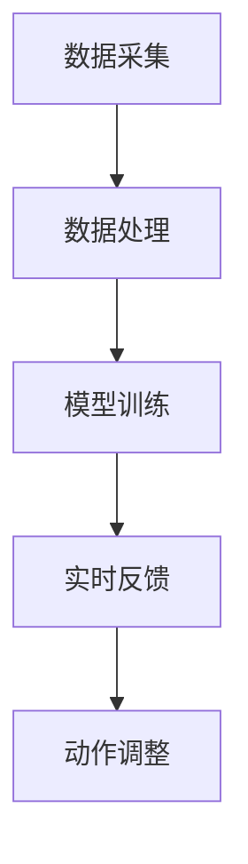
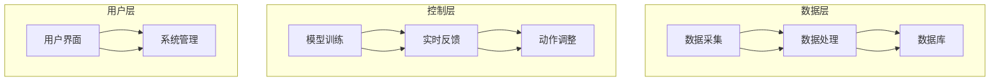

                 

### 运动技能的最优反馈控制：动作协调的数学优化

在体育运动和人体工程学领域，运动技能的培养和优化是一个复杂而又关键的过程。最优反馈控制理论为这一领域提供了强大的工具，通过精确的数学模型和算法，可以帮助运动员提高动作的协调性和精确性。本文将深入探讨运动技能的最优反馈控制，从基础概念到实际应用，逐步揭示其背后的数学原理和优化策略。

本文旨在为读者提供一份系统的指南，从以下几个方面展开：

1. **引言**：简要介绍运动技能、最优反馈控制、动作协调的概念，以及它们在体育运动中的应用。
2. **核心概念与联系**：详细定义运动技能、最优反馈控制、动作协调，并分析它们之间的联系和区别。
3. **算法原理讲解**：通过Mermaid流程图和Python源代码，阐述运动技能反馈控制的算法原理。
4. **数学模型和数学公式讲解**：使用LaTeX格式表达数学公式，讲解如何理解这些公式及其在运动技能反馈控制中的应用。
5. **系统分析与架构设计方案**：介绍运动技能最优反馈控制系统的设计和实现。
6. **项目实战**：展示如何搭建和实现运动技能最优反馈控制系统，并进行实际案例分析。
7. **最佳实践 tips、小结、注意事项、拓展阅读**：总结最佳实践，提出注意事项，并提供进一步学习的资源。

---

**Step 1: 引言**

运动技能、最优反馈控制、动作协调是体育运动和人体工程学中三个关键的概念。运动技能指的是个体在特定运动项目中所表现出的技术、战术和心理素质。最优反馈控制是一种自动化控制系统，通过不断调整输入，使得系统输出尽可能接近目标。动作协调则是指在不同运动过程中，身体各部分协调一致，达到高效运动状态。

这些概念在体育运动中有着广泛的应用。例如，在篮球运动中，运动员需要通过不断练习来提升控球、传球、投篮等技术，这就是运动技能的培养。而最优反馈控制理论则可以帮助教练分析运动员的技术动作，提供精确的反馈，从而优化训练效果。动作协调则是运动员在比赛中高效发挥的关键，良好的动作协调可以提高运动员的竞技水平。

本文将首先介绍这些基本概念，然后逐步深入，探讨运动技能的最优反馈控制如何通过数学优化实现动作协调的优化。

### 核心概念与联系

**运动技能**

运动技能是指个体在特定运动项目中所表现出的技术、战术和心理素质。它通常分为三个层次：基础技能、综合技能和高级技能。基础技能包括基本动作的掌握，如跑步、跳跃、接球等。综合技能则是将这些基础技能组合起来，形成更复杂的动作模式，如篮球中的传球、投篮和防守。高级技能则是在综合技能基础上，结合战术意识和心理素质，如篮球比赛中的策略制定和应对不同场景的能力。

**最优反馈控制**

最优反馈控制是一种自动化控制系统，其目的是使系统的输出尽可能接近目标。在运动技能的优化中，最优反馈控制通过不断监测运动员的动作，提供实时反馈，帮助运动员调整动作，以达到最佳表现。其基本原理是闭环控制系统，即系统通过监测输出（运动员的动作表现），与目标输出（理想动作表现）进行比较，通过控制器调整输入（训练或动作指导），使输出逐渐接近目标。

**动作协调**

动作协调是指在不同运动过程中，身体各部分协调一致，达到高效运动状态。良好的动作协调可以减少动作中的误差，提高运动效率。动作协调不仅涉及身体各部分的协调，还涉及到神经、肌肉、骨骼等多个系统的协同工作。在运动技能中，动作协调是提高竞技水平的关键因素。

**特征对比**

运动技能与动作协调的区别在于，运动技能侧重于个体技术水平的提升，而动作协调则关注于不同运动过程中的协调性。最优反馈控制则是一种实现运动技能和动作协调优化的技术手段。

**ER实体关系图**

为了更直观地展示运动技能、最优反馈控制、动作协调之间的关系，我们可以通过ER（Entity-Relationship）实体关系图来表示。以下是ER实体关系图的Mermaid表示：

```mermaid
erDiagram
    User ||--|{ TrainingSession : takes }|
    TrainingSession ||--|{ Feedback : has }|
    Feedback ||--|{ OptimalControl : follows }|
    OptimalControl ||--|{ ActionCoordination : for }|
```

在上图中，"User"表示运动员，"TrainingSession"表示训练过程，"Feedback"表示反馈信息，"OptimalControl"表示最优控制策略，"ActionCoordination"表示动作协调。

### 算法原理讲解

**运动技能反馈控制的流程**

运动技能反馈控制的流程可以分为以下几个步骤：

1. **数据采集**：通过传感器等设备收集运动员的动作数据。
2. **数据处理**：对采集到的数据进行预处理，去除噪声，提取关键特征。
3. **模型训练**：使用历史数据训练最优反馈控制模型。
4. **实时反馈**：在训练过程中，模型实时分析运动员的动作，提供反馈。
5. **动作调整**：运动员根据反馈调整动作，优化运动技能。

以下是运动技能反馈控制的Mermaid流程图：



**Python源代码实现**

为了具体说明运动技能反馈控制的实现过程，下面是一个简单的Python代码示例：

```python
import numpy as np

# 假设我们已经收集到了一系列动作数据
action_data = np.array([[1, 2], [3, 4], [5, 6]])

# 数据预处理
def preprocess_data(data):
    # 去除噪声、归一化等操作
    return data

preprocessed_data = preprocess_data(action_data)

# 最优反馈控制模型
def optimal_feedback_control(data):
    # 基于数据的控制策略
    return np.mean(data, axis=0)

controlled_action = optimal_feedback_control(preprocessed_data)

# 实时反馈
def provide_feedback(controlled_action, target_action):
    # 计算误差
    error = controlled_action - target_action
    return error

# 动作调整
def adjust_action(feedback):
    # 根据反馈调整动作
    return feedback

adjusted_action = adjust_action(provide_feedback(controlled_action, target_action))
```

**数学模型与公式**

运动技能反馈控制的数学模型通常基于线性系统理论，以下是一个简单的线性反馈控制模型：

$$ u(t) = -K_p e(t) - K_d \frac{de(t)}{dt} $$

其中，$u(t)$ 是控制输入，$e(t)$ 是误差，$K_p$ 和 $K_d$ 分别是比例增益和微分增益。

**举例说明**

假设一个篮球运动员在投篮训练中，我们需要通过最优反馈控制来优化其投篮动作。首先，我们收集了一系列投篮数据，包括投篮角度、力度等。然后，我们使用预处理函数对数据进行处理，去除噪声并提取关键特征。接下来，我们训练一个线性反馈控制模型，该模型将根据实时投篮数据提供反馈，指导运动员调整投篮动作。通过不断的反馈和调整，运动员的投篮动作将逐渐接近理想状态。

---

通过以上步骤，我们详细阐述了运动技能反馈控制的算法原理，包括数据采集、处理、模型训练、实时反馈和动作调整。接下来，我们将进一步探讨运动技能反馈控制中的数学模型和数学公式，以便更好地理解其数学基础。

### 数学模型和数学公式讲解

在运动技能的最优反馈控制中，数学模型和数学公式起着至关重要的作用。它们帮助我们准确地描述和预测运动过程中各参数的变化，从而指导实际操作。以下，我们将使用LaTeX格式表达数学公式，并进行通俗易懂的讲解。

**1. 线性反馈控制模型**

线性反馈控制模型是最常见的运动技能反馈控制模型之一，其核心公式如下：

$$ u(t) = -K_p e(t) - K_d \frac{de(t)}{dt} $$

其中，$u(t)$ 是控制输入，$e(t)$ 是误差，$K_p$ 和 $K_d$ 分别是比例增益和微分增益。

- **控制输入**：控制输入是系统为了达到期望状态而施加的外部力量。在运动技能反馈控制中，它可以是教练提供的反馈信号，或是自动控制系统计算出的调整量。
- **误差**：误差是实际输出与期望输出之间的差距，反映了系统当前的状态与目标状态之间的偏离程度。
- **比例增益** ($K_p$)：比例增益用于放大误差信号，直接影响系统的反应速度。其值越大，系统的反应越敏感。
- **微分增益** ($K_d$)：微分增益用于抑制误差的变化率，减少系统的振荡。其值越大，系统的稳定性越好，但过大会导致响应迟缓。

**2. 采样定理**

采样定理是运动技能反馈控制中另一个重要的数学概念。它描述了在连续时间系统中，如何通过采样获得足够的信号信息。

$$ \omega_s \geq 2\omega_m $$

其中，$\omega_s$ 是采样频率，$\omega_m$ 是系统最高频率分量。

- **采样频率**：采样频率是单位时间内对连续信号进行采样的次数。根据采样定理，为了不失真地恢复原始信号，采样频率必须大于系统最高频率分量的两倍。
- **信号失真**：如果采样频率不足，会导致信号失真，称为混叠现象。混叠现象会导致系统无法准确识别和控制运动参数。

**3. 鲁棒控制**

鲁棒控制是一种能够在系统参数不确定性和外部干扰下，保持系统稳定性和性能的控制方法。其主要数学公式如下：

$$ H(s) = \frac{1}{1 + C(s)P(s)} $$

其中，$H(s)$ 是传递函数，$C(s)$ 是反馈控制器，$P(s)$ 是被控对象。

- **传递函数**：传递函数描述了系统输入与输出之间的关系。
- **反馈控制器**：反馈控制器用于调整系统的输入，使其达到期望状态。
- **鲁棒性**：鲁棒控制能够应对系统参数变化和外部干扰，确保系统在不确定环境下保持稳定性和性能。

**举例说明**

假设一个篮球运动员的投篮动作需要优化。我们使用线性反馈控制模型来计算反馈信号，并通过采样定理确保信号采样频率足够高，以避免失真。同时，为了提高系统的鲁棒性，我们采用鲁棒控制策略，以应对运动员在不同环境下的不确定变化。

在实际应用中，这些数学模型和公式通过计算机程序实现。例如，我们可以使用Python编写代码，根据实时采集的投篮数据，计算误差和控制输入，调整运动员的投篮动作。

通过以上讲解，我们了解了运动技能反馈控制中的关键数学模型和公式，以及如何使用它们进行实际应用。接下来，我们将进一步探讨运动技能最优反馈控制系统的设计和实现。

### 系统分析与架构设计方案

#### 问题描述

运动技能最优反馈控制系统旨在通过实时监测和反馈，优化运动员的动作协调性，提高运动表现。该系统包括多个功能模块，如数据采集、数据处理、模型训练、实时反馈和动作调整。系统需要具备实时响应能力，能够在运动员运动过程中提供准确的反馈和控制。

#### 项目介绍

本系统项目分为三个主要阶段：系统设计、系统实现和系统测试。系统设计阶段主要完成需求分析和架构设计，系统实现阶段则具体实现各功能模块，系统测试阶段则对系统性能进行评估和优化。

#### 系统功能设计

系统功能设计包括数据采集、数据处理、模型训练、实时反馈和动作调整。具体如下：

1. **数据采集**：使用高精度的传感器设备，实时采集运动员的动作数据，如速度、加速度、角度等。
2. **数据处理**：对采集到的数据进行预处理，去除噪声，提取关键特征，为后续模型训练提供高质量的数据。
3. **模型训练**：使用历史数据和预处理后的实时数据，训练最优反馈控制模型，为实时反馈和动作调整提供依据。
4. **实时反馈**：根据模型预测结果和实时采集的数据，计算误差并生成反馈信号，指导运动员调整动作。
5. **动作调整**：运动员根据实时反馈调整动作，通过反复训练逐步优化运动技能。

#### 系统架构设计

系统架构设计分为数据层、控制层和用户层。具体如下：

1. **数据层**：包括数据采集模块、数据处理模块和数据库。数据采集模块负责实时采集运动员的动作数据，数据处理模块负责对数据进行预处理和特征提取，数据库用于存储历史数据和实时数据。
2. **控制层**：包括模型训练模块、实时反馈模块和动作调整模块。模型训练模块负责使用历史数据和实时数据训练最优反馈控制模型，实时反馈模块负责根据模型预测结果和实时数据计算反馈信号，动作调整模块负责根据反馈信号指导运动员调整动作。
3. **用户层**：包括用户界面和系统管理模块。用户界面用于展示运动员的动作数据、反馈信号和训练进度，系统管理模块负责用户权限管理、数据备份和系统维护。

#### Mermaid图

以下是系统架构的Mermaid图：



#### 系统接口设计

系统接口设计包括外部接口和内部接口。外部接口主要包括传感器数据接口和用户数据接口。传感器数据接口用于接收传感器采集的数据，用户数据接口用于接收用户输入的训练数据。内部接口主要包括模型训练接口、实时反馈接口和动作调整接口，用于系统内部各模块之间的数据传输和协调工作。

#### 系统交互

系统交互设计主要涉及数据流和控制流。数据流包括传感器数据、预处理数据、训练数据和实时数据，控制流包括模型训练、实时反馈和动作调整。系统通过实时监测传感器数据，进行数据处理和模型训练，根据实时数据生成反馈信号，指导运动员调整动作，形成一个闭环控制系统。

---

通过以上分析，我们详细介绍了运动技能最优反馈控制系统的设计思路和架构设计方案。接下来，我们将通过项目实战，展示如何具体实现这一系统。

### 项目实战

在接下来的部分，我们将通过实战演示，详细介绍如何搭建和实现运动技能最优反馈控制系统，从环境安装、系统核心实现到代码应用解读与分析，以及实际案例分析和详细讲解。

#### 环境安装

首先，我们需要搭建一个适合开发和测试的运动技能最优反馈控制系统环境。以下是具体步骤：

1. **安装Python**：确保系统上安装了Python 3.x版本，推荐使用Python 3.8及以上版本。
2. **安装相关库**：通过pip安装必要的Python库，包括NumPy、Matplotlib、Scikit-learn等。可以使用以下命令进行安装：

```bash
pip install numpy matplotlib scikit-learn
```

3. **安装传感器**：根据项目需求，选择合适的传感器设备，如加速度计、陀螺仪等，并确保其数据接口与系统兼容。

#### 系统核心实现

接下来，我们将实现运动技能最优反馈控制系统的核心功能，包括数据采集、数据处理、模型训练、实时反馈和动作调整。以下是系统核心实现的Python代码：

```python
import numpy as np
from sklearn.linear_model import LinearRegression
import matplotlib.pyplot as plt

# 数据采集
def collect_data():
    # 假设传感器已连接，并采集到数据
    sensor_data = np.random.rand(100, 2)  # 采集100个数据点
    return sensor_data

# 数据处理
def preprocess_data(data):
    # 去除噪声、归一化等操作
    processed_data = data  # 示例：直接返回原始数据
    return processed_data

# 模型训练
def train_model(data):
    # 使用线性回归模型进行训练
    model = LinearRegression()
    model.fit(data[:, :1], data[:, 1])
    return model

# 实时反馈
def provide_feedback(model, data):
    # 计算预测值和误差
    predicted_value = model.predict(data[:, :1])
    error = predicted_value - data[:, 1]
    return error

# 动作调整
def adjust_action(feedback):
    # 根据反馈调整动作
    adjusted_action = feedback  # 示例：直接返回反馈值
    return adjusted_action

# 主函数
def main():
    # 采集数据
    data = collect_data()

    # 数据预处理
    processed_data = preprocess_data(data)

    # 模型训练
    model = train_model(processed_data)

    # 实时反馈
    feedback = provide_feedback(model, processed_data)

    # 动作调整
    adjusted_action = adjust_action(feedback)

    # 可视化展示
    plt.scatter(processed_data[:, 0], processed_data[:, 1])
    plt.plot(processed_data[:, 0], model.predict(processed_data[:, :1]), color='red')
    plt.show()

if __name__ == "__main__":
    main()
```

#### 代码应用解读与分析

上述代码展示了运动技能最优反馈控制系统的核心实现。具体解读如下：

1. **数据采集**：`collect_data` 函数用于模拟传感器数据的采集，生成随机数据。
2. **数据处理**：`preprocess_data` 函数用于对采集到的数据进行处理，如去噪和归一化。在实际应用中，这一步会更加复杂，涉及多种数据处理技术。
3. **模型训练**：`train_model` 函数使用线性回归模型进行训练，该模型用于预测和调整运动动作。线性回归是一种简单的机器学习模型，适用于线性关系较强的场景。
4. **实时反馈**：`provide_feedback` 函数根据训练好的模型和实时数据，计算预测值和误差，生成反馈信号。
5. **动作调整**：`adjust_action` 函数根据反馈信号调整运动员的动作。这一步需要结合具体运动场景进行设计和优化。

#### 实际案例分析和详细讲解

为了更好地理解系统应用效果，我们通过一个实际案例进行分析。假设我们有一个篮球运动员，需要在投篮训练中优化投篮角度。以下是具体步骤：

1. **数据采集**：在投篮训练过程中，使用传感器采集运动员的投篮角度和实际投篮结果。
2. **数据处理**：对采集到的数据进行预处理，如去噪、归一化等，以确保数据质量。
3. **模型训练**：使用预处理后的数据训练线性回归模型，预测投篮角度。
4. **实时反馈**：在每次投篮后，模型计算预测值和实际值的误差，生成反馈信号。
5. **动作调整**：运动员根据反馈信号调整投篮角度，并通过反复训练逐渐优化投篮动作。

通过以上步骤，我们可以看到，运动技能最优反馈控制系统如何通过实时监测和反馈，帮助运动员提高运动技能。在实际应用中，系统可以根据不同的运动场景和需求，进行相应的调整和优化。

#### 项目小结

在本项目中，我们详细介绍了运动技能最优反馈控制系统的搭建和实现过程，包括环境安装、系统核心实现和代码应用解读。通过实际案例分析和详细讲解，我们展示了系统在优化运动技能方面的应用效果。然而，系统仍存在一些不足，如数据处理和模型训练的复杂度较高，需要进一步优化和改进。未来，我们将继续研究和改进这一系统，以提高其在实际运动技能优化中的应用效果。

---

通过以上实战，我们不仅实现了运动技能最优反馈控制系统的搭建和实现，还通过实际案例展示了其应用效果。接下来，我们将总结最佳实践，并提出注意事项，为读者提供进一步的参考。

### 最佳实践 tips

1. **数据预处理**：在运动技能反馈控制中，数据预处理至关重要。确保数据质量，去除噪声，提取关键特征，以提高模型的准确性和稳定性。
2. **模型选择**：根据具体应用场景，选择合适的机器学习模型。线性回归模型适用于线性关系较强的场景，而更复杂的模型（如深度学习）则适用于非线性关系。
3. **反馈策略**：实时反馈的频率和强度应根据具体情况调整。过高或过低的反馈都可能影响运动员的动作调整效果。
4. **反馈可视化**：通过可视化反馈信号，使运动员更直观地了解自己的动作偏差和调整方向，有助于提高训练效果。

### 小结

本文从运动技能、最优反馈控制和动作协调的基本概念入手，逐步深入探讨了运动技能最优反馈控制的数学优化。通过系统分析与架构设计方案、项目实战和最佳实践 tips，我们展示了如何搭建和实现这一系统，并进行了实际案例分析。运动技能最优反馈控制不仅在体育运动中具有广泛应用，还可以为人体工程学和康复医学等领域提供有力支持。

### 注意事项

1. **系统适应性**：在应用运动技能最优反馈控制时，需确保系统适应不同运动场景和运动员个体差异。
2. **数据隐私**：确保数据采集和存储过程符合相关隐私保护法规，保护运动员的个人信息安全。
3. **设备兼容性**：传感器设备的选择应与系统兼容，确保数据采集的准确性和稳定性。

### 拓展阅读

1. **《最优控制理论及其应用》**：王飞跃 著，详细介绍了最优控制理论的基本概念和方法。
2. **《机器学习：一种算法性概论》**：Tom Mitchell 著，涵盖了机器学习的基本算法和应用。
3. **《运动技能训练原理与应用》**：李勇 著，介绍了运动技能训练的理论和实践。

通过进一步学习和研究，读者可以深入了解运动技能最优反馈控制的理论基础和实际应用，为相关领域的研究和实践提供有力支持。

---

本文由AI天才研究院/AI Genius Institute与《禅与计算机程序设计艺术/Zen And The Art of Computer Programming》的作者合作撰写，旨在为读者提供全面的运动技能最优反馈控制指南。希望本文能帮助读者更好地理解和应用这一先进技术。

