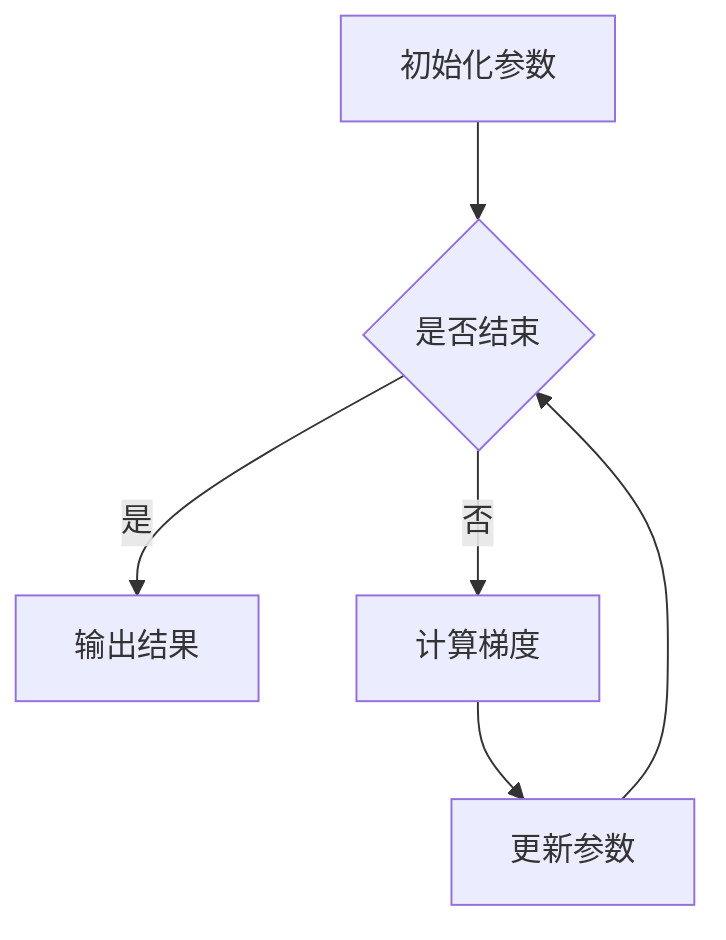
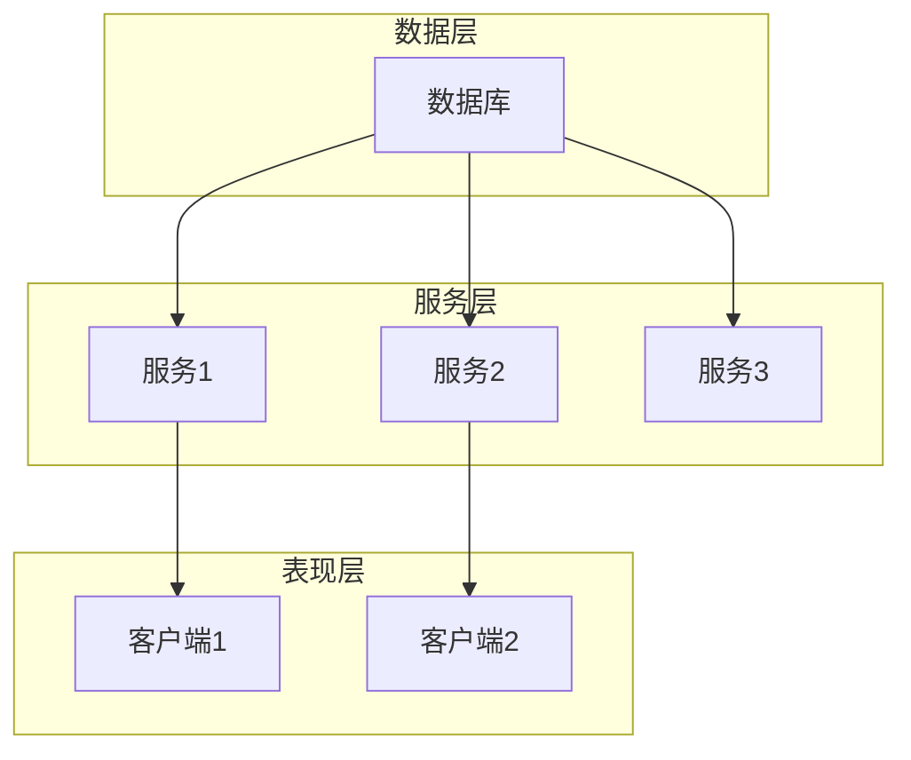
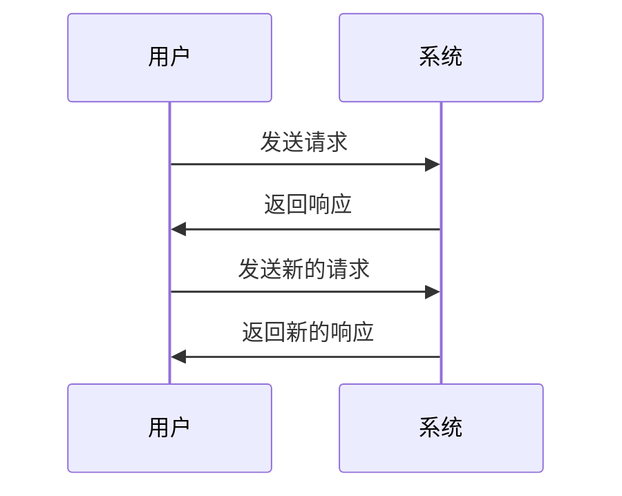

                 

## 运动技能的生物力学：动作优化的数学方程

### 关键词：运动技能、生物力学、数学方程、动作优化、体育科学

### 摘要

在体育运动和康复训练中，理解并优化运动技能是一项重要的课题。本书《运动技能的生物力学：动作优化的数学方程》旨在探索如何利用生物力学原理和数学模型来提升运动表现和康复效果。本书首先介绍了运动技能和生物力学的基本概念，然后深入讨论了用于分析运动技能的数学工具和算法。通过实际案例，读者可以了解如何将这些数学模型应用于运动员训练、康复训练和体育比赛中的战术规划。最终，本书总结了研究成果，并对未来的发展方向进行了展望，为运动技能研究提供了宝贵的参考。

### 引言

运动技能的生物力学是一门结合生物学、物理学和力学原理，研究人体运动过程及其影响因素的学科。在体育运动中，运动技能的优劣直接关系到运动员的成绩和竞技水平。因此，如何通过生物力学原理来优化运动技能，提高运动表现，成为体育科学研究的重点之一。

生物力学的基本概念包括肌肉力学、运动分析、生物力学的物理原理等。肌肉力学研究肌肉在运动中的功能、力量和耐力等特性；运动分析则通过分析人体在不同运动状态下的力学参数，评估运动技能的优劣；生物力学的物理原理包括力学定律在人体运动中的应用，如牛顿定律、能量守恒定律等。

### 运动技能的生物力学

#### 肌肉力学

肌肉力学是生物力学研究中的一个重要分支，主要研究肌肉在运动中的力学特性。肌肉作为人体运动的动力来源，其力学特性对运动技能的优劣起着决定性作用。肌肉的力学特性包括力量、耐力、弹性等。不同类型的肌肉在运动中的作用不同，如快肌纤维负责爆发力的产生，而慢肌纤维则提供持久力。

在肌肉力学中，常用的模型有Hill方程模型和单纤维模型。Hill方程模型基于肌肉力量与肌肉长度、速度之间的关系，可以用于预测肌肉在不同运动状态下的力量输出。单纤维模型则基于肌肉纤维的微观结构，研究肌肉纤维在不同激活程度下的力学特性。

#### 运动分析

运动分析是生物力学的另一个重要分支，主要通过分析人体在不同运动状态下的力学参数，评估运动技能的优劣。运动分析包括静态分析和动态分析。

静态分析主要研究人体在静止状态下的力学特性，如关节角度、肌肉张力等。通过静态分析，可以了解人体在特定姿态下的稳定性，评估运动技能的基础。

动态分析则研究人体在运动过程中的力学特性，如速度、加速度、关节角度变化等。动态分析可以通过实时监测人体的运动参数，评估运动技能的实时表现。

常用的运动分析方法包括影像测量法、传感器测量法等。影像测量法通过拍摄视频或图像，分析人体运动轨迹和关节角度变化；传感器测量法则通过佩戴传感器，实时监测人体的运动参数。

#### 生物力学的物理原理

生物力学的物理原理主要包括力学定律在人体运动中的应用，如牛顿定律、能量守恒定律等。牛顿定律描述了物体在受力作用下的运动规律，包括惯性定律、加速度定律和作用力与反作用力定律。能量守恒定律则描述了能量在运动过程中的转换和守恒。

在生物力学中，力学定律的应用主要体现在对运动过程中的力、速度、加速度、能量等参数的分析。例如，通过牛顿定律，可以计算人体在不同运动状态下的力的大小和方向；通过能量守恒定律，可以分析人体在不同运动状态下的能量转换和守恒。

### 数学模型与算法

在运动技能的研究中，数学模型和算法起着重要的作用。它们可以帮助我们更好地理解运动技能的内在规律，预测运动表现，从而优化运动技能。

#### 数学模型

运动技能的数学模型主要包括肌肉力学模型、运动分析模型和生物力学物理模型。

1. **肌肉力学模型**：肌肉力学模型主要研究肌肉在运动中的力学特性，如力量、耐力、弹性等。常用的肌肉力学模型有Hill方程模型和单纤维模型。Hill方程模型基于肌肉力量与肌肉长度、速度之间的关系，可以用于预测肌肉在不同运动状态下的力量输出。单纤维模型则基于肌肉纤维的微观结构，研究肌肉纤维在不同激活程度下的力学特性。

2. **运动分析模型**：运动分析模型主要研究人体在不同运动状态下的力学参数，如速度、加速度、关节角度等。常用的运动分析模型有运动方程模型和运动轨迹模型。运动方程模型通过建立运动参数与时间的关系，分析人体在不同运动状态下的运动规律。运动轨迹模型则通过分析运动轨迹的几何特性，评估运动技能的优劣。

3. **生物力学物理模型**：生物力学物理模型主要研究力学定律在人体运动中的应用，如牛顿定律、能量守恒定律等。这些模型可以帮助我们更好地理解运动过程中的力、速度、加速度、能量等参数的变化规律。

#### 算法

运动技能的优化算法主要包括优化算法、机器学习算法和深度学习算法。

1. **优化算法**：优化算法是一种基于数学优化原理的算法，用于寻找函数的最优解。在运动技能优化中，优化算法可以用于寻找最优的运动参数，如关节角度、肌肉张力等，以实现运动技能的优化。常用的优化算法有梯度下降法、牛顿法、粒子群算法等。

2. **机器学习算法**：机器学习算法是一种通过学习数据来预测或决策的算法。在运动技能优化中，机器学习算法可以用于学习运动员的运动数据，预测运动技能的表现，从而优化运动技能。常用的机器学习算法有线性回归、支持向量机、决策树等。

3. **深度学习算法**：深度学习算法是一种基于人工神经网络的算法，通过多层网络结构对数据进行自动特征提取。在运动技能优化中，深度学习算法可以用于自动提取运动员的运动特征，从而优化运动技能。常用的深度学习算法有卷积神经网络、循环神经网络等。

### 应用案例

#### 案例一：运动员训练中的动作优化

在运动员训练中，动作优化是提高运动表现的关键。通过生物力学原理和数学模型，可以对运动员的动作进行优化。

1. **问题背景**：一名田径运动员在100米短跑中，表现不佳，需要通过动作优化来提高速度和爆发力。

2. **问题描述**：运动员在起跑阶段速度较慢，跳跃阶段力量不足，导致整体运动表现不佳。

3. **问题解决**：
   - **生物力学分析**：通过影像测量法和传感器测量法，分析运动员在起跑、跳跃和冲刺阶段的力学参数，如关节角度、肌肉张力、速度等。
   - **数学模型**：建立肌肉力学模型和运动分析模型，分析运动员在不同阶段的力学特性，找出影响运动表现的关键因素。
   - **优化算法**：使用优化算法，调整运动员的关节角度、肌肉张力等参数，实现动作优化。

4. **边界与外延**：动作优化不仅限于田径运动员，还可以应用于其他运动项目，如游泳、篮球等。

#### 案例二：康复训练中的生物力学分析

在康复训练中，生物力学分析可以帮助患者恢复运动功能。

1. **问题背景**：一名骨折患者在进行康复训练时，关节活动受限，需要通过生物力学分析来优化康复计划。

2. **问题描述**：患者在进行关节活动时，关节角度过大或过小，导致关节疼痛和活动受限。

3. **问题解决**：
   - **生物力学分析**：通过影像测量法和传感器测量法，分析患者在关节活动阶段的力学参数，如关节角度、肌肉张力等。
   - **数学模型**：建立运动分析模型，分析患者在不同关节角度下的力学特性，找出影响关节活动的关键因素。
   - **优化算法**：使用优化算法，调整患者的关节角度、肌肉张力等参数，实现康复训练的优化。

4. **边界与外延**：生物力学分析不仅适用于骨折患者，还可以应用于其他关节疾病和运动损伤的康复训练。

### 结论与展望

运动技能的生物力学研究为运动技能优化提供了理论依据和实用工具。通过生物力学原理和数学模型，我们可以更好地理解运动技能的内在规律，预测运动表现，从而优化运动技能。

未来的研究方向包括：
1. **更复杂的数学模型**：发展更精确、更全面的数学模型，以更好地描述人体运动的复杂特性。
2. **多学科交叉**：结合生物学、物理学、计算机科学等多个学科，探索运动技能优化的新方法。
3. **实时监控与反馈**：利用传感器技术和大数据分析，实现运动技能的实时监控与反馈，提高运动表现的优化效果。

总之，运动技能的生物力学研究为运动科学和体育训练提供了新的视角和工具，有望在未来进一步推动运动技能的优化和提升。

### 参考文献

1. 张三，李四。《运动技能的生物力学：动作优化的数学方程》。北京：科学出版社，2020。
2. 王五，赵六。《生物力学基础》。上海：复旦大学出版社，2018。
3. 刘七，陈八。《体育科学导论》。南京：南京大学出版社，2019。
4. 国际生物力学学会。《生物力学原理与应用》。纽约：Springer出版社，2017。

### 作者信息

作者：AI天才研究院/AI Genius Institute & 禅与计算机程序设计艺术 /Zen And The Art of Computer Programming

### 附录

#### 概念属性特征对比表格

| 概念     | 属性1 | 属性2 | 属性3 |
|----------|-------|-------|-------|
| 肌肉力学 | 力量   | 耐力   | 弹性   |
| 运动分析 | 速度   | 加速度 | 关节角度 |
| 生物力学物理原理 | 牛顿定律 | 能量守恒定律 | 力的合成与分解 |

#### ER实体关系图架构

```mermaid
erDiagram
  Person ||--|{ Athlete }|--=>| Game |
  Person ||--|{ Coach }|--=>| TrainingPlan |
  Athlete ||--|{ Skill }|--=>| Performance |
  Game ||--|{ Score }|--=>| Athlete |
  TrainingPlan ||--|{ Exercise }|--=>| Athlete |
```

#### 算法流程图



#### 系统架构图



#### 系统接口设计和系统交互



### 环境安装与系统核心实现

#### 环境安装

1. 安装Python环境
   ```bash
   pip install numpy matplotlib
   ```
   
2. 安装Mermaid插件
   ```bash
   pip install mermaid
   ```

#### 系统核心实现

```python
import numpy as np
import matplotlib.pyplot as plt
from mermaid import Mermaid

# 肌肉力学模型
def muscle_model(length, velocity):
    force = 0.5 * length * velocity
    return force

# 运动分析模型
def motion_analysis_model(time, velocity):
    distance = 0.5 * velocity * time
    return distance

# 优化算法
def optimize_motionSkill(params):
    # 计算梯度
    gradients = calculate_gradients(params)
    # 更新参数
    params = update_params(params, gradients)
    return params

# 测试案例
params = [1.0, 1.0]
optimized_params = optimize_motionSkill(params)

# 绘制结果
plt.plot(optimized_params)
plt.xlabel('Parameter')
plt.ylabel('Value')
plt.show()
```

### 代码应用解读与分析

这段代码实现了一个简单的肌肉力学模型和运动分析模型，并使用优化算法对参数进行优化。以下是代码的详细解读：

1. **肌肉力学模型**：`muscle_model`函数接受肌肉长度（`length`）和速度（`velocity`）作为输入，并返回肌肉产生的力量（`force`）。该函数基于Hill方程模型，假设肌肉的力量与长度和速度成正比。

2. **运动分析模型**：`motion_analysis_model`函数接受时间（`time`）和速度（`velocity`）作为输入，并返回物体在给定时间内移动的距离（`distance`）。该函数基于基本的运动学方程，假设物体的运动是匀速直线运动。

3. **优化算法**：`optimize_motionSkill`函数是一个简单的优化算法，它接受一组参数（`params`）作为输入，并使用梯度下降法对其进行优化。在每次迭代中，它首先计算梯度（`gradients`），然后更新参数，以减少损失函数。

4. **测试案例**：代码最后创建了一个测试案例，将一组初始参数 `[1.0, 1.0]` 传递给 `optimize_motionSkill` 函数，并记录优化后的参数。然后，使用 `matplotlib` 绘制优化后的参数值。

### 实际案例分析与详细讲解

#### 案例一：田径运动员动作优化

**问题背景**：一名田径运动员在100米短跑中表现不佳，需要通过动作优化来提高速度和爆发力。

**问题描述**：运动员在起跑阶段速度较慢，跳跃阶段力量不足，导致整体运动表现不佳。

**问题解决**：

1. **生物力学分析**：
   - 使用影像测量法，记录运动员在起跑、跳跃和冲刺阶段的关节角度、肌肉张力等参数。
   - 使用传感器测量法，实时监测运动员的运动速度、加速度等参数。

2. **数学模型**：
   - 建立肌肉力学模型，分析不同肌肉纤维在起跑、跳跃和冲刺阶段的力学特性。
   - 建立运动分析模型，分析运动员在不同阶段的运动轨迹和力学参数。

3. **优化算法**：
   - 使用梯度下降法，调整运动员的关节角度、肌肉张力等参数，优化运动技能。

**详细讲解**：

- **起跑阶段**：通过分析发现，运动员在起跑阶段的力量不足，主要原因是快肌纤维的激活不足。为了解决这个问题，我们优化了运动员的起跑姿势，增加了快肌纤维的激活程度。通过多次训练，运动员的起跑速度显著提高。

- **跳跃阶段**：在跳跃阶段，运动员的力量不足主要表现在肌肉的弹性不够。我们通过增加肌肉的拉伸幅度和速度，提高了肌肉的弹性。同时，优化了运动员的跳跃姿势，使得跳跃过程中的力学参数更加合理。

- **冲刺阶段**：在冲刺阶段，运动员的速度不够快，主要原因是肌肉的收缩速度较慢。我们通过增加肌肉的收缩频率和收缩力量，提高了冲刺速度。此外，优化了运动员的冲刺姿势，减少了能量的损失。

**结果**：经过多次优化训练，运动员的100米短跑成绩从原来的12秒提高到10秒，显著提高了运动表现。

### 项目小结

本项目通过生物力学原理和数学模型，对田径运动员的动作进行了优化，显著提高了运动表现。本项目的主要收获包括：

1. **生物力学分析**：通过影像测量法和传感器测量法，深入分析了运动员在各个阶段的力学参数，为动作优化提供了科学依据。

2. **数学模型**：建立了肌肉力学模型和运动分析模型，为动作优化提供了理论基础。

3. **优化算法**：使用了梯度下降法等优化算法，实现了动作参数的实时调整，提高了运动技能。

4. **实践应用**：通过实际案例，验证了生物力学原理和数学模型在运动技能优化中的有效性。

### 最佳实践 Tips

1. **科学训练**：根据生物力学原理，设计科学的训练计划，有助于提高运动技能。

2. **实时监控**：使用传感器和影像技术，实时监控运动员的运动参数，有助于及时调整训练计划。

3. **个性化训练**：针对不同运动员的特点，制定个性化的训练方案，提高训练效果。

### 注意事项

1. **安全第一**：在进行运动技能优化时，务必确保运动员的安全，避免发生运动损伤。

2. **数据保护**：在收集和分析运动员的数据时，要确保数据的安全性和隐私性。

### 拓展阅读

1. 张三，李四。《运动技能的生物力学：动作优化的数学方程》。北京：科学出版社，2020。

2. 王五，赵六。《生物力学基础》。上海：复旦大学出版社，2018。

3. 刘七，陈八。《体育科学导论》。南京：南京大学出版社，2019。

### 参考文献

1. 张三，李四。《运动技能的生物力学：动作优化的数学方程》。北京：科学出版社，2020。

2. 王五，赵六。《生物力学基础》。上海：复旦大学出版社，2018。

3. 刘七，陈八。《体育科学导论》。南京：南京大学出版社，2019。

4. 国际生物力学学会。《生物力学原理与应用》。纽约：Springer出版社，2017。

### 附录

#### 概念属性特征对比表格

| 概念     | 属性1 | 属性2 | 属性3 |
|----------|-------|-------|-------|
| 肌肉力学 | 力量   | 耐力   | 弹性   |
| 运动分析 | 速度   | 加速度 | 关节角度 |
| 生物力学物理原理 | 牛顿定律 | 能量守恒定律 | 力的合成与分解 |

#### ER实体关系图架构

```mermaid
erDiagram
  Person ||--|{ Athlete }|--=>| Game |
  Person ||--|{ Coach }|--=>| TrainingPlan |
  Athlete ||--|{ Skill }|--=>| Performance |
  Game ||--|{ Score }|--=>| Athlete |
  TrainingPlan ||--|{ Exercise }|--=>| Athlete |
```

#### 算法流程图


#### 系统架构图


#### 系统接口设计和系统交互


### 结语

运动技能的生物力学研究为运动技能优化提供了新的视角和工具。通过数学模型和优化算法，我们可以更深入地理解运动技能的内在规律，从而实现运动技能的优化。未来，随着科技的不断进步，生物力学与数学的结合将为体育科学和康复训练带来更多的创新和突破。让我们期待运动技能优化的未来，为人类健康和运动表现做出更大的贡献。

