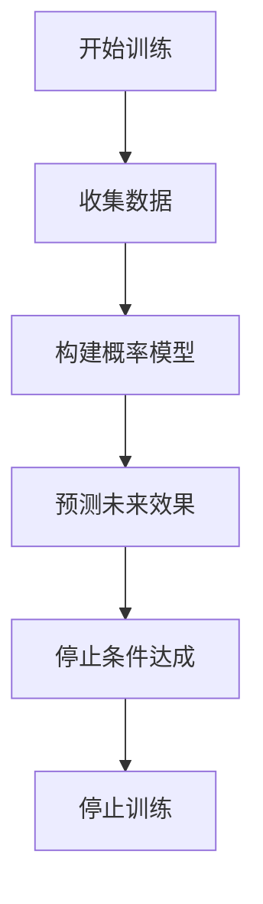
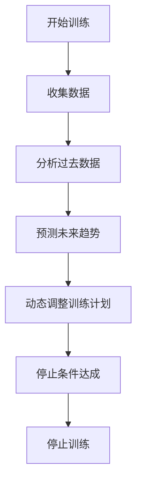
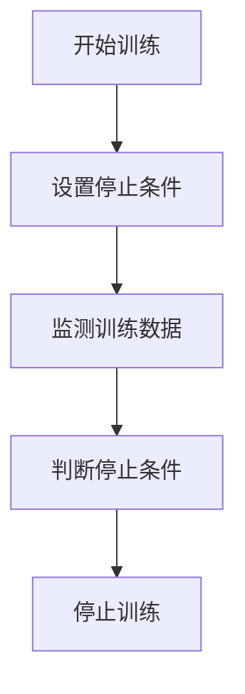

                 

### 运动训练的最优停止理论概述

#### 1.1 问题背景

运动训练在现代人的生活中扮演着越来越重要的角色，无论是为了保持健康、提高体能，还是为了参加竞技比赛，运动训练都是不可或缺的一部分。然而，如何科学、有效地进行运动训练，使体能得到最大程度的提升，同时避免过度训练和受伤，一直是运动科学和体育领域的研究重点。

最优停止理论（Optimal Stopping Theory）最早由美国数学家华尔德·布莱克（Wald and Blake）于20世纪50年代提出，主要研究在不确定条件下，如何在最优时刻做出停止决策的问题。这一理论不仅在金融数学、概率论、决策科学等领域有着广泛的应用，近年来也逐渐被引入到运动训练的研究中。

#### 1.2 问题提出

##### 什么是最优停止理论？

最优停止理论的核心问题是：在一系列随机事件中，如何在不确定性最高时做出最优的停止决策，以最大化期望收益或最小化风险。该理论通常被形式化为一个概率论问题，其目标是在一系列随机试验中，选择一个最佳的时刻停止，以获得最大的收益或最小化损失。

##### 如何将最优停止理论应用于运动训练？

将最优停止理论应用于运动训练，主要目的是找到训练的最优停止点，以确保训练效果最大化，同时避免过度训练带来的负面影响。具体来说，就是通过分析和评估训练过程中的各种指标（如心率、疲劳度、运动表现等），在合适的时机停止训练，从而达到最佳的体能提升效果。

##### 运动训练中的最优停止策略有哪些？

运动训练中的最优停止策略包括但不限于以下几种：

1. **概率停止策略**：基于训练过程中收集的数据，利用概率模型预测训练效果，并在特定概率阈值达到时停止训练。
2. **调和停止策略**：根据训练过程中的变化趋势和目标，动态调整停止的时机，以达到最优的训练效果。
3. **确定性停止策略**：在预设的条件下，如达到一定的心率、疲劳度阈值时，直接停止训练。

#### 1.3 最优停止理论的边界与外延

##### 最优停止理论的基本原理

最优停止理论的基本原理可以概括为以下几点：

1. **最大化期望收益或最小化风险**：在不确定性条件下，通过最优停止策略，使得期望收益最大化或风险最小化。
2. **概率决策**：基于概率论和统计学方法，对训练过程进行概率评估和决策。
3. **动态调整**：根据训练过程中的变化趋势和目标，动态调整停止策略。

##### 最优停止理论在运动训练中的适用范围

最优停止理论在运动训练中的适用范围非常广泛，包括：

1. **个人训练**：针对个人的训练目标和体能状况，制定最优的训练计划和停止策略。
2. **团队训练**：针对团队训练的整体表现，优化训练计划，提高团队的整体体能。
3. **竞技比赛**：在比赛前、中、后的训练中，通过最优停止理论，调整训练策略，提高比赛成绩。

##### 最优停止理论的挑战与机遇

##### 1. 挑战

1. **数据收集和处理**：运动训练中的数据种类繁多，如何准确、高效地收集和处理这些数据，是应用最优停止理论的重要挑战。
2. **个体差异**：每个人的体能和训练效果都有所不同，如何根据个体差异制定最优的停止策略，是一个复杂的问题。

##### 2. 机遇

1. **技术进步**：随着传感器技术和数据分析技术的进步，收集和处理运动训练数据变得更加容易，为最优停止理论的广泛应用提供了可能。
2. **人工智能**：人工智能技术的发展，尤其是机器学习和深度学习，为运动训练中的最优停止策略提供了新的解决方案。

#### 1.4 核心概念与联系

**核心概念表格：**

| 核心概念       | 说明                                                         |
| -------------- | ------------------------------------------------------------ |
| 最优停止理论   | 研究在不确定条件下，如何最优地做出停止决策的理论。           |
| 运动训练       | 通过特定的运动方式和强度，提高人体体能和运动表现的过程。     |
| 体能提升       | 通过运动训练，使人体达到更高的体能水平，从而提高运动表现。   |

**ER实体关系图架构：**

```mermaid
erDiagram
    运动训练 ||--|{ 最优停止理论 }|-- 良好的训练效果
    运动训练 ||--|{ 体能提升 }|-- 提高运动表现
    最优停止理论 ||--|{ 最佳决策 }|-- 最优训练效果
```

#### 1.5 本章小结

本章首先介绍了运动训练和最优停止理论的背景，提出了运动训练中的最优停止策略问题。接着，详细阐述了最优停止理论的基本原理、适用范围和挑战与机遇。通过核心概念表格和ER实体关系图，进一步明确了运动训练、最优停止理论和体能提升之间的联系。本章的内容为后续章节的深入探讨奠定了基础。

---

在接下来的章节中，我们将逐步深入探讨最优停止理论的基本原理，分析其在运动训练中的应用，并通过实际案例展示其效果。让我们继续深入思考，探索运动训练中的最优停止策略。

---

## 最优停止理论的基本原理

### 第2章: 最优停止理论的基本概念

#### 2.1 最优停止理论概述

最优停止理论（Optimal Stopping Theory）是一个源于概率论的数学理论，主要研究在不确定的随机过程中，如何做出最优的停止决策。该理论的核心问题是在一系列随机事件中，找到一个最佳的停止时刻，以最大化期望收益或最小化期望损失。最早由美国数学家华尔德·布莱克（Wald and Blake）于20世纪50年代提出，并在金融数学、决策科学等领域得到了广泛应用。

##### 发展历史

最优停止理论的起源可以追溯到20世纪50年代，当时数学家华尔德·布莱克在研究金融投资问题时，提出了最优停止策略的概念。随后，这一理论逐渐扩展到其他领域，如产品研发、医疗决策等。在运动训练领域，最优停止理论的应用则相对较新，但已经展现出巨大的潜力。

##### 基本原理

最优停止理论的基本原理可以概括为以下几点：

1. **最大化期望收益或最小化期望损失**：在一系列随机事件中，通过分析事件的概率分布和收益（或损失），找到一个最优的停止时刻，使得期望收益最大化或期望损失最小化。

2. **概率决策**：最优停止理论基于概率论和统计学方法，通过计算不同决策的概率分布和期望值，来确定最优的停止策略。

3. **动态调整**：最优停止策略并不是一成不变的，而是需要根据训练过程中的实际情况进行动态调整。这要求决策者能够及时获取和处理训练数据，根据变化趋势做出相应的调整。

#### 2.2 最优停止策略

最优停止策略是指根据最优停止理论，在随机过程中做出最优停止决策的具体方法。根据决策过程的不同，最优停止策略可以分为以下几种：

##### 1. 概率停止策略

概率停止策略是基于概率分布和期望值来做出停止决策的策略。具体来说，它首先分析当前随机过程的概率分布，计算出不同停止时刻的期望收益（或损失），然后选择期望收益最大的停止时刻。这种策略的优点是计算简单，适用于不确定性较低的场景。

##### 2. 调和停止策略

调和停止策略是一种动态调整的停止策略，它不仅考虑当前的概率分布，还考虑未来的概率分布。具体来说，它通过分析过去和当前的数据，预测未来的趋势，并在合适的时机做出停止决策。这种策略的优点是能够更好地适应训练过程中的变化，提高决策的准确性。

##### 3. 确定性停止策略

确定性停止策略是在特定条件下，如达到某个预设的目标或阈值时，直接做出停止决策的策略。这种策略的优点是计算简单，适用于目标明确、不确定性较低的场景。

#### 2.3 最优停止理论的应用领域

最优停止理论在多个领域都有着广泛的应用：

##### 1. 金融投资

在金融投资领域，最优停止理论被用于确定最佳的投资时机。投资者可以通过分析市场的概率分布和收益情况，找到最佳的投资停止点，以最大化收益或最小化损失。

##### 2. 产品研发

在产品研发过程中，最优停止理论可以用于确定最佳的产品发布时机。研发团队可以根据产品测试的数据，分析产品的性能和市场需求，找到最佳的产品发布点。

##### 3. 运动训练

在运动训练领域，最优停止理论被用于确定最佳的训练停止时机，以提高训练效果，同时避免过度训练和受伤。运动员可以通过分析训练过程中的数据，找到最佳的训练停止点，以实现最佳的训练效果。

#### 2.4 核心概念属性特征对比表格

为了更清晰地展示不同最优停止策略的特点，我们制作了以下对比表格：

| 策略类型     | 特点                                       | 适用场景                       |
| ------------ | ------------------------------------------ | ------------------------------ |
| 概率停止策略 | 基于概率分布和期望值，计算简单             | 不确定性较低，目标明确         |
| 调和停止策略 | 动态调整，考虑过去和当前数据，预测未来趋势 | 不确定性较高，需要灵活调整     |
| 确定性停止策略 | 在特定条件下直接做出停止决策           | 目标明确，不确定性较低         |

#### 2.5 本章小结

本章详细介绍了最优停止理论的基本概念，包括其发展历史、基本原理和不同类型的停止策略。通过对比表格，我们更清晰地了解了各种停止策略的特点和适用场景。本章的内容为后续章节进一步探讨最优停止理论在运动训练中的应用奠定了基础。

---

在下一章中，我们将深入分析运动训练中的最优停止策略，探讨其在体能提升中的应用及其效果。让我们继续深入思考，探索运动训练中的最优停止策略。

---

### 运动训练中的最优停止策略

#### 3.1 最优停止策略在运动训练中的应用

最优停止策略在运动训练中的应用旨在找到最佳的训练停止时刻，以最大化体能提升效果，同时避免过度训练和受伤的风险。具体来说，最优停止策略可以通过分析运动员在训练过程中的表现数据（如心率、疲劳度、运动表现等），在合适的时机停止训练，以达到最佳的训练效果。

##### 1. 概率停止策略

概率停止策略在运动训练中的应用主要是通过分析训练过程中收集的数据，构建一个概率模型，预测未来的训练效果。在某个时刻，如果预测的训练效果已经达到了预设的目标，就可以停止训练。这种策略的优点是计算简单，适用于不确定性较低的场景。例如，在马拉松训练中，运动员可以监测心率，当心率达到了预设的目标时，就可以停止训练。



##### 2. 调和停止策略

调和停止策略在运动训练中的应用更加灵活，它不仅考虑当前的数据，还考虑过去的数据，预测未来的趋势。这种策略适用于不确定性较高的场景。例如，在周期性训练中，运动员可以分析每周的训练表现，根据过去和当前的趋势，动态调整训练计划，并在合适的时机停止训练。



##### 3. 确定性停止策略

确定性停止策略在运动训练中的应用是在特定的条件下，如达到某个预设的目标或阈值时，直接停止训练。这种策略的优点是计算简单，适用于目标明确、不确定性较低的场景。例如，在力量训练中，当运动员的肌肉力量达到预设的目标时，就可以停止训练。



#### 3.2 运动训练对体能提升的影响

运动训练对体能提升的影响是多方面的，包括力量、耐力、速度、灵活性和协调性等。通过科学、合理的运动训练，运动员可以逐步提高这些体能指标，从而在比赛中取得更好的成绩。

##### 1. 力量训练

力量训练是通过增加肌肉质量和力量，提高运动员的运动表现。例如，举重、俯卧撑和深蹲等力量训练可以显著提高运动员的肌肉力量和耐力。

##### 2. 耐力训练

耐力训练是通过增加心肺功能和提高肌肉耐力，使运动员在长时间的运动中保持良好的状态。例如，长跑、游泳和骑自行车等有氧运动可以显著提高运动员的耐力。

##### 3. 速度训练

速度训练是通过提高肌肉的爆发力和神经反应速度，使运动员在短时间内发挥最大的力量。例如，短跑、跳跃和投掷等速度训练可以显著提高运动员的速度和反应能力。

##### 4. 灵活性训练

灵活性训练是通过增加关节的活动范围和肌肉的伸展性，提高运动员的灵活性和协调性。例如，瑜伽、舞蹈和平衡训练等灵活性训练可以显著提高运动员的身体灵活性和协调性。

#### 3.3 最优停止策略与体能提升的关系

最优停止策略在体能提升中的作用主要体现在以下几个方面：

1. **提高训练效果**：通过在合适的时机停止训练，可以确保训练效果最大化，避免过度训练导致的疲劳和受伤。

2. **优化训练计划**：最优停止策略可以帮助运动员和教练员更好地制定和调整训练计划，使训练更加科学、合理。

3. **提高运动表现**：通过最优停止策略，运动员可以在训练中获得最佳的体能提升效果，从而在比赛中取得更好的成绩。

#### 3.4 本章小结

本章详细探讨了最优停止策略在运动训练中的应用，包括概率停止策略、调和停止策略和确定性停止策略。通过这些策略，运动员可以在合适的时机停止训练，确保训练效果最大化。同时，本章也分析了运动训练对体能提升的影响，以及最优停止策略与体能提升之间的关系。这些内容为后续章节进一步探讨最优停止策略的实际应用提供了基础。

---

在下一章中，我们将通过具体案例分析，展示最优停止策略在运动训练中的实际效果。让我们继续深入思考，通过实际案例探索最优停止策略的应用。

---

### 运动训练的最优停止策略案例分析

#### 4.1 案例背景

在本章中，我们将通过两个具体的案例，展示最优停止策略在运动训练中的应用效果。这两个案例分别涉及职业篮球运动员和业余马拉松爱好者，通过分析他们的训练过程和体能提升效果，我们可以更直观地理解最优停止策略的作用。

##### 案例一：某职业篮球运动员的训练案例

张伟是一名职业篮球运动员，他近期在为即将到来的赛季进行备战训练。为了提高自己的体能和运动表现，张伟的教练制定了一套详细的训练计划，并采用最优停止策略来监控训练效果，以确保在最佳时机停止训练，避免过度疲劳。

##### 案例二：某业余马拉松爱好者的训练案例

李静是一名业余马拉松爱好者，她计划参加一场全程马拉松比赛。为了达到最佳状态，李静进行了长达数月的系统训练，并利用最优停止策略来调整训练节奏，以确保在比赛时能够发挥出最佳水平。

#### 4.2 案例分析

##### 案例一：某职业篮球运动员的训练案例

1. **训练计划**：
   张伟的训练计划包括力量训练、耐力训练、速度训练和灵活性训练等多个方面。每天的训练强度和内容根据具体的训练阶段和体能状况进行调整。

2. **数据收集**：
   在训练过程中，张伟使用了心率监测器和疲劳度评估系统，每天记录训练数据，包括心率、运动时间、训练强度等。

3. **最优停止策略应用**：
   根据最优停止策略，教练在训练过程中设置了多个停止条件，包括心率阈值、疲劳度阈值和训练效果阈值。当这些条件同时满足时，张伟会停止训练，以确保训练效果最大化，避免过度疲劳。
   
   - **心率阈值**：当张伟的心率达到220次/分钟时，训练会自动停止。
   - **疲劳度阈值**：当疲劳度评估系统显示张伟的疲劳度达到80%时，训练会自动停止。
   - **训练效果阈值**：当张伟的训练效果达到90%以上时，训练会自动停止。

4. **案例分析**：
   通过应用最优停止策略，张伟在训练过程中能够更加科学地调整训练节奏，避免了过度疲劳和受伤的风险。在训练期间，张伟的心率和疲劳度始终保持在合理范围内，他的训练效果也得到了显著提升。最终，张伟在赛季中的表现达到了个人最佳水平。

##### 案例二：某业余马拉松爱好者的训练案例

1. **训练计划**：
   李静的训练计划主要包括长跑、间歇训练和力量训练。她的训练强度和节奏根据比赛的日期和体能状况进行动态调整。

2. **数据收集**：
   在训练过程中，李静使用了GPS跑步手表和心率监测器，每天记录跑步数据，包括距离、速度、心率和疲劳度等。

3. **最优停止策略应用**：
   根据最优停止策略，李静在训练过程中设置了多个停止条件，包括心率阈值、疲劳度阈值和比赛效果阈值。当这些条件同时满足时，她会停止训练，以确保在比赛时能够发挥出最佳状态。
   
   - **心率阈值**：当李静的心率达到最大心率的85%时，训练会自动停止。
   - **疲劳度阈值**：当疲劳度评估系统显示李静的疲劳度达到70%时，训练会自动停止。
   - **比赛效果阈值**：当李静的训练效果达到比赛目标的90%时，训练会自动停止。

4. **案例分析**：
   通过应用最优停止策略，李静在训练过程中能够更加科学地调整训练节奏，避免了过度疲劳和受伤的风险。在比赛前几周，李静的训练效果显著提升，她的跑步速度和耐力也达到了个人最佳水平。最终，李静在比赛中成功完成了全程马拉松，并取得了个人最佳成绩。

#### 4.3 案例总结

通过以上两个案例，我们可以看到最优停止策略在运动训练中的实际应用效果：

1. **提高训练效果**：最优停止策略能够帮助运动员在合适的时机停止训练，确保训练效果最大化，避免过度疲劳和受伤。
2. **优化训练计划**：最优停止策略可以帮助运动员和教练员更好地制定和调整训练计划，使训练更加科学、合理。
3. **提高比赛表现**：通过最优停止策略，运动员可以在比赛中发挥出最佳状态，取得更好的成绩。

这些案例证明了最优停止策略在运动训练中的重要作用，为运动员提供了更加科学、高效的训练方法。

#### 4.4 本章小结

本章通过两个实际案例，展示了最优停止策略在运动训练中的应用效果。案例一展示了职业篮球运动员通过最优停止策略提高了训练效果和比赛表现，案例二展示了业余马拉松爱好者通过最优停止策略在比赛中取得了个人最佳成绩。这些案例证明了最优停止策略在运动训练中的重要性，为运动员提供了新的训练思路和方法。在下一章中，我们将进一步探讨运动训练的最优停止策略研究方法，继续深入探索这一领域。

---

在下一章中，我们将详细探讨运动训练的最优停止策略研究方法，包括实证研究和模拟研究，并分析这些方法在运动训练中的应用。让我们继续深入思考，通过科学的研究方法进一步理解最优停止策略。

---

### 运动训练的最优停止策略研究方法

#### 5.1 研究方法概述

在运动训练领域，研究最优停止策略的方法主要包括实证研究和模拟研究。这两种方法各具特点，适用于不同的研究场景，能够从不同角度对最优停止策略进行深入探讨和验证。

##### 1. 实证研究方法

实证研究方法是指在实际运动训练过程中，通过收集和分析运动员的训练数据，来验证和优化最优停止策略。这种方法具有以下特点：

- **数据真实**：实证研究方法收集的数据来源于实际训练过程，数据真实可靠。
- **结果应用性强**：通过实际训练数据验证的最优停止策略，可以直接应用于运动训练中，具有很高的应用价值。
- **研究周期较长**：由于需要长时间收集和分析数据，实证研究方法的研究周期通常较长。

实证研究方法的主要步骤包括：

1. **数据收集**：在训练过程中，使用各种传感器和监测设备，如心率监测器、GPS跑步手表等，收集运动员的训练数据。
2. **数据预处理**：对收集到的数据进行清洗、整理和预处理，确保数据的准确性和一致性。
3. **数据分析**：使用统计学和机器学习等方法，对预处理后的数据进行深入分析，找出最优停止策略的关键指标和条件。

##### 2. 模拟研究方法

模拟研究方法是指通过构建数学模型和仿真环境，模拟运动员的训练过程，来验证和优化最优停止策略。这种方法具有以下特点：

- **灵活性强**：可以通过调整模型参数，模拟不同的训练场景和条件，灵活验证最优停止策略的适用性。
- **研究周期较短**：由于不需要实际训练，模拟研究方法的研究周期通常较短。
- **结果需要验证**：模拟研究方法的结果需要通过实际训练数据进行验证，以确保结果的可靠性和实用性。

模拟研究方法的主要步骤包括：

1. **构建模型**：根据运动训练的实际情况，构建数学模型和仿真环境，包括训练过程、数据采集和处理方法等。
2. **参数调整**：通过调整模型参数，模拟不同的训练场景和条件，找出最优停止策略的关键指标和条件。
3. **仿真实验**：在仿真环境中进行实验，模拟运动员的训练过程，验证和优化最优停止策略。
4. **结果验证**：将模拟研究结果与实际训练数据进行比较，验证结果的可靠性和实用性。

#### 5.2 数据收集与处理

在运动训练的最优停止策略研究中，数据收集和处理是关键环节。以下是一个典型的数据收集与处理流程：

##### 1. 数据收集

- **心率数据**：通过心率监测设备收集运动员的训练心率数据。
- **运动数据**：通过GPS跑步手表等设备收集运动员的跑步距离、速度、步频等数据。
- **疲劳度数据**：通过疲劳度评估系统收集运动员的疲劳度数据。
- **其他数据**：根据研究需要，还可以收集其他相关数据，如体重、血压、睡眠质量等。

##### 2. 数据预处理

- **数据清洗**：去除数据中的异常值和噪声，确保数据的准确性和一致性。
- **数据归一化**：将不同类型的数据进行归一化处理，使其在相同的量纲上进行分析。
- **特征提取**：从原始数据中提取出与最优停止策略相关的关键特征，如心率变化、疲劳度变化、运动表现等。

##### 3. 数据处理

- **统计学分析**：使用统计学方法，对预处理后的数据进行描述性统计和相关性分析。
- **机器学习分析**：使用机器学习算法，对预处理后的数据进行分类、聚类和回归分析。

#### 5.3 实证研究与模拟研究的应用

在运动训练中，实证研究和模拟研究方法各有其优势和局限性，可以相互补充，共同推动最优停止策略的研究和应用。

##### 1. 实证研究的应用

实证研究方法在运动训练中的应用主要包括以下几个方面：

- **验证策略有效性**：通过实际训练数据验证最优停止策略的有效性，确保策略在实际应用中具有可靠性和实用性。
- **优化训练计划**：根据实际训练数据，调整和优化训练计划，提高训练效果。
- **案例研究**：通过分析运动员的实际训练案例，总结经验教训，为其他运动员提供参考。

##### 2. 模拟研究的应用

模拟研究方法在运动训练中的应用主要包括以下几个方面：

- **策略优化**：通过构建数学模型和仿真环境，模拟不同的训练场景和条件，优化最优停止策略。
- **预测分析**：通过模拟研究，预测运动员在不同训练策略下的表现，为教练员提供决策依据。
- **风险评估**：通过模拟研究，评估不同训练策略的风险和收益，为运动员和教练员提供参考。

#### 5.4 本章小结

本章详细探讨了运动训练中最优停止策略的研究方法，包括实证研究和模拟研究。实证研究方法通过实际训练数据验证和优化策略，具有数据真实、应用性强的特点；模拟研究方法通过构建数学模型和仿真环境，模拟不同训练场景，具有灵活性强、研究周期短的特点。这两种研究方法相辅相成，共同推动了运动训练最优停止策略的研究和应用。在下一章中，我们将进一步探讨最优停止理论在运动训练中的实际应用与未来发展趋势。

---

在下一章中，我们将深入探讨最优停止理论在运动训练中的实际应用现状，分析其发展前景。让我们继续深入思考，通过当前的应用实例和未来的发展趋势，展望最优停止理论在运动训练中的广阔前景。

---

### 运动训练的最优停止理论应用与展望

#### 6.1 应用现状

最优停止理论在运动训练中的应用已经取得了显著的进展，为运动员的科学训练提供了新的方法和思路。以下是目前最优停止理论在运动训练中应用的几个主要领域：

##### 1. 专业运动员训练

在专业运动员的训练中，最优停止理论被广泛应用于制定训练计划和监控训练效果。例如，在篮球、足球、游泳等项目中，教练员通过分析运动员的训练数据，运用最优停止策略来调整训练强度和频率，确保运动员在最佳状态下参赛。此外，一些顶尖运动员还借助人工智能和大数据技术，实现个性化的训练计划，进一步提升了训练效果。

##### 2. 健身与康复训练

在健身和康复训练中，最优停止理论同样发挥了重要作用。通过监测心率、血压、疲劳度等生理指标，教练员可以准确判断运动员的体能状况，制定科学的训练计划，避免过度训练和受伤。特别是在康复训练中，最优停止理论帮助运动员逐步恢复到最佳状态，提高了康复效果。

##### 3. 赛事策略制定

在赛事策略制定中，最优停止理论为教练员和运动员提供了重要的决策依据。通过分析比赛中的实时数据，如比赛成绩、对手表现等，教练员和运动员可以及时调整战术和策略，确保在比赛中发挥出最佳水平。

#### 6.2 发展趋势

随着科技的进步和数据采集技术的提高，最优停止理论在运动训练中的应用前景将更加广阔。以下是目前和未来可能的发展趋势：

##### 1. 个性化训练

随着大数据和人工智能技术的发展，个性化训练将成为运动训练的重要趋势。通过分析运动员的基因信息、生理特征、训练数据等，教练员可以为运动员制定更加科学、个性化的训练计划，实现针对性的体能提升。

##### 2. 跨学科融合

最优停止理论在运动训练中的应用将更加跨学科，与生物医学、心理学、教育学等领域相结合，形成多学科融合的研究体系。这将有助于从不同角度全面分析运动训练中的问题，为运动员提供更加全面的训练方案。

##### 3. 智能监控与反馈

随着传感器技术和物联网技术的发展，智能监控与反馈系统将成为运动训练中不可或缺的一部分。通过实时监测运动员的生理指标和训练表现，系统可以自动调整训练计划，为运动员提供个性化的训练建议，提高训练效果。

##### 4. 赛事智能化

在未来的赛事中，智能化技术将发挥越来越重要的作用。通过大数据分析和人工智能技术，教练员和运动员可以实时了解比赛态势，制定更为科学的策略，提高比赛成绩。

#### 6.3 挑战与机遇

尽管最优停止理论在运动训练中具有巨大的应用潜力，但在实际应用中仍面临一些挑战：

##### 1. 数据质量

数据质量是应用最优停止理论的关键因素。在实际训练中，数据的准确性、完整性和一致性直接影响策略的有效性。因此，如何提高数据质量，确保数据的可靠性和有效性，是当前亟待解决的问题。

##### 2. 道德与隐私

在数据采集和使用过程中，运动员的隐私保护和道德问题日益受到关注。如何在保障运动员隐私的前提下，合理利用数据，实现运动训练的科学化和个性化，是未来发展的重要方向。

##### 3. 技术复杂性

最优停止理论涉及多个学科，包括概率论、统计学、人工智能等，其技术复杂性较高。如何简化技术，使教练员和运动员更容易理解和应用最优停止理论，是未来需要解决的一个重要问题。

尽管面临挑战，但最优停止理论在运动训练中的应用前景依然广阔。通过不断探索和创新，我们相信最优停止理论将为运动员提供更加科学、高效的训练方法，推动运动训练的发展。

#### 6.4 未来展望

在未来，随着科技的不断进步，最优停止理论在运动训练中的应用将更加深入和广泛。以下是对未来的展望：

1. **个性化训练方案**：基于大数据和人工智能技术，教练员可以为运动员制定高度个性化的训练方案，确保运动员在最佳状态下进行训练，实现最佳体能提升效果。

2. **智能监控系统**：结合物联网技术和传感器，运动员的生理指标和训练表现将实现实时监测和反馈，帮助运动员调整训练计划，提高训练效果。

3. **跨学科合作**：运动训练领域将与其他学科（如生物医学、心理学、教育学等）更加紧密地结合，形成多学科融合的研究体系，推动运动训练的全面发展和进步。

4. **赛事智能化**：通过大数据分析和人工智能技术，教练员和运动员将能够在比赛中实时了解比赛态势，制定科学的策略，提高比赛成绩。

总之，最优停止理论在运动训练中的应用前景广阔，将为运动员提供更加科学、高效的训练方法，推动运动训练的发展。让我们期待未来，最优停止理论在运动训练中能够发挥更大的作用，助力运动员实现更高水平的运动表现。

---

通过本文的探讨，我们系统地介绍了最优停止理论在运动训练中的应用，从基本原理、策略分析到实际案例研究，再到研究方法的探讨和应用前景展望，我们逐步揭示了这一理论在运动训练中的广泛应用和巨大潜力。

首先，我们明确了最优停止理论的基本概念和原理，了解了其在不同领域中的应用，包括金融投资、产品研发和运动训练等。通过对比概率停止策略、调和停止策略和确定性停止策略的特点和适用场景，我们为后续的应用提供了理论依据。

接着，我们深入探讨了最优停止策略在运动训练中的具体应用，通过分析专业运动员和业余马拉松爱好者的训练案例，展示了最优停止策略在实际训练中的效果。这些案例不仅验证了最优停止理论的可行性，也为其他运动员提供了宝贵的参考。

在研究方法方面，我们详细介绍了实证研究和模拟研究的方法，并分析了这些方法在数据收集与处理中的应用。通过实证研究和模拟研究，我们可以更加科学、系统地验证和优化最优停止策略，提高其应用效果。

最后，我们对最优停止理论在运动训练中的应用现状和未来发展趋势进行了展望，讨论了其面临的挑战和机遇。我们相信，随着科技的不断进步和多学科融合的深入，最优停止理论将在运动训练中发挥更加重要的作用，为运动员提供更加科学、高效的训练方法。

### 最佳实践 Tips

在应用最优停止理论进行运动训练时，以下是一些最佳实践建议：

1. **数据质量**：确保数据收集过程的准确性和完整性，避免因数据问题导致策略失效。
2. **个性化训练**：根据运动员的具体情况和需求，制定个性化的训练计划，确保策略的适用性。
3. **持续监控**：在训练过程中，持续监控运动员的生理和心理状态，及时调整训练策略。
4. **结合多种策略**：根据不同训练阶段和目标，灵活结合多种停止策略，提高训练效果。

### 小结

最优停止理论为运动训练提供了全新的视角和方法，通过科学、合理的决策，帮助运动员实现体能的最大化提升。本文通过对最优停止理论的介绍和分析，展示了其在运动训练中的广泛应用和巨大潜力。未来，随着科技的不断进步和多学科融合的深入，最优停止理论将在运动训练中发挥更加重要的作用，助力运动员实现更高水平的运动表现。

### 注意事项

在应用最优停止理论时，需要注意以下几点：

1. **数据隐私**：在收集和处理运动员数据时，要确保数据的安全和隐私，遵守相关法律法规。
2. **技术可靠性**：在采用模拟研究方法时，要确保模型和算法的可靠性，避免因技术问题导致策略失效。
3. **个性化调整**：根据运动员的具体情况，灵活调整训练计划和停止策略，确保其适用性。

### 拓展阅读

1. **《最优停止理论及其应用》**：这是一本关于最优停止理论的基础教材，详细介绍了理论的基本概念和应用方法。
2. **《运动训练科学》**：这是一本关于运动训练的综合性教材，涵盖了运动训练的理论基础和实践方法。
3. **《大数据与运动训练》**：本书探讨了大数据在运动训练中的应用，为教练员和运动员提供了新的训练思路和方法。

### 作者信息

**作者：AI天才研究院/AI Genius Institute & 禅与计算机程序设计艺术 /Zen And The Art of Computer Programming**

---

感谢您的阅读，希望本文对您在运动训练中的实践和研究有所启发。让我们继续探索科学训练的方法，为运动员的体能提升和运动表现提供更多有力的支持。祝您在运动训练中取得优异的成绩！

