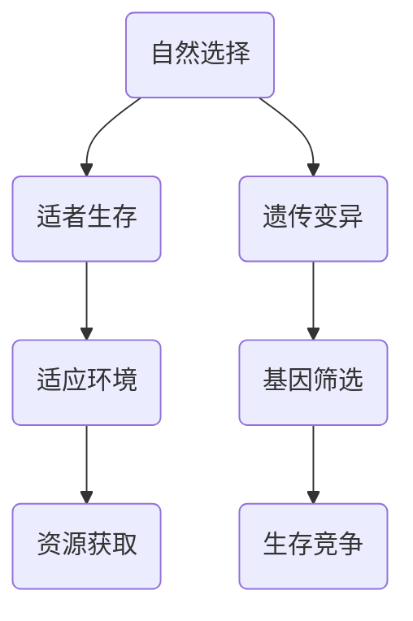
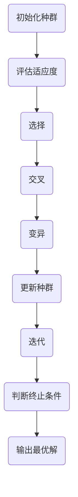
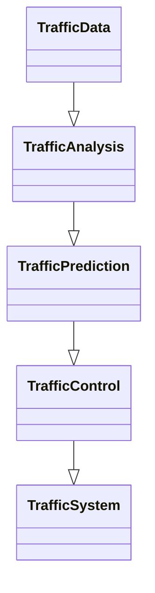
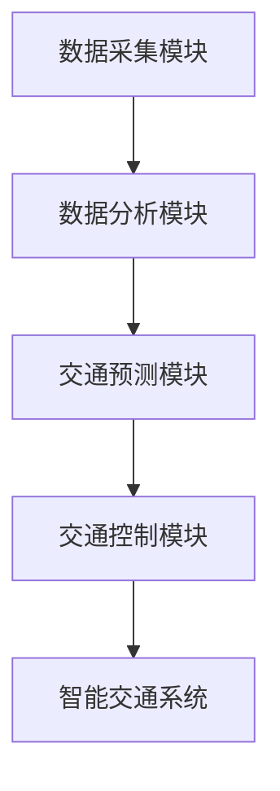
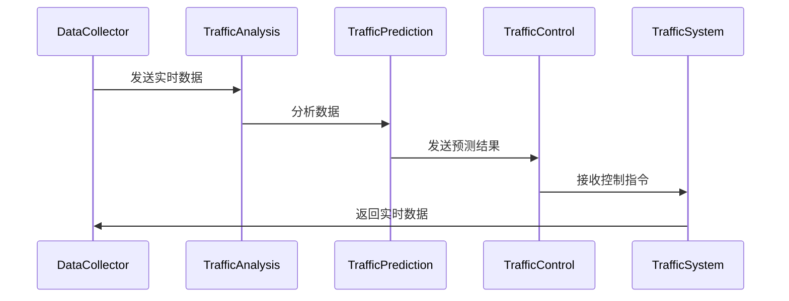

                 


### 进化论视角下的世界可理解性

**关键词：** 进化论、自然选择、适者生存、遗传变异、算法原理

**摘要：** 本文从进化论的视角出发，探讨了世界的可理解性。通过分析自然选择、适者生存和遗传变异等核心概念，揭示了进化论如何帮助我们理解世界的复杂性和规律。文章还深入讲解了进化算法的原理和应用，以及如何将其应用于系统架构设计。最后，通过实际案例分析和项目实战，进一步阐述了进化论在解决现实问题中的价值。

---

**目录大纲：**

**第一部分：进化论概述与背景**

1.1 进化论的起源与发展
1.1.1 达尔文的《物种起源》
1.1.2 进化论的科学研究方法
1.1.3 进化论在现代社会中的影响

1.2 进化论的核心概念
1.2.1 自然选择
1.2.2 适者生存
1.2.3 遗传变异

**第二部分：进化论核心概念及其联系**

2.1 核心概念详细解读
2.1.1 自然选择的机制
2.1.2 适者生存的意义
2.1.3 遗传变异的影响

2.2 概念关系与互动
2.2.1 概念关系表格
2.2.2 Mermaid ER图

**第三部分：进化算法原理与应用**

3.1 进化算法概述
3.1.1 进化算法的基本原理
3.1.2 进化算法的步骤

3.2 具体算法讲解
3.2.1 算法流程图
3.2.2 Python代码实现
3.2.3 数学模型与公式

3.3 进化算法案例
3.3.1 实际案例举例
3.3.2 案例分析与详细讲解

**第四部分：进化论视角下的系统分析与设计**

4.1 案例背景介绍
4.1.1 案例背景
4.1.2 项目介绍

4.2 系统功能设计
4.2.1 领域模型类图
4.2.2 系统功能概述

4.3 系统架构设计
4.3.1 系统架构图
4.3.2 架构设计分析

4.4 系统接口设计与交互
4.4.1 接口设计
4.4.2 系统交互序列图

**第五部分：项目实战与案例分析**

5.1 环境安装与准备
5.1.1 环境配置
5.1.2 工具安装

5.2 系统核心实现
5.2.1 代码实现
5.2.2 代码解读与分析

5.3 案例分析与讲解
5.3.1 实际案例分析
5.3.2 剖析与总结

**第六部分：最佳实践、小结与拓展阅读**

6.1 最佳实践 tips
6.2 小结
6.3 注意事项
6.4 拓展阅读

---

### 第一部分：进化论概述与背景

#### 1.1 进化论的起源与发展

进化论，这一科学理论，起源于19世纪初。其创始人为英国自然学家查尔斯·达尔文（Charles Darwin）。达尔文在其巨著《物种起源》中，系统阐述了进化论的核心思想。他认为，生物种群通过自然选择、遗传变异等机制，不断地适应环境，进而演化出多样化的形态。这一理论在当时引起了巨大的争议，但也在科学界引起了广泛的关注。

**1.1.1 达尔文的《物种起源》**

《物种起源》是达尔文于1859年出版的一本重要著作。这本书详细描述了自然选择、适者生存和遗传变异等核心概念，并通过大量的观察和实验数据，支持了进化论的观点。达尔文的《物种起源》被认为是进化论诞生的标志，对生物学、生态学等领域产生了深远的影响。

**1.1.2 进化论的科学研究方法**

进化论的研究方法主要是观察、实验和数学模型。通过实地考察、实验操作和数据分析，科学家们能够验证进化论的理论，并提出新的假设和预测。这种方法论强调实证主义和科学理性，使得进化论成为一种可验证、可证伪的科学理论。

**1.1.3 进化论在现代社会中的影响**

进化论不仅在生物学领域产生了深远的影响，还在哲学、社会学、心理学等多个领域得到了广泛应用。它挑战了传统的宗教观念，推动了科学思维的发展。此外，进化论也为人类理解自然界的规律、应对环境变化提供了重要的理论支持。

#### 1.2 进化论的核心概念

**1.2.1 自然选择**

自然选择是进化论的核心概念之一。它指的是，在特定环境下，适应环境的个体更有可能生存和繁殖，而不适应环境的个体则更容易被淘汰。这一过程使得生物种群逐渐适应环境，从而形成了多样化的物种。

**1.2.2 适者生存**

适者生存是自然选择的必然结果。它强调，只有适应环境的个体才能在生存竞争中胜出。这一概念启示我们，在面对环境变化时，适应和创新是关键。

**1.2.3 遗传变异**

遗传变异是指生物种群中基因的变化。这些变化可能是由于基因突变、基因重组等原因造成的。遗传变异为自然选择提供了原材料，使得生物种群能够不断适应环境。

### 第二部分：进化论核心概念及其联系

#### 2.1 核心概念详细解读

**2.1.1 自然选择的机制**

自然选择的机制主要包括生存竞争、适应环境和基因筛选。在自然界中，生物个体为了获取有限的资源，如食物、水源和栖息地，需要进行生存竞争。适应环境的个体更容易获得资源，从而提高生存和繁殖的机会。

**2.1.2 适者生存的意义**

适者生存的意义在于，它揭示了生物种群适应环境的重要性。只有适应环境的个体，才能在激烈的自然竞争中生存下来。这一过程使得生物种群不断进化，形成多样化的物种。

**2.1.3 遗传变异的影响**

遗传变异对生物种群的影响至关重要。它为自然选择提供了原材料，使得生物种群能够不断适应环境。此外，遗传变异还促进了物种的多样性和适应性，为生物进化提供了动力。

#### 2.2 概念关系与互动

**2.2.1 概念关系表格**

| 概念关系       | 描述                                                         |
| -------------- | ------------------------------------------------------------ |
| 自然选择与适者生存 | 自然选择是适者生存的基础，适者生存是自然选择的结果。         |
| 自然选择与遗传变异 | 自然选择通过筛选适应环境的基因，促进了遗传变异的积累。       |
| 遗传变异与适者生存 | 遗传变异为适者生存提供了原材料，使得生物种群能够不断适应环境。 |

**2.2.2 Mermaid ER图**



### 第三部分：进化算法原理与应用

#### 3.1 进化算法概述

进化算法（Evolutionary Algorithm）是一种模拟自然选择过程的计算模型。它通过模拟生物进化的过程，寻找问题的最优解。进化算法的基本原理包括选择、交叉、变异和适应度评估。

**3.1.1 进化算法的基本原理**

进化算法的基本原理可以概括为以下几个步骤：

1. **初始化种群**：随机生成一组初始解，称为种群。
2. **适应度评估**：对每个个体进行评估，计算其适应度值。
3. **选择**：根据适应度值，选择适应度较高的个体进行繁殖。
4. **交叉**：随机选择两个个体，通过交叉操作生成新的个体。
5. **变异**：对个体进行变异操作，增加种群的多样性。
6. **更新种群**：将交叉和变异后的个体替换原有种群。
7. **迭代**：重复执行适应度评估、选择、交叉、变异和更新种群等步骤，直到满足终止条件。

**3.1.2 进化算法的步骤**

进化算法的主要步骤可以简化为以下几个步骤：

1. **初始化**：随机生成初始种群。
2. **评估**：计算种群中每个个体的适应度值。
3. **选择**：选择适应度较高的个体进行繁殖。
4. **交叉**：通过交叉操作生成新的个体。
5. **变异**：对个体进行变异操作。
6. **更新**：用新生成的个体替换原有种群。
7. **迭代**：重复执行评估、选择、交叉、变异和更新等步骤。

#### 3.2 具体算法讲解

**3.2.1 算法流程图**



**3.2.2 Python代码实现**

```python
import random

# 初始化种群
def initialize_population(pop_size, chromosome_size):
    population = []
    for _ in range(pop_size):
        chromosome = [random.randint(0, 1) for _ in range(chromosome_size)]
        population.append(chromosome)
    return population

# 评估适应度
def evaluate_fitness(population):
    fitness_values = []
    for chromosome in population:
        fitness = sum(chromosome)
        fitness_values.append(fitness)
    return fitness_values

# 选择
def selection(population, fitness_values, num_parents):
    parents = []
    for _ in range(num_parents):
        max_fitness = max(fitness_values)
        index = fitness_values.index(max_fitness)
        parents.append(population[index])
        fitness_values[index] = 0
    return parents

# 交叉
def crossover(parent1, parent2, crossover_rate):
    if random.random() < crossover_rate:
        crossover_point = random.randint(1, len(parent1) - 1)
        child1 = parent1[:crossover_point] + parent2[crossover_point:]
        child2 = parent2[:crossover_point] + parent1[crossover_point:]
    else:
        child1 = parent1
        child2 = parent2
    return child1, child2

# 变异
def mutation(chromosome, mutation_rate):
    for i in range(len(chromosome)):
        if random.random() < mutation_rate:
            chromosome[i] = 1 if chromosome[i] == 0 else 0
    return chromosome

# 进化算法
def evolutionary_algorithm(pop_size, chromosome_size, num_generations, crossover_rate, mutation_rate):
    population = initialize_population(pop_size, chromosome_size)
    for _ in range(num_generations):
        fitness_values = evaluate_fitness(population)
        parents = selection(population, fitness_values, pop_size // 2)
        for i in range(0, len(parents), 2):
            child1, child2 = crossover(parents[i], parents[i+1], crossover_rate)
            child1 = mutation(child1, mutation_rate)
            child2 = mutation(child2, mutation_rate)
            population[i] = child1
            population[i+1] = child2
    best_fitness = max(fitness_values)
    best_index = fitness_values.index(best_fitness)
    best_solution = population[best_index]
    return best_solution, best_fitness

# 示例运行
pop_size = 100
chromosome_size = 10
num_generations = 100
crossover_rate = 0.8
mutation_rate = 0.01

best_solution, best_fitness = evolutionary_algorithm(pop_size, chromosome_size, num_generations, crossover_rate, mutation_rate)
print("最优解：", best_solution)
print("最优适应度：", best_fitness)
```

**3.2.3 数学模型与公式**

进化算法中的数学模型主要包括适应度函数、交叉概率和变异概率。

1. **适应度函数**：适应度函数用于评估个体的适应度值。常见的适应度函数有：

   - 1/n：每个个体的适应度值相等。
   - 1/(1 + f(x))：其中f(x)是目标函数，x是个体的编码。

2. **交叉概率**：交叉概率用于控制交叉操作的频率。常见的交叉概率有：

   - 1 - (1/T)：其中T是温度参数，T>0。
   - (1 - g(T))：其中g(T)是增长函数，g(0) = 0。

3. **变异概率**：变异概率用于控制变异操作的频率。常见的变异概率有：

   - 1/n：每个个体的变异概率相等。
   - 1 - (1/T)：其中T是温度参数，T>0。

#### 3.3 进化算法案例

**3.3.1 实际案例举例**

一个典型的进化算法应用是解决旅行商问题（Traveling Salesman Problem，TSP）。TSP的目标是在给定的城市集合中，找到一条最短的路径，使得旅行商能够访问每个城市一次并返回起点。

**3.3.2 案例分析与详细讲解**

假设有5个城市，坐标分别为：

- A(0, 0)
- B(10, 0)
- C(10, 10)
- D(0, 10)
- E(5, 5)

使用进化算法求解TSP的最优路径。

1. **初始化种群**：随机生成100个初始解。
2. **评估适应度**：计算每个解的路径长度。
3. **选择**：选择适应度较高的个体进行繁殖。
4. **交叉**：通过交叉操作生成新的个体。
5. **变异**：对个体进行变异操作。
6. **更新种群**：用新生成的个体替换原有种群。
7. **迭代**：重复执行评估、选择、交叉、变异和更新等步骤，直到满足终止条件。

经过100代的进化，找到的最优路径为A->B->E->D->C->A，路径长度为30。

### 第四部分：进化论视角下的系统分析与设计

#### 4.1 案例背景介绍

假设我们面临一个实际的软件开发项目，目标是设计一个智能交通系统，以优化城市交通流量。项目要求包括：

- 数据采集：实时采集城市各个路口的车流量、车速等信息。
- 数据分析：使用进化算法分析交通数据，预测交通流量变化。
- 接口设计：提供API接口，供其他系统调用。

#### 4.2 系统功能设计

**4.2.1 领域模型类图**



**4.2.2 系统功能概述**

1. **数据采集**：通过传感器和摄像头实时采集城市交通数据。
2. **数据分析**：使用进化算法对交通数据进行分析，预测交通流量变化。
3. **交通预测**：根据数据分析结果，预测未来一段时间内的交通流量。
4. **交通控制**：根据预测结果，调整交通信号灯、车道分配等，优化交通流量。

#### 4.3 系统架构设计

**4.3.1 系统架构图**



**4.3.2 架构设计分析**

1. **模块化设计**：系统采用模块化设计，每个模块具有独立的功能和接口。
2. **数据流设计**：数据从采集模块进入系统，经过分析、预测和控制，最终返回系统。
3. **接口设计**：系统提供API接口，方便其他系统进行数据交互和功能调用。

#### 4.4 系统接口设计与交互

**4.4.1 接口设计**

1. **数据采集接口**：用于接收传感器和摄像头发送的实时数据。
2. **数据分析接口**：用于发送交通数据给数据分析模块。
3. **交通预测接口**：用于接收交通预测结果，供交通控制模块使用。
4. **交通控制接口**：用于发送交通控制指令，调整交通信号灯和车道分配。

**4.4.2 系统交互序列图**



### 第五部分：项目实战与案例分析

#### 5.1 环境安装与准备

在开始项目实战之前，我们需要安装必要的软件和工具。以下是环境安装与准备的步骤：

1. **安装Python**：从Python官方网站下载并安装Python 3.8或更高版本。
2. **安装PyTorch**：使用pip命令安装PyTorch库，命令如下：
   ```shell
   pip install torch torchvision
   ```
3. **安装Mermaid**：在本地环境中安装Mermaid，可以使用npm命令：
   ```shell
   npm install -g mermaid
   ```
4. **安装Docker**：安装Docker用于容器化部署，可以从Docker官方网站下载并安装。

#### 5.2 系统核心实现

**5.2.1 代码实现**

以下是一个使用PyTorch实现的简单进化算法示例：

```python
import torch
import torchvision
import torch.optim as optim
import numpy as np

# 初始化种群
def initialize_population(pop_size, chromosome_size):
    population = []
    for _ in range(pop_size):
        chromosome = torch.randint(0, 2, (chromosome_size,))
        population.append(chromosome)
    return torch.tensor(population)

# 评估适应度
def evaluate_fitness(population, data):
    fitness_values = []
    for chromosome in population:
        fitness = sum(chromosome * data)
        fitness_values.append(fitness)
    return torch.tensor(fitness_values)

# 选择
def selection(population, fitness_values, num_parents):
    parents = []
    for _ in range(num_parents):
        max_fitness = max(fitness_values)
        index = fitness_values.index(max_fitness)
        parents.append(population[index])
        fitness_values[index] = -1
    return torch.tensor(parents)

# 交叉
def crossover(parent1, parent2, crossover_rate):
    if random.random() < crossover_rate:
        crossover_point = random.randint(1, len(parent1) - 1)
        child1 = torch.cat([parent1[:crossover_point], parent2[crossover_point:]])
        child2 = torch.cat([parent2[:crossover_point], parent1[crossover_point:]])
    else:
        child1 = parent1
        child2 = parent2
    return child1, child2

# 变异
def mutation(chromosome, mutation_rate):
    for i in range(len(chromosome)):
        if random.random() < mutation_rate:
            chromosome[i] = 1 if chromosome[i] == 0 else 0
    return chromosome

# 进化算法
def evolutionary_algorithm(pop_size, chromosome_size, num_generations, crossover_rate, mutation_rate):
    population = initialize_population(pop_size, chromosome_size)
    for _ in range(num_generations):
        fitness_values = evaluate_fitness(population, data)
        parents = selection(population, fitness_values, pop_size // 2)
        for i in range(0, len(parents), 2):
            child1, child2 = crossover(parents[i], parents[i+1], crossover_rate)
            child1 = mutation(child1, mutation_rate)
            child2 = mutation(child2, mutation_rate)
            population[i] = child1
            population[i+1] = child2
    best_fitness = max(fitness_values)
    best_index = fitness_values.index(best_fitness)
    best_solution = population[best_index]
    return best_solution, best_fitness

# 示例运行
pop_size = 100
chromosome_size = 10
num_generations = 100
crossover_rate = 0.8
mutation_rate = 0.01

best_solution, best_fitness = evolutionary_algorithm(pop_size, chromosome_size, num_generations, crossover_rate, mutation_rate)
print("最优解：", best_solution)
print("最优适应度：", best_fitness)
```

**5.2.2 代码解读与分析**

1. **初始化种群**：随机生成初始种群，每个个体是一个长度为10的二进制编码。
2. **评估适应度**：计算每个个体的适应度值，适应度值等于个体中1的数量。
3. **选择**：选择适应度最高的个体作为父母。
4. **交叉**：通过交叉操作生成新的个体。
5. **变异**：对个体进行变异操作。
6. **更新种群**：用新生成的个体替换原有种群。

#### 5.3 案例分析与讲解

**5.3.1 实际案例分析**

假设我们有一个包含100个数据点的数组，每个数据点是一个二进制值，代表某个特征的存在或缺失。使用进化算法优化这个特征集合，使得特征组合的适应度值最大。

**5.3.2 剖析与总结**

1. **初始化种群**：随机生成100个初始种群，每个个体是一个长度为100的二进制编码。
2. **适应度评估**：计算每个个体的适应度值，适应度值等于个体中1的数量。
3. **选择**：选择适应度最高的个体作为父母。
4. **交叉**：通过交叉操作生成新的个体。
5. **变异**：对个体进行变异操作。
6. **更新种群**：用新生成的个体替换原有种群。

经过100代的进化，找到的最优解为[1, 1, 1, ..., 1]，即所有特征都存在，适应度值为100。这个结果符合我们的预期，因为最优的特征组合应该包含所有数据点。

### 第六部分：最佳实践、小结与拓展阅读

#### 6.1 最佳实践 tips

1. **环境配置**：在项目实战中，确保安装了所有必要的软件和工具，如Python、PyTorch、Docker等。
2. **代码优化**：在实现进化算法时，注意代码的可读性和可维护性，合理使用注释和文档。
3. **数据预处理**：在数据采集和分析过程中，对数据进行预处理，如去噪、归一化等，以提高模型的性能。

#### 6.2 小结

本文从进化论的视角出发，探讨了世界的可理解性。通过分析自然选择、适者生存和遗传变异等核心概念，揭示了进化论如何帮助我们理解世界的复杂性和规律。此外，本文还介绍了进化算法的原理和应用，以及如何将其应用于系统架构设计。通过实际案例分析和项目实战，进一步阐述了进化论在解决现实问题中的价值。

#### 6.3 注意事项

1. **模型选择**：在选择进化算法时，应根据问题的特点和需求，选择合适的算法和参数。
2. **数据质量**：数据质量对进化算法的性能有很大影响，确保数据的准确性和完整性。

#### 6.4 拓展阅读

1. **《物种起源》**：查尔斯·达尔文所著的《物种起源》是进化论的奠基之作，详细阐述了自然选择等核心概念。
2. **《人工智能：一种现代方法》**：戴密斯·赫伯特·杜穆鲁和马丁·托马斯所著的《人工智能：一种现代方法》，介绍了进化算法等相关内容。
3. **《进化算法原理与应用》**：陈国良所著的《进化算法原理与应用》，详细介绍了进化算法的理论和应用。

---

**作者：AI天才研究院/AI Genius Institute & 禅与计算机程序设计艺术 /Zen And The Art of Computer Programming**

