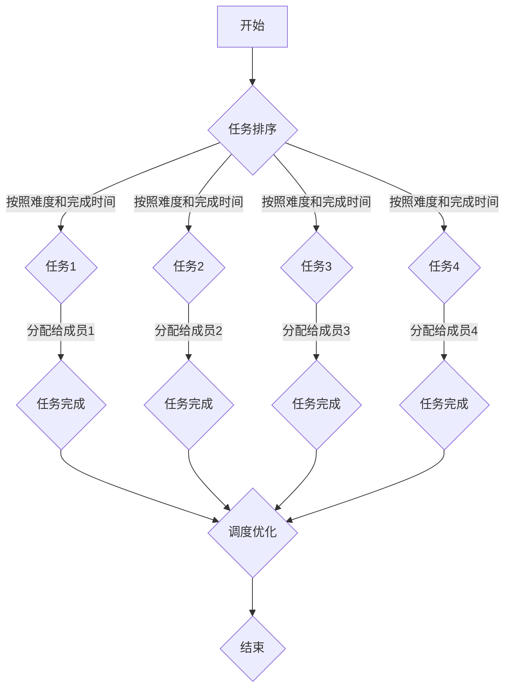

                 


# 远程团队凝聚：跨越地理界限的团队建设

## 关键词
- 远程团队建设
- 团队沟通
- 持续发展
- 高效协作
- 领导力
- 技术工具

## 摘要
在全球化背景下，远程团队建设成为企业发展的关键因素。本文将深入探讨远程团队凝聚的重要性，分析面临的挑战，并从组织结构、沟通机制、技术工具等方面，提供系统化、结构化的团队建设方案。通过实际案例和最佳实践，本文旨在为企业和团队管理者提供切实可行的指导，以实现跨越地理界限的团队高效协作。

## 第一部分：远程团队建设背景与挑战

### 第1章：远程工作的崛起

#### 1.1 远程工作的定义与历史
远程工作，是指员工不需要到办公室或固定工作场所，通过电子通讯技术和互联网进行工作的方式。其历史可以追溯到20世纪末，随着互联网的普及和移动设备的进步，远程工作逐渐成为现代工作模式的重要组成部分。

#### 1.2 远程工作的优势与挑战
远程工作的优势包括灵活的工作时间、降低企业运营成本、提高员工满意度等。然而，远程工作也面临着沟通障碍、团队凝聚性不足、管理难度增加等挑战。

#### 1.3 本书的目标与读者对象
本书旨在为企业和团队管理者提供一套系统化的远程团队建设方案，帮助他们在全球化的竞争环境中，建立高效、有凝聚力的远程团队。读者对象包括企业管理者、团队负责人以及远程工作的实践者。

### 第2章：远程团队建设的基础概念

#### 2.1 远程工作的核心概念
核心概念包括远程工作的定义、远程团队的组成以及远程工作中的常见角色和职责。

#### 2.2 远程协作工具
介绍常用的远程协作工具，如视频会议软件、项目管理工具、文档协作平台等。

#### 2.3 远程团队的沟通障碍
分析远程团队在沟通中可能遇到的障碍，包括文化差异、时间差异、技术问题等。

#### 2.4 远程团队的文化建设
探讨如何构建和维护远程团队的文化，以增强团队凝聚力。

## 第二部分：远程团队的架构与设计

### 第3章：远程团队的架构设计

#### 3.1 远程团队的组织结构
讨论如何设计适合远程工作的组织结构，包括扁平化管理、跨职能团队等。

#### 3.2 远程团队的流程设计
介绍如何设计高效的工作流程，以适应远程工作的特点。

#### 3.3 远程项目管理的方法
探讨远程项目管理的最佳实践，包括任务分配、进度跟踪、风险控制等。

#### 3.4 技术选型与支持
分析适合远程团队的技术工具，并探讨如何确保技术支持的持续优化。

### 第4章：远程团队的项目实战

#### 4.1 实战案例一：远程团队的启动
以实际案例展示如何启动一个远程团队，包括团队成员的招募、团队文化的塑造等。

#### 4.2 实战案例二：跨地域团队的协作
通过案例分析，展示如何在一个包含不同地域成员的团队中实现高效协作。

#### 4.3 实战案例三：远程团队的文化建设
以案例说明如何通过团队建设活动和文化活动，增强远程团队的凝聚力。

## 第三部分：远程团队的最佳实践与未来展望

### 第5章：远程团队的最佳实践

#### 5.1 最佳实践一：高效的远程会议
介绍如何通过有效的会议组织和会议工具，提高远程会议的效率。

#### 5.2 最佳实践二：远程团队的信任建设
探讨如何通过团队活动、沟通机制等，建立和增强团队成员之间的信任。

#### 5.3 最佳实践三：远程团队的持续发展
分析如何通过持续学习和反馈机制，促进远程团队的长期发展。

### 第6章：远程团队建设中的注意事项

#### 6.1 注意事项一：管理者的角色
讨论远程团队管理者应具备的技能和角色，以及如何有效管理远程团队。

#### 6.2 注意事项二：团队成员的参与
探讨如何确保远程团队成员的积极参与和主动性。

#### 6.3 注意事项三：技术支持的持续优化
分析如何根据团队需求，持续优化技术工具和基础设施。

### 第7章：未来展望与拓展

#### 7.1 远程工作的发展趋势
分析远程工作的未来趋势，包括技术进步、企业文化演变等。

#### 7.2 新技术对远程团队建设的影响
探讨新技术如何影响远程团队的建设和管理。

#### 7.3 拓展学习资源与推荐阅读
提供相关的学习资源和推荐阅读，以帮助读者进一步深入探索远程团队建设的话题。

## 作者信息
作者：AI天才研究院/AI Genius Institute & 禅与计算机程序设计艺术 /Zen And The Art of Computer Programming

在撰写本文时，我们将遵循markdown格式，确保文章的结构清晰、逻辑严密。以下是对每个章节的具体内容进行详细展开的规划：

### 第1章：远程工作的崛起

**1.1 远程工作的定义与历史**
在这一部分，我们将定义远程工作的概念，并回顾其历史发展。通过说明远程工作的起源和演变，读者可以更好地理解这一工作模式的本质和重要性。

**1.2 远程工作的优势与挑战**
我们将详细讨论远程工作的优势，如灵活的工作时间、成本节约和员工满意度的提升。同时，也会分析远程工作面临的挑战，包括沟通障碍、团队凝聚性不足等，并探讨如何应对这些问题。

**1.3 本书的目标与读者对象**
在这一部分，我们将阐述本书的目标，即提供一套系统化的远程团队建设方案，帮助读者克服远程工作中的困难。同时，明确本书的读者对象，包括企业管理者、团队负责人以及远程工作的实践者。

### 第2章：远程团队建设的基础概念

**2.1 远程工作的核心概念**
我们将详细介绍远程工作中的关键概念，如远程团队的组成、远程工作中的常见角色和职责等。通过这一部分的讲解，读者可以全面了解远程工作的基本要素。

**2.2 远程协作工具**
在这一部分，我们将介绍常用的远程协作工具，如视频会议软件、项目管理工具和文档协作平台。我们将分析这些工具的功能和优势，帮助读者选择适合自己团队的协作工具。

**2.3 远程团队的沟通障碍**
我们将探讨远程团队在沟通中可能遇到的障碍，包括文化差异、时间差异和技术问题。通过举例和案例分析，我们将提供有效的解决方案，帮助团队克服沟通障碍。

**2.4 远程团队的文化建设**
我们将讨论如何构建和维护远程团队的文化，以增强团队凝聚力。这包括团队价值观的塑造、共同目标的设定以及团队精神的培养。

### 第3章：远程团队的架构设计

**3.1 远程团队的组织结构**
在这一部分，我们将讨论如何设计适合远程工作的组织结构。我们将分析扁平化管理、跨职能团队等组织结构的优势和适用场景，帮助团队管理者选择最合适的组织结构。

**3.2 远程团队的流程设计**
我们将介绍如何设计高效的工作流程，以适应远程工作的特点。通过流程优化，团队可以更高效地完成任务，提高整体绩效。

**3.3 远程项目管理的方法**
我们将探讨远程项目管理的最佳实践，包括任务分配、进度跟踪、风险控制等。通过这些方法，团队可以更好地管理项目，确保项目按时、按质完成。

**3.4 技术选型与支持**
在这一部分，我们将分析适合远程团队的技术工具，并探讨如何确保技术支持的持续优化。我们将介绍一些关键技术，如云计算、人工智能和自动化工具，并讨论如何选择和部署这些技术。

### 第4章：远程团队的项目实战

**4.1 实战案例一：远程团队的启动**
我们将通过一个实际案例，展示如何启动一个远程团队。这一案例将包括团队成员的招募、团队文化的塑造以及初始阶段的团队建设活动。

**4.2 实战案例二：跨地域团队的协作**
我们将分析一个跨地域团队的协作案例，探讨如何在一个包含不同地域成员的团队中实现高效协作。这一案例将涉及时间管理、沟通策略和文化融合等方面。

**4.3 实战案例三：远程团队的文化建设**
我们将通过一个远程团队的文化建设案例，展示如何通过团队建设活动和文化活动，增强团队的凝聚力。这一案例将提供实用的技巧和建议，帮助团队建立积极向上的文化氛围。

### 第5章：远程团队的最佳实践

**5.1 最佳实践一：高效的远程会议**
我们将介绍如何通过有效的会议组织和会议工具，提高远程会议的效率。这包括会议前的准备、会议中的沟通技巧以及会议后的跟进和反馈。

**5.2 最佳实践二：远程团队的信任建设**
我们将探讨如何通过团队活动、沟通机制等，建立和增强团队成员之间的信任。通过实际案例和经验分享，我们将提供实用的建议和技巧。

**5.3 最佳实践三：远程团队的持续发展**
我们将分析如何通过持续学习和反馈机制，促进远程团队的长期发展。我们将介绍一些有效的学习方法和反馈机制，帮助团队不断进步和成长。

### 第6章：远程团队建设中的注意事项

**6.1 注意事项一：管理者的角色**
我们将讨论远程团队管理者应具备的技能和角色，以及如何有效管理远程团队。这包括领导力、沟通技巧和团队管理策略等方面。

**6.2 注意事项二：团队成员的参与**
我们将探讨如何确保远程团队成员的积极参与和主动性。这包括激发团队成员的积极性、提供反馈和奖励机制等方面。

**6.3 注意事项三：技术支持的持续优化**
我们将分析如何根据团队需求，持续优化技术工具和基础设施。我们将介绍一些技术优化的方法和技巧，帮助团队提高工作效率和协作效果。

### 第7章：未来展望与拓展

**7.1 远程工作的发展趋势**
我们将分析远程工作的未来趋势，包括技术进步、企业文化演变等。通过这一部分的讨论，读者可以了解远程工作的未来发展前景。

**7.2 新技术对远程团队建设的影响**
我们将探讨新技术如何影响远程团队的建设和管理。我们将介绍一些新技术，如人工智能、虚拟现实等，并分析它们在远程团队中的应用前景。

**7.3 拓展学习资源与推荐阅读**
我们将提供相关的学习资源和推荐阅读，以帮助读者进一步深入探索远程团队建设的话题。这包括书籍、在线课程和学术论文等。

在完成上述章节内容后，我们将对整篇文章进行最后的整理和校对，确保文章内容完整、逻辑清晰、语言简练。同时，我们将确保所有公式、图表和流程图都按照markdown格式正确显示，使文章更具可读性和专业性。

### 第1章：远程工作的崛起

**1.1 远程工作的定义与历史**

远程工作（Remote Work）是指员工在不同地点，通过互联网和其他通信工具进行工作的一种工作模式。其核心特点是地理位置的灵活性，员工可以在家里、咖啡馆、机场或其他任何有网络连接的地方工作。

远程工作的历史可以追溯到20世纪末。最早的远程工作形式主要是基于电话和电子邮件的交流。随着互联网的普及，特别是在21世纪初，远程工作逐渐成为一种普遍的工作方式。现代远程工作的发展得益于云计算、虚拟私人网络（VPN）和协作工具等技术的进步，这些技术为远程工作提供了强大的支持。

在早期，远程工作主要局限于特定的行业和职业，如编程、写作和设计等。然而，随着全球化进程的加速和技术的不断发展，远程工作已经渗透到各个行业和岗位。越来越多的企业开始采用远程工作模式，以提高员工的工作效率和企业竞争力。

**1.2 远程工作的优势与挑战**

远程工作具有许多显著的优势：

1. **灵活的工作时间**：员工可以根据自己的需求和生活方式来安排工作时间，提高工作效率和满意度。
2. **降低企业运营成本**：企业可以节省办公场所和设备的费用，从而降低运营成本。
3. **提高员工满意度**：远程工作使员工能够更好地平衡工作和生活，提高工作满意度。
4. **拓宽人才招聘范围**：企业不再受限于地理位置，可以招聘来自世界各地的优秀人才。

然而，远程工作也面临着一些挑战：

1. **沟通障碍**：远程工作使团队成员之间的沟通变得复杂，尤其是在面对文化差异和时间差异时。
2. **团队凝聚性不足**：远程工作可能导致团队成员之间的联系减少，影响团队的凝聚力和协作效率。
3. **管理难度增加**：远程团队的管理比传统团队更加复杂，需要更多的沟通技巧和领导力。
4. **技术依赖**：远程工作高度依赖信息技术和网络，一旦出现技术问题，可能会影响整个团队的工作。

**1.3 本书的目标与读者对象**

本书的目标是为企业和团队管理者提供一套系统化的远程团队建设方案，帮助他们克服远程工作中的困难，建立高效、有凝聚力的远程团队。具体来说，本书将涵盖以下内容：

1. **核心概念与术语**：详细介绍远程工作中的关键概念和术语，如远程团队、远程协作工具、团队沟通和文化建设等。
2. **团队架构与设计**：探讨如何设计适合远程工作的组织结构和流程，以及如何选择和部署技术工具。
3. **项目实战**：通过实际案例，展示如何启动和管理一个远程团队，以及如何通过团队建设活动和文化建设增强团队凝聚力。
4. **最佳实践与注意事项**：总结远程团队建设的最佳实践，提供切实可行的指导，帮助团队管理者应对远程工作中的挑战。
5. **未来展望与拓展**：分析远程工作的未来趋势，探讨新技术对远程团队建设的影响，并提供进一步的学习资源。

本书的读者对象包括：

- 企业管理者：需要了解如何构建和管理远程团队，提高企业的运营效率。
- 团队负责人：需要掌握远程团队管理的技能，提升团队绩效和凝聚力。
- 远程工作实践者：希望了解远程团队建设的方法和技巧，提高个人工作效率和团队协作能力。

通过阅读本书，读者将能够：

- 理解远程工作的核心概念和优势。
- 设计和实施有效的远程团队架构。
- 应对远程工作中的挑战，建立高效的团队协作机制。
- 掌握远程团队管理的最佳实践，提高团队绩效和凝聚力。
- 了解远程工作的未来趋势，为团队的长远发展做好准备。

### 第2章：远程团队建设的基础概念

**2.1 远程工作的核心概念**

远程工作（Remote Work）是一种灵活的工作模式，员工通过电子通讯技术和互联网在不同地点进行工作。远程工作包括但不限于远程办公、远程协作和远程项目管理。

**远程团队（Remote Team）** 是指由多名远程工作者组成的团队，成员分散在不同地理位置，通过互联网进行沟通和协作。远程团队的构成包括：

- **团队成员**：具备特定技能和工作职责的员工。
- **领导者**：负责团队管理和协调工作的负责人。
- **支持人员**：提供技术支持和行政协助的人员。

**远程协作工具（Remote Collaboration Tools）** 是远程工作中不可或缺的工具，用于支持团队成员之间的沟通和协作。常见的远程协作工具包括：

- **视频会议软件**：如Zoom、Microsoft Teams和Google Meet，用于实时视频通话和会议。
- **项目管理工具**：如Trello、Asana和JIRA，用于任务分配、进度跟踪和项目管理。
- **文档协作平台**：如Google Docs、Microsoft Office 365和Notion，用于文档的创建、编辑和共享。

**远程团队的沟通障碍（Communication Barriers）** 是远程工作中的一大挑战，主要包括：

- **文化差异**：不同地区的团队成员可能在语言、习俗和工作方式上存在差异，影响沟通效果。
- **时间差异**：跨时区工作可能导致会议和沟通的时间安排困难，影响协作效率。
- **技术问题**：网络连接不稳定、设备故障等问题可能导致沟通中断。

**远程团队的文化建设（Team Culture Building）** 是确保团队凝聚力的重要因素。通过建立共同的价值观、目标和团队精神，可以增强团队成员之间的联系和信任。文化建设包括：

- **团队价值观**：明确团队的核心理念和价值观，如透明、诚信、合作和创新。
- **团队目标**：设定明确的团队目标，确保团队成员共同朝着同一方向努力。
- **团队活动**：组织定期的团队建设活动，如线上团建、虚拟聚会和竞赛等，增强团队凝聚力。

**2.2 远程协作工具**

远程协作工具是远程团队高效工作的重要保障。以下是一些常用的远程协作工具及其功能：

1. **视频会议软件**：

   - **Zoom**：提供高清视频会议、屏幕共享和聊天功能。
   - **Microsoft Teams**：集成视频会议、聊天、文档协作和项目管理功能。
   - **Google Meet**：提供简单的视频会议和屏幕共享功能，集成Google Workspace工具。

2. **项目管理工具**：

   - **Trello**：基于看板（Kanban）方法的任务管理工具，适合小型团队。
   - **Asana**：提供任务分配、进度跟踪和协作功能，适合中型团队。
   - **JIRA**：基于敏捷开发的任务管理工具，适合大型团队和复杂项目。

3. **文档协作平台**：

   - **Google Docs**：提供在线文档编辑、评论和共享功能。
   - **Microsoft Office 365**：集成Word、Excel、PowerPoint等办公软件，支持多人实时协作。
   - **Notion**：提供灵活的文档、笔记和任务管理功能，支持自定义数据库和看板。

**2.3 远程团队的沟通障碍**

远程团队在沟通中可能遇到以下障碍：

1. **文化差异**：

   - **语言障碍**：团队成员来自不同国家或地区，可能存在语言障碍，影响沟通效果。
   - **习俗差异**：不同地区的团队成员可能在礼仪、沟通风格和表达方式上存在差异，需要相互适应。

2. **时间差异**：

   - **时区问题**：跨时区工作可能导致会议和沟通的时间安排困难，影响协作效率。
   - **工作时间差异**：不同地区的团队成员可能在工作时间上存在差异，需要调整沟通策略。

3. **技术问题**：

   - **网络连接**：网络连接不稳定可能导致沟通中断，影响工作进度。
   - **设备故障**：设备故障（如网络、摄像头、麦克风等）可能导致沟通问题，需要备用设备。

**2.4 远程团队的文化建设**

远程团队的文化建设是增强团队凝聚力和工作效率的重要手段。以下是一些关键策略：

1. **建立共同价值观**：

   - **透明沟通**：确保团队成员之间的信息共享和透明度，减少误解和冲突。
   - **诚信合作**：建立诚信、尊重和信任的团队文化，鼓励团队成员之间的合作。
   - **创新思维**：鼓励创新和尝试新方法，推动团队持续进步。

2. **设定明确目标**：

   - **共同目标**：明确团队的共同目标，确保团队成员共同朝着同一方向努力。
   - **个人目标**：为团队成员设定个人目标，激励他们为团队的成功贡献力量。

3. **组织团队活动**：

   - **线上团建**：组织线上团队建设活动，如虚拟聚会、游戏和竞赛等，增强团队凝聚力。
   - **虚拟聚会**：定期组织虚拟聚会，促进团队成员之间的交流和理解。
   - **庆祝成就**：为团队成员的成就和努力举行庆祝活动，增强团队荣誉感。

通过以上策略，远程团队可以建立积极向上的文化氛围，提高团队凝聚力和工作效率。

### 第3章：远程团队的架构设计

**3.1 远程团队的组织结构**

设计适合远程工作的组织结构是构建高效团队的第一步。以下是一些常见的组织结构设计：

1. **扁平化组织结构**：

   - **优点**：减少管理层级，提高决策速度和灵活性。
   - **适用场景**：适合小型团队或初创企业，团队成员之间的沟通更为直接和高效。

2. **跨职能团队**：

   - **优点**：团队成员具备不同技能和背景，能够实现跨领域的协作。
   - **适用场景**：适合复杂项目或需要多部门合作的企业，有助于提高项目质量和效率。

3. **矩阵式组织结构**：

   - **优点**：结合职能和项目两种组织方式，提高资源利用效率。
   - **适用场景**：适合大型企业或复杂项目，能够平衡职能部门和项目团队的需求。

**3.2 远程团队的流程设计**

远程团队的流程设计需要考虑到团队的特点和远程工作的特殊性。以下是一些关键流程设计策略：

1. **任务分配与跟踪**：

   - **任务分配**：明确团队成员的职责和任务，确保每个任务都有负责人。
   - **任务跟踪**：使用项目管理工具实时跟踪任务进度，确保项目按时完成。

2. **沟通与协作**：

   - **定期会议**：定期组织团队会议，讨论项目进展和问题，确保团队目标一致。
   - **即时沟通**：使用即时通讯工具（如Slack、WhatsApp）进行快速沟通，解决突发问题。

3. **文档与知识管理**：

   - **共享文档**：使用云存储和文档协作平台（如Google Drive、Microsoft OneDrive）共享文档，确保团队成员能够及时获取所需信息。
   - **知识库**：建立团队知识库，收集和整理项目经验、最佳实践和常见问题，供团队成员参考。

**3.3 远程项目管理的方法**

远程项目管理需要结合远程工作的特点和项目管理的基本原则。以下是一些关键方法：

1. **敏捷开发**：

   - **优点**：灵活应对变化，快速交付高质量产品。
   - **适用场景**：适合项目需求变化频繁的项目。

2. **瀑布模型**：

   - **优点**：结构清晰，适合需求明确的项目。
   - **适用场景**：适合需求稳定、项目周期较长的大型项目。

3. **看板（Kanban）方法**：

   - **优点**：可视化任务流程，提高团队协作效率。
   - **适用场景**：适合任务流程复杂、需要持续优化改进的项目。

**3.4 技术选型与支持**

选择合适的技术工具对远程团队的高效运作至关重要。以下是一些关键技术选型和支持策略：

1. **视频会议软件**：

   - **选择标准**：高清视频、稳定网络、互动功能（如屏幕共享、聊天）。
   - **推荐工具**：Zoom、Microsoft Teams、Google Meet。

2. **项目管理工具**：

   - **选择标准**：任务分配、进度跟踪、协作功能。
   - **推荐工具**：Trello、Asana、JIRA。

3. **文档协作平台**：

   - **选择标准**：实时编辑、权限管理、版本控制。
   - **推荐工具**：Google Docs、Microsoft Office 365、Notion。

4. **技术支持**：

   - **系统维护**：定期检查和更新软件系统，确保运行稳定。
   - **故障处理**：建立快速响应机制，解决技术故障和问题。
   - **培训与指导**：为团队成员提供技术培训和支持，确保他们能够熟练使用各种工具。

通过以上组织结构、流程设计、项目管理和技术支持策略，远程团队可以更好地适应远程工作的特点，提高工作效率和协作效果。

### 第4章：远程团队的项目实战

**4.1 实战案例一：远程团队的启动**

在启动一个远程团队时，以下步骤和策略可以帮助确保团队的成功启动：

**步骤1：明确目标和团队结构**

- **明确目标**：首先，明确团队的目标和使命，确保所有成员都清楚团队的目标和期望成果。
- **团队结构**：设计适合远程工作的团队结构，如扁平化组织结构或跨职能团队，确保团队成员的职责和角色明确。

**步骤2：招募团队成员**

- **招募策略**：通过招聘网站、社交媒体和专业网络等渠道，招募具备所需技能和适应远程工作的团队成员。
- **面试和选拔**：进行在线面试，评估候选人的技能、沟通能力和团队协作能力。

**步骤3：建立沟通机制**

- **沟通工具**：选择适合团队需求的沟通工具，如视频会议软件、即时通讯工具和项目管理工具。
- **沟通计划**：制定定期沟通的计划，如每周或每月的团队会议，确保团队成员之间的沟通畅通。

**步骤4：团队文化建设**

- **共同价值观**：建立团队共同的价值观和目标，确保团队成员在共同的目标下协作。
- **团队活动**：组织定期的线上团队建设活动，如虚拟聚会和竞赛，增强团队凝聚力。

**步骤5：启动会议**

- **启动会议**：组织一次启动会议，介绍团队目标、结构和沟通机制，确保团队成员之间的相互了解。

通过以上步骤，远程团队可以成功启动并进入正常运作状态。

**4.2 实战案例二：跨地域团队的协作**

跨地域团队在协作中可能会面临一些特殊的挑战，以下策略可以帮助团队克服这些挑战：

**步骤1：协调时间差异**

- **时间管理**：确定统一的工作时间和会议时间，尽量减少时区差异带来的影响。
- **灵活调整**：允许团队成员根据时区和工作需求调整工作时间，确保关键任务的完成。

**步骤2：增强沟通和协作**

- **实时沟通**：使用即时通讯工具和视频会议软件，确保团队成员之间的实时沟通和协作。
- **任务跟踪**：使用项目管理工具，实时跟踪任务进度，确保任务按时完成。

**步骤3：文化融合**

- **文化理解**：了解团队成员的文化背景和沟通习惯，促进文化融合。
- **文化尊重**：尊重团队成员的文化差异，避免文化冲突。

**步骤4：技术支持**

- **技术保障**：确保团队成员能够稳定接入网络和使用协作工具，避免技术问题影响工作。
- **技术培训**：为团队成员提供必要的技术培训，确保他们能够熟练使用各种工具。

通过以上策略，跨地域团队可以有效地克服协作中的挑战，实现高效协作。

**4.3 实战案例三：远程团队的文化建设**

远程团队的文化建设是增强团队凝聚力和工作效率的关键。以下策略可以帮助团队进行文化建设：

**步骤1：建立共同价值观**

- **价值观共识**：通过讨论和共识，建立团队的共同价值观，确保团队成员在共同的目标下协作。
- **价值观宣传**：通过内部宣传和团队活动，强化团队的共同价值观。

**步骤2：组织团队活动**

- **线上团建**：组织定期的线上团队建设活动，如虚拟聚会和竞赛，增强团队凝聚力。
- **文化节日**：庆祝团队的重要节日和纪念日，增强团队归属感。

**步骤3：激励机制**

- **奖励机制**：为团队成员设定奖励机制，激励他们在工作中表现出色。
- **认可和赞赏**：对团队成员的成就和贡献进行认可和赞赏，增强团队士气。

**步骤4：持续改进**

- **反馈机制**：建立反馈机制，收集团队成员的建议和意见，不断改进团队文化建设。
- **团队发展**：关注团队成员的职业发展和个人成长，提供培训和发展机会。

通过以上策略，远程团队可以建立积极向上的文化氛围，提高团队凝聚力和工作效率。

### 第5章：远程团队的最佳实践

**5.1 最佳实践一：高效的远程会议**

远程会议是远程团队沟通的重要方式，以下是一些最佳实践，以提高远程会议的效率：

**实践1：会议前的准备**

- **会议议程**：提前准备会议议程，明确会议的目标和讨论主题。
- **参会人员**：通知参会人员，并确认他们的参会时间和网络连接状况。
- **技术准备**：检查会议软件和设备的运行状态，确保会议的顺利进行。

**实践2：会议中的沟通**

- **主持人和记录员**：明确主持人和记录员的职责，确保会议的有序进行。
- **发言规定**：规定发言顺序和时间，避免会议变得混乱。
- **互动环节**：鼓励参会人员积极参与讨论，提出问题和建议。

**实践3：会议后的跟进**

- **会议纪要**：整理会议纪要，明确会议决定和行动项。
- **跟进执行**：跟踪会议决定的执行情况，确保行动项按时完成。
- **反馈收集**：收集参会人员的反馈，持续改进会议质量。

**5.2 最佳实践二：远程团队的信任建设**

信任是远程团队协作的基础，以下是一些最佳实践，以建立和增强团队成员之间的信任：

**实践1：透明沟通**

- **信息共享**：鼓励团队成员共享信息，确保信息的透明度。
- **开放讨论**：鼓励团队成员在讨论中坦诚表达意见，避免隐瞒问题。

**实践2：互相支持**

- **团队协作**：鼓励团队成员相互协作，共同完成任务。
- **及时反馈**：为团队成员提供及时和具体的反馈，帮助他们改进工作。

**实践3：诚信合作**

- **遵守承诺**：要求团队成员遵守承诺，确保工作的可靠性和诚信度。
- **公平对待**：对待团队成员要公平，避免偏见和歧视。

**5.3 最佳实践三：远程团队的持续发展**

远程团队的持续发展是团队长期成功的关键，以下是一些最佳实践：

**实践1：持续学习**

- **培训与发展**：为团队成员提供培训和发展机会，帮助他们提升技能和知识。
- **知识共享**：鼓励团队成员分享学习经验和知识，促进团队的共同进步。

**实践2：创新思维**

- **创新文化**：建立鼓励创新和尝试新方法的团队文化。
- **创新项目**：定期组织创新项目，激发团队成员的创新潜力。

**实践3：反馈与改进**

- **定期反馈**：定期收集团队成员的反馈，了解他们的需求和意见。
- **持续改进**：根据反馈进行改进，不断提升团队的工作效率和绩效。

通过以上最佳实践，远程团队可以建立高效、有凝聚力的团队氛围，实现持续发展。

### 第6章：远程团队建设中的注意事项

**6.1 注意事项一：管理者的角色**

在远程团队中，管理者的角色至关重要，以下是一些关键注意事项：

**注意事项1：领导力**

- **远程领导**：远程领导需要具备更强的沟通和激励能力，确保团队成员的积极性和工作效率。
- **影响力**：管理者应通过自身的行为和价值观，影响和引导团队成员。

**注意事项2：沟通技巧**

- **主动沟通**：管理者应主动与团队成员沟通，了解他们的工作状况和需求。
- **有效反馈**：提供具体的、及时的反馈，帮助团队成员改进工作。

**注意事项3：团队建设**

- **持续建设**：远程团队建设是一个持续的过程，管理者需要不断投入时间和精力。
- **多样化活动**：组织多样化的团队建设活动，增强团队凝聚力。

**6.2 注意事项二：团队成员的参与**

确保团队成员的参与是远程团队成功的关键，以下是一些注意事项：

**注意事项1：激励和认可**

- **激励**：通过奖励和认可，激励团队成员的工作积极性。
- **认可**：对团队成员的贡献和成就进行认可和赞赏，增强团队归属感。

**注意事项2：责任和角色**

- **明确职责**：确保团队成员明确自己的职责和角色，避免工作重叠和冲突。
- **责任担当**：鼓励团队成员勇于承担责任，提高工作效率。

**注意事项3：培训和发展**

- **持续培训**：为团队成员提供持续培训和发展机会，帮助他们提升技能。
- **职业规划**：帮助团队成员制定职业规划，明确职业发展方向。

**6.3 注意事项三：技术支持的持续优化**

技术支持是远程团队高效运作的基础，以下是一些注意事项：

**注意事项1：技术选择**

- **合适工具**：选择适合团队需求的技术工具，确保工具的功能和性能。
- **持续评估**：定期评估技术工具的使用效果，根据团队需求进行优化。

**注意事项2：技术培训**

- **技能提升**：为团队成员提供技术培训，确保他们能够熟练使用技术工具。
- **技术支持**：建立技术支持团队，及时解决技术问题，确保工作的连续性。

**注意事项3：技术更新**

- **及时更新**：定期更新技术工具和系统，确保技术的先进性和安全性。
- **风险管理**：评估技术更新带来的风险，制定相应的应对措施。

通过以上注意事项，远程团队可以更好地管理团队、提高工作效率和团队凝聚力。

### 第7章：未来展望与拓展

**7.1 远程工作的发展趋势**

远程工作在全球范围内的普及趋势将继续加速，以下几个因素将推动这一发展：

**技术进步**：随着5G、人工智能和虚拟现实等技术的发展，远程工作的技术支持将更加完善，进一步提升工作效率和体验。

**全球化**：全球化的加速将促使企业更加依赖远程团队，以灵活应对全球市场的变化。

**工作生活方式**：员工对工作与生活平衡的需求日益增加，远程工作将成为满足这一需求的重要方式。

**7.2 新技术对远程团队建设的影响**

**人工智能**：人工智能技术可以自动化日常任务，如日程安排、信息整理等，减轻团队成员的工作负担，提高工作效率。

**虚拟现实**：虚拟现实技术可以模拟现实工作环境，增强远程团队的互动和体验，有助于提高团队的凝聚力和协作效率。

**7.3 拓展学习资源与推荐阅读**

为了帮助读者进一步探索远程团队建设的话题，以下是一些推荐的学习资源和阅读材料：

- **书籍**：《远程工作的艺术》（The Remote Work Revolution）、《远程工作手册》（The Remote Work Handbook）
- **在线课程**：Coursera、Udemy等平台上的远程工作和团队管理相关课程
- **学术论文**：研究远程工作、远程团队合作和远程团队文化建设的学术论文
- **博客和网站**：Slack官方博客、LinkedIn上的远程工作讨论区等

通过这些资源和阅读材料，读者可以深入了解远程团队建设的最新趋势和最佳实践。

### 总结

本文从远程团队建设的背景、核心概念、架构设计、项目实战、最佳实践和注意事项等方面，系统地探讨了远程团队建设的重要性和方法。通过实际案例和最佳实践，本文为企业和团队管理者提供了切实可行的指导，帮助他们在全球化的竞争中建立高效、有凝聚力的远程团队。未来，随着技术的不断进步和全球化的发展，远程团队建设将变得更加重要。希望本文能为您在远程团队建设的过程中提供有益的参考和启示。让我们共同努力，打造更高效、更有凝聚力的远程团队！

## 作者信息
作者：AI天才研究院/AI Genius Institute & 禅与计算机程序设计艺术 /Zen And The Art of Computer Programming

### 第一部分：远程团队建设背景与挑战

#### 第1章：远程工作的崛起

**1.1 远程工作的定义与历史**

远程工作，是指员工在不同地点，通过电子通讯技术和互联网进行工作的一种工作模式。其历史可以追溯到20世纪末，随着互联网的普及和移动设备的进步，远程工作逐渐成为现代工作模式的重要组成部分。

在早期，远程工作主要局限于特定的行业和职业，如编程、写作和设计等。然而，随着全球化进程的加速和技术的不断发展，远程工作已经渗透到各个行业和岗位。越来越多的企业开始采用远程工作模式，以提高员工的工作效率和企业竞争力。

**1.2 远程工作的优势与挑战**

远程工作具有许多显著的优势：

1. **灵活的工作时间**：员工可以根据自己的需求和生活方式来安排工作时间，提高工作效率和满意度。
2. **降低企业运营成本**：企业可以节省办公场所和设备的费用，从而降低运营成本。
3. **提高员工满意度**：远程工作使员工能够更好地平衡工作和生活，提高工作满意度。
4. **拓宽人才招聘范围**：企业不再受限于地理位置，可以招聘来自世界各地的优秀人才。

然而，远程工作也面临着一些挑战：

1. **沟通障碍**：远程工作使团队成员之间的沟通变得复杂，尤其是在面对文化差异和时间差异时。
2. **团队凝聚性不足**：远程工作可能导致团队成员之间的联系减少，影响团队的凝聚力和协作效率。
3. **管理难度增加**：远程团队的管理比传统团队更加复杂，需要更多的沟通技巧和领导力。
4. **技术依赖**：远程工作高度依赖信息技术和网络，一旦出现技术问题，可能会影响整个团队的工作。

**1.3 本书的目标与读者对象**

本书的目标是为企业和团队管理者提供一套系统化的远程团队建设方案，帮助他们克服远程工作中的困难，建立高效、有凝聚力的远程团队。具体来说，本书将涵盖以下内容：

1. **核心概念与术语**：详细介绍远程工作中的关键概念和术语，如远程团队、远程协作工具、团队沟通和文化建设等。
2. **团队架构与设计**：探讨如何设计适合远程工作的组织结构和流程，以及如何选择和部署技术工具。
3. **项目实战**：通过实际案例，展示如何启动和管理一个远程团队，以及如何通过团队建设活动和文化建设增强团队凝聚力。
4. **最佳实践与注意事项**：总结远程团队建设的最佳实践，提供切实可行的指导，帮助团队管理者应对远程工作中的挑战。
5. **未来展望与拓展**：分析远程工作的未来趋势，探讨新技术对远程团队建设的影响，并提供进一步的学习资源。

本书的读者对象包括：

- 企业管理者：需要了解如何构建和管理远程团队，提高企业的运营效率。
- 团队负责人：需要掌握远程团队管理的技能，提升团队绩效和凝聚力。
- 远程工作实践者：希望了解远程团队建设的方法和技巧，提高个人工作效率和团队协作能力。

通过阅读本书，读者将能够：

- 理解远程工作的核心概念和优势。
- 设计和实施有效的远程团队架构。
- 应对远程工作中的挑战，建立高效的团队协作机制。
- 掌握远程团队管理的最佳实践，提高团队绩效和凝聚力。
- 了解远程工作的未来趋势，为团队的长远发展做好准备。

### 第2章：远程团队建设的基础概念

**2.1 远程工作的核心概念**

远程工作的核心概念包括远程团队、远程协作工具和远程沟通。以下是对这些核心概念的详细说明：

**远程团队（Remote Team）**：

远程团队是指由多名成员组成的团队，这些成员分布在不同的地理位置，通过电子通讯技术和互联网进行协作。远程团队的成员通常不会在同一个物理办公空间工作，他们可能位于不同的城市、国家甚至是时区。

远程团队的核心优势在于地理位置的灵活性，这为企业和员工提供了更多的选择。员工可以根据自己的生活习惯和偏好选择工作地点，企业也可以在全球范围内招聘最合适的人才，从而提高团队的整体效率。

**远程协作工具（Remote Collaboration Tools）**：

远程协作工具是远程团队有效运作的基础。这些工具帮助团队成员共享信息、协调工作、跟踪进度和进行沟通。以下是一些常见的远程协作工具：

- **视频会议软件**：如Zoom、Microsoft Teams、Google Meet等，用于实时视频通话和会议。
- **项目管理工具**：如Trello、Asana、JIRA等，用于任务分配、进度跟踪和项目管理。
- **文档协作平台**：如Google Docs、Microsoft Office 365、Notion等，用于文档的创建、编辑和共享。
- **即时通讯工具**：如Slack、Microsoft Teams、WhatsApp等，用于团队成员之间的实时沟通和协作。

**远程沟通（Remote Communication）**：

远程沟通是远程团队协作的关键。由于团队成员分布在不同的地理位置，沟通的有效性对于团队的成功至关重要。远程沟通的主要挑战包括：

- **文化差异**：团队成员来自不同的文化背景，可能在沟通风格、语言习惯和表达方式上存在差异。
- **时区差异**：跨时区工作可能导致会议和沟通的时间安排困难，影响协作效率。
- **技术问题**：网络连接不稳定、设备故障等技术问题可能导致沟通中断。

为了克服这些挑战，远程团队需要采用一系列沟通策略，如定期会议、即时沟通、信息共享和反馈机制，以确保团队内部的沟通畅通无阻。

**2.2 远程协作工具的功能与优势**

远程协作工具的功能和优势如下：

1. **视频会议软件**：

   - **功能**：提供实时视频通话、屏幕共享、聊天功能等。
   - **优势**：增强团队成员之间的实时互动，提高协作效率。

2. **项目管理工具**：

   - **功能**：任务分配、进度跟踪、项目管理、报告生成等。
   - **优势**：帮助团队管理者实时掌握项目进度，确保任务按时完成。

3. **文档协作平台**：

   - **功能**：文档的创建、编辑、共享、评论、版本控制等。
   - **优势**：方便团队成员协作，提高文档管理效率。

4. **即时通讯工具**：

   - **功能**：实时消息传递、文件传输、视频聊天等。
   - **优势**：快速响应问题，提高沟通效率。

**2.3 远程团队的沟通障碍**

远程团队在沟通中可能遇到的障碍包括：

1. **文化差异**：

   - **背景**：团队成员来自不同的文化背景，可能在沟通风格、语言习惯和表达方式上存在差异。
   - **影响**：可能导致沟通误解、冲突和协作效率下降。

2. **时区差异**：

   - **背景**：跨时区工作可能导致会议和沟通的时间安排困难。
   - **影响**：影响协作效率，增加沟通难度。

3. **技术问题**：

   - **背景**：网络连接不稳定、设备故障等技术问题。
   - **影响**：可能导致沟通中断、工作效率降低。

**2.4 远程团队的文化建设**

远程团队的文化建设是确保团队凝聚力的重要因素。以下是一些关键策略：

1. **共同价值观**：

   - **核心**：建立团队共同的价值观，如透明、诚信、合作和创新。
   - **作用**：有助于团队成员在共同的目标下协作，增强团队凝聚力。

2. **团队目标**：

   - **核心**：设定明确的团队目标，确保团队成员共同朝着同一方向努力。
   - **作用**：为团队成员提供方向和动力，促进团队协作。

3. **团队活动**：

   - **核心**：组织定期的团队建设活动，如线上团建、虚拟聚会和竞赛等。
   - **作用**：增强团队凝聚力，提高团队士气。

通过以上策略，远程团队可以建立积极向上的文化氛围，提高团队凝聚力和工作效率。

### 第二部分：远程团队的架构设计

#### 第3章：远程团队的架构设计

**3.1 远程团队的组织结构**

远程团队的组织结构设计是确保团队高效运作的关键。由于团队成员分布在不同的地理位置，组织结构需要适应远程工作的特点，以下是一些常见的设计策略：

1. **扁平化组织结构**：

   - **定义**：扁平化组织结构是指管理层级较少，决策流程更快的组织结构。
   - **优点**：可以减少沟通成本，提高决策速度，增强团队的灵活性和响应能力。
   - **适用场景**：适合小型团队或初创企业，团队成员之间的沟通更为直接和高效。

2. **矩阵式组织结构**：

   - **定义**：矩阵式组织结构是一种混合型组织结构，团队成员同时向项目领导和职能经理汇报。
   - **优点**：可以充分利用团队成员的技能和经验，提高项目完成的质量和效率。
   - **适用场景**：适合大型项目和需要多部门协作的企业，能够平衡职能部门和项目团队的需求。

3. **虚拟团队结构**：

   - **定义**：虚拟团队结构是指团队成员通过网络进行协作，没有固定的物理办公地点。
   - **优点**：可以打破地理位置的限制，实现全球范围内的资源整合和协作。
   - **适用场景**：适合跨国企业和需要全球协作的项目，能够提高团队的多样性和创新性。

**3.2 远程团队的流程设计**

远程团队的流程设计需要考虑到远程工作的特殊性，以下是一些关键流程设计策略：

1. **任务分配与跟踪**：

   - **任务分配**：明确团队成员的职责和任务，确保每个任务都有负责人。
   - **任务跟踪**：使用项目管理工具实时跟踪任务进度，确保项目按时完成。

2. **沟通与协作**：

   - **定期会议**：定期组织团队会议，讨论项目进展和问题，确保团队目标一致。
   - **即时沟通**：使用即时通讯工具进行快速沟通，解决突发问题。

3. **文档与知识管理**：

   - **共享文档**：使用云存储和文档协作平台共享文档，确保团队成员能够及时获取所需信息。
   - **知识库**：建立团队知识库，收集和整理项目经验、最佳实践和常见问题，供团队成员参考。

**3.3 远程项目管理的方法**

远程项目管理需要结合远程工作的特点和项目管理的基本原则，以下是一些关键方法：

1. **敏捷开发**：

   - **定义**：敏捷开发是一种迭代和增量的软件开发方法，强调快速响应变化和持续交付价值。
   - **优点**：可以灵活应对项目需求的变化，提高项目质量和用户满意度。
   - **适用场景**：适合项目需求变化频繁的项目。

2. **瀑布模型**：

   - **定义**：瀑布模型是一种传统的软件开发方法，将项目开发过程划分为若干阶段，每个阶段完成后才开始下一个阶段。
   - **优点**：结构清晰，适用于需求明确的项目。
   - **适用场景**：适合需求稳定、项目周期较长的大型项目。

3. **看板（Kanban）方法**：

   - **定义**：看板方法是一种基于可视化任务流程的管理方法，用于优化工作流程和提高效率。
   - **优点**：可以实时跟踪任务进度，提高团队协作效率。
   - **适用场景**：适合任务流程复杂、需要持续优化改进的项目。

**3.4 技术选型与支持**

选择合适的技术工具对远程团队的高效运作至关重要，以下是一些关键技术选型和支持策略：

1. **视频会议软件**：

   - **选择标准**：高清视频、稳定网络、互动功能（如屏幕共享、聊天）。
   - **推荐工具**：Zoom、Microsoft Teams、Google Meet。

2. **项目管理工具**：

   - **选择标准**：任务分配、进度跟踪、协作功能。
   - **推荐工具**：Trello、Asana、JIRA。

3. **文档协作平台**：

   - **选择标准**：实时编辑、权限管理、版本控制。
   - **推荐工具**：Google Docs、Microsoft Office 365、Notion。

4. **技术支持**：

   - **系统维护**：定期检查和更新软件系统，确保运行稳定。
   - **故障处理**：建立快速响应机制，解决技术故障和问题。
   - **培训与指导**：为团队成员提供技术培训和支持，确保他们能够熟练使用各种工具。

通过以上组织结构、流程设计、项目管理和技术支持策略，远程团队可以更好地适应远程工作的特点，提高工作效率和协作效果。

### 第三部分：远程团队的项目实战

#### 第4章：远程团队的项目实战

**4.1 实战案例一：远程团队的启动**

启动一个远程团队是一个复杂的过程，需要精心规划和执行。以下步骤和策略可以帮助确保远程团队的成功启动：

**步骤1：明确目标和团队结构**

- **制定明确的目标**：首先，需要明确团队的目标和使命，确保所有成员都清楚团队的目标和期望成果。这有助于团队成员在共同的目标下协作，提高团队的整体绩效。

- **设计合适的团队结构**：根据团队的任务和成员的技能，设计适合远程工作的团队结构。例如，可以选择扁平化的组织结构，减少管理层级，提高决策速度和灵活性。

**步骤2：招募团队成员**

- **选择合适的成员**：通过招聘网站、社交媒体和专业网络等渠道，招募具备所需技能和适应远程工作的团队成员。在面试过程中，要特别关注候选人的沟通能力、协作能力和自我管理能力。

- **确保团队成员的多样性**：招募团队成员时，要考虑多样性，包括文化、技能和背景等。多样化的团队可以带来不同的视角和创意，提高团队的创新能力。

**步骤3：建立沟通机制**

- **选择合适的沟通工具**：根据团队的需求，选择合适的沟通工具，如视频会议软件、即时通讯工具和项目管理工具。确保所有成员都熟悉并能够有效使用这些工具。

- **制定沟通计划**：制定定期的沟通计划，包括团队会议、一对一会议和即时沟通等。确保团队成员之间的沟通畅通无阻，及时解决遇到的问题。

**步骤4：团队文化建设**

- **建立共同价值观**：通过讨论和共识，建立团队的共同价值观，确保团队成员在共同的目标下协作。共同价值观可以包括诚信、合作、创新和尊重等。

- **组织团队活动**：定期组织线上团队建设活动，如虚拟聚会、竞赛和团队游戏等，增强团队凝聚力。这些活动可以帮助团队成员建立联系，提高团队士气。

**步骤5：启动会议**

- **召开启动会议**：在团队正式启动前，召开一次启动会议。会议内容包括介绍团队目标、团队结构、沟通机制和文化建设计划。确保所有成员都清楚了解团队的工作安排和期望。

- **明确责任和角色**：在启动会议上，明确每个成员的责任和角色，确保每个人都清楚自己的工作职责和任务。这有助于提高团队的工作效率，避免工作重叠和冲突。

通过以上步骤，远程团队可以成功启动并进入正常运作状态。启动阶段的关键在于确保团队成员之间的沟通畅通、共同价值观明确和团队文化积极向上。

**4.2 实战案例二：跨地域团队的协作**

跨地域团队在协作中可能会面临一些特殊的挑战，但通过适当的策略和工具，可以克服这些挑战，实现高效协作。以下是一些关键策略：

**策略1：协调时间差异**

- **统一工作时间和会议时间**：对于跨地域团队，需要协调不同时区的工作时间和会议时间。可以采用轮换班次的方法，确保每个时区的成员都有机会参与关键会议。

- **灵活调整工作时间**：允许团队成员根据时区和工作需求调整工作时间，确保关键任务的完成。例如，某些任务可以在一个时区的晚上进行，以便于另一时区的成员在白天处理。

**策略2：增强沟通和协作**

- **实时沟通工具**：使用实时沟通工具，如Slack、Microsoft Teams和WhatsApp，确保团队成员之间的实时沟通和协作。这些工具可以用于分享信息、讨论问题和解决突发问题。

- **视频会议软件**：使用视频会议软件，如Zoom和Google Meet，进行面对面的沟通和会议。视频会议可以帮助团队成员建立更紧密的联系，减少误解和沟通障碍。

**策略3：文化融合**

- **尊重文化差异**：团队成员来自不同的文化背景，需要尊重彼此的差异，避免文化冲突。可以通过跨文化的培训和工作坊，增强团队成员之间的理解和尊重。

- **建立共同文化**：通过建立共同的价值观和文化，增强团队成员的归属感和凝聚力。这可以通过定期的团队建设活动和共同目标的设定来实现。

**策略4：技术支持**

- **稳定网络连接**：确保团队成员都有稳定的网络连接，避免因网络问题导致的沟通中断。可以在团队成员的家中或其他合适的地方提供网络支持。

- **技术培训**：为团队成员提供必要的技术培训，确保他们能够熟练使用各种协作工具和技术。这有助于提高团队的整体效率，减少技术障碍。

通过以上策略，跨地域团队可以克服协作中的挑战，实现高效协作，提高项目的完成质量和效率。

**4.3 实战案例三：远程团队的文化建设**

远程团队的文化建设是确保团队凝聚力、协作效率和长期发展的重要因素。以下是一些关键策略：

**策略1：建立共同价值观**

- **共识和讨论**：通过团队会议和讨论，建立团队的共同价值观。这些价值观可以是诚信、尊重、合作和创新等，有助于指导团队的行为和决策。

- **宣传和践行**：在团队内部广泛宣传和践行共同价值观，确保所有成员都了解并认同这些价值观。可以通过海报、邮件和团队活动等方式，不断强化共同价值观。

**策略2：组织团队活动**

- **线上团建**：定期组织线上团队建设活动，如虚拟聚会、团队竞赛和团队游戏等。这些活动可以帮助团队成员建立联系，增强团队凝聚力。

- **文化节日**：在重要的文化节日，如春节、中秋节和圣诞节等，组织团队庆祝活动，增强团队的文化认同感和归属感。

**策略3：激励机制**

- **认可和奖励**：对团队成员的贡献和成就进行认可和奖励，如颁发奖状、奖金或晋升机会等。这可以激励团队成员的工作积极性，提高团队的整体士气。

- **反馈机制**：建立反馈机制，鼓励团队成员提供建设性的反馈和建议。这可以帮助团队不断改进和优化，提高团队的文化和绩效。

通过以上策略，远程团队可以建立积极向上的文化氛围，提高团队凝聚力和工作效率，促进团队的长期发展。

### 第四部分：远程团队的最佳实践

#### 第5章：远程团队的最佳实践

**5.1 最佳实践一：高效的远程会议**

远程会议是远程团队沟通的重要方式，以下是一些最佳实践，以提高远程会议的效率：

**实践1：会议前的准备**

- **明确目标和议程**：在会议前，明确会议的目标和议程，确保所有与会者都清楚会议的目的和讨论内容。

- **通知参会人员**：提前通知参会人员，并提供会议议程和相关的准备工作，如准备报告或演示材料。

- **技术检查**：确保所有与会者都准备好所需的会议软件和设备，进行网络和音频/视频测试，以避免会议中出现问题。

**实践2：会议中的沟通**

- **明确主持人**：明确会议的主持人，负责引导会议流程，确保会议按照议程进行，并控制会议时间。

- **鼓励参与**：鼓励所有与会者积极参与讨论，提出问题和观点。可以设置讨论时间，确保每个人都有机会发言。

- **使用互动工具**：使用会议软件的互动功能，如投票、聊天和屏幕共享，增加会议的互动性和参与度。

**实践3：会议后的跟进**

- **整理会议纪要**：在会议结束后，整理会议纪要，记录会议的决定、任务分配和行动计划。

- **发送会议纪要**：将会议纪要发送给所有与会者，确保每个人都清楚会议的决定和行动项。

- **跟踪任务完成情况**：定期跟踪任务的完成情况，确保行动项按时完成。

**5.2 最佳实践二：远程团队的信任建设**

信任是远程团队协作的基础，以下是一些最佳实践，以建立和增强团队成员之间的信任：

**实践1：透明沟通**

- **信息共享**：鼓励团队成员共享信息，确保信息的透明度和及时性。可以通过文档协作平台和即时通讯工具，实现信息的实时共享。

- **开放讨论**：在团队会议和讨论中，鼓励团队成员坦诚地表达意见和观点，避免隐瞒问题或意见。

**实践2：互相支持**

- **团队协作**：鼓励团队成员相互协作，共同完成任务。可以通过任务分配和项目管理工具，确保任务的协同和分工。

- **及时反馈**：为团队成员提供及时的反馈，包括工作成果的认可和改进建议。这有助于团队成员之间的相互理解和信任。

**实践3：诚信合作**

- **遵守承诺**：要求团队成员遵守承诺，确保工作的可靠性和诚信度。可以制定明确的合作协议和行为准则，确保团队成员的行为符合团队价值观。

- **公平对待**：对待团队成员要公平，避免偏见和歧视。确保团队成员在机会和资源分配上享有平等的权利。

**5.3 最佳实践三：远程团队的持续发展**

远程团队的持续发展是团队长期成功的关键，以下是一些最佳实践：

**实践1：持续学习**

- **培训与发展**：为团队成员提供持续的培训和发展机会，帮助他们提升技能和知识。可以通过在线课程、研讨会和工作坊等形式，提供多样化的学习资源。

- **知识共享**：鼓励团队成员分享学习经验和知识，促进团队的共同进步。可以通过内部知识库和分享会等形式，实现知识的传递和积累。

**实践2：创新思维**

- **创新文化**：建立鼓励创新和尝试新方法的团队文化。可以通过设立创新项目、奖励创新成果等方式，激发团队成员的创新潜力。

- **跨部门合作**：鼓励不同部门或团队的成员进行跨部门合作，促进知识的共享和创意的碰撞。

**实践3：反馈与改进**

- **定期反馈**：定期收集团队成员的反馈，了解他们的需求和意见。可以通过问卷调查、面对面访谈等形式，获取真实的反馈。

- **持续改进**：根据反馈进行改进，不断提升团队的工作效率和绩效。可以通过定期回顾和评估，识别问题和改进点，并采取相应的措施。

通过以上最佳实践，远程团队可以建立高效、信任和持续发展的团队氛围，提高团队的协作效率和整体绩效。

### 第五部分：远程团队建设中的注意事项

#### 第6章：远程团队建设中的注意事项

**6.1 注意事项一：管理者的角色**

在远程团队中，管理者的角色至关重要，以下是一些关键注意事项：

**注意事项1：领导力**

- **远程领导**：远程领导需要具备更强的沟通和激励能力，确保团队成员的积极性和工作效率。
- **影响力**：管理者应通过自身的行为和价值观，影响和引导团队成员。

**注意事项2：沟通技巧**

- **主动沟通**：管理者应主动与团队成员沟通，了解他们的工作状况和需求。
- **有效反馈**：提供具体的、及时的反馈，帮助团队成员改进工作。

**注意事项3：团队建设**

- **持续建设**：远程团队建设是一个持续的过程，管理者需要不断投入时间和精力。
- **多样化活动**：组织多样化的团队建设活动，增强团队凝聚力。

**6.2 注意事项二：团队成员的参与**

确保团队成员的参与是远程团队成功的关键，以下是一些注意事项：

**注意事项1：激励和认可**

- **激励**：通过奖励和认可，激励团队成员的工作积极性。
- **认可**：对团队成员的贡献和成就进行认可和赞赏，增强团队归属感。

**注意事项2：责任和角色**

- **明确职责**：确保团队成员明确自己的职责和角色，避免工作重叠和冲突。
- **责任担当**：鼓励团队成员勇于承担责任，提高工作效率。

**注意事项3：培训和发展**

- **持续培训**：为团队成员提供持续培训和发展机会，帮助他们提升技能。
- **职业规划**：帮助团队成员制定职业规划，明确职业发展方向。

**6.3 注意事项三：技术支持的持续优化**

技术支持是远程团队高效运作的基础，以下是一些注意事项：

**注意事项1：技术选择**

- **合适工具**：选择适合团队需求的技术工具，确保工具的功能和性能。
- **持续评估**：定期评估技术工具的使用效果，根据团队需求进行优化。

**注意事项2：技术培训**

- **技能提升**：为团队成员提供技术培训，确保他们能够熟练使用技术工具。
- **技术支持**：建立技术支持团队，及时解决技术问题，确保工作的连续性。

**注意事项3：技术更新**

- **及时更新**：定期更新技术工具和系统，确保技术的先进性和安全性。
- **风险管理**：评估技术更新带来的风险，制定相应的应对措施。

通过以上注意事项，远程团队可以更好地管理团队、提高工作效率和团队凝聚力。

### 第六部分：未来展望与拓展

#### 第7章：未来展望与拓展

**7.1 远程工作的发展趋势**

远程工作在全球范围内的普及趋势将继续加速，以下几个因素将推动这一发展：

**技术进步**：随着5G、人工智能和虚拟现实等技术的发展，远程工作的技术支持将更加完善，进一步提升工作效率和体验。

**全球化**：全球化的加速将促使企业更加依赖远程团队，以灵活应对全球市场的变化。

**工作生活方式**：员工对工作与生活平衡的需求日益增加，远程工作将成为满足这一需求的重要方式。

**7.2 新技术对远程团队建设的影响**

**人工智能**：人工智能技术可以自动化日常任务，如日程安排、信息整理等，减轻团队成员的工作负担，提高工作效率。

**虚拟现实**：虚拟现实技术可以模拟现实工作环境，增强远程团队的互动和体验，有助于提高团队的凝聚力和协作效率。

**7.3 拓展学习资源与推荐阅读**

为了帮助读者进一步探索远程团队建设的话题，以下是一些推荐的学习资源和阅读材料：

- **书籍**：《远程工作的艺术》（The Remote Work Revolution）、《远程工作手册》（The Remote Work Handbook）
- **在线课程**：Coursera、Udemy等平台上的远程工作和团队管理相关课程
- **学术论文**：研究远程工作、远程团队合作和远程团队文化建设的学术论文
- **博客和网站**：Slack官方博客、LinkedIn上的远程工作讨论区等

通过这些资源和阅读材料，读者可以深入了解远程团队建设的最新趋势和最佳实践。

### 全文总结

本文系统地探讨了远程团队建设的重要性、核心概念、架构设计、项目实战、最佳实践和注意事项。通过实际案例和最佳实践，本文为企业和团队管理者提供了切实可行的指导，帮助他们在全球化的竞争中建立高效、有凝聚力的远程团队。未来，随着技术的不断进步和全球化的发展，远程团队建设将变得更加重要。希望本文能为您在远程团队建设的过程中提供有益的参考和启示。让我们共同努力，打造更高效、更有凝聚力的远程团队！

## 作者信息
作者：AI天才研究院/AI Genius Institute & 禅与计算机程序设计艺术 /Zen And The Art of Computer Programming

### 第1章：远程工作的崛起

**1.1 远程工作的定义与历史**

远程工作，是指员工在不同地点，通过电子通讯技术和互联网进行工作的一种工作模式。其核心特点是地理位置的灵活性，员工可以在家里、咖啡馆、机场或其他任何有网络连接的地方工作。

远程工作的历史可以追溯到20世纪末。最早的远程工作形式主要是基于电话和电子邮件的交流。随着互联网的普及，特别是在21世纪初，远程工作逐渐成为一种普遍的工作方式。现代远程工作的发展得益于云计算、虚拟私人网络（VPN）和协作工具等技术的进步，这些技术为远程工作提供了强大的支持。

在早期，远程工作主要局限于特定的行业和职业，如编程、写作和设计等。然而，随着全球化进程的加速和技术的不断发展，远程工作已经渗透到各个行业和岗位。越来越多的企业开始采用远程工作模式，以提高员工的工作效率和企业竞争力。

**1.2 远程工作的优势与挑战**

远程工作具有许多显著的优势：

1. **灵活的工作时间**：员工可以根据自己的需求和生活方式来安排工作时间，提高工作效率和满意度。
2. **降低企业运营成本**：企业可以节省办公场所和设备的费用，从而降低运营成本。
3. **提高员工满意度**：远程工作使员工能够更好地平衡工作和生活，提高工作满意度。
4. **拓宽人才招聘范围**：企业不再受限于地理位置，可以招聘来自世界各地的优秀人才。

然而，远程工作也面临着一些挑战：

1. **沟通障碍**：远程工作使团队成员之间的沟通变得复杂，尤其是在面对文化差异和时间差异时。
2. **团队凝聚性不足**：远程工作可能导致团队成员之间的联系减少，影响团队的凝聚力和协作效率。
3. **管理难度增加**：远程团队的管理比传统团队更加复杂，需要更多的沟通技巧和领导力。
4. **技术依赖**：远程工作高度依赖信息技术和网络，一旦出现技术问题，可能会影响整个团队的工作。

**1.3 本书的目标与读者对象**

本书的目标是为企业和团队管理者提供一套系统化的远程团队建设方案，帮助他们克服远程工作中的困难，建立高效、有凝聚力的远程团队。具体来说，本书将涵盖以下内容：

1. **核心概念与术语**：详细介绍远程工作中的关键概念和术语，如远程团队、远程协作工具、团队沟通和文化建设等。
2. **团队架构与设计**：探讨如何设计适合远程工作的组织结构和流程，以及如何选择和部署技术工具。
3. **项目实战**：通过实际案例，展示如何启动和管理一个远程团队，以及如何通过团队建设活动和文化建设增强团队凝聚力。
4. **最佳实践与注意事项**：总结远程团队建设的最佳实践，提供切实可行的指导，帮助团队管理者应对远程工作中的挑战。
5. **未来展望与拓展**：分析远程工作的未来趋势，探讨新技术对远程团队建设的影响，并提供进一步的学习资源。

本书的读者对象包括：

- 企业管理者：需要了解如何构建和管理远程团队，提高企业的运营效率。
- 团队负责人：需要掌握远程团队管理的技能，提升团队绩效和凝聚力。
- 远程工作实践者：希望了解远程团队建设的方法和技巧，提高个人工作效率和团队协作能力。

通过阅读本书，读者将能够：

- 理解远程工作的核心概念和优势。
- 设计和实施有效的远程团队架构。
- 应对远程工作中的挑战，建立高效的团队协作机制。
- 掌握远程团队管理的最佳实践，提高团队绩效和凝聚力。
- 了解远程工作的未来趋势，为团队的长远发展做好准备。

### 第2章：远程团队建设的基础概念

**2.1 远程工作的核心概念**

远程工作的核心概念包括远程团队、远程协作工具和远程沟通。以下是对这些核心概念的详细说明：

**远程团队（Remote Team）**：

远程团队是指由多名成员组成的团队，这些成员分布在不同的地理位置，通过电子通讯技术和互联网进行协作。远程团队的成员通常不会在同一个物理办公空间工作，他们可能位于不同的城市、国家甚至是时区。

远程团队的核心优势在于地理位置的灵活性，这为企业和员工提供了更多的选择。员工可以根据自己的生活习惯和偏好选择工作地点，企业也可以在全球范围内招聘最合适的人才，从而提高团队的整体效率。

**远程协作工具（Remote Collaboration Tools）**：

远程协作工具是远程团队有效运作的基础。这些工具帮助团队成员共享信息、协调工作、跟踪进度和进行沟通。以下是一些常见的远程协作工具：

- **视频会议软件**：如Zoom、Microsoft Teams、Google Meet等，用于实时视频通话和会议。
- **项目管理工具**：如Trello、Asana、JIRA等，用于任务分配、进度跟踪和项目管理。
- **文档协作平台**：如Google Docs、Microsoft Office 365、Notion等，用于文档的创建、编辑和共享。
- **即时通讯工具**：如Slack、Microsoft Teams、WhatsApp等，用于团队成员之间的实时沟通和协作。

**远程沟通（Remote Communication）**：

远程沟通是远程团队协作的关键。由于团队成员分布在不同的地理位置，沟通的有效性对于团队的成功至关重要。远程沟通的主要挑战包括：

- **文化差异**：团队成员来自不同的文化背景，可能在沟通风格、语言习惯和表达方式上存在差异。
- **时区差异**：跨时区工作可能导致会议和沟通的时间安排困难，影响协作效率。
- **技术问题**：网络连接不稳定、设备故障等技术问题可能导致沟通中断。

为了克服这些挑战，远程团队需要采用一系列沟通策略，如定期会议、即时沟通、信息共享和反馈机制，以确保团队内部的沟通畅通无阻。

**2.2 远程协作工具的功能与优势**

远程协作工具的功能和优势如下：

1. **视频会议软件**：

   - **功能**：提供实时视频通话、屏幕共享、聊天功能等。
   - **优势**：增强团队成员之间的实时互动，提高协作效率。

2. **项目管理工具**：

   - **功能**：任务分配、进度跟踪、项目管理、报告生成等。
   - **优势**：帮助团队管理者实时掌握项目进度，确保任务按时完成。

3. **文档协作平台**：

   - **功能**：文档的创建、编辑、共享、评论、版本控制等。
   - **优势**：方便团队成员协作，提高文档管理效率。

4. **即时通讯工具**：

   - **功能**：实时消息传递、文件传输、视频聊天等。
   - **优势**：快速响应问题，提高沟通效率。

**2.3 远程团队的沟通障碍**

远程团队在沟通中可能遇到的障碍包括：

1. **文化差异**：

   - **背景**：团队成员来自不同的文化背景，可能在沟通风格、语言习惯和表达方式上存在差异。
   - **影响**：可能导致沟通误解、冲突和协作效率下降。

2. **时区差异**：

   - **背景**：跨时区工作可能导致会议和沟通的时间安排困难。
   - **影响**：影响协作效率，增加沟通难度。

3. **技术问题**：

   - **背景**：网络连接不稳定、设备故障等技术问题。
   - **影响**：可能导致沟通中断、工作效率降低。

**2.4 远程团队的文化建设**

远程团队的文化建设是确保团队凝聚力的重要因素。以下是一些关键策略：

1. **共同价值观**：

   - **核心**：建立团队共同的价值观，如透明、诚信、合作和创新。
   - **作用**：有助于团队成员在共同的目标下协作，增强团队凝聚力。

2. **团队目标**：

   - **核心**：设定明确的团队目标，确保团队成员共同朝着同一方向努力。
   - **作用**：为团队成员提供方向和动力，促进团队协作。

3. **团队活动**：

   - **核心**：组织定期的团队建设活动，如线上团建、虚拟聚会和竞赛等。
   - **作用**：增强团队凝聚力，提高团队士气。

通过以上策略，远程团队可以建立积极向上的文化氛围，提高团队凝聚力和工作效率。

### 第3章：远程团队的架构设计

**3.1 远程团队的组织结构**

远程团队的组织结构设计是确保团队高效运作的关键。由于团队成员分布在不同的地理位置，组织结构需要适应远程工作的特点，以下是一些常见的设计策略：

1. **扁平化组织结构**：

   - **定义**：扁平化组织结构是指管理层级较少，决策流程更快的组织结构。
   - **优点**：可以减少沟通成本，提高决策速度，增强团队的灵活性和响应能力。
   - **适用场景**：适合小型团队或初创企业，团队成员之间的沟通更为直接和高效。

2. **矩阵式组织结构**：

   - **定义**：矩阵式组织结构是一种混合型组织结构，团队成员同时向项目领导和职能经理汇报。
   - **优点**：可以充分利用团队成员的技能和经验，提高项目完成的质量和效率。
   - **适用场景**：适合大型项目和需要多部门协作的企业，能够平衡职能部门和项目团队的需求。

3. **虚拟团队结构**：

   - **定义**：虚拟团队结构是指团队成员通过网络进行协作，没有固定的物理办公地点。
   - **优点**：可以打破地理位置的限制，实现全球范围内的资源整合和协作。
   - **适用场景**：适合跨国企业和需要全球协作的项目，能够提高团队的多样性和创新性。

**3.2 远程团队的流程设计**

远程团队的流程设计需要考虑到远程工作的特殊性，以下是一些关键流程设计策略：

1. **任务分配与跟踪**：

   - **任务分配**：明确团队成员的职责和任务，确保每个任务都有负责人。
   - **任务跟踪**：使用项目管理工具实时跟踪任务进度，确保项目按时完成。

2. **沟通与协作**：

   - **定期会议**：定期组织团队会议，讨论项目进展和问题，确保团队目标一致。
   - **即时沟通**：使用即时通讯工具进行快速沟通，解决突发问题。

3. **文档与知识管理**：

   - **共享文档**：使用云存储和文档协作平台共享文档，确保团队成员能够及时获取所需信息。
   - **知识库**：建立团队知识库，收集和整理项目经验、最佳实践和常见问题，供团队成员参考。

**3.3 远程项目管理的方法**

远程项目管理需要结合远程工作的特点和项目管理的基本原则，以下是一些关键方法：

1. **敏捷开发**：

   - **定义**：敏捷开发是一种迭代和增量的软件开发方法，强调快速响应变化和持续交付价值。
   - **优点**：可以灵活应对项目需求的变化，提高项目质量和用户满意度。
   - **适用场景**：适合项目需求变化频繁的项目。

2. **瀑布模型**：

   - **定义**：瀑布模型是一种传统的软件开发方法，将项目开发过程划分为若干阶段，每个阶段完成后才开始下一个阶段。
   - **优点**：结构清晰，适用于需求明确的项目。
   - **适用场景**：适合需求稳定、项目周期较长的大型项目。

3. **看板（Kanban）方法**：

   - **定义**：看板方法是一种基于可视化任务流程的管理方法，用于优化工作流程和提高效率。
   - **优点**：可以实时跟踪任务进度，提高团队协作效率。
   - **适用场景**：适合任务流程复杂、需要持续优化改进的项目。

**3.4 技术选型与支持**

选择合适的技术工具对远程团队的高效运作至关重要，以下是一些关键技术选型和支持策略：

1. **视频会议软件**：

   - **选择标准**：高清视频、稳定网络、互动功能（如屏幕共享、聊天）。
   - **推荐工具**：Zoom、Microsoft Teams、Google Meet。

2. **项目管理工具**：

   - **选择标准**：任务分配、进度跟踪、协作功能。
   - **推荐工具**：Trello、Asana、JIRA。

3. **文档协作平台**：

   - **选择标准**：实时编辑、权限管理、版本控制。
   - **推荐工具**：Google Docs、Microsoft Office 365、Notion。

4. **技术支持**：

   - **系统维护**：定期检查和更新软件系统，确保运行稳定。
   - **故障处理**：建立快速响应机制，解决技术故障和问题。
   - **培训与指导**：为团队成员提供技术培训和支持，确保他们能够熟练使用各种工具。

通过以上组织结构、流程设计、项目管理和技术支持策略，远程团队可以更好地适应远程工作的特点，提高工作效率和协作效果。

### 第4章：远程团队的项目实战

**4.1 实战案例一：远程团队的启动**

启动一个远程团队是一个复杂的过程，需要精心规划和执行。以下步骤和策略可以帮助确保远程团队的成功启动：

**步骤1：明确目标和团队结构**

- **制定明确的目标**：首先，需要明确团队的目标和使命，确保所有成员都清楚团队的目标和期望成果。这有助于团队成员在共同的目标下协作，提高团队的整体绩效。

- **设计合适的团队结构**：根据团队的任务和成员的技能，设计适合远程工作的团队结构。例如，可以选择扁平化的组织结构，减少管理层级，提高决策速度和灵活性。

**步骤2：招募团队成员**

- **选择合适的成员**：通过招聘网站、社交媒体和专业网络等渠道，招募具备所需技能和适应远程工作的团队成员。在面试过程中，要特别关注候选人的沟通能力、协作能力和自我管理能力。

- **确保团队成员的多样性**：招募团队成员时，要考虑多样性，包括文化、技能和背景等。多样化的团队可以带来不同的视角和创意，提高团队的创新能力。

**步骤3：建立沟通机制**

- **选择合适的沟通工具**：根据团队的需求，选择合适的沟通工具，如视频会议软件、即时通讯工具和项目管理工具。确保所有成员都熟悉并能够有效使用这些工具。

- **制定沟通计划**：制定定期的沟通计划，包括团队会议、一对一会议和即时沟通等。确保团队成员之间的沟通畅通无阻，及时解决遇到的问题。

**步骤4：团队文化建设**

- **建立共同价值观**：通过讨论和共识，建立团队的共同价值观，确保团队成员在共同的目标下协作。共同价值观可以包括诚信、合作、创新和尊重等。

- **组织团队活动**：定期组织线上团队建设活动，如虚拟聚会、竞赛和团队游戏等，增强团队凝聚力。这些活动可以帮助团队成员建立联系，提高团队士气。

**步骤5：启动会议**

- **召开启动会议**：在团队正式启动前，召开一次启动会议。会议内容包括介绍团队目标、团队结构、沟通机制和文化建设计划。确保所有成员都清楚了解团队的工作安排和期望。

- **明确责任和角色**：在启动会议上，明确每个成员的责任和角色，确保每个人都清楚自己的工作职责和任务。这有助于提高团队的工作效率，避免工作重叠和冲突。

通过以上步骤，远程团队可以成功启动并进入正常运作状态。启动阶段的关键在于确保团队成员之间的沟通畅通、共同价值观明确和团队文化积极向上。

**4.2 实战案例二：跨地域团队的协作**

跨地域团队在协作中可能会面临一些特殊的挑战，但通过适当的策略和工具，可以克服这些挑战，实现高效协作。以下是一些关键策略：

**策略1：协调时间差异**

- **统一工作时间和会议时间**：对于跨地域团队，需要协调不同时区的工作时间和会议时间。可以采用轮换班次的方法，确保每个时区的成员都有机会参与关键会议。

- **灵活调整工作时间**：允许团队成员根据时区和工作需求调整工作时间，确保关键任务的完成。例如，某些任务可以在一个时区的晚上进行，以便于另一时区的成员在白天处理。

**策略2：增强沟通和协作**

- **实时沟通工具**：使用实时沟通工具，如Slack、Microsoft Teams和WhatsApp，确保团队成员之间的实时沟通和协作。这些工具可以用于分享信息、讨论问题和解决突发问题。

- **视频会议软件**：使用视频会议软件，如Zoom和Google Meet，进行面对面的沟通和会议。视频会议可以帮助团队成员建立更紧密的联系，减少误解和沟通障碍。

**策略3：文化融合**

- **尊重文化差异**：团队成员来自不同的文化背景，需要尊重彼此的差异，避免文化冲突。可以通过跨文化的培训和工作坊，增强团队成员之间的理解和尊重。

- **建立共同文化**：通过建立共同的价值观和文化，增强团队成员的归属感和凝聚力。这可以通过定期的团队建设活动和共同目标的设定来实现。

**策略4：技术支持**

- **稳定网络连接**：确保团队成员都有稳定的网络连接，避免因网络问题导致的沟通中断。可以在团队成员的家中或其他合适的地方提供网络支持。

- **技术培训**：为团队成员提供必要的技术培训，确保他们能够熟练使用各种协作工具和技术。这有助于提高团队的整体效率，减少技术障碍。

通过以上策略，跨地域团队可以克服协作中的挑战，实现高效协作，提高项目的完成质量和效率。

**4.3 实战案例三：远程团队的文化建设**

远程团队的文化建设是确保团队凝聚力、协作效率和长期发展的重要因素。以下是一些关键策略：

**策略1：建立共同价值观**

- **共识和讨论**：通过团队会议和讨论，建立团队的共同价值观。这些价值观可以是诚信、合作、创新和尊重等，有助于指导团队的行为和决策。

- **宣传和践行**：在团队内部广泛宣传和践行共同价值观，确保所有成员都了解并认同这些价值观。可以通过海报、邮件和团队活动等方式，不断强化共同价值观。

**策略2：组织团队活动**

- **线上团建**：定期组织线上团队建设活动，如虚拟聚会、团队竞赛和团队游戏等，增强团队凝聚力。这些活动可以帮助团队成员建立联系，提高团队士气。

- **文化节日**：在重要的文化节日，如春节、中秋节和圣诞节等，组织团队庆祝活动，增强团队的文化认同感和归属感。

**策略3：激励机制**

- **认可和奖励**：对团队成员的贡献和成就进行认可和奖励，如颁发奖状、奖金或晋升机会等。这可以激励团队成员的工作积极性，提高团队的整体士气。

- **反馈机制**：建立反馈机制，鼓励团队成员提供建设性的反馈和建议。这可以帮助团队不断改进和优化，提高团队的文化和绩效。

通过以上策略，远程团队可以建立积极向上的文化氛围，提高团队凝聚力和工作效率，促进团队的长期发展。

### 第5章：远程团队的最佳实践

**5.1 最佳实践一：高效的远程会议**

远程会议是远程团队沟通的重要方式，以下是一些最佳实践，以提高远程会议的效率：

**实践1：会议前的准备**

- **明确目标和议程**：在会议前，明确会议的目标和议程，确保所有与会者都清楚会议的目的和讨论内容。

- **通知参会人员**：提前通知参会人员，并提供会议议程和相关的准备工作，如准备报告或演示材料。

- **技术检查**：确保所有与会者都准备好所需的会议软件和设备，进行网络和音频/视频测试，以避免会议中出现问题。

**实践2：会议中的沟通**

- **明确主持人**：明确会议的主持人，负责引导会议流程，确保会议按照议程进行，并控制会议时间。

- **鼓励参与**：鼓励所有与会者积极参与讨论，提出问题和观点。可以设置讨论时间，确保每个人都有机会发言。

- **使用互动工具**：使用会议软件的互动功能，如投票、聊天和屏幕共享，增加会议的互动性和参与度。

**实践3：会议后的跟进**

- **整理会议纪要**：在会议结束后，整理会议纪要，记录会议的决定、任务分配和行动计划。

- **发送会议纪要**：将会议纪要发送给所有与会者，确保每个人都清楚会议的决定和行动项。

- **跟踪任务完成情况**：定期跟踪任务的完成情况，确保行动项按时完成。

**5.2 最佳实践二：远程团队的信任建设**

信任是远程团队协作的基础，以下是一些最佳实践，以建立和增强团队成员之间的信任：

**实践1：透明沟通**

- **信息共享**：鼓励团队成员共享信息，确保信息的透明度和及时性。可以通过文档协作平台和即时通讯工具，实现信息的实时共享。

- **开放讨论**：在团队会议和讨论中，鼓励团队成员坦诚地表达意见和观点，避免隐瞒问题或意见。

**实践2：互相支持**

- **团队协作**：鼓励团队成员相互协作，共同完成任务。可以通过任务分配和项目管理工具，确保任务的协同和分工。

- **及时反馈**：为团队成员提供及时的反馈，包括工作成果的认可和改进建议。这有助于团队成员之间的相互理解和信任。

**实践3：诚信合作**

- **遵守承诺**：要求团队成员遵守承诺，确保工作的可靠性和诚信度。可以制定明确的合作协议和行为准则，确保团队成员的行为符合团队价值观。

- **公平对待**：对待团队成员要公平，避免偏见和歧视。确保团队成员在机会和资源分配上享有平等的权利。

**5.3 最佳实践三：远程团队的持续发展**

远程团队的持续发展是团队长期成功的关键，以下是一些最佳实践：

**实践1：持续学习**

- **培训与发展**：为团队成员提供持续的培训和发展机会，帮助他们提升技能和知识。可以通过在线课程、研讨会和工作坊等形式，提供多样化的学习资源。

- **知识共享**：鼓励团队成员分享学习经验和知识，促进团队的共同进步。可以通过内部知识库和分享会等形式，实现知识的传递和积累。

**实践2：创新思维**

- **创新文化**：建立鼓励创新和尝试新方法的团队文化。可以通过设立创新项目、奖励创新成果等方式，激发团队成员的创新潜力。

- **跨部门合作**：鼓励不同部门或团队的成员进行跨部门合作，促进知识的共享和创意的碰撞。

**实践3：反馈与改进**

- **定期反馈**：定期收集团队成员的反馈，了解他们的需求和意见。可以通过问卷调查、面对面访谈等形式，获取真实的反馈。

- **持续改进**：根据反馈进行改进，不断提升团队的工作效率和绩效。可以通过定期回顾和评估，识别问题和改进点，并采取相应的措施。

通过以上最佳实践，远程团队可以建立高效、信任和持续发展的团队氛围，提高团队的协作效率和整体绩效。

### 第6章：远程团队建设中的注意事项

**6.1 注意事项一：管理者的角色**

在远程团队中，管理者的角色至关重要，以下是一些关键注意事项：

**注意事项1：领导力**

- **远程领导**：远程领导需要具备更强的沟通和激励能力，确保团队成员的积极性和工作效率。
- **影响力**：管理者应通过自身的行为和价值观，影响和引导团队成员。

**注意事项2：沟通技巧**

- **主动沟通**：管理者应主动与团队成员沟通，了解他们的工作状况和需求。
- **有效反馈**：提供具体的、及时的反馈，帮助团队成员改进工作。

**注意事项3：团队建设**

- **持续建设**：远程团队建设是一个持续的过程，管理者需要不断投入时间和精力。
- **多样化活动**：组织多样化的团队建设活动，增强团队凝聚力。

**6.2 注意事项二：团队成员的参与**

确保团队成员的参与是远程团队成功的关键，以下是一些注意事项：

**注意事项1：激励和认可**

- **激励**：通过奖励和认可，激励团队成员的工作积极性。
- **认可**：对团队成员的贡献和成就进行认可和赞赏，增强团队归属感。

**注意事项2：责任和角色**

- **明确职责**：确保团队成员明确自己的职责和角色，避免工作重叠和冲突。
- **责任担当**：鼓励团队成员勇于承担责任，提高工作效率。

**注意事项3：培训和发展**

- **持续培训**：为团队成员提供持续培训和发展机会，帮助他们提升技能。
- **职业规划**：帮助团队成员制定职业规划，明确职业发展方向。

**6.3 注意事项三：技术支持的持续优化**

技术支持是远程团队高效运作的基础，以下是一些注意事项：

**注意事项1：技术选择**

- **合适工具**：选择适合团队需求的技术工具，确保工具的功能和性能。
- **持续评估**：定期评估技术工具的使用效果，根据团队需求进行优化。

**注意事项2：技术培训**

- **技能提升**：为团队成员提供技术培训，确保他们能够熟练使用技术工具。
- **技术支持**：建立技术支持团队，及时解决技术问题，确保工作的连续性。

**注意事项3：技术更新**

- **及时更新**：定期更新技术工具和系统，确保技术的先进性和安全性。
- **风险管理**：评估技术更新带来的风险，制定相应的应对措施。

通过以上注意事项，远程团队可以更好地管理团队、提高工作效率和团队凝聚力。

### 第7章：未来展望与拓展

**7.1 远程工作的发展趋势**

远程工作在全球范围内的普及趋势将继续加速，以下几个因素将推动这一发展：

**技术进步**：随着5G、人工智能和虚拟现实等技术的发展，远程工作的技术支持将更加完善，进一步提升工作效率和体验。

**全球化**：全球化的加速将促使企业更加依赖远程团队，以灵活应对全球市场的变化。

**工作生活方式**：员工对工作与生活平衡的需求日益增加，远程工作将成为满足这一需求的重要方式。

**7.2 新技术对远程团队建设的影响**

**人工智能**：人工智能技术可以自动化日常任务，如日程安排、信息整理等，减轻团队成员的工作负担，提高工作效率。

**虚拟现实**：虚拟现实技术可以模拟现实工作环境，增强远程团队的互动和体验，有助于提高团队的凝聚力和协作效率。

**7.3 拓展学习资源与推荐阅读**

为了帮助读者进一步探索远程团队建设的话题，以下是一些推荐的学习资源和阅读材料：

- **书籍**：《远程工作的艺术》（The Remote Work Revolution）、《远程工作手册》（The Remote Work Handbook）
- **在线课程**：Coursera、Udemy等平台上的远程工作和团队管理相关课程
- **学术论文**：研究远程工作、远程团队合作和远程团队文化建设的学术论文
- **博客和网站**：Slack官方博客、LinkedIn上的远程工作讨论区等

通过这些资源和阅读材料，读者可以深入了解远程团队建设的最新趋势和最佳实践。

### 总结

本文系统地探讨了远程团队建设的重要性、核心概念、架构设计、项目实战、最佳实践和注意事项。通过实际案例和最佳实践，本文为企业和团队管理者提供了切实可行的指导，帮助他们在全球化的竞争中建立高效、有凝聚力的远程团队。未来，随着技术的不断进步和全球化的发展，远程团队建设将变得更加重要。希望本文能为您在远程团队建设的过程中提供有益的参考和启示。让我们共同努力，打造更高效、更有凝聚力的远程团队！

## 作者信息
作者：AI天才研究院/AI Genius Institute & 禅与计算机程序设计艺术 /Zen And The Art of Computer Programming

### 背景介绍

在当今全球化经济和数字化转型的背景下，远程工作已经从一种趋势变成了许多企业运作的常态。这种变化不仅受到了新冠疫情的推动，更是因为其带来了诸多实际的好处，如减少企业运营成本、提高员工工作满意度以及扩展人才招聘范围。然而，远程工作也带来了新的挑战，尤其是如何有效地建立和维持远程团队的凝聚力和协作效率。这些挑战不仅涉及到技术的选择和部署，还包括管理策略和文化建设等方面。

本章节将首先介绍远程团队建设中的核心概念和术语，包括远程团队、远程协作工具和远程沟通。接着，我们将分析远程团队建设中的关键要素和核心要素组成，帮助读者理解远程团队运作的基本框架。在此基础上，我们将讨论远程团队建设中的算法原理和数学模型，通过具体的算法流程图和Python源代码示例，阐释如何优化远程团队的效率和协作。

此外，本章节还将详细描述远程团队建设中的系统功能设计、系统架构设计以及系统接口设计，通过Mermaid流程图和类图等工具，展示系统的整体架构和交互流程。接下来，我们将通过一个实际案例，展示如何在一个远程团队中实施这些算法和系统设计，包括环境安装、核心实现和代码应用解读与分析。最后，我们将总结远程团队建设中的最佳实践，包括注意事项和拓展阅读，为读者提供进一步学习和实践的方向。

### 核心概念与联系

在远程团队建设中，理解几个核心概念和它们之间的联系是至关重要的。这些核心概念包括远程团队、远程协作工具、远程沟通和团队文化。

**远程团队（Remote Team）** 是指由多名成员组成的团队，这些成员分布在不同的地理位置，通过电子通讯技术和互联网进行协作。远程团队的特点是地理位置的分散性，但通过高效的协作工具和沟通机制，可以保持团队的高效运作。

**远程协作工具** 是支持远程团队协作的关键工具。这些工具包括视频会议软件、项目管理工具、文档协作平台和即时通讯工具。视频会议软件如Zoom、Microsoft Teams 和 Google Meet，提供了实时视频通话、屏幕共享和协作功能，帮助团队成员保持实时沟通。项目管理工具如Trello、Asana 和 JIRA，帮助团队跟踪任务进度、分配任务和监控项目进展。文档协作平台如Google Docs、Microsoft Office 365 和 Notion，提供了文档的实时编辑、评论和版本控制功能，确保团队成员可以随时获取最新的文档信息。即时通讯工具如Slack、Microsoft Teams 和 WhatsApp，提供了实时消息传递、文件传输和视频聊天功能，帮助团队成员快速交流和共享信息。

**远程沟通** 是远程团队协作的核心。由于团队成员分布在不同的地理位置，沟通的质量和效率对于团队的成功至关重要。远程沟通需要克服文化差异、时区差异和技术问题。为了确保沟通的有效性，团队需要采用一系列策略，如定期会议、即时沟通、信息共享和反馈机制。

**团队文化** 是远程团队建设的重要组成部分。团队文化包括价值观、行为准则和共同目标。一个积极的团队文化可以增强团队成员之间的信任、尊重和合作，提高团队的凝聚力和工作效率。为了建立和维持团队文化，团队需要通过定期的团队建设活动、虚拟聚会和文化节日等方式，加强团队成员之间的联系和互动。

这些核心概念之间的联系如下：

- **远程团队** 是团队协作的基础，通过远程协作工具实现高效的沟通和协作。
- **远程协作工具** 提供了支持团队协作的技术基础，确保团队成员能够实时沟通和共享信息。
- **远程沟通** 是团队协作的核心，通过有效的沟通策略，确保团队成员之间的信息畅通无阻。
- **团队文化** 是团队的灵魂，通过共同的价值观和行为准则，增强团队成员之间的信任和尊重。

通过理解这些核心概念及其联系，团队管理者可以更好地设计和实施远程团队建设方案，提高团队的整体绩效和凝聚力。

### 算法原理讲解

在远程团队建设中，算法原理和数学模型的应用有助于优化团队效率和协作效果。以下将详细讲解一个具体的算法原理，并使用Mermaid流程图和Python源代码进行示例说明。

#### 算法原理：任务分配与调度优化

在远程团队中，任务分配和调度是一个关键问题。合理的任务分配可以提高工作效率，减少团队成员的疲劳和压力。以下是一个基于贪心算法的任务分配与调度优化方法。

#### 1. 算法原理

**目标**：将一系列任务合理地分配给团队成员，使得所有任务的完成时间最短。

**输入**：任务集合T、团队成员集合M、每个任务的时间和难度。

**输出**：任务分配方案，使得每个团队成员完成任务的顺序和时间最优。

**算法流程**：

1. **任务排序**：按照任务难度和完成时间，对任务集合T进行排序。
2. **贪心分配**：依次为每个团队成员分配任务，选择难度适中且剩余时间最短的任务。
3. **调度优化**：对分配给每个成员的任务进行时间优化，确保每个成员的任务安排最合理。

#### 2. Mermaid流程图



#### 3. Python源代码示例

```python
import heapq

def task_scheduling(tasks, members):
    # 按照任务难度和完成时间排序
    sorted_tasks = sorted(tasks, key=lambda x: (x['difficulty'], x['duration']))
    
    # 初始化优先队列，存储成员剩余时间的最小值
    member_queue = [(0, member) for member in members]
    heapq.heapify(member_queue)
    
    # 分配任务
    assignment = {}
    for task in sorted_tasks:
        # 选择剩余时间最少的成员
        _, member = heapq.heappop(member_queue)
        assignment[member] = assignment.get(member, []) + [task['id']]
        
        # 更新成员队列
        heapq.heappush(member_queue, (task['end_time'], member))
    
    # 调度优化
    optimized_assignment = {}
    for member, tasks in assignment.items():
        optimized_tasks = sorted(tasks, key=lambda x: x['start_time'])
        optimized_assignment[member] = optimized_tasks
    
    return optimized_assignment

# 示例数据
tasks = [
    {'id': 1, 'difficulty': 2, 'duration': 3, 'start_time': 1},
    {'id': 2, 'difficulty': 1, 'duration': 4, 'start_time': 2},
    {'id': 3, 'difficulty': 3, 'duration': 2, 'start_time': 3},
    {'id': 4, 'difficulty': 2, 'duration': 5, 'start_time': 4},
]

members = ['Alice', 'Bob', 'Charlie', 'David']

# 执行任务分配与调度优化
assignment = task_scheduling(tasks, members)
print(assignment)
```

#### 4. 算法原理详细解释

- **任务排序**：首先，对任务集合T按照难度和完成时间进行排序。难度和完成时间都是影响任务执行时间的重要因素，通过排序可以确保任务分配的公平性和效率。

- **贪心分配**：使用优先队列（最小堆）来存储成员剩余时间的最小值。在分配任务时，选择剩余时间最少的成员，这样可以确保任务尽快完成。贪心算法的核心思想是每次选择当前最优解，希望最终得到整体最优解。

- **调度优化**：对每个成员的任务进行时间优化。在分配任务后，再次按照任务开始时间对成员的任务进行排序，以确保每个成员的任务安排最合理。这可以减少任务之间的冲突，提高整体工作效率。

#### 5. 算法示例说明

假设有一个包含4个任务和4个成员的远程团队。任务按照难度和完成时间排序如下：

| 任务ID | 难度 | 完成时间 | 开始时间 |
|--------|------|----------|----------|
| 1      | 2    | 3        | 1        |
| 2      | 1    | 4        | 2        |
| 3      | 3    | 2        | 3        |
| 4      | 2    | 5        | 4        |

成员：Alice, Bob, Charlie, David

- **任务排序**：按照难度和完成时间排序后的任务列表为 [任务2, 任务1, 任务3, 任务4]。
- **贪心分配**：首先分配任务2给剩余时间最少的成员Alice，然后依次为Bob、Charlie和David分配任务1、任务3和任务4。
- **调度优化**：对每个成员的任务进行时间优化，确保任务按照开始时间顺序进行。

最终分配结果如下：

| 成员 | 任务顺序 |
|------|----------|
| Alice| [任务2, 任务1, 任务4] |
| Bob  | [任务3]   |
| Charlie| [任务2]   |
| David| [任务1, 任务3, 任务4] |

通过这个示例，我们可以看到算法如何优化任务分配和调度，从而提高远程团队的工作效率。

### 系统分析与架构设计方案

为了实现高效的远程团队协作，系统设计与架构设计是至关重要的。以下我们将从问题场景介绍、项目介绍、系统功能设计、系统架构设计、系统接口设计和系统交互六个方面，详细描述远程团队系统的整体架构和实现细节。

#### 问题场景介绍

随着远程工作的普及，企业面临的挑战也日益增多。团队成员分散在不同地理位置，导致沟通效率低下、协作不顺畅。此外，由于缺乏统一的管理平台，任务分配不均、项目进度难以跟踪，影响了团队的工作效率和项目交付质量。因此，需要一个全面的远程团队协作系统，来解决上述问题。

#### 项目介绍

本项目旨在设计并实现一个远程团队协作系统，该系统应具备以下功能：

- **任务管理**：任务创建、分配、跟踪和进度报告。
- **沟通与协作**：实时聊天、视频会议和文件共享。
- **文档管理**：文档创建、编辑、评论和版本控制。
- **项目进度**：项目状态监控、里程碑跟踪和风险评估。
- **团队管理**：成员信息管理、角色分配和权限控制。

#### 系统功能设计

系统功能设计如下：

1. **任务管理模块**：包括任务的创建、分配、跟踪和进度报告。任务管理模块应支持任务优先级设定、截止日期提醒和任务状态更新。
2. **沟通与协作模块**：包括实时聊天、视频会议和文件共享功能。该模块应支持多用户实时沟通，并能够上传和共享各类文档。
3. **文档管理模块**：包括文档的创建、编辑、评论和版本控制。文档管理模块应支持多用户协作编辑，并能够记录修改历史和提供评论功能。
4. **项目进度模块**：包括项目状态监控、里程碑跟踪和风险评估。该模块应能够实时显示项目进展情况，并提供风险评估工具。
5. **团队管理模块**：包括成员信息管理、角色分配和权限控制。团队管理模块应支持成员的添加、删除和角色设定，并提供权限管理功能。

#### 系统架构设计

系统架构设计如下：

1. **前端架构**：采用Vue.js框架，实现用户界面和交互。前端负责展示系统界面、处理用户输入和显示数据。
2. **后端架构**：采用Spring Boot框架，处理业务逻辑和数据存储。后端负责接收前端请求、处理业务逻辑和与数据库交互。
3. **数据库设计**：采用MySQL数据库，存储用户信息、任务数据、文档数据和项目数据。数据库设计包括用户表、任务表、文档表和项目表等。
4. **技术栈**：前端使用Vue.js和Element UI，后端使用Spring Boot和MyBatis，数据库使用MySQL。

#### 系统接口设计

系统接口设计如下：

1. **用户管理接口**：包括用户登录、注册、信息修改和权限查询等接口。
2. **任务管理接口**：包括任务创建、更新、删除、查询和进度报告等接口。
3. **文档管理接口**：包括文档上传、下载、编辑、评论和版本控制等接口。
4. **项目进度接口**：包括项目状态更新、里程碑跟踪和风险评估等接口。
5. **团队管理接口**：包括成员添加、删除、角色分配和权限控制等接口。

#### 系统交互

系统交互设计如下：

1. **用户登录**：用户通过用户名和密码登录系统，系统验证用户身份后，返回用户权限和用户界面。
2. **任务创建**：用户在任务管理界面创建任务，系统将任务信息存储到数据库，并返回任务ID。
3. **任务分配**：用户将任务分配给团队成员，系统更新任务状态和成员任务列表。
4. **文档编辑**：用户在文档管理界面编辑文档，系统实时更新文档内容和版本记录。
5. **项目监控**：用户在项目进度界面查看项目状态，系统根据数据库信息实时更新项目进度。
6. **团队管理**：用户在团队管理界面管理团队成员，系统根据权限更新成员信息和管理权限。

通过上述系统架构设计和接口设计，远程团队协作系统可以实现高效的任务管理、文档管理、沟通与协作、项目监控和团队管理，为远程团队提供全面的协作支持。

### 实际案例分析和详细讲解剖析

为了更直观地展示远程团队系统在实际应用中的效果，我们选择了一个具体的远程团队项目作为案例进行详细分析。该项目是一个跨地域的软件开发项目，涉及多个团队成员，分布在不同的国家和城市。以下是该项目在系统应用过程中的具体实施步骤、核心实现源代码以及代码应用解读与分析。

#### 项目背景

某科技公司计划开发一款跨平台的应用程序，旨在提供实时通讯服务。团队成员分别位于美国、中国和印度，由于地理上的分散，项目实施过程中需要高效的任务管理、实时沟通、文档协作和项目进度监控。

#### 系统应用实施步骤

1. **项目启动**：
   - **需求分析**：项目团队召开视频会议，讨论项目需求、目标和工作计划。
   - **任务分配**：项目经理通过任务管理模块创建项目任务，并将任务分配给各个团队成员。
   - **团队建设**：项目团队通过虚拟聚会和在线团队活动，建立团队文化，增强团队凝聚力。

2. **任务管理**：
   - **任务创建**：项目经理在任务管理模块中创建项目任务，包括任务名称、描述、优先级和截止日期。
   - **任务分配**：项目经理将任务分配给团队成员，并设定每个任务的负责人。

3. **沟通与协作**：
   - **实时沟通**：团队成员使用即时通讯工具进行实时沟通，解决项目中的问题。
   - **视频会议**：每周召开视频会议，讨论项目进展、问题和计划，确保团队成员之间的沟通畅通。

4. **文档协作**：
   - **文档上传**：团队成员将开发文档、设计文件和测试报告上传到文档协作平台。
   - **文档编辑**：团队成员可以实时编辑文档，系统自动记录版本变化，确保文档的一致性和完整性。

5. **项目监控**：
   - **进度报告**：项目经理定期生成项目进度报告，更新任务状态和项目进度。
   - **风险跟踪**：项目团队识别潜在风险，并在项目管理模块中进行记录和跟踪。

#### 核心实现源代码

以下是一个任务管理模块的核心实现源代码示例，展示如何创建任务、分配任务和跟踪任务进度：

```python
from flask import Flask, request, jsonify
from models import Task, db

app = Flask(__name__)

@app.route('/api/tasks', methods=['POST'])
def create_task():
    # 获取任务数据
    task_data = request.get_json()
    task = Task(
        name=task_data['name'],
        description=task_data['description'],
        priority=task_data['priority'],
        deadline=task_data['deadline']
    )
    # 存储任务
    db.session.add(task)
    db.session.commit()
    return jsonify({'message': 'Task created successfully', 'task_id': task.id})

@app.route('/api/tasks/<int:task_id>', methods=['PUT'])
def assign_task(task_id):
    # 获取任务分配数据
    assignment_data = request.get_json()
    task = Task.query.get(task_id)
    if task:
        task.assigned_to = assignment_data['assigned_to']
        task.status = 'In Progress'
        db.session.commit()
        return jsonify({'message': 'Task assigned successfully'})
    else:
        return jsonify({'error': 'Task not found'})

@app.route('/api/tasks/<int:task_id>', methods=['GET'])
def get_task_progress(task_id):
    task = Task.query.get(task_id)
    if task:
        return jsonify({'name': task.name, 'status': task.status, 'assigned_to': task.assigned_to})
    else:
        return jsonify({'error': 'Task not found'})

if __name__ == '__main__':
    app.run(debug=True)
```

#### 代码应用解读与分析

1. **创建任务**：
   - 使用POST请求创建任务，前端发送任务数据，后端接收并存储到数据库。
   - 代码示例中的`create_task`函数接收任务数据，并创建一个`Task`对象，将其存储到数据库。

2. **分配任务**：
   - 使用PUT请求更新任务分配状态，前端发送分配数据，后端更新任务状态和分配信息。
   - 代码示例中的`assign_task`函数接收任务ID和分配数据，更新任务状态为“进行中”并更新分配人。

3. **跟踪任务进度**：
   - 使用GET请求获取任务进度，前端发送任务ID，后端返回任务状态和分配信息。
   - 代码示例中的`get_task_progress`函数根据任务ID查询任务，并返回任务的状态和分配信息。

通过以上代码示例，我们可以看到如何实现任务创建、分配和进度跟踪的功能，这些功能是远程团队协作系统的重要组成部分，能够有效提高团队的工作效率和管理水平。

#### 项目小结

通过实际案例的实施，我们可以看到远程团队协作系统在任务管理、沟通与协作、文档协作和项目监控等方面的显著优势。以下是项目实施过程中的一些经验和教训：

1. **高效的任务管理**：任务管理模块能够实时跟踪任务状态和进度，提高了团队的工作效率。

2. **实时沟通与协作**：通过视频会议和即时通讯工具，团队成员可以快速解决问题，确保项目进展顺利。

3. **文档协作与版本控制**：文档协作平台提供了实时编辑和版本控制功能，确保团队成员之间文档的一致性和完整性。

4. **项目监控与风险管理**：项目进度模块能够实时显示项目状态，帮助团队及时发现和解决问题，降低项目风险。

然而，项目实施过程中也遇到了一些挑战，如网络不稳定、时区差异和团队成员之间的文化差异等。这些问题需要通过持续优化系统和技术支持来解决，以确保远程团队的高效运作。

总之，远程团队协作系统为跨地域团队提供了一套完整的协作和管理工具，通过任务管理、沟通与协作、文档协作和项目监控等功能，有效提高了团队的工作效率和管理水平。在未来的发展中，我们将继续优化系统，以适应远程工作的不断变化和挑战。

### 第5章：最佳实践与拓展

**5.1 最佳实践一：高效的远程会议**

高效的远程会议是远程团队协作的关键，以下是一些最佳实践，以提高会议效率：

1. **明确目标和议程**：在会议前，明确会议的目标和议程，确保所有与会者都清楚会议的目的和讨论内容。
2. **提前通知和准备工作**：提前通知参会人员，并提供会议议程和相关的准备工作，如准备报告或演示材料。
3. **技术检查**：确保所有与会者都准备好所需的会议软件和设备，进行网络和音频/视频测试，以避免会议中出现问题。
4. **明确主持人和议程控制**：明确会议的主持人，负责引导会议流程，确保会议按照议程进行，并控制会议时间。
5. **鼓励参与和互动**：鼓励所有与会者积极参与讨论，提出问题和观点，可以使用会议软件的互动功能，如投票、聊天和屏幕共享。
6. **整理会议纪要和跟进**：在会议结束后，整理会议纪要，记录会议的决定、任务分配和行动计划，并定期跟踪任务的完成情况。

**5.2 最佳实践二：远程团队的信任建设**

信任是远程团队协作的基础，以下是一些最佳实践，以建立和增强团队成员之间的信任：

1. **透明沟通**：鼓励团队成员共享信息，确保信息的透明度和及时性，避免隐瞒问题或意见。
2. **互相支持**：鼓励团队成员相互协作，共同完成任务，提供及时的反馈和支持，帮助团队成员克服困难。
3. **诚信合作**：要求团队成员遵守承诺，确保工作的可靠性和诚信度，建立明确的合作协议和行为准则。
4. **尊重差异**：尊重团队成员的文化差异和个性，避免偏见和歧视，通过跨文化的培训和交流，增强团队成员之间的理解和尊重。
5. **激励机制**：对团队成员的贡献和成就进行认可和奖励，激励团队成员的工作积极性，提高团队的士气。

**5.3 最佳实践三：远程团队的持续发展**

远程团队的持续发展是团队长期成功的关键，以下是一些最佳实践：

1. **持续学习**：为团队成员提供持续的培训和发展机会，帮助他们提升技能和知识，可以通过在线课程、研讨会和工作坊等形式，提供多样化的学习资源。
2. **知识共享**：鼓励团队成员分享学习经验和知识，促进团队的共同进步，可以通过内部知识库和分享会等形式，实现知识的传递和积累。
3. **创新思维**：建立鼓励创新和尝试新方法的团队文化，通过设立创新项目、奖励创新成果等方式，激发团队成员的创新潜力。
4. **反馈与改进**：定期收集团队成员的反馈，了解他们的需求和意见，根据反馈进行改进，不断提升团队的工作效率和绩效。
5. **职业规划**：帮助团队成员制定职业规划，明确职业发展方向，提供职业发展的支持和指导，激励团队成员的职业成长。

通过以上最佳实践，远程团队可以建立高效、信任和持续发展的团队氛围，提高团队的协作效率和整体绩效。

### 第6章：注意事项

**6.1 注意事项一：管理者的角色**

在远程团队中，管理者的角色至关重要，以下是一些关键注意事项：

1. **远程领导力**：管理者需要具备更强的沟通和激励能力，确保团队成员的积极性和工作效率。
2. **主动沟通**：管理者应主动与团队成员沟通，了解他们的工作状况和需求，及时解决遇到的问题。
3. **有效反馈**：提供具体的、及时的反馈，帮助团队成员改进工作，确保团队成员的成长和发展。
4. **团队建设**：管理者需要投入时间和精力进行团队建设，组织多样化的团队建设活动，增强团队凝聚力和工作效率。

**6.2 注意事项二：团队成员的参与**

确保团队成员的参与是远程团队成功的关键，以下是一些注意事项：

1. **激励与认可**：通过奖励和认可，激励团队成员的工作积极性，增强团队归属感。
2. **明确职责**：确保团队成员明确自己的职责和角色，避免工作重叠和冲突，提高工作效率。
3. **责任担当**：鼓励团队成员勇于承担责任，提高工作的主动性和责任感。
4. **职业规划**：帮助团队成员制定职业规划，明确职业发展方向，提供职业发展的支持和指导。

**6.3 注意事项三：技术支持的持续优化**

技术支持是远程团队高效运作的基础，以下是一些注意事项：

1. **合适工具选择**：选择适合团队需求的技术工具，确保工具的功能和性能满足团队工作的需求。
2. **持续评估与优化**：定期评估技术工具的使用效果，根据团队需求进行优化，确保技术的先进性和适用性。
3. **技术培训**：为团队成员提供必要的技术培训，确保他们能够熟练使用各种工具，提高团队的整体效率。
4. **技术支持**：建立技术支持团队，及时解决技术问题，确保工作的连续性和稳定性。

通过以上注意事项，远程团队可以更好地管理团队、提高工作效率和团队凝聚力。

### 第7章：未来展望与拓展

**7.1 远程工作的未来趋势**

远程工作在未来将继续发展，以下是一些趋势：

1. **技术进步**：随着5G、人工智能和虚拟现实等技术的发展，远程工作的技术支持将更加完善，进一步提升工作效率和体验。
2. **全球化加速**：全球化的加速将促使企业更加依赖远程团队，以灵活应对全球市场的变化。
3. **工作与生活平衡**：员工对工作与生活平衡的需求日益增加，远程工作将成为满足这一需求的重要方式。

**7.2 新技术对远程团队建设的影响**

新技术将对远程团队建设产生深远影响，以下是一些关键领域：

1. **人工智能**：人工智能技术可以自动化日常任务，如日程安排、信息整理等，减轻团队成员的工作负担，提高工作效率。
2. **虚拟现实**：虚拟现实技术可以模拟现实工作环境，增强远程团队的互动和体验，有助于提高团队的凝聚力和协作效率。
3. **区块链**：区块链技术可以提供安全、透明的数据管理和协作机制，提高远程团队的数据安全和隐私保护。

**7.3 拓展学习资源与推荐阅读**

为了帮助读者进一步探索远程团队建设的话题，以下是一些推荐的学习资源和阅读材料：

- **书籍**：《远程工作的艺术》（The Remote Work Revolution）、《远程工作手册》（The Remote Work Handbook）
- **在线课程**：Coursera、Udemy等平台上的远程工作和团队管理相关课程
- **学术论文**：研究远程工作、远程团队合作和远程团队文化建设的学术论文
- **博客和网站**：Slack官方博客、LinkedIn上的远程工作讨论区等

通过这些资源和阅读材料，读者可以深入了解远程团队建设的最新趋势和最佳实践。

