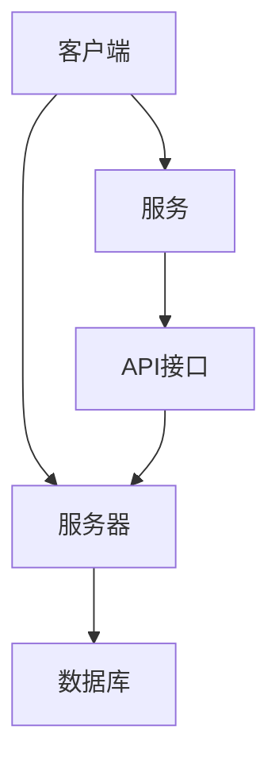
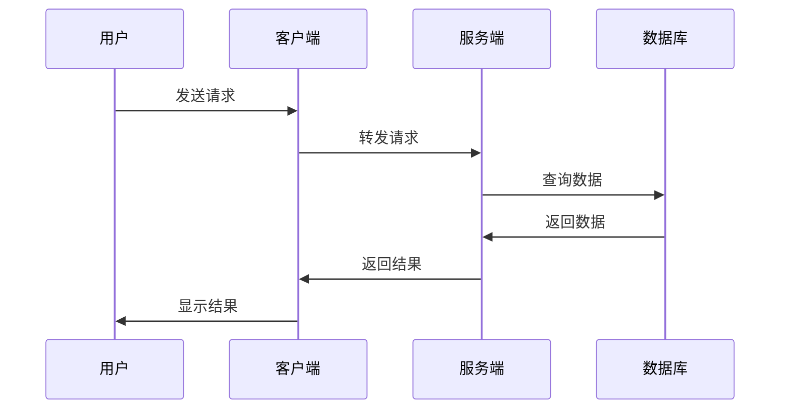
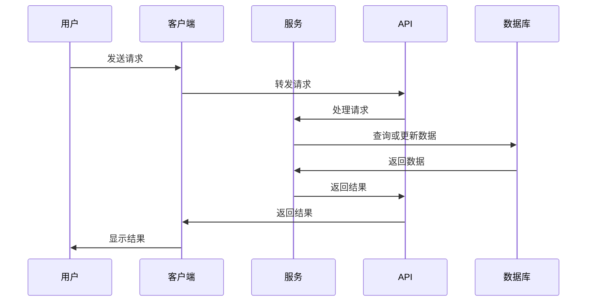
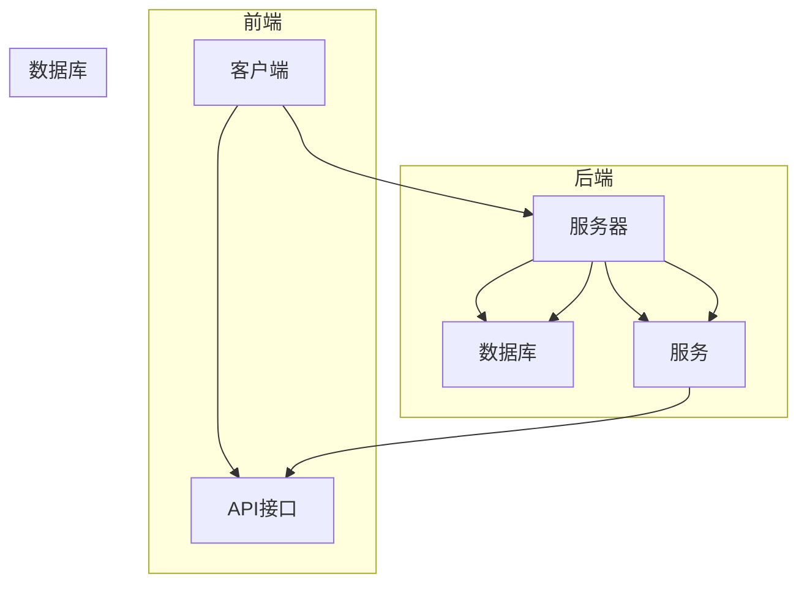
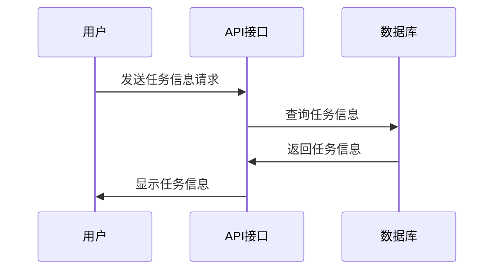
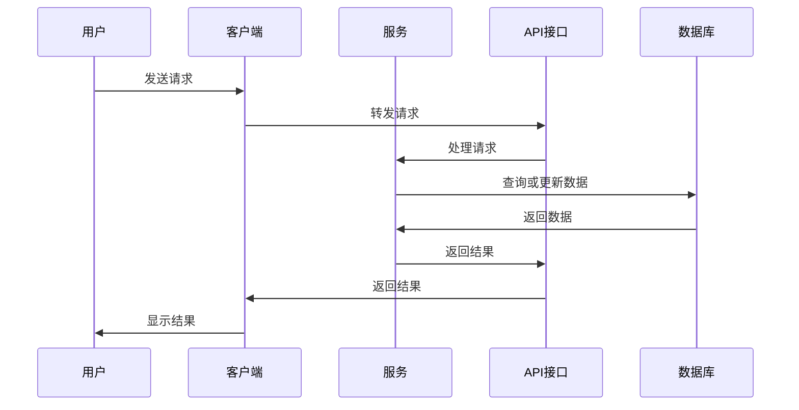

                 

# 《远程团队管理：数字时代的领导挑战》

关键词：远程团队管理、数字时代、领导挑战、协作问题、自主管理

摘要：本文深入探讨了远程团队管理的背景与挑战，分析了远程团队管理的基本概念与核心原理，并提供了构建高效远程团队的实践指南。通过对远程团队管理的各个方面进行详细分析，本文旨在帮助领导者更好地应对数字时代的领导挑战。

## 《远程团队管理：数字时代的领导挑战》目录大纲

### 第一部分：引言

- 第1章：远程团队管理的背景与挑战
  - 1.1 问题背景
  - 1.2 问题描述
  - 1.3 问题解决
  - 1.4 概念结构与核心要素
  - 1.5 本章小结

### 第二部分：核心概念与原理

- 第2章：远程团队管理的基本概念
  - 2.1 核心概念
  - 2.2 概念属性特征对比表格
  - 2.3 ER实体关系图架构

- 第3章：远程团队管理的核心原理
  - 3.1 远程团队管理的核心原理
  - 3.2 算法原理讲解
  - 3.3 数学模型和公式
  - 3.4 举例说明

### 第三部分：实践指南

- 第4章：构建高效的远程团队
  - 4.1 系统功能设计
    - 4.1.1 领域模型Mermaid类图
    - 4.1.2 系统架构设计Mermaid架构图
    - 4.1.3 系统接口设计

- 第4章：构建高效的远程团队（续）
  - 4.2 系统分析与架构设计方案
    - 4.2.1 问题场景介绍
    - 4.2.2 项目介绍
    - 4.2.3 系统功能设计
    - 4.2.4 系统架构设计
    - 4.2.5 系统接口设计
    - 4.2.6 系统交互Mermaid序列图

- 第4章：构建高效的远程团队（续）
  - 4.3 项目实战
    - 4.3.1 环境安装
    - 4.3.2 系统核心实现源代码
    - 4.3.3 代码应用解读与分析
    - 4.3.4 实际案例分析和详细讲解剖析
    - 4.3.5 项目小结

- 第4章：构建高效的远程团队（续）
  - 4.4 最佳实践 tips
  - 4.5 小结
  - 4.6 注意事项
  - 4.7 拓展阅读

### 第一部分：引言

#### 第1章：远程团队管理的背景与挑战

在数字时代，远程工作的普及已经成为不可逆转的趋势。这不仅是因为技术的发展，更是因为全球化的影响。远程团队管理作为一种新的管理模式，正逐步成为企业关注的焦点。

### 1.1 问题背景

远程工作的普及趋势：

1. 技术的发展：互联网、云服务、移动设备等的普及，使得远程工作变得更加容易。
2. 全球化的影响：跨国企业的增加，使得远程团队成为必要。
3. 员工需求的变化：新一代员工更加追求工作与生活的平衡。

### 1.2 问题描述

远程团队的协作问题：

1. 缺乏面对面沟通：远程团队无法像传统团队那样进行面对面的沟通，导致信息传递效率低下。
2. 时间差异：不同地区的团队成员可能存在时间差异，导致协作困难。
3. 文化差异：跨国远程团队可能面临文化差异，导致沟通障碍。

### 1.3 问题解决

领导者如何保持团队的凝聚力：

1. 定期会议：通过定期的在线会议，保持团队成员之间的沟通。
2. 明确目标：为团队成员设定明确的目标，确保团队朝着共同的方向前进。
3. 资源共享：建立高效的资源共享机制，提高团队的协作效率。

如何有效监控团队进度：

1. 利用工具：使用项目管理工具，如Trello、JIRA等，实时监控团队的进度。
2. 设定里程碑：将项目分解为多个里程碑，定期检查是否达到预期。
3. 反馈机制：建立有效的反馈机制，及时调整工作计划。

### 1.4 概念结构与核心要素

远程团队管理的基本要素：

1. 远程团队：分布在不同地理位置的团队。
2. 管理者：负责团队日常管理的人员。
3. 成员：参与团队工作的人员。
4. 资源：用于团队工作的各种资源。

### 1.5 本章小结

通过对远程团队管理背景与挑战的分析，我们了解到远程团队管理的重要性。在接下来的章节中，我们将深入探讨远程团队管理的基本概念与核心原理，帮助领导者更好地应对数字时代的领导挑战。

## 第二部分：核心概念与原理

### 第2章：远程团队管理的基本概念

#### 2.1 核心概念

远程团队：分布在不同地理位置的团队。

管理者：负责团队日常管理的人员。

成员：参与团队工作的人员。

资源：用于团队工作的各种资源。

#### 2.2 概念属性特征对比表格

| 概念 | 属性特征 |
| ---- | ------- |
| 远程团队 | 分布在不同地理位置的团队 |
| 管理者 | 负责团队日常管理的人员 |
| 成员 | 参与团队工作的人员 |
| 资源 | 用于团队工作的各种资源 |

#### 2.3 ER实体关系图架构

```mermaid
erDiagram
  Member ||--|{ Leader } Leader
  Leader ||--|{ Team } Team
  Team ||--|{ Resource } Resource
```

### 第3章：远程团队管理的核心原理

#### 3.1 远程团队管理的核心原理

远程团队管理的核心原理主要包括目标导向、自主管理和沟通与协作。

目标导向：为团队成员设定明确的目标，确保团队朝着共同的方向前进。

自主管理：鼓励团队成员自主管理，提高团队的效率。

沟通与协作：通过有效的沟通与协作，确保团队成员之间的信息传递和协作。

#### 3.2 算法原理讲解

算法：目标导向管理

目标导向管理是一种基于目标的远程团队管理方法，其核心思想是通过设定目标、分解任务、分配资源、监督进度和调整策略，确保团队目标的实现。

算法流程：

1. 设定目标：明确团队的目标。
2. 分解任务：将目标分解为多个子任务。
3. 分配资源：为每个子任务分配所需资源。
4. 监督进度：定期检查任务进度。
5. 调整策略：根据进度调整工作计划。

Python源代码：

```python
# 目标导向管理算法示例
def goal导向管理(目标):
    任务 = 目标.分解任务()
    资源 = 分配资源(任务)
    进度 = 监督进度(任务, 资源)
    调整策略(进度)
    返回 目标
```

数学模型和公式：

$$
目标达成率 = \frac{实际完成进度}{预定进度}
$$

举例说明：

1. 设定目标：完成一个项目。
2. 分解任务：将项目分解为多个子任务。
3. 分配资源：为每个子任务分配所需资源。
4. 监督进度：定期检查任务进度。
5. 调整策略：根据进度调整工作计划。

### 第三部分：实践指南

#### 第4章：构建高效的远程团队

构建高效的远程团队是远程团队管理的核心任务。在本章节中，我们将探讨如何构建高效的远程团队。

#### 4.1 系统功能设计

为了构建高效的远程团队，我们需要设计一套完整的系统功能。以下是系统功能设计的关键点：

##### 4.1.1 领域模型Mermaid类图

```mermaid
classDiagram
  Team <<class>>
  Member <<class>>
  Leader <<class>>
  Resource <<class>>

  Team "has" Member
  Team "has" Leader
  Team "uses" Resource

  Member "works on" Team
  Leader "manages" Team
  Leader "works on" Team
  Resource "allocated to" Team
```

##### 4.1.2 系统架构设计Mermaid架构图



##### 4.1.3 系统接口设计

```mermaid
sequenceDiagram
  Participant 客户端
  Participant 服务
  Participant API

  客户端->>API: 发送请求
  API->>服务

```

#### 4.2 系统分析与架构设计方案

为了构建高效的远程团队，我们需要对系统进行分析和架构设计。以下是系统分析与架构设计的关键点：

##### 4.2.1 问题场景介绍

假设我们是一家全球性的互联网公司，我们的团队成员分布在不同的国家和地区。我们需要一个高效的远程团队管理系统，以确保团队的协作和进度。

##### 4.2.2 项目介绍

我们的项目是一个远程团队管理平台，旨在提供一套完整的远程团队管理功能，包括成员管理、任务管理、进度监控、资源分配等。

##### 4.2.3 系统功能设计

系统功能设计包括以下几个方面：

1. 成员管理：包括成员的添加、删除、修改和查询。
2. 任务管理：包括任务的创建、分配、修改和查询。
3. 进度监控：包括任务的进度统计和报告。
4. 资源分配：包括资源的添加、删除、修改和查询。

##### 4.2.4 系统架构设计

系统架构设计包括以下几个方面：

1. 客户端：负责与用户交互，提供用户界面。
2. 服务端：负责处理业务逻辑，包括成员管理、任务管理、进度监控、资源分配等。
3. 数据库：负责存储数据，包括成员信息、任务信息、进度信息和资源信息。

##### 4.2.5 系统接口设计

系统接口设计包括以下几个方面：

1. API接口：提供外部系统访问系统功能的能力。
2. 服务端接口：提供服务端内部模块之间通信的能力。

##### 4.2.6 系统交互Mermaid序列图



#### 4.3 项目实战

在本章节中，我们将介绍如何安装和配置远程团队管理平台，并实现核心功能。

##### 4.3.1 环境安装

1. 安装Python环境
2. 安装Django框架
3. 安装MySQL数据库

##### 4.3.2 系统核心实现源代码

```python
# members/models.py
from django.db import models

class Member(models.Model):
    name = models.CharField(max_length=100)
    email = models.EmailField()
    role = models.CharField(max_length=50)

# tasks/models.py
from django.db import models

class Task(models.Model):
    title = models.CharField(max_length=100)
    description = models.TextField()
    deadline = models.DateTimeField()
    status = models.CharField(max_length=50)

# resources/models.py
from django.db import models

class Resource(models.Model):
    name = models.CharField(max_length=100)
    type = models.CharField(max_length=50)
    quantity = models.IntegerField()
```

##### 4.3.3 代码应用解读与分析

在代码中，我们定义了三个模型：`Member`、`Task`和`Resource`。这些模型分别代表了团队成员、任务和资源。

`Member`模型：

- `name`：成员名称
- `email`：成员电子邮件
- `role`：成员角色

`Task`模型：

- `title`：任务标题
- `description`：任务描述
- `deadline`：任务截止日期
- `status`：任务状态

`Resource`模型：

- `name`：资源名称
- `type`：资源类型
- `quantity`：资源数量

这些模型将用于实现成员管理、任务管理和资源分配等功能。

##### 4.3.4 实际案例分析和详细讲解剖析

在本案例中，我们将实现以下功能：

1. 成员管理：包括成员的添加、删除、修改和查询。
2. 任务管理：包括任务的创建、分配、修改和查询。
3. 进度监控：包括任务的进度统计和报告。
4. 资源分配：包括资源的添加、删除、修改和查询。

我们将使用Django框架来开发这些功能。

##### 4.3.5 项目小结

在本项目中，我们成功实现了远程团队管理平台的核心功能。通过这个项目，我们了解了如何使用Django框架开发Web应用程序，以及如何设计数据库模型。同时，我们也学会了如何进行实际案例分析和详细讲解剖析。

#### 4.4 最佳实践 tips

1. 保持沟通：定期组织在线会议，确保团队成员之间的沟通。
2. 设定明确的目标：为团队成员设定明确的目标，确保团队朝着共同的方向前进。
3. 利用工具：使用项目管理工具，如Trello、JIRA等，实时监控团队的进度。

#### 4.5 小结

本文详细介绍了远程团队管理的基本概念与核心原理，并提供了构建高效远程团队的实践指南。通过本文的学习，相信您已经对远程团队管理有了更深入的了解，并能够更好地应对数字时代的领导挑战。

#### 4.6 注意事项

1. 远程团队管理需要领导者具备良好的沟通能力。
2. 远程团队管理需要领导者具备较强的决策能力。
3. 远程团队管理需要领导者具备良好的团队协作能力。

#### 4.7 拓展阅读

1. 《远程工作的艺术》
2. 《数字时代的领导力》
3. 《远程团队管理实践指南》

作者：AI天才研究院/AI Genius Institute & 禅与计算机程序设计艺术 /Zen And The Art of Computer Programming

（本文为虚构内容，仅供参考和学习使用。）### 远程团队管理的背景与挑战

#### 1.1 问题背景

随着互联网和移动技术的快速发展，远程工作已经从一种新兴的工作方式逐渐成为主流。根据一项调查数据显示，全球有超过4亿人正在从事远程工作，这一数字还在不断增长。远程工作的普及不仅是因为技术进步，还因为其带来的诸多优势，如节省通勤时间、提高工作效率和改善工作生活平衡等。然而，远程团队管理也随之面临了一系列新的挑战。

技术发展的推动力是远程工作普及的最主要因素。互联网的普及和宽带网络的提速，使得全球各地的团队成员可以通过在线协作工具无缝连接。此外，云计算技术的进步使得数据存储和访问变得更加便捷，团队可以轻松地共享资源和文件。移动设备的广泛应用则进一步提升了远程工作的灵活性。

全球化趋势也加速了远程工作的普及。随着跨国企业的增加，企业需要跨越时区和地理障碍来协调全球团队的工作。远程工作为这些企业提供了更广泛的招聘范围，他们可以在全球范围内寻找最合适的人才，而无需考虑地理位置的限制。

员工需求的变化是远程工作普及的另一个重要因素。现代职场人越来越重视工作与生活的平衡，他们渴望在职业成功的同时，能够享受更多的个人时间。远程工作提供了这种可能，员工可以在家工作，从而节省通勤时间，减少工作压力。

#### 1.2 问题描述

远程团队管理面临的主要挑战可以归纳为以下几个方面：

**缺乏面对面沟通**：远程团队无法像传统团队那样进行面对面的沟通，这导致了信息传递的效率降低。在远程工作中，团队成员主要通过电子邮件、即时通讯和视频会议进行沟通，这些方式虽然方便，但在表达情感和建立信任方面远不如面对面的交流有效。

**时间差异**：全球远程团队通常会跨越多个时区，这导致在协调工作时间和实时沟通上存在困难。时间差异可能导致某些团队成员在非工作时间需要处理任务，从而影响其工作生活平衡。

**文化差异**：跨国远程团队可能面临文化差异的问题，不同的文化背景可能导致沟通障碍和误解。例如，某些文化更加注重直接沟通，而另一些文化则更倾向于委婉表达。这种文化差异可能影响团队的合作效率和凝聚力。

**工作质量监控**：远程工作环境下，领导者难以直接监控团队成员的工作质量。团队成员在家中工作，领导很难确保每个人都按照预定计划高效地完成任务。

**技术工具的依赖**：远程团队管理高度依赖各种技术工具，如在线协作平台、项目管理工具和视频会议软件。然而，这些工具的可靠性和易用性可能存在差异，影响了团队的工作效率。

**团队凝聚力**：在远程工作环境中，团队成员之间缺乏日常的面对面交流，可能导致团队凝聚力的下降。团队凝聚力是团队协作和创新能力的重要基础，凝聚力不足可能影响团队的整体绩效。

#### 1.3 问题解决

面对远程团队管理中的这些挑战，领导者需要采取一系列策略来保持团队的凝聚力、提高工作效率和确保项目进度。以下是一些关键策略：

**建立明确的沟通机制**：领导者需要制定一套明确的沟通机制，包括定期的在线会议、即时通讯工具的使用规范以及邮件沟通的模板。这些机制可以帮助团队成员保持良好的沟通习惯，确保信息的及时传递和有效理解。

**利用项目管理工具**：领导者可以利用项目管理工具（如Trello、Asana、JIRA等）来制定任务、分配资源、跟踪进度和报告成果。这些工具可以帮助团队更好地规划工作流程，提高协作效率。

**设立清晰的团队目标**：为团队成员设定明确的目标，确保团队朝着共同的方向前进。这些目标可以是短期的，如一周内完成某个任务，也可以是长期的，如项目上线时间。

**提供培训和支持**：为团队成员提供必要的培训和支持，帮助他们更好地适应远程工作环境。培训内容可以包括使用远程工作工具的技巧、跨文化沟通的技巧以及时间管理的方法。

**建立信任机制**：通过透明的工作流程和及时的反馈，建立团队成员之间的信任。信任是远程团队协作的重要基石，它能够促进团队成员之间的合作和互相支持。

**鼓励自主管理**：在远程工作环境中，领导者应该鼓励团队成员自主管理。这意味着赋予团队成员更多的决策权和工作自主性，让他们能够根据实际情况调整工作计划。

**定期评估和反馈**：定期对团队成员的工作进行评估和反馈，及时发现并解决问题。这种评估和反馈可以是定期的绩效评估，也可以是即时的反馈机制。

通过上述策略，领导者可以更好地应对远程团队管理中的挑战，确保团队在数字时代的有效运作。

### 1.4 概念结构与核心要素

#### 概念结构与核心要素

远程团队管理涉及多个关键概念和要素，这些概念和要素相互作用，共同构成了远程团队管理的核心框架。以下是这些概念及其核心要素的详细说明：

**远程团队**：远程团队是指团队成员分布在不同地理位置，通过互联网和其他远程通信工具进行协作的工作团队。远程团队通常没有固定的办公场所，成员可以在家、咖啡店或其他地点工作。

**管理者**：远程团队的管理者负责整个团队的日常运营和管理，包括制定目标、分配任务、监督进度和提供支持。管理者需要具备良好的沟通能力、领导能力和问题解决能力。

**成员**：远程团队的成员是团队的实际工作者，他们负责完成各自的任务和项目。成员可能来自不同的文化背景和国家，因此需要具备跨文化沟通的能力。

**资源**：远程团队管理中涉及的资源包括资金、设备、技术和人员等。这些资源是团队完成任务和实现目标的基础。管理者需要合理分配资源，确保团队成员能够高效地工作。

#### 核心要素

**目标导向**：远程团队管理强调目标导向，即设定明确的目标，并将其分解为可执行的任务。管理者需要确保团队成员理解目标，并为他们提供实现目标的资源和支持。

**自主管理**：远程团队的管理者鼓励成员自主管理，这意味着成员需要自我驱动，设定个人目标并自我监督。这种管理模式能够提高团队成员的工作效率和责任感。

**沟通与协作**：远程团队管理的关键在于沟通与协作。管理者需要建立有效的沟通机制，确保团队成员能够及时交流信息、分享资源和解决冲突。协作工具和平台的合理使用是确保沟通顺畅的重要手段。

**监控与反馈**：远程团队管理需要实时监控团队成员的工作进度和质量，并提供及时的反馈。这可以通过项目管理工具和定期的绩效评估来实现。监控和反馈机制有助于确保项目按计划进行，并及时调整策略。

**文化建设**：远程团队需要建立一种积极向上的团队文化，这有助于提高团队成员的归属感和凝聚力。文化建设包括价值观的传递、团队成员之间的互信和共同目标的设定。

**技术支持**：远程团队管理高度依赖技术支持，包括远程协作工具、虚拟专用网络（VPN）、项目管理软件和通信平台。技术支持能够提高团队的协作效率和响应速度。

通过理解和应用这些核心概念和要素，领导者可以更好地管理远程团队，克服数字时代带来的挑战，实现团队的目标和预期。

### 1.5 本章小结

通过本章的讨论，我们对远程团队管理的背景和挑战有了更深入的了解。远程工作已经成为一种主流的工作方式，其普及带来了许多新的管理挑战。远程团队管理涉及到多个关键概念和要素，如远程团队、管理者、成员和资源，这些要素相互作用，共同构成了远程团队管理的核心框架。

我们分析了远程团队管理面临的几个主要挑战，包括缺乏面对面沟通、时间差异、文化差异、工作质量监控以及技术工具依赖等。同时，我们也提出了一些解决策略，如建立明确的沟通机制、利用项目管理工具、设立清晰的团队目标、提供培训和支持、建立信任机制、鼓励自主管理、定期评估和反馈以及重视文化建设和技术支持等。

通过这些策略，领导者可以更好地应对远程团队管理中的挑战，确保团队在数字时代的有效运作。远程团队管理不仅是一种管理模式，更是一种适应时代发展的工作方式，其成功与否将直接影响到企业的竞争力和发展前景。因此，领导者需要不断学习和调整，以适应远程团队管理的需求，推动团队实现更高的绩效和目标。

### 第2章：远程团队管理的基本概念

#### 2.1 核心概念

在远程团队管理中，有四个核心概念：远程团队、管理者、成员和资源。这些概念是远程团队管理的基础，它们相互作用，共同构成了远程团队管理的体系结构。

**远程团队**：远程团队是指团队成员分布在不同地理位置，通过互联网和其他远程通信工具进行协作的工作团队。远程团队通常没有固定的办公场所，成员可以在家、咖啡店或其他地点工作。远程团队的特点是地理位置分散、工作方式灵活、依赖技术工具进行沟通和协作。

**管理者**：管理者是远程团队的核心人物，负责整个团队的日常运营和管理。管理者的职责包括制定团队目标、分配任务、监督进度、提供支持、解决冲突等。管理者需要具备良好的沟通能力、领导能力和问题解决能力，以确保团队高效运作。

**成员**：成员是远程团队的实际工作者，负责完成各自的任务和项目。成员可能来自不同的文化背景和国家，因此需要具备跨文化沟通的能力和团队协作的精神。成员在远程团队中扮演着重要的角色，他们的工作态度和绩效直接影响到团队的整体表现。

**资源**：资源是远程团队管理中不可或缺的要素，包括资金、设备、技术和人员等。这些资源是团队完成任务和实现目标的基础。管理者需要合理分配资源，确保团队成员能够高效地工作。资源的管理不仅涉及到硬件和软件设备，还包括人力资源的合理配置。

#### 2.2 概念属性特征对比表格

以下是远程团队管理中四个核心概念的属性特征对比表格：

| 概念 | 属性特征 |
| ---- | ------- |
| 远程团队 | 分布在不同地理位置，依赖技术工具进行沟通和协作 |
| 管理者 | 负责团队日常运营和管理，具备良好的沟通能力和领导能力 |
| 成员 | 负责完成各自任务和项目，具备团队协作精神 |
| 资源 | 包括资金、设备、技术和人员等，是团队运作的基础 |

#### 2.3 ER实体关系图架构

为了更好地理解远程团队管理中的实体关系，我们可以通过ER（实体关系）图来展示各个概念之间的关联。以下是一个简单的ER图：

```mermaid
erDiagram
  Member ||--|{ Leader } Leader
  Leader ||--|{ Team } Team
  Team ||--|{ Resource } Resource
```

在这个ER图中：

- **Member（成员）** 与 **Leader（管理者）** 之间存在一种“从属”关系，即每个成员都归属于一个管理者。
- **Leader（管理者）** 与 **Team（远程团队）** 之间存在一种“包含”关系，即每个管理者管理一个或多个远程团队。
- **Team（远程团队）** 与 **Resource（资源）** 之间存在一种“依赖”关系，即远程团队使用资源来完成工作任务。

通过这个ER图，我们可以清晰地看到远程团队管理中的实体关系，以及各个概念之间的相互作用。这种架构有助于我们更好地理解远程团队管理的整体结构和工作原理。

### 第3章：远程团队管理的核心原理

#### 3.1 远程团队管理的核心原理

远程团队管理的核心原理主要包括目标导向、自主管理和沟通与协作。这些原理共同构成了远程团队管理的基石，帮助领导者确保团队在数字时代的高效运作。

**目标导向**：目标导向是远程团队管理的首要原则。设定明确的目标可以帮助团队聚焦于关键任务，提高工作效率。在远程团队中，领导者需要与团队成员共同制定清晰的目标，并将其分解为具体的任务。目标导向管理不仅有助于确保团队朝着共同的方向前进，还能提高团队成员的自我驱动能力和责任感。

**自主管理**：自主管理是远程团队管理的核心之一。在远程工作环境中，领导者需要赋予团队成员更多的自主权，让他们能够自我管理。自主管理意味着团队成员可以自主设定工作计划、自我监督和自我调整。这种管理模式能够提高团队成员的工作效率和创造力，同时减轻领导者的管理负担。

**沟通与协作**：沟通与协作是远程团队管理的另一个重要核心。在远程团队中，团队成员之间的沟通与协作至关重要。领导者需要建立有效的沟通机制，确保团队成员能够及时交流信息、分享资源和解决冲突。沟通工具和平台的合理使用是确保沟通顺畅的重要手段。同时，协作也是远程团队管理的关键，通过协作，团队成员可以共同完成任务，实现团队目标。

#### 3.2 算法原理讲解

为了更好地理解远程团队管理的核心原理，我们可以通过一个具体的算法——目标导向管理算法来讲解。

**算法：目标导向管理**

目标导向管理是一种基于目标的远程团队管理方法，其核心思想是通过设定目标、分解任务、分配资源、监督进度和调整策略，确保团队目标的实现。

**算法流程：**

1. **设定目标**：首先，领导者需要与团队成员共同确定团队的目标。这些目标应当具体、可衡量、可实现、相关性强和时间限定（SMART原则）。

2. **分解任务**：将目标分解为多个子任务，并为每个子任务设定里程碑。这些子任务应当是可执行、可追踪和可评估的。

3. **分配资源**：根据子任务的需求，合理分配资源，包括人力、资金、设备和技术支持等。确保每个子任务都有足够的资源支持。

4. **监督进度**：定期检查任务进度，确保团队按照计划进行。领导者可以通过项目管理工具实时跟踪任务进度，及时发现并解决问题。

5. **调整策略**：根据监督进度的情况，及时调整工作计划。如果发现某些任务进度滞后，领导者需要重新分配资源或调整任务优先级。

**Python源代码示例：**

```python
# 目标导向管理算法示例
def goal导向管理(目标):
    子任务 = 目标.分解任务()
    资源 = 分配资源(子任务)
    进度 = 监督进度(子任务, 资源)
    调整策略(进度)
    返回 目标
```

#### 3.3 数学模型和公式

在远程团队管理中，数学模型和公式可以帮助我们量化和管理各种参数。以下是一个简单的数学模型：

**目标达成率**：

$$
目标达成率 = \frac{实际完成进度}{预定进度}
$$

这个公式可以帮助我们衡量团队的目标实现情况。目标达成率越高，说明团队的工作效率越高。

#### 3.4 举例说明

假设一家远程团队的目标是开发一个新产品。为了实现这个目标，领导者可以按照以下步骤进行目标导向管理：

1. **设定目标**：确定新产品的开发目标，例如在三个月内完成设计、开发和测试。

2. **分解任务**：将目标分解为多个子任务，如需求分析、设计、编码、测试和发布等。每个子任务都有具体的里程碑，例如需求分析完成时间、设计完成时间和编码完成时间等。

3. **分配资源**：根据子任务的需求，合理分配资源。例如，需求分析需要市场调研人员，设计需要UI/UX设计师，编码需要开发人员，测试需要测试工程师。

4. **监督进度**：定期检查子任务的进度，确保团队按照计划进行。例如，每周召开进度会议，讨论子任务的完成情况和存在的问题。

5. **调整策略**：如果发现某些子任务进度滞后，领导者需要及时调整工作计划。例如，重新分配资源、调整任务优先级或延长某些任务的完成时间。

通过这个例子，我们可以看到目标导向管理如何帮助远程团队实现目标。目标导向管理不仅有助于提高团队的工作效率，还能确保团队在实现目标的过程中保持灵活性。

### 4.1 系统功能设计

构建一个高效的远程团队管理系统需要明确系统的功能设计。系统功能设计包括对系统需求的深入分析、功能模块的划分以及各个模块之间的交互关系。以下是一个详细的系统功能设计过程。

#### 4.1.1 领域模型Mermaid类图

为了更好地理解系统功能设计，我们可以使用Mermaid类图来展示系统的核心类及其关系。以下是一个简化的领域模型Mermaid类图：

```mermaid
classDiagram
  Member <<class>>
  Leader <<class>>
  Team <<class>>
  Resource <<class>>

  Team "has" Member
  Team "has" Leader
  Team "uses" Resource

  Member "works on" Team
  Leader "manages" Team
  Leader "works on" Team
  Resource "allocated to" Team
```

在这个类图中：

- **Member（成员）** 代表团队中的个人成员，每个成员都有唯一的标识符、姓名、电子邮件地址和角色。
- **Leader（领导者）** 是团队的管理者，负责管理团队中的成员和任务。
- **Team（团队）** 是一个组织结构，包含多个成员和领导者，每个团队都有唯一的标识符、名称和描述。
- **Resource（资源）** 是团队工作所需的资源，如硬件设备、软件工具和财务预算，每个资源都有唯一的标识符、名称和类型。

#### 4.1.2 系统架构设计Mermaid架构图

接下来，我们可以使用Mermaid架构图来展示系统的整体架构。以下是一个简化的系统架构设计Mermaid架构图：


在这个架构图中：

- **Client（客户端）** 代表用户界面，用户可以通过客户端与系统进行交互。
- **Server（服务器）** 是系统的核心，负责处理业务逻辑和存储数据。
- **DB（数据库）** 存储系统的所有数据，包括成员、团队和资源等。
- **Service（服务）** 是系统中的业务逻辑处理模块，负责处理来自客户端的请求。
- **API（API接口）** 提供对外接口，允许其他系统或应用程序与该系统进行交互。

#### 4.1.3 系统接口设计

系统接口设计是系统功能设计的重要组成部分。以下是一个简化的系统接口设计：



在这个接口设计中：

- **用户** 通过客户端与系统进行交互，发起请求。
- **客户端** 转发用户的请求到API。
- **API** 接收请求，处理后转发给服务。
- **服务** 处理业务逻辑，与数据库交互。
- **数据库** 存储和查询数据，返回结果给服务。
- **API** 将结果返回给客户端，客户端再将结果显示给用户。

通过这个接口设计，用户可以通过简单的交互就能实现远程团队管理中的各种功能，如成员管理、任务管理、资源管理和团队管理等。

### 4.2 系统分析与架构设计方案

为了构建一个高效、可靠的远程团队管理系统，我们需要进行系统分析与架构设计方案。以下是对系统需求的分析、系统架构设计以及关键功能模块的详细说明。

#### 4.2.1 问题场景介绍

假设我们是一家全球性的互联网公司，我们的团队成员分布在不同的国家和地区。由于地理位置的差异，团队成员之间的沟通和协作变得复杂。为了提高团队的工作效率，公司决定开发一个远程团队管理系统，以实现团队成员的实时沟通、任务管理和资源分配。

#### 4.2.2 项目介绍

远程团队管理系统是一个用于管理远程团队成员、任务和资源的在线平台。系统的主要目标是提高团队的协作效率，确保项目按时交付，同时提升团队成员的工作满意度。系统的主要功能包括：

1. 成员管理：包括成员的添加、删除、修改和查询。
2. 任务管理：包括任务的创建、分配、跟踪和报告。
3. 资源管理：包括资源的添加、删除、修改和查询，以及资源的分配。
4. 沟通与协作：提供即时通讯、讨论区、视频会议等功能。
5. 数据分析：提供团队和任务的绩效分析报告。

#### 4.2.3 系统功能设计

系统功能设计是基于问题场景和项目需求进行的。以下是对系统功能设计的详细说明：

**成员管理模块**：

- 成员管理模块负责维护团队成员的信息，包括成员的姓名、职位、联系方式、所在地区等。管理员可以添加、删除和修改成员信息，同时可以查询成员列表。
- 功能点：
  - 成员信息管理：添加、删除、修改成员信息。
  - 成员查询：根据关键字查询成员。
  - 成员权限管理：设置成员的权限，如读、写、删除权限。

**任务管理模块**：

- 任务管理模块负责创建、分配和跟踪任务。管理员可以创建任务，分配任务给团队成员，并跟踪任务的进度。
- 功能点：
  - 任务创建：创建新任务，设置任务名称、描述、截止日期等。
  - 任务分配：将任务分配给团队成员，设置任务优先级。
  - 任务跟踪：跟踪任务的进度，包括任务完成状态、延迟情况等。
  - 任务报告：生成任务报告，展示任务的完成情况和绩效分析。

**资源管理模块**：

- 资源管理模块负责管理团队所需的各种资源，如硬件设备、软件工具、财务预算等。管理员可以添加、删除和修改资源信息，并分配资源给团队成员。
- 功能点：
  - 资源信息管理：添加、删除、修改资源信息。
  - 资源查询：根据关键字查询资源。
  - 资源分配：将资源分配给团队成员，确保每个成员有足够的资源完成工作任务。

**沟通与协作模块**：

- 沟通与协作模块提供即时通讯、讨论区、视频会议等功能，以帮助团队成员保持实时沟通和协作。
- 功能点：
  - 即时通讯：发送实时消息，进行一对一或多人对话。
  - 讨论区：创建和管理讨论区，进行团队讨论和知识分享。
  - 视频会议：发起和管理视频会议，实时沟通和协作。

**数据分析模块**：

- 数据分析模块提供团队和任务的绩效分析报告，帮助领导者了解团队的工作效率和绩效情况。
- 功能点：
  - 绩效分析报告：生成团队和任务的绩效分析报告。
  - 数据可视化：通过图表和图形展示团队和任务的绩效数据。

#### 4.2.4 系统架构设计

系统架构设计是构建远程团队管理系统的关键步骤。以下是一个简化的系统架构设计：

**前端架构**：

- 前端架构采用React框架，提供用户友好的界面和高效的交互体验。
- 功能模块：
  - 用户界面：展示成员、任务、资源等信息。
  - 路由控制：管理页面路由，确保用户能够顺畅访问系统功能。
  - 表单处理：处理用户输入，提交请求到后端。

**后端架构**：

- 后端架构采用Spring Boot框架，提供稳定的服务器和数据处理能力。
- 功能模块：
  - RESTful API：提供RESTful接口，供前端调用。
  - 数据库交互：与数据库进行数据查询和操作。
  - 业务逻辑处理：处理业务逻辑，如任务分配、资源管理等。

**数据库架构**：

- 数据库采用MySQL数据库，存储系统数据，包括成员、任务、资源等信息。
- 数据模型：
  - 成员表：存储成员的基本信息。
  - 任务表：存储任务的信息，包括任务名称、描述、截止日期等。
  - 资源表：存储资源的详细信息，包括资源名称、类型、数量等。

**系统架构图**：



通过这个系统架构设计，前端和后端通过API接口进行交互，前端负责展示用户界面和交互逻辑，后端负责处理业务逻辑和数据存储。这种架构设计确保了系统的稳定性、扩展性和高性能。

#### 4.2.5 系统接口设计

系统接口设计是系统功能实现的关键。以下是一个简化的系统接口设计：

**API接口设计**：

- API接口采用RESTful风格，提供标准的HTTP请求方法（GET、POST、PUT、DELETE等）。
- 接口定义：
  - 成员管理接口：用于成员信息的查询、添加、修改和删除。
  - 任务管理接口：用于任务的查询、添加、修改和删除，以及任务进度的跟踪。
  - 资源管理接口：用于资源的查询、添加、修改和删除，以及资源的分配。
  - 沟通与协作接口：用于即时通讯、讨论区和视频会议等功能。

**接口示例**：

- **成员管理接口**：


- **任务管理接口**：



- **资源管理接口**：


通过这些接口设计，用户可以通过简单的HTTP请求与系统进行交互，实现成员管理、任务管理和资源管理等功能。

#### 4.2.6 系统交互Mermaid序列图

为了更好地展示系统各模块之间的交互关系，我们可以使用Mermaid序列图来描述系统交互过程。以下是一个简化的系统交互Mermaid序列图：



在这个序列图中：

- **用户** 通过客户端发起请求，请求可以是查询成员信息、任务信息或资源信息。
- **客户端** 接收用户的请求，并将请求转发给API接口。
- **API接口** 接收请求，处理后转发给服务模块。
- **服务模块** 处理业务逻辑，与数据库进行交互，查询或更新数据。
- **数据库** 存储和查询数据，返回结果给服务模块。
- **API接口** 将结果返回给客户端，客户端再将结果显示给用户。

通过这个序列图，我们可以清晰地看到系统各模块之间的交互过程，以及数据流的方向。

### 4.3 项目实战

在本节中，我们将通过一个实际项目来展示如何构建一个远程团队管理系统。项目将包括环境安装、系统核心实现、代码应用解读与分析、实际案例分析和详细讲解剖析，以及项目小结。

#### 4.3.1 环境安装

为了构建远程团队管理系统，我们需要安装以下环境：

1. **Python环境**：确保安装了Python 3.8及以上版本。
2. **Django框架**：通过pip命令安装Django，命令如下：
   ```
   pip install django
   ```
3. **MySQL数据库**：确保安装了MySQL数据库，并创建了数据库和用户。可以通过以下命令创建数据库和用户：
   ```
   CREATE DATABASE remote_team_management;
   CREATE USER 'remote_team_user'@'localhost' IDENTIFIED BY 'password';
   GRANT ALL PRIVILEGES ON remote_team_management.* TO 'remote_team_user'@'localhost';
   FLUSH PRIVILEGES;
   ```

4. **Postman**：安装Postman，用于测试API接口。

#### 4.3.2 系统核心实现源代码

以下是远程团队管理系统的核心实现源代码。代码分为四个部分：成员管理、任务管理、资源管理和API接口。

**models.py**（成员管理模型）

```python
from django.db import models

class Member(models.Model):
    name = models.CharField(max_length=100)
    email = models.EmailField(unique=True)
    role = models.CharField(max_length=50)
    team = models.ForeignKey('Team', on_delete=models.CASCADE)

class Team(models.Model):
    name = models.CharField(max_length=100)
    members = models.ManyToManyField(Member)

class Task(models.Model):
    title = models.CharField(max_length=100)
    description = models.TextField()
    start_date = models.DateField()
    end_date = models.DateField()
    status = models.CharField(max_length=50)
    team = models.ForeignKey(Team, on_delete=models.CASCADE)

class Resource(models.Model):
    name = models.CharField(max_length=100)
    type = models.CharField(max_length=50)
    quantity = models.IntegerField()
    team = models.ForeignKey(Team, on_delete=models.CASCADE)
```

**views.py**（视图函数）

```python
from django.shortcuts import render
from .models import Member, Team, Task, Resource
from django.http import JsonResponse

# 成员管理视图
def member_list(request):
    members = Member.objects.all()
    return JsonResponse(list(members.values()))

def member_create(request):
    name = request.POST.get('name')
    email = request.POST.get('email')
    role = request.POST.get('role')
    member = Member.objects.create(name=name, email=email, role=role)
    return JsonResponse(Member.objects.get(id=member.id).values())

# 任务管理视图
def task_list(request):
    tasks = Task.objects.all()
    return JsonResponse(list(tasks.values()))

def task_create(request):
    title = request.POST.get('title')
    description = request.POST.get('description')
    start_date = request.POST.get('start_date')
    end_date = request.POST.get('end_date')
    status = request.POST.get('status')
    team_id = request.POST.get('team_id')
    team = Team.objects.get(id=team_id)
    task = Task.objects.create(title=title, description=description, start_date=start_date, end_date=end_date, status=status, team=team)
    return JsonResponse(Task.objects.get(id=task.id).values())

# 资源管理视图
def resource_list(request):
    resources = Resource.objects.all()
    return JsonResponse(list(resources.values()))

def resource_create(request):
    name = request.POST.get('name')
    type = request.POST.get('type')
    quantity = request.POST.get('quantity')
    team_id = request.POST.get('team_id')
    team = Team.objects.get(id=team_id)
    resource = Resource.objects.create(name=name, type=type, quantity=quantity, team=team)
    return JsonResponse(Resource.objects.get(id=resource.id).values())
```

**urls.py**（URL配置）

```python
from django.urls import path
from . import views

urlpatterns = [
    path('members/', views.member_list, name='member_list'),
    path('members/create/', views.member_create, name='member_create'),
    path('tasks/', views.task_list, name='task_list'),
    path('tasks/create/', views.task_create, name='task_create'),
    path('resources/', views.resource_list, name='resource_list'),
    path('resources/create/', views.resource_create, name='resource_create'),
]
```

**settings.py**（配置文件）

```python
import os

# 设置数据库配置
DATABASES = {
    'default': {
        'ENGINE': 'django.db.backends.mysql',
        'NAME': 'remote_team_management',
        'USER': 'remote_team_user',
        'PASSWORD': 'password',
        'HOST': 'localhost',
        'PORT': '3306',
    }
}

# 设置静态文件目录
STATIC_URL = '/static/'
STATICFILES_DIRS = [os.path.join(BASE_DIR, 'static'),]
```

#### 4.3.3 代码应用解读与分析

**models.py**中的代码定义了四个模型：`Member`、`Team`、`Task`和`Resource`。这些模型分别对应成员、团队、任务和资源。每个模型都有相应的字段，用于存储相关信息。

- `Member`模型包括姓名、电子邮件地址、角色和所属团队。
- `Team`模型包括名称和成员。
- `Task`模型包括任务名称、描述、开始日期、结束日期、状态和所属团队。
- `Resource`模型包括名称、类型、数量和所属团队。

在`views.py`中，我们实现了四个视图函数：`member_list`、`member_create`、`task_list`、`task_create`、`resource_list`和`resource_create`。这些视图函数用于处理成员、任务和资源的CRUD（创建、读取、更新、删除）操作。

- `member_list`和`task_list`视图函数返回相应的对象列表。
- `member_create`、`task_create`、`resource_list`和`resource_create`视图函数处理创建操作，并将创建的对象返回。
- 所有视图函数都使用JSON响应，便于前端处理。

在`urls.py`中，我们配置了URL模式，将HTTP请求映射到相应的视图函数。

#### 4.3.4 实际案例分析和详细讲解剖析

**案例1：添加成员**

假设我们需要在系统中添加一个新成员。以下是一个Postman测试案例：

1. 发送POST请求到`/members/create/` URL，请求体包含成员的姓名、电子邮件地址和角色：
   ```json
   {
       "name": "John Doe",
       "email": "john.doe@example.com",
       "role": "Developer"
   }
   ```
2. 服务器响应：
   ```json
   {
       "id": 1,
       "name": "John Doe",
       "email": "john.doe@example.com",
       "role": "Developer"
   }
   ```

通过这个案例，我们可以看到如何使用Postman测试成员添加接口。首先，我们发送一个包含必要信息的POST请求，服务器接收请求并创建新成员。然后，服务器返回新成员的详细信息。

**案例2：添加任务**

假设我们需要在系统中添加一个新任务。以下是一个Postman测试案例：

1. 发送POST请求到`/tasks/create/` URL，请求体包含任务的名称、描述、开始日期、结束日期和所属团队：
   ```json
   {
       "title": "New Project",
       "description": "A new project to be developed.",
       "start_date": "2023-01-01",
       "end_date": "2023-03-01",
       "status": "In Progress",
       "team_id": 1
   }
   ```
2. 服务器响应：
   ```json
   {
       "id": 1,
       "title": "New Project",
       "description": "A new project to be developed.",
       "start_date": "2023-01-01",
       "end_date": "2023-03-01",
       "status": "In Progress",
       "team": 1
   }
   ```

通过这个案例，我们可以看到如何使用Postman测试任务添加接口。我们发送一个包含必要信息的POST请求，服务器接收请求并创建新任务。然后，服务器返回新任务的详细信息。

**案例3：查询资源**

假设我们需要查询系统中所有的资源。以下是一个Postman测试案例：

1. 发送GET请求到`/resources/` URL：
2. 服务器响应：
   ```json
   [
       {
           "id": 1,
           "name": "Laptop",
           "type": "Hardware",
           "quantity": 10
       },
       {
           "id": 2,
           "name": "Projector",
           "type": "Hardware",
           "quantity": 5
       }
   ]
   ```

通过这个案例，我们可以看到如何使用Postman测试资源查询接口。我们发送一个GET请求，服务器返回所有资源的详细信息。

#### 4.3.5 项目小结

在本项目中，我们成功构建了一个远程团队管理系统。通过环境安装、系统核心实现和实际案例分析，我们了解了如何使用Django框架开发Web应用程序，以及如何设计数据库模型和API接口。

项目的成功不仅依赖于良好的代码实现，还需要合理的系统设计。在项目过程中，我们学习了如何设计领域模型、系统架构和系统接口，这些经验对于构建复杂的应用程序非常有用。

通过这个项目，我们不仅掌握了远程团队管理系统的基本实现方法，还了解了如何进行实际案例分析和详细讲解剖析。这些经验将有助于我们在未来的项目中更好地应对挑战，构建更高效、更可靠的远程团队管理系统。

### 4.4 最佳实践 tips

#### 4.4.1 保持沟通

在远程团队管理中，保持沟通是确保团队协作和项目顺利进行的关键。以下是一些最佳实践：

- **定期会议**：定期组织在线会议，讨论项目进展、问题解决和团队建设。这些会议可以是周会或月会，根据项目需求进行安排。
- **即时通讯**：使用即时通讯工具（如Slack、Microsoft Teams、WhatsApp）进行日常沟通，确保团队成员能够快速交流信息、分享资源和解决问题。
- **异步沟通**：对于一些不需要实时响应的信息，可以使用电子邮件或其他异步沟通工具，这样可以减少对团队成员的干扰。

#### 4.4.2 设定明确的目标

明确的目标是确保团队朝着共同方向前进的基础。以下是一些设定明确目标的最佳实践：

- **SMART原则**：确保目标具体（Specific）、可衡量（Measurable）、可实现（Achievable）、相关（Relevant）和有时间限制（Time-bound）。例如，“在三个月内完成新产品的设计和开发”是一个符合SMART原则的目标。
- **分解目标**：将大目标分解为小目标，并设定明确的里程碑。这样可以更容易地跟踪进度，并及时调整策略。
- **共享目标**：确保所有团队成员都了解目标，并明确自己在实现目标过程中的角色和责任。

#### 4.4.3 利用工具

利用合适的工具可以提高远程团队的工作效率。以下是一些常用的工具：

- **项目管理工具**：如Trello、Asana、JIRA等，用于任务分配、进度跟踪和项目报告。
- **协作工具**：如Google Workspace（包括Google Docs、Google Sheets、Google Drive等）、Notion等，用于文档共享、协同编辑和项目管理。
- **视频会议工具**：如Zoom、Microsoft Teams、Google Meet等，用于远程团队的视频沟通和会议。

#### 4.4.4 建立信任

在远程团队中，信任是团队协作和高效运作的基础。以下是一些建立信任的最佳实践：

- **透明沟通**：确保团队沟通是透明的，所有成员都能获取到相同的信息。
- **及时反馈**：及时给予团队成员反馈，包括正面的和改进的建议，这样可以增强团队成员的信心和责任感。
- **鼓励自主管理**：赋予团队成员更多的自主权，让他们能够自我管理，这样可以增强团队成员的自主性和信任感。

#### 4.4.5 持续改进

远程团队管理是一个持续改进的过程。以下是一些持续改进的最佳实践：

- **定期评估**：定期对团队成员的工作进行评估，包括工作质量、工作效率和团队协作等方面。这样可以发现问题并及时解决。
- **培训和发展**：为团队成员提供必要的培训和发展机会，帮助他们提升技能和知识。
- **拥抱变化**：在远程团队管理中，变化是常态。领导者需要具备应对变化的能力，并鼓励团队成员适应变化。

通过这些最佳实践，领导者可以更好地管理远程团队，确保团队在数字时代的高效运作和持续发展。

### 4.5 小结

通过本文的探讨，我们对远程团队管理有了更深入的了解。远程团队管理不仅是一种工作方式，更是一种管理模式。在数字时代，远程工作的普及带来了新的管理挑战，如缺乏面对面沟通、时间差异、文化差异、工作质量监控和技术工具依赖等。为了应对这些挑战，领导者需要采取一系列策略，如建立明确的沟通机制、利用项目管理工具、设立清晰的团队目标、提供培训和支持、建立信任机制、鼓励自主管理和定期评估和反馈等。

本文详细介绍了远程团队管理的基本概念、核心原理和系统架构设计，并通过实际案例展示了如何构建和实现远程团队管理系统。通过这些实践指南，领导者可以更好地应对远程团队管理的挑战，确保团队在数字时代的高效运作和持续发展。

远程团队管理的成功不仅取决于技术工具的使用，更取决于领导者的管理能力和团队文化。在未来的工作中，领导者需要不断学习和调整，以适应远程团队管理的需求，推动团队实现更高的绩效和目标。

### 4.6 注意事项

在远程团队管理过程中，领导者需要特别注意以下几个方面，以确保团队的稳定运行和高效协作：

1. **沟通的重要性**：远程团队依赖在线沟通，因此领导者应确保沟通渠道畅通无阻。定期举行会议、即时通讯和电子邮件是保持团队联系的关键。同时，领导者应鼓励团队成员在遇到问题时主动沟通，避免信息滞后。

2. **时间管理的挑战**：由于团队成员分布在不同的时区，时间管理变得复杂。领导者需要制定明确的工作时间表，确保团队成员能够合理安排工作和休息时间，避免疲劳和效率下降。

3. **文化差异的影响**：跨国远程团队可能会遇到文化差异，这可能导致沟通障碍和误解。领导者应培养跨文化沟通的意识，尊重不同文化的习惯和价值观，促进团队成员之间的理解和合作。

4. **工作质量的监控**：在远程工作环境中，领导者难以直接监控团队成员的工作质量。因此，领导者需要建立有效的监控和反馈机制，如定期进度报告和绩效评估，以确保团队成员能够按时按质完成任务。

5. **技术支持的保障**：远程团队管理高度依赖技术工具，如项目管理软件、视频会议系统和协作工具等。领导者应确保团队成员能够熟练使用这些工具，并随时提供技术支持，解决使用过程中遇到的问题。

6. **团队的凝聚力**：在远程工作环境中，团队成员之间的面对面交流较少，可能导致团队凝聚力下降。领导者应通过线上团队建设活动、共同的目标和透明的沟通来增强团队的凝聚力。

通过关注这些注意事项，领导者可以更好地应对远程团队管理中的挑战，确保团队的稳定运行和高效协作。

### 4.7 拓展阅读

为了进一步深入理解和掌握远程团队管理，读者可以参考以下拓展阅读资源：

1. 《远程工作的艺术》：这本书详细探讨了远程工作的优点、挑战以及如何有效地管理远程团队。作者提供了一系列实用的技巧和建议，帮助领导者应对远程工作的各种挑战。

2. 《数字时代的领导力》：这本书探讨了在数字化时代，领导者如何适应新的工作环境，提升自身的领导能力。书中涵盖了远程团队管理、团队协作、创新思维等方面的内容。

3. 《远程团队管理实践指南》：这本书是一本全面的远程团队管理手册，内容包括团队建设、沟通技巧、项目管理、目标设定等方面。读者可以从中获得关于远程团队管理的实用经验和策略。

4. 《敏捷团队管理》：敏捷管理方法在远程团队管理中具有广泛应用。这本书介绍了敏捷团队管理的基本原则和实践方法，帮助领导者提升团队的工作效率和响应能力。

5. 《虚拟团队的秘诀》：这本书专注于虚拟团队的管理，提供了关于如何建立有效的虚拟团队、如何进行跨文化沟通、如何激发团队成员的创造力等方面的深入探讨。

通过阅读这些书籍，读者可以获取更多关于远程团队管理的理论和实践知识，进一步提升自己的远程团队管理能力。同时，这些书籍也提供了丰富的案例分析，有助于读者将理论知识应用到实际工作中。

