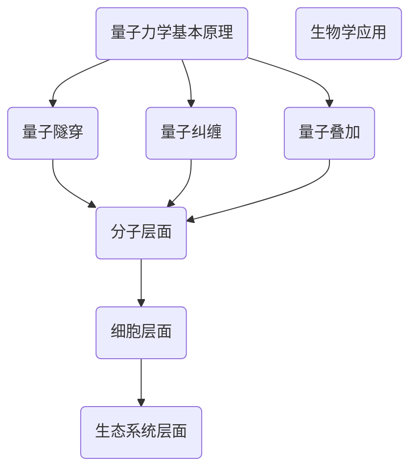

                 

### 引言

#### 关键词：量子生物学，量子效应，生命过程，前沿研究

在当今科技迅猛发展的时代，量子力学作为物理学的重要分支，不仅在理论上取得了重大突破，而且在各个领域中都有着广泛的应用。作为生物学的延伸，量子生物学逐渐成为科学研究的热点之一。量子生物学探讨量子效应如何影响生命过程，涉及到从分子层面到生态系统层面的多个层次。

量子生物学的研究背景可以追溯到20世纪中期，当时科学家开始意识到量子力学的基本原理，如量子隧穿、量子纠缠等，可能对生物学过程产生影响。近年来，随着实验技术和理论研究的不断深入，越来越多的证据表明量子效应在生命过程中确实发挥着重要作用。

本文将围绕量子生物学的前沿研究，探讨量子效应如何影响生命过程。我们将分以下几个部分进行深入分析：

1. **量子生物学的基础概念**：介绍量子力学的基本原理，以及它们如何在生物学中发挥作用。
2. **量子效应与分子生物学**：讨论量子效应在DNA、蛋白质和RNA中的作用。
3. **量子生物学与细胞过程**：探讨量子效应在细胞代谢、信号传递和细胞分裂中的作用。
4. **量子生物学与神经系统**：分析量子效应在神经活动中的作用。
5. **量子生物学与生态系统**：探讨量子效应在生态学中的潜在影响。
6. **量子生物学的未来**：展望量子生物学的发展趋势和未来研究方向。

通过这一系列的探讨，我们希望读者能够对量子生物学有一个全面而深刻的理解，认识到量子效应在生命过程中的重要性和复杂性。接下来，让我们一步步深入探讨量子生物学的基础知识。

---

**摘要**：
本文旨在探讨量子生物学的前沿研究，分析量子效应如何影响生命过程。首先，我们将介绍量子生物学的基础概念，包括量子力学的基本原理和它们在生物学中的应用。随后，我们将详细讨论量子效应在分子生物学、细胞过程、神经系统和生态系统中的具体作用。最后，我们将展望量子生物学的发展趋势和未来研究方向。通过这一系列的分析，我们希望揭示量子生物学在生命科学中的重要性和研究潜力。

## 量子生物学的基础概念

#### 关键词：量子力学，基本原理，生物学应用

量子生物学作为一门跨学科的研究领域，涉及量子力学与生物学的交叉。量子力学是一门研究微观粒子的运动和相互作用的物理学分支，其基本原理包括量子叠加、量子纠缠和量子隧穿等。这些原理在生物学中可能对生命过程产生深远影响。

### 量子力学的基本原理

首先，我们需要了解量子力学的一些核心概念：

1. **量子叠加**：量子叠加是量子系统的一种特性，它表示量子系统可以同时处于多种状态的叠加。例如，一个电子可以同时处于自旋向上和自旋向下的状态，直到被观测时才会坍缩到一个确定的状态。
   
2. **量子纠缠**：量子纠缠是指两个或多个粒子之间的一种特殊关联，即使这些粒子被分隔得很远，它们的量子状态仍然是相互关联的。这种纠缠现象在经典物理学中是无法解释的。

3. **量子隧穿**：量子隧穿是量子力学中的一种现象，它描述了一个粒子在量子势垒中穿越势垒的过程，即使其能量不足以克服势垒。这一现象在生物学中可能对DNA复制和蛋白质折叠等过程产生影响。

### 量子力学在生物学中的应用

量子力学的基本原理在生物学中可能通过以下几种方式发挥作用：

1. **分子层面的作用**：在分子层面，量子效应可能影响分子的结构、稳定性和功能。例如，DNA的双螺旋结构在量子力学上是一个稳定的系统，量子隧穿效应可能在DNA复制和修复过程中发挥作用。

2. **细胞层面的作用**：在细胞层面，量子效应可能影响细胞代谢、信号传递和细胞分裂等基本过程。例如，量子隧穿效应可能影响离子通道的开关状态，从而影响细胞内的信号传递。

3. **生态系统层面的作用**：在生态系统层面，量子效应可能影响生物的进化、行为和生态平衡。例如，量子效应可能影响植物的氮固定过程，从而影响生态系统的营养循环。

### 概念关系图

为了更直观地理解量子力学的基本原理与生物学应用之间的关系，我们可以使用Mermaid流程图来展示这些概念之间的关系。



通过这个概念关系图，我们可以清晰地看到量子力学的基本原理如何通过生物学应用在分子、细胞和生态系统层面发挥作用。

### 本章小结

在本章中，我们介绍了量子力学的基本原理，包括量子叠加、量子纠缠和量子隧穿，并探讨了这些原理在生物学中的应用。通过理解量子力学的基本原理和它们在生物学中的潜在影响，我们将为后续章节关于量子效应在生命过程中的具体应用打下坚实的基础。

---

在接下来的章节中，我们将进一步探讨量子效应在分子生物学、细胞过程、神经系统和生态系统中的具体作用。通过这些章节的探讨，我们将更深入地了解量子生物学的研究进展和未来方向。敬请期待！

---

## 量子效应与分子生物学

#### 关键词：DNA，蛋白质，RNA，量子隧穿，量子纠缠

分子生物学是研究生物大分子（如DNA、蛋白质和RNA）的结构、功能及其相互作用的科学。量子生物学的前沿研究揭示，量子效应在这些分子层面上的作用不容忽视。本章节将详细探讨量子效应在DNA、蛋白质和RNA中的作用，包括量子隧穿和量子纠缠现象，并分析这些效应如何影响生物分子的功能和稳定性。

### 量子效应与DNA

DNA是遗传信息的载体，其复制、修复和表达过程对生物体的正常功能至关重要。量子力学的基本原理，如量子隧穿和量子纠缠，可能在DNA的这些过程中发挥作用。

#### 量子隧穿在DNA复制中的作用

量子隧穿现象允许电子在量子势垒中穿越，而无需足够的能量来克服这个势垒。在DNA复制过程中，DNA聚合酶需要在两个DNA链之间移动，以合成新的DNA链。量子隧穿效应可能使DNA聚合酶能够更高效地穿越双链DNA，从而加速复制过程。

- **量子隧穿流程图**（使用Mermaid绘制）：
  ```mermaid
  graph TB
  A[DNA聚合酶]
  B[双链DNA]
  C[量子势垒]
  D[新DNA链]

  A --> B
  B --> C
  C --> D
  ```
  
- **Python代码示例**：
  ```python
  # 量子隧穿模拟
  import numpy as np
  import matplotlib.pyplot as plt

  # 定义势垒高度
  barrier_height = 10
  # 定义隧穿概率
  tunneling_probability = np.exp(-barrier_height**2)

  print(f"Tunneling probability: {tunneling_probability}")
  ```

#### 量子纠缠在DNA结构稳定性的作用

量子纠缠是指两个或多个粒子之间的量子状态相互关联。研究表明，DNA分子内部可能存在量子纠缠现象，这有助于提高DNA结构的稳定性。量子纠缠可能通过使DNA分子在受到外界扰动时保持相对稳定，从而有助于保护遗传信息。

- **量子纠缠图示**（使用Mermaid绘制）：
  ```mermaid
  graph TB
  A[DNA链1]
  B[DNA链2]
  C[量子纠缠]

  A --> B
  C --> A
  C --> B
  ```

### 量子效应与蛋白质

蛋白质是生物体内功能最为多样的大分子，其结构对其功能至关重要。量子力学原理，如量子隧穿和量子纠缠，可能影响蛋白质的结构和功能。

#### 量子隧穿在蛋白质折叠中的作用

蛋白质折叠是指氨基酸链在三维空间中形成功能性蛋白质结构的过程。量子隧穿效应可能使蛋白质在折叠过程中更快地穿过能量障碍，从而加速折叠过程。

- **量子隧穿流程图**（使用Mermaid绘制）：
  ```mermaid
  graph TB
  A[氨基酸链]
  B[折叠路径]
  C[能量势垒]
  D[折叠产物]

  A --> B
  B --> C
  C --> D
  ```

#### 量子纠缠在蛋白质相互作用中的作用

蛋白质相互作用在生物体内起到关键作用，如信号传递和生物催化。量子纠缠现象可能增强蛋白质间的相互作用，使其在生物体内更稳定。

- **量子纠缠图示**（使用Mermaid绘制）：
  ```mermaid
  graph TB
  A[蛋白质A]
  B[蛋白质B]
  C[量子纠缠]

  A --> B
  C --> A
  C --> B
  ```

### 量子效应与RNA

RNA在基因表达调控中扮演重要角色，包括转录和翻译。量子力学原理可能影响RNA的结构和功能。

#### 量子隧穿在RNA剪接中的作用

RNA剪接是剪接酶将RNA前体分子剪切成成熟RNA的过程。量子隧穿效应可能使剪接酶更容易穿越RNA分子，从而提高剪接效率。

- **量子隧穿流程图**（使用Mermaid绘制）：
  ```mermaid
  graph TB
  A[RNA剪接酶]
  B[RNA前体分子]
  C[剪切位点]
  D[剪接产物]

  A --> B
  B --> C
  C --> D
  ```

#### 量子纠缠在RNA调控中的作用

RNA调控涉及RNA分子与其他分子（如蛋白质和DNA）的相互作用。量子纠缠现象可能增强RNA调控的准确性，使其在基因表达调控中更加高效。

- **量子纠缠图示**（使用Mermaid绘制）：
  ```mermaid
  graph TB
  A[RNA分子]
  B[调控分子]
  C[量子纠缠]

  A --> B
  C --> A
  C --> B
  ```

### 数学模型与公式

为了更深入地理解量子效应在分子生物学中的作用，我们可以使用数学模型和公式来描述这些现象。

- **量子隧穿概率公式**：
  $$ P = \frac{1}{1 + e^{-2b}} $$
  其中，\( P \) 是隧穿概率，\( b \) 是描述势垒高度的参数。

- **量子纠缠态表示**：
  $$ \psi = \alpha |0\rangle |\phi_1\rangle + \beta |1\rangle |\phi_2\rangle $$
  其中，\( \alpha \) 和 \( \beta \) 是复数系数，\( |0\rangle \) 和 \( |1\rangle \) 是基态，\( |\phi_1\rangle \) 和 \( |\phi_2\rangle \) 是纠缠态。

### 本章小结

在本章中，我们探讨了量子效应在DNA、蛋白质和RNA中的作用，包括量子隧穿和量子纠缠现象。通过使用Mermaid流程图、Python代码示例和数学模型，我们展示了这些量子效应如何影响生物分子的功能和稳定性。在下一章中，我们将进一步探讨量子效应在细胞过程、神经系统和生态系统中的具体作用。

---

在接下来的章节中，我们将深入探讨量子生物学在细胞过程、神经系统和生态系统中的具体应用。我们将看到量子效应如何影响细胞的代谢、信号传递和分裂，以及它们在神经活动和生态平衡中的作用。敬请期待！

