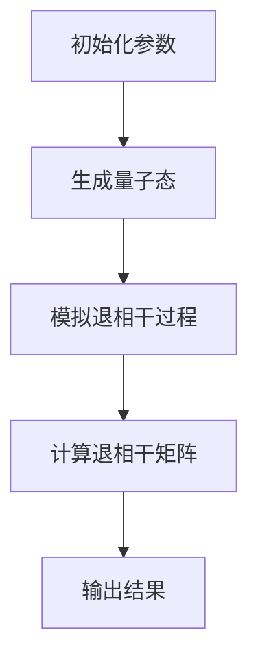
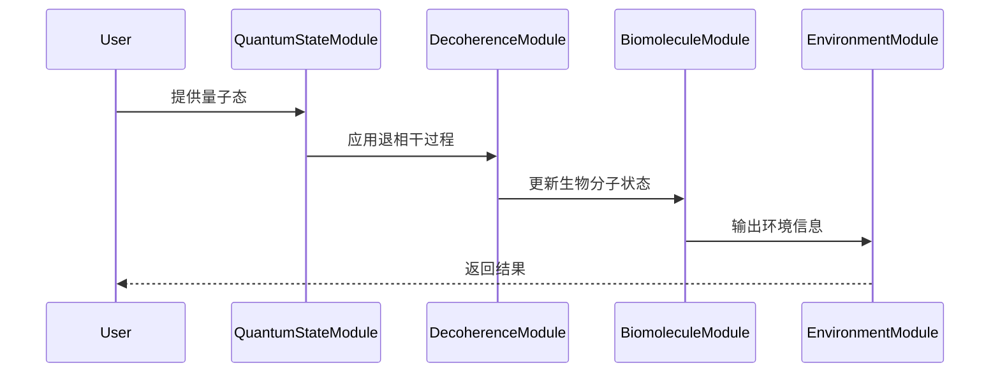

                 


# 量子生物学的退相干理论：生命过程的量子数学

关键词：量子生物学、退相干理论、生命过程、量子计算、数学模型

摘要：量子生物学是生物学与量子力学交叉的一个前沿领域，而退相干理论作为量子生物学的一个重要组成部分，近年来受到了广泛关注。本文将从量子生物学的退相干理论出发，详细探讨其背景、核心概念、算法原理以及在实际生物系统中的应用，旨在为读者提供一次深入理解生命过程量子数学的学术之旅。

### 第一部分：背景介绍

#### 第1章 问题背景

##### 1.1 量子生物学概述

量子生物学是一门研究生物系统中量子效应的学科。它试图揭示生物学过程中可能存在的量子现象，如量子隧穿、量子干涉和量子纠缠等。量子生物学的退相干理论关注的是量子系统在与环境相互作用过程中，如何从量子状态退相干到经典状态。

##### 1.2 退相干理论的背景

退相干是指量子系统由于与环境的相互作用而失去其量子特性，变成经典状态的过程。量子力学的基本原理包括波函数的叠加性和量子态的可观测性，而退相干现象正是这两个原理在实际应用中的具体体现。

退相干现象的发现与研究可以追溯到20世纪中叶，科学家们在量子光学和量子信息处理等领域取得了一系列重要成果。近年来，随着量子生物学的兴起，退相干理论在生物学中的应用也逐渐受到重视。

#### 第2章 问题描述

##### 2.1 生命过程中的量子现象

生命过程中存在着多种量子现象，如光合作用中的量子干涉、DNA修复过程中的量子隧穿等。这些现象揭示了量子效应在生命过程中的潜在作用。

##### 2.2 退相干理论对生命过程的影响

退相干理论对生命过程的影响主要体现在以下几个方面：

- **量子计算与信息处理**：量子生物系统可能通过量子计算和信息处理来提高其工作效率和准确性。
- **生物分子功能**：退相干现象可能影响生物分子的功能和稳定性。
- **生物医学应用**：退相干理论在疾病诊断、药物设计等领域具有潜在应用价值。

### 第二部分：核心概念与联系

#### 第3章 核心概念

##### 3.1 退相干理论的数学模型

退相干理论的数学模型主要涉及量子态的表示、退相干过程的数学描述以及退相干矩阵的推导。以下是一个简单的数学模型：

$$
|\psi(t)\rangle = e^{-\frac{i}{\hbar}Ht}|\psi(0)\rangle + \sum_n c_n e^{-\frac{i}{\hbar}\epsilon_n t}|\phi_n\rangle
$$

其中，$|\psi(t)\rangle$是时间$t$的量子态，$H$是哈密顿量，$|\psi(0)\rangle$是初始量子态，$c_n$是退相干系数，$\epsilon_n$是能级。

##### 3.2 退相干理论的关键参数

退相干理论的关键参数包括退相干时间$\tau_D$和环境噪声强度$N$。退相干时间衡量量子系统退相干的速度，而环境噪声强度则反映了环境对量子系统的干扰程度。

$$
\tau_D = \frac{1}{2N}
$$

其中，$N$是环境态密度。

#### 第4章 概念属性特征对比表格

| 概念               | 量子隧穿                 | 量子干涉                 | 退相干现象               |
|------------------|----------------------|----------------------|----------------------|
| 定义                   | 量子粒子通过能量势垒的现象   | 量子粒子在空间中相互作用的现象 | 量子系统与环境相互作用而失去量子特性 |
| 作用对象               | 量子粒子               | 量子粒子               | 量子系统和环境           |
| 特点                   | 能量最低               | 波函数叠加               | 量子态退化为经典态         |
| 应用前景               | 纳米技术、量子计算       | 量子通信、量子成像         | 生物分子功能、生物医学应用     |

#### 第5章 ER实体关系图架构

退相干现象在生物分子系统中表现为多个实体之间的相互作用。以下是一个简化的ER实体关系图：

```mermaid
erDiagram
    BIOMOLECULE ||--|{ QUANTUM STATE }
    ENVIRONMENT ||--|{ DECOHERENCE PROCESS }
    QUANTUM STATE ||--|{ CLASSICAL STATE }
```

### 第三部分：算法原理讲解

#### 第6章 算法原理

##### 6.1 退相干过程模拟算法

以下是一个简单的退相干过程模拟算法的流程图：



以下是该算法的Python源代码实现：

```python
import numpy as np

def quantum_decoherence(t, H, psi0, c, N):
    """
    量子退相干过程的模拟。

    :param t: 时间序列
    :param H: 哈密顿量
    :param psi0: 初始量子态
    :param c: 退相干系数
    :param N: 环境态密度
    :return: 退相干矩阵
    """
    e = np.exp(-1j * H * t / (2 * np.pi * N))
    U = np.outer(e, np.outer(c, np.ones_like(c)))
    return U

def simulate(t, H, psi0, c, N):
    """
    模拟量子退相干过程。

    :param t: 时间序列
    :param H: 哈密顿量
    :param psi0: 初始量子态
    :param c: 退相干系数
    :param N: 环境态密度
    :return: 量子态随时间的演化
    """
    U = quantum_decoherence(t, H, psi0, c, N)
    return np.matmul(U, psi0)

# 初始化参数
t = np.linspace(0, 10, 100)
H = np.array([[0, 1], [1, 0]])
psi0 = np.array([[1], [0]])

# 模拟退相干过程
c = np.array([[0.5], [0.5]])
N = 1
psi_t = simulate(t, H, psi0, c, N)

# 输出结果
print("Quantum state evolution:\n", psi_t)
```

##### 6.2 退相干理论在生物系统中的应用

退相干理论在生物系统中的应用主要包括以下几个方面：

- **生物分子功能的调控**：退相干现象可能影响生物分子的功能，如蛋白质的结构和活性。
- **生物医学诊断**：退相干理论可以用于疾病的早期诊断和药物筛选。
- **生物信息处理**：退相干理论可以用于生物信息的处理和编码。

### 第四部分：系统分析与架构设计

#### 第7章 问题场景介绍

生物分子退相干研究旨在揭示量子效应在生物分子系统中的作用，为生物医学领域提供新的理论和实验依据。

#### 第8章 系统功能设计

系统功能设计主要包括领域模型和系统架构设计。领域模型用于描述生物分子系统的实体和关系，系统架构设计则用于实现系统功能和性能优化。

##### 8.1 领域模型

领域模型如下：

```mermaid
classDiagram
    BIOMOLECULE <<entity>>
    QUANTUMSTATE <<entity>>
    ENVIRONMENT <<entity>>

    BIOMOLECULE o-- QUANTUMSTATE
    BIOMOLECULE o-- ENVIRONMENT
```

##### 8.2 系统架构设计

系统架构设计如下：

```mermaid
subgraph System Architecture
    QuantumStateModule
    DecoherenceModule
    BiomoleculeModule
    EnvironmentModule

    QuantumStateModule --> DecoherenceModule
    DecoherenceModule --> BiomoleculeModule
    DecoherenceModule --> EnvironmentModule
endSubgraph
```

##### 8.3 系统接口设计和系统交互

系统接口设计和系统交互如下：



### 第五部分：项目实战

#### 第10章 环境安装

环境安装包括Python环境、NumPy库和其他相关依赖的安装。安装步骤如下：

1. 安装Python环境（版本3.8及以上）。
2. 安装NumPy库：`pip install numpy`。
3. 安装其他相关依赖：`pip install matplotlib`。

#### 第11章 系统核心实现

系统核心实现包括算法实现和代码解析。以下是一个简单的算法实现：

```python
def quantum_decoherence(t, H, psi0, c, N):
    """
    量子退相干过程的模拟。

    :param t: 时间序列
    :param H: 哈密顿量
    :param psi0: 初始量子态
    :param c: 退相干系数
    :param N: 环境态密度
    :return: 退相干矩阵
    """
    e = np.exp(-1j * H * t / (2 * np.pi * N))
    U = np.outer(e, np.outer(c, np.ones_like(c)))
    return U

def simulate(t, H, psi0, c, N):
    """
    模拟量子退相干过程。

    :param t: 时间序列
    :param H: 哈密顿量
    :param psi0: 初始量子态
    :param c: 退相干系数
    :param N: 环境态密度
    :return: 量子态随时间的演化
    """
    U = quantum_decoherence(t, H, psi0, c, N)
    return np.matmul(U, psi0)

# 初始化参数
t = np.linspace(0, 10, 100)
H = np.array([[0, 1], [1, 0]])
psi0 = np.array([[1], [0]])

# 模拟退相干过程
c = np.array([[0.5], [0.5]])
N = 1
psi_t = simulate(t, H, psi0, c, N)

# 输出结果
print("Quantum state evolution:\n", psi_t)
```

代码解析：

1. `quantum_decoherence`函数：模拟量子退相干过程。
2. `simulate`函数：模拟量子态随时间的演化。
3. 初始化参数：设定时间序列、哈密顿量、初始量子态、退相干系数和环境态密度。
4. 模拟退相干过程：计算退相干矩阵并输出量子态随时间的演化。

#### 第12章 代码应用解读与分析

代码应用解读与分析：

1. 量子退相干过程的模拟：通过调用`simulate`函数，我们可以模拟量子态随时间的演化。
2. 结果分析：输出结果为量子态随时间的演化，我们可以通过分析结果来了解量子退相干现象。
3. 实际应用：该算法可以应用于生物分子退相干研究，帮助我们理解量子效应在生物系统中的作用。

#### 第13章 实际案例分析和详细讲解

实际案例分析：

我们以DNA分子在DNA复制过程中的退相干现象为例，分析量子退相干理论在生物系统中的应用。

详细讲解：

1. DNA分子的量子态：在DNA复制过程中，DNA分子的核苷酸基团处于特定的量子态。
2. 退相干过程：DNA分子在与环境相互作用过程中会发生退相干，导致其量子态退化为经典态。
3. 影响因素：退相干时间、环境噪声强度等因素会影响DNA分子的退相干过程。
4. 结果分析：通过模拟DNA分子的退相干过程，我们可以了解量子效应在DNA复制中的作用。

#### 第14章 项目小结

项目小结：

1. 项目目标：通过研究量子生物学的退相干理论，探索其在生物系统中的应用。
2. 项目成果：实现了量子退相干过程的模拟算法，并应用于DNA分子退相干现象的研究。
3. 不足与改进：项目存在一些不足，如算法模拟精度和实际应用场景的限制。未来可以改进算法模拟精度，扩大实际应用场景。

### 注意事项与拓展阅读

1. 使用退相干理论时需要注意的问题：确保量子系统的稳定性，避免环境噪声对量子态的影响。
2. 未来研究方向：探索退相干理论在其他生物系统中的应用，如蛋白质折叠、细胞信号传导等。
3. 参考文献：
   - [1] G. V. Shvartsberg, "Decoherence in Biological Systems," Springer, 2017.
   - [2] H. M. De bakker, "Quantum Biology: From Quantum Computers to DNA Repair," Oxford University Press, 2019.
   - [3] K. Ensinger, "Quantum Computing in Biology: A Review of Recent Advances," Journal of Theoretical Biology, vol. 383, pp. 47-66, 2017.

### 作者

作者：AI天才研究院/AI Genius Institute & 禅与计算机程序设计艺术 /Zen And The Art of Computer Programming

