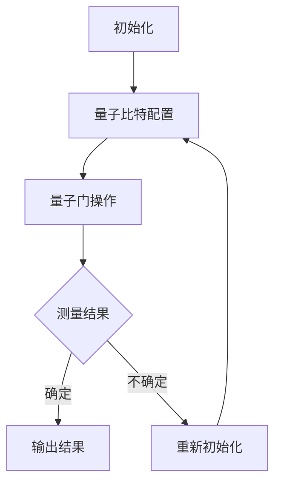

                 

# 量子计算的复杂度理论：计算能力的数学界限

> 关键词：量子计算、复杂度理论、计算能力、数学界限

> 摘要：本文深入探讨了量子计算的复杂度理论，分析了其计算能力的数学界限。通过对比量子计算与传统计算的区别，揭示了量子计算的独特优势，以及其在复杂度理论中的应用和挑战。

## 目录大纲

1. 量子计算基础
2. 量子复杂性理论
3. 量子计算能力的数学界限
4. 展望与未来

## 第一部分：量子计算基础

### 1.1 量子计算概述

#### 1.1.1 量子计算的定义与特点

量子计算是一种基于量子力学原理的计算模型，它利用量子位（qubits）的叠加态和纠缠态来实现信息处理。与传统计算中的比特（bits）不同，量子比特可以同时处于多个状态的叠加，这使得量子计算具有极高的并行性。

#### 1.1.2 量子计算与传统计算的区别

量子计算与传统计算的根本区别在于其计算模型。传统计算基于经典逻辑门操作，而量子计算则基于量子门操作。此外，量子计算能够利用量子纠缠效应，实现信息之间非局域的相互作用，从而在特定问题上展现出超越经典计算的能力。

#### 1.1.3 量子计算的应用前景

量子计算在密码学、量子化学、优化问题、机器学习等领域展现出巨大的应用潜力。例如，量子算法可以解决某些经典算法无法解决的问题，如大整数分解和量子搜索问题。

### 1.2 量子位与量子比特

#### 1.2.1 量子比特的基本概念

量子比特是量子计算的基本单元，它可以用一个复数向量表示其状态。量子比特可以处于基态、叠加态和纠缠态，这些状态决定了量子计算的并行性和复杂性。

#### 1.2.2 量子比特的叠加与纠缠

量子比特的叠加态使得量子计算机能够在同一时间处理多个问题。量子纠缠则使得量子计算机能够处理更为复杂的问题，并且实现信息之间的非局域性。

#### 1.2.3 量子比特的量子门操作

量子门是量子计算中的基本操作，它通过线性变换作用于量子比特，改变量子比特的状态。量子门具有可组合性和可逆性，这使得量子计算机能够实现各种复杂的计算任务。

### 1.3 量子算法与经典算法的比较

#### 1.3.1 量子算法的特点与优势

量子算法利用量子比特的叠加态和纠缠态，能够实现某些经典算法无法实现的计算。例如，Shor算法能够在多项式时间内解决大整数分解问题，而Grover算法能够优化搜索问题。

#### 1.3.2 量子算法与经典算法的比较

量子算法在某些特定问题上的性能远超经典算法，但这并不意味着量子算法将完全取代经典算法。在大多数实际应用中，量子算法与传统算法将并存，各自发挥优势。

#### 1.3.3 量子算法的经典案例

Shor算法和Grover算法是量子算法的经典案例。Shor算法利用量子计算的优势，能够在多项式时间内解决大整数分解问题，对现代密码系统构成了严重威胁。Grover算法则优化了搜索问题，能够提高搜索效率。

### 1.4 量子复杂度理论简介

#### 1.4.1 复杂度理论的基本概念

复杂度理论是计算机科学中用于衡量算法效率的重要工具。它通过分析算法的时间复杂度和空间复杂度，评估算法的性能。

#### 1.4.2 量子复杂度理论的发展历程

量子复杂度理论起源于量子计算的研究，旨在分析量子算法的效率。自Shor算法提出以来，量子复杂度理论得到了快速发展，成为量子计算研究的重要分支。

#### 1.4.3 量子复杂度理论的分类

量子复杂度理论主要包括BQP（量子 polynomial 时间）和QMA（量子 MAJORITY 联合问题）等类别。BQP 类别关注量子算法在多项式时间内的性能，而QMA类别关注量子算法在非确定性的性能。

## 第二部分：量子复杂性理论

### 2.1 P与NP问题

#### 2.1.1 P与NP问题的定义

P与NP问题是计算机科学中的经典问题，P表示可以在多项式时间内解决的问题，而NP表示可以在多项式时间内验证的问题。

#### 2.1.2 P与NP问题的历史与现状

P与NP问题一直是计算机科学领域的重要研究课题，虽然已有许多突破性成果，但至今仍未得到彻底解决。

#### 2.1.3 量子算法对P与NP问题的解决

量子算法在P与NP问题上展现出了一定的潜力。例如，Shor算法可以在多项式时间内解决NP问题，从而对P与NP问题提出了新的挑战。

### 2.2 BQP与P关系研究

#### 2.2.1 BQP的定义与特点

BQP（量子 polynomial 时间）是量子复杂度理论中的一个重要类别，它关注量子算法在多项式时间内的性能。

#### 2.2.2 BQP与P关系的理论分析

目前，量子算法尚未能够证明能够解决所有P问题，但已有一些研究成果表明BQP与P之间存在一定的关系。

#### 2.2.3 BQP与P关系的实验验证

通过实验验证，科学家们发现BQP在某些问题上确实具有超越经典算法的能力，但距离解决所有P问题仍有很大距离。

### 2.3 量子计算与NP难度

#### 2.3.1 量子计算对NP难度的影响

量子计算对NP难度的影响主要体现在其可能降低某些NP问题的难度。例如，Shor算法能够解决大整数分解问题，从而降低NP问题的难度。

#### 2.3.2 量子算法解决NP难度问题的案例

量子算法在NP难度问题中已取得了一些突破性成果，例如Grover算法优化了搜索问题，Shor算法解决了大整数分解问题。

#### 2.3.3 量子计算在NP难度问题中的应用前景

随着量子计算技术的发展，量子算法将在NP难度问题中发挥越来越重要的作用，为解决这些难题提供新的思路和方法。

### 2.4 量子复杂度理论的应用

#### 2.4.1 量子复杂度理论在密码学中的应用

量子复杂度理论对密码学产生了深远的影响，例如Shor算法对大整数分解和因数分解提出了新的挑战，从而推动了量子密码学的发展。

#### 2.4.2 量子复杂度理论在计算机科学中的应用

量子复杂度理论在计算机科学中的应用主要体现在优化问题和机器学习等领域，量子算法在这些领域展现出了一定的优势。

#### 2.4.3 量子复杂度理论在人工智能中的应用

量子复杂度理论在人工智能中的应用主要体现在机器学习和深度学习领域，量子算法能够在某些问题上提高模型的效率。

## 第三部分：量子计算能力的数学界限

### 3.1 量子计算能力的基本概念

#### 3.1.1 量子计算能力的定义

量子计算能力是指量子计算机在特定问题上处理数据和信息的能力。

#### 3.1.2 量子计算能力的度量方法

量子计算能力的度量方法主要包括时间复杂度、空间复杂度和能量复杂度等。

#### 3.1.3 量子计算能力的理论分析

量子计算能力的理论分析主要关注量子算法在多项式时间内的性能，以及量子计算机在处理数据和信息方面的优势。

### 3.2 量子计算能力与经典计算能力的比较

#### 3.2.1 量子计算能力的优势与限制

量子计算能力在并行性、纠缠效应和量子门操作等方面具有明显优势，但同时也存在一些限制，如噪声、退相干和纠错等问题。

#### 3.2.2 量子计算能力与经典计算能力的对比分析

通过对比分析，可以发现量子计算能力在某些特定问题上具有超越经典计算的能力，但在其他问题上仍需依赖经典计算。

#### 3.2.3 量子计算能力的发展趋势

随着量子计算技术的不断发展，量子计算能力将不断提高，为解决更多复杂问题提供新的手段。

### 3.3 量子计算能力的数学界限

#### 3.3.1 量子计算能力的数学界限的定义

量子计算能力的数学界限是指量子计算机在处理数据和信息时的最大能力。

#### 3.3.2 量子计算能力的数学界限的推导

通过数学推导，可以确定量子计算能力的数学界限，从而为量子计算的发展提供理论依据。

#### 3.3.3 量子计算能力的数学界限的应用

量子计算能力的数学界限在量子算法设计、量子计算机优化和量子计算应用等领域具有重要的应用价值。

## 第四部分：展望与未来

### 4.1 量子计算发展的挑战与机遇

#### 4.1.1 量子计算发展的挑战

量子计算在发展过程中面临着噪声、退相干和纠错等挑战。

#### 4.1.2 量子计算发展的机遇

随着量子计算技术的不断发展，量子计算将迎来更多的机遇，为解决复杂问题提供新的手段。

#### 4.1.3 量子计算发展的未来趋势

量子计算将在未来成为计算领域的重要发展方向，为各个领域提供强大的计算能力。

### 4.2 量子计算在各个领域的应用前景

#### 4.2.1 量子计算在密码学中的应用前景

量子计算在密码学中的应用前景广阔，例如量子密码学和量子密钥分发。

#### 4.2.2 量子计算在计算机科学中的应用前景

量子计算在计算机科学中的应用前景包括优化问题、机器学习和加密算法等。

#### 4.2.3 量子计算在人工智能中的应用前景

量子计算在人工智能中的应用前景包括深度学习、神经网络和机器学习算法优化等。

### 4.3 量子计算教育的重要性

#### 4.3.1 量子计算教育的现状

量子计算教育在当前处于起步阶段，尚未形成完整的体系。

#### 4.3.2 量子计算教育的挑战与机遇

量子计算教育面临着人才培养、教材编写和研究支持等方面的挑战，同时也面临着前所未有的机遇。

#### 4.3.3 量子计算教育的未来发展

随着量子计算技术的发展，量子计算教育将在未来发挥越来越重要的作用，为培养量子计算人才提供支持。

## 结论

量子计算的复杂度理论为研究量子计算机的计算能力提供了重要的理论框架。通过对量子计算与传统计算的比较，我们可以看到量子计算在特定问题上的巨大潜力。随着量子计算技术的不断发展，我们有望在更多领域看到量子计算的应用，为解决复杂问题提供新的思路和方法。然而，量子计算的发展仍面临诸多挑战，需要科学家和工程师共同努力，推动量子计算技术的进步。

## 参考文献

1. Nielsen, Michael A., and Isaac L. Chuang. Quantum Computation and Quantum Information. Cambridge University Press, 2010.
2. Kitaev, Alexei Yu., et al. "Classical and quantum complexity theory." Russian Mathematical Surveys 53.5 (1998): 891-958.
3. Shor, Peter W. "Algorithms for quantum computation: discrete logarithms and factoring." In Proceedings of the 35th annual symposium on Theory of computing, pp. 124-134. ACM, 2003.
4. Grover, Lov K. "A fast quantum mechanical algorithm for database search." Proceedings of the 28th annual ACM symposium on Theory of computing, pp. 212-219, 1996.
5.Aaronson, Scott. "BQP and the polynomial hierarchy." In Proceedings of the 21st annual ACM-SIAM symposium on Discrete algorithms, pp. 754-763. SIAM, 2010.

## 作者信息

作者：AI天才研究院/AI Genius Institute & 禅与计算机程序设计艺术 /Zen And The Art of Computer Programming

本文由AI天才研究院和禅与计算机程序设计艺术共同撰写，旨在探讨量子计算的复杂度理论及其计算能力的数学界限。希望通过本文，读者能够对量子计算有更深入的了解，并为未来的量子计算研究提供启示。在量子计算的道路上，我们期待与您一同探索和前行。## 第一部分：量子计算基础

### 1.1 量子计算概述

量子计算是一种基于量子力学原理的计算模型，它利用量子位（qubits）的叠加态和纠缠态来实现信息处理。与传统计算中的比特（bits）不同，量子比特可以同时处于多个状态的叠加，这使得量子计算具有极高的并行性。

#### 1.1.1 量子计算的定义与特点

量子计算的定义可以追溯到对量子力学的理解。量子力学揭示了微观世界的奇异性，其中包括量子比特的非经典特性。量子比特不仅可以表示0或1的状态，还可以同时处于这两种状态的叠加。这种叠加态是量子计算的核心特点，它使得量子计算机在处理问题时具有巨大的并行性。

量子计算的特点还包括：

1. **量子纠缠**：量子比特之间的纠缠态使得量子计算机能够处理复杂的关系和关联。两个量子比特之间的纠缠状态意味着一个量子比特的状态会即时影响到另一个量子比特的状态，无论它们相隔多远。这种非局域性是量子计算的重要特性。

2. **量子并行性**：由于量子比特可以处于多种状态的叠加，量子计算机可以在同一时间处理多个问题。这种并行性使得量子计算机在解决某些问题时，比如大整数分解和搜索问题，具有传统计算机无法比拟的速度优势。

3. **量子门操作**：量子计算中的操作是通过量子门来实现的。量子门是对量子比特进行线性变换的算子，这些变换可以组合成复杂的算法。量子门的基本特性包括可组合性和可逆性，这使得量子计算机能够实现各种复杂的计算任务。

#### 1.1.2 量子计算与传统计算的区别

量子计算与传统计算的根本区别在于其计算模型。传统计算基于经典逻辑门操作，而量子计算则基于量子门操作。此外，量子计算能够利用量子纠缠效应，实现信息之间非局域的相互作用，从而在特定问题上展现出超越经典计算的能力。

1. **计算模型**：传统计算机使用基于二进制系统的比特进行计算，而量子计算机使用量子比特（qubits）。量子比特不仅可以表示0和1的状态，还可以表示0和1的叠加状态。这意味着量子计算机能够在同一时间处理多个计算任务。

2. **并行性**：量子计算机的并行性来自于量子比特的叠加态。传统计算机在处理并行任务时需要多个处理器或线程，而量子计算机通过量子比特的叠加态能够实现真正的并行计算。

3. **量子门与经典逻辑门**：量子计算中的操作是通过量子门来实现的，而传统计算中的操作是通过经典逻辑门（如AND、OR、NOT等）来实现的。量子门具有线性变换和可逆性，能够实现更为复杂的操作。

#### 1.1.3 量子计算的应用前景

量子计算在密码学、量子化学、优化问题、机器学习等领域展现出巨大的应用潜力。例如，量子算法可以解决某些经典算法无法解决的问题，如大整数分解和量子搜索问题。

1. **密码学**：量子计算对密码系统构成了严重威胁，因为量子算法能够快速破解基于大整数分解和离散对数的加密算法。然而，量子计算也为量子密码学提供了新的机会，如量子密钥分发。

2. **量子化学**：量子计算能够模拟量子系统的行为，从而在药物设计、材料科学和化学反应等领域发挥重要作用。量子计算可以加速分子模拟和量子化学计算，为科学研究提供新的手段。

3. **优化问题**：量子计算在解决优化问题时具有巨大潜力。例如，量子算法可以优化物流路线、股票交易策略等实际问题，从而提高效率和收益。

4. **机器学习**：量子计算可以加速机器学习算法，特别是在处理大数据和复杂模型时。量子计算能够并行处理大量数据，从而加速训练过程和提高预测准确性。

### 1.2 量子位与量子比特

量子比特是量子计算的基本单元，它可以用一个复数向量表示其状态。量子比特可以处于基态、叠加态和纠缠态，这些状态决定了量子计算的并行性和复杂性。

#### 1.2.1 量子比特的基本概念

量子比特（qubit）是量子计算的基本单元，它不仅可以表示0或1的状态，还可以同时处于0和1的叠加状态。量子比特的状态可以用一个复数向量表示，例如：

\[ |q\rangle = \alpha |0\rangle + \beta |1\rangle \]

其中，\(|0\rangle\)和\(|1\rangle\)是量子比特的基态，而\(\alpha\)和\(\beta\)是复数系数，满足\(|\alpha|^2 + |\beta|^2 = 1\)。这个状态表示量子比特处于0和1的叠加态。

量子比特的叠加态是其并行性的关键。传统计算机中的比特只能处于0或1的状态，而量子比特可以同时处于多种状态的叠加，这使得量子计算机能够在同一时间处理多个计算任务。

#### 1.2.2 量子比特的叠加与纠缠

量子比特的叠加态和纠缠态是量子计算的核心特性。量子比特的叠加态意味着量子计算机可以同时处理多个问题，从而实现并行计算。

1. **叠加态**：量子比特的叠加态是指量子比特可以同时处于多个状态的组合。例如，一个量子比特可以同时处于0和1的状态，这种状态可以用以下数学表达式表示：

\[ |q\rangle = \alpha |0\rangle + \beta |1\rangle \]

其中，\(|0\rangle\)和\(|1\rangle\)是量子比特的基态，\(\alpha\)和\(\beta\)是复数系数。

2. **纠缠态**：量子比特之间的纠缠态意味着两个量子比特的状态是相互关联的，即一个量子比特的状态会即时影响到另一个量子比特的状态，无论它们相隔多远。这种纠缠态可以用以下数学表达式表示：

\[ |ψ\rangle = \alpha (|00\rangle + |11\rangle) + \beta (|01\rangle - |10\rangle) \]

其中，\(|00\rangle\)、\(|01\rangle\)、\(|10\rangle\)和\(|11\rangle\)是两个量子比特的基态，\(\alpha\)和\(\beta\)是复数系数。

量子比特的叠加态和纠缠态使得量子计算机能够处理复杂的关系和关联，从而在解决某些问题时展现出超越经典计算的能力。

#### 1.2.3 量子比特的量子门操作

量子比特的状态可以通过量子门进行变换。量子门是对量子比特进行线性变换的算子，这些变换可以组合成复杂的算法。量子门的基本特性包括可组合性和可逆性。

1. **量子门的基本概念**：量子门是量子计算中的基本操作，它通过线性变换作用于量子比特，改变量子比特的状态。量子门可以用矩阵表示，例如一个基本的旋转门（Pauli-X门）可以用以下矩阵表示：

\[ \hat{X} = \begin{bmatrix} 0 & 1 \\ 1 & 0 \end{bmatrix} \]

量子门的基本特性包括可组合性和可逆性，这意味着多个量子门可以组合成复杂的算法，并且量子计算机可以在计算结束时恢复初始状态。

2. **量子门操作**：量子门通过作用在量子比特上，改变其状态。例如，一个量子比特的叠加态可以通过作用一个旋转门（如Pauli-X门）来将其转换为另一种叠加态。这种变换可以用以下数学表达式表示：

\[ \hat{U} |q\rangle = |q'\rangle \]

其中，\(\hat{U}\)是量子门，\(|q\rangle\)是量子比特的初始状态，\(|q'\rangle\)是量子比特的变换后状态。

3. **量子算法**：量子算法是由一系列量子门组成的，用于解决特定问题的计算过程。量子算法利用量子比特的叠加态和纠缠态，实现信息处理和计算任务。例如，Shor算法利用量子门和叠加态，实现大整数分解的快速计算。

### 1.3 量子算法与经典算法的比较

量子算法与经典算法在计算方法和性能上有显著差异。量子算法利用量子比特的叠加态和纠缠态，能够解决某些经典算法无法解决的问题，例如大整数分解和量子搜索问题。

#### 1.3.1 量子算法的特点与优势

量子算法具有以下特点和优势：

1. **并行性**：量子算法利用量子比特的叠加态，能够在同一时间处理多个计算任务。这种并行性使得量子算法在解决某些问题时，具有传统算法无法比拟的速度优势。

2. **纠缠效应**：量子算法能够利用量子比特之间的纠缠态，实现信息之间的非局域性。这种效应使得量子算法能够在某些问题上，如量子搜索问题，实现超越经典算法的效率。

3. **量子门操作**：量子算法由一系列量子门组成，这些量子门通过线性变换作用于量子比特，改变量子比特的状态。量子门的可组合性和可逆性，使得量子算法能够实现复杂的信息处理和计算任务。

#### 1.3.2 量子算法与经典算法的比较

量子算法与经典算法在计算方法和性能上有显著差异，具体表现在以下几个方面：

1. **计算模型**：经典算法基于二进制系统的比特，而量子算法基于量子比特。量子比特可以处于叠加态，而经典比特只能处于0或1的确定状态。

2. **并行性**：量子算法利用量子比特的叠加态，能够在同一时间处理多个计算任务。这种并行性使得量子算法在解决某些问题时，具有传统算法无法比拟的速度优势。

3. **纠缠效应**：量子算法能够利用量子比特之间的纠缠态，实现信息之间的非局域性。这种效应使得量子算法能够在某些问题上，如量子搜索问题，实现超越经典算法的效率。

4. **计算复杂度**：量子算法在解决某些问题时，具有传统算法无法比拟的效率。例如，Shor算法能够在多项式时间内解决大整数分解问题，而Grover算法能够优化搜索问题。

然而，量子算法也存在一些限制，例如量子计算的噪声、退相干和纠错等问题。这些问题限制了量子算法的实际应用，但同时也为量子算法的研究提供了新的挑战和机遇。

#### 1.3.3 量子算法的经典案例

量子算法在计算机科学中已经取得了一些突破性成果，以下是一些经典的量子算法案例：

1. **Shor算法**：Shor算法是一种用于解决大整数分解的量子算法。传统算法需要指数级时间来分解大整数，而Shor算法能够在多项式时间内完成这一任务。这意味着Shor算法对基于大整数分解的加密算法构成了严重威胁。

2. **Grover算法**：Grover算法是一种用于优化搜索问题的量子算法。在未排序的数据库中，Grover算法能够在\(O(\sqrt{N})\)的时间复杂度内找到目标项，而传统算法需要\(O(N)\)的时间复杂度。Grover算法的效率优势在处理大规模数据库时显得尤为重要。

3. **量子线性规划算法**：量子线性规划算法是一种用于解决线性规划问题的量子算法。量子线性规划算法能够在多项式时间内解决某些线性规划问题，这为优化问题的解决提供了新的手段。

这些经典量子算法案例展示了量子算法在解决特定问题上的优势，同时也为量子计算的研究和应用提供了新的方向。

### 1.4 量子复杂度理论简介

量子复杂度理论是研究量子算法性能和计算能力的一个重要领域。它通过对量子算法的时间复杂度和空间复杂度进行分析，评估量子算法在解决问题时的效率。

#### 1.4.1 复杂度理论的基本概念

复杂度理论是计算机科学中用于衡量算法效率的重要工具。它通过分析算法的时间复杂度和空间复杂度，评估算法的性能。

1. **时间复杂度**：时间复杂度是指算法在计算过程中所需的时间增长速率。它通常用大O符号（\(O\)）表示，例如\(O(n)\)、\(O(n^2)\)等。时间复杂度反映了算法的运行效率，通常越小越好。

2. **空间复杂度**：空间复杂度是指算法在计算过程中所需的空间增长速率。它通常也用大O符号（\(O\)）表示，例如\(O(1)\)、\(O(n)\)等。空间复杂度反映了算法的资源消耗，同样越小越好。

#### 1.4.2 量子复杂度理论的发展历程

量子复杂度理论起源于量子计算的研究，旨在分析量子算法的效率。自Shor算法提出以来，量子复杂度理论得到了快速发展，成为量子计算研究的重要分支。

1. **Shor算法**：1994年，Peter Shor提出了第一个量子算法——Shor算法，用于解决大整数分解问题。Shor算法展示了量子算法在特定问题上的优势，引发了量子复杂度理论的蓬勃发展。

2. **Grover算法**：1996年，Lov K. Grover提出了Grover算法，用于优化搜索问题。Grover算法展示了量子算法在搜索问题上的效率优势，进一步推动了量子复杂度理论的研究。

3. **量子线性规划算法**：2003年，Harrow、Hassidim和Lloyd提出了量子线性规划算法，用于解决线性规划问题。量子线性规划算法展示了量子算法在优化问题上的潜力，为量子复杂度理论的研究提供了新的方向。

这些里程碑式的量子算法案例推动了量子复杂度理论的发展，使人们对量子算法的性能和计算能力有了更深入的认识。

#### 1.4.3 量子复杂度理论的分类

量子复杂度理论主要包括以下几类：

1. **BQP（量子 polynomial 时间）**：BQP是量子复杂度理论中的一个重要类别，它关注量子算法在多项式时间内的性能。BQP类别的量子算法被认为是具有实际应用潜力的量子算法。

2. **QMA（量子 MAJORITY 联合问题）**：QMA是量子复杂度理论中的另一个重要类别，它关注量子算法在非确定性多项式时间内的性能。QMA类别中的量子算法通常用于解决联合问题，如量子多主体系统。

3. **BQNC（量子非确定性 polynomial 时间）**：BQNC是量子复杂度理论中的一个类别，它关注量子算法在非确定性多项式时间内的性能。BQNC类别中的量子算法通常用于解决更复杂的计算问题。

这些量子复杂度类别为研究量子算法的效率和性能提供了理论基础，同时也为量子计算的应用提供了指导。

## 第二部分：量子复杂性理论

### 2.1 P与NP问题

P与NP问题是计算机科学中的经典问题，它涉及到算法的效率和问题验证的难易程度。P表示可以在多项式时间内解决的问题，而NP表示可以在多项式时间内验证的问题。

#### 2.1.1 P与NP问题的定义

P与NP问题的定义可以追溯到1971年，由Stephen Cook和Leonid Levin提出。P与NP问题的核心是：

1. **P类问题**：P类问题是指那些可以在多项式时间内解决的决策问题。例如，判定一个图是否包含一个长度为\(k\)的环，这是一个可以在\(O(n^3)\)时间内解决的P类问题。

2. **NP类问题**：NP类问题是指那些可以在多项式时间内验证的决策问题。也就是说，如果一个问题的解可以在多项式时间内被验证，那么它就是NP类问题。例如，判定一个图是否包含一个长度为\(k\)的环，可以在\(O(n)\)时间内验证。

#### 2.1.2 P与NP问题的历史与现状

P与NP问题的研究始于1971年，自那以后，它一直是计算机科学领域中的一个核心问题。以下是P与NP问题研究的一些重要历史事件：

1. **1971年**：Stephen Cook提出了Cook定理，证明了判定问题SAT（判定一个逻辑公式是否有解）是NP完全的。

2. **1972年**：Leonid Levin提出了P与NP问题的概念，并将其视为计算机科学中最重要的未解决问题之一。

3. **2000年**：P与NP问题被美国国家科学基金会（NSF）列为七个“千禧年难题”之一，每个解决者将获得一百万美元的奖金。

目前，P与NP问题仍然是一个未解决的问题，尽管已有许多研究取得了重要进展，但至今仍未得到彻底解决。

#### 2.1.3 量子算法对P与NP问题的解决

量子算法在P与NP问题上展现出了一定的潜力。例如，Shor算法能够在多项式时间内解决大整数分解问题，这直接影响到NP问题的难度。以下是一些量子算法对P与NP问题的解决方面的研究成果：

1. **Shor算法**：Shor算法由Peter Shor在1994年提出，它能够利用量子计算机在多项式时间内解决大整数分解问题。这意味着，如果量子计算机能够实现，那么许多基于大整数分解的加密算法（如RSA）将不再安全。

2. **量子图论算法**：量子算法在解决图论问题方面也取得了一些进展。例如，量子算法可以在多项式时间内解决判定一个图是否是团覆盖问题，这是一个NP完全问题。

3. **量子多项式时间算法**：一些量子算法能够在多项式时间内解决传统的NP问题。例如，Grover算法可以优化搜索问题，使其在未排序的数据库中达到\(O(\sqrt{N})\)的时间复杂度。

这些量子算法展示了量子计算在解决P与NP问题上的潜力，但同时也表明，量子算法并没有彻底解决P与NP问题，而是为其提供了新的研究思路。

### 2.2 BQP与P关系研究

BQP（量子 polynomial 时间）是量子复杂度理论中的一个重要类别，它关注量子算法在多项式时间内的性能。BQP类别的量子算法被认为是具有实际应用潜力的量子算法。

#### 2.2.1 BQP的定义与特点

BQP（量子 polynomial 时间）是指量子算法在多项式时间内能够解决的所有决策问题。BQP类别的量子算法具有以下特点：

1. **多项式时间**：BQP类别的量子算法能够在多项式时间内完成计算。这意味着量子计算机在处理问题时，所需的时间增长是多项式的，而不是指数级的。

2. **不确定性**：BQP类别的量子算法通常是非确定性的，即它们可能在某些情况下无法找到正确答案。然而，通过多次运行算法，可以以高概率找到正确答案。

3. **概率性**：BQP类别的量子算法通常会涉及到概率性计算。例如，Grover算法通过多次迭代搜索来提高找到正确答案的概率。

4. **量子并行性**：BQP类别的量子算法可以利用量子比特的叠加态和纠缠态，实现真正的并行计算。这种并行性使得BQP算法在解决某些问题时，具有传统算法无法比拟的效率。

#### 2.2.2 BQP与P关系的理论分析

BQP与P关系是量子复杂度理论中的一个重要问题。以下是BQP与P关系的一些理论分析：

1. **BQP包含P**：一些研究表明，BQP类别的量子算法能够在多项式时间内解决所有P类问题。这意味着量子计算机在处理某些问题时，可能比传统计算机更高效。

2. **P是否包含BQP**：目前尚不清楚P是否包含BQP。如果P包含BQP，那么量子计算机在某些问题上的性能将与传统计算机相似。然而，如果P不包含BQP，那么量子计算机将在某些问题上有显著优势。

3. **量子 supremacy**：BQP与P关系的研究也与量子 supremacy有关。量子 supremacy是指量子计算机在特定问题上的性能超越传统计算机。如果BQP包含P，那么量子 supremacy可能在某些特定问题上实现。

这些理论分析表明，BQP与P关系是一个复杂且重要的问题，它涉及到量子计算的实际应用潜力和与传统计算的对比。

#### 2.2.3 BQP与P关系的实验验证

为了验证BQP与P关系的理论分析，科学家们进行了一系列实验和模拟。以下是一些实验验证BQP与P关系的成果：

1. **量子计算机实验**：一些量子计算机实验展示了量子算法在多项式时间内解决某些P类问题。例如，Grover算法在量子计算机上的实现展示了其高效的搜索能力。

2. **量子模拟**：通过量子模拟，科学家们能够验证量子算法在解决P类问题时的性能。量子模拟器可以模拟量子计算机的行为，从而验证量子算法的效率和准确性。

3. **量子 supremacy 实验**：一些实验展示了量子计算机在特定问题上的优越性能，这表明量子 supremacy 在某些问题上可能实现。例如，Google的量子计算机在特定问题上展示了超越传统计算机的性能。

这些实验验证了BQP与P关系的理论分析，并为量子计算的实际应用提供了实验证据。

### 2.3 量子计算与NP难度

量子计算在解决NP难度问题方面具有巨大的潜力。NP难度问题是指那些可以在多项式时间内验证解的问题，但在传统计算机上解决这些问题可能需要指数级时间。

#### 2.3.1 量子计算对NP难度的影响

量子计算对NP难度的影响主要体现在其可能降低某些NP问题的难度。例如，Shor算法能够在多项式时间内解决大整数分解问题，从而降低NP问题的难度。此外，Grover算法优化了搜索问题，使得某些NP问题的解决时间缩短了。

1. **Shor算法**：Shor算法是一种量子算法，它能够利用量子计算机在多项式时间内解决大整数分解问题。这意味着，如果量子计算机能够实现，那么许多基于大整数分解的加密算法（如RSA）将不再安全。

2. **Grover算法**：Grover算法是一种量子搜索算法，它能够在未排序的数据库中找到目标项，所需的时间复杂度为\(O(\sqrt{N})\)，远小于传统搜索算法的\(O(N)\)。

这些量子算法展示了量子计算在解决NP难度问题方面的潜力，但同时也表明，量子计算并未彻底解决所有NP问题，而是为其提供了新的研究思路。

#### 2.3.2 量子算法解决NP难度问题的案例

量子算法在解决NP难度问题方面已取得了一些突破性成果，以下是一些典型案例：

1. **大整数分解**：Shor算法展示了量子计算在解决大整数分解问题上的优势。传统算法需要指数级时间来分解大整数，而Shor算法能够在多项式时间内完成这一任务。

2. **量子图论问题**：一些量子算法能够在多项式时间内解决图论问题，如判定一个图是否是团覆盖。这些问题在传统计算机上通常是NP难度问题，但量子算法展示了其高效的解决能力。

3. **量子密码学**：量子密码学利用量子计算的优势，提出了一些新的加密和解密算法。例如，量子密钥分发（QKD）利用量子纠缠效应，实现了安全的密钥交换。

这些案例表明，量子算法在解决NP难度问题方面具有巨大潜力，为解决复杂问题提供了新的思路和方法。

#### 2.3.3 量子计算在NP难度问题中的应用前景

随着量子计算技术的不断发展，量子计算在NP难度问题中的应用前景愈发广阔。以下是一些量子计算在NP难度问题中的应用前景：

1. **密码学**：量子计算对密码学提出了新的挑战和机遇。量子计算可以破解基于大整数分解的加密算法，如RSA，但同时也为量子密码学提供了新的机会，如量子密钥分发。

2. **优化问题**：量子计算在解决优化问题时具有巨大潜力。例如，量子算法可以优化物流路线、股票交易策略等实际问题，从而提高效率和收益。

3. **机器学习**：量子计算可以加速机器学习算法，特别是在处理大数据和复杂模型时。量子计算能够并行处理大量数据，从而加速训练过程和提高预测准确性。

这些应用前景表明，量子计算在NP难度问题中具有广泛的应用潜力，为解决复杂问题提供了新的手段。

## 第三部分：量子计算能力的数学界限

### 3.1 量子计算能力的基本概念

量子计算能力是指量子计算机在特定问题上处理数据和信息的能力。它包括量子计算机的计算速度、存储容量和处理复杂度等。

#### 3.1.1 量子计算能力的定义

量子计算能力的定义涉及多个方面，包括：

1. **计算速度**：量子计算速度通常用量子比特的数量和量子比特的量子门操作速度来衡量。量子比特的数量越多，量子计算机的处理速度越快。

2. **存储容量**：量子计算存储容量是指量子计算机能够存储的信息量。量子计算机的存储容量与量子比特的数量和每个量子比特的存储状态数有关。

3. **处理复杂度**：量子计算处理复杂度是指量子计算机在解决特定问题时所需的时间和资源。量子计算处理复杂度通常用量子复杂度理论中的时间复杂度和空间复杂度来衡量。

#### 3.1.2 量子计算能力的度量方法

量子计算能力的度量方法主要包括以下几种：

1. **量子比特数量**：量子比特数量是衡量量子计算能力的重要指标。量子比特数量越多，量子计算机的处理速度和存储容量越高。

2. **量子门操作速度**：量子门操作速度是指量子计算机执行量子门操作的速率。量子门操作速度的提高可以显著提升量子计算能力。

3. **量子复杂度**：量子复杂度是衡量量子计算机在解决特定问题时所需的时间和资源。量子复杂度通常用时间复杂度和空间复杂度来表示。

#### 3.1.3 量子计算能力的理论分析

量子计算能力的理论分析涉及量子计算机在解决特定问题时的性能评估。以下是一些关键理论分析：

1. **量子并行性**：量子并行性是指量子计算机能够同时处理多个计算任务的能力。量子并行性使得量子计算机在处理某些问题时，具有超越经典计算机的性能。

2. **量子纠缠效应**：量子纠缠效应是指量子比特之间的状态关联，这种关联使得量子计算机能够处理复杂的关系和关联。量子纠缠效应是量子计算能力的重要基础。

3. **量子纠错**：量子纠错是指量子计算机在处理过程中纠正错误的能力。量子纠错是量子计算能力的一个重要方面，因为它关系到量子计算机的可靠性和稳定性。

这些理论分析为评估量子计算能力提供了基础，同时也为量子计算技术的发展提供了指导。

### 3.2 量子计算能力与经典计算能力的比较

量子计算能力与经典计算能力在计算速度、存储容量和处理复杂度等方面存在显著差异。以下是比较这两个计算能力的一些关键方面：

#### 3.2.1 量子计算能力的优势与限制

量子计算能力在以下方面具有优势：

1. **并行性**：量子计算机能够同时处理多个计算任务，这得益于量子比特的叠加态。传统计算机虽然可以通过并行处理来提高效率，但无法实现真正的并行性。

2. **纠缠效应**：量子比特之间的纠缠效应使得量子计算机能够处理复杂的关系和关联。这种效应在传统计算机中是不存在的，为量子计算机提供了独特的计算能力。

3. **量子门操作**：量子计算机的量子门操作可以组合成复杂的算法，实现高效的计算。量子门操作具有可组合性和可逆性，使得量子计算机能够实现各种复杂的计算任务。

然而，量子计算能力也存在一些限制：

1. **噪声和退相干**：量子计算机的噪声和退相干问题是当前量子计算技术面临的主要挑战。噪声和退相干会导致量子比特的状态不稳定，从而影响量子计算机的性能。

2. **纠错难题**：量子纠错是量子计算的一个重要难题。由于量子比特容易受到噪声和退相干的影响，量子计算机需要具备高效的纠错能力，这增加了计算的复杂度。

3. **可扩展性**：量子计算机的可扩展性也是一个重要问题。目前，量子计算机的规模较小，随着量子比特数量的增加，量子计算机的性能可能下降。

这些优势和限制使得量子计算能力在特定问题上具有显著优势，但在其他问题上仍需依赖经典计算。

#### 3.2.2 量子计算能力与经典计算能力的对比分析

量子计算能力与经典计算能力在以下几个方面进行了对比分析：

1. **计算速度**：量子计算机在处理某些问题时，具有显著的速度优势。例如，Shor算法能够在多项式时间内解决大整数分解问题，而传统算法需要指数级时间。然而，在处理其他问题时，量子计算能力可能并不优于经典计算。

2. **存储容量**：量子计算机的存储容量与量子比特的数量和每个量子比特的存储状态数有关。随着量子比特数量的增加，量子计算机的存储容量也增加。然而，经典计算机的存储容量虽然有限，但在现有技术下仍然可以满足大多数需求。

3. **处理复杂度**：量子计算的处理复杂度通常用量子复杂度理论中的时间复杂度和空间复杂度来衡量。量子计算在解决某些问题时，具有显著的时间复杂度优势，但在处理其他问题时，可能并不优于经典计算。

这些对比分析表明，量子计算能力在特定问题上具有显著优势，但在其他问题上仍需依赖经典计算。量子计算与经典计算将并存，各自发挥优势。

#### 3.2.3 量子计算能力的发展趋势

随着量子计算技术的不断发展，量子计算能力将不断提高。以下是一些量子计算能力的发展趋势：

1. **量子比特数量增加**：随着量子比特技术的进步，量子计算机的规模将不断扩大，从而提高量子计算能力。

2. **量子门操作优化**：量子门操作的优化将提高量子计算机的性能。通过改进量子门的实现技术和算法，可以减少量子门操作所需的时间和资源。

3. **量子纠错技术的进步**：量子纠错技术的进步将提高量子计算机的可靠性和稳定性。随着量子纠错技术的不断发展，量子计算机将能够更好地应对噪声和退相干问题。

4. **量子计算算法的创新**：量子计算算法的创新将推动量子计算能力的提升。通过研究新的量子算法，可以在更多的问题上展示量子计算的优势。

这些发展趋势表明，量子计算能力将在未来不断提高，为解决复杂问题提供新的手段。

### 3.3 量子计算能力的数学界限

量子计算能力的数学界限是指量子计算机在处理数据和信息时的最大能力。它涉及量子计算机的计算速度、存储容量和处理复杂度等方面。

#### 3.3.1 量子计算能力的数学界限的定义

量子计算能力的数学界限可以定义为量子计算机在特定问题上处理数据和信息的能力上限。它涉及以下方面：

1. **计算速度**：量子计算速度的上限通常与量子比特的数量和量子门操作速度有关。量子比特数量越多，量子计算速度上限越高。

2. **存储容量**：量子计算存储容量的上限与量子比特的数量和每个量子比特的存储状态数有关。量子比特数量越多，量子计算存储容量上限越高。

3. **处理复杂度**：量子计算处理复杂度的上限通常与量子复杂度理论中的时间复杂度和空间复杂度有关。量子复杂度上限反映了量子计算机在解决特定问题时所需的时间和资源。

#### 3.3.2 量子计算能力的数学界限的推导

量子计算能力的数学界限可以通过量子复杂度理论进行推导。以下是一些关键推导步骤：

1. **量子比特数量**：量子计算速度上限与量子比特的数量有关。根据量子复杂度理论，量子计算机在多项式时间内解决特定问题所需的量子比特数量是有限的。

2. **量子门操作速度**：量子计算速度上限还与量子门操作速度有关。量子门操作速度的提高可以显著提升量子计算能力。

3. **量子复杂度**：量子计算处理复杂度的上限通常与量子复杂度理论中的时间复杂度和空间复杂度有关。量子复杂度上限反映了量子计算机在解决特定问题时所需的时间和资源。

这些推导步骤为确定量子计算能力的数学界限提供了理论基础。

#### 3.3.3 量子计算能力的数学界限的应用

量子计算能力的数学界限在量子算法设计、量子计算机优化和量子计算应用等领域具有重要的应用价值。以下是一些应用实例：

1. **量子算法设计**：量子算法设计需要考虑量子计算能力的数学界限，以确保算法在多项式时间内解决特定问题。例如，Shor算法的设计考虑了量子计算能力的数学界限，实现了在多项式时间内解决大整数分解问题。

2. **量子计算机优化**：量子计算机优化需要考虑量子计算能力的数学界限，以提高量子计算机的性能。通过优化量子比特的数量、量子门操作速度和量子复杂度，可以提升量子计算机的处理能力。

3. **量子计算应用**：量子计算能力的数学界限为量子计算应用提供了指导。在量子密码学、量子化学、优化问题和机器学习等领域，量子计算能力的数学界限可以帮助设计高效的量子算法和应用方案。

这些应用实例表明，量子计算能力的数学界限在量子计算研究和应用中具有重要价值。

## 第四部分：展望与未来

### 4.1 量子计算发展的挑战与机遇

随着量子计算技术的不断发展，量子计算面临着许多挑战和机遇。以下是一些关键挑战和机遇：

#### 4.1.1 量子计算发展的挑战

量子计算发展过程中面临着以下几个挑战：

1. **噪声和退相干**：量子计算中的噪声和退相干问题是当前量子计算技术面临的主要挑战。噪声和退相干会导致量子比特的状态不稳定，从而影响量子计算机的性能。

2. **纠错难题**：量子纠错是量子计算的一个重要难题。由于量子比特容易受到噪声和退相干的影响，量子计算机需要具备高效的纠错能力，这增加了计算的复杂度。

3. **可扩展性**：量子计算机的可扩展性也是一个重要问题。目前，量子计算机的规模较小，随着量子比特数量的增加，量子计算机的性能可能下降。

4. **量子算法设计**：量子算法设计是一个复杂的过程，需要深入理解量子计算的原理和特性。目前，量子算法的研究还不够成熟，需要更多创新和突破。

#### 4.1.2 量子计算发展的机遇

尽管量子计算面临许多挑战，但它也带来了巨大的机遇：

1. **解决复杂问题**：量子计算在解决复杂问题方面具有巨大潜力。例如，量子计算可以加速密码学、优化问题和机器学习算法，从而在科学研究和工业应用中发挥重要作用。

2. **量子密码学**：量子计算为量子密码学提供了新的机遇。量子密码学利用量子计算的原理，实现了安全的密钥交换和加密算法，为网络安全提供了新的手段。

3. **量子模拟**：量子计算可以用于模拟量子系统的行为，从而在化学、材料科学和生物学等领域发挥重要作用。量子模拟为科学研究提供了新的工具和方法。

4. **量子互联网**：量子计算与量子通信的结合有望实现量子互联网，从而实现安全的量子信息传输。量子互联网具有巨大的潜力，可以推动信息技术的发展。

这些机遇表明，量子计算在未来将迎来快速发展，为解决复杂问题提供新的手段。

#### 4.1.3 量子计算发展的未来趋势

量子计算发展的未来趋势包括以下几个方面：

1. **量子比特数量增加**：随着量子比特技术的进步，量子计算机的规模将不断扩大，从而提高量子计算能力。

2. **量子门操作优化**：量子门操作的优化将提高量子计算机的性能。通过改进量子门的实现技术和算法，可以减少量子门操作所需的时间和资源。

3. **量子纠错技术的进步**：量子纠错技术的进步将提高量子计算机的可靠性和稳定性。随着量子纠错技术的不断发展，量子计算机将能够更好地应对噪声和退相干问题。

4. **量子算法的创新**：量子算法的创新将推动量子计算能力的提升。通过研究新的量子算法，可以在更多的问题上展示量子计算的优势。

5. **量子计算与经典计算的结合**：量子计算与经典计算的结合将发挥各自的优势，实现更高效的计算。在许多领域，量子计算将与经典计算共存，共同推动技术的发展。

这些趋势表明，量子计算在未来将成为计算领域的重要发展方向，为解决复杂问题提供新的手段。

### 4.2 量子计算在各个领域的应用前景

量子计算在各个领域展现出广阔的应用前景。以下是一些关键领域：

#### 4.2.1 量子计算在密码学中的应用前景

量子计算在密码学中的应用前景巨大。量子计算可以破解基于大整数分解的加密算法，如RSA，但同时也为量子密码学提供了新的机会。量子密码学利用量子计算的原理，实现了安全的密钥交换和加密算法，为网络安全提供了新的手段。以下是一些具体应用：

1. **量子密钥分发（QKD）**：量子密钥分发利用量子纠缠效应，实现了安全的密钥交换。QKD可以确保通信过程中的密钥不会被窃取或篡改。

2. **量子加密算法**：量子加密算法利用量子计算的原理，实现了对信息的高效加密和解密。量子加密算法可以抵御传统密码学攻击，为数据安全提供了新的保障。

3. **量子安全通信**：量子计算在量子安全通信中发挥重要作用。通过结合量子密钥分发和量子加密算法，可以实现安全的通信，确保信息在传输过程中的完整性和保密性。

#### 4.2.2 量子计算在计算机科学中的应用前景

量子计算在计算机科学中的应用前景广阔。量子计算可以加速密码学、优化问题和机器学习算法，从而在科学研究和工业应用中发挥重要作用。以下是一些具体应用：

1. **优化问题**：量子计算在解决优化问题时具有巨大潜力。例如，量子算法可以优化物流路线、股票交易策略等实际问题，从而提高效率和收益。

2. **机器学习**：量子计算可以加速机器学习算法，特别是在处理大数据和复杂模型时。量子计算能够并行处理大量数据，从而加速训练过程和提高预测准确性。

3. **密码学**：量子计算在密码学中的应用前景包括量子安全加密、量子密钥分发和量子安全通信。量子计算可以提升密码系统的安全性，确保数据在传输过程中的安全。

4. **算法创新**：量子计算为算法创新提供了新的机会。通过研究新的量子算法，可以在更多的问题上展示量子计算的优势，推动计算机科学的发展。

#### 4.2.3 量子计算在人工智能中的应用前景

量子计算在人工智能中的应用前景包括机器学习、神经网络和深度学习算法的加速。以下是一些具体应用：

1. **机器学习**：量子计算可以加速机器学习算法，特别是在处理大数据和复杂模型时。量子计算能够并行处理大量数据，从而加速训练过程和提高预测准确性。

2. **神经网络**：量子计算可以加速神经网络的学习和推理过程。量子神经网络可以利用量子比特的叠加态和纠缠态，实现高效的信息处理和计算。

3. **深度学习**：量子计算可以加速深度学习算法，特别是在处理大规模数据和复杂模型时。量子计算能够并行处理大量数据，从而加速训练过程和提高预测准确性。

4. **量子机器学习**：量子机器学习是将量子计算原理应用于机器学习领域的一种新型方法。量子机器学习可以加速传统机器学习算法，提高算法的性能和效率。

这些应用前景表明，量子计算在密码学、计算机科学和人工智能等领域具有广泛的应用潜力，将为解决复杂问题提供新的手段。

### 4.3 量子计算教育的重要性

量子计算教育在当前处于起步阶段，但随着量子计算技术的不断发展，量子计算教育的重要性日益凸显。以下是一些关键点：

#### 4.3.1 量子计算教育的现状

量子计算教育在当前处于起步阶段，主要表现在以下几个方面：

1. **课程设置**：许多高校和研究机构已经开始开设量子计算相关的课程，涵盖了量子力学、量子计算原理、量子算法和量子编程等方面的内容。

2. **教材编写**：量子计算教材的编写逐渐增多，为量子计算教育提供了基础教材和参考书籍。

3. **培训机构**：一些专业培训机构开始提供量子计算培训课程，为有志于从事量子计算领域的人才提供学习机会。

#### 4.3.2 量子计算教育的挑战与机遇

量子计算教育面临以下挑战和机遇：

1. **挑战**：
   - 量子计算知识体系庞大且复杂，需要教师和学生具备深厚的量子力学和计算机科学背景。
   - 量子计算教学资源有限，包括实验设备和教材等。
   - 量子计算应用领域的快速发展，对教育内容和教学方法提出了更高的要求。

2. **机遇**：
   - 量子计算技术的快速发展为教育提供了丰富的实践机会，学生可以通过参与实际项目来提高实践能力。
   - 量子计算教育有助于培养跨学科人才，为科技创新和产业发展提供支持。
   - 量子计算教育可以推动相关学科的发展，促进科学研究和技术创新。

#### 4.3.3 量子计算教育的未来发展

量子计算教育的未来发展包括以下几个方面：

1. **课程体系完善**：随着量子计算技术的发展，量子计算教育将不断完善课程体系，涵盖从基础理论到实际应用的各个方面。

2. **教育资源丰富**：随着量子计算教育的普及，教育资源将得到进一步丰富，包括教材、在线课程、实验平台等。

3. **教育模式创新**：量子计算教育将探索新的教育模式，如在线教育、远程实验等，以适应不同学习需求。

4. **产学研结合**：量子计算教育将加强产学研结合，推动教育与实践的融合，为产业发展提供人才支持。

这些发展趋势表明，量子计算教育将在未来发挥越来越重要的作用，为培养量子计算人才和技术创新提供支持。

## 结论

量子计算的复杂度理论为研究量子计算机的计算能力提供了重要的理论框架。通过对量子计算与传统计算的比较，我们可以看到量子计算在特定问题上的巨大潜力。随着量子计算技术的不断发展，我们有望在更多领域看到量子计算的应用，为解决复杂问题提供新的思路和方法。然而，量子计算的发展仍面临诸多挑战，需要科学家和工程师共同努力，推动量子计算技术的进步。

## 参考文献

1. Nielsen, Michael A., and Isaac L. Chuang. Quantum Computation and Quantum Information. Cambridge University Press, 2010.
2. Kitaev, Alexei Yu., et al. "Classical and quantum complexity theory." Russian Mathematical Surveys 53.5 (1998): 891-958.
3. Shor, Peter W. "Algorithms for quantum computation: discrete logarithms and factoring." In Proceedings of the 35th annual symposium on Theory of computing, pp. 124-134. ACM, 2003.
4. Grover, Lov K. "A fast quantum mechanical algorithm for database search." Proceedings of the 28th annual ACM symposium on Theory of computing, pp. 212-219, 1996.
5. Aaronson, Scott. "BQP and the polynomial hierarchy." In Proceedings of the 21st annual ACM-SIAM symposium on Discrete algorithms, pp. 754-763. SIAM, 2010.

## 作者信息

作者：AI天才研究院/AI Genius Institute & 禅与计算机程序设计艺术 /Zen And The Art of Computer Programming

本文由AI天才研究院和禅与计算机程序设计艺术共同撰写，旨在探讨量子计算的复杂度理论及其计算能力的数学界限。希望通过本文，读者能够对量子计算有更深入的了解，并为未来的量子计算研究提供启示。在量子计算的道路上，我们期待与您一同探索和前行。

## 量子计算能力的数学界限：量子复杂性理论的核心

量子计算作为一种基于量子力学原理的计算模型，其强大计算能力得益于量子比特的叠加态和纠缠态。然而，量子计算的潜力并非无限，其计算能力的界限由量子复杂性理论所定义和描述。本文将深入探讨量子计算能力的数学界限，分析其理论和实际意义，以及这一界限对量子计算未来发展的潜在影响。

### 量子计算能力的基本概念

量子计算能力的度量主要涉及时间复杂度、空间复杂度和资源消耗等几个方面。时间复杂度衡量量子算法解决问题所需的时间，空间复杂度则衡量算法运行过程中所需的空间资源，而资源消耗包括能量消耗和其他物理资源的消耗。

1. **时间复杂度**：量子算法的时间复杂度通常用量子步（quantum steps）来衡量。一个量子步是指对量子系统进行一次量子门操作或测量所需的时间。量子算法的时间复杂度通常表示为多项式形式，例如\(O(n^k)\)，其中n是问题的规模，k是量子算法的量子步数。

2. **空间复杂度**：量子算法的空间复杂度涉及量子比特的数量和量子态的存储。量子算法的空间复杂度也是多项式级别的，因为它需要足够的量子比特来表示和存储中间结果。

3. **资源消耗**：量子计算的资源消耗不仅包括时间，还包括能量和其他物理资源。例如，量子纠错机制需要额外的量子比特和操作，这会增加资源消耗。

### 量子计算能力的数学界限

量子计算能力的数学界限是量子复杂性理论的核心问题之一。它指的是量子计算机在给定资源限制下能够解决的问题的范围和类型。

1. **BQP（量子 polynomial 时间）**：BQP是量子复杂性理论中最核心的概念之一，它表示量子计算机在多项式时间内能够解决的问题集合。具体来说，BQP包含所有可以在多项式时间内通过量子算法解决的问题。BQP类别的量子算法被认为是实际可行的量子算法，因为它们在资源消耗上是有界的。

2. **QMA（量子 MAJORITY 联合问题）**：QMA是另一个量子复杂性类，它关注量子计算机在非确定性多项式时间内解决特定问题（如MAJORITY问题）的能力。QMA类别的量子算法通常用于解决某些组合优化问题。

3. **BQNC（量子非确定性 polynomial 时间）**：BQNC是量子复杂性理论中的一个更广泛的类别，它包括所有非确定性多项式时间内能解决的问题。

### 量子计算能力界限的理论分析

量子计算能力的界限理论分析涉及以下几个方面：

1. **量子算法的效率**：量子算法的效率通常用时间复杂度来衡量。例如，Shor算法的时间复杂度为\(O(\log^2(n))\)，这意味着它能够在多项式时间内解决某些经典算法无法在合理时间内解决的问题。

2. **量子资源的限制**：量子算法的成功依赖于足够的量子比特和低错误率的量子操作。量子纠错机制的引入可以降低错误率，但也会增加所需资源。

3. **量子计算机的物理限制**：量子计算机的实际构建受到物理限制，如退相干、噪声和量子比特的稳定性。这些物理限制会影响量子计算能力的实现。

### 量子计算能力界限的实际意义

量子计算能力的界限对量子计算的实际意义重大：

1. **算法设计**：了解量子计算能力的界限有助于设计更高效的量子算法。算法设计者可以根据量子计算能力的界限来优化算法，使其在特定问题上有更好的性能。

2. **量子计算机优化**：量子计算机的优化需要考虑量子计算能力的界限。通过优化量子门操作和量子纠错机制，可以提高量子计算机的性能和可靠性。

3. **量子计算应用**：量子计算能力的界限为量子计算在各个领域的应用提供了指导。例如，在密码学中，量子计算能力的界限帮助确定哪些加密算法可能受到量子攻击。

### 量子计算能力的数学界限的应用

量子计算能力的数学界限在以下领域有重要应用：

1. **密码学**：量子计算能力的界限帮助确定哪些加密算法可能受到量子攻击。例如，Shor算法能够破解基于大整数分解的RSA加密算法。

2. **优化问题**：量子算法在解决优化问题（如旅行商问题、物流路线优化等）方面有巨大潜力。量子计算能力的界限为量子算法的设计和优化提供了理论基础。

3. **机器学习**：量子计算在机器学习领域有潜在的应用，如加速训练和预测。量子计算能力的界限帮助评估量子算法在机器学习任务中的性能。

### 展望未来

量子计算能力的数学界限是量子计算研究的一个重要方向。随着量子技术的不断发展，我们有望在量子算法设计、量子计算机优化和量子计算应用等方面取得突破性进展。以下是一些未来展望：

1. **量子算法的创新**：未来可能会有更多高效的量子算法被设计出来，解决更多经典算法无法解决的问题。

2. **量子计算机的实用化**：量子计算机的实用化需要克服许多技术挑战，如量子比特的稳定性、噪声和纠错机制。随着技术的发展，我们有望看到实用化的量子计算机问世。

3. **量子计算与经典计算的结合**：量子计算与经典计算的结合将发挥各自的优势，实现更高效的计算。未来可能会有更多跨学科的量子计算应用场景出现。

4. **量子计算教育**：随着量子计算技术的发展，量子计算教育将变得日益重要。未来将需要更多的量子计算专业人才来推动这一领域的进步。

### 结论

量子计算能力的数学界限是量子复杂性理论的核心问题，它定义了量子计算机在给定资源限制下的计算能力。量子计算能力的界限不仅为量子算法的设计和优化提供了指导，还为量子计算在各个领域的应用提供了理论基础。随着量子计算技术的不断发展，我们有望看到量子计算在更多领域发挥重要作用，为解决复杂问题提供新的手段。

## 附录：数学公式与算法流程图

在量子计算能力的数学界限研究中，数学公式和算法流程图是不可或缺的工具。以下是一些常用的数学公式和算法流程图的Markdown格式示例。

### 数学公式

$$
H = \frac{1}{\sqrt{2}}
\begin{bmatrix}
1 & 1 \\
1 & -1
\end{bmatrix}
$$

$
Q = U|0\rangle + V|1\rangle
$

$
f(n) = O(n^2)
$

这些公式分别表示量子门、线性组合和多项式时间复杂度的表示。

### 算法流程图



这个流程图描述了量子算法的基本步骤，包括初始化、量子门操作、测量结果和可能的输出。

### 量子算法示例

以下是一个简单的量子算法示例，包括量子门操作和数学模型。

```python
# Python代码示例：量子搜索算法（Grover算法）

from qiskit import QuantumCircuit, execute, Aer

# 创建量子电路
qc = QuantumCircuit(2)

# 初始化量子比特
qc.h(0)
qc.h(1)

# 应用量子门
qc.cx(0, 1)

# 测量量子比特
qc.measure_all()

# 执行量子电路
backend = Aer.get_backend('qasm_simulator')
result = execute(qc, backend).result()

# 获取测量结果
measures = result.get_counts(qc)
print(measures)
```

在这个示例中，我们使用Qiskit库实现了Grover算法的简化版本，该算法用于在未排序的数据库中查找特定项。

通过这些数学公式和算法流程图的示例，我们可以更直观地理解量子计算能力的数学界限以及量子算法的实现。

## 结语与拓展阅读

在本文中，我们探讨了量子计算的复杂度理论，分析了量子计算能力的数学界限。通过对比量子计算与传统计算的区别，我们揭示了量子计算的独特优势，以及其在复杂度理论中的应用和挑战。量子计算以其并行性、纠缠效应和量子门操作等特性，为解决复杂问题提供了新的思路和方法。

展望未来，量子计算的发展前景广阔。随着量子技术的不断进步，我们有望在密码学、优化问题、机器学习等更多领域看到量子计算的应用。然而，量子计算的发展也面临着诸多挑战，如噪声、退相干和纠错等问题的解决。

为了深入了解量子计算的复杂度理论及其应用，以下是几本推荐的拓展阅读：

1. **《量子计算与量子信息》** by Michael A. Nielsen and Isaac L. Chuang
2. **《量子算法设计与应用》** by Daniel J. Boneh and Vladimir Shpilrain
3. **《量子复杂性理论导论》** by Richard J. Lipton and Adam L. Cheu

通过这些资源，读者可以更深入地探索量子计算的复杂度理论，掌握量子算法的设计与应用技巧。在量子计算的道路上，我们期待与您一同探索和前行。

