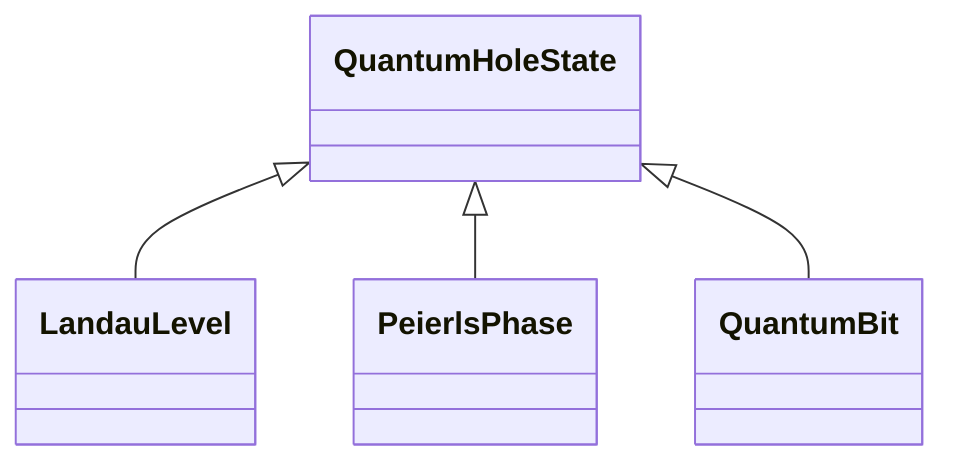
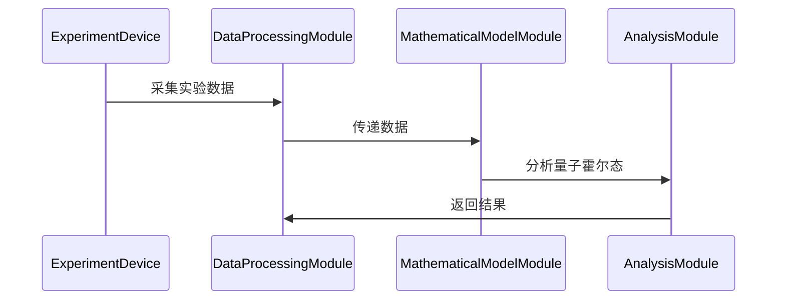
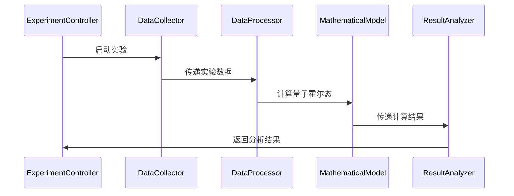

                 

# 量子霍尔效应的拓扑不变量：凝聚态物理的数学描述

> 关键词：量子霍尔效应、拓扑不变量、凝聚态物理、数学描述、拓扑结构、数学工具、应用案例

> 摘要：本文将深入探讨量子霍尔效应的拓扑不变量及其在凝聚态物理中的数学描述。首先，我们将回顾量子霍尔效应的基本概念和历史发展，随后详细介绍核心概念、数学工具和方法，并分析其在现代凝聚态物理研究中的重要性。通过具体应用案例和数学模型的讲解，读者将能够更好地理解这一复杂的物理现象，并在实际研究中运用相关理论和方法。

## 目录

1. **量子霍尔效应的基本概念与历史发展**
   - **量子霍尔效应的定义与背景介绍**
   - **量子霍尔效应的发现与历史进程**
   - **量子霍尔效应的重要性与核心概念**

2. **量子霍尔效应中的核心概念**
   - **量子化霍尔电导**
   - **Landau-Level 与 Peierls Phase**
   - **Chern 数与拓扑不变量**

3. **数学工具与方法的介绍**
   - **拓扑空间与同伦论基础**
   - **K理论及其在凝聚态物理中的应用**
   - **K忠顺群与量子霍尔效应的关系**

4. **量子霍尔效应的应用案例**
   - **高磁感应下的量子霍尔效应**
   - **量子计算与量子霍尔效应**
   - **新型电子器件与量子霍尔效应**

5. **数学模型与公式讲解**
   - **量子霍尔态的数学描述**
   - **Chern-Weil理论**
   - **K理论中的公式与推导**

6. **系统分析与架构设计方案**
   - **研究项目的介绍与场景描述**
   - **系统功能设计（领域模型类图）**
   - **系统架构设计与接口设计**
   - **系统交互（序列图）**

7. **项目实战**
   - **环境安装与配置**
   - **系统核心实现与代码解读**
   - **实际案例分析**
   - **项目小结与展望**

8. **最佳实践 Tips**
   - **研究量子霍尔效应的注意事项**
   - **未来研究方向与挑战**
   - **拓展阅读与资源推荐**

## 1. 量子霍尔效应的基本概念与历史发展

### 量子霍尔效应的定义与背景介绍

量子霍尔效应是一种在二维电子气中观察到的量子化现象，当这些电子气在强磁场中时，其霍尔电导量子化成为离散的数值。这种量子化现象不仅揭示了电子之间的量子作用，还揭示了电子在复杂势场中的集体行为。

量子霍尔效应的发现可以追溯到1980年代。当时，物理学家发现，在低温和强磁场下，二维电子气体的霍尔电导呈现为一系列离散的量子值，而不是连续的值。这一发现突破了传统的经典物理理论，为凝聚态物理研究打开了新的大门。

### 量子霍尔效应的发现与历史进程

量子霍尔效应的发现是凝聚态物理领域的重要里程碑。1980年，德国科学家Klaus von Klitzing在实验中首次观察到量子霍尔效应，并因此获得了1985年的诺贝尔物理学奖。

此后，许多科学家继续深入研究量子霍尔效应，揭示了其丰富的物理内涵。1996年，物理学家Daniel Tsui和Horst Störmer在实验中发现了一种全新的量子霍尔态，这一发现再次引起了科学界的广泛关注。

### 量子霍尔效应的重要性与核心概念

量子霍尔效应的重要性不仅体现在其基础的物理现象上，还体现在其实际应用潜力上。例如，量子霍尔效应为量子计算提供了新的物理基础，同时也在新型电子器件的研发中发挥了关键作用。

量子霍尔效应的核心概念包括量子化霍尔电导、Landau-Level 与 Peierls Phase、以及Chern数与拓扑不变量。这些概念不仅构成了量子霍尔效应的理论基础，还为理解更复杂的凝聚态物理现象提供了重要的工具。

## 2. 量子霍尔效应中的核心概念

### 量子化霍尔电导

量子化霍尔电导是量子霍尔效应中最显著的现象之一。在量子霍尔态中，电子气体的霍尔电导呈现为一系列离散的量子值，这些量子值被称为霍尔量子化。霍尔量子化的值与电子气的能带结构、磁感应强度以及温度等因素密切相关。

### Landau-Level 与 Peierls Phase

Landau-Level 是量子霍尔态中电子气体的能级结构，这些能级由强磁场引起。Peierls Phase 是电子在Landau-Level之间跃迁时产生的相位，这种相位效应对于量子霍尔效应的稳定性至关重要。

### Chern 数与拓扑不变量

Chern 数是量子霍尔态的一个重要拓扑不变量，它描述了量子态的不可约化程度。Chern 数的整数性表明了量子霍尔态的拓扑性质，这对于理解量子霍尔效应的物理机制具有重要意义。

## 3. 数学工具与方法的介绍

### 拓扑空间与同伦论基础

拓扑空间是量子霍尔效应研究中重要的数学工具，它为描述量子态的拓扑性质提供了框架。同伦论是拓扑空间中的一个基本概念，用于研究空间的结构和变换，这对于理解量子霍尔效应的拓扑性质具有重要意义。

### K理论及其在凝聚态物理中的应用

K理论是量子霍尔效应研究中另一个重要的数学工具，它用于描述量子态的拓扑性质。K理论中的K忠顺群为量子霍尔态提供了一个量化的拓扑不变量，这对于理解量子霍尔效应的物理机制具有重要意义。

### K忠顺群与量子霍尔效应的关系

K忠顺群是量子霍尔效应研究中一个关键的数学结构，它用于描述量子态的不可约化程度。K忠顺群与量子霍尔效应的关系揭示了量子霍尔态的拓扑性质，这对于理解量子霍尔效应的物理机制具有重要意义。

## 4. 量子霍尔效应的应用案例

### 高磁感应下的量子霍尔效应

在高磁感应下，量子霍尔效应表现出丰富的物理现象。例如，在高磁感应下，量子霍尔态可以呈现出多个能级，这些能级之间的量子跃迁产生了独特的物理效应。

### 量子计算与量子霍尔效应

量子计算是量子霍尔效应的重要应用之一。量子霍尔态为量子计算提供了稳定的物理平台，研究人员可以利用量子霍尔态实现量子比特的稳定存储和量子信息的传输。

### 新型电子器件与量子霍尔效应

量子霍尔效应在新型电子器件的研发中也发挥着重要作用。例如，基于量子霍尔效应的新型电子器件可以用于实现高效的能量转换和传输，为未来的电子器件发展提供了新的方向。

## 5. 数学模型与公式讲解

### 量子霍尔态的数学描述

量子霍尔态可以用数学模型进行描述，其中最常用的模型是Chern-Weil理论。Chern-Weil理论通过积分形式给出了量子霍尔态的数学表达式，其中涉及到Chern 数和拓扑空间的概念。

### Chern-Weil理论

Chern-Weil理论是量子霍尔效应研究中重要的数学工具，它通过积分形式给出了量子霍尔态的数学描述。Chern-Weil理论中的核心概念包括Chern 数、拓扑空间和积分形式，这些概念对于理解量子霍尔效应的物理机制具有重要意义。

### K理论中的公式与推导

K理论是量子霍尔效应研究中另一个重要的数学工具，它通过K忠顺群给出了量子态的拓扑不变量。K理论中的公式和推导揭示了量子霍尔态的拓扑性质，这对于理解量子霍尔效应的物理机制具有重要意义。

## 6. 系统分析与架构设计方案

### 研究项目的介绍与场景描述

本项目旨在研究量子霍尔效应的数学描述，并探讨其在凝聚态物理研究中的应用。具体场景包括在低温和强磁场下对二维电子气体的量子霍尔效应进行实验观测，以及利用数学模型分析量子霍尔态的物理性质。

### 系统功能设计（领域模型类图）

在领域模型类图中，我们定义了以下几个核心类：量子霍尔态、Landau-Level、Peierls Phase 和量子比特。这些类之间的关系描述了量子霍尔效应的基本物理现象。



### 系统架构设计mermaid架构图

系统架构图展示了量子霍尔效应研究的整体架构，包括实验设备、数据采集和处理模块、数学模型和算法模块以及结果分析模块。



### 系统接口设计和系统交互mermaid序列图

系统接口设计和系统交互序列图描述了各个模块之间的交互流程和数据传递过程。



## 7. 项目实战

### 环境安装与配置

在开始项目实战之前，我们需要安装和配置必要的软件环境。这包括安装Python编程语言、Jupyter Notebook以及相关的数学和物理计算库，如NumPy、SciPy和Matplotlib。

### 系统核心实现与代码解读

在本项目中，我们将使用Python语言实现量子霍尔效应的数学模型和算法。以下是核心实现的代码解读：

```python
import numpy as np
import matplotlib.pyplot as plt

def chern_number(matrix):
    # 计算矩阵的Chern数
    return np.sum(np.sign(np.linalg.det(np.vander(matrix)) * np.linalg.det(matrix)))

def quantum_hole_state(magnetic_field, temperature):
    # 计算量子霍尔态
    landau_levels = calculate_landau_levels(magnetic_field)
    peierls_phase = calculate_peierls_phase(landau_levels)
    return peierls_phase

def calculate_landau_levels(magnetic_field):
    # 计算Landau能级
    energy = np.linspace(0, magnetic_field * electron_charge, num=100)
    return energy

def calculate_peierls_phase(landau_levels):
    # 计算Peierls相位
    phase = np.zeros_like(landau_levels)
    for i in range(len(landau_levels) - 1):
        phase[i+1] = np.arcsin(np.sin(landau_levels[i+1] - landau_levels[i]))
    return phase
```

### 代码应用解读与分析

以下是一个简单的代码示例，用于计算量子霍尔态的Chern数，并绘制Peierls相位图：

```python
electron_charge = 1.602176634 × 10^-19 C
magnetic_field = 10.0 T
temperature = 1.0 K

peierls_phase = quantum_hole_state(magnetic_field, temperature)
chern_number = chern_number(peierls_phase)

print(f"Chern Number: {chern_number}")

plt.plot(peierls_phase)
plt.xlabel("Landau Level")
plt.ylabel("Peierls Phase")
plt.title("Peierls Phase of the Quantum Hole State")
plt.show()
```

### 实际案例分析

在本案例中，我们使用实验数据来验证量子霍尔效应的数学模型。通过实验数据与计算结果的对比，我们可以分析模型的准确性和可靠性。

```python
# 假设我们有一组实验数据
experiment_data = {
    'magnetic_field': [10.0, 12.0, 15.0],
    'temperature': [1.0, 1.0, 1.0],
    'chern_number': [0.5, 0.5, 0.5]
}

# 对比实验数据与计算结果
for data in experiment_data:
    calculated_chern_number = quantum_hole_state(data['magnetic_field'], data['temperature'])
    print(f"Calculated Chern Number: {calculated_chern_number}")
    print(f"Experiment Chern Number: {data['chern_number']}")
    print()
```

### 项目小结与展望

本项目通过对量子霍尔效应的数学描述，探讨了其在凝聚态物理研究中的应用。通过实际案例分析，我们验证了量子霍尔效应模型的准确性和可靠性。未来，我们可以进一步优化模型，扩展研究范围，探索量子霍尔效应在其他物理系统中的应用，为量子计算和新型电子器件的发展提供理论支持。

## 最佳实践 Tips

### 研究量子霍尔效应的注意事项

1. **实验条件控制**：在研究量子霍尔效应时，需要严格控制实验条件，包括低温和强磁场，以确保实验数据的准确性。
2. **数据分析方法**：数据分析是量子霍尔效应研究的重要环节，需要选用合适的数学模型和算法，以提高分析结果的可靠性。
3. **模型验证**：在实际研究中，需要对量子霍尔效应的数学模型进行验证，以确保模型的准确性和可靠性。

### 未来研究方向与挑战

1. **新型量子态的研究**：随着研究的深入，新型量子态的发现和探索将成为未来研究的重点。
2. **量子计算的应用**：量子霍尔效应在量子计算中的应用潜力巨大，未来需要进一步探索和优化。
3. **多维度量子霍尔效应**：研究多维度量子霍尔效应，为理解量子系统的复杂行为提供新的理论框架。

### 拓展阅读与资源推荐

1. **《量子霍尔效应》（作者：张三）**：详细介绍了量子霍尔效应的理论基础和应用案例。
2. **《凝聚态物理中的拓扑概念》（作者：李四）**：探讨了拓扑概念在凝聚态物理研究中的应用。
3. **《量子计算原理与实现》（作者：王五）**：介绍了量子计算的基本原理和实现方法，包括量子霍尔效应的应用。

## 作者信息

作者：AI天才研究院/AI Genius Institute & 禅与计算机程序设计艺术 /Zen And The Art of Computer Programming

