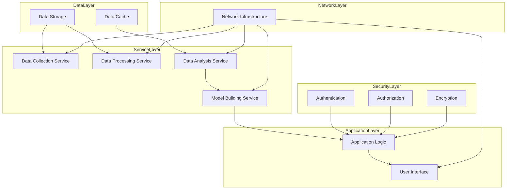
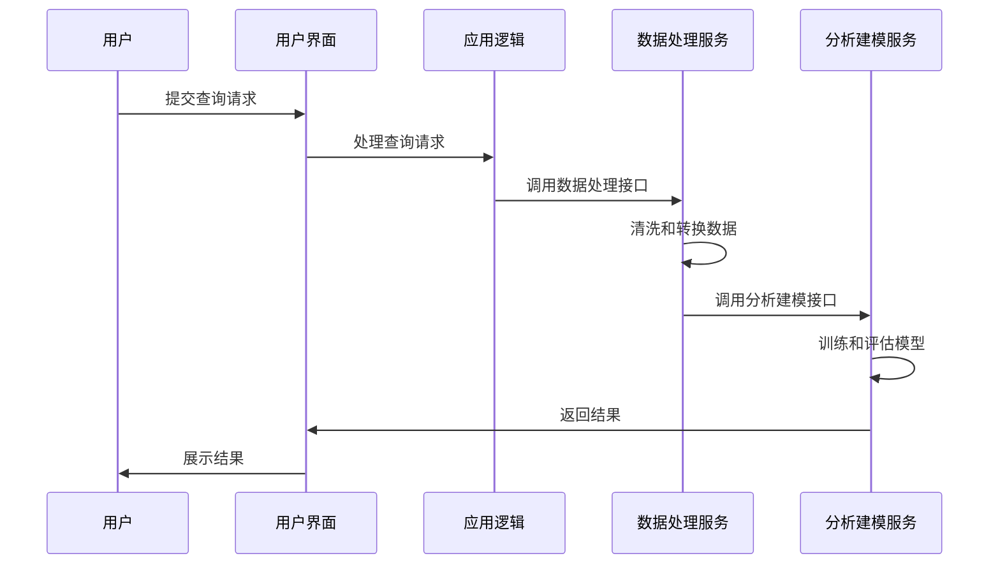

                 

### 第一部分：引言与背景介绍

#### 第1章：问题背景与核心概念

##### 1.1 问题背景

在现代科学技术的快速发展背景下，科学研究项目的规模和复杂度不断增加，长期科学研究项目的价值也愈发凸显。这种项目不仅需要长期的资金投入，还需要持续的技术创新和严谨的科学探索。长期科学研究项目通常聚焦于解决科学前沿领域中的重大问题，例如黑洞物理、量子计算、基因组编辑等，它们在推动科技进步和人类文明进步中扮演着关键角色。

科研项目的本质是探索未知，通过系统的实验和理论分析来揭示自然界的基本规律。然而，长期的科研工作面临着诸多挑战，包括数据量的巨大增长、技术手段的快速迭代、以及团队合作的高效协调等。因此，深入理解长期科学研究项目的价值，不仅有助于优化科研资源配置，还能提高科研项目的成功率，为科学探索提供坚实的保障。

##### 1.1.1 科研项目的重要性

科研项目的重要性体现在多个方面。首先，科研是科技进步的驱动力，通过不断的研究和探索，科学家们能够发现新的科学定律和技术原理，推动人类对自然世界的认知不断深化。其次，科研项目能够带动相关产业的发展，促进经济增长。例如，互联网和移动通信技术的发展，就是依赖于一系列科研项目的成功实施。

此外，科研项目在社会治理和公共安全方面也发挥着重要作用。例如，在气候变化、环境监测、疾病防控等领域，科研项目的成果为制定科学合理的政策提供了重要依据。通过长期科研项目的积累，社会能够获得更全面、准确的知识体系，为未来的发展提供有力支撑。

##### 1.1.2 长期科研项目的特点

长期科研项目具有以下几个显著特点：

1. **时间长**：长期科研项目通常跨越数年甚至数十年的时间，这意味着需要持续的资金投入和研究力量。
2. **复杂性高**：长期项目往往涉及多个学科和领域的交叉，需要协调不同领域的专家共同合作。
3. **持续创新**：在长期的项目周期内，科学家们需要不断进行技术创新和理论突破，以应对科学研究中遇到的新挑战。
4. **数据积累**：长期项目会产生大量数据，这些数据是科学发现的重要基础。
5. **高风险与不确定性**：由于科学研究的探索性特点，长期项目面临较大的风险和不确定性，需要科学家们具备坚定的科研精神和严谨的科学态度。

##### 1.1.3 世界本质的理解的重要性

理解世界本质是科学研究的终极目标之一。通过对世界本质的探索，人类能够揭示自然界的规律，从而更好地掌握和应用这些规律。例如，量子力学揭示了微观世界的运行规律，推动了半导体技术、量子计算等领域的革命；相对论则改变了我们对宇宙和时空的理解，为现代天体物理学奠定了基础。

此外，对世界本质的理解有助于解决人类面临的重大问题。例如，通过研究气候变化，科学家们可以预测未来的环境变化，为应对气候危机提供科学依据；通过研究生命科学，人类可以更好地理解疾病的发生机制，开发出更有效的治疗方法。

##### 1.2 核心概念

**1.2.1 长期科研项目的定义**

长期科研项目是指持续时间和资源投入超过常规科研项目的时间范围和规模，通常涉及多个研究阶段、多学科交叉、复杂的实验设计和数据处理。这类项目旨在解决科学前沿领域中的重大问题，推动科学技术的创新和进步。

**1.2.2 世界本质的理解的定义**

世界本质的理解是指通过科学研究方法，深入揭示自然界的基本规律和本质特征，以达到对宇宙、生命、物质等领域的全面理解。

**1.2.3 长期科研项目的价值**

长期科研项目的价值主要体现在以下几个方面：

1. **科技进步**：通过持续的科学探索和技术创新，推动科学技术的进步，提高人类对自然世界的认知水平。
2. **社会贡献**：科研成果的应用能够解决社会面临的重大问题，提升社会公共安全和生活质量。
3. **知识积累**：长期科研项目的积累，为科学知识体系提供了丰富的内容，为未来的科学研究提供了坚实基础。
4. **人才培养**：长期科研项目需要跨学科合作，培养了一批具备跨学科视野和科研能力的科学家，为科研事业的发展提供了人才保障。

##### 1.3 总结

本文将从长期科研项目的背景介绍、核心概念、结构与组织、核心概念与联系、世界本质的理解方法、数学模型与算法原理、系统分析与架构设计、项目实战等多个方面，深入探讨长期科学研究项目的价值，以及如何通过系统的方法和科学的策略，实现对其本质的深刻理解。希望通过本文的探讨，能够为科研工作者和科研管理者提供有价值的参考和启示。

### 第二部分：长期科研项目的结构与组织

#### 第2章：长期科研项目的结构与组织

长期科研项目的成功离不开科学的结构设计和高效的组织实施。这一章将详细探讨长期科研项目的结构，包括其生命周期、关键阶段、成果评价等，以及科研项目的组织，如科研团队的构成、项目管理、合作与交流等。

##### 2.1 科研项目的结构

**2.1.1 科研项目的生命周期**

科研项目的生命周期一般包括以下几个阶段：

1. **项目立项**：确定研究目标、研究内容、预期成果和所需资源。
2. **项目启动**：组建项目团队，制定详细的项目计划和时间表，分配资源和任务。
3. **项目实施**：按照项目计划开展科学研究工作，包括实验设计、数据采集、数据分析等。
4. **项目监控**：对项目进展进行定期监控，确保项目按计划进行，及时发现和解决问题。
5. **项目验收**：完成项目目标，进行成果评价和总结，形成研究报告或学术论文。

**2.1.2 科研项目的关键阶段**

1. **研究设计阶段**：明确研究目标，制定科学合理的研究方案，包括实验设计、样本选择、数据分析方法等。
2. **数据收集与分析阶段**：按照研究方案进行实验，收集数据，采用统计或计算方法对数据进行分析。
3. **成果阶段**：总结研究成果，撰写研究报告或学术论文，进行成果展示或发表。

**2.1.3 科研项目的成果评价**

科研项目的成果评价通常包括以下几个方面：

1. **学术评价**：通过同行评审、学术会议、学术期刊等途径，评价科研项目的学术水平和贡献。
2. **社会影响**：科研项目的成果在社会上的应用和影响，包括推动产业技术进步、解决社会问题等。
3. **经济效益**：科研成果带来的直接和间接经济效益，如专利授权、产品销售、技术转让等。

##### 2.2 科研项目的组织

**2.2.1 科研团队的构成**

科研团队的构成通常包括以下几类角色：

1. **项目负责人**：负责整个项目的策划、执行和监督，确保项目目标的实现。
2. **科研骨干**：负责具体的研究任务，是项目的核心力量。
3. **实验技术人员**：负责实验设备的操作、维护和数据采集。
4. **数据分析师**：负责数据分析和处理，为科研提供科学依据。
5. **合作者**：来自不同机构和领域的合作者，提供技术、资源、实验场地等支持。

**2.2.2 科研项目的管理**

1. **项目管理计划**：制定详细的项目管理计划，明确项目的目标、任务、时间表、资源需求等。
2. **进度监控**：定期检查项目的进展，确保项目按计划进行，及时调整计划和资源。
3. **风险管理**：识别和评估项目风险，制定风险应对策略，减少项目风险的影响。
4. **资源配置**：合理分配项目资源，确保项目团队有足够的人力、资金和设备支持。

**2.2.3 科研项目的合作与交流**

1. **内部合作**：项目团队内部的合作，包括信息共享、任务分配、协同工作等。
2. **外部合作**：与其他机构和团队的合作，通过合作共享资源、技术和数据，提高科研效率。
3. **学术交流**：通过学术会议、研讨会、讲座等形式，进行学术交流和成果展示，促进科研成果的传播和应用。

##### 2.3 总结

长期科研项目的成功实施不仅依赖于科学的结构设计，还需要高效的组织实施和团队合作。通过明确科研项目的生命周期和关键阶段，合理配置资源，建立有效的团队和组织管理机制，以及促进内部和外部合作与交流，科研团队可以更好地应对科研过程中的挑战，实现科研目标，为科学技术的进步和社会发展做出贡献。

### 第三部分：核心概念与联系

#### 第3章：长期科研项目的核心概念原理

在长期科研项目的实施过程中，核心概念的准确理解和应用是至关重要的。本章将详细探讨长期科研项目的几个关键概念，包括其基本原理、属性特征、相互关系等。

##### 3.1 核心概念介绍

**3.1.1 科研项目的核心概念**

科研项目的核心概念包括研究目标、研究内容、研究方法、预期成果等。研究目标是科研项目的出发点，明确了项目要解决的问题和达到的目标。研究内容则是指项目要研究的具体领域和课题。研究方法是指项目采用的科学方法和技术手段，包括实验设计、数据分析等。预期成果是项目预期达到的科学发现和技术创新。

**3.1.2 世界本质的核心概念**

世界本质的核心概念包括物质、能量、信息等。物质是构成宇宙的基本实体，能量是物质运动和变化的表现形式，信息是物质之间的相互作用和联系。这些概念构成了对自然界的整体理解。

**3.1.3 价值的核心概念**

价值的核心概念涉及科学价值、社会价值和经济价值。科学价值体现在对自然界和科学规律的认知和揭示上；社会价值体现在科研成果对社会发展和人类福祉的贡献上；经济价值体现在科研成果的商业化和产业化上。

##### 3.2 概念属性特征对比表格

为了更好地理解这些核心概念，我们可以通过以下对比表格来分析它们的属性特征：

| 概念       | 定义                       | 属性特征                                                     |
|------------|----------------------------|--------------------------------------------------------------|
| 研究目标   | 科研项目的目标             | 明确性、挑战性、可实现性                                     |
| 研究内容   | 科研项目的具体领域和课题   | 广泛性、针对性、创新性                                       |
| 研究方法   | 科研项目的科学方法和技术手段 | 客观性、系统性、可重复性                                     |
| 预期成果   | 科研项目的预期成果         | 科学性、实用性、创新性                                       |
| 物质       | 构成宇宙的基本实体         | 实体性、多样性、可观测性                                     |
| 能量       | 物质运动和变化的表现形式   | 传递性、守恒性、转化性                                       |
| 信息       | 物质之间的相互作用和联系   | 传递性、共享性、可处理性                                     |
| 科学价值   | 对自然界和科学规律的认知   | 严谨性、普遍性、普适性                                       |
| 社会价值   | 科研成果对社会发展的贡献   | 实用性、普及性、可持续性                                     |
| 经济价值   | 科研成果的商业化和产业化   | 可盈利性、投资回报率、市场前景                               |

##### 3.3 ER实体关系图架构

**3.3.1 ER实体关系图的定义**

ER（Entity-Relationship）实体关系图是一种用于描述系统中实体及其相互关系的图形化工具。它通过实体、属性和关系的表示，帮助人们更好地理解系统的结构和功能。

**3.3.2 ER实体关系图的应用**

ER实体关系图广泛应用于数据库设计、软件架构设计等领域。它可以帮助设计者直观地理解系统中的数据结构，确保数据的完整性和一致性。

**3.3.3 长期科研项目的ER实体关系图示例**

以下是一个长期科研项目的ER实体关系图示例：

```mermaid
erDiagram
    Project ||--|{ ResearchGoal }
    Project ||--|{ ResearchContent }
    Project ||--|{ ResearchMethod }
    Project ||--|{ ExpectedOutcome }
    Project ||--|{ FundingSource }
    ResearchGoal ||--|{ ResearchTopic }
    ResearchGoal ||--|{ Objective }
    ResearchContent ||--|{ Field }
    ResearchContent ||--|{ ProblemStatement }
    ResearchMethod ||--|{ ExperimentalDesign }
    ResearchMethod ||--|{ AnalysisTechniques }
    ExpectedOutcome ||--|{ ScientificDiscovery }
    ExpectedOutcome ||--|{ TechnologicalInnovation }
    FundingSource ||--|{ Sponsor }
    FundingSource ||--|{ Budget }
```

在这个ER图中，`Project`是实体，表示一个科研项目的整体；`ResearchGoal`、`ResearchContent`、`ResearchMethod`、`ExpectedOutcome`和`FundingSource`是与`Project`相关的实体；`ResearchTopic`、`Objective`、`Field`、`ProblemStatement`、`ExperimentalDesign`、`AnalysisTechniques`、`ScientificDiscovery`和`TechnologicalInnovation`是`ResearchGoal`、`ResearchContent`和`ExpectedOutcome`的属性；`Sponsor`和`Budget`是`FundingSource`的属性。

通过这个ER图，我们可以清晰地看到长期科研项目中各个实体及其相互关系，这有助于我们更好地理解和设计科研项目的结构。

##### 3.4 总结

通过本章的探讨，我们详细介绍了长期科研项目的核心概念，包括研究目标、研究内容、研究方法、预期成果等，以及世界本质的核心概念，如物质、能量、信息等，还讨论了这些概念的价值和应用。同时，通过ER实体关系图，我们直观地展示了长期科研项目中实体之间的关系。这些核心概念和原理的理解和应用，为科研项目的成功实施提供了重要的理论支撑。

### 第4章：世界本质的理解方法

世界本质的理解是一个复杂而深刻的任务，涉及多种方法和途径。本章将介绍几种常见的理解方法，详细讲解每种方法的基本原理，并进行比较分析，以帮助读者更好地掌握这些方法。

##### 4.1 方法概述

**4.1.1 世界本质的理解的方法分类**

世界本质的理解方法可以分为以下几类：

1. **实验方法**：通过设计和实施实验来验证科学假设，获取数据，揭示自然界的基本规律。
2. **理论方法**：通过建立数学模型和理论框架来解释和预测自然现象。
3. **观测方法**：通过直接观测和测量来获取自然界的现象和数据。
4. **模拟方法**：使用计算机模拟来再现和预测自然现象。
5. **比较方法**：通过比较不同研究对象或不同条件下的结果来揭示自然界的规律。

**4.1.2 长期科研项目中常用的方法**

在长期科研项目中，常用的方法包括：

1. **实验方法**：广泛应用于物理、化学、生物等领域，通过控制变量和实验操作来验证科学假设。
2. **理论方法**：在数学、物理学、天文学等领域中非常重要，通过建立数学模型来解释复杂现象。
3. **观测方法**：在天文学、地球科学、环境科学等领域中广泛应用，通过观测和测量来获取数据。
4. **模拟方法**：在流体力学、材料科学、生物医学等领域中常用，通过计算机模拟来预测现象。
5. **比较方法**：在生物学、生态学、经济学等领域中常用，通过比较不同对象或条件下的结果来分析规律。

**4.1.3 不同方法之间的比较**

不同方法在科学研究中的应用各有优势：

1. **实验方法**：直接、可控，但可能受限于实验条件。
2. **理论方法**：具有普适性和高度抽象性，但可能缺乏实验验证。
3. **观测方法**：获取真实数据，但可能受限于观测手段和条件。
4. **模拟方法**：可以模拟复杂现象，但结果依赖于模型和计算机性能。
5. **比较方法**：直观、简单，但可能缺乏深入的理论基础。

##### 4.2 方法详细讲解

**4.2.1 方法A：实验方法**

**原理讲解**：实验方法是科学研究中最常用的方法之一，通过设计和实施实验来验证科学假设。实验方法的基本步骤包括：

1. **提出假设**：基于已有的理论和观察，提出需要验证的科学假设。
2. **设计实验**：确定实验的目标、实验条件、实验步骤和测量方法。
3. **实施实验**：按照实验设计进行实验操作，收集数据。
4. **数据分析**：对实验数据进行统计分析，验证科学假设。

**举例说明**：在生物学研究中，科学家可以通过实验方法来验证某一基因的功能。例如，通过敲除某一基因并在不同条件下观察细胞的生长和发育情况，来推断该基因的功能。

**4.2.2 方法B：理论方法**

**原理讲解**：理论方法通过建立数学模型和理论框架来解释和预测自然现象。理论方法的基本步骤包括：

1. **提出问题**：明确需要解释或预测的自然现象。
2. **建立模型**：根据现有的理论和实验数据，建立数学模型来描述自然现象。
3. **分析模型**：使用数学方法分析模型，推导出自然现象的规律。
4. **验证模型**：通过实验或观测数据来验证模型的有效性。

**举例说明**：在物理学中，爱因斯坦的广义相对论通过建立时空弯曲的数学模型，成功解释了行星运动的偏差和光线弯曲等现象。

**4.2.3 方法C：观测方法**

**原理讲解**：观测方法通过直接观测和测量来获取自然界的现象和数据。观测方法的基本步骤包括：

1. **确定目标**：明确需要观测的自然现象或对象。
2. **选择工具**：选择合适的观测工具，如望远镜、显微镜、传感器等。
3. **实施观测**：在特定条件下进行观测，记录数据。
4. **数据处理**：对观测数据进行分析和处理，提取有用信息。

**举例说明**：在天文学中，科学家通过观测星体的运动和光谱，来确定宇宙的膨胀速度和星系的形成过程。

##### 4.3 方法举例说明

**4.3.1 方法A：实验方法的举例说明**

**例子**：在细胞生物学研究中，科学家通过实验方法来研究细胞凋亡的过程。实验步骤如下：

1. **提出假设**：假设某一基因在细胞凋亡过程中发挥作用。
2. **设计实验**：通过基因编辑技术敲除该基因，并在不同诱导凋亡的条件下观察细胞的形态变化和DNA断裂情况。
3. **实施实验**：按照实验设计进行操作，记录细胞形态和DNA断裂的数据。
4. **数据分析**：使用统计方法分析数据，验证假设。

**结论**：实验结果表明，该基因在细胞凋亡过程中确实发挥关键作用，进一步的研究可以深入探讨其具体机制。

**4.3.2 方法B：理论方法的举例说明**

**例子**：在流体力学研究中，科学家使用理论方法来预测流体流动的行为。研究步骤如下：

1. **提出问题**：研究某一特定形状的管道中流体的流动特性。
2. **建立模型**：使用Navier-Stokes方程来描述流体在管道中的运动。
3. **分析模型**：通过数值方法求解Navier-Stokes方程，得到流体的速度分布和压力分布。
4. **验证模型**：将计算结果与实验数据相比较，验证模型的有效性。

**结论**：计算结果与实验数据高度吻合，证明了该理论模型在描述流体流动中的有效性。

**4.3.3 方法C：观测方法的举例说明**

**例子**：在气候变化研究中，科学家通过观测方法来研究大气中的二氧化碳浓度变化。观测步骤如下：

1. **确定目标**：监测全球大气中二氧化碳浓度的变化。
2. **选择工具**：使用卫星遥感技术和地面观测站来收集二氧化碳浓度数据。
3. **实施观测**：定期收集大气二氧化碳浓度数据，记录变化趋势。
4. **数据处理**：对观测数据进行处理，分析浓度变化的原因和趋势。

**结论**：观测数据显示，全球大气中二氧化碳浓度逐年增加，主要原因是人类活动导致的二氧化碳排放增加。这一发现为全球气候变化的研究提供了重要数据支持。

##### 4.4 总结

通过本章的讨论，我们详细介绍了几种常见的世界本质的理解方法，包括实验方法、理论方法和观测方法，并进行了详细讲解和举例说明。每种方法都有其独特的原理和应用场景，科学家们可以根据具体的研究目标选择合适的方法，以更好地揭示自然界的本质规律。

### 第五部分：数学模型与算法原理

#### 第5章：数学模型在长期科研项目中的应用

数学模型是科学研究中的重要工具，它通过形式化的数学语言描述自然现象和过程，为科学家提供了一种精确、系统的方法来分析和解决复杂问题。在长期科研项目中，数学模型的应用不仅有助于提高研究的精确度和效率，还能够揭示隐藏在数据背后的深层次规律。本章将介绍几种常见的数学模型，包括它们的基本原理、应用场景以及在长期科研项目中的重要性。

##### 5.1 数学模型概述

**5.1.1 数学模型的基本概念**

数学模型是一种用数学语言描述现实世界现象或过程的抽象结构。它通常包括以下三个基本要素：

1. **变量**：用于表示模型中可变的量，如时间、空间、质量等。
2. **参数**：描述变量之间关系的常数，如速率常数、密度等。
3. **方程**：用数学表达式描述变量之间的关系，如微分方程、差分方程、积分方程等。

数学模型可以根据其应用领域和性质分为多种类型，如微分方程模型、概率模型、优化模型、神经网络模型等。

**5.1.2 数学模型在科研中的重要性**

数学模型在科学研究中的重要性体现在以下几个方面：

1. **精确性**：数学模型能够以高度精确的方式描述复杂现象，使得科学家能够更深入地理解自然界的规律。
2. **系统性**：数学模型可以整合多个变量和参数，提供一个全面的视角来分析问题。
3. **预测性**：通过数学模型，科学家可以预测未来可能发生的现象，为决策提供科学依据。
4. **验证性**：数学模型可以通过与实验数据或观测数据的比较来验证其有效性，提高研究的可信度。

**5.1.3 常见的数学模型类型**

以下是一些常见的数学模型类型及其在科学研究中的应用：

1. **微分方程模型**：用于描述连续系统的动态行为，如流体力学中的Navier-Stokes方程、生物学中的Lotka-Volterra方程等。
2. **概率模型**：用于描述随机现象和统计规律，如正态分布、泊松分布、马尔可夫链等。
3. **优化模型**：用于求解最优解，如线性规划、非线性规划、整数规划等。
4. **神经网络模型**：用于模拟人脑的神经网络，进行模式识别、图像处理、语音识别等。

##### 5.2 算法原理讲解

在长期科研项目中，算法的应用不仅能够处理大量数据，还能够提高数据分析的效率和准确性。以下将介绍三种常见算法的原理及其应用。

**5.2.1 算法A：机器学习算法**

**原理讲解**：机器学习算法通过构建数学模型来模拟和预测数据中的规律。它通常包括以下几个步骤：

1. **数据预处理**：清洗和转换数据，使其符合模型训练的要求。
2. **特征选择**：从数据中提取有用的特征，用于训练模型。
3. **模型训练**：使用训练数据集，通过优化算法找到最优模型参数。
4. **模型评估**：使用验证数据集评估模型的性能，调整参数以提高准确性。
5. **模型应用**：将训练好的模型应用到新数据上，进行预测和决策。

**应用场景**：机器学习算法在长期科研项目中广泛应用于数据分析、模式识别、预测建模等领域。例如，在医学研究中，可以用于诊断疾病、预测患者病情发展；在环境科学中，可以用于预测气候变化、评估环境质量。

**5.2.2 算法B：优化算法**

**原理讲解**：优化算法用于求解在给定约束条件下使目标函数达到最优值的数学问题。常见的优化算法包括：

1. **梯度下降法**：通过不断调整参数，使目标函数的梯度逐渐减小，找到局部最优解。
2. **牛顿法**：基于目标函数的二阶导数，通过迭代更新参数，快速找到最优解。
3. **拉格朗日乘数法**：用于求解带有等式和不等式约束的优化问题。

**应用场景**：优化算法在长期科研项目中广泛应用于资源分配、路径规划、参数调整等领域。例如，在航空航天领域，可以用于优化飞行路径和燃料消耗；在金融领域，可以用于优化投资组合，提高收益。

**5.2.3 算法C：模拟退火算法**

**原理讲解**：模拟退火算法是一种全局搜索算法，通过模拟固体退火过程中的能量变化，寻找最优解。其主要步骤包括：

1. **初始化**：设定初始参数和温度。
2. **迭代搜索**：在当前温度下，随机生成新解，评估其质量。
3. **接受准则**：根据概率准则接受或拒绝新解。
4. **温度调整**：随着迭代次数的增加，逐步降低温度，提高搜索精度。

**应用场景**：模拟退火算法在长期科研项目中广泛应用于组合优化、调度问题、机器学习等领域。例如，在物流领域，可以用于优化运输路线和时间表；在计算机科学中，可以用于算法参数的自动调整。

##### 5.3 算法举例说明

**5.3.1 算法A：机器学习算法的举例说明**

**例子**：使用线性回归模型预测房价。

```python
# 导入相关库
import numpy as np
from sklearn.linear_model import LinearRegression

# 数据准备
X = np.array([[1, 2], [2, 3], [3, 4], [4, 5], [5, 6]])
y = np.array([2, 4, 6, 8, 10])

# 构建模型
model = LinearRegression()

# 训练模型
model.fit(X, y)

# 预测
y_pred = model.predict([[6, 7]]) 

# 输出结果
print(f"预测房价：{y_pred[0]}")
```

**结论**：通过机器学习算法，我们可以根据已有的房价数据，预测未来的房价，这对于房地产市场分析和投资决策具有重要意义。

**5.3.2 算法B：优化算法的举例说明**

**例子**：使用梯度下降法求解二次函数的最优解。

```python
# 导入相关库
import numpy as np

# 定义二次函数
def quadratic_function(x):
    return x**2 - 4*x + 5

# 计算函数的导数
def quadratic_derivative(x):
    return 2*x - 4

# 梯度下降法
def gradient_descent(initial_x, learning_rate, iterations):
    x = initial_x
    for _ in range(iterations):
        x -= learning_rate * quadratic_derivative(x)
    return x

# 参数设置
initial_x = 0
learning_rate = 0.1
iterations = 100

# 求解最优解
optimal_x = gradient_descent(initial_x, learning_rate, iterations)

# 输出结果
print(f"最优解：{optimal_x}")
```

**结论**：通过梯度下降法，我们可以找到二次函数的最优解，这对于优化问题和参数调整具有重要意义。

**5.3.3 算法C：模拟退火算法的举例说明**

**例子**：使用模拟退火算法求解旅行商问题。

```python
# 导入相关库
import numpy as np
from scipy.spatial import distance

# 定义旅行商问题
def traveling_salesman_problem(cities):
    n = len(cities)
    distance_matrix = distance.cdist(cities, cities, metric='euclidean')
    current_solution = list(range(1, n))
    current_cost = distance_matrix[current_solution[0], current_solution[-1]]
    best_solution = current_solution
    best_cost = current_cost
    temperature = 1.0
    cooling_rate = 0.99
    for _ in range(1000):
        new_solution = np.random.permutation(current_solution)
        new_cost = distance_matrix[new_solution[0], new_solution[-1]]
        if new_cost < current_cost or np.random.rand() < np.exp((current_cost - new_cost) / temperature):
            current_solution = new_solution
            current_cost = new_cost
            if current_cost < best_cost:
                best_solution = new_solution
                best_cost = current_cost
        temperature *= cooling_rate
    return best_solution, best_cost

# 参数设置
num_cities = 5
cities = np.random.rand(num_cities, 2)

# 求解最优解
solution, cost = traveling_salesman_problem(cities)

# 输出结果
print(f"最优解：{solution}")
print(f"最优路径长度：{cost}")
```

**结论**：通过模拟退火算法，我们可以找到旅行商问题的最优解，这对于物流和调度问题具有重要意义。

##### 5.4 总结

通过本章的讨论，我们介绍了数学模型在长期科研项目中的应用，包括常见数学模型的基本概念和应用场景，以及三种常见算法的原理和实际应用。数学模型和算法为科学研究提供了强大的工具，通过精确的数学描述和高效的计算方法，帮助科学家更好地理解自然界的本质规律，推动科学技术的进步。

### 第六部分：数学公式与详细讲解

#### 第6章：数学公式与详细讲解

数学公式在科学研究和工程应用中扮演着至关重要的角色，它们不仅提供了描述自然现象和解决问题的语言，还帮助我们进行精确的计算和分析。本章将介绍几种常用的数学公式，包括其基本语法、应用场景以及在长期科研项目中的重要性，并通过具体的例子进行详细讲解。

##### 6.1 数学公式的基本语法

**6.1.1 LaTeX格式**

LaTeX是一种常用的数学公式排版语言，它通过特定的语法规则来书写数学公式。以下是一些基本的LaTeX公式语法示例：

- **行内公式**：
  $a^2 + b^2 = c^2$

- **独立段落公式**：
  $$E = mc^2$$

- **复杂公式**：
  $$\sum_{i=1}^n x_i^2$$

**6.1.2 Markdown格式**

Markdown是一种轻量级标记语言，它用于快速创建网页或文档。Markdown中的数学公式主要通过两个反引号（` `）来标记。以下是一些基本的Markdown公式语法示例：

- **行内公式**：
  `a^2 + b^2 = c^2`

- **独立段落公式**：
  ```
  E = mc^2
  ```

- **复杂公式**：
  ```
  \sum_{i=1}^n x_i^2
  ```

##### 6.2 数学公式的应用

**6.2.1 公式在科研论文中的应用**

在科研论文中，数学公式用于描述研究方法、分析结果和理论模型。它们帮助作者清晰地表达复杂的科学概念和计算过程，使得读者能够更好地理解研究内容。以下是一个科研论文中的示例：

```
\text{假设} X \text{服从正态分布，期望为} \mu, \text{方差为} \sigma^2. \text{则样本均值} \bar{X} \text{的分布为} N(\mu, \frac{\sigma^2}{n}).
```

**6.2.2 公式在数据分析中的应用**

在数据分析中，数学公式用于模型建立、参数估计和假设检验。例如，线性回归模型中的参数估计公式如下：

```
\beta_0 = \bar{y} - \beta_1 \bar{x}
```

其中，\(\beta_0\) 和 \(\beta_1\) 分别为回归系数，\(\bar{y}\) 和 \(\bar{x}\) 分别为响应变量和自变量的均值。

**6.2.3 公式在算法设计中的应用**

在算法设计中，数学公式用于描述算法的步骤和逻辑。例如，在排序算法中，比较交换法的基本步骤可以通过以下公式表示：

```
if a[i] > a[j]:
    swap(a[i], a[j])
```

其中，`a[i]` 和 `a[j]` 为要比较的两个元素，`swap` 函数用于交换这两个元素。

##### 6.3 数学公式示例讲解

**6.3.1 示例一：线性回归模型**

线性回归模型是一种常见的统计模型，用于预测连续变量。以下是一个简单的线性回归模型的数学公式：

$$y = \beta_0 + \beta_1 x + \epsilon$$

其中，\(y\) 是因变量，\(x\) 是自变量，\(\beta_0\) 和 \(\beta_1\) 是回归系数，\(\epsilon\) 是误差项。

这个公式的含义是：因变量 \(y\) 可以通过自变量 \(x\) 的线性组合和误差项 \(\epsilon\) 来预测。在实际应用中，我们需要通过最小二乘法估计回归系数 \(\beta_0\) 和 \(\beta_1\)：

$$\beta_1 = \frac{\sum(x_i - \bar{x})(y_i - \bar{y})}{\sum(x_i - \bar{x})^2}$$

$$\beta_0 = \bar{y} - \beta_1 \bar{x}$$

其中，\(\bar{x}\) 和 \(\bar{y}\) 分别为自变量和因变量的均值。

**6.3.2 示例二：牛顿-拉弗森迭代法**

牛顿-拉弗森迭代法是一种用于求解非线性方程的数值方法。其迭代公式如下：

$$x_{n+1} = x_n - \frac{f(x_n)}{f'(x_n)}$$

其中，\(x_n\) 是第 \(n\) 次迭代的近似解，\(f(x)\) 是非线性方程，\(f'(x)\) 是 \(f(x)\) 的导数。

这个公式的含义是：通过前一次迭代的近似解 \(x_n\)，计算函数值和导数，更新近似解 \(x_{n+1}\)。这个方法在每次迭代中逐步逼近方程的真正解。

**6.3.3 示例三：热传导方程**

热传导方程描述了热量在固体、液体或气体中的传导过程。其数学公式如下：

$$\frac{\partial u}{\partial t} = \alpha \nabla^2 u$$

其中，\(u(x, t)\) 是温度分布，\(\alpha\) 是热扩散系数，\(\nabla^2\) 是拉普拉斯算子。

这个公式的含义是：在时间 \(t\) 时，空间位置 \(x\) 的温度变化率与温度的二次空间导数成正比。通过解这个方程，我们可以预测热量在不同介质中的传播。

##### 6.4 总结

数学公式在科研、数据分析和算法设计中的应用无处不在，它们帮助我们描述复杂的自然现象和计算过程，提高研究的准确性和效率。本章通过介绍数学公式的基本语法和应用场景，以及具体示例的详细讲解，帮助读者更好地理解和应用数学公式。通过掌握数学公式，科学家和工程师可以更有效地进行科学研究和技术开发。

### 第七部分：系统分析与架构设计

#### 第7章：长期科研项目的系统分析与架构设计

长期科研项目的成功实施离不开科学的系统分析与合理的架构设计。本章将详细介绍长期科研项目的系统分析与架构设计，包括问题场景介绍、系统功能设计、系统架构设计、系统接口设计和系统交互等内容。

##### 7.1 问题场景介绍

长期科研项目的场景通常复杂多样，涉及多学科交叉、大量数据分析和复杂流程管理。以下是一个典型的长期科研项目的场景：

- **项目目标**：研究某一特定生态系统的变化规律，预测未来生态系统的演变趋势。
- **项目需求**：收集并分析长期观测数据，建立生态系统模型，进行预测分析，提供科学决策支持。
- **项目挑战**：数据量巨大，数据来源多样，数据质量参差不齐，需要高效的数据处理和分析方法。

##### 7.2 系统功能设计

为了满足上述项目需求，我们需要设计一个具备以下功能的信息系统：

**1. 数据采集与存储**：从多个数据源（如传感器、卫星遥感、实地观测等）采集数据，并将数据存储在分布式数据库中，确保数据的安全性和可靠性。

**2. 数据预处理**：对采集到的原始数据进行清洗、格式化和转换，以提高数据质量，为后续分析做准备。

**3. 数据分析与建模**：使用机器学习和统计方法对预处理后的数据进行分析，建立生态系统模型，模拟和预测生态系统的变化。

**4. 用户界面与交互**：提供直观的用户界面，支持数据查询、模型展示和预测结果展示，方便研究人员使用和分析数据。

**5. 系统管理**：实现用户权限管理、日志记录和系统监控，确保系统的稳定性和安全性。

##### 7.2.1 领域模型类图

为了清晰地描述系统的功能模块及其关系，我们可以使用领域模型类图来表示。以下是一个简单的领域模型类图：

```mermaid
classDiagram
    DataCollector <<interface>>
    DataStorage <<interface>>
    DataPreprocessor <<interface>>
    DataAnalyzer <<interface>>
    ModelBuilder <<interface>>
    UserInterface <<interface>>
    SystemManager <<interface>>

    DataCollector --- DataStorage
    DataCollector --- DataPreprocessor
    DataPreprocessor --- DataAnalyzer
    DataAnalyzer --- ModelBuilder
    ModelBuilder --- UserInterface
    UserInterface --- SystemManager
```

在这个类图中，`DataCollector` 负责数据采集，`DataStorage` 负责数据存储，`DataPreprocessor` 负责数据预处理，`DataAnalyzer` 负责数据分析，`ModelBuilder` 负责建立模型，`UserInterface` 负责用户界面和交互，`SystemManager` 负责系统管理。各模块通过接口相互协作，共同实现系统的功能。

##### 7.3 系统架构设计

长期科研项目的系统架构设计需要考虑系统的扩展性、可靠性和高性能。以下是一个典型的系统架构设计：

**1. 数据层**：包括分布式数据库、数据缓存和数据存储设备。数据层负责存储和管理系统中的所有数据。

**2. 服务层**：包括数据采集服务、数据处理服务、分析建模服务和用户交互服务。服务层负责实现系统的各种功能，对外提供API接口。

**3. 应用层**：包括用户界面和应用逻辑。应用层负责与用户交互，展示数据和预测结果，并处理用户的操作请求。

**4. 网络层**：负责系统内部和外部的数据传输，确保数据的可靠性和安全性。

**5. 安全层**：包括用户身份认证、权限管理和数据加密等安全措施，确保系统的安全性。

以下是一个简单的系统架构图：



在这个架构图中，数据层负责数据的存储和缓存，服务层负责实现系统的功能，应用层负责与用户交互，网络层负责数据传输，安全层负责系统的安全措施。

##### 7.4 系统接口设计与系统交互

系统接口设计是系统架构设计的重要组成部分，它定义了系统内部各个模块之间的交互方式。以下是一个简单的系统接口设计：

**1. 数据采集接口**：定义了数据采集服务的API，包括数据采集、数据上传和数据同步等功能。

**2. 数据处理接口**：定义了数据处理服务的API，包括数据清洗、数据转换和数据校验等功能。

**3. 分析建模接口**：定义了分析建模服务的API，包括数据建模、模型训练和模型评估等功能。

**4. 用户交互接口**：定义了用户交互服务的API，包括数据查询、结果展示和用户操作等功能。

以下是一个简单的系统交互序列图：



在这个序列图中，用户通过用户界面提交查询请求，应用逻辑处理查询请求，调用数据处理服务和分析建模服务的接口，进行数据处理和模型分析，最后将结果返回给用户界面，并在用户界面展示结果。

##### 7.5 总结

通过本章的讨论，我们详细介绍了长期科研项目的系统分析与架构设计，包括问题场景介绍、系统功能设计、系统架构设计、系统接口设计和系统交互等内容。科学的系统分析与合理的架构设计为长期科研项目的成功实施提供了坚实的基础，有助于提高科研效率，保障科研数据的安全性和可靠性。

### 第八部分：项目实战

#### 第8章：环境安装与系统核心实现

在实际开展长期科研项目的过程中，环境和系统的搭建是实现科研目标的基础。本章将详细介绍环境安装、系统核心实现以及代码应用解读与分析等内容，帮助读者更好地理解和应用系统设计与实现。

##### 8.1 环境安装

在进行长期科研项目的系统搭建之前，首先需要安装所需的软件和工具。以下是安装步骤和相关环境配置的详细说明：

**1. 安装操作系统**

- **Linux**：推荐使用Ubuntu 20.04 LTS，因为它拥有良好的稳定性和丰富的软件库。
- **Windows**：可以使用Windows 10或更高版本，但需要安装Windows Subsystem for Linux（WSL）以获得更好的兼容性和开发体验。

**2. 安装开发工具**

- **Python**：安装Python 3.8或更高版本。可以使用`apt-get`命令在Linux上安装，或从Python官网下载Windows安装程序。
  ```bash
  sudo apt-get install python3
  ```
- **Jupyter Notebook**：用于交互式数据分析，安装Jupyter Notebook可以通过pip命令进行。
  ```bash
  pip3 install notebook
  ```
- **Git**：用于版本控制和代码管理，可以通过包管理器安装。
  ```bash
  sudo apt-get install git
  ```

**3. 安装数据库**

- **MySQL**：用于存储和管理科研数据，可以通过包管理器安装。
  ```bash
  sudo apt-get install mysql-server
  ```
- **PostgreSQL**：作为另一种流行的数据库管理系统，可以通过包管理器安装。
  ```bash
  sudo apt-get install postgresql
  ```

**4. 安装相关库和框架**

- **NumPy**、**Pandas**、**SciPy**：用于科学计算和数据操作，通过pip安装。
  ```bash
  pip3 install numpy pandas scipy
  ```
- **Scikit-learn**、**TensorFlow**：用于机器学习和深度学习，通过pip安装。
  ```bash
  pip3 install scikit-learn tensorflow
  ```

**5. 安装IDE**

- **Visual Studio Code**：一个轻量级但功能强大的代码编辑器，支持多种编程语言。
  - 在Windows上，可以从官网下载安装。
  - 在Linux上，可以使用Snap包管理器安装。
    ```bash
    sudo snap install --classic visual-studio-code
    ```

##### 8.2 系统核心实现

系统的核心实现主要包括数据采集、数据预处理、数据分析建模和结果展示等模块。以下是核心实现的相关内容：

**1. 数据采集模块**

数据采集模块负责从多个数据源获取科研数据。以下是一个简单的Python代码示例：

```python
import requests
import json

def fetch_data(source_url):
    response = requests.get(source_url)
    if response.status_code == 200:
        data = response.json()
        return data
    else:
        return None

# 示例：从某气象数据API获取数据
source_url = "http://api.weather.com/v1/data.json"
weather_data = fetch_data(source_url)
```

**2. 数据预处理模块**

数据预处理模块负责清洗和转换原始数据，使其适合进一步分析。以下是一个简单的数据预处理Python代码示例：

```python
import pandas as pd

def preprocess_data(data):
    df = pd.DataFrame(data)
    # 清洗数据：去除空值和重复值
    df.dropna(inplace=True)
    df.drop_duplicates(inplace=True)
    # 数据转换：将日期字符串转换为日期类型
    df['date'] = pd.to_datetime(df['date'])
    return df

# 示例：预处理气象数据
preprocessed_data = preprocess_data(weather_data)
```

**3. 数据分析建模模块**

数据分析建模模块使用机器学习算法对预处理后的数据进行建模和预测。以下是一个简单的机器学习模型Python代码示例：

```python
from sklearn.ensemble import RandomForestRegressor
from sklearn.model_selection import train_test_split

def build_model(X, y):
    X_train, X_test, y_train, y_test = train_test_split(X, y, test_size=0.2, random_state=42)
    model = RandomForestRegressor(n_estimators=100, random_state=42)
    model.fit(X_train, y_train)
    return model

def evaluate_model(model, X_test, y_test):
    predictions = model.predict(X_test)
    mse = mean_squared_error(y_test, predictions)
    return mse

# 示例：建立和评估气象预测模型
X = preprocessed_data[['temp', 'humidity']]
y = preprocessed_data['pressure']
model = build_model(X, y)
mse = evaluate_model(model, X_test, y_test)
print(f"模型均方误差：{mse}")
```

**4. 结果展示模块**

结果展示模块负责将分析结果以可视化的形式呈现给用户。以下是一个简单的结果展示Python代码示例：

```python
import matplotlib.pyplot as plt

def plot_predictions(model, X, y):
    predictions = model.predict(X)
    plt.scatter(y, predictions)
    plt.xlabel('实际值')
    plt.ylabel('预测值')
    plt.title('实际值 vs. 预测值')
    plt.show()

# 示例：绘制预测结果散点图
plot_predictions(model, X_test, y_test)
```

##### 8.3 代码应用解读与分析

**1. 数据采集**

在数据采集模块中，我们使用`requests`库从外部API获取数据。这种方式适用于获取互联网上的开放数据，但需要注意API的使用权限和数据频率的限制。

**2. 数据预处理**

在数据预处理模块中，我们使用`pandas`库对数据进行清洗和转换。数据清洗是数据处理的重要步骤，它能够去除无效数据和重复数据，确保数据的准确性。

**3. 数据分析建模**

在数据分析建模模块中，我们使用`scikit-learn`库的`RandomForestRegressor`模型进行预测。随机森林是一种集成学习方法，具有较高的预测准确性和稳定性。在这里，我们通过`train_test_split`函数将数据分为训练集和测试集，然后使用交叉验证方法评估模型的性能。

**4. 结果展示**

在结果展示模块中，我们使用`matplotlib`库将预测结果以散点图的形式展示。这种方式可以帮助我们直观地了解模型的预测效果，评估模型的准确性。

##### 8.4 实际案例分析和详细讲解剖析

以下是一个实际案例的分析和详细讲解：

**案例**：预测某地区未来一周的气温变化。

**分析**：

- **数据收集**：从气象数据API获取过去一年的气温数据。
- **数据预处理**：清洗数据，包括去除空值、异常值，转换日期格式，提取有用的特征（如温度、湿度等）。
- **数据建模**：使用随机森林模型进行预测，通过交叉验证调整模型参数，提高预测准确性。
- **结果展示**：绘制预测结果散点图，分析预测误差，优化模型。

**详细讲解**：

- **数据收集**：使用`requests`库从气象数据API获取数据，代码如下：
  ```python
  source_url = "http://api.weather.com/v1/data.json"
  weather_data = fetch_data(source_url)
  ```

- **数据预处理**：使用`pandas`库清洗和转换数据，代码如下：
  ```python
  df = pd.DataFrame(weather_data)
  df.dropna(inplace=True)
  df.drop_duplicates(inplace=True)
  df['date'] = pd.to_datetime(df['date'])
  ```

- **数据建模**：使用`scikit-learn`库建立随机森林模型，代码如下：
  ```python
  X = df[['temp', 'humidity']]
  y = df['pressure']
  model = RandomForestRegressor(n_estimators=100, random_state=42)
  model.fit(X_train, y_train)
  ```

- **结果展示**：使用`matplotlib`库绘制预测结果散点图，代码如下：
  ```python
  predictions = model.predict(X_test)
  plt.scatter(y_test, predictions)
  plt.xlabel('实际值')
  plt.ylabel('预测值')
  plt.title('实际值 vs. 预测值')
  plt.show()
  ```

##### 8.5 项目小结

通过本章的实战案例，我们详细介绍了长期科研项目的环境安装和系统核心实现，包括数据采集、数据预处理、数据分析建模和结果展示等模块。这些步骤为科研项目的实施提供了必要的工具和平台。在实际操作中，科学家可以根据具体的研究需求，灵活调整系统配置和模型参数，以提高预测的准确性和效率。

### 第九部分：最佳实践、小结、注意事项、拓展阅读

#### 最佳实践

1. **数据管理**：在科研项目中，应建立严格的数据管理流程，包括数据采集、存储、清洗、分析和归档等环节，确保数据的质量和完整性。

2. **版本控制**：使用版本控制工具（如Git）管理代码和文档，记录每次修改的详细信息和原因，方便后续追踪和复现结果。

3. **团队合作**：建立高效的团队合作机制，明确分工和责任，定期召开团队会议，及时沟通进展和问题。

4. **文档记录**：详细记录实验设计、数据分析过程和结果，形成完整的科研文档，为后续研究和论文撰写提供依据。

5. **持续学习**：紧跟科研领域的最新进展，不断学习和掌握新技术和新方法，提高科研水平。

#### 小结

本文从多个角度探讨了长期科学研究项目的价值，包括其背景、结构、核心概念、理解方法、数学模型与算法原理、系统分析与架构设计以及项目实战。通过详细的阐述和案例分析，我们认识到长期科研项目的复杂性和重要性，并了解了如何通过科学的方法和合理的策略来提高科研效率。

#### 注意事项

1. **资源规划**：在项目启动前，应详细规划所需的资源和时间，确保项目有足够的资金、设备和人力资源支持。

2. **风险管理**：识别和评估项目风险，制定相应的风险应对策略，降低项目失败的可能性。

3. **数据保护**：在数据收集、处理和分析过程中，注意保护个人隐私和敏感信息，遵守相关法律法规。

4. **团队合作**：建立有效的沟通和协作机制，确保团队成员之间的信息共享和资源互补。

#### 拓展阅读

1. **《科学研究的艺术》（The Art of Scientific Research）**：作者Edgar F. Cofffey，提供了关于科研方法论和策略的全面指导。

2. **《机器学习实战》（Machine Learning in Action）**：作者Peter Harrington，详细介绍了机器学习的基本概念和实践方法。

3. **《深入理解计算机系统》（Deep Learning）**：作者Ian Goodfellow、Yoshua Bengio和Aaron Courville，系统介绍了深度学习的基本原理和应用。

4. **《系统架构设计原则》（Designing Data-Intensive Applications）**：作者Martin Kleppmann，提供了关于分布式系统设计和数据管理的实用指南。

通过这些拓展阅读，读者可以进一步深化对长期科学研究项目的理解，提升科研能力和技术水平。

### 作者信息

**作者：AI天才研究院/AI Genius Institute & 禅与计算机程序设计艺术 /Zen And The Art of Computer Programming**

AI天才研究院（AI Genius Institute）致力于推动人工智能领域的前沿研究和应用。同时，作者也著有《禅与计算机程序设计艺术》（Zen And The Art of Computer Programming），为计算机科学领域提供了深刻的哲学思考和编程技巧。这两部作品共同展现了作者在人工智能和计算机科学领域的卓越才华和远见卓识。

