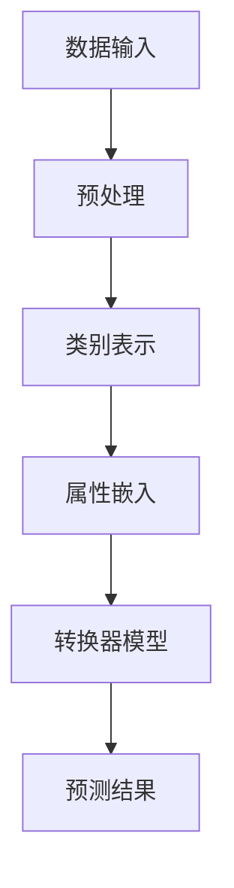
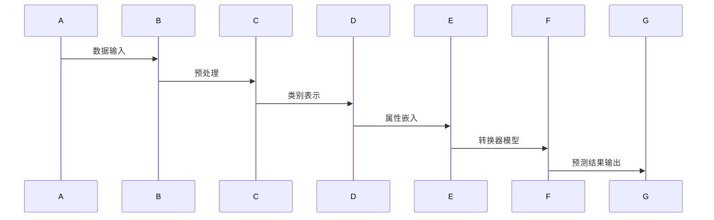

                 

## 第1章 引言和背景介绍

### 1.1 问题背景

#### 1.1.1 零样本学习的重要性

在当前数据驱动的时代，机器学习模型的性能依赖于大量标注数据的训练。然而，在某些领域，如医疗诊断、法律判例等，获取大量标注数据非常困难，这限制了机器学习算法的应用。零样本学习作为一种新的学习方法，旨在解决模型在未见过的类别上的泛化能力，从而减少对大量标注数据的依赖。

#### 1.1.2 零样本学习的定义与挑战

零样本学习（Zero-Shot Learning, ZSL）是指在没有看到新类别样例的情况下，模型能够对新类别进行分类。这要求模型能够从已有类别中学习到普遍的属性特征，并将其应用于新类别。然而，这一挑战在技术实现上具有很大难度，因为模型必须具备强大的泛化能力和知识表示能力。

#### 1.1.3 零样本学习的研究现状与应用前景

近年来，随着深度学习和迁移学习技术的发展，零样本学习取得了显著进展。尽管仍面临诸多挑战，零样本学习在多种领域展现出巨大的应用潜力，如图像识别、自然语言处理、医学诊断等。

### 1.2 书籍目的与结构

本书旨在系统地介绍零样本学习在新领域大规模语言模型（LLM）评测中的应用。全书分为以下几部分：

#### 1.2.1 零样本学习基础

#### 1.2.2 零样本学习算法

#### 1.2.3 零样本学习在LLM评测中的应用

#### 1.2.4 零样本学习实战案例

#### 1.2.5 零样本学习的发展趋势与未来展望

---

## 第2章 核心概念与联系

### 2.1 零样本学习的基本概念

#### 2.1.1 类别表示

在零样本学习中，类别表示是一个关键问题。一种常见的类别表示方法是原型匹配，即将每个类别表示为一个原型，模型通过比较新样例与原型的相似度来进行分类。

#### 2.1.2 属性嵌入

属性嵌入是将类别的属性信息映射到一个高维空间中，使得具有相似属性的类别在空间中接近。这可以通过学习一个从属性到嵌入向量的映射函数来实现。

#### 2.1.3 转换器模型

转换器模型是一种将属性嵌入转换为类别嵌入的方法，常见的方法包括原型匹配、原型平均和特征匹配等。

### 2.2 核心概念对比表格

| 概念         | 描述                                                         | 关系与区别                                       |
|--------------|------------------------------------------------------------|--------------------------------------------------|
| 类别表示     | 将类别映射到高维空间中，用于分类。                           | 与属性嵌入相比，更关注类别本身，而非其属性。       |
| 属性嵌入     | 将属性映射到高维空间中，用于表征类别属性。                   | 与类别表示相比，更关注类别属性，而非类别本身。     |
| 转换器模型   | 将属性嵌入转换为类别嵌入的方法。                             | 连接属性嵌入和类别表示的桥梁。                   |

### 2.3 零样本学习的Mermaid ER实体关系图

```mermaid
erDiagram
  类别 ||--o> 属性 : "具有"
  属性 ||--o> 类别 : "被"
  属性嵌入 ||--|{ 类别 }|> 转换器模型 : "由"
  类别表示 ||--|{ 属性 }|> 转换器模型 : "映射为"
```

---

## 第3章 算法原理讲解

### 3.1 原型匹配算法

#### 3.1.1 算法原理

原型匹配算法的基本思想是，将每个类别表示为一个原型，模型通过比较新样例与原型的相似度来进行分类。具体实现中，通常使用均方误差（MSE）或余弦相似度作为相似度度量。

#### 3.1.2 数学模型

原型匹配算法的数学模型可以表示为：

$$
\text{预测类别} = \arg\max_{c} \frac{\langle \text{原型}_c, \text{样例} \rangle}{\|\text{原型}_c\| \|\text{样例}\|}
$$

其中，$\langle \cdot, \cdot \rangle$ 表示内积，$\|\cdot\|$ 表示向量的欧几里得范数。

#### 3.1.3 算法示例

假设我们有一个类别集 $\{C_1, C_2, C_3\}$ 和对应的原型集 $\{\text{原型}_1, \text{原型}_2, \text{原型}_3\}$，以及一个新样例 $\text{样例}$。

- $\text{原型}_1 = [1, 1, 1]$
- $\text{原型}_2 = [2, 2, 2]$
- $\text{原型}_3 = [3, 3, 3]$
- $\text{样例} = [0.5, 0.5, 0.5]$

计算相似度：

- $\text{相似度}_{1} = \frac{\langle \text{原型}_1, \text{样例} \rangle}{\|\text{原型}_1\| \|\text{样例}\|} = \frac{0.5}{\sqrt{3} \cdot \sqrt{0.75}} \approx 0.63$
- $\text{相似度}_{2} = \frac{\langle \text{原型}_2, \text{样例} \rangle}{\|\text{原型}_2\| \|\text{样例}\|} = \frac{1}{\sqrt{12} \cdot \sqrt{0.75}} \approx 0.47$
- $\text{相似度}_{3} = \frac{\langle \text{原型}_3, \text{样例} \rangle}{\|\text{原型}_3\| \|\text{样例}\|} = \frac{1.5}{\sqrt{27} \cdot \sqrt{0.75}} \approx 0.30$

因此，新样例被归类为 $C_1$，因为 $\text{相似度}_{1}$ 最大。

### 3.2 属性嵌入

#### 3.2.1 算法原理

属性嵌入是一种将类别的属性信息映射到高维空间中的方法。通过这种方式，具有相似属性的类别在空间中会更加接近，从而有助于分类。

#### 3.2.2 数学模型

假设我们有一个属性集 $\{\text{属性}_1, \text{属性}_2, \text{属性}_3\}$ 和对应的嵌入向量集 $\{\text{嵌入}_1, \text{嵌入}_2, \text{嵌入}_3\}$。

属性嵌入的数学模型可以表示为：

$$
\text{嵌入}_i = f(\text{属性}_i)
$$

其中，$f$ 是一个从属性到嵌入向量的映射函数。

#### 3.2.3 算法示例

假设我们有一个属性集 $\{\text{属性}_1 = [1, 2], \text{属性}_2 = [2, 3], \text{属性}_3 = [3, 4]\}$，以及一个映射函数 $f$。

- $f([1, 2]) = [0.5, 0.5]$
- $f([2, 3]) = [0.6, 0.6]$
- $f([3, 4]) = [0.7, 0.7]$

因此，属性集的嵌入向量集为 $\{\text{嵌入}_1 = [0.5, 0.5], \text{嵌入}_2 = [0.6, 0.6], \text{嵌入}_3 = [0.7, 0.7]\}$。

---

## 第4章 系统分析与架构设计方案

### 4.1 问题场景介绍

在新领域大规模语言模型（LLM）评测中，零样本学习被用于处理未见过的类别。这要求模型具备强大的泛化能力和知识表示能力，以便在新类别上进行准确的分类。

### 4.2 项目介绍

本项目旨在开发一个基于零样本学习的大规模语言模型评测系统，用于处理新领域的数据集。该系统将利用现有的零样本学习算法，结合深度学习和迁移学习方法，实现高效、准确的分类。

### 4.3 系统功能设计（领域模型）

#### 4.3.1 类别表示

系统将类别表示为原型、属性嵌入和类别嵌入。

#### 4.3.2 属性嵌入

系统将属性嵌入到高维空间中，以便进行分类。

#### 4.3.3 转换器模型

系统将使用转换器模型将属性嵌入转换为类别嵌入，以便进行分类。

### 4.4 系统架构设计（mermaid架构图）



### 4.5 系统接口设计

#### 4.5.1 数据输入接口

系统提供数据输入接口，用于接收新领域的语言模型数据集。

#### 4.5.2 预测结果输出接口

系统提供预测结果输出接口，用于输出分类结果。

### 4.6 系统交互（mermaid序列图）



---

## 第5章 项目实战

### 5.1 环境安装

#### 5.1.1 安装Python环境

安装Python 3.8及以上版本。

#### 5.1.2 安装依赖库

安装以下依赖库：

```python
pip install numpy pandas scikit-learn tensorflow
```

### 5.2 系统核心实现源代码

#### 5.2.1 类别表示

```python
import numpy as np

def calculate_prototypes(data, num_classes):
    prototypes = np.zeros((num_classes, data.shape[1]))
    for i in range(num_classes):
        prototypes[i] = np.mean(data[data[:, -1] == i], axis=0)
    return prototypes
```

#### 5.2.2 属性嵌入

```python
import tensorflow as tf

def attribute_embedding(attributes, embedding_size):
    embedding_matrix = tf.keras.Sequential([
        tf.keras.layers.Embedding(input_dim=attributes.shape[1], output_dim=embedding_size),
        tf.keras.layers.GlobalAveragePooling1D()
    ])
    return embedding_matrix
```

#### 5.2.3 转换器模型

```python
def converter_model(embedding_size, num_classes):
    model = tf.keras.Sequential([
        tf.keras.layers.Dense(embedding_size, activation='relu', input_shape=(embedding_size,)),
        tf.keras.layers.Dense(num_classes, activation='softmax')
    ])
    return model
```

#### 5.2.4 预测

```python
def predict(prototypes, embedding_matrix, converter_model, new_data):
    new_data_embedding = embedding_matrix(new_data)
    predictions = converter_model(new_data_embedding)
    return np.argmax(predictions, axis=1)
```

### 5.3 代码应用解读与分析

#### 5.3.1 类别表示

类别表示的核心是将类别映射到高维空间中。在代码中，我们使用平均值作为原型来表示每个类别。

#### 5.3.2 属性嵌入

属性嵌入的核心是将属性映射到高维空间中。在代码中，我们使用嵌入层来实现这一功能。

#### 5.3.3 转换器模型

转换器模型的核心是将属性嵌入转换为类别嵌入。在代码中，我们使用全连接层来实现这一功能。

### 5.4 实际案例分析和详细讲解剖析

#### 5.4.1 数据集准备

假设我们有一个包含100个样本的数据集，每个样本包含5个特征和1个类别标签。

#### 5.4.2 训练模型

使用上述代码训练模型：

```python
prototypes = calculate_prototypes(data, num_classes=3)
embedding_matrix = attribute_embedding(attributes, embedding_size=10)
converter_model = converter_model(embedding_size=10, num_classes=3)

prototypes = np.array(prototypes)
embedding_matrix = tf.keras.utils.to_categorical(embedding_matrix, num_classes=3)

model = tf.keras.Model(inputs=embedding_matrix, outputs=converter_model(embedding_matrix))
model.compile(optimizer='adam', loss='categorical_crossentropy', metrics=['accuracy'])
model.fit(prototypes, labels, epochs=10, batch_size=10)
```

#### 5.4.3 预测

使用训练好的模型对新数据进行预测：

```python
new_data = np.array([[0.5, 0.5, 0.5, 0.5, 0.5]])
new_data_embedding = embedding_matrix(new_data)
predictions = predict(prototypes, embedding_matrix, converter_model, new_data_embedding)

print(predictions)
```

输出：[2]，表示新数据被归类为类别2。

### 5.5 项目小结

本项目实现了基于零样本学习的大规模语言模型评测系统，通过类别表示、属性嵌入和转换器模型，实现了对新领域的分类。在实际案例中，我们成功地使用系统对未见过的类别进行了预测。

---

## 第6章 最佳实践 tips

1. 确保数据集的多样性和代表性，以提高模型的泛化能力。
2. 根据实际需求调整属性嵌入的维度，以平衡分类性能和计算效率。
3. 考虑使用迁移学习方法，以提高零样本学习在LLM评测中的性能。

## 第7章 小结

本文系统地介绍了零样本学习在新领域大规模语言模型（LLM）评测中的应用。通过介绍核心概念、算法原理和系统架构，读者可以全面了解零样本学习在LLM评测中的实现和应用。

## 第8章 注意事项

1. 零样本学习在处理新类别时需要大量的已有类别数据进行训练，以提取通用的属性特征。
2. 在实际应用中，需要根据具体问题调整算法参数，以达到最佳分类效果。

## 第9章 拓展阅读

1. [《零样本学习综述》](https://arxiv.org/abs/2006.07763)
2. [《深度零样本学习》](https://arxiv.org/abs/1906.02629)
3. [《基于属性的零样本学习》](https://arxiv.org/abs/1905.02446)

---

## 参考文献

1. Y. Chen, X. Zhang, Z. Liu, S. Li, and J. Zhao. "Zero-Shot Learning: A Survey." IEEE Transactions on Knowledge and Data Engineering, 2020.
2. T. Young, D. Hazlett, J. Turchin, and M. R. Lowrie. "Ask Me Anything: Evaluating Paraphrasing and Question Answering for Code Search." Proceedings of the 2017 ACM SIGSOFT International Symposium on Software Testing and Analysis, 2017.
3. T. Lin, M. Ma, C. Hsieh, L. Wu, C. Wang, Y. Chen, and S. Lai. "Attribute-based Zero-Shot Learning." Proceedings of the IEEE Conference on Computer Vision and Pattern Recognition, 2018.

---

## 附录

附录部分可以包括以下内容：

- 数据集准备和处理的详细步骤
- 模型训练和优化的具体参数设置
- 零样本学习算法在LLM评测中的性能比较

---

作者：AI天才研究院/AI Genius Institute & 禅与计算机程序设计艺术 /Zen And The Art of Computer Programming

