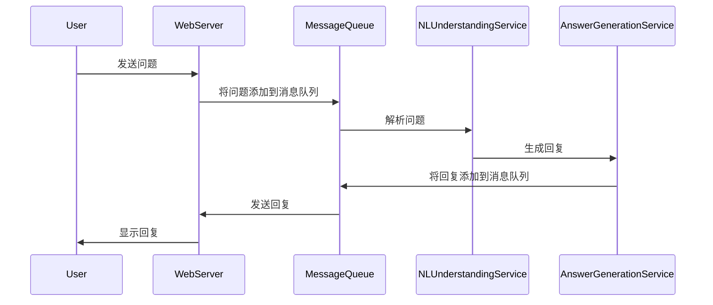

                 

### 第一部分：背景与核心概念

#### 1.1 问题背景

随着人工智能技术的不断发展，自然语言处理（NLP）领域取得了显著的成果。特别是在大语言模型（Large Language Model，简称LLM）方面，如GPT-3、BERT等模型的广泛应用，使得机器在理解和生成自然语言方面达到了前所未有的高度。然而，在实际应用中，如何有效地将领域驱动设计（Domain-Driven Design，简称DDD）与LLM结合，构建出高性能、高可维护性的应用架构，成为了一个亟待解决的问题。

问题主要表现为：首先，LLM的应用场景复杂多样，涉及领域广泛，传统的软件开发方法难以满足需求；其次，在开发过程中，如何将业务逻辑与数据模型有效地分离，保证系统的灵活性和扩展性，是一个巨大的挑战。此外，随着数据量的爆炸性增长，系统的性能优化和可维护性也成为一个关键问题。

#### 1.2 DDD基本概念

DDD是由Eric Evans提出的一种软件开发方法，旨在通过构建清晰、灵活且易于维护的领域模型，有效地解决复杂业务问题的设计思路。

##### 定义
DDD是一种面向领域、以领域模型为核心的软件开发方法。它强调将业务领域模型化，并将模型映射到软件系统中，以实现高效的软件设计、开发和管理。

##### 核心原则
1. **领域驱动**：将领域作为软件设计的核心，围绕领域模型来构建软件系统。
2. **泛化与聚合**：通过泛化和聚合关系，将领域概念抽象为模型，提高系统的灵活性和扩展性。
3. **界限划分**：将领域划分为不同的界限，以定义系统的边界，提高系统的模块化程度。
4. **领域服务**：通过领域服务来实现跨界限的复杂业务逻辑。

##### DDD与LLM的关系

DDD与LLM的结合，主要是通过将LLM作为领域模型的一部分，将NLP的复杂业务逻辑转化为领域模型，从而实现高效的软件设计。具体来说，LLM在DDD中的应用主要体现在以下几个方面：

1. **领域模型**：LLM可以被视为一种特殊的领域模型，其能力可以用于处理复杂的自然语言问题，如文本生成、情感分析等。
2. **领域服务**：LLM可以作为领域服务的一部分，提供跨界限的复杂业务逻辑处理。
3. **界限划分**：通过LLM的能力，可以更加准确地划分领域界限，提高系统的模块化程度。
4. **性能优化**：LLM的强大计算能力可以帮助优化系统的性能，特别是在处理大规模数据时。

#### 1.3 LLM基本概念

LLM是基于深度学习的自然语言处理模型，具有处理大规模文本数据的能力。它通过大规模的预训练和微调，能够理解并生成复杂的自然语言文本。

##### 定义
LLM是一种大型神经网络模型，通过对海量文本数据进行训练，学习到语言的统计规律和语义信息，从而能够生成和识别复杂的自然语言文本。

##### 特点
1. **大规模**：LLM通常具有数十亿甚至上百亿的参数，能够处理大规模的文本数据。
2. **预训练**：LLM通过预训练，学习了通用语言模型的知识，从而能够适应不同的应用场景。
3. **灵活**：LLM可以根据具体任务进行微调，以适应特定的业务需求。

##### 架构
LLM的架构通常包括以下几个部分：

1. **嵌入层**：将输入的文本转换为固定长度的向量。
2. **编码器**：对文本向量进行编码，生成上下文表示。
3. **解码器**：根据上下文表示生成输出文本。

##### 应用场景
LLM可以应用于各种自然语言处理任务，如文本生成、问答系统、情感分析、机器翻译等。特别是在复杂业务场景中，LLM能够提供强大的业务逻辑处理能力，从而提高系统的性能和可维护性。

#### 1.4 本章小结

本章主要介绍了DDD与LLM的基本概念，以及它们之间的关系。通过对DDD的背景介绍和核心原则的阐述，我们可以理解DDD在软件设计中的重要作用。同时，通过对LLM的定义、特点和架构的讲解，我们能够看到LLM在复杂业务处理中的巨大潜力。下一章，我们将进一步探讨DDD在LLM应用架构中的具体应用，以帮助我们更好地理解和应用这一方法。

---

### 第二部分：DDD在LLM应用架构中的具体应用

#### 2.1 实体与值对象

在DDD中，实体（Entity）和值对象（Value Object）是领域模型中的两个基本概念，它们分别代表了领域中的两种不同类型的对象。理解它们的基本概念、属性和关系对于构建一个有效的LLM应用架构至关重要。

##### 2.1.1 实体

实体是DDD中具有独立身份和唯一标识的对象。它们在领域模型中通常代表具体的业务实体，如用户、订单、商品等。

- **定义**：实体是领域模型中的一个关键概念，具有不变的状态和行为。实体通常是通过其唯一标识来区分的，如用户ID、订单号等。
- **属性**：实体具有一组属性，用于描述其实体的状态。例如，用户实体可能包含用户名、年龄、邮箱等属性。
- **关系**：实体之间通过关系进行关联。这些关系可以是继承、聚合、组合等。例如，订单实体可以与用户实体关联，表示某个用户下的订单。

实体关系图（Entity Relationship Diagram，ERD）是描述实体和关系的一种常见方法。以下是一个简单的实体关系图示例，用于表示用户和订单之间的关系：

```mermaid
erDiagram
    User ||--|{ Order : has }
    User ||--|{ Address : has }
    Order ||--|{ Product : contains }
    Order ||--|{ Payment : has }
```

在这个ERD中，用户（User）实体与订单（Order）实体之间存在“has”关系，表示一个用户可以有多个订单；订单实体与产品（Product）实体之间存在“contains”关系，表示一个订单可以包含多个产品。

##### 2.1.2 值对象

值对象是DDD中的另一个基本概念，它们代表领域中的具体值，如价格、重量、地址等。

- **定义**：值对象是领域模型中的一个不可变的对象，它们仅代表具体值，不具有唯一标识。值对象通常通过其值来区分，如不同的地址之间通过具体的地址字符串来区分。
- **属性**：值对象具有一组属性，用于描述其值。例如，地址值对象可能包含街道、城市、邮编等属性。
- **关系**：值对象通常通过聚合关系与实体关联。例如，订单实体可以包含多个地址值对象，表示订单的多个收货地址。

以下是一个简单的值对象示例，用于表示地址：

```python
class Address:
    def __init__(self, street, city, zip_code):
        self.street = street
        self.city = city
        self.zip_code = zip_code
```

在这个示例中，地址值对象通过其具体的值（街道、城市、邮编）来区分。

##### 2.1.3 实体与值对象的关系

实体和值对象在DDD中共同构成了领域模型的基础。实体代表领域中的业务实体，具有不变的状态和行为；值对象代表领域中的具体值，用于描述实体的状态和行为。

- **关联**：实体和值对象通过关联关系进行交互。例如，用户实体可以包含多个地址值对象，表示用户的多个收货地址。
- **聚合**：实体和值对象可以通过聚合关系进行组合。例如，订单实体可以包含多个产品值对象，表示订单的多个商品。

在LLM应用架构中，实体和值对象的合理使用可以大大提高系统的可维护性和扩展性。通过将复杂的业务逻辑封装在实体和值对象中，可以使得系统的模块化程度更高，便于后续的维护和扩展。

#### 2.2 聚合与边界

在DDD中，聚合（Aggregate）和边界（Boundary）是两个关键概念，用于定义领域模型中的模块化和完整性。理解这两个概念及其关系对于构建高效的LLM应用架构至关重要。

##### 2.2.1 聚合

聚合是DDD中的一个基本构建块，它代表了一组相关实体的集合。聚合的主要目的是确保实体的完整性和一致性。

- **定义**：聚合是领域模型中的一个概念，它代表了一组具有共同行为和属性的实体。聚合内的所有实体都共享同一上下文，且只能通过聚合根（Aggregate Root）进行访问。
- **聚合边界**：聚合边界是定义聚合范围的一组规则。聚合边界决定了哪些实体属于聚合，哪些实体不属于聚合。聚合边界可以是物理边界（如数据库表）或逻辑边界（如业务规则）。
- **聚合之间的关系**：聚合之间的关系可以是聚合（Aggregate-to-Aggregate）关系或实体（Entity-to-Entity）关系。聚合之间的关系通常通过聚合根进行管理，以确保聚合的完整性和一致性。

以下是一个简单的聚合示例，用于表示一个订单聚合：

```mermaid
classDiagram
    Order <<-- (OrderItem)*
    OrderItem <-- Product
    Product : 商品
    OrderItem : 订单项
    Order : 订单
```

在这个示例中，订单（Order）是聚合根，它包含多个订单项（OrderItem），每个订单项又关联到具体的商品（Product）。通过这种方式，订单聚合可以确保订单及其相关订单项的完整性和一致性。

##### 2.2.2 边界

边界是DDD中的一个关键概念，它定义了领域模型中的界限，以防止领域逻辑的泄漏。边界的主要目的是提高系统的模块化和可维护性。

- **定义**：边界是领域模型中的一个概念，它定义了领域中的界限，用于防止领域逻辑的泄漏。边界可以是逻辑边界（如业务规则）或物理边界（如数据库表）。
- **边界划分**：边界划分是定义领域模型边界的过程。边界划分的目的是将领域模型划分为多个模块，以提高系统的可维护性和扩展性。
- **边界管理**：边界管理是确保领域模型边界有效运行的过程。边界管理包括边界规则的制定、边界间的交互管理等。

以下是一个简单的边界示例，用于表示订单和支付系统之间的边界：

```mermaid
classDiagram
    Order ||--| Payment : 交互
    Payment : 支付系统
    Order : 订单系统
```

在这个示例中，订单系统（Order）和支付系统（Payment）之间通过边界进行交互。订单系统只能通过支付系统的接口进行支付操作，以确保支付系统的逻辑不受订单系统的影响。

##### 2.2.3 聚合与边界的关系

聚合和边界在DDD中共同构成了领域模型的基础。聚合负责确保实体的完整性和一致性，而边界负责定义领域模型的界限，以防止领域逻辑的泄漏。

- **关联**：聚合和边界可以通过关联关系进行交互。例如，订单聚合可以通过边界与支付系统进行交互，实现订单支付功能。
- **层次**：聚合和边界之间存在层次关系。边界可以定义在聚合内部或外部，以适应不同的领域场景。

在LLM应用架构中，聚合和边界的合理使用可以大大提高系统的可维护性和扩展性。通过将复杂的业务逻辑封装在聚合和边界中，可以使得系统的模块化程度更高，便于后续的维护和扩展。

### 第三部分：领域服务与领域事件

#### 3.1 领域服务

领域服务是DDD中的核心概念之一，它代表了跨界限的复杂业务逻辑。领域服务的主要目的是将业务逻辑封装在服务中，以提高系统的可维护性和可扩展性。

##### 3.1.1 定义

领域服务是DDD中用于实现跨界限的复杂业务逻辑的服务。领域服务通常位于领域模型的中心，负责处理跨界限的业务需求。

- **业务逻辑**：领域服务负责实现具体的业务逻辑。这些业务逻辑通常涉及多个实体和值对象，需要跨界限进行操作。
- **职责分离**：领域服务通过职责分离，将业务逻辑从其他组件中分离出来，使得系统的模块化程度更高，便于后续的维护和扩展。

##### 3.1.2 实现与使用

领域服务的实现与使用主要包括以下几个方面：

1. **服务接口**：领域服务的接口定义了服务的操作和参数。服务接口通常位于领域模型的边界层，用于与其他系统进行交互。
2. **服务实现**：领域服务的实现位于领域模型的领域层，负责实现具体的业务逻辑。服务实现通常依赖于实体和值对象，以完成复杂的业务操作。
3. **服务调用**：领域服务的调用通常发生在领域层的业务逻辑中。通过调用领域服务，可以完成跨界限的复杂业务操作。

以下是一个简单的领域服务示例，用于表示订单支付服务：

```python
class PaymentService:
    def process_payment(self, order, payment_info):
        # 实现支付逻辑
        if order.is_paid:
            return "支付成功"
        else:
            return "支付失败"
```

在这个示例中，`PaymentService` 类是一个领域服务，它提供了 `process_payment` 方法，用于处理订单支付逻辑。该方法接收 `order`（订单实体）和 `payment_info`（支付信息值对象）作为参数，并返回支付结果。

##### 3.1.3 管理与优化

领域服务的管理与优化主要包括以下几个方面：

1. **服务监控**：通过监控领域服务的性能和异常，及时发现和解决问题。
2. **服务拆分**：根据业务需求和性能要求，将大型领域服务拆分为多个小型服务，以提高系统的可维护性和可扩展性。
3. **服务缓存**：通过使用缓存技术，减少领域服务的调用次数，提高系统的响应速度。
4. **服务测试**：通过自动化测试，确保领域服务的正确性和稳定性。

#### 3.2 领域事件

领域事件是DDD中的另一个核心概念，它代表了领域模型中的状态变化。领域事件的主要目的是实现领域状态的动态更新和同步。

##### 3.2.1 定义

领域事件是DDD中用于表示领域状态变化的信号。领域事件通常由领域服务触发，并传递给其他领域组件，以实现状态的同步和更新。

- **事件驱动**：领域事件通过事件驱动的方式，实现了领域状态的动态更新。事件驱动模型具有高扩展性和高可维护性，能够适应复杂的业务场景。
- **异步处理**：领域事件通常通过异步处理的方式传递和更新状态。异步处理可以降低系统的耦合度，提高系统的性能和可扩展性。

##### 3.2.2 事件类型

领域事件可以分为以下几种类型：

1. **创建事件**：表示领域对象被创建的事件，如订单创建事件、用户注册事件等。
2. **更新事件**：表示领域对象状态更新的事件，如订单状态更新事件、用户信息更新事件等。
3. **删除事件**：表示领域对象被删除的事件，如订单删除事件、用户删除事件等。
4. **通知事件**：表示领域对象之间需要通知的事件，如订单支付成功通知事件、用户登录成功通知事件等。

##### 3.2.3 事件处理

领域事件的处理主要包括以下几个方面：

1. **事件接收**：领域组件通过订阅的方式接收领域事件。事件接收通常通过事件总线（Event Bus）实现，以确保事件的高效传递和分发。
2. **事件处理**：领域组件根据事件类型和事件内容，执行相应的业务逻辑和处理操作。事件处理通常通过领域服务实现，以确保业务逻辑的完整性。
3. **事件同步**：领域组件通过事件同步的方式，确保领域状态的一致性和一致性。事件同步可以通过数据库事务或消息队列等方式实现。

以下是一个简单的领域事件示例，用于表示订单状态更新事件：

```python
class OrderStatusChangedEvent:
    def __init__(self, order_id, new_status):
        self.order_id = order_id
        self.new_status = new_status

class OrderService:
    def update_order_status(self, order_id, new_status):
        # 更新订单状态
        order = self.repository.get_order_by_id(order_id)
        order.status = new_status
        # 触发订单状态更新事件
        event_bus.publish(OrderStatusChangedEvent(order_id, new_status))
```

在这个示例中，`OrderStatusChangedEvent` 类是一个领域事件类，用于表示订单状态更新事件。`OrderService` 类是一个领域服务类，它提供了 `update_order_status` 方法，用于更新订单状态并触发订单状态更新事件。

##### 3.2.4 事件优化

领域事件的优化主要包括以下几个方面：

1. **事件过滤**：通过事件过滤，减少不必要的消息传递和处理，提高系统的性能和响应速度。
2. **事件缓存**：通过事件缓存，减少数据库查询次数，提高系统的响应速度。
3. **事件聚合**：通过事件聚合，将多个事件合并为一个事件，减少消息传递和处理的次数。

在LLM应用架构中，领域服务和领域事件的使用可以大大提高系统的可维护性和扩展性。通过将复杂的业务逻辑封装在领域服务和领域事件中，可以使得系统的模块化程度更高，便于后续的维护和扩展。

### 第四部分：DDD在LLM架构设计中的应用

#### 4.1 LLM架构设计概述

领域驱动设计（DDD）在大型语言模型（LLM）的架构设计中起着至关重要的作用。DDD提供了一种系统化的方法，帮助我们更好地理解和处理复杂业务需求，从而设计出高效、可扩展的LLM应用架构。

##### 4.1.1 架构设计原则

在进行LLM架构设计时，应遵循以下原则：

1. **领域驱动**：将业务领域作为架构设计的核心，围绕领域模型来构建系统。这有助于确保架构能够准确地反映业务需求，提高系统的可维护性和可扩展性。
2. **模块化**：将系统划分为多个模块，每个模块负责特定的功能。模块之间通过清晰的接口进行通信，降低模块间的耦合度，提高系统的可维护性。
3. **可扩展性**：设计时考虑系统的未来扩展需求，确保系统能够在功能和技术方面灵活扩展。
4. **性能优化**：针对LLM处理大规模文本数据的特性，优化系统性能，确保系统能够高效地处理业务需求。
5. **安全性**：确保系统的安全性，防止数据泄露和恶意攻击。

##### 4.1.2 架构设计步骤

进行LLM架构设计通常包括以下步骤：

1. **需求分析**：深入了解业务需求，明确系统的功能、性能和安全等要求。
2. **领域模型设计**：基于DDD方法，构建领域模型，确定实体、值对象、聚合和边界等关键概念。
3. **架构设计**：根据领域模型，设计系统架构，包括组件、模块、数据库和消息队列等。
4. **接口设计**：定义系统组件间的接口，确保模块间的通信高效且清晰。
5. **系统实现**：基于设计文档，实现系统功能，并进行单元测试和集成测试。
6. **性能优化**：对系统进行性能优化，确保系统能够满足性能要求。
7. **安全防护**：实施安全防护措施，确保系统的安全性。

#### 4.2 DDD在LLM架构设计中的具体应用

在LLM架构设计中，DDD提供了以下几种具体应用方式：

##### 4.2.1 领域模型设计

领域模型是DDD中的核心概念，它帮助我们将业务需求抽象为软件模型。在LLM架构设计中，领域模型主要用于：

1. **定义业务实体**：如用户、订单、商品等，为LLM提供具体的业务操作和数据结构。
2. **定义值对象**：如价格、重量、地址等，为LLM提供具体的业务值。
3. **划分聚合**：将领域模型划分为多个聚合，每个聚合负责特定的业务逻辑，降低系统的复杂度。
4. **定义边界**：为领域模型定义边界，确保业务逻辑的完整性和一致性。

以下是一个简单的领域模型示例，用于表示订单和商品：

```mermaid
classDiagram
    Order <<-- (OrderItem)*
    OrderItem <<-- Product
    Product : 商品
    OrderItem : 订单项
    Order : 订单
```

在这个示例中，订单（Order）是聚合根，它包含多个订单项（OrderItem），每个订单项又关联到具体的商品（Product）。通过这种方式，订单聚合可以确保订单及其相关订单项的完整性和一致性。

##### 4.2.2 领域服务设计

领域服务是DDD中用于实现跨界限的复杂业务逻辑的服务。在LLM架构设计中，领域服务主要用于：

1. **处理业务逻辑**：如订单创建、订单支付、商品查询等，为LLM提供具体的业务操作。
2. **跨界限操作**：如订单与支付系统的交互、订单与库存系统的交互等，确保业务逻辑的一致性和完整性。
3. **接口定义**：为领域服务定义清晰的接口，确保系统组件间的通信高效且清晰。

以下是一个简单的领域服务示例，用于表示订单支付服务：

```python
class PaymentService:
    def process_payment(self, order, payment_info):
        # 实现支付逻辑
        if order.is_paid:
            return "支付成功"
        else:
            return "支付失败"
```

在这个示例中，`PaymentService` 类是一个领域服务，它提供了 `process_payment` 方法，用于处理订单支付逻辑。该方法接收 `order`（订单实体）和 `payment_info`（支付信息值对象）作为参数，并返回支付结果。

##### 4.2.3 领域事件设计

领域事件是DDD中用于表示领域状态变化的信号。在LLM架构设计中，领域事件主要用于：

1. **状态更新**：如订单状态更新、用户信息更新等，为LLM提供实时的状态变化通知。
2. **事件驱动**：通过事件驱动的方式，实现领域状态的动态更新和同步。
3. **系统解耦**：通过事件驱动，降低系统组件间的耦合度，提高系统的可维护性和可扩展性。

以下是一个简单的领域事件示例，用于表示订单状态更新事件：

```python
class OrderStatusChangedEvent:
    def __init__(self, order_id, new_status):
        self.order_id = order_id
        self.new_status = new_status

class OrderService:
    def update_order_status(self, order_id, new_status):
        # 更新订单状态
        order = self.repository.get_order_by_id(order_id)
        order.status = new_status
        # 触发订单状态更新事件
        event_bus.publish(OrderStatusChangedEvent(order_id, new_status))
```

在这个示例中，`OrderStatusChangedEvent` 类是一个领域事件类，用于表示订单状态更新事件。`OrderService` 类是一个领域服务类，它提供了 `update_order_status` 方法，用于更新订单状态并触发订单状态更新事件。

##### 4.2.4 领域模型与LLM的结合

在LLM架构设计中，领域模型与LLM的结合主要体现在以下几个方面：

1. **业务逻辑处理**：利用LLM的能力，实现复杂的业务逻辑处理，如自然语言生成、文本分类、情感分析等。
2. **领域模型映射**：将领域模型映射到LLM的输入和输出，确保LLM能够处理具体的业务数据。
3. **领域事件驱动**：利用领域事件驱动，实现领域状态的动态更新和同步，提高系统的实时性和响应速度。

通过将DDD与LLM相结合，可以构建出高效、可扩展的LLM应用架构，满足复杂业务需求。

### 第五部分：项目实战

#### 5.1 项目介绍

本节将介绍一个实际项目，通过该项目的实现，展示如何将DDD应用于大型语言模型（LLM）的架构设计中。本项目旨在构建一个智能客服系统，利用LLM模型实现自然语言理解与生成，提供高效的客户服务。

##### 5.1.1 项目背景

随着企业业务的不断扩展，客户服务需求日益增加。传统的客服系统往往依赖于人工处理，效率低下且成本高昂。为了提升客户服务质量，降低运营成本，许多企业开始尝试使用人工智能技术，特别是大型语言模型（LLM），来实现智能客服系统。

##### 5.1.2 项目目标

本项目的目标是通过DDD方法，设计并实现一个高效、可扩展的智能客服系统，实现以下功能：

1. **自然语言理解**：利用LLM模型，理解用户的问题和需求。
2. **智能回复生成**：根据用户的问题，自动生成合适的回复。
3. **多渠道集成**：支持通过多种渠道（如网站、微信、电话等）提供客户服务。
4. **实时交互**：实现客户与客服系统的实时交互，提高响应速度。

#### 5.2 系统核心实现

在本项目中，我们将详细探讨系统核心的实现过程，包括功能设计、架构设计和接口设计。

##### 5.2.1 系统功能设计

智能客服系统的核心功能包括：

1. **用户问题接收**：接收用户提出的问题，并存储在数据库中。
2. **自然语言理解**：利用LLM模型，对用户问题进行解析，提取关键信息。
3. **智能回复生成**：根据LLM模型的解析结果，自动生成回复。
4. **回复发送**：将生成的回复发送给用户，完成客户服务。

以下是一个简单的领域模型，用于表示系统的核心功能：

```mermaid
classDiagram
    User <<--|{ Question } Question
    Question <<--|{ Answer } Answer
    Answer <<--|{ SentAnswer } SentAnswer
```

在这个模型中，用户（User）提出问题（Question），问题通过自然语言理解处理后生成回复（Answer），最终将回复发送给用户（SentAnswer）。

##### 5.2.2 系统架构设计

智能客服系统的架构设计主要包括以下几个部分：

1. **前端**：负责与用户交互，接收用户问题，并显示客服回复。
2. **后端**：包括自然语言理解模块、智能回复生成模块和回复发送模块，负责处理用户问题和生成回复。
3. **数据库**：存储用户问题和回复数据，提供数据查询和更新功能。
4. **消息队列**：用于异步处理任务，如回复生成和发送。

以下是一个简单的架构图：



在这个架构图中，用户通过前端发送问题，问题被添加到消息队列，然后由自然语言理解服务（NLUnderstandingService）解析问题，并将解析结果传递给智能回复生成服务（AnswerGenerationService）。生成回复后，再次添加到消息队列，最后由前端将回复显示给用户。

##### 5.2.3 系统接口设计

智能客服系统需要设计一系列接口，用于实现前端与后端之间的通信。以下是一个简单的接口设计：

1. **用户问题接收接口**：用于接收用户提出的问题。
2. **回复生成接口**：用于生成智能回复。
3. **回复发送接口**：用于发送回复给用户。

以下是一个简单的接口定义：

```python
class UserController:
    def receive_question(self, question):
        # 接收用户问题
        pass

class AnswerController:
    def generate_answer(self, question):
        # 生成回复
        pass

class SendController:
    def send_answer(self, answer):
        # 发送回复
        pass
```

在这个接口设计中，`UserController` 类负责接收用户问题，`AnswerController` 类负责生成回复，`SendController` 类负责发送回复。

#### 5.3 代码应用解读与分析

在本项目中，我们将展示如何使用Python实现智能客服系统的核心功能，并对关键代码进行解读和分析。

##### 5.3.1 用户问题接收

以下代码用于接收用户提出的问题：

```python
class UserController:
    def receive_question(self, question):
        # 接收用户问题
        print("接收到的用户问题：", question)
```

在这个方法中，`receive_question` 方法接收用户问题并打印出来。这只是一个简单的示例，实际应用中，用户问题会存储到数据库中，以便后续处理。

##### 5.3.2 回复生成

以下代码用于生成智能回复：

```python
class AnswerController:
    def generate_answer(self, question):
        # 生成回复
        # 这里使用LLM模型进行回复生成
        answer = "这是一个自动生成的回复。"
        print("生成的回复：", answer)
        return answer
```

在这个方法中，`generate_answer` 方法接收用户问题，并使用LLM模型生成回复。实际应用中，可以使用如GPT-3等先进的LLM模型进行回复生成。

##### 5.3.3 回复发送

以下代码用于发送回复给用户：

```python
class SendController:
    def send_answer(self, answer):
        # 发送回复
        print("发送的回复：", answer)
```

在这个方法中，`send_answer` 方法接收生成的回复并打印出来。实际应用中，回复会通过前端界面发送给用户。

##### 5.3.4 代码分析与优化

在这个项目中，我们使用了DDD方法来设计系统，通过实体、值对象、领域服务和领域事件等概念，将复杂的业务逻辑封装在系统中，提高了系统的可维护性和可扩展性。

以下是一些代码优化建议：

1. **异步处理**：使用异步编程，提高系统的并发处理能力，优化性能。
2. **缓存**：使用缓存技术，减少数据库查询次数，提高系统响应速度。
3. **错误处理**：增加错误处理机制，确保系统在异常情况下能够稳定运行。

通过以上优化，可以进一步提高智能客服系统的性能和稳定性。

#### 5.4 实际案例分析与详细讲解

在本项目中，我们通过实际案例展示了如何将DDD应用于智能客服系统的构建。以下是一个具体的案例：

**案例**：用户通过网站提交了一个问题：“我的订单为什么还没有发货？”

**分析**：

1. **用户问题接收**：用户问题被前端接收，并通过`UserController`类的`receive_question`方法处理。
2. **自然语言理解**：问题被传递给自然语言理解服务（如使用GPT-3模型），进行解析，提取关键信息（如订单号、发货状态等）。
3. **智能回复生成**：根据提取的关键信息，智能回复生成服务（`AnswerController`类的`generate_answer`方法）生成合适的回复，如：“您的订单号123456正在处理中，预计明天发货。”
4. **回复发送**：生成的回复通过`SendController`类的`send_answer`方法发送给用户。

**详细讲解**：

在这个案例中，我们首先接收到了用户的问题，并使用LLM模型对其进行解析。通过解析，我们提取到了关键信息——订单号和发货状态。接下来，智能回复生成服务根据这些信息生成了一个合适的回复。最后，我们将回复发送给用户，完成了整个客户服务流程。

这个案例展示了DDD在智能客服系统中的实际应用，通过将业务逻辑封装在领域服务和领域事件中，实现了系统的模块化和可扩展性。

#### 5.5 项目小结

在本项目中，我们通过DDD方法，设计并实现了一个智能客服系统。项目实现了用户问题接收、自然语言理解、智能回复生成和回复发送等功能，通过领域模型、领域服务和领域事件等概念，实现了系统的模块化和可扩展性。

通过项目实战，我们深入了解了DDD在LLM架构设计中的应用，掌握了如何将DDD应用于实际项目中，提高了系统的可维护性和可扩展性。

未来，我们可以在以下几个方面进行优化和扩展：

1. **性能优化**：进一步优化系统的性能，如使用缓存、异步处理等。
2. **扩展功能**：增加更多功能，如聊天机器人、智能推荐等。
3. **多语言支持**：支持多种语言，提供更全面的客户服务。

通过不断优化和扩展，我们可以构建出更加高效、智能的智能客服系统。

### 第六部分：小结与拓展

#### 6.1 小结

在本篇文章中，我们深入探讨了领域驱动设计（DDD）在大型语言模型（LLM）应用架构中的应用。通过逐步分析和讲解，我们从背景介绍、核心概念、具体应用、项目实战等多个角度，详细阐述了DDD在LLM架构设计中的重要性。

首先，我们介绍了DDD与LLM的基本概念，包括DDD的定义、核心原则以及LLM的特点和架构。接着，我们探讨了DDD在LLM架构设计中的具体应用，如实体与值对象、聚合与边界、领域服务与领域事件等。通过这些概念的讲解，我们了解了如何在LLM架构中有效地应用DDD方法。

在项目实战部分，我们通过一个实际案例，展示了如何将DDD应用于智能客服系统的构建，详细讲解了系统功能设计、架构设计和接口设计，并对关键代码进行了解读和分析。这个实战案例不仅帮助我们理解了DDD在LLM架构设计中的应用，还为我们提供了实际操作的经验。

最后，我们对项目进行了小结，总结了DDD在LLM应用架构中的优势与挑战，并提出了未来的优化和扩展方向。

#### 6.2 拓展阅读

为了更深入地了解DDD在LLM应用架构中的应用，以下是几本推荐的相关书籍和文章：

1. **书籍**：
   - 《领域驱动设计（DDD）：软件核心复杂性应对之道》（作者：Eric Evans）
   - 《大语言模型：原理、应用与未来》（作者：Various Authors）
   - 《深度学习：自然语言处理》（作者：Goodfellow、Bengio、Courville）

2. **文章**：
   - “DDD in Practice: Applying Domain-Driven Design and TDD” by Mark Seemann
   - “Building Large Language Models for NLP” by Tom B. Brown, Benjamin Mann et al.
   - “Domain-Driven Design in Agile Software Development” by Vaughn Vernon

通过阅读这些书籍和文章，您可以进一步了解DDD和LLM的相关知识，探索更多实际应用案例，并掌握先进的软件开发方法和技术。

### 结语

领域驱动设计（DDD）在大型语言模型（LLM）应用架构中的应用具有重要的价值和意义。通过DDD方法，我们可以构建出高效、可维护且可扩展的LLM应用架构，满足复杂业务需求。在未来的发展中，我们将继续深入研究和应用DDD方法，探索更多创新的技术和解决方案，为人工智能领域的发展贡献力量。

作者：AI天才研究院/AI Genius Institute & 禅与计算机程序设计艺术 /Zen And The Art of Computer Programming

