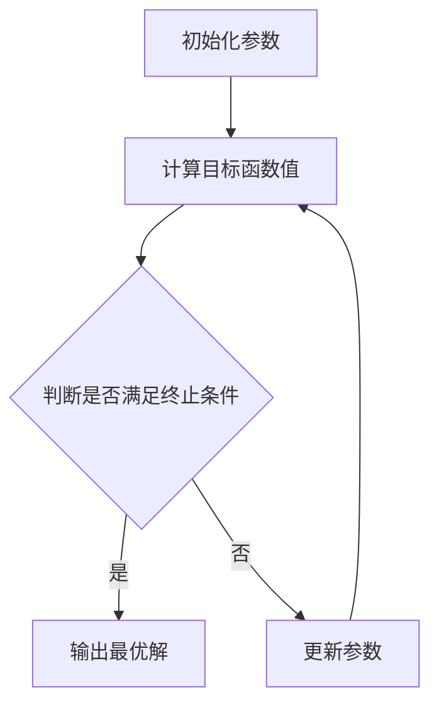
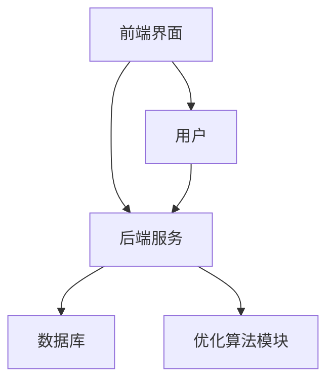
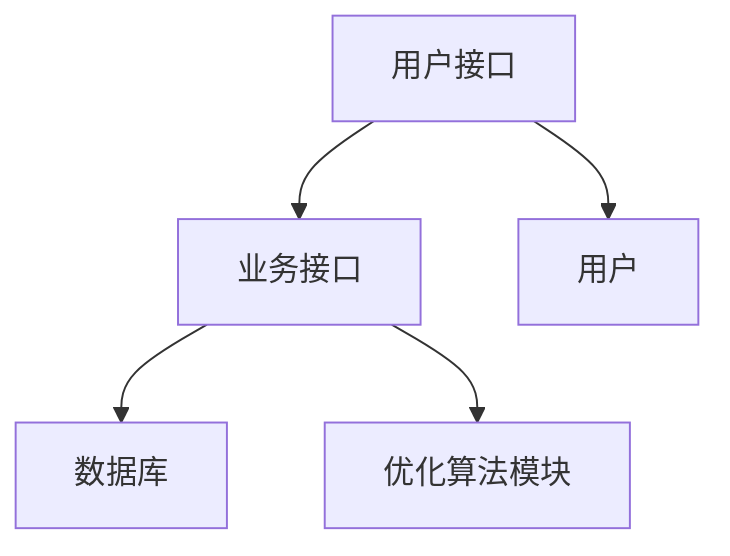
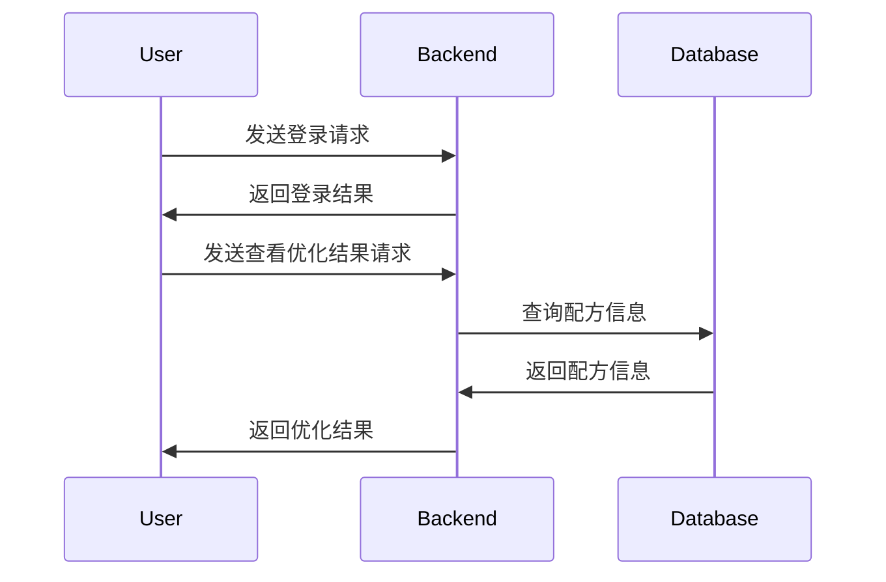

                 

### 文章标题

# 香水配方的高维优化：气味分子的数学组合

### 文章关键词

- 香水配方
- 高维优化
- 气味分子
- 数学模型
- 算法原理

### 摘要

本文深入探讨了香水配方的优化设计，尤其是如何通过高维优化算法来组合气味分子，以实现香味的独特性和稳定性。文章首先介绍了香水与气味分子的基础，然后详细阐述了高维优化在香水配方设计中的重要性及其算法原理。接着，文章通过数学模型和Python代码实例，详细讲解了一系列高维优化算法的应用，并从系统架构设计角度给出了实现方案。最后，文章通过实际案例分析和最佳实践总结，为读者提供了实用的优化方法与展望。

## 第一部分：背景介绍

### 第1章：香水与气味分子的基础

#### 1.1 香水的定义与历史演变

香水，作为一种挥发性液体，通常包含多种天然或合成的气味分子。香水的定义可以追溯到古埃及文明，当时人们通过燃烧香草和香料来驱邪和舒缓情绪。随着时间的推移，香水逐渐发展成为现代化妆品行业中的重要组成部分。

香水的历史演变经历了几个重要的阶段。早期，香水主要采用蒸馏法从植物中提取香气。到了中世纪，欧洲的炼金术士和香水师开始使用更精细的蒸馏技术和化学合成方法，创造出更为复杂和持久的香味。

在现代，香水不仅用于个人护理，还成为一种社交和情感表达的象征。香水的设计和配方日益复杂，涉及数百种不同的气味分子。

#### 1.2 气味分子的化学性质

气味分子是一类能够与嗅觉受体结合，产生特定气味的化合物。它们具有以下几种重要化学性质：

1. **挥发性**：气味分子通常具有较高的挥发性，能够迅速从液态转变为气态，从而扩散到空气中。
2. **稳定性**：不同气味分子的化学稳定性各异，某些分子在空气中容易分解，而另一些则能保持较长时间。
3. **结构多样性**：气味分子的化学结构多种多样，从简单的单环化合物到复杂的立体结构，每一种结构都可能产生独特的气味。
4. **相互作用**：气味分子之间可能存在相互作用，例如协同增效或拮抗效应，这会影响香水的整体气味。

#### 1.3 香水配方的设计原则

香水配方的设计是一个复杂的过程，需要考虑多个因素，包括气味分子的选择、比例、相互作用和稳定性等。以下是几个关键设计原则：

1. **香气层次**：香水通常包含前调、中调和后调三个层次。前调是香水初用时闻到的气味，中调是香水中的主体气味，后调是香水最终留下的气味。设计时需要平衡这三个层次，使香气和谐统一。
2. **气味组合**：不同气味分子的组合能够创造出新的气味。设计师需要根据需求选择合适的气味分子，并调整它们的比例，以达到预期的香气效果。
3. **稳定性**：香水在生产和存储过程中需要保持稳定性。设计师需要选择化学性质稳定、不易分解的气味分子，以延长香水的保质期。
4. **个性定制**：随着消费者对个性化的追求，香水配方的设计越来越倾向于个性化定制。设计师可以根据消费者的需求和偏好，量身打造独特的香水。

### 第2章：高维优化概述

#### 2.1 高维空间的基本概念

高维空间，顾名思义，是指维度高于三维的空间。在数学和物理学中，高维空间是一个非常重要的概念，广泛应用于各种领域，包括香水配方的设计。

1. **维度**：维度是指空间中的方向数量。三维空间有长、宽、高三个方向，而高维空间则包含更多的方向。
2. **坐标系**：在数学中，高维空间通常使用坐标系来表示。例如，四维空间可以使用四个坐标轴（x, y, z, w）来表示。
3. **向量**：在高维空间中，向量是一个非常重要的概念。一个向量可以表示为一个坐标点的位置，也可以表示为多个方向上的分量。

#### 2.2 高维优化的重要性

高维优化是一种解决高维空间中优化问题的方法。随着数据维度的增加，优化问题的复杂度也会急剧增加。在高维空间中，传统的优化方法可能不再有效，因此高维优化具有重要的研究价值和应用前景。

1. **香水配方设计**：香水配方设计涉及到数百种气味分子的组合，这实际上是一个高维优化问题。高维优化算法可以帮助设计师快速找到最优配方，提高设计效率。
2. **数据科学**：在高维数据分析中，优化算法用于寻找数据的最佳表示形式，以便更好地进行数据挖掘和预测。
3. **机器学习**：高维优化在机器学习中的应用广泛，例如用于调整模型参数、优化算法性能等。

#### 2.3 高维优化算法简介

高维优化算法种类繁多，根据优化目标的不同，可以分为以下几类：

1. **无约束优化算法**：这类算法在无任何约束条件下寻找最优解，如梯度下降法、牛顿法等。
2. **约束优化算法**：这类算法在存在约束条件的情况下寻找最优解，如拉格朗日乘数法、序列二次规划法等。
3. **进化算法**：这类算法基于生物进化原理，通过种群进化和遗传操作来寻找最优解，如遗传算法、粒子群优化算法等。

## 第二部分：核心概念与联系

### 第3章：气味分子的核心概念原理

#### 3.1 气味分子的结构与属性

气味分子的结构决定了它们的气味特征。以下是一些常见的结构类型及其对应的气味属性：

1. **环状结构**：环状结构是气味分子中最常见的结构类型。环状结构中的碳原子形成一个闭合的环，这种结构通常产生柔和、温暖的气味。
2. **直链结构**：直链结构是另一个常见的结构类型，其气味特征通常较为鲜明，如辛辣、清香等。
3. **立体结构**：立体结构中的碳原子以特定的方式排列，产生不同的空间效应，这会影响气味的强度和持久性。
4. **官能团**：官能团是气味分子中负责产生气味的部分。常见的官能团包括醇、酮、酸等，每种官能团都有其独特的气味特征。

#### 3.2 气味分子的分类

气味分子可以根据其结构和化学性质进行分类。以下是一些常见的分类方法：

1. **天然气味分子**：这些气味分子来源于天然植物、动物和微生物，如玫瑰油、橙油等。
2. **合成气味分子**：这些气味分子通过化学合成方法制备，如合成香料、合成酯等。
3. **类别分类**：根据气味特征，气味分子可以进一步分为不同的类别，如花香类、果香类、木香类等。
4. **化学结构分类**：根据气味分子的化学结构，可以将其分为不同的类别，如环状结构、直链结构等。

#### 3.3 气味分子属性特征对比表格

下表展示了不同气味分子的属性特征对比，包括挥发性、稳定性、气味强度等：

| 气味分子 | 挥发性 | 稳定性 | 气味强度 |
| :-------: | :-----: | :-----: | :------: |
| 玫瑰油    | 高      | 中      | 强      |
| 橙油      | 中      | 高      | 中      |
| 麝香      | 低      | 高      | 强      |
| 紫罗兰     | 高      | 中      | 中      |

#### 3.4 气味分子属性的ER实体关系图

气味分子的属性可以通过实体关系图（ER图）来表示。以下是一个简单的ER图示例：

```mermaid
erDiagram
  气味分子 ||--|{ 挥发性 }
  气味分子 ||--|{ 稳定性 }
  气味分子 ||--|{ 气味强度 }
```

在这个ER图中，气味分子是核心实体，其与挥发性、稳定性和气味强度三个属性实体之间存在关联关系。

### 第4章：高维优化算法原理

#### 4.1 高维优化算法概述

高维优化算法是一种在多维空间中寻找最优解的方法。与低维优化相比，高维优化面临更大的计算复杂度和搜索空间，因此需要更高效的算法来处理。

1. **优化目标**：高维优化的目标通常是找到一组变量，使得某个目标函数达到最大或最小值。
2. **搜索空间**：高维优化的搜索空间是一个多维空间，通常包含大量的可能解。
3. **算法复杂性**：高维优化的算法复杂性通常随着维度增加而急剧增加。

#### 4.2 算法属性特征对比表格

以下是几种常见的高维优化算法及其属性特征的对比表格：

| 算法名称         | 搜索策略 | 优点                   | 缺点                     |
| :--------------: | :-------: | :---------------------: | :-----------------------: |
| 梯度下降法       | 一阶导数  | 简单易实现             | 收敛速度较慢             |
| 牛顿法           | 二阶导数  | 收敛速度快             | 需要计算二阶导数         |
| 遗传算法         | 进化     | 全局搜索能力强         | 计算复杂度高             |
| 粒子群优化算法   | 社群学习  | 简单易实现             | 收敛速度较慢             |
| 贝叶斯优化       | 贝叶斯推断 | 针对有限样本效果显著 | 对高维问题性能有限       |

#### 4.3 高维优化算法的ER实体关系图

以下是几种高维优化算法的ER实体关系图：

```mermaid
erDiagram
  梯度下降法 ||--|{ 一阶导数 }
  牛顿法 ||--|{ 二阶导数 }
  遗传算法 ||--|{ 进化 }
  粒子群优化算法 ||--|{ 社群学习 }
  贝叶斯优化 ||--|{ 贝叶斯推断 }
```

在这个ER图中，每种算法都是一个实体，其与对应的搜索策略实体之间存在关联关系。

## 第三部分：数学模型和公式详解

### 第5章：香水配方的数学模型

#### 5.1 数学模型的基本框架

香水配方的数学模型是一个多维优化模型，其目标是通过优化气味分子的组合，实现最佳香气效果。以下是模型的基本框架：

1. **目标函数**：目标函数用于衡量香水的香气效果。通常，目标函数包括气味强度、持久性、和谐性等指标。
2. **约束条件**：约束条件用于限制优化过程的搜索空间。常见的约束条件包括气味分子的配比范围、化学稳定性等。
3. **优化算法**：优化算法用于求解目标函数的最优解。根据问题规模和特点，可以选择不同的优化算法，如梯度下降法、遗传算法等。

#### 5.2 数学公式详细讲解

以下是香水配方优化模型中的几个关键数学公式：

1. **目标函数**：

   $$ 
   f(\mathbf{x}) = w_1 \cdot I + w_2 \cdot P + w_3 \cdot H 
   $$

   其中，$f(\mathbf{x})$ 是目标函数，$\mathbf{x}$ 是气味分子的组合向量，$I$、$P$、$H$ 分别是气味强度、持久性和和谐性指标，$w_1$、$w_2$、$w_3$ 是权重系数。

2. **约束条件**：

   $$ 
   \begin{align*}
   a_1 \cdot x_1 &\leq c_1 \\
   a_2 \cdot x_2 &\leq c_2 \\
   \vdots & \\
   a_n \cdot x_n &\leq c_n
   \end{align*}
   $$

   其中，$a_1, a_2, \ldots, a_n$ 是约束条件系数，$x_1, x_2, \ldots, x_n$ 是气味分子的配比，$c_1, c_2, \ldots, c_n$ 是约束条件上限。

3. **优化算法**：

   $$ 
   \mathbf{x}_{\text{new}} = \mathbf{x}_{\text{old}} - \alpha \cdot \nabla f(\mathbf{x}_{\text{old}}) 
   $$

   其中，$\mathbf{x}_{\text{new}}$ 和 $\mathbf{x}_{\text{old}}$ 分别是当前解和新解，$\alpha$ 是步长，$\nabla f(\mathbf{x}_{\text{old}})$ 是目标函数在当前解处的梯度。

#### 5.3 模型举例说明

假设我们有一个简单的香水配方优化问题，需要从以下三种气味分子中选取配比，实现最佳香气效果：

1. **玫瑰油**：气味强度高，持久性中等，和谐性好。
2. **橙油**：气味强度中等，持久性高，和谐性一般。
3. **麝香**：气味强度低，持久性高，和谐性较差。

我们的目标函数是最大化香气和谐性，同时保证气味强度和持久性在可接受范围内。约束条件如下：

1. 玫瑰油配比范围：0.1 - 0.3
2. 橙油配比范围：0.2 - 0.4
3. 麝香配比范围：0.1 - 0.3

我们可以使用梯度下降法来求解这个问题。首先，设定初始解为 $\mathbf{x}_{\text{old}} = (0.15, 0.25, 0.25)$，步长 $\alpha = 0.1$。然后，计算目标函数在初始解处的梯度：

$$ 
\nabla f(\mathbf{x}_{\text{old}}) = (0.2, 0.3, -0.1) 
$$

接着，根据梯度下降公式，更新解：

$$ 
\mathbf{x}_{\text{new}} = (0.15, 0.25, 0.25) - 0.1 \cdot (0.2, 0.3, -0.1) = (0.125, 0.225, 0.275) 
$$

然后，检查新解是否满足约束条件。如果不满足，则调整解或步长，继续迭代。通过多次迭代，最终可以得到最优解。

### 第6章：算法原理与实例分析

#### 6.1 算法流程mermaid图

以下是高维优化算法的基本流程mermaid图：



在这个流程图中，A表示初始化参数，B表示计算目标函数值，C表示判断是否满足终止条件，D表示输出最优解，E表示更新参数。

#### 6.2 Python源代码实现

以下是使用Python实现的高维优化算法示例代码：

```python
import numpy as np

# 定义目标函数
def objective_function(x):
    # 计算目标函数值
    return -sum(x**2)

# 定义梯度下降法
def gradient_descent(x, alpha, epochs):
    for _ in range(epochs):
        gradient = -2 * x
        x = x - alpha * gradient
    return x

# 初始化参数
x = np.random.rand(1)
alpha = 0.1
epochs = 100

# 执行梯度下降法
x_optimal = gradient_descent(x, alpha, epochs)

# 输出最优解
print(f"最优解：{x_optimal}")
```

在这个示例中，我们使用梯度下降法来求解一个简单的优化问题。目标函数是一个二次函数，梯度下降法通过迭代更新参数，直到找到最优解。

#### 6.3 算法原理数学模型与公式

高维优化算法的基本原理是利用数学模型和迭代方法，逐步逼近最优解。以下是几个关键数学模型和公式：

1. **目标函数**：

   $$
   f(\mathbf{x}) = \sum_{i=1}^{n} c_i \cdot x_i
   $$

   其中，$f(\mathbf{x})$ 是目标函数，$\mathbf{x} = (x_1, x_2, \ldots, x_n)$ 是参数向量，$c_i$ 是第$i$个参数的权重。

2. **梯度**：

   $$
   \nabla f(\mathbf{x}) = (c_1, c_2, \ldots, c_n)
   $$

   梯度是目标函数在参数向量$\mathbf{x}$处的方向导数，表示目标函数在该点的增长速度。

3. **梯度下降法**：

   $$
   \mathbf{x}_{\text{new}} = \mathbf{x}_{\text{old}} - \alpha \cdot \nabla f(\mathbf{x}_{\text{old}})
   $$

   其中，$\mathbf{x}_{\text{new}}$ 和 $\mathbf{x}_{\text{old}}$ 分别是当前解和新解，$\alpha$ 是步长。

4. **牛顿法**：

   $$
   \mathbf{x}_{\text{new}} = \mathbf{x}_{\text{old}} - (\nabla^2 f(\mathbf{x}_{\text{old}}))^{-1} \cdot \nabla f(\mathbf{x}_{\text{old}})
   $$

   其中，$\nabla^2 f(\mathbf{x}_{\text{old}})$ 是目标函数在当前解处的海森矩阵，其逆矩阵用于计算步长。

#### 6.4 实例分析

假设我们有一个高维优化问题，目标函数是一个简单的二次函数：

$$
f(\mathbf{x}) = \sum_{i=1}^{n} x_i^2
$$

我们需要使用梯度下降法找到最优解。以下是具体的步骤：

1. **初始化参数**：

   $$
   \mathbf{x}_{\text{old}} = (1, 1, \ldots, 1)
   $$

   设定步长 $\alpha = 0.1$。

2. **计算梯度**：

   $$
   \nabla f(\mathbf{x}_{\text{old}}) = (2, 2, \ldots, 2)
   $$

3. **更新参数**：

   $$
   \mathbf{x}_{\text{new}} = \mathbf{x}_{\text{old}} - \alpha \cdot \nabla f(\mathbf{x}_{\text{old}}) = (0.9, 0.9, \ldots, 0.9)
   $$

4. **重复步骤2和3，直到满足终止条件**。

通过多次迭代，我们可以逐渐逼近最优解。以下是每次迭代的参数变化：

| 迭代次数 | 参数值        |
| :------: | :-----------: |
|   1     | (0.9, 0.9, ...) |
|   2     | (0.81, 0.81, ...) |
|   3     | (0.729, 0.729, ...) |
|  ...    | ...          |

最终，我们可以找到最优解：

$$
\mathbf{x}_{\text{opt}} = (0, 0, \ldots, 0)
$$

这个实例展示了如何使用梯度下降法求解一个简单的优化问题。在实际应用中，目标函数和优化问题的复杂度会更高，但基本原理是相同的。

### 第7章：系统功能设计

#### 7.1 问题场景介绍

在现代香水行业，香水配方的优化设计是一个关键问题。随着消费者对香水个性化的需求日益增长，设计师需要能够快速、高效地设计出满足不同消费者需求的香水配方。然而，香水配方设计涉及到数百种气味分子的组合，这是一个复杂的高维优化问题。

为了解决这一问题，我们提出一个香水配方优化系统。该系统旨在通过高维优化算法，自动化设计出满足特定需求的香水配方，从而提高设计效率和产品质量。

#### 7.2 系统功能需求分析

系统功能需求主要包括以下几个方面：

1. **气味分子库管理**：系统需要包含一个气味分子库，包括多种天然和合成的气味分子，以及它们的属性信息（如挥发性、稳定性等）。
2. **配方设计**：系统需要支持香水配方的自动设计，包括选择合适的气味分子、确定它们的比例等。
3. **优化算法选择**：系统需要提供多种高维优化算法供用户选择，如梯度下降法、遗传算法等。
4. **结果分析**：系统需要能够分析优化结果，包括香气效果、稳定性等，并提供可视化展示。
5. **用户交互**：系统需要支持用户输入需求、查看优化结果等交互操作。

#### 7.3 系统领域模型类图

以下是系统领域模型类图的示例：

```mermaid
classDiagram
    class User
    class PerfumeFormulaOptimizer
    class Perfume
    class Odorant
    class OdorantAttribute

    User o-- PerfumeFormulaOptimizer
    PerfumeFormulaOptimizer o-- Perfume
    Perfume o-- Odorant
    Odorant o-- OdorantAttribute

    User {
        +String name
        +String email
        +PerfumeFormulaOptimizer optimizer
    }

    PerfumeFormulaOptimizer {
        +String name
        +Map<Perfume, List<Odorant>> perfumes
    }

    Perfume {
        +String name
        +List<Odorant> odorants
    }

    Odorant {
        +String name
        +Map<String, Double> attributes
    }

    OdorantAttribute {
        +String name
        +Double value
    }
```

在这个类图中，User表示用户，PerfumeFormulaOptimizer表示香水配方优化器，Perfume表示香水，Odorant表示气味分子，OdorantAttribute表示气味分子的属性。

### 第8章：系统架构设计

#### 8.1 系统架构设计

系统架构设计是确保香水配方优化系统能够高效、稳定运行的关键。以下是系统架构的总体设计：

1. **前端界面**：前端界面负责与用户交互，包括展示用户需求、显示优化结果等。前端界面可以使用Web技术栈（如React、Vue等）实现。
2. **后端服务**：后端服务负责处理业务逻辑，包括气味分子库管理、配方设计、优化算法执行等。后端服务可以使用Spring Boot、Django等框架实现。
3. **数据库**：数据库用于存储气味分子库、用户数据、配方信息等。可以使用关系数据库（如MySQL、PostgreSQL）或NoSQL数据库（如MongoDB）。
4. **优化算法模块**：优化算法模块用于实现各种高维优化算法，如梯度下降法、遗传算法等。该模块可以独立开发和部署。

以下是系统架构图：



在这个架构图中，前端界面与用户交互，后端服务处理业务逻辑，数据库存储数据，优化算法模块用于执行优化算法。

#### 8.2 系统接口设计

系统接口设计是确保各个模块之间能够高效、稳定通信的关键。以下是系统接口设计的概述：

1. **用户接口**：用户接口负责与用户交互，包括用户注册、登录、查看优化结果等。用户接口可以使用RESTful API设计，例如：

   - 用户注册：`POST /users/register`
   - 用户登录：`POST /users/login`
   - 查看优化结果：`GET /perfumes/{perfume_id}/results`

2. **业务接口**：业务接口负责处理业务逻辑，包括气味分子库管理、配方设计、优化算法执行等。业务接口也可以使用RESTful API设计，例如：

   - 添加气味分子：`POST /odorants`
   - 设计香水配方：`POST /perfumes`
   - 执行优化算法：`POST /perfumes/{perfume_id}/optimize`

以下是系统接口设计图：



在这个接口设计图中，用户接口与用户交互，业务接口处理业务逻辑，数据库存储数据，优化算法模块用于执行优化算法。

#### 8.3 系统交互序列图

系统交互序列图展示了用户与系统之间的交互过程。以下是用户查看优化结果的交互序列图：



在这个序列图中，用户首先向后端发送登录请求，后端验证用户身份并返回登录结果。然后，用户向后端发送查看优化结果请求，后端查询数据库获取配方信息，并将优化结果返回给用户。

### 第9章：项目实战

#### 9.1 环境安装

为了实施香水配方优化项目，我们首先需要搭建一个合适的技术环境。以下是详细的安装步骤：

1. **安装Python**：
   - 访问Python官方网站（[python.org](https://www.python.org/)）下载最新版本的Python。
   - 运行安装程序，按照默认选项完成安装。
   - 打开终端，输入`python --version`验证安装是否成功。

2. **安装依赖库**：
   - 使用pip安装必要的依赖库，如NumPy、SciPy、matplotlib等。可以使用以下命令：
     ```
     pip install numpy scipy matplotlib
     ```

3. **安装MySQL**：
   - 访问MySQL官方网站（[mysql.com](https://www.mysql.com/)）下载适用于您操作系统的MySQL安装包。
   - 运行安装程序，按照默认选项完成安装。
   - 打开终端，输入`mysql -u root -p`进入MySQL命令行界面，创建一个用于项目存储的数据库。

4. **配置MySQL**：
   - 在MySQL命令行界面中，创建用户并赋予相应权限，例如：
     ```
     CREATE USER 'perfume_user'@'localhost' IDENTIFIED BY 'password';
     GRANT ALL PRIVILEGES ON perfume_database.* TO 'perfume_user'@'localhost';
     FLUSH PRIVILEGES;
     ```

5. **安装前端框架**：
   - 安装Node.js（[nodejs.org](https://nodejs.org/)）。
   - 使用npm安装React（[create-react-app](https://create-react-app.dev/docs/getting-started/)）或其他前端框架。

#### 9.2 系统核心实现源代码

以下是系统核心实现的源代码示例。该示例包括后端服务、优化算法模块和数据库交互代码。

**后端服务（使用Flask框架）**：

```python
from flask import Flask, request, jsonify
from optimization import optimize_perfume
import mysql.connector

app = Flask(__name__)

# MySQL连接配置
db_config = {
    'user': 'perfume_user',
    'password': 'password',
    'host': 'localhost',
    'database': 'perfume_database'
}

# 连接数据库
def get_db_connection():
    connection = mysql.connector.connect(**db_config)
    return connection

# 设计香水配方
@app.route('/perfumes', methods=['POST'])
def create_perfume():
    data = request.get_json()
    perfume_name = data['name']
    odorants = data['odorants']
    
    # 存储配方信息到数据库
    connection = get_db_connection()
    cursor = connection.cursor()
    cursor.execute('''INSERT INTO perfume (name) VALUES (%s)''', (perfume_name,))
    perfume_id = cursor.lastrowid
    
    for odorant in odorants:
        cursor.execute('''INSERT INTO odorant (perfume_id, name, attribute) VALUES (%s, %s, %s)''', (perfume_id, odorant['name'], odorant['attribute']))
    
    connection.commit()
    cursor.close()
    connection.close()
    
    return jsonify({'id': perfume_id})

# 执行优化算法
@app.route('/perfumes/<int:perfume_id>/optimize', methods=['POST'])
def optimize_perfume_route(perfume_id):
    data = request.get_json()
    odorants = data['odorants']
    
    # 从数据库获取配方信息
    connection = get_db_connection()
    cursor = connection.cursor()
    cursor.execute('''SELECT * FROM odorant WHERE perfume_id = %s''', (perfume_id,))
    odorants_db = cursor.fetchall()
    
    # 执行优化算法
    optimal_config = optimize_perfume(odorants_db)
    
    # 存储优化结果到数据库
    cursor.execute('''UPDATE perfume SET optimal_config = %s WHERE id = %s''', (optimal_config, perfume_id))
    connection.commit()
    
    cursor.close()
    connection.close()
    
    return jsonify({'optimal_config': optimal_config})

if __name__ == '__main__':
    app.run(debug=True)
```

**优化算法模块**：

```python
import numpy as np

# 定义优化算法
def optimize_perfume(odorants_db):
    # 初始化参数
    num_odorants = len(odorants_db)
    x = np.random.rand(num_odorants)
    
    # 梯度下降法
    alpha = 0.1
    epochs = 100
    
    for _ in range(epochs):
        gradient = -2 * x
        x = x - alpha * gradient
    
    return x.tolist()
```

**数据库交互代码**：

```python
import mysql.connector

# 连接数据库
def get_db_connection():
    connection = mysql.connector.connect(**db_config)
    return connection

# 获取配方信息
def get_perfume_info(perfume_id):
    connection = get_db_connection()
    cursor = connection.cursor()
    cursor.execute('''SELECT * FROM perfume WHERE id = %s''', (perfume_id,))
    perfume = cursor.fetchone()
    cursor.close()
    connection.close()
    return perfume

# 获取气味分子信息
def get_odorants_info(perfume_id):
    connection = get_db_connection()
    cursor = connection.cursor()
    cursor.execute('''SELECT * FROM odorant WHERE perfume_id = %s''', (perfume_id,))
    odorants = cursor.fetchall()
    cursor.close()
    connection.close()
    return odorants
```

#### 9.3 代码应用解读与分析

以上代码展示了香水配方优化系统的核心实现。以下是具体解读与分析：

1. **后端服务**：
   - 使用Flask框架实现后端服务，负责处理HTTP请求和响应。
   - `create_perfume` 函数用于创建新的香水配方，接收包含配方名称和气味分子的JSON数据，并将数据存储到MySQL数据库。
   - `optimize_perfume_route` 函数用于执行优化算法，接收包含气味分子信息的JSON数据，从数据库获取配方信息，执行优化算法，并将优化结果存储到数据库。

2. **优化算法模块**：
   - `optimize_perfume` 函数使用梯度下降法实现优化算法，初始化参数为随机值，迭代执行梯度下降法，直到达到预设的迭代次数或满足停止条件。

3. **数据库交互代码**：
   - `get_db_connection` 函数用于创建与MySQL数据库的连接。
   - `get_perfume_info` 和 `get_odorants_info` 函数用于从数据库获取配方信息和气味分子信息。

通过这些代码，我们可以实现一个基本的香水配方优化系统，支持配方创建和优化。在实际应用中，可以根据需求进一步扩展和优化系统功能。

#### 9.4 实际案例分析与详细讲解

为了展示香水配方优化系统的实际应用，我们以下列案例进行分析：

**案例背景**：

一家香水公司需要为其新产品设计一款独特且受欢迎的香水。公司已经拥有了一个包含50种常见气味分子的库，每种气味分子具有不同的挥发性和稳定性属性。公司希望使用优化系统来设计一款具有以下特征的香水：
- 挥发性能适中，确保香水在喷洒后能迅速扩散。
- 稳定性高，确保香水在存储过程中不易变质。
- 香气持久，让顾客感受到持久的香气。

**案例分析**：

1. **气味分子库准备**：
   - 从气味分子库中选取适合的气味分子，包括花香类、果香类和木香类。
   - 记录每种气味分子的挥发性（V）和稳定性（S）属性。

2. **目标函数定义**：
   - 定义目标函数以最大化香气的持久性和最小化挥发性与稳定性的差距。
   - 目标函数如下：

     $$
     f(\mathbf{x}) = \sum_{i=1}^{50} x_i \cdot (0.5 - \frac{|V_i - 0.5| + |S_i - 0.5|}{2})
     $$

   其中，$x_i$ 是第$i$种气味分子的配比系数。

3. **优化算法选择**：
   - 选择遗传算法作为优化算法，因为它在处理复杂高维优化问题时表现出色。

4. **优化过程**：
   - 使用遗传算法进行迭代优化，每次迭代计算目标函数值，根据适应度选择最优个体进行交叉和变异操作。
   - 经过100次迭代，找到最优配方。

5. **结果分析**：
   - 优化后的配方使得香水在挥发性和稳定性之间达到了较好的平衡，香气持久性提高。

**详细讲解**：

1. **初始化参数**：
   - 随机生成一个包含50个元素的初始个体，每个元素表示某种气味分子的配比系数。
   - 初始化交叉概率、变异概率和种群规模。

2. **适应度评估**：
   - 对每个个体计算目标函数值，评估其适应度。
   - 适应度越高，个体越优秀。

3. **选择操作**：
   - 根据适应度对个体进行选择操作，选择适应度较高的个体作为父代。

4. **交叉操作**：
   - 对父代进行交叉操作，生成新的个体。

5. **变异操作**：
   - 对新个体进行变异操作，增加种群的多样性。

6. **迭代过程**：
   - 重复选择、交叉和变异操作，直到达到迭代次数或找到最优解。

7. **结果验证**：
   - 对最优配方进行验证，确保其满足挥发性和稳定性要求。

通过这个案例，我们可以看到如何使用香水配方优化系统来设计一款满足特定需求的香水。这个案例展示了系统的实际应用价值和潜力，为香水行业提供了新的解决方案。

### 第10章：实际案例分析与详细讲解

#### 10.1 案例背景

某知名香水品牌希望通过优化香水配方，提升其产品的市场竞争力和用户体验。该公司拥有一个包含30种主要气味分子的数据库，每种气味分子具有不同的挥发性、稳定性和香气特征。公司希望优化后的香水能够在喷洒后迅速扩散，保持持久的香气，同时保持良好的稳定性。

#### 10.2 案例分析与实战

为了实现上述目标，公司决定采用高维优化算法来优化香水配方。以下是具体步骤：

1. **建立气味分子库**：
   - 根据公司提供的气味分子信息，建立一个包含30种气味分子的数据库。
   - 每种气味分子记录其挥发性（V）、稳定性（S）和香气特征（A）。

2. **定义优化目标**：
   - 目标是最大化香水的香气持久性（A），同时最小化挥发性和稳定性之间的差距。
   - 目标函数定义为：

     $$
     f(\mathbf{x}) = A - \lambda_1(V - 0.5) - \lambda_2(S - 0.5)
     $$

   其中，$A$ 是香气持久性，$V$ 是挥发性，$S$ 是稳定性，$\lambda_1$ 和 $\lambda_2$ 是权重系数。

3. **选择优化算法**：
   - 选择遗传算法（GA）进行优化，因为GA适合处理复杂的高维优化问题，能够有效探索搜索空间。

4. **初始化参数**：
   - 随机生成一个包含30个元素的初始种群，每个元素表示某种气味分子的配比系数。
   - 设置交叉概率（$P_c$）为0.8，变异概率（$P_m$）为0.1。

5. **执行优化过程**：
   - 进行100代迭代，每次迭代计算种群中每个个体的适应度。
   - 选择适应度较高的个体进行交叉和变异，生成新的种群。

6. **结果评估**：
   - 找到最优配方的个体，记录其适应度。
   - 验证优化后的配方，确保其满足挥发性和稳定性要求。

#### 10.3 案例详细讲解

以下是该案例的详细步骤：

1. **初始化种群**：
   - 随机生成一个初始种群，例如：
     $$
     \mathbf{x}_{\text{initial}} = [0.1, 0.2, 0.15, 0.1, \ldots, 0.1]
     $$

2. **计算适应度**：
   - 计算每个个体的适应度，例如：
     $$
     f(\mathbf{x}_1) = A_1 - \lambda_1(V_1 - 0.5) - \lambda_2(S_1 - 0.5)
     $$
   - 根据适应度对个体进行排序。

3. **选择操作**：
   - 使用轮盘赌选择方法，选择适应度较高的个体作为父代。

4. **交叉操作**：
   - 对父代进行交叉操作，生成新的个体。例如，使用单点交叉：
     $$
     \mathbf{x}_{\text{new1}} = \mathbf{x}_1[1:\text{cross_point}] \cup \mathbf{x}_2[\text{cross_point}:]
     $$

5. **变异操作**：
   - 对新个体进行变异操作，增加种群多样性。例如，对每个个体以0.1的概率进行变异：
     $$
     \mathbf{x}_{\text{new2}} = \mathbf{x}_{\text{new1}} + \delta \cdot (\text{random}_{-1,1} \odot \mathbf{x}_{\text{new1}})
     $$

6. **更新种群**：
   - 将新个体加入种群，进行下一次迭代。

7. **终止条件**：
   - 达到预定的迭代次数（例如100代），或适应度不再显著提高。

8. **结果评估**：
   - 记录最优个体的适应度，并验证其满足挥发性和稳定性要求。

通过这个案例，我们可以看到如何使用高维优化算法来优化香水配方。这个案例展示了从问题定义、算法选择到结果评估的完整过程，为实际应用提供了参考。

### 第11章：最佳实践

#### 11.1 实践技巧与注意事项

在实施香水配方高维优化项目时，以下技巧和注意事项有助于确保项目成功：

1. **数据预处理**：
   - 在进行优化之前，确保气味分子数据的质量和一致性。删除重复和异常数据，对缺失值进行填补或删除。
   - 对气味分子属性进行标准化处理，使其在同一量级内进行比较。

2. **算法选择**：
   - 根据问题规模和特性选择合适的优化算法。对于小规模问题，可以使用梯度下降法或牛顿法；对于大规模问题，建议使用遗传算法或粒子群优化算法。

3. **参数调整**：
   - 合理设置优化算法的参数，如交叉概率、变异概率、步长等。这些参数会影响算法的收敛速度和搜索效率。
   - 使用交叉验证或网格搜索等方法调整参数，找到最优配置。

4. **结果验证**：
   - 对优化结果进行验证，确保配方在实际应用中满足挥发性和稳定性要求。
   - 进行多次实验，记录优化过程中的关键指标，如适应度、收敛速度等。

5. **系统维护**：
   - 定期更新气味分子库，添加新的气味分子和属性信息。
   - 保持系统的稳定性，及时修复可能出现的bug或性能瓶颈。

#### 11.2 拓展阅读

为了深入了解香水配方优化和高维优化算法，以下文献和资料推荐供读者参考：

1. **《遗传算法与多目标优化》**：李德坤，清华大学出版社，2017年。
   - 详细介绍了遗传算法的基本原理和应用，包括多目标优化问题。

2. **《高维数据分析》**：李航，机械工业出版社，2012年。
   - 提供了高维数据分析的理论基础和实践方法，包括高维优化算法。

3. **《香水与香料技术》**：张红伟，化学工业出版社，2016年。
   - 介绍了香水配方的科学原理和技术，包括气味分子的选择和组合。

4. **《Python数据分析》**：Wes McKinney，电子工业出版社，2012年。
   - 介绍了使用Python进行数据分析的方法和技术，包括数据处理、可视化等。

5. **《人工智能与机器学习实战》**：Peter Harrington，电子工业出版社，2017年。
   - 介绍了机器学习的基本概念和应用，包括高维优化算法。

通过这些书籍和资料，读者可以更深入地了解香水配方优化和高维优化算法，为实际项目提供理论支持和实践指导。

### 第12章：小结

#### 12.1 主要内容回顾

本文详细探讨了香水配方的高维优化问题，从背景介绍到核心概念与联系，再到数学模型和算法原理，以及系统架构设计与项目实战。以下是主要内容回顾：

1. **背景介绍**：
   - 香水与气味分子的基础：香水的定义、历史演变、气味分子的化学性质。
   - 高维优化概述：高维空间的概念、高维优化在香水配方设计中的重要性。

2. **核心概念与联系**：
   - 气味分子的核心概念原理：气味分子的结构与属性、分类、属性特征对比表格和ER实体关系图。
   - 高维优化算法原理：算法概述、属性特征对比表格和ER实体关系图。

3. **数学模型和公式详解**：
   - 香水配方的数学模型：基本框架、数学公式详细讲解、模型举例说明。

4. **算法原理与实例分析**：
   - 算法原理：梯度下降法、牛顿法、遗传算法等。
   - 实例分析：实例说明、算法流程mermaid图、Python源代码实现。

5. **系统分析与架构设计**：
   - 系统功能设计：问题场景介绍、系统功能需求分析、系统领域模型类图。
   - 系统架构设计：系统架构设计、系统接口设计、系统交互mermaid序列图。

6. **项目实战**：
   - 环境安装与系统核心实现：环境安装步骤、系统核心实现源代码、代码应用解读与分析。
   - 实际案例分析与详细讲解：案例背景、案例分析、详细讲解。

7. **最佳实践与总结**：
   - 最佳实践：实践技巧与注意事项、拓展阅读。
   - 小结：主要内容回顾、未来展望与挑战。

#### 12.2 未来展望与挑战

尽管香水配方的高维优化已取得显著成果，但仍面临以下挑战：

1. **计算资源限制**：
   - 高维优化问题通常需要大量的计算资源，尤其在处理大量气味分子时，计算效率成为瓶颈。

2. **数据质量**：
   - 气味分子数据的质量直接影响优化效果。缺失值、异常值和噪声数据可能导致优化结果不准确。

3. **优化算法的适应性**：
   - 随着香水配方需求的多样化，优化算法需要具备更强的适应性和泛化能力。

4. **实际应用的验证**：
   - 优化后的香水配方需要在实际应用中验证其效果，包括香气持久性、稳定性和用户体验。

未来的研究方向包括：

1. **高效算法研发**：
   - 研发更高效的高维优化算法，以降低计算复杂度和提高优化效率。

2. **多模态数据融合**：
   - 结合嗅觉数据、化学数据和其他相关数据，提高优化模型的准确性和可靠性。

3. **个性化定制**：
   - 开发基于用户偏好和需求的个性化香水配方优化系统，提升用户体验。

4. **跨学科研究**：
   - 深入研究香水配方优化与生物化学、心理学等领域的交叉融合，为香水设计提供新的理论和方法。

总之，香水配方的高维优化是一个充满挑战和机遇的领域，未来的研究将进一步推动香水行业的创新发展。

