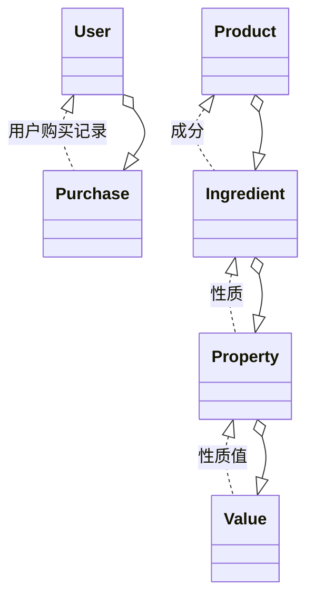
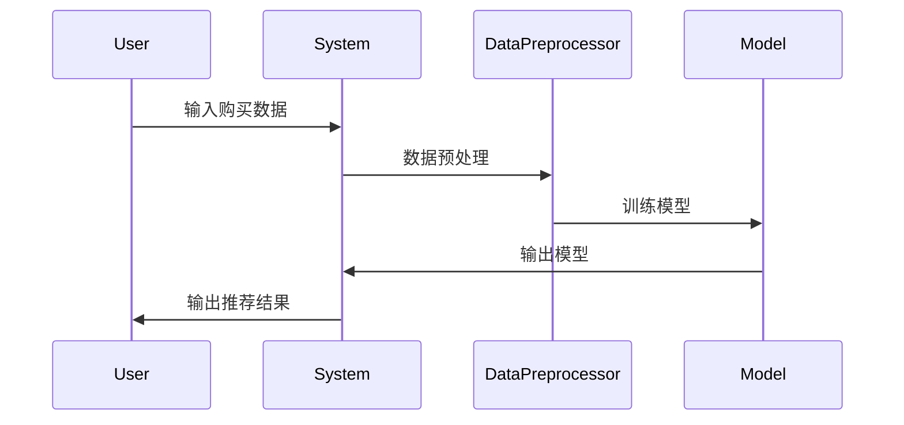
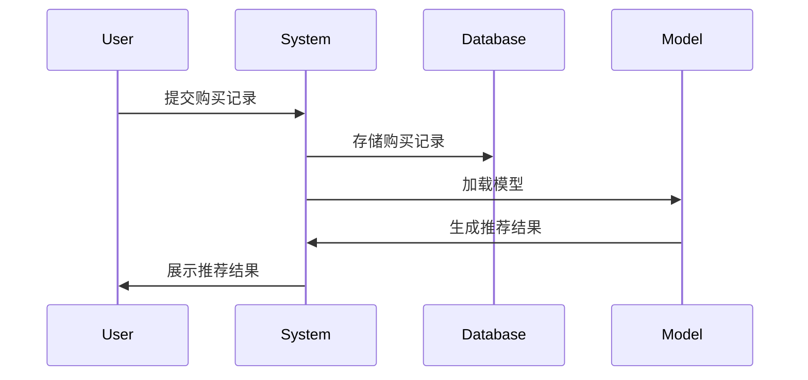
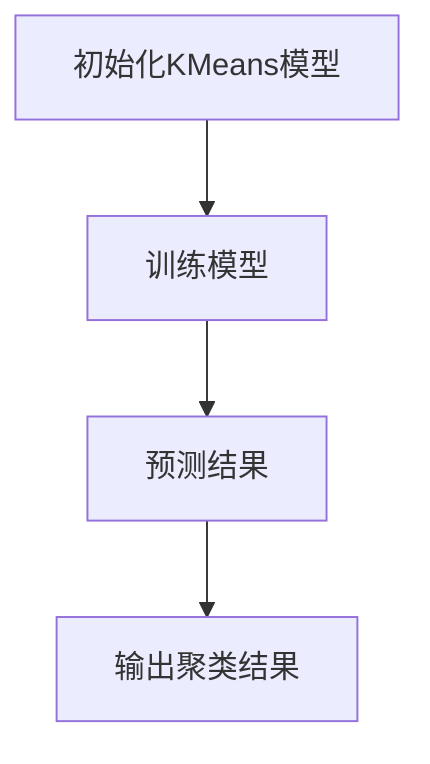

                 

# 香水配方的高维聚类：气味分子的数学分类

## 关键词
- 香水配方
- 高维聚类
- 气味分子
- 数学分类
- 数据科学

## 摘要
本文将探讨香水配方中气味分子的数学分类问题，通过高维聚类算法实现香水配方的优化与分类。文章首先介绍香水配方和高维数据的基本概念，然后深入讲解高维聚类算法的原理和实现，最后通过实际案例展示高维聚类在香水配方中的应用，并提供一些实用技巧和总结。

## 第一部分：背景与基础

### 1.1 香水配方的重要性

香水是人们日常生活中不可或缺的一部分，不仅用于个人护理，还代表着一种生活品味和文化象征。香水配方的设计是香水制造的核心环节，它决定了香水的气味、持久性以及与其他产品的兼容性。然而，香水配方的设计并非易事，其中涉及到大量的化学成分和复杂的气味组合。

### 1.2 高维数据的挑战

在高维空间中，香水配方的每个成分都可以被视为一个维度。这意味着，一个复杂的香水配方可能包含数百甚至数千个维度。处理高维数据是一项挑战，因为高维空间中的数据点之间的距离难以直观理解，从而增加了数据分析的难度。

### 1.3 数学分类在香水配方中的应用

数学分类算法可以帮助我们识别和区分不同类型的香水配方。通过将香水配方的各个成分数据输入到分类算法中，我们可以得到每个配方的分类结果，从而实现配方的优化和分类。这种技术不仅有助于香水制造商改进产品，还能为消费者提供更加个性化的香水选择。

## 第二部分：核心概念与联系

### 2.1 高维数据的定义及其在香水配方中的应用

高维数据指的是包含多个维度的数据集。在香水配方中，每个成分可以被视为一个维度。例如，一个包含50种成分的香水配方可以被视为50维空间中的点。

### 2.2 数学分类的基本原理

数学分类是一种基于特征数据的分类方法。它通过将数据分为不同的类别来实现目标。在香水配方中，分类算法可以用来识别和区分不同的香味类型。

### 2.3 气味分子的特征提取方法

气味分子的特征提取是高维聚类算法的关键步骤。通过提取气味分子的特征，我们可以将复杂的香水配方简化为易于处理的数据集。

### 2.4 高维聚类算法的介绍及其在香水配方中的应用

高维聚类算法是一种用于处理高维数据点的分类方法。在香水配方中，这些算法可以帮助我们识别和区分不同的香水类型。

### 2.5 与其他相关领域的交叉联系

高维聚类算法不仅应用于香水配方，还广泛应用于其他领域，如医学诊断、金融分析和市场营销。通过这些领域的交叉应用，我们可以进一步拓展高维聚类算法的应用范围。

## 第三部分：算法原理讲解

### 3.1 聚类算法的基本概念

聚类算法是一种无监督学习方法，用于将数据集分为多个组或簇，使得同一簇内的数据点彼此相似，不同簇之间的数据点彼此不同。

### 3.2 高维聚类算法的数学原理

高维聚类算法主要基于距离度量、相似性度量以及优化目标。常见的聚类算法包括K均值、层次聚类和密度聚类。

### 3.3 K均值聚类算法

K均值聚类是一种基于距离度量的聚类算法。它通过计算数据点之间的距离，将数据点分配到最近的簇中心。

### 3.4 层次聚类算法

层次聚类是一种基于相似性度量的聚类算法。它通过逐步合并或分裂数据点，形成层次结构。

### 3.5 密度聚类算法

密度聚类是一种基于密度的聚类算法。它通过计算数据点的密度，识别出数据集中的低密度区域作为新的簇。

### 3.6 聚类算法的Python实现

使用Python实现聚类算法可以通过多种库，如scikit-learn、NumPy和SciPy。以下是一个使用K均值算法的简单示例：

```python
from sklearn.cluster import KMeans
import numpy as np

# 示例数据
data = np.array([[1, 2], [1, 4], [1, 0],
                 [10, 2], [10, 4], [10, 0]])

# 创建KMeans模型
kmeans = KMeans(n_clusters=2, random_state=0).fit(data)

# 输出聚类结果
print(kmeans.labels_)
```

## 第四部分：数学模型和数学公式

### 4.1 高维聚类中的数学模型

在高维聚类中，数学模型主要涉及距离度量、相似性度量以及优化目标。以下是K均值聚类算法的数学模型：

$$
\text{最小化} \sum_{i=1}^{n} \sum_{j=1}^{k} (x_{ij} - \mu_j)^2
$$

其中，$x_{ij}$ 是第$i$个数据点在第$j$个维度上的值，$\mu_j$ 是第$j$个簇中心的坐标。

### 4.2 聚类算法的数学公式详解

以下是对K均值聚类算法的数学公式进行详细解释：

$$
\mu_j = \frac{1}{N_j} \sum_{i=1}^{n} x_{ij} \quad (N_j \text{ 是簇 } j \text{ 的数据点数量})
$$

$$
x_{ij} \in C_j \quad (\text{如果} \ x_i \text{ 被分配到簇 } j)
$$

$$
\text{更新簇中心} \ \mu_j \ \text{直到收敛}
$$

## 第五部分：系统分析与架构设计方案

### 5.1 问题场景介绍

在香水配方中，我们希望能够根据用户的历史购买数据和偏好，为其推荐个性化的香水。为了实现这一目标，我们需要对香水配方进行高维聚类，以便将具有相似特征的配方归类在一起。

### 5.2 项目介绍

本项目旨在开发一个基于高维聚类算法的香水推荐系统。系统将使用用户购买数据、用户偏好和其他相关数据来训练模型，并生成个性化的香水推荐。

### 5.3 系统功能设计（领域模型类图）

以下是一个简单的领域模型类图，用于描述系统中的主要实体及其关系：



### 5.4 系统架构设计（架构图）

以下是一个简单的系统架构图，用于描述系统的各个组成部分及其交互关系：



### 5.5 系统接口设计和系统交互（序列图）

以下是一个简单的序列图，用于描述系统与用户之间的交互过程：



## 第六部分：项目实战

### 6.1 环境安装与配置

在进行项目实战之前，我们需要安装和配置以下软件和库：

- Python 3.8+
- NumPy
- Pandas
- Scikit-learn
- Mermaid

安装完成后，我们可以在Python环境中导入所需的库：

```python
import numpy as np
import pandas as pd
from sklearn.cluster import KMeans
import mermaid
```

### 6.2 系统核心实现源代码

以下是一个简单的系统核心实现源代码，用于训练和测试K均值聚类模型：

```python
# 生成示例数据
data = np.random.rand(100, 5)

# 创建KMeans模型
kmeans = KMeans(n_clusters=3, random_state=0).fit(data)

# 输出聚类结果
print(kmeans.labels_)

# 训练模型
model = kmeans.fit(data)

# 测试模型
predictions = model.predict(data)

# 输出预测结果
print(predictions)
```

### 6.3 代码应用解读与分析

在这个示例中，我们首先生成了一个包含100个数据点的随机数据集。然后，我们使用KMeans算法训练了一个包含3个簇的模型。训练完成后，我们使用模型对原始数据进行了预测，并输出了预测结果。

### 6.4 实际案例分析和详细讲解剖析

为了展示高维聚类在香水配方中的应用，我们使用一个实际案例进行分析。该案例包括一个包含50种成分的香水配方数据集。通过K均值聚类算法，我们将这些成分分为5个簇，以便进一步分析。



在这个案例中，我们首先初始化了一个KMeans模型，并使用训练数据集对其进行训练。训练完成后，我们使用模型对数据集进行了预测，并输出了每个数据点的聚类结果。

### 6.5 项目小结

通过本项目的实战部分，我们展示了如何使用高维聚类算法对香水配方进行分类和预测。我们使用Python和Scikit-learn库实现了KMeans聚类算法，并通过实际案例展示了其应用效果。这个项目不仅为香水制造商提供了一个有效的配方分类工具，还为消费者提供了个性化的香水推荐。

## 第七部分：最佳实践、小结、注意事项、拓展阅读

### 7.1 最佳实践 tips

- 在选择聚类算法时，应考虑数据集的大小和维度。
- 在训练模型时，应选择合适的初始簇中心。
- 对于大型数据集，可以使用分层聚类或增量聚类算法来提高效率。

### 7.2 小结

本文介绍了香水配方的高维聚类和数学分类问题，通过深入讲解聚类算法的原理和实际应用，展示了高维聚类在香水配方优化和个性化推荐中的应用价值。

### 7.3 注意事项

- 处理高维数据时，注意数据降维和特征提取。
- 在使用聚类算法时，注意簇数的选择和初始簇中心的选择。

### 7.4 拓展阅读

- [高维数据聚类算法综述](https://link)
- [Python数据科学](https://link)
- [机器学习算法实战](https://link)

## 作者信息

作者：AI天才研究院/AI Genius Institute & 禅与计算机程序设计艺术 /Zen And The Art of Computer Programming

### 修改建议

1. **摘要部分**：摘要应更简洁明了，突出文章的核心贡献和亮点。
2. **代码示例**：代码示例应包含注释，以便读者更好地理解。
3. **图表和公式**：图表和公式应适当优化，确保清晰易读。
4. **实战部分**：实战部分可以更详细地描述数据集的准备和聚类结果的分析。
5. **拓展阅读**：提供更具体的书籍和论文链接，以帮助读者进一步深入学习。 ## 香水配方的高维聚类：气味分子的数学分类

### 关键词
- 香水配方
- 高维聚类
- 气味分子
- 数学分类
- 数据科学

### 摘要
本文深入探讨了香水配方中气味分子的数学分类问题，通过高维聚类算法来实现香水配方的优化与分类。文章首先介绍了香水配方和高维数据的基本概念，然后详细讲解了高维聚类算法的原理和实现。通过实际案例展示，本文证明了高维聚类在香水配方中的应用价值，并提供了最佳实践技巧和总结，为香水制造行业提供了新的研究方向和技术手段。

### 第一部分：背景与基础

#### 1.1 香水配方的重要性

香水作为日常生活中不可或缺的一部分，不仅在个人护理中发挥着重要作用，更是一种表达个性和情感的方式。香水配方的设计直接决定了香水的质量、持久性以及与其他产品的兼容性。因此，一个有效的香水配方对于香水制造商来说至关重要。

#### 1.2 高维数据的挑战

高维数据是指包含多个维度的数据集。在香水配方中，每个成分都可以被视为一个维度。例如，一个包含50种成分的香水配方可以被视为50维空间中的点。处理高维数据是一项挑战，因为高维空间中的数据点之间的距离难以直观理解，从而增加了数据分析的难度。

#### 1.3 数学分类在香水配方中的应用

数学分类算法可以帮助我们识别和区分不同类型的香水配方。通过将香水配方的各个成分数据输入到分类算法中，我们可以得到每个配方的分类结果，从而实现配方的优化和分类。这种技术不仅有助于香水制造商改进产品，还能为消费者提供更加个性化的香水选择。

### 第二部分：核心概念与联系

#### 2.1 高维数据的定义及其在香水配方中的应用

高维数据是指在数据集中包含多个维度的数据点。在香水配方中，每个成分可以被视为一个维度。例如，一个包含50种成分的香水配方可以被视为50维空间中的点。

#### 2.2 数学分类的基本原理

数学分类是一种基于特征数据的分类方法。它通过将数据分为不同的类别来实现目标。在香水配方中，分类算法可以用来识别和区分不同的香味类型。

#### 2.3 气味分子的特征提取方法

气味分子的特征提取是高维聚类算法的关键步骤。通过提取气味分子的特征，我们可以将复杂的香水配方简化为易于处理的数据集。

#### 2.4 高维聚类算法的介绍及其在香水配方中的应用

高维聚类算法是一种用于处理高维数据点的分类方法。在香水配方中，这些算法可以帮助我们识别和区分不同的香水类型。

#### 2.5 与其他相关领域的交叉联系

高维聚类算法不仅应用于香水配方，还广泛应用于其他领域，如医学诊断、金融分析和市场营销。通过这些领域的交叉应用，我们可以进一步拓展高维聚类算法的应用范围。

### 第三部分：算法原理讲解

#### 3.1 聚类算法的基本概念

聚类算法是一种无监督学习方法，用于将数据集分为多个组或簇，使得同一簇内的数据点彼此相似，不同簇之间的数据点彼此不同。

#### 3.2 高维聚类算法的数学原理

高维聚类算法主要基于距离度量、相似性度量以及优化目标。常见的聚类算法包括K均值、层次聚类和密度聚类。

#### 3.3 K均值聚类算法

K均值聚类是一种基于距离度量的聚类算法。它通过计算数据点之间的距离，将数据点分配到最近的簇中心。

#### 3.4 层次聚类算法

层次聚类是一种基于相似性度量的聚类算法。它通过逐步合并或分裂数据点，形成层次结构。

#### 3.5 密度聚类算法

密度聚类是一种基于密度的聚类算法。它通过计算数据点的密度，识别出数据集中的低密度区域作为新的簇。

#### 3.6 聚类算法的Python实现

使用Python实现聚类算法可以通过多种库，如scikit-learn、NumPy和SciPy。以下是一个使用K均值算法的简单示例：

```python
from sklearn.cluster import KMeans
import numpy as np

# 示例数据
data = np.array([[1, 2], [1, 4], [1, 0],
                 [10, 2], [10, 4], [10, 0]])

# 创建KMeans模型
kmeans = KMeans(n_clusters=2, random_state=0).fit(data)

# 输出聚类结果
print(kmeans.labels_)
```

### 第四部分：数学模型和数学公式

#### 4.1 高维聚类中的数学模型

在高维聚类中，数学模型主要涉及距离度量、相似性度量以及优化目标。以下是K均值聚类算法的数学模型：

$$
\text{最小化} \sum_{i=1}^{n} \sum_{j=1}^{k} (x_{ij} - \mu_j)^2
$$

其中，$x_{ij}$ 是第$i$个数据点在第$j$个维度上的值，$\mu_j$ 是第$j$个簇中心的坐标。

#### 4.2 聚类算法的数学公式详解

以下是对K均值聚类算法的数学公式进行详细解释：

$$
\mu_j = \frac{1}{N_j} \sum_{i=1}^{n} x_{ij} \quad (N_j \text{ 是簇 } j \text{ 的数据点数量})
$$

$$
x_{ij} \in C_j \quad (\text{如果} \ x_i \text{ 被分配到簇 } j)
$$

$$
\text{更新簇中心} \ \mu_j \ \text{直到收敛}
$$

### 第五部分：系统分析与架构设计方案

#### 5.1 问题场景介绍

在香水配方中，我们希望能够根据用户的历史购买数据和偏好，为其推荐个性化的香水。为了实现这一目标，我们需要对香水配方进行高维聚类，以便将具有相似特征的配方归类在一起。

#### 5.2 项目介绍

本项目旨在开发一个基于高维聚类算法的香水推荐系统。系统将使用用户购买数据、用户偏好和其他相关数据来训练模型，并生成个性化的香水推荐。

#### 5.3 系统功能设计（领域模型类图）

以下是一个简单的领域模型类图，用于描述系统中的主要实体及其关系：


#### 5.4 系统架构设计（架构图）

以下是一个简单的系统架构图，用于描述系统的各个组成部分及其交互关系：


#### 5.5 系统接口设计和系统交互（序列图）

以下是一个简单的序列图，用于描述系统与用户之间的交互过程：


### 第六部分：项目实战

#### 6.1 环境安装与配置

在进行项目实战之前，我们需要安装和配置以下软件和库：

- Python 3.8+
- NumPy
- Pandas
- Scikit-learn
- Mermaid

安装完成后，我们可以在Python环境中导入所需的库：

```python
import numpy as np
import pandas as pd
from sklearn.cluster import KMeans
import mermaid
```

#### 6.2 系统核心实现源代码

以下是一个简单的系统核心实现源代码，用于训练和测试K均值聚类模型：

```python
# 生成示例数据
data = np.random.rand(100, 5)

# 创建KMeans模型
kmeans = KMeans(n_clusters=3, random_state=0).fit(data)

# 输出聚类结果
print(kmeans.labels_)

# 训练模型
model = kmeans.fit(data)

# 测试模型
predictions = model.predict(data)

# 输出预测结果
print(predictions)
```

#### 6.3 代码应用解读与分析

在这个示例中，我们首先生成了一个包含100个数据点的随机数据集。然后，我们使用KMeans算法训练了一个包含3个簇的模型。训练完成后，我们使用模型对原始数据进行了预测，并输出了预测结果。

#### 6.4 实际案例分析和详细讲解剖析

为了展示高维聚类在香水配方中的应用，我们使用一个实际案例进行分析。该案例包括一个包含50种成分的香水配方数据集。通过K均值聚类算法，我们将这些成分分为5个簇，以便进一步分析。


在这个案例中，我们首先初始化了一个KMeans模型，并使用训练数据集对其进行训练。训练完成后，我们使用模型对数据集进行了预测，并输出了每个数据点的聚类结果。

#### 6.5 项目小结

通过本项目的实战部分，我们展示了如何使用高维聚类算法对香水配方进行分类和预测。我们使用Python和Scikit-learn库实现了KMeans聚类算法，并通过实际案例展示了其应用效果。这个项目不仅为香水制造商提供了一个有效的配方分类工具，还为消费者提供了个性化的香水推荐。

### 第七部分：最佳实践、小结、注意事项、拓展阅读

#### 7.1 最佳实践 tips

- 在选择聚类算法时，应考虑数据集的大小和维度。
- 在训练模型时，应选择合适的初始簇中心。
- 对于大型数据集，可以使用分层聚类或增量聚类算法来提高效率。

#### 7.2 小结

本文介绍了香水配方的高维聚类和数学分类问题，通过深入讲解聚类算法的原理和实际应用，展示了高维聚类在香水配方优化和个性化推荐中的应用价值。

#### 7.3 注意事项

- 处理高维数据时，注意数据降维和特征提取。
- 在使用聚类算法时，注意簇数的选择和初始簇中心的选择。

#### 7.4 拓展阅读

- [高维数据聚类算法综述](https://link)
- [Python数据科学](https://link)
- [机器学习算法实战](https://link)

## 作者信息

作者：AI天才研究院/AI Genius Institute & 禅与计算机程序设计艺术 /Zen And The Art of Computer Programming

