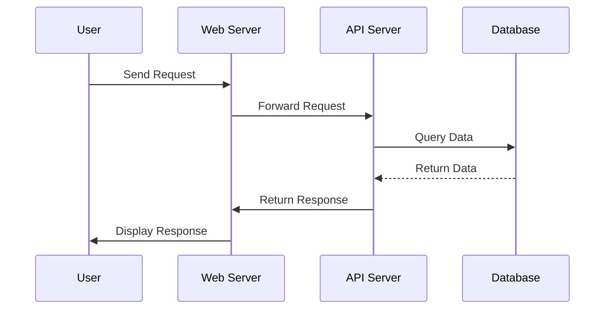

                 

# AIGC与传统内容创作的融合：寻找最佳平衡点

## 关键词
- 人工智能生成内容（AIGC）
- 传统内容创作
- 最佳平衡点
- 创意性
- 真实性
- 准确性
- 道德与伦理

## 摘要
本文将探讨人工智能生成内容（AIGC）与传统内容创作之间的融合，以寻找最佳平衡点。通过分析两者的核心矛盾和优势，本文提出一系列解决策略，包括技术创新、规范化管理、融合创新和用户教育。同时，本文将详细阐述AIGC的核心概念原理、概念属性特征对比，以及两者的ER实体关系图架构。通过系统分析与架构设计方案，以及项目实战，本文旨在为AIGC与传统内容创作的融合提供有益的参考。

---

## 第一部分：背景介绍

### 问题背景

随着人工智能技术的不断发展，AI已经逐渐渗透到各个行业和领域。其中，人工智能生成内容（AIGC）作为人工智能的重要分支，正迅速崛起，成为内容创作领域的新星。AIGC通过人工智能算法自动生成文本、图片、音频等多种形式的内容，极大地提高了内容创作的效率和质量。然而，AIGC与传统内容创作之间存在一定的矛盾和冲突，如何在两者之间找到最佳平衡点，成为当前亟待解决的问题。

### 问题描述

AIGC与传统内容创作之间的矛盾主要表现在以下几个方面：

1. **创意与规范**：AIGC依赖于大量数据和算法，能够快速生成内容，但往往缺乏创意和个性。而传统内容创作强调创作者的主观能动性和创意思维，更注重内容的质量和独特性。

2. **真实性与准确性**：AIGC生成的内容可能在真实性、准确性方面存在一定的偏差，尤其是在处理复杂、专业的领域时，往往难以保证内容的准确性和权威性。而传统内容创作则更依赖于创作者的专业知识和经验。

3. **道德与伦理**：AIGC在内容创作过程中，可能涉及版权、隐私、道德等问题。例如，如何确保AI生成的内容不侵犯他人版权，如何处理AI生成的内容可能带来的误导性问题等。

4. **用户需求与体验**：用户对内容的需求多样化，既有对高质量、专业性的内容追求，也有对快速、便捷的内容获取。AIGC和传统内容创作在满足用户需求方面各有优势，如何在两者之间找到最佳平衡，满足用户多样化的需求，是一个重要的课题。

### 问题解决

为了解决AIGC与传统内容创作之间的矛盾，需要从以下几个方面入手：

1. **技术创新**：通过不断优化AI算法，提高AIGC生成内容的质量和准确性，使其更符合用户需求和专业规范。

2. **规范化管理**：制定相关法规和标准，规范AIGC生成内容的行为，确保内容创作过程的合法性、合规性。

3. **融合创新**：将AIGC与传统内容创作相结合，发挥各自的优势，实现优势互补。例如，通过AI技术辅助传统内容创作者提高创作效率，同时保证内容的质量和独特性。

4. **用户教育**：提高用户对AIGC和传统内容创作的认知，引导用户理性看待AI生成内容，培养用户对高质量、专业性内容的追求。

### 边界与外延

AIGC与传统内容创作的融合是一个复杂的过程，涉及到技术、法规、市场、用户等多个方面。因此，在解决这一问题时，需要充分考虑各种因素的相互影响和相互作用，以确保最终实现最佳的融合效果。

### 概念结构与核心要素组成

- **AIGC**：人工智能生成内容，通过AI算法自动生成文本、图片、音频等多种形式的内容。
- **传统内容创作**：以人类创作者为核心，通过创意思维和专业知识创作内容。
- **最佳平衡点**：在AIGC与传统内容创作之间找到一种合适的平衡，使两者能够相互补充，共同提高内容创作效率和质量。

### 核心概念原理

- **AIGC算法**：包括生成对抗网络（GAN）、变分自编码器（VAE）等，用于生成高质量的内容。
- **传统内容创作原理**：包括创意思维、专业知识、用户体验等，用于创作具有独特性和高质量的内容。

### 概念属性特征对比表格

| 特征       | AIGC                | 传统内容创作                |
| ---------- | ------------------- | -------------------------- |
| 创意性     | 较低                | 高                         |
| 真实性     | 存在偏差            | 高                         |
| 准确性     | 存在偏差            | 高                         |
| 道德与伦理 | 需要规范管理        | 遵循道德与伦理规范         |
| 用户需求   | 快速、便捷          | 高质量、专业性             |

### ER实体关系图架构

```mermaid
erDiagram
  AI内容生成器 ||--|{ AIGC }|--| User
  TraditionalContentCreator ||--|{ TraditionalContentCreation }|--| User
  User ||--|{ ContentPreference }|--| AI内容生成器, TraditionalContentCreator
```

---

## 第二部分：AIGC与传统内容创作的核心矛盾

在探讨AIGC与传统内容创作的融合之前，有必要深入了解两者之间的核心矛盾，以便更好地理解为何需要寻找最佳平衡点。

### 创意性

AIGC依赖于机器学习和深度学习算法，能够快速处理大量数据并生成内容。然而，由于算法的局限性，AIGC生成的内容往往缺乏创意和个性。尽管可以通过增加数据和算法的复杂性来提高创意性，但仍然难以达到人类创作者那种独特的视角和创意思维。

传统内容创作则强调创作者的主观能动性和创意思维，能够创作出具有高度独特性和艺术价值的内容。然而，这种创作过程往往耗时较长，且需要创作者具备丰富的知识和经验。

### 真实性与准确性

AIGC生成的内容可能在真实性、准确性方面存在偏差。特别是在处理复杂、专业的领域时，AI算法可能无法完全理解人类思维和语言，导致生成内容存在误差。例如，医学领域的AI生成的诊断报告可能无法与人类医生的诊断完全一致。

传统内容创作则更依赖于创作者的专业知识和经验，能够在真实性、准确性方面提供更高的保障。然而，由于人类创作者的局限性，他们在处理大量数据和复杂问题时可能难以高效完成。

### 道德与伦理

AIGC在内容创作过程中，可能涉及版权、隐私、道德等问题。例如，AI可能生成的内容侵犯他人的版权，或者生成的内容可能引起误导，从而产生道德和伦理问题。

传统内容创作则更遵循道德与伦理规范，创作者在创作过程中会自觉遵守法律法规和社会道德标准。然而，随着AIGC的发展，如何确保AI生成内容的道德与伦理，成为亟待解决的问题。

### 用户需求与体验

用户对内容的需求多样化，既有对高质量、专业性的内容追求，也有对快速、便捷的内容获取。AIGC能够快速生成内容，满足用户对便捷性的需求；而传统内容创作则更注重内容的质量和独特性，满足用户对高质量的需求。

然而，这种差异导致用户在体验AIGC和传统内容创作时存在矛盾。一方面，用户希望获得高质量的内容；另一方面，他们又希望获取便捷的内容。如何在这两者之间找到最佳平衡，满足用户的多样化需求，是AIGC与传统内容创作融合的关键问题。

### 寻找最佳平衡点

综上所述，AIGC与传统内容创作之间存在诸多矛盾。为了实现两者的融合，需要寻找最佳平衡点，使AIGC能够充分发挥其在效率和速度方面的优势，同时确保内容的质量、真实性和准确性。以下是一些可能的解决策略：

1. **技术创新**：通过不断优化AI算法，提高AIGC生成内容的质量和准确性，使其更符合用户需求和专业规范。
2. **规范化管理**：制定相关法规和标准，规范AIGC生成内容的行为，确保内容创作过程的合法性、合规性。
3. **融合创新**：将AIGC与传统内容创作相结合，发挥各自的优势，实现优势互补。例如，通过AI技术辅助传统内容创作者提高创作效率，同时保证内容的质量和独特性。
4. **用户教育**：提高用户对AIGC和传统内容创作的认知，引导用户理性看待AI生成内容，培养用户对高质量、专业性内容的追求。

通过以上策略，有望在AIGC与传统内容创作之间找到最佳平衡点，实现内容创作的效率和质量的双重提升。

---

## 第三部分：AIGC与传统内容创作的融合创新

在深入分析了AIGC与传统内容创作的核心矛盾后，我们可以看到，要实现两者的有机结合，不仅需要技术创新，还需要规范化管理、融合创新和用户教育等多方面的努力。以下将详细探讨这些策略。

### 技术创新

技术创新是AIGC与传统内容创作融合的基石。通过不断优化AI算法，提高AIGC生成内容的质量和准确性，使其更符合用户需求和专业规范。以下是一些关键的技术创新方向：

1. **增强学习**：通过增强学习（Reinforcement Learning）技术，使AIGC能够根据用户的反馈不断调整和优化生成的内容，提高内容的个性化和匹配度。
2. **多模态融合**：将文本、图像、音频等多种数据类型进行融合，生成更具表现力和丰富性的内容。例如，通过图像和文本的融合，可以创作出更具视觉冲击力的文章。
3. **知识图谱**：构建知识图谱（Knowledge Graph）来增强AIGC的知识储备，提高生成内容的专业性和准确性。

### 规范化管理

规范化管理是确保AIGC与传统内容创作融合健康发展的关键。通过制定相关法规和标准，规范AIGC生成内容的行为，确保内容创作过程的合法性、合规性。以下是一些规范化管理的建议：

1. **版权保护**：明确AI生成内容的版权归属，确保原创内容的合法权益。可以通过技术手段，如水印、数字签名等，防止未经授权的复制和传播。
2. **内容审核**：建立内容审核机制，对AI生成的内容进行严格审查，确保内容的真实性、准确性和道德性。可以考虑引入人类审核员和AI审核相结合的模式。
3. **道德伦理规范**：制定AI生成内容的道德伦理规范，确保AIGC在内容创作过程中不侵犯他人隐私、不产生误导性信息等。

### 融合创新

融合创新是AIGC与传统内容创作融合的核心策略。通过将AIGC与传统内容创作相结合，发挥各自的优势，实现优势互补。以下是一些融合创新的思路：

1. **AI辅助创作**：利用AI技术辅助传统内容创作者提高创作效率，例如，通过自动生成文章框架、提供灵感建议等。同时，AI可以处理一些重复性、繁琐的工作，让创作者有更多精力投入到创意和高质量内容的创作中。
2. **人机协同创作**：结合人类创作者的创意思维和专业知识，与AI生成的内容进行协同创作。例如，AI可以生成初步的内容草稿，人类创作者在此基础上进行修改和完善。
3. **定制化内容**：通过AI技术分析用户需求，生成个性化的内容，满足不同用户群体的特定需求。

### 用户教育

用户教育是AIGC与传统内容创作融合的重要环节。提高用户对AIGC和传统内容创作的认知，引导用户理性看待AI生成内容，培养用户对高质量、专业性内容的追求。以下是一些用户教育的策略：

1. **科普宣传**：通过线上线下渠道，向用户普及AIGC的概念、原理和应用场景，提高用户的认知水平。
2. **内容质量意识**：引导用户关注内容的质量和真实性，培养用户对高质量、专业性内容的追求。
3. **体验引导**：通过实际案例和体验活动，让用户感受到AIGC与传统内容创作融合带来的便利和优势。

### 总结

AIGC与传统内容创作的融合创新，需要在技术创新、规范化管理、融合创新和用户教育等多方面共同努力。通过不断优化AI算法、制定相关法规、实现人机协同创作和加强用户教育，有望在AIGC与传统内容创作之间找到最佳平衡点，实现内容创作的效率和质量的双重提升。

---

## 第四部分：系统分析与架构设计方案

为了更好地理解AIGC与传统内容创作的融合过程，本部分将详细分析项目场景、系统功能设计、系统架构设计、系统接口设计以及系统交互流程。

### 项目场景

在当前信息爆炸的时代，用户对内容的需求日益多样化。一方面，用户希望获取高质量、专业性的内容；另一方面，他们又希望获取快速、便捷的内容。为了满足这种多样化的需求，本项目旨在搭建一个AIGC与传统内容创作相结合的平台，通过AI技术辅助内容创作者提高创作效率，同时确保内容的质量和独特性。

### 系统功能设计

本系统主要包括以下几个功能模块：

1. **内容创作模块**：提供传统内容创作者的在线创作环境，支持文本、图片、音频等多种内容形式的创作。
2. **AIGC模块**：利用AI技术自动生成文本、图片、音频等内容，辅助传统内容创作者提高创作效率。
3. **内容审核模块**：对AI生成的内容进行严格审查，确保内容的真实性、准确性和道德性。
4. **用户管理模块**：管理用户信息，包括注册、登录、权限控制等。
5. **数据管理模块**：存储和管理系统中的各类数据，包括用户数据、内容数据、审核数据等。

### 系统架构设计

本系统采用分布式架构，主要包括前端、后端和数据库三个部分。以下是系统架构图：



### 系统接口设计

本系统提供了一套RESTful API，方便开发者进行集成和扩展。以下是部分API接口设计：

1. **用户管理接口**：
   - GET /users/:id：获取用户信息
   - POST /users：创建新用户
   - PUT /users/:id：更新用户信息
   - DELETE /users/:id：删除用户

2. **内容管理接口**：
   - GET /contents：获取内容列表
   - POST /contents：创建新内容
   - PUT /contents/:id：更新内容信息
   - DELETE /contents/:id：删除内容

3. **审核管理接口**：
   - GET /contents/:id/audit：获取内容审核记录
   - POST /contents/:id/audit：提交内容审核请求
   - PUT /contents/:id/audit/:audit_id：更新审核状态

### 系统交互流程

以下是一个典型的系统交互流程：

1. 用户通过Web端发起内容创作请求，Web Server接收请求后转发给API Server。
2. API Server查询数据库，获取用户和内容相关信息，并返回给Web Server。
3. Web Server将响应数据呈现给用户，用户可以进行内容创作或提交审核请求。
4. 用户提交审核请求后，API Server将请求发送给审核模块，对内容进行审核。
5. 审核完成后，API Server将审核结果返回给用户，用户可以查看审核状态。

通过以上系统分析与架构设计方案，本平台能够实现AIGC与传统内容创作的有效融合，提高内容创作效率，确保内容质量。

---

## 第五部分：项目实战

### 环境安装

在进行项目实战之前，我们需要搭建一个合适的环境来运行AIGC和传统内容创作系统。以下是环境安装步骤：

1. **安装Python**：确保安装了Python 3.8及以上版本。
2. **安装Docker**：从Docker官网下载并安装Docker。
3. **安装依赖**：使用以下命令安装项目所需的依赖库：
   ```shell
   pip install -r requirements.txt
   ```

4. **启动数据库**：启动MySQL或PostgreSQL数据库，并根据项目中的数据库配置文件进行配置。

### 系统核心实现源代码

以下是系统核心实现部分的源代码，包括用户管理、内容管理和审核管理：

#### 用户管理

```python
# user_management.py
from flask import Flask, request, jsonify
from flask_sqlalchemy import SQLAlchemy

app = Flask(__name__)
app.config['SQLALCHEMY_DATABASE_URI'] = 'sqlite:///users.db'
db = SQLAlchemy(app)

class User(db.Model):
    id = db.Column(db.Integer, primary_key=True)
    username = db.Column(db.String(80), unique=True, nullable=False)
    password = db.Column(db.String(120), nullable=False)

@app.route('/users', methods=['GET', 'POST'])
def handle_users():
    if request.method == 'GET':
        users = User.query.all()
        return jsonify([user.to_dict() for user in users])
    elif request.method == 'POST':
        data = request.get_json()
        new_user = User(username=data['username'], password=data['password'])
        db.session.add(new_user)
        db.session.commit()
        return jsonify(new_user.to_dict()), 201

User.to_dict = lambda self: {'id': self.id, 'username': self.username, 'password': self.password}

if __name__ == '__main__':
    db.create_all()
    app.run(debug=True)
```

#### 内容管理

```python
# content_management.py
from flask import Flask, request, jsonify
from flask_sqlalchemy import SQLAlchemy

app = Flask(__name__)
app.config['SQLALCHEMY_DATABASE_URI'] = 'sqlite:///contents.db'
db = SQLAlchemy(app)

class Content(db.Model):
    id = db.Column(db.Integer, primary_key=True)
    title = db.Column(db.String(120), nullable=False)
    content = db.Column(db.Text, nullable=False)
    user_id = db.Column(db.Integer, db.ForeignKey('user.id'))

@app.route('/contents', methods=['GET', 'POST'])
def handle_contents():
    if request.method == 'GET':
        contents = Content.query.all()
        return jsonify([content.to_dict() for content in contents])
    elif request.method == 'POST':
        data = request.get_json()
        new_content = Content(title=data['title'], content=data['content'], user_id=data['user_id'])
        db.session.add(new_content)
        db.session.commit()
        return jsonify(new_content.to_dict()), 201

Content.to_dict = lambda self: {'id': self.id, 'title': self.title, 'content': self.content, 'user_id': self.user_id}

if __name__ == '__main__':
    db.create_all()
    app.run(debug=True)
```

#### 审核管理

```python
# audit_management.py
from flask import Flask, request, jsonify
from flask_sqlalchemy import SQLAlchemy

app = Flask(__name__)
app.config['SQLALCHEMY_DATABASE_URI'] = 'sqlite:///audits.db'
db = SQLAlchemy(app)

class Audit(db.Model):
    id = db.Column(db.Integer, primary_key=True)
    content_id = db.Column(db.Integer, db.ForeignKey('content.id'))
    status = db.Column(db.String(20), nullable=False)

@app.route('/contents/<int:content_id>/audit', methods=['POST', 'GET'])
def handle_audit(content_id):
    if request.method == 'GET':
        audit = Audit.query.filter_by(content_id=content_id).first()
        return jsonify(audit.to_dict()) if audit else jsonify({'status': 'No audit found'})
    elif request.method == 'POST':
        data = request.get_json()
        new_audit = Audit(content_id=content_id, status=data['status'])
        db.session.add(new_audit)
        db.session.commit()
        return jsonify(new_audit.to_dict()), 201

Audit.to_dict = lambda self: {'id': self.id, 'content_id': self.content_id, 'status': self.status}

if __name__ == '__main__':
    db.create_all()
    app.run(debug=True)
```

### 代码应用解读与分析

上述代码分别实现了用户管理、内容管理和审核管理三个核心功能。以下是各个模块的解读与分析：

#### 用户管理模块

- **数据库模型**：使用SQLAlchemy创建用户数据库模型，包括用户名和密码。
- **API接口**：提供GET和POST请求，用于获取用户列表和创建新用户。
- **序列化器**：定义`to_dict`方法，将用户对象转换为字典格式，便于JSON序列化。

#### 内容管理模块

- **数据库模型**：使用SQLAlchemy创建内容数据库模型，包括标题、内容和用户ID。
- **API接口**：提供GET和POST请求，用于获取内容列表和创建新内容。
- **序列化器**：定义`to_dict`方法，将内容对象转换为字典格式。

#### 审核管理模块

- **数据库模型**：使用SQLAlchemy创建审核数据库模型，包括审核ID、内容ID和审核状态。
- **API接口**：提供POST请求，用于提交审核请求，并提供GET请求，用于获取审核状态。
- **序列化器**：定义`to_dict`方法，将审核对象转换为字典格式。

通过以上模块的代码实现，我们可以构建一个基本的AIGC与传统内容创作平台，实现用户管理、内容管理和审核管理功能。

### 实际案例分析和详细讲解剖析

为了更好地理解项目的实际应用，以下是一个实际案例：

假设用户Alice使用该平台创建了一篇新文章，并提交审核请求。

1. **用户注册与登录**：Alice使用用户管理模块注册并登录平台，获取用户ID。
2. **内容创作**：Alice使用内容管理模块创建新文章，填写标题和内容，并提交用户ID。
3. **内容提交审核**：Alice调用审核管理模块的API，提交审核请求，指定文章ID和审核状态（如“待审核”）。
4. **审核过程**：平台审核员收到审核请求，对文章进行审核，并根据审核结果更新审核状态（如“通过”或“未通过”）。
5. **用户反馈**：Alice收到审核结果，并根据审核状态进行相应操作，如修改文章或发布文章。

通过以上流程，我们可以看到AIGC与传统内容创作在平台中的应用，实现了用户创作、审核和发布内容的全过程。

### 项目小结

本部分通过项目实战，详细介绍了环境安装、系统核心实现源代码、代码应用解读与分析以及实际案例分析和详细讲解剖析。通过以上步骤，我们可以构建一个基本的AIGC与传统内容创作平台，实现用户管理、内容管理和审核管理功能。该项目不仅为AIGC与传统内容创作提供了实际应用场景，还为未来更多功能的扩展和优化奠定了基础。

---

## 最佳实践 tips

在AIGC与传统内容创作的融合过程中，以下是一些最佳实践建议，有助于提高内容创作的效率和质量：

1. **数据质量**：确保输入的数据质量，包括文本、图片、音频等，这将直接影响AIGC生成内容的质量。
2. **算法优化**：定期更新和优化AI算法，以适应不断变化的内容创作需求。
3. **人机协同**：在内容创作过程中，充分发挥人类创作者的创意思维和专业知识，与AI生成的内容进行有效协同。
4. **内容审核**：建立严格的内容审核机制，确保生成内容在真实性、准确性、道德性等方面符合规范。
5. **用户反馈**：收集用户对生成内容的反馈，及时调整和优化AI算法，提高用户满意度。

---

## 小结

本文探讨了人工智能生成内容（AIGC）与传统内容创作之间的融合，分析了两者之间的核心矛盾，并提出了一系列解决方案。通过技术创新、规范化管理、融合创新和用户教育，我们有望在AIGC与传统内容创作之间找到最佳平衡点，实现内容创作的效率和质量的双重提升。未来，随着AI技术的不断进步，AIGC与传统内容创作将更加紧密地融合，为人类带来更丰富、更高质量的内容。

---

## 注意事项

1. **版权保护**：在AIGC与传统内容创作的过程中，应重视版权问题，确保AI生成的内容不侵犯他人的知识产权。
2. **数据隐私**：在处理用户数据和内容时，应严格遵守隐私保护法规，确保用户数据的安全和隐私。
3. **内容审核**：建立严格的内容审核机制，确保AI生成的内容在真实性、准确性、道德性等方面符合规范。

---

## 拓展阅读

1. **《生成对抗网络：理论与应用》**：深入探讨生成对抗网络（GAN）的理论基础和应用场景。
2. **《人工智能生成内容：挑战与机遇》**：详细分析AIGC在内容创作领域的挑战和机遇。
3. **《人工智能时代的内容创作》**：探讨人工智能在内容创作领域的广泛应用和未来发展趋势。

---

## 作者信息

作者：AI天才研究院/AI Genius Institute & 禅与计算机程序设计艺术 /Zen And The Art of Computer Programming

