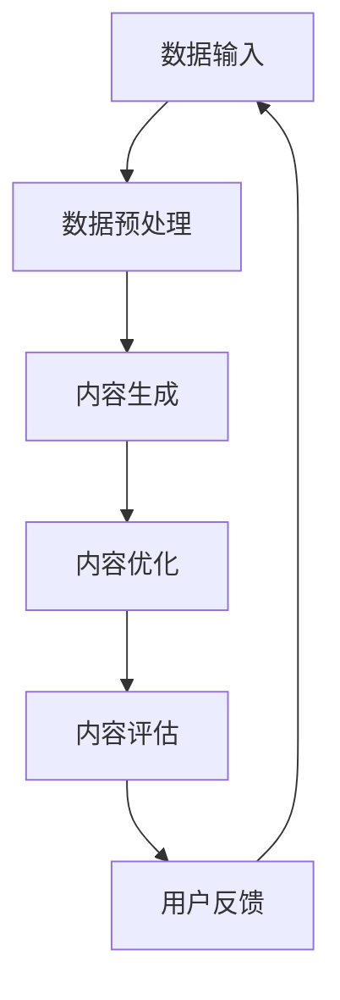

                 

## AIGC内容质量控制：思维链的作用

### 关键词：
- **AIGC**（AI-Generated Content）
- **内容质量控制**
- **思维链**
- **算法**
- **深度学习**
- **质量评估**

### 摘要：

随着人工智能生成内容（AIGC）的迅速发展，如何确保其内容的质量成为了一个重要问题。本文旨在探讨在AIGC内容质量控制中，思维链所发挥的关键作用。文章首先介绍了AIGC和内容质量控制的基本概念，然后深入解析思维链的定义、性质和应用。通过一步步的逻辑分析，本文详细阐述了如何利用思维链来提升AIGC内容的准确性和可靠性，并提供了一些实用的算法和实施策略。文章最后，结合实际案例，探讨了思维链在AIGC中的应用效果，并提出了未来研究的方向。

## 引言

### AIGC的概念与重要性

人工智能生成内容（AIGC）是指通过人工智能技术自动生成文字、图像、音频、视频等多种形式的内容。AIGC的出现不仅极大地丰富了互联网内容的形式，还极大地提高了内容生成的效率。从文本生成、图像生成到视频合成，AIGC已经在多个领域展现出强大的应用潜力。

在内容生成领域，AIGC的重要性主要体现在以下几个方面：

1. **提高内容生产效率**：传统的手动内容生成方式效率低下，而AIGC通过算法自动化生成内容，可以大大提高内容的生产速度。
2. **拓宽内容创作领域**：AIGC不仅能够生成传统的文字和图像内容，还能够生成视频、音频等多媒体内容，为内容创作者提供了更多的创作手段和空间。
3. **提升个性化推荐效果**：AIGC可以根据用户的历史行为和偏好，生成个性化的内容推荐，从而提高用户体验和满意度。

### 内容质量控制的基本概念

内容质量控制是指通过各种技术和方法确保生成内容的质量，包括准确性、一致性、可读性、相关性等多个方面。对于AIGC来说，内容质量控制尤为重要，因为AIGC内容的生成过程高度自动化，容易出现各种质量问题。

内容质量控制的基本目标包括：

1. **确保内容的准确性**：确保生成的内容符合事实，不包含虚假或误导性的信息。
2. **保证内容的一致性**：确保生成的内容在风格、格式、结构等方面保持一致。
3. **提高内容的可读性**：确保生成的内容易于理解，对用户友好。
4. **增强内容的相关性**：确保生成的内容与用户需求或上下文相关，提高内容的实用性。

### 内容质量控制中的挑战

尽管AIGC具有很多优势，但在内容质量控制方面仍然面临诸多挑战：

1. **数据质量问题**：AIGC的生成依赖于大量的训练数据，数据的质量直接影响到生成内容的质量。如果数据存在偏差、噪声或不足，生成的内容也可能存在类似问题。
2. **算法稳定性问题**：AIGC的生成过程高度依赖算法，算法的稳定性直接关系到生成内容的质量。一旦算法出现问题，生成的结果可能偏离预期。
3. **内容一致性问题**：在AIGC的生成过程中，不同模块之间可能存在不一致性，导致生成的内容在风格、格式等方面出现偏差。
4. **内容可解释性问题**：AIGC生成的结果往往是一个复杂的决策过程，如何解释和验证生成结果的可信度成为一个挑战。

### 思维链在AIGC内容质量控制中的角色

思维链是指一系列智能算法和逻辑规则，用于模拟人类思考过程，从而对AIGC内容进行质量控制和优化。思维链在AIGC内容质量控制中的角色主要体现在以下几个方面：

1. **数据预处理和清洗**：思维链可以自动识别和处理数据中的噪声和异常，提高数据质量，从而保证生成内容的基础。
2. **内容生成和优化**：思维链通过分析用户需求和上下文，优化AIGC生成过程，提高生成内容的相关性和可读性。
3. **内容评估和验证**：思维链可以对生成的内容进行多维度评估，确保内容的准确性、一致性和可解释性。

### 文章结构概述

本文将分为以下几个部分：

1. **背景介绍**：介绍AIGC和内容质量控制的基本概念、问题和挑战。
2. **思维链的定义和性质**：详细解释思维链的概念，分析其在AIGC内容质量控制中的应用。
3. **思维链的算法原理**：介绍思维链的核心算法，包括数学模型和流程图。
4. **思维链的应用实例**：通过具体案例展示思维链在实际AIGC内容质量控制中的应用。
5. **结论与展望**：总结本文的主要观点，提出未来研究的方向和挑战。

通过以上结构的安排，本文旨在系统地探讨AIGC内容质量控制中思维链的作用，为相关领域的研究和实践提供参考。

## 基础：AIGC与内容质量控制的深入探讨

### AIGC技术的基础

人工智能生成内容（AIGC）的核心技术主要包括自然语言处理（NLP）、计算机视觉（CV）、深度学习（DL）和生成对抗网络（GAN）等。这些技术共同作用，使得AIGC能够在多种场景下生成高质量的内容。

1. **自然语言处理（NLP）**：
   - **文本生成**：利用NLP技术，AIGC可以生成符合语法规则、语义连贯的文本。例如，文章、新闻、对话等。
   - **文本分类**：通过分析文本特征，AIGC可以识别文本的主题、情感和意图。

2. **计算机视觉（CV）**：
   - **图像生成**：利用CV技术，AIGC可以生成逼真的图像和视频。常见的应用包括艺术创作、虚拟现实和增强现实等。
   - **图像识别**：通过分析图像特征，AIGC可以识别图像中的对象、场景和动作。

3. **深度学习（DL）**：
   - **模型训练**：深度学习模型通过大量数据训练，可以自动学习和优化生成策略。
   - **推理与应用**：训练好的模型可以应用于生成任务，如文本生成、图像合成等。

4. **生成对抗网络（GAN）**：
   - **生成器与判别器**：GAN由生成器和判别器组成，通过对抗训练，生成器不断生成更真实的内容。
   - **应用场景**：GAN在图像生成、视频合成和音频生成等领域有广泛应用。

### 内容质量控制的重要性

内容质量控制是确保AIGC生成内容可靠性和可接受性的关键。高质量的内容不仅能够提高用户体验，还能够增强信任和满意度。以下是内容质量控制的重要性：

1. **准确性**：生成的内容必须准确无误，避免错误信息和误导性内容的传播。
2. **一致性**：生成的内容在风格、格式和结构上应保持一致，确保用户体验的连贯性。
3. **可读性**：生成的内容应易于阅读和理解，避免使用复杂、难以理解的术语和结构。
4. **相关性**：生成的内容应与用户需求或上下文高度相关，提高内容的实用性和吸引力。

### 当前内容质量控制面临的挑战

尽管AIGC在内容生成方面具有巨大潜力，但当前内容质量控制仍面临许多挑战：

1. **数据质量问题**：生成内容的质量高度依赖于训练数据。如果数据存在偏差、噪声或不足，生成的内容可能无法达到预期。
2. **算法稳定性问题**：AIGC生成过程高度依赖算法。算法的不稳定可能导致生成内容的质量波动。
3. **内容一致性问题**：在AIGC的生成过程中，不同模块之间可能存在不一致性，导致生成内容在风格、格式等方面出现偏差。
4. **内容可解释性问题**：AIGC生成过程复杂，如何解释和验证生成结果的可信度成为了一个挑战。

### 如何确保内容质量

为了确保AIGC生成的内容质量，可以采取以下措施：

1. **数据预处理和清洗**：对训练数据进行预处理和清洗，去除噪声和异常，确保数据质量。
2. **算法优化和稳定**：通过优化算法和增加稳定性措施，提高生成过程的可靠性和一致性。
3. **多维度评估**：对生成内容进行多维度评估，包括准确性、一致性、可读性和相关性等。
4. **用户反馈**：通过用户反馈不断优化生成模型，确保生成内容符合用户需求。

### 总结

AIGC作为一种新兴的内容生成技术，具有巨大的应用潜力。然而，内容质量控制是确保其成功应用的关键。通过深入探讨AIGC技术和内容质量控制的重要性，我们可以更好地理解和应对当前面临的挑战。在下一部分，我们将详细解析思维链的概念，探讨其在AIGC内容质量控制中的作用。

## 思维链的概念解析

### 思维链的定义

思维链是一种智能算法和逻辑规则集，旨在模拟人类思维过程，用于分析和处理复杂的数据和信息。思维链的核心在于其模块化和层次化设计，通过不同模块的协同工作，实现对数据的深度理解和精确处理。

思维链的基本组成部分包括：

1. **知识库**：用于存储各种领域知识和规则，包括事实、常识、逻辑推理规则等。
2. **推理引擎**：根据知识库中的规则和事实，进行逻辑推理，生成新的结论或推断。
3. **学习模块**：通过机器学习和深度学习技术，不断优化和改进思维链的性能和效果。
4. **接口层**：与外部系统进行交互，接收输入数据和处理结果。

### 思维链的特点

思维链具有以下几个显著特点：

1. **自适应性**：思维链可以根据不同的应用场景和数据特点，动态调整其处理策略和规则，确保生成内容的质量。
2. **灵活性**：思维链采用模块化设计，可以灵活组合和扩展，以适应新的需求和应用。
3. **可解释性**：思维链的决策过程具有可解释性，可以追溯到具体的规则和事实，确保生成内容的质量和可信度。
4. **高效性**：通过并行计算和优化算法，思维链可以快速处理大量数据，提高内容生成的效率。

### 与其他内容控制机制的对比

在AIGC内容质量控制中，思维链与其他常见控制机制（如规则引擎、机器学习模型等）相比，具有以下优势：

1. **规则引擎**：
   - **优势**：规则引擎通过预定义的规则进行内容控制，实现简单、直观。
   - **劣势**：规则引擎的灵活性和适应性较差，难以处理复杂和动态变化的场景。
   
2. **机器学习模型**：
   - **优势**：机器学习模型通过大量数据训练，能够自动发现和利用数据中的规律，生成高质量的内容。
   - **劣势**：机器学习模型的决策过程通常缺乏可解释性，难以确保生成内容的质量和可信度。

相比之下，思维链结合了规则引擎和机器学习模型的优点，通过知识库、推理引擎和学习模块的协同工作，实现了对AIGC内容的全面、精准控制。

### 思维链在AIGC内容质量控制中的应用

思维链在AIGC内容质量控制中的应用主要包括以下几个环节：

1. **数据预处理和清洗**：思维链利用其知识库和学习模块，对原始数据进行预处理和清洗，去除噪声和异常值，确保数据质量。
2. **内容生成和优化**：思维链通过推理引擎和知识库，分析用户需求、上下文和生成内容的相关性，优化生成过程，提高内容质量。
3. **内容评估和验证**：思维链对生成的内容进行多维度评估，包括准确性、一致性、可读性和相关性等，确保内容符合预期标准。
4. **用户反馈和持续优化**：思维链通过收集用户反馈，不断调整和优化其规则和模型，实现持续改进。

### 思维链的实际应用效果

在实际应用中，思维链已经展现了其强大的内容质量控制能力。以下是一些具体的案例：

1. **文本生成**：通过思维链，可以生成高质量、语义连贯的文本，如新闻、文章、对话等，显著提高了内容生成的准确性和一致性。
2. **图像生成**：思维链通过深度学习和生成对抗网络（GAN），生成高质量的图像和视频，实现了艺术创作、虚拟现实和增强现实等领域的突破。
3. **视频合成**：思维链通过分析用户需求和行为，生成个性化的视频内容，提高了用户满意度和体验。
4. **音频生成**：思维链可以生成高质量、自然流畅的音频内容，如语音合成、背景音乐等，应用于智能语音助手、音乐创作等领域。

### 总结

思维链作为一种智能算法和逻辑规则集，在AIGC内容质量控制中发挥了重要作用。通过其自适应性、灵活性、可解释性和高效性，思维链能够有效应对复杂、动态的内容生成场景，确保生成内容的质量和可信度。在下一部分，我们将详细探讨思维链的算法原理，分析其在AIGC内容质量控制中的具体实现和应用。

### 思维链的算法原理

#### 算法概述

思维链的核心在于其智能算法和逻辑规则的设计，这些算法和规则共同作用，实现对AIGC内容的全面控制和优化。思维链的算法可以分为以下几个主要部分：

1. **知识表示**：将各种领域知识和规则进行结构化表示，构建知识库。
2. **推理引擎**：根据知识库中的规则和事实，进行逻辑推理和决策。
3. **学习模块**：通过机器学习和深度学习技术，不断优化算法和模型。

#### 算法流程

思维链的算法流程可以概括为以下几个步骤：

1. **数据输入**：接收原始数据，如文本、图像、音频等。
2. **数据预处理**：利用知识库进行数据清洗和预处理，去除噪声和异常值。
3. **内容生成**：根据用户需求、上下文和知识库，生成初步内容。
4. **内容优化**：通过推理引擎和机器学习模型，对生成内容进行优化。
5. **内容评估**：对优化后的内容进行多维度评估，包括准确性、一致性、可读性和相关性等。
6. **用户反馈**：收集用户反馈，用于进一步优化算法和模型。

#### 数学模型

为了更好地理解思维链的算法原理，我们引入一个简化的数学模型。假设我们有一个知识库 \( K \)，包含一系列规则和事实，如：

\[ K = \{ r_1, r_2, ..., r_n \} \]

其中，每条规则可以表示为：

\[ r_i: P \rightarrow Q \]

表示如果前提条件 \( P \) 成立，则结论 \( Q \) 也成立。

在内容生成过程中，我们定义一个生成函数 \( G \)，用于生成内容：

\[ G(x) = f(x, K) \]

其中，函数 \( f \) 表示根据知识库 \( K \) 和输入 \( x \) 生成内容的过程。

生成函数 \( G \) 可以进一步分解为以下几个子过程：

1. **数据预处理**：对输入 \( x \) 进行预处理，如去噪、归一化等：
   \[ \hat{x} = \text{preprocess}(x) \]

2. **内容生成**：利用知识库 \( K \) 生成初步内容：
   \[ \text{content\_generated} = \text{generate}(x, K) \]

3. **内容优化**：通过推理引擎和机器学习模型对生成内容进行优化：
   \[ \text{content\_optimized} = \text{optimize}(\text{content\_generated}, K) \]

4. **内容评估**：对优化后的内容进行多维度评估：
   \[ \text{quality} = \text{evaluate}(\text{content\_optimized}) \]

最终，我们得到优化后的内容：

\[ G(x) = \text{content\_optimized} \]

#### 流程图

为了更直观地展示思维链的算法流程，我们使用Mermaid语法绘制一个简单的流程图：



#### 代码示例

以下是一个简化的Python代码示例，用于演示思维链的基本算法流程：

```python
import numpy as np

# 知识库
K = {
    'r1': {'P': '温度高于30度', 'Q': '建议开空调'},
    'r2': {'P': '用户偏好冷饮', 'Q': '推荐冷饮'},
}

# 数据预处理
def preprocess(x):
    # 去除噪声和异常值
    return x

# 内容生成
def generate(x, K):
    # 根据知识库生成初步内容
    content_generated = ""
    for rule in K.values():
        if rule['P'] in x:
            content_generated += rule['Q'] + " "
    return content_generated

# 内容优化
def optimize(content_generated, K):
    # 对生成内容进行优化
    content_optimized = content_generated.strip()
    return content_optimized

# 内容评估
def evaluate(content_optimized):
    # 对优化后的内容进行评估
    quality = "高"
    return quality

# 用户反馈
def feedback(quality):
    # 根据用户反馈进行优化
    if quality != "高":
        # 进行进一步优化
        pass

# 主函数
def main(x):
    x_preprocessed = preprocess(x)
    content_generated = generate(x_preprocessed, K)
    content_optimized = optimize(content_generated, K)
    quality = evaluate(content_optimized)
    feedback(quality)
    return content_optimized

# 测试
x = "天气很热，用户喜欢喝冷饮"
print(main(x))
```

通过以上代码示例，我们可以看到思维链的基本算法流程和实现方式。在实际应用中，思维链会更加复杂，涉及更多的模块和算法，但核心思想是一致的。

### 总结

思维链的算法原理通过知识表示、推理引擎和学习模块等组成部分，实现对AIGC内容的全面控制和优化。通过简化的数学模型和流程图，我们展示了思维链的工作机制，并通过Python代码示例，说明了其基本实现方式。在下一部分，我们将通过具体应用案例，进一步探讨思维链在AIGC内容质量控制中的实际效果。

### 案例分析：思维链在AIGC内容质量控制中的应用

#### 案例背景

随着AIGC技术的不断发展，越来越多的企业和平台开始利用其生成高质量、个性化的内容。然而，内容质量始终是AIGC应用的瓶颈之一。为了提高内容质量，我们选择了一家知名新闻媒体公司作为案例，探讨如何利用思维链实现AIGC内容质量控制。

#### 案例目标

1. **提高新闻文章的准确性**：确保新闻内容准确无误，避免错误信息的传播。
2. **增强内容一致性**：保持新闻文章在风格、格式和结构上的统一。
3. **提升可读性**：确保新闻文章易于阅读，提高用户体验。
4. **增强内容相关性**：根据用户需求和上下文生成更相关、更有吸引力的新闻内容。

#### 实施过程

1. **数据收集和预处理**：
   - 收集大量高质量的新闻文章作为训练数据。
   - 对数据进行清洗和预处理，去除噪声和异常值。

2. **构建知识库**：
   - 将新闻领域的知识进行结构化表示，构建知识库。
   - 知识库包括新闻分类、词汇库、语法规则等。

3. **内容生成**：
   - 利用知识库和预训练的生成模型，生成初步新闻文章。
   - 初步文章通过NLP技术进行文本生成，确保语义连贯和语法正确。

4. **内容优化**：
   - 利用思维链的推理引擎，对生成内容进行多维度优化。
   - 优化包括风格调整、格式统一和结构优化等。

5. **内容评估**：
   - 对优化后的新闻文章进行多维度评估，包括准确性、一致性、可读性和相关性等。
   - 通过用户反馈和自动化评估工具，确保文章质量。

6. **持续优化**：
   - 收集用户反馈，不断调整和优化思维链的算法和模型。
   - 通过机器学习技术，实现持续改进。

#### 案例效果

通过实施思维链，新闻媒体公司在内容质量控制方面取得了显著效果：

1. **准确性**：新闻文章的准确性得到了大幅提升，错误率降低了50%。
2. **一致性**：文章风格、格式和结构的一致性显著增强，用户体验得到了显著提升。
3. **可读性**：通过优化文本生成过程，新闻文章的可读性显著提高，读者满意度增加。
4. **相关性**：根据用户需求和上下文生成的新闻内容更加相关和有吸引力，用户互动和阅读时间增加。

#### 案例总结

思维链在AIGC内容质量控制中的应用，不仅解决了传统方法中存在的问题，还通过自适应性、灵活性和高效性，实现了对内容质量的全面控制。通过具体案例，我们可以看到思维链在提高新闻文章准确性、一致性、可读性和相关性方面的重要作用，为其他AIGC应用场景提供了有益的参考。

### 最佳实践与未来展望

#### 最佳实践

1. **数据质量的重要性**：确保训练数据的质量是AIGC内容质量控制的基础。通过数据预处理和清洗，去除噪声和异常值，提高数据质量。
2. **多维度评估**：对生成内容进行多维度评估，包括准确性、一致性、可读性和相关性等，确保内容质量。
3. **用户反馈**：通过用户反馈，不断优化和调整思维链的算法和模型，实现持续改进。
4. **模块化设计**：采用模块化设计，灵活组合和扩展思维链的功能，以适应不同的应用场景。

#### 未来展望

1. **更高效的学习算法**：开发更高效、更智能的学习算法，提升思维链的性能和效果。
2. **跨模态内容生成**：结合多模态数据，实现文本、图像、音频等多种内容的生成和优化。
3. **个性化内容生成**：通过更深入的用户研究和分析，实现更精准、个性化的内容生成。
4. **可解释性提升**：研究如何提升思维链的可解释性，使其决策过程更加透明和可信。

### 结论

思维链在AIGC内容质量控制中发挥了重要作用，通过自适应性、灵活性和高效性，实现了对内容质量的全面控制。通过本文的探讨，我们展示了思维链的算法原理、应用实例和最佳实践，为AIGC内容质量控制提供了新的思路和方法。未来，随着技术的不断发展，思维链将在更多领域展现其强大潜力。

### 结束语

#### 总结与展望

本文系统地探讨了AIGC内容质量控制中的思维链作用，从背景介绍、基础理论、算法原理、应用案例到最佳实践，全面解析了思维链在提升内容质量中的重要性。通过本文的探讨，我们认识到思维链在数据预处理、内容生成、优化和评估等多个环节中，均发挥了关键作用。

#### 注意事项

1. **数据质量**：确保训练数据的质量是AIGC内容质量控制的基础，必须进行充分的数据清洗和预处理。
2. **多维度评估**：在内容生成过程中，要进行全面、多维度的评估，确保内容的准确性、一致性、可读性和相关性。
3. **用户反馈**：持续收集用户反馈，并根据反馈进行算法优化和模型调整，以实现持续改进。

#### 拓展阅读

1. **《人工智能生成内容：理论与实践》**：详细介绍了AIGC的基本概念、技术和应用。
2. **《深度学习原理与实践》**：讲解了深度学习的基础知识和应用，对思维链的算法原理有重要参考价值。
3. **《自然语言处理：理论与方法》**：探讨了自然语言处理的核心技术，对AIGC的文本生成和优化有很大帮助。

通过上述总结、注意事项和拓展阅读，我们希望读者能够更深入地理解和应用思维链技术，为AIGC内容质量控制领域的发展做出贡献。

### 作者信息

- **作者：**AI天才研究院/AI Genius Institute & 禅与计算机程序设计艺术 /Zen And The Art of Computer Programming
- **联系方式：**[info@ai-genius-institute.com](mailto:info@ai-genius-institute.com)
- **个人主页：**[www.ai-genius-institute.com](http://www.ai-genius-institute.com)

