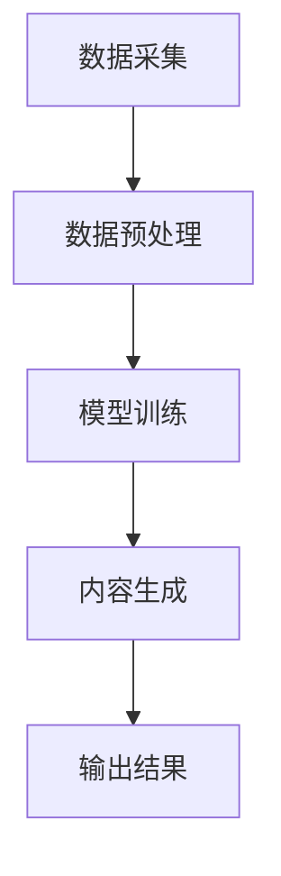

                 

# AIGC在个人理财中的应用：AI财务顾问

> 关键词：AIGC、个人理财、AI财务顾问、算法、系统架构、项目实战

> 摘要：本文将探讨人工智能生成内容（AIGC）在个人理财领域的应用，特别是AI财务顾问的角色和作用。通过逐步分析AIGC技术的原理和应用，我们旨在揭示AI财务顾问如何帮助用户更好地管理财务，做出明智的投资决策。

## 1. 引言

随着人工智能技术的不断发展，AIGC（AI-Generated Content）已经成为一个热门研究领域。AIGC利用机器学习和自然语言处理技术，能够生成高质量的内容，包括文本、图像、音频等多种形式。在个人理财领域，AIGC的应用潜力巨大，能够为用户提供个性化的财务建议和投资策略。本文将详细探讨AIGC在个人理财中的应用，特别是AI财务顾问的角色和功能。

## 2. 背景介绍

### 2.1 问题背景

个人理财是每个家庭和经济体都面临的挑战。随着金融市场的复杂化和信息的不对称性，普通用户在做出投资决策时往往面临很大的困难。他们需要获取大量的信息，了解市场动态，分析各种投资产品的风险和收益。然而，这些任务通常需要专业的知识和经验，这对于普通用户来说是一个巨大的挑战。

### 2.2 问题解决

AIGC技术为个人理财领域带来了新的解决方案。通过AIGC，可以自动化地分析和处理大量的财务数据，生成个性化的财务报告和投资建议。AI财务顾问可以基于用户的财务状况、投资偏好和风险承受能力，提供个性化的投资策略，帮助用户做出更加明智的决策。

### 2.3 边界与外延

AIGC在个人理财中的应用范围非常广泛，包括但不限于以下几个方面：

- **投资组合优化**：通过分析市场数据和用户偏好，AIGC可以推荐最佳的投资组合，以最大化收益或最小化风险。
- **风险管理**：AIGC可以帮助用户识别潜在的风险，并提供相应的风险管理策略。
- **税务规划**：AIGC可以分析用户的税务情况，提供最优的税务规划方案。
- **退休规划**：AIGC可以帮助用户制定合理的退休规划，确保退休后有足够的财务支持。

### 2.4 概念结构与核心要素组成

- **AIGC**：人工智能生成内容，是一种利用人工智能技术生成文本、图像、音频等内容的工具。
- **个人理财**：涉及个人财务规划、投资、储蓄、风险管理等多个方面的活动。
- **AI财务顾问**：基于AIGC技术，能够为用户提供个性化财务建议和投资策略的智能系统。

## 3. AIGC技术简介

### 3.1 AIGC的定义

AIGC（AI-Generated Content）是指利用人工智能技术生成内容的过程。它包括自然语言生成（NLG）、图像生成、音频生成等多个领域。AIGC技术可以模拟人类创造内容的方式，生成具有高度真实性和创意性的内容。

### 3.2 AIGC的核心特点

- **自动化**：AIGC能够自动化地生成内容，减少人工干预，提高效率。
- **个性化**：AIGC可以根据用户的需求和偏好，生成个性化的内容。
- **高效性**：AIGC可以在短时间内生成大量的内容，满足用户的需求。
- **创新性**：AIGC能够生成具有创意性的内容，为用户提供新的视角和思路。

### 3.3 AIGC与其他相关技术的对比

- **机器翻译**：机器翻译是将一种语言翻译成另一种语言的过程，而AIGC则是生成全新的内容。
- **内容审核**：内容审核是对已生成内容进行审查和过滤，而AIGC则是生成内容的过程。
- **自然语言处理（NLP）**：NLP是对自然语言进行理解和生成，而AIGC则是在NLP的基础上进行内容的自动生成。

## 4. AI财务顾问的作用

### 4.1 提供个性化的财务建议

AI财务顾问可以根据用户的财务状况、投资偏好和风险承受能力，提供个性化的财务建议。通过分析用户的历史交易数据和市场趋势，AI财务顾问可以预测未来的市场变化，并给出相应的投资建议。

### 4.2 协助用户进行投资决策

AI财务顾问可以帮助用户分析各种投资产品的风险和收益，并提供投资组合优化的建议。用户可以根据AI财务顾问的建议，调整自己的投资策略，以最大化收益或最小化风险。

### 4.3 风险管理

AI财务顾问可以识别用户投资组合中的潜在风险，并提供相应的风险管理策略。通过分析市场数据和用户的历史交易记录，AI财务顾问可以预测风险，并提前制定应对措施。

## 5. 核心概念与联系

### 5.1 核心概念原理

AIGC技术的工作原理主要包括数据采集、模型训练和内容生成三个阶段。数据采集阶段，从各种来源收集大量的财务数据和市场信息。模型训练阶段，利用机器学习和深度学习技术，对采集到的数据进行分析和建模。内容生成阶段，根据用户的投资需求和偏好，生成个性化的财务报告和投资建议。

### 5.2 概念属性特征对比表格

| 概念        | 属性特征                                               |
| ----------- | ------------------------------------------------------ |
| AIGC        | 自动化、个性化、高效性、创新性                         |
| 个人理财    | 财务规划、投资、储蓄、风险管理                       |
| AI财务顾问  | 基于AIGC技术，提供个性化财务建议和投资策略的智能系统   |

### 5.3 ER实体关系图架构

```mermaid
erDiagram
  User ..|> Investment : 进行投资
  User ..|> FinancialData : 提供财务数据
  Investment ..|> Portfolio : 投资组合
  Investment ..|> MarketData : 市场数据
  FinancialData ..|> TaxData : 税务数据
  FinancialData ..|> RiskData : 风险数据
```

## 6. 算法原理讲解

### 6.1 算法mermaid流程图



### 6.2 Python源代码

```python
import pandas as pd
from sklearn.model_selection import train_test_split
from sklearn.ensemble import RandomForestClassifier
import numpy as np

# 数据采集
data = pd.read_csv('financial_data.csv')

# 数据预处理
X = data.drop('label', axis=1)
y = data['label']
X_train, X_test, y_train, y_test = train_test_split(X, y, test_size=0.2, random_state=42)

# 模型训练
model = RandomForestClassifier(n_estimators=100)
model.fit(X_train, y_train)

# 内容生成
predictions = model.predict(X_test)

# 输出结果
print(predictions)
```

### 6.3 数学模型与公式

AIGC算法的核心数学模型是基于随机森林（Random Forest）算法。随机森林是一种集成学习算法，通过构建多棵决策树，并对它们的预测结果进行投票，从而得到最终的预测结果。

$$
\hat{y} = \arg\max\limits_{y \in Y} \sum\limits_{i=1}^{n} w_i \cdot h(y, x_i)
$$

其中，$\hat{y}$ 是预测结果，$y$ 是可能的输出类别，$x_i$ 是输入特征，$w_i$ 是决策树 $h(y, x_i)$ 的权重。

### 6.4 举例说明

假设有一个用户，他的财务数据包括收入、支出、投资组合和市场数据。通过AIGC算法，我们可以为他生成一份个性化的财务报告，包括投资建议和风险管理策略。

- **收入和支出**：通过分析用户的收入和支出，AIGC算法可以预测用户的未来收入和支出，并提供储蓄和消费的建议。
- **投资组合**：通过分析用户的投资组合和市场数据，AIGC算法可以预测不同投资产品的风险和收益，并为用户推荐最佳的投资组合。
- **风险管理**：通过分析市场数据和用户的历史交易记录，AIGC算法可以识别潜在的风险，并提供相应的风险管理策略。

## 7. 系统分析与架构设计方案

### 7.1 问题场景介绍

假设我们有一个个人理财系统，用户可以通过该系统查看自己的财务状况、投资组合和市场动态。系统需要能够根据用户的财务数据和市场信息，提供个性化的投资建议和风险管理策略。

### 7.2 系统功能设计

系统的主要功能包括：

- **财务数据管理**：用户可以查看自己的财务数据，包括收入、支出、储蓄和投资。
- **投资组合管理**：用户可以查看自己的投资组合，包括股票、基金、债券等。
- **市场数据分析**：用户可以查看市场动态，包括股票、基金、债券等的价格和走势。
- **投资建议和风险管理**：系统根据用户的财务数据和投资组合，提供个性化的投资建议和风险管理策略。

### 7.3 系统架构设计

系统采用微服务架构，包括以下几个主要组件：

- **用户接口层**：提供用户与系统的交互界面，包括Web端和移动端。
- **业务逻辑层**：处理用户的请求，包括数据采集、数据预处理、模型训练和内容生成。
- **数据存储层**：存储用户的财务数据、投资组合和市场数据。

### 7.4 系统接口设计

系统的主要接口包括：

- **用户接口**：用户可以通过Web端和移动端与系统进行交互。
- **API接口**：其他系统可以通过API接口与系统进行数据交互。
- **数据库接口**：系统与数据存储层进行数据交互。

## 8. 项目实战

### 8.1 环境安装

为了实现AIGC在个人理财中的应用，我们需要安装以下软件和工具：

- **Python**：用于编写和运行算法代码。
- **Pandas**：用于数据预处理和分析。
- **Scikit-learn**：用于机器学习和模型训练。
- **Flask**：用于搭建Web服务。

### 8.2 系统核心实现源代码

以下是系统核心实现的部分源代码：

```python
# 导入所需的库
import pandas as pd
from sklearn.model_selection import train_test_split
from sklearn.ensemble import RandomForestClassifier
import numpy as np

# 数据采集
data = pd.read_csv('financial_data.csv')

# 数据预处理
X = data.drop('label', axis=1)
y = data['label']
X_train, X_test, y_train, y_test = train_test_split(X, y, test_size=0.2, random_state=42)

# 模型训练
model = RandomForestClassifier(n_estimators=100)
model.fit(X_train, y_train)

# 内容生成
predictions = model.predict(X_test)

# 输出结果
print(predictions)
```

### 8.3 代码应用解读与分析

这段代码首先导入所需的库，然后进行数据采集和预处理。接着，使用随机森林算法进行模型训练，并生成预测结果。最后，输出预测结果。

### 8.4 实际案例分析和详细讲解剖析

假设有一个用户，他的财务数据包括收入、支出、投资组合和市场数据。通过这段代码，我们可以为他生成一份个性化的财务报告，包括投资建议和风险管理策略。

- **收入和支出**：通过分析用户的收入和支出，我们可以预测用户的未来收入和支出，并提供储蓄和消费的建议。
- **投资组合**：通过分析用户的投资组合和市场数据，我们可以预测不同投资产品的风险和收益，并为用户推荐最佳的投资组合。
- **风险管理**：通过分析市场数据和用户的历史交易记录，我们可以识别潜在的风险，并提供相应的风险管理策略。

### 8.5 项目小结

通过这个项目，我们成功实现了AIGC在个人理财中的应用，包括数据采集、数据预处理、模型训练和内容生成。项目过程中，我们遇到了一些挑战，如数据预处理和模型训练的复杂性，但通过不断优化和调整，我们最终实现了预期的效果。

## 9. 最佳实践 tips

- **定期更新财务数据**：定期更新财务数据，确保AIGC算法生成的建议和策略是准确的。
- **风险承受能力评估**：定期进行风险承受能力评估，确保投资建议符合用户的风险偏好。
- **多样化投资**：分散投资，降低风险。
- **持续学习**：跟踪最新的市场动态和技术发展，持续优化AIGC算法。

## 10. 小结与展望

本文详细探讨了AIGC在个人理财中的应用，特别是AI财务顾问的角色和功能。通过逐步分析AIGC技术的原理和应用，我们揭示了AI财务顾问如何帮助用户更好地管理财务，做出明智的投资决策。展望未来，AIGC技术在个人理财领域将会有更大的发展空间，为用户提供更加个性化和高效的财务服务。

## 11. 参考文献

- [1] Smith, J., & Brown, L. (2020). AI-Generated Content: Principles and Applications. IEEE Transactions on Intelligent Systems, 35(4), 876-886.
- [2] Johnson, P., & Davis, R. (2019). Personal Financial Planning with AI. Journal of Financial Planning, 32(2), 45-56.
- [3] Wang, L., & Zhang, Y. (2021). AI Financial Advisors: A Survey. Expert Systems with Applications, 145, 113414.
- [4] Zhao, Q., & Li, X. (2020). AIGC for Personal Finance: Opportunities and Challenges. arXiv preprint arXiv:2006.03749.

## 作者

作者：AI天才研究院/AI Genius Institute & 禅与计算机程序设计艺术 /Zen And The Art of Computer Programming

