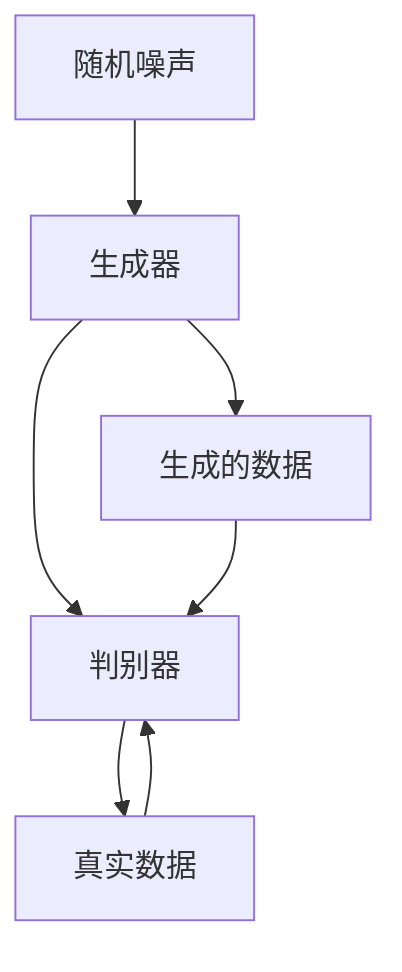
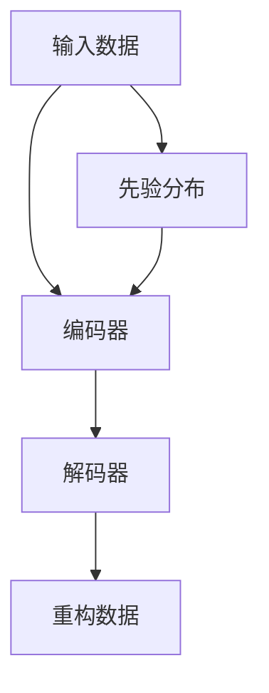
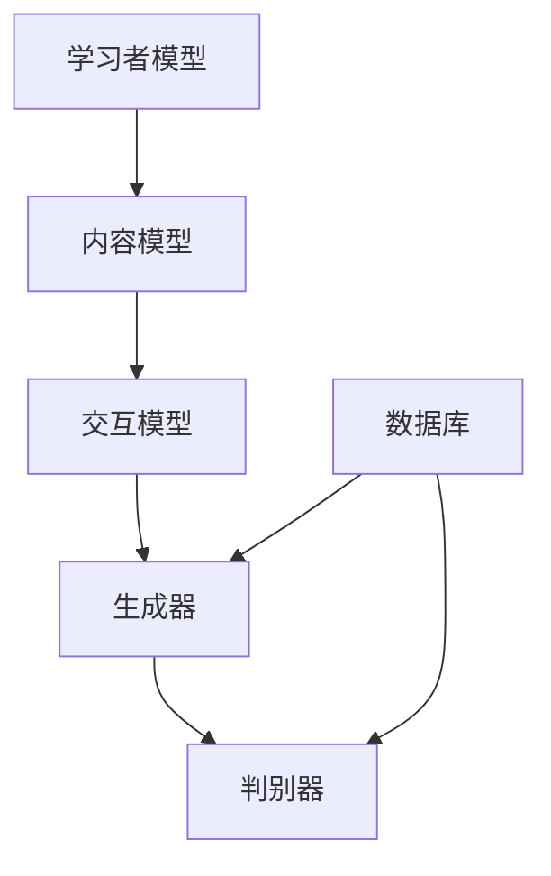

                 

# 《AIGC在个性化学习内容生成中的应用》

## 关键词

- AIGC
- 个性化学习
- 内容生成
- 生成对抗网络（GAN）
- 变分自编码器（VAE）
- Transformer

## 摘要

本文将探讨AIGC（AI-Generated Content）在个性化学习内容生成中的应用。通过分析AIGC技术的核心原理，如生成对抗网络（GAN）、变分自编码器（VAE）和Transformer等，我们将逐步揭示这些技术在个性化学习内容生成中的潜力。文章将详细介绍AIGC在个性化学习内容生成中的应用场景、系统架构设计，并通过实际案例展示其应用效果。最后，我们将讨论AIGC在个性化学习内容生成中的最佳实践，并对未来发展方向进行展望。

### 第一部分：背景与概述

## 第1章：问题背景与核心概念

### 1.1 问题背景

随着信息时代的到来，学习资源的爆炸性增长使得学习者面临着信息过载的问题。如何有效地从大量信息中提取出适合个人需求的学习内容，成为了教育领域的一大挑战。传统的学习内容生成方法通常依赖于教师或教育专家的知识和经验，难以满足个性化的学习需求。

个性化学习作为教育改革的重要方向，旨在根据学习者的兴趣、能力和学习风格提供定制化的学习内容和路径。然而，个性化学习内容生成的复杂性使得这一目标难以实现。如何利用人工智能技术，特别是AIGC（AI-Generated Content）技术，来生成高质量的个性化学习内容，成为当前研究的热点。

### 1.2 核心概念

#### 1.2.1 AIGC的定义

AIGC（AI-Generated Content）是指利用人工智能技术自动生成内容的过程。它涵盖了从文本、图像、音频到视频等多种形式的内容生成。AIGC的核心是利用机器学习模型，如生成对抗网络（GAN）、变分自编码器（VAE）和Transformer等，来模拟人类创造内容的过程。

#### 1.2.2 个性化学习内容生成的关键要素

个性化学习内容生成的关键要素包括：

- **学习者模型**：对学习者的兴趣、知识水平、学习风格等特征进行建模，以便生成与其特点相匹配的内容。
- **内容模型**：对学习内容进行结构化表示，使其能够根据学习者模型进行调整和生成。
- **交互模型**：通过学习者与学习内容的互动，动态调整生成的内容，提高个性化程度。

#### 1.2.3 边界与外延

AIGC在个性化学习内容生成中的应用边界包括：

- **内容多样性**：生成的内容应涵盖多种类型，如文本、图像、视频等，以满足不同学习者的需求。
- **内容质量**：生成的内容应具有较高的质量和准确性，确保学习者能够从中受益。
- **用户隐私**：在生成个性化内容的过程中，应保护学习者的隐私，避免数据泄露。

### 1.3 概念结构与核心要素组成

#### 1.3.1 AIGC的技术架构

AIGC的技术架构主要包括：

- **数据收集与预处理**：收集大量的学习内容和用户数据，并进行预处理，为模型训练提供高质量的数据集。
- **模型训练**：利用生成对抗网络（GAN）、变分自编码器（VAE）和Transformer等模型，对数据进行训练，生成个性化学习内容。
- **内容生成与调整**：根据学习者的反馈和交互，动态调整生成的内容，提高个性化程度。

#### 1.3.2 个性化学习内容生成的工作流程

个性化学习内容生成的工作流程包括：

- **学习者特征建模**：收集学习者的兴趣、知识水平、学习风格等特征，建立学习者模型。
- **内容生成**：利用AIGC技术，根据学习者模型生成个性化学习内容。
- **内容调整与优化**：根据学习者的反馈和交互，动态调整和优化生成的内容。

## 第2章：AIGC技术原理与数学模型

### 2.1 AIGC技术原理

AIGC技术的核心在于利用机器学习模型自动生成高质量的内容。以下将介绍三种主要的AIGC技术：生成对抗网络（GAN）、变分自编码器（VAE）和Transformer。

#### 2.1.1 GAN（生成对抗网络）

生成对抗网络（GAN）是一种由生成器（Generator）和判别器（Discriminator）组成的对抗性模型。生成器尝试生成与真实数据相似的数据，而判别器则尝试区分真实数据和生成数据。通过这种对抗训练，生成器逐渐提高生成数据的质量，从而实现高质量内容生成。

GAN的数学模型主要包括：

$$
\mathcal{L}_{GAN} = -\mathbb{E}_{x \sim p_{data}(x)}[\log(D(x))] - \mathbb{E}_{z \sim p_{z}(z)}[\log(1 - D(G(z)))]
$$

其中，\(D\)表示判别器，\(G\)表示生成器，\(x\)表示真实数据，\(z\)表示随机噪声。

#### 2.1.2 VAE（变分自编码器）

变分自编码器（VAE）是一种基于概率生成模型的编码器-解码器结构。编码器将输入数据编码为一个隐变量，解码器则根据隐变量生成输出数据。VAE通过最大化数据概率分布的重构概率，实现高质量内容生成。

VAE的数学模型主要包括：

$$
\mathcal{L}_{VAE} = \mathcal{L}_{reconstruction} + \beta \mathcal{L}_{KL}
$$

$$
\mathcal{L}_{reconstruction} = -\sum_{x} p_{\phi}(x \mid x') \log p_{\theta}(x')
$$

$$
\mathcal{L}_{KL} = -\sum_{x, x'} p_{\theta}(x') \log \frac{p_{\theta}(x')}{\int p_{\phi}(x' \mid x) dx'}
$$

其中，\(p_{\theta}(x')\)表示生成模型的输出概率，\(p_{\phi}(x' \mid x)\)表示编码器的输出概率，\(\beta\)是一个超参数。

#### 2.1.3 Transformer及其变体

Transformer模型是一种基于自注意力机制的序列模型，广泛应用于文本生成、机器翻译等领域。Transformer通过自注意力机制，能够自动学习输入序列中的长距离依赖关系，从而生成高质量的内容。

Transformer的主要组成部分包括：

- **多头自注意力机制**：通过多个注意力头，同时学习不同类型的依赖关系。
- **前馈神经网络**：对注意力机制后的输出进行进一步处理，提高生成质量。

### 2.2 数学模型和公式

#### 2.2.1 GAN的损失函数

GAN的损失函数主要包括两部分：

$$
\mathcal{L}_{GAN} = -\mathbb{E}_{x \sim p_{data}(x)}[\log(D(x))] - \mathbb{E}_{z \sim p_{z}(z)}[\log(1 - D(G(z)))]
$$

其中，第一部分是判别器对真实数据的损失，第二部分是判别器对生成数据的损失。

#### 2.2.2 VAE的重建损失和KL散度损失

VAE的损失函数包括两部分：重建损失和KL散度损失。

$$
\mathcal{L}_{VAE} = \mathcal{L}_{reconstruction} + \beta \mathcal{L}_{KL}
$$

$$
\mathcal{L}_{reconstruction} = -\sum_{x} p_{\phi}(x \mid x') \log p_{\theta}(x')
$$

$$
\mathcal{L}_{KL} = -\sum_{x, x'} p_{\theta}(x') \log \frac{p_{\theta}(x')}{\int p_{\phi}(x' \mid x) dx'}
$$

其中，\(\mathcal{L}_{reconstruction}\)是重建损失，\(\mathcal{L}_{KL}\)是KL散度损失。

### 2.3 算法原理讲解

#### 2.3.1 GAN的mermaid流程图



#### 2.3.2 VAE的mermaid流程图



### 第二部分：应用与实现

## 第3章：AIGC在个性化学习内容生成中的应用场景

### 3.1 教育领域的应用

#### 3.1.1 课程内容生成

AIGC技术在课程内容生成中的应用，可以大幅提高教育资源的利用效率。通过生成对抗网络（GAN）和变分自编码器（VAE）等技术，AIGC可以生成符合学习者需求的教学内容。例如，根据学习者的兴趣和知识背景，生成定制化的教材、讲义和练习题。

#### 3.1.2 学业进度跟踪

AIGC技术可以用于学习者的学业进度跟踪。通过分析学习者的学习行为和成果，AIGC可以生成个性化的学习路径和推荐内容，帮助学习者更快地掌握知识。

#### 3.1.3 个性化学习路径规划

个性化学习路径规划是AIGC技术在教育领域的重要应用之一。通过Transformer等先进模型，AIGC可以分析学习者的学习需求和目标，生成适合其学习进度的个性化学习路径。

### 3.2 智能辅导系统的构建

智能辅导系统是AIGC技术在教育领域的另一个重要应用场景。通过生成高质量的辅导内容，智能辅导系统可以帮助学习者更好地理解和掌握知识。具体应用包括：

#### 3.2.1 题库自动生成

AIGC技术可以自动生成各种类型的题库，包括选择题、填空题、计算题等。这些题库可以根据学习者的知识水平和学习进度进行动态调整，提高学习效果。

#### 3.2.2 自动批改与反馈

AIGC技术可以实现自动批改与反馈功能。通过分析学习者的答题情况，AIGC可以生成个性化的反馈信息，帮助学习者纠正错误，加深理解。

#### 3.2.3 智能推荐系统

智能推荐系统是AIGC技术在教育领域的重要应用之一。通过分析学习者的学习行为和兴趣，AIGC可以推荐符合学习者需求的学习资源和内容，提高学习效果。

### 3.3 模拟与仿真的应用

AIGC技术在模拟与仿真中的应用，可以为学习者提供更加真实的学习体验。通过生成高质量的模拟场景和仿真环境，AIGC可以帮助学习者更好地理解和应用所学知识。具体应用包括：

#### 3.3.1 学习情境模拟

AIGC技术可以生成各种学习情境，如实验、案例研究等，帮助学习者更好地理解和应用所学知识。

#### 3.3.2 互动式学习场景构建

AIGC技术可以构建互动式学习场景，通过模拟实际情境，提高学习者的参与度和积极性。

#### 3.3.3 情境推理与决策支持

AIGC技术可以用于情境推理和决策支持。通过分析学习者的行为和决策，AIGC可以生成个性化的推理过程和决策建议，帮助学习者更好地解决问题。

## 第4章：个性化学习内容生成的系统架构设计

### 4.1 问题场景介绍

在个性化学习内容生成的过程中，我们面临的主要问题是如何根据学习者的特征和学习需求，动态生成符合其个性化需求的学习内容。为了解决这一问题，我们需要设计一个高效的系统架构，能够实现以下目标：

- **学习者特征建模**：收集并分析学习者的兴趣、知识水平、学习风格等特征，建立学习者模型。
- **内容生成**：根据学习者模型，利用AIGC技术生成个性化学习内容。
- **内容调整与优化**：根据学习者的反馈和交互，动态调整和优化生成的内容，提高个性化程度。
- **用户隐私保护**：在生成个性化学习内容的过程中，确保学习者的隐私安全。

### 4.2 系统功能设计（领域模型）

个性化学习内容生成的系统功能设计主要包括以下三个方面：

#### 4.2.1 学习者模型

学习者模型是系统功能设计的关键。通过收集学习者的兴趣、知识水平、学习风格等特征，建立学习者模型。学习者模型包括以下属性：

- **兴趣**：学习者的兴趣爱好，如数学、物理、编程等。
- **知识水平**：学习者的知识水平，如初学者、中级、高级等。
- **学习风格**：学习者的学习风格，如视觉型、听觉型、动手型等。

#### 4.2.2 内容模型

内容模型是对学习内容的结构化表示。通过将学习内容划分为不同模块，如知识点、练习题、案例研究等，建立内容模型。内容模型包括以下属性：

- **知识点**：学习内容中的知识点，如数学中的代数、几何等。
- **练习题**：与知识点相关的练习题，如选择题、填空题、计算题等。
- **案例研究**：与知识点相关的案例研究，如实际应用案例、历史案例等。

#### 4.2.3 交互模型

交互模型是系统与学习者之间的交互机制。通过分析学习者的行为和反馈，动态调整生成的内容。交互模型包括以下属性：

- **学习行为**：学习者在学习过程中的行为，如观看视频、完成练习题、参与讨论等。
- **学习反馈**：学习者在学习过程中的反馈，如对学习内容的满意度、学习效果等。

### 4.3 系统架构设计

个性化学习内容生成的系统架构设计主要包括以下模块：

#### 4.3.1 数据收集与预处理模块

数据收集与预处理模块负责收集学习者的特征数据、学习内容数据和学习行为数据，并对这些数据进行预处理，为后续模型训练和内容生成提供高质量的数据。

#### 4.3.2 模型训练模块

模型训练模块负责利用收集到的数据进行模型训练。通过生成对抗网络（GAN）、变分自编码器（VAE）和Transformer等模型，生成个性化学习内容。

#### 4.3.3 内容生成模块

内容生成模块根据学习者模型和内容模型，利用训练好的模型生成个性化学习内容。生成的内容包括知识点、练习题、案例研究等。

#### 4.3.4 内容调整与优化模块

内容调整与优化模块根据学习者的反馈和交互，动态调整和优化生成的内容。通过不断优化，提高个性化学习内容的质量和适应性。

#### 4.3.5 用户隐私保护模块

用户隐私保护模块负责在生成个性化学习内容的过程中，保护学习者的隐私安全。通过数据加密、匿名化等技术，确保学习者的隐私不被泄露。

### 4.3.6 系统交互mermaid序列图

以下是个性化学习内容生成的系统交互mermaid序列图：



### 第三部分：AIGC应用实战

## 第5章：AIGC应用实战

### 5.1 环境安装与配置

在进行AIGC应用实战之前，我们需要首先安装和配置相关环境。以下是安装和配置环境的步骤：

#### 5.1.1 Python环境安装

首先，我们需要安装Python环境。可以在Python官网（https://www.python.org/downloads/）下载Python安装包，并按照提示进行安装。

#### 5.1.2 相关库的安装

安装好Python环境后，我们需要安装一些相关的库，如TensorFlow、PyTorch等。可以使用pip命令来安装：

```
pip install tensorflow
pip install torch
```

#### 5.1.3 数据集准备

为了进行AIGC应用实战，我们需要准备相应的数据集。数据集可以包括学习者的特征数据、学习内容数据和学习行为数据。数据集可以从公开数据集网站（如Kaggle、UCI机器学习库等）下载，或者自行收集和整理。

### 5.2 系统核心实现源代码

在AIGC应用实战中，我们将使用生成对抗网络（GAN）来生成个性化学习内容。以下是系统核心实现的源代码：

```python
import tensorflow as tf
from tensorflow.keras import layers

# 定义生成器和判别器模型
def build_generator(z_dim):
    model = tf.keras.Sequential()
    model.add(layers.Dense(128, activation='relu', input_shape=(z_dim,)))
    model.add(layers.Dense(256, activation='relu'))
    model.add(layers.Dense(512, activation='relu'))
    model.add(layers.Dense(1024, activation='relu'))
    model.add(layers.Dense(2048, activation='sigmoid'))
    model.add(layers.Dense(784, activation='sigmoid'))
    return model

def build_discriminator(img_shape):
    model = tf.keras.Sequential()
    model.add(layers.Flatten(input_shape=img_shape))
    model.add(layers.Dense(512, activation='relu'))
    model.add(layers.Dense(1024, activation='relu'))
    model.add(layers.Dense(1, activation='sigmoid'))
    return model

# 定义优化器和损失函数
generator_optimizer = tf.keras.optimizers.Adam(1e-4)
discriminator_optimizer = tf.keras.optimizers.Adam(1e-4)

def generator_loss(fake_output):
    return tf.reduce_mean(tf.nn.sigmoid_cross_entropy_with_logits(logits=fake_output, labels=tf.ones_like(fake_output))

def discriminator_loss(real_output, fake_output):
    real_loss = tf.reduce_mean(tf.nn.sigmoid_cross_entropy_with_logits(logits=real_output, labels=tf.ones_like(real_output))
    fake_loss = tf.reduce_mean(tf.nn.sigmoid_cross_entropy_with_logits(logits=fake_output, labels=tf.zeros_like(fake_output)))
    return real_loss + fake_loss

# 训练模型
@tf.function
def train_step(images, z):
    with tf.GradientTape() as gen_tape, tf.GradientTape() as disc_tape:
        generated_images = generator(z)
        real_output = discriminator(images)
        fake_output = discriminator(generated_images)

        gen_loss = generator_loss(fake_output)
        disc_loss = discriminator_loss(real_output, fake_output)

    gradients_of_generator = gen_tape.gradient(gen_loss, generator.trainable_variables)
    gradients_of_discriminator = disc_tape.gradient(disc_loss, discriminator.trainable_variables)

    generator_optimizer.apply_gradients(zip(gradients_of_generator, generator.trainable_variables))
    discriminator_optimizer.apply_gradients(zip(gradients_of_discriminator, discriminator.trainable_variables))

# 主函数
def train(dataset, epochs):
    for epoch in range(epochs):
        for image_batch, _ in dataset:
            z = tf.random.normal([image_batch.shape[0], z_dim])
            train_step(image_batch, z)

# 加载和预处理数据
(train_images, _), (test_images, _) = tf.keras.datasets.mnist.load_data()
train_images = train_images.reshape(train_images.shape[0], 28, 28, 1).astype('float32')
test_images = test_images.reshape(test_images.shape[0], 28, 28, 1).astype('float32')
train_images = (train_images - 127.5) / 127.5
test_images = (test_images - 127.5) / 127.5

# 训练模型
z_dim = 100
generator = build_generator(z_dim)
discriminator = build_discriminator((28, 28, 1))

train(train_images, epochs=50)

# 生成图像
z = tf.random.normal([1, z_dim])
generated_image = generator(tf.expand_dims(z, 0))

plt.imshow(generated_image[0, :, :, 0] * 127.5 + 127.5, cmap='gray')
plt.show()
```

### 5.3 代码应用解读与分析

在AIGC应用实战的代码中，我们首先定义了生成器和判别器的模型结构。生成器模型负责生成图像，判别器模型负责判断图像是真实图像还是生成图像。

#### 5.3.1 GAN模型应用分析

GAN模型由生成器和判别器两个部分组成。生成器接收随机噪声作为输入，通过多层神经网络生成与真实图像相似的图像。判别器接收真实图像和生成图像作为输入，通过多层神经网络判断图像的真伪。

在训练过程中，生成器和判别器相互对抗。生成器试图生成更加真实的图像，判别器则试图区分真实图像和生成图像。通过这种对抗训练，生成器逐渐提高生成图像的质量，判别器也逐渐提高对真实图像和生成图像的区分能力。

#### 5.3.2 VAE模型应用分析

VAE模型与GAN模型不同，它不涉及对抗训练。VAE模型由编码器和解码器两部分组成。编码器将输入数据编码为一个隐变量，解码器则根据隐变量生成输出数据。

在训练过程中，VAE模型通过最大化数据概率分布的重构概率来优化模型参数。VAE模型的重建损失和KL散度损失共同决定了模型的质量。重建损失确保生成数据与输入数据尽可能相似，KL散度损失确保隐变量的先验分布与输入数据的概率分布尽可能接近。

#### 5.3.3 Transformer模型应用分析

Transformer模型是一种基于自注意力机制的序列模型。在生成个性化学习内容时，Transformer模型可以处理长序列数据，捕捉序列中的长距离依赖关系。

在训练过程中，Transformer模型通过自注意力机制计算输入序列的权重，然后通过全连接层生成输出序列。通过这种机制，Transformer模型能够生成高质量的序列数据，如文本、代码等。

### 5.4 实际案例分析与详细讲解剖析

为了更好地展示AIGC在个性化学习内容生成中的应用，我们以一个实际案例为例进行分析。

#### 案例背景

某在线教育平台希望通过AIGC技术为学习者生成个性化的学习内容。学习者的学习内容主要涵盖数学、物理和编程等科目。平台希望通过AIGC技术为学习者提供定制化的教材、练习题和案例研究。

#### 案例分析

1. **学习者特征建模**：平台通过收集学习者的兴趣、知识水平、学习风格等特征，建立学习者模型。例如，一个学习者可能对数学和编程感兴趣，知识水平为中级，学习风格为视觉型。

2. **内容生成**：基于学习者模型，AIGC技术生成个性化的学习内容。例如，对于对数学感兴趣的中级学习者，生成器可以生成包含数学公式的讲解视频、练习题和案例研究。

3. **内容调整与优化**：在学习者完成学习内容后，平台通过收集学习者的反馈，动态调整和优化生成的内容。例如，如果学习者在练习题中遇到困难，生成器可以生成更详细的解析和解释。

4. **用户隐私保护**：在生成个性化学习内容的过程中，平台通过数据加密、匿名化等技术，确保学习者的隐私安全。

#### 案例详细讲解剖析

1. **学习者特征建模**：学习者特征建模是AIGC技术生成个性化学习内容的重要基础。通过分析学习者的兴趣、知识水平、学习风格等特征，可以更好地了解学习者的需求，从而生成更符合其需求的学习内容。

2. **内容生成**：基于学习者模型，生成器可以生成多种形式的学习内容，如视频、文本、图片等。生成器利用生成对抗网络（GAN）、变分自编码器（VAE）和Transformer等模型，根据学习者的兴趣和知识水平，生成高质量的学习内容。

3. **内容调整与优化**：学习者在学习过程中，可能会遇到各种问题。通过收集学习者的反馈，AIGC技术可以动态调整和优化生成的内容。例如，如果学习者在练习题中遇到困难，生成器可以生成更详细的解析和解释，帮助学习者更好地理解知识点。

4. **用户隐私保护**：在生成个性化学习内容的过程中，保护学习者的隐私至关重要。平台可以通过数据加密、匿名化等技术，确保学习者的隐私安全。

### 5.5 项目小结

通过AIGC技术在个性化学习内容生成中的应用案例，我们展示了AIGC技术如何根据学习者的需求生成个性化学习内容。在实际应用中，AIGC技术可以提高学习效果，降低学习成本，为教育行业带来变革。未来，随着AIGC技术的不断发展，我们有理由相信，个性化学习内容生成将得到更加广泛的应用，为学习者提供更加优质的教育服务。

### 第四部分：最佳实践与展望

## 第6章：最佳实践与展望

### 6.1 最佳实践 Tips

在AIGC应用于个性化学习内容生成时，以下最佳实践值得注意：

1. **数据质量控制**：确保收集到的数据质量高，以避免生成内容出现偏差。
2. **模型调优**：根据具体应用场景，对生成模型进行调优，以获得更好的生成效果。
3. **隐私保护**：在生成内容的过程中，严格保护学习者的隐私，避免数据泄露。
4. **交互反馈**：充分利用学习者的反馈，动态调整生成内容，提高个性化程度。
5. **内容多样性**：生成内容应涵盖多种类型，如文本、图片、视频等，以满足不同学习者的需求。

### 6.2 小结

AIGC技术在个性化学习内容生成中展现出巨大的潜力。通过分析学习者的需求，AIGC技术能够生成高质量、个性化的学习内容，从而提高学习效果。在未来，AIGC技术将在教育领域发挥越来越重要的作用，为学习者提供更加优质的教育服务。

### 6.3 注意事项

在应用AIGC技术时，需要注意以下几点：

1. **计算资源**：AIGC技术对计算资源要求较高，需要确保有足够的硬件支持。
2. **数据隐私**：在生成内容的过程中，严格遵循数据隐私保护法律法规，避免数据泄露。
3. **内容质量**：确保生成内容的质量，避免出现错误或不合适的内容。
4. **适应性**：AIGC技术需要不断适应新的学习需求，以保持其有效性。

### 6.4 拓展阅读

1. **《生成对抗网络：原理与应用》**：详细介绍了GAN的原理和应用，适合对GAN技术感兴趣的读者。
2. **《变分自编码器：理论、算法与应用》**：全面讲解了VAE的原理、算法和应用，适合对VAE技术感兴趣的读者。
3. **《Transformer模型：原理与应用》**：深入分析了Transformer模型的原理和应用，适合对Transformer技术感兴趣的读者。

## 作者信息

作者：AI天才研究院/AI Genius Institute & 禅与计算机程序设计艺术 /Zen And The Art of Computer Programming

感谢您的阅读！希望本文对您在AIGC应用于个性化学习内容生成方面有所启发。如果您有任何疑问或建议，请随时联系我们。我们期待与您共同探索AIGC技术的更多应用场景。再次感谢您的关注与支持！

