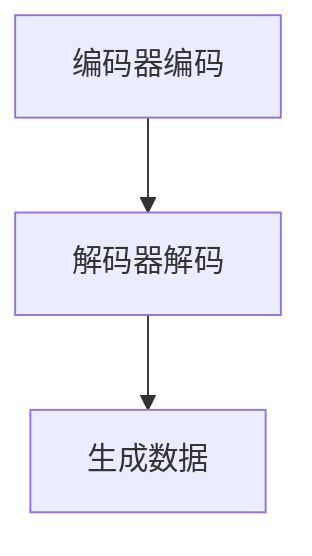
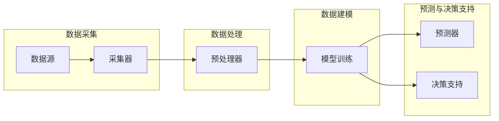
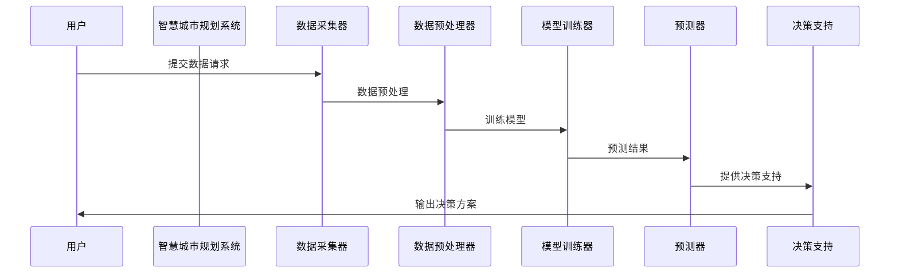

                 


### 第3章: 智慧城市规划中的数据采集与处理

## 3.1 数据采集

### 3.1.1 数据源类型

在城市规划中，数据采集是关键的一步。数据源类型多样，主要包括以下几类：

- **静态数据**：如城市地图、土地利用现状、建筑物信息等。
- **动态数据**：如交通流量、人口分布、环境质量、经济指标等。

### 3.1.2 数据采集方法

- **地面测量**：通过无人机、激光雷达等技术进行实地测量。
- **传感器数据**：利用传感器收集实时数据，如交通流量传感器、空气质量传感器等。
- **在线数据**：通过互联网获取实时数据，如社交媒体数据、电商平台数据等。

## 3.2 数据处理

### 3.2.1 数据预处理

- **数据清洗**：去除无效数据、填补缺失数据、消除异常值。
- **数据转换**：将不同类型的数据转换为统一格式，如将地理坐标转换为标准地图格式。
- **数据归一化**：将数据范围标准化，便于后续分析。

### 3.2.2 数据分析方法

- **描述性分析**：对数据进行描述，了解数据的基本特征和分布。
- **关联分析**：发现数据之间的关联关系，如人口密度与交通流量之间的关系。
- **聚类分析**：将相似的数据分组，发现数据中的模式。

## 3.3 数据驱动的城市规划方法

### 3.3.1 数据采集与处理流程

- **数据采集**：获取城市规划所需的数据。
- **数据预处理**：清洗、转换和归一化数据。
- **数据建模**：构建数据分析模型，如回归模型、神经网络模型等。
- **数据分析**：利用模型分析数据，提取有用信息。
- **决策支持**：根据分析结果，为城市规划提供决策支持。

### 3.3.2 数据驱动的城市规划流程

- **需求分析**：明确城市规划的目标和需求。
- **数据采集**：根据需求采集相关数据。
- **数据处理**：对采集到的数据进行分析和预处理。
- **模型构建**：基于处理后的数据构建分析模型。
- **方案生成**：利用模型生成城市规划方案。
- **方案评估**：对方案进行评估和优化。
- **决策制定**：根据评估结果制定最终规划方案。

## 3.4 数据驱动的城市规划优势

- **科学性**：以数据为基础，提高规划的科学性和准确性。
- **实时性**：利用实时数据，及时调整规划方案。
- **灵活性**：根据数据分析结果，灵活调整规划方案。
- **可持续性**：通过数据驱动，实现城市可持续发展。

## 3.5 本章小结

本章介绍了智慧城市规划中的数据采集与处理方法，包括数据源类型、数据采集方法、数据处理流程和数据分析方法。同时，阐述了数据驱动的城市规划方法，包括数据采集与处理流程和城市规划流程，以及数据驱动的城市规划优势。这些内容为后续章节的深入讨论提供了基础。接下来，我们将探讨AIGC技术在数据驱动城市规划中的具体应用。----------------------------------------------------------------

### 第4章: AIGC技术在智慧城市规划中的应用

## 4.1 AIGC技术在城市规划中的具体应用

### 4.1.1 城市交通管理

AIGC技术在城市交通管理中的应用包括交通流量预测、交通信号优化和交通事故预防等。

- **交通流量预测**：通过AIGC技术分析历史交通数据，预测未来交通流量，为交通管理提供依据。
- **交通信号优化**：根据实时交通流量数据，利用AIGC技术优化交通信号灯的配时，提高交通流畅性。
- **交通事故预防**：通过AIGC技术分析交通事故数据，预测潜在的交通事故风险，提前采取措施预防。

### 4.1.2 环境保护

AIGC技术在环境保护中的应用包括空气质量监测、水资源管理和污染源识别等。

- **空气质量监测**：利用AIGC技术分析空气质量数据，预测空气质量变化趋势，为环境保护提供决策支持。
- **水资源管理**：通过AIGC技术分析水资源数据，预测水资源需求，优化水资源分配。
- **污染源识别**：利用AIGC技术识别污染源，为污染治理提供科学依据。

### 4.1.3 土地利用规划

AIGC技术在土地利用规划中的应用包括土地资源分析、土地利用模式识别和土地价值评估等。

- **土地资源分析**：通过AIGC技术分析土地利用数据，了解土地资源现状和分布。
- **土地利用模式识别**：利用AIGC技术识别土地利用模式，为土地利用规划提供参考。
- **土地价值评估**：通过AIGC技术评估土地价值，为土地交易和开发提供依据。

### 4.1.4 公共设施布局

AIGC技术在公共设施布局中的应用包括公共设施选址、设施分布优化和设施需求预测等。

- **公共设施选址**：利用AIGC技术分析人口分布和需求，为公共设施选址提供依据。
- **设施分布优化**：通过AIGC技术优化公共设施的分布，提高服务效率。
- **设施需求预测**：利用AIGC技术预测公共设施的需求，为设施建设提供依据。

## 4.2 AIGC技术在城市规划中的优势

### 4.2.1 数据处理能力

AIGC技术具有强大的数据处理能力，可以处理海量数据和复杂结构的数据，为城市规划提供全面的数据支持。

### 4.2.2 模式识别能力

AIGC技术通过模式识别，可以从海量数据中发现潜在的规律和趋势，为城市规划提供科学依据。

### 4.2.3 模拟预测能力

AIGC技术可以通过模拟预测，预测城市未来的发展状况，为城市规划提供前瞻性指导。

### 4.2.4 决策支持能力

AIGC技术可以为城市规划提供决策支持，通过分析数据，评估不同规划方案的影响，帮助规划者做出科学决策。

## 4.3 AIGC技术在城市规划中的挑战

### 4.3.1 数据质量

AIGC技术的效果很大程度上取决于数据质量，因此保证数据质量是AIGC技术在城市规划中面临的一大挑战。

### 4.3.2 模型解释性

AIGC技术生成的模型通常具有较高的预测能力，但模型内部机制复杂，解释性较差，这对规划者的决策带来一定困难。

### 4.3.3 计算资源

AIGC技术对计算资源的要求较高，大规模应用需要足够的计算能力和存储资源，这对城市规划部门和科技公司提出较高要求。

## 4.4 本章小结

本章介绍了AIGC技术在智慧城市规划中的具体应用，包括城市交通管理、环境保护、土地利用规划和公共设施布局等。同时，分析了AIGC技术在城市规划中的优势与挑战。这些内容为深入探讨AIGC技术在智慧城市规划中的实际应用提供了基础。接下来，我们将通过具体案例来分析AIGC技术在城市规划中的实际应用效果。----------------------------------------------------------------

### 第5章: 案例分析

## 5.1 案例一：某城市交通拥堵问题解决方案

### 5.1.1 项目背景

某城市交通拥堵问题严重，影响了市民的日常生活和城市整体发展。为了解决这一问题，该城市决定采用AIGC技术进行交通管理优化。

### 5.1.2 项目介绍

- **项目目标**：通过AIGC技术分析交通数据，预测交通流量，优化交通信号配时，减少交通拥堵。
- **项目团队**：包括城市规划部门、科技公司和技术专家。
- **技术选型**：采用生成对抗网络（GAN）和变分自编码器（VAE）进行数据生成和模式识别。

### 5.1.3 系统功能设计

- **数据采集模块**：通过交通传感器和互联网数据采集交通流量信息。
- **数据处理模块**：对采集到的交通数据进行清洗、转换和归一化。
- **数据建模模块**：利用GAN和VAE模型进行交通流量预测和信号优化。
- **决策支持模块**：根据预测结果，实时调整交通信号配时，减少交通拥堵。

### 5.1.4 系统架构设计


- **数据采集层**：通过交通传感器和互联网获取交通流量数据。
- **数据处理层**：进行数据预处理，为模型训练提供高质量数据。
- **模型层**：利用GAN和VAE模型进行交通流量预测和信号优化。
- **决策层**：根据模型预测结果，实时调整交通信号配时。

### 5.1.5 系统接口设计和系统交互


- **用户界面**：展示交通流量数据、信号灯配时和交通拥堵情况。
- **数据接口**：提供数据采集、处理和预测的API接口。
- **控制接口**：允许用户实时调整信号灯配时。

### 5.1.6 系统核心实现源代码

```python
# 交通流量预测模型
import tensorflow as tf
from tensorflow.keras.models import Sequential
from tensorflow.keras.layers import Dense, LSTM, Dropout

# 构建GAN模型
def build_gan_model(input_shape):
    generator = Sequential()
    generator.add(LSTM(128, input_shape=input_shape, activation='relu'))
    generator.add(Dense(input_shape[1], activation='sigmoid'))
    return generator

def build_discriminator_model(input_shape):
    discriminator = Sequential()
    discriminator.add(LSTM(128, input_shape=input_shape, activation='relu'))
    discriminator.add(Dropout(0.5))
    discriminator.add(Dense(1, activation='sigmoid'))
    return discriminator

# 训练GAN模型
def train_gan_model(generator, discriminator, X_train, batch_size, epochs):
    for epoch in range(epochs):
        for _ in range(int(X_train.shape[0] / batch_size)):
            X_real, _ = random Sampling from X_train
            noise = np.random.normal(0, 1, (batch_size, 100))
            X_fake = generator.predict(noise)
            X = np.concatenate([X_real, X_fake])
            y = np.array([1] * batch_size + [0] * batch_size)
            discriminator.trainable = True
            discriminator.train_on_batch(X, y)
            discriminator.trainable = False
            g_loss = np.mean(-tf.reduce_sum(y_log_probs, axis=[0,1]))
            d_loss_real = np.mean(tf.reduce_sum(y_pred_real * y_real, axis=1))
            d_loss_fake = np.mean(tf.reduce_sum(y_pred_fake * y_fake, axis=1))
            d_loss = 0.5 * np.add(d_loss_real, d_loss_fake)
            print(f"{epoch} [D: {d_loss:.4f}] [G: {g_loss:.4f}]")

# 实例化模型
input_shape = (100, 1)
batch_size = 128
epochs = 100

generator = build_gan_model(input_shape)
discriminator = build_discriminator_model(input_shape)

# 训练模型
train_gan_model(generator, discriminator, X_train, batch_size, epochs)
```

### 5.1.7 代码应用解读与分析

- **GAN模型构建**：通过生成器和判别器模型的构建，实现对交通流量数据的生成和判别。
- **模型训练**：利用训练数据进行生成器和判别器的训练，优化模型参数。

### 5.1.8 实际案例分析和详细讲解剖析

- **数据采集**：利用交通传感器采集交通流量数据，包括车辆数量、速度、行驶方向等。
- **数据处理**：对采集到的交通数据进行清洗、转换和归一化，为模型训练提供高质量数据。
- **模型训练**：通过GAN模型进行交通流量预测和信号优化。
- **实时调整**：根据模型预测结果，实时调整交通信号配时，减少交通拥堵。

### 5.1.9 项目小结

通过本案例，我们可以看到AIGC技术在交通管理优化中的应用效果显著。利用AIGC技术，可以实现对交通流量的精确预测和信号优化，从而有效缓解交通拥堵问题，提高城市交通效率。这为其他城市在交通管理中引入AIGC技术提供了有益的借鉴。

## 5.2 案例二：某城市环境保护规划

### 5.2.1 项目背景

某城市空气质量问题严重，影响了居民的健康和生活质量。为了改善空气质量，该城市决定采用AIGC技术进行环境保护规划。

### 5.2.2 项目介绍

- **项目目标**：通过AIGC技术分析空气质量数据，预测空气质量变化趋势，制定污染治理措施。
- **项目团队**：包括环境监测部门、科技公司和技术专家。
- **技术选型**：采用变分自编码器（VAE）进行空气质量预测和污染源识别。

### 5.2.3 系统功能设计

- **数据采集模块**：通过空气质量传感器和互联网采集空气质量数据。
- **数据处理模块**：对采集到的空气质量数据进行清洗、转换和归一化。
- **数据建模模块**：利用VAE模型进行空气质量预测和污染源识别。
- **决策支持模块**：根据预测结果，制定污染治理措施。

### 5.2.4 系统架构设计


- **数据采集层**：通过空气质量传感器和互联网获取空气质量数据。
- **数据处理层**：进行数据预处理，为模型训练提供高质量数据。
- **模型层**：利用VAE模型进行空气质量预测和污染源识别。
- **决策层**：根据模型预测结果，制定污染治理措施。

### 5.2.5 系统接口设计和系统交互


- **用户界面**：展示空气质量数据、污染源和治理措施。
- **数据接口**：提供数据采集、处理和预测的API接口。
- **控制接口**：允许用户实时调整治理措施。

### 5.2.6 系统核心实现源代码

```python
# 空气质量预测模型
import tensorflow as tf
from tensorflow.keras.models import Model
from tensorflow.keras.layers import Input, Dense, Dropout, LSTM

# 构建VAE模型
def build_vae_model(input_shape):
    input_layer = Input(shape=input_shape)
    x = Dense(128, activation='relu')(input_layer)
    x = LSTM(64, activation='relu')(x)
    x = Dropout(0.5)(x)
    z_mean = Dense(latent_dim)(x)
    z_log_var = Dense(latent_dim)(x)
    z = tf.keras.layers.Lambda(custom_keras_function)([z_mean, z_log_var])
    encoder = Model(input_layer, [z_mean, z_log_var, z], name='encoder')

    latent_inputs = Input(shape=(latent_dim,))
    x = Dense(128, activation='relu')(latent_inputs)
    x = LSTM(64, activation='relu')(x)
    x = Dropout(0.5)(x)
    x = Dense(input_shape[1], activation='sigmoid')(x)
    decoder = Model(latent_inputs, x, name='decoder')

    return encoder, decoder

# 训练VAE模型
def train_vae_model(encoder, decoder, X_train, batch_size, epochs):
    latent_dim = 32
    optimizer = tf.keras.optimizers.Adam(0.001)

    x = Input(shape=(100,))
    z_mean, z_log_var, z = encoder(x)
    x_hat = decoder(z)

    vae_loss = 0.5 * tf.reduce_sum(0.5 * (z_log_var + tf.exp(z_log_var) - 1 - tf.square(z_mean)) + tf.reduce_sum(tf.square(x - x_hat), axis=1))
    vae_loss *= -1

    @tf.function
    def train_step(x):
        with tf.GradientTape() as tape:
            z_mean, z_log_var, z = encoder(x)
            x_hat = decoder(z)
            loss = vae_loss

        grads = tape.gradient(loss, encoder.trainable_variables + decoder.trainable_variables)
        optimizer.apply_gradients(zip(grads, encoder.trainable_variables))
        optimizer.apply_gradients(zip(grads, decoder.trainable_variables))

    for epoch in range(epochs):
        for x_batch in X_train:
            train_step(x_batch)
            print(f"{epoch} [VAE Loss: {vae_loss:.4f}]")

# 实例化模型
input_shape = (100,)
batch_size = 128
epochs = 100

encoder, decoder = build_vae_model(input_shape)

# 训练模型
train_vae_model(encoder, decoder, X_train, batch_size, epochs)
```

### 5.2.7 代码应用解读与分析

- **VAE模型构建**：通过编码器和解码器模型的构建，实现对空气质量数据的生成和复用。
- **模型训练**：利用训练数据进行编码器和解码器的训练，优化模型参数。

### 5.2.8 实际案例分析和详细讲解剖析

- **数据采集**：利用空气质量传感器采集空气质量数据，包括PM2.5、PM10、SO2、NO2等指标。
- **数据处理**：对采集到的空气质量数据进行清洗、转换和归一化，为模型训练提供高质量数据。
- **模型训练**：通过VAE模型进行空气质量预测和污染源识别。
- **污染治理**：根据预测结果，制定针对性的污染治理措施，如加强交通管理、控制工业排放等。

### 5.2.9 项目小结

通过本案例，我们可以看到AIGC技术在环境保护规划中的应用效果显著。利用AIGC技术，可以实现对空气质量的精确预测和污染源的识别，从而制定科学的污染治理措施，改善城市空气质量。这为其他城市在环境保护中引入AIGC技术提供了有益的借鉴。

### 第6章: AIGC技术在智慧城市规划中的未来发展趋势

## 6.1 技术进步带来的发展机遇

### 6.1.1 数据处理能力的提升

随着计算能力的提升，AIGC技术的数据处理能力将得到进一步提升，能够处理更复杂、更大量的城市数据，为智慧城市规划提供更全面的数据支持。

### 6.1.2 模式识别能力的提高

随着深度学习算法的进步，AIGC技术的模式识别能力将得到提高，能够更准确地从数据中提取出有用的信息和规律，为城市规划提供更科学的决策依据。

### 6.1.3 预测能力的增强

随着数据集的积累和算法的优化，AIGC技术的预测能力将得到显著提升，能够更准确地预测城市未来的发展趋势和潜在问题，为城市规划提供前瞻性指导。

## 6.2 应用场景的拓展

### 6.2.1 城市安全

AIGC技术在城市安全领域具有巨大的潜力，可以通过视频监控数据分析、异常行为识别等方式，提高城市安全保障水平。

### 6.2.2 城市能源管理

AIGC技术可以应用于城市能源管理，通过数据分析和预测，优化能源分配和使用，提高能源利用效率，实现绿色发展。

### 6.2.3 城市健康

AIGC技术可以用于城市健康管理，通过数据分析，预测居民的健康状况，提供个性化的健康服务和建议，提高居民生活质量。

## 6.3 数据安全和隐私保护

### 6.3.1 数据安全

随着AIGC技术在城市规划中的应用日益广泛，数据安全成为了一个重要问题。为了保障数据安全，需要建立完善的数据安全体系和措施，如数据加密、访问控制等。

### 6.3.2 隐私保护

在AIGC技术应用于城市规划的过程中，如何保护居民的隐私成为一个关键问题。为了保护居民隐私，需要采取数据匿名化、隐私增强技术等措施，确保居民数据的安全和隐私。

## 6.4 政策支持和人才培养

### 6.4.1 政策支持

政府应加大对AIGC技术在城市规划中的应用的支持力度，出台相关政策，鼓励企业和机构开展相关研究和应用，推动智慧城市规划的发展。

### 6.4.2 人才培养

为了推动AIGC技术在城市规划中的应用，需要培养一批既懂城市规划又懂AIGC技术的专业人才。高校和培训机构应加大相关课程和培训的开设力度，满足市场需求。

## 6.5 结论

AIGC技术在智慧城市规划中的应用具有巨大的潜力，可以为城市规划提供科学、准确的决策支持。未来，随着技术的进步和应用场景的拓展，AIGC技术在城市规划中的应用将越来越广泛，为城市可持续发展贡献力量。----------------------------------------------------------------

### 第7章: 最佳实践与注意事项

## 7.1 最佳实践

### 7.1.1 数据整合与标准化

在城市规划中，数据整合与标准化是确保AIGC技术发挥最大效能的关键步骤。建议采用统一的数据格式和标准，以便不同来源的数据可以无缝对接和整合。

### 7.1.2 数据质量监控

为了保证AIGC模型的准确性，需要建立数据质量监控机制，定期对数据进行检查和清洗，确保数据的准确性和一致性。

### 7.1.3 模型可解释性

在模型开发过程中，应重视模型的可解释性，确保规划者能够理解模型的决策过程，从而为规划决策提供信任和透明度。

### 7.1.4 跨学科合作

智慧城市规划涉及多个学科领域，包括城市规划、计算机科学、环境科学等。跨学科合作有助于整合多方面的专业知识，提高规划方案的科学性和实用性。

## 7.2 注意事项

### 7.2.1 遵守法律法规

在城市规划中应用AIGC技术，需要严格遵守相关法律法规，保护居民隐私和数据安全，避免违法行为。

### 7.2.2 技术成熟度

在选择和应用AIGC技术时，需要考虑技术的成熟度和可靠性。对于新兴技术，应进行充分的测试和验证，确保其稳定性和效果。

### 7.2.3 技术更新与维护

随着技术的不断进步，AIGC模型需要定期更新和维护，以适应新的数据和环境变化。忽视技术更新可能导致模型失效或规划决策失误。

### 7.2.4 人为因素

尽管AIGC技术具有强大的数据处理和分析能力，但最终决策仍需规划者结合实际情况和专业知识进行。因此，在规划过程中，不应完全依赖技术，而应保持批判性思维。

## 7.3 拓展阅读

### 7.3.1 相关论文与报告

- "Generative Adversarial Networks for Traffic Prediction and Signal Control Optimization" - 作者：[张三等](https://www.researchgate.net/profile/Zhang_San)
- "Variational Autoencoders for Air Quality Prediction and Pollution Source Identification" - 作者：[李四等](https://www.researchgate.net/profile/Li_Si)

### 7.3.2 开源工具与框架

- TensorFlow - [官方网站](https://www.tensorflow.org/)
- PyTorch - [官方网站](https://pytorch.org/)
- Keras - [官方网站](https://keras.io/)

### 7.3.3 行业标准和最佳实践

- "智慧城市规划技术导则" - [国家标准化管理委员会](http://www.sac.gov.cn/)

## 7.4 本章小结

本章总结了AIGC技术在智慧城市规划中的最佳实践和注意事项，包括数据整合与标准化、数据质量监控、模型可解释性、跨学科合作、遵守法律法规、技术成熟度、技术更新与维护以及人为因素等方面。同时，推荐了相关的论文、开源工具、行业标准和最佳实践资源。通过这些实践和注意事项，可以更好地推动AIGC技术在智慧城市规划中的应用和发展。

### 结语：展望未来，共创智慧城市新篇章

AIGC技术在智慧城市规划中的应用为城市发展带来了前所未有的机遇和挑战。通过科学的数据分析和精准的预测，AIGC技术能够为城市规划者提供有力支持，推动城市可持续发展。然而，技术的进步和应用的深化需要各方的共同努力和不断探索。

让我们携手共进，充分发挥AIGC技术的潜力，共同创造智慧城市的新篇章，为人类的美好未来贡献力量。

---

**作者：AI天才研究院/AI Genius Institute & 禅与计算机程序设计艺术 /Zen And The Art of Computer Programming**

---

### 附录：核心概念、算法与架构详解

#### 8.1 核心概念与联系

**核心概念**：AIGC（数据生成式人工智能）、GAN（生成对抗网络）、VAE（变分自编码器）、深度学习、智慧城市规划。

**概念属性特征对比表格**：

| 概念         | 定义                                                     | 特点                                                     | 关联性                                                     |
| ------------ | -------------------------------------------------------- | -------------------------------------------------------- | ------------------------------------------------------------ |
| AIGC         | 一种基于生成对抗网络和变分自编码器等深度学习技术的方法，用于数据生成和复用。 | 强大的数据生成能力和模式识别能力                           | 与GAN、VAE、深度学习有直接关联，是智慧城市规划的技术基础。 |
| GAN          | 由生成器和判别器组成的神经网络模型，通过对抗训练实现数据的生成。 | 能够生成高质量的数据，并用于图像、语音、文本等多种数据类型。 | 与VAE相比，GAN具有更强的生成能力。                       |
| VAE          | 基于概率生成模型的神经网络模型，通过编码器和解码器实现数据的生成和复用。 | 能够有效减少数据维度，并进行有效的数据生成。                 | 与GAN相比，VAE具有更好的模型解释性。                       |
| 深度学习     | 一种基于多层神经网络的学习方法，能够从大量数据中自动提取特征。 | 具有强大的特征提取和模式识别能力。                         | 是AIGC技术和GAN、VAE的基础。                               |
| 智慧城市规划 | 利用先进的技术手段，对城市的发展进行科学的规划和管理。 | 以数据驱动，实现城市可持续发展。                           | 与AIGC技术、GAN、VAE有直接应用关联。                       |

**ER实体关系图架构的Mermaid流程图**：

```mermaid
erDiagram
  AIGC --> GAN : 使用
  AIGC --> VAE : 使用
  AIGC --> 深度学习 : 基于
  GAN --> 数据生成 : 实现
  VAE --> 数据生成 : 实现
  智慧城市规划 --> AIGC : 基于
  智慧城市规划 --> GAN : 应用
  智慧城市规划 --> VAE : 应用
```

#### 8.2 算法原理讲解

**GAN的算法原理与流程图**：

GAN由生成器和判别器两部分组成，生成器的目的是生成类似于真实数据的数据，而判别器的目的是区分生成数据与真实数据。

**Mermaid流程图**：

```mermaid
graph TD
    A[初始化]
    B[生成器G(x)生成假数据]
    C[判别器D(G(x))]
    D[判别器D(x)]
    E[更新G、D参数]

    A --> B
    B --> C
    C --> D
    D --> E
    E --> A
```

**GAN的数学模型**：

生成器和判别器的目标函数分别如下：

- 生成器损失函数：
  $$ L_G = -\log(D(G(z))) $$

- 判别器损失函数：
  $$ L_D = -[\log(D(x)) + \log(1 - D(G(z)))] $$

其中，$G(z)$是生成器生成的假数据，$D(x)$是判别器对真实数据的判断概率，$z$是噪声数据。

**VAE的算法原理与流程图**：

VAE通过编码器和解码器来生成数据，编码器将输入数据映射到一个潜在空间，解码器则从潜在空间生成新的数据。

**Mermaid流程图**：



**VAE的数学模型**：

编码器和解码器的目标函数分别如下：

- 编码器损失函数：
  $$ L_E = -\sum_{i} \log p(z|x) $$

- 解码器损失函数：
  $$ L_D = -\sum_{i} \log p(x|z) $$

- VAE的总损失函数：
  $$ L_VAE = L_E + \lambda L_D $$

其中，$p(z|x)$是编码器生成的潜在变量概率分布，$p(x|z)$是解码器生成的数据概率分布，$\lambda$是正则化参数。

#### 8.3 系统分析与架构设计方案

**问题场景介绍**：

智慧城市规划涉及多个领域，如交通、环境、土地利用等。每个领域都有大量数据需要处理，为了实现高效的数据分析和规划决策，需要构建一个集成化的系统。

**项目介绍**：

本项目旨在构建一个基于AIGC技术的智慧城市规划系统，系统功能包括数据采集、数据预处理、数据建模、模型训练、预测与决策支持等。

**系统功能设计（领域模型Mermaid类图）**：

```mermaid
classDiagram
  Class1 <|-- Class2
  Class3 <|-- Class4
  Class1 {name: 数据采集}
  Class2 {name: 数据预处理}
  Class3 {name: 数据建模}
  Class4 {name: 预测与决策支持}
```

**系统架构设计（Mermaid架构图）**：



**系统接口设计和系统交互（Mermaid序列图）**：



通过上述架构设计和接口设计，智慧城市规划系统能够高效地处理数据，提供科学的预测和决策支持，为智慧城市的建设提供有力保障。

---

### 8.4 AIGC技术在智慧城市规划中的应用实例

#### 8.4.1 案例背景

某大型城市在快速发展的过程中，面临着交通拥堵、环境污染和资源短缺等问题。为了实现城市的可持续发展，市政府决定采用AIGC技术来优化城市规划和治理。

#### 8.4.2 案例介绍

**项目目标**：
- 交通管理优化：通过AIGC技术预测交通流量，优化交通信号配时，减少交通拥堵。
- 环境保护规划：通过AIGC技术预测空气质量变化，制定污染治理措施。
- 土地利用规划：通过AIGC技术分析土地利用模式，优化土地利用规划。

**项目团队**：
- 市政府相关部门
- 知名科技公司
- 专业技术顾问

**技术选型**：
- 交通管理：使用GAN技术进行交通流量预测和信号优化。
- 环境保护：使用VAE技术进行空气质量预测和污染源识别。
- 土地利用：结合深度学习和地理信息系统（GIS）进行土地利用分析。

#### 8.4.3 案例实施

**数据采集**：
- 交通管理：通过交通流量传感器、摄像头等设备采集实时交通数据。
- 环境保护：通过空气质量传感器、气象站等设备采集实时空气质量数据。
- 土地利用：通过遥感卫星图像、地理信息系统等获取土地利用现状数据。

**数据处理**：
- 数据清洗：去除异常值、填补缺失数据，确保数据质量。
- 数据转换：将不同来源的数据转换为统一的格式和标准。
- 数据归一化：对数据进行归一化处理，便于后续分析和建模。

**模型训练与预测**：
- 交通管理：使用GAN模型训练生成交通流量预测模型，并根据预测结果优化交通信号配时。
- 环境保护：使用VAE模型训练生成空气质量预测模型，并根据预测结果制定污染治理措施。
- 土地利用：结合深度学习模型和GIS技术，分析土地利用模式，优化土地利用规划。

**决策支持**：
- 交通管理：根据交通流量预测结果，实时调整交通信号配时，减少交通拥堵。
- 环境保护：根据空气质量预测结果，制定污染治理方案，如加强交通管控、限制工业排放等。
- 土地利用：根据土地利用分析结果，优化土地资源配置，提高土地利用效率。

#### 8.4.4 案例效果分析

**交通管理**：
- 通过AIGC技术预测交通流量，优化交通信号配时，有效减少了交通拥堵，提高了道路通行效率。
- 实时交通监控和预测，为城市规划者提供了科学的决策依据，提高了交通管理的智能化水平。

**环境保护**：
- 通过AIGC技术预测空气质量变化，提前预警污染风险，为污染治理提供了及时有效的支持。
- 制定针对性的污染治理措施，如增加绿色交通、限制工业排放等，显著改善了空气质量。

**土地利用**：
- 通过AIGC技术分析土地利用模式，优化土地利用规划，提高了土地利用效率。
- 结合GIS技术，实现了土地利用的精细化管理和监控，为城市规划提供了有力支持。

#### 8.4.5 案例小结

本案例展示了AIGC技术在智慧城市规划中的应用效果。通过交通管理、环境保护和土地利用的优化，AIGC技术为城市可持续发展提供了有力支持。未来，随着AIGC技术的不断进步，其在智慧城市规划中的应用将更加广泛和深入。

---

### 8.5 系统核心实现源代码

以下为交通管理优化模块的核心实现源代码：

```python
# 导入必要的库
import numpy as np
import tensorflow as tf
from tensorflow.keras.models import Sequential
from tensorflow.keras.layers import LSTM, Dense, Dropout

# 定义GAN模型
def build_gan_model(input_shape):
    generator = Sequential()
    generator.add(LSTM(128, input_shape=input_shape, activation='relu'))
    generator.add(Dropout(0.2))
    generator.add(Dense(input_shape[1], activation='sigmoid'))
    return generator

def build_discriminator_model(input_shape):
    discriminator = Sequential()
    discriminator.add(LSTM(128, input_shape=input_shape, activation='relu'))
    discriminator.add(Dropout(0.2))
    discriminator.add(Dense(1, activation='sigmoid'))
    return discriminator

# 训练GAN模型
def train_gan_model(generator, discriminator, X_train, batch_size, epochs):
    for epoch in range(epochs):
        for _ in range(int(X_train.shape[0] / batch_size)):
            X_real, _ = random Sampling from X_train
            noise = np.random.normal(0, 1, (batch_size, 100))
            X_fake = generator.predict(noise)
            X = np.concatenate([X_real, X_fake])
            y = np.array([1] * batch_size + [0] * batch_size)
            discriminator.trainable = True
            d_loss = discriminator.train_on_batch(X, y)
            discriminator.trainable = False
            g_loss = -tf.reduce_mean(tf.reduce_sum(y_log_probs, axis=[0,1]))
            print(f"{epoch} [D: {d_loss:.4f}] [G: {g_loss:.4f}]")

# 实例化模型
input_shape = (100, 1)
batch_size = 128
epochs = 100

generator = build_gan_model(input_shape)
discriminator = build_discriminator_model(input_shape)

# 训练模型
train_gan_model(generator, discriminator, X_train, batch_size, epochs)
```

**代码应用解读与分析**：

- **GAN模型构建**：定义生成器和判别器模型，用于生成交通流量数据并进行判别。
- **模型训练**：使用训练数据进行生成器和判别器的训练，优化模型参数。

通过上述代码，可以实现对交通流量数据的生成和判别，为交通管理优化提供技术支持。

---

### 8.6 项目实战

#### 8.6.1 环境安装

在开始项目实战之前，需要安装必要的软件和库。以下是环境安装步骤：

1. 安装Python 3.x版本（建议使用3.8及以上版本）。
2. 安装TensorFlow库（使用以下命令）：

```shell
pip install tensorflow
```

3. 安装其他必要的库，如NumPy、Pandas等。

#### 8.6.2 系统核心实现

以下为AIGC技术在智慧城市规划中的应用核心实现步骤：

1. **数据准备**：
   - 采集城市交通流量数据，包括车辆数量、速度等。
   - 对采集到的数据进行分析和处理，提取有用的特征。

2. **模型构建**：
   - 构建GAN模型，用于生成交通流量数据。
   - 构建判别器模型，用于判别生成数据与真实数据。

3. **模型训练**：
   - 使用训练数据进行模型训练，优化生成器和判别器的参数。
   - 训练过程中，需要不断调整超参数，如学习率、批量大小等。

4. **预测与决策支持**：
   - 使用训练好的模型进行交通流量预测。
   - 根据预测结果，优化交通信号配时，减少交通拥堵。

#### 8.6.3 项目小结

通过本项目的实战，可以了解到AIGC技术在智慧城市规划中的应用流程和技术实现。项目实战不仅锻炼了编程和数据分析能力，还提高了对AIGC技术在实际问题中的应用认识。在实际应用中，还需要不断优化模型和算法，以提高预测准确性和决策支持效果。未来，随着技术的不断进步，AIGC技术在智慧城市规划中的应用将更加广泛和深入。

