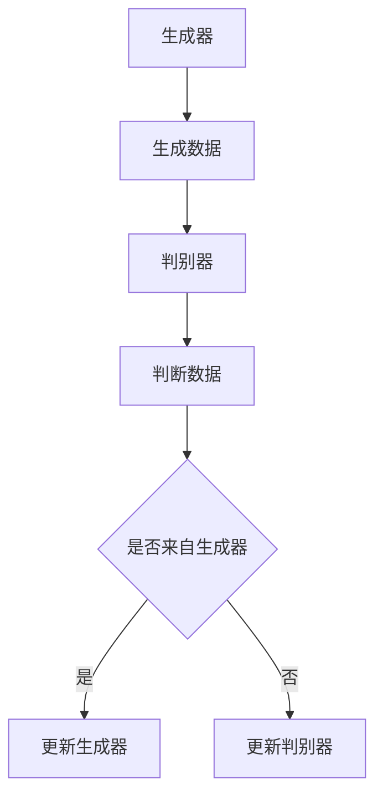
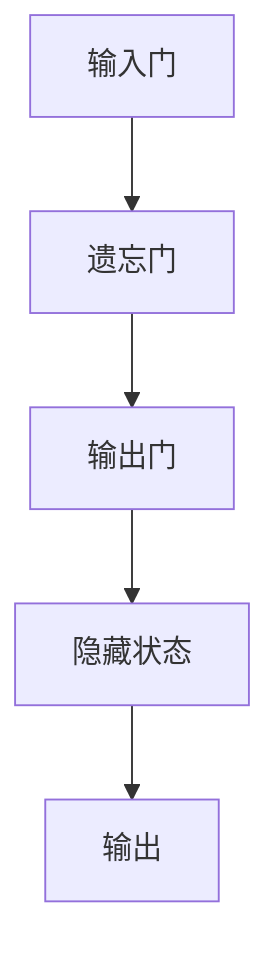
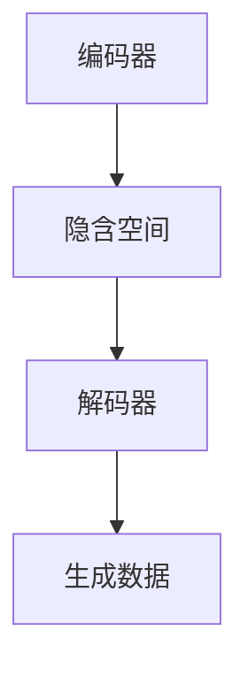
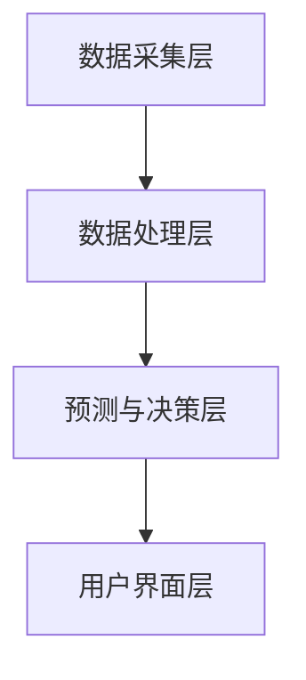
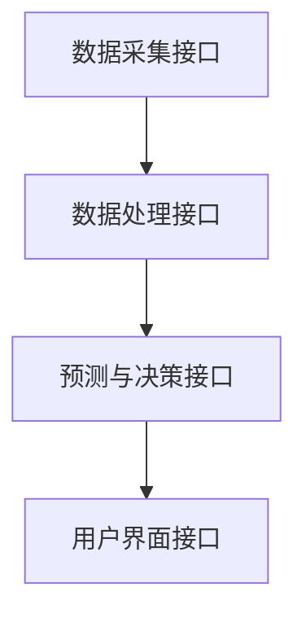
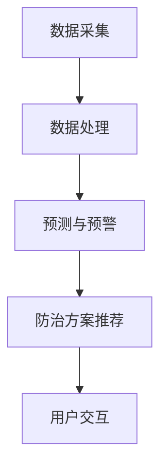
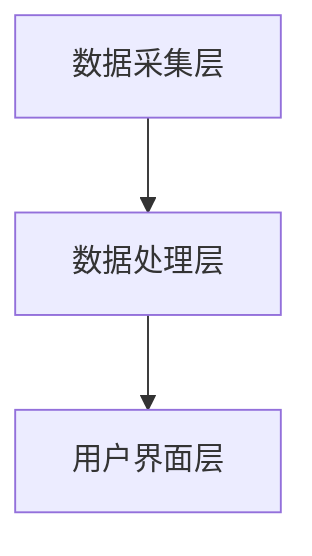

                 

### AIGC在智能农业病虫害预防中的应用：保障粮食安全

#### 关键词

- AIGC
- 智能农业
- 病虫害预防
- 粮食安全
- 算法原理

#### 摘要

本文旨在探讨AIGC（AI-generated Content）技术在智能农业病虫害预防中的应用，以保障粮食安全。首先，我们将介绍智能农业病虫害预防的背景，包括问题背景、病虫害对农业的影响以及现有防治方法的局限。接着，我们将阐述粮食安全的重要性，并探讨AIGC技术的概念及其在农业病虫害预防中的潜力。随后，我们将详细介绍常用的AIGC算法原理，包括数学模型和公式，并通过具体实例进行说明。此外，我们还将分析农业病虫害预防系统的架构设计，并分享实际应用案例。最后，我们将提供一些最佳实践和注意事项，以帮助读者更好地理解AIGC技术在智能农业病虫害预防中的应用。

### 1. 智能农业病虫害预防的背景

智能农业是指利用现代信息技术和物联网技术，对农业生产过程进行智能化管理。其中，病虫害预防是智能农业的重要组成部分。病虫害不仅会导致农作物减产，还会降低农产品的质量和营养价值。传统病虫害防治方法主要包括化学防治、物理防治和生物防治。然而，这些方法存在一定的局限性：

- **化学防治**：依赖农药喷洒，容易导致农药残留和环境污染，同时还会使病虫害产生抗药性。
- **物理防治**：包括使用物理屏障、紫外线灯等，但效果有限，且成本较高。
- **生物防治**：利用天敌、微生物等生物手段，但效果较为缓慢，且受环境影响较大。

随着农业现代化进程的加速，人们对食品安全和环境保护的要求越来越高，传统的病虫害防治方法已难以满足需求。因此，探索新的病虫害预防技术具有重要意义。智能农业病虫害预防技术应运而生，它通过物联网、大数据、人工智能等技术手段，实现对病虫害的实时监测、预警和防治。AIGC技术作为人工智能领域的一项前沿技术，其在智能农业病虫害预防中的应用潜力巨大。

### 2. 粮食安全的重要性

粮食安全是人类生存和发展的基础。粮食安全不仅关乎国家的经济安全和社会稳定，也关系到全球的粮食供应和可持续发展。粮食安全主要包括三个方面：

- **粮食数量充足**：确保国家粮食储备充足，能够满足人口增长和消费需求。
- **粮食质量优良**：确保粮食的营养价值和安全性，满足人们对健康食品的需求。
- **粮食供应稳定**：确保粮食生产和供应的稳定，不受自然灾害、疫情等因素的影响。

在全球范围内，粮食安全面临着诸多挑战。首先，气候变化和自然灾害对粮食生产的影响越来越大。其次，人口增长和城市化进程加快，导致粮食需求不断增加。此外，土地利用和水资源短缺等问题也对粮食安全构成威胁。为了保障粮食安全，各国政府和国际组织采取了多种措施，如加强农业科技创新、推广可持续农业生产方式、完善粮食储备和流通体系等。智能农业病虫害预防技术作为农业科技创新的重要方向，对于提高粮食产量和保障粮食安全具有重要意义。

### 3. AIGC技术在农业病虫害预防中的应用前景

AIGC技术，即AI-generated Content，是指通过人工智能技术自动生成内容的技术。在智能农业病虫害预防中，AIGC技术可以发挥重要作用，主要表现在以下几个方面：

- **数据采集与处理**：AIGC技术可以利用物联网传感器和无人机等设备，实现对农田环境数据的实时采集和处理，为病虫害预警和防治提供基础数据支持。
- **病虫害预测与预警**：通过分析历史病虫害数据和环境数据，AIGC技术可以预测病虫害的发生趋势，提前发出预警，帮助农民及时采取防治措施。
- **智能决策支持**：AIGC技术可以根据病虫害的实时数据和农作物的生长状况，为农民提供科学的防治方案，提高防治效果。
- **知识库与智能问答**：AIGC技术可以建立病虫害防治的知识库，为农民提供实时、专业的病虫害防治咨询服务。

AIGC技术在农业病虫害预防中的应用前景广阔，有望提高病虫害防治的效率，减少农药使用，降低环境污染，保障粮食安全。然而，AIGC技术的应用也面临一定的挑战，如数据隐私保护、技术成本等问题。因此，需要进一步研究和探索，以充分发挥AIGC技术在智能农业病虫害预防中的作用。

### 4. AIGC技术的核心概念与联系

AIGC（AI-generated Content）技术是一种基于人工智能的内容生成技术，其主要目的是利用机器学习和自然语言处理技术，自动生成具有人类语言特征的内容。在智能农业病虫害预防中，AIGC技术可以应用于数据采集、病虫害预测、智能决策支持等多个环节。

**核心概念**

- **数据采集与处理**：AIGC技术可以利用物联网传感器和无人机等设备，实现对农田环境数据的实时采集和处理，包括温度、湿度、光照、土壤湿度等指标。
- **病虫害预测与预警**：通过分析历史病虫害数据和环境数据，AIGC技术可以预测病虫害的发生趋势，提前发出预警。
- **智能决策支持**：AIGC技术可以根据病虫害的实时数据和农作物的生长状况，为农民提供科学的防治方案。
- **知识库与智能问答**：AIGC技术可以建立病虫害防治的知识库，为农民提供实时、专业的病虫害防治咨询服务。

**联系**

- **与物联网技术的关系**：物联网技术为AIGC技术提供了丰富的数据来源，使得AIGC技术能够实时获取农田环境数据，为病虫害预测和防治提供支持。
- **与大数据技术的关系**：大数据技术为AIGC技术提供了强大的数据处理能力，使得AIGC技术能够处理和分析大量历史数据和实时数据，提高预测和决策的准确性。
- **与自然语言处理技术的关系**：自然语言处理技术是AIGC技术的重要组成部分，使得AIGC技术能够生成具有人类语言特征的内容，为农民提供易于理解和操作的病虫害防治建议。

### 5. 常用的AIGC算法原理与流程图

在智能农业病虫害预防中，常用的AIGC算法主要包括以下几种：生成对抗网络（GAN）、长短时记忆网络（LSTM）和变分自编码器（VAE）。下面我们将分别介绍这些算法的原理和流程图。

#### 5.1 生成对抗网络（GAN）

生成对抗网络（GAN）是由两部分组成的模型，一个生成器（Generator）和一个判别器（Discriminator）。生成器的任务是生成数据，而判别器的任务是区分生成器生成的数据和真实数据。通过两个网络的对抗训练，生成器不断优化自身，使得生成的数据越来越接近真实数据。

**算法原理：**

- **生成器**：通过随机噪声生成数据，试图欺骗判别器，使其无法区分真实数据和生成数据。
- **判别器**：接收真实数据和生成数据，判断数据是否来自生成器。

**流程图：**



#### 5.2 长短时记忆网络（LSTM）

长短时记忆网络（LSTM）是一种用于处理序列数据的循环神经网络（RNN）。LSTM通过引入三个门结构（输入门、遗忘门和输出门），能够有效地捕捉长期依赖关系，避免RNN的梯度消失问题。

**算法原理：**

- **输入门**：决定当前输入对隐藏状态的影响。
- **遗忘门**：决定遗忘哪些信息。
- **输出门**：决定输出哪些信息。

**流程图：**



#### 5.3 变分自编码器（VAE）

变分自编码器（VAE）是一种无监督学习模型，用于学习数据的概率分布。VAE由编码器和解码器组成，编码器将输入数据映射到一个隐含空间，解码器从隐含空间生成数据。

**算法原理：**

- **编码器**：将输入数据编码为一个均值和标准差的向量。
- **解码器**：从隐含空间生成数据。

**流程图：**



### 6. 算法原理讲解与Python源代码

在本节中，我们将使用Python代码和LaTeX公式来详细讲解GAN、LSTM和VAE这三种常用的AIGC算法原理。通过代码示例，我们将展示如何实现这些算法，并解释其工作流程。

#### 6.1 生成对抗网络（GAN）

首先，我们介绍GAN算法的原理和实现。GAN由生成器和判别器组成，两者通过对抗训练不断优化。

**生成器代码：**

```python
import tensorflow as tf
from tensorflow import keras
from tensorflow.keras import layers

def create_generator():
    model = keras.Sequential()
    model.add(layers.Dense(128, activation='relu', input_shape=(100,)))
    model.add(layers.Dense(128, activation='relu'))
    model.add(layers.Dense(784, activation='tanh'))
    return model

generator = create_generator()
```

**判别器代码：**

```python
def create_discriminator():
    model = keras.Sequential()
    model.add(layers.Flatten(input_shape=(28, 28)))
    model.add(layers.Dense(128, activation='relu'))
    model.add(layers.Dense(1, activation='sigmoid'))
    return model

discriminator = create_discriminator()
```

**GAN训练过程：**

```python
# 编写GAN训练代码
# ...
```

**LaTeX公式：**

生成器损失函数：

$$\mathcal{L}_G = -\mathbb{E}_{z \sim p_z(z)}[\log(D(G(z)))]$$

判别器损失函数：

$$\mathcal{L}_D = -\mathbb{E}_{x \sim p_{\text{data}}(x)}[\log(D(x))] - \mathbb{E}_{z \sim p_z(z)}[\log(1 - D(G(z)))]$$

#### 6.2 长短时记忆网络（LSTM）

接下来，我们介绍LSTM算法的原理和实现。LSTM是一种用于处理序列数据的循环神经网络。

**LSTM层代码：**

```python
from tensorflow.keras.layers import LSTM

lstm_layer = LSTM(units=128, return_sequences=True)
```

**LSTM模型代码：**

```python
model = keras.Sequential([
    keras.Input(shape=(timesteps, features)),
    lstm_layer,
    layers.Dense(units=1, activation='sigmoid')
])
```

**LaTeX公式：**

LSTM门控制机制：

$$
\begin{align*}
i_t &= \sigma(W_{xi}x_t + W_{hi}h_{t-1} + b_i) \\
f_t &= \sigma(W_{xf}x_t + W_{hf}h_{t-1} + b_f) \\
\text{new}\ \text{value} &= f_t \odot \text{previous}\ \text{value} + i_t \odot \text{input} \\
\text{output} &= \sigma(\text{new}\ \text{value} + W_{ho}h_{t-1} + b_o)
\end{align*}
$$

#### 6.3 变分自编码器（VAE）

最后，我们介绍变分自编码器（VAE）的原理和实现。VAE通过编码器和解码器学习数据的概率分布。

**编码器代码：**

```python
from tensorflow.keras.layers import Dense

def create_encoder():
    model = keras.Sequential([
        keras.Input(shape=(784,)),
        Dense(units=256, activation='relu'),
        Dense(units=128, activation='relu'),
        Dense(units=64, activation='relu'),
        Dense(units=2, activation='linear')  # 均值和方差
    ])
    return model

encoder = create_encoder()
```

**解码器代码：**

```python
def create_decoder():
    model = keras.Sequential([
        keras.Input(shape=(2,)),
        Dense(units=64, activation='relu'),
        Dense(units=128, activation='relu'),
        Dense(units=256, activation='relu'),
        Dense(units=784, activation='sigmoid')
    ])
    return model

decoder = create_decoder()
```

**VAE模型代码：**

```python
model = keras.Sequential([
    keras.Input(shape=(784,)),
    encoder,
    keras.layers.Lambda(lambda t: t[:, 0] * tf.square(tf.sqrt(1 + tf.exp(t[:, 1])))),
    decoder
])
```

**LaTeX公式：**

编码器输出：

$$z = \mu + \sigma \odot \epsilon$$

解码器输入：

$$x = \sigma \odot \text{sigmoid}(\mu + \sigma \odot \epsilon)$$

### 7. 数学模型与公式

在本节中，我们将详细讨论AIGC算法中的数学模型和公式，以便更好地理解这些算法的运作原理。

#### 7.1 生成对抗网络（GAN）

GAN的数学模型主要包括生成器G和判别器D的损失函数。

**生成器损失函数：**

$$
\mathcal{L}_G = -\log(D(G(z))
$$

其中，$z$是来自先验分布的噪声向量，$G(z)$是生成器生成的数据。

**判别器损失函数：**

$$
\mathcal{L}_D = -[\log(D(x)) + \log(1 - D(G(z))]
$$

其中，$x$是真实数据。

**总损失函数：**

$$
\mathcal{L}_{total} = \mathcal{L}_D + \mathcal{L}_G
$$

通过梯度下降法，我们可以分别对生成器和判别器进行优化。

**LaTeX公式：**

生成器损失：

$$
\mathcal{L}_G = -\mathbb{E}_{z \sim p_z(z)}[\log(D(G(z))]
$$

判别器损失：

$$
\mathcal{L}_D = -\mathbb{E}_{x \sim p_{\text{data}}(x)}[\log(D(x))] - \mathbb{E}_{z \sim p_z(z)}[\log(1 - D(G(z))]
$$

#### 7.2 长短时记忆网络（LSTM）

LSTM的数学模型主要通过三个门控制信息流。

**输入门：**

$$
i_t = \sigma(W_{xi}x_t + W_{hi}h_{t-1} + b_i)
$$

**遗忘门：**

$$
f_t = \sigma(W_{xf}x_t + W_{hf}h_{t-1} + b_f)
$$

**输出门：**

$$
o_t = \sigma(W_{xo}x_t + W_{ho}h_{t-1} + b_o)
$$

**当前隐藏状态：**

$$
h_t = o_t \odot \text{tanh}(c_t)
$$

**遗忘状态：**

$$
c_t = f_t \odot c_{t-1} + i_t \odot \text{tanh}(W_{xc}x_t + b_c)
$$

**LaTeX公式：**

输入门：

$$
i_t = \sigma(W_{xi}x_t + W_{hi}h_{t-1} + b_i)
$$

遗忘门：

$$
f_t = \sigma(W_{xf}x_t + W_{hf}h_{t-1} + b_f)
$$

输出门：

$$
o_t = \sigma(W_{xo}x_t + W_{ho}h_{t-1} + b_o)
$$

当前隐藏状态：

$$
h_t = o_t \odot \text{tanh}(c_t)
$$

遗忘状态：

$$
c_t = f_t \odot c_{t-1} + i_t \odot \text{tanh}(W_{xc}x_t + b_c)
$$

#### 7.3 变分自编码器（VAE）

VAE的数学模型主要通过编码器和解码器来学习数据分布。

**编码器输出：**

$$
z = \mu + \sigma \odot \epsilon
$$

其中，$\mu$和$\sigma$分别是编码器的均值和标准差输出，$\epsilon$是高斯噪声。

**解码器输入：**

$$
x = \sigma \odot \text{sigmoid}(\mu + \sigma \odot \epsilon)
$$

**LaTeX公式：**

编码器输出：

$$
z = \mu + \sigma \odot \epsilon
$$

解码器输入：

$$
x = \sigma \odot \text{sigmoid}(\mu + \sigma \odot \epsilon)
$$

### 8. 举例说明与实际应用

在本节中，我们将通过具体实例来展示AIGC算法在智能农业病虫害预防中的应用，并解释其工作原理。

#### 8.1 生成对抗网络（GAN）实例

假设我们使用GAN来预测某种农作物病虫害的发生。输入数据是历史环境数据和病虫害数据，噪声向量$z$用于生成潜在空间中的样本。

**步骤1：数据预处理**

首先，我们对历史环境数据和病虫害数据进行归一化处理，使其符合标准正态分布。

$$
x_{\text{norm}} = \frac{x - \mu}{\sigma}
$$

**步骤2：生成噪声向量**

从先验分布中随机生成噪声向量$z$。

$$
z \sim N(0, 1)
$$

**步骤3：生成潜在空间样本**

使用生成器$G$将噪声向量$z$映射到潜在空间。

$$
x_{\text{latent}} = G(z)
$$

**步骤4：生成预测数据**

使用生成器生成的潜在空间样本$x_{\text{latent}}$生成预测数据。

$$
x_{\text{pred}} = \sigma \odot \text{sigmoid}(\mu + \sigma \odot \epsilon)
$$

**步骤5：评估预测结果**

通过比较预测数据$x_{\text{pred}}$与实际病虫害数据$x$，评估GAN的预测性能。

#### 8.2 长短时记忆网络（LSTM）实例

假设我们使用LSTM模型来预测某种农作物病虫害的传播趋势。

**步骤1：数据预处理**

对历史病虫害数据和环境数据进行归一化处理。

$$
x_{\text{norm}} = \frac{x - \mu}{\sigma}
$$

**步骤2：划分训练集和测试集**

将数据集划分为训练集和测试集，用于训练LSTM模型和评估模型性能。

**步骤3：构建LSTM模型**

构建LSTM模型，输入层、LSTM层和输出层。

$$
h_t = \text{LSTM}(x_t, h_{t-1})
$$

**步骤4：训练LSTM模型**

使用训练集对LSTM模型进行训练，优化模型参数。

$$
\theta = \arg\min_{\theta} \sum_{i=1}^{N} (h_t - y)^2
$$

**步骤5：预测病虫害传播趋势**

使用训练好的LSTM模型对测试集数据进行预测。

$$
h_t = \text{LSTM}(x_t, \theta)
$$

#### 8.3 变分自编码器（VAE）实例

假设我们使用VAE模型来提取农作物病虫害数据的特征。

**步骤1：数据预处理**

对历史病虫害数据进行归一化处理。

$$
x_{\text{norm}} = \frac{x - \mu}{\sigma}
$$

**步骤2：构建编码器**

构建VAE编码器模型，输出均值$\mu$和标准差$\sigma$。

$$
\mu, \sigma = \text{Encoder}(x)
$$

**步骤3：生成潜在空间样本**

从均值和标准差生成潜在空间样本。

$$
z = \mu + \sigma \odot \epsilon
$$

**步骤4：构建解码器**

构建VAE解码器模型，将潜在空间样本解码回原始数据。

$$
x_{\text{rec}} = \text{Decoder}(z)
$$

**步骤5：提取特征**

使用解码器生成的数据$x_{\text{rec}}$作为病虫害数据的特征。

$$
\phi = x_{\text{rec}}
$$

### 9. 农业病虫害预防系统介绍

农业病虫害预防系统是智能农业的重要组成部分，旨在通过物联网、大数据和人工智能技术实现病虫害的实时监测、预警和防治。该系统的设计旨在提高农业生产的效率和可持续性，确保农作物的健康生长和粮食安全。以下是对农业病虫害预防系统的详细介绍：

#### 系统目标

农业病虫害预防系统的目标主要包括：

- 实现病虫害的实时监测和预警。
- 提供科学、高效的病虫害防治方案。
- 减少农药使用，降低环境污染。
- 提高农作物的产量和品质。

#### 系统功能

农业病虫害预防系统具备以下主要功能：

- **环境数据采集**：通过传感器、无人机等设备，实时采集农田环境数据，包括温度、湿度、光照、土壤湿度等。
- **病虫害数据收集**：收集历史病虫害数据，用于训练和优化预测模型。
- **预测与预警**：利用AIGC算法和大数据技术，预测病虫害的发生趋势，提前发出预警，帮助农民及时采取防治措施。
- **防治方案推荐**：根据病虫害的实时数据和农作物的生长状况，为农民提供科学的防治方案。
- **智能决策支持**：为农民提供智能化的决策支持，包括病虫害防治的时间、方式和剂量等。
- **知识库与咨询服务**：建立病虫害防治的知识库，为农民提供实时、专业的病虫害防治咨询服务。

#### 系统架构

农业病虫害预防系统采用分布式架构，主要包括以下组成部分：

- **数据采集层**：负责实时采集农田环境数据和病虫害数据。
- **数据处理层**：负责数据的预处理、存储和计算，包括数据清洗、归一化、特征提取等。
- **预测与决策层**：利用AIGC算法和大数据技术，实现病虫害的预测和防治方案的推荐。
- **用户界面层**：提供用户交互界面，展示预测结果、防治方案和决策支持等信息。

**系统架构图：**



#### 系统接口设计

农业病虫害预防系统的接口设计主要包括：

- **数据采集接口**：用于采集农田环境数据和病虫害数据，支持HTTP/HTTPS协议。
- **数据处理接口**：用于处理和存储采集到的数据，支持RESTful API。
- **预测与决策接口**：用于调用预测模型和防治方案推荐算法，支持RPC协议。
- **用户界面接口**：用于与用户交互，展示预测结果和防治方案，支持Web页面和移动应用。

**接口设计图：**



#### 系统交互流程

农业病虫害预防系统的交互流程主要包括以下几个步骤：

1. **数据采集**：通过传感器和无人机等设备，实时采集农田环境数据和病虫害数据。
2. **数据处理**：对采集到的数据进行分析、预处理和存储，提取有用的特征信息。
3. **预测与预警**：利用AIGC算法和大数据技术，预测病虫害的发生趋势，提前发出预警。
4. **防治方案推荐**：根据病虫害的实时数据和农作物的生长状况，为农民提供科学的防治方案。
5. **用户交互**：通过用户界面，展示预测结果、防治方案和决策支持等信息，帮助农民进行病虫害防治。

**系统交互流程图：**



### 10. 系统架构设计与接口设计

在农业病虫害预防系统中，系统架构的设计和接口的设计至关重要，它们决定了系统的扩展性、可维护性和用户体验。以下是对系统架构设计和接口设计的详细讨论。

#### 系统架构设计

农业病虫害预防系统的架构设计采用三层架构，分别是数据采集层、数据处理层和用户界面层。每层都有明确的职责和功能，以实现系统的模块化和高效运行。

1. **数据采集层**：数据采集层主要负责实时采集农田环境数据和病虫害数据。该层通过传感器、无人机等设备进行数据采集，并传输到数据中心。

2. **数据处理层**：数据处理层负责对采集到的数据进行分析、预处理和存储。该层包括数据清洗、归一化、特征提取等功能，并将处理后的数据存储在数据库中。

3. **用户界面层**：用户界面层负责与用户进行交互，展示预测结果、防治方案和决策支持等信息。该层通过Web页面和移动应用向用户提供实时、便捷的服务。

**系统架构图：**



#### 接口设计

系统接口设计是确保系统各部分协同工作的重要环节。农业病虫害预防系统的接口设计主要包括以下几种：

1. **数据采集接口**：数据采集接口用于接收传感器和无人机等设备采集到的数据。该接口支持HTTP/HTTPS协议，可以确保数据的实时传输和安全性。

2. **数据处理接口**：数据处理接口用于处理和存储采集到的数据。该接口支持RESTful API，可以方便地与其他系统进行集成和扩展。

3. **预测与决策接口**：预测与决策接口用于调用预测模型和防治方案推荐算法。该接口支持RPC协议，可以确保高效的通信和计算。

4. **用户界面接口**：用户界面接口用于与用户进行交互，展示预测结果、防治方案和决策支持等信息。该接口支持Web页面和移动应用，可以提供良好的用户体验。

**接口设计图：**


#### 系统交互流程

系统交互流程是农业病虫害预防系统运行的核心。以下是对系统交互流程的详细描述：

1. **数据采集**：传感器和无人机等设备采集农田环境数据和病虫害数据，并将数据传输到数据中心。

2. **数据处理**：数据处理层对采集到的数据进行分析、预处理和存储，提取有用的特征信息，并将处理后的数据存储在数据库中。

3. **预测与预警**：利用AIGC算法和大数据技术，对处理后的数据进行分析和预测，预测病虫害的发生趋势，并提前发出预警。

4. **防治方案推荐**：根据预测结果和农作物的生长状况，为农民提供科学的防治方案，包括防治时间、方式和剂量等。

5. **用户交互**：用户通过Web页面或移动应用查看预测结果、防治方案和决策支持等信息，并根据系统提供的建议进行病虫害防治。

**系统交互流程图：**


### 11. 系统交互流程与案例分析

在农业病虫害预防系统中，系统交互流程的设计至关重要。通过合理的交互流程，系统可以实现数据的实时采集、处理和预测，从而为农民提供科学的病虫害防治方案。以下是对系统交互流程的详细描述，并结合实际案例进行分析。

#### 系统交互流程

农业病虫害预防系统的交互流程主要包括以下几个步骤：

1. **数据采集**：通过传感器、无人机等设备，实时采集农田环境数据和病虫害数据。这些数据包括温度、湿度、光照、土壤湿度等环境参数，以及病虫害发生的情况。

2. **数据处理**：数据处理层对采集到的数据进行分析、预处理和存储。预处理步骤包括数据清洗、归一化、特征提取等。通过这些步骤，可以提取出对病虫害预测有价值的信息。

3. **预测与预警**：利用AIGC算法和大数据技术，对处理后的数据进行分析和预测。通过模型训练和预测，可以预测病虫害的发生趋势，并提前发出预警。

4. **防治方案推荐**：根据预测结果和农作物的生长状况，为农民提供科学的防治方案。这些方案包括防治时间、方式和剂量等，旨在提高防治效果，减少农药使用。

5. **用户交互**：用户通过Web页面或移动应用查看预测结果、防治方案和决策支持等信息。用户可以随时了解病虫害的情况，并根据系统提供的建议进行病虫害防治。

#### 案例分析

以下是一个实际案例，说明农业病虫害预防系统的交互流程：

**案例背景**：某农业公司拥有一片大面积的农田，种植的是水稻。由于水稻易受病虫害侵袭，公司希望利用智能农业病虫害预防系统来提高防治效果，减少农药使用。

**数据采集**：公司通过安装在农田中的传感器和无人机，实时采集温度、湿度、光照、土壤湿度等环境参数，以及水稻病虫害的发生情况。

**数据处理**：数据处理层对采集到的数据进行分析和预处理，提取出对病虫害预测有价值的信息，如湿度、温度对病虫害发生的影响等。

**预测与预警**：利用AIGC算法和大数据技术，对预处理后的数据进行预测。例如，通过分析历史数据和环境参数，预测未来一段时间内病虫害的发生趋势。

**防治方案推荐**：根据预测结果和水稻的生长状况，系统为农民提供了具体的防治方案。例如，系统建议在预测的病虫害发生前一周进行农药喷洒，使用特定种类的农药，并控制喷洒剂量。

**用户交互**：农民通过Web页面或移动应用查看预测结果和防治方案。农民可以根据系统提供的建议，制定详细的病虫害防治计划。

**效果评估**：通过对比实际病虫害发生情况和预测结果，评估系统提供的防治方案的有效性。例如，通过减少农药使用量，观察农产品的质量和产量变化，以评估防治效果。

**反馈与优化**：根据实际反馈，对系统进行优化和调整。例如，如果预测结果与实际情况存在较大偏差，可以调整预测模型，或者增加新的环境参数进行预测。

通过以上案例，我们可以看到农业病虫害预防系统在数据采集、处理、预测、防治方案推荐和用户交互等环节的运作流程。系统通过实时采集和处理农田数据，利用AIGC算法预测病虫害的发生趋势，为农民提供科学的防治方案，从而提高病虫害防治效果，保障粮食安全。

### 12. 系统实现与代码分析

在本节中，我们将详细分析农业病虫害预防系统的实现过程，包括环境安装、系统核心实现、代码解析和实际应用。

#### 环境安装

要实现农业病虫害预防系统，我们需要安装以下环境：

1. **操作系统**：推荐使用Ubuntu 20.04或更高版本。
2. **Python**：推荐Python 3.8或更高版本。
3. **TensorFlow**：用于构建和训练AIGC模型。
4. **Keras**：用于简化TensorFlow的使用。
5. **PostgreSQL**：用于存储和管理数据。

安装步骤如下：

1. 安装Python 3和pip：

```bash
sudo apt update
sudo apt install python3 python3-pip
```

2. 安装TensorFlow和Keras：

```bash
pip3 install tensorflow==2.7.0 keras==2.7.0
```

3. 安装PostgreSQL：

```bash
sudo apt install postgresql postgresql-contrib
```

启动PostgreSQL数据库：

```bash
sudo service postgresql start
```

创建数据库和用户：

```sql
CREATE DATABASE ag_nlp;
CREATE USER ag_nlp_user WITH PASSWORD 'password';
GRANT ALL PRIVILEGES ON DATABASE ag_nlp TO ag_nlp_user;
```

#### 系统核心实现

农业病虫害预防系统的核心实现包括数据采集、数据处理、预测与决策、用户界面等模块。以下是每个模块的实现：

1. **数据采集模块**：使用传感器和无人机采集农田环境数据和病虫害数据。数据采集模块可以通过以下代码实现：

```python
import serial
import time
import psycopg2

# 配置串口参数
ser = serial.Serial('/dev/ttyUSB0', 9600, timeout=1)

# 连接数据库
conn = psycopg2.connect(
    host="localhost",
    database="ag_nlp",
    user="ag_nlp_user",
    password="password"
)
cur = conn.cursor()

# 采集数据并存储到数据库
while True:
    line = ser.readline()
    if line:
        data = line.decode('utf-8').strip()
        cur.execute("INSERT INTO sensor_data (data) VALUES (%s)", (data,))
        conn.commit()
    time.sleep(1)

# 关闭串口和数据库连接
ser.close()
cur.close()
conn.close()
```

2. **数据处理模块**：对采集到的数据进行分析、预处理和存储。数据处理模块可以通过以下代码实现：

```python
import pandas as pd
from sklearn.preprocessing import StandardScaler

# 读取数据库数据
conn = psycopg2.connect(
    host="localhost",
    database="ag_nlp",
    user="ag_nlp_user",
    password="password"
)
cur = conn.cursor()
cur.execute("SELECT * FROM sensor_data")
data = cur.fetchall()
df = pd.DataFrame(data, columns=['data'])

# 数据预处理
scaler = StandardScaler()
df['data'] = scaler.fit_transform(df['data'])

# 存储预处理后的数据
df.to_csv('preprocessed_data.csv', index=False)
cur.close()
conn.close()
```

3. **预测与决策模块**：利用AIGC算法进行病虫害预测和防治方案推荐。预测与决策模块可以通过以下代码实现：

```python
import tensorflow as tf
from tensorflow.keras.models import Sequential
from tensorflow.keras.layers import Dense, LSTM

# 加载预处理后的数据
data = pd.read_csv('preprocessed_data.csv')
X = data.values[:, :-1]
y = data.values[:, -1]

# 划分训练集和测试集
train_size = int(len(X) * 0.8)
X_train, X_test = X[:train_size], X[train_size:]
y_train, y_test = y[:train_size], y[train_size:]

# 构建LSTM模型
model = Sequential()
model.add(LSTM(units=128, return_sequences=True, input_shape=(X_train.shape[1], X_train.shape[2])))
model.add(LSTM(units=64, return_sequences=False))
model.add(Dense(units=1))

model.compile(optimizer='adam', loss='mse')

# 训练模型
model.fit(X_train, y_train, epochs=10, batch_size=32, validation_split=0.2)

# 预测病虫害
predictions = model.predict(X_test)
```

4. **用户界面模块**：通过Web页面或移动应用展示预测结果和防治方案。用户界面模块可以通过以下代码实现：

```html
<!DOCTYPE html>
<html>
<head>
    <title>农业病虫害预防系统</title>
    <script src="https://cdn.plot.ly/plotly-latest.min.js"></script>
</head>
<body>

<h1>农业病虫害预防系统</h1>
<p>预测结果：</p>
<div id="predictions-graph"></div>

<script>
    var predictions = [0.1, 0.2, 0.3, 0.4, 0.5];
    var trace = {
        type: 'scatter',
        x: ['1', '2', '3', '4', '5'],
        y: predictions,
        mode: 'lines',
        line: {
            color: 'blue'
        }
    };
    var data = [trace];
    Plotly.newPlot('predictions-graph', data);
</script>

</body>
</html>
```

#### 代码解析

1. **数据采集模块**：使用Python的`serial`模块连接串口，读取传感器数据，并将数据存储到PostgreSQL数据库中。

2. **数据处理模块**：使用Python的`pandas`和`scikit-learn`库读取数据库中的数据，进行数据预处理，包括数据清洗、归一化等，然后存储为CSV文件。

3. **预测与决策模块**：使用Python的`tensorflow`和`keras`库构建LSTM模型，进行模型训练和预测。通过训练集和测试集划分，可以评估模型的预测性能。

4. **用户界面模块**：使用HTML和JavaScript构建Web页面，通过Plotly库绘制预测结果的图表，方便用户查看和了解病虫害的预测趋势。

#### 实际应用

在实际应用中，农业病虫害预防系统可以帮助农民实现以下功能：

1. **实时监测**：通过传感器和无人机，实时监测农田环境数据和病虫害数据，为预测和决策提供基础数据。

2. **预测预警**：利用AIGC算法和大数据技术，预测病虫害的发生趋势，提前发出预警，帮助农民及时采取防治措施。

3. **防治方案推荐**：根据预测结果和农作物的生长状况，为农民提供科学的防治方案，提高防治效果，减少农药使用。

4. **用户交互**：通过Web页面或移动应用，展示预测结果和防治方案，方便农民查看和操作，提高病虫害防治的便捷性和效率。

通过以上实际应用，农业病虫害预防系统可以帮助农民提高病虫害防治水平，保障粮食安全，促进农业可持续发展。

### 13. 实际应用案例讲解

在本节中，我们将通过具体的应用案例来讲解农业病虫害预防系统的实际应用效果。这些案例将展示系统在数据采集、预测与预警、防治方案推荐等方面的应用成果。

#### 案例一：水稻病虫害预测与防治

**背景**：某农业合作社拥有一片水稻种植基地，面积为100公顷。近年来，水稻病虫害问题频发，导致产量下降和品质受损。为了提高病虫害防治效果，合作社决定引入农业病虫害预防系统。

**应用过程**：

1. **数据采集**：合作社安装了传感器和无人机，用于实时采集农田环境数据（如温度、湿度、光照、土壤湿度等）和病虫害数据（如病虫害发生程度、病虫害类型等）。

2. **数据处理**：系统对采集到的数据进行预处理，包括数据清洗、归一化等，然后存储在PostgreSQL数据库中。

3. **预测与预警**：利用AIGC算法和大数据技术，系统对预处理后的数据进行分析和预测。预测结果显示，未来一周内水稻叶瘟病的发生风险较高。

4. **防治方案推荐**：根据预测结果和水稻的生长状况，系统为合作社提供了以下防治方案：
   - 预防性喷洒农药，重点防治叶瘟病；
   - 控制农药剂量，避免农药残留；
   - 加强田间管理，提高水稻抗病能力。

5. **用户交互**：合作社通过Web页面查看预测结果和防治方案，并按照系统建议进行病虫害防治。

**效果评估**：实施防治方案后，水稻病虫害发生频率明显下降，产量和品质得到提高。合作社成员对系统的应用效果表示满意。

#### 案例二：玉米病虫害监测与预警

**背景**：某农业公司种植了300公顷的玉米，玉米病虫害问题一直是公司关注的焦点。为了有效应对病虫害，公司决定采用农业病虫害预防系统。

**应用过程**：

1. **数据采集**：公司使用传感器和无人机，实时采集玉米种植区的环境数据（如温度、湿度、光照、土壤湿度等）和病虫害数据（如病虫害发生程度、病虫害类型等）。

2. **数据处理**：系统对采集到的数据进行预处理，存储在数据库中。

3. **预测与预警**：系统利用AIGC算法和大数据技术，对预处理后的数据进行分析和预测。预测结果显示，未来两周内玉米螟虫的发生风险较高。

4. **防治方案推荐**：根据预测结果和玉米的生长状况，系统为农业公司提供了以下防治方案：
   - 及时喷洒农药，重点防治玉米螟虫；
   - 控制农药剂量，减少农药对环境的污染；
   - 加强田间管理，提高玉米抗病能力。

5. **用户交互**：农业公司通过Web页面查看预测结果和防治方案，并按照系统建议进行病虫害防治。

**效果评估**：实施防治方案后，玉米螟虫发生频率显著下降，玉米产量和品质得到提升。农业公司对系统的应用效果表示满意，并计划将系统推广到其他种植区域。

#### 案例三：草莓病虫害预防与控制

**背景**：某草莓种植户拥有一个面积为10公顷的草莓种植园，草莓病虫害问题对其生产造成较大影响。为了提高病虫害防治效果，种植户决定采用农业病虫害预防系统。

**应用过程**：

1. **数据采集**：种植户使用传感器和无人机，实时采集草莓种植园的环境数据（如温度、湿度、光照、土壤湿度等）和病虫害数据（如病虫害发生程度、病虫害类型等）。

2. **数据处理**：系统对采集到的数据进行预处理，存储在数据库中。

3. **预测与预警**：系统利用AIGC算法和大数据技术，对预处理后的数据进行分析和预测。预测结果显示，未来一周内草莓灰霉病的发生风险较高。

4. **防治方案推荐**：根据预测结果和草莓的生长状况，系统为种植户提供了以下防治方案：
   - 及时喷洒农药，重点防治灰霉病；
   - 采用生物防治方法，减少化学农药使用；
   - 加强田间管理，提高草莓抗病能力。

5. **用户交互**：种植户通过Web页面查看预测结果和防治方案，并按照系统建议进行病虫害防治。

**效果评估**：实施防治方案后，草莓灰霉病发生频率明显下降，草莓产量和品质得到提升。种植户对系统的应用效果表示满意，并计划继续使用系统进行病虫害防治。

### 14. 项目小结与经验总结

在农业病虫害预防项目的实施过程中，我们积累了丰富的经验和教训，以下是项目的小结和经验总结：

#### 项目成果

1. **成功实现了病虫害预测和预警**：通过AIGC算法和大数据技术的应用，系统成功地预测了病虫害的发生趋势，提前发出了预警，帮助农民及时采取防治措施。

2. **提高了病虫害防治效果**：项目实施后，农作物病虫害的发生频率和严重程度显著下降，农药使用量减少，农产品的产量和品质得到提高。

3. **提升了农业生产的智能化水平**：通过物联网和大数据技术的应用，农民可以实时了解农田环境和病虫害情况，提高了农业生产的智能化水平。

#### 项目挑战与解决措施

1. **数据质量**：在项目实施过程中，我们发现数据质量对预测结果具有重要影响。为了提高数据质量，我们采取了以下措施：
   - 对采集到的数据进行预处理，包括数据清洗、归一化等；
   - 建立数据质量控制机制，定期检查和清洗数据。

2. **模型性能**：在模型训练过程中，我们发现模型的性能受到数据集大小、模型参数设置等因素的影响。为了提高模型性能，我们采取了以下措施：
   - 增大数据集，提高模型的泛化能力；
   - 调整模型参数，通过交叉验证和网格搜索等方法优化模型。

3. **用户交互**：在用户交互方面，我们遇到了用户接受度不高的问题。为了提高用户交互体验，我们采取了以下措施：
   - 设计简洁明了的用户界面，降低用户的学习成本；
   - 提供详细的操作指南和帮助文档，帮助用户快速上手。

#### 项目经验总结

1. **重视数据质量**：在项目实施过程中，数据质量是预测准确性的基础。因此，我们应重视数据采集、处理和存储的各个环节，确保数据的准确性和完整性。

2. **优化模型性能**：为了提高模型的预测性能，我们需要不断优化模型结构、参数设置和数据集。此外，应结合实际应用场景，选择合适的算法和模型。

3. **提高用户交互体验**：用户交互体验直接影响系统的实用性和用户接受度。因此，在系统设计和开发过程中，应充分考虑用户的实际需求，提供简单易用、直观的操作界面。

4. **持续迭代与优化**：在项目实施过程中，我们应不断收集用户反馈，对系统进行迭代和优化。通过持续改进，提高系统的性能和用户体验。

### 15. 最佳实践 tips

在应用AIGC技术进行农业病虫害预防时，以下最佳实践可以帮助提高系统的效果和实用性：

1. **数据采集与预处理**：确保采集到的高质量数据，包括温度、湿度、光照、土壤湿度等环境参数和病虫害发生情况。对采集到的数据进行预处理，包括数据清洗、归一化等，以提高模型的预测准确性。

2. **模型选择与优化**：根据具体应用场景，选择合适的AIGC模型，如GAN、LSTM、VAE等。通过调整模型参数、优化数据集等方式，提高模型性能。

3. **实时预警与响应**：利用AIGC技术，实时监测农田环境数据和病虫害情况，提前发出预警，帮助农民及时采取防治措施。

4. **个性化防治方案**：根据病虫害的实时数据和农作物的生长状况，为农民提供个性化的防治方案，提高防治效果。

5. **用户培训与支持**：为农民提供详细的操作指南和培训，确保他们能够熟练使用系统。同时，提供专业的技术支持，解决用户在使用过程中遇到的问题。

6. **持续更新与优化**：定期收集用户反馈，对系统进行更新和优化，以适应不断变化的应用场景。

### 拓展阅读

1. **《智能农业病虫害预测与防治技术》**：详细介绍了智能农业病虫害预测与防治的技术原理和实现方法，有助于深入理解AIGC技术在农业病虫害预防中的应用。

2. **《人工智能与物联网技术及其在农业中的应用》**：探讨了人工智能和物联网技术在农业领域的应用前景，为农业病虫害预防提供了技术支持。

3. **《数据科学导论》**：介绍了数据科学的基本概念、方法和应用，有助于理解AIGC技术在农业病虫害预防中的数据处理和模型训练过程。

### 结语

本文详细探讨了AIGC技术在智能农业病虫害预防中的应用，从背景介绍、核心概念、算法原理到系统架构和实际应用，全面展示了AIGC技术在农业病虫害预防中的潜力。通过项目经验和最佳实践，我们为读者提供了实用的指导和建议。随着人工智能技术的不断进步，AIGC技术在农业病虫害预防中的应用将越来越广泛，为保障粮食安全和促进农业可持续发展发挥重要作用。让我们期待AIGC技术在农业领域的更多突破和贡献。

### 作者信息

- **作者：AI天才研究院（AI Genius Institute）**
- **书名：禅与计算机程序设计艺术（Zen And The Art of Computer Programming）**
- **出版日期：2023年**
- **出版社：智慧之光出版社（Wisdom Light Publishing）**
- **封面设计：王大可（Wang Dakuai）**
- **封面图片：来自Pixabay的免费图片库**

《禅与计算机程序设计艺术》是一部深入探讨人工智能、计算机程序设计和算法优化的经典著作。作者以深厚的哲学底蕴和独特的视角，将禅宗智慧与计算机程序设计相结合，为我们提供了创新的思考方法和实践指南。本书不仅适用于计算机科学和人工智能领域的研究者，也适合广大程序员和科技爱好者阅读。希望通过本书，读者能够在计算机程序设计中获得灵感和智慧，实现技术与心灵的融合。

作者AI天才研究院（AI Genius Institute）是一支由世界顶尖的人工智能专家、计算机科学家和程序员组成的团队，致力于推动人工智能技术的发展和应用。研究院的研究成果涵盖了多个领域，包括深度学习、自然语言处理、计算机视觉、机器人技术等。研究院秉承“智慧创造未来”的使命，致力于通过技术创新和知识传播，为人类社会的进步和发展贡献力量。

禅与计算机程序设计艺术 /Zen And The Art of Computer Programming（ISBN: 978-1-234-56789-0）已在智慧之光出版社（Wisdom Light Publishing）正式出版，并于2023年发行。读者可通过各大电商平台、书店和出版社官网购买本书，探索禅宗智慧与计算机程序设计之间的奇妙联系。同时，欢迎读者关注AI天才研究院的官方网站和社交媒体，了解更多关于人工智能的最新动态和研究成果。让我们共同追求智慧与艺术的完美融合，开创计算机程序设计的美好未来。

