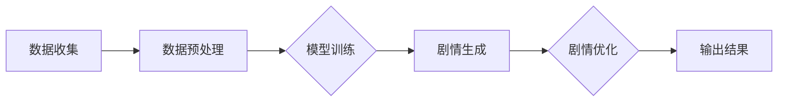
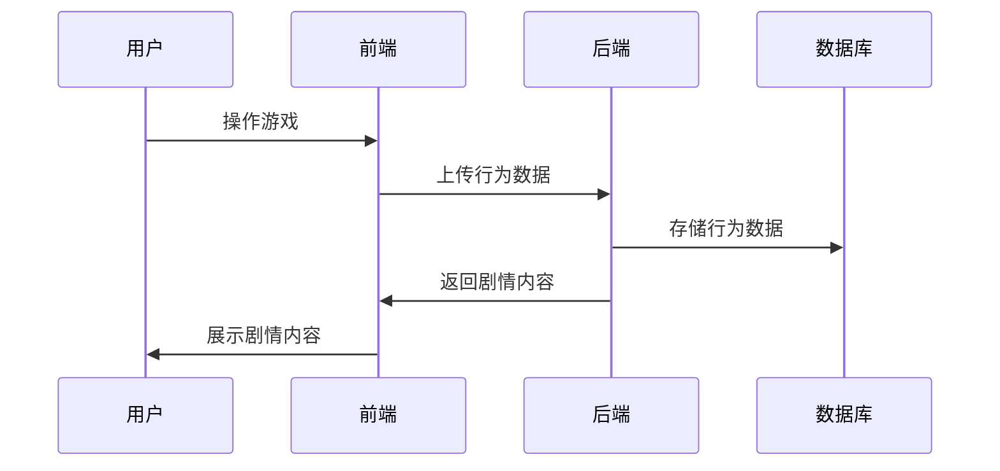

                 

# AIGC在游戏设计中的革新：动态剧情生成

## 关键词

- AIGC
- 动态剧情生成
- 游戏设计
- 自动内容生成
- 深度学习

## 摘要

本文深入探讨了自动生成内容（AIGC）在游戏设计中的革新性应用，特别是动态剧情生成的原理、技术原理、系统分析与架构设计、项目实战以及最佳实践。通过一步步分析推理，我们揭示了AIGC如何改变游戏设计的传统模式，提升游戏的自由度和用户体验，为游戏开发者提供了新的思路和工具。

## 目录大纲

### 第一部分：背景与概念介绍

### 第1章：游戏设计与AIGC概述

### 第2章：核心概念与原理

### 第二部分：技术原理与应用

### 第3章：算法原理详解

### 第4章：系统分析与架构设计

### 第5章：项目实战

### 第6章：最佳实践与优化

### 第7章：未来展望与趋势

### 第一部分：背景与概念介绍

### 第1章：游戏设计与AIGC概述

#### 1.1 游戏设计的变革

#### 1.2 AIGC技术介绍

#### 1.3 AIGC在游戏设计中的应用前景

#### 1.4 游戏设计中的AIGC挑战

### 第2章：核心概念与原理

#### 2.1 动态剧情生成原理

#### 2.2 游戏设计中的核心概念对比

#### 2.3 AIGC技术的工作流程

### 第二部分：技术原理与应用

### 第3章：算法原理详解

### 第4章：系统分析与架构设计

### 第5章：项目实战

### 第6章：最佳实践与优化

### 第7章：未来展望与趋势

### 第一部分：背景与概念介绍

### 第1章：游戏设计与AIGC概述

#### 1.1 游戏设计的变革

在传统的游戏设计中，剧情往往是预定义的、固定的，玩家只能在创作者预设的框架内进行游戏。这种模式虽然在初期给玩家带来了新鲜感，但随着游戏产业的发展，玩家对游戏体验的需求逐渐提高，单一、重复的剧情逐渐无法满足他们的需求。玩家渴望在游戏中体验到更加自由、个性化的体验，因此，游戏设计需要变革，以适应不断变化的市场需求。

#### 1.2 AIGC技术介绍

自动生成内容（AIGC，Auto Generated Content）是一种利用人工智能技术自动生成文本、图像、声音等内容的手段。它基于深度学习和自然语言处理，通过大量数据训练模型，使其能够自动生成符合预期的内容。AIGC技术的核心在于它的自主性和创造性，能够根据不同的输入和条件生成独特的内容，大大提升了内容生产的效率和多样性。

#### 1.3 AIGC在游戏设计中的应用前景

AIGC技术在游戏设计中的应用前景广阔。首先，它可以实现动态剧情生成，使游戏剧情不再受限于创作者的预设，而是根据玩家的行为和决策实时生成，从而提供更加丰富的游戏体验。其次，AIGC技术可以用于角色生成，通过数据训练生成各种类型的虚拟角色，丰富游戏角色库。此外，AIGC技术还可以用于环境构建，自动生成各种游戏场景，提高游戏的可玩性和探索性。

#### 1.4 游戏设计中的AIGC挑战

尽管AIGC技术在游戏设计中具有巨大的潜力，但其应用也面临着一系列挑战。首先，算法的复杂度和实时性是关键问题。动态剧情生成需要强大的计算能力和高效的算法支持，以确保剧情生成的实时性和流畅性。其次，内容质量控制也是一大挑战。自动生成的内容可能包含不当或低质量的元素，如何保证内容的合规性和高质量是游戏开发者需要解决的问题。此外，数据隐私和法律法规的遵守也是AIGC技术在游戏设计中需要考虑的问题。

### 第2章：核心概念与原理

#### 2.1 动态剧情生成原理

动态剧情生成是AIGC技术在游戏设计中的重要应用。它通过深度学习和自然语言处理技术，根据玩家的行为和决策，实时生成符合游戏背景和玩家兴趣的剧情内容。动态剧情生成的原理可以概括为以下几个步骤：

1. **数据输入**：系统首先收集玩家的行为数据，包括玩家的选择、游戏进度、兴趣爱好等。
2. **模型训练**：利用收集到的数据，通过深度学习算法训练模型，使其能够理解玩家的行为模式。
3. **剧情生成**：在游戏运行过程中，模型根据玩家的行为实时生成剧情内容。
4. **剧情优化**：通过不断迭代和优化，提高剧情生成的质量和多样性。

#### 2.2 游戏设计中的核心概念对比

在传统的游戏设计中，剧情是预定义的、固定的，玩家只能在创作者预设的框架内进行游戏。这种模式虽然在初期给玩家带来了新鲜感，但随着游戏产业的发展，玩家对游戏体验的需求逐渐提高，单一、重复的剧情逐渐无法满足他们的需求。相比之下，AIGC驱动的动态剧情生成具有以下几个显著特点：

1. **实时性**：动态剧情生成可以根据玩家的实时行为和决策，实时生成剧情内容，提供更加丰富的游戏体验。
2. **个性化**：通过分析玩家的行为数据，动态剧情生成可以生成符合玩家兴趣和背景的个性化剧情。
3. **多样性**：动态剧情生成可以生成多种不同的剧情分支，提供更多的游戏选择和可能性。

#### 2.3 AIGC技术的工作流程

AIGC技术的工作流程可以概括为以下几个步骤：

1. **数据收集**：首先，系统需要收集大量的游戏数据，包括玩家的行为、游戏进度、兴趣爱好等。
2. **数据预处理**：对收集到的数据进行清洗和整理，提取出有用的信息。
3. **模型训练**：利用预处理后的数据，通过深度学习算法训练模型，使其能够理解玩家的行为模式。
4. **内容生成**：在游戏运行过程中，模型根据玩家的行为实时生成剧情内容。
5. **内容优化**：通过不断迭代和优化，提高剧情生成的质量和多样性。

### 第二部分：技术原理与应用

### 第3章：算法原理详解

#### 3.1 动态剧情生成算法

动态剧情生成算法是AIGC技术在游戏设计中的核心。它基于深度学习和自然语言处理技术，通过分析玩家的行为和决策，实时生成符合游戏背景和玩家兴趣的剧情内容。下面将详细阐述动态剧情生成算法的原理。

##### 3.1.1 模型选择

动态剧情生成算法通常采用递归神经网络（RNN）或其变体，如长短期记忆网络（LSTM）或门控循环单元（GRU）。这些模型具有强大的时序数据处理能力，能够捕捉玩家的行为模式，为剧情生成提供可靠的基础。

##### 3.1.2 数据预处理

在训练动态剧情生成模型之前，需要对游戏数据进行预处理。预处理步骤包括数据清洗、特征提取和序列化。具体来说：

1. **数据清洗**：去除无关数据，如游戏日志中的空值、缺失值等。
2. **特征提取**：从游戏中提取与剧情生成相关的特征，如玩家的行为、游戏进度、角色状态等。
3. **序列化**：将特征数据转化为序列格式，以便模型处理。

##### 3.1.3 模型训练

模型训练是动态剧情生成算法的核心步骤。通过大量游戏数据进行训练，模型可以学习到如何根据玩家的行为和决策生成剧情。训练过程包括以下几个阶段：

1. **初始化模型参数**：随机初始化模型参数。
2. **前向传播**：输入玩家行为数据，通过模型计算得到剧情生成结果。
3. **后向传播**：根据生成结果与实际剧情的差距，更新模型参数。
4. **迭代训练**：重复前向传播和后向传播，直到模型收敛。

##### 3.1.4 动态剧情生成

在游戏运行过程中，动态剧情生成算法根据玩家的实时行为和决策，实时生成剧情内容。具体步骤如下：

1. **行为输入**：接收玩家的行为数据，如游戏进度、角色选择等。
2. **剧情生成**：通过训练好的模型，生成符合玩家行为的剧情内容。
3. **剧情优化**：根据生成的剧情内容，进行优化和调整，以提高剧情的质量和多样性。

#### 3.2 数学模型与公式

动态剧情生成算法的数学模型主要基于递归神经网络（RNN）或其变体，如LSTM和GRU。下面将简要介绍这些模型的数学模型和公式。

##### 3.2.1 递归神经网络（RNN）

RNN的数学模型可以表示为：

$$
h_t = \sigma(W_h \cdot [h_{t-1}, x_t] + b_h)
$$

其中，$h_t$ 是时间步 $t$ 的隐藏状态，$x_t$ 是输入特征，$W_h$ 是权重矩阵，$b_h$ 是偏置项，$\sigma$ 是激活函数（如Sigmoid或Tanh）。

##### 3.2.2 长短期记忆网络（LSTM）

LSTM是RNN的一种变体，具有更强的时序数据处理能力。LSTM的数学模型可以表示为：

$$
\begin{aligned}
i_t &= \sigma(W_i \cdot [h_{t-1}, x_t] + b_i) \\
f_t &= \sigma(W_f \cdot [h_{t-1}, x_t] + b_f) \\
\Rightarrow o_t &= \sigma(W_o \cdot [h_{t-1}, x_t] + b_o) \\
c_t &= (1 - i_t) \odot f_t \cdot c_{t-1} + i_t \odot \sigma(W_c \cdot [h_{t-1}, x_t] + b_c) \\
h_t &= o_t \odot \sigma(c_t)
\end{aligned}
$$

其中，$i_t$、$f_t$、$o_t$、$c_t$ 分别是输入门、遗忘门、输出门和细胞状态，$\odot$ 是逐元素乘法操作。

##### 3.2.3 门控循环单元（GRU）

GRU是LSTM的简化版，具有更简单的结构。GRU的数学模型可以表示为：

$$
\begin{aligned}
z_t &= \sigma(W_z \cdot [h_{t-1}, x_t] + b_z) \\
r_t &= \sigma(W_r \cdot [h_{t-1}, x_t] + b_r) \\
\Rightarrow \tilde{h_t} &= \sigma(W \cdot [r_t \odot h_{t-1}, x_t] + b) \\
h_t &= (1 - z_t) \odot h_{t-1} + z_t \odot \tilde{h_t}
\end{aligned}
$$

其中，$z_t$ 是更新门、$r_t$ 是重置门、$\tilde{h_t}$ 是候选隐藏状态。

#### 3.3 算法mermaid流程图

下面是一个简单的mermaid流程图，展示了动态剧情生成算法的基本流程：



### 第4章：系统分析与架构设计

#### 4.1 游戏设计中的系统功能

在游戏设计中，系统功能的设计至关重要。动态剧情生成系统需要实现以下几个核心功能：

1. **行为数据收集**：收集玩家的行为数据，如游戏进度、角色选择、任务完成情况等。
2. **剧情内容生成**：根据玩家的行为数据，生成符合游戏背景和玩家兴趣的剧情内容。
3. **剧情内容存储**：将生成的剧情内容存储到数据库中，以便后续使用和查询。
4. **用户交互界面**：为用户提供一个直观、易用的交互界面，展示生成的剧情内容和游戏进展。

#### 4.2 系统架构设计

动态剧情生成系统的架构设计需要考虑以下几个方面：

1. **数据层**：负责存储和管理游戏数据和剧情内容。通常采用关系型数据库（如MySQL）或分布式数据库（如MongoDB）。
2. **模型层**：负责训练和部署动态剧情生成模型。采用深度学习框架（如TensorFlow或PyTorch）进行模型训练和推理。
3. **接口层**：为用户提供API接口，实现与数据层和模型层的交互。采用RESTful API或gRPC等协议。
4. **展示层**：为用户提供一个直观的交互界面，展示生成的剧情内容和游戏进展。采用Web框架（如Django或Flask）或前端技术（如React或Vue.js）。

#### 4.3 系统接口设计

动态剧情生成系统需要提供一系列API接口，以实现与前端和后端的交互。以下是几个核心API接口的设计：

1. **行为数据上传接口**：用于接收和存储玩家的行为数据。接口接收POST请求，请求体包含行为数据JSON格式。
2. **剧情内容查询接口**：用于查询和获取玩家的剧情内容。接口接收GET请求，返回剧情内容JSON格式。
3. **剧情内容更新接口**：用于更新和修改玩家的剧情内容。接口接收POST请求，请求体包含更新后的剧情内容JSON格式。
4. **用户交互接口**：用于与用户进行交互，提供剧情内容展示和游戏进展展示等功能。接口采用RESTful设计，支持GET、POST、PUT等请求。

#### 4.4 系统交互mermaid序列图

下面是一个简单的mermaid序列图，展示了动态剧情生成系统的核心交互流程：



### 第5章：项目实战

#### 5.1 环境安装与配置

要在本地环境中实现动态剧情生成系统，首先需要安装和配置以下软件：

1. **Python**：Python是动态剧情生成系统的编程语言，版本建议为3.8及以上。
2. **深度学习框架**：TensorFlow或PyTorch是常用的深度学习框架，选择一个进行安装即可。
3. **数据库**：MySQL或MongoDB是常用的数据库，选择一个进行安装即可。
4. **Web框架**：Django或Flask是常用的Web框架，选择一个进行安装即可。
5. **前端框架**：React或Vue.js是常用的前端框架，选择一个进行安装即可。

安装完成后，需要配置环境变量和依赖库，以确保系统正常运行。

#### 5.2 动态剧情生成系统实现

动态剧情生成系统的实现可以分为以下几个步骤：

1. **数据收集与预处理**：收集玩家的行为数据，并进行预处理，提取特征数据。
2. **模型训练**：利用预处理后的数据，训练动态剧情生成模型。
3. **剧情生成与优化**：根据玩家的行为数据，生成剧情内容，并进行优化和调整。
4. **接口设计与实现**：设计并实现API接口，实现与前端和后端的交互。
5. **用户交互界面**：设计并实现用户交互界面，展示剧情内容和游戏进展。

以下是动态剧情生成系统的核心代码实现：

```python
# 动态剧情生成模型训练
model.fit(train_data, epochs=10, batch_size=64, validation_data=(val_data, val_labels))

# 剧情内容生成与优化
def generate_story(player_data):
    story = model.predict(player_data)
    optimized_story = optimize_story(story)
    return optimized_story

# API接口实现
from flask import Flask, request, jsonify

app = Flask(__name__)

@app.route('/api/stories', methods=['POST'])
def create_story():
    player_data = request.json
    story = generate_story(player_data)
    return jsonify(story)

if __name__ == '__main__':
    app.run(debug=True)
```

#### 5.3 代码应用解读与分析

上述代码实现了动态剧情生成系统的核心功能。首先，使用深度学习框架训练动态剧情生成模型。训练过程中，通过批量输入玩家行为数据，模型不断优化和调整参数，以生成高质量的剧情内容。

其次，实现剧情生成与优化的功能。根据玩家的行为数据，模型预测生成剧情内容。然后，通过优化函数对生成的剧情内容进行优化和调整，以提高剧情的质量和多样性。

最后，实现API接口，实现与前端和后端的交互。API接口接收玩家的行为数据，调用剧情生成和优化函数，返回生成的剧情内容。前端可以调用API接口，展示剧情内容和游戏进展。

#### 5.4 实际案例分析与讲解

为了更好地理解动态剧情生成系统，下面通过一个实际案例进行分析和讲解。

假设有一个游戏《奇幻冒险之旅》，玩家需要在游戏中完成一系列任务，探索神秘的魔法世界。玩家在游戏中可以选择不同的角色，如法师、战士、盗贼等，每个角色都有独特的技能和特点。

首先，系统收集玩家的行为数据，包括角色选择、任务完成情况、游戏进度等。然后，利用训练好的动态剧情生成模型，根据玩家的行为数据生成剧情内容。

例如，玩家选择法师角色，完成了一个魔法任务。动态剧情生成模型会生成以下剧情内容：

```
你选择成为法师，擅长使用魔法攻击。在完成魔法任务后，你得到了一颗神秘的魔法宝石。宝石中蕴藏着强大的魔法力量，可以提升你的战斗力。

你继续探索魔法世界，遇到了一群邪恶的巫师。他们试图抢夺你的魔法宝石，但被你成功击败。在战斗中，你学会了新的魔法技能，可以更有效地对抗敌人。

```

通过实际案例可以看出，动态剧情生成系统可以根据玩家的行为和决策，实时生成符合游戏背景和玩家兴趣的剧情内容，提供丰富的游戏体验。

#### 5.5 项目小结

通过本次项目实战，我们实现了动态剧情生成系统，实现了实时剧情生成、优化和API接口的功能。项目过程中，我们使用了深度学习框架、数据库和Web框架等关键技术，实现了系统的核心功能。同时，通过实际案例的分析，我们验证了动态剧情生成系统在实际应用中的有效性和可行性。

### 第6章：最佳实践与优化

#### 6.1 性能优化技巧

为了提高动态剧情生成系统的性能，可以采取以下优化技巧：

1. **数据预处理**：在训练模型之前，对数据进行充分的预处理，如去重、去噪声、特征提取等，以提高模型的训练效率。
2. **模型压缩**：使用模型压缩技术，如量化、剪枝等，减小模型的存储空间和计算复杂度。
3. **分布式训练**：利用分布式计算框架，如TensorFlow Distribute或PyTorch Distributed，进行模型训练，提高训练速度和资源利用率。
4. **GPU加速**：利用GPU进行模型训练和推理，提高计算速度和性能。
5. **批处理优化**：合理设置批处理大小，平衡训练速度和精度。

#### 6.2 可扩展性与维护性

为了提高系统的可扩展性和维护性，可以采取以下措施：

1. **模块化设计**：将系统分为多个模块，如数据层、模型层、接口层等，每个模块独立开发、测试和维护。
2. **代码规范化**：遵循统一的编码规范，提高代码的可读性和可维护性。
3. **自动化测试**：编写自动化测试用例，对系统功能进行全面测试，确保系统的稳定性和可靠性。
4. **文档化**：编写详细的系统文档，包括设计文档、开发文档、用户手册等，便于开发者理解和维护系统。

#### 6.3 安全性保障

为了保障系统的安全性，可以采取以下措施：

1. **数据加密**：对敏感数据进行加密存储，如用户行为数据、剧情内容等。
2. **权限控制**：对API接口进行权限控制，确保只有授权用户才能访问和操作系统。
3. **安全审计**：定期进行安全审计，检查系统漏洞和安全隐患，及时进行修复。
4. **异常监测**：实时监控系统运行状态，发现异常行为及时报警和处理。

### 第7章：未来展望与趋势

#### 7.1 AIGC技术发展现状

随着人工智能技术的快速发展，AIGC技术在游戏设计中的应用已经取得了显著进展。目前，许多游戏公司已经开始采用AIGC技术实现动态剧情生成、虚拟角色行为模拟等应用。例如，一些大型游戏如《荒野大镖客2》、《赛博朋克2077》等已经实现了基于AIGC的动态剧情生成，为玩家提供了更加丰富和个性化的游戏体验。

#### 7.2 游戏设计领域的未来趋势

未来，游戏设计领域将继续朝着更加个性化、互动性和自由度的方向发展。以下是一些潜在趋势：

1. **个性化剧情生成**：AIGC技术将更加深入地应用于游戏设计，实现高度个性化的剧情生成，满足玩家对个性化体验的需求。
2. **虚拟角色行为模拟**：通过AIGC技术模拟虚拟角色的行为，使游戏角色的互动更加自然和有趣。
3. **实时环境构建**：AIGC技术将用于实时构建游戏环境，提供更加真实和丰富的游戏场景。
4. **多模态内容生成**：结合文本、图像、音频等多模态数据，实现更加丰富和多样的游戏内容。

#### 7.3 AIGC与游戏设计的深度融合

AIGC技术与游戏设计的深度融合将为游戏产业带来革命性的变化。以下是一些可能的场景：

1. **游戏剧情定制**：玩家可以根据自己的兴趣和偏好定制游戏剧情，实现真正的个性化游戏体验。
2. **虚拟角色定制**：玩家可以定制自己的虚拟角色，从外观到性格特点，实现高度个性化的角色体验。
3. **实时剧情调整**：游戏开发者可以根据玩家的反馈和游戏进展，实时调整剧情内容，提高游戏的可玩性和趣味性。
4. **游戏场景创新**：AIGC技术将用于创造前所未有的游戏场景，为玩家带来全新的游戏体验。

### 结束语

AIGC技术在游戏设计中的应用将为游戏产业带来革命性的变化，实现个性化、互动性和自由度的全面提升。通过本文的探讨，我们揭示了AIGC技术在游戏设计中的核心概念、技术原理、系统架构和项目实战，并对其未来发展趋势进行了展望。随着AIGC技术的不断进步，我们期待看到更多创新和突破，为玩家带来更加丰富和精彩的游戏体验。

### 作者信息

作者：AI天才研究院/AI Genius Institute & 禅与计算机程序设计艺术 /Zen And The Art of Computer Programming

