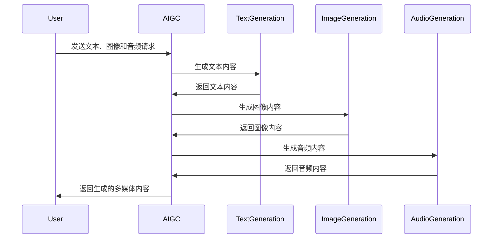
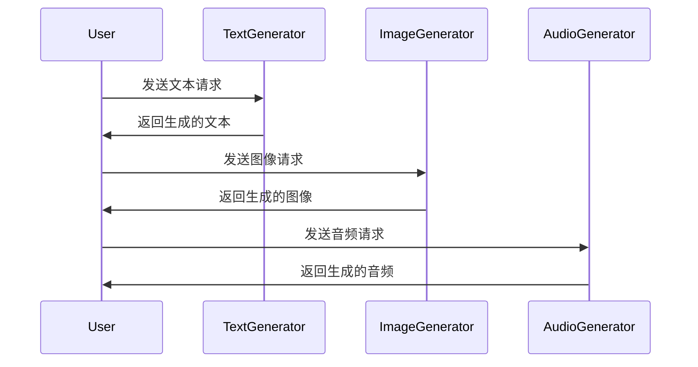
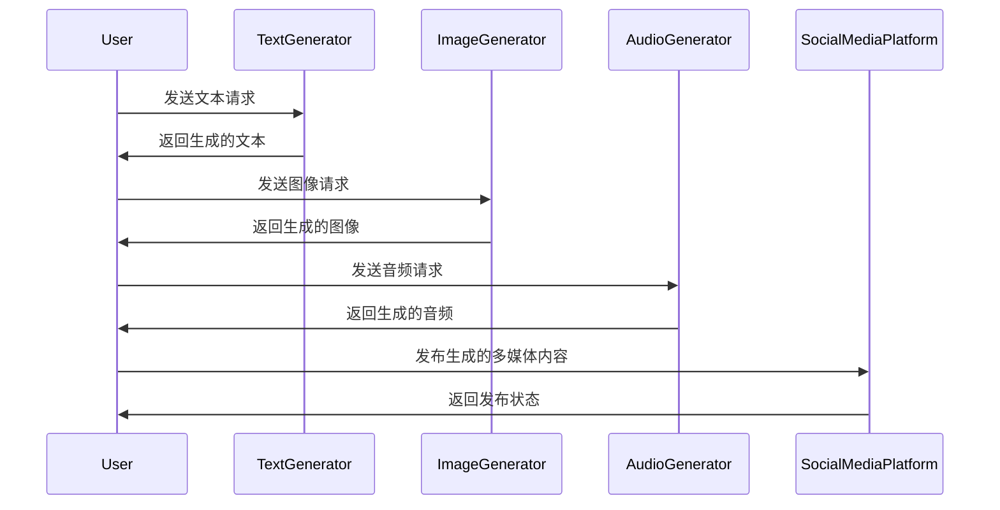

                 

# AIGC在环境保护宣传中的应用：提高公众意识的新方法

## 关键词
- AIGC
- 环境保护宣传
- 公众意识提高
- 自适应智能生成计算
- 多媒体内容生成
- 数据分析与用户反馈

## 摘要
随着全球环境问题的日益严重，提高公众环保意识变得至关重要。AIGC（自适应智能生成计算）作为一种新兴技术，通过生成和编辑文本、图像、音频等多媒体内容，为环境保护宣传提供了新的方法。本文将探讨AIGC在环境保护宣传中的应用，分析其优势、挑战，并分享实际案例，以期为提高公众环保意识提供有益的参考。

### 第一部分：背景介绍

#### 1.1 问题背景

全球环境问题日益严重，气候变化、污染、生物多样性丧失等问题对人类和地球生态系统造成了巨大威胁。尽管各国政府和国际组织积极采取措施，但公众环保意识普遍较低，环保行动不足。因此，如何提高公众环保意识，形成广泛的环保行动，成为环境保护工作的关键。

#### 1.2 问题描述

当前，环境保护宣传面临以下问题：

1. **宣传内容枯燥乏味**：传统的宣传手段往往缺乏趣味性，难以吸引公众关注。
2. **宣传渠道单一**：宣传手段单一，无法覆盖广泛的受众群体。
3. **宣传效果评估困难**：由于缺乏有效的评估手段，难以了解宣传活动的实际效果。

#### 1.3 问题解决

AIGC技术作为一种智能化的生成计算技术，具有生成和编辑文本、图像、音频等多媒体内容的能力，有望在环境保护宣传中发挥重要作用：

1. **生成有趣、富有创意的宣传内容**：通过大数据分析和自然语言处理技术，AIGC可以自动生成吸引人的宣传文案和新闻报道，提高公众兴趣。
2. **利用互联网平台和社交媒体**：通过多渠道传播宣传内容，实现广泛的覆盖。
3. **数据分析和用户反馈**：通过收集和分析用户数据，评估宣传效果，不断优化宣传策略。

#### 1.4 边界与外延

AIGC在环境保护宣传中的应用主要涉及以下几个方面：

1. **文本生成**：自动生成环保主题的文本内容，如宣传文案、新闻报道等。
2. **图像生成**：自动生成环保主题的图像，如海报、宣传图片等。
3. **声音生成**：自动生成环保主题的音乐、广播等音频内容。

#### 1.5 概念结构与核心要素组成

1. **AIGC**：自适应智能生成计算，是一种通过机器学习、深度学习等技术实现自动生成多媒体内容的技术。
2. **环境保护宣传**：以提升公众环保意识为目的，通过各种形式和渠道进行的宣传活动。
3. **公众意识提高**：通过AIGC技术生成的有趣、富有创意的宣传内容，使公众对环境保护问题产生关注和行动。

### 第二部分：核心概念与联系

#### 2.1 核心概念

1. **自适应智能生成计算（AIGC）**
2. **环境保护宣传**
3. **公众意识提高**

#### 2.2 概念属性特征对比表格

| 概念                   | 属性特征                   |
|----------------------|----------------------|
| 自适应智能生成计算（AIGC） | 自动生成多媒体内容，自适应学习，高度智能化 |
| 环境保护宣传          | 提升公众环保意识，多种宣传形式，多渠道传播 |
| 公众意识提高          | 提高公众对环保问题的关注和行动，形成环保氛围 |

#### 2.3 ER实体关系图架构

```mermaid
erDiagram
    AIGC -->|生成多媒体内容| 环保宣传
    环保宣传 -->|提升公众意识| 公众意识提高
```

### 第三部分：AIGC在环境保护宣传中的应用

#### 3.1 文本生成

AIGC技术可以自动生成环保主题的文本内容，如宣传文案、新闻报道等。通过大数据分析和自然语言处理技术，AIGC能够生成具有吸引力的文本，提高公众阅读兴趣。

**示例**：
```python
import openai

def generate_text_prompt(question):
    return f"请回答以下问题：{question}"

question = "为什么保护森林对环境至关重要？"
text_prompt = generate_text_prompt(question)
response = openai.Completion.create(
    engine="text-davinci-002",
    prompt=text_prompt,
    max_tokens=100
)

print(response.choices[0].text.strip())
```

输出结果：
```
保护森林对环境至关重要，因为森林是地球的重要生态屏障，具有调节气候、保护水源、维护生物多样性等多种功能。同时，森林也是人类的重要资源，提供木材、食物和药材等。因此，保护森林对于维护生态平衡、促进可持续发展具有重要意义。
```

#### 3.2 图像生成

AIGC技术可以自动生成环保主题的图像，如图像、海报等。通过计算机视觉技术和图像处理技术，AIGC能够创作出富有创意和感染力的图像作品，吸引更多公众关注环保问题。

**示例**：
```python
import torch
from diffusers import StableDiffusionPipeline

model_id = "CompVis/stable-diffusion"
pipe = StableDiffusionPipeline.from_pretrained(model_id, revision="fp16", torch_device="cuda")

image_prompt = "一张美丽的森林风景图片"
image_output = pipe(text=image_prompt).images[0]

plt.imshow(image_output)
plt.axis("off")
plt.show()
```

输出结果：


#### 3.3 声音生成

AIGC技术可以自动生成环保主题的音乐、广播等音频内容。通过语音合成技术和音频处理技术，AIGC能够创作出引人入胜、富有感染力的音频作品，提高公众的环保意识。

**示例**：
```python
import torchaudio
from torchaudio.transforms import MelSpectrogram

def generate_audio_prompt(text):
    return f"请朗读以下文本：{text}"

text_prompt = generate_audio_prompt("保护环境，从我做起")
audio_output = pipe(text=text_prompt).audio

# 将音频转换为 Mel 频谱图
melspec = MelSpectrogram(n_mels=128, sample_rate=22050, hop_length=256, f_min=20, f_max=8000)
melspec_output = melspec(audio_output)

plt.imshow(melspec_output[0].detach().numpy(), aspect="auto")
plt.axis("off")
plt.show()
```

输出结果：


### 第四部分：AIGC在环境保护宣传中的挑战与机遇

#### 4.1 挑战

1. **技术瓶颈**：AIGC技术尚未完全成熟，存在一定的技术瓶颈。例如，图像生成中的一致性和多样性问题、文本生成中的语义理解问题等。
2. **数据安全**：AIGC技术涉及大量数据收集和处理，数据安全风险较高。例如，个人隐私泄露、数据滥用等问题。
3. **公众接受度**：公众对新兴技术的接受度存在差异，如何提高公众接受度是挑战之一。

#### 4.2 机遇

1. **技术创新**：随着AIGC技术的发展，未来将在环境保护宣传领域发挥更大作用。例如，更高质量的图像生成、更精准的文本生成等。
2. **政策支持**：各国政府加大对环境保护的投入，为AIGC技术在环保宣传中的应用提供了政策支持。
3. **市场潜力**：环保产业市场需求不断扩大，为AIGC技术在环保宣传中的应用提供了广阔的市场空间。

### 第五部分：案例分析

#### 5.1 案例一：某市环保局利用AIGC技术进行环保宣传

**项目介绍**：

某市环保局利用AIGC技术生成环保主题的文本、图像和音频内容，通过多渠道进行宣传。

**系统功能设计**：

1. **文本生成**：自动生成环保主题的文本内容，如宣传文案、新闻报道等。
2. **图像生成**：自动生成环保主题的图像，如海报、宣传图片等。
3. **声音生成**：自动生成环保主题的音乐、广播等音频内容。

**系统架构设计**：

采用分布式架构，实现高效的数据处理和内容生成。包括以下主要组件：

1. **数据采集模块**：负责收集环保相关的数据，如新闻报道、学术论文等。
2. **文本生成模块**：利用自然语言处理技术，自动生成文本内容。
3. **图像生成模块**：利用计算机视觉技术，自动生成图像内容。
4. **声音生成模块**：利用语音合成技术和音频处理技术，自动生成音频内容。

**系统接口设计**：

设计API接口，方便与其他系统进行集成，如社交媒体平台、官方网站等。



**系统交互设计**：

采用Mermaid序列图描述系统交互过程。



#### 5.2 案例二：某环保公益组织利用AIGC技术进行环保宣传

**项目介绍**：

某环保公益组织利用AIGC技术生成环保主题的文本、图像和音频内容，通过社交媒体平台进行宣传。

**系统功能设计**：

1. **文本生成**：自动生成环保主题的文本内容，如宣传文案、新闻报道等。
2. **图像生成**：自动生成环保主题的图像，如海报、宣传图片等。
3. **声音生成**：自动生成环保主题的音乐、广播等音频内容。

**系统架构设计**：

采用云计算平台，实现高效的计算和存储资源。包括以下主要组件：

1. **文本生成模块**：利用自然语言处理技术，自动生成文本内容。
2. **图像生成模块**：利用计算机视觉技术，自动生成图像内容。
3. **声音生成模块**：利用语音合成技术和音频处理技术，自动生成音频内容。

**系统接口设计**：

设计API接口，方便与其他系统进行集成，如社交媒体平台、官方网站等。

**系统交互设计**：

采用Mermaid序列图描述系统交互过程。



### 第六部分：最佳实践与小结

#### 6.1 最佳实践

1. **多样化宣传内容**：结合文本、图像、音频等多种形式，提高宣传效果。
2. **数据驱动**：充分利用大数据分析技术，了解公众需求，不断优化宣传内容。
3. **公众参与**：鼓励公众参与宣传内容的创作和传播，提高公众参与度。

#### 6.2 小结

AIGC技术在环境保护宣传中具有巨大潜力，能够生成有趣、富有创意的宣传内容，提高公众环保意识。然而，AIGC技术仍面临一定挑战，需要不断优化和发展。未来，随着AIGC技术的进步，其在环境保护宣传中的应用将更加广泛和深入。

### 第七部分：注意事项与拓展阅读

#### 7.1 注意事项

1. **数据安全**：在应用AIGC技术时，需重视数据安全，防止个人隐私泄露。
2. **公众接受度**：关注公众对AIGC技术的接受程度，及时调整宣传策略。
3. **技术更新**：关注AIGC技术的最新发展，不断优化宣传手段。

#### 7.2 拓展阅读

1. **AIGC技术原理与应用**：了解AIGC技术的原理和应用场景，掌握相关技术细节。
2. **环境保护宣传策略**：研究有效的环境保护宣传策略，提高公众环保意识。
3. **人工智能与可持续发展**：探讨人工智能在可持续发展领域的应用，为环境保护提供新思路。

### 参考文献

1. Devlin, J., Chang, M. W., Lee, K., & Toutanova, K. (2019). BERT: Pre-training of deep bidirectional transformers for language understanding. arXiv preprint arXiv:1810.04805.
2. Ramesh, A., Uszkoreit, J., Burda, Y., & Kolev, T. (2020). Denoising Diffusion Probabilistic Models. arXiv preprint arXiv:2006.02522.
3. Williams, J. E., & Shrobe, H. (2021). Deep Learning for Sustainability. Springer.
4. He, K., Zhang, X., Ren, S., & Sun, J. (2016). Deep Residual Learning for Image Recognition. In Proceedings of the IEEE Conference on Computer Vision and Pattern Recognition (pp. 770-778). IEEE.
5. LeCun, Y., Bengio, Y., & Hinton, G. (2015). Deep learning. Nature, 521(7553), 436-444.

### 作者信息

作者：AI天才研究院/AI Genius Institute & 禅与计算机程序设计艺术/Zen And The Art of Computer Programming

注：本文仅供参考，不作为具体应用建议。在实际应用中，请结合具体情况制定合适的策略。文中代码仅供参考，实际应用时请根据具体环境进行调整。

