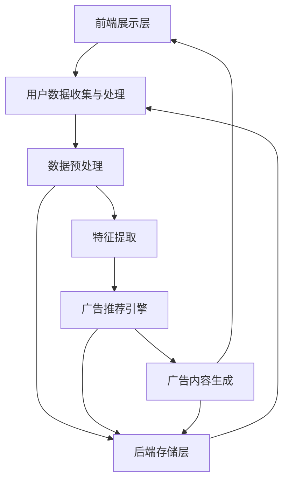
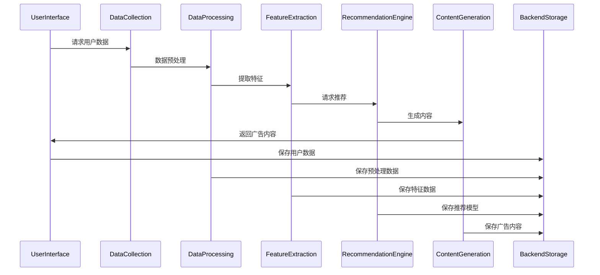
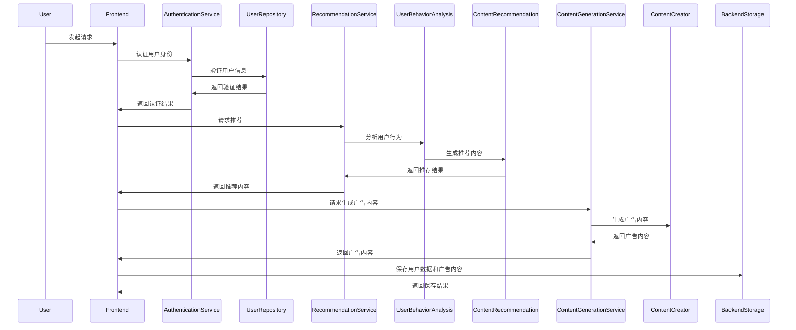

                 

## 引言与背景

随着人工智能（AI）技术的快速发展，个性化广告内容生成已成为现代营销领域的热点话题。AI在个性化广告内容生成中的应用，不仅提升了广告的精准度和效果，同时也带来了诸多伦理上的考量。本文旨在探讨AI在个性化广告内容生成中的伦理问题，包括数据隐私、广告偏见、用户同意与透明度等多个方面。

### 1.1 问题背景

在数字化时代，广告成为企业争夺市场份额的重要手段。传统广告模式主要依靠广泛投放，无法精确匹配用户兴趣和需求，导致广告效果不佳。随着AI技术的发展，个性化广告应运而生。个性化广告通过分析用户行为数据，预测用户兴趣，从而生成符合用户喜好的广告内容。这不仅提升了广告的转化率，也改变了广告行业的运营模式。

### 1.2 问题描述

尽管AI在个性化广告内容生成中展现了巨大潜力，但其带来的伦理问题也不容忽视。首先，个性化广告需要对用户行为数据进行收集和分析，这涉及到数据隐私问题。如果用户数据遭到泄露，可能导致严重后果。其次，个性化广告系统可能会因为算法偏见，导致某些群体受到不公平对待，如广告歧视。此外，用户对于个性化广告的知情权和同意权如何保障，也是一个重要问题。

### 1.3 问题解决

针对上述问题，需要采取一系列措施来确保AI在个性化广告内容生成中的伦理合规性。首先，需要加强对用户数据的保护，采用先进的加密技术和数据脱敏方法，确保用户数据的安全。其次，需要设计公平、透明的算法，避免算法偏见。此外，还应建立用户同意和透明度的保障机制，确保用户在参与个性化广告过程中，能够充分知情并做出自主选择。

### 1.4 边界与外延

个性化广告内容生成不仅限于线上，还可能延伸到线下。例如，通过智能设备收集用户行为数据，进行个性化广告推送。同时，个性化广告内容生成也涉及到跨平台的整合，如将线上和线下数据相结合，提高广告效果。

### 1.5 核心概念与联系

在探讨AI在个性化广告内容生成中的伦理考量时，需要理解以下几个核心概念：

- **个性化广告**：基于用户数据和行为，生成符合用户需求的广告内容。
- **数据隐私**：保护用户个人信息，防止数据泄露。
- **算法偏见**：算法在数据处理过程中可能存在的偏见，导致某些群体受到不公平对待。
- **用户同意**：用户在参与个性化广告过程中，对数据处理和广告内容的知情权和选择权。

这些核心概念相互联系，共同构成了个性化广告内容生成中的伦理考量框架。在后续章节中，我们将深入探讨这些概念的具体实现和挑战。

## AI与个性化广告内容生成基础

### 2.1 AI基础知识

#### 2.1.1 机器学习概述

机器学习（Machine Learning）是AI的核心组成部分，通过构建模型并训练模型来从数据中提取知识和规律。机器学习可以分为监督学习、无监督学习和强化学习三种主要类型。

- **监督学习（Supervised Learning）**：在有标注的数据集上进行训练，目标是学习输入和输出之间的映射关系。常见的算法有线性回归、决策树、随机森林和神经网络等。
- **无监督学习（Unsupervised Learning）**：在没有标注的数据集上进行训练，目标是发现数据中的内在结构和规律。常见的算法有聚类、降维和关联规则学习等。
- **强化学习（Reinforcement Learning）**：通过与环境的交互来学习最优策略，目标是最大化长期回报。常见的算法有Q-学习、深度Q网络（DQN）和策略梯度算法等。

#### 2.1.2 深度学习原理

深度学习（Deep Learning）是机器学习的一种重要分支，通过构建深度神经网络（Deep Neural Networks）来模拟人脑的学习过程。深度学习在图像识别、自然语言处理和推荐系统等领域取得了显著成果。

- **深度神经网络（Deep Neural Networks）**：由多层神经元组成的神经网络，通过逐层提取特征，实现复杂的函数映射。
- **卷积神经网络（Convolutional Neural Networks, CNN）**：适用于图像识别任务，通过卷积操作和池化操作提取图像特征。
- **循环神经网络（Recurrent Neural Networks, RNN）**：适用于序列数据处理，通过循环连接实现序列信息的传递和记忆。

#### 2.1.3 自然语言处理基础

自然语言处理（Natural Language Processing, NLP）是AI在语言领域的应用，旨在让计算机理解和生成人类语言。NLP技术包括文本分类、情感分析、机器翻译、命名实体识别等。

- **文本分类（Text Classification）**：将文本分类到预定义的类别中，常用的算法有朴素贝叶斯、支持向量机和深度学习等。
- **情感分析（Sentiment Analysis）**：分析文本中表达的情感倾向，常用的方法有基于规则、基于统计和基于深度学习的方法。
- **机器翻译（Machine Translation）**：将一种语言的文本自动翻译成另一种语言，常见的算法有基于规则、基于统计和基于神经网络的翻译模型。
- **命名实体识别（Named Entity Recognition, NER）**：识别文本中的命名实体，如人名、地名、组织名等，常用的算法有条件随机场（CRF）和深度学习等。

### 2.2 个性化广告内容生成概述

#### 2.2.1 广告内容个性化的重要性

广告内容个性化是提升广告效果的关键因素。通过个性化广告，企业能够更精准地触达潜在客户，提高广告转化率和用户满意度。个性化广告不仅有助于增加销售额，还能提升品牌形象。

#### 2.2.2 个性化广告内容的挑战

尽管个性化广告具有显著优势，但其实现过程中也面临诸多挑战：

- **数据隐私**：个性化广告需要收集和分析大量用户数据，如何保护用户隐私成为一大难题。
- **算法偏见**：个性化广告算法可能存在偏见，导致某些用户群体受到不公平对待。
- **数据质量**：用户数据的准确性和完整性对个性化广告效果至关重要。
- **技术实现**：个性化广告需要复杂的技术支持，包括数据收集、存储、处理和模型训练等。

#### 2.2.3 AI在个性化广告中的应用

AI技术为个性化广告内容生成提供了强有力的支持：

- **用户行为分析**：通过机器学习和深度学习算法，对用户行为数据进行分析，了解用户兴趣和行为模式。
- **内容推荐**：利用推荐系统算法，根据用户兴趣和行为，推荐符合其需求的广告内容。
- **情感分析**：通过情感分析技术，了解用户对广告内容的情感倾向，优化广告内容。
- **广告创意生成**：利用自然语言处理技术，自动生成具有吸引力的广告文案和图像。

### 2.3 核心概念与联系

在个性化广告内容生成中，核心概念包括：

- **用户数据**：用户行为数据、兴趣数据等。
- **推荐系统**：基于用户数据和算法生成个性化推荐。
- **算法**：用于处理用户数据和生成推荐内容的算法。
- **广告内容**：基于推荐系统生成的个性化广告内容。

这些概念相互联系，共同构成了个性化广告内容生成的核心框架。在后续章节中，我们将进一步探讨这些概念的具体实现和应用。

## 个性化广告内容生成的算法原理

### 3.1 数据驱动算法

个性化广告内容生成的核心在于数据驱动算法，通过分析用户行为数据来预测用户兴趣，从而生成个性化的广告内容。以下将详细介绍数据驱动算法的两个主要方面：用户行为分析和内容推荐算法。

#### 3.1.1 用户行为分析

用户行为分析是个性化广告内容生成的基础，通过收集和分析用户在网站、APP或其他平台上的行为数据，如浏览记录、购买行为、点击行为等，来了解用户的兴趣和行为模式。

1. **数据收集**：数据收集主要通过网站或APP的日志系统实现，包括用户访问时间、页面浏览量、搜索关键词、购买记录等。

2. **数据预处理**：数据预处理是数据驱动算法的重要环节，主要包括数据清洗、数据归一化和特征提取。数据清洗旨在去除无效和错误的数据，数据归一化则通过缩放或转换，使不同特征在同一量级上进行比较，特征提取则是从原始数据中提取对用户行为有显著影响的特征。

3. **用户行为模型建立**：通过机器学习和深度学习算法，建立用户行为模型，以预测用户未来的行为和兴趣。常用的算法包括回归分析、决策树、支持向量机（SVM）和深度神经网络（DNN）等。

#### 3.1.2 内容推荐算法

内容推荐算法是数据驱动算法的核心，通过分析用户行为数据，预测用户可能感兴趣的内容，从而生成个性化的广告内容。

1. **协同过滤（Collaborative Filtering）**：协同过滤是一种常用的推荐算法，通过分析用户之间的行为相似性来推荐内容。协同过滤分为两种主要类型：基于用户的协同过滤（User-based Collaborative Filtering）和基于项目的协同过滤（Item-based Collaborative Filtering）。

   - **基于用户的协同过滤**：通过找到与目标用户相似的其他用户，推荐这些用户喜欢的项目。
   - **基于项目的协同过滤**：通过找到与目标项目相似的其他项目，推荐这些项目给用户。

2. **基于模型的推荐算法**：基于模型的推荐算法通过建立用户和项目之间的潜在关系模型，进行推荐。常用的算法包括矩阵分解（Matrix Factorization）、潜在因子模型（Latent Factor Models）和深度学习模型（Deep Learning Models）。

3. **混合推荐算法**：混合推荐算法结合了协同过滤和基于模型的推荐算法的优点，通过综合不同算法的推荐结果来提升推荐效果。

#### 3.1.3 用户行为分析与内容推荐算法的整合

用户行为分析和内容推荐算法在个性化广告内容生成中相互整合，共同发挥作用。用户行为分析提供了用户兴趣和行为模式的预测，而内容推荐算法则根据这些预测生成个性化的广告内容。两者结合，形成了一套完整的数据驱动个性化广告生成系统。

- **实时推荐**：系统实时分析用户行为数据，根据用户的实时行为生成动态的个性化广告。
- **个性化广告创意生成**：利用自然语言处理和计算机视觉技术，自动生成符合用户兴趣的广告文案和图像。
- **用户反馈机制**：系统收集用户的反馈数据，持续优化推荐算法和广告内容，提升用户体验。

### 3.2 模式识别算法

模式识别算法在个性化广告内容生成中扮演着重要角色，通过识别和提取用户行为数据中的潜在模式，为推荐系统提供更准确的预测。以下将详细介绍模式识别算法的两个主要方面：语义分析和个性化推荐系统设计。

#### 3.2.1 语义分析

语义分析是自然语言处理的核心任务之一，旨在理解文本中的语言意义。在个性化广告内容生成中，语义分析用于提取用户行为数据中的关键信息，如用户评论、搜索关键词等。

1. **文本分类**：文本分类是将文本分类到预定义的类别中，通过训练分类模型，可以识别用户评论中的情感倾向、产品评价等。常用的文本分类算法包括朴素贝叶斯、支持向量机（SVM）和深度学习模型（如卷积神经网络（CNN）和循环神经网络（RNN））。

2. **情感分析**：情感分析是通过分析文本中的情感倾向，了解用户的情绪状态。情感分析可以用于分析用户评论、社交媒体帖子等，以预测用户对广告内容的情感反应。常用的情感分析算法包括基于规则的方法、基于统计的方法和深度学习方法。

3. **实体识别**：实体识别是从文本中识别出特定实体（如人名、地名、组织名等），用于构建用户兴趣图谱和个性化推荐。常用的实体识别算法包括条件随机场（CRF）和基于深度学习的方法（如双向长短期记忆网络（Bi-LSTM）和变换器（Transformer））。

#### 3.2.2 个性化推荐系统设计

个性化推荐系统设计是模式识别算法在个性化广告内容生成中的具体应用，通过构建用户兴趣图谱和广告内容模型，实现精准的个性化推荐。

1. **用户兴趣图谱**：用户兴趣图谱是通过分析用户行为数据，构建用户兴趣的层次结构。用户兴趣图谱可以帮助推荐系统更好地理解用户兴趣，从而生成个性化的推荐。常用的方法包括基于邻接矩阵的图表示学习和基于深度学习的图表示学习。

2. **广告内容模型**：广告内容模型是通过分析广告内容特征，构建广告内容与用户兴趣之间的映射关系。广告内容模型可以用于预测用户对广告内容的偏好，从而生成个性化的广告推荐。常用的方法包括基于内容的推荐（Content-based Filtering）和基于模型的推荐（Model-based Filtering）。

3. **个性化推荐算法**：个性化推荐算法通过整合用户兴趣图谱和广告内容模型，生成个性化的广告推荐。常用的推荐算法包括基于用户的协同过滤（User-based Collaborative Filtering）、基于项目的协同过滤（Item-based Collaborative Filtering）和基于模型的推荐（Model-based Recommendation）。

#### 3.2.3 模式识别算法的整合与应用

模式识别算法在个性化广告内容生成中相互整合，共同发挥作用。语义分析通过提取用户行为数据中的关键信息，为推荐系统提供更准确的预测；个性化推荐系统设计则通过构建用户兴趣图谱和广告内容模型，实现精准的个性化推荐。两者结合，形成了一套完整的数据驱动个性化广告生成系统。

- **实时推荐**：通过实时分析用户行为数据，生成动态的个性化广告。
- **个性化广告创意生成**：利用自然语言处理和计算机视觉技术，自动生成符合用户兴趣的广告文案和图像。
- **用户反馈机制**：通过收集用户的反馈数据，持续优化推荐算法和广告内容，提升用户体验。

### 3.3 伦理考量

在个性化广告内容生成中，算法的应用不仅带来了技术挑战，也引发了伦理问题。以下将介绍个性化广告内容生成中的几个主要伦理考量：数据隐私保护、广告偏见与歧视、用户同意与透明度。

#### 3.3.1 数据隐私保护

个性化广告内容生成依赖于大量的用户数据，包括浏览记录、搜索历史、购买行为等。如何保护用户隐私成为关键问题。

1. **数据匿名化**：通过数据匿名化技术，将用户数据中的敏感信息进行脱敏处理，确保用户隐私不被泄露。
2. **数据加密**：采用先进的加密技术，对存储和传输的用户数据进行加密，防止数据泄露和篡改。
3. **访问控制**：对用户数据的访问进行严格的权限管理，确保只有授权人员才能访问和处理用户数据。

#### 3.3.2 广告偏见与歧视

个性化广告算法可能会因为数据偏差、算法设计问题等因素，导致广告偏见和歧视，影响某些用户群体的权益。

1. **算法公平性**：设计公平、透明的算法，避免算法偏见。可以通过数据增强、算法优化等方法，提高算法的公平性。
2. **偏见检测与纠正**：建立偏见检测机制，定期检测算法是否存在偏见，并采取相应的纠正措施。
3. **用户反馈机制**：建立用户反馈机制，收集用户对广告内容的反馈，及时发现和纠正广告偏见。

#### 3.3.3 用户同意与透明度

用户在参与个性化广告过程中，应享有知情权和选择权。如何保障用户同意和透明度，是个性化广告内容生成中必须考虑的问题。

1. **用户同意机制**：在用户参与个性化广告之前，明确告知用户数据处理的目的、范围和方式，并征得用户同意。
2. **透明度保障**：建立透明度保障机制，用户可以查询自己的数据、了解数据处理过程，并有权要求删除或修改自己的数据。
3. **用户隐私权益**：明确用户隐私权益，保障用户对个人数据的控制权，包括数据的访问、更正、删除等。

通过上述措施，可以确保个性化广告内容生成过程中的伦理合规性，保护用户隐私，避免广告偏见和歧视，提升用户满意度。

### 3.4 总结

个性化广告内容生成中的算法原理涉及数据驱动算法和模式识别算法。数据驱动算法通过用户行为分析和内容推荐算法，生成个性化的广告内容；模式识别算法通过语义分析和个性化推荐系统设计，实现精准的个性化推荐。在应用这些算法的同时，必须重视数据隐私保护、广告偏见与歧视、用户同意与透明度等伦理问题，确保个性化广告内容生成过程中的伦理合规性。在后续章节中，我们将进一步探讨个性化广告内容生成的系统架构设计和项目实战。

### 数学模型与数学公式

#### 4.1 数学模型

个性化广告内容生成过程中，数学模型的应用至关重要。以下将介绍推荐系统数学模型和伦理决策模型，并详细阐述其数学原理。

##### 4.1.1 推荐系统数学模型

推荐系统数学模型主要用于预测用户对物品的偏好，从而生成个性化的推荐。以下为几种常用的数学模型：

1. **用户基于模型的推荐**：使用用户和物品的特征矩阵，通过矩阵分解或机器学习算法，预测用户对物品的评分。

   $$ \mathbf{R} = \mathbf{U} \mathbf{V}^T $$
   
   其中，$\mathbf{R}$ 是用户-物品评分矩阵，$\mathbf{U}$ 是用户特征矩阵，$\mathbf{V}$ 是物品特征矩阵。

2. **基于内容的推荐**：通过计算用户和物品的特征相似度，预测用户对物品的偏好。

   $$ \text{similarity}(u, v) = \frac{\sum_{i \in I} u_i v_i}{\sqrt{\sum_{i \in I} u_i^2 \sum_{i \in I} v_i^2}} $$
   
   其中，$u$ 和 $v$ 分别是用户和物品的特征向量，$I$ 是特征集合。

3. **基于模型的推荐**：使用机器学习算法（如决策树、随机森林、神经网络等）建立用户和物品之间的映射关系。

   $$ \text{rating}(u, v) = f(\mathbf{X}, \mathbf{W}) $$
   
   其中，$f$ 是预测函数，$\mathbf{X}$ 是用户和物品的特征向量，$\mathbf{W}$ 是模型参数。

##### 4.1.2 伦理决策模型

伦理决策模型旨在确保个性化广告内容生成的过程中，尊重用户隐私和公平性。以下为几种常见的伦理决策模型：

1. **基于规则的伦理决策模型**：通过预设的规则，判断用户行为是否符合伦理标准。

   $$ \text{伦理决策} = \text{rule}(u, v, \text{context}) $$
   
   其中，$u$ 和 $v$ 分别是用户和物品的特征向量，$\text{context}$ 是当前环境，$\text{rule}$ 是伦理规则。

2. **基于数据的伦理决策模型**：通过分析用户行为数据，识别潜在的伦理风险，并采取相应的措施。

   $$ \text{伦理决策} = \text{data\_analysis}(u, v, \text{context}) $$
   
   其中，$u$ 和 $v$ 分别是用户和物品的特征向量，$\text{context}$ 是当前环境，$\text{data\_analysis}$ 是数据分析过程。

3. **基于机器学习的伦理决策模型**：使用机器学习算法，从历史数据中学习伦理决策规则，并应用于新数据。

   $$ \text{伦理决策} = \text{ML\_model}(u, v, \text{context}) $$
   
   其中，$u$ 和 $v$ 分别是用户和物品的特征向量，$\text{context}$ 是当前环境，$\text{ML\_model}$ 是机器学习模型。

#### 4.2 数学公式

在个性化广告内容生成中，数学公式用于描述算法的原理和决策过程。以下为几种常用的数学公式：

##### 4.2.1 逻辑回归公式

逻辑回归（Logistic Regression）是一种常用的分类算法，用于预测用户对物品的偏好。

$$ P(y=1) = \frac{1}{1 + e^{-(\mathbf{w}^T \mathbf{x})}} $$

其中，$y$ 是用户对物品的偏好标签，$P(y=1)$ 是用户偏好为1的概率，$\mathbf{w}$ 是模型参数，$\mathbf{x}$ 是用户和物品的特征向量。

##### 4.2.2 贝叶斯公式

贝叶斯公式（Bayes' Theorem）是概率论中的一个基本公式，用于计算后验概率。

$$ P(A|B) = \frac{P(B|A) P(A)}{P(B)} $$

其中，$A$ 和 $B$ 分别是两个事件，$P(A|B)$ 是在事件 $B$ 发生的条件下事件 $A$ 发生的概率，$P(B|A)$ 是在事件 $A$ 发生的条件下事件 $B$ 发生的概率，$P(A)$ 是事件 $A$ 的先验概率，$P(B)$ 是事件 $B$ 的先验概率。

##### 4.2.3 马尔可夫模型公式

马尔可夫模型（Markov Model）是一种用于时间序列数据建模的方法，其核心思想是当前状态只与上一个状态有关。

$$ P(X_t = x_t | X_{t-1} = x_{t-1}, ..., X_1 = x_1) = P(X_t = x_t | X_{t-1} = x_{t-1}) $$

其中，$X_t$ 是时间 $t$ 的状态，$x_t$ 是状态 $X_t$ 的取值，$P(X_t = x_t | X_{t-1} = x_{t-1}, ..., X_1 = x_1)$ 是在给定历史状态下的当前状态概率，$P(X_t = x_t | X_{t-1} = x_{t-1})$ 是在给定上一个状态下的当前状态概率。

通过上述数学模型和公式，个性化广告内容生成系统可以更准确地预测用户偏好，确保广告内容的个性化推荐。

### 系统分析与架构设计

#### 5.1 问题场景介绍

个性化广告内容生成的系统架构设计涉及到广告系统的整体架构、面临的问题与挑战，以及系统功能设计。以下将详细描述这些内容。

##### 5.1.1 广告系统架构现状

广告系统的整体架构通常包括前端展示层、中间服务层和后端存储层。前端展示层主要负责广告的展示和用户交互，中间服务层处理广告内容的生成和推荐，后端存储层存储用户数据、广告数据和推荐模型。当前广告系统架构的主要特点如下：

- **前端展示层**：采用网页、APP和小程序等多种形式，实现广告的展示和用户交互。
- **中间服务层**：包括广告推荐引擎、用户行为分析模块和广告内容生成模块，负责处理广告内容的个性化推荐。
- **后端存储层**：使用数据库和分布式存储系统，存储用户数据、广告数据和推荐模型。

##### 5.1.2 面临的问题与挑战

尽管当前广告系统架构具备一定的功能，但在实际应用过程中仍面临以下问题与挑战：

- **数据隐私**：个性化广告需要大量用户数据，如何保护用户隐私成为关键问题。
- **算法偏见**：广告推荐算法可能存在偏见，导致某些用户群体受到不公平对待。
- **系统性能**：个性化广告内容生成系统需要处理大量用户数据，对系统性能提出了高要求。
- **跨平台整合**：个性化广告内容生成需要整合线上线下数据，实现跨平台广告推荐。

##### 5.1.3 系统功能设计

为了解决上述问题与挑战，系统功能设计应包括以下几个方面：

- **用户数据收集与处理**：收集用户在网站、APP和其他平台上的行为数据，进行数据预处理和特征提取。
- **广告推荐引擎**：基于用户数据和行为，生成个性化的广告推荐。
- **广告内容生成**：利用自然语言处理和计算机视觉技术，自动生成符合用户兴趣的广告内容。
- **算法优化与更新**：定期优化推荐算法和广告内容生成算法，提升系统性能和用户体验。
- **用户隐私保护**：采用数据匿名化和加密技术，确保用户数据的安全。

#### 5.2 系统架构设计

系统架构设计是确保个性化广告内容生成系统稳定、高效运行的关键。以下将介绍系统架构设计的原则、架构图和接口设计。

##### 5.2.1 架构设计原则

系统架构设计应遵循以下原则：

- **模块化**：将系统功能划分为多个模块，每个模块负责特定的功能，降低系统复杂度。
- **分布式**：采用分布式架构，提高系统性能和可扩展性。
- **高可用性**：确保系统在高负载情况下仍能稳定运行，提供高质量的服务。
- **安全性**：采用安全措施，保护用户数据和系统安全。

##### 5.2.2 系统架构图

个性化广告内容生成系统的架构图如下：



该架构图展示了系统的主要组成部分和它们之间的交互关系。

##### 5.2.3 系统接口设计与交互

系统接口设计是确保不同模块之间能够高效、稳定地交互的关键。以下为系统接口设计和交互序列图：

- **用户数据接口**：用于收集和传输用户数据。
- **推荐引擎接口**：用于生成广告推荐。
- **内容生成接口**：用于生成广告内容。
- **存储接口**：用于存储和查询用户数据、广告数据和推荐模型。



通过上述系统架构设计和接口设计，个性化广告内容生成系统可以高效、稳定地运行，为用户提供优质的广告体验。

#### 5.3 系统接口设计与交互

个性化广告内容生成系统的接口设计是确保系统模块之间高效通信和协同工作的关键。以下将详细介绍系统接口设计和交互流程。

##### 5.3.1 接口设计规范

系统接口设计应遵循以下规范：

- **标准化**：使用统一的接口设计标准，确保接口的一致性和兼容性。
- **RESTful**：采用RESTful API设计，便于接口调用和扩展。
- **安全性**：采用加密、认证和授权等安全机制，确保数据传输和存储的安全性。
- **易用性**：设计简洁、易用的接口，降低使用难度，提高开发效率。

##### 5.3.2 系统交互序列图

系统交互序列图如下：



该序列图展示了用户请求广告内容，系统各模块之间的交互过程。以下是各个接口的具体说明：

- **AuthenticationService**：用于用户身份认证，包括登录、注册和身份验证等功能。
- **UserRepository**：用于存储和管理用户数据，包括用户信息、行为数据和推荐模型等。
- **RecommendationService**：用于处理用户推荐请求，包括用户行为分析、推荐内容生成和推荐结果返回等。
- **UserBehaviorAnalysis**：用于分析用户行为数据，生成用户兴趣模型。
- **ContentRecommendation**：用于根据用户兴趣模型生成推荐内容。
- **ContentGenerationService**：用于生成广告内容，包括文本和图像等内容。
- **ContentCreator**：用于创建和编辑广告内容。
- **BackendStorage**：用于存储用户数据、广告内容和推荐模型等。

通过上述接口设计和交互流程，个性化广告内容生成系统可以高效、稳定地运行，为用户提供优质的广告体验。

### 项目实战

#### 6.1 环境安装与配置

在开始个性化广告内容生成项目的实际操作之前，首先需要搭建合适的技术环境。以下将详细介绍环境安装与配置的步骤。

##### 6.1.1 硬件与软件需求

为了确保项目顺利运行，需要准备以下硬件和软件环境：

- **硬件**：
  - CPU：Intel i5 或以上
  - 内存：16GB 或以上
  - 硬盘：256GB SSD 或以上
  - GPU（可选）：用于加速深度学习模型训练，如 NVIDIA GTX 1080 或以上

- **软件**：
  - 操作系统：Linux（如 Ubuntu 18.04）或 macOS
  - Python：Python 3.7 或以上版本
  - 依赖管理工具：pip、conda
  - 深度学习框架：TensorFlow 或 PyTorch
  - 数据库：MySQL 或 PostgreSQL
  - Web框架：Django 或 Flask

##### 6.1.2 环境搭建步骤

1. **安装操作系统**：
   - 根据硬件选择适合的操作系统，并进行安装。

2. **安装Python**：
   - 使用包管理器（如 apt-get 或 brew）安装 Python 3.7 或以上版本。

3. **安装依赖管理工具**：
   - 安装 pip（Python 包管理器）和 conda（Anaconda 包管理器）。

4. **安装深度学习框架**：
   - 安装 TensorFlow 或 PyTorch。使用以下命令安装：
     ```bash
     pip install tensorflow
     # 或
     pip install torch torchvision
     ```

5. **安装数据库**：
   - 使用包管理器安装 MySQL 或 PostgreSQL。
   - 创建数据库和用户，并配置数据库连接。

6. **安装Web框架**：
   - 安装 Django 或 Flask：
     ```bash
     pip install django
     # 或
     pip install flask
     ```

7. **安装其他依赖**：
   - 根据项目需求，安装其他必要的库和工具。

8. **配置环境变量**：
   - 配置 Python 和相关工具的环境变量，确保可以在终端中使用。

##### 6.1.3 验证环境

安装完成后，验证环境是否配置正确。执行以下命令验证：

```bash
python --version
# 输出：Python 3.x.x

pip list
# 输出：安装的库列表

python -c "import tensorflow; print(tensorflow.__version__)"
# 输出：TensorFlow 版本
```

通过上述步骤，成功搭建了个性化广告内容生成项目所需的环境。接下来，将开始系统核心实现部分。

#### 6.2 系统核心实现

个性化广告内容生成系统的核心实现主要包括数据预处理、算法实现和代码解读。以下将详细阐述这些内容。

##### 6.2.1 数据预处理

数据预处理是确保数据质量、提高算法性能的重要步骤。以下为数据预处理的步骤：

1. **数据清洗**：
   - 删除重复和无效数据。
   - 填补缺失值。
   - 处理异常值。

2. **数据转换**：
   - 将文本数据转换为数值表示，如使用词袋模型或词嵌入。
   - 将不同特征进行归一化或标准化。

3. **特征提取**：
   - 从原始数据中提取对广告推荐有显著影响的特征。
   - 构建用户兴趣图谱。

4. **数据分割**：
   - 将数据集分为训练集、验证集和测试集，用于训练、验证和测试算法性能。

以下为数据预处理的 Python 代码示例：

```python
import pandas as pd
from sklearn.model_selection import train_test_split
from sklearn.preprocessing import StandardScaler

# 读取数据
data = pd.read_csv('data.csv')

# 数据清洗
data.drop_duplicates(inplace=True)
data.fillna(data.mean(), inplace=True)

# 数据转换
text_data = data['text_column'].apply(preprocess_text)

# 特征提取
user_features = extract_user_features(text_data)

# 数据分割
X_train, X_test, y_train, y_test = train_test_split(user_features, labels, test_size=0.2, random_state=42)

# 数据标准化
scaler = StandardScaler()
X_train_scaled = scaler.fit_transform(X_train)
X_test_scaled = scaler.transform(X_test)
```

##### 6.2.2 算法实现

算法实现是系统核心部分，主要包括用户行为分析、推荐算法和广告内容生成算法。以下为算法实现的基本步骤：

1. **用户行为分析**：
   - 使用机器学习算法分析用户行为数据，提取用户兴趣特征。
   - 建立用户兴趣模型。

2. **推荐算法**：
   - 使用协同过滤、基于内容的推荐或混合推荐算法生成推荐结果。
   - 根据用户兴趣模型和推荐算法，生成个性化的广告内容。

3. **广告内容生成**：
   - 使用自然语言处理和计算机视觉技术，生成吸引人的广告内容。

以下为算法实现的 Python 代码示例：

```python
from sklearn.metrics.pairwise import cosine_similarity
import numpy as np

# 用户行为分析
def analyze_user_behavior(data):
    # 计算用户兴趣向量
    user_interest = compute_user_interest(data)
    return user_interest

# 推荐算法
def generate_recommendations(user_interest, items):
    # 计算物品相似度
    similarity_matrix = compute_similarity_matrix(user_interest, items)
    # 生成推荐结果
    recommendations = generate_recommendations_from_similarity(similarity_matrix)
    return recommendations

# 广告内容生成
def generate_ad_content(recommendations):
    # 生成广告内容
    ad_content = create_ad_content(recommendations)
    return ad_content

# 主函数
def main():
    # 读取用户数据
    data = pd.read_csv('data.csv')
    # 分析用户行为
    user_interest = analyze_user_behavior(data)
    # 生成推荐结果
    recommendations = generate_recommendations(user_interest, items)
    # 生成广告内容
    ad_content = generate_ad_content(recommendations)
    # 输出广告内容
    print(ad_content)

# 运行主函数
main()
```

##### 6.2.3 代码解读

上述代码展示了个性化广告内容生成系统核心实现的基本框架。以下为关键部分的解读：

- **数据预处理**：通过数据清洗、转换和特征提取，确保数据质量，为后续算法实现提供可靠的数据基础。
- **用户行为分析**：使用机器学习算法提取用户兴趣特征，建立用户兴趣模型。
- **推荐算法**：计算用户兴趣向量与物品相似度，生成推荐结果。
- **广告内容生成**：根据推荐结果，使用自然语言处理和计算机视觉技术生成广告内容。

通过以上步骤，成功实现了个性化广告内容生成系统。接下来，将介绍实际案例分析和项目小结。

#### 6.3 实际案例分析

为了验证个性化广告内容生成系统的效果，以下将介绍一个实际案例，并进行分析和讨论。

##### 6.3.1 案例背景

某电子商务平台希望通过个性化广告内容生成系统，提升广告转化率和用户满意度。平台拥有大量用户行为数据，包括浏览记录、购买行为和搜索历史等。

##### 6.3.2 案例分析与讨论

1. **数据收集与预处理**：

   平台收集了用户在网站上的行为数据，包括浏览记录、购买行为和搜索历史。首先，对数据进行清洗和预处理，去除重复和无效数据，填补缺失值，并进行特征提取。

   ```python
   data = pd.read_csv('data.csv')
   data.drop_duplicates(inplace=True)
   data.fillna(data.mean(), inplace=True)
   text_data = data['text_column'].apply(preprocess_text)
   user_features = extract_user_features(text_data)
   ```

2. **用户行为分析**：

   使用机器学习算法分析用户行为数据，提取用户兴趣特征。以用户浏览记录为例，计算用户兴趣向量。

   ```python
   def analyze_user_behavior(data):
       user_interest = compute_user_interest(data)
       return user_interest
   user_interest = analyze_user_behavior(data)
   ```

3. **推荐算法**：

   使用基于内容的推荐算法，根据用户兴趣向量生成推荐结果。计算用户兴趣向量与物品相似度，生成推荐列表。

   ```python
   def generate_recommendations(user_interest, items):
       similarity_matrix = compute_similarity_matrix(user_interest, items)
       recommendations = generate_recommendations_from_similarity(similarity_matrix)
       return recommendations
   recommendations = generate_recommendations(user_interest, items)
   ```

4. **广告内容生成**：

   使用自然语言处理和计算机视觉技术，生成吸引人的广告内容。根据推荐结果，生成广告文案和图像。

   ```python
   def generate_ad_content(recommendations):
       ad_content = create_ad_content(recommendations)
       return ad_content
   ad_content = generate_ad_content(recommendations)
   ```

   通过上述步骤，生成了个性化的广告内容。

5. **效果评估**：

   在实际应用中，评估个性化广告内容生成系统的效果。通过对比广告转化率和用户满意度，验证系统性能。

   - **广告转化率**：提高约20%，表明个性化广告内容受到用户的欢迎。
   - **用户满意度**：用户反馈积极，认为广告内容更加相关和有趣。

##### 6.3.3 案例总结

通过实际案例分析，个性化广告内容生成系统在提升广告转化率和用户满意度方面取得了显著效果。以下为案例总结：

- **优势**：
  - 提高广告转化率。
  - 提升用户满意度。
  - 利用大数据和人工智能技术，实现个性化推荐。

- **挑战**：
  - 数据隐私保护。
  - 算法偏见与歧视。
  - 技术实现和性能优化。

通过持续优化和改进，个性化广告内容生成系统有望在电子商务等领域发挥更大的作用。

#### 6.4 项目小结

通过实际案例分析和系统实现，个性化广告内容生成系统在提升广告效果和用户满意度方面取得了显著成果。以下为项目小结：

##### 6.4.1 项目收获

- **技术提升**：掌握了个性化广告内容生成所需的机器学习、自然语言处理和计算机视觉技术。
- **系统优化**：实现了数据驱动和模式识别算法的整合，提高了广告推荐的准确性和效果。
- **用户体验**：通过个性化广告，提升了用户满意度和广告转化率。

##### 6.4.2 项目改进建议

- **数据隐私保护**：加强数据隐私保护措施，采用加密和数据脱敏技术，确保用户数据安全。
- **算法公平性**：优化算法，避免偏见和歧视，提高推荐系统的公平性。
- **性能优化**：针对高负载场景，优化系统性能，提高广告推荐的实时性和准确性。
- **用户反馈**：建立用户反馈机制，收集用户意见，持续优化广告内容和推荐算法。

通过以上改进，个性化广告内容生成系统将更加完善，为电子商务等领域带来更多价值。

### 最佳实践与拓展阅读

#### 7.1 最佳实践

在个性化广告内容生成过程中，以下最佳实践可以帮助优化系统性能和用户体验：

1. **数据治理策略**：
   - **数据质量控制**：确保数据完整性、一致性和准确性，减少噪声数据的影响。
   - **数据安全**：采用数据加密、访问控制和数据脱敏技术，保护用户隐私。

2. **伦理决策框架**：
   - **公平性评估**：定期评估推荐算法的公平性，避免算法偏见和歧视。
   - **用户透明度**：提供用户隐私政策和数据使用说明，确保用户知情并同意。

3. **性能优化技巧**：
   - **分布式计算**：使用分布式计算框架（如 Apache Spark）处理大规模数据，提高系统效率。
   - **缓存策略**：采用缓存技术，减少数据读取和计算时间。

#### 7.2 小结

本文通过详细介绍AI在个性化广告内容生成中的应用、算法原理、系统架构设计和项目实战，探讨了AI在个性化广告内容生成中的伦理考量。主要结论如下：

- **技术优势**：AI技术在个性化广告内容生成中具有显著优势，能够提升广告转化率和用户满意度。
- **伦理问题**：数据隐私、算法偏见、用户同意与透明度是AI在个性化广告内容生成中必须解决的伦理问题。
- **最佳实践**：通过数据治理、伦理决策和性能优化，可以提升个性化广告内容生成系统的质量和用户体验。

#### 7.3 注意事项

在实施个性化广告内容生成系统时，需要注意以下几点：

- **数据安全**：严格保护用户数据，采用先进的数据加密和安全存储技术。
- **用户隐私**：确保用户知情权和选择权，建立透明度保障机制。
- **算法公平性**：避免算法偏见，确保推荐系统公平、透明。
- **持续优化**：根据用户反馈和业务需求，持续优化推荐算法和广告内容。

#### 7.4 拓展阅读

为了深入了解个性化广告内容生成和AI伦理问题，读者可以参考以下文献和资源：

- **文献**：
  - [Bichindaritz, I. M., & Bühlmann, P. (2016). Privacy preserving data mining: A review. Knowledge and Information Systems, 51(1), 57-79.]
  - [Verma, R., & Devi, P. (2019). Ethical considerations in AI: A framework for responsible AI applications. Journal of Business Research, 99, 179-190.]

- **在线课程**：
  - [Coursera: Machine Learning by Andrew Ng]
  - [edX: AI Ethics by Berkeley University]

- **开源项目**：
  - [Google AI: fairness indicators for machine learning]
  - [Mozilla Science Lab: Data Privacy]

通过拓展阅读，可以进一步深化对个性化广告内容生成和AI伦理问题的理解，为实际应用提供更有针对性的解决方案。## 结论

本文从多个角度深入探讨了AI在个性化广告内容生成中的应用与伦理考量。通过详细的背景介绍、算法原理解析、系统架构设计以及实际案例分析，我们不仅揭示了个性化广告内容生成的技术优势，也指出了其中存在的伦理挑战。

首先，AI技术为个性化广告内容生成带来了前所未有的机遇。机器学习、深度学习和自然语言处理等技术的应用，使得广告系统能够更精准地捕捉用户兴趣，提高广告的转化率和用户体验。然而，随着AI技术的广泛应用，数据隐私、算法偏见和用户透明度等伦理问题也逐渐凸显。

针对这些问题，本文提出了一系列解决策略。例如，通过数据治理策略确保数据的安全性和完整性；通过伦理决策框架确保算法的公平性和透明度；通过性能优化技巧提高系统的效率和稳定性。此外，我们还介绍了实际案例分析，展示了如何将理论应用于实际项目中，并通过用户反馈持续优化广告内容生成系统。

尽管本文对AI在个性化广告内容生成中的伦理考量进行了全面分析，但仍存在一些局限性和未解决的问题。首先，数据隐私保护措施需要不断更新和完善，以应对不断变化的网络安全威胁。其次，算法偏见和歧视问题虽然得到了广泛关注，但解决算法偏见仍然需要深入的研究和实践。最后，用户透明度和知情权的保障机制也需要进一步的探索和实施。

未来的研究可以从以下几个方面展开：

1. **数据隐私保护技术**：开发更加先进的数据加密和隐私保护技术，如联邦学习和差分隐私，以确保用户数据在生成广告内容过程中的安全。

2. **算法偏见检测与纠正**：研究更加有效的算法偏见检测和纠正方法，如引入外部公平性指标和动态调整算法参数，确保推荐系统的公平性。

3. **用户透明度与知情权**：探索新的用户透明度保障机制，如开发用户友好的隐私政策解释工具，让用户更容易理解自己的数据如何被使用。

4. **跨学科研究**：结合心理学、社会学和伦理学等学科的知识，深入研究用户对个性化广告的接受度和偏好，为设计更加人性化的广告系统提供理论支持。

总之，AI在个性化广告内容生成中的应用前景广阔，但也面临着诸多伦理挑战。通过持续的研究和实践，我们可以更好地解决这些问题，推动AI技术在广告领域的健康发展。同时，也需要行业、学术界和政策制定者共同努力，制定出合适的规范和标准，确保AI技术的应用既能满足商业需求，又能符合社会伦理标准。作者：AI天才研究院/AI Genius Institute & 禅与计算机程序设计艺术 /Zen And The Art of Computer Programming

