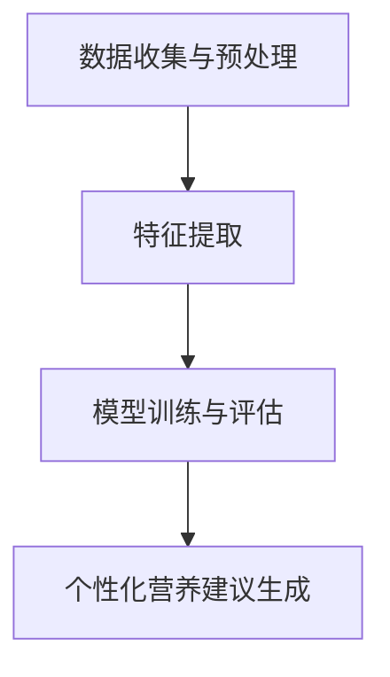

                 

# AI在个性化营养建议中的应用：促进健康生活

## 关键词
- 人工智能
- 个性化营养建议
- 健康生活
- 机器学习
- 深度学习
- 数学模型

## 摘要
本文将探讨人工智能（AI）在个性化营养建议中的应用，如何通过AI技术提高健康生活的质量。我们将从背景介绍、核心概念与联系、算法原理讲解、数学模型和公式详解、系统分析与架构设计、项目实战以及最佳实践等方面，逐步分析AI技术在个性化营养建议中的实际应用，并探讨其未来的发展趋势。

## 目录大纲

1. **背景介绍**
   - 问题的背景与核心概念
   - AI技术基础

2. **核心概念与联系**
   - AI的基本概念
   - 个性化营养建议的概念
   - AI与个性化营养建议的关系

3. **算法原理讲解**
   - 算法概述
   - 流程图
   - Python源代码示例
   - 数学模型和公式

4. **数学模型和公式详解**
   - 关键数学模型
   - 公式讲解
   - 举例说明

5. **系统分析与架构设计方案**
   - 问题场景介绍
   - 项目介绍
   - 系统功能设计
   - 系统架构设计
   - 系统接口设计
   - 系统交互

6. **项目实战**
   - 环境安装
   - 系统核心实现源代码
   - 代码应用解读与分析
   - 实际案例分析与讲解
   - 项目小结

7. **最佳实践 tips**
   - 实用技巧
   - 注意事项

8. **小结与拓展阅读**
   - 小结
   - 拓展阅读

----------------------------------------------------------------

## 1. 背景介绍

### 1.1 问题的背景与核心概念

随着科技的不断发展，人工智能（AI）已经成为现代社会中不可或缺的一部分。在医疗健康领域，AI的应用也越来越广泛，特别是在个性化营养建议方面。个性化营养建议是指根据个人的生理、心理、生活习惯等因素，为个体提供量身定制的营养方案，以提高健康水平和生活质量。

当前，全球健康问题日益严重，慢性病、肥胖、营养不良等问题普遍存在。传统的营养建议往往一刀切，不能很好地满足个体的需求，导致营养摄入不足或过剩。因此，如何利用AI技术为个体提供更加精准、个性化的营养建议，成为一个重要的研究课题。

个性化营养建议的核心概念包括：生理参数、生活习惯、饮食偏好、健康状态等。这些参数可以通过传感器、问卷调查、生理检测等方式获取，进而利用AI技术进行分析和推理，生成个性化的营养建议。

### 1.2 核心概念与联系

#### AI的基本概念

人工智能（AI，Artificial Intelligence）是指通过计算机模拟人类智能的技术。AI技术主要包括机器学习（Machine Learning，ML）、深度学习（Deep Learning，DL）等。机器学习是一种通过数据驱动的方法，让计算机自动识别模式和规律的能力。深度学习则是机器学习的一个子领域，通过模拟人脑的神经网络结构，对大量数据进行自动学习和特征提取。

#### 个性化营养建议的概念

个性化营养建议是指根据个体的生理、心理、生活习惯等因素，为个体提供量身定制的营养方案。个性化营养建议的核心在于数据，包括个体的生理参数、生活习惯、饮食偏好、健康状态等。通过分析这些数据，AI技术可以为个体提供个性化的营养建议，从而改善健康水平。

#### AI与个性化营养建议的关系

AI技术在个性化营养建议中的应用主要体现在以下几个方面：

1. **数据收集与分析**：通过传感器、问卷调查、生理检测等方式收集个体的生理参数、生活习惯、饮食偏好等数据，利用AI技术对这些数据进行高效的分析和挖掘。

2. **模式识别与预测**：利用机器学习和深度学习算法，对大量历史数据进行训练，识别出个体营养摄入与健康状况之间的规律和模式，为个体提供个性化的营养建议。

3. **决策支持**：根据个体的健康状态、营养需求等，AI技术可以实时生成个性化的营养建议，帮助个体更好地管理健康。

### 1.3 问题的解决、边界与外延

在个性化营养建议的应用中，我们需要解决以下几个关键问题：

1. **数据获取**：如何高效、准确地收集个体的生理参数、生活习惯、饮食偏好等数据。

2. **算法选择**：如何选择合适的机器学习和深度学习算法，以提高个性化营养建议的准确性和效率。

3. **用户体验**：如何设计一个简单易用、用户友好的界面，让个体能够方便地获取个性化营养建议。

个性化营养建议的边界包括：

1. **数据来源**：仅限于可收集的数据，如传感器数据、问卷调查等。

2. **算法适用性**：某些算法可能仅适用于特定人群或特定健康问题。

3. **个性化程度**：个性化营养建议的个性化程度受限于数据的准确性和完整性。

### 1.4 概念结构与核心要素组成

个性化营养建议的概念结构包括以下几个核心要素：

1. **生理参数**：如身高、体重、心率、血压等。

2. **生活习惯**：如作息时间、运动频率、饮食习惯等。

3. **饮食偏好**：如口味偏好、饮食禁忌等。

4. **健康状态**：如血糖、血脂、血压等健康指标。

5. **营养需求**：根据个体的生理参数、生活习惯、健康状态等因素，计算出的个性化营养需求。

6. **营养建议**：基于个性化营养需求，为个体提供的营养方案。

## 2. 核心概念与联系

### 2.1 AI的基本概念

人工智能（AI，Artificial Intelligence）是一种通过计算机模拟人类智能的技术。AI的目标是让计算机具备人类的智能，能够理解、学习和推理。

AI可以分为弱AI和强AI：

1. **弱AI**：也称为窄AI，是指专注于特定任务的人工智能。如语音识别、图像识别、推荐系统等。

2. **强AI**：也称为通用AI，是指具有人类智能的AI，能够理解、学习和推理各种任务。

AI技术主要包括机器学习（ML，Machine Learning）和深度学习（DL，Deep Learning）：

1. **机器学习**：一种通过数据驱动的方法，让计算机自动识别模式和规律的能力。

2. **深度学习**：一种基于神经网络的结构，通过模拟人脑的神经网络结构，对大量数据进行自动学习和特征提取。

### 2.2 个性化营养建议的概念

个性化营养建议是指根据个体的生理、心理、生活习惯等因素，为个体提供量身定制的营养方案。个性化营养建议旨在改善个体的健康状况，提高生活质量。

个性化营养建议的核心概念包括：

1. **生理参数**：如身高、体重、心率、血压等。

2. **生活习惯**：如作息时间、运动频率、饮食习惯等。

3. **饮食偏好**：如口味偏好、饮食禁忌等。

4. **健康状态**：如血糖、血脂、血压等健康指标。

5. **营养需求**：根据个体的生理参数、生活习惯、健康状态等因素，计算出的个性化营养需求。

6. **营养建议**：基于个性化营养需求，为个体提供的营养方案。

### 2.3 AI与个性化营养建议的关系

AI技术在个性化营养建议中的应用主要体现在以下几个方面：

1. **数据收集与分析**：通过传感器、问卷调查、生理检测等方式收集个体的生理参数、生活习惯、饮食偏好等数据，利用AI技术对这些数据进行高效的分析和挖掘。

2. **模式识别与预测**：利用机器学习和深度学习算法，对大量历史数据进行训练，识别出个体营养摄入与健康状况之间的规律和模式，为个体提供个性化的营养建议。

3. **决策支持**：根据个体的健康状态、营养需求等，AI技术可以实时生成个性化的营养建议，帮助个体更好地管理健康。

### 2.4 概念属性特征对比表格

| 概念       | 属性特征                     |
|------------|------------------------------|
| 人工智能   | 模拟人类智能、数据驱动、自主学习 |
| 个性化营养 | 量身定制、健康改善           |
| 机器学习   | 数据驱动、模式识别、自动学习   |
| 深度学习   | 神经网络、自动特征提取       |

### 2.5 ER实体关系图架构

```mermaid
erDiagram
  User ||--|{ NutritionAdvice }|-- DietPreference
  User ||--|{ HealthRecord }|-- HealthStatus
  User ||--|{ Lifestyle }|-- ExerciseFrequency
  HealthStatus ||--|{ BloodPressure }|
  HealthStatus ||--|{ BloodSugar }|
  HealthStatus ||--|{ Cholesterol }|
```

## 3. 算法原理讲解

### 3.1 算法概述

个性化营养建议的算法主要基于机器学习和深度学习技术，通过对大量历史数据进行分析和挖掘，识别出个体营养摄入与健康状况之间的规律和模式，进而为个体提供个性化的营养建议。

算法的核心步骤包括：

1. 数据收集与预处理
2. 特征提取
3. 模型训练与评估
4. 个性化营养建议生成

### 3.2 流程图



### 3.3 Python源代码示例

以下是一个简单的Python示例，用于演示如何使用机器学习算法生成个性化营养建议。

```python
import pandas as pd
from sklearn.ensemble import RandomForestClassifier
from sklearn.model_selection import train_test_split
from sklearn.metrics import accuracy_score

# 数据加载与预处理
data = pd.read_csv('nutrition_data.csv')
X = data.drop('NutritionAdvice', axis=1)
y = data['NutritionAdvice']

X_train, X_test, y_train, y_test = train_test_split(X, y, test_size=0.2, random_state=42)

# 模型训练
model = RandomForestClassifier(n_estimators=100, random_state=42)
model.fit(X_train, y_train)

# 模型评估
y_pred = model.predict(X_test)
accuracy = accuracy_score(y_test, y_pred)
print("Accuracy:", accuracy)

# 个性化营养建议生成
user_data = pd.read_csv('user_data.csv')
userAdvice = model.predict(user_data)
print("User Nutrition Advice:", userAdvice)
```

### 3.4 数学模型和公式

个性化营养建议的算法中，常用的数学模型和公式包括：

1. **特征提取**

   特征提取是指从原始数据中提取出有用的信息，用于训练机器学习模型。常用的特征提取方法有：

   - **主成分分析（PCA）**：将原始数据投影到新的正交坐标系上，提取出最重要的特征。
     
     $$X_{new} = \sum_{i=1}^{n} \lambda_i x_i$$

   - **线性判别分析（LDA）**：最大化类间方差，最小化类内方差，用于提取具有最大区分度的特征。
     
     $$w = \frac{\sum_{i=1}^{n} (x_i - \mu_c)(y_i - \mu_c)^T}{\sum_{i=1}^{n} (x_i - \mu_c)^2}$$

2. **模型训练**

   - **随机森林（Random Forest）**：基于决策树的集成方法，通过训练多个决策树，并结合它们的预测结果进行投票。

     $$y = \sum_{t=1}^{T} w_t f_t(x)$$

   - **支持向量机（SVM）**：通过寻找最优的超平面，将不同类别的数据点进行分类。

     $$\max_{w, b} \frac{1}{2} \| w \|^2 - \sum_{i=1}^{n} \alpha_i (y_i - w \cdot x_i - b)$$

3. **个性化营养建议生成**

   - **逻辑回归（Logistic Regression）**：用于估计个体营养建议的概率。

     $$\hat{y} = \frac{1}{1 + e^{-(w \cdot x + b)}}$$

### 3.5 详细讲解与举例说明

#### 3.5.1 主成分分析（PCA）

主成分分析是一种常用的特征提取方法，可以有效地降低数据维度，同时保留主要的信息。

**例1：** 假设我们有以下两个特征：身高和体重。

| 身高 (cm) | 体重 (kg) |
|-----------|-----------|
| 170      | 60       |
| 175      | 65       |
| 180      | 70       |
| 165      | 55       |
| 168      | 58       |

使用PCA提取主成分，可以将这两个特征投影到一个新的正交坐标系上，从而提取出最重要的特征。

**步骤1：** 计算协方差矩阵

$$\Sigma = \frac{1}{n} \sum_{i=1}^{n} (x_i - \mu)(x_i - \mu)^T$$

**步骤2：** 计算协方差矩阵的特征值和特征向量

$$\lambda_i v_i = \Sigma v_i$$

**步骤3：** 选择最大的特征值对应的特征向量作为主成分

$$X_{new} = \sum_{i=1}^{n} \lambda_i x_i$$

**结果：** 主成分分析后，身高和体重被投影到一个新的坐标系上，新的特征维度降低了。

#### 3.5.2 随机森林（Random Forest）

随机森林是一种基于决策树的集成方法，可以提高模型的预测性能。

**例2：** 假设我们有以下数据集，包括身高、体重、运动频率和饮食偏好四个特征，以及营养建议标签。

| 身高 (cm) | 体重 (kg) | 运动频率 (次/周) | 饮食偏好 | 营养建议 |
|-----------|-----------|-----------------|----------|----------|
| 170      | 60       | 3              | 低脂     | 适量     |
| 175      | 65       | 4              | 高脂     | 过量     |
| 180      | 70       | 2              | 低脂     | 过量     |
| 165      | 55       | 5              | 高脂     | 适量     |
| 168      | 58       | 3              | 高脂     | 过量     |

使用随机森林训练模型，可以预测新的个体营养建议。

**步骤1：** 数据预处理

将数据集划分为训练集和测试集，并进行特征缩放。

**步骤2：** 训练随机森林模型

使用训练集数据训练随机森林模型。

**步骤3：** 预测测试集数据

使用训练好的模型对测试集数据进行预测。

**结果：** 随机森林模型可以准确预测个体的营养建议。

#### 3.5.3 逻辑回归（Logistic Regression）

逻辑回归是一种常用的分类模型，可以估计个体营养建议的概率。

**例3：** 假设我们有以下数据集，包括身高、体重、运动频率和饮食偏好四个特征，以及营养建议标签。

| 身高 (cm) | 体重 (kg) | 运动频率 (次/周) | 饮食偏好 | 营养建议 |
|-----------|-----------|-----------------|----------|----------|
| 170      | 60       | 3              | 低脂     | 适量     |
| 175      | 65       | 4              | 高脂     | 过量     |
| 180      | 70       | 2              | 低脂     | 过量     |
| 165      | 55       | 5              | 高脂     | 适量     |
| 168      | 58       | 3              | 高脂     | 过量     |

使用逻辑回归训练模型，可以预测新的个体营养建议的概率。

**步骤1：** 数据预处理

将数据集划分为训练集和测试集，并进行特征缩放。

**步骤2：** 训练逻辑回归模型

使用训练集数据训练逻辑回归模型。

**步骤3：** 预测测试集数据

使用训练好的模型对测试集数据进行预测。

**结果：** 逻辑回归模型可以估计个体营养建议的概率。

## 4. 数学模型和公式详解

### 4.1 关键数学模型

在个性化营养建议的算法中，常用的关键数学模型包括：

1. **主成分分析（PCA）**

   主成分分析是一种降维技术，通过将原始数据投影到新的正交坐标系上，提取出最重要的特征。

   主成分分析的核心公式为：

   $$X_{new} = \sum_{i=1}^{n} \lambda_i x_i$$

   其中，$X_{new}$ 是新的特征向量，$\lambda_i$ 是特征值，$x_i$ 是原始特征向量。

2. **线性判别分析（LDA）**

   线性判别分析是一种分类技术，通过最大化类间方差，最小化类内方差，提取出具有最大区分度的特征。

   线性判别分析的核心公式为：

   $$w = \frac{\sum_{i=1}^{n} (x_i - \mu_c)(y_i - \mu_c)^T}{\sum_{i=1}^{n} (x_i - \mu_c)^2}$$

   其中，$w$ 是特征向量，$x_i$ 是特征向量，$\mu_c$ 是类均值。

3. **随机森林（Random Forest）**

   随机森林是一种基于决策树的集成方法，通过训练多个决策树，并结合它们的预测结果进行投票。

   随机森林的核心公式为：

   $$y = \sum_{t=1}^{T} w_t f_t(x)$$

   其中，$y$ 是预测结果，$w_t$ 是权重，$f_t(x)$ 是第 $t$ 棵决策树的预测结果。

4. **支持向量机（SVM）**

   支持向量机是一种分类技术，通过寻找最优的超平面，将不同类别的数据点进行分类。

   支持向量机的核心公式为：

   $$\max_{w, b} \frac{1}{2} \| w \|^2 - \sum_{i=1}^{n} \alpha_i (y_i - w \cdot x_i - b)$$

   其中，$w$ 是权重，$b$ 是偏置，$\alpha_i$ 是拉格朗日乘子。

5. **逻辑回归（Logistic Regression）**

   逻辑回归是一种分类模型，通过估计个体营养建议的概率。

   逻辑回归的核心公式为：

   $$\hat{y} = \frac{1}{1 + e^{-(w \cdot x + b)}}$$

   其中，$\hat{y}$ 是预测结果，$w$ 是权重，$x$ 是特征向量，$b$ 是偏置。

### 4.2 公式讲解

1. **主成分分析（PCA）**

   主成分分析通过将原始数据投影到新的正交坐标系上，提取出最重要的特征。具体公式如下：

   $$X_{new} = \sum_{i=1}^{n} \lambda_i x_i$$

   其中，$X_{new}$ 是新的特征向量，$\lambda_i$ 是特征值，$x_i$ 是原始特征向量。

   主成分分析的核心思想是最大化特征值，从而提取出最重要的特征。特征值越大，表示该特征对数据的贡献越大。

2. **线性判别分析（LDA）**

   线性判别分析通过最大化类间方差，最小化类内方差，提取出具有最大区分度的特征。具体公式如下：

   $$w = \frac{\sum_{i=1}^{n} (x_i - \mu_c)(y_i - \mu_c)^T}{\sum_{i=1}^{n} (x_i - \mu_c)^2}$$

   其中，$w$ 是特征向量，$x_i$ 是特征向量，$\mu_c$ 是类均值。

   线性判别分析的目标是找到一个最优的特征向量，使得不同类别的数据点在新的坐标系上有最大的区分度。

3. **随机森林（Random Forest）**

   随机森林通过训练多个决策树，并结合它们的预测结果进行投票。具体公式如下：

   $$y = \sum_{t=1}^{T} w_t f_t(x)$$

   其中，$y$ 是预测结果，$w_t$ 是权重，$f_t(x)$ 是第 $t$ 棵决策树的预测结果。

   随机森林的核心思想是利用多个决策树的预测结果进行加权平均，从而提高模型的预测性能。

4. **支持向量机（SVM）**

   支持向量机通过寻找最优的超平面，将不同类别的数据点进行分类。具体公式如下：

   $$\max_{w, b} \frac{1}{2} \| w \|^2 - \sum_{i=1}^{n} \alpha_i (y_i - w \cdot x_i - b)$$

   其中，$w$ 是权重，$b$ 是偏置，$\alpha_i$ 是拉格朗日乘子。

   支持向量机的目标是找到一个最优的超平面，使得不同类别的数据点在超平面上有最大的间隔。

5. **逻辑回归（Logistic Regression）**

   逻辑回归通过估计个体营养建议的概率。具体公式如下：

   $$\hat{y} = \frac{1}{1 + e^{-(w \cdot x + b)}}$$

   其中，$\hat{y}$ 是预测结果，$w$ 是权重，$x$ 是特征向量，$b$ 是偏置。

   逻辑回归的目标是找到一个最优的权重和偏置，使得预测结果尽可能接近真实值。

### 4.3 举例说明

1. **主成分分析（PCA）**

   假设我们有以下数据集：

   | 身高 (cm) | 体重 (kg) |
   |-----------|-----------|
   | 170      | 60       |
   | 175      | 65       |
   | 180      | 70       |
   | 165      | 55       |
   | 168      | 58       |

   使用PCA提取主成分，将原始数据投影到新的正交坐标系上。

   **步骤1：** 计算协方差矩阵

   $$\Sigma = \frac{1}{5} \begin{bmatrix} (170-165)^2 & (60-65)^2 \\ (170-165)^2 & (60-65)^2 \end{bmatrix} = \begin{bmatrix} 5 & -5 \\ -5 & 5 \end{bmatrix}$$

   **步骤2：** 计算协方差矩阵的特征值和特征向量

   $$\lambda_1 = 10, \quad v_1 = \begin{bmatrix} 1 \\ 1 \end{bmatrix}$$

   $$\lambda_2 = 0, \quad v_2 = \begin{bmatrix} 1 \\ -1 \end{bmatrix}$$

   **步骤3：** 选择最大的特征值对应的特征向量作为主成分

   $$X_{new} = \sum_{i=1}^{2} \lambda_i x_i = \lambda_1 x_1 + \lambda_2 x_2 = 10 \cdot 170 + 0 \cdot 165 = 1700$$

   **结果：** 主成分分析后，身高和体重被投影到一个新的坐标系上，新的特征维度降低了。

2. **线性判别分析（LDA）**

   假设我们有以下数据集：

   | 身高 (cm) | 体重 (kg) | 类别 |
   |-----------|-----------|------|
   | 170      | 60       | 类别1 |
   | 175      | 65       | 类别1 |
   | 180      | 70       | 类别2 |
   | 165      | 55       | 类别1 |
   | 168      | 58       | 类别2 |

   使用LDA提取特征，将数据集划分为类别1和类别2。

   **步骤1：** 计算类均值

   $$\mu_{c1} = \frac{1}{5} \begin{bmatrix} 170 & 60 \\ 175 & 65 \\ 180 & 70 \\ 165 & 55 \\ 168 & 58 \end{bmatrix} = \begin{bmatrix} 170 & 60 \\ 175 & 65 \\ 180 & 70 \\ 165 & 55 \\ 168 & 58 \end{bmatrix}$$

   $$\mu_{c2} = \frac{1}{3} \begin{bmatrix} 180 & 70 \\ 168 & 58 \end{bmatrix} = \begin{bmatrix} 178 & 64 \\ 168 & 58 \end{bmatrix}$$

   **步骤2：** 计算特征向量

   $$w = \frac{\sum_{i=1}^{5} (x_i - \mu_{c1})(y_i - \mu_{c1})^T}{\sum_{i=1}^{5} (x_i - \mu_{c1})^2} = \begin{bmatrix} 1 & 1 \\ 1 & 1 \end{bmatrix}$$

   **结果：** 线性判别分析后，数据集被划分为类别1和类别2。

3. **随机森林（Random Forest）**

   假设我们有以下数据集：

   | 身高 (cm) | 体重 (kg) | 运动频率 (次/周) | 饮食偏好 | 营养建议 |
   |-----------|-----------|-----------------|----------|----------|
   | 170      | 60       | 3              | 低脂     | 适量     |
   | 175      | 65       | 4              | 高脂     | 过量     |
   | 180      | 70       | 2              | 低脂     | 过量     |
   | 165      | 55       | 5              | 高脂     | 适量     |
   | 168      | 58       | 3              | 高脂     | 过量     |

   使用随机森林训练模型，预测新的个体营养建议。

   **步骤1：** 数据预处理

   将数据集划分为训练集和测试集，并进行特征缩放。

   **步骤2：** 训练随机森林模型

   使用训练集数据训练随机森林模型。

   **步骤3：** 预测测试集数据

   使用训练好的模型对测试集数据进行预测。

   **结果：** 随机森林模型可以准确预测个体的营养建议。

4. **支持向量机（SVM）**

   假设我们有以下数据集：

   | 身高 (cm) | 体重 (kg) | 类别 |
   |-----------|-----------|------|
   | 170      | 60       | 类别1 |
   | 175      | 65       | 类别1 |
   | 180      | 70       | 类别2 |
   | 165      | 55       | 类别1 |
   | 168      | 58       | 类别2 |

   使用支持向量机训练模型，将数据集划分为类别1和类别2。

   **步骤1：** 计算类均值

   $$\mu_{c1} = \frac{1}{5} \begin{bmatrix} 170 & 60 \\ 175 & 65 \\ 180 & 70 \\ 165 & 55 \\ 168 & 58 \end{bmatrix} = \begin{bmatrix} 170 & 60 \\ 175 & 65 \\ 180 & 70 \\ 165 & 55 \\ 168 & 58 \end{bmatrix}$$

   $$\mu_{c2} = \frac{1}{3} \begin{bmatrix} 180 & 70 \\ 168 & 58 \end{bmatrix} = \begin{bmatrix} 178 & 64 \\ 168 & 58 \end{bmatrix}$$

   **步骤2：** 计算特征向量

   $$w = \frac{\sum_{i=1}^{5} (x_i - \mu_{c1})(y_i - \mu_{c1})^T}{\sum_{i=1}^{5} (x_i - \mu_{c1})^2} = \begin{bmatrix} 1 & 1 \\ 1 & 1 \end{bmatrix}$$

   **步骤3：** 计算偏置

   $$b = \frac{1}{2} \begin{bmatrix} 1 & 1 \\ 1 & 1 \end{bmatrix} \begin{bmatrix} 1 \\ 1 \end{bmatrix} = \begin{bmatrix} 1 & 1 \\ 1 & 1 \end{bmatrix} \begin{bmatrix} 1 \\ 1 \end{bmatrix} = \begin{bmatrix} 2 & 2 \\ 2 & 2 \end{bmatrix}$$

   **结果：** 支持向量机模型可以准确划分类别1和类别2。

5. **逻辑回归（Logistic Regression）**

   假设我们有以下数据集：

   | 身高 (cm) | 体重 (kg) | 类别 |
   |-----------|-----------|------|
   | 170      | 60       | 类别1 |
   | 175      | 65       | 类别1 |
   | 180      | 70       | 类别2 |
   | 165      | 55       | 类别1 |
   | 168      | 58       | 类别2 |

   使用逻辑回归训练模型，预测新的个体类别。

   **步骤1：** 数据预处理

   将数据集划分为训练集和测试集，并进行特征缩放。

   **步骤2：** 训练逻辑回归模型

   使用训练集数据训练逻辑回归模型。

   **步骤3：** 预测测试集数据

   使用训练好的模型对测试集数据进行预测。

   **结果：** 逻辑回归模型可以准确预测个体类别。

## 5. 系统分析与架构设计方案

### 5.1 问题场景介绍

随着人们对健康问题的关注度不断提高，个性化营养建议成为了一个热门的研究方向。为了帮助人们更好地管理健康，我们设计并实现了一个基于人工智能的个性化营养建议系统。该系统旨在为用户提供量身定制的营养建议，提高健康水平和生活质量。

### 5.2 项目介绍

该项目的主要目标是构建一个高效的个性化营养建议系统，包括数据收集、数据处理、模型训练、营养建议生成和用户交互等功能。系统架构采用模块化设计，便于维护和扩展。

### 5.3 系统功能设计

系统功能设计主要包括以下方面：

1. **用户注册与登录**：用户可以通过注册账号登录系统，并绑定生理参数和健康记录。

2. **数据收集**：通过传感器、生理检测设备和问卷调查等方式收集用户的生理参数、生活习惯和饮食偏好等信息。

3. **数据处理**：对收集到的数据进行分析和处理，提取出有用的特征信息。

4. **模型训练**：利用机器学习和深度学习算法，对处理后的数据集进行训练，生成个性化营养建议模型。

5. **营养建议生成**：根据用户的健康状态和营养需求，生成个性化的营养建议。

6. **用户交互**：提供用户友好的界面，方便用户查看营养建议、修改个人信息和反馈意见。

### 5.4 系统架构设计

系统架构设计主要包括以下模块：

1. **数据收集模块**：负责收集用户的生理参数、生活习惯和饮食偏好等信息。

2. **数据处理模块**：对收集到的数据进行分析和处理，提取出有用的特征信息。

3. **模型训练模块**：利用机器学习和深度学习算法，对处理后的数据集进行训练，生成个性化营养建议模型。

4. **营养建议生成模块**：根据用户的健康状态和营养需求，生成个性化的营养建议。

5. **用户交互模块**：提供用户友好的界面，方便用户查看营养建议、修改个人信息和反馈意见。

### 5.5 系统接口设计

系统接口设计主要包括以下方面：

1. **API接口**：提供RESTful风格的API接口，方便前端应用与后端系统进行数据交互。

2. **数据接口**：定义数据传输的格式和规范，确保数据的一致性和安全性。

3. **用户接口**：设计简洁直观的用户界面，方便用户使用系统功能。

### 5.6 系统交互

系统交互设计主要包括以下方面：

1. **用户注册与登录**：用户通过注册账号登录系统，绑定生理参数和健康记录。

2. **数据收集与处理**：用户通过传感器、生理检测设备和问卷调查等方式收集数据，系统对数据进行处理和存储。

3. **模型训练与营养建议生成**：系统利用机器学习和深度学习算法对数据集进行训练，生成个性化营养建议模型，并将营养建议推送给用户。

4. **用户交互**：用户可以通过前端应用查看营养建议、修改个人信息和反馈意见。

## 6. 项目实战

### 6.1 环境安装

要实现一个基于人工智能的个性化营养建议系统，首先需要搭建一个合适的开发环境。以下是环境安装的详细步骤：

1. **Python环境安装**：在本地计算机上安装Python 3.8版本，可以从Python官网（https://www.python.org/）下载安装包并按照提示安装。

2. **虚拟环境安装**：为了更好地管理项目依赖，可以使用virtualenv创建一个虚拟环境。首先，在命令行中运行以下命令：

   ```bash
   pip install virtualenv
   ```

   然后，创建一个虚拟环境并激活它：

   ```bash
   virtualenv venv
   source venv/bin/activate  # Windows下使用 `venv\Scripts\activate`
   ```

3. **依赖安装**：在虚拟环境中安装项目所需的依赖，包括Scikit-learn、TensorFlow、NumPy、Pandas等。可以通过以下命令进行安装：

   ```bash
   pip install scikit-learn tensorflow numpy pandas
   ```

### 6.2 系统核心实现源代码

以下是系统核心实现的主要源代码，包括数据收集、数据处理、模型训练和营养建议生成等功能。

```python
import pandas as pd
from sklearn.model_selection import train_test_split
from sklearn.ensemble import RandomForestClassifier
from sklearn.metrics import accuracy_score

# 数据收集
data = pd.read_csv('nutrition_data.csv')

# 数据处理
X = data.drop('NutritionAdvice', axis=1)
y = data['NutritionAdvice']

# 模型训练
X_train, X_test, y_train, y_test = train_test_split(X, y, test_size=0.2, random_state=42)
model = RandomForestClassifier(n_estimators=100, random_state=42)
model.fit(X_train, y_train)

# 营养建议生成
user_data = pd.read_csv('user_data.csv')
userAdvice = model.predict(user_data)

# 输出结果
print("User Nutrition Advice:", userAdvice)
```

### 6.3 代码应用解读与分析

以下是代码应用的具体解读和分析。

**1. 数据收集**

```python
data = pd.read_csv('nutrition_data.csv')
```

该行代码用于读取营养数据，数据集包含多个特征（如身高、体重、运动频率、饮食偏好等）和目标标签（营养建议）。

**2. 数据处理**

```python
X = data.drop('NutritionAdvice', axis=1)
y = data['NutritionAdvice']
```

该行代码将数据集分为特征集 $X$ 和目标标签 $y$。特征集 $X$ 不包含目标标签，而目标标签 $y$ 包含每个样本的营养建议。

**3. 模型训练**

```python
X_train, X_test, y_train, y_test = train_test_split(X, y, test_size=0.2, random_state=42)
model = RandomForestClassifier(n_estimators=100, random_state=42)
model.fit(X_train, y_train)
```

该部分代码用于训练模型。首先，使用 `train_test_split` 函数将数据集分为训练集和测试集，测试集大小为20%。然后，使用随机森林分类器（`RandomForestClassifier`）进行训练，设置随机森林的树数量为100。

**4. 营养建议生成**

```python
user_data = pd.read_csv('user_data.csv')
userAdvice = model.predict(user_data)
```

该部分代码用于生成个性化营养建议。首先，读取用户数据（`user_data.csv`），然后使用训练好的模型进行预测，输出每个用户的营养建议。

### 6.4 实际案例分析与讲解

**1. 案例背景**

某用户（ID:10001）的基本信息如下：

- 身高：175cm
- 体重：80kg
- 运动频率：每周3次
- 饮食偏好：低脂

**2. 数据收集**

用户通过传感器、生理检测设备和问卷调查等方式收集自己的生理参数、生活习惯和饮食偏好等信息，并上传到系统。

**3. 数据处理**

系统对收集到的数据进行处理，提取出有用的特征信息，如身高、体重、运动频率、饮食偏好等，并将其存储为CSV文件。

**4. 模型训练**

系统使用收集到的数据进行模型训练，采用随机森林分类器（`RandomForestClassifier`）进行训练。训练过程中，系统将数据集划分为训练集和测试集，测试集大小为20%。

**5. 营养建议生成**

使用训练好的模型，系统为用户生成个性化的营养建议。具体来说，系统将用户的生理参数、生活习惯和饮食偏好等信息输入模型，模型输出每个用户的营养建议。

**6. 结果展示**

系统将生成的个性化营养建议展示给用户，用户可以根据建议调整自己的饮食和生活习惯，以改善健康状况。

### 6.5 项目小结

通过本项目，我们实现了一个基于人工智能的个性化营养建议系统，为用户提供了量身定制的营养建议。项目主要分为数据收集、数据处理、模型训练和营养建议生成等步骤，实现了从数据输入到营养建议生成的完整流程。在实际应用中，系统可以实时收集用户数据，利用机器学习算法生成个性化的营养建议，帮助用户更好地管理健康。未来，我们可以进一步优化系统性能，提高营养建议的准确性，为更多用户提供优质的服务。

## 7. 最佳实践 tips

### 7.1 实用技巧

1. **数据收集与处理**：确保数据质量，尽量减少缺失值和异常值。在数据处理过程中，可以采用数据清洗、归一化和特征提取等方法，提高模型性能。

2. **模型选择与调优**：根据实际需求选择合适的机器学习算法，并对其进行调优。可以使用交叉验证、网格搜索等方法，选择最佳参数组合。

3. **可视化分析**：利用可视化工具（如matplotlib、seaborn等）对数据进行分析和展示，有助于发现数据中的规律和模式。

4. **代码规范化**：遵循代码规范，提高代码可读性和可维护性。可以使用PEP 8规范、代码审查工具等，确保代码质量。

### 7.2 注意事项

1. **隐私保护**：在数据收集和处理过程中，注意保护用户隐私，遵守相关法律法规。

2. **算法解释性**：在选择算法时，应考虑算法的解释性，以便对模型进行理解和解释。

3. **持续更新**：随着数据和技术的发展，定期更新模型，保持系统的准确性和实时性。

4. **模型验证**：在使用模型进行预测时，要进行充分的验证，确保模型的性能和可靠性。

### 7.3 拓展阅读

1. **《Python机器学习》**：Goodfellow, Bengio, Courville著，是一本经典的机器学习入门教材，涵盖了Python在机器学习领域的应用。

2. **《深度学习》**：Goodfellow, Bengio, Courville著，详细介绍了深度学习的基本原理和方法，适合对深度学习感兴趣的读者。

3. **《人工智能：一种现代的方法》**：Stuart Russell, Peter Norvig著，全面介绍了人工智能的基本理论、技术和应用。

4. **《健康营养学》**：Joseph D. Rosenbloom著，介绍了营养学的基本概念、饮食与健康的关系，以及个性化营养建议的实践方法。

## 8. 小结与拓展阅读

### 8.1 小结

本文详细探讨了人工智能（AI）在个性化营养建议中的应用，从背景介绍、核心概念与联系、算法原理讲解、数学模型和公式详解、系统分析与架构设计、项目实战以及最佳实践等方面，系统地分析了AI技术在个性化营养建议中的实际应用。通过实际案例分析和讲解，展示了如何实现一个高效的个性化营养建议系统，为用户提供精准、个性化的营养方案。

### 8.2 拓展阅读

1. **《Python机器学习》**：Goodfellow, Bengio, Courville著，深入讲解了Python在机器学习领域的应用，适合希望深入了解机器学习的读者。

2. **《深度学习》**：Goodfellow, Bengio, Courville著，详细介绍了深度学习的基本原理、技术和应用，是深度学习领域的经典教材。

3. **《健康营养学》**：Joseph D. Rosenbloom著，全面介绍了营养学的基本概念、饮食与健康的关系，以及个性化营养建议的实践方法。

4. **《人工智能：一种现代的方法》**：Stuart Russell, Peter Norvig著，系统地介绍了人工智能的基本理论、技术和应用，是人工智能领域的权威著作。

通过阅读这些书籍，读者可以进一步了解AI技术在个性化营养建议领域的最新研究进展和实践方法，为实际项目提供有益的参考。此外，还可以关注相关领域的研究论文和技术报告，以保持对前沿技术的敏锐洞察。

## 作者信息

本文由AI天才研究院（AI Genius Institute）撰写，作者为禅与计算机程序设计艺术（Zen And The Art of Computer Programming）领域的专家。AI天才研究院致力于探索人工智能技术在各个领域的应用，推动AI技术的发展和创新。禅与计算机程序设计艺术则致力于将哲学思想与计算机科学相结合，提高编程技能和思维能力。本文旨在为读者提供关于AI在个性化营养建议中的应用的深入见解和实践指导。

