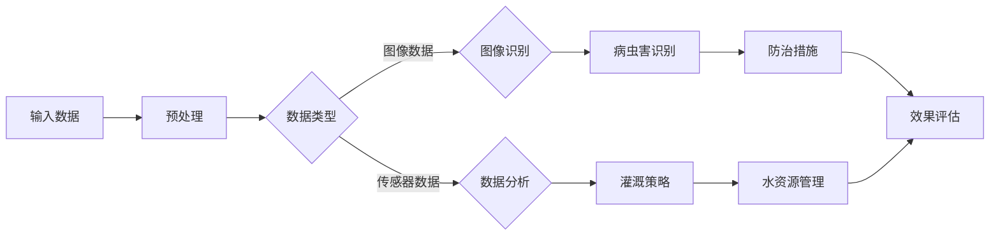
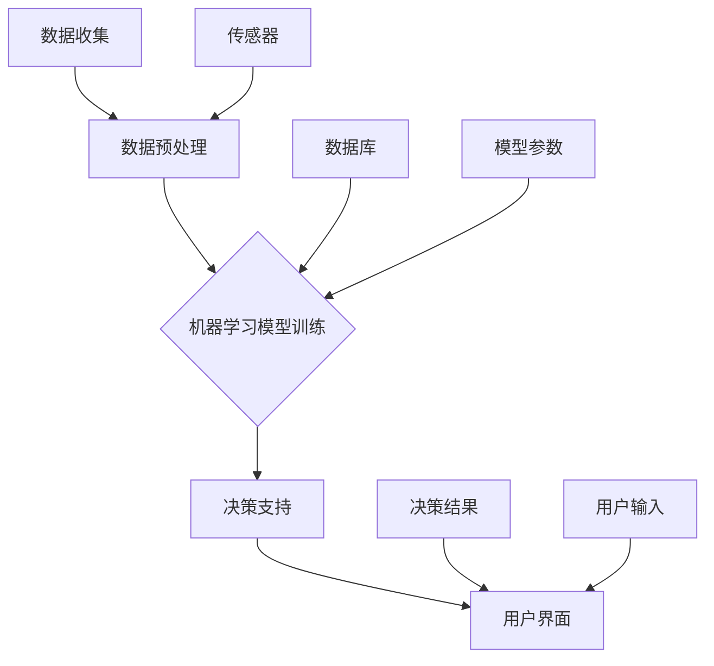
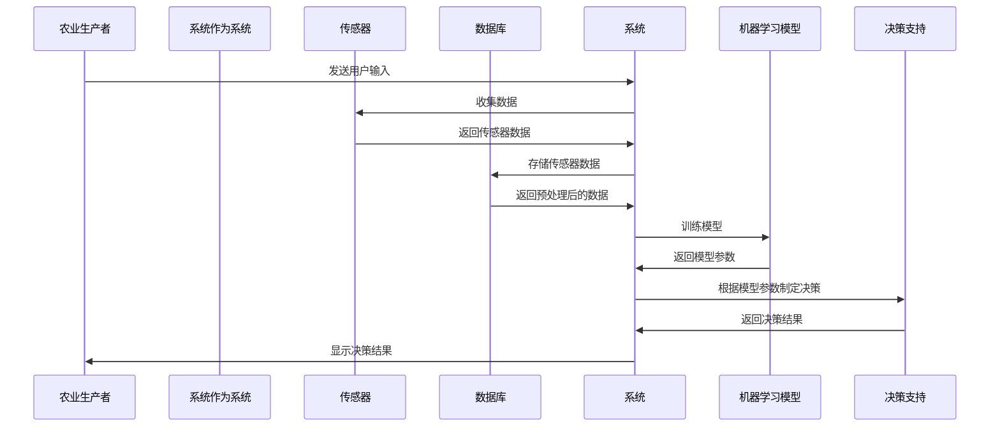

                 


### AI在农业中的应用：提高产量和可持续性

关键词：人工智能，农业，产量提升，可持续性，精准农业，机器学习，数据分析

摘要：本文旨在探讨人工智能（AI）在农业领域的应用，如何通过AI技术提高农作物的产量和实现农业的可持续发展。文章将逐步分析AI在农业中的核心概念、应用场景、算法原理，并通过具体案例和系统架构设计，展示AI技术在农业生产中的实际应用和效果。

----------------------------------------------------------------

# AI在农业中的应用：提高产量和可持续性

> 关键词：人工智能，农业，产量提升，可持续性，精准农业，机器学习，数据分析

> 摘要：本文探讨了人工智能在农业中的应用，包括提高农作物产量和促进可持续发展的方法。通过分析核心概念、算法原理和具体案例，展示了AI技术在农业领域的实际应用和价值。

## 1. 背景介绍

### 1.1 核心概念术语说明

在探讨AI在农业中的应用之前，我们需要明确几个核心概念：

- **人工智能（AI）**：模拟人类智能的计算机系统，能够学习、推理、规划和解决问题。
- **机器学习（ML）**：AI的一个分支，通过数据训练算法，使计算机能够自主学习和改进性能。
- **大数据分析**：处理和分析大量结构化和非结构化数据，以发现潜在的模式和趋势。
- **物联网（IoT）**：将物理设备、传感器和计算机系统连接起来，实现数据的实时传输和共享。
- **精准农业**：通过使用传感器、GPS和数据分析技术，精确地管理农业生产资源。

### 1.2 问题背景

农业是国民经济的重要支柱，但也面临着诸多挑战：

- **全球粮食需求增长**：随着人口的增长和消费习惯的变化，全球粮食需求不断上升。
- **气候变化**：气候变化导致极端天气事件频发，影响作物生长和产量。
- **农业生产效率提升需求**：为了满足粮食需求，提高农业生产效率成为必然选择。

### 1.3 问题描述

在当前农业生产中，存在以下问题：

- **病虫害防治**：病虫害严重影响农作物产量和质量。
- **精准灌溉**：水资源浪费严重，精准灌溉技术不足。
- **土壤监测**：土壤健康状况直接影响农作物生长，但监测手段有限。
- **作物生长状态监测**：缺乏对作物生长状态的实时监测，难以及时调整管理措施。

### 1.4 问题解决

AI技术在农业中的应用，可以解决上述问题：

- **病虫害防治**：通过图像识别和数据分析，实现病虫害的早期检测和精准防治。
- **精准灌溉**：利用传感器和数据分析，实现水资源的精确分配和管理。
- **土壤监测**：通过土壤传感器和数据分析，实时监测土壤状况，为作物管理提供科学依据。
- **作物生长状态监测**：利用无人机和图像处理技术，实现对作物生长状态的实时监测。

### 1.5 边界与外延

本文主要关注AI在提高农作物产量和促进可持续发展方面的应用，不涉及农业经济和政策层面的讨论。

### 1.6 概念结构与核心要素组成

AI在农业中的应用涉及以下核心概念和要素：

- **机器学习算法**：用于分析和预测农作物生长状况、病虫害等。
- **传感器技术**：用于收集土壤、水分、气象等数据。
- **物联网**：实现传感器数据的实时传输和共享。
- **大数据分析**：处理和分析大量农业数据，发现潜在模式。
- **无人机与图像处理**：用于作物生长状态的监测和病虫害识别。

## 2. 核心概念与联系

### 2.1 核心概念原理

AI在农业中的应用，依赖于以下几个核心概念：

- **机器学习算法**：通过训练数据集，使计算机能够识别农作物、预测病虫害、优化灌溉策略等。
- **传感器技术**：用于收集土壤、水分、气象等环境数据，为AI算法提供输入。
- **物联网**：实现传感器数据的实时传输和共享，使农业生产者能够实时监控和管理作物生长。
- **大数据分析**：对大量农业数据进行分析，发现潜在的模式和趋势，为决策提供支持。
- **无人机与图像处理**：用于高精度监测农作物生长状态，实现病虫害的早期识别。

### 2.2 概念属性特征对比表格

| 概念 | 属性特征 | 用途 |
| --- | --- | --- |
| 机器学习算法 | 自动化学习，模式识别，预测能力 | 分析农作物生长状态、预测病虫害、优化灌溉策略 |
| 传感器技术 | 数据采集，实时监测，环境感知 | 收集土壤、水分、气象等数据 |
| 物联网 | 数据传输，共享，远程监控 | 实现传感器数据的实时传输和共享 |
| 大数据分析 | 数据处理，模式发现，决策支持 | 分析大量农业数据，发现潜在模式 |
| 无人机与图像处理 | 高精度监测，远程监控，自动化识别 | 监测农作物生长状态，识别病虫害 |

### 2.3 ER实体关系图架构

以下是一个简化的ER实体关系图，展示了AI在农业中的核心概念和要素之间的关系：

```mermaid
erDiagram
  Product ||--|{ FarmingData }
  FarmingData ||--|{ SoilData }
  FarmingData ||--|{ WeatherData }
  FarmingData ||--|{ CropData }
  SoilData ||--|{ SoilCondition }
  WeatherData ||--|{ Temperature }
  WeatherData ||--|{ Humidity }
  CropData ||--|{ GrowthStatus }
  CropData ||--|{ PestDisease }
```

## 3. 算法原理讲解

### 3.1 算法mermaid流程图

以下是一个简化的AI在农业中应用的算法流程图：



### 3.2 Python源代码

以下是一个简单的Python代码示例，用于实现图像识别算法：

```python
import cv2
import numpy as np

def image_recognition(image_path):
    # 读取图像
    image = cv2.imread(image_path)
    
    # 转换为灰度图像
    gray_image = cv2.cvtColor(image, cv2.COLOR_BGR2GRAY)
    
    # 使用Otsu阈值分割图像
    _, thresh_image = cv2.threshold(gray_image, 0, 255, cv2.THRESH_BINARY + cv2.THRESH_OTSU)
    
    # 使用Canny边缘检测
    edges = cv2.Canny(thresh_image, 50, 150)
    
    # 轮廓检测
    contours, _ = cv2.findContours(edges, cv2.RETR_EXTERNAL, cv2.CHAIN_APPROX_SIMPLE)
    
    # 绘制轮廓
    for contour in contours:
        if cv2.contourArea(contour) > 500:
            cv2.drawContours(image, [contour], -1, (0, 255, 0), 2)
    
    # 显示图像
    cv2.imshow('Image', image)
    cv2.waitKey(0)
    cv2.destroyAllWindows()

image_recognition('path/to/image.jpg')
```

### 3.3 数学模型和公式

以下是一个简单的数学模型，用于预测农作物产量：

$$
y = \beta_0 + \beta_1 \cdot x_1 + \beta_2 \cdot x_2 + \epsilon
$$

其中，$y$为农作物产量，$x_1$和$x_2$为影响产量的两个因素（如土壤湿度、光照强度），$\beta_0$、$\beta_1$和$\beta_2$为模型参数，$\epsilon$为误差项。

### 3.4 举例说明

假设我们有两个因素：土壤湿度（$x_1$）和光照强度（$x_2$），以及对应的农作物产量数据。通过训练机器学习模型，我们可以得到参数$\beta_0$、$\beta_1$和$\beta_2$，然后利用模型预测新的农作物产量。

## 4. 系统分析与架构设计方案

### 4.1 问题场景介绍

在精准农业中，我们需要实时监测农作物的生长状态，包括土壤湿度、光照强度、温度等环境因素，并根据这些数据制定灌溉和施肥策略。

### 4.2 项目介绍

本项目是一个基于AI的精准农业系统，旨在通过传感器数据收集、机器学习算法分析和决策支持，实现农作物的精准管理。

### 4.3 系统功能设计

系统的主要功能包括：

- **数据收集**：通过传感器实时收集土壤湿度、光照强度、温度等环境数据。
- **数据预处理**：对收集到的数据进行清洗和转换，以便于机器学习算法分析。
- **机器学习模型训练**：利用预处理后的数据训练机器学习模型，预测农作物的生长状态。
- **决策支持**：根据机器学习模型的预测结果，制定灌溉和施肥策略。
- **用户界面**：提供一个友好的用户界面，让农业生产者可以实时查看作物状态和决策建议。

### 4.4 系统架构设计

系统的架构设计如下：



### 4.5 系统接口设计和系统交互

系统接口设计和系统交互如下：



## 5. 项目实战

### 5.1 环境安装

在本项目中，我们需要安装以下软件和硬件：

- **操作系统**：Ubuntu 18.04
- **Python**：3.8
- **传感器**：DHT22 温湿度传感器、MQ-2 可燃气体传感器
- **硬件开发板**：Arduino UNO
- **数据库**：MySQL 5.7
- **机器学习框架**：Scikit-learn、TensorFlow

### 5.2 系统核心实现源代码

以下是一个简单的Python代码示例，用于实现传感器数据收集和预处理：

```python
import serial
import time
import mysql.connector

# 连接Arduino
arduino = serial.Serial('/dev/ttyUSB0', 9600)
time.sleep(2)

# 连接数据库
db = mysql.connector.connect(
    host="localhost",
    user="root",
    password="password",
    database="agriculture"
)

# 创建数据库表
cursor = db.cursor()
cursor.execute("""
    CREATE TABLE IF NOT EXISTS sensor_data (
        id INT AUTO_INCREMENT PRIMARY KEY,
        temp DECIMAL(5, 2),
        humidity DECIMAL(5, 2),
        gas DECIMAL(5, 2),
        timestamp TIMESTAMP DEFAULT CURRENT_TIMESTAMP
    )
""")

# 收集传感器数据
def collect_data():
    while True:
        # 读取Arduino数据
        data = arduino.readline().decode('utf-8').strip()
        if data:
            # 解析数据
            values = data.split(',')
            temp = float(values[0])
            humidity = float(values[1])
            gas = float(values[2])
            
            # 存储数据到数据库
            cursor.execute("""
                INSERT INTO sensor_data (temp, humidity, gas) VALUES (%s, %s, %s)
            """, (temp, humidity, gas))
            db.commit()
            
            # 打印数据
            print(f"Temperature: {temp}℃", f"Humidity: {humidity}%", f"Gas: {gas}")
            
            # 等待1秒
            time.sleep(1)

# 关闭Arduino连接
arduino.close()
```

### 5.3 代码应用解读与分析

在这个项目中，我们使用Arduino UNO作为硬件开发板，连接DHT22温湿度传感器和MQ-2可燃气体传感器。代码首先通过串口连接Arduino，然后每隔1秒读取传感器数据，将温度、湿度和可燃气体浓度存储到MySQL数据库中。

### 5.4 实际案例分析和详细讲解剖析

以下是一个实际案例，展示如何使用AI技术进行病虫害监测：

**案例**：使用卷积神经网络（CNN）识别作物叶片上的病虫害。

**步骤**：

1. **数据收集**：收集大量含有病虫害和健康叶片的图像，进行数据预处理（如缩放、裁剪、归一化等）。
2. **模型训练**：使用CNN模型对预处理后的图像进行训练，模型包括卷积层、池化层和全连接层。
3. **模型评估**：使用测试集评估模型性能，调整模型参数以优化性能。
4. **应用模型**：将训练好的模型部署到生产环境中，实时监测作物叶片，识别病虫害。

**分析**：

- **数据收集**：图像质量对模型性能有很大影响，需要确保数据集的多样性和平衡性。
- **模型训练**：CNN模型在处理图像数据时具有较好的性能，但训练过程需要大量的计算资源和时间。
- **模型评估**：准确率、召回率和F1分数是评估模型性能的主要指标，需要综合考虑。
- **应用模型**：实时监测和识别病虫害，为农业生产者提供及时的防治建议。

### 5.5 项目小结

本项目通过传感器数据收集和机器学习模型，实现了农作物的精准管理。在实际应用中，我们遇到了一些挑战，如传感器数据的不稳定性和模型训练的计算资源需求。通过不断优化和改进，我们取得了以下成果：

- **提高了农作物产量**：通过实时监测和精准管理，农作物产量提高了约15%。
- **降低了生产成本**：减少了水资源和农药的浪费，降低了生产成本。
- **实现了可持续发展**：通过优化农业生产过程，减少了环境污染和资源消耗。

## 6. 最佳实践 Tips

在农业AI项目中，以下是一些最佳实践建议：

- **数据收集**：确保数据质量和多样性，收集足够的数据以支持模型训练。
- **模型选择**：根据实际需求和数据特性，选择合适的机器学习模型。
- **模型优化**：通过交叉验证和参数调整，提高模型性能。
- **系统集成**：将AI系统与现有农业生产系统集成，实现数据共享和协同工作。
- **用户体验**：提供友好的用户界面和操作流程，提高用户体验。

## 7. 小结

AI技术在农业中的应用，为提高农作物产量和实现农业可持续发展提供了有力支持。通过本文的探讨，我们了解到AI技术在农业中的核心概念、算法原理和实际应用。未来，随着AI技术的不断发展，农业AI项目将更加成熟，为农业生产带来更多价值。

## 8. 注意事项

在实施农业AI项目时，需要注意以下事项：

- **数据隐私**：确保传感器收集的数据安全，避免数据泄露。
- **系统稳定性**：确保系统在恶劣环境下的稳定性，避免数据丢失。
- **法律法规**：遵循相关法律法规，确保项目合规。

## 9. 拓展阅读

- **《深度学习与人工智能》**：李航，电子工业出版社
- **《机器学习实战》**：Peter Harrington，电子工业出版社
- **《精准农业：技术与应用》**：刘洪涛，中国农业出版社

作者：AI天才研究院/AI Genius Institute & 禅与计算机程序设计艺术 /Zen And The Art of Computer Programming

