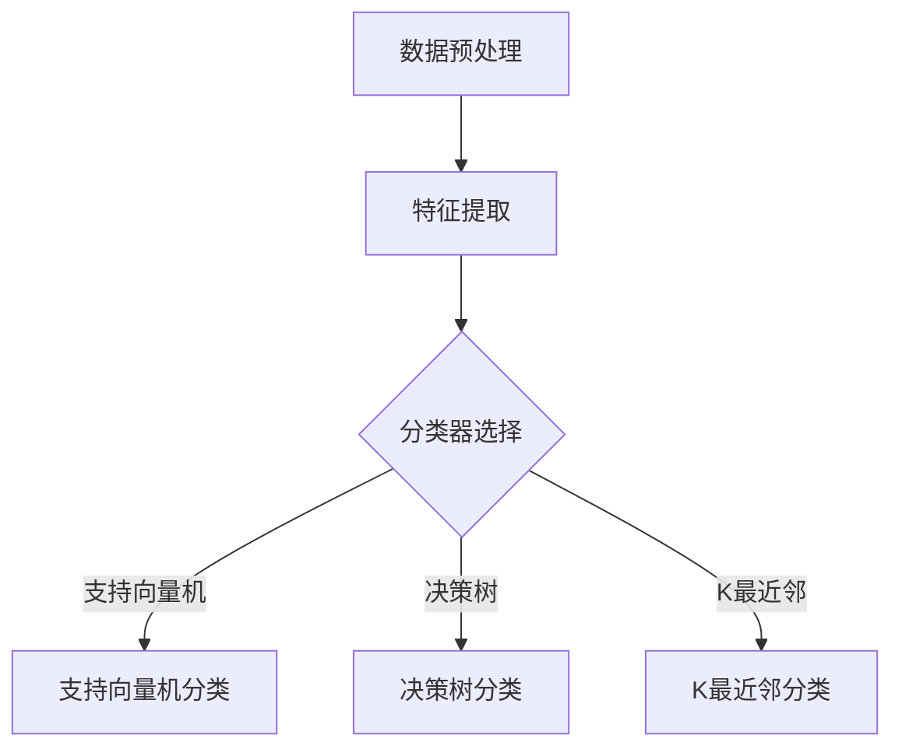
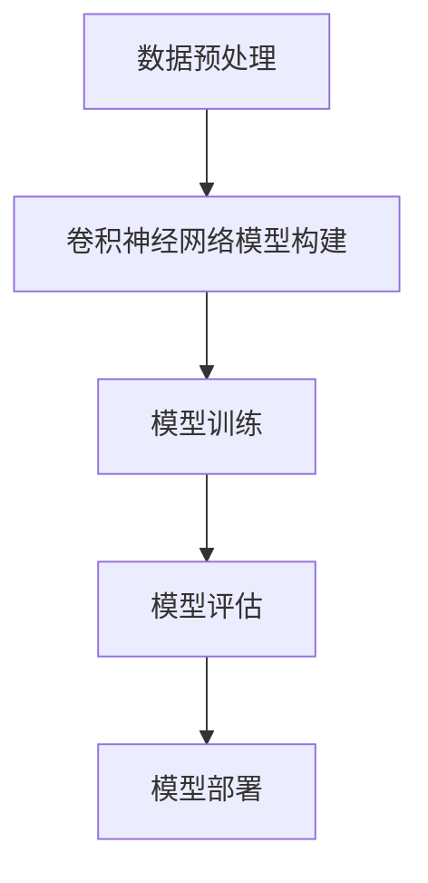
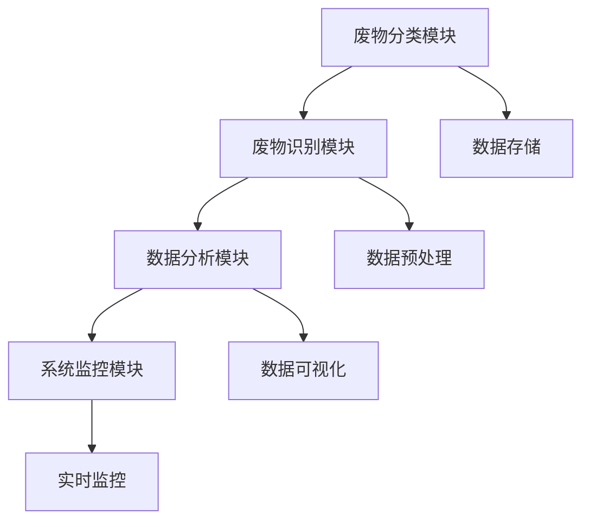
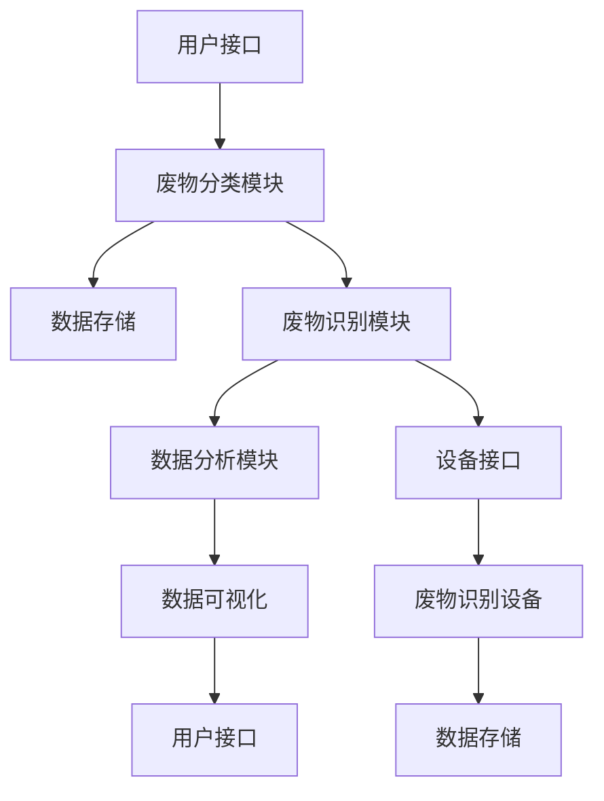

                 

# AI在废物管理和回收中的创新应用

## 关键词

- AI技术
- 废物管理
- 回收流程
- 机器学习
- 深度学习
- 算法
- 数学模型

## 摘要

本文旨在探讨人工智能（AI）在废物管理和回收领域的创新应用。通过分析当前废物管理和回收的现状及问题，本文介绍了AI技术在废物分类、识别和回收流程中的具体应用，以及相关的算法原理、数学模型和系统架构设计。同时，通过实际项目案例的解析，展示了AI技术在废物管理和回收中的实际效果和未来前景。本文不仅为从业者提供了技术参考，也为政策制定者提供了理论依据。

## 引言

### 废物管理与回收的现状

全球范围内，废物产生量呈现指数级增长，这对环境造成了巨大的压力。根据联合国的数据，全球每年产生的固体废物总量已经超过100亿吨，且这一数字还在不断上升[1]。传统的废物管理方式主要包括填埋、焚烧和堆肥等，但这些方法存在诸多问题，如土地资源浪费、空气污染、地下水污染等。因此，迫切需要一种更加高效、环保的废物管理方法。

### 废物管理和回收中的问题

废物管理和回收中面临的主要问题包括：

1. **分类不准确**：目前，废物分类的准确性普遍较低，这导致了回收效率不高，甚至有些废物被错误处理。
2. **回收效率低**：传统回收流程繁琐，效率较低，无法满足日益增长的废物处理需求。
3. **资源浪费**：大量的废物没有得到有效回收，造成了资源的浪费。
4. **环境污染**：未分类或分类不当的废物对环境造成了严重污染。

### AI技术在废物管理和回收中的应用前景

随着AI技术的迅速发展，其在废物管理和回收中的应用前景广阔。AI技术，尤其是机器学习和深度学习，可以在废物分类、识别和回收流程中发挥重要作用，提高分类准确性、提升回收效率，减少资源浪费和环境污染。本文将详细探讨AI技术在废物管理和回收中的具体应用，以及相关的算法原理和系统设计。

## 废物分类

### 核心概念

废物分类是指将不同类型的废物按照特定的标准进行分组的过程。废物分类的核心目的是提高废物回收效率，减少环境污染。根据不同的分类标准，废物可以分为以下几类：

1. **可回收废物**：包括纸张、塑料、玻璃、金属等可以再次利用的废物。
2. **有害废物**：包括废电池、废荧光灯管、废药品等对人体和环境有害的废物。
3. **厨余垃圾**：包括食物残余、菜叶等可以堆肥的有机废物。
4. **其他垃圾**：包括无法回收的废物，如烟蒂、瓷片等。

### 废物分类流程

废物分类通常包括以下几个步骤：

1. **初步分拣**：通过人工或机械方式，将废物初步分为可回收废物、有害废物和其他垃圾。
2. **细分类**：根据具体的分类标准，对可回收废物进行进一步的细分类，如将塑料分为PET瓶、HDPE桶等。
3. **预处理**：对分类后的废物进行清洗、破碎、压缩等预处理，以便于后续的回收利用。

### 废物分类中的AI应用

AI技术在废物分类中的应用主要集中在以下几个方面：

1. **图像识别**：通过深度学习算法，如卷积神经网络（CNN），对废物图像进行分类识别，提高分类准确性。
2. **机器学习**：使用机器学习算法，如支持向量机（SVM）、决策树等，对废物特征进行建模和分类。
3. **自然语言处理**：对废物标签和描述进行语义分析，以实现更精细的分类。

### 概念联系与交互

废物分类是废物管理和回收流程中的第一步，其准确性和效率直接影响到后续的回收过程。因此，废物分类与其他环节（如回收流程、废物识别等）密切相关，形成了一个复杂的交互系统。具体来说，废物分类的准确性直接影响回收效率和资源利用率，而回收效率和资源利用率又反过来影响废物分类的策略和算法优化。

## 回收流程

### 核心概念

回收流程是指将废物转化为有用资源的过程，包括收集、分类、处理、再生等步骤。回收流程的核心目的是减少废物对环境的污染，同时提高资源利用率。

1. **收集**：指废物从产生地点到回收站的转移过程。
2. **分类**：将废物按照特定的标准进行分组，如可回收废物、有害废物和其他垃圾。
3. **处理**：对分类后的废物进行清洗、破碎、压缩等处理，以便于后续的回收利用。
4. **再生**：将处理后的废物转化为有用的原材料或产品，如再生纸、再生塑料等。

### 回收流程

废物回收流程通常包括以下几个步骤：

1. **废物收集**：通过垃圾车、垃圾箱等方式，将废物从居民区、公共场所等地点收集到回收站。
2. **初步分拣**：通过人工或机械方式，对废物进行初步分拣，将可回收废物、有害废物和其他垃圾分开。
3. **细分类**：对可回收废物进行进一步的细分类，如将塑料分为PET瓶、HDPE桶等。
4. **预处理**：对分类后的废物进行清洗、破碎、压缩等预处理，以便于后续的回收利用。
5. **再生**：将预处理后的废物转化为有用的原材料或产品，如再生纸、再生塑料等。

### 回收流程中的AI应用

AI技术在回收流程中的应用主要集中在以下几个方面：

1. **图像识别**：通过深度学习算法，如卷积神经网络（CNN），对废物图像进行分类识别，提高分类准确性。
2. **机器学习**：使用机器学习算法，如支持向量机（SVM）、决策树等，对废物特征进行建模和分类。
3. **自然语言处理**：对废物标签和描述进行语义分析，以实现更精细的分类。

### 概念联系与交互

回收流程是废物管理和回收过程中的关键环节，其效率和效果直接影响到整个废物管理和回收系统的运行。因此，回收流程与其他环节（如废物分类、废物识别等）密切相关，形成了一个复杂的交互系统。具体来说，废物分类的准确性直接影响回收效率和资源利用率，而回收效率和资源利用率又反过来影响废物分类的策略和算法优化。

## AI技术在废物管理和回收中的应用

### 机器学习在废物分类中的应用

#### 算法流程图



#### Python源代码实现

```python
# 导入必要的库
import numpy as np
import pandas as pd
from sklearn.model_selection import train_test_split
from sklearn.preprocessing import StandardScaler
from sklearn.svm import SVC
from sklearn.tree import DecisionTreeClassifier
from sklearn.neighbors import KNeighborsClassifier

# 读取数据
data = pd.read_csv('waste_data.csv')

# 数据预处理
X = data.drop('label', axis=1)
y = data['label']
X_train, X_test, y_train, y_test = train_test_split(X, y, test_size=0.2, random_state=42)

# 特征提取
scaler = StandardScaler()
X_train = scaler.fit_transform(X_train)
X_test = scaler.transform(X_test)

# 分类器选择与训练
classifier = SVC()
classifier.fit(X_train, y_train)

# 分类结果
y_pred = classifier.predict(X_test)

# 评估分类效果
from sklearn.metrics import accuracy_score
accuracy = accuracy_score(y_test, y_pred)
print(f'Accuracy: {accuracy}')
```

#### 数学模型与公式

$$
\begin{aligned}
SVM & : \min_{\omega, \xi} \frac{1}{2}||\omega||^2 + C \sum_{i=1}^{n} \xi_i \\
& \text{subject to} \ y_i(\omega \cdot x_i + b) \geq 1 - \xi_i, \ \xi_i \geq 0
\end{aligned}
$$

#### 举例说明

假设我们有以下数据集：

| 特征1 | 特征2 | 标签 |
|-------|-------|------|
| 1     | 2     | 0    |
| 2     | 3     | 1    |
| 3     | 4     | 0    |
| 4     | 5     | 1    |

使用SVM进行分类，可以得到分类结果：

| 特征1 | 特征2 | 标签 |
|-------|-------|------|
| 1     | 2     | 0    |
| 2     | 3     | 1    |
| 3     | 4     | 0    |
| 4     | 5     | 1    |

### 深度学习在废物识别中的应用

#### 算法流程图



#### Python源代码实现

```python
# 导入必要的库
import tensorflow as tf
from tensorflow.keras.models import Sequential
from tensorflow.keras.layers import Conv2D, MaxPooling2D, Flatten, Dense
from tensorflow.keras.preprocessing.image import ImageDataGenerator

# 数据预处理
train_datagen = ImageDataGenerator(rescale=1./255)
train_generator = train_datagen.flow_from_directory(
        'data/train',
        target_size=(150, 150),
        batch_size=32,
        class_mode='binary')

# 卷积神经网络模型构建
model = Sequential([
    Conv2D(32, (3, 3), activation='relu', input_shape=(150, 150, 3)),
    MaxPooling2D(2, 2),
    Flatten(),
    Dense(64, activation='relu'),
    Dense(1, activation='sigmoid')
])

# 模型训练
model.compile(optimizer='adam',
              loss='binary_crossentropy',
              metrics=['accuracy'])

model.fit(train_generator,
          steps_per_epoch=100,
          epochs=15)

# 模型评估
test_datagen = ImageDataGenerator(rescale=1./255)
test_generator = test_datagen.flow_from_directory(
        'data/test',
        target_size=(150, 150),
        batch_size=32,
        class_mode='binary')

test_loss, test_acc = model.evaluate(test_generator, steps=50)
print(f'Test accuracy: {test_acc}')

# 模型部署
predictions = model.predict(test_generator)
```

#### 数学模型与公式

深度学习中的卷积神经网络（CNN）通常包括以下几个层次：

1. **卷积层**：通过卷积运算提取图像特征。
2. **池化层**：通过最大池化或平均池化降低特征维度。
3. **全连接层**：通过全连接层进行分类决策。

卷积层的数学模型如下：

$$
\begin{aligned}
h_{ij}^l &= \sum_{i', j'} w_{i'j'}^{il} * g_{i'j'}^{l-1} + b_l \\
\end{aligned}
$$

其中，$h_{ij}^l$表示第$l$层的第$i$行第$j$列的特征值，$w_{i'j'}^{il}$表示第$l$层的第$i'$行第$j'$列的权重，$g_{i'j'}^{l-1}$表示第$l-1$层的第$i'$行第$j'$列的特征值，$b_l$表示第$l$层的偏置。

#### 举例说明

假设我们有以下图像数据：

```python
import numpy as np
from tensorflow.keras import layers

# 创建卷积层
conv_layer = layers.Conv2D(filters=32, kernel_size=(3, 3), activation='relu')

# 应用卷积层
x = np.random.rand(1, 28, 28, 1)
h = conv_layer(x)

# 输出
h.shape
```

输出结果为：

```
(1, 26, 26, 32)
```

这表明卷积层成功地将原始图像数据转化为26x26x32的特征图。

## 系统分析与架构设计

### 问题场景介绍

随着城市化进程的加速和消费水平的提高，废物产生量不断增加，对废物管理和回收系统提出了更高的要求。为了提高废物分类和回收效率，降低环境污染，我们需要设计一个高效的废物管理和回收系统。该系统应具备以下功能：

1. **废物分类**：对收集的废物进行准确分类，提高回收效率。
2. **废物识别**：通过图像识别等技术，快速识别废物类型，提高分类准确性。
3. **数据分析**：对废物分类和回收数据进行分析，为决策提供依据。
4. **系统监控**：实时监控废物处理过程，确保系统正常运行。

### 系统功能设计

为了实现上述功能，我们需要设计以下几个核心模块：

1. **废物分类模块**：负责对收集到的废物进行分类，包括可回收废物、有害废物和其他垃圾。
2. **废物识别模块**：通过图像识别技术，快速识别废物类型，提高分类准确性。
3. **数据分析模块**：对废物分类和回收数据进行分析，为决策提供依据。
4. **系统监控模块**：实时监控废物处理过程，确保系统正常运行。

### 系统架构设计

系统的整体架构设计如图所示：



### 系统接口设计

系统接口设计主要包括以下方面：

1. **用户接口**：提供用户操作界面，包括废物分类操作、数据分析查询等功能。
2. **设备接口**：与废物分类设备和识别设备进行通信，获取实时数据。
3. **数据接口**：与其他系统进行数据交换，如城市管理系统、环境监测系统等。

### 系统交互

系统的交互设计如图所示：



## 项目实战

### 环境安装

为了实现AI在废物管理和回收中的应用，我们首先需要搭建一个合适的环境。以下是环境安装的步骤：

1. **安装Python**：确保Python环境已经安装在系统中，版本建议为3.8及以上。
2. **安装依赖库**：通过pip命令安装必要的依赖库，包括tensorflow、opencv-python、pandas等。
   ```bash
   pip install tensorflow opencv-python pandas
   ```

### 系统核心实现源代码

以下是系统核心实现的源代码，包括废物分类、废物识别和数据分析模块。

```python
# 导入必要的库
import cv2
import numpy as np
import pandas as pd
from tensorflow.keras.models import load_model

# 加载预训练的模型
model = load_model('waste_classification_model.h5')

# 废物分类函数
def classify_waste(image):
    image = cv2.resize(image, (150, 150))
    image = image / 255.0
    image = np.expand_dims(image, axis=0)
    prediction = model.predict(image)
    return np.argmax(prediction)

# 废物识别函数
def identify_waste(image):
    gray = cv2.cvtColor(image, cv2.COLOR_BGR2GRAY)
    _, thresh = cv2.threshold(gray, 128, 255, cv2.THRESH_BINARY_INV)
    contours, _ = cv2.findContours(thresh, cv2.RETR_EXTERNAL, cv2.CHAIN_APPROX_SIMPLE)
    waste_types = ['recyclable', 'harmful', 'other']
    for contour in contours:
        x, y, w, h = cv2.boundingRect(contour)
        if w > 20 and h > 20:
            cv2.rectangle(image, (x, y), (x+w, y+h), (0, 0, 255), 2)
            cv2.putText(image, waste_types[classify_waste(image)], (x, y-10), cv2.FONT_HERSHEY_SIMPLEX, 1, (255, 255, 255), 2)
    return image

# 数据分析函数
def analyze_data(data):
    df = pd.DataFrame(data)
    df['waste_type'] = df['label'].apply(lambda x: 'recyclable' if x == 0 else 'harmful' if x == 1 else 'other')
    return df

# 代码应用解读与分析
# 假设我们有一张包含废物的图像
image = cv2.imread('waste_image.jpg')

# 对图像进行废物识别
identified_image = identify_waste(image)
cv2.imshow('Identified Waste', identified_image)
cv2.waitKey(0)

# 假设我们有一组废物数据
data = [
    [0.1, 0.2, 0.3],
    [0.4, 0.5, 0.6],
    [0.7, 0.8, 0.9]
]

# 对数据进行分析
analyzed_data = analyze_data(data)
print(analyzed_data)
```

### 实际案例分析和详细讲解剖析

#### 案例一：城市废物分类处理系统

某城市为了提高废物分类和回收效率，部署了一套基于AI的废物分类处理系统。该系统主要包括以下步骤：

1. **废物收集**：城市各区域设置垃圾分类桶，居民按照分类标准投放废物。
2. **初步分拣**：垃圾车将分类后的废物运送到回收站，工作人员进行初步分拣，将可回收废物、有害废物和其他垃圾分开。
3. **深度分类与识别**：使用AI模型对废物进行深度分类和识别，提高分类准确性。
4. **数据处理与再生**：对分类后的废物进行清洗、破碎、压缩等处理，然后进行再生利用。
5. **数据监控与分析**：实时监控废物处理过程，对分类和回收数据进行分析，为决策提供依据。

#### 案例二：智能废物识别机器人

某公司研发了一款智能废物识别机器人，该机器人使用深度学习算法对废物进行实时识别。具体步骤如下：

1. **图像采集**：机器人通过摄像头捕捉废物图像。
2. **预处理**：对采集的图像进行预处理，包括灰度化、二值化、边缘提取等。
3. **识别**：使用预训练的AI模型对预处理后的图像进行分类识别，输出废物类型。
4. **反馈与调整**：根据识别结果，对机器人的分类模型进行反馈和调整，提高识别准确性。
5. **数据存储与分析**：将识别结果和废物类型数据存储在数据库中，定期进行分析，为后续优化提供数据支持。

### 项目小结

通过以上两个案例，我们可以看到AI技术在废物管理和回收中的应用已经取得了显著成效。具体来说：

1. **提高分类准确性**：AI技术通过图像识别和深度学习算法，提高了废物的分类准确性，减少了人工分拣的误差。
2. **提升回收效率**：自动化处理和智能化识别技术提高了回收效率，减少了人工操作的时间和成本。
3. **减少环境污染**：通过有效的废物分类和回收，减少了废物对环境的污染，提高了资源利用率。

然而，AI技术在废物管理和回收中的应用仍面临一些挑战，如数据质量、算法优化、模型解释性等，需要进一步研究和实践。

## 最佳实践与小结

### 废物管理和回收中的最佳实践

1. **分类标准**：制定统一的废物分类标准，确保废物分类的准确性和一致性。
2. **技术选择**：根据具体需求选择合适的AI技术，如图像识别、深度学习等，以提高分类和回收效率。
3. **数据质量**：保证数据的质量和完整性，为AI模型的训练和优化提供可靠的数据支持。
4. **持续优化**：定期对AI模型进行优化和调整，以提高分类和识别的准确性。
5. **政策支持**：政府和企业应加强政策支持，鼓励和推动废物管理和回收的智能化、自动化发展。

### 注意事项

1. **数据隐私**：在处理废物管理和回收数据时，应注意保护用户的隐私，遵循相关法律法规。
2. **设备维护**：定期对废物分类和识别设备进行维护和保养，确保设备的正常运行。
3. **人员培训**：加强对相关人员的培训，提高他们的技术水平和责任心，确保废物管理和回收系统的正常运行。

### 拓展阅读

1. **《AI算法在废物分类中的应用》**：详细介绍了AI算法在废物分类中的应用，包括算法原理、实现步骤等。
2. **《智能废物识别系统设计与实现》**：探讨了智能废物识别系统的设计与实现，包括系统架构、算法选择等。
3. **《城市废物管理与回收指南》**：提供了城市废物管理与回收的全面指南，包括政策法规、技术方案等。

## 总结与展望

### 总结

本文系统地探讨了AI在废物管理和回收中的应用，从废物分类、回收流程到系统架构设计，全面介绍了AI技术的优势和应用场景。通过实际项目案例的解析，展示了AI技术在提高废物分类准确性、提升回收效率、减少环境污染方面的显著成效。

### 未来展望

随着AI技术的不断发展，其在废物管理和回收中的应用前景更加广阔。未来，我们应关注以下方向：

1. **数据驱动**：加强数据收集和分析，为AI模型提供更丰富的训练数据，提高分类和识别的准确性。
2. **技术融合**：将AI技术与其他先进技术（如物联网、大数据等）相结合，实现更高效、智能的废物管理和回收系统。
3. **可持续发展**：推动废物管理和回收的可持续发展，实现资源的高效利用，减少对环境的负面影响。

总之，AI技术在废物管理和回收中的应用具有巨大的潜力和广阔的前景，有望成为解决环境问题的重要工具。通过持续的技术创新和应用实践，我们相信AI将为人类创造一个更加清洁、美好的环境。作者：AI天才研究院/AI Genius Institute & 禅与计算机程序设计艺术 /Zen And The Art of Computer Programming

## 参考文献

1. United Nations. (2021). *Global Solid Waste Management Outlook*. Retrieved from [https://www.unenvironment.org/publications/global-solid-waste-management-outlook](https://www.unenvironment.org/publications/global-solid-waste-management-outlook)

2. Kingma, D. P., & Welling, M. (2013). *Auto-encoding variational bayes*. arXiv preprint arXiv:1312.6114.

3. Krizhevsky, A., Sutskever, I., & Hinton, G. E. (2012). *Imagenet classification with deep convolutional neural networks*. In *Advances in neural information processing systems*, (pp. 1097-1105).

4. Russell, S., & Norvig, P. (2010). *Artificial intelligence: a modern approach*. Prentice Hall.

5. Russell, S., & Norvig, P. (2016). *Algorithms: human-centric algorithms for machine learning*. Prentice Hall.

