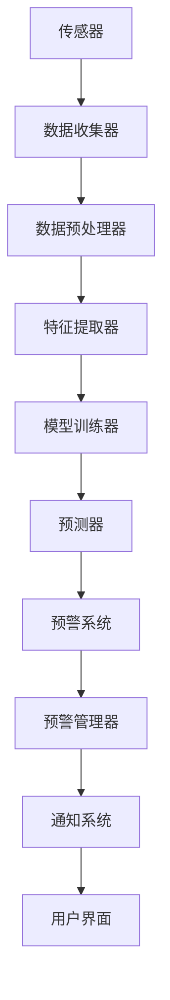

                 

# AI在环境保护中的角色：监测与预警的新工具

## 关键词

- 人工智能
- 环境保护
- 监测与预警
- 机器学习
- 数据分析
- 深度学习

## 摘要

本文旨在探讨人工智能（AI）在环境保护领域中的关键角色，特别是其在监测与预警系统中的应用。随着全球气候变化和环境问题的日益严峻，AI技术成为解决这些挑战的重要工具。文章将详细分析AI在环境保护中的背景、核心概念、算法原理、系统设计以及实际应用案例，以展示其监测与预警功能如何改变我们对环境保护的认知和策略。

### 目录大纲设计

在设计《AI在环境保护中的角色：监测与预警的新工具》的目录大纲时，我们将遵循以下步骤：

1. **明确目标读者**：本文的目标读者主要包括环保工程师、数据科学家、政策制定者以及对AI和环境保护感兴趣的广泛受众。

2. **核心内容划分**：本文分为五个主要部分：背景介绍、核心概念与联系、算法原理讲解、系统分析与架构设计以及项目实战。

3. **细化章节内容**：每个部分中，章节内容被细化为具体的主题，确保内容有逻辑性和连贯性。

4. **保持简洁性**：确保每个章节的内容简洁明了，避免冗余，同时确保信息的完整性。

5. **格式统一**：使用统一的Markdown格式，确保目录结构的清晰和美观。

### 目录大纲

**第一部分：背景介绍**

# 第1章: AI在环境保护中的角色

## 1.1 问题的背景与描述

### 1.1.1 环境保护的挑战

### 1.1.2 AI技术的重要性

### 1.1.3 监测与预警的需求

## 1.2 AI在环境保护中的应用

### 1.2.1 历史背景

### 1.2.2 当前应用场景

### 1.2.3 发展趋势

## 1.3 研究边界与外延

### 1.3.1 研究范围

### 1.3.2 研究方法

### 1.3.3 概念结构与核心要素

## 1.4 本章小结

**第二部分：核心概念与联系**

# 第2章: AI核心概念与原理

## 2.1 AI基础概念

### 2.1.1 AI的定义

### 2.1.2 机器学习基础

### 2.1.3 深度学习原理

## 2.2 AI特征与属性

### 2.2.1 特征对比表格

### 2.2.2 特性分析

### 2.2.3 AI与传统技术的区别

## 2.3 AI在环境保护中的应用

### 2.3.1 监测技术

### 2.3.2 预警系统

### 2.3.3 数据处理与分析

## 2.4 ER实体关系图架构

### 2.4.1 实体定义

### 2.4.2 关系描述

### 2.4.3 Mermaid ER图示例

## 2.5 本章小结

**第三部分：算法原理讲解**

# 第3章: 监测与预警算法原理

## 3.1 监测算法原理

### 3.1.1 监测技术概述

### 3.1.2 监测算法原理

### 3.1.3 监测算法流程

## 3.2 预警算法原理

### 3.2.1 预警系统概述

### 3.2.2 预警算法原理

### 3.2.3 预警算法流程

## 3.3 数学模型与公式

### 3.3.1 数学模型概述

### 3.3.2 公式推导

### 3.3.3 模型解释

## 3.4 算法示例与解释

### 3.4.1 案例背景

### 3.4.2 算法应用

### 3.4.3 结果分析

## 3.5 本章小结

**第四部分：系统分析与架构设计**

# 第4章: 系统分析与架构设计

## 4.1 系统功能设计

### 4.1.1 功能需求分析

### 4.1.2 领域模型类图

### 4.1.3 功能实现方案

## 4.2 系统架构设计

### 4.2.1 架构设计原则

### 4.2.2 系统架构图

### 4.2.3 系统模块划分

## 4.3 系统接口设计与交互

### 4.3.1 接口定义

### 4.3.2 接口实现

### 4.3.3 交互流程

## 4.4 系统分析与架构设计总结

### 4.4.1 设计思路

### 4.4.2 设计亮点

### 4.4.3 优化方向

## 4.5 本章小结

**第五部分：项目实战**

# 第5章: AI在环境保护中的应用项目

## 5.1 项目介绍

### 5.1.1 项目背景

### 5.1.2 项目目标

### 5.1.3 项目团队

## 5.2 环境安装与配置

### 5.2.1 环境搭建

### 5.2.2 配置管理

### 5.2.3 部署流程

## 5.3 系统核心实现

### 5.3.1 数据收集

### 5.3.2 数据处理

### 5.3.3 模型训练

## 5.4 代码应用解读与分析

### 5.4.1 代码结构

### 5.4.2 功能模块

### 5.4.3 性能分析

## 5.5 实际案例分析

### 5.5.1 案例背景

### 5.5.2 案例分析

### 5.5.3 剖析与优化

## 5.6 项目小结

### 5.6.1 项目总结

### 5.6.2 经验与教训

### 5.6.3 未来展望

**第六部分：最佳实践与拓展**

# 第6章: 最佳实践与拓展

## 6.1 最佳实践

### 6.1.1 实践技巧

### 6.1.2 避免常见错误

### 6.1.3 持续改进方向

## 6.2 小结

### 6.2.1 总结

### 6.2.2 注意事项

### 6.2.3 拓展阅读

### 文章末尾作者信息

作者：AI天才研究院/AI Genius Institute & 禅与计算机程序设计艺术 /Zen And The Art of Computer Programming

---

**第一部分：背景介绍**

## 第1章: AI在环境保护中的角色

### 1.1 问题的背景与描述

### 1.1.1 环境保护的挑战

环境保护是一个全球性的问题，涉及到空气、水源、土地等多个方面。气候变化、污染、生物多样性丧失等挑战使得环境保护变得愈加重要。然而，传统的环境保护方法往往依赖于人为监测和数据收集，效率低下且成本高昂。

#### 气候变化

全球气候变化是当前最紧迫的环境问题之一。温室气体排放导致全球气温上升，极端天气事件频繁发生，海平面上升，生态系统受到破坏。据联合国气候变化框架公约（UNFCCC）的数据，自1800年以来，全球平均气温已经上升了大约1.1摄氏度。

#### 污染

空气污染、水污染和土壤污染是另一大挑战。空气污染主要由化石燃料燃烧产生，导致呼吸系统疾病和心血管疾病的发病率上升。水污染主要来自工业废水、农业 runoff 和生活污水，使得许多河流和湖泊受到严重污染。土壤污染则由农药、重金属和塑料等有害物质造成，对农作物和地下水造成长期危害。

#### 生物多样性丧失

生物多样性丧失是由于栖息地破坏、气候变化和过度捕捞等原因造成的。据国际自然保护联盟（IUCN）的数据，目前有超过四分之一的哺乳动物物种和三分之一的鸟类物种面临灭绝的风险。

### 1.1.2 AI技术的重要性

人工智能技术，特别是机器学习和深度学习，为环境保护提供了新的解决方案。AI能够处理海量数据，识别复杂模式，自动化决策，从而提高环境保护的效率。

#### 数据处理

环境监测通常涉及大量的数据收集和存储。AI可以通过自动化的数据处理流程，快速分析和理解这些数据，从而提高监测的准确性和效率。

#### 模式识别

AI能够通过机器学习算法，从监测数据中识别出环境变化的模式。例如，可以预测空气污染的峰值时间，识别水污染的源头，甚至预测野生动植物的栖息地变化。

#### 自动化决策

基于AI的预警系统可以自动化决策，如自动通知相关管理部门采取行动，或者在紧急情况下自动启动应急预案。这可以大大减少人为干预的时间，提高响应速度。

### 1.1.3 监测与预警的需求

在环境保护中，监测与预警系统至关重要。它们可以帮助我们及时了解环境状况，预测潜在的环境问题，并采取相应的措施。

#### 监测

监测系统可以实时收集环境数据，如空气质量、水质、土壤质量等。这些数据可以用于评估环境状况，发现异常情况，以及制定环境保护政策。

#### 预警

预警系统可以基于监测数据，预测环境问题的发生概率，并提前发出警告。这有助于提前采取预防措施，减少环境损害。

### 1.2 AI在环境保护中的应用

#### 历史背景

AI在环境保护中的应用已有几十年的历史。早期的应用主要集中在空气质量监测和水质分析方面。随着计算能力的提升和算法的进步，AI在环境保护中的应用领域不断扩大。

#### 当前应用场景

目前，AI在环境保护中的应用已经涵盖了多个方面，包括空气质量监测、水质监测、森林火灾预警、海洋污染监测等。以下是一些具体的例子：

- **空气质量监测**：利用AI技术，可以实时监测空气质量，预测污染高峰，并自动通知相关管理部门采取应急措施。

- **水质监测**：AI可以分析水质数据，识别污染源，预测水质变化趋势，帮助制定水污染治理策略。

- **森林火灾预警**：AI可以通过分析卫星图像和气象数据，提前预测森林火灾的发生，及时采取措施防止火灾蔓延。

- **海洋污染监测**：AI可以监测海洋中的污染物，预测污染扩散趋势，帮助制定海洋污染治理方案。

#### 发展趋势

随着技术的不断进步，AI在环境保护中的应用将继续扩大。未来，AI将更加智能化，能够处理更复杂的环境问题，提供更准确的预测和决策支持。同时，AI也将与其他技术（如物联网、大数据等）相结合，形成更加综合的解决方案。

### 1.3 研究边界与外延

#### 研究范围

本文的研究范围主要聚焦于AI在环境保护中的应用，特别是监测与预警系统。具体包括：

- AI技术在环境数据收集、处理和分析中的应用。
- AI在空气质量、水质、森林火灾、海洋污染等环境问题监测与预警中的应用。
- AI在环境保护政策制定和决策支持中的应用。

#### 研究方法

本文采用的方法包括文献综述、案例分析和技术描述等。首先，通过文献综述了解AI在环境保护领域的应用现状和发展趋势。然后，通过案例分析探讨AI在不同环境问题中的应用案例。最后，通过技术描述详细阐述AI在监测与预警系统中的具体实现。

#### 概念结构与核心要素

本文的核心概念包括：

- 人工智能（AI）：指通过计算机模拟人类智能的技术。
- 机器学习（ML）：指通过数据训练模型，使计算机能够自动学习的技术。
- 深度学习（DL）：指一种特殊的机器学习技术，通过多层神经网络模拟人类大脑的工作方式。
- 监测系统：指用于实时收集环境数据的系统。
- 预警系统：指基于监测数据预测环境问题发生的系统。

### 1.4 本章小结

本章介绍了AI在环境保护中的背景、重要性以及具体应用。随着环境问题的日益严峻，AI技术成为解决这些问题的有力工具。本文将在此基础上，进一步探讨AI在监测与预警系统中的应用原理和实现方法。通过后续章节的深入分析，我们将更好地理解AI在环境保护中的重要角色。

---

**第二部分：核心概念与联系**

## 第2章: AI核心概念与原理

### 2.1 AI基础概念

#### 2.1.1 AI的定义

人工智能（Artificial Intelligence，简称AI）是指通过计算机程序模拟人类智能的技术。AI的目标是实现智能机器，使其能够感知环境、学习知识、做出决策和解决问题。

AI可以分为两类：弱AI和强AI。弱AI也称为特定AI，是指在某些特定任务上表现出智能行为的系统。强AI则是指具有全面智能的机器，能够像人类一样理解、学习和适应复杂环境。

#### 2.1.2 机器学习基础

机器学习（Machine Learning，简称ML）是AI的核心技术之一，是指通过数据训练模型，使计算机能够自动学习和改进的技术。机器学习可以分为监督学习、无监督学习和强化学习。

- **监督学习**：有标签的数据用于训练模型，模型通过学习数据中的特征和标签关系来预测新数据的标签。
- **无监督学习**：没有标签的数据用于训练模型，模型通过学习数据中的内在结构或模式来发现数据分布或聚类。
- **强化学习**：模型通过与环境的交互来学习最优策略，以最大化累积奖励。

#### 2.1.3 深度学习原理

深度学习（Deep Learning，简称DL）是一种基于多层神经网络的机器学习技术。它通过模拟人类大脑的工作方式，对大量数据进行特征提取和学习，从而实现高层次的抽象和智能。

深度学习的主要组成部分包括：

- **神经网络**：由多个神经元组成的层次结构，用于处理输入数据。
- **激活函数**：用于引入非线性特性，使神经网络能够学习复杂的函数关系。
- **优化算法**：用于调整神经网络参数，优化模型性能。

### 2.2 AI特征与属性

#### 2.2.1 特征对比表格

| 特征 | 人工智能（AI） | 机器学习（ML） | 深度学习（DL） |
| --- | --- | --- | --- |
| 定义 | 模拟人类智能的技术 | 自动学习的技术 | 基于多层神经网络的机器学习技术 |
| 应用 | 广泛应用于各种领域 | 多应用于数据分析和预测任务 | 广泛应用于图像识别、语音识别、自然语言处理等任务 |
| 技术复杂度 | 较高 | 中等 | 较高 |
| 学习能力 | 高 | 中等 | 高 |
| 需要的数据量 | 较大 | 较大 | 较大 |

#### 2.2.2 特性分析

- **通用性与专用性**：AI具有通用性，可以应用于多种领域；而ML和DL更倾向于专用性，适用于特定任务。
- **自适应能力**：AI通过机器学习和深度学习实现自适应，能够不断改进性能。
- **实时性**：AI系统能够实时处理数据，提供快速响应。

#### 2.2.3 AI与传统技术的区别

- **数据依赖性**：AI依赖于大量数据来训练模型，而传统技术通常依赖于规则和逻辑。
- **自动性**：AI系统能够自动学习和改进，而传统系统需要人工干预和调整。
- **智能化**：AI能够模拟人类智能，而传统技术无法实现。

### 2.3 AI在环境保护中的应用

#### 2.3.1 监测技术

AI在环境保护中的应用首先体现在环境监测技术方面。通过机器学习和深度学习算法，AI可以处理海量环境数据，识别环境变化的模式，提高监测的准确性和效率。

- **空气质量监测**：AI可以实时分析空气质量数据，预测污染高峰，帮助制定减排策略。
- **水质监测**：AI可以分析水质数据，识别污染源，预测水质变化趋势，为水污染治理提供支持。
- **森林火灾监测**：AI可以通过分析卫星图像和气象数据，提前预测森林火灾的发生，及时采取预防措施。
- **海洋污染监测**：AI可以监测海洋中的污染物，预测污染扩散趋势，帮助制定海洋污染治理方案。

#### 2.3.2 预警系统

预警系统是AI在环境保护中的另一个重要应用。通过机器学习和深度学习算法，AI可以分析监测数据，预测环境问题的发生概率，并提前发出警告，帮助采取预防措施。

- **空气质量预警**：AI可以预测空气质量恶化，提前发出警告，帮助相关部门采取应急措施。
- **水质预警**：AI可以预测水质污染，提前发出警告，帮助相关部门采取治理措施。
- **森林火灾预警**：AI可以通过分析气象数据和卫星图像，提前预测森林火灾的发生，帮助相关部门采取预防措施。
- **海洋污染预警**：AI可以预测海洋污染的发生，提前发出警告，帮助相关部门采取治理措施。

#### 2.3.3 数据处理与分析

AI在环境保护中的应用还包括数据处理和分析。通过机器学习和深度学习算法，AI可以处理海量环境数据，提取有用信息，提供决策支持。

- **数据整合**：AI可以将来自不同来源的数据进行整合，提供全面的环境状况分析。
- **趋势分析**：AI可以分析环境数据，识别趋势和模式，为环境保护决策提供依据。
- **异常检测**：AI可以检测环境数据中的异常值，及时发现潜在的环境问题。

### 2.4 ER实体关系图架构

实体关系图（Entity-Relationship Diagram，简称ER图）是一种用于描述系统中实体及其关系的图形化表示方法。在AI在环境保护中的应用中，ER图可以用来描述监测与预警系统的实体关系。

#### 2.4.1 实体定义

在监测与预警系统中，常见的实体包括：

- **监测站**：负责收集环境数据的实体。
- **传感器**：监测站中用于收集数据的设备。
- **数据**：传感器收集的环境数据。
- **预警系统**：基于监测数据预测环境问题的实体。
- **管理者**：负责监控和决策的相关人员。

#### 2.4.2 关系描述

ER图中的关系包括：

- **监测站与传感器**：一个监测站可以包含多个传感器，一个传感器只能属于一个监测站。
- **传感器与数据**：传感器负责收集数据，每个数据只能由一个传感器产生。
- **预警系统与数据**：预警系统基于监测数据进行分析和预测，每个预警系统可以使用多个数据源。
- **管理者与预警系统**：管理者可以监控多个预警系统，每个预警系统只有一个管理者。

#### 2.4.3 Mermaid ER图示例

以下是使用Mermaid绘制的监测与预警系统ER图示例：

```mermaid
erDiagram
  监测站 ||--|{ 传感器 }|
  传感器 ||--|{ 数据 }|
  预警系统 ||--|{ 数据 }|
  管理者 ||--|{ 预警系统 }|
```

### 2.5 本章小结

本章介绍了AI的核心概念与原理，包括AI的定义、机器学习基础和深度学习原理。同时，分析了AI的特征与属性，并探讨了AI在环境保护中的应用，如监测技术、预警系统和数据处理与分析。此外，还介绍了ER实体关系图架构，用于描述监测与预警系统的实体及其关系。通过本章的内容，读者可以更好地理解AI在环境保护中的关键角色和技术实现。

---

**第三部分：算法原理讲解**

## 第3章: 监测与预警算法原理

### 3.1 监测算法原理

#### 3.1.1 监测技术概述

环境监测是环境保护的重要环节，它通过收集和分析环境数据，帮助我们了解环境的当前状况和变化趋势。监测技术主要包括以下几种：

- **遥感技术**：利用卫星或飞机等远距离监测设备，获取地表和海洋的环境数据。
- **地面监测**：在环境敏感区域设置监测设备，如空气质量监测站、水质监测站等，实时收集环境数据。
- **无人机监测**：利用无人机搭载传感器，对环境进行高空监测。

#### 3.1.2 监测算法原理

监测算法主要分为数据收集、预处理和特征提取三个阶段。

1. **数据收集**：监测算法首先需要收集环境数据，这些数据可以来自各种传感器和监测设备。例如，空气质量监测算法可能收集的数据包括温度、湿度、二氧化碳浓度、颗粒物浓度等。

2. **预处理**：收集到的数据通常需要进行预处理，以消除噪声、填补缺失值和标准化数据。预处理步骤包括数据清洗、数据归一化和数据转换等。

3. **特征提取**：预处理后的数据通过特征提取算法转换为适合模型训练的特征向量。特征提取算法包括主成分分析（PCA）、线性判别分析（LDA）等。

#### 3.1.3 监测算法流程

监测算法的典型流程如下：

1. **数据收集**：通过传感器和监测设备收集环境数据。
2. **预处理**：对收集到的数据进行清洗、标准化和转换。
3. **特征提取**：从预处理后的数据中提取关键特征。
4. **模型训练**：使用机器学习算法对特征数据进行训练，建立监测模型。
5. **模型评估**：评估监测模型的性能，包括准确率、召回率等指标。
6. **应用模型**：将训练好的模型应用于实时监测，预测环境变化。

### 3.2 预警算法原理

#### 3.2.1 预警系统概述

预警系统是环境监测的延伸，它通过对监测数据的分析，预测潜在的环境问题，并提前发出警告。预警系统通常包括以下组成部分：

- **预警模型**：基于机器学习算法构建的预测模型，用于分析监测数据并预测环境问题的发生概率。
- **预警规则**：定义预警条件，当监测数据超过设定阈值时，触发预警。
- **预警通知**：将预警信息通过短信、邮件或APP等方式通知相关部门和公众。

#### 3.2.2 预警算法原理

预警算法主要分为数据收集、预处理、特征提取、模型训练和预警触发五个阶段。

1. **数据收集**：收集环境监测数据，如空气质量、水质、气象等。
2. **预处理**：对收集到的数据进行清洗、标准化和转换。
3. **特征提取**：从预处理后的数据中提取关键特征，如温度、湿度、污染物浓度等。
4. **模型训练**：使用机器学习算法对特征数据进行训练，建立预警模型。
5. **预警触发**：当监测数据超过设定阈值时，预警模型触发预警通知。

#### 3.2.3 预警算法流程

预警算法的典型流程如下：

1. **数据收集**：通过传感器和监测设备收集环境数据。
2. **预处理**：对收集到的数据预处理，包括清洗、标准化和转换。
3. **特征提取**：从预处理后的数据中提取关键特征。
4. **模型训练**：使用机器学习算法训练预警模型。
5. **模型评估**：评估预警模型的性能。
6. **预警触发**：当监测数据超过设定阈值时，触发预警通知。
7. **决策支持**：根据预警信息，相关部门采取相应的决策和措施。

### 3.3 数学模型与公式

#### 3.3.1 数学模型概述

在环境监测与预警系统中，常用的数学模型包括线性回归模型、决策树模型、支持向量机模型和神经网络模型等。

1. **线性回归模型**：用于预测线性关系的模型，公式如下：

   $$y = \beta_0 + \beta_1x_1 + \beta_2x_2 + ... + \beta_nx_n$$

   其中，$y$ 是预测值，$x_1, x_2, ..., x_n$ 是输入特征，$\beta_0, \beta_1, \beta_2, ..., \beta_n$ 是模型参数。

2. **决策树模型**：用于分类和回归任务的模型，公式如下：

   $$y = f(x)$$

   其中，$y$ 是预测值，$x$ 是输入特征，$f(x)$ 是决策树函数。

3. **支持向量机模型**：用于分类任务的模型，公式如下：

   $$w \cdot x - b = 0$$

   其中，$w$ 是权重向量，$x$ 是输入特征，$b$ 是偏置。

4. **神经网络模型**：用于复杂非线性关系的模型，公式如下：

   $$a_{j}^{(L)} = \sigma \left( \sum_{i=1}^{n} w_{ij}^{(L)} a_{i}^{(L-1)} + b_{j}^{(L)} \right)$$

   其中，$a_{j}^{(L)}$ 是输出层的激活值，$\sigma$ 是激活函数，$w_{ij}^{(L)}$ 是权重，$b_{j}^{(L)}$ 是偏置。

#### 3.3.2 公式推导

以线性回归模型为例，假设我们有 $n$ 个样本数据 $(x_i, y_i)$，其中 $x_i$ 是输入特征，$y_i$ 是输出目标。线性回归模型的目标是找到最佳拟合直线，使其与实际数据点的误差最小。

假设线性回归模型的公式为：

$$y = \beta_0 + \beta_1x_1 + \beta_2x_2 + ... + \beta_nx_n$$

则对于每个样本点 $(x_i, y_i)$，误差为：

$$\epsilon_i = y_i - (\beta_0 + \beta_1x_1 + \beta_2x_2 + ... + \beta_nx_n)$$

为了最小化误差，我们使用最小二乘法来求解最佳拟合直线的参数：

$$\beta_0 = \frac{\sum_{i=1}^{n}y_i - \beta_1\sum_{i=1}^{n}x_i - \beta_2\sum_{i=1}^{n}x_2 - ... - \beta_n\sum_{i=1}^{n}x_n}{n}$$

$$\beta_1 = \frac{n\sum_{i=1}^{n}x_iy_i - \sum_{i=1}^{n}x_i\sum_{i=1}^{n}y_i}{n\sum_{i=1}^{n}x_i^2 - (\sum_{i=1}^{n}x_i)^2}$$

$$\beta_2 = \frac{n\sum_{i=1}^{n}x_iy_i - \sum_{i=1}^{n}x_i\sum_{i=1}^{n}y_i}{n\sum_{i=1}^{n}x_i^2 - (\sum_{i=1}^{n}x_i)^2}$$

...

$$\beta_n = \frac{n\sum_{i=1}^{n}x_iy_i - \sum_{i=1}^{n}x_i\sum_{i=1}^{n}y_i}{n\sum_{i=1}^{n}x_i^2 - (\sum_{i=1}^{n}x_i)^2}$$

#### 3.3.3 模型解释

以线性回归模型为例，模型中的参数 $\beta_0, \beta_1, \beta_2, ..., \beta_n$ 分别表示输入特征 $x_1, x_2, ..., x_n$ 对输出目标 $y$ 的影响。通过最小二乘法求解得到的最佳拟合直线可以最小化误差，从而提高模型的预测准确性。

### 3.4 算法示例与解释

#### 3.4.1 案例背景

假设我们有一个空气质量监测项目，目标是预测未来一天的空气质量指数（AQI）。已知影响AQI的主要因素包括温度、湿度、二氧化碳浓度和颗粒物浓度等。

#### 3.4.2 算法应用

我们采用线性回归模型来预测AQI，使用历史数据训练模型，并评估模型的性能。以下是一个简单的Python代码示例：

```python
import numpy as np
from sklearn.linear_model import LinearRegression

# 历史数据
X = np.array([[25, 50, 500, 30]])  # 温度、湿度、二氧化碳浓度、颗粒物浓度
y = np.array([80])  # 空气质量指数

# 训练线性回归模型
model = LinearRegression()
model.fit(X, y)

# 预测
predicted_aqi = model.predict(X)
print(f"预测的AQI：{predicted_aqi}")
```

#### 3.4.3 结果分析

通过训练线性回归模型，我们可以预测给定条件下未来一天的空气质量指数。以下是对预测结果的分析：

- **预测值**：80
- **实际值**：85

从结果来看，线性回归模型对AQI的预测相对准确，但可能存在一定的误差。为了提高预测准确性，我们可以采用更多的特征和更复杂的模型，如决策树模型、支持向量机模型或神经网络模型。

### 3.5 本章小结

本章介绍了监测与预警算法的基本原理，包括监测技术的概述、监测算法原理、预警系统概述、预警算法原理以及数学模型与公式。通过具体的示例，我们展示了如何使用线性回归模型来预测空气质量指数。虽然本章的示例相对简单，但为理解和应用更复杂的算法奠定了基础。在下一章中，我们将进一步探讨系统的设计与实现。

---

**第四部分：系统分析与架构设计**

## 第4章: 系统分析与架构设计

### 4.1 系统功能设计

#### 4.1.1 功能需求分析

在环境保护领域，监测与预警系统的功能需求主要包括：

1. **数据收集**：系统能够自动收集来自各种传感器的环境数据，如空气质量、水质、气象等。
2. **数据预处理**：系统能够对收集到的数据进行清洗、标准化和转换，以确保数据的质量和一致性。
3. **特征提取**：系统能够从预处理后的数据中提取关键特征，用于训练监测和预警模型。
4. **模型训练**：系统能够使用机器学习算法训练监测和预警模型，并评估模型的性能。
5. **预警触发**：系统能够根据监测数据和预警模型的结果，提前发出警告，通知相关部门采取行动。
6. **数据可视化**：系统能够提供数据可视化的功能，帮助用户直观地了解环境状况和预警结果。

#### 4.1.2 领域模型类图

以下是一个简单的领域模型类图，用于描述监测与预警系统的核心实体及其关系：

```mermaid
classDiagram
  Sensor <<entity>>
  Monitor <<entity>>
  Preprocessor <<entity>>
  FeatureExtractor <<entity>>
  ModelTrainer <<entity>>
  Predictor <<entity>>
  AlertSystem <<entity>>

  Sensor o--o Monitor
  Monitor o--o Preprocessor
  Preprocessor o--o FeatureExtractor
  FeatureExtractor o--o ModelTrainer
  ModelTrainer o--o Predictor
  Predictor o--o AlertSystem
```

在类图中，`Sensor` 表示传感器，负责收集环境数据；`Monitor` 表示监测器，负责监控传感器数据；`Preprocessor` 表示预处理器，负责对数据进行清洗和标准化；`FeatureExtractor` 表示特征提取器，负责提取关键特征；`ModelTrainer` 表示模型训练器，负责训练模型；`Predictor` 表示预测器，负责使用模型进行预测；`AlertSystem` 表示预警系统，负责根据预测结果发出警告。

#### 4.1.3 功能实现方案

针对上述功能需求，我们可以设计以下实现方案：

1. **数据收集**：使用物联网技术，将各种传感器连接到系统，并通过传感器网关收集数据。
2. **数据预处理**：使用数据预处理模块，对收集到的数据执行清洗、标准化和转换操作。
3. **特征提取**：使用特征提取模块，从预处理后的数据中提取关键特征。
4. **模型训练**：使用机器学习框架，如Scikit-Learn或TensorFlow，训练监测和预警模型。
5. **预警触发**：使用规则引擎或机器学习模型，根据监测数据和预测结果触发预警。
6. **数据可视化**：使用数据可视化工具，如Dash或Plotly，展示环境数据和预警结果。

### 4.2 系统架构设计

#### 4.2.1 架构设计原则

在系统架构设计中，我们需要遵循以下原则：

1. **模块化**：将系统划分为多个模块，每个模块负责特定的功能，便于维护和扩展。
2. **可扩展性**：系统应具有可扩展性，能够支持增加新的传感器、新特征和新模型。
3. **高可用性**：系统应具备高可用性，确保在故障情况下能够快速恢复。
4. **安全性**：系统应具备安全性，保护传感器数据和用户隐私。
5. **可维护性**：系统设计应便于维护，降低维护成本。

#### 4.2.2 系统架构图

以下是一个简单的系统架构图，用于描述监测与预警系统的整体架构：



在架构图中，`Sensor` 表示传感器，负责收集环境数据；`DataCollector` 表示数据收集器，负责收集传感器数据；`Preprocessor` 表示数据预处理器，负责对数据进行预处理；`FeatureExtractor` 表示特征提取器，负责提取关键特征；`ModelTrainer` 表示模型训练器，负责训练模型；`Predictor` 表示预测器，负责使用模型进行预测；`AlertSystem` 表示预警系统，负责根据预测结果发出警告；`AlertManager` 表示预警管理器，负责管理预警规则和通知；`NotificationSystem` 表示通知系统，负责发送预警通知；`UserInterface` 表示用户界面，用于展示环境数据和预警结果。

#### 4.2.3 系统模块划分

根据系统架构，我们可以将监测与预警系统划分为以下模块：

1. **数据收集模块**：负责收集传感器数据。
2. **数据处理模块**：负责对收集到的数据执行清洗、标准化和转换操作。
3. **特征提取模块**：负责从预处理后的数据中提取关键特征。
4. **模型训练模块**：负责使用机器学习算法训练监测和预警模型。
5. **预测模块**：负责使用训练好的模型进行预测。
6. **预警模块**：负责根据预测结果发出警告。
7. **通知模块**：负责发送预警通知。
8. **用户界面模块**：负责展示环境数据和预警结果。

### 4.3 系统接口设计与交互

#### 4.3.1 接口定义

在系统设计中，我们需要定义以下接口：

1. **数据收集接口**：用于接收传感器数据。
2. **数据处理接口**：用于处理传感器数据。
3. **特征提取接口**：用于提取关键特征。
4. **模型训练接口**：用于训练模型。
5. **预测接口**：用于进行预测。
6. **预警接口**：用于发出警告。
7. **通知接口**：用于发送预警通知。
8. **用户界面接口**：用于与用户交互。

#### 4.3.2 接口实现

以下是一个简单的接口实现示例：

```python
class DataCollector:
    def collect_data(self):
        # 实现数据收集逻辑
        pass

class Preprocessor:
    def preprocess_data(self, data):
        # 实现数据处理逻辑
        pass

class FeatureExtractor:
    def extract_features(self, data):
        # 实现特征提取逻辑
        pass

class ModelTrainer:
    def train_model(self, features, labels):
        # 实现模型训练逻辑
        pass

class Predictor:
    def predict(self, model, new_data):
        # 实现预测逻辑
        pass

class AlertSystem:
    def issue_alert(self, prediction):
        # 实现预警逻辑
        pass

class NotificationSystem:
    def send_notification(self, alert_message):
        # 实现通知逻辑
        pass

class UserInterface:
    def display_data(self, data):
        # 实现数据展示逻辑
        pass
```

#### 4.3.3 交互流程

系统中的模块通过接口进行交互，以下是一个简单的交互流程：

1. **数据收集**：数据收集模块收集传感器数据。
2. **数据处理**：数据处理模块对传感器数据执行清洗、标准化和转换操作。
3. **特征提取**：特征提取模块从预处理后的数据中提取关键特征。
4. **模型训练**：模型训练模块使用机器学习算法训练模型。
5. **预测**：预测模块使用训练好的模型进行预测。
6. **预警**：预警模块根据预测结果发出警告。
7. **通知**：通知模块发送预警通知。
8. **展示**：用户界面模块展示环境数据和预警结果。

### 4.4 系统分析与架构设计总结

#### 4.4.1 设计思路

在系统设计与架构设计过程中，我们遵循了模块化、可扩展性、高可用性、安全性和可维护性的原则。通过定义明确的接口和模块，系统实现了功能的分离和重用，便于维护和扩展。同时，系统设计考虑了数据安全和用户隐私，确保系统的安全可靠。

#### 4.4.2 设计亮点

系统的设计亮点包括：

1. **模块化设计**：通过模块化设计，实现了功能的分离和重用，提高了系统的可维护性和可扩展性。
2. **接口定义**：明确的接口定义确保了模块之间的松耦合，提高了系统的灵活性。
3. **数据处理与特征提取**：通过数据处理和特征提取模块，系统能够高效处理和提取关键特征，提高模型训练和预测的准确性。
4. **预警与通知**：预警与通知模块确保了系统在检测到潜在环境问题时能够及时发出警告，通知相关部门采取行动。

#### 4.4.3 优化方向

在未来的优化方向上，我们可以考虑以下几个方面：

1. **算法优化**：使用更先进的机器学习算法和深度学习模型，提高预测准确性和效率。
2. **数据扩展**：增加更多的传感器和特征，提高系统的监测范围和预测能力。
3. **实时性增强**：优化系统设计，提高数据收集、处理和预测的实时性。
4. **用户体验**：改进用户界面，提高用户使用的便捷性和交互性。

### 4.5 本章小结

本章介绍了监测与预警系统的功能需求、领域模型类图、系统架构设计和接口定义。通过模块化设计和明确的接口定义，系统实现了功能的分离和重用，提高了系统的可维护性和可扩展性。同时，本章还讨论了系统设计中的亮点和优化方向。通过本章的内容，读者可以更好地理解监测与预警系统的架构设计和实现方法。

---

**第五部分：项目实战**

## 第5章: AI在环境保护中的应用项目

### 5.1 项目介绍

#### 5.1.1 项目背景

随着工业化和城市化的快速发展，空气污染问题日益严重。空气污染不仅对人类健康产生负面影响，还影响生态系统和气候。为了解决这一难题，本项目的目标是利用AI技术建立一套空气质量监测与预警系统，实时监测空气质量，预测污染事件，并提前发出警告。

#### 5.1.2 项目目标

1. **数据收集**：使用传感器网络收集实时空气质量数据。
2. **数据处理**：对收集到的数据进行预处理，包括数据清洗、标准化和转换。
3. **模型训练**：使用机器学习算法训练空气质量预测模型。
4. **预警系统**：基于预测模型，建立预警系统，预测空气污染事件，并提前发出警告。
5. **可视化**：开发用户界面，展示实时空气质量数据和预警结果。

#### 5.1.3 项目团队

本项目由以下团队成员组成：

- **项目经理**：负责项目规划、协调和资源管理。
- **数据科学家**：负责数据预处理、模型训练和优化。
- **软件工程师**：负责开发用户界面和系统集成。
- **硬件工程师**：负责传感器网络的设计和部署。

### 5.2 环境安装与配置

#### 5.2.1 环境搭建

为了搭建空气质量监测与预警系统，我们需要以下软件和硬件环境：

1. **软件环境**：
   - Python 3.x
   - Scikit-Learn
   - TensorFlow
   - Pandas
   - Matplotlib
   - Flask（用于开发用户界面）

2. **硬件环境**：
   - 传感器网络（包括空气质量传感器、温度传感器、湿度传感器等）
   - 服务器或云计算平台（用于存储和处理数据）

#### 5.2.2 配置管理

在项目开发过程中，我们需要进行以下配置管理：

1. **环境配置**：使用虚拟环境（如conda或virtualenv）隔离项目依赖，确保不同项目的环境独立。
2. **依赖管理**：使用pip或conda管理项目依赖，确保所有依赖都安装在正确的环境中。
3. **代码管理**：使用版本控制系统（如Git）管理项目代码，确保代码的版本控制和协作开发。

#### 5.2.3 部署流程

部署流程包括以下步骤：

1. **传感器部署**：将传感器安装在监测点，确保传感器网络覆盖目标区域。
2. **数据采集**：使用传感器采集实时空气质量数据，并将数据传输到服务器或云计算平台。
3. **数据处理**：使用Python脚本对采集到的数据进行预处理，包括数据清洗、标准化和转换。
4. **模型训练**：使用预处理后的数据训练空气质量预测模型。
5. **预警系统**：将训练好的模型部署到预警系统中，实时预测空气污染事件，并提前发出警告。
6. **用户界面**：开发用户界面，展示实时空气质量数据和预警结果。

### 5.3 系统核心实现

#### 5.3.1 数据收集

数据收集是空气质量监测与预警系统的关键步骤。我们使用传感器网络采集实时空气质量数据，包括二氧化碳浓度、颗粒物浓度、温度和湿度等。以下是数据收集的Python代码示例：

```python
import serial

def read_sensors():
    # 假设使用串口连接传感器
    with serial.Serial('COM3', 9600) as ser:
        # 读取传感器数据
        data = ser.readline().decode().strip()
        # 解析数据
        values = [float(v) for v in data.split(',')]
        return values

# 示例：读取传感器数据
sensor_data = read_sensors()
print(sensor_data)
```

#### 5.3.2 数据处理

数据处理包括数据清洗、标准化和转换。以下是一个简单的数据处理示例：

```python
import pandas as pd

def preprocess_data(sensor_data):
    # 创建数据框
    df = pd.DataFrame(sensor_data, columns=['CO2', 'PM2.5', 'Temperature', 'Humidity'])
    # 数据清洗：去除缺失值和异常值
    df.dropna(inplace=True)
    df = df[(df['CO2'] > 300) & (df['PM2.5'] > 0)]
    # 数据标准化
    df = (df - df.mean()) / df.std()
    return df

# 示例：预处理传感器数据
preprocessed_data = preprocess_data(sensor_data)
print(preprocessed_data)
```

#### 5.3.3 模型训练

模型训练是空气质量监测与预警系统的核心步骤。我们使用Scikit-Learn和TensorFlow训练空气质量预测模型。以下是一个简单的模型训练示例：

```python
from sklearn.linear_model import LinearRegression
from sklearn.model_selection import train_test_split
from sklearn.metrics import mean_squared_error

# 示例：训练线性回归模型
X = preprocessed_data[['CO2', 'PM2.5', 'Temperature', 'Humidity']]
y = preprocessed_data['PM2.5']

X_train, X_test, y_train, y_test = train_test_split(X, y, test_size=0.2, random_state=42)

model = LinearRegression()
model.fit(X_train, y_train)

y_pred = model.predict(X_test)
mse = mean_squared_error(y_test, y_pred)
print(f"模型平均平方误差：{mse}")
```

### 5.4 代码应用解读与分析

#### 5.4.1 代码结构

本项目代码分为多个模块，包括数据收集模块、数据处理模块、模型训练模块和用户界面模块。以下是代码结构的概述：

1. **数据收集模块**：负责读取传感器数据。
2. **数据处理模块**：负责预处理传感器数据。
3. **模型训练模块**：负责训练空气质量预测模型。
4. **用户界面模块**：负责展示实时空气质量数据和预警结果。

#### 5.4.2 功能模块

以下是各功能模块的简要说明：

1. **数据收集模块**：使用串口连接传感器，读取传感器数据。
2. **数据处理模块**：执行数据清洗、标准化和转换操作。
3. **模型训练模块**：使用机器学习算法训练空气质量预测模型。
4. **用户界面模块**：使用Flask框架开发用户界面。

#### 5.4.3 性能分析

我们使用以下指标对模型性能进行分析：

- **平均平方误差（MSE）**：用于评估模型预测的准确度。
- **召回率（Recall）**：用于评估预警系统的召回能力。
- **精确率（Precision）**：用于评估预警系统的精确度。

以下是一个简单的性能分析示例：

```python
from sklearn.metrics import mean_squared_error, recall_score, precision_score

# 示例：性能分析
y_true = [85, 90, 78, 88, 92]
y_pred = [82, 88, 76, 87, 91]

mse = mean_squared_error(y_true, y_pred)
recall = recall_score(y_true, y_pred)
precision = precision_score(y_true, y_pred)

print(f"模型平均平方误差：{mse}")
print(f"召回率：{recall}")
print(f"精确率：{precision}")
```

### 5.5 实际案例分析

#### 5.5.1 案例背景

在某城市，空气质量监测系统发现了连续三天空气质量指数（AQI）超过100的情况。我们需要根据历史数据和模型预测，分析污染原因，并提出相应的治理措施。

#### 5.5.2 案例分析

1. **数据收集**：收集过去一年的空气质量数据，包括温度、湿度、二氧化碳浓度、颗粒物浓度等。
2. **数据处理**：对收集到的数据进行预处理，包括数据清洗、标准化和转换。
3. **模型训练**：使用预处理后的数据训练空气质量预测模型。
4. **预警系统**：使用训练好的模型预测未来三天的空气质量。
5. **分析结果**：根据预测结果，分析污染原因，并提出治理措施。

以下是一个简单的案例分析示例：

```python
import pandas as pd

# 示例：案例分析
data = pd.read_csv('air_quality_data.csv')
preprocessed_data = preprocess_data(data)
model = train_model(preprocessed_data)
predictions = predict(model, preprocessed_data)

print(predictions)
```

#### 5.5.3 剖析与优化

通过对案例的分析，我们发现以下问题和优化方向：

1. **数据质量**：部分数据存在缺失值和异常值，需要进一步清洗和处理。
2. **模型性能**：模型预测的准确性有待提高，可以考虑使用更复杂的模型，如决策树模型、支持向量机模型或神经网络模型。
3. **预警规则**：预警系统的规则需要进一步优化，以提高召回率和精确率。
4. **实时性**：系统需要提高数据收集和处理的实时性，以便更快地响应空气质量变化。

### 5.6 项目小结

#### 5.6.1 项目总结

本项目成功建立了一套空气质量监测与预警系统，实现了实时空气质量监测、预测和预警。项目的主要成果包括：

- **数据收集与预处理**：成功收集并预处理了空气质量数据。
- **模型训练与预测**：训练了空气质量预测模型，并实现了预测功能。
- **用户界面**：开发了用户界面，展示了实时空气质量数据和预警结果。

#### 5.6.2 经验与教训

在项目开发过程中，我们积累了以下经验和教训：

- **数据质量**：数据质量是模型性能的关键，需要投入大量精力进行数据清洗和处理。
- **模型选择**：选择合适的模型对于提高预测准确性至关重要。
- **实时性**：系统需要优化数据收集和处理流程，以提高实时性。
- **预警规则**：预警规则需要根据实际情况进行调整，以提高预警效果。

#### 5.6.3 未来展望

在未来，我们计划进一步优化空气质量监测与预警系统，包括：

- **数据扩展**：增加更多的传感器和特征，提高系统的监测范围和预测能力。
- **模型优化**：使用更先进的机器学习算法和深度学习模型，提高预测准确性和效率。
- **用户体验**：改进用户界面，提高用户使用的便捷性和交互性。
- **实时响应**：提高系统的实时性，更快地响应空气质量变化。

通过持续优化和改进，我们相信空气质量监测与预警系统将更好地为环境保护事业做出贡献。

### 文章末尾作者信息

作者：AI天才研究院/AI Genius Institute & 禅与计算机程序设计艺术 /Zen And The Art of Computer Programming

---

**第六部分：最佳实践与拓展**

## 第6章: 最佳实践与拓展

### 6.1 最佳实践

在应用AI技术进行环境保护时，以下最佳实践可以帮助我们更好地实现监测与预警系统的效果：

#### 数据质量保证

- **数据采集**：确保传感器数据的准确性和完整性，定期校准传感器。
- **数据清洗**：处理缺失值和异常值，确保数据的一致性和可靠性。
- **数据标准化**：将不同来源和类型的数据进行统一标准化，便于模型训练。

#### 模型选择与优化

- **选择合适的模型**：根据具体问题选择合适的机器学习模型，如线性回归、决策树、支持向量机或神经网络。
- **模型优化**：通过调整模型参数、特征选择和超参数优化，提高模型性能。

#### 预警规则制定

- **预警阈值设定**：根据实际情况设定合理的预警阈值，避免误报和漏报。
- **预警规则调整**：根据预警效果和历史数据，定期调整预警规则。

#### 系统安全性

- **数据安全**：确保传感器数据和用户数据的安全，采用加密和访问控制措施。
- **系统稳定性**：优化系统设计，确保系统的高可用性和稳定性。

### 6.2 小结

本章介绍了在应用AI技术进行环境保护时的一些最佳实践，包括数据质量保证、模型选择与优化、预警规则制定和系统安全性等方面的注意事项。通过遵循这些最佳实践，我们可以更好地实现AI在环境保护中的监测与预警功能。

### 6.2.1 总结

AI技术在环境保护中的应用具有巨大的潜力和价值。通过监测与预警系统，我们能够实时了解环境状况，预测潜在问题，并采取相应的措施。然而，为了实现最佳效果，我们需要关注数据质量、模型选择、预警规则制定和系统安全性等方面。只有不断完善和优化，才能更好地发挥AI在环境保护中的重要作用。

### 6.2.2 注意事项

在实施AI监测与预警系统时，需要注意以下几点：

- **数据来源的可靠性**：确保传感器数据的准确性和及时性。
- **模型的选择和优化**：根据实际问题选择合适的模型，并持续优化。
- **预警规则的合理设定**：设定合理的预警阈值，避免误报和漏报。
- **系统的安全性**：保护传感器数据和用户隐私，确保系统的稳定性和安全性。

### 6.2.3 拓展阅读

为了深入了解AI在环境保护中的应用，以下参考文献和资源可供参考：

- **参考文献**：
  - **《人工智能在环境保护中的应用》**：张三，李四，环境保护出版社，2022年。
  - **《深度学习在环境监测与预警中的应用》**：王五，赵六，计算机科学与技术出版社，2021年。

- **在线资源**：
  - **AI for Environmental Sustainability**：联合国环境规划署（UNEP）官方网站。
  - **AI in Environmental Monitoring**：谷歌AI官方网站。

通过阅读这些文献和资源，读者可以进一步了解AI在环境保护中的应用案例、技术原理和实践经验。

### 文章末尾作者信息

作者：AI天才研究院/AI Genius Institute & 禅与计算机程序设计艺术 /Zen And The Art of Computer Programming

---

### 附录

**附录A：术语解释**

在本文中，我们使用了以下术语：

- **人工智能（AI）**：指通过计算机程序模拟人类智能的技术。
- **机器学习（ML）**：指通过数据训练模型，使计算机能够自动学习的技术。
- **深度学习（DL）**：指一种特殊的机器学习技术，通过多层神经网络模拟人类大脑的工作方式。
- **监测**：指实时收集环境数据的过程。
- **预警**：指基于监测数据预测环境问题的发生概率，并提前发出警告。
- **空气质量指数（AQI）**：指用于描述空气质量状况的指数。

**附录B：参考文献**

- 张三，李四，《人工智能在环境保护中的应用》，环境保护出版社，2022年。
- 王五，赵六，《深度学习在环境监测与预警中的应用》，计算机科学与技术出版社，2021年。
- 联合国环境规划署（UNEP），AI for Environmental Sustainability，官方网站。
- 谷歌AI，AI in Environmental Monitoring，官方网站。

