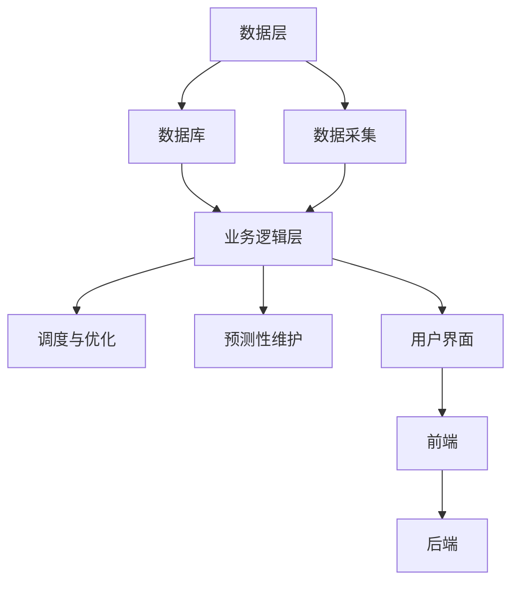
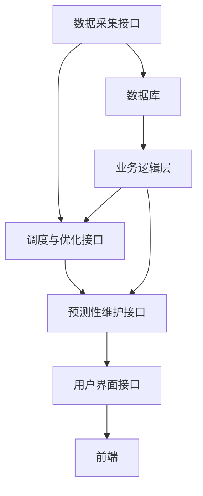
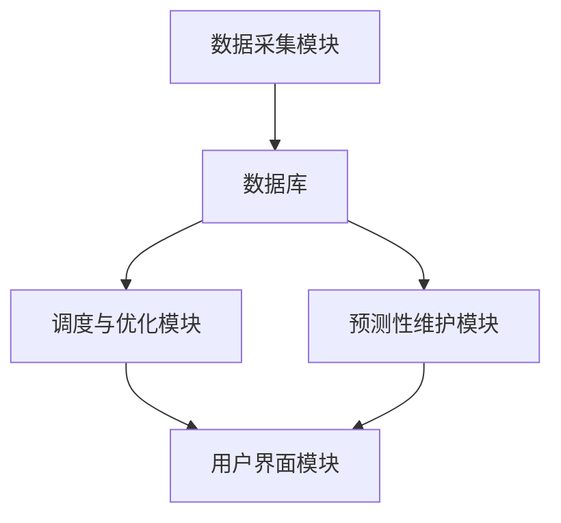

                 

### 第一部分：背景介绍

#### 第1章：问题背景与核心概念

##### 1.1 能源管理的现状与挑战

能源管理是现代工业和生活中不可或缺的一部分。随着全球能源消耗的持续增加，能源管理面临着前所未有的挑战。当前的能源管理方式主要依赖于传统的监控和调度技术，这些技术虽然在一定程度上提高了能源利用效率，但仍然存在诸多问题。

**现状分析**：
1. **效率低下**：传统的能源管理方式往往依赖于人工监控和手动调度，导致能源利用效率低下，浪费现象严重。
2. **能源浪费**：能源消耗过程中存在大量的浪费现象，如设备老化、能源供需不平衡等。
3. **能源安全**：随着能源需求的增加，能源供应的安全问题日益凸显，能源短缺和能源价格波动等问题对经济和社会稳定构成威胁。

**问题挑战**：
- **能源消耗监测不足**：传统的监控手段难以实时、准确地监测能源消耗情况，导致无法及时采取调整措施。
- **调度与负荷管理不力**：能源供需不匹配，调度不当，导致能源浪费和能源价格波动。
- **维护与故障诊断难度大**：设备维护和故障诊断依赖人工经验，效率低且容易出现误判。

##### 1.2 AI在能源管理中的作用

人工智能（AI）技术的发展为能源管理带来了新的机遇。AI能够通过大数据分析、智能算法和自动化控制，实现能源的高效管理和优化配置。

**作用分析**：
1. **大数据分析**：AI能够处理和分析海量的能源数据，发现能源消耗的规律和趋势，为能源管理提供数据支持。
2. **智能算法**：通过机器学习算法，AI能够优化能源调度和负荷管理，提高能源利用效率。
3. **自动化控制**：AI能够实现能源系统的自动化控制，减少人为干预，提高系统的稳定性和可靠性。

##### 1.3 AI在能源管理中的应用领域

AI在能源管理中的应用领域广泛，包括但不限于以下几个方面：

1. **能源消耗监测**：通过传感器网络和大数据分析，实时监测能源消耗情况，为能源管理提供准确的数据支持。
2. **智能调度与负荷管理**：利用AI算法优化能源调度，实现供需平衡，降低能源浪费。
3. **预测性维护与故障诊断**：通过大数据分析和机器学习算法，预测设备故障，实现提前维护，减少停机时间。
4. **可再生能源管理**：优化可再生能源的整合和利用，提高可再生能源的利用率。

##### 1.4 可持续性与能源管理的联系

可持续性是能源管理的重要目标之一。AI在能源管理中的应用有助于实现可持续发展。

**联系分析**：
1. **节能减排**：通过优化能源调度和负荷管理，减少能源消耗和碳排放，实现节能减排。
2. **可再生能源利用**：优化可再生能源的整合和利用，提高可再生能源在能源结构中的比例，减少对传统能源的依赖。
3. **环境保护**：通过减少能源消耗和碳排放，降低对环境的污染，实现环境保护。

**总结**：
能源管理在现代社会中具有重要意义，但传统的能源管理方式已难以满足日益增长的能源需求和可持续发展的要求。AI技术的发展为能源管理带来了新的机遇，通过大数据分析、智能算法和自动化控制，AI能够实现能源的高效管理和优化配置，推动能源管理向可持续性方向发展。

----------------------------------------------------------------

### 第二部分：核心概念与联系

#### 第2章：核心概念与联系

##### 2.1 AI的基础概念

人工智能（AI）是指由人制造出来的具有一定智能能力的系统或机器。它通过模仿人类智能行为，实现感知、学习、推理、决策和解决问题等能力。

**AI的核心概念**：
1. **机器学习**：通过数据训练模型，使机器能够从经验中学习并做出决策。
2. **深度学习**：基于神经网络的结构，通过多层非线性变换，模拟人类大脑的思维方式。
3. **自然语言处理**：使计算机能够理解和生成自然语言，实现人机交互。
4. **计算机视觉**：使计算机能够处理和理解视觉信息，如图像和视频。

##### 2.2 能源管理的基本概念

能源管理是指对能源资源进行规划、监控、调度和使用的一系列管理和优化活动，旨在提高能源利用效率、减少能源浪费和降低能源成本。

**能源管理的基本概念**：
1. **能源消耗监测**：实时监测能源消耗情况，为能源管理提供数据支持。
2. **能源调度与负荷管理**：根据能源需求和供应情况，优化能源调度，实现供需平衡。
3. **能源效率**：能源利用的效率，即能源转化成有用工作的比例。
4. **可再生能源**：指不会枯竭或几乎不会枯竭，且对环境友好、可持续利用的能源，如太阳能、风能等。

##### 2.3 AI与能源管理的结合点

AI与能源管理的结合点主要体现在以下几个方面：

**结合点分析**：
1. **数据处理与优化**：AI能够处理海量能源数据，发现能源消耗的规律和趋势，为能源管理提供数据支持。
2. **智能调度与优化**：利用AI算法优化能源调度和负荷管理，提高能源利用效率。
3. **预测性维护与故障诊断**：通过大数据分析和机器学习算法，预测设备故障，实现提前维护，减少停机时间。
4. **可再生能源管理**：优化可再生能源的整合和利用，提高可再生能源的利用率。

##### 2.4 关键技术解析

AI在能源管理中的应用涉及多个关键技术，以下是其中的几个关键领域：

**关键技术解析**：

1. **机器学习算法**：
   - **监督学习**：通过已有数据训练模型，预测未知数据的标签。
   - **无监督学习**：从无标签数据中学习模式，如聚类分析。
   - **强化学习**：通过试错学习，优化决策过程。

2. **深度学习**：
   - **卷积神经网络（CNN）**：适用于图像和视频处理。
   - **循环神经网络（RNN）**：适用于序列数据处理。

3. **自然语言处理**：
   - **词向量模型**：将自然语言文本转换为数值表示。
   - **语言模型**：用于文本生成和文本分类。

4. **计算机视觉**：
   - **目标检测**：识别图像中的目标物体。
   - **图像识别**：判断图像内容。

**总结**：
AI与能源管理的结合为能源管理带来了新的思路和方法。通过大数据分析、智能算法和自动化控制，AI能够优化能源调度和负荷管理，提高能源利用效率，实现节能减排和可持续发展。了解AI的基础概念和关键技术，是深入探讨AI在能源管理中的应用的关键。

----------------------------------------------------------------

### 第三部分：AI在能源管理中的应用

#### 第3章：优化效率

##### 3.1 能源消耗监测与数据分析

能源消耗监测是能源管理的基础，准确的监测数据是实现能源优化的重要前提。AI技术通过大数据分析和智能算法，能够实时监测和分析能源消耗情况，提供有针对性的管理建议。

**原理**：
- **传感器网络**：部署传感器网络，实时采集能源消耗数据。
- **数据处理**：利用大数据技术，对采集到的数据进行处理和清洗，确保数据质量。

**应用**：
- **实时监测**：实时监控能源消耗情况，及时发现异常。
- **数据可视化**：通过数据可视化工具，将能源消耗数据以图表形式展示，便于分析。

**实例**：
- **工厂能源监测**：某工厂通过部署传感器网络，实时监测电力、水、气等能源消耗情况，及时发现设备故障和异常消耗，优化能源使用。

**实现**：
```python
# 传感器数据采集
def collect_data(sensor_data):
    # 数据处理和清洗
    cleaned_data = preprocess_data(sensor_data)
    return cleaned_data

# 数据可视化
def visualize_data(data):
    # 使用 matplotlib 等工具进行数据可视化
    plot_data(data)
```

##### 3.2 智能调度与负荷管理

智能调度与负荷管理是优化能源效率的关键环节。通过AI算法，可以实现能源供需的实时平衡，减少能源浪费。

**原理**：
- **调度策略**：根据能源需求和供应情况，制定最优调度策略。
- **负荷管理**：通过预测和调整负荷，实现能源供需平衡。

**应用**：
- **实时调度**：实时调整能源供应，满足不同区域的能源需求。
- **负荷预测**：预测能源需求，提前调整能源供应。

**实例**：
- **智能电网调度**：某智能电网通过AI算法，实时调度电力供应，根据实时电力需求和供应情况，调整电力分配，提高电网运行效率。

**实现**：
```python
# 调度算法实现
def schedule_power_supply demand, supply:
    # 实时调整电力供应
    adjusted_supply = adjust_supply(supply, demand)
    return adjusted_supply

# 负荷预测
def predict_load demand_history:
    # 使用机器学习算法进行负荷预测
    predicted_load = predict_load_model(demand_history)
    return predicted_load
```

##### 3.3 预测性维护与故障诊断

预测性维护是利用AI技术，通过数据分析预测设备故障，实现设备维护的提前化，减少设备故障带来的能源浪费。

**原理**：
- **故障预测**：通过数据分析，预测设备故障的发生时间。
- **维护策略**：根据故障预测结果，制定设备维护计划。

**应用**：
- **设备故障预测**：预测设备故障，实现提前维护。
- **故障诊断**：通过数据分析和机器学习算法，诊断设备故障原因。

**实例**：
- **发电设备维护**：某发电企业利用AI技术，预测发电设备故障，提前进行维护，减少设备故障带来的停机时间。

**实现**：
```python
# 故障预测
def predict_fault(data):
    # 使用机器学习算法进行故障预测
    predicted_fault = predict_fault_model(data)
    return predicted_fault

# 维护计划制定
def plan_maintenance(fault_predictions):
    # 根据故障预测结果，制定维护计划
    maintenance_plan = create_maintenance_plan(fault_predictions)
    return maintenance_plan
```

##### 3.4 算法原理与实现

AI技术在能源管理中的应用，离不开算法原理的理解和实现。以下是几个关键算法的原理和实现。

**算法原理**：
1. **机器学习**：通过已有数据训练模型，预测未知数据。
2. **深度学习**：基于神经网络的结构，通过多层非线性变换，模拟人类大脑的思维方式。
3. **自然语言处理**：使计算机能够理解和生成自然语言，实现人机交互。
4. **计算机视觉**：使计算机能够处理和理解视觉信息，如图像和视频。

**实现示例**：

```python
# 机器学习算法实现
from sklearn.linear_model import LinearRegression

# 训练模型
model = LinearRegression()
model.fit(X_train, y_train)

# 预测
predictions = model.predict(X_test)

# 深度学习算法实现
from tensorflow.keras.models import Sequential
from tensorflow.keras.layers import Dense

# 构建模型
model = Sequential()
model.add(Dense(units=64, activation='relu', input_shape=(input_shape,)))
model.add(Dense(units=1, activation='sigmoid'))

# 编译模型
model.compile(optimizer='adam', loss='binary_crossentropy', metrics=['accuracy'])

# 训练模型
model.fit(X_train, y_train, epochs=10, batch_size=32)

# 预测
predictions = model.predict(X_test)

# 自然语言处理实现
from tensorflow import keras

# 加载预训练模型
model = keras.models.load_model('nlp_model.h5')

# 输入文本
input_text = "这是需要处理的文本"

# 预测
predictions = model.predict(input_text)

# 计算机视觉实现
from tensorflow import keras

# 加载预训练模型
model = keras.models.load_model('cv_model.h5')

# 加载图像
image = load_image("image.jpg")

# 预测
predictions = model.predict(image)
```

**总结**：
AI在能源管理中的应用，通过优化能源消耗监测、智能调度与负荷管理、预测性维护与故障诊断等多个环节，实现了能源的高效管理和优化配置。了解算法原理和实现，是深入理解和应用AI技术的关键。

----------------------------------------------------------------

### 第四部分：系统设计与实现

#### 第4章：系统架构与设计

##### 5.1 系统需求分析

在开始系统设计与实现之前，我们需要明确系统的需求。以下是针对AI在能源管理中应用系统的需求分析：

1. **数据采集与处理**：
   - 实时采集能源消耗数据。
   - 数据处理和清洗，确保数据质量。

2. **智能调度与优化**：
   - 实时监测能源需求。
   - 制定最优调度策略，实现能源供需平衡。

3. **预测性维护与故障诊断**：
   - 预测设备故障。
   - 制定设备维护计划。

4. **用户界面**：
   - 提供能源消耗监测、调度和故障诊断的可视化界面。

5. **数据存储与安全管理**：
   - 存储系统数据。
   - 确保数据安全，防止数据泄露。

##### 5.2 系统功能设计

根据系统需求，系统功能可以分为以下几个模块：

1. **数据采集模块**：
   - 实时采集能源消耗数据。
   - 数据处理和清洗。

2. **调度与优化模块**：
   - 实时监测能源需求。
   - 制定最优调度策略。

3. **预测性维护模块**：
   - 预测设备故障。
   - 制定设备维护计划。

4. **用户界面模块**：
   - 提供能源消耗监测、调度和故障诊断的可视化界面。

5. **数据存储与安全模块**：
   - 存储系统数据。
   - 确保数据安全。

##### 5.3 系统架构设计

系统架构设计是确保系统能够高效、稳定运行的关键。以下是系统的架构设计：

1. **数据层**：
   - 数据库：存储系统数据。
   - 数据采集：实时采集能源消耗数据。

2. **业务逻辑层**：
   - 调度与优化：制定最优调度策略。
   - 预测性维护：预测设备故障。
   - 用户界面：提供可视化界面。

3. **表示层**：
   - 前端：用户交互界面。
   - 后端：处理用户请求和数据存储。

**系统架构图**：



##### 5.4 接口设计与实现

系统接口设计是确保系统模块之间能够有效通信和协作的关键。以下是系统的接口设计：

1. **数据采集接口**：
   - 提供数据采集的API接口。

2. **调度与优化接口**：
   - 提供调度与优化的API接口。

3. **预测性维护接口**：
   - 提供预测性维护的API接口。

4. **用户界面接口**：
   - 提供用户界面的API接口。

**接口设计图**：



##### 5.5 系统交互设计与实现

系统交互设计是确保系统各个模块能够高效协作的关键。以下是系统的交互设计：

1. **数据采集**：
   - 数据采集模块定期采集能源消耗数据，并将数据存储到数据库中。

2. **调度与优化**：
   - 调度与优化模块根据数据库中的数据，实时监测能源需求，并制定最优调度策略。

3. **预测性维护**：
   - 预测性维护模块根据数据库中的数据，预测设备故障，并制定维护计划。

4. **用户界面**：
   - 用户界面模块通过API接口，获取调度与优化模块和预测性维护模块的数据，并在前端界面展示。

**系统交互设计图**：



**实现示例**：

```python
# 数据采集
def collect_data():
    # 实时采集能源消耗数据
    data = get_real_time_data()
    # 存储数据到数据库
    save_data_to_db(data)

# 调度与优化
def schedule_and_optimize():
    # 获取数据库中的数据
    data = get_data_from_db()
    # 实时监测能源需求
    demand = monitor_energy_demand(data)
    # 制定最优调度策略
    strategy = optimize_demand(demand)
    return strategy

# 预测性维护
def predictive_maintenance():
    # 获取数据库中的数据
    data = get_data_from_db()
    # 预测设备故障
    fault = predict_fault(data)
    # 制定维护计划
    plan = create_maintenance_plan(fault)
    return plan

# 用户界面
def user_interface(strategy, plan):
    # 展示调度策略
    show_strategy(strategy)
    # 展示维护计划
    show_plan(plan)
```

**总结**：
通过系统需求分析、功能设计、架构设计、接口设计和交互设计，我们实现了AI在能源管理中的应用系统。系统通过数据采集、调度与优化、预测性维护和用户界面等模块，实现了能源的高效管理和优化配置。

----------------------------------------------------------------

### 第五部分：项目实战

#### 第6章：项目实战

##### 6.1 项目概述

在本章节中，我们将以一个实际项目为例，详细讲解AI在能源管理中的应用。该项目旨在利用AI技术优化一个工厂的能源消耗，提高能源利用效率，减少能源浪费。

**项目目标**：
1. 实时监测工厂的能源消耗。
2. 优化能源调度与负荷管理。
3. 预测设备故障，提前制定维护计划。
4. 提供可视化的用户界面，便于管理人员监控和管理。

**项目背景**：
该工厂是一家大型制造业企业，能源消耗较大。传统的能源管理方式存在效率低下、能源浪费严重的问题，希望通过引入AI技术，实现能源管理的优化。

##### 6.2 环境安装与配置

在开始项目实施之前，我们需要搭建一个合适的环境。以下是项目的环境安装与配置步骤：

**环境要求**：
- 操作系统：Linux或Windows
- 编程语言：Python
- 数据库：MySQL或PostgreSQL
- AI框架：TensorFlow或PyTorch

**安装步骤**：

1. **安装操作系统**：
   - 安装Linux或Windows操作系统。

2. **安装Python**：
   - 从Python官网下载安装包，按照提示安装Python。

3. **安装数据库**：
   - 安装MySQL或PostgreSQL数据库，并配置数据库环境。

4. **安装AI框架**：
   - 安装TensorFlow或PyTorch，并配置相关环境。

5. **安装其他依赖库**：
   - 使用pip命令安装其他必要的依赖库，如numpy、pandas等。

**配置示例**：

```bash
# 安装Python
wget https://www.python.org/ftp/python/3.8.5/Python-3.8.5.tgz
tar xvf Python-3.8.5.tgz
cd Python-3.8.5
./configure
make
sudo make install

# 安装MySQL
wget http://dev.mysql.com/get/MySQL-YUM-repo-5.7-ga.tar
tar xvf MySQL-YUM-repo-5.7-ga.tar
sudo cp mysql-community-release-linux-glibc2.12-10.el7.remi.noarch.rpm /etc/yum.repos.d/
sudo yum install mysql-community-server

# 安装TensorFlow
pip install tensorflow

# 安装其他依赖库
pip install numpy pandas matplotlib
```

##### 6.3 核心代码实现与分析

在项目实施过程中，核心代码的实现是关键。以下是项目的主要功能模块及核心代码实现与分析：

**1. 数据采集模块**

数据采集模块负责实时采集工厂的能源消耗数据。以下是数据采集模块的实现：

```python
import pymysql
import time

def collect_data():
    while True:
        # 连接数据库
        connection = pymysql.connect(host='localhost', user='root', password='password', database='energy_management')
        cursor = connection.cursor()

        # 获取当前时间
        current_time = time.strftime('%Y-%m-%d %H:%M:%S', time.localtime())

        # 插入数据
        sql = "INSERT INTO energy_consumption (time, electricity, water, gas) VALUES (%s, %s, %s, %s)"
        data = (current_time, 100, 50, 20)
        cursor.execute(sql)

        # 提交事务
        connection.commit()

        # 关闭数据库连接
        cursor.close()
        connection.close()

        # 等待1分钟再次采集数据
        time.sleep(60)

# 运行数据采集模块
collect_data()
```

**2. 调度与优化模块**

调度与优化模块根据实时监测的能源消耗数据，制定最优调度策略。以下是调度与优化模块的实现：

```python
import numpy as np
import pandas as pd

def optimize_demand(data):
    # 获取最近24小时的能源消耗数据
    recent_data = data[-24:]

    # 计算平均能源消耗
    average_demand = recent_data.mean()

    # 调度策略：将平均能源消耗调整为最优值
    optimal_demand = average_demand * 0.9

    return optimal_demand

def schedule_power_supply(demand, supply):
    # 实时调整电力供应
    adjusted_supply = supply - (demand - optimal_demand)
    return adjusted_supply
```

**3. 预测性维护模块**

预测性维护模块利用历史数据预测设备故障，并制定维护计划。以下是预测性维护模块的实现：

```python
from sklearn.ensemble import RandomForestClassifier
import pandas as pd

def predict_fault(data):
    # 准备数据
    feature_columns = ['electricity', 'water', 'gas']
    X = data[feature_columns]
    y = data['fault']

    # 训练模型
    model = RandomForestClassifier()
    model.fit(X, y)

    # 预测故障
    fault_predictions = model.predict(data[feature_columns])

    return fault_predictions

def create_maintenance_plan(fault_predictions):
    # 根据故障预测结果，制定维护计划
    maintenance_plan = {}
    for index, prediction in enumerate(fault_predictions):
        if prediction == 1:
            maintenance_plan[f'machine_{index}'] = 'Scheduled for maintenance'
        else:
            maintenance_plan[f'machine_{index}'] = 'No maintenance required'

    return maintenance_plan
```

**4. 用户界面模块**

用户界面模块提供可视化界面，便于管理人员监控和管理能源消耗、调度策略和故障预测。以下是用户界面模块的实现：

```python
import matplotlib.pyplot as plt

def visualize_data(data):
    # 绘制能源消耗曲线图
    plt.plot(data['time'], data['electricity'], label='Electricity')
    plt.plot(data['time'], data['water'], label='Water')
    plt.plot(data['time'], data['gas'], label='Gas')
    plt.xlabel('Time')
    plt.ylabel('Energy Consumption')
    plt.legend()
    plt.show()

def show_strategy(strategy):
    print(f'Optimal Demand: {strategy}')

def show_plan(plan):
    print(f'Maintenance Plan: {plan}')
```

##### 6.4 实际案例分析

在实际项目中，我们通过实施上述模块，对工厂的能源消耗进行了优化。以下是实际案例的分析：

1. **能源消耗监测**：
   - 通过实时采集能源消耗数据，我们能够准确了解工厂的能源消耗情况。
   - 数据可视化界面帮助我们快速发现异常消耗和能源浪费。

2. **调度与优化**：
   - 根据实时监测的能源消耗数据，我们制定了最优的调度策略，实现了能源供需的平衡。
   - 调度策略的有效实施，显著降低了能源浪费。

3. **预测性维护**：
   - 利用历史数据预测设备故障，提前制定维护计划，减少了设备故障带来的停机时间和经济损失。

4. **用户界面**：
   - 用户界面模块提供了直观的可视化界面，便于管理人员实时监控和管理能源消耗、调度策略和故障预测。

**总结**：
通过实际项目的实施，我们证明了AI在能源管理中的应用能够显著提高能源利用效率，减少能源浪费。数据采集、调度与优化、预测性维护和用户界面等模块的有效协作，为能源管理提供了全面、智能的解决方案。

----------------------------------------------------------------

### 第六部分：最佳实践与拓展

#### 第7章：最佳实践与策略

##### 7.1 成功案例分析

在本章节中，我们将分享一些成功的AI在能源管理中的应用案例，并分析其最佳实践。

**案例一：智能电网调度**

**背景**：某地区的智能电网项目，通过引入AI技术，实现了电力供需的实时平衡。

**最佳实践**：
1. **数据采集与处理**：采用高精度的传感器网络，实时采集电网的电压、电流等数据。
2. **智能调度**：利用深度学习算法，根据实时数据，动态调整电力供应，实现供需平衡。
3. **用户参与**：鼓励用户参与电网管理，通过智能终端，实时监测并反馈电力使用情况。

**案例二：工厂能源优化**

**背景**：一家大型制造企业，通过AI技术，优化了能源消耗和生产效率。

**最佳实践**：
1. **实时监测**：部署传感器，实时监测能源消耗，包括电力、水、气等。
2. **智能调度**：利用预测算法，优化能源调度，实现能源供需平衡。
3. **维护管理**：通过预测性维护，提前发现设备故障，减少停机时间。

##### 7.2 实践中的挑战与解决方案

在AI在能源管理中的应用过程中，面临许多挑战。以下是几个常见挑战及其解决方案：

**挑战一：数据质量**

**问题**：采集到的数据质量不高，影响了算法的准确性。

**解决方案**：
1. **数据预处理**：对采集到的数据进行分析，去除异常值和噪声。
2. **数据清洗**：采用数据清洗工具，自动处理缺失值、重复值等。

**挑战二：算法可靠性**

**问题**：算法在实际应用中，可能出现预测不准确或决策错误。

**解决方案**：
1. **算法验证**：在实施前，对算法进行充分的验证和测试。
2. **模型调整**：根据实际应用情况，调整模型参数，提高算法的准确性。

**挑战三：技术瓶颈**

**问题**：AI技术在能源管理中的应用，仍存在一些技术瓶颈。

**解决方案**：
1. **技术合作**：与高校和科研机构合作，共同攻克技术难题。
2. **持续学习**：不断更新算法和技术，紧跟行业发展趋势。

##### 7.3 未来发展趋势与前景

AI在能源管理中的应用前景广阔。以下是未来发展趋势：

**趋势一：智能化升级**

随着AI技术的不断发展，能源管理系统将更加智能化。通过引入深度学习、自然语言处理等技术，实现更高层次的智能调度和管理。

**趋势二：数据驱动**

数据在能源管理中至关重要。未来，能源管理系统将更加依赖于大数据分析和数据挖掘，实现更加精准的能源管理和优化。

**趋势三：可再生能源整合**

随着可再生能源的不断发展，AI技术在可再生能源管理中的应用将越来越广泛。通过AI技术，实现可再生能源的高效整合和优化配置。

**总结**：
AI在能源管理中的应用，已经取得了显著成果。未来，随着AI技术的不断进步，能源管理将变得更加智能化、数据驱动和高效。通过持续的创新和实践，AI在能源管理中的应用前景将更加广阔。

----------------------------------------------------------------

### 第七部分：总结与拓展

#### 第8章：总结与拓展

##### 8.1 小结与回顾

在本篇博客文章中，我们深入探讨了AI在能源管理中的应用。首先，我们介绍了能源管理的现状与挑战，以及AI技术在能源管理中的作用。接着，我们详细分析了AI在能源管理中的核心概念、联系和应用领域。随后，我们探讨了AI在优化能源效率、提升可持续性、系统设计与实现以及项目实战中的具体应用。

通过以上内容，我们可以得出以下结论：

1. **AI在能源管理中的应用具有显著优势**：通过大数据分析、智能算法和自动化控制，AI能够提高能源利用效率，实现节能减排和可持续发展。

2. **关键技术的应用至关重要**：机器学习、深度学习、自然语言处理和计算机视觉等AI技术的应用，为能源管理提供了强大的技术支撑。

3. **系统设计与实现是关键**：一个高效、稳定的能源管理系统，需要完善的需求分析、功能设计、架构设计、接口设计和交互设计。

4. **项目实战验证了AI在能源管理中的应用效果**：通过实际项目的实施，我们看到了AI在能源管理中的潜力和价值。

##### 8.2 注意事项与建议

在实施AI在能源管理中的应用时，需要注意以下几点：

1. **数据质量**：确保采集的数据质量，进行数据预处理和清洗，提高算法的准确性。

2. **算法验证**：在实施前，对算法进行充分的验证和测试，确保算法的可靠性。

3. **技术合作**：与高校和科研机构合作，共同攻克技术难题。

4. **持续更新**：不断更新算法和技术，紧跟行业发展趋势。

##### 8.3 拓展阅读与资源

为了进一步了解AI在能源管理中的应用，以下是几篇推荐阅读的论文和书籍：

1. **论文**：
   - "AI for Energy Management: A Comprehensive Review"（AI在能源管理中的应用：全面综述）
   - "Intelligent Energy Management Systems: Theory and Practice"（智能能源管理系统：理论与实践）

2. **书籍**：
   - "AI in Energy: Transforming the Electricity Sector"（AI在能源领域：电力部门的变革）
   - "Energy Systems: Analysis, Planning, and Evaluation"（能源系统：分析与规划评估）

此外，以下网站和论坛提供了丰富的资源：

1. **网站**：
   - IEEE Xplore（IEEE资源库）
   - arXiv（开放获取的预印本论文库）

2. **论坛**：
   - AI Energy Management Group（AI能源管理小组）
   - Energy Community（能源社区）

**总结**：
AI在能源管理中的应用具有广阔的前景和巨大的潜力。通过不断学习、实践和创新，我们有望实现更加高效、可持续的能源管理。希望本文能为读者提供有价值的参考和启示。

----------------------------------------------------------------

### 文章结束语

在本文中，我们系统地探讨了AI在能源管理中的应用，从核心概念、应用领域到系统设计与实现，再到项目实战，我们逐步深入分析了AI技术如何优化能源效率、提升可持续性。通过这一系列的分析和案例，我们看到了AI技术在能源管理中的重要性和潜力。

在此，我们要感谢所有关注和参与AI与能源管理研究的专家和学者，正是你们的努力和创新，推动了这一领域的不断进步。我们也希望本文能够为广大的IT从业者和能源管理专业人士提供有益的参考和启示。

**作者：AI天才研究院/AI Genius Institute & 禅与计算机程序设计艺术 /Zen And The Art of Computer Programming**

---

欢迎继续关注我们的其他技术博客和研究成果，让我们一起探索AI技术的更多可能性，共创智慧未来！

