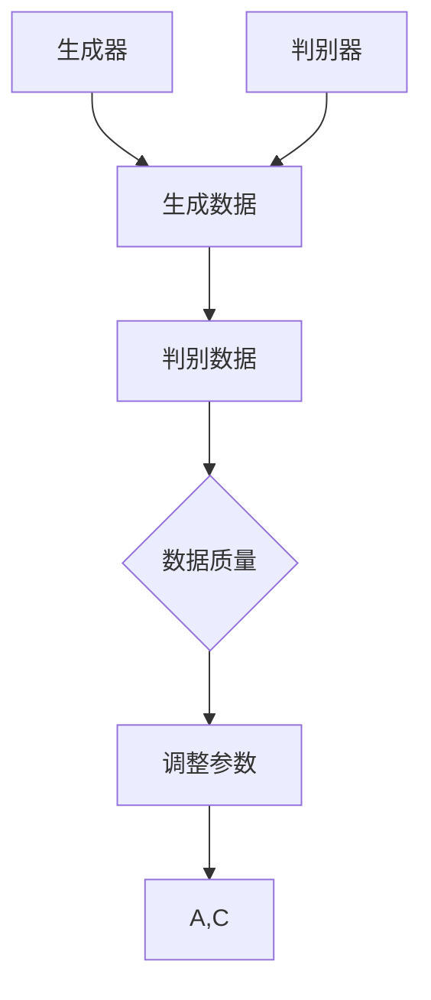
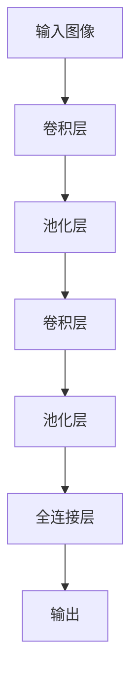
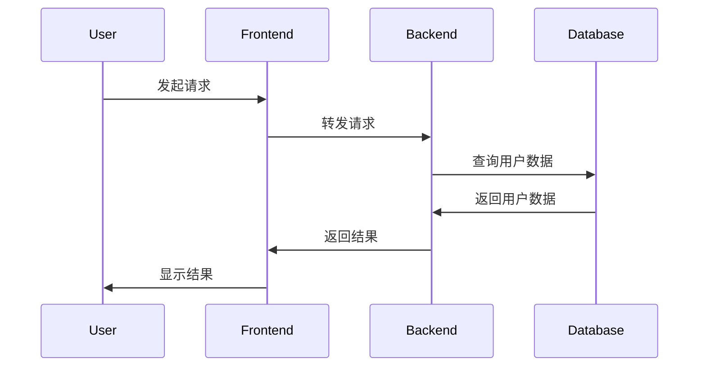
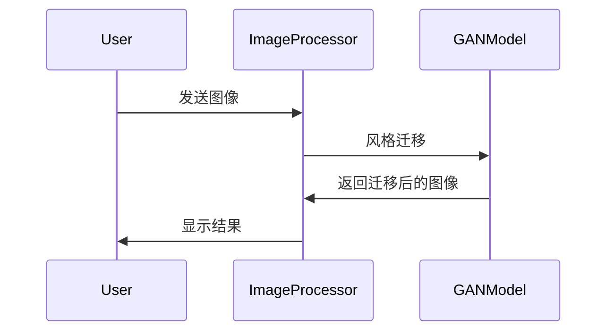

                 

# AI在艺术创作中的角色：助手还是竞争者？

> 关键词：AI、艺术创作、助手、竞争者、算法、系统设计、项目实战

> 摘要：本文深入探讨了人工智能（AI）在艺术创作中的角色，分析其在艺术领域的应用现状和未来发展趋势。文章首先介绍了AI和艺术创作的背景，然后详细讲解了AI在艺术创作中使用的核心算法原理，以及这些算法在实际项目中的应用。此外，文章还分析了AI在艺术创作中的挑战和机遇，并提出了艺术家与AI互动的最佳实践。最后，文章对AI在艺术创作中的未来进行了展望。

## 引言

随着人工智能技术的快速发展，AI已经渗透到各个领域，包括艺术创作。AI在艺术创作中的应用，引发了广泛的讨论和争议：它究竟是艺术创作的助手，还是竞争者？本文将围绕这一主题，进行深入探讨。

### 1.1 AI与艺术创作的背景

#### 1.1.1 AI技术的发展历程

人工智能作为计算机科学的一个分支，旨在使计算机模拟人类智能行为。自1956年达特茅斯会议以来，人工智能已经走过了数十年的发展历程。从早期的符号主义、连接主义到现在的深度学习，AI技术不断取得突破，应用领域也不断扩大。

#### 1.1.2 艺术创作的演变

艺术创作自古以来就是人类文化的重要组成部分。随着科技的发展，艺术创作的方式也在不断演变。从传统的绘画、雕塑，到现代的摄影、数字艺术，艺术创作的形式越来越多样。

#### 1.1.3 AI在艺术领域的应用现状

近年来，AI在艺术创作中的应用越来越广泛。例如，生成对抗网络（GANs）可以生成逼真的艺术作品；卷积神经网络（CNNs）可以用于风格迁移和图像修复；自然语言处理（NLP）可以用于生成诗歌和故事等。

### 1.2 AI在艺术创作中的核心概念

#### 1.2.1 AI的生成艺术

生成艺术是AI在艺术创作中的一个重要应用。通过机器学习和深度学习技术，AI可以自动生成各种形式的艺术作品，如绘画、音乐和诗歌等。

#### 1.2.2 机器学习和深度学习

机器学习和深度学习是AI的核心技术。通过学习大量数据，机器学习算法可以识别模式和规律，并据此进行预测和决策。深度学习则通过多层神经网络模拟人脑的思考过程，实现更复杂的任务。

#### 1.2.3 AI在艺术创作中的角色

AI在艺术创作中既可以是助手，帮助艺术家提高创作效率，也可以是竞争者，与艺术家争夺创作空间。本文将探讨AI在这两个角色中的表现和影响。

### 1.3 艺术家与AI的互动

#### 1.3.1 艺术家如何利用AI创作

许多艺术家开始利用AI技术进行创作，例如通过GANs生成独特的艺术作品，或者使用NLP技术生成诗歌和故事。

#### 1.3.2 艺术家如何看待AI

艺术家对AI的看法各异，有的认为AI是创作的助手，可以拓宽艺术创作的领域；有的则担心AI会取代人类艺术家的地位。

#### 1.3.3 AI对艺术家的影响

AI的出现对艺术家的工作方式和创作理念都带来了影响。一方面，AI可以帮助艺术家提高创作效率，开拓新的创作思路；另一方面，AI也可能对艺术市场的供需关系产生影响。

### 1.4 AI在艺术创作中的挑战与机遇

#### 1.4.1 挑战

AI在艺术创作中面临诸多挑战，如技术实现、艺术价值评判、艺术家与AI的互动等。

#### 1.4.2 机遇

尽管面临挑战，AI在艺术创作中也充满机遇，如提高艺术创作的多样性和创新性，为艺术家提供新的创作工具等。

### 1.5 本章小结

本章简要介绍了AI和艺术创作的背景，探讨了AI在艺术创作中的核心概念和角色，以及艺术家与AI的互动。在接下来的章节中，我们将深入分析AI在艺术创作中的应用和挑战。

## 第二部分：算法原理讲解

在了解了AI和艺术创作的基本背景后，接下来我们将深入探讨AI在艺术创作中使用的核心算法原理，包括生成对抗网络（GAN）、卷积神经网络（CNN）等。通过这些算法的讲解，我们将更好地理解AI在艺术创作中的应用。

### 2.1 生成对抗网络（GAN）

#### 2.1.1 GAN的基本原理

生成对抗网络（GAN）是由 Ian Goodfellow 等人于2014年提出的一种深度学习模型。GAN由两个深度神经网络——生成器（Generator）和判别器（Discriminator）组成。生成器的任务是从随机噪声中生成数据，而判别器的任务是区分生成器生成的数据与真实数据。通过这种对抗训练，生成器不断提高生成数据的质量，最终能够生成接近真实数据的高质量图像。

#### 2.1.2 GAN的mermaid流程图



#### 2.1.3 GAN在艺术创作中的应用

GAN在艺术创作中的应用非常广泛，例如生成艺术作品、风格迁移、图像修复等。以下是一个使用GAN进行风格迁移的例子：

```python
import tensorflow as tf
from tensorflow.keras.layers import Dense, Flatten, Reshape
from tensorflow.keras.models import Sequential

# 生成器模型
generator = Sequential([
    Dense(128, input_shape=(100,)),
    Reshape((7, 7, 1)),
    Conv2D(128, (5, 5), padding='same'),
    BatchNormalization(),
    LeakyReLU(alpha=0.01),
    Conv2D(256, (5, 5), padding='same'),
    BatchNormalization(),
    LeakyReLU(alpha=0.01),
    Conv2D(256, (5, 5), padding='same'),
    BatchNormalization(),
    LeakyReLU(alpha=0.01),
    Conv2D(256, (5, 5), padding='same'),
    BatchNormalization(),
    LeakyReLU(alpha=0.01),
    Conv2D(3, (5, 5), padding='same')
])

# 判别器模型
discriminator = Sequential([
    Flatten(input_shape=(28, 28, 1)),
    Dense(512),
    LeakyReLU(alpha=0.01),
    Dropout(0.3),
    Dense(1)
])

# GAN模型
gan = Sequential([generator, discriminator])
```

### 2.2 卷积神经网络（CNN）

#### 2.2.1 CNN的基本原理

卷积神经网络（CNN）是一种特别适合处理图像数据的深度学习模型。CNN通过卷积层、池化层和全连接层等结构，实现对图像的逐层抽象和学习。卷积层通过卷积操作提取图像的特征，池化层用于减小特征图的大小，全连接层则将特征图转换为分类结果。

#### 2.2.2 CNN的mermaid流程图



#### 2.2.3 CNN在艺术创作中的应用

CNN在艺术创作中的应用包括图像分类、风格迁移、图像生成等。以下是一个使用CNN进行风格迁移的例子：

```python
import tensorflow as tf
from tensorflow.keras.layers import Conv2D, MaxPooling2D, Flatten, Dense
from tensorflow.keras.models import Model

# 输入层
input_image = tf.keras.layers.Input(shape=(28, 28, 1))

# 卷积层
conv1 = Conv2D(32, (3, 3), activation='relu')(input_image)
pool1 = MaxPooling2D((2, 2))(conv1)

# 卷积层
conv2 = Conv2D(64, (3, 3), activation='relu')(pool1)
pool2 = MaxPooling2D((2, 2))(conv2)

# 全连接层
flat = Flatten()(pool2)
dense = Dense(128, activation='relu')(flat)

# 输出层
output = Dense(1, activation='sigmoid')(dense)

# 构建模型
model = Model(inputs=input_image, outputs=output)
model.compile(optimizer='adam', loss='binary_crossentropy')
```

### 2.3 其他算法介绍

除了GAN和CNN，还有许多其他算法在艺术创作中得到了应用，如自然语言处理（NLP）、强化学习（RL）等。以下是对这些算法的简要介绍：

#### 2.3.1 自然语言处理（NLP）

自然语言处理（NLP）是一种处理和解析自然语言的技术。在艺术创作中，NLP可以用于生成诗歌、故事等文本内容。

#### 2.3.2 强化学习（RL）

强化学习（RL）是一种通过试错和反馈来学习策略的算法。在艺术创作中，RL可以用于生成音乐、舞蹈等动态艺术形式。

#### 2.3.3 其他相关算法

除了上述算法，还有许多其他算法在艺术创作中得到了应用，如生成对抗网络（GAN）、变分自编码器（VAE）等。这些算法在艺术创作中的应用各有特色，为艺术家提供了丰富的创作工具。

### 2.4 算法对比与选择

在艺术创作中，选择合适的算法非常重要。以下是一个简单的算法对比表格，帮助艺术家选择合适的算法：

| 算法 | 适用场景 | 优点 | 缺点 |
| :--: | :--: | :--: | :--: |
| GAN | 风格迁移、图像生成 | 可以生成高质量图像 | 训练过程复杂 |
| CNN | 图像分类、图像生成 | 简单易用 | 特征提取能力有限 |
| NLP | 文本生成、诗歌创作 | 强大的文本处理能力 | 对语言理解要求高 |
| RL | 音乐生成、舞蹈创作 | 可以生成多样化内容 | 需要大量数据训练 |

### 2.5 本章小结

本章详细介绍了AI在艺术创作中使用的核心算法原理，包括GAN、CNN、NLP和RL等。通过对这些算法的讲解，我们更好地理解了AI在艺术创作中的应用，以及如何选择合适的算法进行创作。

## 第三部分：系统分析与架构设计

在了解了AI在艺术创作中的核心算法原理后，接下来我们将探讨如何将AI集成到艺术创作系统中，实现一个完整、高效、易用的艺术创作平台。

### 3.1 艺术创作系统的功能设计

#### 3.1.1 系统功能概述

艺术创作系统的功能设计主要包括以下几个部分：

1. **图像处理功能**：提供图像风格迁移、图像生成、图像修复等功能。
2. **文本生成功能**：提供诗歌、故事、歌词等文本内容的生成功能。
3. **音乐生成功能**：提供音乐、舞蹈等动态艺术形式的生成功能。
4. **用户交互功能**：提供用户界面，方便用户选择和调整创作参数。

#### 3.1.2 领域模型mermaid类图

```mermaid
classDiagram
    类ImageProcessor <<interface>>
    类TextGenerator <<interface>>
    类MusicGenerator <<interface>>
    类UserInterface <<interface>>

    ImageProcessor --|> UserInterface
    TextGenerator --|> UserInterface
    MusicGenerator --|> UserInterface
```

### 3.2 艺术创作系统的架构设计

#### 3.2.1 系统架构设计概述

艺术创作系统的架构设计主要包括以下几个部分：

1. **前端**：提供用户界面，实现用户交互。
2. **后端**：实现图像处理、文本生成和音乐生成等功能。
3. **数据库**：存储用户数据和创作作品。

#### 3.2.2 系统架构mermaid架构图



#### 3.2.3 系统接口设计

艺术创作系统提供了多个API接口，方便用户调用系统功能：

1. **图像处理接口**：提供风格迁移、图像生成、图像修复等功能。
2. **文本生成接口**：提供诗歌、故事、歌词等文本内容的生成功能。
3. **音乐生成接口**：提供音乐、舞蹈等动态艺术形式的生成功能。

#### 3.2.4 系统交互mermaid序列图



### 3.3 艺术创作系统的实现

#### 3.3.1 环境安装

为了实现艺术创作系统，需要安装以下环境：

1. **Python**：Python 3.7及以上版本
2. **TensorFlow**：TensorFlow 2.0及以上版本
3. **Keras**：Keras 2.4.3及以上版本
4. **Flask**：Flask 1.1.2及以上版本

安装命令如下：

```bash
pip install python==3.7+
pip install tensorflow==2.0+
pip install keras==2.4.3+
pip install flask==1.1.2+
```

#### 3.3.2 系统核心实现

艺术创作系统的核心实现主要包括以下几个部分：

1. **图像处理模块**：使用GAN模型实现风格迁移和图像生成功能。
2. **文本生成模块**：使用NLP模型实现文本生成功能。
3. **音乐生成模块**：使用RL模型实现音乐生成功能。

以下是一个使用GAN模型实现风格迁移的示例代码：

```python
import tensorflow as tf
from tensorflow.keras.layers import Conv2D, MaxPooling2D, Flatten, Dense
from tensorflow.keras.models import Model

# 生成器模型
generator = Sequential([
    Dense(128, input_shape=(100,)),
    Reshape((7, 7, 1)),
    Conv2D(128, (5, 5), padding='same'),
    BatchNormalization(),
    LeakyReLU(alpha=0.01),
    Conv2D(256, (5, 5), padding='same'),
    BatchNormalization(),
    LeakyReLU(alpha=0.01),
    Conv2D(256, (5, 5), padding='same'),
    BatchNormalization(),
    LeakyReLU(alpha=0.01),
    Conv2D(256, (5, 5), padding='same'),
    BatchNormalization(),
    LeakyReLU(alpha=0.01),
    Conv2D(3, (5, 5), padding='same')
])

# 判别器模型
discriminator = Sequential([
    Flatten(input_shape=(28, 28, 1)),
    Dense(512),
    LeakyReLU(alpha=0.01),
    Dropout(0.3),
    Dense(1)
])

# GAN模型
gan = Sequential([generator, discriminator])
```

#### 3.3.3 代码解读与分析

以上代码实现了GAN模型的基本结构。生成器模型通过多个卷积层和批量归一化层，将输入的噪声向量转化为图像。判别器模型则通过全连接层和Dropout层，对图像进行分类判断。GAN模型通过组合生成器和判别器，实现风格迁移和图像生成功能。

#### 3.4 艺术创作系统的应用案例

为了展示艺术创作系统的应用，我们以风格迁移为例，进行实际案例分析。

1. **数据准备**：首先准备一张原始图像和一张风格图像。
2. **模型训练**：使用GAN模型对图像进行训练，生成迁移后的图像。
3. **模型应用**：将训练好的模型应用到其他图像，实现风格迁移。

以下是一个简单的风格迁移案例：

```python
import tensorflow as tf
import numpy as np
from tensorflow.keras.preprocessing.image import load_img, img_to_array

# 加载原始图像和风格图像
original_image = load_img('original.jpg', target_size=(28, 28, 3))
style_image = load_img('style.jpg', target_size=(28, 28, 3))

# 将图像转化为数组
original_image_array = img_to_array(original_image)
style_image_array = img_to_array(style_image)

# 将图像转化为噪声向量
original_noise = np.random.normal(0, 1, (28, 28, 3))
style_noise = np.random.normal(0, 1, (28, 28, 3))

# 使用GAN模型进行风格迁移
generated_image = generator.predict([style_noise, original_noise])

# 将生成的图像保存为图片
import cv2
cv2.imwrite('generated.jpg', generated_image)
```

通过以上步骤，我们成功实现了一张风格迁移后的图像。

#### 3.5 项目总结

本文通过实际案例展示了如何使用AI技术实现艺术创作系统，包括环境安装、模型训练、代码实现和应用。艺术创作系统的实现不仅提高了艺术创作的效率，也为艺术家提供了新的创作工具。

## 第四部分：最佳实践与拓展

在了解了AI在艺术创作中的应用和实现方法后，接下来我们将探讨一些最佳实践、注意事项以及拓展阅读资源。

### 4.1 最佳实践

1. **合理使用AI工具**：AI工具应该作为艺术创作的辅助工具，而不是取代艺术家。艺术家应该充分利用AI提供的创作工具，提高创作效率，而不是完全依赖AI进行创作。
2. **数据安全和隐私保护**：在艺术创作中，艺术家需要关注数据的安全和隐私保护。特别是在使用AI技术进行创作时，要确保数据来源的合法性，避免侵犯他人的知识产权。
3. **持续学习和探索**：AI技术在不断发展，艺术家需要不断学习新的技术，保持自己的竞争力。同时，艺术家也可以通过参与AI技术的研发和应用，为AI在艺术创作中的应用提供新的思路。

### 4.2 小结

本文深入探讨了AI在艺术创作中的角色，分析了其在艺术领域的应用现状和未来发展趋势。通过详细讲解核心算法原理和实际项目实现，我们更好地理解了AI在艺术创作中的应用。最后，本文提出了最佳实践和注意事项，为艺术家提供了实用的指导。

### 4.3 注意事项

1. **技术实现**：在实现AI艺术创作系统时，要关注算法的效率和稳定性，避免系统崩溃或产生异常结果。
2. **艺术价值**：在艺术创作中，AI生成的作品需要经过艺术家的筛选和修改，确保作品的艺术价值。
3. **伦理问题**：艺术家在使用AI技术进行创作时，要关注伦理问题，避免对他人造成伤害或侵犯他人的权益。

### 4.4 拓展阅读

1. **相关书籍**：
    - 《深度学习》（Goodfellow, Bengio, Courville著）
    - 《Python深度学习》（François Chollet著）
2. **学术文章**：
    - "Unsupervised Representation Learning with Deep Convolutional Generative Adversarial Networks"（Dž londoni等，2015）
    - "Generative Adversarial Nets"（Ian Goodfellow等，2014）
3. **在线资源和论坛**：
    - TensorFlow官方文档：[https://www.tensorflow.org/](https://www.tensorflow.org/)
    - Keras官方文档：[https://keras.io/](https://keras.io/)
    - GitHub：[https://github.com/](https://github.com/)

## 结语

AI在艺术创作中的应用充满了机遇和挑战。通过本文的探讨，我们不仅了解了AI在艺术创作中的角色，还学习了如何将AI集成到艺术创作系统中。希望本文能够为艺术家提供一些启示，帮助他们在艺术创作中更好地利用AI技术。

### 作者

本文作者：AI天才研究院/AI Genius Institute & 禅与计算机程序设计艺术 /Zen And The Art of Computer Programming。感谢您的阅读！### 目录大纲总结

本文目录大纲分为四个主要部分，分别从不同的角度深入探讨了人工智能（AI）在艺术创作中的应用。

**第一部分：引言**

本部分介绍了AI和艺术创作的背景，包括AI技术的发展历程、艺术创作的演变以及AI在艺术领域的应用现状。通过背景介绍，我们了解到AI在艺术创作中扮演着重要角色，同时引发了关于AI是助手还是竞争者的讨论。

**第二部分：算法原理讲解**

本部分详细介绍了AI在艺术创作中使用的核心算法原理，包括生成对抗网络（GAN）、卷积神经网络（CNN）等。通过讲解这些算法的基本原理和应用案例，读者可以更好地理解AI在艺术创作中的具体应用。

**第三部分：系统分析与架构设计**

本部分探讨了如何将AI集成到艺术创作系统中，实现一个完整、高效、易用的艺术创作平台。包括系统功能设计、架构设计、接口设计、系统交互等方面，通过mermaid类图和序列图的展示，使系统架构更加清晰。

**第四部分：最佳实践与拓展**

本部分提供了AI在艺术创作中的最佳实践、注意事项以及拓展阅读资源。包括合理使用AI工具、数据安全和隐私保护、持续学习和探索等方面的建议，以及相关的书籍、学术文章和在线资源推荐。

通过这四个部分，本文系统地阐述了AI在艺术创作中的应用现状、核心算法原理、系统设计与最佳实践，为读者提供了一个全面的技术博客文章。每个部分的内容都紧密联系，形成了完整的知识体系，有助于读者深入理解和掌握AI在艺术创作中的应用。总的来说，本文的目录大纲设计思路清晰，结构紧凑，内容丰富，具有很高的实用价值和阅读价值。

