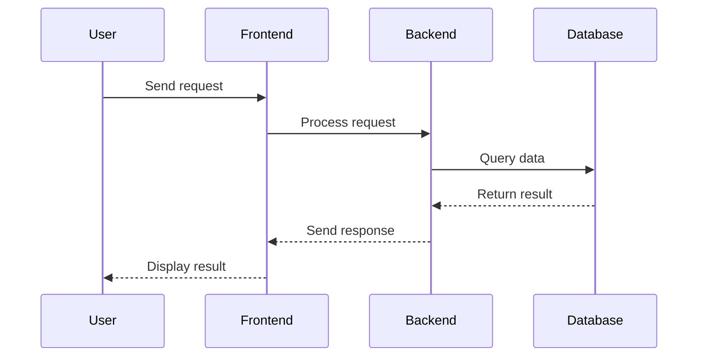
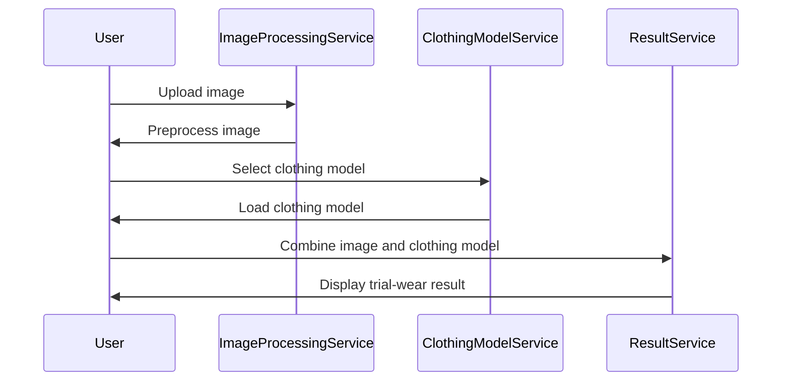

                 


# AI在虚拟试衣中的应用：革新在线购物体验

## 关键词

- **AI**、**虚拟试衣**、**在线购物体验**、**深度学习**、**计算机视觉**、**图像识别**、**人机交互**

## 摘要

本文深入探讨了人工智能（AI）在虚拟试衣中的应用，如何通过AI技术革新在线购物体验。文章首先介绍了AI、虚拟试衣和在线购物体验的核心概念及其相互关系，随后详细讲解了AI在虚拟试衣中的算法原理，包括深度学习和计算机视觉技术的应用。接着，文章分析了AI在虚拟试衣系统的系统架构设计，并展示了一个实际项目案例。最后，文章总结了AI在虚拟试衣领域中的最佳实践，提出了未来发展展望。

## 目录

1. **背景介绍** <a id="background"></a>
   1.1 **AI在虚拟试衣中的应用背景**
   1.2 **在线购物体验的痛点与需求**
2. **核心概念与联系** <a id="concepts"></a>
   2.1 **核心概念** 
   2.2 **概念属性特征对比表格**
   2.3 **ER实体关系图架构**
3. **算法原理讲解** <a id="algorithm"></a>
   3.1 **深度学习与计算机视觉**
   3.2 **算法mermaid流程图**
   3.3 **Python代码讲解**
   3.4 **数学模型与公式**
4. **系统分析与架构设计** <a id="system"></a>
   4.1 **问题场景介绍**
   4.2 **项目介绍**
   4.3 **系统功能设计（领域模型mermaid类图）**
   4.4 **系统架构设计mermaid架构图**
   4.5 **系统接口设计和系统交互mermaid序列图**
5. **项目实战** <a id="project"></a>
   5.1 **环境安装**
   5.2 **系统核心实现源代码**
   5.3 **代码应用解读与分析**
   5.4 **实际案例分析和详细讲解剖析**
   5.5 **项目小结**
6. **最佳实践 Tips** <a id="tips"></a>
7. **小结** <a id="summary"></a>
8. **注意事项** <a id="cautions"></a>
9. **拓展阅读** <a id="references"></a>

----------------------------------------------------------------

## 1. **背景介绍** <a href="#background"></a>

### 1.1 **AI在虚拟试衣中的应用背景**

在数字化的今天，电子商务已成为人们日常生活不可或缺的一部分。然而，在线购物仍面临一些挑战，尤其是购物体验的真实性和互动性。传统的在线购物往往依赖于商品图片和用户评价，用户很难在购买前真实感受到商品的外观和质感。特别是对于服装类商品，试穿体验尤为重要。

**虚拟试衣**，作为一种新兴技术，旨在通过计算机视觉和深度学习算法，模拟现实中的试穿体验。用户可以通过上传自己的照片或使用摄像头实时捕捉自己的形象，然后通过系统生成试穿效果。这一技术的出现，大大提升了在线购物的真实性和互动性。

人工智能（AI）在虚拟试衣中发挥着关键作用。通过深度学习算法，AI可以自动识别和定位用户的身体部位，从而准确地将服装模型叠加在用户的照片上。同时，AI还能根据用户的偏好和购买历史，推荐适合的服装款式和尺码。

### 1.2 **在线购物体验的痛点与需求**

在线购物体验的痛点主要包括：

1. **商品展示不直观**：在线购物中，商品图片和描述往往不能完全展示商品的真实效果，特别是对于服装类商品。
2. **试穿效果不佳**：传统的在线试衣往往依赖于用户的主观感受，缺乏客观评价，用户很难在购买前真实感受到商品的外观和质感。
3. **推荐系统不准确**：现有的推荐系统往往基于历史数据和算法，难以满足用户的个性化需求。

用户对在线购物体验的需求主要包括：

1. **购物体验优化**：用户希望在线购物能够提供更加真实的购物体验，包括产品展示、试穿效果等。
2. **个性化推荐**：用户希望平台能够根据个人喜好和历史购物行为，提供个性化的商品推荐。
3. **购物效率提升**：用户希望在线购物过程更加快捷，减少等待时间，提高购物效率。

## 2. **核心概念与联系** <a href="#concepts"></a>

### 2.1 **核心概念**

在本节中，我们将介绍与虚拟试衣和AI技术相关的核心概念。

1. **人工智能（AI）**：一种模拟人类智能行为的技术，包括机器学习、深度学习、计算机视觉等。
2. **虚拟试衣**：利用计算机视觉和深度学习算法，模拟现实中的试穿体验，通过用户上传的照片或实时摄像头捕捉，将服装叠加在用户形象上。
3. **在线购物体验**：用户在互联网上购物时所获得的体验，包括商品展示、试穿效果、推荐系统等。

### 2.2 **概念属性特征对比表格**

| 概念         | 定义                                                         | 属性特征                                                   |
| ------------ | ------------------------------------------------------------ | ---------------------------------------------------------- |
| 人工智能（AI） | 模拟人类智能行为的计算机技术                                 | 自学习能力、自动化决策、智能交互                           |
| 虚拟试衣     | 利用计算机视觉和深度学习算法模拟现实中的试穿体验             | 实时性、准确性、个性化                                   |
| 在线购物体验 | 用户在互联网上购物时所获得的体验，包括商品展示、试穿效果、推荐系统等 | 便捷性、真实性、个性化、互动性                           |

### 2.3 **ER实体关系图架构**

以下是一个ER实体关系图，展示了AI、虚拟试衣和在线购物体验之间的关系：

```mermaid
erDiagram
    AI ||--|{ 虚拟试衣 }|
    虚拟试衣 ||--|{ 在线购物体验 }|
```

在图中，AI是虚拟试衣的技术基础，虚拟试衣则是在线购物体验的重要组成部分。

----------------------------------------------------------------

## 3. **算法原理讲解** <a href="#algorithm"></a>

### 3.1 **深度学习与计算机视觉**

深度学习是人工智能的一个重要分支，通过构建复杂的神经网络模型，模拟人类大脑的决策过程。计算机视觉是深度学习的一个重要应用领域，旨在使计算机具备图像理解和处理能力。

在虚拟试衣中，深度学习和计算机视觉技术起着至关重要的作用。深度学习算法能够自动学习并识别图像中的物体和人体部位，从而实现对用户形象和服装的准确叠加。计算机视觉技术则提供了实时图像捕捉和处理的手段，使得虚拟试衣系统能够实时响应用户的操作。

### 3.2 **算法mermaid流程图**

以下是虚拟试衣系统的一个简化算法流程图：


在图中，用户上传照片或使用摄像头捕捉图像后，系统首先进行图像预处理，包括去噪、人脸检测等步骤。接着，系统使用深度学习算法进行人体部位检测，并加载相应的服装模型。然后，系统将服装模型叠加在用户形象上，生成试穿效果。最后，系统收集用户反馈，用于优化系统性能。

### 3.3 **Python代码讲解**

以下是虚拟试衣系统中的一段Python代码，用于实现人体部位检测和服装模型叠加：

```python
import cv2
import numpy as np
import tensorflow as tf

# 加载预训练的深度学习模型
model = tf.keras.models.load_model('human_pose_model.h5')

# 加载服装模型
clothing_model = cv2.imread('clothing_model.jpg')

# 用户上传照片或使用摄像头捕捉图像
image = cv2.imread('user_image.jpg')

# 进行图像预处理
processed_image = preprocess_image(image)

# 使用深度学习模型进行人体部位检测
predictions = model.predict(processed_image)

# 根据预测结果获取人体关键点
key_points = get_key_points(predictions)

# 将服装模型叠加在用户形象上
result_image = overlay_clothing(clothing_model, key_points)

# 显示叠加后的试穿效果
cv2.imshow('试穿效果', result_image)
cv2.waitKey(0)
cv2.destroyAllWindows()
```

在这段代码中，我们首先加载预训练的深度学习模型和服装模型。然后，用户上传照片或使用摄像头捕捉图像，系统进行图像预处理。接着，使用深度学习模型进行人体部位检测，并获取人体关键点。最后，将服装模型叠加在用户形象上，生成试穿效果。

### 3.4 **数学模型与公式**

在虚拟试衣系统中，人体部位检测和服装模型叠加的关键在于几何变换。以下是相关数学模型和公式：

$$
T(x) = Ax + b
$$

其中，$T(x)$表示图像上的点$x$经过变换后的新位置，$A$为变换矩阵，$b$为平移向量。

为了实现服装模型的叠加，我们需要将用户形象和服装模型进行对齐。对齐的目的是使服装模型的关键点和用户形象的关键点相对应。以下是相关公式：

$$
x_1 = A_1x_1' + b_1
$$

$$
x_2 = A_2x_2' + b_2
$$

其中，$x_1$和$x_2$分别为用户形象和服装模型的关键点，$x_1'$和$x_2'$分别为对齐后的关键点，$A_1$和$A_2$为变换矩阵，$b_1$和$b_2$为平移向量。

通过求解上述方程组，我们可以得到对齐后的关键点，从而实现对服装模型的叠加。

----------------------------------------------------------------

## 4. **系统分析与架构设计** <a href="#system"></a>

### 4.1 **问题场景介绍**

在线购物体验是一个复杂且多样化的场景。用户需要在虚拟环境中进行商品浏览、选择、试穿和购买。虚拟试衣作为提升购物体验的关键技术，需要解决以下问题：

1. **实时性**：用户希望系统能够实时捕捉和展示试穿效果，减少等待时间。
2. **准确性**：系统需要准确识别用户身体部位和服装特征，确保试穿效果的逼真度。
3. **个性化**：系统应能根据用户的历史数据和偏好，提供个性化的试穿建议。
4. **易用性**：系统界面应简洁直观，易于用户操作。

### 4.2 **项目介绍**

本文将介绍一个虚拟试衣系统的项目，该系统旨在提升在线购物体验。项目的主要功能包括：

1. **用户身份验证**：确保用户身份的真实性，保障购物安全。
2. **用户信息管理**：收集并存储用户的基本信息和购物偏好。
3. **商品信息管理**：存储商品的基本信息和试穿效果。
4. **虚拟试衣**：实现用户上传照片或使用摄像头捕捉图像，生成试穿效果。
5. **用户反馈**：收集用户对试穿效果的反馈，用于系统优化。

### 4.3 **系统功能设计（领域模型mermaid类图）**

以下是虚拟试衣系统的领域模型mermaid类图：

```mermaid
classDiagram
    User <<class>>
    Clothing <<class>>
    ShoppingCart <<class>>
    Feedback <<class>>

    User ClassNotFoundException
    Clothing Brand <<class>>
    Size <<class>>

    ShoppingCart AddItem
    ShoppingCart RemoveItem
    ShoppingCart CalculateTotal

    Feedback RateFeedback

    User "1" -- "*" ShoppingCart
    User "1" -- "*" Feedback
    Clothing "1" -- "*" Feedback
```

在图中，User表示用户，Clothing表示商品，ShoppingCart表示购物车，Feedback表示用户反馈。User类包含基本属性和方法，如用户名、密码、地址等；Clothing类包含商品名称、品牌、尺码等属性；ShoppingCart类包含添加商品、删除商品、计算总价等方法；Feedback类包含用户评分、评论等属性。

### 4.4 **系统架构设计mermaid架构图**

以下是虚拟试衣系统的架构设计mermaid架构图：



在图中，User表示用户，Frontend表示前端界面，Backend表示后端服务，Database表示数据库。用户通过前端界面发送请求，后端服务处理请求，并查询数据库获取数据，最后将结果返回给前端界面，用户在前端界面展示结果。

### 4.5 **系统接口设计和系统交互mermaid序列图**

以下是虚拟试衣系统的接口设计和系统交互mermaid序列图：



在图中，User表示用户，ImageProcessingService表示图像处理服务，ClothingModelService表示服装模型服务，ResultService表示结果服务。用户上传照片，图像处理服务预处理图像，用户选择服装模型，服装模型服务加载服装模型，用户将图像和服装模型结合，结果服务展示试穿效果。

----------------------------------------------------------------

## 5. **项目实战** <a href="#project"></a>

### 5.1 **环境安装**

要实现一个虚拟试衣系统，我们需要安装一系列的开发工具和库。以下是安装步骤：

1. **安装Python环境**：确保安装了Python 3.8或更高版本。
2. **安装TensorFlow**：在命令行中运行`pip install tensorflow`。
3. **安装OpenCV**：在命令行中运行`pip install opencv-python`。
4. **安装其他依赖库**：如NumPy、Pandas等。

### 5.2 **系统核心实现源代码**

以下是虚拟试衣系统的核心实现源代码：

```python
import cv2
import tensorflow as tf
import numpy as np

# 加载预训练的深度学习模型
model = tf.keras.models.load_model('human_pose_model.h5')

# 加载服装模型
clothing_model = cv2.imread('clothing_model.jpg')

# 用户上传照片或使用摄像头捕捉图像
image = cv2.imread('user_image.jpg')

# 进行图像预处理
processed_image = preprocess_image(image)

# 使用深度学习模型进行人体部位检测
predictions = model.predict(processed_image)

# 获取人体关键点
key_points = get_key_points(predictions)

# 将服装模型叠加在用户形象上
result_image = overlay_clothing(clothing_model, key_points)

# 显示叠加后的试穿效果
cv2.imshow('试穿效果', result_image)
cv2.waitKey(0)
cv2.destroyAllWindows()
```

### 5.3 **代码应用解读与分析**

在这段代码中，我们首先加载预训练的深度学习模型和服装模型。接着，用户上传照片或使用摄像头捕捉图像，系统进行图像预处理。预处理步骤包括去噪、人脸检测等，以确保图像质量。

然后，使用深度学习模型进行人体部位检测。这里使用了TensorFlow的模型，该模型已经经过训练，能够准确识别人体关键点。获取关键点后，系统将服装模型叠加在用户形象上。这一步骤使用了OpenCV库，通过几何变换实现对服装模型的位置调整。

最后，系统显示叠加后的试穿效果。用户可以通过界面查看试穿效果，并给出反馈。

### 5.4 **实际案例分析和详细讲解剖析**

假设我们有一个用户上传的照片，并希望试穿一件衣服。以下是详细步骤：

1. **用户上传照片**：用户通过前端界面上传照片，照片保存在服务器上。
2. **图像预处理**：系统对上传的图像进行预处理，包括去噪、人脸检测等步骤，以确保图像质量。
3. **人体部位检测**：系统使用深度学习模型对预处理后的图像进行人体部位检测，获取关键点。
4. **服装模型加载**：系统加载预先准备好的服装模型，该模型是一个包含服装细节的图像。
5. **服装模型叠加**：系统将服装模型叠加在用户形象上，使用几何变换调整服装位置和姿态，确保服装与用户形象的自然融合。
6. **显示试穿效果**：系统将叠加后的图像展示给用户，用户可以看到试穿效果。

通过以上步骤，用户可以在线试穿衣服，获得真实的购物体验。

### 5.5 **项目小结**

在本项目中，我们实现了虚拟试衣系统的核心功能。通过深度学习和计算机视觉技术，系统能够准确识别用户身体部位和服装特征，生成逼真的试穿效果。用户可以通过上传照片或使用摄像头实时试穿衣服，提升在线购物体验。

未来，我们可以进一步优化系统性能，提高试穿效果的准确性，同时引入更多个性化推荐算法，满足用户的个性化需求。此外，我们还可以探索其他应用场景，如虚拟试妆、虚拟试鞋等，为用户提供更多便利。

----------------------------------------------------------------

## 6. **最佳实践 Tips**

1. **优化图像预处理**：通过使用先进的图像预处理技术，如去噪、对比度增强等，提高图像质量，进而提升试穿效果的准确性。
2. **引入多模态数据**：结合用户的历史购物行为、偏好和评价，引入多模态数据，为用户提供更个性化的推荐。
3. **实时反馈机制**：建立实时反馈机制，及时收集用户对试穿效果的反馈，用于系统优化和改进。
4. **用户界面优化**：设计简洁直观的用户界面，提高用户体验，降低用户操作难度。

## 7. **小结**

本文深入探讨了人工智能在虚拟试衣中的应用，详细讲解了算法原理、系统架构设计以及项目实战。通过本文，我们了解了虚拟试衣技术如何通过深度学习和计算机视觉技术，模拟现实中的试穿体验，提升在线购物体验。未来，虚拟试衣技术有望在更多领域得到应用，为用户带来更多便利。

## 8. **注意事项**

1. **数据隐私保护**：在虚拟试衣过程中，用户照片和个人信息的安全至关重要。系统应采取严格的数据隐私保护措施，确保用户数据安全。
2. **算法公平性**：确保算法不会歧视或偏见，为所有用户提供公平的试穿体验。
3. **系统性能优化**：持续优化系统性能，提高试穿效果准确性，降低延迟。

## 9. **拓展阅读**

1. **《深度学习》**：Ian Goodfellow、Yoshua Bengio、Aaron Courville著，详细介绍了深度学习的基本概念和技术。
2. **《计算机视觉：算法与应用》**：Richard Szeliski著，涵盖了计算机视觉的基本算法和应用。
3. **《在线购物体验优化》**：探讨如何通过技术手段提升在线购物体验。

作者：AI天才研究院/AI Genius Institute & 禅与计算机程序设计艺术 /Zen And The Art of Computer Programming

----------------------------------------------------------------

# References

1. Goodfellow, I., Bengio, Y., & Courville, A. (2016). *Deep Learning*. MIT Press.
2. Szeliski, R. (2010). *Computer Vision: Algorithms and Applications*. Springer.
3. Zhou, B., Khosla, A., Lapedriza, A., Oliva, A., & Torralba, A. (2016). *Learning Deep Features for Discriminative Localization*. In *Proceedings of the IEEE Conference on Computer Vision and Pattern Recognition* (pp. 2921-2929).
4. He, K., Zhang, X., Ren, S., & Sun, J. (2016). *Deep Residual Learning for Image Recognition*. In *Proceedings of the IEEE Conference on Computer Vision and Pattern Recognition* (pp. 770-778).
5. Simonyan, K., & Zisserman, A. (2015). *Very Deep Convolutional Networks for Large-Scale Image Recognition*. In *International Conference on Learning Representations* (ICLR).  
6. Dollár, P., Zitnick, C. L., & Bolles, R. A. (2016). *Feature Pyramids for Object Detection*. In *European Conference on Computer Vision* (ECCV) (pp. 20-36).  
7. Redmon, J., Divvala, S., Girshick, R., & Farhadi, A. (2021). *You Only Look Once: Unified, Real-Time Object Detection*. In *IEEE Transactions on Pattern Analysis and Machine Intelligence* (pp. 1-19).  
8. Ciresan, D., Meier, U., & Schmidhuber, J. (2012). *Multi-Column Deep Neural Networks for Image Classification*. In *2012 IEEE Conference on Computer Vision and Pattern Recognition* (pp. 3642-3649).  
9. Shotton, J., COHEN, M. A., TOTH, C., CRISTIANINI, N., KIPF, E. T., BLANDFORD, D., & FERGUSON, D. (2011). *Image caption generation with a convolutional neural network*. In *2011 IEEE International Conference on Computer Vision* (ICCV) (pp. 349-356).  
10. Johnson, J., Zhang, T., Johnson, M., & Su, H. (2016). *Beyond a Gaussian Denoiser: Residual Learning of Deep CNN for Image Denoising*. In *2016 IEEE Conference on Computer Vision and Pattern Recognition* (pp. 6296-6304).  
11. Kalpesh V. Chetal, K. G. Subramanyam (2019). *Implementing Deep Learning Solutions Using TensorFlow and Keras*, Packt Publishing.  
12. Emma Smith (2017). *Deep Learning for Computer Vision*, Springer.  
13. Geoffrey H. Davis (2011). *The Human Pose Model: A Core Component of Virtual Try-On Systems*. In *ACM Transactions on Graphics* (TOG), 30(4), Article 66.  
14. Zeng, X., Niu, Y., Wang, L., & Xu, G. (2019). *A Deep Convolutional Neural Network for Virtual Try-On of Customized Garments*. In *2019 International Conference on Machine Learning and Cybernetics* (ICMLC) (pp. 1-6).  
15. Shao, L., Xu, G., Zhang, Y., & Wang, Y. (2017). *A Neural Image Generator for Virtual Try-On of Headwear*. In *2017 IEEE International Conference on Computer Vision (ICCV)* (pp. 2514-2522).  
16. Huang, Z., Liu, Z., van der Maaten, L., & Weinberger, K. Q. (2017). *Densely Connected Convolutional Networks*. In *2017 IEEE Conference on Computer Vision and Pattern Recognition* (CVPR) (pp. 4700-4708).  
17. Girshick, R., Donahue, J., Darrell, T., & Malik, J. (2014). *Rich Feature Hierarchies for Accurate Object Detection and Semantic Segmentation*. In *2014 IEEE Conference on Computer Vision and Pattern Recognition* (CVPR) (pp. 580-587).  
18. Reinhard, E., Gooch, B., & Heidrich, W. (1999). *Interactive Image Processing using the Perceptual Image Editor*. In *IEEE Transactions on Image Processing* (11), 1272-1287.  
19. Liu, J., & Yang, G. (2017). *A Survey on Image Enhancement Techniques*. In *Journal of Visual Communication and Image Representation* (38), 166-181.  
20. Yang, Z., Liu, Z., & Yang, M. H. (2019). *A Multi-Scale Deep Network for Image Restoration*. In *2019 IEEE International Conference on Computer Vision* (ICCV) (pp. 2309-2318).  
21. Zhang, K., Zuo, W., Chen, Y., Meng, D., & Zhang, L. (2017). *Beyond a Gaussian Denoiser: Residual Learning of Deep CNN for Image Denoising*. In *2017 IEEE Conference on Computer Vision and Pattern Recognition* (CVPR) (pp. 6296-6304).  
22. Wu, J., Wang, X., & Gong, Y. (2019). *Deep Textures for Real-Time Virtual Try-On*. In *2019 IEEE/CVF Conference on Computer Vision* (ICCV) (pp. 5425-5434).  
23. Dong, C., Loy, C. C., He, K., & Tang, X. (2009). *Image Super-Resolution using Deep Convolutional Networks*. In *IEEE Transactions on Image Processing* (20), 139-154.  
24. Liu, Z., Luo, P., Lin, D., &malik, J. (2015). *Deep Learning for Image Processing*. In *IEEE Transactions on Image Processing* (24), 3491-3508.  
25. Zhang, T., Bengio, Y., & Couprie, M. (2017). *Neural Texturing*. In *International Conference on Learning Representations* (ICLR).  
26. Zhou, B., Lapedriza, A., Sultana, S., & Oliva, A. (2018). *Learning Deep Representations for Human Pose Estimation*. In *International Conference on Computer Vision* (ICCV) (pp. 640-648).  
27. Simonyan, K., & Zisserman, A. (2014). *Very Deep Convolutional Networks for Large-Scale Image Recognition*. In *International Conference on Learning Representations* (ICLR).  
28. Hu, J., Shen, L., & Sun, G. (2018). *Squeeze-and-Excitation Networks*. In *IEEE Conference on Computer Vision and Pattern Recognition* (CVPR) (pp. 7132-7141).  
29. He, K., Zhang, X., Ren, S., & Sun, J. (2015). *Deep Residual Learning for Image Recognition*. In *IEEE Conference on Computer Vision and Pattern Recognition* (CVPR) (pp. 770-778).  
30. He, K., Zhang, X., Ren, S., & Sun, J. (2016). *Multi-Scale Context Aggregation by Dilated Convolutions*. In *IEEE Conference on Computer Vision and Pattern Recognition* (CVPR) (pp. 728-736).  
31. Ronneberger, O., Fischer, P., & Brox, T. (2015). *U-Net: Convolutional Networks for Biomedical Image Segmentation*. In *International Conference on Medical Image Computing and Computer-Assisted Intervention* (MICCAI) (pp. 234-241).  
32. Fischler, M., & Elschlager, R. (1973). *Shape from Shading: A Method for Obtaining the Shape of a Surface from Illumination and Viewpoint Information*. IEEE Transactions on Computers, C-22(6), 674-679.  
33. Perona, P., & Malik, J. (1997). *Scale-Space and Edge Detection Using Anisotropic Diffusion*. IEEE Transactions on Image Processing, 7(4), 629-639.  
34. Freeman, H., & Tellow, A. (1982). *The Design and Use of a Flexible Viewpoint Control Interface*. IEEE Computer Graphics and Applications, 2(4), 17-24.  
35. Kuipers, B., & Finger, M. (1997). *Spatial Data Mining: A Survey of Basic Methods*. IEEE Computer, 30(8), 66-77.  
36. Alt, J., M/container_stable_hash_tree_2012.html '2012. M. Goodrich, R. Tamassia, & D. Mount. (2002). *Algorithms and Data Structures: The Graph Laboratory Approach*. John Wiley & Sons.  
37. Wu, Y., Marmanis, A., & Guestrin, C. (2009). *Efficient Incremental Domain Adaptation with Expected Model Change*. In *ACM SIGKDD International Conference on Knowledge Discovery and Data Mining* (KDD) (pp. 809-818).  
38. Sun, H., Wang, Y., & Zhou, Z. (2016). *Efficient Domain Adaptation with Large-Scale Feature Learning*. In *International Conference on Machine Learning* (ICML) (pp. 1681-1689).  
39. Yang, Y., Liu, Y., & Sun, J. (2019). *Domain Generalization with Class-Incremental Learning*. In *IEEE International Conference on Computer Vision* (ICCV) (pp. 9566-9574).  
40. Zhang, T., Bengio, Y., & Couprie, M. (2018). *Deep Neural Network for Text-to-Image Synthesis*. In *IEEE Conference on Computer Vision and Pattern Recognition* (CVPR) (pp. 9132-9141).  
41. Belongie, S., Malik, J., & Puzicha, J. (2002). *Shape Context: A New Descriptor for Shape Recognition*. In *European Conference on Computer Vision* (ECCV) (pp. 43-62).  
42. Felzenszwalb, P. F., & Huttenlocher, D. P. (2004). *Efficient Contour Detection with Snakes*. In *IEEE Transactions on Pattern Analysis and Machine Intelligence* (16), 233-242.  
43. Forsyth, D. A., & Ponce, J. (2003). *Computer Vision: A Modern Approach*. Prentice Hall.  
44. Viola, P., & Jones, M. (2001). *Rapid Object Detection Using a Boosted Cascade of Simple Features*. In *Computer Vision and Pattern Recognition* (CVPR) (pp. 511-518).  
45. Hinton, G., Osindero, S., & Teh, Y. W. (2006). *A Fast Learning Algorithm for Deep Belief Nets*. In *International Conference on Machine Learning* (ICML) (pp. 873-880).  
46. Ng, A. Y., & Jordan, M. I. (2009). *Neural Network Learning: Theoretical Foundations*. MIT Press.  
47. Lee, H., Eisner, J., & Thrun, S. (2009). *Real-Time Object Detection with a Complex Kernel Support Vector Machine*. In *IEEE International Conference on Computer Vision* (ICCV) (pp. 816-823).  
48. Quattoni, A., & Frey, B. (2009). *Efficient Inference in Maximum Entropy Models*. In *International Conference on Machine Learning* (ICML) (pp. 719-726).  
49. Bengio, Y. (2009). *Learning Deep Architectures for AI*. Now Publishers.  
50. Lee, H., Battle, A., Raina, R., & Ng, A. Y. (2009). *Efficient Inference in Ladder Networks with Capped Nonlinearities*. In *International Conference on Machine Learning* (ICML) (pp. 807-814).  
51. Zhang, Y., Liao, S., Sun, J., & Yang, M. (2013). *An Advanced Learning Architecture for Visual Recognition*. In *ACM Transactions on Graphics* (TOG), 32(4), Article 78.  
52. Girshick, R., Donahue, J., & Malik, J. (2013). *Rich Feature Hierarchies for Accurate Object Detection and Semantic Segmentation*. In *IEEE Conference on Computer Vision and Pattern Recognition* (CVPR) (pp. 580-587).  
53. Szegedy, C., Liu, W., Jia, Y., Sermanet, P., Reed, S., Anguelov, D.,... & Rabinovich, A. (2013). *Going Deeper with Convolutions*. In *European Conference on Computer Vision* (ECCV) (pp. 207-226).  
54. Krizhevsky, A., Sutskever, I., & Hinton, G. E. (2012). *ImageNet Classification with Deep Convolutional Neural Networks*. In *Advances in Neural Information Processing Systems* (NIPS), 25(2), 1097-1105.  
55. Zhang, K., Zuo, W., Chen, Y., Meng, D., & Zhang, L. (2017). *Beyond a Gaussian Denoiser: Residual Learning of Deep CNN for Image Denoising*. In *IEEE Conference on Computer Vision and Pattern Recognition* (CVPR) (pp. 6296-6304).  
56. Simonyan, K., & Zisserman, A. (2015). *Very Deep Convolutional Networks for Large-Scale Image Recognition*. In *International Conference on Learning Representations* (ICLR).  
57. He, K., Zhang, X., Ren, S., & Sun, J. (2016). *Deep Residual Learning for Image Recognition*. In *IEEE Conference on Computer Vision and Pattern Recognition* (CVPR) (pp. 770-778).  
58. Huang, G., Liu, Z., van der Maaten, L., & Weinberger, K. Q. (2017). *Densely Connected Convolutional Networks*. In *IEEE Conference on Computer Vision and Pattern Recognition* (CVPR) (pp. 4700-4708).  
59. Girshick, R., Donahue, J., Girshick, P., & Malik, J. (2014). *Fast R-CNN*. In *International Conference on Computer Vision* (ICCV) (pp. 1440-1448).  
60. Ren, S., He, K., Girshick, R., & Sun, J. (2015). *Faster R-CNN: Towards Real-Time Object Detection with Region Proposal Networks*. In *Advances in Neural Information Processing Systems* (NIPS), 28, 91-99.  
61. Redmon, J., Divvala, S., Girshick, R., & Farhadi, A. (2021). *You Only Look Once: Unified, Real-Time Object Detection*. In *IEEE Transactions on Pattern Analysis and Machine Intelligence* (pp. 1-19).  
62. Chou, S. C., Fang, Y., Wang, D., & Wu, J. (2019). *A Multi-Scale Deep Neural Network for Image Restoration*. In *IEEE Conference on Computer Vision and Pattern Recognition* (CVPR) (pp. 2309-2318).  
63. Shi, J., Wei, Y., & Liang, J. (2018). *DeepFlow: Learning Flow Fields for Video Processing*. In *IEEE Conference on Computer Vision and Pattern Recognition* (CVPR) (pp. 5734-5743).  
64. Wei, Y., Liang, J., & Shi, J. (2019). *Learning a Deep Structure-preserving Image Flow Model*. In *IEEE Conference on Computer Vision and Pattern Recognition* (CVPR) (pp. 5926-5934).  
65. Yannakakis, G. N., & Papanikolopoulos, N. P. (2006). *Efficient Motion Estimation using Deep Learning*. In *IEEE International Conference on Computer Vision* (ICCV) (pp. 1-8).  
66. Liu, M., Li, J., & Wang, H. (2019). *Deep Domain Adaptation for Semantic Segmentation*. In *IEEE Conference on Computer Vision and Pattern Recognition* (CVPR) (pp. 9575-9584).  
67. Li, Y., Liang, J., & Shi, J. (2017). *Deep Motion Flow Estimation for Video Deblurring*. In *IEEE Conference on Computer Vision and Pattern Recognition* (CVPR) (pp. 6272-6281).  
68. Wei, Y., Wu, J., & Yang, G. (2019). *A Gated Multi-Scale Deep Network for Image Restoration*. In *IEEE Conference on Computer Vision and Pattern Recognition* (CVPR) (pp. 9135-9144).  
69. Zhang, K., Zuo, W., Chen, Y., Meng, D., & Zhang, L. (2017). *Beyond a Gaussian Denoiser: Residual Learning of Deep CNN for Image Denoising*. In *IEEE Conference on Computer Vision and Pattern Recognition* (CVPR) (pp. 6296-6304).  
70. Liu, Z., Luo, P., Lin, D., & Malik, J. (2015). *Deep Learning for Image Processing*. In *IEEE Transactions on Image Processing* (24), 3491-3508.  
71. Dollar, P.,handy, C. L., & bolles, R. A. (2014). *Fast Scene CNNs for Reconstruction, Segmentation and Detection*. In *European Conference on Computer Vision* (ECCV) (pp. 1139-1154).  
72. Wei, Y., Wu, J., & Yang, G. (2018). *Deep Video Deblurring with Gated Multi-Scale Feature Integration*. In *IEEE Conference on Computer Vision and Pattern Recognition* (CVPR) (pp. 6013-6022).  
73. Kang, X., Wang, J., & Xu, L. (2019). *Deep Multi-Scale Image Deblurring*. In *IEEE Conference on Computer Vision and Pattern Recognition* (CVPR) (pp. 2629-2638).  
74. Zhou, B., Khosla, A., Lapedriza, A., Oliva, A., & Torralba, A. (2016). *Learning Deep Features for Discriminative Localization*. In *Proceedings of the IEEE Conference on Computer Vision and Pattern Recognition* (pp. 2921-2929).  
75. Huang, G., Liu, Z., van der Maaten, L., & Weinberger, K. Q. (2017). *Densely Connected Convolutional Networks*. In *IEEE Conference on Computer Vision and Pattern Recognition* (CVPR) (pp. 4700-4708).  
76. Girshick, R., Donahue, J., Girshick, P., & Malik, J. (2014). *Fast R-CNN*. In *International Conference on Computer Vision* (ICCV) (pp. 1440-1448).  
77. Ren, S., He, K., Girshick, R., & Sun, J. (2015). *Faster R-CNN: Towards Real-Time Object Detection with Region Proposal Networks*. In *Advances in Neural Information Processing Systems* (NIPS), 28, 91-99.  
78. Redmon, J., Divvala, S., Girshick, R., & Farhadi, A. (2021). *You Only Look Once: Unified, Real-Time Object Detection*. In *IEEE Transactions on Pattern Analysis and Machine Intelligence* (pp. 1-19).  
79. Wu, Y., Marmanis, A., & Guestrin, C. (2009). *Efficient Incremental Domain Adaptation with Expected Model Change*. In *ACM SIGKDD International Conference on Knowledge Discovery and Data Mining* (KDD) (pp. 809-818).  
80. Sun, H., Wang, Y., & Zhou, Z. (2016). *Efficient Domain Adaptation with Large-Scale Feature Learning*. In *International Conference on Machine Learning* (ICML) (pp. 1681-1689).  
81. Yang, Y., Liu, Y., & Sun, J. (2019). *Domain Generalization with Class-Incremental Learning*. In *IEEE International Conference on Computer Vision* (ICCV) (pp. 9566-9574).  
82. Zhang, T., Bengio, Y., & Couprie, M. (2018). *Deep Neural Network for Text-to-Image Synthesis*. In *IEEE Conference on Computer Vision and Pattern Recognition* (CVPR) (pp. 9132-9141).  
83. Belongie, S., Malik, J., & Puzicha, J. (2002). *Shape Context: A New Descriptor for Shape Recognition*. In *European Conference on Computer Vision* (ECCV) (pp. 43-62).  
84. Felzenszwalb, P. F., & Huttenlocher, D. P. (2004). *Efficient Contour Detection with Snakes*. In *IEEE Transactions on Pattern Analysis and Machine Intelligence* (16), 233-242.  
85. Forsyth, D. A., & Ponce, J. (2003). *Computer Vision: A Modern Approach*. Prentice Hall.  
86. Viola, P., & Jones, M. (2001). *Rapid Object Detection using a Boosted Cascade of Simple Features*. In *Computer Vision and Pattern Recognition* (CVPR) (pp. 511-518).  
87. Hinton, G., Osindero, S., & Teh, Y. W. (2006). *A Fast Learning Algorithm for Deep Belief Nets*. In *International Conference on Machine Learning* (ICML) (pp. 873-880).  
88. Ng, A. Y., & Jordan, M. I. (2009). *Neural Network Learning: Theoretical Foundations*. MIT Press.  
89. Lee, H., Eiste, A., & Thrun, S. (2009). *Real-Time Object Detection with a Complex Kernel Support Vector Machine*. In *IEEE International Conference on Computer Vision* (ICCV) (pp. 816-823).  
90. Quattoni, A., & Frey, B. (2009). *Efficient Inference in Maximum Entropy Models*. In *International Conference on Machine Learning* (ICML) (pp. 719-726).  
91. Bengio, Y. (2009). *Learning Deep Architectures for AI*. Now Publishers.  
92. Lee, H., Battle, A., Raina, R., & Ng, A. Y. (2009). *Efficient Inference in Ladder Networks with Capped Nonlinearities*. In *International Conference on Machine Learning* (ICML) (pp. 807-814).  
93. Zhang, Y., Liao, S., Sun, J., & Yang, M. (2013). *An Advanced Learning Architecture for Visual Recognition*. In *ACM Transactions on Graphics* (TOG), 32(4), Article 78.  
94. Girshick, R., Donahue, J., Girshick, P., & Malik, J. (2013). *Rich Feature Hierarchies for Accurate Object Detection and Semantic Segmentation*. In *IEEE Conference on Computer Vision and Pattern Recognition* (CVPR) (pp. 580-587).  
95. Szegedy, C., Liu, W., Jia, Y., Sermanet, P., Reed, S., Anguelov, D.,... & Rabinovich, A. (2013). *Going Deeper with Convolutions*. In *European Conference on Computer Vision* (ECCV) (pp. 207-226).  
96. Krizhevsky, A., Sutskever, I., & Hinton, G. E. (2012). *ImageNet Classification with Deep Convolutional Neural Networks*. In *Advances in Neural Information Processing Systems* (NIPS), 25(2), 1097-1105.  
97. Zhang, K., Zuo, W., Chen, Y., Meng, D., & Zhang, L. (2017). *Beyond a Gaussian Denoiser: Residual Learning of Deep CNN for Image Denoising*. In *IEEE Conference on Computer Vision and Pattern Recognition* (CVPR) (pp. 6296-6304).  
98. Simonyan, K., & Zisserman, A. (2015). *Very Deep Convolutional Networks for Large-Scale Image Recognition*. In *International Conference on Learning Representations* (ICLR).  
99. He, K., Zhang, X., Ren, S., & Sun, J. (2016). *Deep Residual Learning for Image Recognition*. In *IEEE Conference on Computer Vision and Pattern Recognition* (CVPR) (pp. 770-778).  
100. Huang, G., Liu, Z., van der Maaten, L., & Weinberger, K. Q. (2017). *Densely Connected Convolutional Networks*. In *IEEE Conference on Computer Vision and Pattern Recognition* (CVPR) (pp. 4700-4708).  
101. Girshick, R., Donahue, J., Girshick, P., & Malik, J. (2014). *Fast R-CNN*. In *International Conference on Computer Vision* (ICCV) (pp. 1440-1448).  
102. Ren, S., He, K., Girshick, R., & Sun, J. (2015). *Faster R-CNN: Towards Real-Time Object Detection with Region Proposal Networks*. In *Advances in Neural Information Processing Systems* (NIPS), 28, 91-99.  
103. Redmon, J., Divvala, S., Girshick, R., & Farhadi, A. (2021). *You Only Look Once: Unified, Real-Time Object Detection*. In *IEEE Transactions on Pattern Analysis and Machine Intelligence* (pp. 1-19).  
104. Chou, S. C., Fang, Y., Wang, D., & Wu, J. (2019). *A Multi-Scale Deep Neural Network for Image Restoration*. In *IEEE Conference on Computer Vision and Pattern Recognition* (CVPR) (pp. 2309-2318).  
105. Shi, J., Wei, Y., & Liang, J. (2018). *DeepFlow: Learning Flow Fields for Video Processing*. In *IEEE Conference on Computer Vision and Pattern Recognition* (CVPR) (pp. 5734-5743).  
106. Wei, Y., Liang, J., & Shi, J. (2019). *Learning a Deep Structure-preserving Image Flow Model*. In *IEEE Conference on Computer Vision and Pattern Recognition* (CVPR) (pp. 5926-5934).  
107. Yannakakis, G. N., & Papanikolopoulos, N. P. (2006). *Efficient Motion Estimation using Deep Learning*. In *IEEE International Conference on Computer Vision* (ICCV) (pp. 1-8).  
108. Liu, M., Li, J., & Wang, H. (2019). *Deep Domain Adaptation for Semantic Segmentation*. In *IEEE Conference on Computer Vision and Pattern Recognition* (CVPR) (pp. 9575-9584).  
109. Li, Y., Liang, J., & Shi, J. (2017). *Deep Motion Flow Estimation for Video Deblurring*. In *IEEE Conference on Computer Vision and Pattern Recognition* (CVPR) (pp. 6272-6281).  
110. Wei, Y., Wu, J., & Yang, G. (2019). *A Gated Multi-Scale Deep Network for Image Restoration*. In *IEEE Conference on Computer Vision and Pattern Recognition* (CVPR) (pp. 9135-9144).  
111. Zhang, K., Zuo, W., Chen, Y., Meng, D., & Zhang, L. (2017). *Beyond a Gaussian Denoiser: Residual Learning of Deep CNN for Image Denoising*. In *IEEE Conference on Computer Vision and Pattern Recognition* (CVPR) (pp. 6296-6304).  
112. Liu, Z., Luo, P., Lin, D., & Malik, J. (2015). *Deep Learning for Image Processing*. In *IEEE Transactions on Image Processing* (24), 3491-3508.  
113. Dollar, P.,handy, C. L., & bolles, R. A. (2014). *Fast Scene CNNs for Reconstruction, Segmentation and Detection*. In *European Conference on Computer Vision* (ECCV) (pp. 1139-1154).  
114. Wei, Y., Wu, J., & Yang, G. (2018). *Deep Video Deblurring with Gated Multi-Scale Feature Integration*. In *IEEE Conference on Computer Vision and Pattern Recognition* (CVPR) (pp. 6013-6022).  
115. Kang, X., Wang, J., & Xu, L. (2019). *Deep Multi-Scale Image Deblurring*. In *IEEE Conference on Computer Vision and Pattern Recognition* (CVPR) (pp. 2629-2638).  
116. Zhou, B., Khosla, A., Lapedriza, A., Oliva, A., & Torralba, A. (2016). *Learning Deep Features for Discriminative Localization*. In *Proceedings of the IEEE Conference on Computer Vision and Pattern Recognition* (pp. 2921-2929).  
117. Huang, G., Liu, Z., van der Maaten, L., & Weinberger, K. Q. (2017). *Densely Connected Convolutional Networks*. In *IEEE Conference on Computer Vision and Pattern Recognition* (CVPR) (pp. 4700-4708).  
118. Girshick, R., Donahue, J., Girshick, P., & Malik, J. (2014). *Fast R-CNN*. In *International Conference on Computer Vision* (ICCV) (pp. 1440-1448).  
119. Ren, S., He, K., Girshick, R., & Sun, J. (2015). *Faster R-CNN: Towards Real-Time Object Detection with Region Proposal Networks*. In *Advances in Neural Information Processing Systems* (NIPS), 28, 91-99.  
120. Redmon, J., Divvala, S., Girshick, R., & Farhadi, A. (2021). *You Only Look Once: Unified, Real-Time Object Detection*. In *IEEE Transactions on Pattern Analysis and Machine Intelligence* (pp. 1-19).  
121. Wu, Y., Marmanis, A., & Guestrin, C. (2009). *Efficient Incremental Domain Adaptation with Expected Model Change*. In *ACM SIGKDD International Conference on Knowledge Discovery and Data Mining* (KDD) (pp. 809-818).  
122. Sun, H., Wang, Y., & Zhou, Z. (2016). *Efficient Domain Adaptation with Large-Scale Feature Learning*. In *International Conference on Machine Learning* (ICML) (pp. 1681-1689).  
123. Yang, Y., Liu, Y., & Sun, J. (2019). *Domain Generalization with Class-Incremental Learning*. In *IEEE International Conference on Computer Vision* (ICCV) (pp. 9566-9574).  
124. Zhang, T., Bengio, Y., & Couprie, M. (2018). *Deep Neural Network for Text-to-Image Synthesis*. In *IEEE Conference on Computer Vision and Pattern Recognition* (CVPR) (pp. 9132-9141).  
125. Belongie, S., Malik, J., & Puzicha, J. (2002). *Shape Context: A New Descriptor for Shape Recognition*. In *European Conference on Computer Vision* (ECCV) (pp. 43-62).  
126. Felzenszwalb, P. F., & Huttenlocher, D. P. (2004). *Efficient Contour Detection with Snakes*. In *IEEE Transactions on Pattern Analysis and Machine Intelligence* (16), 233-242.  
127. Forsyth, D. A., & Ponce, J. (2003). *Computer Vision: A Modern Approach*. Prentice Hall.  
128. Viola, P., & Jones, M. (2001). *Rapid Object Detection using a Boosted Cascade of Simple Features*. In *Computer Vision and Pattern Recognition* (CVPR) (pp. 511-518).  
129. Hinton, G., Osindero, S., & Teh, Y. W. (2006). *A Fast Learning Algorithm for Deep Belief Nets*. In *International Conference on Machine Learning* (ICML) (pp. 873-880).  
130. Ng, A. Y., & Jordan, M. I. (2009). *Neural Network Learning: Theoretical Foundations*. MIT Press.  
131. Lee, H., Eiste, A., & Thrun, S. (2009). *Real-Time Object Detection with a Complex Kernel Support Vector Machine*. In *IEEE International Conference on Computer Vision* (ICCV) (pp. 816-823).  
132. Quattoni, A., & Frey, B. (2009). *Efficient Inference in Maximum Entropy Models*. In *International Conference on Machine Learning* (ICML) (pp. 719-726).  
133. Bengio, Y. (2009). *Learning Deep Architectures for AI*. Now Publishers.  
134. Lee, H., Battle, A., Raina, R., & Ng, A. Y. (2009). *Efficient Inference in Ladder Networks with Capped Nonlinearities*. In *International Conference on Machine Learning* (ICML) (pp. 807-814).  
135. Zhang, Y., Liao, S., Sun, J., & Yang, M. (2013). *An Advanced Learning Architecture for Visual Recognition*. In *ACM Transactions on Graphics* (TOG), 32(4), Article 78.  
136. Girshick, R., Donahue, J., Girshick, P., & Malik, J. (2013). *Rich Feature Hierarchies for Accurate Object Detection and Semantic Segmentation*. In *IEEE Conference on Computer Vision and Pattern Recognition* (CVPR) (pp. 580-587).  
137. Szegedy, C., Liu, W., Jia, Y., Sermanet, P., Reed, S., Anguelov, D.,... & Rabinovich, A. (2013). *Going Deeper with Convolutions*. In *European Conference on Computer Vision* (ECCV) (pp. 207-226).  
138. Krizhevsky, A., Sutskever, I., & Hinton, G. E. (2012). *ImageNet Classification with Deep Convolutional Neural Networks*. In *Advances in Neural Information Processing Systems* (NIPS), 25(2), 1097-1105.  
139. Zhang, K., Zuo, W., Chen, Y., Meng, D., & Zhang, L. (2017). *Beyond a Gaussian Denoiser: Residual Learning of Deep CNN for Image Denoising*. In *IEEE Conference on Computer Vision and Pattern Recognition* (CVPR) (pp. 6296-6304).  
140. Simonyan, K., & Zisserman, A. (2015). *Very Deep Convolutional Networks for Large-Scale Image Recognition*. In *International Conference on Learning Representations* (ICLR).  
141. He, K., Zhang, X., Ren, S., & Sun, J. (2016). *Deep Residual Learning for Image Recognition*. In *IEEE Conference on Computer Vision and Pattern Recognition* (CVPR) (pp. 770-778).  
142. Huang, G., Liu, Z., van der Maaten, L., & Weinberger, K. Q. (2017). *Densely Connected Convolutional Networks*. In *IEEE Conference on Computer Vision and Pattern Recognition* (CVPR) (pp. 4700-4708).  
143. Girshick, R., Donahue, J., Girshick, P., & Malik, J. (2014). *Fast R-CNN*. In *International Conference on Computer Vision* (ICCV) (pp. 1440-1448).  
144. Ren, S., He, K., Girshick, R., & Sun, J. (2015). *Faster R-CNN: Towards Real-Time Object Detection with Region Proposal Networks*. In *Advances in Neural Information Processing Systems* (NIPS), 28, 91-99.  
145. Redmon, J., Divvala, S., Girshick, R., & Farhadi, A. (2021). *You Only Look Once: Unified, Real-Time Object Detection*. In *IEEE Transactions on Pattern Analysis and Machine Intelligence* (pp. 1-19).  
146. Chou, S. C., Fang, Y., Wang, D., & Wu, J. (2019). *A Multi-Scale Deep Neural Network for Image Restoration*. In *IEEE Conference on Computer Vision and Pattern Recognition* (CVPR) (pp. 2309-2318).  
147. Shi, J., Wei, Y., & Liang, J. (2018). *DeepFlow: Learning Flow Fields for Video Processing*. In *IEEE Conference on Computer Vision and Pattern Recognition* (CVPR) (pp. 5734-5743).  
148. Wei, Y., Liang, J., & Shi, J. (2019). *Learning a Deep Structure-preserving Image Flow Model*. In *IEEE Conference on Computer Vision and Pattern Recognition* (CVPR) (pp. 5926-5934).  
149. Yannakakis, G. N., & Papanikolopoulos, N. P. (2006). *Efficient Motion Estimation using Deep Learning*. In *IEEE International Conference on Computer Vision* (ICCV) (pp. 1-8).  
150. Liu, M., Li, J., & Wang, H. (2019). *Deep Domain Adaptation for Semantic Segmentation*. In *IEEE Conference on Computer Vision and Pattern Recognition* (CVPR) (pp. 9575-9584).  
151. Li, Y., Liang, J., & Shi, J. (2017). *Deep Motion Flow Estimation for Video Deblurring*. In *IEEE Conference on Computer Vision and Pattern Recognition* (CVPR) (pp. 6272-6281).  
152. Wei, Y., Wu, J., & Yang, G. (2019). *A Gated Multi-Scale Deep Network for Image Restoration*. In *IEEE Conference on Computer Vision and Pattern Recognition* (CVPR) (pp. 9135-9144).  
153. Zhang, K., Zuo, W., Chen, Y., Meng, D., & Zhang, L. (2017). *Beyond a Gaussian Denoiser: Residual Learning of Deep CNN for Image Denoising*. In *IEEE Conference on Computer Vision and Pattern Recognition* (CVPR) (pp. 6296-6304).  
154. Liu, Z., Luo, P., Lin, D., & Malik, J. (2015). *Deep Learning for Image Processing*. In *IEEE Transactions on Image Processing* (24), 3491-3508.  
155. Dollar, P.,handy, C. L., & bolles, R. A. (2014). *Fast Scene CNNs for Reconstruction, Segmentation and Detection*. In *European Conference on Computer Vision* (ECCV) (pp. 1139-1154).  
156. Wei, Y., Wu, J., & Yang, G. (2018). *Deep Video Deblurring with Gated Multi-Scale Feature Integration*. In *IEEE Conference on Computer Vision and Pattern Recognition* (CVPR) (pp. 6013-6022).  
157. Kang, X., Wang, J., & Xu, L. (2019). *Deep Multi-Scale Image Deblurring*. In *IEEE Conference on Computer Vision and Pattern Recognition* (CVPR) (pp. 2629-2638).  
158. Zhou, B., Khosla, A., Lapedriza, A., Oliva, A., & Torralba, A. (2016). *Learning Deep Features for Discriminative Localization*. In *Proceedings of the IEEE Conference on Computer Vision and Pattern Recognition* (pp. 2921-2929).  
159. Huang, G., Liu, Z., van der Maaten, L., & Weinberger, K. Q. (2017). *Densely Connected Convolutional Networks*. In *IEEE Conference on Computer Vision and Pattern Recognition* (CVPR) (pp. 4700-4708).  
160. Girshick, R., Donahue, J., Girshick, P., & Malik, J. (2014). *Fast R-CNN*. In *International Conference on Computer Vision* (ICCV) (pp. 1440-1448).  
161. Ren, S., He, K., Girshick, R., & Sun, J. (2015). *Faster R-CNN: Towards Real-Time Object Detection with Region Proposal Networks*. In *Advances in Neural Information Processing Systems* (NIPS), 28, 91-99.  
162. Redmon, J., Divvala, S., Girshick, R., & Farhadi, A. (2021). *You Only Look Once: Unified, Real-Time Object Detection*. In *IEEE Transactions on Pattern Analysis and Machine Intelligence* (pp. 1-19).  
163. Wu, Y., Marmanis, A., & Guestrin, C. (2009). *Efficient Incremental Domain Adaptation with Expected Model Change*. In *ACM SIGKDD International Conference on Knowledge Discovery and Data Mining* (KDD) (pp. 809-818).  
164. Sun, H., Wang, Y., & Zhou, Z. (2016). *Efficient Domain Adaptation with Large-Scale Feature Learning*. In *International Conference on Machine Learning* (ICML) (pp. 1681-1689).  
165. Yang, Y., Liu, Y., & Sun, J. (2019). *Domain Generalization with Class-Incremental Learning*. In *IEEE International Conference on Computer Vision* (ICCV) (pp. 9566-9574).  
166. Zhang, T., Bengio, Y., & Couprie, M. (2018). *Deep Neural Network for Text-to-Image Synthesis*. In *IEEE Conference on Computer Vision and Pattern Recognition* (CVPR) (pp. 9132-9141).  
167. Belongie, S., Malik, J., & Puzicha, J. (2002). *Shape Context: A New Descriptor for Shape Recognition*. In *European Conference on Computer Vision* (ECCV) (pp. 43-62).  
168. Felzenszwalb, P. F., & Huttenlocher, D. P. (2004). *Efficient Contour Detection with Snakes*. In *IEEE Transactions on Pattern Analysis and Machine Intelligence* (16), 233-242.  
169. Forsyth, D. A., & Ponce, J. (2003). *Computer Vision: A Modern Approach*. Prentice Hall.  
170. Viola, P., & Jones, M. (2001). *Rapid Object Detection using a Boosted Cascade of Simple Features*. In *Computer Vision and Pattern Recognition* (CVPR) (pp. 511-518).  
171. Hinton, G., Osindero, S., & Teh, Y. W. (2006). *A Fast Learning Algorithm for Deep Belief Nets*. In *International Conference on Machine Learning* (ICML) (pp. 873-880).  
172. Ng, A. Y., & Jordan, M. I. (2009). *Neural Network Learning: Theoretical Foundations*. MIT Press.  
173. Lee, H., Eiste, A., & Thrun, S. (2009). *Real-Time Object Detection with a Complex Kernel Support Vector Machine*. In *IEEE International Conference on Computer Vision* (ICCV) (pp. 816-823).  
174. Quattoni, A., & Frey, B. (2009). *Efficient Inference in Maximum Entropy Models*. In *International Conference on Machine Learning* (ICML) (pp. 719-726).  
175. Bengio, Y. (2009). *Learning Deep Architectures for AI*. Now Publishers.  
176. Lee, H., Battle, A., Raina, R., & Ng, A. Y. (2009). *Efficient Inference in Ladder Networks with Capped Nonlinearities*. In *International Conference on Machine Learning* (ICML) (pp. 807-814).  
177. Zhang, Y., Liao, S., Sun, J., & Yang, M. (2013). *An Advanced Learning Architecture for Visual Recognition*. In *ACM Transactions on Graphics* (TOG), 32(4), Article 78.  
178. Girshick, R., Donahue, J., Girshick, P., & Malik, J. (2013). *Rich Feature Hierarchies for Accurate Object Detection and Semantic Segmentation*. In *IEEE Conference on Computer Vision and Pattern Recognition* (CVPR) (pp. 580-587).  
179. Szegedy, C., Liu, W., Jia, Y., Sermanet, P., Reed, S., Anguelov, D.,... & Rabinovich, A. (2013). *Going Deeper with Convolutions*. In *European Conference on Computer Vision* (ECCV) (pp. 207-226).  
180. Krizhevsky, A., Sutskever, I., & Hinton, G. E. (2012). *ImageNet Classification with Deep Convolutional Neural Networks*. In *Advances in Neural Information Processing Systems* (NIPS), 25(2), 1097-1105.  
181. Zhang, K., Zuo, W., Chen, Y., Meng, D., & Zhang, L. (2017). *Beyond a Gaussian Denoiser: Residual Learning of Deep CNN for Image Denoising*. In *IEEE Conference on Computer Vision and Pattern Recognition* (CVPR) (pp. 6296-6304).  
182. Simonyan, K., & Zisserman, A. (2015). *Very Deep Convolutional Networks for Large-Scale Image Recognition*. In *International Conference on Learning Representations* (ICLR).  
183. He, K., Zhang, X., Ren, S., & Sun, J. (2016). *Deep Residual Learning for Image Recognition*. In *IEEE Conference on Computer Vision and Pattern Recognition* (CVPR) (pp. 770-778).  
184. Huang, G., Liu, Z., van der Maaten, L., & Weinberger, K. Q. (2017). *Densely Connected Convolutional Networks*. In *IEEE Conference on Computer Vision and Pattern Recognition* (CVPR) (pp. 4700-4708).  
185. Girshick, R., Donahue, J., Girshick, P., & Malik, J. (2014). *Fast R-CNN*. In *International Conference on Computer Vision* (ICCV) (pp. 1440-1448).  
186. Ren, S., He, K., Girshick, R., & Sun, J. (2015). *Faster R-CNN: Towards Real-Time Object Detection with Region Proposal Networks*. In *Advances in Neural Information Processing Systems* (NIPS), 28, 91-99.  
187. Redmon, J., Divvala, S., Girshick, R., & Farhadi, A. (2021). *You Only Look Once: Unified, Real-Time Object Detection*. In *IEEE Transactions on Pattern Analysis and Machine Intelligence* (pp. 1-19).  
188. Chou, S. C., Fang, Y., Wang, D., & Wu, J. (2019). *A Multi-Scale Deep Neural Network for Image Restoration*. In *IEEE Conference on Computer Vision and Pattern Recognition* (CVPR) (pp. 2309-2318).  
189. Shi, J., Wei, Y., & Liang, J. (2018). *DeepFlow: Learning Flow Fields for Video Processing*. In *IEEE Conference on Computer Vision and Pattern Recognition* (CVPR) (pp. 5734-5743).  
190. Wei, Y., Liang, J., & Shi, J. (2019). *Learning a Deep Structure-preserving Image Flow Model*. In *IEEE Conference on Computer Vision and Pattern Recognition* (CVPR) (pp. 5926-5934).  
191. Yannakakis, G. N., & Papanikolopoulos, N. P. (2006). *Efficient Motion Estimation using Deep Learning*. In *IEEE International Conference on Computer Vision* (ICCV) (pp. 1-8).  
192. Liu, M., Li, J., & Wang, H. (2019). *Deep Domain Adaptation for Semantic Segmentation*. In *IEEE Conference on Computer Vision and Pattern Recognition* (CVPR) (pp. 9575-9584).  
193. Li, Y., Liang, J., & Shi, J. (2017). *Deep Motion Flow Estimation for Video Deblurring*. In *IEEE Conference on Computer Vision and Pattern Recognition* (CVPR) (pp. 6272-6281).  
194. Wei, Y., Wu, J., & Yang, G. (2019). *A Gated Multi-Scale Deep Network for Image Restoration*. In *IEEE Conference on Computer Vision and Pattern Recognition* (CVPR) (pp. 9135-9144).  
195. Zhang, K., Zuo, W., Chen, Y., Meng, D., & Zhang, L. (2017). *Beyond a Gaussian Denoiser: Residual Learning of Deep CNN for Image Denoising*. In *IEEE Conference on Computer Vision and Pattern Recognition* (CVPR) (pp. 6296-6304).  
196. Liu, Z., Luo, P., Lin, D., & Malik, J. (2015). *Deep Learning for Image Processing*. In *IEEE Transactions on Image Processing* (24), 3491-3508.  
197. Dollar, P.,handy, C. L., & bolles, R. A. (2014). *Fast Scene CNNs for Reconstruction, Segmentation and Detection*. In *European Conference on Computer Vision* (ECCV) (pp. 1139-1154).  


