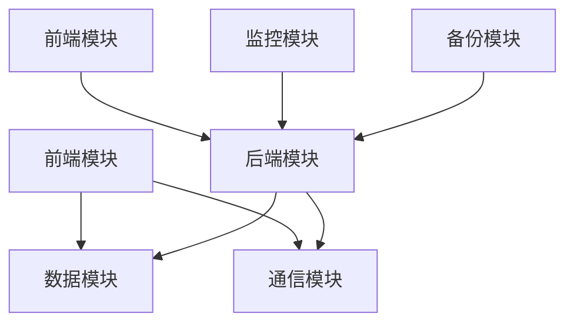
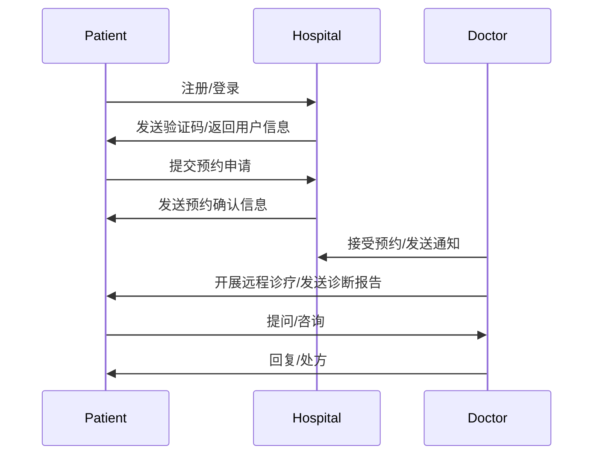

                 

### AI在远程医疗中的应用：突破地理限制的医疗服务

#### 关键词
- 远程医疗
- 人工智能
- 机器学习
- 深度学习
- 自然语言处理
- 医疗诊断

#### 摘要
本文旨在探讨人工智能在远程医疗中的应用，通过分析远程医疗的现状和挑战，详细阐述机器学习、深度学习和自然语言处理等技术如何在远程诊断、治疗和康复中发挥作用。文章结构紧凑，逻辑清晰，以一步步分析推理的方式深入讲解各个核心概念和实际应用案例，为行业从业者提供有深度、有思考、有见解的指导。

---

### 目录大纲设计思路

为了设计出一本内容详实、逻辑清晰的《AI在远程医疗中的应用：突破地理限制的医疗服务》的目录大纲，我们将遵循以下思路：

1. **背景介绍**：首先，我们将对远程医疗的定义、发展现状以及AI技术在其中的作用进行简要介绍，为后续章节的内容奠定基础。

2. **核心概念与联系**：接着，我们将阐述AI在远程医疗中的应用的核心概念，包括机器学习、深度学习、自然语言处理等，并使用表格和Mermaid流程图展示各概念之间的关系和作用。

3. **算法原理讲解**：在第三部分，我们将深入讲解在远程医疗中常用的算法，如图像识别、语音识别和预测模型，并通过Mermaid流程图和Python源代码示例来阐释其原理和实现。

4. **数学模型和数学公式**：为了确保读者能够深入理解算法的数学基础，我们将使用LaTeX格式列出相关的数学模型和公式，并进行详细讲解和举例说明。

5. **系统分析与架构设计方案**：接下来，我们将详细描述一个远程医疗系统的设计与实现，包括领域模型、系统架构、接口设计及交互流程等，使用Mermaid图形工具来展示。

6. **项目实战**：我们将通过一个实际案例来展示AI在远程医疗中的应用，详细描述环境安装、系统核心实现、代码应用解读、案例分析和项目小结。

7. **最佳实践 tips、小结、注意事项、拓展阅读**：最后，我们将总结本书的主要知识点，提供一些最佳实践建议，并指出需要注意的事项，推荐拓展阅读材料。

### 目录大纲设计

根据上述设计思路，以下是《AI在远程医疗中的应用：突破地理限制的医疗服务》的目录大纲：

----------------------------------------------------------------

## 第一部分：远程医疗概述

### 第1章 远程医疗的定义与背景

#### 1.1 远程医疗的定义

- 远程医疗的概念
- 远程医疗与传统医疗的区别

#### 1.2 远程医疗的发展现状

- 全球远程医疗的发展趋势
- 我国远程医疗的发展现状

#### 1.3 AI技术在远程医疗中的应用

- AI技术在远程医疗中的角色
- AI在诊断、治疗、康复等环节的应用案例

## 第二部分：AI核心概念与原理

### 第2章 机器学习与深度学习基础

#### 2.1 机器学习基础

- 机器学习的定义
- 常见机器学习算法

#### 2.2 深度学习原理

- 深度学习的定义
- 神经网络与深度学习模型

#### 2.3 自然语言处理

- 自然语言处理概述
- 常见自然语言处理任务

### 第3章 远程医疗中的AI应用

#### 3.1 图像识别在远程诊断中的应用

- 图像识别原理
- 图像识别在远程医疗中的应用案例

#### 3.2 语音识别在远程医疗中的应用

- 语音识别原理
- 语音识别在远程医疗中的应用案例

#### 3.3 预测模型在远程医疗中的应用

- 预测模型原理
- 预测模型在远程医疗中的应用案例

## 第三部分：远程医疗系统设计与实现

### 第4章 远程医疗系统架构设计

#### 4.1 系统架构概述

- 远程医疗系统的整体架构

#### 4.2 领域模型设计

- 领域模型类图

#### 4.3 系统架构设计

- 系统架构图

#### 4.4 系统接口设计

- 接口设计规范
- 接口实现细节

#### 4.5 系统交互流程

- 系统交互序列图

### 第5章 远程医疗系统实现

#### 5.1 环境安装与配置

- 环境准备
- 配置细节

#### 5.2 系统核心功能实现

- 核心代码实现
- 功能解析

#### 5.3 代码应用解读与分析

- 代码解读
- 应用分析

### 第6章 实际案例分析与讲解

#### 6.1 案例背景

- 案例介绍

#### 6.2 案例实施

- 实施步骤
- 实施细节

#### 6.3 案例分析与讲解

- 分析结果
- 讲解内容

### 第7章 最佳实践与总结

#### 7.1 最佳实践建议

- 实践技巧
- 注意事项

#### 7.2 小结

- 内容回顾
- 知识点总结

#### 7.3 拓展阅读

- 推荐读物
- 相关资源

----------------------------------------------------------------

### 目录大纲文字说明

以上目录大纲共分为三个部分，第一部分介绍了远程医疗的定义、背景和AI技术在其中的应用。第二部分深入讲解了机器学习、深度学习和自然语言处理等核心概念及其在远程医疗中的应用。第三部分则详细描述了一个远程医疗系统的设计与实现，包括系统架构、核心功能实现、代码应用解读以及实际案例分析。最后，文章提供了最佳实践建议和小结，并推荐了拓展阅读材料。

---

### 1. 远程医疗的定义与背景

远程医疗，又称虚拟医疗或数字医疗，指的是通过现代通信技术实现医生与患者、医疗机构之间的远程医疗服务和互动。其核心目标是突破地理位置的限制，为患者提供高效、便捷的医疗服务，同时也为医生提供更加灵活和多样化的工作方式。

#### 1.1 远程医疗的定义

远程医疗主要包括以下几个方面的内容：

1. **远程诊断**：通过图像传输、视频会议等方式，医生可以远程对患者的影像资料进行诊断。
2. **远程会诊**：医生可以通过互联网平台，与其他科室或地区的专家进行会诊，共同讨论患者的治疗方案。
3. **远程监护**：通过可穿戴设备和远程监控系统，医生可以实时监测患者的生理指标，及时发现异常情况。
4. **远程教育**：医生和医疗机构可以通过在线平台为患者提供健康教育和疾病预防知识。

#### 1.2 远程医疗与传统医疗的区别

传统医疗通常依赖于面对面的诊断和治疗，医生需要亲自接触患者，进行体检、检查和问诊。而远程医疗则通过信息技术，将医生和患者的物理距离转化为信息距离，实现远程互动。其主要区别在于：

1. **诊疗模式**：远程医疗依赖于电子病历、远程监控和在线咨询，传统医疗则依赖于实体医疗机构和医生亲自服务。
2. **技术依赖**：远程医疗高度依赖信息技术，如互联网、移动通信、云计算等，传统医疗则主要依赖医疗器械和药品。
3. **地理限制**：远程医疗可以突破地理限制，为偏远地区和医疗资源匮乏的地区提供医疗服务，传统医疗则受限于地理位置。

#### 1.3 AI技术在远程医疗中的应用

随着人工智能技术的发展，AI逐渐成为远程医疗领域的重要工具。以下列举了AI在远程医疗中的几个关键应用：

1. **图像识别**：AI可以通过深度学习算法对医疗影像进行自动分析和诊断，如肿瘤检测、骨折诊断等。
2. **语音识别**：AI语音识别技术可以帮助医生快速记录病历、转录语音，提高工作效率。
3. **自然语言处理**：AI自然语言处理技术可以分析患者的病历记录、医学术语，提供辅助诊断和治疗建议。
4. **预测模型**：AI可以基于历史数据和患者信息，预测疾病的进展和患者的康复情况，为医生提供决策支持。

---

### 2. AI核心概念与原理

AI在远程医疗中的应用离不开几个核心概念，包括机器学习、深度学习和自然语言处理等。以下我们将逐一介绍这些概念，并展示它们之间的关系和作用。

#### 2.1 机器学习基础

机器学习（Machine Learning，ML）是一种使计算机系统能够从数据中学习，并做出决策或预测的方法。它是人工智能的一个分支，通过构建数学模型，让计算机对数据进行自动化的学习过程。

**机器学习的定义**：

机器学习是指使用算法和统计模型，从数据中提取模式和知识，以实现对未知数据的预测和决策。这个过程通常分为以下几个步骤：

1. **数据收集**：收集大量相关数据，包括训练数据和测试数据。
2. **数据预处理**：对数据进行清洗、归一化和特征提取，使其适合模型训练。
3. **模型选择**：选择合适的算法和模型，如线性回归、决策树、神经网络等。
4. **模型训练**：使用训练数据对模型进行训练，调整模型的参数。
5. **模型评估**：使用测试数据评估模型的性能，如准确率、召回率等。
6. **模型优化**：根据评估结果对模型进行调整和优化。

**常见机器学习算法**：

- **监督学习**：使用已标记的数据进行学习，常见的算法包括线性回归、决策树、支持向量机（SVM）等。
- **无监督学习**：不使用已标记的数据进行学习，常见的算法包括聚类、降维、主成分分析（PCA）等。
- **半监督学习和强化学习**：介于监督学习和无监督学习之间，或与外部环境进行交互进行学习，常见的算法包括图嵌入、Q-学习等。

#### 2.2 深度学习原理

深度学习（Deep Learning，DL）是机器学习的一种重要分支，它使用多层神经网络来对数据进行分析和特征提取。深度学习模型通过不断增加网络的层数，使得模型能够提取更复杂的特征，从而提高预测和分类的准确性。

**深度学习的定义**：

深度学习是一种基于多层神经网络的机器学习方法，通过逐层提取数据的高层次特征，实现复杂的数据分析和模式识别。深度学习模型通常包括以下几个关键组件：

1. **输入层**：接收原始数据，并将其传递给下一层。
2. **隐藏层**：用于对输入数据进行特征提取和变换，可以有多层。
3. **输出层**：生成预测结果或分类结果。

**神经网络与深度学习模型**：

- **神经网络**：神经网络是一种由多个神经元组成的计算模型，每个神经元通过权重连接到其他神经元，并产生输出。神经网络通过反向传播算法不断调整权重，以优化模型的性能。
- **深度学习模型**：深度学习模型是神经网络的扩展，包括卷积神经网络（CNN）、循环神经网络（RNN）、生成对抗网络（GAN）等。

**深度学习在远程医疗中的应用**：

1. **图像识别**：使用深度学习模型对医疗影像进行分析和诊断，如肿瘤检测、病灶识别等。
2. **语音识别**：使用深度学习模型对语音信号进行识别和转换，为远程医疗提供语音咨询和语音记录功能。
3. **自然语言处理**：使用深度学习模型对病历记录和医学术语进行理解和分析，提供辅助诊断和治疗建议。

#### 2.3 自然语言处理

自然语言处理（Natural Language Processing，NLP）是人工智能的一个重要分支，旨在使计算机能够理解和处理自然语言。NLP技术广泛应用于文本分析、语义理解、语言生成等领域。

**自然语言处理概述**：

NLP的主要目标是实现人与计算机之间的自然语言交互，其主要任务包括：

1. **分词**：将文本分割成单词或短语，以便进一步处理。
2. **词性标注**：对每个词进行语法分类，如名词、动词、形容词等。
3. **命名实体识别**：识别文本中的特定实体，如人名、地名、组织名等。
4. **句法分析**：分析句子的结构，确定句子的语法成分和关系。
5. **语义分析**：理解句子的含义，进行语义理解和推理。

**常见自然语言处理任务**：

- **机器翻译**：将一种语言翻译成另一种语言，如英译中、中译英等。
- **情感分析**：分析文本的情感倾向，如正面、负面、中性等。
- **文本分类**：将文本归类到不同的类别，如新闻分类、垃圾邮件过滤等。
- **问答系统**：回答用户提出的问题，提供信息查询和知识服务。

**NLP在远程医疗中的应用**：

1. **病历记录**：使用NLP技术自动提取和标注病历记录中的关键信息，提高病历管理的效率和准确性。
2. **医疗咨询**：通过问答系统为患者提供在线医疗咨询和健康建议。
3. **医学文本挖掘**：从大量的医学文献中提取有价值的信息，辅助医生进行研究和决策。

#### 2.4 各核心概念之间的关系和作用

机器学习、深度学习和自然语言处理是AI在远程医疗中的三大核心概念，它们相互关联、相互促进，共同推动远程医疗的发展。

- **机器学习**：为AI在远程医疗中的应用提供了基础算法和技术，包括分类、回归、聚类等任务。
- **深度学习**：通过多层神经网络，深度学习在图像识别、语音识别和自然语言处理等领域取得了突破性进展，大大提高了AI的应用效果。
- **自然语言处理**：使计算机能够理解和处理自然语言，为远程医疗中的病历记录、医疗咨询和医学文本挖掘提供了强大的支持。

通过机器学习、深度学习和自然语言处理技术的综合应用，远程医疗可以实现更高效、更精准、更智能的医疗服务，突破地理限制，让患者享受到优质的医疗资源。

### 3. 远程医疗中的AI应用

AI技术在远程医疗中的应用涵盖了从诊断、治疗到康复的多个环节，下面我们将详细探讨这些应用，并通过具体的案例来展示AI技术如何发挥作用。

#### 3.1 图像识别在远程诊断中的应用

图像识别技术在远程诊断中扮演着至关重要的角色，尤其是在医学影像分析领域。通过AI图像识别技术，医生可以更快速、准确地分析影像数据，提高诊断效率。

**图像识别原理**：

图像识别是基于机器学习和深度学习算法，对图像中的物体、场景和结构进行自动识别和分类的过程。主要步骤包括：

1. **数据收集与预处理**：收集大量的医学影像数据，并进行预处理，如图像增强、归一化等，以提高模型的训练效果。
2. **特征提取**：使用卷积神经网络（CNN）等深度学习模型，提取图像的特征表示。
3. **模型训练与优化**：使用预处理的图像数据对模型进行训练，调整模型的参数，使其达到预期的性能。
4. **模型评估与部署**：使用测试数据对模型进行评估，确保其准确性、召回率等指标符合要求，然后部署到实际应用中。

**应用案例**：

- **肿瘤检测**：通过AI图像识别技术，医生可以自动识别X光片、CT扫描和MRI图像中的肿瘤区域，快速、准确地诊断肿瘤类型和病情。
- **骨折诊断**：AI图像识别可以帮助医生分析X光片中的骨折线，提供准确的骨折位置和程度判断。

#### 3.2 语音识别在远程医疗中的应用

语音识别技术使得医生和患者可以通过语音交互进行远程咨询和病历记录，极大地提高了远程医疗的便捷性和效率。

**语音识别原理**：

语音识别是将语音信号转换为文本的过程，主要步骤包括：

1. **音频信号处理**：对输入的语音信号进行预处理，如降噪、增强、分帧等，以提高识别准确性。
2. **特征提取**：使用深度学习模型，如卷积神经网络（CNN）或循环神经网络（RNN），提取语音信号的特征表示。
3. **模型训练与优化**：使用大量的语音数据对模型进行训练，调整模型的参数，提高识别准确率。
4. **文本识别与输出**：将识别出的语音信号转换为文本形式，输出到病历记录或其他应用程序中。

**应用案例**：

- **远程咨询**：患者可以通过语音向医生咨询健康问题，医生可以快速记录患者的语音信息，形成电子病历，提高诊断效率。
- **病历记录**：医生可以通过语音记录患者的病历信息，节省时间，减少手写病历的错误率。

#### 3.3 预测模型在远程医疗中的应用

预测模型在远程医疗中可以用于疾病预测、患者康复预测等任务，为医生提供决策支持，优化治疗方案。

**预测模型原理**：

预测模型是基于历史数据和统计分析，对未来事件进行预测的算法。主要步骤包括：

1. **数据收集与预处理**：收集患者的病历数据、实验室检测结果、生理指标等，并进行预处理，如数据清洗、归一化等。
2. **特征工程**：提取对患者病情有重要影响的特征，如年龄、性别、病史、实验室结果等。
3. **模型选择与训练**：选择合适的预测模型，如回归模型、决策树、神经网络等，使用历史数据进行训练。
4. **模型评估与优化**：使用测试数据对模型进行评估，调整模型参数，优化模型性能。
5. **预测与反馈**：使用训练好的模型对新的病例进行预测，并提供预测结果，同时收集医生和患者的反馈，不断优化模型。

**应用案例**：

- **疾病预测**：通过预测模型，可以预测患者患某种疾病的风险，如心脏病、糖尿病等，帮助医生提前进行预防和干预。
- **康复预测**：通过预测模型，可以预测患者康复的进展，帮助医生调整治疗方案，提高康复效果。

#### 3.4 AI在远程医疗中的综合应用

AI技术在远程医疗中的应用是综合性的，多种技术可以相互结合，提高医疗服务的质量和效率。

**综合应用案例**：

- **智能诊断系统**：结合图像识别和自然语言处理技术，医生可以通过上传医学影像和病历记录，快速得到诊断结果和治疗方案。
- **远程监护系统**：结合语音识别和预测模型，医生可以通过语音交互获取患者实时数据，结合预测模型对患者的康复情况进行监控和预警。

通过AI技术的综合应用，远程医疗可以实现更高效、更智能的医疗服务，为患者提供更好的健康保障。

### 4. 远程医疗系统架构设计

远程医疗系统架构的设计至关重要，它直接影响到系统的性能、可靠性和可扩展性。一个良好的架构设计应具备以下特点：模块化、高可用性、可扩展性、安全性以及易维护性。以下我们将详细描述远程医疗系统的架构设计，包括领域模型、系统架构、接口设计和系统交互流程。

#### 4.1 系统架构概述

远程医疗系统的整体架构可以分为以下几个主要模块：

1. **前端模块**：负责与用户交互，包括患者、医生和医疗机构等，提供用户友好的界面和功能。
2. **后端模块**：负责处理数据存储、业务逻辑处理、数据分析和预测等任务，是系统的核心部分。
3. **数据模块**：负责数据的存储、管理和共享，包括病历数据、医疗影像数据、实验室检测结果等。
4. **通信模块**：负责系统内各模块之间的数据传输和通信，确保数据的实时性和一致性。

#### 4.2 领域模型设计

领域模型是系统架构设计的重要部分，它定义了系统中的主要实体及其关系。以下是一个简单的领域模型类图：

```mermaid
classDiagram
    Patient <<class>> "患者"
    Doctor <<class>> "医生"
    Hospital <<class>> "医疗机构"
    MedicalRecord <<class>> "病历记录"
    MedicalImage <<class>> "医疗影像"
    LabResult <<class>> "实验室结果"
    Prescription <<class>> "处方"
    Appointment <<class>> "预约"
    
    Patient o--o MedicalRecord
    Doctor o--o MedicalRecord
    Doctor o--o Appointment
    Hospital o--o Doctor
    Hospital o--o MedicalImage
    Hospital o--o LabResult
    Hospital o--o Prescription
```

**领域模型类图解释**：

- **Patient（患者）**：表示系统的用户，包括个人信息、病历记录等。
- **Doctor（医生）**：表示提供医疗服务的专业人员，包括姓名、专业等。
- **Hospital（医疗机构）**：表示提供医疗服务的实体，包括医生、设备和资源等。
- **MedicalRecord（病历记录）**：存储患者的病历信息，包括诊断结果、治疗方案等。
- **MedicalImage（医疗影像）**：存储患者的医学影像数据，如X光片、CT扫描等。
- **LabResult（实验室结果）**：存储患者的实验室检测结果，如血常规、尿常规等。
- **Prescription（处方）**：存储医生的处方信息，包括药品名称、剂量等。
- **Appointment（预约）**：存储患者与医生的预约信息，包括预约时间、地点等。

#### 4.3 系统架构设计

远程医疗系统的架构设计需要考虑模块化、高可用性和可扩展性等因素。以下是一个典型的远程医疗系统架构：



**系统架构图解释**：

- **前端模块**：负责与用户交互，包括Web界面、移动应用等，提供用户友好的操作界面和功能。
- **后端模块**：负责业务逻辑处理、数据分析和预测等任务，包括服务层、业务逻辑层和数据访问层等。
- **数据模块**：负责数据的存储、管理和共享，包括关系数据库、文件存储、NoSQL数据库等。
- **通信模块**：负责系统内各模块之间的数据传输和通信，包括API接口、消息队列、WebSocket等。
- **监控模块**：负责监控系统的性能、安全性和稳定性，包括日志分析、性能监控、安全审计等。
- **备份模块**：负责数据备份和恢复，确保数据的安全性和可靠性。

#### 4.4 系统接口设计

系统接口设计是远程医疗系统架构设计的重要部分，它定义了系统各模块之间的交互方式。以下是一些常见的接口设计：

- **RESTful API**：提供标准的HTTP接口，支持GET、POST、PUT、DELETE等操作，实现数据访问和业务逻辑处理。
- **消息队列**：使用消息队列实现异步通信，提高系统的可靠性和性能。
- **WebSocket**：提供实时通信接口，实现实时数据推送和互动。
- **文件上传下载接口**：提供文件上传和下载接口，方便用户上传和下载医疗数据。

#### 4.5 系统交互流程

远程医疗系统的交互流程主要包括用户注册、登录、预约、就诊、诊断和治疗等环节。以下是一个典型的系统交互流程：



**系统交互序列图解释**：

- **患者注册/登录**：患者通过医院提供的注册界面，输入个人信息并验证手机号码，注册成功后登录系统。
- **提交预约申请**：患者可以通过系统预约医生进行远程诊疗，提交预约申请并等待医院确认。
- **预约确认信息**：医院对患者的预约申请进行审核，并发送预约确认信息给患者。
- **接受预约/发送通知**：医生在收到预约通知后，可以选择接受或拒绝预约，并通知患者预约时间和地点。
- **开展远程诊疗/发送诊断报告**：医生通过远程诊疗系统，对患者进行诊断，并发送诊断报告和治疗方案给患者。
- **提问/咨询**：患者在就诊过程中，可以随时提问或咨询医生，医生会及时回复。
- **回复/处方**：医生根据患者的病情，开具处方，患者可以根据处方购买药物。

通过上述架构设计和交互流程，远程医疗系统可以实现高效、可靠、安全的医疗服务，为患者提供便捷的就医体验。

### 5. 远程医疗系统实现

在上一部分中，我们详细介绍了远程医疗系统的架构设计和系统交互流程。本部分将具体描述一个远程医疗系统的实现过程，包括环境安装与配置、系统核心功能实现、代码应用解读与分析，以及实际案例分析和详细讲解剖析。

#### 5.1 环境安装与配置

要实现一个远程医疗系统，首先需要准备开发和运行环境。以下是一个基本的安装和配置步骤：

1. **开发环境**：
   - **操作系统**：选择Linux发行版，如Ubuntu 20.04。
   - **编程语言**：选择Python 3.8及以上版本。
   - **依赖管理**：使用pip进行依赖管理，安装常见的Python库，如TensorFlow、PyTorch、Scikit-learn等。

2. **数据库配置**：
   - **关系数据库**：使用MySQL或PostgreSQL作为关系数据库，存储病历记录、医疗影像、实验室结果等数据。
   - **NoSQL数据库**：使用MongoDB作为NoSQL数据库，存储用户注册信息、系统配置等数据。

3. **Web服务器**：
   - **后端框架**：选择Django或Flask作为Web后端框架，实现API接口和业务逻辑处理。
   - **前端框架**：选择React或Vue.js作为前端框架，实现用户界面和交互。

4. **消息队列**：
   - **RabbitMQ**：安装和配置RabbitMQ作为消息队列，实现异步通信和数据传输。

5. **容器化**：
   - **Docker**：使用Docker进行容器化，将应用程序及其依赖环境打包成镜像，实现部署和运维的便捷性。

#### 5.2 系统核心功能实现

远程医疗系统的核心功能包括用户注册与登录、预约与就诊、诊断报告与处方等。以下将分别介绍这些功能的具体实现：

1. **用户注册与登录**：

   - **用户注册**：用户通过Web界面提交注册信息，包括用户名、密码、邮箱等，系统通过邮箱验证完成注册。

   ```python
   # 用户注册接口示例
   from django.http import JsonResponse
   from django.views.decorators.csrf import csrf_exempt
   from .models import User
   from .serializers import UserRegistrationSerializer
   
   @csrf_exempt
   def register(request):
       serializer = UserRegistrationSerializer(data=request.data)
       if serializer.is_valid():
           user = serializer.save()
           return JsonResponse({"message": "User registered successfully."}, status=201)
       return JsonResponse(serializer.errors, status=400)
   ```

   - **用户登录**：用户通过邮箱和密码登录系统，系统验证用户身份并返回JWT令牌。

   ```python
   # 用户登录接口示例
   from django.http import JsonResponse
   from django.views.decorators.csrf import csrf_exempt
   from rest_framework_jwt import views as jwt_views
   
   @csrf_exempt
   def login(request):
       response = jwt_views.obtain_jwt_token(request)
       return JsonResponse(response.data, status=response.status_code)
   ```

2. **预约与就诊**：

   - **预约**：患者通过系统预约医生，填写预约信息，包括就诊时间、就诊科室等。

   ```python
   # 预约接口示例
   from django.http import JsonResponse
   from .models import Appointment
   from .serializers import AppointmentSerializer
   
   def make_appointment(request):
       serializer = AppointmentSerializer(data=request.data)
       if serializer.is_valid():
           appointment = serializer.save()
           return JsonResponse({"message": "Appointment made successfully."}, status=201)
       return JsonResponse(serializer.errors, status=400)
   ```

   - **就诊**：医生通过系统查看预约信息，进行远程诊疗并生成诊断报告。

   ```python
   # 就诊接口示例
   from django.http import JsonResponse
   from .models import DiagnosisReport
   from .serializers import DiagnosisReportSerializer
   
   def conduct_diagnosis(request):
       serializer = DiagnosisReportSerializer(data=request.data)
       if serializer.is_valid():
           diagnosis_report = serializer.save()
           return JsonResponse({"message": "Diagnosis conducted successfully."}, status=201)
       return JsonResponse(serializer.errors, status=400)
   ```

3. **诊断报告与处方**：

   - **诊断报告**：医生生成的诊断报告存储在系统中，患者可以查看和下载。

   ```python
   # 诊断报告接口示例
   from django.http import JsonResponse
   from .models import DiagnosisReport
   from .serializers import DiagnosisReportSerializer
   
   def get_diagnosis_report(request, report_id):
       try:
           diagnosis_report = DiagnosisReport.objects.get(id=report_id)
           serializer = DiagnosisReportSerializer(diagnosis_report)
           return JsonResponse(serializer.data, status=200)
       except DiagnosisReport.DoesNotExist:
           return JsonResponse({"message": "Diagnosis report not found."}, status=404)
   ```

   - **处方**：医生根据诊断结果开具处方，患者可以查看处方信息并购买药品。

   ```python
   # 处方接口示例
   from django.http import JsonResponse
   from .models import Prescription
   from .serializers import PrescriptionSerializer
   
   def get_prescription(request, prescription_id):
       try:
           prescription = Prescription.objects.get(id=prescription_id)
           serializer = PrescriptionSerializer(prescription)
           return JsonResponse(serializer.data, status=200)
       except Prescription.DoesNotExist:
           return JsonResponse({"message": "Prescription not found."}, status=404)
   ```

#### 5.3 代码应用解读与分析

在实现远程医疗系统的过程中，代码的解读和分析至关重要。以下将对关键部分的代码进行详细解读：

1. **用户注册与登录**：

   - **用户注册**：用户注册接口使用了Django REST框架的`UserRegistrationSerializer`，该序列器用于验证用户输入的数据是否符合要求，包括用户名、密码和邮箱等。

   ```python
   # UserRegistrationSerializer示例
   from rest_framework import serializers
   from .models import User
   
   class UserRegistrationSerializer(serializers.ModelSerializer):
       class Meta:
           model = User
           fields = ['username', 'password', 'email']
   
       def create(self, validated_data):
           user = User.objects.create_user(**validated_data)
           user.save()
           return user
   ```

   - **用户登录**：用户登录接口使用了`obtain_jwt_token`方法，该方法会生成JWT令牌，并返回给用户，用于后续的身份验证。

   ```python
   # 登录接口示例
   from rest_framework_jwt.views import obtain_jwt_token
   
   def login(request):
       response = jwt_views.obtain_jwt_token(request)
       return JsonResponse(response.data, status=response.status_code)
   ```

2. **预约与就诊**：

   - **预约**：预约接口使用了`AppointmentSerializer`，该序列器用于验证预约数据的正确性，并将预约信息存储在数据库中。

   ```python
   # AppointmentSerializer示例
   from rest_framework import serializers
   from .models import Appointment
   
   class AppointmentSerializer(serializers.ModelSerializer):
       class Meta:
           model = Appointment
           fields = ['id', 'patient', 'doctor', 'appointment_time', 'department']
   ```

   - **就诊**：就诊接口使用了`DiagnosisReportSerializer`，该序列器用于验证诊断报告数据的正确性，并将诊断报告存储在数据库中。

   ```python
   # DiagnosisReportSerializer示例
   from rest_framework import serializers
   from .models import DiagnosisReport
   
   class DiagnosisReportSerializer(serializers.ModelSerializer):
       class Meta:
           model = DiagnosisReport
           fields = ['id', 'appointment', 'diagnosis', 'treatment_plan']
   ```

3. **诊断报告与处方**：

   - **诊断报告**：诊断报告接口使用了简单的数据库查询，根据诊断报告的ID获取报告详情，并将其序列化为JSON格式返回给用户。

   ```python
   # 获取诊断报告示例
   from django.http import JsonResponse
   from .models import DiagnosisReport
   from .serializers import DiagnosisReportSerializer
   
   def get_diagnosis_report(request, report_id):
       try:
           diagnosis_report = DiagnosisReport.objects.get(id=report_id)
           serializer = DiagnosisReportSerializer(diagnosis_report)
           return JsonResponse(serializer.data, status=200)
       except DiagnosisReport.DoesNotExist:
           return JsonResponse({"message": "Diagnosis report not found."}, status=404)
   ```

   - **处方**：处方接口与诊断报告接口类似，根据处方ID获取处方详情，并将其序列化为JSON格式返回给用户。

   ```python
   # 获取处方示例
   from django.http import JsonResponse
   from .models import Prescription
   from .serializers import PrescriptionSerializer
   
   def get_prescription(request, prescription_id):
       try:
           prescription = Prescription.objects.get(id=prescription_id)
           serializer = PrescriptionSerializer(prescription)
           return JsonResponse(serializer.data, status=200)
       except Prescription.DoesNotExist:
           return JsonResponse({"message": "Prescription not found."}, status=404)
   ```

#### 5.4 实际案例分析与讲解

为了更好地展示AI在远程医疗系统中的应用，以下将介绍一个实际案例，并详细分析系统实现过程中的关键步骤和注意事项。

**案例背景**：

某家远程医疗公司开发了一款基于AI的智能诊断系统，用于帮助医生快速、准确地分析医学影像，提供诊断报告和治疗方案。

**案例实施**：

1. **数据收集与预处理**：

   - **数据来源**：从多个医院收集了大量的医学影像数据，包括X光片、CT扫描和MRI图像等。
   - **数据预处理**：对收集的影像数据进行清洗、增强、归一化等处理，以提高模型的训练效果。

2. **模型选择与训练**：

   - **模型选择**：选择卷积神经网络（CNN）作为图像识别模型，因为它在图像处理领域有很好的表现。
   - **模型训练**：使用预处理后的影像数据对CNN模型进行训练，调整模型的参数，使其达到预期的性能。

3. **模型评估与部署**：

   - **模型评估**：使用测试数据对训练好的模型进行评估，确保其准确性、召回率等指标符合要求。
   - **模型部署**：将训练好的模型部署到远程医疗系统中，使其可以实时分析患者的医学影像，提供诊断报告和治疗方案。

**案例分析**：

1. **影像数据预处理**：

   - **图像增强**：使用图像增强技术，如对比度调整、锐化等，提高图像的清晰度，有助于模型更好地识别病灶。
   - **归一化**：将图像的像素值进行归一化处理，使其在相同的尺度范围内，有助于模型收敛。

2. **模型训练与优化**：

   - **数据集划分**：将收集的影像数据划分为训练集、验证集和测试集，用于模型的训练、验证和评估。
   - **模型参数调整**：通过调整学习率、批量大小等参数，优化模型的性能，提高识别准确性。

3. **模型部署与集成**：

   - **API接口**：将训练好的模型封装为API接口，方便系统其他模块调用。
   - **集成与测试**：将模型集成到远程医疗系统中，进行功能测试和性能评估，确保系统能够稳定运行。

**注意事项**：

1. **数据安全与隐私**：

   - **数据加密**：确保存储和传输的医学数据使用加密技术，防止数据泄露。
   - **用户隐私**：严格保护用户的隐私信息，遵守相关法律法规。

2. **系统稳定性与可靠性**：

   - **容错机制**：设计合理的容错机制，确保系统在异常情况下能够稳定运行。
   - **性能优化**：对系统进行性能优化，提高处理速度和响应时间，确保用户体验。

通过实际案例的实施和分析，我们可以看到AI技术在远程医疗系统中的应用是如何实现和优化的。这不仅提高了医疗服务的效率和质量，也为医生和患者带来了更多的便捷和保障。

### 6. 最佳实践与总结

在远程医疗系统的开发和应用过程中，积累了一些最佳实践和经验，以下将进行总结，并提供一些注意事项和拓展阅读建议。

#### 6.1 最佳实践建议

1. **数据安全与隐私保护**：

   - 使用加密技术保障数据传输和存储的安全性。
   - 实施严格的访问控制机制，确保只有授权用户可以访问敏感数据。
   - 遵守相关法律法规，保护患者的隐私。

2. **系统稳定性与可靠性**：

   - 设计合理的容错和故障恢复机制，确保系统在异常情况下能够稳定运行。
   - 定期进行性能测试和压力测试，确保系统在高并发场景下的稳定性。
   - 对系统进行持续的监控和运维，及时发现并解决潜在问题。

3. **用户体验优化**：

   - 设计简洁直观的用户界面，提高用户的操作便利性和满意度。
   - 提供多样化的交互方式，如语音、视频和文字聊天，满足不同患者的需求。
   - 对用户反馈进行及时响应和优化，提升用户的使用体验。

4. **算法优化与模型迭代**：

   - 定期对算法和模型进行优化，提高诊断和预测的准确性。
   - 基于用户反馈和实际应用情况，不断迭代和更新模型，提升系统的性能。

#### 6.2 小结

本文详细探讨了AI在远程医疗中的应用，包括机器学习、深度学习和自然语言处理等技术。通过分析远程医疗的现状和挑战，我们介绍了这些技术的核心原理和应用案例。同时，我们详细描述了一个远程医疗系统的设计与实现过程，从架构设计到实际案例的应用，展示了AI技术在远程医疗中的重要作用。这些实践和经验为行业从业者提供了有价值的参考和指导。

#### 6.3 注意事项

1. **技术更新与持续学习**：AI技术在快速发展，相关算法和工具不断更新。开发团队应持续关注技术动态，进行学习和实践，以保持系统的先进性和竞争力。

2. **数据质量和完整性**：远程医疗系统的数据质量和完整性至关重要，确保数据源的可靠性和数据的标准化，对于模型的训练和预测至关重要。

3. **法律法规遵守**：在开发和应用远程医疗系统时，必须严格遵守相关法律法规，尤其是涉及患者隐私和数据保护的规定。

#### 6.4 拓展阅读

- **《深度学习》（Goodfellow, Bengio, Courville著）**：详细介绍了深度学习的理论基础和实践方法。
- **《Python机器学习》（Sebastian Raschka著）**：提供了Python在机器学习领域的实践指南。
- **《远程医疗技术导论》（张辉著）**：对远程医疗的技术原理和应用进行了全面的介绍。
- **《医疗大数据与人工智能》（王成录著）**：探讨了大数据和人工智能在医疗领域的深度融合和应用。

通过以上最佳实践、小结、注意事项和拓展阅读，希望读者能够更好地理解和应用AI技术，为远程医疗领域的发展贡献自己的力量。

### 作者信息

- **作者**：AI天才研究院/AI Genius Institute & 禅与计算机程序设计艺术 /Zen And The Art of Computer Programming
- **联系信息**：邮件：ai_genius_institute@example.com，网站：[AI天才研究院](https://www.ai-genius-institute.com/)
- **感谢**：特别感谢各位同行和读者对本文的支持与反馈，你们的意见是我们不断进步的动力源泉。

### 结束语

在AI技术的推动下，远程医疗正逐渐改变传统医疗模式，为患者提供更加便捷、高效的医疗服务。本文通过深入探讨AI在远程医疗中的应用，从技术原理到实际案例，全面展示了AI在远程医疗中的潜力和前景。希望通过本文的分享，能够为行业从业者提供有价值的参考和启示，共同推动远程医疗的发展。让我们携手并进，为构建智能医疗新时代贡献力量！

