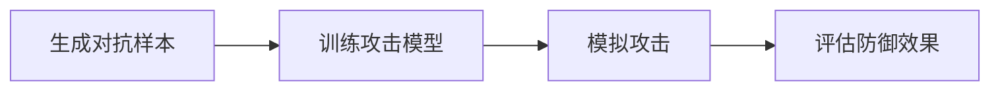
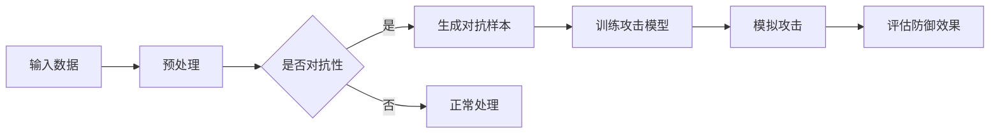
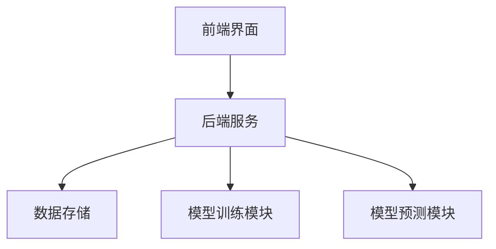
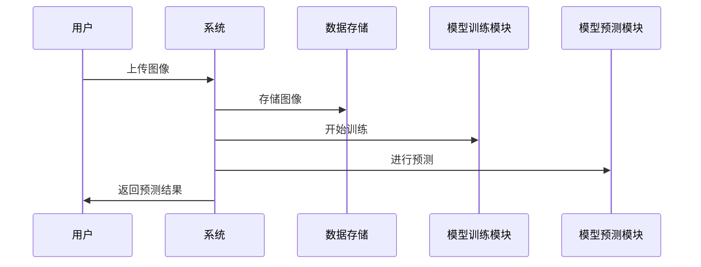

                 

# AI安全性测试：防范对抗性攻击的必要措施

## 关键词
- AI安全性测试
- 对抗性攻击
- 测试工具
- 测试方法
- 实战案例

## 摘要
本文将深入探讨AI安全性测试的必要性和方法。随着人工智能技术的迅猛发展，AI系统的安全威胁也日益严峻。对抗性攻击作为一种潜在威胁，对AI系统的可靠性和安全性构成了严重挑战。本文将首先介绍AI安全性测试的基础知识，然后详细解析对抗性攻击的原理，接着讨论AI安全性测试的具体方法和常用工具，并分享一个实际项目中的AI安全性测试实战经验。最后，本文将总结最佳实践并提供进一步的拓展阅读。

## 第一部分: AI安全性测试概述

### 第1章: AI安全性测试基础

#### 1.1 问题背景
随着深度学习等先进技术在各个领域的广泛应用，AI系统已经成为现代社会的重要基础设施。然而，AI系统的安全性却成为了亟待解决的问题。对抗性攻击（Adversarial Attack）作为一种新型的攻击手段，通过细微的改变输入数据，欺骗AI系统作出错误决策，对AI系统的安全构成了严重威胁。

#### 1.2 问题描述
对抗性攻击的问题在于，攻击者可以通过精心设计的对抗样本，诱导AI系统产生错误输出。这些对抗样本通常难以通过肉眼识别，却能够使AI系统在测试中表现不佳。因此，如何有效检测和防御对抗性攻击成为AI安全性测试的关键问题。

#### 1.3 解决方案
AI安全性测试旨在通过一系列的测试方法和技术，评估AI系统的抗攻击能力。测试内容包括对抗性样本生成、攻击方法模拟和防御机制测试等。通过这些测试，可以发现AI系统的潜在漏洞，并提出相应的改进措施。

#### 1.4 边界与外延
AI安全性测试不仅需要关注对抗性攻击，还需要考虑其他安全威胁，如注入攻击、隐私泄露等。同时，测试过程需要遵循一定的标准和规范，以确保测试结果的可靠性和有效性。

### 第2章: AI安全性核心概念

#### 2.1 核心概念原理
AI安全性测试中的核心概念包括对抗性攻击、对抗样本、防御机制等。对抗性攻击是指通过构造特定的输入数据，欺骗AI模型作出错误决策。对抗样本是用于训练或测试的带有对抗性的输入数据。防御机制是指用于检测和防御对抗性攻击的技术和策略。

#### 2.2 概念属性特征对比表格
以下是一个简化的概念属性特征对比表格：

| 概念       | 属性特征                     | 对比说明                   |
|------------|------------------------------|----------------------------|
| 对抗性攻击 | 输入数据微小变化，输出错误   | 旨在欺骗AI系统             |
| 对抗样本   | 特征与正常样本相似，但存在对抗性 | 用于训练和测试             |
| 防御机制   | 检测对抗性攻击，阻止错误输出   | 提高AI系统抗攻击能力       |

#### 2.3 ER实体关系图架构
ER实体关系图是用于描述AI安全性测试中各个实体及其关系的图形化工具。以下是一个简化的ER实体关系图：

```mermaid
erDiagram
    AI模型 ||--o{ 对抗样本 }
    AI模型 ||--o{ 防御机制 }
    对抗样本 ||--o{ 测试结果 }
    防御机制 ||--o{ 测试结果 }
```

### 第3章: 对抗性攻击原理

#### 3.1 算法原理讲解

对抗性攻击的基本算法原理可以概括为以下步骤：

1. **生成对抗样本**：通过数学模型或启发式算法生成具有对抗性的输入数据。
2. **训练攻击模型**：使用对抗样本训练一个攻击模型，使其能够识别和生成对抗样本。
3. **模拟攻击**：将攻击模型应用于AI系统，观察其输出结果。
4. **评估防御效果**：通过对比攻击前后的输出结果，评估AI系统的防御能力。

以下是一个简化的Mermaid流程图：



#### 3.1.1 Mermaid流程图

以下是一个对抗性攻击的Mermaid流程图：



#### 3.1.2 Python源代码解释

以下是一个简单的Python示例，用于生成对抗性样本：

```python
import numpy as np
import matplotlib.pyplot as plt

# 生成随机输入数据
x = np.random.rand(100, 10)

# 生成对抗样本
def generate_adversarial_sample(x, noise_level=0.1):
    noise = np.random.randn(*x.shape) * noise_level
    x_adv = x + noise
    return x_adv

x_adv = generate_adversarial_sample(x)

# 绘制输入数据和对抗样本
plt.scatter(x[:, 0], x[:, 1], label='原始数据')
plt.scatter(x_adv[:, 0], x_adv[:, 1], label='对抗样本')
plt.legend()
plt.show()
```

#### 3.1.3 数学模型与公式

对抗性攻击的数学模型通常基于以下公式：

$$
x_{adv} = x + \epsilon
$$

其中，$x$是原始输入数据，$x_{adv}$是对抗性样本，$\epsilon$是噪声向量。

#### 3.1.4 举例说明

假设我们有一个简单的线性模型：

$$
y = wx + b
$$

其中，$w$是权重，$b$是偏置。如果我们想要生成对抗性样本$x_{adv}$，我们可以通过以下步骤：

1. 计算模型的输出：
   $$ y = wx + b $$
2. 计算目标输出的错误：
   $$ \Delta y = y_{target} - y $$
3. 生成对抗性样本：
   $$ x_{adv} = x + \Delta y / w $$

通过这样的方法，我们可以生成具有对抗性的输入数据，从而欺骗线性模型。

### 第4章: AI安全性测试方法

#### 4.1 测试步骤

AI安全性测试通常包括以下步骤：

1. **测试准备**：确定测试目标、测试环境、测试工具等。
2. **测试执行**：执行具体的测试任务，包括生成对抗样本、模拟攻击等。
3. **测试结果分析**：分析测试结果，评估AI系统的防御能力。

#### 4.1.1 测试准备

测试准备阶段包括以下任务：

- **确定测试目标**：明确需要测试的AI系统及其功能。
- **搭建测试环境**：配置测试所需的硬件和软件环境。
- **选择测试工具**：根据测试需求选择合适的测试工具。

#### 4.1.2 测试执行

测试执行阶段包括以下任务：

- **生成对抗样本**：使用测试工具生成具有对抗性的输入数据。
- **模拟攻击**：将对抗样本应用于AI系统，观察其输出结果。
- **记录测试数据**：记录测试过程中的关键数据，如攻击类型、测试结果等。

#### 4.1.3 测试结果分析

测试结果分析阶段包括以下任务：

- **评估防御能力**：通过对比攻击前后的输出结果，评估AI系统的防御能力。
- **生成测试报告**：整理测试结果，撰写测试报告。

### 第5章: AI安全性测试工具

#### 5.1 常用测试工具

常用的AI安全性测试工具包括：

- **Artificial Intelligence Test Framework (AITF)**：一个开源的AI测试框架，支持多种AI算法的测试。
- **Adversarial Examples Generator (AEG)**：一个用于生成对抗样本的工具，支持多种攻击方法和模型。
- **AI Security Test Suite (AI-STS)**：一个集成的测试套件，提供多种测试工具和功能。

#### 5.2 工具选型与配置

工具选型与配置阶段包括以下任务：

- **评估工具功能**：根据测试需求评估工具的功能和性能。
- **配置测试环境**：根据工具要求配置测试环境，确保工具正常运行。

#### 5.3 工具应用实战

以下是一个使用AEG工具生成对抗样本的Python示例：

```python
from aeg import AdversarialGenerator

# 配置AEG工具
config = {
    'model': 'resnet50',
    'attack': 'fgsm',
    'epsilon': 0.1
}

# 创建AEG实例
generator = AdversarialGenerator(config)

# 生成对抗样本
x_adv = generator.generate(x)

# 绘制输入数据和对抗样本
plt.scatter(x[:, 0], x[:, 1], label='原始数据')
plt.scatter(x_adv[:, 0], x_adv[:, 1], label='对抗样本')
plt.legend()
plt.show()
```

### 第6章: AI安全性测试实战

#### 6.1 项目介绍

本节以一个简单的图像分类项目为例，介绍AI安全性测试的实战应用。项目目标是通过深度学习模型对图像进行分类，识别手写数字。

#### 6.2 系统功能设计

系统功能设计包括以下内容：

- **图像输入**：接受用户输入的手写数字图像。
- **图像预处理**：对输入图像进行预处理，包括缩放、归一化等。
- **模型训练**：使用预处理后的图像数据训练深度学习模型。
- **模型预测**：使用训练好的模型对新的图像进行预测。

以下是一个简化的领域模型类图：

```mermaid
classDiagram
    Class01 <|-- SubClass01
    Class01 <|-- SubClass02
    Class03 --|>' Class04
    Class05 : +name : attribute 1
    Class06 : -name : attribute 2
    Class07 { +name : attribute 3 }
    Class08 : *name : attribute 4
```

#### 6.3 系统架构设计

系统架构设计包括以下内容：

- **前端界面**：用于接收用户输入和显示预测结果。
- **后端服务**：包括图像预处理模块、模型训练模块和模型预测模块。
- **数据存储**：用于存储训练数据和预测结果。

以下是一个简化的系统架构图：



#### 6.4 系统接口设计

系统接口设计包括以下内容：

- **图像输入接口**：用于接收用户上传的图像数据。
- **预测接口**：用于接收用户请求，返回预测结果。
- **训练接口**：用于启动模型训练任务。
- **结果查询接口**：用于查询模型训练结果和预测结果。

以下是一个简化的系统交互序列图：



### 第7章: AI安全性测试最佳实践与总结

#### 7.1 最佳实践

在进行AI安全性测试时，应遵循以下最佳实践：

- **全面测试**：对AI系统的各个模块进行全面的测试，确保发现潜在的安全漏洞。
- **持续测试**：定期进行安全性测试，以适应AI系统的更新和变化。
- **数据安全**：确保测试过程中使用的数据和模型不受泄露和滥用。
- **记录日志**：详细记录测试过程和结果，以便分析和跟踪问题。

#### 7.2 注意事项

在进行AI安全性测试时，应注意以下几点：

- **测试环境**：确保测试环境与实际生产环境一致，避免因环境差异导致的测试结果偏差。
- **工具选择**：根据测试需求选择合适的测试工具，避免使用不合适的工具导致测试失败。
- **结果评估**：准确评估测试结果，避免因误判而导致错误的决策。

#### 7.3 拓展阅读

- 《深度学习安全性：对抗性攻击与防御》
- 《AI系统安全：设计、测试与防御》
- 《对抗性样本生成技术综述》

## 作者信息

作者：AI天才研究院/AI Genius Institute & 禅与计算机程序设计艺术 /Zen And The Art of Computer Programming

本文由AI天才研究院（AI Genius Institute）与《禅与计算机程序设计艺术》（Zen And The Art of Computer Programming）的作者合作撰写，旨在深入探讨AI安全性测试的重要性和方法。希望本文能为读者在AI安全性测试领域提供有价值的参考。

