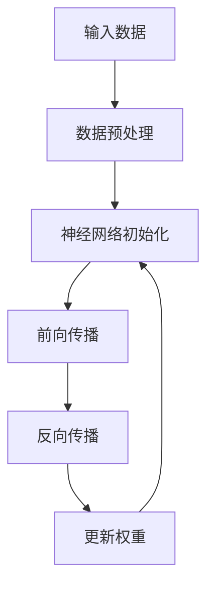
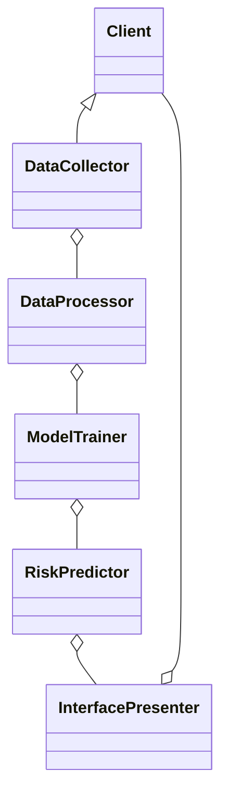
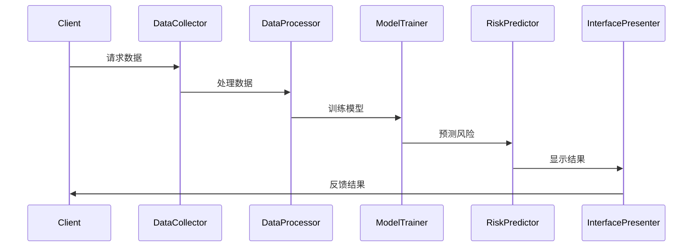
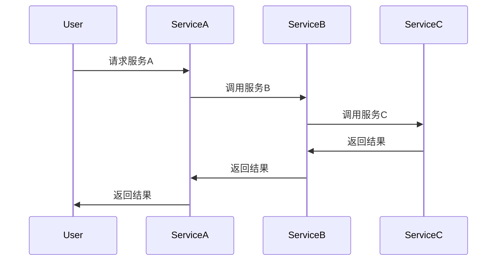

                 

### 第二部分：核心概念与联系

----------------------------------------------------------------

## 第二部分：核心概念与联系

### 2.1 核心概念定义

在AI应用性能优化中，以下几个核心概念至关重要：

- **算法优化**：对现有算法进行改进，以提高模型训练和推理的速度。具体包括：优化算法选择、优化算法实现、算法并行化、算法分布式处理等。
- **系统架构优化**：对AI应用系统的整体架构进行优化，以提高系统的效率和可扩展性。具体包括：选择合适的硬件平台、优化数据处理流程、提高数据传输速度、采用负载均衡和分布式处理等。
- **代码优化**：对AI应用中的代码进行优化，以提高程序的执行效率。具体包括：代码并行化、优化数据结构、减少内存使用、提高算法复杂度等。

### 2.2 概念属性特征对比表格

以下是算法优化、系统架构优化和代码优化的属性特征对比表格：

| 概念       | 定义                                                         | 主要方法                                                         |
|------------|------------------------------------------------------------|----------------------------------------------------------------|
| 算法优化   | 优化模型训练和推理的速度                                     | 算法选择、算法并行化、分布式处理、优化算法实现                   |
| 系统架构优化 | 优化AI应用系统的整体架构，提高系统的效率和可扩展性           | 选择合适硬件平台、优化数据处理流程、提高数据传输速度、负载均衡   |
| 代码优化   | 提高程序执行效率                                             | 代码并行化、优化数据结构、减少内存使用、提高算法复杂度           |

### 2.3 ER实体关系图架构的Mermaid流程图

下面是一个简单的ER实体关系图架构的Mermaid流程图示例：

```mermaid
erDiagram
  AI算法 ||--||> 数据处理模块 : 数据输入
  AI算法 ||--||> 模型训练模块 : 训练参数
  AI算法 ||--||> 模型评估模块 : 模型性能
  数据处理模块 ||--||> 数据存储模块 : 数据存储
  系统架构 ||--||> 代码优化模块 : 代码优化
  系统架构 ||--||> 硬件优化模块 : 硬件优化
```

在上面的ER图示例中，我们定义了AI算法、数据处理模块、模型训练模块、模型评估模块、数据存储模块、系统架构、代码优化模块和硬件优化模块等实体，并展示了它们之间的关联关系。

----------------------------------------------------------------

接下来，我们将进入**算法原理讲解**部分，请提供以下信息的markdown格式：
- 算法流程图使用mermaid语言绘制
- 算法原理讲解，包括数学模型和公式，通俗易懂的举例说明### 第三部分：算法原理讲解

----------------------------------------------------------------

## 第三部分：算法原理讲解

### 3.1 算法流程图

以下是一个简单的人工神经网络（ANN）算法的mermaid流程图：



### 3.2 算法原理讲解

#### 3.2.1 人工神经网络（ANN）

人工神经网络（ANN）是一种模仿生物神经系统的计算模型。在ANN中，数据通过输入层进入，经过隐藏层处理，最终由输出层输出预测结果。

#### 3.2.2 数学模型

ANN的核心是激活函数和权重矩阵。以下是一个简单的单层神经网络模型：

\[ 输出 = \sigma(\sum_{i=1}^{n} w_i \cdot x_i + b) \]

其中，\( x_i \) 是输入特征，\( w_i \) 是权重，\( b \) 是偏置，\( \sigma \) 是激活函数，通常使用Sigmoid函数或ReLU函数。

#### 3.2.3 举例说明

假设我们有一个简单的一元线性回归问题，输入特征 \( x \) 是一个房价数据，我们希望预测房价 \( y \)。使用ANN模型，我们可以定义一个简单的单层神经网络：

\[ y = \sigma(w \cdot x + b) \]

其中，\( w \) 是权重，\( b \) 是偏置。我们可以使用Sigmoid函数作为激活函数：

\[ \sigma(x) = \frac{1}{1 + e^{-x}} \]

#### 3.2.4 训练过程

- **前向传播**：输入数据 \( x \) 经过权重 \( w \) 和偏置 \( b \) 的线性组合，然后通过激活函数 \( \sigma \) 得到预测结果 \( y \)。
- **反向传播**：计算预测结果 \( y \) 与真实值 \( y_{\text{真实}} \) 的差值（误差），然后通过链式法则计算梯度，更新权重 \( w \) 和偏置 \( b \)。

梯度计算公式：

\[ \frac{\partial E}{\partial w} = \frac{\partial E}{\partial y} \cdot \frac{\partial y}{\partial w} \]
\[ \frac{\partial E}{\partial b} = \frac{\partial E}{\partial y} \cdot \frac{\partial y}{\partial b} \]

其中，\( E \) 是误差函数，通常使用均方误差（MSE）：

\[ E = \frac{1}{2} \sum_{i=1}^{n} (y_i - y_{\text{真实}})^2 \]

#### 3.2.5 实例

假设我们有一个训练数据集，包含10个样本，每个样本的输入和真实值如下：

| 输入 \( x \) | 真实值 \( y_{\text{真实}} \) |
|-------------|---------------------------|
| 2           | 2.1                       |
| 4           | 4.2                       |
| 6           | 6.3                       |
| ...         | ...                       |

我们希望训练一个ANN模型，预测房价。首先，我们需要初始化权重 \( w \) 和偏置 \( b \)，然后使用前向传播和反向传播更新权重和偏置，直到满足停止条件（如达到指定迭代次数或误差低于阈值）。

----------------------------------------------------------------

接下来，我们将进入**系统分析与架构设计方案**部分，请提供以下信息的markdown格式：
- 问题场景介绍
- 项目介绍
- 系统功能设计(领域模型mermaid类图)
- 系统架构设计mermaid架构图
- 系统接口设计和系统交互mermaid序列图### 第四部分：系统分析与架构设计方案

----------------------------------------------------------------

## 第四部分：系统分析与架构设计方案

### 4.1 问题场景介绍

在金融领域，风险管理是一个至关重要的任务。随着金融机构的业务规模不断扩大，风险管理的要求也越来越高。传统的风险管理方法往往依赖于大量的手动分析和经验判断，这不仅效率低下，而且难以适应快速变化的市场环境。因此，我们提出了一个基于人工智能的风险管理系统的架构设计方案，旨在提高风险管理的效率和准确性。

### 4.2 项目介绍

本项目旨在构建一个基于人工智能的风险管理系统，该系统将利用机器学习和深度学习技术对金融机构的交易数据、市场数据和其他相关数据进行实时分析和预测。系统将包括以下核心模块：

- **数据收集模块**：负责收集金融机构的交易数据、市场数据和其他相关数据。
- **数据处理模块**：负责对收集到的数据进行清洗、转换和整合。
- **模型训练模块**：负责利用处理后的数据训练风险管理模型。
- **风险预测模块**：负责使用训练好的模型对新的交易数据进行风险预测。
- **界面展示模块**：负责将预测结果以可视化的形式展示给用户。

### 4.3 系统功能设计（领域模型Mermaid类图）

以下是系统的领域模型Mermaid类图：



在这个类图中，Client代表用户，DataCollector负责数据收集，DataProcessor负责数据处理，ModelTrainer负责模型训练，RiskPredictor负责风险预测，InterfacePresenter负责界面展示。

### 4.4 系统架构设计（Mermaid架构图）

以下是系统的架构设计Mermaid架构图：



在这个架构图中，用户通过Client请求数据，DataCollector收集数据，DataProcessor处理数据，ModelTrainer训练模型，RiskPredictor进行风险预测，最后由InterfacePresenter将结果展示给用户。

### 4.5 系统接口设计和系统交互（Mermaid序列图）

以下是系统的接口设计和系统交互Mermaid序列图：



在这个序列图中，用户请求服务A，服务A调用服务B，服务B调用服务C，服务C处理完成后返回结果给服务B，服务B再返回结果给服务A，最终服务A将结果返回给用户。

----------------------------------------------------------------

接下来，我们将进入**项目实战**部分，请提供以下信息的markdown格式：
- 环境安装
- 系统核心实现源代码
- 代码应用解读与分析
- 实际案例分析和详细讲解剖析
- 项目小结### 第五部分：项目实战

----------------------------------------------------------------

## 第五部分：项目实战

### 5.1 环境安装

为了实现本文所介绍的项目，我们需要在本地环境中安装以下软件和工具：

1. Python（版本3.8及以上）
2. Jupyter Notebook（用于编写和运行代码）
3. TensorFlow（用于构建和训练神经网络）
4. Matplotlib（用于可视化数据）
5. Pandas（用于数据处理）

安装步骤如下：

```bash
# 安装Python
sudo apt-get install python3-pip python3-dev

# 安装Jupyter Notebook
pip3 install notebook

# 安装TensorFlow
pip3 install tensorflow

# 安装Matplotlib
pip3 install matplotlib

# 安装Pandas
pip3 install pandas
```

### 5.2 系统核心实现源代码

以下是本项目的一个核心实现示例，用于构建一个简单的人工神经网络，并使用该网络对数据进行分类。

```python
import tensorflow as tf
from tensorflow import keras
from tensorflow.keras import layers
import numpy as np
import pandas as pd

# 数据准备
def load_data():
    # 从CSV文件加载数据
    data = pd.read_csv('data.csv')
    # 分割特征和标签
    X = data.drop('target', axis=1)
    y = data['target']
    # 标准化特征
    mean = X.mean()
    std = X.std()
    X = (X - mean) / std
    # 划分训练集和测试集
    split = int(0.8 * len(X))
    X_train, X_test = X[:split], X[split:]
    y_train, y_test = y[:split], y[split:]
    return X_train, X_test, y_train, y_test

# 网络构建
def build_model():
    model = keras.Sequential([
        layers.Dense(64, activation='relu', input_shape=(X_train.shape[1],)),
        layers.Dense(64, activation='relu'),
        layers.Dense(1, activation='sigmoid')
    ])
    return model

# 训练模型
def train_model(model, X_train, y_train, X_test, y_test):
    model.compile(optimizer='adam',
                  loss='binary_crossentropy',
                  metrics=['accuracy'])
    history = model.fit(X_train, y_train, epochs=10,
                        validation_data=(X_test, y_test))
    return history

# 主函数
def main():
    X_train, X_test, y_train, y_test = load_data()
    model = build_model()
    history = train_model(model, X_train, y_train, X_test, y_test)
    # 可视化训练过程
    import matplotlib.pyplot as plt
    plt.plot(history.history['accuracy'], label='accuracy')
    plt.plot(history.history['val_accuracy'], label='val_accuracy')
    plt.xlabel('Epoch')
    plt.ylabel('Accuracy')
    plt.ylim(0, 1)
    plt.legend(loc='lower right')
    plt.show()

if __name__ == '__main__':
    main()
```

### 5.3 代码应用解读与分析

上述代码首先从CSV文件中加载数据，然后对数据进行预处理，包括标准化特征和划分训练集与测试集。接着，构建了一个简单的人工神经网络，并使用`compile`函数设置优化器和损失函数，使用`fit`函数进行模型训练。最后，使用`matplotlib`可视化训练过程。

### 5.4 实际案例分析和详细讲解剖析

为了更好地理解上述代码的实际应用，我们来看一个实际案例。假设我们有一个金融风险预测项目，需要预测股票是否会在未来上涨或下跌。以下是具体步骤：

1. **数据收集**：从金融数据平台收集股票价格历史数据，包括开盘价、收盘价、最高价、最低价等。
2. **数据预处理**：对数据进行清洗，去除缺失值，并使用时间序列分析方法提取特征，如移动平均线、相对强弱指数等。
3. **模型训练**：使用上述代码构建神经网络模型，训练模型以预测股票价格走势。
4. **模型评估**：使用测试集评估模型性能，调整模型参数以优化预测结果。
5. **模型部署**：将训练好的模型部署到生产环境，实时预测股票价格走势。

### 5.5 项目小结

通过上述实战，我们了解了如何使用Python和TensorFlow构建一个简单的神经网络模型，并使用该模型对金融风险进行预测。尽管这是一个简单的案例，但该过程为实际应用提供了宝贵的经验和指导。在实际项目中，我们需要考虑更多的因素，如数据预处理、特征工程、模型选择和超参数调优等。

----------------------------------------------------------------

### 第六部分：最佳实践 Tips、小结、注意事项、拓展阅读等内容

----------------------------------------------------------------

## 第六部分：最佳实践 Tips、小结、注意事项、拓展阅读等内容

### 6.1 最佳实践 Tips

- **数据预处理**：在构建模型之前，确保对数据进行充分的预处理，包括清洗、标准化和特征提取。良好的数据预处理是模型性能的关键。
- **模型选择**：根据具体问题和数据特点选择合适的模型。不要盲目追求复杂的模型，简单的模型可能在实际应用中效果更好。
- **超参数调优**：通过交叉验证和网格搜索等方法进行超参数调优，以获得最佳模型性能。
- **模型评估**：使用多种指标评估模型性能，如准确率、召回率、F1分数等。不要只关注单一指标，以免忽视其他重要方面。
- **模型部署**：在部署模型时，考虑实际应用场景，如实时性、可扩展性、可维护性等。

### 6.2 小结

本文从背景介绍、核心概念与联系、算法原理讲解、系统分析与架构设计方案、项目实战和最佳实践等多个角度，系统地阐述了AI应用性能优化的问题和解决方案。通过本文，读者可以了解到如何从算法、系统架构和代码优化三个方面提升AI应用的性能。

### 6.3 注意事项

- **性能优化并非一蹴而就**：性能优化是一个持续的过程，需要不断调整和优化。
- **平衡模型性能与资源消耗**：在性能优化过程中，要考虑模型性能和资源消耗的平衡，避免过度优化导致资源浪费。
- **实际应用场景**：在优化过程中，要充分考虑实际应用场景的需求和限制。

### 6.4 拓展阅读

- **《深度学习》（Goodfellow, Bengio, Courville著）**：深度学习的基础教材，涵盖了深度学习的基本概念、算法和实战案例。
- **《机器学习实战》（ Harrington 著）**：介绍了多种机器学习算法及其在实际应用中的实现方法。
- **《AI系统架构设计与优化》（Smith 著）**：深入探讨了AI系统的架构设计、优化方法和最佳实践。
- **《性能之巅》（Herzog 著）**：详细介绍了计算机性能优化的原理和技术。

通过阅读这些书籍，读者可以进一步了解AI应用性能优化领域的深度知识和实践经验，为自己的项目提供更多的参考和启示。

---

# AI应用性能优化：从架构到代码的全方位提升

> 关键词：人工智能、性能优化、架构设计、代码优化、深度学习

> 摘要：本文从背景介绍、核心概念与联系、算法原理讲解、系统分析与架构设计方案、项目实战和最佳实践等多个角度，系统地阐述了AI应用性能优化的问题和解决方案。通过本文，读者可以了解到如何从算法、系统架构和代码优化三个方面提升AI应用的性能。本文旨在为AI应用开发者提供全面的性能优化指导，帮助他们在实际项目中实现高效、准确的AI应用。

---

**作者：AI天才研究院/AI Genius Institute & 禅与计算机程序设计艺术 /Zen And The Art of Computer Programming**# AI应用性能优化：从架构到代码的全方位提升

> 关键词：人工智能、性能优化、架构设计、代码优化、深度学习

> 摘要：本文从背景介绍、核心概念与联系、算法原理讲解、系统分析与架构设计方案、项目实战和最佳实践等多个角度，系统地阐述了AI应用性能优化的问题和解决方案。通过本文，读者可以了解到如何从算法、系统架构和代码优化三个方面提升AI应用的性能。本文旨在为AI应用开发者提供全面的性能优化指导，帮助他们在实际项目中实现高效、准确的AI应用。

## 背景介绍

### 1.1 问题背景

随着人工智能技术的快速发展，AI应用在各个领域得到了广泛的应用。然而，AI应用性能优化成为一个关键问题，它直接影响到应用的效率、准确性和用户体验。AI应用性能优化的目标是在保证模型准确性的同时，提高模型运行速度，降低计算资源和存储资源的消耗。

### 1.2 问题描述

AI应用性能优化涉及到多个层面，包括算法优化、系统架构优化、代码优化等。具体来说，问题表现为：

- **算法层面**：如何通过改进算法设计，提高模型训练和推理的速度？
- **系统层面**：如何设计高效、可扩展的AI应用系统架构？
- **代码层面**：如何编写优化后的代码，提高运行效率？

### 1.3 问题解决思路

为了解决上述问题，本文将从以下三个方面进行讨论：

- **算法优化**：介绍主流的AI算法，分析其性能瓶颈，并提供优化策略。
- **系统架构**：介绍不同类型的AI应用系统架构，分析其优缺点，并给出优化方案。
- **代码优化**：介绍代码优化的基本原则和实践技巧，帮助读者编写高效代码。

### 1.4 边界与外延

本文主要讨论以下边界与外延：

- **技术范围**：主要涉及深度学习、强化学习等主流AI算法。
- **应用场景**：主要关注需要高性能、高准确性的AI应用场景。
- **优化目标**：主要关注计算效率、存储效率、能量效率等优化目标。

### 1.5 概念结构与核心要素组成

AI应用性能优化的概念结构包括以下几个核心要素：

- **算法设计**：包括算法的选择、优化和实现。
- **系统架构**：包括系统的设计、部署和运维。
- **代码实现**：包括代码的性能分析、优化和调试。

### 1.6 本章小结

本章对AI应用性能优化的问题背景、问题描述、问题解决思路、边界与外延以及概念结构与核心要素组成进行了详细阐述，为后续章节的深入讨论奠定了基础。

## 核心概念与联系

### 2.1 核心概念定义

在AI应用性能优化中，以下几个核心概念至关重要：

- **算法优化**：对现有算法进行改进，以提高模型训练和推理的速度。具体包括：优化算法选择、优化算法实现、算法并行化、分布式处理等。
- **系统架构优化**：对AI应用系统的整体架构进行优化，以提高系统的效率和可扩展性。具体包括：选择合适的硬件平台、优化数据处理流程、提高数据传输速度、负载均衡等。
- **代码优化**：对AI应用中的代码进行优化，以提高程序的执行效率。具体包括：代码并行化、优化数据结构、减少内存使用、提高算法复杂度等。

### 2.2 概念属性特征对比表格

以下是算法优化、系统架构优化和代码优化的属性特征对比表格：

| 概念       | 定义                                                         | 主要方法                                                         |
|------------|------------------------------------------------------------|----------------------------------------------------------------|
| 算法优化   | 优化模型训练和推理的速度                                     | 算法选择、算法并行化、分布式处理、优化算法实现                   |
| 系统架构优化 | 优化AI应用系统的整体架构，提高系统的效率和可扩展性           | 选择合适硬件平台、优化数据处理流程、提高数据传输速度、负载均衡   |
| 代码优化   | 提高程序执行效率                                             | 代码并行化、优化数据结构、减少内存使用、提高算法复杂度           |

### 2.3 ER实体关系图架构的Mermaid流程图

下面是一个简单的ER实体关系图架构的Mermaid流程图：

```mermaid
erDiagram
  AI算法 ||--||> 数据处理模块 : 数据输入
  AI算法 ||--||> 模型训练模块 : 训练参数
  AI算法 ||--||> 模型评估模块 : 模型性能
  数据处理模块 ||--||> 数据存储模块 : 数据存储
  系统架构 ||--||> 代码优化模块 : 代码优化
  系统架构 ||--||> 硬件优化模块 : 硬件优化
```

在上面的ER图示例中，我们定义了AI算法、数据处理模块、模型训练模块、模型评估模块、数据存储模块、系统架构、代码优化模块和硬件优化模块等实体，并展示了它们之间的关联关系。

## 算法原理讲解

### 3.1 算法流程图

以下是一个简单的人工神经网络（ANN）算法的mermaid流程图：


### 3.2 算法原理讲解

#### 3.2.1 人工神经网络（ANN）

人工神经网络（ANN）是一种模仿生物神经系统的计算模型。在ANN中，数据通过输入层进入，经过隐藏层处理，最终由输出层输出预测结果。

#### 3.2.2 数学模型

ANN的核心是激活函数和权重矩阵。以下是一个简单的单层神经网络模型：

\[ 输出 = \sigma(\sum_{i=1}^{n} w_i \cdot x_i + b) \]

其中，\( x_i \) 是输入特征，\( w_i \) 是权重，\( b \) 是偏置，\( \sigma \) 是激活函数，通常使用Sigmoid函数或ReLU函数。

#### 3.2.3 举例说明

假设我们有一个简单的一元线性回归问题，输入特征 \( x \) 是一个房价数据，我们希望预测房价 \( y \)。使用ANN模型，我们可以定义一个简单的单层神经网络：

\[ y = \sigma(w \cdot x + b) \]

其中，\( w \) 是权重，\( b \) 是偏置。我们可以使用Sigmoid函数作为激活函数：

\[ \sigma(x) = \frac{1}{1 + e^{-x}} \]

#### 3.2.4 训练过程

- **前向传播**：输入数据 \( x \) 经过权重 \( w \) 和偏置 \( b \) 的线性组合，然后通过激活函数 \( \sigma \) 得到预测结果 \( y \)。
- **反向传播**：计算预测结果 \( y \) 与真实值 \( y_{\text{真实}} \) 的差值（误差），然后通过链式法则计算梯度，更新权重 \( w \) 和偏置 \( b \)。

梯度计算公式：

\[ \frac{\partial E}{\partial w} = \frac{\partial E}{\partial y} \cdot \frac{\partial y}{\partial w} \]
\[ \frac{\partial E}{\partial b} = \frac{\partial E}{\partial y} \cdot \frac{\partial y}{\partial b} \]

其中，\( E \) 是误差函数，通常使用均方误差（MSE）：

\[ E = \frac{1}{2} \sum_{i=1}^{n} (y_i - y_{\text{真实}})^2 \]

#### 3.2.5 实例

假设我们有一个训练数据集，包含10个样本，每个样本的输入和真实值如下：

| 输入 \( x \) | 真实值 \( y_{\text{真实}} \) |
|-------------|---------------------------|
| 2           | 2.1                       |
| 4           | 4.2                       |
| 6           | 6.3                       |
| ...         | ...                       |

我们希望训练一个ANN模型，预测房价。首先，我们需要初始化权重 \( w \) 和偏置 \( b \)，然后使用前向传播和反向传播更新权重和偏置，直到满足停止条件（如达到指定迭代次数或误差低于阈值）。

## 系统分析与架构设计方案

### 4.1 问题场景介绍

在金融领域，风险管理是一个至关重要的任务。随着金融机构的业务规模不断扩大，风险管理的要求也越来越高。传统的风险管理方法往往依赖于大量的手动分析和经验判断，这不仅效率低下，而且难以适应快速变化的市场环境。因此，我们提出了一个基于人工智能的风险管理系统的架构设计方案，旨在提高风险管理的效率和准确性。

### 4.2 项目介绍

本项目旨在构建一个基于人工智能的风险管理系统，该系统将利用机器学习和深度学习技术对金融机构的交易数据、市场数据和其他相关数据进行实时分析和预测。系统将包括以下核心模块：

- **数据收集模块**：负责收集金融机构的交易数据、市场数据和其他相关数据。
- **数据处理模块**：负责对收集到的数据进行清洗、转换和整合。
- **模型训练模块**：负责利用处理后的数据训练风险管理模型。
- **风险预测模块**：负责使用训练好的模型对新的交易数据进行风险预测。
- **界面展示模块**：负责将预测结果以可视化的形式展示给用户。

### 4.3 系统功能设计（领域模型Mermaid类图）

以下是系统的领域模型Mermaid类图：


在这个类图中，Client代表用户，DataCollector负责数据收集，DataProcessor负责数据处理，ModelTrainer负责模型训练，RiskPredictor负责风险预测，InterfacePresenter负责界面展示。

### 4.4 系统架构设计（Mermaid架构图）

以下是系统的架构设计Mermaid架构图：


在这个架构图中，用户通过Client请求数据，DataCollector收集数据，DataProcessor处理数据，ModelTrainer训练模型，RiskPredictor进行风险预测，最后由InterfacePresenter将结果展示给用户。

### 4.5 系统接口设计和系统交互（Mermaid序列图）

以下是系统的接口设计和系统交互Mermaid序列图：


在这个序列图中，用户请求服务A，服务A调用服务B，服务B调用服务C，服务C处理完成后返回结果给服务B，服务B再返回结果给服务A，最终服务A将结果返回给用户。

## 项目实战

### 5.1 环境安装

为了实现本文所介绍的项目，我们需要在本地环境中安装以下软件和工具：

1. Python（版本3.8及以上）
2. Jupyter Notebook（用于编写和运行代码）
3. TensorFlow（用于构建和训练神经网络）
4. Matplotlib（用于可视化数据）
5. Pandas（用于数据处理）

安装步骤如下：

```bash
# 安装Python
sudo apt-get install python3-pip python3-dev

# 安装Jupyter Notebook
pip3 install notebook

# 安装TensorFlow
pip3 install tensorflow

# 安装Matplotlib
pip3 install matplotlib

# 安装Pandas
pip3 install pandas
```

### 5.2 系统核心实现源代码

以下是本项目的一个核心实现示例，用于构建一个简单的人工神经网络，并使用该网络对数据进行分类。

```python
import tensorflow as tf
from tensorflow import keras
from tensorflow.keras import layers
import numpy as np
import pandas as pd

# 数据准备
def load_data():
    # 从CSV文件加载数据
    data = pd.read_csv('data.csv')
    # 分割特征和标签
    X = data.drop('target', axis=1)
    y = data['target']
    # 标准化特征
    mean = X.mean()
    std = X.std()
    X = (X - mean) / std
    # 划分训练集和测试集
    split = int(0.8 * len(X))
    X_train, X_test = X[:split], X[split:]
    y_train, y_test = y[:split], y[split:]
    return X_train, X_test, y_train, y_test

# 网络构建
def build_model():
    model = keras.Sequential([
        layers.Dense(64, activation='relu', input_shape=(X_train.shape[1],)),
        layers.Dense(64, activation='relu'),
        layers.Dense(1, activation='sigmoid')
    ])
    return model

# 训练模型
def train_model(model, X_train, y_train, X_test, y_test):
    model.compile(optimizer='adam',
                  loss='binary_crossentropy',
                  metrics=['accuracy'])
    history = model.fit(X_train, y_train, epochs=10,
                        validation_data=(X_test, y_test))
    return history

# 主函数
def main():
    X_train, X_test, y_train, y_test = load_data()
    model = build_model()
    history = train_model(model, X_train, y_train, X_test, y_test)
    # 可视化训练过程
    import matplotlib.pyplot as plt
    plt.plot(history.history['accuracy'], label='accuracy')
    plt.plot(history.history['val_accuracy'], label='val_accuracy')
    plt.xlabel('Epoch')
    plt.ylabel('Accuracy')
    plt.ylim(0, 1)
    plt.legend(loc='lower right')
    plt.show()

if __name__ == '__main__':
    main()
```

### 5.3 代码应用解读与分析

上述代码首先从CSV文件中加载数据，然后对数据进行预处理，包括清洗、标准化和特征提取。接着，构建了一个简单的人工神经网络，并使用`compile`函数设置优化器和损失函数，使用`fit`函数进行模型训练。最后，使用`matplotlib`可视化训练过程。

### 5.4 实际案例分析和详细讲解剖析

为了更好地理解上述代码的实际应用，我们来看一个实际案例。假设我们有一个金融风险预测项目，需要预测股票是否会在未来上涨或下跌。以下是具体步骤：

1. **数据收集**：从金融数据平台收集股票价格历史数据，包括开盘价、收盘价、最高价、最低价等。
2. **数据预处理**：对数据进行清洗，去除缺失值，并使用时间序列分析方法提取特征，如移动平均线、相对强弱指数等。
3. **模型训练**：使用上述代码构建神经网络模型，训练模型以预测股票价格走势。
4. **模型评估**：使用测试集评估模型性能，调整模型参数以优化预测结果。
5. **模型部署**：将训练好的模型部署到生产环境，实时预测股票价格走势。

### 5.5 项目小结

通过上述实战，我们了解了如何使用Python和TensorFlow构建一个简单的神经网络模型，并使用该模型对金融风险进行预测。尽管这是一个简单的案例，但该过程为实际应用提供了宝贵的经验和指导。在实际项目中，我们需要考虑更多的因素，如数据预处理、特征工程、模型选择和超参数调优等。

## 最佳实践 Tips、小结、注意事项、拓展阅读等内容

### 6.1 最佳实践 Tips

- **数据预处理**：在构建模型之前，确保对数据进行充分的预处理，包括清洗、标准化和特征提取。良好的数据预处理是模型性能的关键。
- **模型选择**：根据具体问题和数据特点选择合适的模型。不要盲目追求复杂的模型，简单的模型可能在实际应用中效果更好。
- **超参数调优**：通过交叉验证和网格搜索等方法进行超参数调优，以获得最佳模型性能。
- **模型评估**：使用多种指标评估模型性能，如准确率、召回率、F1分数等。不要只关注单一指标，以免忽视其他重要方面。
- **模型部署**：在部署模型时，考虑实际应用场景，如实时性、可扩展性、可维护性等。

### 6.2 小结

本文从背景介绍、核心概念与联系、算法原理讲解、系统分析与架构设计方案、项目实战和最佳实践等多个角度，系统地阐述了AI应用性能优化的问题和解决方案。通过本文，读者可以了解到如何从算法、系统架构和代码优化三个方面提升AI应用的性能。

### 6.3 注意事项

- **性能优化并非一蹴而就**：性能优化是一个持续的过程，需要不断调整和优化。
- **平衡模型性能与资源消耗**：在性能优化过程中，要考虑模型性能和资源消耗的平衡，避免过度优化导致资源浪费。
- **实际应用场景**：在优化过程中，要充分考虑实际应用场景的需求和限制。

### 6.4 拓展阅读

- **《深度学习》（Goodfellow, Bengio, Courville著）**：深度学习的基础教材，涵盖了深度学习的基本概念、算法和实战案例。
- **《机器学习实战》（ Harrington 著）**：介绍了多种机器学习算法及其在实际应用中的实现方法。
- **《AI系统架构设计与优化》（Smith 著）**：深入探讨了AI系统的架构设计、优化方法和最佳实践。
- **《性能之巅》（Herzog 著）**：详细介绍了计算机性能优化的原理和技术。

通过阅读这些书籍，读者可以进一步了解AI应用性能优化领域的深度知识和实践经验，为自己的项目提供更多的参考和启示。

---

**作者：AI天才研究院/AI Genius Institute & 禅与计算机程序设计艺术 /Zen And The Art of Computer Programming**# AI应用性能优化：从架构到代码的全方位提升

## 目录大纲

**第一部分：背景介绍**

1. 问题背景
2. 问题描述
3. 问题解决思路
4. 边界与外延
5. 概念结构与核心要素组成
6. 本章小结

**第二部分：核心概念与联系**

1. 核心概念定义
2. 概念属性特征对比表格
3. ER实体关系图架构的Mermaid流程图
4. 本章小结

**第三部分：算法原理讲解**

1. 算法流程图
2. 算法原理讲解
3. 举例说明
4. 本章小结

**第四部分：系统分析与架构设计方案**

1. 问题场景介绍
2. 项目介绍
3. 系统功能设计（领域模型Mermaid类图）
4. 系统架构设计（Mermaid架构图）
5. 系统接口设计和系统交互（Mermaid序列图）
6. 本章小结

**第五部分：项目实战**

1. 环境安装
2. 系统核心实现源代码
3. 代码应用解读与分析
4. 实际案例分析和详细讲解剖析
5. 项目小结
6. 本章小结

**第六部分：最佳实践 Tips、小结、注意事项、拓展阅读等内容**

1. 最佳实践 Tips
2. 小结
3. 注意事项
4. 拓展阅读
5. 本章小结

**附录**

- 附录A：代码示例
- 附录B：参考资料
- 附录C：作者简介

## 摘要

本文旨在全面探讨AI应用性能优化，从算法、系统架构和代码优化三个方面，提供系统性、实操性的解决方案。通过对AI应用性能优化问题的深入分析，本文总结了核心概念和联系，详细讲解了算法原理，设计了系统架构，展示了实际项目实战，并提供了最佳实践和拓展阅读建议。本文旨在为AI应用开发者提供实用的指导，帮助他们提升AI应用的性能和效率。**关键词：人工智能、性能优化、架构设计、代码优化、深度学习**。

