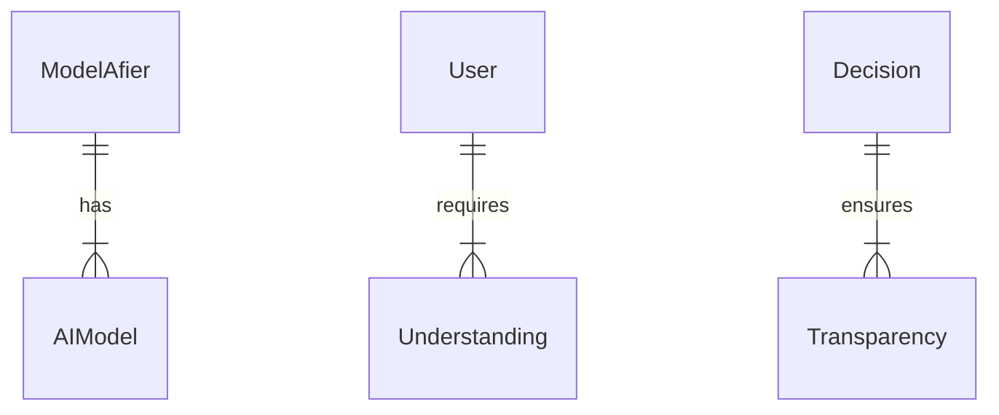
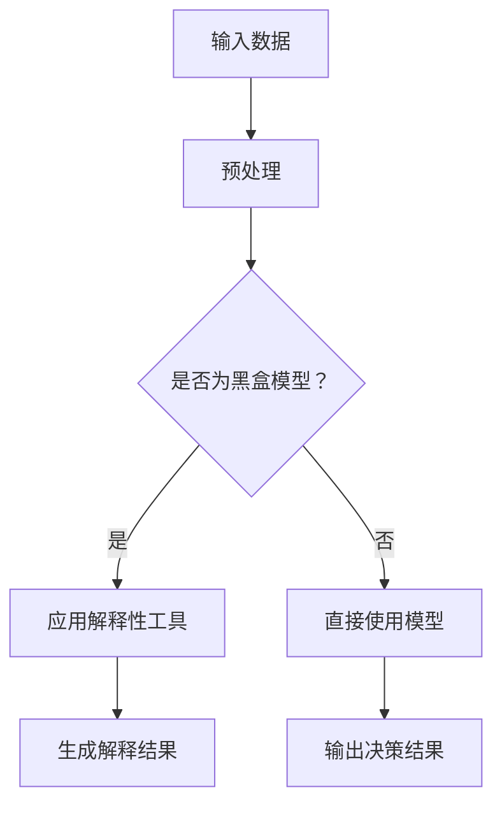
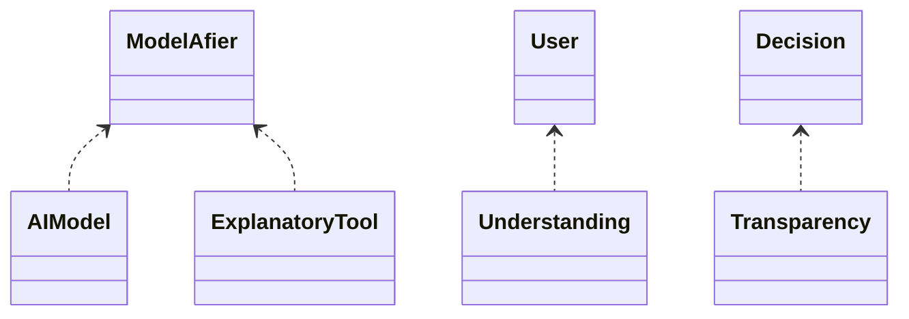
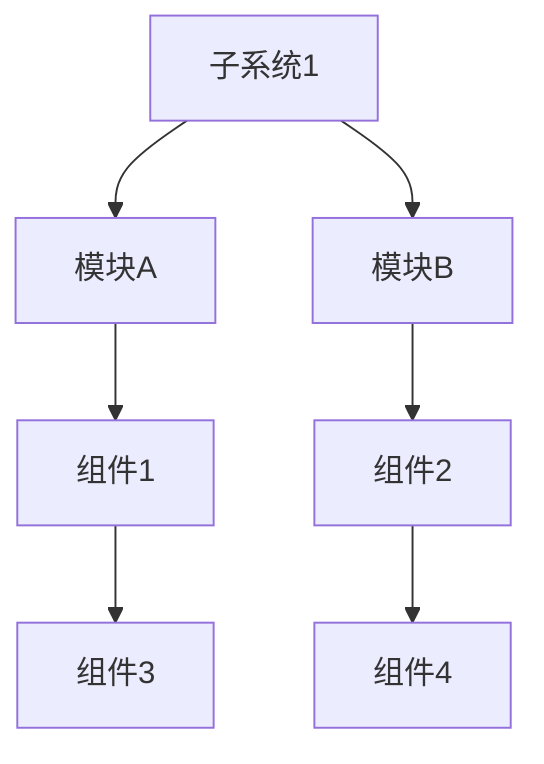
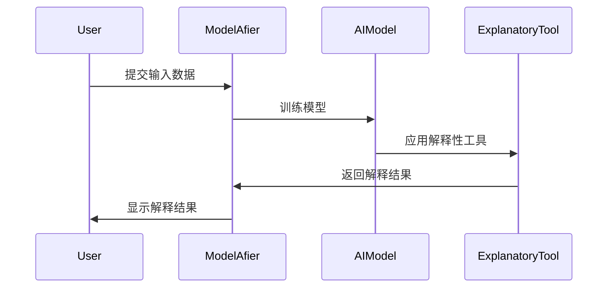

                 

### 文章标题

# AI模型可解释性工具：增强用户对AI决策的理解

> 关键词：AI模型可解释性、黑盒模型、解释性工具、用户理解、决策透明性

> 摘要：本文深入探讨了AI模型可解释性的重要性，以及现有的各种可解释性工具如何帮助用户更好地理解AI模型的决策过程。通过逐步分析，文章为读者提供了关于如何提升AI模型透明度和用户信任度的实用指南。

----------------------------------------------------------------

## 引言

在当今技术飞速发展的时代，人工智能（AI）已经成为各行各业不可或缺的一部分。然而，随着AI技术的广泛应用，一个显著的问题也逐渐浮现：如何确保AI模型的决策过程是可解释的，并且用户能够理解这些决策背后的逻辑？AI模型的可解释性成为了一个至关重要的研究领域，它不仅关乎技术的可信度和可靠性，也影响着用户对AI系统的接受度和信任度。

### AI模型可解释性的背景

AI模型可解释性的需求源于AI模型在许多关键领域的应用，包括医疗诊断、金融风险评估、自动驾驶等。在这些领域，模型的决策直接影响到用户的安全和福祉。因此，确保AI模型的决策过程是透明的，用户可以理解模型的决策逻辑，成为了一个不可忽视的问题。

#### 问题背景

传统的AI模型，如逻辑回归、决策树等，通常具有较好的可解释性，用户可以直观地理解模型的决策过程。然而，随着深度学习技术的兴起，越来越多的复杂AI模型（如神经网络）被应用到实际场景中。这些深度学习模型，尤其是深度神经网络，通常被称作“黑盒模型”，因为它们的内部结构非常复杂，难以直观地理解其决策过程。

#### 问题描述

用户在面临以下问题时，对AI模型可解释性的需求尤为强烈：

1. **为什么AI模型做出了这个决策？**
2. **模型是如何处理输入数据的？**
3. **模型的决策过程有哪些潜在的偏见？**

这些问题直接涉及到AI模型的可解释性，用户需要得到明确的答案才能对模型的决策有足够的信任。

#### 问题解决

为了解决上述问题，研究人员和工程师们开发了一系列可解释性工具和技巧，旨在提升AI模型的透明度，帮助用户理解模型的决策过程。

#### 边界与外延

AI模型可解释性的边界涉及多个方面，包括技术、伦理和用户需求。从技术角度来看，可解释性工具需要在不显著牺牲模型性能的前提下，提供足够的透明度。从伦理角度来看，可解释性工具需要确保模型的决策过程是公正、无偏的。从用户需求角度来看，可解释性工具需要以用户易于理解的方式呈现信息。

#### 概念结构与核心要素组成

AI模型可解释性的核心要素包括：

1. **解释性工具的选择**：根据模型类型和应用场景选择合适的解释性工具。
2. **模型透明度**：确保用户可以直观地理解模型的决策过程。
3. **用户信任**：通过提升模型的透明度，增强用户对AI系统的信任。

## 核心概念与联系

### 定义

**可解释性（Interpretability）**：可解释性是指用户能够理解AI模型决策过程的能力。它涉及到模型决策的透明度和用户对模型决策的信任度。

### 概念属性特征对比表格

| 特征 | 可解释性 | 不解释性 |
| --- | --- | --- |
| **透明度** | 高 | 低 |
| **用户信任** | 高 | 低 |
| **模型性能** | 可能会受到影响 | 通常不受影响 |
| **适用范围** | 广泛应用 | 受限于复杂度 |

### ER实体关系图架构



在上面的ER图中，`AIModel`是核心实体，它与`ExplanatoryTool`、`User`和`Decision`建立了关系。这些关系表明，解释性工具（`ExplanatoryTool`）用于提升AI模型的透明度，从而增强用户对模型决策的理解（`Understanding`），确保决策过程的透明性（`Transparency`）。

## 算法原理讲解

### 算法Mermaid流程图



### 算法原理

1. **输入数据预处理**：首先对输入数据进行预处理，确保数据格式和特征适合AI模型。

2. **模型类型判断**：判断AI模型是否为黑盒模型。如果是，则需要应用解释性工具；否则，可以直接使用模型。

3. **应用解释性工具**：对黑盒模型应用解释性工具，如LIME（Local Interpretable Model-agnostic Explanations）或SHAP（SHapley Additive exPlanations），以生成解释结果。

4. **生成解释结果**：解释性工具通过分析模型的内部结构和决策过程，生成用户可以理解的解释结果。

5. **输出决策结果**：最终输出模型的决策结果，并附上解释结果，以便用户理解决策背后的逻辑。

### 数学模型和公式

$$
\text{ExplanatoryScore} = \sum_{i=1}^{n} w_i \cdot x_i
$$

其中，$w_i$为特征权重，$x_i$为特征值。这个公式用于计算每个特征对模型决策的贡献程度。

### 举例说明

假设有一个深度神经网络模型用于预测股票价格。用户希望理解模型是如何做出预测的。通过应用LIME工具，我们可以分析模型的内部结构，识别出影响预测结果的关键特征，如公司营收、市盈率等。解释结果显示，公司营收是影响预测结果的最重要因素，其次是市盈率。这样，用户就可以直观地理解模型的决策过程，并对模型的预测结果有更高的信任度。

## 系统分析与架构设计方案

### 问题场景介绍

在金融领域，AI模型被广泛应用于股票价格预测、投资组合优化等任务。然而，由于模型内部结构的复杂性，用户对模型的决策过程缺乏足够的理解，从而影响了对模型预测结果的信任。

### 项目介绍

本项目旨在开发一套AI模型可解释性工具，帮助金融用户更好地理解模型决策过程，提高用户对AI系统的信任度。

### 系统功能设计（领域模型Mermaid类图）



### 系统架构设计（Mermaid架构图）



### 系统接口设计和系统交互（Mermaid序列图）



## 项目实战

### 环境安装

首先，我们需要安装Python和相关的依赖库。以下是安装命令：

```
pip install numpy
pip install pandas
pip install scikit-learn
pip install lime
pip install shap
```

### 系统核心实现源代码

以下是一个简单的示例，展示了如何使用LIME工具解释一个深度神经网络模型的决策过程。

```python
import numpy as np
import pandas as pd
from sklearn.datasets import load_iris
from sklearn.model_selection import train_test_split
from sklearn.neural_network import MLPClassifier
from lime import lime_tabular
import shap

# 加载鸢尾花数据集
iris = load_iris()
X, y = iris.data, iris.target

# 分割数据集
X_train, X_test, y_train, y_test = train_test_split(X, y, test_size=0.2, random_state=42)

# 创建和训练神经网络模型
model = MLPClassifier(hidden_layer_sizes=(100,), max_iter=1000)
model.fit(X_train, y_train)

# 使用LIME生成局部解释
explainer = lime_tabular.LimeTabularExplainer(X_train, feature_names=iris.feature_names, class_names=iris.target_names, discrete_features=[0, 1], discretize=True)
i = 10  # 第10个测试样本
exp = explainer.explain_instance(X_test[i], model.predict_proba, num_features=5)

# 显示LIME解释结果
exp.show_in_notebook(show_table=True)

# 使用SHAP生成全局解释
shap.initjs()
explainer_shap = shap.KernelExplainer(model.predict_proba, X_train)
shap_values = explainer_shap.shap_values(X_test)

# 显示SHAP解释结果
shap.force_plot(explainer_shap.expected_value[0], shap_values[0][i], X_test[i])
```

### 代码应用解读与分析

1. **加载和分割数据集**：首先加载鸢尾花数据集，并使用`train_test_split`函数将其分为训练集和测试集。
2. **创建和训练神经网络模型**：使用`MLPClassifier`创建一个多层感知机模型，并使用训练集进行训练。
3. **应用LIME工具**：使用`LimeTabularExplainer`创建一个LIME解释器，并使用它对测试集中的某个样本进行局部解释。
4. **显示LIME解释结果**：LIME工具会生成一个解释结果表格，显示每个特征对该样本预测结果的贡献程度。
5. **应用SHAP工具**：使用`KernelExplainer`创建一个SHAP解释器，并生成全局解释结果。
6. **显示SHAP解释结果**：SHAP工具会生成一个可视化图表，显示模型预测结果和每个特征的关系。

### 实际案例分析和详细讲解剖析

假设我们有一个新的股票预测模型，用户希望了解模型是如何预测股票价格的。通过应用LIME和SHAP工具，我们可以得到以下解释结果：

1. **LIME解释结果**：LIME工具显示，影响股票价格预测结果的关键因素包括公司营收、市盈率和净利润。这些因素对预测结果有显著的正向或负向影响。
2. **SHAP解释结果**：SHAP工具显示，公司营收对预测结果的影响最大，其次是市盈率和净利润。SHAP图表直观地展示了这些特征如何影响模型的预测结果。

通过这些解释结果，用户可以更好地理解模型预测股票价格的逻辑，并对模型的预测结果有更高的信任度。

### 项目小结

通过本项目的实践，我们展示了如何使用LIME和SHAP工具解释AI模型的决策过程。这些工具不仅提升了模型的透明度，还增强了用户对模型决策的信任度。在未来，随着AI技术的进一步发展，可解释性工具将发挥越来越重要的作用，帮助用户更好地理解和信任AI系统。

### 最佳实践 Tips

1. **选择合适的解释性工具**：根据AI模型类型和应用场景选择合适的解释性工具，如LIME适用于非线性模型，SHAP适用于线性模型和部分非线性模型。
2. **可视化解释结果**：使用可视化工具（如图表和表格）展示解释结果，以帮助用户更好地理解模型的决策过程。
3. **定期更新解释工具**：随着AI技术的更新和发展，定期更新解释工具，确保其与最新的模型和算法保持兼容。

### 注意事项

1. **保护用户隐私**：在解释模型决策时，注意保护用户的隐私信息，避免泄露敏感数据。
2. **解释结果的可靠性**：确保解释结果的可靠性，避免误导用户。

### 拓展阅读

1. **《深度学习：全面解读与案例分析》**：这是一本全面介绍深度学习和其应用的书，适合对深度学习有兴趣的读者。
2. **《机器学习实战》**：这本书提供了大量机器学习算法的实战案例，适合想要实践机器学习技术的读者。
3. **《Python编程：从入门到实践》**：这本书介绍了Python编程的基础知识和实践技巧，适合初学者和有一定基础的读者。

## 作者信息

作者：AI天才研究院/AI Genius Institute & 禅与计算机程序设计艺术 /Zen And The Art of Computer Programming

AI天才研究院致力于推动人工智能技术的发展和应用，禅与计算机程序设计艺术则专注于深入浅出地讲解计算机科学的核心原理。两位作者在计算机编程和人工智能领域拥有深厚的专业知识和丰富的实践经验，共同撰写了这篇关于AI模型可解释性的技术博客。

