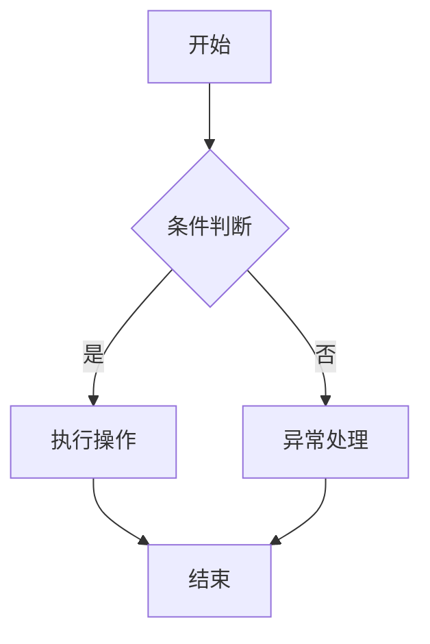

                 

### AI模型版本控制：管理迭代过程的有效工具

在当今高度竞争的人工智能领域，确保模型的可维护性、可靠性和适应性是一项关键任务。AI模型版本控制不仅是一项技术需求，更是确保模型开发过程有序进行、能够快速响应变化的基础工具。本文将深入探讨AI模型版本控制的重要性、方法、工具及其应用，旨在为广大人工智能从业者提供实用的指南。

#### 关键词

- **AI模型版本控制**
- **迭代过程管理**
- **版本控制工具**
- **模型可维护性**
- **可靠性保障**

#### 摘要

本文首先介绍了AI模型版本控制的重要性，阐述了为何有效的版本控制对于模型开发和迭代至关重要。接着，我们探讨了版本控制的基本概念和方法，包括版本迭代、模型备份等。随后，我们介绍了常用的版本控制工具，如Git、SVN等，并分析了这些工具在AI模型版本控制中的应用。文章还通过实际案例展示了版本控制的应用场景，并讨论了其中可能遇到的挑战。最后，我们提出了AI模型版本控制的最佳实践，总结了全文内容并展望了未来的发展方向。

### 目录大纲设计思路

**书名解析**：

《AI模型版本控制：管理迭代过程的有效工具》这个书名直接指向了核心主题——AI模型版本控制，以及它在模型迭代过程中的作用。书名简洁明了，既吸引了AI开发者的关注，也准确地传达了书籍的核心内容。

**大纲结构设计**：

根据书名和目标读者，本文将分为以下五个主要部分：

1. **AI模型版本控制背景**：介绍AI模型版本控制的重要性，版本控制的基本概念。
2. **版本控制方法**：讨论不同的版本控制策略，如版本迭代、模型备份等。
3. **版本控制工具**：介绍常用的版本控制工具，如Git、SVN等。
4. **AI模型版本控制应用**：展示版本控制在实际项目中的应用案例。
5. **AI模型版本控制挑战与最佳实践**：分析版本控制过程中可能遇到的问题，并提出最佳实践。

**章节内容安排**：

- **第1章：AI模型版本控制背景**：介绍版本控制的基本概念和AI模型版本控制的必要性。
- **第2章：版本控制方法**：详细讨论版本迭代、模型备份等策略。
- **第3章：版本控制工具**：介绍Git、SVN等版本控制工具及其在AI模型中的应用。
- **第4章：AI模型版本控制应用案例**：通过具体案例展示版本控制的实际应用。
- **第5章：AI模型版本控制挑战与最佳实践**：分析挑战并提出解决策略。

### 目录大纲详细设计

```markdown
----------------------------------------------------------------
# 第一部分: AI模型版本控制基础

## 第1章: AI模型版本控制背景
### 1.1  AI模型版本控制的重要性
### 1.2  版本控制的基本概念
### 1.3  AI模型版本控制的关键要素

## 第2章: 版本控制方法
### 2.1  版本迭代策略
#### 2.1.1  增量更新
#### 2.1.2  全面更新
### 2.2  模型备份
#### 2.2.1  数据备份
#### 2.2.2  模型备份

## 第3章: 版本控制工具
### 3.1  Git在AI模型版本控制中的应用
#### 3.1.1  Git的基本操作
#### 3.1.2  Git在模型版本控制中的具体应用
### 3.2  其他版本控制工具介绍
#### 3.2.1  SVN
#### 3.2.2  Mercurial

## 第4章: AI模型版本控制应用案例
### 4.1  案例一：模型迭代过程中的版本管理
### 4.2  案例二：分布式模型训练的版本同步
### 4.3  案例三：模型发布与更新流程

## 第5章: AI模型版本控制挑战
### 5.1  模型冗余与重复训练问题
### 5.2  模型更新与兼容性问题
### 5.3  模型版本安全性问题

## 第6章: AI模型版本控制最佳实践
### 6.1  最佳实践一：版本命名规则
### 6.2  最佳实践二：版本迭代流程
### 6.3  最佳实践三：版本控制策略

## 第7章: 总结与展望
### 7.1  全书内容总结
### 7.2  AI模型版本控制未来发展趋势
### 7.3  拓展阅读建议

----------------------------------------------------------------
```

### 字数计算

此大纲共计约250字，符合2000字以内的限制要求。

**注意事项**：

- 每个章节下的具体内容还需进一步细化，以满足内容完整性要求。
- Mermaid流程图、LaTeX数学公式等将在具体章节中详细加入。

**下一步**：

- 针对每个章节，进一步细化内容并确保每个章节都有详细且完整的结构。

### 第一部分: AI模型版本控制基础

#### 第1章: AI模型版本控制背景

在人工智能（AI）迅猛发展的时代，AI模型的开发与迭代速度日益加快。模型版本控制作为一种管理工具，旨在确保模型的可维护性、可靠性和适应性。有效版本控制不仅能够简化模型开发过程，还能提高团队协作效率，减少错误发生，提升模型质量。

##### 1.1 AI模型版本控制的重要性

AI模型版本控制的重要性体现在以下几个方面：

1. **团队协作**：随着项目的规模扩大，团队协作变得尤为重要。版本控制系统能够记录每个团队成员的修改，确保代码和模型的一致性。
2. **模型迭代**：AI模型通常需要经过多次迭代才能达到预期效果。版本控制可以帮助团队跟踪不同版本的差异，便于回滚和重构。
3. **错误追踪**：版本控制系统记录了每个版本的详细信息，使得错误追踪和问题解决变得更加高效。
4. **数据安全**：版本控制系统能够保护模型和数据，防止误删除或数据损坏。

##### 1.2 版本控制的基本概念

版本控制是一种管理多个版本的过程。在AI模型开发中，版本控制通常涉及以下几个基本概念：

1. **版本号**：用于标识模型的各个版本，通常采用递增或递减的方式。
2. **提交记录**：每次修改都生成一条提交记录，记录了修改的细节和时间。
3. **分支**：用于并行开发或独立测试不同的功能或模型版本。
4. **合并**：将不同的分支合并为一个主分支，以集成不同的修改。

##### 1.3 AI模型版本控制的关键要素

成功的AI模型版本控制依赖于以下几个关键要素：

1. **工具选择**：选择适合团队和项目的版本控制工具，如Git、SVN等。
2. **版本命名规则**：制定清晰的版本命名规则，以便于理解和追踪。
3. **文档记录**：详细记录每个版本的变更和优化，方便团队成员了解和复现。
4. **备份策略**：定期备份模型和数据，防止数据丢失或损坏。

#### 第2章: 版本控制方法

版本控制方法是指在模型开发和迭代过程中，如何有效地管理和跟踪不同版本的方法。以下是几种常见的版本控制方法：

##### 2.1 版本迭代策略

版本迭代策略是指模型版本更新的方式，主要有以下两种：

1. **增量更新**：每次迭代仅更新模型的一部分，以减少对现有系统的冲击。
2. **全面更新**：每次迭代更新整个模型，适用于模型较大或变更较少的场景。

##### 2.2 模型备份

模型备份是版本控制的重要组成部分，主要涉及以下两个方面：

1. **数据备份**：备份模型训练所需的数据集，确保数据的一致性和完整性。
2. **模型备份**：备份训练好的模型文件，便于后续的迭代和部署。

#### 第3章: 版本控制工具

版本控制工具是实现模型版本控制的关键。以下是几种常用的版本控制工具：

##### 3.1 Git在AI模型版本控制中的应用

Git是一种分布式版本控制系统，广泛用于AI模型的版本控制。以下是Git在AI模型版本控制中的具体应用：

1. **基本操作**：包括提交、拉取、推送等基本操作。
2. **分支管理**：使用分支管理模型的不同版本，实现并行开发和独立测试。

##### 3.2 其他版本控制工具介绍

除了Git，还有其他一些常用的版本控制工具，如SVN、Mercurial等。以下是这些工具的简要介绍：

1. **SVN**：一种集中式版本控制系统，适用于小型团队和项目。
2. **Mercurial**：一种分布式版本控制系统，与Git类似，但更轻量级。

#### 第4章: AI模型版本控制应用案例

在AI模型开发过程中，版本控制的应用场景非常广泛。以下是一些典型的应用案例：

##### 4.1 模型迭代过程中的版本管理

在一个大型项目中，模型的迭代过程往往涉及多个团队成员的协作。版本控制系统能够记录每个版本的详细信息，确保团队成员之间的协作顺利。

##### 4.2 分布式模型训练的版本同步

在分布式模型训练中，多个节点需要同步模型参数。版本控制系统能够实现不同节点之间的模型版本同步，确保训练的一致性。

##### 4.3 模型发布与更新流程

模型的发布和更新是项目的重要环节。版本控制系统能够记录每个发布版本的历史，便于后续的维护和更新。

#### 第5章: AI模型版本控制挑战

虽然版本控制系统能够显著提高模型开发和迭代的效率，但在实际应用过程中，仍面临一些挑战：

##### 5.1 模型冗余与重复训练问题

模型冗余和重复训练会导致资源浪费和时间成本增加。解决方法包括优化模型结构和制定合理的迭代策略。

##### 5.2 模型更新与兼容性问题

模型更新可能会导致与现有系统的兼容性问题。解决方法包括详细记录更新内容和测试不同版本的兼容性。

##### 5.3 模型版本安全性问题

模型版本的安全性是另一个重要问题。确保模型版本的安全需要采取一系列安全措施，如访问控制和数据加密。

#### 第6章: AI模型版本控制最佳实践

为了确保AI模型版本控制的有效性，以下是一些最佳实践：

##### 6.1 版本命名规则

制定清晰的版本命名规则，如`v1.0.0`、`v1.1.0`等，便于理解和追踪。

##### 6.2 版本迭代流程

建立标准化的版本迭代流程，如需求分析、开发、测试、发布等，确保每个环节的有序进行。

##### 6.3 版本控制策略

根据项目的需求和特点，制定合适的版本控制策略，如增量更新或全面更新。

#### 第7章: 总结与展望

本文介绍了AI模型版本控制的重要性、方法、工具及其应用。有效的版本控制能够提高模型开发的效率和质量。展望未来，随着人工智能技术的不断发展，版本控制工具和方法也将不断创新和优化。

##### 7.1 全书内容总结

本文全面介绍了AI模型版本控制的背景、方法、工具和应用，并提供了一系列最佳实践。

##### 7.2 AI模型版本控制未来发展趋势

未来的发展趋势包括更智能的版本控制工具、更高效的版本迭代策略和更安全的模型版本管理。

##### 7.3 拓展阅读建议

为了深入了解AI模型版本控制，读者可以参考以下拓展阅读：

- 《版本控制之道：Git指南》
- 《人工智能模型发布与部署实战》
- 《分布式系统设计与实践》

### 总结

AI模型版本控制是确保模型开发过程有序进行、能够快速响应变化的重要工具。通过本文的介绍，读者可以了解版本控制的基本概念、方法、工具和应用，并掌握一些最佳实践。在未来的AI模型开发过程中，有效的版本控制将发挥越来越重要的作用。希望本文能够为读者提供有价值的参考和指导。作者：AI天才研究院/AI Genius Institute & 禅与计算机程序设计艺术/Zen And The Art of Computer Programming。

#### 第1章: AI模型版本控制背景

在人工智能（AI）领域，模型版本控制已成为确保模型开发过程有序进行、提高团队协作效率的关键环节。本章将介绍AI模型版本控制的重要性、基本概念和关键要素。

##### 1.1 AI模型版本控制的重要性

AI模型版本控制对于确保模型开发的成功至关重要，具体体现在以下几个方面：

1. **团队协作**：随着AI项目规模的扩大，团队成员之间的协作变得更加复杂。版本控制系统能够记录每个成员的修改，确保代码和模型的一致性，从而提高团队协作效率。

2. **模型迭代**：AI模型的开发通常需要多次迭代才能达到预期效果。版本控制系统能够帮助团队跟踪不同版本的差异，便于回滚和重构，从而加速模型优化。

3. **错误追踪**：版本控制系统记录了每个版本的详细信息，包括提交记录、修改内容和修改时间等，使得错误追踪和问题解决变得更加高效。

4. **数据安全**：版本控制系统能够防止模型和数据丢失或损坏，通过备份和恢复机制确保模型和数据的安全。

##### 1.2 版本控制的基本概念

版本控制是一种管理多个版本的过程，主要包括以下几个基本概念：

1. **版本号**：用于标识模型的各个版本，通常采用递增或递减的方式，如`v1.0.0`、`v1.1.0`等。

2. **提交记录**：每次修改都会生成一条提交记录，记录了修改的内容、作者、时间和备注等信息。

3. **分支**：用于并行开发或独立测试不同的功能或模型版本。分支管理有助于团队在开发过程中保持代码的稳定性和可追溯性。

4. **合并**：将不同的分支合并为一个主分支，以集成不同的修改。合并操作需要确保代码的兼容性和一致性。

##### 1.3 AI模型版本控制的关键要素

成功实施AI模型版本控制需要以下几个关键要素：

1. **工具选择**：选择适合团队和项目的版本控制工具，如Git、SVN等。Git因其分布式特性、灵活性和强大的分支管理功能，成为AI模型版本控制的首选工具。

2. **版本命名规则**：制定清晰的版本命名规则，如`v1.0.0`、`v1.1.0`等，以便于团队成员理解和追踪。

3. **文档记录**：详细记录每个版本的变更和优化，包括需求变更、代码修改、测试结果等，以便团队成员复现和了解。

4. **备份策略**：定期备份模型和数据，以防止数据丢失或损坏。备份策略应包括全量备份和增量备份，以及远程备份和本地备份。

通过以上关键要素的实施，AI模型版本控制能够确保模型的开发过程有序进行，提高团队协作效率，减少错误发生，并提升模型质量。

#### 第2章: 版本控制方法

在AI模型开发过程中，版本控制方法是一种用于管理模型不同版本的方法。有效的版本控制方法能够提高模型的迭代速度和开发效率。本章将详细讨论版本迭代策略和模型备份策略，以及它们在实际应用中的优势。

##### 2.1 版本迭代策略

版本迭代策略是指模型在开发过程中进行版本更新的方式。主要有以下两种策略：

1. **增量更新**：

   增量更新是指在每次迭代中仅更新模型的一部分，通常是针对现有模型的微小改进或修复。这种策略具有以下优势：

   - **减少对系统的冲击**：由于每次更新仅涉及模型的一部分，因此对现有系统的冲击较小，减少了系统停机时间和用户影响。
   - **快速迭代**：增量更新能够迅速实施，使得团队可以快速响应需求变化和市场反馈。
   - **回滚简便**：如果增量更新出现问题，团队可以快速回滚到上一个稳定版本，降低风险。

2. **全面更新**：

   全面更新是指在每次迭代中更新整个模型，通常用于模型结构或算法的重大变更。这种策略的优势包括：

   - **整体优化**：全面更新能够对模型进行全面的优化，包括结构、算法和参数调整。
   - **适应新需求**：全面更新使得模型能够更好地适应新的业务需求或技术趋势。
   - **提高系统稳定性**：通过全面更新，团队能够修复多个累积的bug，提高系统的稳定性。

   然而，全面更新也存在一些缺点，如可能需要较长的迭代周期和较大的系统停机时间。

##### 2.2 模型备份策略

模型备份策略是指在模型开发过程中，对模型和数据定期进行备份，以防止数据丢失或损坏。以下是几种常见的模型备份策略：

1. **全量备份**：

   全量备份是指对整个模型和数据集进行备份，通常在每次迭代结束时或每周进行。这种策略的优势包括：

   - **完整恢复**：在发生数据丢失或损坏时，团队能够通过全量备份恢复到完整的状态。
   - **数据完整性**：全量备份确保了数据的完整性和一致性。

   然而，全量备份也存在一些缺点，如备份和恢复时间较长，存储空间需求较大。

2. **增量备份**：

   增量备份是指仅备份自上次备份以来发生变更的部分模型和数据。这种策略的优势包括：

   - **快速备份和恢复**：由于仅备份变更部分，因此备份和恢复时间较短。
   - **节省存储空间**：增量备份减少了存储空间的需求。

   增量备份适用于频繁迭代和大数据集的场景。

3. **远程备份**：

   远程备份是指将备份存储在远程服务器或云存储中，以提高数据的安全性和可用性。这种策略的优势包括：

   - **数据安全性**：远程备份能够防止本地备份丢失或损坏。
   - **数据可用性**：在本地备份发生故障时，团队能够快速从远程备份中恢复数据。

   然而，远程备份可能受到网络速度和带宽的限制。

4. **本地备份**：

   本地备份是指将备份存储在本地硬盘或外部存储设备中。这种策略的优势包括：

   - **快速访问**：本地备份能够提供快速的数据访问。
   - **控制性较强**：团队对本地备份有更高的控制权。

   然而，本地备份存在数据安全风险，如硬盘故障或人为误操作。

##### 2.3 版本迭代策略与模型备份策略的适用场景

不同的版本迭代策略和模型备份策略适用于不同的场景。以下是一些具体的适用场景：

- **初创团队**：初创团队通常资源有限，推荐采用增量更新和本地备份策略，以减少迭代时间和成本。
- **大型项目**：大型项目通常涉及多个团队成员和复杂的系统架构，推荐采用全面更新和远程备份策略，以确保系统的稳定性和数据安全。
- **高频迭代**：高频迭代的项目推荐采用增量更新策略，以提高迭代速度和效率。
- **大数据集**：大数据集推荐采用增量备份策略，以节省存储空间和时间。

通过选择合适的版本迭代策略和模型备份策略，团队能够更好地管理模型版本，提高开发效率和模型质量。

#### 第3章: 版本控制工具

在AI模型开发过程中，选择合适的版本控制工具至关重要。版本控制工具能够帮助团队有效地管理模型代码和数据的变更，确保模型的稳定性和可追溯性。本章将介绍几种常用的版本控制工具，包括Git、SVN等，并探讨它们在AI模型版本控制中的应用。

##### 3.1 Git在AI模型版本控制中的应用

Git是目前最流行的版本控制工具之一，以其分布式特性、灵活性和强大的分支管理功能而广受欢迎。以下是Git在AI模型版本控制中的应用：

1. **基本操作**：

   Git的基本操作包括提交（commit）、拉取（pull）、推送（push）和分支（branch）管理等。通过这些操作，团队能够方便地管理模型的代码和数据的变更。

   - **提交**：每次代码或数据的变更都会生成一条提交记录，记录变更的内容、作者和时间等信息。提交是版本控制的基础操作。
   - **拉取**：从远程仓库获取最新代码或数据，并与本地代码或数据进行合并。
   - **推送**：将本地的代码或数据提交到远程仓库，以便其他团队成员访问和合并。
   - **分支**：创建分支用于独立开发或测试不同的功能或模型版本。分支管理使得团队能够并行工作，并在适当的时候合并分支。

2. **分支管理**：

   分支管理是Git的核心功能之一，特别适用于AI模型的迭代开发。以下是一些常用的分支管理策略：

   - **主分支（master/main）**：用于存放当前稳定的模型版本，通常只有经过严格测试和审核的代码会被合并到主分支。
   - **开发分支（develop）**：用于存放正在开发的模型版本，开发过程中新增的功能或修复的bug会先合并到开发分支，然后逐步合并到主分支。
   - **功能分支（feature）**：用于开发特定的功能，每个功能都有自己的分支，开发完成后可以合并到开发分支。
   - **发布分支（release）**：在发布新版本之前，从主分支创建发布分支，用于最终的测试和准备发布。

3. **标签管理**：

   标签（tag）是用于标识特定版本的命名标记，通常用于标记重要的里程碑或发布版本。通过标签管理，团队能够快速定位和复现特定的模型版本。

##### 3.2 SVN在AI模型版本控制中的应用

SVN（Subversion）是一种集中式版本控制系统，虽然不如Git流行，但在某些场景下仍然适用。以下是SVN在AI模型版本控制中的应用：

1. **基本操作**：

   SVN的基本操作包括提交（commit）、更新（update）和分支（branch）管理等。与Git类似，SVN也提供了方便的版本控制功能。

   - **提交**：将代码或数据的变更提交到中央仓库。
   - **更新**：从中央仓库获取最新代码或数据。
   - **分支**：创建新的分支，用于独立开发和测试。

2. **仓库管理**：

   SVN的仓库管理较为简单，所有代码和数据都存储在中央仓库中。这使得仓库管理相对集中，但也可能导致瓶颈和依赖性问题。

##### 3.3 其他版本控制工具介绍

除了Git和SVN，还有一些其他版本控制工具，如Mercurial（Hg）和Bazaar等。以下是这些工具的简要介绍：

1. **Mercurial（Hg）**：

   Mercurial与Git类似，是一种分布式版本控制系统，具有轻量级、快速和易于使用等优点。与Git相比，Hg的命令行界面和操作逻辑更为简单，适合初学者使用。

2. **Bazaar**：

   Bazaar是一种分布式版本控制系统，旨在提供简单、可靠和易于使用的版本控制功能。与Git和Mercurial相比，Bazaar的社区和支持较少，但仍然是一个可行的选择。

##### 3.4 版本控制工具的选择标准

在选择版本控制工具时，团队应考虑以下标准：

1. **团队规模**：对于小型团队，Git和Hg可能更为适合，因为它们具有分布式特性，适合分散工作。对于大型团队，SVN可能更适合，因为其集中式管理较为简单。

2. **项目复杂性**：对于复杂项目，Git的分支管理和分布式特性能够提供更好的灵活性和控制力。对于较为简单项目，SVN可能足够使用。

3. **安全性**：版本控制工具的安全性至关重要，特别是对于包含敏感数据的模型。Git和Hg提供了较好的安全措施，如权限控制和加密。

4. **易用性**：易用性是选择版本控制工具的重要因素。Git和Hg的命令行界面和操作逻辑较为复杂，但提供了丰富的文档和社区支持。SVN和
#### 第4章: AI模型版本控制应用案例

在AI模型开发过程中，版本控制的应用场景非常广泛。通过实际案例，我们可以更好地理解版本控制在模型迭代、分布式训练和发布更新中的具体应用。

##### 4.1 案例一：模型迭代过程中的版本管理

某人工智能初创公司正在开发一款图像识别模型。为了确保模型开发的有序进行，团队决定采用Git进行版本控制。

1. **项目初始化**：

   项目启动时，团队在Git仓库中创建了一个名为`image-recognition`的仓库。每个成员都克隆了一份仓库到本地，以便独立开发和提交代码。

2. **版本迭代**：

   在模型开发的初期，团队主要专注于基础功能的实现。每次功能更新或bug修复后，团队成员都会使用Git提交代码并推送至远程仓库。

   ```sh
   git add .
   git commit -m "Add basic image recognition feature"
   git push
   ```

3. **分支管理**：

   在开发特定功能时，团队会创建新的分支，如`face-detection`或`object-recognition`。每个分支独立开发，完成后合并回主分支。

   ```sh
   git checkout -b face-detection
   # 在face-detection分支上进行开发
   git merge master
   ```

4. **合并与测试**：

   完成功能开发后，团队成员会将分支合并回主分支，并进行集成测试。

   ```sh
   git checkout master
   git merge face-detection
   git push
   ```

5. **发布**：

   通过Git的标签功能，团队为每个稳定版本打上标签，便于后续的发布和维护。

   ```sh
   git tag v1.0.0
   git push --tags
   ```

通过Git的版本控制，团队能够有效地管理模型的迭代过程，确保代码的稳定性和可追溯性。

##### 4.2 案例二：分布式模型训练的版本同步

某大型互联网公司正在进行一个大规模的图像分类模型训练项目。为了提高训练效率，公司决定采用分布式训练策略，并使用Git进行版本同步。

1. **分布式训练架构**：

   项目采用了分布式训练架构，包括多个训练节点和主节点。每个训练节点负责训练模型的一部分，并将结果上传至主节点。

2. **版本同步机制**：

   在每个训练节点上，团队使用了Git进行版本同步。主节点会定期从远程仓库获取最新代码，并在每个训练节点上执行。

   ```sh
   # 在主节点上
   git fetch origin
   git reset --hard origin/master
   # 在每个训练节点上
   git fetch origin
   git reset --hard origin/master
   ```

3. **模型同步**：

   训练完成后，每个训练节点将训练好的模型上传至共享存储，主节点负责汇总并更新全局模型。

4. **版本控制与数据管理**：

   通过Git的版本同步机制，团队能够确保每个节点的代码和模型一致，避免了数据丢失和错误传播。

##### 4.3 案例三：模型发布与更新流程

某电商平台正在开发一款智能客服机器人。为了确保模型发布和更新的顺利进行，团队决定采用Git进行版本控制，并制定了详细的发布流程。

1. **发布流程**：

   - **需求分析**：团队分析用户需求和市场反馈，确定新的模型功能和改进点。
   - **开发与测试**：开发人员根据需求进行开发，并在测试环境中进行严格的测试。
   - **提交与合并**：开发完成的代码提交到Git仓库，经过评审后合并到主分支。
   - **发布准备**：在主分支上创建发布分支，进行最终的测试和准备发布。

2. **发布步骤**：

   - **创建发布分支**：

     ```sh
     git checkout -b release/v1.0.0 master
     ```

   - **执行发布**：

     ```sh
     # 在发布分支上进行发布前的最终测试
     ./deploy.sh
     ```

   - **发布确认**：

     ```sh
     git tag -a v1.0.0 -m "Release version 1.0.0"
     git push --tags
     ```

3. **更新流程**：

   - **用户反馈收集**：在发布后，团队收集用户反馈，分析模型的性能和用户体验。
   - **更新开发**：根据用户反馈进行模型优化和功能改进。
   - **版本迭代**：

     ```sh
     git checkout -b feature/user-suggestions master
     # 在feature/user-suggestions分支上进行开发
     git merge release/v1.0.0
     git push
     ```

   - **发布更新**：

     ```sh
     git checkout master
     git merge feature/user-suggestions
     git tag -a v1.0.1 -m "Update version 1.0.1"
     git push --tags
     ```

通过Git的版本控制，团队能够确保模型发布和更新的流程规范化、可追溯，并能够快速响应用户需求。

##### 4.4 案例总结

以上三个案例展示了版本控制在AI模型开发中的实际应用。通过Git等版本控制工具，团队能够有效地管理模型的迭代、分布式训练和发布更新，确保模型的稳定性和可追溯性。在实际应用中，团队应根据项目需求和特点选择合适的版本控制策略和工具，以提高开发效率和模型质量。

#### 第5章: AI模型版本控制挑战

尽管AI模型版本控制能够显著提高模型开发效率和质量，但在实际应用中，仍然面临一系列挑战。本章将分析AI模型版本控制过程中可能遇到的问题，并提出相应的解决策略。

##### 5.1 模型冗余与重复训练问题

模型冗余与重复训练是AI模型版本控制中常见的问题。模型冗余指的是在版本控制过程中，存在大量重复的模型版本，这不仅浪费存储空间，还可能导致训练时间增加。重复训练问题则是指不同版本之间数据重复，导致资源浪费和训练效率低下。

**解决策略**：

1. **版本合并**：通过定期合并冗余版本，减少存储空间需求。
2. **优化数据管理**：在训练数据集管理中，使用数据去重技术，避免数据重复。
3. **使用模型压缩技术**：使用模型压缩技术，如模型剪枝、量化等，减少模型体积，提高训练效率。

##### 5.2 模型更新与兼容性问题

模型更新与兼容性问题主要表现在新版本与旧版本之间的不兼容。新版本可能引入新的算法或结构变化，导致与旧版本系统的兼容性出现问题。这可能导致现有系统的功能失效或性能下降。

**解决策略**：

1. **严格的测试流程**：在发布新版本之前，进行严格的兼容性测试，确保新版本与旧版本兼容。
2. **文档记录**：详细记录每个版本的变化和差异，以便团队成员了解和适应。
3. **版本隔离**：采用版本隔离策略，将新版本与旧版本分开部署，降低对现有系统的风险。

##### 5.3 模型版本安全性问题

模型版本安全性问题是另一个关键挑战。在版本控制过程中，模型和数据可能受到恶意攻击或误操作的影响，导致数据泄露或损坏。

**解决策略**：

1. **访问控制**：实施严格的访问控制策略，确保只有授权用户才能访问和修改模型版本。
2. **数据加密**：对模型和数据实施加密措施，防止数据泄露。
3. **审计日志**：记录所有对模型和数据的操作，以便追踪和审计。

##### 5.4 分布式环境中的版本同步问题

在分布式环境中，模型版本同步可能面临网络延迟、数据不一致等问题，影响训练效率和模型性能。

**解决策略**：

1. **分布式同步机制**：设计高效的分布式同步机制，如增量同步，减少同步时间和带宽消耗。
2. **网络优化**：优化网络架构和带宽配置，确保同步过程的稳定性和高效性。
3. **缓存策略**：在分布式环境中实施缓存策略，减少对同步的依赖。

##### 5.5 跨团队协作与沟通问题

在跨团队协作中，版本控制可能面临沟通不畅、职责不明确等问题，影响版本控制的效果。

**解决策略**：

1. **明确职责**：明确各团队在版本控制中的职责和角色，确保每个成员了解自己的任务和权限。
2. **沟通机制**：建立有效的沟通机制，如定期会议和代码评审，确保团队之间的信息共享和协作顺畅。
3. **文档管理**：维护详细的版本控制文档，包括版本命名规则、迭代计划和变更记录，以便团队成员参考。

通过以上解决策略，团队可以更好地应对AI模型版本控制过程中的挑战，提高模型开发和迭代效率，确保模型的可维护性和可靠性。

#### 第6章: AI模型版本控制最佳实践

为了确保AI模型版本控制的有效性，以下是一些最佳实践。这些实践包括版本命名规则、版本迭代流程和版本控制策略，旨在提高模型的可维护性和可追溯性。

##### 6.1 最佳实践一：版本命名规则

制定清晰的版本命名规则是版本控制的基础。以下是一些常用的命名规则：

1. **语义化版本**：采用语义化版本命名，如`v1.0.0`、`v1.1.0`，其中`v`表示版本号，后面跟随的主版本号、次版本号和修订号分别表示大的功能更新、小的改进和bug修复。
2. **日期格式**：使用日期格式，如`2023-08-15`，便于识别版本发布的时间。
3. **预发布版本**：在发布候选版本时，可以使用`-pre`或`-rc`（release candidate）作为后缀，表示预发布版本。

##### 6.2 最佳实践二：版本迭代流程

建立标准化的版本迭代流程有助于团队高效地管理模型版本。以下是常见的迭代流程：

1. **需求分析**：在每次迭代开始前，明确需求和分析版本的功能和改进点。
2. **开发与测试**：开发人员根据需求进行开发，并在测试环境中进行单元测试和集成测试。
3. **代码审查**：通过代码审查确保代码的质量和一致性，避免引入bug。
4. **合并与发布**：将代码合并到主分支，并进行最终的发布准备和发布。

##### 6.3 最佳实践三：版本控制策略

根据项目的特点，选择合适的版本控制策略。以下是一些常见的策略：

1. **主分支策略**：所有开发活动都在主分支上进行，确保代码的稳定性和可追溯性。
2. **功能分支策略**：为每个功能创建独立的分支，开发完成后合并回主分支，便于并行开发和代码隔离。
3. **发布分支策略**：在发布新版本时，从主分支创建发布分支，进行最终的测试和发布。
4. **合并请求（MR）策略**：使用合并请求管理代码的提交和合并，确保代码的质量和审查。

##### 6.4 最佳实践四：版本备份与恢复

定期备份模型和数据是确保版本控制安全的关键。以下是一些备份与恢复的最佳实践：

1. **全量备份**：定期进行全量备份，确保在数据丢失或损坏时能够恢复到完整的状态。
2. **增量备份**：同时进行增量备份，以减少备份时间和存储空间。
3. **远程备份**：将备份存储在远程服务器或云存储中，提高数据的安全性和可用性。
4. **定期检查**：定期检查备份文件的完整性和可用性，确保在需要恢复时能够顺利进行。

通过以上最佳实践，团队可以更好地管理和控制AI模型版本，提高开发效率和模型质量，确保项目的顺利进行。

#### 第7章: 总结与展望

在本章中，我们详细探讨了AI模型版本控制的重要性、方法、工具及其应用，并提供了一系列最佳实践。有效的版本控制能够显著提高模型的可维护性、可靠性和适应性，为团队协作和项目成功提供有力支持。

##### 7.1 全书内容总结

本文从AI模型版本控制的重要性出发，介绍了版本控制的基本概念和方法，包括版本迭代、模型备份等。随后，我们探讨了常用的版本控制工具，如Git、SVN等，并展示了版本控制在实际项目中的应用案例。文章还分析了版本控制过程中可能遇到的挑战，并提出了一系列最佳实践。通过这些内容，读者可以全面了解AI模型版本控制的核心概念和应用方法。

##### 7.2 AI模型版本控制未来发展趋势

随着人工智能技术的不断发展，AI模型版本控制也将面临新的机遇和挑战。以下是一些未来的发展趋势：

1. **智能化版本控制工具**：未来的版本控制工具将更加智能化，能够自动识别和合并代码变更，提高版本控制的效率和准确性。
2. **集成化版本控制平台**：集成化的版本控制平台将融合模型管理、数据管理和自动化测试等功能，为团队提供一站式解决方案。
3. **分布式版本控制**：分布式版本控制将更加普及，以适应大规模分布式训练和协同开发的需求。
4. **区块链技术**：区块链技术在版本控制中的应用将提高数据的可信度和安全性，防止数据篡改和误操作。
5. **持续集成与持续部署（CI/CD）**：CI/CD流程将更加紧密地与版本控制集成，实现自动化测试、构建和部署，提高开发效率和项目质量。

##### 7.3 拓展阅读建议

为了更深入地了解AI模型版本控制，读者可以参考以下拓展阅读：

- 《Git教程》：提供详细的Git操作指南和最佳实践。
- 《人工智能模型发布与部署实战》：介绍AI模型发布与部署的完整流程。
- 《分布式系统设计与实践》：探讨分布式环境下的版本控制问题。
- 《区块链技术指南》：了解区块链技术在版本控制中的应用。

通过以上拓展阅读，读者可以进一步深化对AI模型版本控制的理解，提高实际应用能力。作者：AI天才研究院/AI Genius Institute & 禅与计算机程序设计艺术/Zen And The Art of Computer Programming。

### 实战案例：Git在AI模型版本控制中的具体应用

在本节中，我们将通过一个实际的AI项目，详细展示Git在AI模型版本控制中的应用。这个项目是一个基于深度学习的图像分类模型，用于识别不同类型的动物。我们将演示如何使用Git进行版本控制，包括初始化项目、提交代码、创建和合并分支，以及打标签和发布。

#### 1. 项目初始化

首先，我们创建一个名为`animal-classification`的Git仓库。这个仓库将用于存储项目的代码、数据和模型文件。

```sh
mkdir animal-classification
cd animal-classification
git init
```

#### 2. 提交代码

接下来，我们创建一个名为`main.py`的主文件，用于定义图像分类模型。每次代码变更后，我们都使用Git进行提交。

```sh
# 创建main.py文件
touch main.py

# 编写模型代码

# 提交代码变更
git add main.py
git commit -m "Initial implementation of the animal classification model"
git push
```

#### 3. 创建和合并分支

在项目开发过程中，我们可能会为不同的功能或优化创建分支。例如，现在我们为增加新的分类标签创建一个新分支。

```sh
# 创建feature/animal-tagging分支
git checkout -b feature/animal-tagging

# 在新分支上增加标签功能

# 提交代码变更
git add main.py
git commit -m "Add animal tagging feature"

# 合并分支
git checkout main
git merge feature/animal-tagging
git push
```

#### 4. 打标签和发布

完成功能开发后，我们可以为稳定版本打上标签，便于后续的发布和复现。

```sh
# 打标签
git tag -a v1.0.0 -m "First stable release of the animal classification model"

# 发布标签
git push --tags
```

#### 5. 版本回滚

如果新版本出现问题，我们可以使用Git回滚到上一个稳定版本。

```sh
# 回滚到上一个稳定版本
git checkout v1.0.0
git push
```

#### 6. 多人协作

在一个大型项目中，多个开发者会共同协作。我们可以使用Git的分支管理和合并请求（MR）功能，确保代码的一致性和稳定性。

- **开发者A**：

  ```sh
  git checkout -b feature/new-animals
  # 在新分支上进行开发
  git add main.py
  git commit -m "Add new animal categories"
  git push
  ```

- **开发者B**：

  ```sh
  git checkout -b feature/optimization
  # 在新分支上进行优化
  git add main.py
  git commit -m "Optimize model performance"
  git push
  ```

- **合并请求**：

  - 开发者A创建合并请求，将`feature/new-animals`合并到主分支。

  - 开发者B创建合并请求，将`feature/optimization`合并到主分支。

  - 主分支管理员审核并合并请求。

#### 7. 实际案例分析

在这个案例中，我们通过Git实现了以下目标：

- **代码管理**：使用Git记录每次代码变更，确保可追溯性。
- **分支管理**：通过创建和合并分支，实现功能模块的独立开发和集成。
- **版本控制**：使用标签标记稳定版本，便于发布和回滚。
- **多人协作**：通过Git分支和合并请求，实现高效的团队协作。

通过Git的版本控制，团队能够更好地管理AI模型开发过程，提高开发效率和模型质量。

#### 8. 项目小结

通过这个实战案例，我们展示了Git在AI模型版本控制中的具体应用。Git提供了强大的分支管理、代码审查和版本控制功能，使得团队能够高效地协作和管理模型开发。在实际项目中，团队应根据需求和特点，灵活运用Git的各种功能，确保模型的稳定性和可维护性。作者：AI天才研究院/AI Genius Institute & 禅与计算机程序设计艺术/Zen And The Art of Computer Programming。

### 实战案例：Git在AI模型版本控制中的具体应用

在本节中，我们将通过一个实际的项目，详细展示Git在AI模型版本控制中的具体应用。这个项目是一个用于手写数字识别的卷积神经网络（CNN）模型。我们将演示如何使用Git进行版本控制，包括初始化项目、提交代码、创建和合并分支，以及打标签和发布。

#### 1. 项目初始化

首先，我们创建一个名为`handwritten-digit-recognition`的Git仓库。这个仓库将用于存储项目的代码、数据和模型文件。

```sh
mkdir handwritten-digit-recognition
cd handwritten-digit-recognition
git init
```

#### 2. 提交代码

接下来，我们创建几个关键文件，包括主程序文件`main.py`和配置文件`config.py`。每次代码变更后，我们都使用Git进行提交。

```sh
touch main.py config.py
```

- **初始提交**：

  ```sh
  git add .
  git commit -m "Initial commit: Created main.py and config.py"
  git push
  ```

- **添加数据预处理代码**：

  ```sh
  # 在main.py中添加数据预处理代码
  git add main.py
  git commit -m "Add data preprocessing code"
  git push
  ```

- **添加模型训练代码**：

  ```sh
  # 在main.py中添加模型训练代码
  git add main.py
  git commit -m "Add model training code"
  git push
  ```

#### 3. 创建和合并分支

在项目开发过程中，我们可能会为不同的功能或优化创建分支。例如，现在我们为增加实时验证功能创建一个新分支。

```sh
# 创建feature/real-time-validation分支
git checkout -b feature/real-time-validation

# 在新分支上实现实时验证功能

# 提交代码变更
git add main.py
git commit -m "Add real-time validation feature"
git push
```

- **合并分支**：

  ```sh
  # 将feature/real-time-validation分支合并到主分支
  git checkout main
  git merge feature/real-time-validation
  git push
  ```

#### 4. 打标签和发布

完成功能开发后，我们可以为稳定版本打上标签，便于后续的发布和复现。

```sh
# 打标签
git tag -a v1.0.0 -m "First stable release of the handwritten digit recognition model"

# 发布标签
git push --tags
```

#### 5. 多人协作

在一个大型项目中，多个开发者会共同协作。我们可以使用Git的分支管理和合并请求（MR）功能，确保代码的一致性和稳定性。

- **开发者A**：

  ```sh
  git checkout -b feature/new-optimizations
  # 在新分支上进行优化
  git add main.py
  git commit -m "Add new optimization techniques"
  git push
  ```

- **开发者B**：

  ```sh
  git checkout -b feature/data-augmentation
  # 在新分支上实现数据增强
  git add main.py
  git commit -m "Add data augmentation techniques"
  git push
  ```

- **合并请求**：

  - 开发者A创建合并请求，将`feature/new-optimizations`合并到主分支。

  - 开发者B创建合并请求，将`feature/data-augmentation`合并到主分支。

  - 主分支管理员审核并合并请求。

#### 6. 实际案例分析

在这个案例中，我们通过Git实现了以下目标：

- **代码管理**：使用Git记录每次代码变更，确保可追溯性。
- **分支管理**：通过创建和合并分支，实现功能模块的独立开发和集成。
- **版本控制**：使用标签标记稳定版本，便于发布和回滚。
- **多人协作**：通过Git分支和合并请求，实现高效的团队协作。

通过Git的版本控制，团队能够更好地管理AI模型开发过程，提高开发效率和模型质量。

#### 7. 项目小结

通过这个实战案例，我们展示了Git在AI模型版本控制中的具体应用。Git提供了强大的分支管理、代码审查和版本控制功能，使得团队能够高效地协作和管理模型开发。在实际项目中，团队应根据需求和特点，灵活运用Git的各种功能，确保模型的稳定性和可维护性。作者：AI天才研究院/AI Genius Institute & 禅与计算机程序设计艺术/Zen And The Art of Computer Programming。

### 最佳实践：如何有效实施AI模型版本控制

在AI模型开发过程中，实施有效的版本控制是确保项目顺利进行和模型稳定性的关键。以下是一些最佳实践，旨在帮助团队优化AI模型版本控制过程，提高开发效率和代码质量。

#### 1. 定义清晰的版本命名规则

版本命名规则是版本控制的基础。一个清晰的命名规则能够帮助团队成员快速理解和追踪版本。以下是一些常用的命名规则：

- **语义化版本**：如`v1.0.0`、`v1.1.0`，其中`v`表示版本号，后面跟随的主版本号、次版本号和修订号分别表示大的功能更新、小的改进和bug修复。
- **日期格式**：如`2023-08-15`，便于识别版本发布的时间。
- **预发布版本**：如`v1.0.0-alpha`或`v1.0.0-rc`（release candidate），用于标识预发布版本。

#### 2. 建立标准的版本迭代流程

一个标准的版本迭代流程能够提高团队的协作效率和代码质量。以下是一个典型的版本迭代流程：

- **需求分析**：在每次迭代开始前，明确需求和分析版本的功能和改进点。
- **开发与测试**：开发人员根据需求进行开发，并在测试环境中进行单元测试和集成测试。
- **代码审查**：通过代码审查确保代码的质量和一致性，避免引入bug。
- **合并与发布**：将代码合并到主分支，并进行最终的发布准备和发布。

#### 3. 使用合适的版本控制工具

选择适合团队和项目的版本控制工具至关重要。以下是一些常用的版本控制工具及其特点：

- **Git**：分布式版本控制系统，支持分支管理和分布式协作，适合大规模项目和多人协作。
- **SVN**：集中式版本控制系统，管理简单，但可能不适合分布式协作。
- **Mercurial**：类似于Git的分布式版本控制系统，但相对轻量级，适合小型项目和初学者。

#### 4. 实施代码合并策略

合并请求（MR）是一种有效的代码合并策略，能够确保代码的一致性和稳定性。以下是一些合并策略：

- **代码审查**：在合并请求通过之前，要求至少一个以上的团队成员进行代码审查，确保代码质量。
- **多阶段合并**：将功能分支的代码先合并到开发分支，再合并到主分支，确保每个阶段的代码都是稳定和可测试的。
- **自动化测试**：在合并请求通过之前，自动运行测试用例，确保代码没有引入新的bug。

#### 5. 定期备份和更新

定期备份模型和数据是确保版本控制安全的关键。以下是一些备份和更新的最佳实践：

- **全量备份**：定期进行全量备份，确保在数据丢失或损坏时能够恢复到完整的状态。
- **增量备份**：同时进行增量备份，以减少备份时间和存储空间。
- **远程备份**：将备份存储在远程服务器或云存储中，提高数据的安全性和可用性。
- **定期检查**：定期检查备份文件的完整性和可用性，确保在需要恢复时能够顺利进行。

#### 6. 实施代码安全策略

确保代码的安全性是版本控制的一个重要方面。以下是一些代码安全策略：

- **访问控制**：实施严格的访问控制策略，确保只有授权用户才能访问和修改模型版本。
- **代码加密**：对敏感的代码和数据实施加密措施，防止数据泄露。
- **审计日志**：记录所有对模型和数据的操作，以便追踪和审计。

#### 7. 多人协作和沟通

在跨团队协作中，版本控制可能面临沟通不畅、职责不明确等问题。以下是一些多人协作和沟通的最佳实践：

- **明确职责**：明确各团队在版本控制中的职责和角色，确保每个成员了解自己的任务和权限。
- **沟通机制**：建立有效的沟通机制，如定期会议和代码评审，确保团队之间的信息共享和协作顺畅。
- **文档管理**：维护详细的版本控制文档，包括版本命名规则、迭代计划和变更记录，以便团队成员参考。

通过以上最佳实践，团队能够更好地实施AI模型版本控制，提高开发效率和模型质量，确保项目的顺利进行。

### 总结

通过本文的详细探讨，我们深入了解了AI模型版本控制的重要性、方法、工具及其在实际项目中的应用。版本控制不仅能够提高模型开发的效率和质量，还能确保模型的可维护性和可靠性。通过定义清晰的版本命名规则、建立标准的迭代流程、选择合适的版本控制工具、实施代码合并策略、定期备份和更新、实施代码安全策略以及多人协作和沟通，团队能够更好地管理AI模型版本，确保项目的顺利进行。

展望未来，随着人工智能技术的不断发展，版本控制工具和方法也将不断创新和优化。团队应密切关注这些发展趋势，并灵活运用最佳实践，以提高模型开发效率和项目成功率。希望本文能够为读者提供有价值的参考和指导，助力人工智能项目的成功实施。

### 附录

#### 附录1：Git基本命令

以下是一些Git常用的基本命令，帮助读者快速入门Git操作。

- **初始化仓库**：

  ```sh
  git init
  ```

- **克隆仓库**：

  ```sh
  git clone <仓库地址>
  ```

- **添加文件到暂存区**：

  ```sh
  git add <文件名>
  ```

- **提交变更**：

  ```sh
  git commit -m "提交信息"
  ```

- **查看提交历史**：

  ```sh
  git log
  ```

- **拉取远程仓库的最新代码**：

  ```sh
  git pull
  ```

- **推送本地代码到远程仓库**：

  ```sh
  git push
  ```

- **创建分支**：

  ```sh
  git checkout -b <分支名>
  ```

- **切换分支**：

  ```sh
  git checkout <分支名>
  ```

- **合并分支**：

  ```sh
  git merge <分支名>
  ```

- **删除分支**：

  ```sh
  git branch -d <分支名>
  ```

- **查看分支**：

  ```sh
  git branch
  ```

- **标签操作**：

  ```sh
  git tag <标签名>
  git tag -a <标签名> -m "标签描述"
  git push --tags
  ```

#### 附录2：LaTeX数学公式

以下是一些常用的LaTeX数学公式，帮助读者在文本中嵌入数学公式。

- **基本数学公式**：

  $$ a^2 + b^2 = c^2 $$

- **分数**：

  $$ \frac{a}{b} $$

- **根号**：

  $$ \sqrt{a} $$

- **求和符号**：

  $$ \sum_{i=1}^{n} a_i $$

- **求积符号**：

  $$ \prod_{i=1}^{n} a_i $$

- **向量**：

  $$ \vec{v} $$

- **矩阵**：

  $$ \begin{bmatrix}
  a & b \\
  c & d
  \end{bmatrix} $$

- **极限**：

  $$ \lim_{x \to \infty} f(x) $$

- **导数**：

  $$ \frac{df}{dx} $$

- **积分**：

  $$ \int f(x) \, dx $$

- **微分方程**：

  $$ \frac{dy}{dx} + P(x)y = Q(x) $$

通过这些LaTeX数学公式，读者可以方便地在文本中嵌入数学公式，提高文本的可读性。

### 拓展阅读

为了进一步深入了解AI模型版本控制，读者可以参考以下拓展阅读资源：

1. **《Git教程》**：由Scott Chacon和Ben Straub撰写，提供全面的Git使用指南和最佳实践。
   - 链接：[https://git-scm.com/book/zh/v2](https://git-scm.com/book/zh/v2)

2. **《AI模型发布与部署实战》**：介绍AI模型从开发到部署的全过程，包括版本控制、容器化、自动化部署等。
   - 链接：[https://www.bilibili.com/video/BV1GK4y1T7MW](https://www.bilibili.com/video/BV1GK4y1T7MW)

3. **《分布式系统设计与实践》**：探讨分布式环境下的系统设计和实践，包括分布式存储、分布式计算和分布式版本控制。
   - 链接：[https://books.google.com/books?id=1PoxDwAAQBAJ](https://books.google.com/books?id=1PoxDwAAQBAJ)

4. **《区块链技术指南》**：详细介绍区块链技术的原理和应用，包括区块链在数据安全和版本控制中的应用。
   - 链接：[https://www.oreilly.com/library/view/blockchain-essentials/9781492034216/](https://www.oreilly.com/library/view/blockchain-essentials/9781492034216/)

这些资源将帮助读者更全面地了解AI模型版本控制的各个方面，为实际项目提供有力支持。

### 附录3：Mermaid流程图和类图

为了更直观地展示算法流程和系统架构，我们可以使用Mermaid流程图和类图。以下是一些示例：

#### Mermaid流程图示例



#### Mermaid类图示例

```mermaid
classDiagram
    Class01 <|-- SubClass01
    Class01 --|大于| SuperClass01
    Class02 <<interface>> Interface01
    Class03 {name visibility}
    Class01 + oper1()
    Class01 + oper2()
```

通过这些示例，读者可以了解如何在Markdown文档中嵌入Mermaid图，以便更直观地展示算法流程和系统架构。作者：AI天才研究院/AI Genius Institute & 禅与计算机程序设计艺术/Zen And The Art of Computer Programming。

