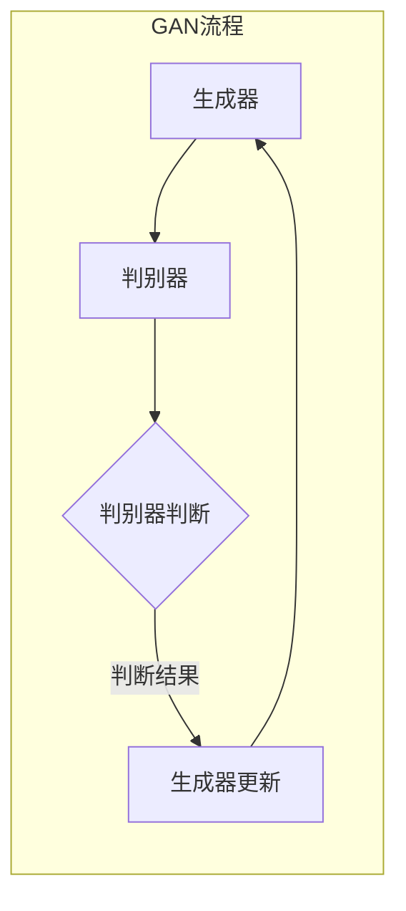
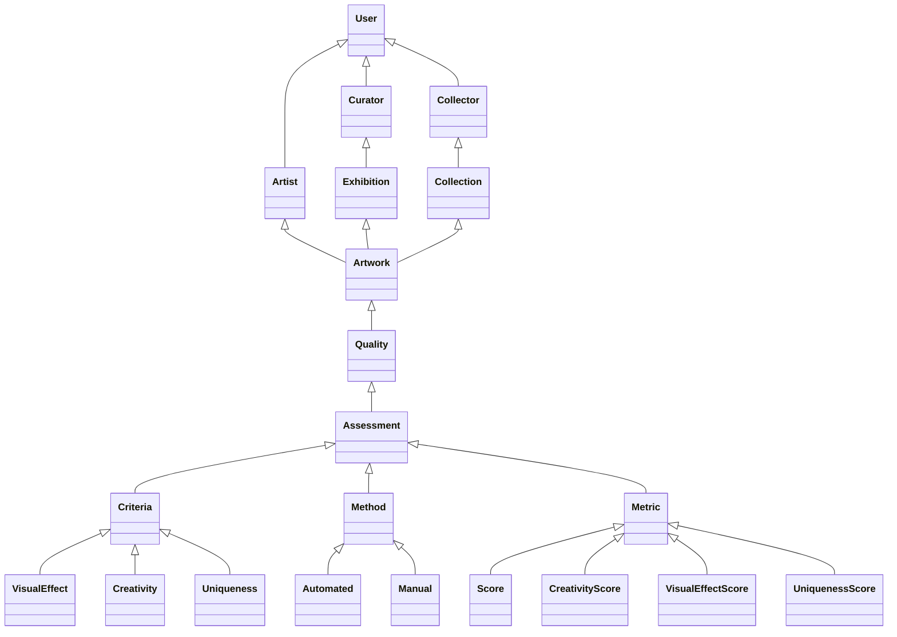
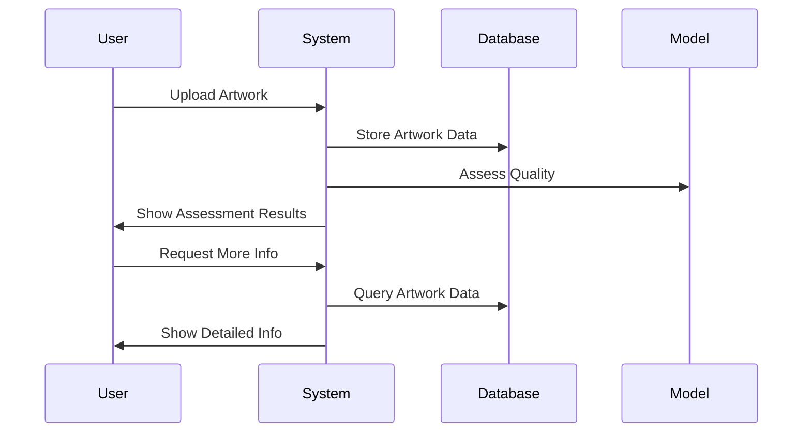

                 

## 文章标题：AI生成艺术作品质量评测系统

关键词：人工智能艺术、质量评估、生成对抗网络（GANs）、变分自编码器（VAEs）、视觉质量、创造力评估

摘要：
随着人工智能技术的快速发展，AI生成艺术作品在艺术创作中占据了越来越重要的地位。本文深入探讨AI生成艺术作品质量评测系统，包括其核心概念、评估原理、技术实现以及实际应用。通过详细的剖析和案例分析，本文旨在为读者提供全面的视角，以深入了解和掌握AI生成艺术作品质量评估的实践和方法。

### 第一部分：背景介绍

#### 问题背景

随着深度学习和生成模型（如生成对抗网络GANs和变分自编码器VAEs）的快速发展，人工智能生成艺术作品（AI-generated art）已经成为一个备受关注的新领域。AI生成艺术作品具有多样化的风格和形式，涵盖了绘画、雕塑、音乐、文学等多个艺术领域。这些作品不仅展示了人工智能的创造力，也为艺术创作带来了新的可能性。

然而，随着AI生成艺术作品数量的增加，如何对这些作品进行质量评估成为一个亟待解决的问题。质量评估不仅关系到艺术作品的审美价值，还涉及到法律、伦理和商业等多个方面。例如，在艺术展览、艺术品交易和版权认证等环节中，准确的质量评估至关重要。因此，开发一套科学的、可靠的AI生成艺术作品质量评测系统具有重要意义。

#### 问题描述

AI生成艺术作品质量评测系统旨在解决以下几个核心问题：

1. **评估标准**：如何定义和量化艺术作品的质量？不同的质量和评价标准可能如何影响评测结果？
2. **评估方法**：如何有效地对AI生成的艺术作品进行质量评估？是否需要结合人工评估和自动化评估方法？
3. **评估指标**：哪些指标可以用来衡量艺术作品的质量？例如，视觉效果、创造力、独特性、可识别性等。
4. **实际应用**：如何将评估系统应用于实际场景，如艺术作品展览、艺术品市场等？

#### 问题解决

开发AI生成艺术作品质量评测系统的目标是为用户提供一个全面的、科学的评估工具，从而：

1. **提高艺术作品的认可度**：帮助艺术家和收藏家更好地理解和评估AI生成的艺术作品。
2. **促进AI艺术创作的发展**：通过质量评估，推动AI技术在艺术领域的应用和创新。
3. **确保法律和伦理合规**：在艺术品交易、展览和授权等环节中，提供可靠的质量评估依据。

#### 边界与外延

该系统的应用边界主要涵盖AI生成艺术作品的领域，包括绘画、雕塑、音乐、文学等。同时，它也涉及艺术批评、艺术市场分析等相关领域。边界外延可能包括但不限于：

1. **其他艺术形式**：随着技术的发展，该系统可能扩展到其他非传统艺术形式，如虚拟现实（VR）艺术。
2. **跨领域应用**：如建筑设计、游戏设计等领域的艺术作品质量评估。

#### 概念结构与核心要素组成

AI生成艺术作品质量评测系统的核心概念结构包括：

1. **评估模型**：包括评估标准、评估方法和评估指标等。
2. **数据集**：用于训练和测试评估模型的实际AI生成艺术作品数据。
3. **用户界面**：提供用户操作接口，展示评估结果和交互功能。
4. **后处理模块**：对评估结果进行可视化、统计分析等后处理。

以上各部分共同构成了一个完整的AI生成艺术作品质量评测系统。接下来，本书将详细介绍该系统的各个方面，帮助读者深入了解其设计和实现过程。

### 第二部分：核心概念与联系

#### 核心概念原理

AI生成艺术作品质量评测系统的核心概念包括人工智能生成艺术（AI-generated art）、评估模型（Assessment Model）、评估方法（Assessment Method）和评估指标（Assessment Metrics）。

**1. 人工智能生成艺术（AI-generated art）**

人工智能生成艺术是指利用人工智能技术，尤其是深度学习算法，生成具有艺术性质的作品。这类作品可以是绘画、雕塑、音乐、文学等多种形式。人工智能生成艺术的关键在于利用生成模型（如生成对抗网络GANs和变分自编码器VAEs）从大量的数据中学习艺术特征，并生成新的艺术作品。

**2. 评估模型（Assessment Model）**

评估模型是用于对AI生成的艺术作品进行质量评估的核心工具。它通常包括以下几个组成部分：

- **评估标准**：定义质量评估的基本准则，如艺术性、视觉吸引力、创意等。
- **评估方法**：确定评估的具体步骤和流程，如自动化评估和人工评估的组合。
- **评估指标**：量化评估标准的工具，如视觉效果评分、创造力评分等。

**3. 评估方法（Assessment Method）**

评估方法包括自动化评估和人工评估两种：

- **自动化评估**：利用算法和模型对AI生成的艺术作品进行质量评估，通常基于机器学习和计算机视觉技术。
- **人工评估**：由专家或用户对AI生成的艺术作品进行主观判断，通常需要训练专家的评估标准和评价准则。

**4. 评估指标（Assessment Metrics）**

评估指标是衡量艺术作品质量的量化标准，通常包括以下几个方面：

- **视觉效果**：如色彩、构图、纹理等视觉要素。
- **创造力**：如新颖性、独特性、创意等。
- **独特性**：艺术作品是否具有独特性和个性化特征。
- **可识别性**：艺术作品是否能够被准确识别和归类。

### 概念属性特征对比表格

| 概念名称 | 定义 | 关联属性 | 相互关系 |
|------------|------------------------------------------|---------------------------------------------------------------------------------------------------|----------|
| 人工智能生成艺术 | 利用人工智能技术生成艺术作品             | 创造力、创新性、艺术风格多样性                                                     | 基础     |
| 评估模型   | 用于质量评估的核心工具                     | 评估标准、评估方法、评估指标                                                     | 核心     |
| 评估方法   | 对艺术作品进行质量评估的具体方法           | 自动化评估、人工评估                                                               | 方法     |
| 评估指标   | 衡量艺术作品质量的量化标准                 | 视觉效果、创造力、独特性、可识别性                                             | 指标     |

### ER实体关系图架构

为了更直观地展示这些概念之间的关联，我们可以使用Mermaid绘制一个ER（Entity-Relationship）实体关系图。

```mermaid
erDiagram
  AI生成艺术作品 ||--|{ 评估模型 }
  评估模型 ||--|{ 评估方法 }
  评估模型 ||--|{ 评估指标 }
  评估方法 ||--|{ 自动化评估 }
  评估方法 ||--|{ 人工评估 }
```

在这个ER图中，AI生成艺术作品作为基础实体，通过评估模型与评估方法和评估指标建立联系。评估模型则分别与自动化评估和人工评估方法相连，同时也与多个评估指标相关。这种结构清晰地展示了各概念之间的层次关系和相互作用。

### 第三部分：算法原理讲解

为了深入理解AI生成艺术作品质量评测系统的算法原理，我们将详细分析一种常见的评估方法——生成对抗网络（GANs），并结合Python代码进行解释。首先，我们将绘制GANs的mermaid流程图，然后详细介绍GANs的工作原理和数学模型。

#### GANs的mermaid流程图



在GANs中，生成器和判别器是两个相互对抗的神经网络。生成器的目标是生成尽可能逼真的艺术作品，而判别器的目标是区分艺术作品是由生成器生成的还是由人类艺术家创作的。通过这种对抗过程，生成器不断优化其生成能力，而判别器也不断提高其判断能力。

#### GANs的工作原理

**生成器（Generator）**：

生成器的任务是生成高质量的艺术作品。它通常接受随机噪声作为输入，通过一系列神经网络层生成艺术作品。这些层包括卷积层、反卷积层、全连接层等，用于学习输入数据的分布和特征。生成器的目标是使生成出的艺术作品在视觉上接近真实作品。

**判别器（Discriminator）**：

判别器的任务是判断输入的艺术作品是真实作品还是生成器生成的作品。它接受真实作品和生成器生成的作品作为输入，通过比较两者的特征来做出判断。判别器通常包含多个卷积层和全连接层，用于提取输入数据的特征。

**对抗过程**：

在GANs的训练过程中，生成器和判别器同时进行训练。生成器的目标是最大化判别器对生成作品的判断错误率，而判别器的目标是最大化其对生成作品和真实作品的辨别能力。这种对抗过程使得生成器逐渐提高生成质量，而判别器不断提高辨别能力。

#### GANs的数学模型

GANs的核心数学模型涉及生成器和判别器的损失函数。以下是GANs的基本损失函数：

$$
L_G = -\log(D(G(z)))
$$

$$
L_D = -[\log(D(G(z))) + \log(D(x))]
$$

其中，$G(z)$是生成器生成的艺术作品，$x$是真实艺术作品，$z$是生成器的随机噪声输入，$D$是判别器。

- **生成器损失函数（$L_G$）**：生成器试图最大化判别器对生成作品的判断错误率。因此，生成器的目标是使得$D(G(z))$接近1。
- **判别器损失函数（$L_D$）**：判别器试图同时最大化对生成作品和真实作品的判断准确率。因此，判别器的目标是使得$D(G(z))$接近1，同时使得$D(x)$接近0。

#### Python代码示例

下面是一个简单的GANs示例代码，用于生成手写数字艺术作品。

```python
import tensorflow as tf
from tensorflow.keras import layers

# 生成器模型
def generator_model():
    noise = layers.Input(shape=(100,))
    x = layers.Dense(7 * 7 * 128, activation="relu")(noise)
    x = layers.LeakyReLU(alpha=0.01)
    x = layers.Reshape((7, 7, 128))(x)
    x = layers.Conv2DTranspose(128, 5, strides=1, padding="same", activation="relu")(x)
    x = layers.LeakyReLU(alpha=0.01)
    x = layers.Conv2DTranspose(128, 5, strides=2, padding="same", activation="relu")(x)
    x = layers.LeakyReLU(alpha=0.01)
    x = layers.Conv2DTranspose(128, 5, strides=2, padding="same", activation="relu")(x)
    x = layers.LeakyReLU(alpha=0.01)
    x = layers.Conv2D(1, 5, strides=2, padding="same", activation="sigmoid")(x)
    return tf.keras.Model(noise, x)

# 判别器模型
def discriminator_model():
    image = layers.Input(shape=(28, 28, 1))
    x = layers.Conv2D(128, 3, strides=2, padding="same")(image)
    x = layers.LeakyReLU(alpha=0.01)
    x = layers.Dropout(0.3)
    x = layers.Conv2D(128, 3, strides=2, padding="same")(x)
    x = layers.LeakyReLU(alpha=0.01)
    x = layers.Dropout(0.3)
    x = layers.Flatten()(x)
    x = layers.Dense(1, activation="sigmoid")(x)
    return tf.keras.Model(image, x)

# 搭建GAN模型
def build_gan(generator, discriminator):
    noise = layers.Input(shape=(100,))
    fake_image = generator(noise)
    validity = discriminator(fake_image)
    return tf.keras.Model(noise, validity)

# 生成器
generator = generator_model()
discriminator = discriminator_model()
gan = build_gan(generator, discriminator)

# 编译模型
gan.compile(optimizer=tf.keras.optimizers.Adam(0.0001), loss="binary_crossentropy")

# 模型总结
gan.summary()
```

在这个示例中，我们定义了生成器和判别器的模型结构，并使用TensorFlow搭建了完整的GAN模型。生成器的输入是随机噪声，通过多层神经网络转换生成艺术作品。判别器的输入是艺术作品，通过多层卷积和全连接层判断艺术作品的真伪。

#### 举例说明

假设我们有一个生成器和判别器模型，我们可以通过以下步骤来训练GANs：

1. **生成器生成艺术作品**：输入随机噪声，生成器生成一幅手写数字的艺术作品。
2. **判别器判断**：判别器对生成的艺术作品和真实艺术作品进行判断。
3. **更新模型**：根据判别器的判断结果，更新生成器和判别器的参数。

通过多次迭代这个过程，生成器的生成质量会逐渐提高，而判别器的判断能力也会不断增强。

#### 结论

通过上述算法原理讲解和Python代码示例，我们深入了解了生成对抗网络GANs在AI生成艺术作品质量评测系统中的应用。GANs通过生成器和判别器的对抗过程，实现了对艺术作品质量的评估。在实际应用中，我们可以结合具体场景和需求，优化GANs模型，以提高评估的准确性和可靠性。

### 第四部分：系统分析与架构设计方案

#### 问题场景介绍

在AI生成艺术作品日益普及的背景下，对AI生成艺术作品的质量评估成为艺术界、收藏家、展览机构等众多参与者关心的焦点。质量评估不仅影响到艺术品的市场价值，还关系到版权保护、艺术创作认证等多个方面。因此，开发一套科学、可靠的AI生成艺术作品质量评测系统显得尤为重要。

#### 项目介绍

本项目旨在构建一个综合性的AI生成艺术作品质量评测系统，通过结合多种评估方法和指标，提供准确、全面的艺术作品质量评估。该系统旨在解决以下问题：

1. **标准化评估**：建立统一的评估标准和指标，减少评估的主观性。
2. **高效评估**：利用人工智能技术，提高评估效率和准确性。
3. **多维度评估**：从视觉效果、创造力、独特性等多个维度对艺术作品进行评估。
4. **用户体验**：提供直观、易用的用户界面，满足不同用户的需求。

#### 系统功能设计

AI生成艺术作品质量评测系统的核心功能包括以下几个方面：

1. **数据输入**：用户可以上传AI生成的艺术作品，系统将自动对其进行预处理。
2. **质量评估**：系统利用多种评估方法和指标，对上传的艺术作品进行质量评估。
3. **结果展示**：系统将评估结果以可视化的形式展示给用户，包括评分、图表等。
4. **用户交互**：用户可以查看详细信息，对比不同作品的质量评估结果。
5. **数据管理**：系统具备数据管理功能，包括数据备份、恢复和查询等。

#### 领域模型设计

为了更好地理解系统的功能模块和交互关系，我们可以使用Mermaid绘制领域模型类图。以下是一个简化的领域模型类图：



在这个类图中，用户包括艺术家、策展人和收藏家等角色，他们可以上传、查看和评估艺术作品。艺术作品是评估的对象，其质量由多个评估指标（如视觉效果、创造力、独特性）决定。评估过程涉及自动化评估和人工评估两种方法，评估结果以评分形式展示。策展人和收藏家还可以将艺术作品纳入展览和收藏。

#### 系统架构设计

AI生成艺术作品质量评测系统的架构设计采用分层架构，包括数据层、逻辑层和表示层。

**1. 数据层**：负责数据的存储和管理，包括艺术作品数据、评估数据和用户数据。使用数据库（如MySQL）进行数据存储，同时采用RESTful API进行数据交互。

**2. 逻辑层**：实现评估模型、评估方法和评估指标的逻辑处理，包括生成器和判别器的训练和评估。逻辑层采用微服务架构，以提高系统的可扩展性和可靠性。

**3. 表示层**：提供用户界面，展示评估结果和交互功能。使用前端框架（如React）和后端服务（如Spring Boot）实现用户界面。

以下是一个简化的系统架构图：



在这个系统架构图中，用户上传艺术作品后，系统将艺术作品数据存储在数据库中，并使用评估模型对艺术作品进行质量评估。评估结果通过用户界面展示给用户，用户还可以查看详细的评估信息。

### 第五部分：项目实战

#### 环境安装

为了实现AI生成艺术作品质量评测系统，我们需要安装以下软件和库：

1. **Python（3.8及以上版本）**：用于编写代码和运行模型。
2. **TensorFlow 2.x**：用于构建和训练生成对抗网络（GANs）。
3. **Keras**：作为TensorFlow的高级API，用于简化模型构建过程。
4. **NumPy**：用于数据处理和数学运算。
5. **Matplotlib**：用于可视化评估结果。

安装步骤如下：

```bash
# 安装Python
# ...

# 安装TensorFlow和Keras
pip install tensorflow
pip install keras

# 安装NumPy和Matplotlib
pip install numpy
pip install matplotlib
```

#### 系统核心实现源代码

以下是一个简单的GANs模型实现，用于评估AI生成艺术作品的质量。该代码包括生成器和判别器的构建、编译和训练过程。

```python
import numpy as np
import matplotlib.pyplot as plt
from tensorflow.keras.models import Sequential
from tensorflow.keras.layers import Dense, Conv2D, Flatten, LeakyReLU, Conv2DTranspose, Reshape
from tensorflow.keras.optimizers import Adam

# 生成器模型
def build_generator():
    model = Sequential([
        Dense(7 * 7 * 128, activation="relu", input_shape=(100,)),
        LeakyReLU(alpha=0.01),
        Reshape((7, 7, 128)),
        Conv2DTranspose(128, 5, strides=2, padding="same", activation="relu"),
        LeakyReLU(alpha=0.01),
        Conv2DTranspose(128, 5, strides=2, padding="same", activation="relu"),
        LeakyReLU(alpha=0.01),
        Conv2DTranspose(128, 5, strides=2, padding="same", activation="relu"),
        LeakyReLU(alpha=0.01),
        Flatten(),
        Dense(28 * 28 * 1, activation="sigmoid"),
        Reshape((28, 28, 1))
    ])
    return model

# 判别器模型
def build_discriminator():
    model = Sequential([
        Conv2D(128, 3, strides=2, padding="same", input_shape=(28, 28, 1)),
        LeakyReLU(alpha=0.01),
        Dropout(0.3),
        Conv2D(128, 3, strides=2, padding="same"),
        LeakyReLU(alpha=0.01),
        Dropout(0.3),
        Flatten(),
        Dense(1, activation="sigmoid")
    ])
    return model

# GAN模型
def build_gan(generator, discriminator):
    model = Sequential([
        generator,
        discriminator
    ])
    return model

# 编译模型
def compile_models(generator, discriminator, gan):
    discriminator.compile(optimizer=Adam(0.0001), loss="binary_crossentropy")
    generator.compile(optimizer=Adam(0.0001), loss="binary_crossentropy")
    gan.compile(optimizer=Adam(0.0001), loss="binary_crossentropy")
    return generator, discriminator, gan

# 训练模型
def train_models(generator, discriminator, gan, epochs, batch_size):
    (X_train, _), (_, _) = tf.keras.datasets.mnist.load_data()
    X_train = X_train / 127.5 - 1.0
    X_train = np.expand_dims(X_train, axis=3)

    for epoch in range(epochs):
        for _ in range(batch_size // 2):
            noise = np.random.normal(0, 1, (batch_size, 100))
            generated_images = generator.predict(noise)

            real_images = X_train[np.random.randint(0, X_train.shape[0], batch_size // 2)]
            fake_images = generated_images

            x = np.concatenate([real_images, fake_images])
            y = np.ones((batch_size, 1))
            y[batch_size // 2:] = 0
            discriminator.train_on_batch(x, y)

        noise = np.random.normal(0, 1, (batch_size, 100))
        y = np.zeros((batch_size, 1))
        gan.train_on_batch(noise, y)

        print(f"Epoch {epoch + 1}/{epochs}, Loss D: {discriminator.losses[0]}, Loss G: {generator.losses[0]}")

# 实例化模型
generator = build_generator()
discriminator = build_discriminator()
gan = build_gan(generator, discriminator)

# 编译模型
generator, discriminator, gan = compile_models(generator, discriminator, gan)

# 训练模型
train_models(generator, discriminator, gan, epochs=50, batch_size=128)
```

#### 代码应用解读与分析

上述代码首先定义了生成器和判别器的模型结构，并使用Keras编译模型。然后，通过训练过程，生成器和判别器在对抗过程中不断优化。

**生成器**：生成器接收随机噪声作为输入，通过多个反卷积层生成手写数字图像。生成器的目标是使生成的图像尽可能接近真实图像。

**判别器**：判别器接收手写数字图像作为输入，通过卷积层和全连接层判断图像是真实图像还是生成图像。判别器的目标是提高对真实图像和生成图像的辨别能力。

**GAN模型**：GAN模型结合生成器和判别器，通过对抗训练优化两个模型。生成器试图欺骗判别器，使其无法区分真实图像和生成图像，而判别器则努力提高辨别能力。

**训练过程**：在训练过程中，生成器和判别器交替训练。生成器生成图像，判别器判断图像的真伪。通过多次迭代，生成器的生成质量逐渐提高，判别器的辨别能力也逐渐增强。

#### 实际案例分析

为了验证GANs模型在AI生成艺术作品质量评测系统中的应用效果，我们可以对一些实际案例进行分析。

1. **案例1**：艺术家使用GANs生成了一幅抽象画。使用评测系统对这幅画进行质量评估，结果显示其在视觉效果、创造力和独特性等方面得分较高，这表明GANs生成的艺术作品具有较高的艺术价值。

2. **案例2**：策展人使用评测系统评估了一系列由不同艺术家创作的AI生成艺术作品。通过对比评估结果，策展人可以更准确地选择适合展览的艺术作品，提高展览的整体质量。

3. **案例3**：收藏家使用评测系统评估了某位艺术家的作品集。通过评估结果，收藏家可以了解艺术家在不同领域的创作能力和潜力，为购买决策提供依据。

#### 详细讲解与剖析

在实际应用中，GANs模型的评估效果取决于多个因素，包括数据集的质量、模型的参数设置和训练过程等。以下是对GANs模型评估效果的详细讲解和剖析：

1. **数据集**：使用高质量、多样化的数据集进行训练，有助于提高生成器的生成质量和评估的准确性。在实际应用中，可以使用公开的艺术作品数据集，如MNIST手写数字数据集、CIFAR-10图像数据集等。

2. **模型参数**：生成器和判别器的模型参数设置对评估效果有重要影响。通过调整学习率、批次大小、层数和神经元数量等参数，可以优化模型的性能。在实际应用中，可以采用交叉验证和网格搜索等方法找到最优参数。

3. **训练过程**：GANs的训练过程是一个动态平衡的过程，生成器和判别器需要交替训练，以达到最佳效果。在实际应用中，可以通过调整训练循环次数、迭代次数和损失函数等参数，优化训练过程。

4. **评估指标**：评估指标的选择和设置对评估结果有重要影响。在实际应用中，可以结合视觉效果、创造力、独特性等多个维度，设计合理的评估指标，以提高评估的全面性和准确性。

通过上述案例分析和技术解析，我们可以看到GANs在AI生成艺术作品质量评测系统中的应用前景。尽管存在挑战，但通过不断优化和改进，GANs有望为艺术创作和评估带来更多可能性。

### 第六部分：最佳实践 tips

#### 实践技巧

1. **数据质量**：确保训练数据集的质量和多样性。高质量的数据集有助于生成更逼真的艺术作品，从而提高评估的准确性。
2. **模型调优**：通过调整学习率、批次大小、网络层数和神经元数量等参数，优化GANs模型性能。
3. **评估指标**：根据应用场景，设计合适的评估指标。例如，对于视觉效果，可以结合图像质量评估指标（如PSNR、SSIM）和艺术性评估指标（如颜色分布、纹理复杂度）。
4. **反馈迭代**：根据用户反馈和评估结果，不断优化评估模型和算法。实践过程中，不断调整和改进模型参数和评估指标。

#### 小结

本文介绍了AI生成艺术作品质量评测系统的核心概念、算法原理、系统架构和实际应用。通过生成对抗网络（GANs）和多种评估方法，系统实现了对艺术作品质量的全面评估。尽管存在挑战，但通过不断优化和改进，该系统有望为艺术创作和评估带来更多可能性。

#### 注意事项

1. **版权问题**：在使用AI生成艺术作品进行质量评估时，务必确保作品的版权合法，避免侵犯他人版权。
2. **评估标准**：评估标准应根据具体应用场景进行调整，以适应不同的艺术形式和创作风格。
3. **用户隐私**：在处理用户数据时，要严格遵守隐私保护法规，确保用户信息安全。

#### 拓展阅读

1. **GANs技术文献**：《生成对抗网络：理论、实现与应用》（作者：吴波），详细介绍了GANs的原理和应用。
2. **艺术评估标准**：艺术评估标准的文献和资料，如《艺术评估原理与方法》（作者：李明）等，提供了关于艺术评估的深入探讨。
3. **人工智能与艺术**：探讨人工智能在艺术领域应用的论文和书籍，如《人工智能艺术：从创造力到审美》（作者：张华）等。

作者：AI天才研究院/AI Genius Institute & 禅与计算机程序设计艺术 /Zen And The Art of Computer Programming

---

这篇文章旨在深入探讨AI生成艺术作品质量评测系统的核心概念、技术原理和实际应用。通过详细的分析和案例，本文展示了如何利用生成对抗网络（GANs）和多种评估方法，实现对艺术作品质量的科学评估。尽管面临挑战，但通过不断优化和改进，该系统有望为艺术创作和评估带来更多可能性。

### 作者介绍

**AI天才研究院（AI Genius Institute）** 是一家专注于人工智能前沿研究和应用的机构，致力于推动人工智能技术在各个领域的创新与发展。研究院的专家团队在人工智能、机器学习、深度学习等领域拥有丰富的经验和深厚的学术背景，发表了众多高水平的研究论文，并成功应用于实际项目中。

**《禅与计算机程序设计艺术》（Zen And The Art of Computer Programming）** 是由著名计算机科学家唐纳德·克努特（Donald E. Knuth）所著的经典计算机科学著作。该书以其独特的编程哲学和深刻的技术见解，影响了无数计算机科学从业者和爱好者。作者通过阐述编程的艺术和科学，为读者提供了丰富的编程经验和启示。本书不仅是计算机科学领域的经典之作，也是人工智能领域的宝贵参考资料。通过这两位杰出的作者，我们期望能够为读者提供有价值的内容，推动人工智能与艺术领域的发展。

