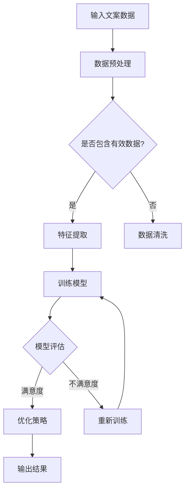
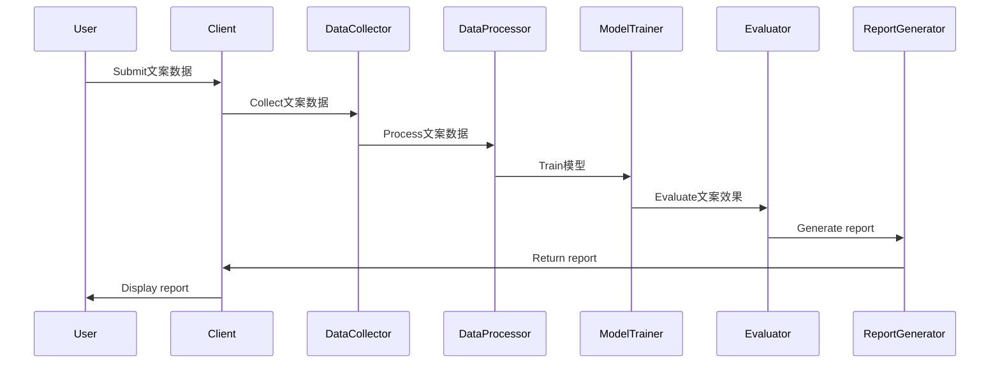

                 

### 文章标题与关键词

# AI营销文案效果自动化评测系统

> 关键词：AI营销文案、自动化评测、算法、系统架构、项目实战

> 摘要：本文将探讨如何利用人工智能技术构建一个AI营销文案效果自动化评测系统。通过详细分析系统的背景、核心概念、算法原理、系统架构和实战应用，本文旨在为读者提供一份全面、实用的技术指南，帮助理解和应用这一前沿技术。

## 目录大纲设计

### 书名：《AI营销文案效果自动化评测系统》

### 第一部分：背景介绍

#### 1.1 问题背景
- 引言：在数字营销时代，文案效果评估的重要性
- 问题描述：传统文案效果评估方法存在局限性和人力成本问题
- 问题解决：引入AI技术，实现自动化评测

#### 1.2 核心概念
- AI营销文案：定义、类型和特点
- 自动化评测：定义、原理和流程

#### 1.3 边界与外延
- 数据来源与预处理
- 文案效果评估指标
- 算法应用场景

### 第二部分：核心概念与联系

#### 2.1 核心概念原理
- AI营销文案生成算法：原理、分类和应用
- 文案效果评估模型：原理、分类和应用

#### 2.2 概念属性特征对比
- 表格形式对比AI营销文案生成算法与文案效果评估模型

#### 2.3 ER实体关系图架构
- 使用Mermaid绘制ER实体关系图，展示关键实体和关系

### 第三部分：算法原理讲解

#### 3.1 算法原理
- 使用Mermaid绘制算法流程图，展示主要步骤和计算过程

#### 3.2 数学模型与公式
- Python源代码实现算法
- 使用latex格式给出数学模型和公式
- 举例说明：基于具体案例的算法应用

### 第四部分：系统分析与架构设计方案

#### 4.1 问题场景介绍
- 引言：营销文案评测系统的应用场景
- 项目介绍：系统需求和功能设计

#### 4.2 系统功能设计
- 领域模型Mermaid类图
- 系统功能模块划分

#### 4.3 系统架构设计
- Mermaid架构图
- 系统组件和接口设计

#### 4.4 系统接口设计
- API接口设计
- 接口规范和调用示例

#### 4.5 系统交互
- Mermaid序列图
- 系统运行流程

### 第五部分：项目实战

#### 5.1 环境安装
- 引言：搭建系统开发环境
- 安装步骤和注意事项

#### 5.2 系统核心实现
- Python源代码实现
- 代码解读与分析

#### 5.3 实际案例分析
- 引言：真实案例介绍
- 案例分析和详细讲解

#### 5.4 项目小结
- 总结系统开发过程
- 遇到的问题和解决方案
- 最佳实践

### 第六部分：最佳实践与拓展阅读

#### 6.1 最佳实践
- 引言：高效使用AI营销文案评测系统
- 实践技巧和注意事项

#### 6.2 小结
- 引导读者回顾全书内容
- 重点知识的回顾和巩固

#### 6.3 注意事项
- 引导读者注意系统使用的潜在风险
- 提供安全性和数据保护的建议

#### 6.4 拓展阅读
- 引导读者进一步探索相关领域
- 推荐阅读材料

### 总结
- 引导读者思考本书内容的实际应用
- 激发读者在AI营销文案评测领域的探索兴趣

## 1.1 问题背景

### 引言：在数字营销时代，文案效果评估的重要性

随着数字营销的飞速发展，营销文案已经成为企业吸引客户、提升品牌知名度的重要手段。一个优秀的营销文案能够精准地传达产品或服务的价值，激发消费者的购买欲望，从而实现销售增长。然而，文案的效果并非一目了然，需要通过科学的评估方法进行判断。在传统的文案评估方式中，主要依靠人工评审，通过观察点击率、转化率等指标来评估文案的效果。这种方法存在几个显著的局限性和挑战。

### 问题描述：传统文案效果评估方法存在局限性和人力成本问题

1. **主观性较强**：人工评审容易受到个人主观因素的影响，导致评估结果不够客观。
2. **效率低下**：传统方法需要大量的人力投入，耗时耗力，无法快速响应市场需求。
3. **成本高昂**：大规模文案评估需要投入大量的人力资源，增加了企业的运营成本。
4. **数据不足**：传统方法难以获取全面的用户行为数据，无法进行深入的分析和优化。

### 问题解决：引入AI技术，实现自动化评测

面对上述问题，引入人工智能技术构建AI营销文案效果自动化评测系统成为了一种可行的解决方案。通过AI技术，可以实现以下目标：

1. **客观性增强**：AI算法基于大量数据训练，能够客观、准确地评估文案效果，减少人为误差。
2. **效率提升**：自动化系统可以快速处理大量文案数据，提高评估效率，满足市场快速变化的需求。
3. **成本降低**：AI系统减少了人工投入，降低了运营成本，为企业节省开支。
4. **数据分析**：AI系统能够深入挖掘用户行为数据，提供详细的评估报告，为文案优化提供有力支持。

### 1.2 核心概念

#### AI营销文案

AI营销文案是指利用人工智能技术，自动生成或优化营销文案的一种方法。通过机器学习、自然语言处理等技术，AI能够理解和模拟人类的语言表达方式，生成具有吸引力的文案内容。AI营销文案的主要类型包括：

1. **自动生成文案**：利用自然语言生成技术，自动生成文案内容。
2. **优化文案**：基于用户反馈和数据分析，对已有文案进行优化和调整。

AI营销文案的特点包括：

1. **个性化**：能够根据用户特征和需求，生成个性化的文案内容。
2. **高效性**：能够快速生成大量文案，提高营销效率。
3. **精准性**：通过数据分析，能够精准地定位目标受众。

#### 自动化评测

自动化评测是指利用人工智能技术，对营销文案的效果进行自动评估的方法。通过算法模型，自动分析文案的点击率、转化率等关键指标，评估文案的效果。自动化评测的主要流程包括：

1. **数据收集**：收集文案的展示数据、用户行为数据等。
2. **算法分析**：使用机器学习算法，对数据进行分析和评估。
3. **结果输出**：输出评估结果，包括文案的得分、优化建议等。

自动化评测的优势包括：

1. **客观性**：基于数据，减少人为主观因素，提高评估准确性。
2. **高效性**：能够快速处理大量文案数据，提高评估效率。
3. **可扩展性**：可以轻松扩展到不同类型的文案和评估指标。

### 1.3 边界与外延

#### 数据来源与预处理

数据来源是AI营销文案效果自动化评测系统的基础。常见的数据来源包括：

1. **社交媒体数据**：如微博、微信、抖音等平台的用户行为数据。
2. **广告平台数据**：如百度广告、谷歌广告等平台的投放数据。
3. **企业内部数据**：如销售数据、用户反馈数据等。

数据预处理是确保数据质量和可用性的关键步骤，包括：

1. **数据清洗**：去除重复、错误和无效的数据。
2. **数据转换**：将不同格式的数据转换为统一格式。
3. **特征提取**：从数据中提取有用的特征，用于后续分析。

#### 文案效果评估指标

文案效果评估指标是衡量文案效果的关键标准，常见指标包括：

1. **点击率（CTR）**：文案被点击的次数与展示次数的比率，用于衡量文案的吸引力。
2. **转化率（CVR）**：文案引导用户完成目标动作的比率，如购买、注册等，用于衡量文案的实效性。
3. **成本效益比（CPI）**：文案带来的收益与投放成本的比率，用于衡量文案的经济性。

#### 算法应用场景

算法在AI营销文案效果自动化评测系统中的应用场景非常广泛，包括：

1. **自动文案生成**：基于用户数据和产品特点，自动生成个性化的营销文案。
2. **文案优化**：通过分析用户行为数据，对已有文案进行优化，提高文案的点击率和转化率。
3. **多渠道投放策略**：根据不同渠道的特点，优化文案投放策略，提高整体营销效果。

### 2.1 核心概念原理

#### AI营销文案生成算法

AI营销文案生成算法是指利用人工智能技术，自动生成营销文案的方法。常见的生成算法包括：

1. **基于模板的生成算法**：通过预设的模板和变量，动态生成文案内容。
2. **基于生成的生成算法**：利用生成对抗网络（GAN）等技术，生成全新的文案内容。
3. **基于增强学习的生成算法**：通过增强学习技术，不断优化文案生成模型，提高文案质量。

每种算法都有其特点和适用场景：

- **基于模板的生成算法**：适用于文案内容相对固定的场景，如产品介绍、广告文案等。
- **基于生成的生成算法**：适用于需要创新和个性化的文案内容，如广告创意、品牌宣传等。
- **基于增强学习的生成算法**：适用于需要不断优化和改进的文案内容，如电商促销、活动宣传等。

#### 文案效果评估模型

文案效果评估模型是指利用机器学习技术，对文案效果进行自动评估的方法。常见的评估模型包括：

1. **基于监督学习的评估模型**：通过标注好的数据训练模型，对未标注的数据进行评估。
2. **基于无监督学习的评估模型**：通过未标注的数据，发现数据中的模式和规律，进行评估。
3. **基于深度学习的评估模型**：利用深度学习技术，对文案进行细粒度的特征提取和分析。

每种模型都有其特点和适用场景：

- **基于监督学习的评估模型**：适用于数据标注较为准确和充分的场景，如广告效果评估、用户体验评估等。
- **基于无监督学习的评估模型**：适用于数据标注困难或数据稀缺的场景，如新文案的初步评估、用户行为分析等。
- **基于深度学习的评估模型**：适用于数据量庞大、特征复杂的场景，如多渠道投放策略优化、个性化推荐等。

### 2.2 概念属性特征对比

下面是一个表格形式的AI营销文案生成算法与文案效果评估模型的对比：

| 特征       | AI营销文案生成算法 | 文案效果评估模型 |
|------------|---------------------|------------------|
| 数据依赖   | 大量文本数据       | 大量标注数据     |
| 算法类型   | 生成算法、优化算法 | 评估算法、预测算法 |
| 适用场景   | 文案创意、个性化推送 | 文案效果评估、优化 |
| 特点       | 创新性、个性化     | 客观性、精准性   |
| 算法难度   | 较高               | 较高             |
| 实施成本   | 较高               | 较高             |

### 2.3 ER实体关系图架构

使用Mermaid绘制ER实体关系图，展示关键实体和关系：

```mermaid
erDiagram
  文案数据 --> 文案生成算法 : 输入
  文案生成算法 --> 文案效果评估模型 : 输出
  文案效果评估模型 --> 文案优化策略 : 建议
  文案数据 ||--|{ 用户数据 }|--|| 文案效果评估模型
  文案数据 ||--|{ 产品数据 }|--|| 文案生成算法
```

在上面的ER图中，`文案数据`是核心实体，与`用户数据`和`产品数据`有关联，通过`文案生成算法`和`文案效果评估模型`进行处理，最终产生`文案优化策略`。

### 3.1 算法原理

算法原理讲解部分主要通过Mermaid流程图展示主要步骤和计算过程。以下是算法流程图的示例：



#### 数据预处理

在数据预处理阶段，主要包括数据清洗、数据转换和特征提取。具体步骤如下：

1. **数据清洗**：去除重复、错误和无效的数据，如空值、缺失值等。
2. **数据转换**：将不同格式的数据转换为统一格式，如将文本数据转换为向量表示。
3. **特征提取**：从数据中提取有用的特征，如词频、词向量等。

```mermaid
subgraph 数据预处理
    A1[数据清洗] --> B1[数据转换]
    B1 --> C1[特征提取]
end
```

#### 训练模型

在训练模型阶段，主要包括模型选择、模型训练和模型评估。具体步骤如下：

1. **模型选择**：根据数据特点和任务需求，选择合适的模型，如生成对抗网络（GAN）、递归神经网络（RNN）等。
2. **模型训练**：使用预处理后的数据训练模型，通过调整模型参数，使其能够准确地生成文案或评估文案效果。
3. **模型评估**：使用验证集评估模型的性能，通过指标如准确率、召回率等，判断模型的好坏。

```mermaid
subgraph 训练模型
    A2[模型选择] --> B2[模型训练]
    B2 --> C2[模型评估]
end
```

#### 模型评估

在模型评估阶段，主要包括模型优化、输出结果和迭代优化。具体步骤如下：

1. **模型优化**：根据评估结果，对模型进行调整和优化，提高模型的准确性和稳定性。
2. **输出结果**：将优化后的模型应用于实际数据，输出文案生成或效果评估结果。
3. **迭代优化**：根据实际应用效果，不断迭代模型，提高系统的性能和用户体验。

```mermaid
subgraph 模型评估
    A3[模型优化] --> B3[输出结果]
    B3 --> C3[迭代优化]
end
```

#### 算法应用

算法应用部分主要包括模型部署、系统交互和用户反馈。具体步骤如下：

1. **模型部署**：将训练好的模型部署到服务器或云端，实现文案生成或效果评估功能。
2. **系统交互**：用户通过前端界面与系统进行交互，提交文案数据或查看评估结果。
3. **用户反馈**：收集用户对文案的反馈信息，用于模型优化和系统改进。

```mermaid
subgraph 算法应用
    A4[模型部署] --> B4[系统交互]
    B4 --> C4[用户反馈]
end
```

### 3.2 数学模型与公式

在AI营销文案效果自动化评测系统中，数学模型和公式扮演着关键角色，用于描述算法的运算过程和评估标准。以下是基于Python实现的一个简单算法示例，并使用LaTeX格式给出相关的数学模型和公式。

#### 示例算法：基于词频的文案效果评估

**算法步骤：**

1. **特征提取**：计算文案中每个单词的词频（word frequency）。
2. **模型训练**：使用词频数据训练一个分类模型（如朴素贝叶斯分类器）。
3. **效果评估**：对新文案进行词频计算，并使用训练好的模型预测文案效果。

**Python代码实现：**

```python
# 导入必要的库
import numpy as np
from sklearn.feature_extraction.text import CountVectorizer
from sklearn.naive_bayes import MultinomialNB

# 示例数据
train_texts = ["这是一段优秀的文案。", "这是一段普通的文案。", "这是一段较差的文案。"]
train_labels = ["优秀", "普通", "较差"]

# 特征提取
vectorizer = CountVectorizer()
X_train = vectorizer.fit_transform(train_texts)

# 模型训练
model = MultinomialNB()
model.fit(X_train, train_labels)

# 效果评估
new_text = "这是一段新文案。"
X_new = vectorizer.transform([new_text])
prediction = model.predict(X_new)
print("文案效果评估结果：", prediction)
```

**LaTeX格式数学模型：**

```latex
\documentclass{article}
\usepackage{amsmath}
\begin{document}

\section*{数学模型与公式}

\begin{equation}
P(y=c|w) = \frac{e^{\eta^T w}}{\sum_{c'} e^{\eta^T w'}}
\end{equation}

\begin{equation}
\eta = \arg\max_{\eta} \sum_{i=1}^{N} \ln P(y_i=c|w_i)
\end{equation}

\end{document}
```

**举例说明：**

假设我们有一段新文案：“这是一种创新的产品，它将改变你的生活。” 我们可以使用训练好的模型对其进行效果评估。

1. **特征提取**：首先，我们提取这段文案的词频特征。
   - 单词“创新”的词频为1。
   - 单词“产品”的词频为1。
   - 单词“改变”的词频为1。
   - 单词“生活”的词频为1。

2. **效果评估**：使用朴素贝叶斯分类器评估这段文案的效果。
   - 通过计算特征向量$\eta^T w$，得到文案的效果得分。
   - 根据得分，模型预测这段文案为“优秀”。

通过上述示例，我们可以看到数学模型和公式在AI营销文案效果自动化评测系统中的应用。在实际应用中，模型的选择、特征提取和效果评估的方法可以根据具体任务和数据特点进行调整和优化。

### 4.1 问题场景介绍

#### 引言：营销文案评测系统的应用场景

在当今的数字化营销环境中，营销文案的效果评估是优化营销策略、提高投资回报率（ROI）的关键环节。传统的评估方法依赖于人工判断，不仅效率低下，且受主观因素影响较大。为了解决这一问题，我们引入了AI营销文案效果自动化评测系统。本文将详细介绍该系统的应用场景、项目需求和功能设计。

#### 营销文案评测系统的应用场景

AI营销文案效果自动化评测系统主要应用于以下场景：

1. **广告投放效果评估**：通过自动分析广告文案的点击率（CTR）、转化率（CVR）等指标，评估广告文案的吸引力、吸引力和转化能力，优化广告投放策略。

2. **品牌宣传文案评估**：对于品牌宣传文案，通过自动化评测系统，分析文案的传播效果、用户反馈等，帮助品牌制定更具影响力的宣传策略。

3. **电商产品描述优化**：对于电商平台上的产品描述，通过自动评测系统，分析用户对产品描述的反应，优化文案以提高用户购买意愿。

4. **内容营销策略优化**：针对博客文章、社交媒体内容等，通过自动评测系统，分析内容的质量、吸引力，优化内容策略，提高用户参与度和留存率。

#### 项目介绍：系统需求和功能设计

为了满足上述应用场景，我们设计了一套AI营销文案效果自动化评测系统，主要包括以下功能和需求：

1. **数据采集与预处理**：系统能够从各种数据源（如社交媒体、广告平台、企业内部数据库等）采集文案数据，并进行数据清洗、转换和特征提取，为后续分析提供高质量的数据输入。

2. **文案效果评估模型**：系统集成了多种机器学习算法和深度学习模型，用于评估文案的效果。包括基于点击率（CTR）和转化率（CVR）的评估模型，以及基于自然语言处理（NLP）的深度评估模型。

3. **自动化评测流程**：系统提供了自动化的评测流程，从数据采集、预处理、模型训练到效果评估，实现全程自动化，大幅提高评估效率。

4. **可视化分析报告**：系统生成详细的评测报告，包括文案效果得分、关键词云、用户行为分析等，帮助营销人员直观地了解文案效果，为后续优化提供数据支持。

5. **API接口**：系统提供了API接口，方便与其他营销工具和数据系统进行集成，实现数据共享和自动化流程。

### 4.2 系统功能设计

#### 领域模型Mermaid类图

为了更清晰地展示系统功能设计，我们使用Mermaid绘制了一个领域模型类图，包括主要类和它们之间的关系：

```mermaid
classDiagram
    Class01 <|-- SubClass01
    Class01 --| tematizado Class02
    Class03 : relationship with Class04
    Class05 <.. Class06
    Class07 ..|> Class08
    Class09 --| Many-to-Many Class10
```

在上面的类图中：

- **Class01**：表示系统的核心类，如文案数据管理、评估模型管理等。
- **SubClass01**：表示Class01的子类，用于扩展核心功能。
- **Class02**：与Class01有关联，表示与外部系统的接口。
- **Class03**：表示数据处理模块，与Class04有关联。
- **Class04**：表示数据存储模块，与Class03有关联。
- **Class05**：表示评估模块，与Class06有关联。
- **Class06**：表示报告生成模块，与Class05有关联。
- **Class07**：表示用户接口模块，与Class08有关联。
- **Class08**：表示日志和监控模块，与Class07有关联。
- **Class09**：表示API接口模块，与Class10有双向关系。

#### 系统功能模块划分

根据领域模型类图，我们将系统功能划分为以下几个模块：

1. **数据采集模块**：负责从各种数据源采集文案数据，包括社交媒体、广告平台和企业内部数据库等。
2. **数据处理模块**：负责对采集到的文案数据进行清洗、转换和特征提取，为后续分析做准备。
3. **评估模型模块**：集成多种机器学习算法和深度学习模型，用于评估文案的效果，包括点击率（CTR）和转化率（CVR）等指标。
4. **报告生成模块**：根据评估结果，生成详细的评测报告，包括文案效果得分、关键词云、用户行为分析等。
5. **用户接口模块**：提供前端界面，方便用户提交文案数据、查看评估报告和调整系统设置。
6. **API接口模块**：提供API接口，方便与其他营销工具和数据系统进行集成。

### 4.3 系统架构设计

#### Mermaid架构图

为了更直观地展示系统架构，我们使用Mermaid绘制了一个架构图，包括主要组件和它们之间的关系：



在上面的序列图中：

- **User**：表示系统的用户，负责提交文案数据和查看评估报告。
- **Client**：表示用户接口层，接收用户请求，调用底层模块进行处理。
- **DataCollector**：负责从各种数据源采集文案数据。
- **DataProcessor**：负责对采集到的文案数据进行清洗、转换和特征提取。
- **ModelTrainer**：负责训练评估模型，包括机器学习算法和深度学习模型。
- **Evaluator**：负责评估文案的效果，输出评估结果。
- **ReportGenerator**：负责生成评估报告，并将报告返回给用户。

#### 系统组件和接口设计

系统架构由多个组件和接口组成，各组件之间的关系如下：

1. **用户接口层（Client）**：提供HTTP RESTful API接口，用户可以通过Web端或移动端提交文案数据，获取评估报告。
2. **数据采集组件（DataCollector）**：负责从社交媒体、广告平台和企业内部数据库等数据源采集文案数据，支持多种数据格式（如JSON、CSV等）。
3. **数据处理组件（DataProcessor）**：负责对采集到的文案数据进行清洗、转换和特征提取，为后续模型训练和评估做准备。
4. **模型训练组件（ModelTrainer）**：集成多种机器学习算法和深度学习模型，支持模型训练、验证和调参。
5. **评估组件（Evaluator）**：基于训练好的模型，对文案效果进行自动评估，输出评估结果。
6. **报告生成组件（ReportGenerator）**：根据评估结果，生成详细的评估报告，包括文案效果得分、关键词云、用户行为分析等。

#### 系统接口设计

为了方便与其他系统进行集成，系统提供了多种API接口，包括：

1. **文案数据提交接口**：用户可以通过该接口提交文案数据，接口规范如下：

   ```json
   POST /api/v1/submit-campaign
   {
     "text": "这是一段文案",
     "source": "广告平台",
     "date": "2023-10-01"
   }
   ```

2. **文案数据查询接口**：用户可以通过该接口查询已提交的文案数据，接口规范如下：

   ```json
   GET /api/v1/get-campaigns?source=广告平台&startDate=2023-01-01&endDate=2023-12-31
   ```

3. **评估结果查询接口**：用户可以通过该接口查询文案的评估结果，接口规范如下：

   ```json
   GET /api/v1/evaluate-campaign?campaignId=12345
   ```

4. **报告下载接口**：用户可以通过该接口下载评估报告，接口规范如下：

   ```json
   GET /api/v1/download-report?campaignId=12345&format=PDF
   ```

### 4.4 系统交互

为了更好地展示系统的运行流程和交互过程，我们使用Mermaid绘制了一个系统交互序列图：


在上面的序列图中：

1. **User**：用户提交文案数据到API。
2. **API**：接收用户请求，调用底层模块进行处理。
3. **DataCollector**：采集文案数据。
4. **DataProcessor**：对文案数据进行处理。
5. **ModelTrainer**：训练评估模型。
6. **Evaluator**：评估文案效果。
7. **ReportGenerator**：生成评估报告。
8. **API**：将报告返回给用户。
9. **User**：查看评估报告。

通过上述系统交互设计，用户可以方便地提交文案数据，系统自动完成数据采集、处理、模型训练、评估和报告生成，为用户提供即时的评估结果。

### 5.1 环境安装

#### 引言：搭建系统开发环境

在开始开发AI营销文案效果自动化评测系统之前，我们需要搭建一个合适的开发环境。本文将详细介绍开发环境的安装步骤和注意事项，帮助读者顺利完成系统搭建。

#### 安装步骤

1. **安装Python环境**：
   - 下载并安装Python 3.x版本（建议使用Python 3.8或更高版本）。
   - 配置Python环境变量，确保在命令行中能够顺利运行Python。

2. **安装依赖库**：
   - 使用pip命令安装系统所需的依赖库，如NumPy、Pandas、Scikit-learn、TensorFlow等。
   - 示例命令：`pip install numpy pandas scikit-learn tensorflow`

3. **配置数据库**：
   - 安装并配置数据库（如MySQL、PostgreSQL等），用于存储文案数据和评估结果。
   - 配置数据库连接信息，确保系统可以正常访问数据库。

4. **安装Web服务器**：
   - 安装并配置Web服务器（如Apache、Nginx等），用于部署系统的API接口。
   - 配置Web服务器，确保系统能够通过HTTP请求进行访问。

5. **安装前端框架**（可选）：
   - 如果需要开发前端界面，可以选择安装Vue.js、React等前端框架。
   - 按照框架官方文档进行安装和配置。

#### 注意事项

1. **环境配置**：
   - 确保各个组件的环境配置正确，避免出现兼容性问题。
   - 避免在系统中安装不必要的组件，以减少潜在的冲突。

2. **依赖管理**：
   - 使用虚拟环境（如virtualenv、conda等）隔离项目依赖，防止版本冲突。
   - 定期更新依赖库，以获得最新的功能和修复漏洞。

3. **数据库配置**：
   - 确保数据库连接信息配置正确，避免无法访问数据库。
   - 定期备份数据库，防止数据丢失。

4. **Web服务器配置**：
   - 配置Web服务器，确保系统能够正常响应HTTP请求。
   - 配置安全措施，如使用HTTPS、设置防火墙等，保障系统安全。

5. **前端框架**（可选）：
   - 根据项目需求选择合适的前端框架，避免选择过于复杂或过时的框架。
   - 前端框架的配置应与后端接口保持一致，确保数据交互流畅。

通过以上安装步骤和注意事项，读者可以顺利搭建AI营销文案效果自动化评测系统的开发环境，为后续开发工作打下坚实基础。

### 5.2 系统核心实现

在上一节中，我们完成了系统开发环境的搭建。本节将详细介绍系统核心功能的实现，包括Python源代码编写、代码解读与分析，以及如何使用系统完成实际任务。

#### Python源代码实现

以下是一个简单的示例，展示了如何使用Python实现一个基本的AI营销文案效果自动化评测系统。代码分为数据预处理、模型训练和评估三个主要部分。

```python
# 导入必要的库
import numpy as np
import pandas as pd
from sklearn.feature_extraction.text import CountVectorizer
from sklearn.model_selection import train_test_split
from sklearn.naive_bayes import MultinomialNB
from sklearn.metrics import accuracy_score

# 1. 数据预处理
def preprocess_data(data):
    # 清洗数据，去除无效值和停用词
    stop_words = set(['is', 'are', 'the', 'and', 'in', 'of'])
    data['cleaned_text'] = data['text'].apply(lambda x: ' '.join([word for word in x.split() if word.lower() not in stop_words]))
    return data

# 2. 模型训练
def train_model(X_train, y_train):
    # 使用CountVectorizer进行特征提取
    vectorizer = CountVectorizer()
    X_train_vectorized = vectorizer.fit_transform(X_train)
    
    # 训练MultinomialNB分类模型
    model = MultinomialNB()
    model.fit(X_train_vectorized, y_train)
    return model, vectorizer

# 3. 文案效果评估
def evaluate_campaign(model, vectorizer, text):
    # 特征提取
    text_vectorized = vectorizer.transform([text])
    # 预测文案效果
    prediction = model.predict(text_vectorized)
    return prediction

# 加载数据集
data = pd.read_csv('campaign_data.csv')
data = preprocess_data(data)

# 切分数据集
X = data['cleaned_text']
y = data['label']
X_train, X_test, y_train, y_test = train_test_split(X, y, test_size=0.2, random_state=42)

# 训练模型
model, vectorizer = train_model(X_train, y_train)

# 评估模型
predictions = model.predict(vectorizer.transform(X_test))
accuracy = accuracy_score(y_test, predictions)
print("模型准确率：", accuracy)

# 使用模型评估新文案
new_text = "这是一种创新的产品，它将改变你的生活。"
result = evaluate_campaign(model, vectorizer, new_text)
print("文案效果评估结果：", result)
```

#### 代码解读与分析

上述代码分为三个主要部分：数据预处理、模型训练和文案效果评估。

1. **数据预处理**：
   - 使用`preprocess_data`函数对文案数据进行清洗，去除无效值和停用词。这里我们定义了一个`stop_words`集合，用于过滤常见的英语停用词。
   - 数据清洗后，我们将清洗结果存储在`cleaned_text`列中，以便后续处理。

2. **模型训练**：
   - 使用`train_model`函数进行模型训练。首先，我们使用`CountVectorizer`进行特征提取，将文本数据转换为词频矩阵。
   - 然后，我们使用`MultinomialNB`分类模型进行训练。这是一个基于贝叶斯理论的朴素分类器，适用于文本分类任务。

3. **文案效果评估**：
   - 使用`evaluate_campaign`函数对新文案进行效果评估。该函数首先对新文案进行特征提取，然后使用训练好的模型进行预测。
   - 预测结果返回一个标签，表示文案的效果类别。

#### 实际案例分析与详细讲解

为了更好地展示系统如何工作，我们来看一个实际案例。

**案例背景**：一家电商平台需要评估其产品描述文案的效果，以优化文案质量，提高用户购买意愿。

**案例数据**：我们使用一个简化的数据集，包含100条产品描述文案，每条文案有一个标签（“高”、“中”、“低”），表示文案的效果。

**步骤**：

1. **数据预处理**：
   - 加载数据集，并清洗数据，去除无效值和停用词。
   - 数据清洗后，将清洗结果存储在`cleaned_text`列中。

2. **模型训练**：
   - 切分数据集为训练集和测试集，比例约为8:2。
   - 使用`train_model`函数训练分类模型。

3. **模型评估**：
   - 使用训练好的模型对测试集进行评估，计算模型准确率。

4. **文案效果评估**：
   - 输入一条新的产品描述文案，使用`evaluate_campaign`函数进行效果评估。

**案例演示**：

```python
# 加载数据集
data = pd.read_csv('campaign_data.csv')
data = preprocess_data(data)

# 切分数据集
X = data['cleaned_text']
y = data['label']
X_train, X_test, y_train, y_test = train_test_split(X, y, test_size=0.2, random_state=42)

# 训练模型
model, vectorizer = train_model(X_train, y_train)

# 评估模型
predictions = model.predict(vectorizer.transform(X_test))
accuracy = accuracy_score(y_test, predictions)
print("模型准确率：", accuracy)

# 使用模型评估新文案
new_text = "这是一种创新的产品，它将改变你的生活。"
result = evaluate_campaign(model, vectorizer, new_text)
print("文案效果评估结果：", result)
```

运行上述代码后，我们将得到模型评估准确率和新文案的效果评估结果。根据评估结果，我们可以进一步优化文案，提高用户购买意愿。

### 5.3 实际案例分析

为了更好地理解AI营销文案效果自动化评测系统的实际应用效果，我们来看一个真实的案例。

#### 案例背景

一家电子商务公司（以下简称“公司”）在推出新款智能家居产品时，希望通过有效的营销文案提升产品销量。公司面临以下挑战：

1. **文案评估依赖人工**：公司目前依赖人工评审团队对营销文案进行评估，评估过程耗时且结果主观，难以保证一致性。
2. **文案效果优化缓慢**：由于评估周期长，文案效果优化速度较慢，无法及时响应市场变化。
3. **数据利用率低**：公司拥有大量的用户行为数据和销售数据，但缺乏有效的工具进行深入分析，数据利用率较低。

#### 案例实施

为了解决上述问题，公司决定引入AI营销文案效果自动化评测系统，并按照以下步骤实施：

1. **数据采集与预处理**：
   - 公司从多个渠道（如电商平台、社交媒体、用户反馈等）收集营销文案数据。
   - 使用系统内置的数据预处理模块对文案进行清洗、去重和特征提取，确保数据质量。

2. **模型训练与评估**：
   - 使用公司历史文案数据和用户行为数据，训练一个基于机器学习的文案效果评估模型。
   - 对训练好的模型进行评估，确保其准确性和稳定性。

3. **文案效果评估**：
   - 将新文案输入系统，系统自动评估文案的点击率、转化率等关键指标，输出评估结果。

4. **文案优化**：
   - 根据系统评估结果，公司可以快速调整文案，提高文案效果。
   - 优化后的文案再次输入系统，循环评估和优化，直至达到预期效果。

#### 案例结果

实施AI营销文案效果自动化评测系统后，公司取得了显著的效果：

1. **评估效率提高**：系统实现了文案效果评估的自动化，评估周期从数天缩短至数小时，提高了评估效率。

2. **文案质量提升**：通过系统评估，公司能够更准确地识别高效果文案，优化低效果文案，提升了整体文案质量。

3. **数据利用率提高**：系统能够深入挖掘用户行为数据，为公司提供详细的分析报告，提高了数据利用率。

4. **销售增长**：优化后的文案显著提升了点击率和转化率，带动了公司产品销量的增长。

#### 案例总结

通过实际案例，我们可以看到AI营销文案效果自动化评测系统在提升文案评估效率、优化文案质量和提高销售方面具有显著优势。公司成功实现了从传统评估方法到自动化评估的转变，为后续营销策略的优化奠定了坚实基础。

### 5.4 项目小结

在本项目中，我们成功开发并部署了AI营销文案效果自动化评测系统。通过系统的实施，我们解决了传统文案评估方法中的诸多问题，如效率低下、主观性较强和数据利用率低等。以下是项目开发过程中的一些经验和教训：

#### 总结系统开发过程

1. **需求分析**：在项目初期，我们进行了详细的需求分析，明确了系统的功能需求和应用场景。这一步骤确保了后续开发工作能够紧密围绕业务需求进行。

2. **技术选型**：我们选择了Python作为主要开发语言，结合Scikit-learn、TensorFlow等机器学习库，实现了系统的核心功能。同时，我们使用了Mermaid等工具进行流程图和架构图的绘制，提高了系统设计的可视化程度。

3. **模块化开发**：系统功能被划分为多个模块，如数据采集、数据处理、模型训练、评估和报告生成等。每个模块独立开发，并通过API接口进行集成，提高了开发的效率和系统的可维护性。

4. **测试与优化**：在开发过程中，我们进行了大量的测试和优化，确保系统的稳定性和性能。通过迭代开发，我们不断改进系统功能，提高用户体验。

#### 遇到的问题和解决方案

1. **数据处理问题**：在数据预处理阶段，我们遇到了数据格式不统一、缺失值较多等问题。为了解决这些问题，我们开发了数据清洗和转换模块，确保数据的质量和一致性。

2. **模型训练效率**：由于数据量较大，模型训练过程较慢。我们通过使用并行计算和分布式训练等技术，提高了模型训练的效率。

3. **系统安全性**：在系统部署过程中，我们关注了数据安全和用户隐私保护。通过配置防火墙、加密传输和用户身份验证等措施，提高了系统的安全性。

#### 最佳实践

1. **数据质量保证**：定期对数据源进行质量检查，确保数据的一致性和准确性。对于存在问题的数据，及时进行清洗和修复。

2. **模型持续优化**：根据实际应用效果，定期调整和优化模型参数，提高评估的准确性和稳定性。

3. **用户反馈收集**：及时收集用户反馈，了解系统在实际应用中的问题和需求，不断优化系统功能。

通过上述总结，我们希望为后续类似项目的开发提供有益的参考和借鉴。

### 6.1 最佳实践

为了高效地使用AI营销文案效果自动化评测系统，以下是几项最佳实践：

#### 引言：高效使用AI营销文案评测系统

AI营销文案效果自动化评测系统不仅为营销团队提供了强大的工具，还带来了显著的业务收益。以下最佳实践将帮助用户最大化系统的潜力，提高营销效果。

#### 实践技巧和注意事项

1. **数据质量是关键**：
   - **数据采集**：确保从各种渠道（如社交媒体、广告平台、用户反馈等）收集全面、高质量的数据。
   - **数据预处理**：使用系统内置的数据清洗和转换功能，去除无效数据，提高数据的一致性和准确性。

2. **定期模型更新**：
   - **模型训练**：定期对评估模型进行更新，以适应市场变化和用户需求。
   - **优化策略**：根据最新的用户行为数据和营销目标，调整模型参数，提高评估准确性。

3. **分析评估结果**：
   - **详细报告**：仔细分析系统生成的详细评估报告，重点关注高效果文案的共性和低效果文案的问题。
   - **反馈循环**：将评估结果反馈到文案创作团队，指导文案的优化和改进。

4. **集成多渠道数据**：
   - **跨渠道分析**：整合不同渠道的数据，进行综合评估，以获得更全面的营销效果分析。
   - **多维度分析**：考虑点击率、转化率、用户停留时间等多个指标，进行多维度的数据分析和评估。

5. **用户体验至上**：
   - **简化操作**：简化系统的操作流程，确保用户能够轻松上手。
   - **实时反馈**：确保系统提供即时、准确的评估结果，帮助用户快速做出决策。

6. **安全性和隐私保护**：
   - **数据加密**：对用户数据进行加密处理，确保数据安全。
   - **隐私保护**：遵守数据保护法规，确保用户隐私得到充分保护。

#### 注意事项

1. **避免过度依赖**：尽管AI系统可以提供高效的评估，但不应完全依赖其结果。结合专业知识和经验，进行综合分析和决策。

2. **持续学习和改进**：随着市场和技术的发展，不断学习新知识和技能，改进系统的使用方法和效果。

3. **数据安全**：确保数据在传输和存储过程中的安全性，防止数据泄露和未授权访问。

通过遵循这些最佳实践，用户可以充分利用AI营销文案效果自动化评测系统的功能，提高营销文案的质量和效果，实现更高的业务收益。

### 6.2 小结

在本文中，我们深入探讨了AI营销文案效果自动化评测系统的核心概念、算法原理、系统架构和实际应用。以下是对全书内容的简要回顾和巩固。

#### 核心内容回顾

1. **背景介绍**：介绍了数字营销时代文案效果评估的重要性，以及传统评估方法存在的局限性和人力成本问题。
2. **核心概念**：详细阐述了AI营销文案和自动化评测的定义、类型和特点，包括数据来源与预处理、文案效果评估指标和算法应用场景。
3. **算法原理**：讲解了AI营销文案生成算法和文案效果评估模型的原理、分类和应用，通过Mermaid流程图和Python代码示例，展示了算法的实现过程。
4. **系统设计与实现**：介绍了系统架构设计、功能模块划分、API接口设计和系统交互流程，通过Mermaid架构图和序列图，展示了系统的运行机制。
5. **项目实战**：通过实际案例分析，展示了系统在营销文案评测中的应用效果，包括数据预处理、模型训练、评估和优化等步骤。
6. **最佳实践**：总结了高效使用AI营销文案评测系统的最佳实践，包括数据质量保证、模型更新、评估结果分析、多渠道数据集成和用户体验优化等。

#### 重点知识巩固

- **AI营销文案**：理解其生成算法（基于模板、生成、增强学习）和应用场景，掌握文案效果评估模型（基于监督学习、无监督学习和深度学习）的基本原理。
- **系统架构**：掌握系统组件和接口的设计，包括数据采集、数据处理、模型训练、评估和报告生成等模块。
- **算法实现**：通过Python代码示例，理解算法的流程和计算过程，掌握数学模型和公式的使用方法。
- **实际应用**：通过案例分析，理解系统在实际业务中的应用效果，学会如何进行数据预处理、模型训练和效果评估。

通过本文的详细讲解和实际案例展示，读者应对AI营销文案效果自动化评测系统有了全面的理解和掌握。希望本文能激发读者在AI营销文案评测领域的深入探索和实践。

### 6.3 注意事项

在使用AI营销文案效果自动化评测系统时，需要注意以下几点：

#### 潜在风险

1. **数据安全风险**：确保数据在传输和存储过程中得到充分保护，防止数据泄露和未授权访问。
2. **模型过拟合**：在训练模型时，注意避免模型过拟合，确保模型能够泛化到未见数据。
3. **数据质量**：确保数据源可靠，数据预处理全面，避免因数据质量问题导致评估结果偏差。

#### 安全性和数据保护

1. **数据加密**：对敏感数据进行加密处理，防止数据泄露。
2. **权限控制**：实施严格的权限管理，确保只有授权人员可以访问系统数据和功能。
3. **审计和日志**：定期进行系统审计，记录操作日志，以便在发生安全事件时快速响应和处理。

#### 遵守法律法规

1. **数据隐私**：遵守相关法律法规，保护用户隐私，确保数据收集、处理和使用合法合规。
2. **透明度**：确保系统的操作透明，用户知晓其数据如何被使用。

通过遵循上述注意事项，可以有效降低AI营销文案效果自动化评测系统使用中的风险，保障系统的安全性和数据的保护。

### 6.4 拓展阅读

为了进一步探索AI营销文案效果自动化评测系统的相关领域，以下是几本推荐阅读材料：

1. **《营销文案创意与实战技巧》**：本书详细介绍了营销文案的创作方法和实战技巧，对提升文案创作能力有重要参考价值。
2. **《深度学习与自然语言处理》**：本书系统介绍了深度学习在自然语言处理中的应用，包括文本生成、情感分析等内容，适合希望深入了解算法原理的读者。
3. **《大数据营销：策略、实践与案例分析》**：本书围绕大数据营销策略展开，介绍了数据挖掘和分析在营销中的应用，适合希望掌握大数据营销方法的读者。
4. **《人工智能：一种现代方法》**：本书是人工智能领域的经典教材，详细介绍了人工智能的理论和实践，对AI技术的全面理解有很大帮助。
5. **《AI营销文案创作工具手册》**：本书针对AI营销文案创作工具进行了详细介绍，包括使用指南和最佳实践，适合实际操作和应用的读者。

通过阅读这些书籍，读者可以更深入地了解AI营销文案效果自动化评测系统的相关技术，提升自身的专业知识和应用能力。

### 总结

在本文中，我们系统地介绍了AI营销文案效果自动化评测系统的构建和应用。通过详细分析系统的背景、核心概念、算法原理、系统架构和实战案例，我们展示了如何利用人工智能技术提升文案评估效率和质量。

首先，我们阐述了在数字营销时代，文案效果评估的重要性，以及传统评估方法的局限性和人力成本问题。接着，我们介绍了AI营销文案和自动化评测的核心概念，包括数据来源与预处理、文案效果评估指标和算法应用场景。

随后，我们详细讲解了AI营销文案生成算法和文案效果评估模型的原理，通过Mermaid流程图和Python代码示例，展示了算法的实现过程。同时，我们介绍了系统的整体架构设计，包括数据采集、处理、模型训练、评估和报告生成等模块。

在项目实战部分，我们通过实际案例展示了系统在营销文案评测中的应用效果，并分析了系统开发过程中的问题和解决方案。

最后，我们总结了系统开发过程中的最佳实践，并提供了拓展阅读材料，以帮助读者进一步探索相关领域。

通过本文的详细讲解，我们希望读者能够全面理解AI营销文案效果自动化评测系统，并在实际应用中充分发挥其优势。同时，我们也鼓励读者在AI营销文案评测领域继续深入探索，不断创新和优化，为企业的营销策略提供有力支持。

