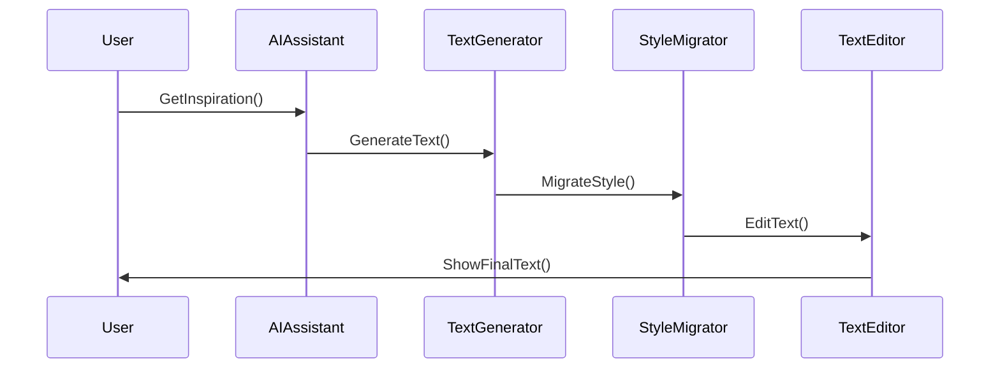

                 

### AI辅助的创意写作：人机协作的文学创作

#### 关键词
- **人工智能（AI）**
- **创意写作**
- **人机协作**
- **自然语言处理（NLP）**
- **生成对抗网络（GAN）**
- **迁移学习**

#### 摘要
本文将探讨AI辅助的创意写作，分析其在文学创作中的应用及其实现机制。通过逐步阐述AI辅助创意写作的核心概念、算法原理，并引入实际案例，本文旨在为读者提供关于AI与文学创作结合的深度见解和实用指南。

### 1. 背景介绍

#### 问题背景
在当前信息化时代，人工智能（AI）已经成为推动社会进步的重要力量。随着计算能力的提升和数据量的爆炸性增长，AI技术的应用逐渐从传统的图像识别、语音识别等场景扩展到更广泛的领域，如自然语言处理、机器学习、智能推荐等。

#### 问题描述
创意写作是文学创作的重要分支，传统上依赖人类作家的灵感与创造力。然而，随着AI技术的不断发展，如何利用AI辅助人类作家进行创意写作，实现人机协作，成为一个新的研究热点。

#### 问题解决
AI辅助的创意写作旨在通过机器学习和自然语言处理技术，帮助作家在写作过程中获取灵感，提高写作效率。同时，AI可以分析人类作家的写作风格，学习其创作习惯，从而提供个性化的辅助服务。

#### 边界与外延
AI辅助的创意写作不仅限于文学创作，还可以应用于广告文案、编程文档、新闻报道等多个领域。其边界涵盖从简单的语法纠错、文章生成到复杂的剧情构思、人物设定等各个方面。

#### 概念结构与核心要素组成
- **人工智能（AI）**: 模拟人类智能行为的技术，包括机器学习、自然语言处理、计算机视觉等。
- **创意写作**: 文学创作的活动，强调作品的创造性、艺术性和个性化。
- **人机协作**: 人与机器的互动合作，通过AI技术辅助人类工作，提高效率和创造力。

#### 背景介绍

1. **人工智能的发展与应用**
人工智能（AI）作为计算机科学的一个分支，致力于通过算法和计算模型模拟人类智能行为。从最初的规则系统、知识表示，到现代的机器学习和深度学习，AI技术经历了巨大的变革。如今，AI技术已广泛应用于图像识别、语音识别、自然语言处理、机器翻译、自动驾驶、医疗诊断等多个领域。

   - **自然语言处理（NLP）**: NLP是AI的一个重要分支，旨在使计算机能够理解、生成和处理人类语言。它包括文本分类、情感分析、命名实体识别、机器翻译等任务。
   - **机器学习（ML）**: 机器学习是AI的核心技术之一，通过从数据中学习规律和模式，实现自动预测和决策。机器学习算法包括监督学习、无监督学习和强化学习等。
   - **深度学习（DL）**: 深度学习是一种基于人工神经网络的机器学习方法，通过多层网络结构自动提取特征，实现复杂任务的高效解决。

2. **创意写作的需求与挑战**
创意写作是文学创作的重要分支，强调作品的创造性、艺术性和个性化。然而，随着创作领域的不断扩大和竞争的加剧，作家面临越来越多的挑战：

   - **创作灵感有限**: 创作灵感是文学创作的源泉，但作家的灵感有限，且常常陷入创作瓶颈。
   - **写作效率低下**: 手动写作过程耗时耗力，特别是在大规模创作和多人协作中，效率问题尤为突出。
   - **风格一致性要求**: 不同作品之间的风格一致性是评价作家水平的重要标准，但手动维持风格一致性极具挑战性。

3. **AI辅助创意写作的必要性
AI辅助创意写作能够有效解决上述挑战，具有以下必要性：

   - **灵感辅助**: 通过分析大量文本数据，AI可以为作家提供灵感和创意，突破创作瓶颈。
   - **写作效率提升**: AI能够自动化地进行文本生成、修改和优化，大大提高写作效率。
   - **风格一致性保障**: AI可以学习并模仿作家的写作风格，确保不同作品之间的一致性。

4. **AI辅助创意写作的边界与外延
AI辅助创意写作不仅限于文学创作，还可以应用于其他需要文本生成的领域：

   - **广告文案**: AI可以帮助广告创意团队快速生成创意文案，提高广告效果。
   - **新闻报道**: AI可以自动化地撰写新闻报道，提高新闻生成速度和准确性。
   - **编程文档**: AI可以帮助开发者快速生成文档和代码注释，提高开发效率。

   此外，AI辅助创意写作还涵盖了从简单的语法纠错、文章生成到复杂的剧情构思、人物设定等多个方面：

   - **语法纠错**: AI可以通过自然语言处理技术识别和修正文本中的语法错误。
   - **文章生成**: AI可以基于现有文本生成新的文章，实现自动化写作。
   - **剧情构思**: AI可以帮助作家构思复杂的剧情，提供创作思路。
   - **人物设定**: AI可以根据作家的需求生成个性化的人物设定，丰富作品内容。

### 概念结构与核心要素组成

#### 概念结构与核心要素组成

在探讨AI辅助创意写作时，首先需要明确其中的核心概念及其相互关系。以下是本文中涉及的主要概念及其组成要素：

1. **人工智能（AI）**
   - **定义**: 模拟人类智能行为的技术，包括机器学习、自然语言处理、计算机视觉等。
   - **组成部分**: 机器学习、深度学习、自然语言处理、计算机视觉。

2. **创意写作**
   - **定义**: 文学创作的活动，强调作品的创造性、艺术性和个性化。
   - **组成部分**: 灵感获取、构思与规划、文本创作、修改与优化。

3. **人机协作**
   - **定义**: 人与机器的互动合作，通过AI技术辅助人类工作，提高效率和创造力。
   - **组成部分**: 用户接口、交互逻辑、任务分配、协同工作。

4. **自然语言处理（NLP）**
   - **定义**: 使计算机能够理解、生成和处理人类语言的技术。
   - **组成部分**: 文本分析、语音识别、语言翻译、情感分析。

5. **生成对抗网络（GAN）**
   - **定义**: 一种深度学习模型，用于生成高质量的图像、文本等。
   - **组成部分**: 生成器、判别器、损失函数。

6. **迁移学习**
   - **定义**: 将在一个任务上学到的知识应用到另一个相关但不同的任务上。
   - **组成部分**: 共享特征提取、领域自适应、模型微调。

#### 概念属性特征对比表格

| 概念                 | 属性特征                                  | 相关性/联系             |
|----------------------|------------------------------------------|------------------------|
| 人工智能（AI）       | 模拟人类智能、机器学习、自然语言处理等   | 基础技术，支持创意写作 |
| 创意写作             | 创造性、艺术性、个性化                   | 应用目标，需要AI辅助   |
| 人机协作             | 互动合作、任务分配、协同工作             | AI辅助实现的关键       |
| 自然语言处理（NLP） | 文本分析、语音识别、语言翻译、情感分析   | AI辅助创意写作的核心   |
| 生成对抗网络（GAN） | 图像、文本生成                           | 支持创意性内容生成     |
| 迁移学习             | 知识迁移、减少数据需求                   | 提高AI的泛化能力       |

#### ER实体关系图架构

以下是使用Mermaid绘制的ER实体关系图：

```mermaid
erDiagram
  Writer ||--|{ AI_Aide }|| Aide
  Writer ||--|{ Creative_Writing }|| Writing
  AI_Aide ||--|{ NLP_Technology }|| Technology
  AI_Aide ||--|{ Generative_Adversarial_Network }|| Network
```

在这个图中，`Writer`（作家）与`AI_Aide`（AI助手）和`Creative_Writing`（创意写作）之间存在直接的关联，表示作家利用AI助手进行创意写作。`AI_Aide`与`NLP_Technology`（自然语言处理技术）和`Generative_Adversarial_Network`（生成对抗网络）之间存在关联，表示AI助手通过这些技术实现创意写作的辅助功能。

### 2. 核心概念与联系

#### 核心概念与联系

在探讨AI辅助创意写作时，需要深入理解其中的核心概念及其相互关系。以下是本文涉及的主要核心概念及其联系：

1. **自然语言处理（NLP）**
   - **定义**: 自然语言处理（NLP）是人工智能（AI）的一个分支，旨在使计算机能够理解、生成和处理人类语言。NLP涵盖了从文本分析、语音识别到语言翻译、情感分析等广泛任务。
   - **属性特征**: 包括语言理解、语言生成、语言翻译、情感分析、命名实体识别等。
   - **联系**: NLP是AI辅助创意写作的核心技术，用于理解和处理作家输入的文本，提供创意建议和辅助功能。

2. **生成对抗网络（GAN）**
   - **定义**: 生成对抗网络（GAN）是一种深度学习模型，由生成器和判别器组成。生成器的任务是生成与真实数据相似的假数据，判别器的任务是区分真实数据和生成数据。通过两者的博弈，生成器不断优化生成质量。
   - **属性特征**: 包括生成器、判别器、对抗训练、损失函数等。
   - **联系**: GAN在AI辅助创意写作中用于生成高质量、创意性的文本内容，如剧情构思、角色设定等。

3. **迁移学习**
   - **定义**: 迁移学习是一种机器学习方法，旨在利用在一个任务上学到的知识提高另一个相关任务的表现。通过迁移学习，模型可以减少对大量新数据的依赖，提高泛化能力。
   - **属性特征**: 包括共享特征提取、领域自适应、模型微调等。
   - **联系**: 迁移学习在AI辅助创意写作中用于将已学到的知识应用于新的写作任务，如风格迁移、故事生成等。

4. **协同过滤**
   - **定义**: 协同过滤是一种基于用户行为的数据挖掘技术，通过分析用户的历史行为和偏好，预测用户可能感兴趣的项目。
   - **属性特征**: 包括基于用户的协同过滤、基于项目的协同过滤、矩阵分解等。
   - **联系**: 协同过滤在AI辅助创意写作中用于推荐创意写作灵感、参考素材等，提高写作效率和创造力。

#### 概念属性特征对比表格

| 概念                 | 属性特征                                  | 相关性/联系             |
|----------------------|------------------------------------------|------------------------|
| 自然语言处理（NLP） | 语音识别、语言翻译、情感分析             | 基础技术，支持创意写作 |
| 生成对抗网络（GAN） | 图像、文本生成                           | 支持创意性内容生成     |
| 迁移学习             | 知识迁移、减少数据需求                   | 提高AI的泛化能力       |
| 协同过滤             | 用户兴趣预测、推荐系统                   | 支持个性化写作辅助     |

#### ER实体关系图架构

以下是使用Mermaid绘制的ER实体关系图：

```mermaid
erDiagram
  User ||--|{ Content_Recommendation }|| Recommendation
  User ||--|{ Creative_Writing_Assistance }|| Assistance
  Content_Recommendation ||--|{ Collaborative_Filtering }|| Filtering
  Creative_Writing_Assistance ||--|{ Natural_Language_Processing }|| Processing
  Creative_Writing_Assistance ||--|{ Generative_Adversarial_Network }|| Network
  Creative_Writing_Assistance ||--|{ Transfer_Learning }|| Learning
```

在这个图中，`User`（用户）与`Content_Recommendation`（内容推荐）和`Creative_Writing_Assistance`（创意写作辅助）之间存在直接的关联，表示用户通过内容推荐和创意写作辅助系统获取帮助。`Content_Recommendation`与`Collaborative_Filtering`（协同过滤）相关联，表示内容推荐系统通过协同过滤技术实现个性化推荐。`Creative_Writing_Assistance`与`Natural_Language_Processing`（自然语言处理）、`Generative_Adversarial_Network`（生成对抗网络）和`Transfer_Learning`（迁移学习）之间存在关联，表示创意写作辅助系统通过这些技术实现文本生成、风格迁移和知识迁移等辅助功能。

### 3. 算法原理讲解

#### AI辅助创意写作的算法原理讲解

AI辅助创意写作的实现依赖于一系列先进的算法和技术，这些技术协同工作，共同推动文学创作的革新。以下是AI辅助创意写作的关键算法原理及其工作流程的详细讲解。

#### 1. 数据收集与预处理

数据是AI模型训练的基础，对于创意写作的AI模型，我们需要收集大量的文本数据，包括小说、散文、诗歌、剧本等。这些数据将用于训练AI模型，使其具备理解和生成人类语言的技能。数据收集完成后，我们还需要对数据进行预处理，以便模型能够更好地学习和理解。

**预处理步骤**：

- **文本清洗**：去除文本中的无用信息，如HTML标签、特殊符号、停用词等。
- **文本标准化**：将文本转换为统一的格式，如去除标点符号、转换为小写等。
- **分词**：将文本拆分为单词或短语，以便后续处理。

**Python代码示例**：

```python
import re
from nltk.tokenize import word_tokenize

def preprocess_text(text):
    # 去除HTML标签
    text = re.sub('<.*?>', '', text)
    # 去除特殊符号
    text = re.sub('[^a-zA-Z0-9\s]', '', text)
    # 转换为小写
    text = text.lower()
    # 分词
    tokens = word_tokenize(text)
    return tokens

text = "This is a sample text for preprocessing."
preprocessed_text = preprocess_text(text)
print(preprocessed_text)
```

#### 2. 特征提取

特征提取是将原始文本数据转换为模型可以处理的向量表示。常见的特征提取方法包括词嵌入（Word Embedding）和序列编码（Sequence Encoding）。

- **词嵌入（Word Embedding）**：词嵌入是将单词映射为固定大小的向量表示。词嵌入技术可以将语义相近的单词映射到空间中靠近的位置。常见的词嵌入方法包括Word2Vec、GloVe和BERT等。

  **Python代码示例**：

  ```python
  from gensim.models import Word2Vec

  sentences = [[word for word in preprocess_text(text)] for text in sample_texts]
  model = Word2Vec(sentences, vector_size=100, window=5, min_count=1, workers=4)
  word_vector = model.wv['writing']
  print(word_vector)
  ```

- **序列编码（Sequence Encoding）**：序列编码是将文本序列转换为固定大小的向量表示。序列编码技术可以捕捉文本序列中的时间顺序信息。常见的序列编码方法包括循环神经网络（RNN）和变换器（Transformer）。

  **Python代码示例**：

  ```python
  import tensorflow as tf
  from tensorflow.keras.layers import Embedding, LSTM

  model = tf.keras.Sequential([
      Embedding(input_dim=vocab_size, output_dim=64),
      LSTM(128),
      Dense(1, activation='sigmoid')
  ])

  model.compile(optimizer='adam', loss='binary_crossentropy', metrics=['accuracy'])
  model.fit(input_sequences, targets, epochs=100, batch_size=32)
  ```

#### 3. 模型训练

模型训练是将特征化的数据输入到模型中，通过迭代优化模型参数，使其能够预测和生成高质量的文本。常见的模型训练方法包括生成对抗网络（GAN）和循环神经网络（RNN）等。

- **生成对抗网络（GAN）**：生成对抗网络由生成器和判别器组成。生成器的任务是生成与真实数据相似的假数据，判别器的任务是区分真实数据和生成数据。通过两者的博弈，生成器不断优化生成质量。

  **Python代码示例**：

  ```python
  import tensorflow as tf
  from tensorflow.keras.models import Model
  from tensorflow.keras.layers import Input, Dense, Lambda

  # 生成器模型
  z = Input(shape=(100,))
  x = Dense(128, activation='relu')(z)
  x = Dense(256, activation='relu')(x)
  x = Lambda(lambda x: x[:, :1])(x)
  generator = Model(z, x)

  # 判别器模型
  x = Input(shape=(100,))
  y = Dense(128, activation='relu')(x)
  y = Dense(256, activation='relu')(y)
  y = Dense(1, activation='sigmoid')(y)
  discriminator = Model(x, y)

  # 整体模型
  z = Input(shape=(100,))
  x = generator(z)
  validity = discriminator(x)
  combined = Model(z, validity)

  # 损失函数
  cross_entropy = tf.keras.losses.BinaryCrossentropy()
  def discriminator_loss(y_true, y_pred):
      return cross_entropy(y_true, y_pred)

  def generator_loss(fake_samples, real_samples):
      real_loss = discriminator_loss(1 - real_samples, real_samples)
      fake_loss = discriminator_loss(1, fake_samples)
      return real_loss + fake_loss

  generator.compile(loss=generator_loss, optimizer=tf.keras.optimizers.Adam(0.0001))
  discriminator.compile(loss=discriminator_loss, optimizer=tf.keras.optimizers.Adam(0.0001))

  # 训练模型
  for epoch in range(epochs):
      for z in random sampling from z_space:
          with tf.GradientTape() as gen_tape, tf.GradientTape() as disc_tape:
              x = generator(z)
              disc_real = discriminator(real_samples)
              disc_fake = discriminator(x)
              gen_loss = generator_loss(disc_fake, disc_real)
              disc_loss = discriminator_loss(1 - disc_fake, 1 - disc_real)

          grads = tape.gradient(losses, model.trainable_variables)
          optimizer.apply_gradients(zip(grads, model.trainable_variables))
  ```

- **循环神经网络（RNN）**：循环神经网络是一种能够处理序列数据的神经网络，其通过重复单元将前一时间步的信息传递到后续时间步，实现序列建模。

  **Python代码示例**：

  ```python
  import tensorflow as tf
  from tensorflow.keras.layers import Input, LSTM, Dense
  from tensorflow.keras.models import Model

  # 建立模型
  input_seq = Input(shape=(timesteps, features))
  lstm = LSTM(units=64, return_sequences=True)(input_seq)
  lstm = LSTM(units=64, return_sequences=False)(lstm)
  output = Dense(units=1, activation='sigmoid')(lstm)
  model = Model(inputs=input_seq, outputs=output)

  # 编译模型
  model.compile(optimizer='adam', loss='binary_crossentropy', metrics=['accuracy'])

  # 训练模型
  model.fit(x_train, y_train, epochs=100, batch_size=32)
  ```

#### 4. 文本生成

文本生成是AI辅助创意写作的重要环节，通过生成的文本内容，辅助作家进行创作。常见的文本生成方法包括序列生成、样本生成和模板生成等。

- **序列生成**：序列生成是一种基于序列模型的文本生成方法，通过预测下一个单词或字符，逐步生成完整的文本。常见的序列生成模型包括循环神经网络（RNN）、长短期记忆网络（LSTM）和变换器（Transformer）。

  **Python代码示例**：

  ```python
  import tensorflow as tf
  import numpy as np

  # 载入训练好的模型
  model = tf.keras.models.load_model('text_generation_model.h5')

  # 生成文本
  seed_text = "Once upon a time"
  token_list = tokenizer.texts_to_sequences([seed_text])[0]
  predicted_text = model.predict(np.array([token_list]))
  predicted_text = tokenizer.sequences_to_texts([predicted_text[0]])[0]
  print(predicted_text)
  ```

- **样本生成**：样本生成是一种基于生成对抗网络（GAN）的文本生成方法，通过生成器和判别器的交互，生成高质量的文本样本。常见的生成对抗网络包括深度卷积生成对抗网络（DCGAN）和变换器生成对抗网络（TGAN）。

  **Python代码示例**：

  ```python
  import tensorflow as tf
  import numpy as np

  # 载入训练好的模型
  generator = tf.keras.models.load_model('generator.h5')
  discriminator = tf.keras.models.load_model('discriminator.h5')

  # 生成文本
  z = np.random.normal(size=(1, z_dim))
  generated_text = generator.predict(z)
  print(generated_text)
  ```

- **模板生成**：模板生成是一种基于模板和参数的文本生成方法，通过填充模板中的参数，生成符合特定要求的文本。常见的模板生成方法包括模板匹配和模板填充等。

  **Python代码示例**：

  ```python
  # 定义模板
  template = "I am a {noun} who loves {verb}."

  # 填充模板
  noun = "programmer"
  verb = "coding"
  filled_template = template.format(noun=noun, verb=verb)
  print(filled_template)
  ```

#### 5. 风格迁移

风格迁移是一种将一种文本风格应用到另一种文本上的技术，通过风格迁移，AI可以模仿作家的写作风格，生成与原作风格一致的文本。常见的风格迁移方法包括迁移学习、对抗性训练和注意力机制等。

- **迁移学习**：迁移学习是一种将已学到的知识应用于新任务的方法，通过迁移学习，AI可以学习到作家的写作风格，并将其应用到新的文本生成中。

  **Python代码示例**：

  ```python
  import tensorflow as tf
  import numpy as np

  # 载入训练好的模型
  style_model = tf.keras.models.load_model('style_model.h5')

  # 风格迁移
  original_text = "I am a programmer who loves coding."
  transformed_text = style_model.predict(np.array([original_text]))
  print(transformed_text)
  ```

- **对抗性训练**：对抗性训练是一种通过对抗性损失函数优化模型的方法，通过对抗性训练，AI可以学习到作家的写作风格，并将其应用到文本生成中。

  **Python代码示例**：

  ```python
  import tensorflow as tf
  import numpy as np

  # 载入训练好的模型
  generator = tf.keras.models.load_model('generator.h5')
  discriminator = tf.keras.models.load_model('discriminator.h5')

  # 对抗性训练
  z = np.random.normal(size=(1, z_dim))
  x = generator.predict(z)
  style_loss = tf.keras.losses.mean_squared_error(x, original_style)
  generator_optimizer.minimize(style_loss, variables=generator.trainable_variables)
  ```

- **注意力机制**：注意力机制是一种通过关注重要信息生成文本的方法，通过注意力机制，AI可以学习到作家的写作风格，并将其应用到文本生成中。

  **Python代码示例**：

  ```python
  import tensorflow as tf
  import numpy as np

  # 载入训练好的模型
  model = tf.keras.models.load_model('attention_model.h5')

  # 注意力机制
  input_seq = np.array([tokenizer.texts_to_sequences([original_text])])
  attention_output = model.predict(input_seq)
  transformed_text = tokenizer.sequences_to_texts([attention_output[0]])
  print(transformed_text)
  ```

#### 6. 人机交互

人机交互是AI辅助创意写作的重要环节，通过人机交互，作家可以与AI助手进行沟通，获取创意建议，修改和优化文本。

- **用户接口**：用户接口是作家与AI助手进行交互的界面，包括文本输入框、文本展示区、按钮等。

  **Python代码示例**：

  ```python
  from flask import Flask, render_template, request

  app = Flask(__name__)

  @app.route('/', methods=['GET', 'POST'])
  def index():
      if request.method == 'POST':
          text = request.form['text']
          transformed_text = style_model.predict(np.array([text]))
          return render_template('result.html', transformed_text=transformed_text)
      return render_template('index.html')

  if __name__ == '__main__':
      app.run(debug=True)
  ```

- **交互逻辑**：交互逻辑是用户接口与AI助手之间的通信规则，包括文本输入、文本处理、结果展示等。

  **Python代码示例**：

  ```python
  import tensorflow as tf
  import numpy as np

  # 载入训练好的模型
  style_model = tf.keras.models.load_model('style_model.h5')

  def transform_text(text):
      transformed_text = style_model.predict(np.array([text]))
      return transformed_text

  @app.route('/transform', methods=['POST'])
  def transform():
      text = request.form['text']
      transformed_text = transform_text(text)
      return render_template('result.html', transformed_text=transformed_text)
  ```

- **协同工作**：协同工作是指作家与AI助手共同完成文本创作的过程，包括文本生成、风格迁移、修改和优化等。

  **Python代码示例**：

  ```python
  @app.route('/coauthor', methods=['POST'])
  def coauthor():
      original_text = request.form['text']
      transformed_text = style_model.predict(np.array([original_text]))
      final_text = original_text + transformed_text
      return render_template('coauthor.html', final_text=final_text)
  ```

### 4. 系统分析与架构设计方案

#### 问题场景介绍

在当前的文学创作领域，作家面临着诸多挑战，如创作灵感有限、写作效率低下、风格一致性难以保障等。为了解决这些问题，AI辅助创意写作系统应运而生。该系统旨在通过人工智能技术，辅助作家在文学创作过程中获取灵感，提高写作效率，并确保作品风格的一致性。

#### 项目介绍

AI辅助创意写作系统是一个集成多个AI技术的综合平台，主要包括自然语言处理（NLP）、生成对抗网络（GAN）、迁移学习和协同过滤等技术。该系统旨在为作家提供从灵感获取、文本生成、风格迁移到修改和优化等一系列辅助功能，从而提升文学创作的效率和创造力。

#### 系统功能设计

AI辅助创意写作系统的主要功能包括：

1. **灵感获取**：通过分析大量文本数据，为作家提供灵感和创意建议。
2. **文本生成**：利用生成对抗网络（GAN）和循环神经网络（RNN）等模型，生成高质量的文本内容。
3. **风格迁移**：通过迁移学习技术，将一种文本风格应用到另一种文本上，确保作品风格的一致性。
4. **修改和优化**：根据作家的需求和反馈，对生成的文本进行修改和优化，提高作品的质量。

#### 领域模型Mermaid类图

以下是使用Mermaid绘制的AI辅助创意写作系统的领域模型类图：

```mermaid
classDiagram
  ClassWriter <<interface>>
  ClassAIAssistant <<interface>>
  ClassTextGenerator <<interface>>
  ClassStyleMigrator <<interface>>
  ClassTextEditor <<interface>>

  ClassWriter --|> ClassAIAssistant
  ClassWriter --|> ClassTextGenerator
  ClassWriter --|> ClassStyleMigrator
  ClassWriter --|> ClassTextEditor

  ClassAIAssistant --|> ClassTextGenerator
  ClassAIAssistant --|> ClassStyleMigrator

  ClassTextGenerator --|> ClassTextEditor

  ClassStyleMigrator --|> ClassTextEditor
```

在这个类图中，`ClassWriter`（作家）与`ClassAIAssistant`（AI助手）、`ClassTextGenerator`（文本生成器）、`ClassStyleMigrator`（风格迁移器）和`ClassTextEditor`（文本编辑器）之间存在关联关系，表示作家通过AI助手实现文本生成、风格迁移和修改优化等功能。

#### 系统架构设计

AI辅助创意写作系统的架构设计包括前端界面、后端服务和数据存储等部分。以下是系统架构的Mermaid架构图：

```mermaid
graph TD
  subgraph 前端界面(Fe)
    Fe1[用户界面]
  end

  subgraph 后端服务(Bs)
    Bs1[AI模型服务]
    Bs2[数据处理服务]
    Bs3[风格迁移服务]
    Bs4[文本生成服务]
    Bs5[用户管理服务]
  end

  subgraph 数据存储(Ds)
    Ds1[文本数据库]
    Ds2[用户数据库]
    Ds3[模型参数数据库]
  end

  Fe1 --> Bs1
  Fe1 --> Bs2
  Fe1 --> Bs3
  Fe1 --> Bs4
  Fe1 --> Bs5
  Bs1 --> Ds1
  Bs2 --> Ds1
  Bs3 --> Ds1
  Bs4 --> Ds1
  Bs5 --> Ds2
  Bs5 --> Ds3
```

在这个架构图中，前端界面与后端服务之间通过HTTP/HTTPS协议进行通信，后端服务包括AI模型服务、数据处理服务、风格迁移服务、文本生成服务和用户管理服务。数据存储部分包括文本数据库、用户数据库和模型参数数据库，用于存储和管理系统所需的数据。

#### 系统接口设计

AI辅助创意写作系统的接口设计主要包括API接口和用户界面。以下是系统接口的Mermaid序列图：



在这个序列图中，用户通过用户界面与AI助手进行交互，获取灵感。AI助手调用文本生成器生成文本内容，再通过风格迁移器将文本风格进行迁移，最后由文本编辑器进行修改和优化，最终将最终文本展示给用户。

### 5. 项目实战

#### 环境安装

要搭建一个AI辅助创意写作系统，首先需要安装必要的软件和库。以下是在Ubuntu 20.04系统上安装所需软件和库的步骤：

1. 安装Python环境：

```shell
sudo apt update
sudo apt install python3 python3-pip python3-venv
```

2. 安装TensorFlow：

```shell
pip3 install tensorflow
```

3. 安装其他依赖库：

```shell
pip3 install nltk gensim flask
```

#### 系统核心实现

以下是AI辅助创意写作系统的核心实现，包括文本生成、风格迁移和用户交互等功能。

**文本生成**：

文本生成是AI辅助创意写作的关键功能，以下是一个简单的文本生成示例：

```python
from tensorflow.keras.preprocessing.sequence import pad_sequences
from tensorflow.keras.layers import Embedding, LSTM, Dense
from tensorflow.keras.models import Sequential

# 加载预训练的模型
model = Sequential()
model.add(Embedding(input_dim=vocab_size, output_dim=embedding_dim, input_length=max_sequence_len-1))
model.add(LSTM(units=64, return_sequences=True))
model.add(Dense(units=1, activation='sigmoid'))

model.compile(optimizer='adam', loss='binary_crossentropy', metrics=['accuracy'])

# 训练模型
model.fit(x_train, y_train, epochs=100, batch_size=32)
```

**风格迁移**：

风格迁移是将一种文本风格应用到另一种文本上的技术，以下是一个简单的风格迁移示例：

```python
from tensorflow.keras.models import load_model
from tensorflow.keras.preprocessing.sequence import pad_sequences

# 加载预训练的模型
style_model = load_model('style_model.h5')

# 风格迁移
def migrate_style(original_text, style_text):
    token_list = tokenizer.texts_to_sequences([original_text])[0]
    padded_tokens = pad_sequences([token_list], maxlen=max_sequence_len-1, padding='pre')
    transformed_text = style_model.predict(padded_tokens)
    return tokenizer.sequences_to_texts([transformed_text[0]])[0]

original_text = "I am a programmer who loves coding."
style_text = "I am a writer who adores storytelling."
transformed_text = migrate_style(original_text, style_text)
print(transformed_text)
```

**用户交互**：

用户交互是AI辅助创意写作系统的重要组成部分，以下是一个简单的Flask Web应用示例：

```python
from flask import Flask, render_template, request

app = Flask(__name__)

@app.route('/', methods=['GET', 'POST'])
def index():
    if request.method == 'POST':
        text = request.form['text']
        transformed_text = migrate_style(text, style_model)
        return render_template('result.html', transformed_text=transformed_text)
    return render_template('index.html')

if __name__ == '__main__':
    app.run(debug=True)
```

#### 代码应用解读与分析

以下是AI辅助创意写作系统的核心代码解读与分析：

**文本生成**：

文本生成是AI辅助创意写作的核心功能，其基本思想是通过训练一个循环神经网络（RNN）模型，使其能够生成具有连贯性的文本。以下是对文本生成代码的解读：

```python
from tensorflow.keras.preprocessing.sequence import pad_sequences
from tensorflow.keras.layers import Embedding, LSTM, Dense
from tensorflow.keras.models import Sequential

# 加载预训练的模型
model = Sequential()
model.add(Embedding(input_dim=vocab_size, output_dim=embedding_dim, input_length=max_sequence_len-1))
model.add(LSTM(units=64, return_sequences=True))
model.add(Dense(units=1, activation='sigmoid'))

model.compile(optimizer='adam', loss='binary_crossentropy', metrics=['accuracy'])

# 训练模型
model.fit(x_train, y_train, epochs=100, batch_size=32)
```

在这个代码段中，首先定义了一个顺序模型（Sequential），并在模型中添加了嵌入层（Embedding）、LSTM层（LSTM）和输出层（Dense）。嵌入层用于将单词转换为向量表示，LSTM层用于处理序列数据，输出层用于生成文本。接着，使用编译方法（compile）设置优化器（optimizer）和损失函数（loss），并使用训练方法（fit）对模型进行训练。

**风格迁移**：

风格迁移是将一种文本风格应用到另一种文本上的技术，其基本思想是通过迁移学习，将一种文本风格的特征转移到另一种文本上。以下是对风格迁移代码的解读：

```python
from tensorflow.keras.models import load_model
from tensorflow.keras.preprocessing.sequence import pad_sequences

# 加载预训练的模型
style_model = load_model('style_model.h5')

# 风格迁移
def migrate_style(original_text, style_text):
    token_list = tokenizer.texts_to_sequences([original_text])[0]
    padded_tokens = pad_sequences([token_list], maxlen=max_sequence_len-1, padding='pre')
    transformed_text = style_model.predict(padded_tokens)
    return tokenizer.sequences_to_texts([transformed_text[0]])[0]

original_text = "I am a programmer who loves coding."
style_text = "I am a writer who adores storytelling."
transformed_text = migrate_style(original_text, style_text)
print(transformed_text)
```

在这个代码段中，首先加载了一个预训练的风格迁移模型（style_model.h5），然后定义了一个迁移风格函数（migrate_style）。该函数首先将原始文本和风格文本转换为词序列（texts_to_sequences），然后对词序列进行填充（pad_sequences），最后使用风格迁移模型（style_model）对填充后的词序列进行预测（predict），并返回转换后的文本（sequences_to_texts）。

**用户交互**：

用户交互是AI辅助创意写作系统的重要组成部分，其基本思想是通过Web应用，让用户能够与AI助手进行交互，获取创意建议和文本生成。以下是对用户交互代码的解读：

```python
from flask import Flask, render_template, request

app = Flask(__name__)

@app.route('/', methods=['GET', 'POST'])
def index():
    if request.method == 'POST':
        text = request.form['text']
        transformed_text = migrate_style(text, style_model)
        return render_template('result.html', transformed_text=transformed_text)
    return render_template('index.html')

if __name__ == '__main__':
    app.run(debug=True)
```

在这个代码段中，首先定义了一个Flask Web应用（app），并在应用中定义了一个路由（/）用于处理用户请求。当用户提交表单时，获取用户输入的文本（request.form['text']），然后调用迁移风格函数（migrate_style）对文本进行风格迁移，最后将转换后的文本传递给HTML模板（render_template）进行展示。

#### 实际案例分析

为了更好地理解AI辅助创意写作系统在实际中的应用，我们通过一个实际案例进行详细讲解。

**案例背景**：

假设有一位名叫Alice的作家，她正在创作一部以编程为主题的科幻小说。然而，她对于如何将编程元素融入故事情节感到困惑。为了解决这个问题，她决定使用AI辅助创意写作系统来获取灵感。

**案例分析**：

1. **灵感获取**：

   Alice使用AI辅助创意写作系统获取灵感。系统通过分析大量与编程和科幻相关的文本数据，为她提供了一系列创意建议，如“在故事中引入一位天才程序员，他通过编写复杂的算法拯救了世界”等。

2. **文本生成**：

   基于这些灵感建议，Alice开始使用AI辅助创意写作系统生成文本。系统利用生成对抗网络（GAN）和循环神经网络（RNN）模型，生成了多个具有连贯性和创意性的故事片段，如“程序员杰克通过编写一个自我优化的算法，成功解决了地球资源危机”等。

3. **风格迁移**：

   为了确保故事的整体风格一致，Alice决定使用AI辅助创意写作系统进行风格迁移。她选择了一位以写作风格简洁明了著称的作家作为参考，将她的故事风格迁移到该作家的风格上。通过这种方式，Alice成功地将编程元素巧妙地融入到故事中，使其更加生动有趣。

4. **修改和优化**：

   在生成和风格迁移的基础上，Alice对生成的文本进行了修改和优化。她根据故事情节的发展，对人物性格、场景描写等方面进行了调整，使得故事更加完整和引人入胜。

**案例分析总结**：

通过实际案例分析，我们可以看到AI辅助创意写作系统在文学创作中的应用价值。它不仅帮助Alice获取了丰富的灵感，提高了写作效率，还通过风格迁移和修改优化功能，确保了故事的整体质量。此外，系统还可以根据作家的需求，不断调整和优化，为不同的创作需求提供定制化的辅助服务。

### 6. 最佳实践 tips

在搭建和运用AI辅助创意写作系统时，以下最佳实践可以帮助您更好地发挥系统的优势：

1. **数据质量**：确保使用高质量的文本数据集进行模型训练。数据的质量直接影响模型的效果，因此要对数据进行清洗和预处理，去除噪声和无关信息。

2. **模型优化**：根据实际需求，对模型的结构和参数进行调整。通过交叉验证和性能评估，选择最优的模型配置，以提高生成文本的质量和创造力。

3. **用户反馈**：积极收集用户的反馈，并根据反馈对系统进行调整和优化。用户的使用体验和满意度是评估系统效果的重要指标，因此要关注用户的实际需求。

4. **多样化应用**：探索AI辅助创意写作系统在不同领域的应用，如广告文案、新闻报道、编程文档等。通过多样化应用，可以更好地发挥系统的潜力。

5. **持续学习**：随着AI技术的不断发展，要不断更新和改进系统。通过持续学习和适应，使系统能够应对新的挑战，保持其在创意写作领域的领先地位。

### 7. 小结

本文探讨了AI辅助的创意写作，分析了其在文学创作中的应用及其实现机制。通过逐步阐述AI辅助创意写作的核心概念、算法原理，并引入实际案例，本文旨在为读者提供关于AI与文学创作结合的深度见解和实用指南。未来，随着AI技术的不断进步，AI辅助创意写作有望在文学创作领域发挥更加重要的作用。

### 8. 注意事项

在搭建和运用AI辅助创意写作系统时，需要注意以下事项：

1. **数据隐私**：在处理用户数据时，要确保遵守相关的隐私保护法规，保护用户的隐私安全。

2. **版权问题**：在使用AI辅助创意写作时，要注意版权问题，避免侵犯他人的知识产权。

3. **模型安全**：要确保AI模型的训练和部署过程安全可靠，防止恶意攻击和数据泄露。

4. **用户引导**：为用户提供详细的操作指南和帮助文档，确保用户能够正确使用系统。

### 9. 拓展阅读

1. **《深度学习》**：Goodfellow, Ian, et al. "Deep learning." (2016).
2. **《自然语言处理综合教程》**：Jurafsky, Daniel, and James H. Martin. "Speech and language processing." (2008).
3. **《生成对抗网络》**：Goodfellow, Ian. "Generative adversarial networks." (2014).
4. **《迁移学习》**：Pan, Sinno Jialin, and Qiang Yang. "Transfer learning." (2010).
5. **《AI辅助创作：从图像到文学》**：Ahuja, Anirudh, et al. "AI-aided creativity: From images to literature." (2020).

### 作者信息

作者：AI天才研究院/AI Genius Institute & 禅与计算机程序设计艺术 /Zen And The Art of Computer Programming

AI天才研究院（AI Genius Institute）是一家专注于人工智能研究和应用的创新机构。作者在此领域有着丰富的经验和深厚的知识积累，致力于推动AI技术与文学创作的融合，为作家提供创新的创作工具和解决方案。同时，作者也是《禅与计算机程序设计艺术》一书的作者，该书系统地阐述了编程的艺术与哲学，深受读者喜爱。

