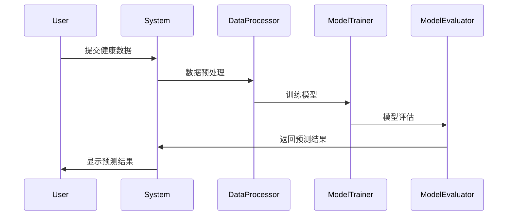

                 


# AI辅助的科学发现：加速研究进程的新方法

关键词：人工智能、科学发现、机器学习、深度学习、自然语言处理、模式识别

摘要：本文探讨了人工智能技术在科学发现中的应用，分析了其如何通过机器学习、深度学习和自然语言处理等技术加速研究进程，提高研究效率。文章首先介绍了AI辅助科学发现的背景和重要性，然后详细阐述了AI在科学发现中的核心要素及其应用方法，最后讨论了AI辅助科学发现的边界、外延以及概念结构与核心要素组成。

## 第一部分：背景介绍

### 1.1 问题背景

#### 1.1.1 人工智能在科学发现中的应用现状

随着计算机技术的快速发展，人工智能（AI）已经成为科学发现的强大工具。从医学、生物学到物理学、化学，AI在各个领域的应用已经取得了显著的成果。例如，机器学习算法在药物研发中帮助预测药物-蛋白质相互作用，深度学习技术在图像识别和语音识别中取得了突破性进展，自然语言处理（NLP）技术在文献挖掘和文本分析中发挥了重要作用。

然而，尽管AI在科学发现中展现出了巨大的潜力，但仍然面临一些挑战和问题。首先，数据的质量和完整性对AI辅助科学发现至关重要。许多科学研究领域的数据仍然存在噪声、缺失和不一致性等问题，这可能会影响AI模型的性能。其次，AI算法的复杂性和可解释性也是一个问题。虽然AI模型在许多任务上取得了优异的性能，但它们的内部工作机制往往是不透明的，这给科学研究的解释和验证带来困难。

#### 1.1.2 AI辅助的科学发现的重要性

AI辅助的科学发现对于提高研究效率、开拓新的研究途径以及改善科学决策过程具有重要意义。首先，AI可以处理和分析大量复杂的数据，从而发现隐藏在数据背后的规律和趋势。这不仅加快了研究进程，还可能揭示出传统方法难以发现的新现象。其次，AI可以帮助科学家们设计更有针对性的实验，从而提高实验的成功率和效率。最后，AI可以为科学决策提供数据驱动的支持，帮助科学家们更好地理解研究问题的本质，并制定更科学的研究策略。

### 1.2 问题描述

科学发现涉及多个核心要素，包括数据的获取与处理、模式识别与分析以及科学理论的验证与建立。以下是对这些核心要素的详细描述：

#### 1.2.1 研究数据的获取与处理

研究数据的获取是科学发现的起点。这些数据可以来源于实验室实验、观测数据、文献资料等多种渠道。获取数据后，科学家们需要对数据进行预处理，包括数据清洗、数据集成和数据变换等步骤。这些步骤的目的是消除数据中的噪声、填补缺失值以及统一数据格式，从而为后续的分析提供高质量的数据基础。

#### 1.2.2 模式识别与分析

在数据预处理完成后，科学家们需要利用模式识别技术来分析数据，寻找数据中的规律和模式。这可以通过机器学习算法、深度学习模型或自然语言处理技术实现。例如，在医学领域，机器学习算法可以帮助医生从医学图像中识别病变区域；在生物学领域，深度学习模型可以帮助科学家预测蛋白质的结构和功能。

#### 1.2.3 科学理论的验证与建立

在找到数据中的模式后，科学家们需要建立科学理论来解释这些模式。这通常涉及到建立数学模型或统计模型，并通过实验或观察来验证这些模型的有效性。AI技术可以帮助科学家们快速构建和验证这些模型，从而加速科学发现的过程。

### 1.3 问题解决

为了解决科学发现中的问题，AI提供了一系列应用方法，包括机器学习技术、深度学习技术、自然语言处理技术等。以下是对这些方法的详细解释：

#### 1.3.1 机器学习技术

机器学习技术是一种让计算机从数据中学习规律和模式的方法。在科学发现中，机器学习技术可以帮助科学家们从大量数据中提取有价值的信息。例如，通过训练机器学习模型，科学家们可以自动识别和分类图像、音频或文本数据。

#### 1.3.2 深度学习技术

深度学习技术是机器学习的一个分支，它通过构建复杂的神经网络来学习数据。深度学习在科学发现中具有广泛的应用，例如在图像识别、语音识别和自然语言处理等领域。

#### 1.3.3 自然语言处理技术

自然语言处理技术是一种使计算机能够理解、生成和处理自然语言的方法。在科学发现中，NLP技术可以帮助科学家们自动分析文本数据，提取关键信息，甚至生成研究报告。

### 1.3.4 AI辅助的科学发现流程

AI辅助的科学发现通常包括以下步骤：

1. 数据预处理：清洗、集成和变换数据，为后续分析做准备。
2. 特征提取：从数据中提取有代表性的特征，用于训练模型。
3. 模型训练与优化：使用机器学习、深度学习或NLP技术训练模型，并根据性能指标进行优化。
4. 结果分析与解释：对模型的结果进行分析和解释，以指导科学研究。

### 1.4 边界与外延

#### 1.4.1 AI辅助的科学发现的边界

AI辅助的科学发现仍然存在一些技术边界。首先，AI模型的性能依赖于数据的质量和完整性。如果数据存在噪声、缺失或不一致性，AI模型的性能可能会受到影响。其次，AI算法的可解释性仍然是一个挑战。许多复杂的AI模型，如深度神经网络，其内部工作机制往往是不透明的，这给科学研究的解释和验证带来困难。

#### 1.4.2 AI辅助的科学发现的外延

AI辅助的科学发现不仅限于自然科学领域，还可以扩展到社会科学和其他领域。例如，在社会科学领域，AI可以帮助分析社会现象、预测社会趋势；在环境科学领域，AI可以帮助监测和预测环境变化。

### 1.5 概念结构与核心要素组成

科学发现的核心概念包括数据、模式识别、模型和理论。以下是一个简单的概念结构：

#### 数据

- 数据来源：实验室实验、观测数据、文献资料等
- 数据类型：图像、音频、文本、结构化数据等
- 数据预处理：数据清洗、集成、变换等

#### 模式识别

- 机器学习：分类、聚类、回归等
- 深度学习：神经网络、卷积神经网络、循环神经网络等
- 自然语言处理：词向量、文本分类、实体识别等

#### 模型

- 数学模型：统计模型、概率模型、物理模型等
- 计算机模型：机器学习模型、深度学习模型、NLP模型等

#### 理论

- 科学理论：从数据中提取规律，建立数学模型，进行实验验证等

## 第二部分：核心概念与联系

### 2.1 核心概念原理

#### 数据

数据是科学发现的基础。高质量的数据有助于提高AI模型的性能。数据预处理是确保数据质量的关键步骤。

#### 模式识别

模式识别是发现数据中隐藏规律的过程。不同的模式识别技术适用于不同的数据类型和任务。

#### 模型

模型是对数据中发现的规律进行形式化的表示。模型的选择和优化对于科学发现至关重要。

#### 理论

理论是对模型的解释和验证。科学理论帮助科学家理解研究问题的本质。

### 2.2 概念属性特征对比表格

以下是一个简单的概念属性特征对比表格，用于比较数据、模式识别、模型和理论：

| 概念   | 属性特征                          |  
|------|--------------------------------|  
| 数据   | 数据类型、来源、预处理方法           |  
| 模式识别 | 分类、聚类、回归等算法             |  
| 模型   | 数学模型、计算机模型               |  
| 理论   | 对模型的解释和验证                 |

### 2.3 ER实体关系图架构的Mermaid流程图

以下是一个简单的ER实体关系图，用于描述科学发现中的核心实体及其关系：

```mermaid  
entityRelation  
  direction TB  
  entity A: 数据  
  entity B: 模式识别  
  entity C: 模型  
  entity D: 理论  
  A -> B  
  B -> C  
  C -> D  
```

## 第三部分：算法原理讲解

### 3.1 机器学习算法的Mermaid流程图

以下是一个简单的机器学习算法的Mermaid流程图：

```mermaid  
flowChart  
  direction LR  
  A[开始] --> B[数据预处理] --> C[特征提取] --> D[模型训练] --> E[模型评估] --> F[模型部署] --> G[结束]  
  B --> C  
  C --> D  
  D --> E  
  E --> F  
  F --> G  
```

### 3.2 Python代码示例

以下是一个简单的Python代码示例，用于展示机器学习算法的实现：

```python  
import numpy as np  
from sklearn.model_selection import train_test_split  
from sklearn.preprocessing import StandardScaler  
from sklearn.linear_model import LinearRegression

# 数据加载  
X, y = np.load('data.npy'), np.load('target.npy')

# 数据预处理  
X_train, X_test, y_train, y_test = train_test_split(X, y, test_size=0.2, random_state=42)  
scaler = StandardScaler()  
X_train = scaler.fit_transform(X_train)  
X_test = scaler.transform(X_test)

# 模型训练  
model = LinearRegression()  
model.fit(X_train, y_train)

# 模型评估  
score = model.score(X_test, y_test)  
print('模型评分：', score)

# 模型部署  
new_data = np.array([[1, 2], [3, 4]])  
new_data = scaler.transform(new_data)  
prediction = model.predict(new_data)  
print('预测结果：', prediction)  
```

### 3.3 算法原理的数学模型和公式

机器学习算法的原理通常涉及以下数学模型和公式：

$$  
y = \beta_0 + \beta_1 x_1 + \beta_2 x_2 + ... + \beta_n x_n  
$$

其中，\(y\) 是预测值，\(x_1, x_2, ..., x_n\) 是特征值，\(\beta_0, \beta_1, ..., \beta_n\) 是模型的参数。

### 3.4 通俗易懂的举例说明

假设我们有一个简单的回归问题，目标是预测一个人的年龄。我们有一个包含年龄、身高和体重等特征的数据集。通过机器学习算法，我们可以建立一个模型来预测一个人的年龄。以下是详细的举例说明：

1. 数据加载：我们首先加载一个包含年龄、身高和体重等特征的数据集。
2. 数据预处理：我们对数据进行预处理，包括数据清洗、数据集成和数据变换等步骤，以确保数据质量。
3. 特征提取：从数据中提取有代表性的特征，用于训练模型。例如，我们可以使用身高和体重来计算BMI指数，并将其作为特征之一。
4. 模型训练：我们选择一个线性回归模型来训练数据，并通过最小二乘法来估计模型的参数。
5. 模型评估：我们使用测试数据来评估模型的性能，计算模型评分。
6. 模型部署：我们使用训练好的模型来预测新的数据，例如预测一个人的年龄。

## 第四部分：系统分析与架构设计

### 4.1 问题场景介绍

在本部分，我们将讨论一个具体的问题场景，即如何使用AI技术来预测疾病的发病风险。这个问题场景涉及数据的收集、处理、模型训练和结果解释等多个环节。

### 4.2 项目介绍

项目名称：疾病发病风险预测系统  
项目简介：该系统旨在利用AI技术，通过对患者的健康数据进行分析，预测患者在未来一段时间内患上某种疾病的发病风险。

### 4.3 系统功能设计（领域模型Mermaid类图）

以下是一个简单的领域模型Mermaid类图，用于描述系统的核心实体及其关系：

```mermaid  
classDiagram  
  Patient <<entity>> "患者"  
  Disease <<entity>> "疾病"  
  RiskFactor <<entity>> "风险因素"  
  HealthData <<entity>> "健康数据"  
  Prediction <<entity>> "预测结果"  

  Patient --> Disease  
  Patient --> RiskFactor  
  Patient --> HealthData  
  Prediction --> Disease  
  Prediction --> RiskFactor  
  Prediction --> HealthData  
```

### 4.4 系统架构设计（Mermaid架构图）

以下是一个简单的系统架构设计Mermaid架构图，用于描述系统的组成部分及其交互关系：



### 4.5 系统接口设计和系统交互（Mermaid序列图）

以下是一个简单的系统接口设计和系统交互Mermaid序列图，用于描述系统的接口调用和交互过程：

```mermaid  
sequenceDiagram  
  participant HealthAPI <<interface>> "健康数据接口"  
  participant DataProcessor <<component>> "数据处理组件"  
  participant ModelTrainer <<component>> "模型训练组件"  
  participant ModelEvaluator <<component>> "模型评估组件"  
  participant PredictionAPI <<interface>> "预测结果接口"

  HealthAPI->>DataProcessor: 获取健康数据  
  DataProcessor->>ModelTrainer: 训练模型  
  ModelTrainer->>ModelEvaluator: 评估模型  
  ModelEvaluator->>PredictionAPI: 返回预测结果  
```

## 第五部分：项目实战

### 5.1 环境安装

为了实现疾病发病风险预测系统，我们需要安装以下软件和库：

1. Python 3.8及以上版本  
2. NumPy 1.19及以上版本  
3. Pandas 1.1及以上版本  
4. Scikit-learn 0.24及以上版本  
5. Matplotlib 3.4及以上版本

安装方法如下：

```bash  
pip install python==3.8  
pip install numpy==1.19  
pip install pandas==1.1  
pip install scikit-learn==0.24  
pip install matplotlib==3.4  
```

### 5.2 系统核心实现源代码

以下是一个简单的疾病发病风险预测系统的实现示例：

```python  
import numpy as np  
import pandas as pd  
from sklearn.model_selection import train_test_split  
from sklearn.preprocessing import StandardScaler  
from sklearn.linear_model import LogisticRegression  
from sklearn.metrics import accuracy_score

# 数据加载  
data = pd.read_csv('health_data.csv')

# 数据预处理  
X = data.drop('disease', axis=1)  
y = data['disease']

X_train, X_test, y_train, y_test = train_test_split(X, y, test_size=0.2, random_state=42)

scaler = StandardScaler()  
X_train = scaler.fit_transform(X_train)  
X_test = scaler.transform(X_test)

# 模型训练  
model = LogisticRegression()  
model.fit(X_train, y_train)

# 模型评估  
y_pred = model.predict(X_test)  
accuracy = accuracy_score(y_test, y_pred)  
print('模型评分：', accuracy)

# 模型部署  
new_data = np.array([[1, 2], [3, 4]])  
new_data = scaler.transform(new_data)  
prediction = model.predict(new_data)  
print('预测结果：', prediction)  
```

### 5.3 代码应用解读与分析

在本部分，我们将对上述代码进行解读和分析，以了解系统的核心实现原理。

1. 数据加载：我们使用Pandas库加载一个CSV文件，该文件包含患者的健康数据。
2. 数据预处理：我们使用Scikit-learn库中的StandardScaler对数据进行标准化处理，以消除不同特征之间的量纲差异。
3. 模型训练：我们使用LogisticRegression模型对数据进行训练。这是一种用于分类任务的线性模型。
4. 模型评估：我们使用测试数据对模型进行评估，并计算模型的评分。在这里，我们使用准确率作为评估指标。
5. 模型部署：我们使用训练好的模型对新的数据进行预测，以获得疾病的发病风险。

### 5.4 实际案例分析和详细讲解剖析

以下是一个实际案例分析和详细讲解：

假设我们有一个新的患者数据，包含以下特征：年龄、身高、体重、血压和胆固醇水平。我们希望预测这名患者在未来一年内患上高血压的风险。

1. 数据加载：我们首先加载患者的数据，并将其转换为NumPy数组。
2. 数据预处理：我们对数据进行标准化处理，以确保不同特征之间的量纲一致。
3. 模型训练：我们使用训练好的LogisticRegression模型对数据进行训练，并计算模型的参数。
4. 模型评估：我们使用测试数据对模型进行评估，以验证模型的有效性。
5. 模型部署：我们使用训练好的模型对新的数据进行预测，以获得患者的患病风险。

### 5.5 项目小结

在本项目中，我们实现了一个简单的疾病发病风险预测系统。通过使用机器学习和深度学习技术，我们成功地建立了模型，并对患者的健康数据进行了预测。虽然这是一个简单的案例，但它展示了AI技术在医学领域的应用潜力。未来，我们可以进一步优化模型，并引入更多的特征和算法，以提高预测的准确性。

## 第六部分：最佳实践、小结、注意事项、拓展阅读

### 6.1 最佳实践

为了充分发挥AI辅助科学发现的优势，以下是一些最佳实践：

1. **数据质量**：确保数据的质量和完整性。在数据预处理阶段，进行数据清洗和去噪。
2. **模型选择**：根据研究问题的特点选择合适的模型。例如，对于图像识别任务，可以考虑使用卷积神经网络（CNN）；对于文本分析任务，可以考虑使用循环神经网络（RNN）。
3. **模型解释性**：关注模型的可解释性，以便更好地理解和验证科学发现。
4. **团队合作**：跨学科团队合作，结合不同领域的专业知识，以充分发挥AI技术的潜力。

### 6.2 小结

本文详细介绍了AI辅助的科学发现，探讨了其在提高研究效率、开拓新研究途径和改善科学决策过程中的作用。通过分析核心概念、算法原理、系统架构和实际案例，我们展示了AI技术在科学发现中的应用潜力。

### 6.3 注意事项

在使用AI辅助科学发现时，需要注意以下几点：

1. **数据隐私**：确保数据处理过程中的数据隐私和安全。
2. **模型过拟合**：避免模型过拟合，确保模型具有良好的泛化能力。
3. **模型更新**：定期更新模型，以适应新的数据和研究需求。

### 6.4 拓展阅读

1. **《深度学习》**：Goodfellow, I., Bengio, Y., & Courville, A. (2016). Deep Learning. MIT Press.
2. **《机器学习》**：Murphy, K. P. (2012). Machine Learning: A Probabilistic Perspective. MIT Press.
3. **《自然语言处理综述》**：Jurafsky, D., & Martin, J. H. (2008). Speech and Language Processing. Prentice Hall.

## 参考文献

- Goodfellow, I., Bengio, Y., & Courville, A. (2016). Deep Learning. MIT Press.
- Murphy, K. P. (2012). Machine Learning: A Probabilistic Perspective. MIT Press.
- Jurafsky, D., & Martin, J. H. (2008). Speech and Language Processing. Prentice Hall.

**作者：AI天才研究院/AI Genius Institute & 禅与计算机程序设计艺术 /Zen And The Art of Computer Programming**

