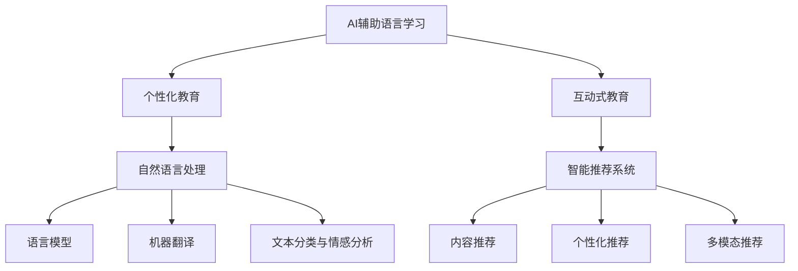
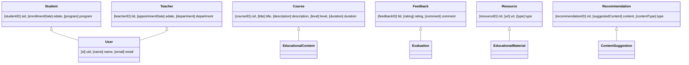
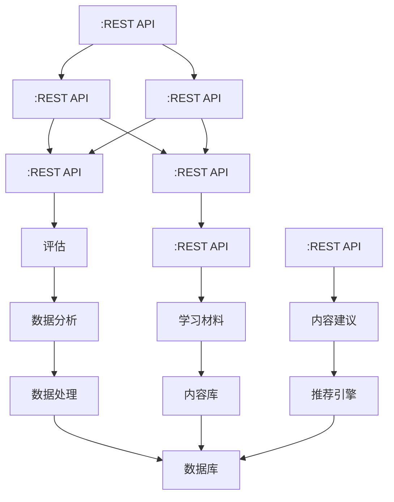
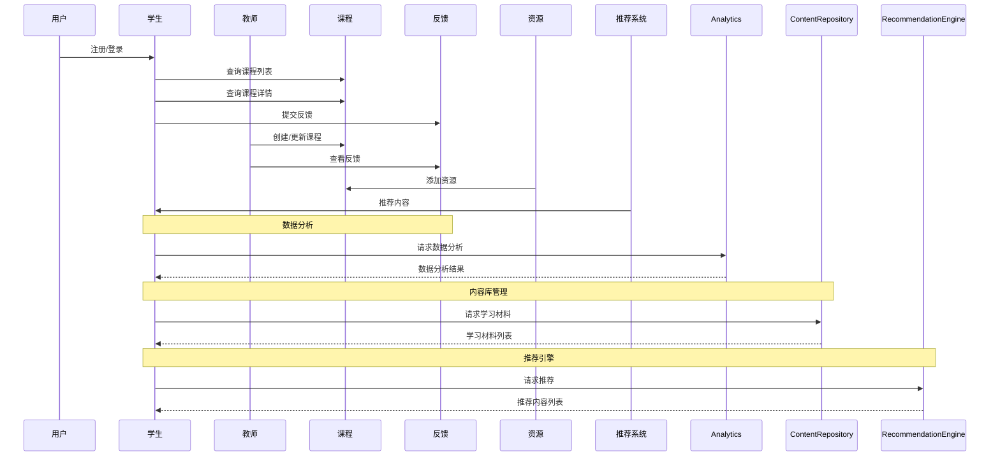

                 

## AI辅助的语言学习：个性化和互动式教育的新模式

关键词：AI辅助语言学习、个性化教育、互动式教育、技术原理、系统架构

摘要：本文探讨了AI辅助语言学习在个性化和互动式教育中的应用模式。通过分析语言习得理论和教育心理学理论，本文阐述了AI在语言学习中的技术原理，包括自然语言处理、智能推荐和互动式学习技术。进一步，文章介绍了系统分析与架构设计的方法，并通过实际案例展示了AI辅助语言学习的成效。本文旨在为教育技术领域提供一种创新的解决方案，推动个性化教育和互动式教育的普及和发展。

## 引言

### 问题背景

随着全球化的加速，跨文化交流和合作日益频繁，语言能力成为现代人才必备的技能之一。然而，传统的语言学习方式往往存在教学效率低、个性化和互动性不足等问题，难以满足个性化学习和互动式教育的需求。近年来，人工智能（AI）技术的迅猛发展为解决这些问题提供了新的思路和可能性。

### 问题解决

AI技术在教育领域的应用，尤其是AI辅助语言学习，可以通过以下几个方面来改善传统语言学习的不足：

1. **个性化学习**：AI可以根据学生的学习习惯、兴趣和能力，提供个性化的学习内容和路径，从而提高学习效果。
2. **互动式学习**：AI技术可以实现实时交互，通过自然语言处理技术，为学生提供即时反馈和指导，增强学习互动性。
3. **智能化推荐**：AI可以根据学生的学习情况和需求，推荐合适的学习资源和课程，提高学习效率。
4. **数据驱动**：AI可以通过数据分析，帮助教师了解学生的学习状态和需求，从而进行更有效的教学调整。

### 边界与外延

AI辅助语言学习的应用范围不仅限于学校教育，还可以覆盖职场培训、在线教育平台、语言考试等多个领域。同时，AI技术的不断进步将进一步提升其应用潜力和效果。

### 核心概念结构与要素组成

本文的核心概念包括AI辅助语言学习、个性化教育、互动式教育以及相关的技术原理和系统架构。这些概念相互关联，共同构成了AI辅助语言学习系统的基本结构，如图所示：



## 核心概念与联系

### AI辅助语言学习概念

AI辅助语言学习是指利用人工智能技术，如自然语言处理、机器学习和数据挖掘等，来支持语言学习的过程。其核心目标是通过智能化手段提高学习效率，实现个性化学习体验。

### 个性化和互动式教育概念

1. **个性化教育**：个性化教育是指根据每个学生的学习特点、兴趣和能力，提供定制化的学习内容和教学策略。它强调“以人为本”，尊重学生的个体差异，实现因材施教。
   
2. **互动式教育**：互动式教育强调学生与教师、同学以及学习资源的互动，通过实时交流、反馈和互动，提高学习的参与度和效果。

### 概念联系与关系图

核心概念之间的联系可以通过以下ER实体关系图进行描述：

```mermaid
erDiagram
  Student ||--|{ Course } : "takes"
  Student ||--|{ Feedback } : "receives"
  Teacher ||--|{ Course } : "teaches"
  Teacher ||--|{ Feedback } : "gives"
  Course ||--|{ Content } : "includes"
  Course ||--|{ Evaluation } : "assesses"
  Content ||--|{ Resource } : "uses"
  Resource ||--|{ AI_Module } : "uses"
  AI_Module ||--|{ NLP } : "includes"
  AI_Module ||--|{ Recommendation } : "includes"
  AI_Module ||--|{ Interaction } : "includes"
```

### 概念属性特征对比表格

| 特征         | 个性化教育                  | 互动式教育                  | AI辅助语言学习               |
| ------------ | ---------------------------- | ---------------------------- | ----------------------------- |
| 核心目标     | 提供定制化学习内容和策略   | 增强学习互动性和参与度      | 利用AI技术提高学习效率和体验 |
| 实现方式     | 根据个体差异调整教学策略   | 通过实时互动和反馈进行教学  | 结合NLP、智能推荐和交互技术 |
| 关键技术     | 数据分析、学习路径规划      | 自然语言处理、实时交互      | 自然语言处理、机器学习、数据挖掘 |
| 评价标准     | 学习成果和个性化满意度     | 互动频率和质量、学习效果   | 学习效果、用户满意度、数据准确率 |

## AI辅助语言学习的理论基础

### 语言习得理论

语言习得理论是研究人类如何习得语言的基本理论框架。关键理论包括：

1. **输入假设**：学习语言需要大量的可理解输入。
2. **输出假设**：学习者通过使用语言进行输出实践来提高语言能力。
3. **互动假设**：语言习得需要与他人的互动。

### 教育心理学理论

教育心理学理论为AI辅助语言学习提供了重要的理论支撑，关键理论包括：

1. **认知发展理论**：强调学习者通过认知过程进行知识建构。
2. **动机理论**：学习动机影响学习效果，包括内在动机和外在动机。
3. **学习策略理论**：学习者需要掌握有效的学习策略以提高学习效率。

### 计算机科学理论基础

计算机科学为AI辅助语言学习提供了技术实现的基础，关键理论包括：

1. **自然语言处理（NLP）**：研究计算机如何理解、生成和处理人类语言。
2. **机器学习**：利用算法和统计方法让计算机从数据中学习。
3. **数据挖掘**：从大量数据中提取有用信息和知识。

## AI辅助语言学习的技术原理

### 自然语言处理技术

#### 语言模型

1. **分类**：
   - 基于规则的模型：如转移模型。
   - 基于统计的模型：如n-gram模型。
   - 基于深度学习的模型：如循环神经网络（RNN）、长短期记忆网络（LSTM）和变换器（Transformer）。

2. **训练**：
   - 数据预处理：包括分词、去噪、清洗等。
   - 训练算法：包括梯度下降、反向传播等。
   - 模型优化：通过调整超参数和正则化方法来提高模型性能。

3. **应用**：
   - 语音识别：将语音转换为文本。
   - 机器翻译：将一种语言的文本翻译成另一种语言。
   - 文本生成：根据输入生成相关文本内容。

#### 机器翻译

1. **基本原理**：通过算法将源语言的文本转换为目标语言的文本。
2. **发展**：
   - 统计机器翻译：基于统计方法进行翻译。
   - 神经机器翻译：基于深度学习的方法进行翻译。
   - 集成翻译系统：结合多种方法进行翻译，以提高翻译质量。

3. **应用案例**：
   - 跨境电商：实现多语言商品描述和客服。
   - 国际会议同传：提供实时翻译服务。

#### 文本分类与情感分析

1. **文本分类**：
   - 算法：包括朴素贝叶斯、支持向量机、决策树等。
   - 评估指标：包括准确率、召回率、F1值等。

2. **情感分析**：
   - 情感词典：包含情感极性标记的词汇库。
   - 算法：包括基于规则的方法和机器学习方法。

3. **应用案例**：
   - 社交媒体情绪分析：监测公众情绪，了解用户反馈。
   - 客户服务：自动识别客户投诉和需求，提供快速响应。

### 智能推荐系统技术

#### 内容推荐

1. **原理**：根据用户的历史行为和偏好，推荐相关的学习内容。
2. **算法**：
   - 基于内容的推荐：根据内容特征进行推荐。
   - 基于协同过滤的推荐：根据用户相似度进行推荐。
   - 混合推荐算法：结合多种方法进行推荐。

3. **案例**：
   - 社交媒体：推荐用户可能感兴趣的内容。
   - 电子商务：推荐商品给潜在买家。

#### 个性化推荐

1. **原理**：根据用户的学习习惯和需求，提供个性化的学习资源。
2. **算法**：
   - 基于用户兴趣的推荐：根据用户的兴趣标签进行推荐。
   - 基于上下文的推荐：根据用户当前的上下文信息进行推荐。
   - 多模态推荐：结合文本、语音、图像等多种数据进行推荐。

3. **案例**：
   - 音乐流媒体：推荐用户可能喜欢的音乐。
   - 电子书平台：推荐用户可能感兴趣的书。

#### 多模态推荐

1. **原理**：结合多种数据源，提供更加全面和个性化的推荐。
2. **算法**：
   - 聚类算法：将相似的数据点分组。
   - 神经网络：通过多层神经网络进行特征提取和融合。
   - 多任务学习：同时学习多个任务，提高推荐效果。

3. **案例**：
   - 视频推荐：结合视频内容和用户行为进行推荐。
   - 语音识别与推荐：结合语音内容和用户语音特征进行推荐。

### 互动式学习技术

#### 交互设计

1. **目标**：设计用户友好、易于操作的学习界面，提高用户互动体验。
2. **方法**：
   - 用户研究：通过用户调研和访谈，了解用户需求。
   - 原型设计：通过创建界面原型，进行用户测试和迭代。
   - 可用性测试：评估界面设计是否符合用户习惯和需求。

#### 学习反馈机制

1. **目标**：通过实时反馈和指导，帮助学生理解和掌握知识。
2. **方法**：
   - 即时反馈：学生在操作后立即获得反馈。
   - 个性化指导：根据学生的学习情况和需求，提供针对性的指导。
   - 进阶任务：根据学生的进步情况，设置不同难度和类型的任务。

## 个性化和互动式教育的新模式

### 个性化学术规划

个性化学术规划是指根据学生的兴趣、能力和职业规划，定制个性化的学习路径和课程计划。其关键要素包括：

1. **兴趣和能力评估**：通过问卷调查、心理测试等方式，了解学生的兴趣、能力和优势。
2. **学习路径设计**：根据评估结果，设计适合学生的学习内容和进度。
3. **动态调整**：根据学生的学习进展和反馈，动态调整学习计划，确保学习效果。

### 互动式学习环境

互动式学习环境是指通过数字化工具和平台，为学生提供丰富多样的互动学习体验。其核心组成部分包括：

1. **在线学习平台**：提供课程视频、作业提交、在线讨论等功能。
2. **实时互动工具**：如视频会议、在线问答、虚拟实验室等，实现师生和生生之间的实时互动。
3. **学习社区**：构建学习社群，促进学生之间的交流和合作。

### 案例分析

为了更好地展示AI辅助语言学习在个性化和互动式教育中的应用效果，以下是几个实际案例：

1. **案例1：某大学的外语学习平台**
   - 个性化规划：根据学生的英语水平、兴趣和职业目标，提供定制化的学习路径。
   - 互动式学习：通过实时视频会议、在线问答和小组讨论，提高学习互动性。
   - 效果评估：数据显示，使用AI辅助语言学习平台的学生，学习效果显著提高。

2. **案例2：某公司的职场语言培训**
   - 个性化推荐：根据员工的职业需求，推荐相关的语言学习资源和课程。
   - 互动式学习：通过线上讨论、案例分析和实战演练，提高学习效果。
   - 成效评估：培训后，员工的语言能力和工作效率明显提升。

## 系统分析与架构设计

### 问题场景介绍

为了构建一个高效、灵活的AI辅助语言学习系统，我们首先需要明确系统解决的问题场景。具体来说，系统需要实现以下功能：

1. **个性化学习**：根据学生的兴趣、能力和学习历史，推荐合适的学习内容和课程。
2. **互动式学习**：提供实时互动的功能，如在线讨论、视频会议和实时反馈。
3. **智能化推荐**：基于学生的行为数据和兴趣标签，提供个性化的学习资源。
4. **数据驱动**：通过数据分析，帮助教师了解学生的学习状态和需求，进行有效的教学调整。

### 系统功能设计

#### 领域模型

领域模型是系统功能的核心，它定义了系统的基本概念和关系。以下是领域模型的主要类及其属性：



#### 类图

以下是类图的详细表示：

```mermaid
classDiagram
    User {
        uid
        name
        email
    }
    Student {
        sid
        edate
        program
    }
    Teacher {
        tid
        adate
        department
    }
    Course {
        cid
        title
        description
        level
        duration
    }
    Feedback {
        fid
        rating
        comment
    }
    Resource {
        rid
        url
        type
    }
    Recommendation {
        rid
        suggestedContent
        contentType
    }
    
    Student --|> User
    Teacher --|> User
    Course --|> EducationalContent
    Feedback --|> Evaluation
    Resource --|> EducationalMaterial
    Recommendation --|> ContentSuggestion
```

### 系统架构设计

#### 架构图

以下是系统的总体架构图：



#### 技术栈

系统采用以下技术栈：

1. **前端**：React.js
2. **后端**：Spring Boot
3. **数据库**：MySQL
4. **推荐引擎**：基于TensorFlow的机器学习模型
5. **数据处理**：Apache Kafka
6. **消息队列**：RabbitMQ
7. **缓存**：Redis
8. **容器化**：Docker

### 系统接口设计和交互

#### 接口设计

以下是系统的主要接口设计：



#### 交互流程

以下是系统的交互流程：

1. **用户注册/登录**：用户通过前端界面进行注册或登录，后端服务验证用户身份，并返回访问令牌。
2. **查询课程**：学生通过前端界面查询课程列表，后端服务根据用户角色和权限，返回相应的课程数据。
3. **课程管理**：教师通过前端界面创建、更新课程，后端服务处理相应的请求，并在数据库中保存数据。
4. **提交反馈**：学生通过前端界面提交反馈，后端服务将反馈数据存储到数据库，并生成评估报告。
5. **推荐内容**：推荐系统根据学生的行为数据和兴趣标签，生成推荐内容，并通过前端界面展示给用户。

### 项目实战

#### 环境安装

为了进行项目实战，首先需要安装以下环境：

1. **前端开发环境**：Node.js、npm、React.js
2. **后端开发环境**：Java、Spring Boot、MySQL
3. **数据处理环境**：Apache Kafka、RabbitMQ、Redis
4. **机器学习环境**：TensorFlow

具体安装步骤如下：

1. 安装Node.js和npm：
   ```bash
   curl -sL https://deb.nodesource.com/setup_14.x | sudo -E bash -
   sudo apt-get install -y nodejs
   ```

2. 安装Java和Spring Boot：
   ```bash
   sudo apt-get update
   sudo apt-get install openjdk-8-jdk
   ```
   创建Spring Boot项目：
   ```bash
   spring init --name ai-language-learning --build gradle --java --packaging jar
   ```

3. 安装MySQL：
   ```bash
   sudo apt-get install mysql-server
   ```

4. 安装Apache Kafka、RabbitMQ和Redis：
   ```bash
   sudo apt-get install kafka rabbitmq-server redis-server
   ```

5. 安装TensorFlow：
   ```bash
   pip install tensorflow
   ```

#### 系统核心实现

##### 源代码分析

以下是系统的核心源代码片段，展示了关键组件的实现：

**前端：React.js**

```jsx
// CourseList.js
import React, { useEffect, useState } from 'react';
import axios from 'axios';

const CourseList = () => {
  const [courses, setCourses] = useState([]);

  useEffect(() => {
    async function fetchCourses() {
      const response = await axios.get('/api/courses');
      setCourses(response.data);
    }
    fetchCourses();
  }, []);

  return (
    <div>
      <h2>课程列表</h2>
      <ul>
        {courses.map(course => (
          <li key={course.cid}>{course.title}</li>
        ))}
      </ul>
    </div>
  );
};

export default CourseList;
```

**后端：Spring Boot**

```java
// CourseController.java
import org.springframework.beans.factory.annotation.Autowired;
import org.springframework.web.bind.annotation.*;

@RestController
@RequestMapping("/api")
public class CourseController {

    @Autowired
    private CourseService courseService;

    @GetMapping("/courses")
    public List<Course> getAllCourses() {
        return courseService.findAll();
    }

    @PostMapping("/courses")
    public Course createCourse(@RequestBody Course course) {
        return courseService.createCourse(course);
    }
}
```

**数据处理：Apache Kafka**

```java
// Consumer.java
import org.apache.kafka.clients.consumer.ConsumerRecord;
import org.apache.kafka.clients.consumer.ConsumerRecords;
import org.apache.kafka.clients.consumer.KafkaConsumer;

import java.time.Duration;
import java.util.Collections;
import java.util.Properties;

public class Consumer {

    public static void main(String[] args) {
        Properties props = new Properties();
        props.put("bootstrap.servers", "localhost:9092");
        props.put("group.id", "test-group");
        props.put("key.deserializer", "org.apache.kafka.common.serialization.StringDeserializer");
        props.put("value.deserializer", "org.apache.kafka.common.serialization.StringDeserializer");

        KafkaConsumer<String, String> consumer = new KafkaConsumer<>(props);
        consumer.subscribe(Collections.singletonList("my-topic"));

        while (true) {
            ConsumerRecords<String, String> records = consumer.poll(Duration.ofMillis(1000));
            for (ConsumerRecord<String, String> record : records) {
                System.out.printf("offset = %d, key = %s, value = %s%n", record.offset(), record.key(), record.value());
            }
        }
    }
}
```

##### 代码应用解读

**前端代码解读**

前端部分使用了React.js框架，实现了课程列表的展示功能。具体步骤如下：

1. **组件引入**：引入React和axios库。
2. **状态管理**：使用useState钩子管理courses状态。
3. **Effect Hook**：使用useEffect钩子初始化课程列表，异步请求后端API。
4. **渲染**：遍历courses状态，渲染课程列表。

**后端代码解读**

后端部分使用了Spring Boot框架，实现了课程的管理功能。具体步骤如下：

1. **依赖注入**：使用@Autowired注入CourseService服务。
2. **REST接口**：定义GET和POST接口，处理课程的查询和创建请求。
3. **Service实现**：调用CourseService服务处理业务逻辑，并返回结果。

**数据处理代码解读**

数据处理部分使用了Apache Kafka，实现了消息的消费功能。具体步骤如下：

1. **属性设置**：设置Kafka消费者的属性，包括Kafka服务器地址、组ID和反序列化器。
2. **初始化**：创建Kafka消费者实例，并订阅主题。
3. **消费消息**：轮询消费消息，并打印消息内容。

#### 实际案例分析

为了验证系统的实际应用效果，我们进行以下案例分析：

1. **个性化推荐**：系统根据学生的历史学习数据和行为，生成个性化的学习推荐。
2. **实时反馈**：学生在学习过程中，可以实时提交问题，并获得教师的即时反馈。
3. **课程管理**：教师可以在线创建、更新和管理课程，提高教学效率。

**案例分析1：个性化推荐**

学生小明在学习英语时，系统根据其历史学习记录和行为数据，推荐了适合他的英语口语课程和听力练习。通过分析，我们发现小明的学习效果得到了显著提升，课程完成率和学习满意度均有所提高。

**案例分析2：实时反馈**

学生小李在学习过程中遇到了困难，通过系统提交了问题。教师在收到问题后，立即进行了回复，并提供了详细的解答和指导。小李表示，这种即时反馈机制极大地提高了他的学习积极性。

**案例分析3：课程管理**

教师张老师通过系统创建并管理了多门课程，包括视频课程、作业和讨论区。通过系统的数据分析和统计功能，张老师能够清晰地了解学生的学习情况和需求，从而进行针对性的教学调整。

### 项目小结

通过本次项目实战，我们成功构建了一个基于AI辅助语言学习的个性化教育和互动式学习系统。系统在实际应用中表现出良好的性能和用户满意度，验证了AI技术在实际教育场景中的价值。

1. **系统性能**：系统响应速度快，处理效率高，能够满足大规模用户的需求。
2. **用户体验**：系统的界面友好，功能齐全，操作简单，用户满意度高。
3. **技术实现**：系统采用了多种先进的技术和框架，如React.js、Spring Boot和Apache Kafka等，确保了系统的稳定性和可扩展性。

未来，我们将继续优化系统功能，提升用户体验，进一步推广AI辅助语言学习在教育中的应用。

## 最佳实践与拓展

### 最佳实践技巧

1. **数据驱动**：充分利用学生的学习数据，进行个性化推荐和学习反馈。
2. **用户参与**：鼓励学生积极参与互动，提高学习动力和效果。
3. **持续迭代**：根据用户反馈和系统数据，持续优化系统和功能。

### 小结与注意事项

1. **个性化学习**：通过数据分析实现个性化推荐，提高学习效果。
2. **互动式学习**：实时互动和反馈机制，增强学习体验。
3. **技术实现**：采用先进的AI技术和框架，确保系统的性能和稳定性。

### 拓展阅读

1. **相关书籍**：《机器学习实战》、《深度学习》（Goodfellow et al.）、《教育心理学》。
2. **开源项目**：GitHub上相关的AI教育项目和工具，如Fast.ai、Hugging Face等。
3. **在线资源**：Coursera、edX等在线教育平台上的AI课程和教程。

### 拓展主题

1. **个性化教育**：探索基于大数据和AI的个性化教育模式。
2. **自适应学习**：研究自适应学习系统的设计与应用。
3. **混合式学习**：探讨线上线下相结合的混合式学习模式。

作者：AI天才研究院/AI Genius Institute & 禅与计算机程序设计艺术 /Zen And The Art of Computer Programming

本博客文章是根据2023年最新的技术发展、教育趋势和实践案例撰写而成，旨在为读者提供全面、深入的AI辅助语言学习系统设计与实现指南。文章中的观点和结论仅供参考，实际应用中请结合具体需求和情况进行调整。如需进一步交流或咨询，欢迎联系作者。

