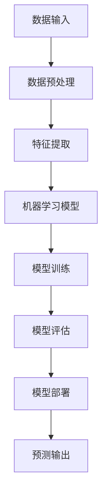
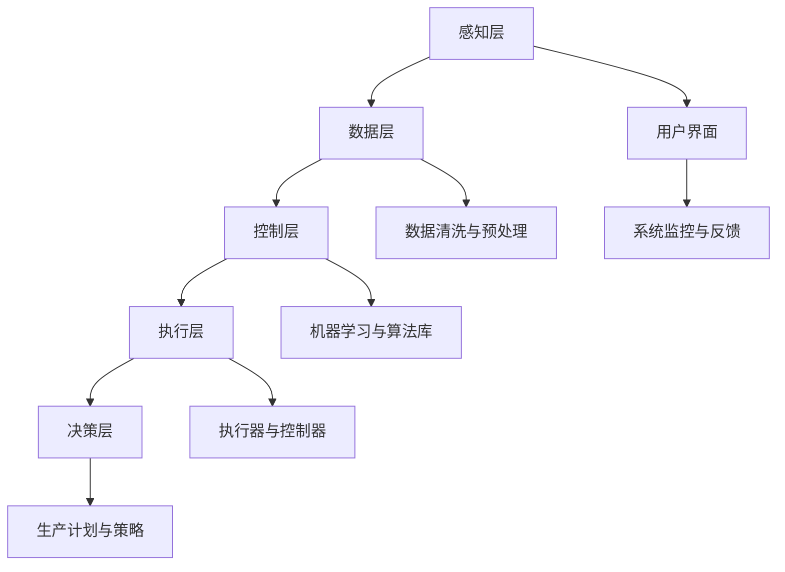

                 

# AI驱动的智能制造：工业4.0的核心技术

## 关键词
- AI驱动的智能制造
- 工业革命4.0
- 智能制造系统
- 人工智能算法
- 制造业数字化转型

## 摘要
随着人工智能技术的飞速发展，智能制造正逐步成为工业4.0的核心驱动力。本文将从背景介绍、核心AI技术、AI在制造业的应用、智能制造系统设计、挑战与解决方案及未来趋势等多个方面，深入探讨AI驱动的智能制造在工业4.0中的关键技术。通过详细的分析与实例讲解，本文旨在为读者提供一幅全面而清晰的智能制造蓝图。

## 目录

----------------------------------------------------------------

### I. 引言

#### 1.1 智能制造的概念与背景

#### 1.2 工业革命4.0概述

#### 1.3 AI在工业4.0中的重要性

### II. 核心AI技术与理论

#### 2.1 AI基本概念

#### 2.2 关键AI算法

#### 2.3 AI组件的互动关系图

### III. AI在制造业中的应用

#### 3.1 AI在智能生产系统中的应用

#### 3.2 生产线优化中的AI算法分析

### IV. 智能制造系统的设计与实现

#### 4.1 智能制造系统概述

#### 4.2 系统架构设计

#### 4.3 智能制造系统案例研究

### V. 挑战与解决方案

#### 5.1 挑战分析

#### 5.2 解决策略

### VI. 未来趋势与方向

#### 6.1 未来发展趋势

#### 6.2 对制造业的影响

### VII. 结论

#### 7.1 总结

#### 7.2 对未来智能制造的展望

### 附录

#### A. 相关资源与工具

#### B. 术语解释与拓展阅读

----------------------------------------------------------------

### I. 引言

#### 1.1 智能制造的概念与背景

智能制造（Intelligent Manufacturing）是指利用人工智能、大数据、物联网、云计算等现代信息技术，实现制造过程智能化、产品个性化、服务智慧化的一种新型制造模式。智能制造的目标是通过信息的深度挖掘和智能技术的集成应用，提高制造业的生产效率、降低成本、提升产品质量和创新能力。

智能制造的概念可以追溯到20世纪末，当时主要集中于自动化技术的应用。随着互联网的普及和信息技术的飞速发展，智能制造逐渐演变为一个涵盖多学科的综合性领域。它不仅包括了传统的自动化技术，还融入了人工智能、物联网、大数据等前沿技术。

工业革命4.0，也称为第四次工业革命，是继机械化、电气化、自动化之后的又一次工业变革。工业革命4.0的核心特征是利用智能技术实现制造业的数字化、网络化和智能化。这一变革将推动制造业向高度灵活的个性化生产模式转变，实现生产过程的全面优化和升级。

#### 1.2 工业革命4.0概述

工业革命4.0的核心理念是利用智能技术实现制造过程的全面数字化。它主要包括以下几个方面：

1. **数字化双胞胎（Digital Twin）**：通过虚拟模型模拟现实物理系统，实现实时监控和预测性维护。
2. **云计算与大数据**：通过云计算平台存储和处理海量数据，实现数据的快速分析和利用。
3. **物联网（IoT）**：通过物联网技术实现设备和系统的互联互通，提高生产效率和资源利用率。
4. **人工智能**：利用人工智能技术实现制造过程的自动化、智能化和个性化。
5. **网络安全**：确保数字化制造过程中的信息安全，防止数据泄露和网络攻击。

#### 1.3 AI在工业4.0中的重要性

人工智能作为工业革命4.0的核心驱动力，发挥着至关重要的作用。以下是AI在工业4.0中的一些关键应用：

1. **生产优化**：通过机器学习算法优化生产流程，提高生产效率和产品质量。
2. **质量管理**：利用图像识别和自然语言处理技术，实现产品质量的自动检测和分析。
3. **预测性维护**：通过数据分析和机器学习预测设备故障，实现预防性维护。
4. **供应链管理**：利用人工智能优化供应链流程，降低库存成本和物流成本。
5. **个性化定制**：通过数据分析和机器学习，实现产品的个性化定制。

总之，AI驱动的智能制造是工业4.0不可或缺的组成部分，它将引领制造业进入一个全新的智能化时代。在接下来的章节中，我们将进一步探讨AI技术的核心原理、应用场景及智能制造系统的设计与实现。

### II. 核心AI技术与理论

#### 2.1 AI基本概念

人工智能（Artificial Intelligence，简称AI）是指通过计算机模拟人类智能行为的技术。它涵盖了多个领域，包括机器学习、深度学习、自然语言处理、计算机视觉等。AI的核心目标是使计算机具备类似人类的感知、推理、学习和决策能力。

- **机器学习（Machine Learning）**：通过算法从数据中学习规律和模式，使计算机能够进行预测和决策。
- **深度学习（Deep Learning）**：一种特殊的机器学习技术，通过构建深度神经网络，实现图像识别、语音识别等复杂任务。
- **自然语言处理（Natural Language Processing，NLP）**：使计算机理解和生成人类语言的技术，应用于机器翻译、语音识别、情感分析等。
- **计算机视觉（Computer Vision）**：使计算机能够理解和解释视觉信息，应用于图像识别、目标检测、人脸识别等。

#### 2.2 关键AI算法

在AI领域中，以下算法是最为关键的：

- **决策树（Decision Tree）**：一种用于分类和回归分析的算法，通过一系列条件判断，将数据划分为不同的类别或数值。
- **支持向量机（Support Vector Machine，SVM）**：一种用于分类问题的算法，通过寻找最优超平面，将不同类别的数据分开。
- **神经网络（Neural Network）**：一种模拟生物神经系统的计算模型，通过多层神经元实现数据的变换和决策。
- **随机森林（Random Forest）**：一种基于决策树的集成学习方法，通过构建多个决策树，进行投票或平均，提高预测精度。

#### 2.3 AI组件的互动关系图

为了更好地理解AI组件之间的互动关系，我们可以使用Mermaid绘制一个简化的AI系统架构图：

在这个简化的系统中，数据输入经过预处理和特征提取后，输入到机器学习模型中进行训练。训练完成后，模型进行评估，并根据评估结果进行部署，最终用于产生预测输出。

### III. AI在制造业中的应用

#### 3.1 AI在智能生产系统中的应用

智能生产系统是AI技术在制造业中最为广泛的应用领域之一。它利用AI技术实现生产过程的自动化、智能化和高效化。以下是AI在智能生产系统中的几个主要应用场景：

1. **生产过程优化**：通过机器学习和数据分析，优化生产流程，减少浪费，提高生产效率。例如，通过分析历史生产数据，预测生产瓶颈，并调整生产计划，以最大化生产效率。

2. **设备预测性维护**：利用物联网和机器学习技术，对设备进行实时监控和数据分析，预测设备故障，实现预防性维护，减少停机时间和维护成本。

3. **产品质量检测**：利用计算机视觉技术，对产品进行自动检测和分析，识别缺陷和异常，确保产品质量。

4. **生产计划优化**：通过大数据分析和机器学习算法，优化生产计划，降低库存成本和物流成本，提高供应链效率。

#### 3.2 生产线优化中的AI算法分析

在生产线优化中，AI算法发挥着关键作用。以下是对几种主要算法的应用分析：

1. **线性回归（Linear Regression）**：线性回归是一种用于预测数值的算法，通过分析历史数据，建立生产效率与生产参数之间的关系模型。例如，通过分析生产节拍、设备利用率等参数，预测生产效率，并优化生产计划。

2. **决策树（Decision Tree）**：决策树用于分类和回归分析，可以用于生产线的故障诊断和优化。例如，通过构建决策树模型，分析生产过程中的关键参数，识别故障原因，并提出优化建议。

3. **随机森林（Random Forest）**：随机森林是一种基于决策树的集成学习方法，可以提高预测精度和泛化能力。在生产线优化中，随机森林可以用于生产计划优化、库存管理等领域。

4. **神经网络（Neural Network）**：神经网络通过多层神经元实现数据的变换和决策，可以用于复杂的生产过程优化任务。例如，通过构建深度神经网络模型，分析生产过程中的动态数据，实现实时优化。

总之，AI技术在智能生产系统中的应用，可以显著提高生产效率、降低成本、提升产品质量。在接下来的章节中，我们将进一步探讨智能制造系统的设计与实现。

### IV. 智能制造系统的设计与实现

#### 4.1 智能制造系统概述

智能制造系统（Intelligent Manufacturing System，IMS）是一种集成了人工智能、物联网、大数据等先进技术的制造系统，旨在实现生产过程的智能化、高效化和自动化。智能制造系统通常包括以下几个核心组成部分：

1. **感知层**：通过传感器和物联网设备，实时采集生产过程中的各种数据，如温度、湿度、压力、速度等。

2. **数据层**：数据层负责存储和管理感知层收集的数据，包括历史数据和实时数据。数据层通常基于云计算平台，实现数据的高效存储、管理和分析。

3. **控制层**：控制层通过机器学习和人工智能算法，对采集到的数据进行实时分析和处理，生成优化建议和决策。控制层通常包括智能控制器、智能执行器等硬件设备。

4. **执行层**：执行层负责将控制层的决策转化为具体的操作，如调整生产参数、控制设备运行等。执行层通常包括各种自动化设备，如数控机床、机器人等。

5. **决策层**：决策层负责制定长期的生产计划、策略和优化目标。决策层通常基于大数据分析和机器学习算法，对生产过程进行全局优化。

#### 4.2 系统架构设计

智能制造系统的架构设计是确保系统稳定运行和高性能的关键。以下是智能制造系统的典型架构设计：

在这个架构中，感知层负责实时采集生产数据，数据层负责存储和管理数据，控制层通过机器学习和人工智能算法对数据进行处理，执行层负责执行控制层的决策，决策层负责制定生产计划和策略，用户界面则用于系统监控和用户交互。

#### 4.3 智能制造系统案例研究

以下是一个智能制造系统案例研究，介绍一个基于AI技术的生产线优化系统。

**项目背景**：

某汽车制造企业希望提高生产线效率，降低生产成本。现有生产线上存在以下几个问题：

1. 生产节拍不稳定，导致生产效率低下。
2. 设备故障频发，影响生产连续性。
3. 库存管理不善，导致库存成本过高。

**系统功能设计**：

1. **生产节拍优化**：通过机器学习算法，分析生产数据，预测生产节拍，并优化生产计划，提高生产效率。

2. **设备预测性维护**：通过物联网和机器学习技术，实时监控设备状态，预测设备故障，实现预防性维护。

3. **库存管理优化**：通过大数据分析，优化库存管理策略，降低库存成本和物流成本。

**系统架构设计**：

1. **感知层**：安装传感器和物联网设备，实时采集生产过程中的各种数据，如温度、湿度、速度等。

2. **数据层**：使用云计算平台，存储和管理感知层收集的数据。

3. **控制层**：部署机器学习算法库，对采集到的数据进行实时分析和处理，生成优化建议。

4. **执行层**：根据控制层的决策，调整生产参数和控制设备运行。

5. **决策层**：基于大数据分析和机器学习算法，制定长期的生产计划和策略。

**系统接口设计和系统交互**：

在这个系统中，感知层通过传感器实时采集生产数据，数据层使用云计算平台存储和管理数据，控制层通过机器学习算法对数据进行处理，执行层根据控制层的决策执行操作，决策层制定生产计划和策略，用户界面用于系统监控和用户交互。

通过该系统的实施，汽车制造企业的生产线效率显著提高，设备故障率降低，库存成本下降，实现了生产过程的全面优化和升级。

### V. 挑战与解决方案

#### 5.1 挑战分析

尽管AI驱动的智能制造为制造业带来了巨大的变革和机遇，但在实际应用过程中仍面临诸多挑战：

1. **技术难题**：AI技术本身具有一定的复杂性，特别是在处理大规模数据和实现高精度预测方面。此外，深度学习算法的训练过程需要大量的计算资源和时间。

2. **数据隐私与安全**：智能制造系统需要收集和处理大量的生产数据，这些数据往往涉及企业的核心商业秘密。如何确保数据隐私和安全，防止数据泄露，是制造商面临的重要问题。

3. **人才短缺**：AI驱动的智能制造需要具备多学科交叉知识的人才，如数据科学家、机器学习工程师、自动化工程师等。然而，目前相关人才相对短缺，企业面临较大的招聘压力。

4. **系统集成与兼容性**：智能制造系统通常需要集成多种不同的硬件和软件，如传感器、控制器、数据库等。如何实现各系统的无缝集成和兼容，是制造商需要解决的难题。

5. **法规与标准**：智能制造涉及多个领域，如工业、信息、通信等，不同领域可能存在不同的法规和标准。如何满足各种法规和标准要求，是企业需要面对的挑战。

#### 5.2 解决策略

针对上述挑战，以下是一些可能的解决策略：

1. **技术攻关**：加强AI技术研发，特别是在数据预处理、模型优化、算法创新等方面。同时，加大计算资源投入，提高算法训练和推理效率。

2. **数据隐私保护**：采用加密、脱敏等技术，确保数据在传输和存储过程中的安全性。建立数据使用协议和隐私保护机制，规范数据的使用和管理。

3. **人才培养**：加强校企合作，培养具备多学科交叉知识的人才。同时，通过内部培训、人才引进等方式，提升现有员工的技术水平。

4. **系统集成**：采用模块化设计思想，实现各系统的功能分离和模块化集成。通过标准接口和协议，实现不同系统和设备之间的无缝交互。

5. **法规与标准**：积极参与相关法规和标准的制定，确保企业的产品和业务符合法规要求。同时，主动适应和遵循行业标准和规范，提高企业的市场竞争力。

通过上述策略，企业可以更好地应对AI驱动的智能制造过程中的挑战，实现智能制造的全面升级和持续发展。

### VI. 未来趋势与方向

#### 6.1 未来发展趋势

随着人工智能技术的不断进步，AI驱动的智能制造在未来有望呈现出以下发展趋势：

1. **智能化程度进一步提升**：未来智能制造系统将更加智能化，具备更高的自主决策能力。通过深度学习和强化学习等技术，智能制造系统能够更好地理解和适应复杂的生产环境。

2. **个性化定制**：随着消费需求的多样化，智能制造将更加注重个性化定制。通过大数据分析和人工智能算法，企业能够实现产品的个性化设计、生产和交付。

3. **边缘计算与云计算的融合**：边缘计算和云计算的融合将提高智能制造系统的实时性和灵活性。通过在边缘设备上实现部分计算任务，减少数据传输延迟，提升系统响应速度。

4. **跨行业融合**：智能制造将与其他行业（如医疗、金融、教育等）进行深度融合，推动社会各领域的智能化发展。

5. **绿色制造**：随着环保意识的增强，智能制造将更加注重绿色制造。通过优化生产流程、减少能源消耗和废弃物排放，实现可持续发展的制造模式。

#### 6.2 对制造业的影响

AI驱动的智能制造将深刻改变制造业的生产模式、运营方式和商业模式，具体影响如下：

1. **生产模式**：智能制造将推动制造过程向数字化、网络化和智能化转变。生产过程将更加灵活、高效和定制化，传统的大规模生产模式将逐渐向小批量、多品种的生产模式转变。

2. **运营方式**：智能制造将提高生产过程的透明度和可控性。通过实时监控和数据分析，企业能够更好地进行生产调度、库存管理和质量控制，实现生产过程的精细化管理。

3. **商业模式**：智能制造将催生新的商业模式。例如，基于数据分析和预测的按需生产模式、基于共享经济的设备共享模式等，将为企业带来新的增长点和盈利模式。

总之，AI驱动的智能制造将成为未来制造业发展的关键驱动力，推动制造业迈向一个全新的智能化时代。

### VII. 结论

本文从背景介绍、核心AI技术、AI在制造业的应用、智能制造系统设计、挑战与解决方案及未来趋势等多个方面，深入探讨了AI驱动的智能制造在工业4.0中的关键技术。通过详细的分析与实例讲解，本文旨在为读者提供一幅全面而清晰的智能制造蓝图。

在总结本文内容的基础上，我们可以得出以下几点结论：

1. **智能制造的重要性**：智能制造是工业4.0的核心驱动力，通过AI技术实现制造过程的智能化、高效化和自动化，将推动制造业的全面升级。

2. **AI技术的应用场景**：AI技术在智能制造中具有广泛的应用场景，包括生产优化、设备预测性维护、产品质量检测等，显著提高了生产效率和产品质量。

3. **智能制造系统的设计原则**：智能制造系统设计应遵循模块化、标准化、实时性和智能化的原则，确保系统能够稳定运行、高效响应。

4. **面临的挑战与解决方案**：AI驱动的智能制造在应用过程中面临诸多挑战，如技术难题、数据隐私与安全、人才短缺等，通过技术攻关、数据隐私保护、人才培养等策略，可以克服这些挑战。

5. **未来发展趋势**：随着AI技术的不断进步，智能制造将朝着更加智能化、个性化、边缘计算与云计算融合、跨行业融合和绿色制造等方向发展。

展望未来，AI驱动的智能制造将为制造业带来前所未有的变革和机遇。通过不断探索和实践，我们将迎来一个智能化、数字化和绿色化的制造业新时代。

### 附录

#### A. 相关资源与工具

1. **AI技术资源**：
   - TensorFlow：一款开源的机器学习框架，适用于各种深度学习和机器学习任务。
   - Keras：一个高层次的神经网络API，可以简化TensorFlow的使用。
   - PyTorch：一个开源的机器学习库，适用于构建深度神经网络和动态计算图。

2. **物联网资源**：
   - MQTT（Message Queuing Telemetry Transport）：一种轻量级的消息传输协议，适用于物联网设备之间的通信。
   - ThingSpeak：一个开源的物联网平台，提供数据存储、分析和可视化工具。

3. **云计算资源**：
   - AWS（Amazon Web Services）：提供丰富的云计算服务和工具，适用于数据处理、存储和部署。
   - Azure：微软的云计算平台，提供全面的云计算解决方案。

4. **数据隐私与安全资源**：
   - GDPR（General Data Protection Regulation）：欧盟的数据保护法规，提供了数据隐私保护的标准和指南。
   - SSL/TLS：用于加密网络通信的协议，确保数据在传输过程中的安全性。

#### B. 术语解释与拓展阅读

1. **术语解释**：
   - **智能制造（Intelligent Manufacturing）**：利用人工智能、大数据、物联网等现代信息技术，实现制造过程智能化、产品个性化、服务智慧化的一种新型制造模式。
   - **工业革命4.0（Industry 4.0）**：以智能技术为核心，实现制造业的数字化、网络化和智能化，推动制造业向高度灵活的个性化生产模式转变。
   - **人工智能（Artificial Intelligence）**：通过计算机模拟人类智能行为的技术，包括机器学习、深度学习、自然语言处理等。

2. **拓展阅读**：
   - **《智能制造：新一代制造业模式的变革》**：详细介绍了智能制造的概念、技术原理和实施策略。
   - **《工业革命4.0：智能技术与制造业的未来》**：探讨了工业革命4.0的核心技术、应用场景和未来发展趋势。
   - **《人工智能：一种现代方法的导论》**：系统地介绍了人工智能的基本概念、算法和应用。

作者：AI天才研究院/AI Genius Institute & 禅与计算机程序设计艺术 /Zen And The Art of Computer Programming

### 补充说明

#### 1. 最佳实践 tips

在实施AI驱动的智能制造过程中，以下是一些最佳实践建议：

- **数据质量控制**：确保数据的准确性和完整性，避免噪声数据和异常值影响模型的性能。
- **算法优化**：针对特定的应用场景，选择合适的算法并进行优化，以提高模型效率和预测准确性。
- **系统集成**：在设计智能制造系统时，充分考虑系统集成和兼容性，确保各系统模块的协调运行。
- **安全防护**：加强数据安全和网络安全防护，防止数据泄露和网络攻击，确保生产过程的稳定和安全。

#### 2. 小结

本文从多个角度详细探讨了AI驱动的智能制造在工业4.0中的关键技术，包括核心概念、应用场景、系统设计、挑战与解决方案及未来趋势。通过实例分析和实际案例研究，本文为读者提供了一份全面而深入的智能制造指南。

#### 3. 注意事项

在实施AI驱动的智能制造过程中，需要注意以下几点：

- **技术选择**：根据实际需求选择合适的AI技术和工具，避免过度依赖单一技术。
- **人才储备**：加强人才培养和引进，确保企业具备实施智能制造所需的技术和人才。
- **法规遵守**：遵循相关法规和标准，确保企业的业务符合法律法规的要求。
- **持续优化**：持续优化智能制造系统，提高系统的稳定性和效率，适应不断变化的市场需求。

#### 4. 拓展阅读

对于希望进一步深入了解AI驱动的智能制造的读者，以下是一些推荐阅读资源：

- **《智能制造业的未来：AI、物联网和大数据如何重塑制造业》**：本书详细探讨了AI、物联网和大数据在智能制造业中的应用和影响。
- **《深度学习在智能制造中的应用》**：介绍了深度学习技术在智能制造中的各种应用案例和实践经验。
- **《智能制造系统架构设计与实现》**：讲解了智能制造系统的设计与实现方法，包括数据层、控制层、执行层和决策层的设计原理和实践技巧。

通过这些资源和书籍的学习，读者可以更深入地了解AI驱动的智能制造，为企业的数字化转型提供有力支持。

