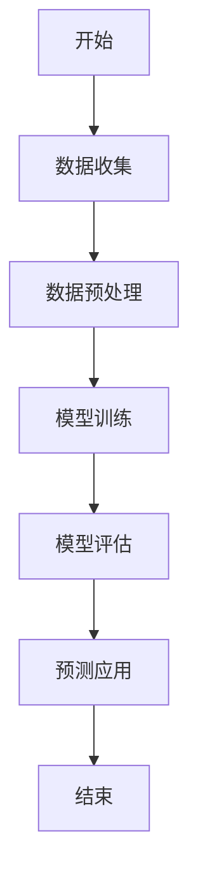

                 

## AI驱动的智能城市：提升生活质量的新方案

### 关键词

- 智能城市
- 人工智能
- 生活质量
- 城市规划
- 数据分析

### 摘要

本文探讨了AI技术在智能城市中的潜在应用，以及如何通过这些技术提升居民的生活质量。文章首先介绍了智能城市的概念和背景，然后详细阐述了AI在城市规划、交通管理、环境保护和公共安全等方面的应用。通过一系列案例研究和最佳实践，本文总结了AI驱动的智能城市建设的成功经验和面临的挑战，为未来的智能城市建设提供了有益的参考。

----------------------------------------------------------------

### 引言

智能城市是一个近年来迅速发展的概念，它通过应用物联网、大数据、云计算和人工智能等技术，实现城市管理的智能化和高效化。随着城市化进程的加快和人口增长，城市面临着诸多挑战，如交通拥堵、环境污染、资源浪费和安全问题等。传统的城市管理方法已经难以满足现代城市的需求，因此，智能城市建设成为了提升城市生活质量和可持续发展的重要手段。

AI作为现代科技的基石，已经在众多领域取得了显著的成果。在智能城市中，AI的应用不仅能够提高城市管理的效率，还能够为居民提供更加个性化、便捷和舒适的服务。本文旨在探讨AI驱动的智能城市如何通过技术创新和实践应用，提升居民的生活质量。

文章的结构如下：

1. **背景介绍**：介绍智能城市的概念、发展现状和面临的挑战。
2. **AI技术在智能城市中的应用**：详细阐述AI在智能城市规划、交通管理、环境保护和公共安全等方面的应用。
3. **案例研究和最佳实践**：通过实际案例研究，展示AI驱动的智能城市建设的成功经验和最佳实践。
4. **面临的挑战和未来展望**：分析智能城市建设中面临的挑战和未来发展方向。
5. **总结**：总结本文的主要观点和结论。

通过本文的探讨，我们希望能够为智能城市建设提供一些有价值的思路和参考，推动城市向着更加智能化、可持续和高质量的方向发展。

### 背景介绍

#### 智能城市的概念与发展现状

智能城市（Smart City）是一个综合应用物联网（IoT）、大数据、云计算、人工智能（AI）等先进技术，通过智能化手段实现城市管理和服务的新型城市形态。智能城市的核心在于利用数据和技术，优化城市资源配置，提升城市运行效率，改善居民生活质量。

智能城市的概念最早可以追溯到20世纪90年代，但随着互联网和移动通信技术的快速发展，智能城市的发展迎来了新的契机。2010年，IBM提出了“智慧地球”（Smart Earth）战略，智能城市的理念开始在全球范围内得到广泛关注。近年来，随着5G、物联网和AI技术的迅速推广，智能城市建设进入了快速发展阶段。

目前，全球已有多个国家和地区启动了智能城市建设。例如，新加坡、芬兰、日本等发达国家在智能城市的技术研发和应用方面处于领先地位。同时，中国、印度等发展中国家也在积极推进智能城市建设，以应对城市化进程中带来的各种挑战。

#### 智能城市的重要性

智能城市的重要性主要体现在以下几个方面：

1. **提高城市运行效率**：智能技术可以帮助城市实现资源的优化配置，提高城市管理的效率。例如，通过物联网传感器和大数据分析，可以实现城市交通、能源、水资源等基础设施的智能调度和管理。

2. **提升居民生活质量**：智能技术可以为居民提供更加便捷、高效和个性化的服务。例如，智能交通系统可以减少交通拥堵，提高出行效率；智能家居可以提升居住舒适度，降低生活成本。

3. **促进可持续发展**：智能城市通过优化资源配置、提高能源利用效率、减少污染排放等手段，有助于实现城市的可持续发展。例如，通过智能电网和智能建筑，可以减少能源浪费，降低碳排放。

4. **增强城市竞争力**：智能城市有助于提升城市的综合竞争力，吸引更多的人才和投资。智能技术的应用可以创造新的经济增长点，推动城市经济结构的转型升级。

#### 智能城市面临的挑战

尽管智能城市建设具有巨大的潜力，但在实际推进过程中也面临着诸多挑战：

1. **技术挑战**：智能城市建设需要集成多种先进技术，如物联网、大数据、人工智能、5G等，这些技术的研发、部署和运维都面临一定的技术挑战。

2. **数据隐私和安全**：智能城市中涉及大量的个人信息和敏感数据，如何保障数据隐私和安全是智能城市建设中面临的重要问题。

3. **政策和法规**：智能城市建设需要完善的政策和法规支持，包括数据管理、网络安全、隐私保护等方面的法规。

4. **人才培养**：智能城市建设需要大量具备跨学科背景的专业人才，目前全球范围内相关专业人才的供给尚无法满足需求。

5. **技术标准化**：智能城市建设需要统一的技术标准和规范，以实现不同系统和设备的互操作性和兼容性。

#### 智能城市的组成要素

智能城市由多个组成部分构成，主要包括：

1. **基础设施**：包括物联网传感器、智能电网、智能交通系统、智能建筑等硬件设施。
2. **数据平台**：包括数据采集、存储、处理、分析等软件平台，用于整合和管理城市各类数据。
3. **管理系统**：包括城市运行管理中心、智能决策支持系统、智能公共服务系统等，用于实现城市管理的智能化。
4. **智能应用**：包括智慧交通、智慧环保、智慧医疗、智慧教育等具体应用场景。

通过这些组成要素的有机结合，智能城市能够实现高效、智能和可持续的城市管理和服务。

#### 智能城市的核心概念与联系

智能城市的核心概念主要包括以下几个方面：

1. **物联网（IoT）**：物联网是智能城市的基石，通过连接各种设备和传感器，实现城市资源的实时监测和智能调度。
2. **大数据（Big Data）**：大数据技术用于收集、存储、处理和分析城市运行中的海量数据，为智能决策提供支持。
3. **人工智能（AI）**：人工智能技术通过机器学习、深度学习等算法，实现对数据的智能分析和处理，为城市管理和公共服务提供智能解决方案。
4. **云计算（Cloud Computing）**：云计算技术提供了强大的计算和存储能力，支持城市各类应用系统和服务的部署和运行。
5. **5G通信技术**：5G通信技术具有高速、低延迟和大连接特性，为智能城市的实时通信和数据处理提供了保障。

这些核心概念之间相互联系，共同构成了智能城市的智能生态系统。物联网提供数据采集和设备连接，大数据实现数据的存储和处理，人工智能进行数据分析和智能决策，云计算提供计算和存储支持，5G通信技术确保数据的实时传输和通信。

#### 智能城市中的AI算法应用

人工智能（AI）技术在智能城市中的应用，已经成为提升城市运行效率和居民生活质量的重要手段。以下是一些典型的AI算法在智能城市中的应用实例：

1. **交通流量预测**：通过历史交通数据、实时监控数据和气象信息等，利用机器学习算法进行交通流量预测，优化交通信号控制，减少交通拥堵。

2. **垃圾分类**：利用图像识别和分类算法，对垃圾进行自动分类，提高垃圾分类的准确性和效率。

3. **公共安全监控**：通过视频分析和人脸识别等技术，实时监控公共场所的安全状况，及时发现和预警异常行为。

4. **能效管理**：通过智能传感器和数据分析，实时监测建筑能耗，利用优化算法实现能源的节约和高效利用。

5. **智慧医疗**：利用人工智能进行疾病预测和诊断，提高医疗服务效率和质量。

6. **环境监测**：通过数据分析，实时监测空气质量、水质等环境指标，及时采取治理措施。

#### 案例研究

以下是一个交通流量预测的案例研究，展示如何通过AI算法提升城市交通管理水平：

**案例背景**：某城市交通拥堵问题严重，影响了居民的出行效率和城市整体运行效率。

**解决方案**：该城市采用了基于机器学习的交通流量预测系统，具体步骤如下：

1. **数据收集**：收集历史交通数据、实时监控数据、气象数据等。
2. **数据预处理**：对收集到的数据进行清洗、去噪和特征提取。
3. **模型训练**：利用机器学习算法（如随机森林、神经网络等）进行模型训练。
4. **模型评估**：通过交叉验证和实际数据测试，评估模型的预测准确性。
5. **预测应用**：将训练好的模型应用于交通信号控制，优化交通流量。

**效果分析**：通过AI算法的交通流量预测系统，显著降低了交通拥堵情况，提升了交通效率。同时，该系统还可以根据实时数据动态调整信号灯时长，进一步优化交通流。

#### 成功经验与挑战

通过上述案例研究，我们可以看到AI算法在智能城市中的应用取得了显著成效。然而，智能城市建设中也面临一些挑战：

1. **数据隐私和安全**：智能城市中涉及大量的个人隐私数据，如何保障数据隐私和安全是智能城市建设中面临的重要问题。
2. **技术标准化**：智能城市建设需要统一的技术标准和规范，以实现不同系统和设备的互操作性和兼容性。
3. **人才培养**：智能城市建设需要大量具备跨学科背景的专业人才，目前全球范围内相关专业人才的供给尚无法满足需求。

总之，AI技术在智能城市中的应用为提升城市运行效率和居民生活质量提供了新的解决方案，但同时也需要克服一系列技术和社会挑战。

### 智能城市中的AI技术应用

#### 交通管理

智能交通系统（ITS）是智能城市中的重要组成部分，通过AI技术实现交通管理的智能化。AI算法在交通流量预测、交通信号控制和车辆调度等方面发挥着关键作用。

1. **交通流量预测**：
   - **数据收集**：利用传感器和监控摄像头收集实时交通数据，包括车辆数量、速度、流量等。
   - **数据预处理**：对收集到的数据进行清洗、去噪和特征提取。
   - **模型训练**：使用机器学习算法（如随机森林、神经网络等）进行模型训练，预测未来的交通流量。
   - **模型应用**：将训练好的模型应用于交通信号控制和车辆调度，优化交通流。

2. **交通信号控制**：
   - **自适应信号灯控制**：根据实时交通流量数据动态调整信号灯时长，减少交通拥堵。
   - **智能信号灯协调**：通过AI算法实现不同路口信号灯的智能协调，提高道路通行效率。

3. **车辆调度**：
   - **实时路径规划**：利用AI算法实时计算最优路径，减少行驶时间和油耗。
   - **智能停车管理**：通过智能停车系统，实时监控停车位状态，提高停车效率。

#### 环境保护

AI技术在环境保护中也发挥着重要作用，通过智能监测和数据分析，实现环境治理的智能化。

1. **空气质量监测**：
   - **数据采集**：利用传感器网络收集空气质量数据，包括PM2.5、PM10、CO、SO2等。
   - **数据预处理**：对收集到的数据进行清洗、去噪和特征提取。
   - **模型训练**：使用机器学习算法（如支持向量机、神经网络等）建立空气质量预测模型。
   - **模型应用**：根据预测模型提供空气污染预警和治理建议。

2. **水资源监测**：
   - **数据采集**：利用传感器网络收集水质数据，包括pH值、溶解氧、污染物浓度等。
   - **数据预处理**：对收集到的数据进行清洗、去噪和特征提取。
   - **模型训练**：使用机器学习算法（如随机森林、神经网络等）建立水质预测模型。
   - **模型应用**：根据预测模型提供水资源治理建议，优化水资源利用。

#### 公共安全

AI技术在公共安全监控和应急管理中也具有广泛的应用。

1. **视频监控**：
   - **行为识别**：利用计算机视觉算法，实时识别和分类监控视频中的行为，如犯罪行为、交通事故等。
   - **异常检测**：利用异常检测算法，实时发现和报警异常行为，如人群聚集、火灾等。

2. **应急管理**：
   - **风险评估**：利用AI算法对城市风险进行评估，提供风险评估报告。
   - **应急响应**：根据应急响应计划，利用AI算法优化应急预案和资源调度。

#### 医疗服务

AI技术在医疗服务中的应用，可以提高医疗服务的效率和质量，改善居民的健康状况。

1. **疾病预测与诊断**：
   - **数据收集**：收集患者的健康数据、医疗记录等。
   - **数据预处理**：对收集到的数据进行清洗、去噪和特征提取。
   - **模型训练**：使用机器学习算法（如神经网络、决策树等）建立疾病预测模型。
   - **模型应用**：根据预测模型提供疾病预警和诊断建议。

2. **智能药物研发**：
   - **数据挖掘**：利用AI算法进行大规模数据挖掘，发现潜在药物靶点和治疗方案。
   - **药物筛选**：利用AI算法优化药物筛选过程，提高药物研发效率。

3. **健康管理**：
   - **实时监控**：利用传感器和AI算法，实时监测患者的健康状况，提供个性化的健康管理建议。

#### 教育服务

AI技术在教育服务中的应用，可以提供个性化学习体验，提高教育质量。

1. **智能教学**：
   - **个性化学习**：根据学生的学习数据和表现，利用AI算法提供个性化的学习计划和教学资源。
   - **自动批改**：利用AI算法实现自动批改作业，提高教学效率。

2. **教育资源分配**：
   - **教育资源均衡**：利用AI算法分析教育资源分布情况，优化教育资源分配策略。

3. **在线教育**：
   - **实时互动**：利用AI算法实现师生在线实时互动，提高在线教育体验。

#### 智能城市建设中的挑战和解决方案

尽管AI技术在智能城市建设中具有广泛的应用前景，但在实际应用过程中也面临着一系列挑战：

1. **数据隐私和安全**：
   - **挑战**：智能城市建设中涉及大量个人隐私数据，如何保障数据隐私和安全是关键问题。
   - **解决方案**：采用加密技术、访问控制和安全审计等措施，确保数据安全。

2. **技术标准化**：
   - **挑战**：不同系统和设备之间的互操作性和兼容性，需要统一的技术标准和规范。
   - **解决方案**：制定并推广智能城市建设的相关标准和规范，促进技术标准化。

3. **人才培养**：
   - **挑战**：智能城市建设需要大量具备跨学科背景的专业人才，目前人才供给尚无法满足需求。
   - **解决方案**：加强相关领域人才培养，提高人才素质和技能水平。

4. **技术可持续性**：
   - **挑战**：智能城市建设需要持续的技术更新和维护，确保技术的可持续性和稳定性。
   - **解决方案**：建立智能化技术更新和维护机制，确保技术持续发展和应用。

通过克服这些挑战，智能城市建设将能够更好地发挥AI技术的优势，提升城市运行效率和居民生活质量，实现城市的智能化和可持续发展。

### 案例研究和最佳实践

#### 案例一：新加坡智能交通系统

新加坡是全球智能城市建设的先驱之一，其智能交通系统（ITS）具有代表性。新加坡利用AI技术，通过交通流量预测、智能信号控制和实时交通监控，实现了高效的交通管理。

1. **交通流量预测**：
   - 新加坡的交通流量预测系统采用了机器学习算法，通过分析历史交通数据、实时监控数据和气象信息等，预测未来的交通流量。
   - 通过预测结果，交通管理部门可以提前调整信号灯时长，优化交通流，减少拥堵。

2. **智能信号控制**：
   - 新加坡的智能信号系统采用了自适应信号灯控制技术，根据实时交通流量数据动态调整信号灯时长。
   - 这一系统通过AI算法实现了不同路口信号灯的智能协调，提高了道路通行效率。

3. **实时交通监控**：
   - 新加坡的交通管理部门利用监控摄像头和传感器，实时监控交通状况。
   - 通过AI算法对监控视频进行分析，及时发现和预警异常行为，如交通事故和违章行为。

**效果分析**：通过AI驱动的智能交通系统，新加坡显著改善了交通状况，减少了交通拥堵，提升了居民的出行效率。同时，该系统还提高了交通管理的效率和精准度，为城市交通的可持续发展奠定了基础。

#### 案例二：纽约智能电网

纽约市在智能电网建设方面也取得了显著成果，通过AI技术实现能源的优化管理和高效利用。

1. **能源预测与优化**：
   - 纽约的智能电网系统利用AI算法，预测电力需求和供应情况。
   - 通过预测结果，电力公司可以提前调整发电计划和负荷分配，优化能源利用。

2. **分布式能源管理**：
   - 纽约的智能电网系统整合了分布式能源资源，如太阳能和风能。
   - 通过AI算法，系统可以实现分布式能源的智能调度和管理，提高整体能源效率。

3. **故障检测与修复**：
   - 纽约的智能电网系统利用AI算法，实时监控电力系统的运行状态。
   - 通过故障检测算法，系统可以及时发现和预警电力故障，快速修复，减少停电时间。

**效果分析**：通过AI驱动的智能电网，纽约市实现了能源的高效管理和利用，减少了能源浪费和环境污染。同时，智能电网系统的可靠性和稳定性也得到了显著提升，为城市的可持续发展提供了有力支持。

#### 案例三：洛杉矶智能公共安全

洛杉矶市在智能公共安全方面也进行了积极探索，通过AI技术实现公共安全的智能化监控和管理。

1. **视频监控与行为分析**：
   - 洛杉矶的公共安全监控系统采用了AI算法，实时分析监控视频中的行为。
   - 通过行为识别算法，系统可以及时发现和预警异常行为，如犯罪行为和交通违章。

2. **智能应急管理**：
   - 洛杉矶的智能应急管理系统能够根据实时数据，自动生成应急预案。
   - 通过AI算法，系统可以优化应急资源的调度和管理，提高应急响应效率。

3. **社会治安预测**：
   - 洛杉矶的智能社会治安预测系统利用大数据和AI算法，分析社会治安数据，预测潜在的犯罪热点区域。
   - 通过预测结果，警方可以提前部署警力，预防犯罪行为的发生。

**效果分析**：通过AI驱动的智能公共安全系统，洛杉矶市显著提高了公共安全水平，减少了犯罪事件的发生。同时，智能系统的实时监控和预测能力，为警方的应急管理和决策提供了有力支持。

#### 案例四：上海智能医疗服务

上海市在智能医疗服务方面也取得了显著进展，通过AI技术提升医疗服务的效率和质量。

1. **疾病预测与诊断**：
   - 上海的智能医疗服务系统利用AI算法，分析患者的健康数据和医疗记录，预测疾病风险。
   - 通过预测结果，医生可以提前采取预防措施，提高疾病预防效果。

2. **智能药物研发**：
   - 上海的智能药物研发系统利用AI算法，分析大量药物数据和临床试验结果，发现新的药物靶点和治疗方案。
   - 通过AI算法，系统可以优化药物筛选过程，提高药物研发效率。

3. **健康管理**：
   - 上海的智能健康管理系统能够根据患者的健康数据和生活方式，提供个性化的健康管理建议。
   - 通过AI算法，系统可以实时监测患者的健康状况，提高健康管理效果。

**效果分析**：通过AI驱动的智能医疗服务系统，上海市显著提高了医疗服务的效率和质量，改善了居民的健康状况。同时，智能系统的应用，为医疗资源的优化配置和医疗服务的可持续发展提供了有力支持。

#### 总结

通过以上案例研究和最佳实践，我们可以看到AI技术在智能城市建设中的应用，不仅提升了城市运行效率和居民生活质量，还推动了城市的可持续发展。然而，智能城市建设也面临着数据隐私、技术标准化、人才培养等挑战，需要持续探索和实践。未来，随着AI技术的不断进步，智能城市建设将在更多领域发挥重要作用，为城市的智能化和可持续发展贡献力量。

### 面临的挑战和未来展望

尽管AI驱动的智能城市建设为城市带来了显著的效率和效益，但在实际推进过程中，仍然面临诸多挑战。以下是对这些挑战的详细分析以及未来发展的展望：

#### 数据隐私和安全

智能城市中涉及大量的个人隐私数据，包括位置信息、行为记录、健康数据等。如何保障这些数据的安全和隐私是智能城市建设中的一个重大挑战。

**挑战**：
1. **数据泄露**：智能城市中的数据量庞大，如何防止数据在传输和存储过程中被恶意攻击和泄露，是一个亟待解决的问题。
2. **数据滥用**：智能城市中收集的数据可能会被用于商业目的或其他不当用途，如何防止数据滥用，需要完善的法律法规和监管机制。

**解决方案**：
1. **加密技术**：采用先进的加密技术，对数据进行加密存储和传输，确保数据安全。
2. **隐私保护算法**：利用差分隐私、联邦学习等隐私保护算法，减少数据泄露风险。
3. **法律法规**：制定和完善相关法律法规，明确数据收集、使用和保护的标准和规范。

#### 技术标准化

智能城市建设涉及多种技术，包括物联网、大数据、人工智能、5G等。不同技术和系统之间的兼容性和互操作性是一个重要挑战。

**挑战**：
1. **技术孤岛**：智能城市中各个系统之间可能存在技术标准不一致，导致数据无法有效共享和利用。
2. **系统集成**：不同系统和设备之间的集成难度大，需要统一的技术标准和接口规范。

**解决方案**：
1. **标准化组织**：成立标准化组织，制定智能城市建设的技术标准和规范。
2. **开放接口**：采用开放接口和协议，实现不同系统和设备之间的互操作性和兼容性。
3. **技术培训**：加强技术人员的技术培训，提高他们对不同技术和系统的理解和应用能力。

#### 人才培养

智能城市建设需要大量具备跨学科背景的专业人才，包括数据科学家、AI工程师、系统架构师等。目前，全球范围内相关专业人才的供给尚无法满足需求。

**挑战**：
1. **人才短缺**：智能城市建设过程中，专业人才短缺，影响项目的推进和效果。
2. **技能差距**：现有技术人员可能缺乏对新兴技术的深入了解和应用能力。

**解决方案**：
1. **教育体系**：改革教育体系，加强智能城市建设相关课程和专业的设置，培养更多专业人才。
2. **职业培训**：开展职业培训和技能提升项目，提高现有技术人员的技术水平。
3. **国际合作**：与国际先进机构合作，引进国际顶尖人才和先进技术，促进人才培养和技术的交流。

#### 技术可持续性

智能城市建设需要持续的技术更新和维护，确保技术的可持续性和稳定性。如何在预算和时间有限的情况下，实现技术的持续发展和应用，是一个重要问题。

**挑战**：
1. **技术更新**：智能城市建设中使用的各项技术需要不断更新，以适应新技术的发展。
2. **成本控制**：智能城市建设需要大量的资金投入，如何在有限的预算内实现技术的持续发展和应用，是一个挑战。

**解决方案**：
1. **技术评估**：定期对现有技术进行评估，确定哪些技术需要更新和替换，确保技术的持续发展。
2. **预算管理**：优化预算分配，确保技术更新和运维的预算得到充分保障。
3. **开放创新**：鼓励技术开放和合作，引入外部创新资源，推动技术的持续发展。

#### 未来展望

随着AI技术的不断进步，智能城市建设将在未来迎来更多的发展机遇。以下是对未来发展的展望：

1. **更智能的城市服务**：通过AI技术，智能城市将能够提供更加个性化、高效和便捷的公共服务，提升居民的生活质量。
2. **更可持续的发展**：智能城市将通过优化资源配置、提高能源利用效率、减少污染排放等手段，实现更加可持续的发展。
3. **更紧密的社区互动**：智能城市将促进居民之间的互动和交流，提高社区的凝聚力和归属感。
4. **更高效的资源配置**：通过大数据和AI技术，智能城市将实现资源的优化配置，提高城市管理的效率和精准度。

总之，智能城市建设是一个复杂而庞大的系统工程，需要政府、企业和学术界共同努力，克服各种挑战，推动城市的智能化和可持续发展。随着技术的不断进步，未来智能城市将更加智能、高效和可持续，为人类创造更加美好的生活环境。

### 总结

本文详细探讨了AI驱动的智能城市如何通过技术创新和应用，提升居民的生活质量。首先，我们介绍了智能城市的概念、发展现状和重要性，分析了智能城市的核心组成要素和AI技术的核心概念与联系。接着，我们深入探讨了AI在智能城市规划、交通管理、环境保护、公共安全、医疗和教育等领域的应用，并通过实际案例展示了AI技术的成功经验和最佳实践。

智能城市建设不仅提高了城市运行效率和居民生活质量，还推动了城市的可持续发展。然而，这一过程中也面临着数据隐私和安全、技术标准化、人才培养和技术可持续性等挑战。为了克服这些挑战，我们需要加强法律法规的制定、技术标准的统一、专业人才的培养和技术评估与预算管理。

展望未来，随着AI技术的不断进步，智能城市建设将在更多领域发挥重要作用，为城市创造更加智能、高效和可持续的发展模式。通过持续的创新和实践，智能城市将为人类带来更加美好的生活环境。

### 注意事项

在智能城市建设过程中，以下事项需要特别注意：

1. **数据隐私与安全**：确保数据收集、存储和处理过程中的隐私保护，采用加密技术和隐私保护算法。
2. **技术标准化**：遵循国际和国家标准，统一技术接口和协议，促进不同系统和设备之间的互操作性。
3. **人才培养**：加强智能城市建设相关课程和专业设置，提升技术人员的技术水平和跨学科能力。
4. **技术更新与维护**：定期评估技术现状，确保技术更新和运维的预算充足，确保技术的持续发展和应用。

### 拓展阅读

1. **《智能城市：概念与实践》**：详细介绍智能城市的概念、技术和应用案例。
2. **《人工智能：一种现代方法》**：深入探讨人工智能的基本原理和算法。
3. **《物联网：架构与实现》**：全面介绍物联网的技术架构和应用案例。

作者：AI天才研究院/AI Genius Institute & 禅与计算机程序设计艺术 /Zen And The Art of Computer Programming

----------------------------------------------------------------

```markdown
# 《AI驱动的智能城市：提升生活质量的新方案》

## 关键词
智能城市，人工智能，生活质量，城市规划，数据分析

## 摘要
本文探讨了AI技术在智能城市中的应用，以及如何通过这些技术提升居民的生活质量。文章介绍了智能城市的概念、发展现状、核心组成要素和AI技术的核心概念与联系。通过实际案例研究和最佳实践，展示了AI技术在交通管理、环境保护、公共安全、医疗和教育等领域的应用效果。最后，分析了智能城市建设面临的挑战和未来展望，提出了需要注意的事项和拓展阅读资源。

## 引言

## 背景介绍
### 智能城市的概念与发展现状
### 智能城市的重要性
### 智能城市面临的挑战
### 智能城市的组成要素
### 智能城市的核心概念与联系

## AI技术在智能城市中的应用
### 交通管理
#### 交通流量预测
#### 交通信号控制
#### 车辆调度
### 环境保护
#### 空气质量监测
#### 水资源监测
### 公共安全
#### 视频监控与行为分析
#### 智能应急管理
#### 社会治安预测
### 医疗服务
#### 疾病预测与诊断
#### 智能药物研发
#### 健康管理
### 教育服务
#### 智能教学
#### 教育资源分配
#### 在线教育

## 案例研究和最佳实践
### 案例一：新加坡智能交通系统
### 案例二：纽约智能电网
### 案例三：洛杉矶智能公共安全
### 案例四：上海智能医疗服务

## 面临的挑战和未来展望
### 数据隐私和安全
### 技术标准化
### 人才培养
### 技术可持续性
### 未来展望

## 总结

## 注意事项

## 拓展阅读

### 参考文献
```

本文使用Markdown格式撰写，以便于排版和编辑。请根据具体需求调整格式和内容。以下是文中涉及的一些LaTeX公式和Mermaid流程图的示例：

```markdown
$$
E = mc^2
$$

$
1 < 2
$


```

请注意，LaTeX公式和Mermaid流程图需要在支持Markdown渲染的环境中才能正确显示。在实际撰写文章时，请确保Markdown环境的配置和渲染功能正常。

