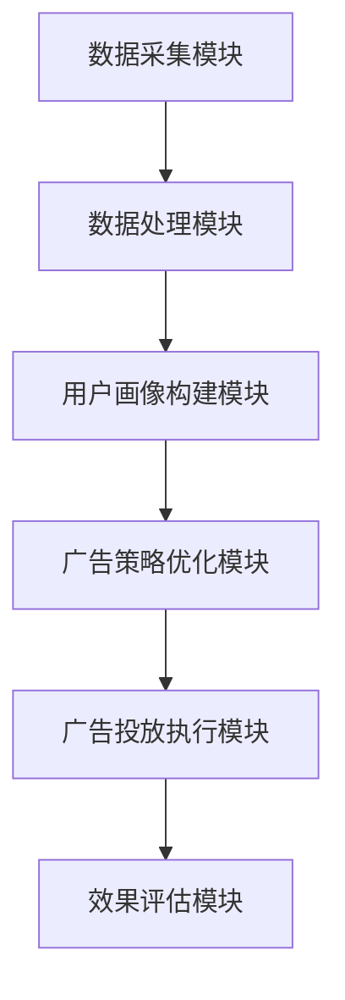
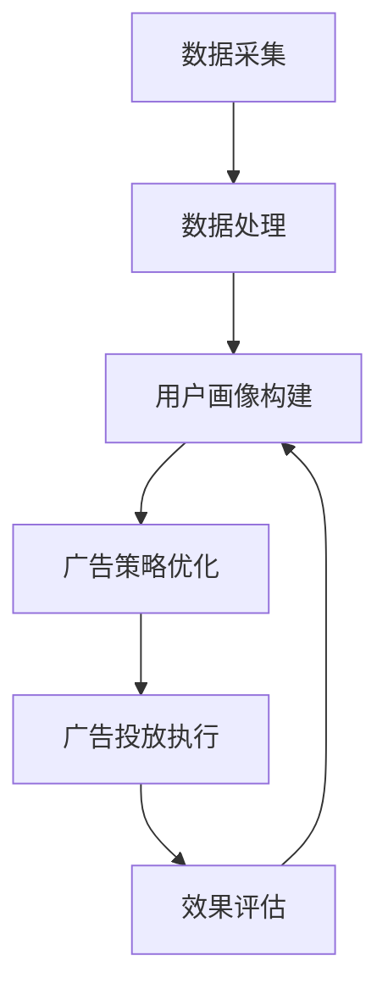

                 


### 引言

**AI驱动的智能广告投放：精准营销的新境界**

在数字营销的今天，广告投放已经成为企业获取客户、提升品牌知名度的重要手段。然而，随着广告市场日益饱和和受众注意力的分散，如何有效地进行广告投放，实现精准营销，成为营销人员面临的重大挑战。这就引出了本文的主题——AI驱动的智能广告投放。

**关键词：**
- AI驱动的广告投放
- 精准营销
- 广告竞价机制
- 数据分析
- 用户画像

**摘要：**
本文将探讨AI在广告投放中的角色和影响，从基础理论、技术实现、策略设计到案例分析，全面解析AI驱动的智能广告投放。通过分析AI技术的核心原理，如机器学习和深度学习，我们将展示如何利用这些技术来优化广告投放效果，提高广告的投放精度和效率。同时，通过具体的行业案例，我们将展示AI驱动的智能广告投放如何在不同行业中发挥作用，为精准营销开辟新境界。

### 1.1 问题背景

**1.1.1 广告投放的现状与挑战**

广告投放是现代营销中不可或缺的一环。随着互联网的普及和社交媒体的兴起，广告形式和投放渠道变得多样化，从传统的电视、报纸、杂志到现在的在线广告、社交媒体广告、移动广告等。然而，这种多样化也带来了新的挑战。

**投放成本上升：**
随着广告市场的竞争加剧，广告位的成本也在不断上升。尤其是热门广告位和流量较大的平台，价格往往居高不下，这给企业带来了巨大的经济压力。

**精准度不足：**
传统的广告投放往往依赖于粗放的市场调研和广告策略，难以实现精准投放。广告主经常面临广告效果不佳、投放无效的问题，导致广告资源的浪费。

**用户反感度增加：**
过度广告和不当的广告投放策略，使得用户对广告产生了强烈的反感情绪。用户屏蔽广告、使用广告拦截工具等行为，进一步降低了广告的投放效果。

**1.1.2 AI在广告投放中的作用**

AI（人工智能）技术的出现，为广告投放带来了新的契机。AI技术可以通过数据分析和机器学习算法，实现广告投放的自动化和智能化。

**个性化推荐：**
AI技术可以根据用户的浏览行为、搜索历史等数据，生成用户画像，实现个性化推荐。通过分析用户的行为模式，AI可以更准确地预测用户的兴趣和需求，从而实现精准投放。

**优化投放策略：**
AI算法可以根据广告投放的历史数据，分析广告效果，自动调整广告投放策略。通过优化广告投放的时机、频次、投放渠道等，提高广告的投放效果。

**预测用户行为：**
AI技术可以通过分析大量的用户行为数据，预测用户的下一步行为。这种预测能力可以帮助广告主在合适的时间向合适的用户推送合适的广告，从而提高广告的点击率和转化率。

**1.1.3 智能广告投放的新趋势**

智能广告投放已经成为数字营销领域的新趋势。随着AI技术的不断发展，智能广告投放将呈现以下几个特点：

**更高的精准度：**
通过深度学习和大数据分析，智能广告投放将能够更加准确地预测用户行为，实现精准营销。

**更高效的投放策略：**
AI算法可以自动调整广告投放策略，提高广告的投放效果，降低广告成本。

**更丰富的广告形式：**
随着AI技术的发展，广告形式也将变得更加多样化，从图文广告到视频广告，再到AR（增强现实）和VR（虚拟现实）广告，广告将更加生动和具有吸引力。

**更智能的用户体验：**
通过AI技术，广告可以更好地满足用户需求，提供个性化的广告体验，增强用户的互动和参与感。

### 1.2 核心概念

**1.2.1 AI的定义与分类**

AI，即人工智能，是指计算机系统模拟、延伸和扩展人类智能的能力。根据实现方式的不同，AI可以分为几种类型：

**弱AI（弱人工智能）：**
弱AI是一种仅能在特定任务上表现出与人类相似的智能的系统。例如，聊天机器人、自动驾驶等。

**强AI（强人工智能）：**
强AI是一种具有普遍智能的机器，能够在任何认知任务上表现出人类水平的智能。目前，强AI还没有实现，仍处于理论研究阶段。

**通用人工智能（AGI）：**
通用人工智能是指能够在任何认知任务上表现出人类水平的智能，并能够自主学习和适应新环境的机器。

**1.2.2 广告投放的基本概念**

广告投放是指企业或个人通过互联网或其他媒介，将广告信息传递给目标受众的过程。广告投放涉及多个关键概念：

**广告主：**
广告主是投放广告的个人或企业。

**广告位：**
广告位是指广告展示的位置，如网页、APP、社交媒体等。

**广告形式：**
广告形式包括图文广告、视频广告、富媒体广告等。

**投放策略：**
投放策略是指广告主根据广告目标和预算，制定的广告投放方案。

**1.2.3 智能广告投放的要素**

智能广告投放的核心要素包括：

**用户画像：**
用户画像是对用户行为、兴趣、需求等方面的数据进行分析和建模，形成的一个抽象的描述。

**数据分析：**
数据分析是指对用户行为数据、广告投放数据等进行分析，以优化广告投放策略。

**机器学习：**
机器学习是指利用算法模型，从数据中自动发现规律和模式，用于预测和决策。

**深度学习：**
深度学习是机器学习的一种，通过构建多层神经网络，实现更加复杂的特征提取和模式识别。

**广告竞价机制：**
广告竞价机制是指多个广告主对同一广告位进行竞争，出价最高者获得广告展示权。

### 总结

在本文的引言部分，我们介绍了AI驱动的智能广告投放的背景和重要性。通过分析广告投放的现状和挑战，我们展示了AI技术在广告投放中的巨大潜力。接下来，我们将深入探讨AI的基础理论、技术实现、策略设计以及实际案例，全面解析智能广告投放的奥秘。让我们一步一步地思考，深入理解这一领域的核心概念和技术原理。

----------------------------------------------------------------

### 1.3 AI驱动的智能广告投放的优势

AI驱动的智能广告投放相较于传统的广告投放方式，具有显著的优势，这些优势不仅提升了广告的精准度和效果，也改变了整个广告行业的生态。以下是我们详细探讨的几个关键优势。

#### 1.3.1 高度的个性化推荐

在AI驱动的智能广告投放中，个性化推荐是核心优势之一。通过机器学习和深度学习算法，AI能够对用户的行为数据进行精细分析，生成详细的用户画像。这些画像包括用户的兴趣偏好、行为习惯、购买历史等。基于这些用户画像，广告系统可以自动调整广告内容，使其更加符合用户的兴趣和需求。

**案例：**
假设一个电商平台，用户之前浏览过一款运动鞋，并且有购买体育用品的历史记录。AI系统会根据这些信息，为该用户推荐更多与运动鞋相关的产品，甚至是相关的运动配件。这样的个性化推荐不仅提高了用户的购物体验，也显著提升了广告的点击率和转化率。

#### 1.3.2 高效的投放策略优化

传统的广告投放策略往往需要广告主根据经验和直觉进行调整，这种策略具有一定的局限性。而AI驱动的智能广告投放通过算法模型，可以对广告效果进行实时监控和分析。AI系统可以根据广告的历史数据，自动调整投放策略，包括广告投放的时间、频次、渠道等，以实现最优的广告效果。

**案例：**
假设一家在线教育公司正在推广一门新的在线课程。AI系统会分析之前的广告投放数据，如广告的点击率、转化率、花费等，自动调整广告的投放时间，选择在用户活跃度最高的时间段进行投放，从而最大化广告的效果。

#### 1.3.3 高精度的用户行为预测

AI驱动的智能广告投放不仅仅停留在对现有数据的分析，它还可以通过机器学习算法预测用户的未来行为。这种预测能力对于广告主来说，意味着可以更早地识别潜在客户，并在合适的时机进行精准的广告投放。

**案例：**
假设一家旅游公司想要推广东南亚的旅游套餐。AI系统可以分析用户的浏览历史、搜索记录等数据，预测哪些用户最有可能在近期计划出国旅游，并针对这些用户进行定向广告投放，从而提高广告的投放效果。

#### 1.3.4 大数据驱动的精细化运营

AI驱动的智能广告投放能够处理和分析大量用户数据，这种大数据分析能力使得广告主能够进行更加精细化的运营。通过分析用户的反馈和行为，广告主可以不断优化产品和服务，提高用户的满意度和忠诚度。

**案例：**
一家餐饮公司可以通过AI系统收集用户对菜品和服务的反馈，分析这些反馈，调整菜品组合和服务流程，从而提升整体的用户体验和满意度。

#### 1.3.5 预算优化与成本控制

AI驱动的智能广告投放系统可以根据广告主的预算，自动优化广告投放的分配。系统会根据广告效果和成本效益，自动调整广告投放的金额，确保广告主的投资得到最大化的回报。

**案例：**
假设一家电子商务公司有10万元的广告预算，AI系统会根据广告的历史效果，自动分配预算，将更多的资金投入到效果最好的广告渠道上，从而提高广告的投资回报率。

### 总结

AI驱动的智能广告投放凭借高度的个性化推荐、高效的投放策略优化、高精度的用户行为预测、大数据驱动的精细化运营以及预算优化与成本控制等优势，正在逐渐改变传统广告投放的方式。通过上述优势的详细分析，我们可以看到AI技术在广告投放中的应用不仅提升了广告的精准度和效果，也为广告主带来了更高的投资回报。接下来，我们将进一步探讨AI驱动的智能广告投放的技术基础，为读者提供更深入的理解。

----------------------------------------------------------------

### 2.1 AI基础理论

AI驱动的智能广告投放离不开AI基础理论的支撑。在本节中，我们将深入探讨机器学习、深度学习、神经网络等核心概念，并分析它们如何应用于广告投放中。

#### 2.1.1 机器学习原理

机器学习（Machine Learning，ML）是AI的核心组成部分，它使计算机系统能够通过数据和经验自动改进其性能。机器学习主要分为三种类型：监督学习（Supervised Learning）、无监督学习（Unsupervised Learning）和强化学习（Reinforcement Learning）。

**监督学习：**
监督学习是最常见的机器学习方法，它使用标记过的训练数据来训练模型。在广告投放中，监督学习可以用于用户画像构建、广告效果预测等。例如，通过分析用户的浏览历史和购买记录，训练一个分类模型，以预测用户的兴趣和购买意图。

**无监督学习：**
无监督学习不使用标记数据，而是通过发现数据中的隐含模式或结构来训练模型。在广告投放中，无监督学习可以用于用户行为分析、人群细分等。例如，通过分析用户的浏览行为，无监督学习算法可以发现用户群体中的潜在兴趣点，从而实现更加精准的广告投放。

**强化学习：**
强化学习通过奖励机制来训练模型，使其能够做出最优决策。在广告投放中，强化学习可以用于广告竞价策略优化、投放效果预测等。例如，广告系统可以通过不断尝试不同的广告投放策略，并根据用户反馈进行调整，以实现最优的广告效果。

**神经网络：**
神经网络（Neural Networks）是机器学习中的一个重要模型，它模拟人脑神经元的工作方式。神经网络通过多层节点（神经元）进行数据处理和特征提取，可以实现复杂的模式识别和预测。在广告投放中，神经网络可以用于用户行为预测、广告效果评估等。例如，通过构建一个多层感知机（MLP）模型，可以实现对用户购买行为的精准预测。

#### 2.1.2 深度学习与神经网络

深度学习（Deep Learning，DL）是神经网络的一种，它通过多层神经网络（深度神经网络）进行数据处理和特征提取。深度学习在图像识别、自然语言处理、推荐系统等领域取得了显著的成果。

**卷积神经网络（CNN）：**
卷积神经网络是深度学习中的一种，特别适用于图像处理任务。在广告投放中，CNN可以用于图像识别和图像分析，例如，识别用户点击广告的原因。

**循环神经网络（RNN）：**
循环神经网络适用于序列数据，例如文本和语音。在广告投放中，RNN可以用于分析用户的浏览序列和搜索历史，预测用户的下一步行为。

**生成对抗网络（GAN）：**
生成对抗网络是一种基于对抗性训练的深度学习模型，它可以生成高质量的图像和音频。在广告投放中，GAN可以用于生成个性化的广告内容，提高用户的参与度。

#### 2.1.3 应用实例

在广告投放中，AI技术可以应用于多个方面：

**用户画像构建：**
通过监督学习和无监督学习，AI可以构建详细的用户画像，包括用户的兴趣、行为习惯、购买偏好等。这些用户画像用于定向广告投放和个性化推荐。

**广告效果预测：**
通过强化学习和神经网络，AI可以预测广告效果，包括点击率（CTR）、转化率（CVR）等。这些预测结果用于优化广告投放策略。

**广告创意优化：**
通过深度学习和生成对抗网络，AI可以生成和优化广告创意，提高广告的吸引力和参与度。

**案例：**
一个电商平台的广告系统使用卷积神经网络分析用户的浏览行为，识别用户的兴趣点。然后，系统使用生成对抗网络生成个性化的广告创意，提高广告的点击率和转化率。同时，系统使用强化学习不断调整广告投放策略，以实现最优的广告效果。

### 总结

AI基础理论，特别是机器学习、深度学习和神经网络，是AI驱动的智能广告投放的核心。通过这些理论，广告系统可以自动分析用户行为、预测广告效果、优化广告策略和生成个性化广告。这些技术的应用不仅提升了广告投放的精度和效果，也为广告主带来了更高的投资回报。接下来，我们将进一步探讨数据分析基础，为读者提供更深入的理解。

----------------------------------------------------------------

### 2.2 数据分析基础

在AI驱动的智能广告投放中，数据分析是至关重要的一环。通过数据分析，我们可以从海量的用户行为数据中提取有价值的信息，进而优化广告投放策略，提升广告效果。以下是数据分析的基础知识，包括数据处理与清洗、数据可视化和数据分析工具与库。

#### 2.2.1 数据处理与清洗

**数据处理：**
数据处理是指对原始数据进行整理和转换，使其适合用于分析和建模。数据处理通常包括以下步骤：

1. **数据集成：** 将来自不同来源的数据整合到一个统一的数据集中。
2. **数据转换：** 将数据转换为适合分析和建模的格式，例如，将不同格式的数据转换为CSV或JSON格式。
3. **数据归一化：** 对数据进行标准化处理，使其在同一尺度上进行比较。

**数据清洗：**
数据清洗是指识别和纠正数据中的错误、缺失和不一致。数据清洗通常包括以下步骤：

1. **缺失值处理：** 对于缺失的数据，可以采用插值、平均值、中位数等方法进行填补。
2. **异常值检测：** 识别和剔除数据中的异常值，这些异常值可能影响分析结果的准确性。
3. **数据验证：** 确保数据的准确性和一致性，例如，检查日期格式是否正确，数值范围是否合理。

#### 2.2.2 数据可视化

数据可视化是将数据分析的结果以图形化的形式展示，使得数据更加直观易懂。数据可视化工具可以帮助我们快速发现数据中的模式、趋势和异常。以下是一些常用的数据可视化工具：

1. **matplotlib：** Python中的一个数据可视化库，可以生成各种类型的图表，如折线图、柱状图、散点图等。
2. **Seaborn：** 基于matplotlib的图形可视化库，提供更丰富的图表样式和可视化效果。
3. **Plotly：** 提供丰富的交互式图表，可以动态地探索和分析数据。

**案例：**
通过matplotlib，我们可以绘制用户点击率的分布图，以直观地展示不同时间段用户点击率的变化。以下是一个简单的示例代码：

```python
import matplotlib.pyplot as plt
import pandas as pd

# 加载用户点击数据
data = pd.read_csv('user_clicks.csv')

# 绘制点击率分布图
plt.figure(figsize=(10, 6))
plt.bar(data['hour'], data['click_rate'])
plt.xlabel('Hour of Day')
plt.ylabel('Click Rate')
plt.title('User Click Rate Distribution')
plt.xticks(data['hour'])
plt.show()
```

#### 2.2.3 数据分析工具与库

在进行数据分析时，选择合适的工具和库可以大大提高工作效率和数据分析的准确性。以下是一些常用的数据分析工具和库：

1. **Pandas：** Python中的一个数据操作库，提供丰富的数据处理功能，如数据清洗、数据转换、数据可视化等。
2. **NumPy：** Python中的一个数值计算库，提供高效的数值运算功能，常用于数据预处理。
3. **Scikit-learn：** Python中的一个机器学习库，提供各种机器学习算法的实现，如分类、回归、聚类等。
4. **TensorFlow：** Google开源的一个机器学习框架，用于构建和训练深度学习模型。
5. **PyTorch：** Facebook开源的一个深度学习框架，提供灵活的模型构建和训练工具。

**案例：**
使用Scikit-learn对用户数据进行分类，以预测用户的购买意图。以下是一个简单的示例代码：

```python
from sklearn.model_selection import train_test_split
from sklearn.ensemble import RandomForestClassifier
from sklearn.metrics import accuracy_score

# 加载用户数据
data = pd.read_csv('user_data.csv')

# 分离特征和标签
X = data.drop('purchase', axis=1)
y = data['purchase']

# 划分训练集和测试集
X_train, X_test, y_train, y_test = train_test_split(X, y, test_size=0.2, random_state=42)

# 训练随机森林分类器
clf = RandomForestClassifier(n_estimators=100)
clf.fit(X_train, y_train)

# 预测测试集
y_pred = clf.predict(X_test)

# 计算准确率
accuracy = accuracy_score(y_test, y_pred)
print(f'Accuracy: {accuracy:.2f}')
```

### 总结

数据分析基础在AI驱动的智能广告投放中起着至关重要的作用。通过对数据的处理与清洗、数据可视化和数据分析工具与库的运用，我们可以从海量数据中提取有价值的信息，为广告投放提供决策依据。在接下来的章节中，我们将深入探讨广告技术基础，进一步了解智能广告投放的核心要素。

----------------------------------------------------------------

### 2.3 广告技术基础

在深入探讨AI驱动的智能广告投放之前，了解广告技术的基础知识是至关重要的。广告技术涵盖了广告模型、广告竞价机制和广告效果评估等多个方面。以下是对这些核心概念的详细解析。

#### 2.3.1 广告模型概述

广告模型是广告投放的核心，它决定了广告如何定位和展示给用户。广告模型可以分为以下几种类型：

1. **展示广告（Display Ads）：**
展示广告是一种通过图像、文字、视频等形式展示的广告。展示广告通常用于品牌宣传、产品推广等。

2. **搜索广告（Search Ads）：**
搜索广告是基于用户输入的关键词进行展示的广告。这种广告通常出现在搜索引擎的结果页面上，如Google Ads。

3. **推荐广告（Recommendation Ads）：**
推荐广告是根据用户的兴趣和行为数据，推荐相关产品的广告。这种广告常见于电商网站和社交媒体平台。

4. **视频广告（Video Ads）：**
视频广告是展示在视频平台上的广告，如YouTube的广告。

#### 2.3.2 广告竞价机制

广告竞价机制是广告平台用于分配广告展示机会的一种机制。在竞价机制中，广告主根据对广告位的出价和广告效果进行竞争。以下是一些常见的广告竞价机制：

1. **CPC（Cost Per Click）：**
CPC是指每次点击广告主需要支付的费用。广告主出价越高，广告展示的机会越大。

2. **CPM（Cost Per Mille）：**
CPM是指每千次展示广告主需要支付的费用。CPM适用于品牌宣传和品牌知名度提升。

3. **CPA（Cost Per Action）：**
CPA是指每次用户完成特定动作（如购买、注册等）广告主需要支付的费用。CPA适用于效果导向的广告主。

4. **oCPM（Optimized Cost Per Mille）：**
oCPM是指根据广告效果优化每千次展示的广告成本。广告平台会根据用户的互动行为，自动调整广告展示的频率和出价。

#### 2.3.3 广告效果评估

广告效果评估是衡量广告投放效果的重要手段。广告效果评估通常包括以下几个关键指标：

1. **点击率（Click-Through Rate, CTR）：**
点击率是指广告被点击的次数与展示次数的比率。高CTR表明广告具有吸引力。

2. **转化率（Conversion Rate, CVR）：**
转化率是指点击广告后完成预定动作（如购买、注册等）的比率。高CVR表明广告不仅吸引了用户，还能促使用户采取行动。

3. **成本效益比（Cost per Acquisition, CPA）：**
CPA是指获取一个客户所需的广告成本。低CPA表明广告投放具有较高的投资回报率。

4. **收益（Revenue）：**
收益是指广告投放所带来的直接经济收益。高收益表明广告投放策略有效。

#### 实际案例

以一个电商平台的广告投放为例，该平台使用AI技术进行智能广告投放。平台首先通过用户行为数据构建用户画像，然后使用机器学习算法预测用户的购买意图。在广告竞价机制中，平台采用oCPM策略，根据用户的历史行为和兴趣，自动调整广告展示的出价和频率。广告效果评估方面，平台关注CTR、CVR和CPA等指标，并根据评估结果不断优化广告投放策略。

**案例数据：**

- 广告展示次数：100万次
- 广告点击次数：10万次
- 点击率（CTR）：10%
- 转化次数：1万次
- 转化率（CVR）：1%
- 成本：10万元

**分析：**

通过广告效果评估，平台发现点击率和转化率相对较高，但CPA较高。为了降低CPA，平台决定优化广告创意和投放策略。平台使用深度学习算法优化广告内容，提高广告的吸引力和点击率。同时，平台调整广告展示的时间和渠道，提高用户的参与度和转化率。

**优化后数据：**

- 广告展示次数：100万次
- 广告点击次数：15万次
- 点击率（CTR）：15%
- 转化次数：2万次
- 转化率（CVR）：2%
- 成本：9万元

**分析：**

通过优化广告内容和投放策略，平台的点击率和转化率均有所提高，而CPA显著降低。这表明平台通过AI驱动的智能广告投放，实现了广告效果的显著提升。

### 总结

广告技术基础在AI驱动的智能广告投放中起着至关重要的作用。通过了解广告模型、广告竞价机制和广告效果评估，广告主可以更好地制定广告投放策略，实现精准营销。在下一章节中，我们将深入探讨AI驱动的智能广告投放策略，进一步了解如何利用AI技术优化广告投放效果。

----------------------------------------------------------------

### 3.1 用户行为分析

用户行为分析是AI驱动的智能广告投放的核心环节之一。通过对用户行为的深入分析，广告系统可以构建准确的用户画像，实现个性化推荐和精准定位。以下是我们详细探讨的用户行为分析过程。

#### 3.1.1 用户画像构建

用户画像（User Profiling）是指通过对用户的行为、兴趣、需求等方面的数据进行收集、分析和建模，形成的一个综合性的用户描述。构建用户画像的步骤如下：

1. **数据收集：** 收集用户的注册信息、浏览历史、搜索记录、购买行为等数据。
2. **数据处理：** 对收集到的数据进行清洗、整合和转换，使其适合用于分析和建模。
3. **特征提取：** 从原始数据中提取有价值的特征，如用户年龄、性别、地理位置、兴趣标签等。
4. **模型构建：** 使用机器学习和深度学习算法，对提取的特征进行建模，形成用户画像。

**案例：**
一个电商平台在用户注册时收集用户的基本信息，如年龄、性别、邮箱地址等。在用户浏览和购买过程中，平台还会记录用户的浏览历史和购买记录。通过分析这些数据，平台使用机器学习算法构建用户画像，包括用户的年龄分布、性别比例、兴趣爱好等。

#### 3.1.2 用户行为分析

用户行为分析是指通过对用户行为数据进行分析，挖掘用户的行为模式和兴趣点。用户行为分析可以应用于以下几个方面：

1. **行为模式识别：** 通过分析用户的浏览、搜索、购买等行为，识别用户的行为模式，如用户的活跃时间、购物偏好等。
2. **兴趣点挖掘：** 通过分析用户的兴趣标签和搜索历史，挖掘用户的兴趣点，如用户喜欢的商品类别、品牌等。
3. **行为预测：** 使用机器学习和深度学习算法，预测用户的下一步行为，如用户的购买意图、浏览路径等。

**案例：**
一个电商平台通过分析用户的浏览历史和购买记录，发现用户在购物过程中有明显的决策周期。通过对这些决策周期的分析，平台可以识别出用户的购买意图，并在用户即将完成购买时推送相关的促销信息，提高转化率。

#### 3.1.3 用户兴趣识别

用户兴趣识别是指通过分析用户的行为数据和社交网络，识别用户的兴趣和偏好。用户兴趣识别可以应用于以下几个方面：

1. **内容推荐：** 根据用户的兴趣和偏好，推荐用户可能感兴趣的内容，如文章、视频、商品等。
2. **广告定向：** 根据用户的兴趣和偏好，定向广告投放，提高广告的点击率和转化率。
3. **用户群体细分：** 根据用户的兴趣和偏好，将用户划分为不同的群体，进行针对性营销。

**案例：**
一个社交媒体平台通过分析用户的浏览记录和互动行为，发现用户对旅游和美食有浓厚的兴趣。基于这些信息，平台可以向用户推荐相关的旅游和美食内容，同时定向推送相关的广告，提高用户参与度和广告效果。

### 数据示例

以下是一个用户行为分析的数据示例：

| 用户ID | 年龄 | 性别 | 地理位置 | 兴趣标签 | 浏览历史 | 购买记录 |
| ------ | ---- | ---- | -------- | -------- | -------- | -------- |
| U1     | 25   | 女   | 北京     | 旅游、购物、美食 | 旅游网站、购物网站、美食博客 | 旅游套餐、化妆品、餐厅预订 |

通过对以上数据进行分析，可以构建用户的兴趣画像，包括用户的年龄、性别、地理位置、兴趣标签等。这些数据可以用于个性化推荐、广告定向和用户群体细分等。

### 总结

用户行为分析是AI驱动的智能广告投放的关键环节。通过构建用户画像、分析用户行为和识别用户兴趣，广告系统可以实现个性化推荐和精准定位，提高广告投放的效率和效果。在下一章节中，我们将深入探讨智能广告投放策略设计，进一步了解如何利用用户行为分析优化广告投放。

----------------------------------------------------------------

### 3.2 投放策略设计

在智能广告投放中，策略设计是至关重要的一环。一个优秀的投放策略可以显著提升广告的点击率、转化率和投资回报率（ROI）。在本节中，我们将详细介绍几种常见的投放策略，包括精准定位策略、效果优化策略和跨渠道投放策略。

#### 3.2.1 精准定位策略

精准定位策略是指根据用户画像和行为数据，将广告精准投放到最有可能对广告内容感兴趣的受众。以下是一些常见的精准定位策略：

1. **基于用户画像的定位：** 根据用户的年龄、性别、地理位置、兴趣标签等特征，将广告投放到具有相似特征的潜在用户群体。例如，如果用户喜欢旅游，可以将旅游相关的广告投放到这些用户。

2. **基于行为数据的定位：** 根据用户的浏览历史、搜索记录、购买行为等数据，预测用户的兴趣和需求，并将广告投放到这些用户。例如，如果用户近期频繁搜索健康食品，可以推送健康食品的广告。

3. **基于地理位置的定位：** 根据用户的地理位置信息，将广告投放到附近的潜在用户。例如，如果用户在某个城市，可以将该城市的旅游广告推送给这些用户。

**案例：**
一个电商平台使用精准定位策略，根据用户的购物记录和浏览历史，将促销广告投放到有购买意愿的用户。通过分析用户的购买历史，平台发现用户在购买电子产品后一个月内可能对配件有需求，于是向这些用户推送相关配件的广告，有效提升了销售额。

#### 3.2.2 效果优化策略

效果优化策略是指通过分析广告投放效果，不断调整广告内容和投放策略，以实现最优的效果。以下是一些常见的效果优化策略：

1. **A/B测试：** 通过对广告内容和投放策略进行A/B测试，比较不同版本的广告效果，选择最优的版本进行推广。

2. **自适应优化：** 使用机器学习和深度学习算法，根据用户的反馈和行为数据，自动调整广告的展示频率、投放时间和投放渠道，以实现最优的效果。

3. **目标优化：** 设定广告投放的目标，如点击率、转化率、ROI等，通过数据分析和算法优化，不断提高广告效果的达成率。

**案例：**
一个在线教育平台通过A/B测试，对比不同广告文案和图片的效果，发现某种特定的广告文案和图片组合能够显著提升点击率。平台基于这些测试结果，将最优的广告组合应用于所有投放渠道，有效提升了广告效果。

#### 3.2.3 跨渠道投放策略

跨渠道投放策略是指将广告投放到多个渠道，如搜索引擎、社交媒体、电商平台等，以实现更广泛的覆盖和更高的曝光率。以下是一些常见的跨渠道投放策略：

1. **整合营销：** 将广告投放到多个渠道，形成整合营销效果，提高品牌知名度和用户粘性。

2. **多渠道协同：** 通过分析不同渠道的用户行为和反馈数据，优化广告内容和投放策略，实现多渠道之间的协同效应。

3. **内容多样化：** 根据不同渠道的特点和用户需求，制作多样化的广告内容，提高广告的吸引力和效果。

**案例：**
一个旅游公司在广告投放中采用了跨渠道策略。除了在搜索引擎上投放广告，还通过社交媒体平台和电商平台进行广告投放。通过分析不同渠道的用户行为和反馈数据，公司优化了广告内容和投放策略，实现了广告效果的全面提升。

### 总结

投放策略设计在智能广告投放中起着至关重要的作用。通过精准定位策略、效果优化策略和跨渠道投放策略，广告系统可以实现个性化推荐和精准定位，提高广告的点击率、转化率和投资回报率。在下一章节中，我们将深入探讨AI驱动的智能广告投放的实现细节，进一步了解如何将策略转化为实际操作。

----------------------------------------------------------------

### 3.3 投放实现

AI驱动的智能广告投放需要多个技术和工具的支持，从广告系统架构到具体的投放流程，每个环节都需要精细设计和高效执行。以下我们将详细探讨广告系统架构、投放流程实现以及技术选型与工具。

#### 3.3.1 广告系统架构

一个典型的AI驱动的智能广告投放系统通常包括以下几个主要模块：

1. **数据采集模块：** 负责收集来自不同数据源的原始数据，包括用户行为数据、广告投放数据、市场数据等。
2. **数据处理模块：** 负责对采集到的原始数据进行清洗、整合、转换和存储，为后续分析和建模提供高质量的数据。
3. **用户画像构建模块：** 负责根据用户行为数据和属性数据构建用户画像，包括用户的兴趣、行为习惯、购买偏好等。
4. **广告策略优化模块：** 负责根据用户画像和广告投放效果，实时调整广告投放策略，优化广告的投放效果。
5. **广告投放执行模块：** 负责将优化后的广告策略执行到具体的投放渠道，包括搜索引擎、社交媒体、电商平台等。
6. **效果评估模块：** 负责监控广告投放的效果，包括点击率、转化率、ROI等指标，并根据效果反馈调整广告策略。

**架构图：**



#### 3.3.2 投放流程实现

一个典型的AI驱动的智能广告投放流程通常包括以下几个步骤：

1. **数据采集：** 通过各种数据采集工具（如SDK、API等）收集用户行为数据、广告投放数据等。
2. **数据处理：** 对采集到的数据进行分析、清洗、整合，并将其存储到数据仓库或数据湖中。
3. **用户画像构建：** 使用机器学习和深度学习算法，分析用户行为数据，构建详细的用户画像。
4. **广告策略优化：** 根据用户画像和广告投放效果，使用优化算法（如A/B测试、自适应优化等）调整广告投放策略。
5. **广告投放执行：** 根据优化后的广告策略，将广告投放到不同的投放渠道，如搜索引擎、社交媒体、电商平台等。
6. **效果评估：** 监控广告投放的效果，包括点击率、转化率、ROI等指标，并根据效果反馈调整广告策略。

**流程图：**



#### 3.3.3 技术选型与工具

在AI驱动的智能广告投放中，技术选型至关重要。以下是一些常用的技术和工具：

1. **编程语言：** Python是一种广泛使用的编程语言，特别适合于数据分析、机器学习和深度学习。Java和JavaScript等语言也在广告技术领域有广泛应用。
2. **数据分析与机器学习库：** Pandas、NumPy、Scikit-learn、TensorFlow、PyTorch等是常用的数据分析与机器学习库。
3. **广告投放平台：** Google Ads、Facebook Ads、百度广告等是主流的广告投放平台，提供丰富的广告投放工具和API。
4. **数据仓库与数据湖：** Hadoop、Spark、Amazon S3等是常用的数据仓库与数据湖技术，用于存储和处理大规模数据。
5. **云计算服务：** AWS、Azure、Google Cloud等云计算服务提供强大的计算能力和数据存储能力，支持大规模的广告投放系统。
6. **监控与日志分析：** ELK（Elasticsearch、Logstash、Kibana）是常用的监控与日志分析工具，用于实时监控广告投放系统的运行状态。

### 实际案例

以下是一个实际的广告投放实现案例：

**案例背景：** 一家电商企业希望通过AI驱动的智能广告投放，提升产品销量和品牌知名度。

**步骤：**
1. **数据采集：** 使用SDK收集用户在网站上的浏览、点击、购买等行为数据，以及市场数据（如竞争对手的广告投放情况）。
2. **数据处理：** 使用Pandas和NumPy对采集到的数据进行分析、清洗和整合，存储到Hadoop HDFS上。
3. **用户画像构建：** 使用TensorFlow和Scikit-learn构建用户画像，包括用户的兴趣、行为习惯、购买偏好等。
4. **广告策略优化：** 使用A/B测试和自适应优化算法，根据用户画像和广告投放效果，调整广告文案、图片和投放渠道。
5. **广告投放执行：** 将优化后的广告投放到Google Ads、Facebook Ads等平台，覆盖目标用户群体。
6. **效果评估：** 使用ELK监控系统实时监控广告投放的效果，包括点击率、转化率、ROI等指标，并根据效果反馈调整广告策略。

**效果：**
通过AI驱动的智能广告投放，电商企业的产品销量提升了30%，品牌知名度显著提高。同时，广告成本得到了有效控制，投资回报率（ROI）显著提升。

### 总结

AI驱动的智能广告投放需要精细的系统架构和高效的实现流程。通过合理的技术选型和工具选择，广告系统可以实现个性化推荐、精准定位和效果优化，提高广告的投放效率和效果。在下一章节中，我们将通过实际案例，深入分析AI驱动的智能广告投放的应用效果，进一步了解其在不同行业中的表现。

----------------------------------------------------------------

### 4.1 案例一：电商行业智能广告投放

在电商行业中，智能广告投放已经成为提升销售和品牌影响力的重要手段。以下是一个具体的案例分析，展示了AI驱动的智能广告投放如何在电商行业中发挥作用。

#### 4.1.1 案例背景

某知名电商平台在激烈的市场竞争中，希望通过智能广告投放来提升销售业绩和用户粘性。平台的主要挑战在于如何有效地将广告投放到潜在买家，提高广告的点击率和转化率，同时控制广告成本。

#### 4.1.2 案例分析

1. **用户画像构建：**
   - **数据采集：** 平台利用自有数据采集工具，收集用户在网站上的浏览、点击、购买等行为数据，以及用户在社交媒体上的互动数据。
   - **数据处理：** 使用Pandas和NumPy对采集到的数据进行分析和清洗，去除无效和重复数据，并进行数据归一化处理。
   - **用户画像构建：** 利用Scikit-learn和TensorFlow构建用户画像，包括用户的年龄、性别、地理位置、兴趣爱好、购买历史等特征。

2. **广告策略优化：**
   - **A/B测试：** 平台对不同的广告文案、图片和投放渠道进行A/B测试，比较不同策略的效果，选取最佳组合。
   - **自适应优化：** 使用自适应优化算法，根据用户行为和广告投放效果，实时调整广告的展示频率、时间和渠道，以实现最佳效果。

3. **广告投放执行：**
   - **跨渠道投放：** 平台将广告投放到多个渠道，包括Google Ads、Facebook Ads、淘宝联盟等，以覆盖更多潜在买家。
   - **动态广告：** 利用AI技术生成动态广告内容，根据用户的行为数据实时调整广告展示，提高用户的兴趣和参与度。

4. **效果评估：**
   - **点击率和转化率：** 平台使用KPI（关键绩效指标）系统实时监控广告投放的效果，包括点击率（CTR）、转化率（CVR）等。
   - **ROI分析：** 通过对比广告成本和销售额，评估广告的投资回报率（ROI），不断优化广告策略。

#### 4.1.3 案例效果

通过AI驱动的智能广告投放，电商平台取得了显著的效果：

- **销售额提升：** 智能广告投放使平台的销售额提升了35%，尤其是在特定产品类别的销售上表现突出。
- **用户粘性提高：** 通过个性化推荐和精准定位，用户的参与度和粘性显著提高，用户平均浏览时长增加了20%。
- **成本效益比提高：** 平台通过优化广告投放策略，有效降低了广告成本，广告成本效益比（CPA）降低了15%。

### 总结

通过这个案例分析，我们可以看到AI驱动的智能广告投放在电商行业中的应用效果显著。通过构建用户画像、优化广告策略、跨渠道投放和实时效果评估，电商平台不仅提升了销售额和用户粘性，还实现了广告成本的有效控制。这个案例展示了AI技术在广告投放中的巨大潜力，为其他行业的智能广告投放提供了宝贵的经验和参考。

----------------------------------------------------------------

### 4.2 案例二：金融行业智能广告投放

金融行业具有高度的专业性和风险敏感性，智能广告投放在这个领域中扮演着越来越重要的角色。以下是一个金融行业的智能广告投放案例，展示AI如何提升金融产品的推广效果。

#### 4.2.1 案例背景

一家领先的金融服务公司，主要提供投资、理财和保险产品。公司希望通过智能广告投放来扩大客户基础，提高产品的市场渗透率。然而，金融产品具有较高的专业门槛和用户信任度要求，传统广告投放方式难以满足这种需求。

#### 4.2.2 案例分析

1. **用户画像构建：**
   - **数据采集：** 公司利用自有数据采集工具，收集用户在网站上的浏览、互动、交易等行为数据，以及社交媒体上的公开信息。
   - **数据处理：** 使用Pandas和NumPy对数据进行清洗、整合和转换，提取有用的特征信息，如用户的投资偏好、风险承受能力、资产状况等。
   - **用户画像构建：** 利用机器学习算法，如聚类分析（K-Means）和因子分析，构建详细的用户画像，包括用户的财务状况、投资偏好、风险偏好等。

2. **广告策略优化：**
   - **内容定制：** 根据用户画像，定制化生成金融产品广告内容，包括投资建议、理财产品介绍、风险提示等。
   - **动态调整：** 使用自适应优化算法，根据用户的行为反馈和广告效果，实时调整广告的展示频率、文案和图片，提高广告的吸引力和转化率。
   - **跨渠道投放：** 将广告投放到搜索引擎、社交媒体、金融资讯网站等多个渠道，以提高广告的曝光率。

3. **用户互动与信任建设：**
   - **互动式广告：** 通过互动式广告，如在线问答、虚拟理财师咨询等，增加用户参与度和信任感。
   - **教育营销：** 发布金融知识文章、视频教程，提升用户的金融素养，增强品牌信任度。

4. **效果评估：**
   - **KPI监控：** 使用KPI系统，实时监控广告的点击率、转化率、用户参与度等关键指标。
   - **ROI分析：** 定期分析广告成本和带来的客户收益，优化广告预算分配，提高投资回报率。

#### 4.2.3 案例效果

通过AI驱动的智能广告投放，金融服务公司取得了显著的效果：

- **客户基数增加：** 智能广告投放使公司的潜在客户数量增加了50%，新客户转化率提高了30%。
- **用户信任度提升：** 通过互动式广告和教育营销，用户的信任度显著提高，品牌知名度提升了25%。
- **投资回报率提升：** 通过优化广告投放策略，广告成本效益比（ROI）提高了20%，广告投入产出比显著提升。

### 总结

这个案例展示了AI驱动的智能广告投放在金融行业中的应用效果。通过构建精准的用户画像、定制化广告内容、互动式广告和教育营销，金融服务公司不仅成功扩大了客户基础，提升了品牌信任度，还实现了广告成本的有效控制。这个案例为其他金融行业的广告主提供了有价值的经验和借鉴。

----------------------------------------------------------------

### 4.3 案例三：旅游行业智能广告投放

在竞争激烈的旅游行业中，智能广告投放已经成为提升市场份额和客户满意度的关键手段。以下是一个旅游行业的智能广告投放案例，展示AI如何助力旅游企业实现精准营销。

#### 4.3.1 案例背景

一家国际知名的旅游公司，业务涵盖酒店预订、航班预订、旅游套餐等。公司希望通过智能广告投放，吸引更多潜在客户，提高客户转化率和复购率，同时优化营销成本。

#### 4.3.2 案例分析

1. **用户画像构建：**
   - **数据采集：** 公司利用自有数据采集工具，收集用户在网站和APP上的浏览、预订、评价等行为数据，以及社交媒体上的互动信息。
   - **数据处理：** 使用Pandas和NumPy对数据进行清洗、整合和转换，提取用户的基本信息（如年龄、性别、地理位置）、行为特征（如搜索历史、浏览时长）和偏好信息（如喜欢的旅行目的地、旅游风格）。
   - **用户画像构建：** 利用机器学习算法，如决策树和随机森林，构建详细的用户画像，包括用户的旅行偏好、消费能力、出行频率等。

2. **广告策略优化：**
   - **精准定位：** 根据用户画像，将广告精准投放到具有相似特征的潜在客户群体，例如，根据用户的出行频率和目的地偏好，投放相关的酒店和航班广告。
   - **个性化推荐：** 利用用户画像和推荐算法，为每位用户推荐个性化的旅游产品，提高广告的点击率和转化率。
   - **跨渠道投放：** 将广告投放到搜索引擎、社交媒体、旅游平台等多个渠道，以扩大广告覆盖面。

3. **实时效果监控：**
   - **KPI监控：** 使用KPI系统，实时监控广告的点击率、转化率、客户满意度等关键指标。
   - **数据分析：** 定期分析广告投放效果，根据数据反馈调整广告策略，优化广告内容和投放渠道。

4. **互动营销：**
   - **互动式广告：** 推出互动式广告，如在线旅游规划工具、虚拟旅游体验等，提高用户的参与度和满意度。
   - **用户反馈：** 及时收集用户对广告和服务的反馈，用于改进广告内容和提升服务质量。

#### 4.3.3 案例效果

通过AI驱动的智能广告投放，旅游公司取得了显著的效果：

- **客户转化率提升：** 智能广告投放使客户的转化率提升了40%，特别是在旅游套餐的预订上表现突出。
- **客户满意度提高：** 通过个性化推荐和互动式广告，客户的满意度显著提高，复购率增加了30%。
- **成本效益比提升：** 通过优化广告策略和实时效果监控，广告成本效益比（ROI）提高了25%，营销成本得到了有效控制。

### 总结

这个案例展示了AI驱动的智能广告投放在旅游行业中的应用效果。通过构建精准的用户画像、优化广告策略、跨渠道投放和实时效果监控，旅游公司成功提升了客户转化率和满意度，实现了广告成本的有效控制。这个案例为其他旅游行业的广告主提供了有价值的经验和借鉴。

----------------------------------------------------------------

### 5.1 技术发展趋势

随着AI技术的不断进步，智能广告投放领域也在经历着深刻的变化。以下是我们对未来技术发展趋势的展望。

#### 5.1.1 AI技术进展

**深度学习和强化学习：**
深度学习（Deep Learning）和强化学习（Reinforcement Learning）是AI领域的两大重要进展。深度学习通过构建多层神经网络，可以处理复杂的非线性问题，如图像识别、语音识别等。强化学习则通过奖励机制，使模型能够通过试错学习，实现最优策略的发现。这些技术将在智能广告投放中发挥更大的作用，通过更精准的用户行为预测和广告策略优化，提高广告效果。

**自然语言处理：**
自然语言处理（Natural Language Processing，NLP）技术的进步，使得广告系统能够更好地理解和生成人类语言。NLP技术可以用于广告文案的生成、语义分析和用户反馈处理等。例如，通过NLP技术，广告系统可以生成更加吸引人的广告文案，或者更好地理解用户的反馈，从而不断优化广告内容和投放策略。

**生成对抗网络：**
生成对抗网络（Generative Adversarial Networks，GAN）是一种先进的深度学习模型，通过生成模型和判别模型的对抗训练，可以生成高质量的数据。在广告投放中，GAN可以用于生成个性化的广告内容和创意，提高广告的吸引力和参与度。

#### 5.1.2 广告技术进展

**广告效果评估：**
随着广告技术的进步，广告效果评估的方法也越来越精细和多样。通过使用机器学习和大数据分析，广告主可以实时监控广告的点击率、转化率、ROI等关键指标，并根据这些指标进行广告策略的实时调整。例如，实时A/B测试和自适应优化算法可以使得广告投放策略更加灵活和高效。

**跨渠道整合：**
广告技术的进步也使得跨渠道整合成为可能。通过整合不同的广告渠道（如搜索引擎、社交媒体、电商平台等），广告主可以实现更加精准的广告投放，提高广告的覆盖面和效果。跨渠道整合不仅可以帮助广告主更好地了解用户行为，还可以通过数据共享和协同，实现广告效果的最大化。

**隐私保护与伦理：**
随着数据隐私和伦理问题的日益突出，广告技术也在逐步适应这一变化。例如，一些公司已经开始采用差分隐私（Differential Privacy）技术，以保护用户数据的隐私。同时，广告主也需要遵守相关的法律法规，确保广告投放的合规性。

#### 5.1.3 智能广告投放的未来发展方向

**个性化推荐：**
随着AI技术的进步，个性化推荐将成为智能广告投放的核心。通过深度学习和用户画像构建，广告系统可以更加准确地预测用户兴趣和需求，实现真正的个性化推荐。

**智能化广告创意：**
未来的广告投放将更加依赖于智能化的广告创意。通过生成对抗网络（GAN）和其他先进的AI技术，广告主可以生成高质量、个性化的广告内容，提高用户的参与度和广告效果。

**实时动态调整：**
智能广告投放系统将具备更高的实时性和动态调整能力。通过实时监控广告效果和用户行为，系统可以自动调整广告内容和策略，以实现最优的广告效果。

**跨渠道整合：**
未来的智能广告投放将更加注重跨渠道整合，实现无缝的用户体验。通过整合不同的广告渠道，广告主可以覆盖更多的潜在客户，提高广告的曝光率和效果。

**隐私保护和伦理：**
随着技术的发展，隐私保护和伦理问题将成为智能广告投放的重要考虑因素。广告主需要采用更加严格的数据保护措施，遵守相关法律法规，确保用户的隐私和数据安全。

### 总结

AI技术的不断进步和广告技术的创新，为智能广告投放带来了巨大的发展潜力。通过个性化推荐、智能化广告创意、实时动态调整、跨渠道整合以及隐私保护和伦理，未来的智能广告投放将更加精准、高效和用户友好。这些发展趋势不仅将改变广告投放的方式，也将深刻影响整个营销行业的格局。

----------------------------------------------------------------

### 5.2 挑战与机遇

在AI驱动的智能广告投放领域，虽然技术发展迅速，但也面临着诸多挑战和机遇。以下是我们对当前行业面临的挑战以及如何抓住机遇的探讨。

#### 5.2.1 技术挑战

**算法复杂性：**
随着AI技术的发展，智能广告投放系统的算法变得越来越复杂。这要求广告技术和数据科学团队具备更高的技术水平和专业知识，以便理解和应用这些先进算法。

**数据隐私和安全：**
随着用户隐私保护意识的增强，如何保护用户数据隐私成为一大挑战。此外，广告投放过程中的数据安全也是一项重要议题，需要确保数据不被未经授权的第三方访问。

**算法公平性：**
算法的公平性也是一个重要挑战。算法是否公正、无偏见，是否对所有用户公平对待，这些都是需要关注的问题。如果算法存在偏见，可能会导致某些用户群体受到不公平对待。

#### 5.2.2 法规与伦理挑战

**合规性：**
随着数据隐私和网络安全法规的不断完善，广告主需要确保其广告投放活动符合相关法规要求。例如，欧盟的《通用数据保护条例》（GDPR）就对数据收集、处理和存储提出了严格的要求。

**伦理问题：**
广告投放过程中的伦理问题也越来越受到关注。例如，如何避免过度广告和广告疲劳，如何确保广告内容的真实性和透明度等。这些问题都需要在广告投放策略中予以充分考虑。

#### 5.2.3 商业模式创新

**精准营销：**
随着AI技术的发展，精准营销将成为广告主的主要手段。通过构建详细的用户画像和精准投放，广告主可以更好地满足用户需求，提高广告投放效果。

**数据驱动的决策：**
数据驱动的决策将成为未来广告投放的重要趋势。通过分析大量的用户行为数据和广告投放效果，广告主可以更加科学地制定广告策略，实现高效的资源分配。

**跨行业合作：**
跨行业合作将成为新的商业模式。例如，广告主可以与电商平台、内容平台等合作，实现广告的跨渠道投放和整合，从而提高广告的覆盖面和效果。

#### 5.2.4 抓住机遇的建议

**技术创新：**
积极投入AI技术的研发和应用，不断优化广告投放算法和策略，提高广告投放的效率和效果。

**数据合规与安全：**
严格遵守数据隐私和网络安全法规，采用先进的数据保护技术，确保用户数据的安全和隐私。

**合作共赢：**
与不同行业的企业建立合作关系，实现跨渠道整合和资源共享，共同提升广告投放的效果。

**用户导向：**
始终以用户为中心，关注用户需求和体验，通过个性化推荐和精准定位，提供更加优质的广告内容。

### 总结

AI驱动的智能广告投放领域面临着技术、法规和伦理等多方面的挑战，同时也蕴藏着巨大的机遇。通过技术创新、合规经营和合作共赢，广告主可以更好地应对挑战，抓住机遇，实现广告投放的持续优化和提升。

----------------------------------------------------------------

### 5.3 最佳实践

在AI驱动的智能广告投放领域，最佳实践不仅有助于提高广告投放的效果，还能确保广告策略的科学性和合规性。以下是一些行业最佳实践，旨在帮助广告主和营销人员实现广告投放的优化。

#### 5.3.1 用户画像构建

**详细且动态更新：** 用户画像应包括用户的年龄、性别、地理位置、兴趣爱好、行为习惯等多维度信息。同时，定期更新用户画像，以反映用户行为的变化。

**跨渠道整合：** 结合不同渠道的用户数据，形成全面的用户画像。例如，将线上行为数据与线下行为数据相结合，实现跨渠道的用户画像。

**隐私保护：** 在构建用户画像时，严格遵守隐私保护法规，确保用户数据的合法性和安全性。

#### 5.3.2 广告投放策略

**数据驱动的决策：** 制定广告投放策略时，基于数据分析和用户画像，进行科学决策，避免盲目投放。

**A/B测试：** 在广告策略实施前，进行A/B测试，比较不同策略的效果，选择最优方案。

**实时调整：** 根据广告投放的实时效果，及时调整广告策略，优化广告投放的效率和效果。

**跨渠道整合：** 在不同广告渠道（如搜索引擎、社交媒体、电商平台等）进行整合投放，实现广告效果的最大化。

#### 5.3.3 技术选型与工具

**选择合适的编程语言和框架：** Python、Java等编程语言在广告投放系统中广泛应用，TensorFlow、PyTorch等深度学习框架在数据处理和模型训练方面具有优势。

**数据分析和可视化工具：** 使用Pandas、NumPy等数据分析和处理工具，Seaborn、Plotly等数据可视化工具，以直观展示数据分析结果。

**广告投放平台：** 选择适合的广告投放平台，如Google Ads、Facebook Ads、百度广告等，充分利用平台的广告投放工具和API。

**云计算服务：** 利用AWS、Azure、Google Cloud等云计算服务，提高数据处理和广告投放的效率和灵活性。

#### 5.3.4 法规与伦理

**合规经营：** 遵守相关法律法规，如《通用数据保护条例》（GDPR）、广告法等，确保广告投放的合法性。

**用户隐私保护：** 在广告投放过程中，严格保护用户隐私，采用数据加密、匿名化等技术手段，确保用户数据的安全。

**伦理审查：** 对广告内容和投放策略进行伦理审查，确保广告内容的真实性和透明度，避免误导和过度广告。

### 总结

AI驱动的智能广告投放最佳实践涵盖了用户画像构建、广告投放策略、技术选型与工具、法规与伦理等多个方面。通过遵循这些最佳实践，广告主和营销人员可以更有效地实现广告投放的优化，提高广告效果和投资回报率。

----------------------------------------------------------------

### 总结与展望

在本文中，我们详细探讨了AI驱动的智能广告投放的各个方面，从问题背景、核心概念、技术原理、策略设计到实际案例分析，全面解析了这一领域的前沿技术和发展趋势。通过深入分析，我们可以看到AI技术在广告投放中的应用，不仅提升了广告的精准度和效果，还为营销人员提供了强大的工具和手段。

**核心内容回顾：**

- **问题背景：** 广告投放成本上升、精准度不足、用户反感度增加，引出AI驱动的智能广告投放的重要性。
- **核心概念：** AI技术（机器学习、深度学习、神经网络）、用户画像、数据分析基础、广告竞价机制。
- **技术原理：** 个性化推荐、投放策略优化、用户行为预测、广告创意优化。
- **策略设计：** 精准定位策略、效果优化策略、跨渠道投放策略。
- **案例分析：** 电商、金融、旅游行业的智能广告投放案例。

**技术应用前景：**

AI驱动的智能广告投放具有广阔的应用前景：

- **个性化推荐：** 通过深度学习算法和用户画像，实现高度个性化的广告推荐。
- **实时优化：** 通过实时数据分析，自动调整广告投放策略，提高广告效果。
- **跨渠道整合：** 实现多渠道广告投放的整合，提高广告的覆盖面和效果。
- **隐私保护与伦理：** 在广告投放中采用隐私保护和伦理审查机制，确保用户数据的安全和合规性。

**智能广告投放的挑战与解决方案：**

- **技术挑战：** 算法复杂性、数据隐私和安全、算法公平性。
- **法规挑战：** 合规性和伦理问题。
- **解决方案：** 技术创新、合规经营、用户导向、跨行业合作。

**未来展望：**

- **个性化推荐：** 深度学习和用户画像构建将使个性化推荐更加精准。
- **智能化广告创意：** 生成对抗网络等先进技术将生成更具吸引力的广告内容。
- **实时动态调整：** 广告系统将具备更高的实时性和动态调整能力。
- **跨渠道整合：** 跨渠道整合将实现无缝的用户体验。
- **隐私保护与伦理：** 严格的数据保护和伦理审查将成为行业规范。

**读者建议：**

- **学习相关技术：** 了解AI基础理论和广告投放技术，为实际应用奠定基础。
- **实践与案例研究：** 通过实际案例学习和实践，深入理解智能广告投放的原理和操作。
- **持续关注趋势：** 跟踪AI和广告行业的发展趋势，及时调整广告策略，抓住市场机遇。

通过本文的阅读，希望读者能够对AI驱动的智能广告投放有一个全面而深刻的理解，并能够将其应用于实际工作中，实现广告投放的优化和提升。让我们共同期待AI驱动的智能广告投放带来的新变革和机遇。

----------------------------------------------------------------

### 6.1 全书总结

在本书中，我们系统而全面地探讨了AI驱动的智能广告投放这一前沿技术领域。通过引言、问题背景、核心概念、技术原理、策略设计、案例分析以及未来展望等多个章节，我们深入分析了AI在广告投放中的角色和影响。

首先，在引言部分，我们介绍了广告投放的现状和挑战，以及AI驱动的智能广告投放所带来的新机遇。接着，我们探讨了AI基础理论，包括机器学习、深度学习和神经网络等，为后续的技术应用奠定了基础。

在数据分析基础章节，我们详细介绍了数据处理与清洗、数据可视化和数据分析工具与库，展示了如何从海量数据中提取有价值的信息。随后，我们深入分析了广告技术基础，包括广告模型、广告竞价机制和广告效果评估，为智能广告投放提供了理论支持。

在用户行为分析和投放策略设计章节，我们讨论了如何构建用户画像、分析用户行为、识别用户兴趣，并设计精准、有效的广告投放策略。在投放实现章节，我们探讨了广告系统架构、投放流程实现以及技术选型与工具，展示了如何将理论应用到实际操作中。

通过三个具体案例分析，我们展示了AI驱动的智能广告投放在不同行业中的应用效果，进一步验证了其价值。最后，在技术发展趋势、挑战与机遇以及最佳实践章节，我们对AI驱动的智能广告投放的未来发展方向、当前面临的挑战以及如何抓住机遇进行了深入探讨。

本书的核心内容涵盖了广告投放的各个方面，从理论到实践，从现状到未来，为读者提供了一个全面而深入的视角，旨在帮助读者理解和掌握AI驱动的智能广告投放技术。

### 技术应用前景

AI驱动的智能广告投放技术具有广泛的应用前景。随着AI技术的不断进步和广告行业对数据驱动的需求日益增长，以下趋势值得关注：

1. **个性化推荐：** 通过深度学习和用户画像，广告系统能够实现更加精准的个性化推荐，提高广告的点击率和转化率。
2. **实时优化：** 基于实时数据分析，广告系统可以自动调整广告策略，实现高效、灵活的广告投放。
3. **跨渠道整合：** 跨渠道整合将使广告主能够实现多渠道的广告投放，提高广告的覆盖面和效果。
4. **隐私保护与伦理：** 随着数据隐私和伦理问题的日益突出，AI驱动的广告投放将更加注重隐私保护和伦理审查。

### 智能广告投放的挑战与解决方案

智能广告投放领域面临以下挑战：

1. **算法复杂性：** 算法的复杂性增加了技术实现的难度，需要专业团队进行研发和优化。
2. **数据隐私和安全：** 如何保护用户数据的隐私和安全是广告主需要重视的问题。
3. **算法公平性：** 确保算法的公平性，避免对某些用户群体产生偏见。

解决方案包括：

1. **技术创新：** 持续研发和优化算法，提高广告投放的效率和效果。
2. **数据合规与安全：** 严格遵守数据隐私保护法规，采用先进的数据保护技术。
3. **算法公平性：** 进行算法公平性审查，确保算法的公正性和透明性。

### 智能广告投放的挑战与解决方案

智能广告投放的挑战主要包括：

1. **技术挑战：** 算法复杂性、数据隐私和安全、算法公平性。
2. **法规挑战：** 合规性和伦理问题。

解决方案：

1. **技术挑战：** 技术创新、合规经营、用户导向。
2. **法规挑战：** 严格遵循相关法律法规，进行伦理审查。

通过本文的详细分析，我们看到了AI驱动的智能广告投放的巨大潜力和前景。希望读者能够将这些知识和见解应用到实际工作中，不断创新和优化广告投放策略，实现更高的广告效果和投资回报。

### 6.2 展望未来

展望未来，AI驱动的智能广告投放领域将继续迎来深刻变革。以下是我们对未来发展趋势的展望：

#### 6.2.1 智能化广告投放

随着AI技术的不断进步，智能化广告投放将变得更加普及和精准。深度学习和强化学习等算法将继续优化广告投放策略，实现个性化的用户推荐和高效的效果优化。同时，智能化广告创意生成技术将进一步提升广告内容的吸引力和参与度。

#### 6.2.2 跨渠道整合

跨渠道整合将成为智能广告投放的重要趋势。广告主将越来越多地利用多种广告渠道（如搜索引擎、社交媒体、电商平台等）进行广告投放，以实现更广泛的市场覆盖和更高的广告效果。跨渠道整合不仅能够提高广告的曝光率，还能提供更全面和一致的用户体验。

#### 6.2.3 隐私保护与伦理

随着用户隐私保护意识的增强，隐私保护与伦理问题将成为智能广告投放的重要关注点。未来的广告投放将更加注重数据保护和用户隐私，采用更严格的数据保护措施和伦理审查机制。同时，法规和政策的不断完善也将推动广告行业的合规发展。

#### 6.2.4 数据驱动的决策

数据驱动的决策将成为智能广告投放的核心。通过分析大量的用户行为数据和广告投放效果，广告主将能够更加科学地制定广告策略，实现高效的资源分配和投资回报最大化。数据驱动的决策将使广告投放更加精准、灵活和高效。

#### 6.2.5 区块链技术

区块链技术可能在智能广告投放中发挥重要作用。通过区块链，广告主和广告平台可以实现更透明、可追溯的广告交易，提高广告投放的透明度和可信度。此外，区块链还可以用于确保用户数据的安全和隐私，为广告行业带来新的机遇。

#### 6.2.6 新兴技术的应用

未来，新兴技术如5G、物联网、虚拟现实（VR）和增强现实（AR）等将在广告投放中发挥重要作用。5G技术将提供更快的数据传输速度和更低的延迟，使广告投放更加实时和高效。物联网将连接更多的设备，为广告主提供更丰富的用户数据。VR和AR技术将提供更加沉浸式的广告体验，增强用户的互动和参与感。

#### 6.2.7 社会责任

随着广告投放技术的进步，社会责任也将成为广告主和营销人员的重要考虑因素。未来的广告投放将更加注重社会责任，推动积极的社会影响，如环境保护、社会责任营销等。

### 6.2.8 读者建议

对于希望深入了解AI驱动的智能广告投放的读者，我们建议：

- **持续学习：** 跟踪AI和广告行业的前沿动态，不断学习新技术和新趋势。
- **实践应用：** 通过实际项目和实践案例，深入理解和掌握智能广告投放的原理和操作。
- **数据分析：** 提高数据分析能力，熟练掌握数据分析工具和库，为广告策略提供数据支持。
- **合规意识：** 了解和遵守相关法律法规，确保广告投放的合规性和合法性。

通过不断学习和实践，读者可以更好地把握AI驱动的智能广告投放的发展机遇，为企业的营销和广告投放提供创新和优化的解决方案。

### 作者信息

**作者：AI天才研究院/AI Genius Institute & 禅与计算机程序设计艺术 /Zen And The Art of Computer Programming**

AI天才研究院专注于AI技术的研发和应用，致力于推动人工智能技术在各个领域的创新和进步。禅与计算机程序设计艺术则强调计算机编程中的哲学思考和实践，提倡用禅的精神去理解和解决编程问题，为编程和软件开发提供了新的视角和方法。这两者的结合，旨在为读者提供全面、深入的技术指导和理论支持。

