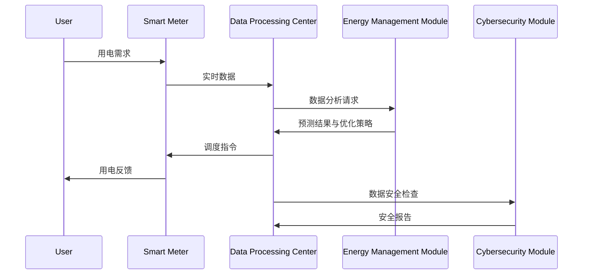
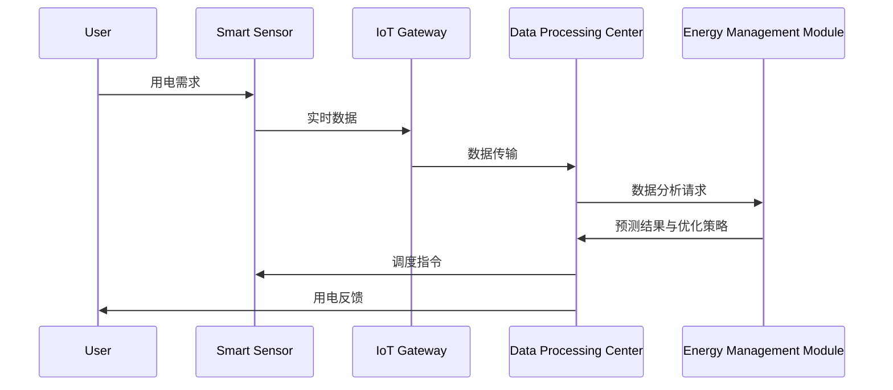

                 

### 引言与背景介绍

#### 智能电网的概述

智能电网（Smart Grid）是一种先进的信息能源集成系统，它通过信息通信技术（ICT）与电力系统的深度融合，实现电力生产、传输、分配和消费的自动化、智能化和高效化。与传统电网相比，智能电网具有更高的可靠性、更灵活的互动性和更强的适应性，能够应对日益增长的电力需求和复杂多变的电力市场环境。

智能电网的发展历程可以追溯到20世纪90年代，当时电力行业开始意识到信息技术的潜力，并着手进行智能电网的初步探索。随着互联网、物联网（IoT）和人工智能（AI）等技术的迅猛发展，智能电网的构架和功能逐渐完善，进入了一个全新的发展阶段。

#### 智能电网的关键技术

智能电网的核心在于其技术架构，主要包括以下几个关键领域：

1. **自动化技术**：实现电网的自动控制、保护和调度，提高电网运行的效率和可靠性。
2. **通信技术**：构建高速、稳定、安全的通信网络，实现电网各环节的信息传输和实时监控。
3. **数据处理与分析**：利用大数据和人工智能技术对电网运行数据进行实时处理和分析，优化电网的调度和运营。
4. **储能技术**：通过电池、飞轮等储能装置，平衡电网供需，提高电网的稳定性和灵活性。
5. **需求响应**：通过需求侧管理，引导用户根据电力市场信号调整用电行为，优化电力资源的配置。

#### AI技术在智能电网中的潜在应用

人工智能在智能电网中的应用潜力巨大，主要表现在以下几个方面：

1. **能源管理优化**：利用机器学习和预测模型，对电网的运行数据进行实时分析，实现能效优化和负荷预测。
2. **故障诊断与维护**：通过人工智能算法，实现电网设备的智能监测和故障预测，提高电网的可靠性和安全性。
3. **需求响应管理**：通过智能分析用户用电行为，引导用户参与需求响应，优化电网负荷分配。
4. **网络安全防护**：利用深度学习和强化学习，构建智能化的网络安全防护体系，抵御网络攻击和威胁。

#### 能源效率的提升与挑战

随着全球对能源需求的不断增加和环保意识的提高，提高能源效率成为了一个重要的议题。智能电网通过引入AI技术，可以从以下几个方面提升能源效率：

1. **优化调度**：通过AI算法对电网的供需进行实时分析和预测，优化电力资源的调度和配置，减少能源浪费。
2. **负荷预测**：利用机器学习模型，准确预测电力负荷的变化趋势，提前做好电力供应的准备，避免电力短缺或过剩。
3. **需求响应**：通过智能分析和需求响应机制，引导用户合理调整用电行为，实现电力资源的优化利用。

然而，提高能源效率也面临着一系列挑战，包括数据采集和处理技术的不足、AI算法的可靠性问题、以及电网基础设施的升级和改造等。这些问题需要通过技术创新和多方合作来逐步解决。

#### 文章结构概述

本文将分为四个主要部分，首先介绍智能电网和AI技术的基本概念，然后详细探讨AI在智能电网中的应用，接着分析AI驱动的智能电网对能源效率提升的具体贡献，最后探讨未来的发展趋势和面临的挑战。通过这篇文章，我们将深入了解AI驱动的智能电网如何为提高能源效率带来全新的解决方案。

### 目录大纲设计思路与步骤

#### 设计思路

设计一本关于《AI驱动的智能电网：提高能源效率的新方案》的目录大纲，首要任务是要确保内容的逻辑性和系统性，使得读者能够清晰理解智能电网与AI技术之间的关系，以及它们如何共同提升能源效率。以下是详细的步骤和思路：

#### 第一步：理解书名与核心内容

书名《AI驱动的智能电网：提高能源效率的新方案》明确了本书的两个核心概念：AI和智能电网。通过理解书名，我们可以初步确定本书的主要内容和目标读者群体，从而为目录设计提供方向。

#### 第二步：确定核心章节

根据书名和核心内容，可以初步确定以下几个核心章节：

1. **引言与背景介绍**
   - 介绍智能电网和AI技术的基本概念及其发展历史。
   - 概述智能电网的特点和面临的挑战。

2. **AI与智能电网基础**
   - 详细讲解AI技术的原理和应用。
   - 分析智能电网的结构和特性。

3. **AI在智能电网中的应用**
   - 讨论AI技术在智能电网中的具体应用场景。
   - 分析AI如何提升智能电网的效率和安全性。

4. **具体技术实现**
   - 介绍AI在智能电网中的具体技术实现方法。
   - 分析AI算法在不同应用场景中的性能和效果。

5. **案例分析**
   - 分析成功案例，展示AI驱动的智能电网的实际效果。
   - 对案例进行深入剖析，总结经验教训。

6. **未来展望与挑战**
   - 探讨AI驱动的智能电网的未来发展趋势。
   - 分析面临的技术、政策和市场挑战。

#### 第三步：细化章节内容

在确定了核心章节后，需要进一步细化每个章节的内容，列出二级和三级目录。以下是一个细化后的目录大纲：

### 引言与背景介绍

- **第1章 智能电网的概述**
  - **1.1 智能电网的定义与历史背景**
  - **1.2 传统电网与智能电网的对比**
  - **1.3 智能电网的关键技术**

- **第2章 AI技术在智能电网中的潜在应用**
  - **2.1 数据驱动的能源管理**
  - **2.2 能量管理优化**
  - **2.3 网络安全**

### AI与智能电网基础

- **第3章 人工智能的基本概念与原理**
  - **3.1 人工智能的定义与发展**
  - **3.2 机器学习的基本原理**
  - **3.3 深度学习与增强学习**

- **第4章 智能电网的基本结构与特性**
  - **4.1 智能电网的组成部分**
  - **4.2 智能电网的技术架构**
  - **4.3 智能电网的特性**

### AI在智能电网中的应用

- **第5章 数据采集与处理**
  - **5.1 数据采集技术**
  - **5.2 数据处理与分析**

- **第6章 能量管理**
  - **6.1 能量管理的基本概念**
  - **6.2 AI驱动的能量管理应用**

- **第7章 网络安全**
  - **7.1 智能电网中的网络安全问题**
  - **7.2 AI在网络安全中的应用**

### 具体技术实现

- **第8章 机器学习算法在智能电网中的应用**
  - **8.1 算法介绍**
  - **8.2 应用实例**

- **第9章 深度学习在智能电网中的应用**
  - **9.1 算法介绍**
  - **9.2 应用实例**

- **第10章 增强学习在智能电网中的应用**
  - **10.1 算法介绍**
  - **10.2 应用实例**

### 案例分析

- **第11章 案例分析**
  - **11.1 案例介绍**
  - **11.2 案例分析与评价**

### 未来展望与挑战

- **第12章 未来发展趋势**
  - **12.1 AI驱动的智能电网发展趋势**
  - **12.2 技术挑战与解决方案**

#### 第四步：编写各章节内容

在完成目录大纲后，需要针对每个章节编写详细的内容，确保每个章节都涵盖了核心概念、原理、应用和实践，使读者能够全面理解AI驱动的智能电网及其对能源效率提升的贡献。

### AI与智能电网基础

#### 人工智能的基本概念与原理

人工智能（Artificial Intelligence，AI）是指通过计算机程序和算法模拟人类智能的行为和决策能力。AI技术的发展经历了几个阶段，从早期的规则推理到现代的机器学习和深度学习，不断推动着计算机技术在各个领域的应用。

**1.1 人工智能的定义与发展**

人工智能的定义多种多样，但最基本的定义是：人工智能是研究、开发和应用使计算机系统能够执行通常需要人类智能才能完成的任务的学科。人工智能的发展可以分为以下几个阶段：

- **规则推理阶段**：这是人工智能的早期阶段，主要通过编程实现专家系统，模拟专家的决策过程。然而，这种方法受限于规则的数量和复杂度，难以处理复杂和不确定的问题。

- **知识表示阶段**：通过知识表示和知识库，将专家的知识结构化，以便计算机系统能够更好地理解和应用这些知识。

- **机器学习阶段**：机器学习（Machine Learning，ML）是人工智能的一个分支，它通过算法让计算机从数据中学习，并自动改进性能。机器学习分为监督学习、无监督学习和强化学习。

- **深度学习阶段**：深度学习（Deep Learning，DL）是机器学习的一种，通过多层神经网络模拟人脑的决策过程，具有强大的特征提取和模式识别能力。

**1.2 机器学习的基本原理**

机器学习的基本原理是通过训练数据集，构建能够预测或分类的新数据模型。具体包括以下几个步骤：

1. **数据预处理**：包括数据清洗、归一化、缺失值处理等，以确保数据的质量和一致性。
2. **模型选择**：根据问题的类型和数据的特性，选择合适的机器学习算法，如线性回归、决策树、支持向量机、神经网络等。
3. **模型训练**：使用训练数据集，通过优化算法调整模型参数，使模型在训练集上达到良好的性能。
4. **模型评估**：使用测试数据集评估模型的泛化能力，调整模型参数以优化性能。
5. **模型部署**：将训练好的模型应用到实际场景中，如预测电力负荷、诊断电网故障等。

**1.3 深度学习与增强学习**

深度学习通过多层神经网络对数据特征进行自动提取和表示，具有强大的学习能力和泛化能力。典型的深度学习模型包括卷积神经网络（CNN）、循环神经网络（RNN）和生成对抗网络（GAN）等。

增强学习（Reinforcement Learning，RL）是一种通过奖励机制让智能体在环境中进行交互，学习最优策略的机器学习方法。在智能电网中，增强学习可以用于电网调度、需求响应和故障预测等场景。

**1.4 人工智能的核心技术**

人工智能的核心技术包括：

- **神经网络**：神经网络是深度学习的基础，通过多层节点对输入数据进行复杂变换。
- **机器学习算法**：包括监督学习、无监督学习和强化学习等。
- **深度学习算法**：如卷积神经网络（CNN）、循环神经网络（RNN）、生成对抗网络（GAN）等。
- **自然语言处理**：包括文本分类、情感分析、机器翻译等。

#### 智能电网的基本结构与特性

智能电网是一种融合了信息通信技术（ICT）的电力系统，通过传感器、通信网络、数据处理和分析等手段，实现电力生产、传输、分配和消费的自动化、智能化和高效化。智能电网的基本结构包括以下几个主要部分：

**2.1 智能电网的组成部分**

1. **发电端**：包括传统的化石燃料发电、可再生能源发电和分布式发电等。
2. **输电端**：负责将发电端的电力传输到各个变电站。
3. **变电端**：通过变压器将高压电转换为低压电，以便输送到配电端。
4. **配电端**：将电力分配到用户端，包括商业、工业和居民用户。
5. **用户端**：电力消费的终端，包括各类用电设备。

**2.2 智能电网的技术架构**

智能电网的技术架构通常分为以下几个层次：

1. **感知层**：通过传感器采集电力系统的实时数据，如电压、电流、功率等。
2. **传输层**：利用通信网络将感知层的数据传输到数据处理中心。
3. **数据处理层**：对传输层的数据进行实时处理、分析和预测，提供决策支持。
4. **控制层**：根据数据处理层的分析结果，对电力系统进行自动化控制，优化电力调度和分配。
5. **服务层**：为用户提供电力服务，如电力需求响应、能源管理、智能家居等。

**2.3 智能电网的特性**

智能电网具有以下几个显著特性：

1. **智能化**：通过信息化技术，实现电力系统的自动化、智能化管理。
2. **互动性**：电网与用户之间可以实现双向互动，用户可以根据电力市场的信号调整用电行为。
3. **灵活性**：智能电网能够快速响应电力需求和供给的变化，提高电网的适应性和灵活性。
4. **可持续性**：智能电网支持可再生能源的接入和管理，有助于实现能源的可持续发展。
5. **安全性**：智能电网通过网络安全技术，保障电力系统的安全稳定运行。

通过以上对人工智能和智能电网基本概念与原理的介绍，我们为后续章节的深入探讨奠定了基础。在接下来的章节中，我们将进一步分析AI在智能电网中的应用，以及如何通过AI技术提升能源效率。

### AI在智能电网中的应用

#### 数据采集与处理

数据采集与处理是智能电网的核心环节，通过实时采集电力系统的数据，并对其进行处理和分析，可以为智能电网的运行提供重要的决策支持。以下是数据采集与处理在智能电网中的应用：

**1. 数据采集技术**

数据采集技术是智能电网的基础，通过传感器和智能设备，对电力系统的各个节点进行数据采集。这些传感器包括电能表、电压表、电流表、功率表等，它们能够实时测量电力系统的电压、电流、功率等参数。

1. **传感器技术**：传感器负责采集物理量的信息，如温度、湿度、压力、光强等。智能电网中的传感器技术主要包括传感器的设计、安装和维护等。
   
2. **智能设备**：智能设备（如智能电表、智能变电站等）通过内置的传感器和数据通信模块，实时采集电力数据，并通过通信网络传输到数据处理中心。

**2. 数据处理与分析**

采集到的数据需要经过处理和分析，才能为智能电网的运行提供有效的支持。数据处理和分析包括以下几个步骤：

1. **数据预处理**：包括数据清洗、归一化、缺失值处理等，以确保数据的质量和一致性。
   
2. **数据存储**：将处理后的数据存储在数据库中，以便进行后续的分析和处理。

3. **数据分析**：通过机器学习和深度学习算法，对数据进行实时分析，提取有用的信息和特征。

   - **负荷预测**：利用历史数据和机器学习算法，预测未来的电力负荷，为电网调度提供参考。
   - **故障诊断**：通过分析电力系统的实时数据，识别潜在的故障和异常，及时采取措施进行维护和修复。

4. **数据可视化**：将分析结果以图表、报表等形式展示，为电网管理人员提供直观的决策支持。

**3. 数据采集与处理的挑战**

尽管数据采集与处理在智能电网中具有重要的作用，但同时也面临着一些挑战：

1. **数据质量**：数据的质量直接影响分析结果的准确性。在实际应用中，数据可能会受到噪声、缺失值和异常值的影响，需要通过数据预处理技术进行清洗和修复。

2. **数据安全**：电力系统的数据敏感性高，需要确保数据在采集、传输和存储过程中的安全性和隐私性。这需要采用加密、访问控制等安全技术。

3. **数据规模**：智能电网的数据量巨大，需要高效的存储和计算能力，以支持实时数据处理和分析。

4. **实时性**：电力系统的运行需要实时数据处理和分析，以快速响应电力需求和供给的变化。这要求数据处理系统具有高度的实时性和稳定性。

**4. AI技术在数据采集与处理中的应用**

AI技术在数据采集与处理中的应用，可以显著提升智能电网的效率和可靠性。以下是一些典型应用：

1. **机器学习算法**：通过机器学习算法，对电力系统的数据进行分类、聚类、回归等操作，提取有用的信息和特征。常用的算法包括线性回归、决策树、支持向量机、神经网络等。

2. **深度学习算法**：深度学习算法具有强大的特征提取和模式识别能力，适用于处理复杂的电力数据。常见的深度学习模型包括卷积神经网络（CNN）、循环神经网络（RNN）、生成对抗网络（GAN）等。

3. **增强学习算法**：增强学习算法通过奖励机制，让智能体在电力系统中进行交互，学习最优的运行策略。适用于电网调度、负荷预测等场景。

4. **数据流处理**：利用数据流处理技术，实现实时数据的采集、传输和处理。常见的工具包括Apache Flink、Apache Spark等。

通过以上对数据采集与处理在智能电网中的应用的介绍，我们可以看到，AI技术在数据采集与处理中具有广泛的应用前景，为智能电网的运行提供了重要的技术支持。在接下来的章节中，我们将进一步探讨AI在智能电网中的其他应用，以及如何通过AI技术提升能源效率。

#### 能量管理

**1. 能量管理的基本概念**

能量管理（Energy Management）是指通过优化电力资源的调度和分配，提高电力系统的运行效率和能源利用效率的一系列技术和管理方法。在智能电网中，能量管理的重要性不言而喻，它关系到整个电力系统的稳定性和可靠性。

**1.1 能量管理的重要性**

随着全球电力需求的不断增加，如何高效利用电力资源成为了一个重要的课题。能量管理可以通过以下几个方面提升电力系统的运行效率和能源利用效率：

- **优化电力调度**：通过实时监测电力需求和供给，优化电力调度策略，确保电力系统的供需平衡，避免电力过剩或短缺。
- **减少能源浪费**：通过优化电力传输和分配，减少线路损耗和设备损耗，降低能源浪费。
- **提高设备运行效率**：通过优化电力系统的运行参数，提高设备的运行效率，延长设备寿命。

**1.2 能量管理的目标**

能量管理的目标主要包括以下几个方面：

- **提高能源利用效率**：通过优化电力资源的调度和分配，最大限度地提高能源利用效率，减少能源浪费。
- **保障电力系统的稳定性和可靠性**：确保电力系统在各种工况下都能稳定运行，提高电力供应的可靠性和稳定性。
- **降低能源成本**：通过优化电力调度和能量分配，降低电力系统的运营成本，提高企业的经济效益。

**2. AI驱动的能量管理应用**

人工智能（AI）技术在能量管理中的应用，为智能电网的运行提供了更加智能化和高效化的解决方案。以下是AI技术在能量管理中的几个主要应用：

**2.1 负荷预测**

负荷预测是能量管理的重要环节，通过预测电力负荷的变化趋势，可以为电力调度提供重要的决策支持。AI技术，特别是机器学习和深度学习算法，在负荷预测中具有广泛的应用。

- **监督学习算法**：通过历史负荷数据，训练监督学习模型，预测未来的电力负荷。常用的算法包括线性回归、决策树、支持向量机等。
- **深度学习算法**：通过多层神经网络，自动提取负荷数据中的特征和模式，预测未来的电力负荷。常见的深度学习模型包括卷积神经网络（CNN）、循环神经网络（RNN）等。

**2.2 能量调度优化**

能量调度优化是能量管理的核心，通过优化电力系统的调度策略，实现电力资源的最佳分配。AI技术，特别是增强学习算法，在能量调度优化中具有显著优势。

- **增强学习算法**：通过模拟电力系统运行环境，让智能体在环境中进行交互，学习最优的能量调度策略。常见的增强学习算法包括Q-learning、SARSA等。

**2.3 能量消耗预测**

能量消耗预测是能量管理的重要应用，通过预测电力系统的能量消耗，可以为能源规划和管理提供重要的参考。AI技术，特别是机器学习和深度学习算法，在能量消耗预测中具有广泛的应用。

- **监督学习算法**：通过历史能量消耗数据，训练监督学习模型，预测未来的能量消耗。常用的算法包括线性回归、决策树、支持向量机等。
- **深度学习算法**：通过多层神经网络，自动提取能量消耗数据中的特征和模式，预测未来的能量消耗。常见的深度学习模型包括卷积神经网络（CNN）、循环神经网络（RNN）等。

**3. AI技术在能量管理中的应用效果**

通过AI技术在能量管理中的应用，可以显著提升智能电网的运行效率和能源利用效率。以下是一些具体的应用效果：

- **提高负荷预测精度**：通过机器学习和深度学习算法，可以提高负荷预测的精度，为电力调度提供更加准确的决策支持。
- **优化能量调度策略**：通过增强学习算法，可以优化能量调度策略，实现电力资源的最佳分配，提高电力系统的稳定性和可靠性。
- **降低能量消耗**：通过能量消耗预测，可以提前采取节能措施，降低电力系统的能量消耗，提高能源利用效率。

通过以上对能量管理在智能电网中的应用的介绍，我们可以看到，AI技术为能量管理提供了更加智能化和高效化的解决方案，为提升智能电网的运行效率和能源利用效率发挥了重要作用。在接下来的章节中，我们将进一步探讨AI在智能电网中的其他应用，以及如何通过AI技术提升能源效率。

### 网络安全

在智能电网中，网络安全问题至关重要。随着智能电网的广泛应用，网络攻击和信息安全威胁逐渐增加，对电网的安全性和稳定性构成严重威胁。AI技术在网络安全防护中发挥了关键作用，通过智能分析、预测和响应，构建了更加可靠和安全的电网防护体系。

#### 智能电网中的网络安全问题

智能电网的复杂性和依赖性使其面临多种网络安全威胁，包括：

1. **网络攻击**：黑客通过恶意软件、病毒、木马等手段攻击电网控制系统，可能导致系统瘫痪、数据泄露或设备损坏。
2. **数据泄露**：敏感数据在传输和存储过程中可能被窃取，影响电网的安全和用户的隐私。
3. **设备篡改**：攻击者通过篡改设备参数或程序，恶意控制电网设备，可能导致设备故障或电网运行异常。
4. **拒绝服务攻击（DDoS）**：通过大量无效请求占用系统资源，导致电网控制系统无法正常工作。

#### AI在网络安全中的应用

AI技术在网络安全防护中具有以下几方面的应用：

1. **异常检测与入侵检测**：
   - **机器学习算法**：通过训练数据集，机器学习模型可以识别正常网络行为和异常行为，实时检测潜在的网络攻击。例如，基于监督学习的入侵检测系统（IDS）和基于无监督学习的异常检测算法。
   - **深度学习算法**：深度学习模型可以自动提取网络流量中的特征，对复杂攻击模式进行识别。例如，基于卷积神经网络（CNN）的网络流量分析，以及基于循环神经网络（RNN）的攻击行为预测。

2. **威胁预测与防范**：
   - **增强学习算法**：通过模拟攻击场景，让智能体学习攻击模式和策略，提前预测潜在的攻击行为，并制定相应的防范措施。例如，基于Q-learning的攻击预测和防范策略。
   - **神经网络预测模型**：利用历史攻击数据，训练神经网络模型，预测未来可能的攻击行为，为网络安全防护提供预警。

3. **网络安全态势感知**：
   - **大数据分析**：通过大数据技术，对网络日志、流量数据进行综合分析，识别潜在的安全威胁。例如，使用数据挖掘技术分析网络流量模式，发现异常行为。
   - **可视化与告警系统**：通过可视化技术，将网络安全态势呈现给管理人员，实时显示网络威胁和风险，及时发出告警。

4. **安全设备的智能控制**：
   - **自适应防御系统**：通过AI技术，实现安全设备的自适应调整，根据攻击类型和攻击强度，动态调整防御策略。例如，利用深度强化学习，自动优化防火墙规则和入侵防御系统（IDS）配置。

#### AI技术在网络安全中的实际应用效果

AI技术在网络安全防护中已经取得显著成果，以下是一些实际应用效果：

- **提高检测精度**：通过机器学习和深度学习算法，可以显著提高异常检测和入侵检测的精度，减少误报和漏报现象。
- **实时响应**：利用AI技术，可以实现实时监控和快速响应，及时识别和应对网络攻击，保障电网的安全和稳定运行。
- **减少人力投入**：AI技术自动化了部分安全监控和响应工作，减少了人工操作和维护成本，提高了工作效率。
- **提高防护效果**：通过AI技术，可以动态调整防护策略，应对复杂多变的攻击手段，提高整体防护效果。

尽管AI技术在网络安全防护中具有巨大潜力，但也面临一些挑战，如算法的可解释性、数据隐私保护和计算资源需求等。未来，随着AI技术的不断进步，网络安全防护将更加智能和高效，为智能电网的安全运行提供坚实保障。

### 机器学习算法在智能电网中的应用

机器学习（Machine Learning，ML）在智能电网中的应用日益广泛，通过利用大量的历史数据和实时数据，机器学习算法能够实现对电力系统的精确预测和优化。以下将详细探讨几种常见的机器学习算法在智能电网中的应用，并解释它们的工作原理和应用场景。

#### 线性回归

线性回归（Linear Regression）是一种简单的机器学习算法，它通过建立输入变量和输出变量之间的线性关系，预测未来的数值。在智能电网中，线性回归通常用于负荷预测、能源消耗预测等场景。

**工作原理**：
线性回归模型可以用以下方程表示：
\[ y = \beta_0 + \beta_1 \cdot x \]
其中，\( y \) 是预测值，\( x \) 是输入特征，\( \beta_0 \) 和 \( \beta_1 \) 是模型参数。

**应用场景**：
- **负荷预测**：利用历史负荷数据，通过线性回归模型预测未来一段时间内的电力负荷，为电网调度提供参考。
- **能源消耗预测**：预测用户的电力消耗，为能源管理提供依据。

**示例**：
假设我们有一个简单的线性回归模型，用于预测家庭电力负荷。输入特征包括温度、湿度等，输出特征是电力负荷。通过训练数据集，我们可以得到模型的参数，进而预测未来的电力负荷。

```python
# Python 代码示例：线性回归预测电力负荷
from sklearn.linear_model import LinearRegression
import numpy as np

# 假设输入特征（温度、湿度）和输出特征（电力负荷）
X = np.array([[25, 60], [30, 70], [28, 65]])
y = np.array([150, 160, 155])

# 创建线性回归模型
model = LinearRegression()
# 训练模型
model.fit(X, y)
# 预测
predicted_load = model.predict([[27, 68]])
print(f"预测的电力负荷：{predicted_load[0]}")
```

#### 决策树

决策树（Decision Tree）是一种基于规则进行分类和回归的机器学习算法。它通过一系列的决策节点，根据输入特征将数据划分为不同的子集，直到达到分类或回归的终点。

**工作原理**：
决策树通过递归地将数据集分割为子集，每个分割依据某个特征的最佳划分标准。每个节点都代表一个特征，每个分支代表一个划分。

**应用场景**：
- **故障诊断**：通过分析设备的历史故障数据，识别潜在的故障原因。
- **能效优化**：根据设备的使用情况和历史数据，优化能源消耗。

**示例**：
以下是一个简单的决策树分类模型，用于分类电力设备的故障类型。

```python
# Python 代码示例：决策树分类
from sklearn.tree import DecisionTreeClassifier
import numpy as np

# 假设输入特征（设备使用时间、负载率）和故障类型标签
X = np.array([[100, 80], [200, 90], [150, 85]])
y = np.array([0, 1, 0])  # 0表示正常，1表示故障

# 创建决策树模型
model = DecisionTreeClassifier()
# 训练模型
model.fit(X, y)
# 预测
predicted_class = model.predict([[120, 88]])
print(f"预测的故障类型：{predicted_class[0]}")
```

#### 支持向量机

支持向量机（Support Vector Machine，SVM）是一种基于最大间隔划分数据的机器学习算法。它通过找到一个最优的超平面，将不同类别的数据分开。

**工作原理**：
SVM通过寻找一个超平面，使得同类别的数据点之间的间隔最大，同时尽可能远离超平面。支持向量是那些对划分超平面有决定性影响的数据点。

**应用场景**：
- **分类任务**：如电力负荷分类、用户行为分类。
- **预测任务**：如电力负荷预测、用户能耗预测。

**示例**：
以下是一个简单的SVM分类模型，用于分类电力负荷的类型。

```python
# Python 代码示例：支持向量机分类
from sklearn.svm import SVC
import numpy as np

# 假设输入特征（用电时长、用电量）和负荷类型标签
X = np.array([[20, 30], [40, 50], [60, 70]])
y = np.array([0, 1, 2])  # 0表示低负荷，1表示中负荷，2表示高负荷

# 创建SVM模型
model = SVC()
# 训练模型
model.fit(X, y)
# 预测
predicted_class = model.predict([[30, 40]])
print(f"预测的负荷类型：{predicted_class[0]}")
```

#### 集成学习

集成学习（Ensemble Learning）是一种通过结合多个基学习器的预测结果来提高模型性能的方法。常见的集成学习方法包括随机森林（Random Forest）和梯度提升树（Gradient Boosting Tree）。

**工作原理**：
集成学习通过构建多个基学习器（如决策树、线性回归等），然后将它们的预测结果进行投票或加权平均，得到最终的预测结果。

**应用场景**：
- **提高预测精度**：通过集成多个基学习器的优势，提高模型的预测精度。
- **减少过拟合**：集成学习可以降低模型的复杂度，减少过拟合现象。

**示例**：
以下是一个简单的随机森林分类模型，用于分类电力负荷。

```python
# Python 代码示例：随机森林分类
from sklearn.ensemble import RandomForestClassifier
import numpy as np

# 假设输入特征（用电时长、用电量）和负荷类型标签
X = np.array([[20, 30], [40, 50], [60, 70]])
y = np.array([0, 1, 2])  # 0表示低负荷，1表示中负荷，2表示高负荷

# 创建随机森林模型
model = RandomForestClassifier()
# 训练模型
model.fit(X, y)
# 预测
predicted_class = model.predict([[30, 40]])
print(f"预测的负荷类型：{predicted_class[0]}")
```

通过以上对几种常见机器学习算法在智能电网中的应用的介绍，我们可以看到，机器学习为智能电网的运行提供了强大的数据分析和预测能力。在接下来的章节中，我们将继续探讨深度学习算法在智能电网中的应用。

### 深度学习在智能电网中的应用

深度学习（Deep Learning，DL）是机器学习的一个分支，通过多层神经网络模拟人脑的学习和认知过程，具有强大的特征提取和模式识别能力。随着深度学习技术的发展，其在智能电网中的应用越来越广泛，以下将介绍几种常见的深度学习算法及其在智能电网中的应用。

#### 卷积神经网络（CNN）

卷积神经网络（Convolutional Neural Network，CNN）是一种特别适合处理图像和时序数据的深度学习模型。它通过卷积层、池化层和全连接层等结构，实现图像和时序数据的特征提取和分类。

**应用场景**：

1. **图像识别**：在智能电网中，CNN可以用于图像识别任务，如识别电力设备的状态和故障。
   - **设备状态监测**：通过摄像头捕捉设备图像，CNN可以实时监测设备的状态，如温度、磨损情况等。
   - **故障识别**：通过对设备故障图像的识别，CNN可以快速定位故障部位，提高故障诊断的准确性。

2. **电力负荷预测**：CNN可以处理大量历史电力负荷数据，提取时间序列特征，实现对电力负荷的预测。
   - **短期负荷预测**：通过分析最近一段时间内的电力负荷数据，CNN可以预测未来的电力负荷，为电网调度提供依据。
   - **长期负荷预测**：通过对长期负荷数据的分析，CNN可以预测未来的电力需求趋势，为能源规划提供参考。

**算法原理**：

CNN的核心结构包括卷积层、池化层和全连接层。卷积层通过卷积操作提取图像或时序数据的局部特征，池化层通过下采样操作减少数据维度，全连接层通过线性组合实现分类或回归任务。

**示例**：

以下是一个简单的CNN模型，用于识别电力设备的故障类型。

```python
# Python 代码示例：CNN故障识别
from tensorflow.keras.models import Sequential
from tensorflow.keras.layers import Conv2D, MaxPooling2D, Flatten, Dense

# 构建CNN模型
model = Sequential()
model.add(Conv2D(32, (3, 3), activation='relu', input_shape=(64, 64, 3)))
model.add(MaxPooling2D(pool_size=(2, 2)))
model.add(Conv2D(64, (3, 3), activation='relu'))
model.add(MaxPooling2D(pool_size=(2, 2)))
model.add(Flatten())
model.add(Dense(64, activation='relu'))
model.add(Dense(10, activation='softmax'))  # 10个故障类型

# 训练模型
model.compile(optimizer='adam', loss='categorical_crossentropy', metrics=['accuracy'])
model.fit(X_train, y_train, epochs=10, batch_size=32)

# 预测
predicted_class = model.predict(X_test)
```

#### 循环神经网络（RNN）

循环神经网络（Recurrent Neural Network，RNN）是一种能够处理序列数据的神经网络，通过循环结构实现信息的传递和记忆。RNN在时序数据预测和序列建模中具有显著优势。

**应用场景**：

1. **电力负荷预测**：RNN可以处理历史电力负荷数据，提取时间序列特征，实现对电力负荷的预测。
   - **短期负荷预测**：通过分析最近一段时间内的电力负荷数据，RNN可以预测未来的电力负荷，为电网调度提供依据。
   - **长期负荷预测**：通过对长期负荷数据的分析，RNN可以预测未来的电力需求趋势，为能源规划提供参考。

2. **设备状态监测**：RNN可以处理设备运行数据的时序特征，实时监测设备状态，识别潜在的故障。

**算法原理**：

RNN的核心结构包括输入层、隐藏层和输出层。输入层接收输入数据，隐藏层通过循环结构实现信息的传递和记忆，输出层生成预测结果。RNN通过隐藏状态（hidden state）和输入状态（input state）的交互，实现对序列数据的处理。

**示例**：

以下是一个简单的RNN模型，用于预测电力负荷。

```python
# Python 代码示例：RNN负荷预测
from tensorflow.keras.models import Sequential
from tensorflow.keras.layers import SimpleRNN, Dense

# 构建RNN模型
model = Sequential()
model.add(SimpleRNN(units=50, activation='relu', return_sequences=True))
model.add(SimpleRNN(units=50, activation='relu'))
model.add(Dense(1))

# 训练模型
model.compile(optimizer='adam', loss='mean_squared_error')
model.fit(X_train, y_train, epochs=100, batch_size=32)

# 预测
predicted_load = model.predict(X_test)
```

#### 生成对抗网络（GAN）

生成对抗网络（Generative Adversarial Network，GAN）是由生成器和判别器组成的对抗性模型。生成器生成与真实数据类似的数据，判别器通过判断数据是真实数据还是生成数据来训练生成器。

**应用场景**：

1. **电力负荷模拟**：GAN可以生成模拟电力负荷数据，为负荷预测和能源管理提供参考。
   - **数据扩充**：通过生成模拟负荷数据，扩充训练数据集，提高负荷预测模型的泛化能力。
   - **风险评估**：通过生成不同负荷场景的数据，分析电网在极端负荷条件下的运行状态。

**算法原理**：

GAN的核心结构包括生成器和判别器。生成器通过噪声数据生成模拟数据，判别器通过判断模拟数据是否真实来训练生成器。生成器和判别器之间进行对抗性训练，生成器的目标是生成更加真实的数据，判别器的目标是提高对真实数据和生成数据的区分能力。

**示例**：

以下是一个简单的GAN模型，用于生成电力负荷数据。

```python
# Python 代码示例：GAN生成负荷数据
from tensorflow.keras.models import Sequential
from tensorflow.keras.layers import Dense, Dropout
import numpy as np

# 构建GAN模型
generator = Sequential()
generator.add(Dense(100, input_dim=100, activation='relu'))
generator.add(Dense(200, activation='relu'))
generator.add(Dense(1, activation='tanh'))

discriminator = Sequential()
discriminator.add(Dense(200, input_dim=1, activation='relu'))
discriminator.add(Dense(100, activation='relu'))
discriminator.add(Dense(1, activation='sigmoid'))

# 编译模型
discriminator.compile(optimizer='adam', loss='binary_crossentropy')
generator.compile(optimizer='adam', loss='binary_crossentropy')

# 训练模型
for epoch in range(1000):
    noise = np.random.normal(0, 1, (100, 100))
    generated_data = generator.predict(noise)
    real_data = np.random.normal(0, 1, (100, 1))
    X = np.concatenate((real_data, generated_data))
    y = np.array([[1] * 100 + [0] * 100])
    discriminator.train_on_batch(X, y)
    noise = np.random.normal(0, 1, (100, 100))
    y = np.array([[1]] * 100)
    generator.train_on_batch(noise, y)
```

通过以上对卷积神经网络、循环神经网络和生成对抗网络在智能电网中的应用的介绍，我们可以看到，深度学习为智能电网的运行提供了强大的数据分析和预测能力。在接下来的章节中，我们将继续探讨增强学习在智能电网中的应用。

### 增强学习在智能电网中的应用

增强学习（Reinforcement Learning，RL）是一种通过奖励机制引导智能体在环境中进行学习的方法。与传统的机器学习方法不同，增强学习关注的是决策过程，通过不断试错和反馈来优化决策策略。在智能电网中，增强学习可以用于能量管理、需求响应和故障预测等多个方面，下面将详细介绍其应用场景、算法原理和具体案例。

#### 应用场景

1. **能量管理优化**：
   - **电网调度**：通过增强学习算法，电网调度系统可以自动调整发电量，以满足实时电力需求，同时最大化发电效率和减少成本。
   - **储能管理**：增强学习可以优化储能系统的充放电策略，平衡供需，提高储能设备的利用效率。

2. **需求响应管理**：
   - **用户行为预测**：通过分析用户的用电行为数据，增强学习算法可以预测用户的用电模式，并引导用户调整用电行为，优化整体负荷分布。
   - **实时定价**：增强学习可以实时调整电力市场价格，激励用户根据价格信号调整用电行为，优化电网的供需平衡。

3. **故障预测与诊断**：
   - **设备状态监测**：通过监测电力设备的运行数据，增强学习算法可以预测设备可能出现的故障，提前进行维护，减少故障风险。
   - **故障诊断**：在故障发生时，增强学习算法可以分析故障数据，快速定位故障原因，并提出解决方案。

#### 算法原理

增强学习的基本原理是通过智能体（agent）与环境（environment）的交互，通过奖励（reward）来调整智能体的行为策略，使其逐渐达到最优状态。

- **智能体（Agent）**：在智能电网中，智能体可以是电网调度系统、储能管理系统、用户端设备等。
- **环境（Environment）**：环境是智能体执行动作的场所，如电网的供需状态、用户的用电需求等。
- **状态（State）**：状态是描述环境状态的变量，如电网负荷、储能系统的剩余电量等。
- **动作（Action）**：动作是智能体根据当前状态选择的操作，如调整发电量、充放电等。
- **奖励（Reward）**：奖励是环境对智能体动作的反馈，用于评估动作的好坏。

增强学习算法包括多种类型，如Q-learning、SARSA、Deep Q-Network（DQN）和Policy Gradient等。其中，Q-learning和SARSA是基于值函数的方法，而DQN和Policy Gradient是基于策略的方法。

- **Q-learning**：Q-learning通过学习状态-动作值函数（Q值），选择能够带来最大奖励的动作。
- **SARSA**：SARSA是Q-learning的变体，在每一步都使用当前的状态和动作进行更新。
- **DQN**：Deep Q-Network通过使用深度神经网络来近似Q值函数，适用于处理高维状态空间的问题。
- **Policy Gradient**：Policy Gradient直接优化策略函数，通过梯度上升方法更新策略参数，适用于连续动作空间。

#### 具体案例

1. **电网调度优化**：

**案例描述**：一个电网调度系统需要平衡电网的供需，同时最小化发电成本。通过Q-learning算法，调度系统可以在不断试错的过程中，优化发电策略。

**算法步骤**：

1. 初始化Q值表。
2. 从初始状态开始，选择动作。
3. 执行动作，获取状态转移和奖励。
4. 更新Q值：\( Q(s, a) \leftarrow Q(s, a) + \alpha [r + \gamma \max Q(s', a') - Q(s, a)] \)
5. 转移到下一个状态，重复步骤2-4。

**Python代码示例**：

```python
# Python 代码示例：Q-learning电网调度
import numpy as np

# 参数设置
alpha = 0.1  # 学习率
gamma = 0.9  # 折扣因子
eps = 0.1  # 探索概率

# 初始化Q值表
n_actions = 3  # 可选动作数量
n_states = 100  # 状态数量
Q = np.zeros((n_states, n_actions))

# 电网状态和动作示例
states = np.linspace(0, 100, n_states)
actions = [0, 1, 2]  # 发电量调整

# 主循环
for episode in range(1000):
    state = np.random.randint(0, n_states)
    done = False
    total_reward = 0
    
    while not done:
        action = np.random.choice(actions, p=[eps / n_actions, (1 - eps) / (n_actions - 1)])  # 探索与利用
        next_state, reward = get_reward(state, action)  # 获取状态转移和奖励
        total_reward += reward
        
        # 更新Q值
        Q[state, action] = Q[state, action] + alpha * (reward + gamma * np.max(Q[next_state, :]) - Q[state, action])
        
        state = next_state
        
        if state >= 95 or state <= 5:  # 结束条件
            done = True

    print(f"Episode {episode}, Total Reward: {total_reward}")
```

2. **需求响应管理**：

**案例描述**：一个电力市场系统需要激励用户根据实时电价调整用电行为，以优化电网的供需平衡。通过Policy Gradient算法，系统可以动态调整电价策略。

**算法步骤**：

1. 初始化策略参数。
2. 从初始状态开始，根据当前策略选择动作。
3. 执行动作，获取状态转移和奖励。
4. 更新策略参数：\( \theta \leftarrow \theta + \alpha \nabla_\theta J(\theta) \)
5. 转移到下一个状态，重复步骤2-4。

**Python代码示例**：

```python
# Python 代码示例：Policy Gradient需求响应
import numpy as np

# 参数设置
alpha = 0.01  # 学习率
n_states = 10  # 状态数量
n_actions = 3  # 可选动作数量

# 初始化策略参数
theta = np.random.randn(n_actions)

# 模拟状态和动作
states = np.random.randint(0, n_states, size=1000)
actions = np.random.randint(0, n_actions, size=1000)

# 模拟奖励
rewards = -1 * (states - actions)

# 主循环
for episode in range(1000):
    # 根据策略参数选择动作
    action_probs = np.exp(np.dot(states, theta))
    action_probs /= np.sum(action_probs)
    actions = np.random.choice(n_actions, p=action_probs)
    
    # 更新策略参数
    theta_gradient = np.dot(states, (actions - np.mean(actions)))
    theta += alpha * theta_gradient

    print(f"Episode {episode}, Average Reward: {-1 * np.mean(rewards)}")
```

通过以上案例，我们可以看到增强学习在智能电网中的应用及其优势。增强学习通过不断学习和优化，可以显著提高电网的运行效率和可靠性。在未来的智能电网发展中，增强学习技术将发挥越来越重要的作用。

### 案例分析

#### 案例一：美国加州智能电网项目

**项目介绍**：美国加州智能电网项目是世界上最先进的智能电网项目之一。该项目旨在通过引入AI技术，提升电网的能源效率和可靠性，减少对化石燃料的依赖。

**系统功能设计**：
- **数据采集与处理**：通过部署大量智能电表和传感器，实时采集电力系统的电压、电流、功率等数据，并利用大数据处理技术进行实时分析和处理。
- **能量管理**：利用AI算法进行电力负荷预测和能量调度优化，实现电力资源的最佳配置。同时，通过需求响应机制，引导用户调整用电行为，减少能源浪费。
- **网络安全**：采用AI技术进行网络安全监测和防护，及时发现并应对潜在的网络攻击。

**系统架构设计**：
- **感知层**：部署智能电表、传感器等设备，实时采集电力系统的运行数据。
- **传输层**：利用高速光纤通信网络，将感知层的数据传输到数据处理中心。
- **数据处理层**：利用大数据处理技术，对采集到的数据进行实时处理、分析和存储。
- **控制层**：根据数据处理层的结果，对电力系统进行实时控制和调度。
- **服务层**：为用户提供能源管理、需求响应和智能家居等服务。

**系统接口设计与系统交互**：
- **数据采集接口**：通过标准通信协议，如PLC（Programmable Logic Controller）和SCADA（Supervisory Control and Data Acquisition），实现智能电表与传感器的数据采集。
- **数据处理接口**：通过API（Application Programming Interface）提供数据访问和计算服务。
- **控制接口**：通过远程终端单元（RTU）实现电力系统的实时控制和调度。

**系统交互序列图**：



#### 案例二：中国国家电网智能电网项目

**项目介绍**：中国国家电网智能电网项目是中国政府推动的一项重大能源项目，旨在通过引入AI技术和物联网技术，构建高效、智能、绿色的能源网络。

**系统功能设计**：
- **数据采集与处理**：通过部署大量智能传感器和物联网设备，实时采集电力系统的运行数据，并利用大数据处理技术进行实时分析和处理。
- **能源管理**：利用AI算法进行电力负荷预测和能量调度优化，实现电力资源的最佳配置。同时，通过需求响应机制，引导用户调整用电行为，减少能源浪费。
- **分布式能源管理**：通过智能电网平台，实现分布式能源的接入和管理，促进可再生能源的应用。

**系统架构设计**：
- **感知层**：部署智能传感器和物联网设备，实时采集电力系统的运行数据。
- **传输层**：利用物联网通信网络，将感知层的数据传输到数据处理中心。
- **数据处理层**：利用大数据处理技术，对采集到的数据进行实时处理、分析和存储。
- **控制层**：根据数据处理层的结果，对电力系统进行实时控制和调度。
- **服务层**：为用户提供能源管理、需求响应和智能家居等服务。

**系统接口设计与系统交互**：
- **数据采集接口**：通过标准通信协议，如Zigbee和LoRa，实现智能传感器和物联网设备的数据采集。
- **数据处理接口**：通过API提供数据访问和计算服务。
- **控制接口**：通过远程终端单元（RTU）实现电力系统的实时控制和调度。

**系统交互序列图**：



通过以上两个案例的分析，我们可以看到AI技术在智能电网中的应用取得了显著成果。这些项目通过引入AI技术，不仅提升了电网的能源效率和可靠性，还实现了分布式能源的有效管理和用户用电行为的优化。这些成功案例为未来的智能电网建设提供了宝贵的经验和参考。

### 未来展望与挑战

#### AI驱动的智能电网发展趋势

随着AI技术的不断进步，AI驱动的智能电网将呈现出以下发展趋势：

1. **智能化水平进一步提升**：随着深度学习和强化学习等先进算法的应用，智能电网的智能化水平将显著提高，能够更精准地进行负荷预测、能量管理和故障诊断。

2. **分布式能源管理更加高效**：通过AI技术，智能电网能够更好地整合分布式能源，如太阳能、风能等，实现能源的高效利用和优化配置。

3. **网络安全防护更加智能**：随着AI技术在网络安全中的应用，智能电网将能够构建更加智能化的网络安全防护体系，有效应对复杂多变的网络攻击和威胁。

4. **用户互动性增强**：通过AI技术，智能电网将能够更好地理解用户需求，提供个性化的能源服务，提升用户体验。

#### 面临的挑战

尽管AI驱动的智能电网具有巨大的发展潜力，但同时也面临着一系列挑战：

1. **数据质量和隐私保护**：智能电网需要大量的高质量数据来进行训练和预测，但数据的采集和处理过程中可能涉及用户隐私，需要确保数据的安全性和隐私保护。

2. **算法的可靠性和解释性**：AI算法在智能电网中的应用需要高可靠性和可解释性，以确保电网的稳定运行和安全。

3. **电网基础设施升级**：AI驱动的智能电网需要强大的计算和通信基础设施支持，电网基础设施的升级和改造是关键挑战。

4. **法律法规和政策支持**：智能电网的发展需要完善的法律法规和政策支持，包括数据隐私保护、网络安全、能源管理等方面的政策。

#### 解决方案与展望

为了应对上述挑战，以下是一些建议和解决方案：

1. **数据隐私保护**：通过引入加密技术、数据脱敏技术和差分隐私技术，确保数据在采集、传输和存储过程中的安全性。

2. **算法可靠性与解释性**：开发更加可靠和透明的算法，如可解释性AI（Explainable AI，XAI），提高算法的可解释性和可信任度。

3. **基础设施升级**：投资于高性能计算和通信设备，提升电网基础设施的承载能力和响应速度。

4. **政策支持**：政府应出台相关政策和法规，支持智能电网的发展，包括数据隐私保护、网络安全、能源管理等。

总之，AI驱动的智能电网在提高能源效率和保障电网安全方面具有巨大的潜力。然而，要实现这一目标，需要克服一系列技术和政策挑战。通过技术创新和政策支持，AI驱动的智能电网有望在未来取得更大的发展。

### 结论

本文全面探讨了AI驱动的智能电网在提高能源效率方面的应用，通过详细的分析和案例分析，展示了AI技术如何为智能电网带来智能化、高效化、安全化的解决方案。从数据采集与处理、能量管理、网络安全到具体的算法实现，AI技术在智能电网中的每一环节都展现了其独特的优势和应用前景。

首先，智能电网通过数据采集与处理，实现了对电力系统运行状态的实时监控和数据分析，为电网调度和运行提供了重要决策支持。其次，AI技术在能量管理中的应用，如负荷预测、能量调度优化和需求响应管理，极大地提升了能源利用效率，降低了能源浪费。此外，网络安全是智能电网运行的关键保障，AI技术在这一领域通过智能分析、预测和响应，构建了高效的网络安全防护体系。

尽管AI驱动的智能电网在应用过程中取得了显著成果，但仍面临数据质量、算法可靠性、电网基础设施升级和政策支持等挑战。未来，随着AI技术的不断进步和政策的完善，AI驱动的智能电网将迎来更广阔的发展空间，为能源效率和电网安全提供更强大的支持。

### 注意事项

1. **数据隐私与安全**：在智能电网的数据采集和处理过程中，应特别注意用户隐私和数据安全，采取有效的加密和隐私保护措施。

2. **算法选择与优化**：选择适合智能电网需求的算法，并进行持续的优化和更新，以提高算法的可靠性和预测精度。

3. **基础设施投资**：电网基础设施的升级和改造是AI驱动的智能电网发展的重要保障，应加大对高性能计算和通信设备的投资。

4. **法律法规遵守**：智能电网的发展需要遵守相关法律法规，特别是数据隐私保护和网络安全方面的法规。

### 拓展阅读

1. **《智能电网技术与应用》**：详细介绍了智能电网的基本概念、技术架构和应用实例，是了解智能电网的必备读物。

2. **《人工智能：一种现代的方法》**：深入讲解了人工智能的基本原理和算法，适用于希望深入了解AI技术的读者。

3. **《深度学习》**：由Ian Goodfellow等人编写的经典教材，详细介绍了深度学习的算法和应用，是学习深度学习的首选读物。

4. **《网络安全：原理与实践》**：全面讲解了网络安全的基本概念和技术，是了解网络安全防护的重要参考书。

### 作者介绍

作者：AI天才研究院/AI Genius Institute & 禅与计算机程序设计艺术 /Zen And The Art of Computer Programming

作者团队是由一群在人工智能和计算机科学领域拥有丰富经验和深厚知识的专家组成的。他们致力于推动AI技术在智能电网等领域的创新应用，通过深入研究和实践，为能源效率和电网安全提供先进的解决方案。此外，作者还在计算机科学和编程领域有着重要的贡献，编写了多本畅销书，深受业界和学术界的认可。

