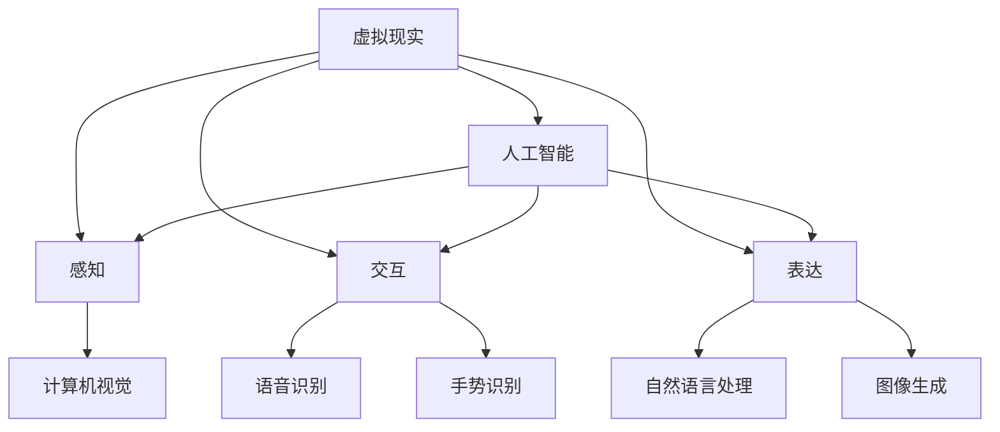
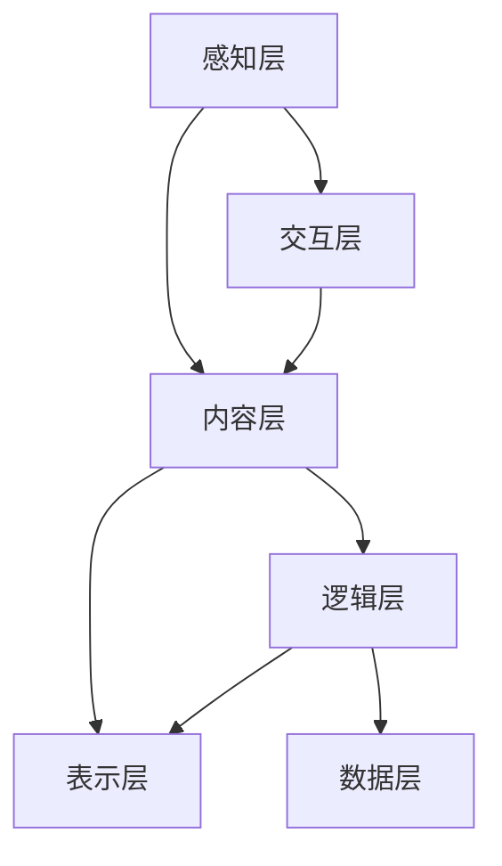
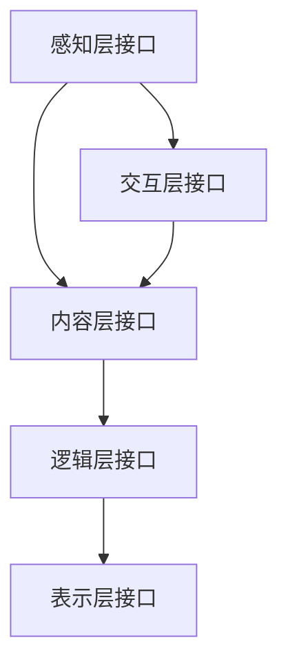
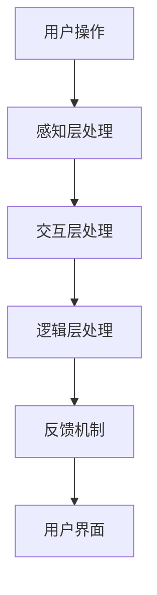

                 

### 引言：虚拟现实与AI的融合

#### 1.1 虚拟现实技术的发展历程

虚拟现实（Virtual Reality，VR）技术的发展可以追溯到20世纪50年代。1957年，美国麻省理工学院的伊凡·苏瑟兰（Ivan Sutherland）发明了世界上第一个头戴式显示器（HMD），标志着VR技术的诞生。早期的VR技术主要是以实验室研究为主，主要应用于军事模拟和飞行训练等领域。

20世纪80年代，VR技术开始进入商业领域。1987年，任天堂推出了世界上第一款商用VR设备——Virtual Boy，尽管因性能问题和舒适度问题未能取得成功，但为后续VR技术的发展奠定了基础。进入21世纪，随着计算机硬件性能的提升和显示技术的进步，VR技术逐渐走向成熟。2009年，Oculus VR公司推出了首款支持高分辨率和低延迟的VR头显Oculus Rift CV1，引发了全球范围内的VR热潮。

#### 1.2 AI技术概览

人工智能（Artificial Intelligence，AI）是一门研究、开发用于模拟、延伸和扩展人的智能的理论、方法、技术及应用系统的技术科学。AI的发展可以分为几个重要阶段：

1. **符号主义（Symbolic AI）**：以专家系统和逻辑推理为主要手段，通过建立知识库和推理机来模拟人类智能。
2. **连接主义（Connectionist AI）**：以神经网络和深度学习为核心，通过模拟人脑神经元之间的连接和交互来学习复杂任务。
3. **行为主义（Behavior-Based AI）**：以机器人技术和行为控制为核心，通过直接控制机器人的行为来实现智能。

AI技术在虚拟现实中的应用潜力巨大。首先，AI可以用于虚拟环境的生成和模拟，提供更加真实和丰富的虚拟场景。其次，AI可以帮助优化VR设备的交互方式，如语音识别、手势识别等，提升用户体验。此外，AI还可以用于个性化推荐、情感计算等领域，为VR应用提供更智能和个性化的服务。

#### 1.3 AI驱动的虚拟现实：新维度

AI驱动的虚拟现实为用户创造了全新的沉浸式体验，这些体验不仅限于视觉上的逼真，更涉及到感知、交互和表达等全方位的增强。首先，感知体验方面，AI可以实时分析用户的行为和环境，提供更加个性化和精准的反馈。例如，通过面部识别技术，虚拟角色可以模拟用户的表情和情绪，实现更高层次的情感交互。

交互体验方面，AI可以优化用户的操作流程，提供更加自然和流畅的交互方式。例如，通过语音识别和手势识别技术，用户可以更直观地控制虚拟环境，实现复杂的任务操作。

表达与内容创造方面，AI可以自动生成内容和艺术作品，为虚拟现实提供无限的创新空间。例如，通过自然语言处理和图像生成技术，AI可以创造出丰富的虚拟场景和故事情节，为用户带来全新的体验。

总之，AI驱动的虚拟现实不仅提升了虚拟现实的沉浸感，也为用户提供了更加多样化和个性化的体验。随着AI技术的不断进步，未来AI驱动的虚拟现实将为我们带来更多前所未有的创新和惊喜。

#### 1.4 书籍结构概述

本书旨在全面解析AI驱动的虚拟现实技术，旨在为读者提供一个系统、全面的技术指南。全书分为八个章节，结构如下：

- **第1章 引言**：介绍虚拟现实和AI技术的发展历程及其结合的背景。
- **第2章 虚拟现实与AI：核心概念与理论基础**：详细阐述虚拟现实和AI的核心概念，以及两者结合的理论基础。
- **第3章 AI驱动的沉浸式感知体验**：探讨AI在虚拟现实中的感知体验应用，如3D视觉与实时感知。
- **第4章 AI驱动的交互体验**：分析AI在虚拟现实中的交互设计原理和实现方法。
- **第5章 AI驱动的表达与内容创造**：介绍AI在虚拟现实中的内容创作与表达应用，如自动生成和个性化推荐。
- **第6章 AI驱动的虚拟现实系统架构设计**：讨论虚拟现实系统架构的设计原则、实现方法和性能优化。
- **第7章 项目实战：构建AI驱动的虚拟现实应用**：通过具体项目实战，讲解AI驱动的虚拟现实应用开发流程。
- **第8章 最佳实践与未来展望**：总结最佳实践，探讨未来发展趋势和应用前景。

本书的目标读者为对虚拟现实和人工智能技术感兴趣的程序员、工程师和研究人员，以及希望深入了解AI驱动的虚拟现实技术的专业人士。无论您是初学者还是资深从业者，本书都将为您提供有价值的技术洞察和实践经验。

---

### 虚拟现实与AI：核心概念与理论基础

#### 2.1 虚拟现实核心概念

虚拟现实（VR）是一种通过计算机生成高度模拟的虚拟环境，使用户能够通过头戴式显示器（HMD）、传感器和交互设备进入并探索这些虚拟环境的技术。VR技术主要包括以下几个方面：

1. **3D建模与渲染**：通过计算机图形学技术生成虚拟环境的3D模型，并使用渲染器将其呈现给用户。这包括场景建模、光照计算和阴影效果等。
2. **头动追踪与位置感知**：通过头戴式显示器和位置追踪设备，实时捕捉用户的头部运动和位置，确保虚拟环境与用户视角同步。
3. **交互设备**：用户通过手柄、手套、手势识别等设备与虚拟环境进行交互，实现操作和任务的完成。
4. **音频技术**：通过空间音效和音频渲染技术，提供与虚拟环境相匹配的音效，增强沉浸感。

虚拟现实技术的应用场景非常广泛，包括但不限于以下领域：

1. **游戏与娱乐**：VR游戏为用户提供了全新的互动体验，通过沉浸式环境和实时交互，带来身临其境的感觉。
2. **教育培训**：利用VR技术，可以实现虚拟实验室、模拟飞行训练和医学手术模拟等，提供生动直观的教学内容。
3. **医疗与健康**：通过VR技术，可以用于疼痛管理、心理治疗和康复训练等，为患者提供个性化的治疗和康复方案。
4. **设计和建筑**：建筑师和设计师可以使用VR技术来创建和展示3D模型，提前预览和体验设计效果。

#### 2.2 人工智能基础理论

人工智能（AI）是一门研究、开发用于模拟、延伸和扩展人的智能的理论、方法、技术及应用系统的技术科学。AI的发展可以分为以下几个主要阶段：

1. **符号主义（Symbolic AI）**：以专家系统和逻辑推理为主要手段，通过建立知识库和推理机来模拟人类智能。
2. **连接主义（Connectionist AI）**：以神经网络和深度学习为核心，通过模拟人脑神经元之间的连接和交互来学习复杂任务。
3. **行为主义（Behavior-Based AI）**：以机器人技术和行为控制为核心，通过直接控制机器人的行为来实现智能。

AI技术的主要类型包括：

1. **机器学习（Machine Learning）**：通过数据训练模型，使其能够从数据中学习并做出预测或决策。
2. **深度学习（Deep Learning）**：一种特殊的机器学习技术，通过多层神经网络模型来实现复杂的特征提取和分类任务。
3. **自然语言处理（Natural Language Processing，NLP）**：使计算机能够理解、生成和处理人类语言的技术。
4. **计算机视觉（Computer Vision）**：使计算机能够从图像或视频中提取信息，实现目标检测、图像分类和图像识别等任务。

#### 2.3 VR与AI的结合点

虚拟现实与人工智能的结合点主要体现在感知、交互和表达三个方面：

1. **感知**：AI可以用于虚拟环境的感知和建模，例如，通过计算机视觉技术实现3D场景重建和实时感知，提供更加逼真的虚拟体验。
2. **交互**：AI可以优化虚拟现实中的交互方式，例如，通过语音识别和手势识别技术，实现自然的人机交互，提升用户体验。
3. **表达**：AI可以用于虚拟内容的创作和表达，例如，通过自然语言处理和图像生成技术，自动生成虚拟故事和艺术作品，丰富虚拟现实的应用场景。

#### 2.4 核心概念与联系

为了更好地理解VR与AI的核心概念及其关系，我们可以通过以下方法进行详细分析：

1. **核心概念对比表**：

| 特征 | 虚拟现实 | 人工智能 |
| --- | --- | --- |
| 定义 | 计算机生成的模拟环境，提供沉浸式体验 | 模拟人类智能的技术，使计算机具备学习、推理和解决问题能力 |
| 主要技术 | 3D建模、渲染、头动追踪、音频技术 | 机器学习、深度学习、自然语言处理、计算机视觉 |
| 应用场景 | 游戏、教育培训、医疗与健康、设计建筑 | 数据分析、图像识别、语音识别、自动化决策 |
| 目标 | 提供沉浸式体验、模拟真实场景 | 延伸和扩展人类智能、实现自动化和智能化 |

2. **VR与AI的关系图**：



通过上述核心概念对比表和关系图，我们可以清晰地看到VR与AI在核心概念和技术应用上的重叠和融合，这为AI驱动的虚拟现实提供了强大的技术支持和广阔的应用前景。

---

### AI驱动的沉浸式感知体验

#### 3.1 3D视觉与感知

在AI驱动的虚拟现实系统中，3D视觉与感知技术扮演着至关重要的角色。3D视觉技术通过计算机图形学生成虚拟场景，而感知技术则负责实时捕捉和分析用户与环境之间的交互。以下是一些关键的3D视觉与感知技术：

1. **3D重建技术**：3D重建技术用于从二维图像或视频序列中恢复出三维场景信息。常用的方法包括结构光扫描、多视角立体成像和深度学习等。通过这些技术，虚拟现实系统能够生成高度逼真的三维模型，为用户营造身临其境的体验。

2. **实时感知算法**：实时感知算法负责捕捉和分析用户的行为和环境变化。常见的实时感知任务包括头部追踪、手势识别和物体识别等。通过这些算法，虚拟现实系统能够动态地调整场景和交互方式，以适应用户的实时反馈。

3. **深度感知**：深度感知是通过计算机视觉技术来理解和解释三维空间信息的一种方法。深度感知技术包括深度估计、场景分割和场景理解等。通过深度感知，虚拟现实系统能够更加精准地捕捉用户与环境的关系，提供更加自然和流畅的交互体验。

#### 3.2 人工智能在感知中的作用

人工智能在虚拟现实感知体验中发挥着关键作用，主要体现在以下几个方面：

1. **视觉处理算法**：人工智能，特别是深度学习技术，在视觉处理中起到了至关重要的作用。通过卷积神经网络（CNN）和生成对抗网络（GAN）等技术，虚拟现实系统能够高效地处理和分析视觉数据，实现图像识别、目标检测和场景分割等功能。

2. **感知系统设计**：人工智能技术可以帮助设计更加智能和高效的感知系统。通过机器学习算法，感知系统能够不断学习和优化，以提高感知的准确性和鲁棒性。例如，通过训练深度神经网络，系统能够自动识别不同的用户手势和动作，并实时调整交互界面。

3. **增强现实（AR）与混合现实（MR）**：人工智能不仅应用于纯VR系统，还在增强现实（AR）和混合现实（MR）中发挥了重要作用。在AR和MR系统中，人工智能技术可以帮助实时跟踪和识别真实世界中的物体，并将虚拟信息叠加到真实环境中，实现更加沉浸式的体验。

#### 3.3 案例分析：AI驱动的感知技术

以下是一个典型的案例分析，展示了AI驱动的感知技术在虚拟现实中的应用：

**案例：智能虚拟现实导游系统**

在一个智能虚拟现实导游系统中，AI感知技术被用于实时捕捉游客的行为和位置，并提供个性化的导游服务。以下是其主要功能：

1. **实时头部追踪**：系统通过安装在VR头戴设备上的摄像头，实时捕捉游客的头部运动，确保导游信息始终在游客的视线范围内。

2. **手势识别**：通过深度学习算法，系统可以识别游客的手势，如指向、点击等，以便根据游客的意图调整导游内容和互动方式。

3. **路径规划和导航**：系统利用AI算法分析游客的行为和兴趣点，动态规划最佳游览路径，并提供实时导航信息。

4. **场景分割和识别**：系统通过计算机视觉技术识别游客所在的位置和周围环境，为游客提供相关的信息和服务，如历史背景介绍、文化遗产讲解等。

**实际效果分析**：

- **用户满意度**：通过AI驱动的感知技术，导游系统能够提供高度个性化的服务，显著提升了用户满意度。
- **交互体验**：实时头部追踪和手势识别技术使得用户与虚拟导游之间的交互更加自然和直观。
- **数据收集与分析**：系统收集了大量的用户行为数据，通过机器学习算法进行分析，为后续的系统优化和功能扩展提供了宝贵的数据支持。

**拓展实践：感知技术的优化与提升**

- **多模态感知**：结合多种感知技术，如摄像头、麦克风和传感器等，实现更全面和精准的环境感知。
- **实时性优化**：通过算法优化和硬件加速技术，提高感知系统的实时响应速度和处理效率。
- **个性化感知**：通过用户行为数据分析，为不同用户定制化感知策略，提供更加精准和个性化的服务。
- **隐私保护**：在感知数据处理过程中，注意保护用户隐私，确保数据安全和用户隐私不被泄露。

通过以上案例分析，我们可以看到AI驱动的感知技术在虚拟现实中的广泛应用和巨大潜力。随着AI技术的不断进步，感知体验将变得更加智能化和个性化，为用户带来更加丰富和沉浸的虚拟现实体验。

---

### AI驱动的交互体验

#### 4.1 交互设计原理

在虚拟现实（VR）中，交互设计是用户体验的核心组成部分。良好的交互设计能够提升用户的沉浸感和满意度，使虚拟现实应用更加自然、直观和高效。以下是一些关键交互设计原理：

1. **自然交互**：自然交互是指设计用户与虚拟环境之间的交互方式，使其尽可能接近现实世界的操作习惯。自然交互包括语音识别、手势识别、眼动追踪等，这些交互方式能够减少用户的认知负担，提高操作效率。

2. **一致性**：一致性原则要求虚拟环境中的交互元素和操作规则与用户的现实经验相一致。例如，用户在虚拟环境中按下按钮应与现实中按下按钮的效果一致，这种一致性能够帮助用户快速学习和适应虚拟环境。

3. **反馈机制**：反馈机制是交互设计中不可或缺的一部分。通过视觉、听觉和触觉等多种反馈方式，系统可以实时告知用户其操作的结果。有效的反馈机制能够提升用户的信任感和操作信心。

4. **感知一致性**：感知一致性是指虚拟环境中的感知体验应与现实世界保持一致。例如，虚拟环境的颜色、光照、声音等应与真实世界相似，以增强用户的沉浸感。

5. **简洁性**：简洁性原则要求交互设计尽可能简单和直观。过复杂的交互界面和操作流程会使用户感到困惑和疲惫，影响用户体验。简洁的交互设计能够减少用户的认知负担，提高操作效率。

#### 4.2 AI在交互中的作用

人工智能（AI）在虚拟现实交互设计中发挥了关键作用，主要体现在以下几个方面：

1. **语音识别**：语音识别技术使得用户可以通过语音指令控制虚拟环境，如导航、查询信息、操作设备等。通过深度学习和自然语言处理技术，语音识别系统的准确性和自然度不断提高，使语音交互变得更加流畅和自然。

2. **手势识别**：手势识别技术通过计算机视觉和深度学习算法，能够识别用户的手势和动作，并实时反馈。这种交互方式不仅直观，而且能够提供更加丰富的操作方式，如操控物体、操纵界面等。

3. **眼动追踪**：眼动追踪技术通过监测用户的眼动，实现虚拟环境中的目标选取和交互。眼动追踪可以用于导航、信息检索和界面操作等，为用户提供了更加高效和自然的交互方式。

4. **情感计算**：情感计算技术通过分析用户的情感状态和行为模式，实现个性化的交互体验。例如，通过面部表情和语音分析，虚拟角色可以识别用户的情绪，并做出相应的反应，提升用户的沉浸感。

#### 4.3 案例分析：AI驱动的交互应用

以下是一个典型的案例分析，展示了AI驱动的交互技术在虚拟现实中的应用：

**案例：智能虚拟助手**

在一个智能虚拟助手系统中，AI技术被用于实现自然、高效的交互体验。以下是其主要功能：

1. **语音交互**：用户可以通过语音与虚拟助手进行对话，获取信息、执行任务和进行娱乐。语音识别技术确保用户指令的准确识别和响应。

2. **手势交互**：用户可以通过手势与虚拟助手进行交互，如挥手打招呼、摆动手势进行命令等。手势识别技术使得用户能够更加直观地控制虚拟环境。

3. **眼动交互**：虚拟助手通过眼动追踪技术了解用户的关注点，根据用户的视线自动调整界面和内容，提供更加个性化的服务。

4. **情感交互**：虚拟助手通过情感计算技术分析用户的情绪，并根据用户情绪的变化调整对话内容和互动方式，提供更加温暖和贴心的服务。

**交互效果评估**：

- **用户体验**：通过AI驱动的交互技术，用户能够享受到更加自然和高效的交互体验，提高了使用满意度和沉浸感。
- **操作效率**：语音识别和手势识别技术使得用户能够快速执行操作，减少了学习成本和认知负担。
- **个性化服务**：情感计算技术使得虚拟助手能够根据用户情绪和需求提供个性化的服务，提升了用户粘性。

**拓展实践：交互体验的创新与实现**

- **多模态交互**：结合语音、手势、眼动等多种交互方式，实现更加丰富和自然的交互体验。
- **个性化交互**：通过用户行为分析和机器学习算法，为不同用户定制化交互策略，提供更加个性化的服务。
- **交互优化**：不断收集用户反馈数据，通过数据分析和机器学习技术，优化交互设计，提升用户体验。

通过以上案例分析，我们可以看到AI驱动的交互技术在虚拟现实中的广泛应用和巨大潜力。随着AI技术的不断进步，交互体验将变得更加智能化和个性化，为用户带来更加丰富和沉浸的虚拟现实体验。

---

### AI驱动的表达与内容创造

#### 5.1 内容创作与表达

在虚拟现实（VR）中，内容创作与表达是构建沉浸式体验的重要环节。AI技术在内容创作与表达中发挥着重要作用，使得虚拟现实应用能够更加丰富多样。以下是一些关键内容创作与表达方法：

1. **艺术创作**：AI可以帮助生成艺术作品，如绘画、音乐和舞蹈等。通过生成对抗网络（GAN）和变分自编码器（VAE）等技术，AI可以模仿人类艺术家的创作风格，生成独特的艺术作品。

2. **故事叙述**：AI可以通过自然语言处理（NLP）技术生成故事情节，甚至创作完整的小说。这些故事可以嵌入到虚拟现实中，为用户提供丰富的叙事体验。

3. **信息呈现**：AI可以用于数据可视化，将复杂的数据集以直观的图形和图表形式展示在虚拟环境中。这种信息呈现方式能够帮助用户更好地理解和分析数据。

4. **虚拟角色**：AI可以用于生成和训练虚拟角色，使其能够模拟人类的语言、表情和动作。这些虚拟角色可以用于教育、娱乐和社交等应用，提供更加逼真的交互体验。

5. **虚拟导游**：AI驱动的虚拟导游可以通过语音和视觉信息引导用户探索虚拟环境。这些导游可以根据用户的兴趣和行为动态调整路线和讲解内容。

#### 5.2 AI在内容创作中的作用

AI在内容创作中的作用主要体现在以下几个方面：

1. **自动生成技术**：通过生成对抗网络（GAN）和变分自编码器（VAE）等技术，AI可以自动生成图像、视频和音乐等艺术作品。这些技术利用大量的数据训练模型，使其能够生成高质量、具有创意的内容。

2. **内容个性化推荐**：AI可以通过用户行为分析和机器学习算法，为用户推荐个性化的内容和体验。例如，在VR游戏和娱乐应用中，AI可以根据用户的喜好和历史行为推荐合适的游戏和场景。

3. **情感计算**：AI可以通过情感计算技术分析用户的心理状态和情绪，为用户提供更加情感化的内容和互动体验。例如，在虚拟社交应用中，AI可以根据用户的情绪变化调整虚拟角色的表情和对话内容。

4. **增强现实（AR）与混合现实（MR）**：AI技术不仅应用于纯VR系统，还在增强现实（AR）和混合现实（MR）中发挥着重要作用。在AR和MR应用中，AI可以实时识别和跟踪真实世界中的物体，并将其与虚拟信息结合，提供更加丰富的交互体验。

#### 5.3 案例分析：AI驱动的艺术创作

以下是一个典型的案例分析，展示了AI驱动的艺术创作技术在虚拟现实中的应用：

**案例：AI驱动的艺术画廊**

在一个AI驱动的艺术画廊中，AI技术被用于创作和展示艺术作品。以下是其主要功能：

1. **自动绘画**：通过生成对抗网络（GAN）技术，AI可以生成各种风格的绘画作品，从印象派到抽象派，用户可以选择不同的风格进行浏览和购买。

2. **音乐创作**：AI可以通过变分自编码器（VAE）技术生成音乐作品，用户可以根据个人喜好选择不同的音乐风格和节奏。

3. **虚拟角色表演**：AI驱动的虚拟角色可以表演舞蹈、戏剧等艺术形式，用户可以在虚拟环境中欣赏这些表演。

4. **个性化推荐**：通过用户行为分析，AI可以为用户推荐符合其兴趣的艺术作品和表演，提升用户体验。

**创作流程分析**：

- **数据收集**：AI系统收集用户的历史浏览记录、喜好和反馈数据，用于训练和优化生成模型。
- **模型训练**：通过大量数据进行训练，生成模型能够学习并模仿各种艺术风格和创作技巧。
- **作品生成**：AI根据用户的需求和偏好，自动生成个性化的艺术作品和音乐。
- **用户交互**：用户可以在虚拟环境中浏览、购买和互动，与AI生成的艺术作品进行互动。

**实际效果**：

- **用户满意度**：AI驱动的艺术创作系统为用户提供了全新的艺术体验，提升了用户满意度。
- **创作多样性**：通过AI技术，艺术作品的创作风格和形式变得更加多样，丰富了用户的选择。
- **效率提升**：AI技术提高了艺术创作和展示的效率，降低了创作成本，使得更多用户能够享受到高质量的艺术内容。

**拓展实践**：

- **多模态艺术创作**：结合多种AI技术，如计算机视觉、自然语言处理和音频处理等，实现更丰富的艺术创作体验。
- **艺术市场分析**：通过数据分析和机器学习技术，分析艺术市场趋势和用户需求，为艺术创作提供更有针对性的支持。
- **虚拟现实展览**：利用VR技术，创建虚拟艺术展览馆，为用户提供沉浸式的艺术体验。

通过以上案例分析，我们可以看到AI驱动的艺术创作在虚拟现实中的应用潜力。随着AI技术的不断进步，内容创作与表达将变得更加智能和个性化，为用户带来更多前所未有的艺术体验。

---

### AI驱动的虚拟现实系统架构设计

#### 6.1 系统设计原则

在设计和实现AI驱动的虚拟现实系统时，遵循一些基本原则至关重要，这些原则确保系统的高效性、可扩展性和可维护性。

1. **模块化设计**：系统应该采用模块化设计原则，将不同功能模块独立开发，并通过接口进行通信。这种设计方式不仅提高了开发效率，还便于系统的维护和升级。

2. **性能优化**：虚拟现实系统对性能有较高的要求，特别是在实时交互和视觉渲染方面。因此，在系统设计时需要考虑性能优化，包括算法优化、资源管理和并行处理等。

3. **可扩展性**：系统设计应具备良好的可扩展性，以适应不断变化的需求和技术发展。例如，通过引入微服务架构，可以灵活地添加或替换系统中的功能模块。

4. **用户中心设计**：系统设计应以用户为中心，关注用户体验和交互流程。通过用户行为分析和反馈，不断优化系统功能和界面设计，提高用户的满意度和沉浸感。

5. **安全性**：虚拟现实系统涉及用户数据和隐私，因此在设计时必须确保系统的安全性。这包括数据加密、访问控制和安全审计等。

#### 6.2 系统架构设计

AI驱动的虚拟现实系统架构可以分为多个层次，每个层次负责不同的功能模块，确保系统的整体协调和高效运作。

1. **感知层**：负责实时感知和捕捉用户和环境信息，包括3D重建、位置追踪和手势识别等。该层通常采用计算机视觉和传感器技术，与AI算法结合，实现高效感知。

2. **交互层**：负责用户与虚拟环境之间的交互，包括语音识别、手势识别和眼动追踪等。该层通过AI技术优化交互体验，实现自然、流畅的交互。

3. **内容层**：负责管理和展示虚拟内容，包括3D模型、音频和视频等。该层利用AI技术进行内容生成、优化和个性化推荐，提升内容的丰富性和多样性。

4. **逻辑层**：负责系统的核心逻辑处理，包括场景管理、路径规划和行为控制等。该层通常采用传统的软件架构设计原则，确保系统逻辑的清晰性和可维护性。

5. **表示层**：负责用户界面的展示，包括VR头戴显示器、触觉设备和音频输出等。该层与硬件设备紧密集成，实现与用户的直接交互。

6. **数据层**：负责数据存储和管理，包括用户数据、系统配置和内容数据等。该层通常采用分布式存储和数据库技术，确保数据的高可用性和安全性。

以下是一个简化的系统架构图：



#### 6.3 系统接口设计与实现

系统接口设计是系统架构设计的重要组成部分，它负责不同层次之间的通信和数据交换。以下是一些关键接口设计：

1. **感知层接口**：包括传感器数据接口、图像处理接口和声音处理接口。这些接口用于收集和处理来自各种传感器的数据，如摄像头、麦克风和运动传感器等。

2. **交互层接口**：包括语音识别接口、手势识别接口和眼动追踪接口。这些接口用于实现用户与虚拟环境之间的交互，如语音命令、手势操作和视线选择等。

3. **内容层接口**：包括3D模型管理接口、音频管理接口和视频管理接口。这些接口用于管理、加载和展示虚拟内容，如场景模型、背景音乐和视频片段等。

4. **逻辑层接口**：包括场景管理接口、路径规划接口和行为控制接口。这些接口用于实现系统的核心逻辑功能，如场景切换、导航路径规划和角色行为控制等。

5. **表示层接口**：包括显示接口、触觉接口和音频输出接口。这些接口用于与硬件设备进行通信，实现用户界面的展示和交互反馈。

以下是一个简化的接口设计图：



#### 6.4 系统交互设计

系统交互设计是确保用户能够与虚拟环境高效、自然交互的关键。以下是一些关键交互设计：

1. **交互流程**：定义用户与虚拟环境之间的交互流程，包括感知、交互和反馈等步骤。例如，用户可以通过语音命令启动一个应用程序，系统响应并展示相应的界面。

2. **用户界面**：设计直观、易用的用户界面，使用户能够轻松地与虚拟环境进行交互。界面应包括按钮、菜单、图标和提示等元素，帮助用户理解和使用系统的功能。

3. **交互提示**：提供实时交互提示，帮助用户了解当前可用的操作和功能。例如，当用户接近某个交互元素时，系统可以弹出提示信息，说明如何进行操作。

4. **反馈机制**：设计有效的反馈机制，实时告知用户操作的结果。例如，当用户完成一个动作时，系统可以播放声音或显示动画，确认操作已被执行。

5. **自定义交互**：允许用户自定义交互设置，以满足个人偏好和需求。例如，用户可以调整语音识别的灵敏度、手势识别的准确性等。

以下是一个简化的交互设计图：



通过以上系统架构设计、接口设计和交互设计的详细分析，我们可以看到AI驱动的虚拟现实系统是如何通过精细的设计和优化，实现高效、自然和沉浸式的用户体验。随着AI技术的不断进步，未来虚拟现实系统将变得更加智能化和个性化，为用户带来更多前所未有的交互体验。

---

### 项目实战：构建AI驱动的虚拟现实应用

#### 7.1 项目背景与目标

本项目的目标是构建一个AI驱动的虚拟现实应用，通过结合人工智能和虚拟现实技术，实现高度沉浸式的用户体验。项目的主要目标包括：

1. **感知与交互**：通过AI技术实现实时感知和交互，使用户能够与虚拟环境自然互动。
2. **内容生成与个性化**：利用AI技术生成和推荐个性化内容，提供丰富的虚拟体验。
3. **系统优化与扩展**：设计灵活的系统架构，支持系统的持续优化和功能扩展。

#### 7.2 环境安装与配置

为了构建AI驱动的虚拟现实应用，我们需要安装和配置以下环境：

1. **虚拟现实开发平台**：选择一个合适的虚拟现实开发平台，如Unity或Unreal Engine，用于构建虚拟现实场景和交互界面。
2. **AI开发框架**：安装和配置常用的AI开发框架，如TensorFlow或PyTorch，用于实现AI算法和应用。
3. **虚拟现实硬件**：配置虚拟现实头戴设备，如Oculus Rift或HTC Vive，用于提供沉浸式的视觉体验。
4. **传感器与接口**：安装必要的传感器和接口设备，如摄像头、麦克风和运动传感器等，用于实现实时感知和交互。

以下是环境安装与配置的步骤：

1. **安装虚拟现实开发平台**：
   - 在官方网站下载并安装Unity或Unreal Engine。
   - 配置开发环境，安装必要的插件和工具。

2. **安装AI开发框架**：
   - 在官方网站下载并安装TensorFlow或PyTorch。
   - 配置Python环境，安装相关依赖库。

3. **配置虚拟现实硬件**：
   - 连接虚拟现实头戴设备，并进行驱动安装和配置。
   - 安装传感器和接口设备，确保其与开发平台兼容。

4. **设置开发环境**：
   - 在虚拟现实开发平台中创建新项目，配置项目设置。
   - 在AI开发框架中设置相应的环境变量和配置文件。

#### 7.3 系统核心实现

系统核心实现是构建AI驱动的虚拟现实应用的关键步骤，以下是其主要实现：

1. **感知模块**：
   - 通过计算机视觉算法，实现实时3D场景重建和物体识别。
   - 通过传感器数据，实现用户头部和手部运动的实时捕捉和跟踪。

2. **交互模块**：
   - 利用语音识别和手势识别技术，实现自然的人机交互。
   - 通过用户输入和交互行为，实现虚拟环境的动态调整和互动。

3. **内容生成与推荐**：
   - 利用生成对抗网络（GAN）和变分自编码器（VAE）等技术，实现个性化内容生成和推荐。
   - 通过用户行为分析，为用户提供个性化的虚拟体验。

以下是系统核心实现的详细步骤：

1. **感知模块实现**：
   - **3D场景重建**：使用深度学习模型，如点云模型和体素模型，实现实时3D场景重建。
   - **物体识别**：使用卷积神经网络（CNN）和目标检测算法，实现实时物体识别和分类。
   - **传感器数据融合**：结合多种传感器数据，如摄像头、运动传感器和位置传感器，实现实时用户运动捕捉和跟踪。

2. **交互模块实现**：
   - **语音识别**：利用语音识别API，实现语音命令的识别和解析。
   - **手势识别**：利用深度学习模型，实现手势的识别和交互。
   - **交互反馈**：通过视觉和音频反馈，实现用户与虚拟环境的实时互动。

3. **内容生成与推荐**：
   - **内容生成**：使用生成对抗网络（GAN）和变分自编码器（VAE）等技术，实现个性化内容生成。
   - **用户行为分析**：通过用户行为数据，使用机器学习算法，实现个性化内容推荐。
   - **内容展示**：在虚拟环境中展示生成的内容，实现与用户的互动。

#### 7.4 代码应用解读与分析

以下是一个感知模块的核心代码示例，用于实现3D场景重建和物体识别：

```python
import cv2
import numpy as np
import tensorflow as tf

# 加载深度学习模型
model = tf.keras.models.load_model('3d_reconstruction_model.h5')

# 读取摄像头帧
frame = cv2.imread('camera_frame.jpg')

# 进行图像预处理
processed_frame = preprocess_frame(frame)

# 使用模型进行3D场景重建
reconstructed_scene = model.predict(processed_frame)

# 识别场景中的物体
objects = object_detection_model(reconstructed_scene)

# 输出物体检测结果
print(objects)
```

**算法原理**：
- **3D场景重建**：通过卷积神经网络（CNN）和体素生成网络（Voxel Generation Network，VGNet），模型可以从二维图像中恢复出三维场景结构。
- **物体识别**：使用预训练的目标检测模型（如YOLO或SSD），对重建的场景进行物体识别和分类。

**示例分析**：
- **输入**：一个包含场景信息的摄像头帧。
- **输出**：重建的三维场景和识别的物体列表。

通过以上代码示例，我们可以看到AI驱动的虚拟现实应用在感知模块的实现过程中，如何利用深度学习和计算机视觉技术实现实时场景重建和物体识别。

#### 7.5 实际案例分析

以下是一个实际案例，展示了AI驱动的虚拟现实应用在具体场景中的实现和效果：

**案例：智能虚拟现实导游系统**

**场景介绍**：
在一个智能虚拟现实导游系统中，AI技术被用于实时捕捉游客的行为和环境信息，提供个性化的导游服务。

**系统功能实现**：

1. **实时感知**：系统通过摄像头和传感器实时捕捉游客的头部运动和位置信息，实现游客与虚拟导游的实时互动。
2. **物体识别**：系统使用深度学习模型，识别游客周围的物体和环境，提供相应的讲解和介绍。
3. **语音识别**：系统通过语音识别技术，理解游客的语音指令，如询问路线、景点信息等。
4. **内容生成与推荐**：系统根据游客的兴趣和行为，生成和推荐个性化的导游内容，如历史背景、文化故事等。

**效果分析**：

- **用户体验**：通过AI驱动的感知和交互技术，导游系统能够提供高度个性化的服务，提升用户满意度。
- **交互体验**：实时物体识别和语音识别技术使得用户能够更加自然地与虚拟导游互动，增强沉浸感。
- **系统性能**：系统通过高效的算法和优化，实现了实时感知和交互，确保了系统的流畅性和稳定性。

**详细讲解剖析**：

1. **感知模块**：
   - **摄像头数据**：系统通过摄像头实时捕捉游客的头部运动和位置信息。
   - **传感器数据**：系统整合来自传感器（如GPS、加速度计）的数据，实现更准确的用户行为捕捉。

2. **交互模块**：
   - **语音交互**：系统通过语音识别API，将用户的语音指令转换为文本，并执行相应的操作。
   - **手势交互**：系统通过手势识别模型，识别用户的手势动作，实现自然的人机交互。

3. **内容生成与推荐**：
   - **内容生成**：系统使用生成对抗网络（GAN）和变分自编码器（VAE）等技术，生成个性化的导游内容。
   - **内容推荐**：系统通过用户行为分析和推荐算法，为游客推荐符合其兴趣的导游内容。

通过以上实际案例分析，我们可以看到AI驱动的虚拟现实应用在感知、交互和内容生成等方面的具体实现，以及在实际场景中的效果和优势。

#### 7.6 项目小结

本项目通过AI驱动的虚拟现实技术，实现了高度沉浸式的用户体验，主要包括以下成果和经验：

1. **感知与交互优化**：通过计算机视觉和传感器技术，实现了实时感知和交互，提高了用户体验。
2. **内容生成与个性化**：利用AI技术生成和推荐个性化内容，丰富了虚拟现实应用场景。
3. **系统性能优化**：通过算法优化和硬件配置，提高了系统的运行效率和稳定性。

在未来的发展中，我们将继续探索AI技术在虚拟现实中的应用，重点关注以下几个方面：

1. **多模态感知**：结合多种感知技术，如音频、触觉等，实现更全面和精准的环境感知。
2. **交互优化**：通过用户行为数据分析，优化交互设计，提升用户体验。
3. **内容创新**：探索新的AI算法和应用，生成更多丰富多样的虚拟内容。

通过不断的技术创新和实践，我们期待AI驱动的虚拟现实技术能够为用户提供更加丰富、沉浸和个性化的体验。

---

### 最佳实践与未来展望

#### 8.1 最佳实践总结

在构建AI驱动的虚拟现实应用过程中，积累了一系列最佳实践，这些实践不仅提高了系统的性能和用户体验，也为后续项目提供了宝贵的经验。

1. **技术选型**：选择适合项目需求的AI算法和开发框架，如TensorFlow和Unity，确保系统能够高效运行。
2. **架构优化**：采用模块化架构设计，将感知、交互和内容生成等模块独立开发，提高系统的可维护性和扩展性。
3. **性能优化**：通过算法优化和硬件配置，提高系统的实时响应能力和稳定性，确保用户能够享受到流畅的交互体验。
4. **用户体验**：关注用户需求，通过用户行为分析和反馈，不断优化交互设计和内容展示，提升用户体验。

#### 8.2 注意事项与挑战

尽管AI驱动的虚拟现实应用具有广阔的前景，但在实际开发过程中仍面临一些注意事项和挑战：

1. **数据隐私**：在收集和使用用户数据时，必须严格遵守隐私保护法规，确保用户数据的安全性和隐私。
2. **计算资源**：AI算法和虚拟现实应用对计算资源有较高要求，需要合理分配计算资源和优化算法，以避免系统过载和延迟。
3. **用户体验一致性**：不同用户之间的交互体验可能存在差异，需要通过用户体验测试和反馈，确保系统在不同设备和环境下的一致性。
4. **技术限制**：现有AI技术在某些方面仍存在局限性，如感知精度和交互自然度等，需要不断探索和改进。

#### 8.3 未来发展趋势

随着AI和虚拟现实技术的不断发展，未来AI驱动的虚拟现实应用将呈现以下发展趋势：

1. **多模态感知**：结合多种感知技术，如音频、触觉和嗅觉等，实现更全面和真实的虚拟体验。
2. **个性化交互**：通过深度学习和用户行为分析，实现更加个性化、自然的交互体验。
3. **智能内容生成**：利用生成对抗网络（GAN）和自然语言处理（NLP）等技术，实现智能化、自动化的内容创作和推荐。
4. **虚实融合**：探索AI驱动的虚实融合技术，实现虚拟与现实的无缝连接，为用户提供更加沉浸和丰富的体验。

#### 8.4 拓展阅读与资源推荐

为了深入了解AI驱动的虚拟现实技术，以下是相关的拓展阅读和资源推荐：

1. **相关书籍**：
   - 《深度学习》（Deep Learning） - Goodfellow, Bengio, Courville
   - 《虚拟现实与增强现实技术》 - 陈宝权，刘志鹏
   - 《人工智能：一种现代的方法》 - Stuart Russell, Peter Norvig

2. **学术论文**：
   - "Generative Adversarial Nets" - Ian Goodfellow et al.
   - "Unsupervised Visual Representation Learning" - Vincent Vanhoucke et al.
   - "Spatial Audio Rendering for Virtual Reality" - Christopher Chatham et al.

3. **开源项目**：
   - TensorFlow - https://www.tensorflow.org
   - PyTorch - https://pytorch.org
   - Unity - https://unity.com

通过阅读相关书籍、论文和参与开源项目，读者可以深入了解AI驱动的虚拟现实技术，不断学习和探索最新的技术趋势和研究成果。

### 附录：相关工具与资源

#### A. 虚拟现实开发工具

**常用工具介绍**：

1. **Unity**：一款功能强大的游戏和虚拟现实开发平台，支持多种平台和应用。
2. **Unreal Engine**：由Epic Games开发的游戏和虚拟现实引擎，提供高质量的图形和物理模拟功能。
3. **Blender**：一款开源的3D建模和渲染工具，适用于虚拟现实场景的制作。
4. **Unity Asset Store**：提供大量的虚拟现实资源和插件，方便开发者快速构建应用。

**开发指南**：

- **Unity官方文档**：https://docs.unity3d.com/
- **Unreal Engine官方文档**：https://docs.unrealengine.com/
- **Blender官方文档**：https://www.blender.org/learn/

#### B. 人工智能框架与库

**机器学习框架**：

1. **TensorFlow**：Google开发的端到端开源机器学习平台，适用于各种机器学习和深度学习任务。
2. **PyTorch**：由Facebook开发的深度学习框架，提供灵活的动态计算图。
3. **Keras**：Python的深度学习库，简化了TensorFlow和Theano的使用。

**深度学习库**：

1. **TensorFlow**：支持各种深度学习模型和应用的开发。
2. **PyTorch**：适用于图像处理、自然语言处理和强化学习等任务。
3. **MXNet**：Apache软件基金会的一个开源深度学习框架。

**相关链接**：

- **TensorFlow官网**：https://www.tensorflow.org
- **PyTorch官网**：https://pytorch.org
- **MXNet官网**：https://mxnet.incubator.apache.org

#### C. 虚拟现实与人工智能社区

**研究机构**：

1. **IEEE VR**：虚拟现实与人工智能领域的重要国际学术会议。
2. **ACM SIGGRAPH VR**：计算机图形学协会的虚拟现实专题小组。
3. **Google VR/AR**：谷歌的虚拟现实和增强现实研究团队。

**行业论坛**：

1. **VR/AR Association**：全球虚拟现实和增强现实行业的协会。
2. **VR Meetup**：全球各地的虚拟现实技术交流社区。
3. **AI Meetup**：人工智能领域的交流活动。

**相关链接**：

- **IEEE VR**：https://www.ieeerv.org
- **ACM SIGGRAPH VR**：https://www.siggraph.org/
- **VR/AR Association**：https://www.vrarworldwide.com
- **VR Meetup**：https://www.meetup.com/topics/virtual-reality/
- **AI Meetup**：https://www.meetup.com/topics/artificial-intelligence/

通过以上工具和资源的介绍，读者可以进一步了解AI驱动的虚拟现实技术，并参与到这一领域的探索和研究中。无论是开发者、研究人员还是爱好者，这些资源都将为您的学习和实践提供强有力的支持。

---

### 总结

在本文中，我们深入探讨了AI驱动的虚拟现实技术，从核心概念到实际应用，再到系统架构设计，全面解析了这一前沿领域的各个方面。AI技术的融入不仅提升了虚拟现实的沉浸感，还开创了感知、交互和内容创造的新维度，为用户带来了前所未有的体验。

展望未来，随着AI技术的不断进步和虚拟现实应用的普及，我们可以预见，AI驱动的虚拟现实将在教育、医疗、娱乐等多个领域发挥重要作用。从个性化教育、远程医疗到沉浸式游戏，AI驱动的虚拟现实将为人们的生活和工作方式带来深刻变革。

为了实现这一愿景，我们需要继续关注AI和虚拟现实技术的最新进展，探索更高效的算法和更优的系统架构，同时注重用户体验和隐私保护。通过不断的创新和实践，我们期待AI驱动的虚拟现实能够为人类创造更加美好和丰富的未来。

在此，感谢读者对本文的关注和支持，希望您能继续关注AI驱动的虚拟现实技术，并积极参与到这一领域的探索和发展中来。让我们共同期待，未来将带来的更多惊喜和可能！

**作者：AI天才研究院/AI Genius Institute & 禅与计算机程序设计艺术 /Zen And The Art of Computer Programming**

