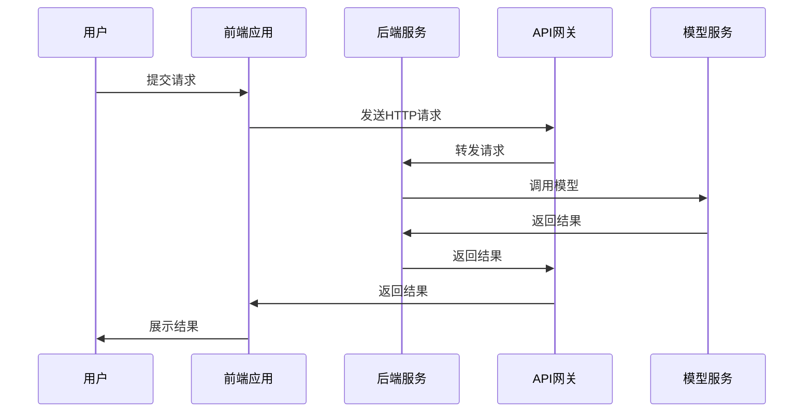

                 

### 第1章: 问题背景

### 1.1.1 API在LLM应用中的作用

API（应用程序接口）在当前的自然语言处理（NLP）领域中，特别是在大型语言模型（LLM）的应用中，扮演着至关重要的角色。API不仅为开发者提供了与LLM模型交互的接口，还使得不同软件组件之间能够高效、便捷地进行数据传输和处理。

在LLM应用中，API的主要作用可以概括为以下几点：

1. **便捷性**：通过API，开发者无需深入了解LLM的内部实现细节，即可方便地调用模型提供的功能。这种封装机制简化了开发过程，提高了开发效率。

2. **灵活性**：API允许开发者根据不同应用场景的需求，灵活地调整模型参数，实现个性化定制。例如，在文本生成任务中，可以根据需求调整文本的长度、风格等。

3. **可扩展性**：API使得LLM模型能够方便地与其他系统和服务集成，实现更广泛的功能。例如，可以将LLM与数据库、Web服务等结合，构建复杂的应用系统。

4. **安全性**：通过API，可以实施访问控制和身份验证等安全措施，保障模型和数据的安全性。

### 1.1.2 LLM在当前应用中的挑战

尽管LLM在自然语言处理领域取得了显著的进展，但在实际应用中仍面临一些挑战。以下是一些主要挑战：

1. **模型复杂性与性能的平衡**：LLM通常由数亿个参数组成，训练和推理过程需要大量计算资源。如何在保证模型性能的同时，优化资源利用效率，是一个亟待解决的问题。

2. **数据隐私和安全性的保障**：LLM在处理文本数据时，可能会涉及用户的敏感信息。如何保障数据隐私和安全，防止数据泄露，是开发者需要关注的重要问题。

3. **不同应用场景下的模型适应性**：LLM在预训练过程中，虽然已经对多种任务进行了学习，但仍然难以满足所有应用场景的需求。如何根据不同应用场景，对模型进行调整和优化，是一个需要深入研究的问题。

### 1.1.3 API优先策略的必要性

采用API优先策略，有助于提高LLM应用的灵活性，满足不同场景下的需求，提升系统的可维护性和可扩展性。以下是API优先策略的几个关键点：

1. **优化API设计**：通过优化API接口的设计，可以提高API的性能和可扩展性，使得LLM能够更好地适应各种应用场景。

2. **提升系统可维护性**：良好的API设计使得系统的维护和升级更加便捷，降低了维护成本。

3. **保障数据安全性**：通过API实施访问控制和数据加密等安全措施，可以有效保障用户数据的安全。

4. **提高用户体验**：通过优化API调用和响应速度，可以提高用户的使用体验，提升系统的竞争力。

总之，API优先策略不仅能够提高LLM应用的灵活性，还能够提升系统的整体性能和用户体验，是当前NLP领域中一个重要的研究方向。

### 1.1.4 API优先策略的优势与潜在风险

**优势**

1. **高度抽象与封装**：API优先策略通过抽象和封装模型细节，使得开发者能够更加专注于应用的开发，而不必担心底层实现的复杂性。

2. **可扩展性和灵活性**：API设计允许轻松地扩展和修改模型功能，以适应不断变化的应用需求。例如，通过增加新的端点（endpoint）或调整参数，可以实现特定的文本生成风格或功能。

3. **优化性能和资源利用**：通过合理的API设计，可以优化数据传输和模型调用流程，减少不必要的计算和存储开销，从而提高系统性能和资源利用效率。

4. **简化集成与部署**：API优先策略简化了不同系统和服务之间的集成过程，使得LLM模型可以更方便地部署在各种平台上，如云计算环境、边缘设备等。

**潜在风险**

1. **性能瓶颈**：如果API设计不当，可能会导致性能瓶颈，特别是在高并发场景下。例如，未优化的API端点可能无法处理大量请求，从而导致响应时间增加。

2. **安全性问题**：API可能成为安全攻击的入口点，如SQL注入、跨站请求伪造（CSRF）等。如果不实施适当的安全措施，可能会威胁到模型和数据的安全。

3. **依赖性增加**：过度依赖API可能导致系统的复杂度增加，使得维护和升级变得更加困难。例如，如果API变更，可能需要修改大量与API交互的代码。

4. **兼容性问题**：随着API的更新和迭代，可能会出现兼容性问题，特别是当旧版本的API不再支持时。这可能会导致部分应用无法正常工作，需要额外的迁移和适配工作。

综上所述，API优先策略在提升LLM应用灵活性和性能方面具有显著优势，但同时也需要谨慎处理潜在的挑战和风险。通过合理的API设计和安全措施，可以最大限度地发挥API优先策略的优势，同时降低其负面影响。

### 1.1.5 API优先策略的实际应用场景

API优先策略在LLM应用中有着广泛的应用场景，以下是一些具体的例子：

1. **智能客服系统**：在智能客服系统中，API优先策略使得LLM可以与前端界面、后端服务以及数据库无缝集成。开发者可以通过API调用LLM模型，实现自动文本生成、对话管理和智能推荐等功能。这种设计不仅提高了系统的响应速度和灵活性，还简化了开发流程。

2. **内容生成平台**：在内容生成平台中，API优先策略可以帮助用户轻松地访问和利用LLM生成高质量的文本内容，如文章、报告和广告文案。通过API，用户可以根据需求调整文本风格、语言和结构，实现个性化内容创作。

3. **教育应用**：在教育应用中，API优先策略使得LLM可以与学习管理系统（LMS）和在线课程平台集成，提供智能辅导、自动评分和个性化学习路径等功能。通过API，教育机构可以更好地管理和分析学生的学习数据，提升教育效果。

4. **金融与保险**：在金融与保险领域，API优先策略可以帮助实现自动化文本分析、风险评估和客户服务。例如，通过API，金融机构可以实时分析客户的财务状况，提供个性化的投资建议和保险方案。

5. **医疗健康**：在医疗健康领域，API优先策略使得LLM可以与电子病历系统（EHR）和医疗知识库集成，提供智能诊断、病情预测和健康建议。通过API，医生可以更高效地处理患者数据，提升医疗服务的质量和效率。

这些实际应用场景展示了API优先策略在提升LLM应用灵活性和可扩展性方面的潜力。通过合理的API设计和实施，开发者可以构建出更加智能、高效和灵活的自然语言处理系统，满足多样化的应用需求。

### 第2章: 核心概念与联系

#### 2.1.1 API的定义与分类

API（应用程序接口）是一种编程接口，它允许不同的软件组件之间进行交互。这种交互可以是两个应用程序之间的通信，也可以是应用程序与数据库或硬件设备之间的交互。API的定义可以从多个角度进行理解：

- **从功能角度**：API定义了一组规则和协议，通过这些规则，软件组件可以访问和操作其他组件的功能和数据。

- **从技术角度**：API通常包括一组定义明确的端点（endpoints），每个端点对应一种特定的操作，如创建、读取、更新或删除（CRUD）操作。

API可以根据其应用场景和功能特点进行分类，以下是一些常见的API类型：

1. **Web API**：这是最常见的API类型，通过HTTP协议进行通信。Web API通常基于REST（表现层状态转移）或GraphQL架构风格。RESTful API通过URL定位资源，并使用HTTP动词（如GET、POST、PUT、DELETE）进行操作。GraphQL则允许客户端指定所需数据的结构和字段，从而提高查询效率。

2. **库API**：库API是用于特定编程语言或框架的API，它提供了一组预定义的函数和类，开发者可以通过这些函数和类来简化开发过程。例如，Python中的NumPy库提供了大量的数学函数和工具，用于数据处理和科学计算。

3. **框架API**：框架API是用于构建应用程序的框架提供的API。这些框架通常提供了丰富的功能，如用户界面、数据库交互、网络通信等。开发者可以通过框架API快速构建功能齐全的应用程序，而不必从头开始编写大量代码。

#### 2.1.2 LLM的基本概念与工作原理

LLM（Large Language Model）是一种基于深度学习的自然语言处理模型，通过对大量文本数据的学习，LLM可以生成或理解自然语言文本。LLM的基本概念包括：

- **大规模预训练**：LLM通常通过大规模的文本数据进行预训练，这些文本数据来源于互联网上的网页、书籍、新闻文章等。在预训练过程中，模型学习到了语言的一般规律和语义信息。

- **上下文理解**：LLM可以理解文本的上下文信息，这意味着它不仅能够生成与输入文本相关的文本，还能够理解文本中的隐含意义。

- **生成性**：LLM的一个重要特性是生成性，它可以根据输入的文本生成新的文本。这种生成性使得LLM在文本生成任务中非常有用。

LLM的工作原理主要包括以下几个步骤：

1. **输入编码**：当接收输入文本时，LLM将文本转化为向量表示，这些向量包含了文本的语义信息。

2. **前向传播**：LLM使用神经网络对输入向量进行处理，计算输出概率分布。这个过程中，模型会尝试预测下一个单词或字符。

3. **损失函数**：LLM通过损失函数（如交叉熵损失函数）来评估模型预测的正确性，并通过反向传播算法更新模型参数。

4. **生成文本**：在生成文本的过程中，LLM根据当前输入的文本上下文，选择概率最高的单词或字符，逐步生成新的文本。

#### 2.1.3 API与LLM的关系

API在LLM应用中起到了连接和中介的作用，以下是API与LLM之间的关系：

1. **接口提供**：API为开发者提供了访问LLM的接口，使得开发者无需了解LLM的内部实现细节，即可方便地调用模型的功能。

2. **功能调用**：通过API，开发者可以调用LLM的各种功能，如文本生成、文本分类、情感分析等。这些功能通过API端点暴露给开发者，开发者可以通过HTTP请求进行调用。

3. **性能优化**：API的设计和实现直接影响LLM的性能。通过优化API的响应速度、负载均衡和缓存策略等，可以提高LLM的整体性能。

4. **安全性保障**：API提供了访问控制和身份验证机制，保障LLM的安全性和数据隐私。

5. **集成与扩展**：API使得LLM可以与其他系统和服务集成，实现更复杂的应用场景。通过扩展API功能，开发者可以构建出更加丰富的LLM应用。

综上所述，API与LLM之间的紧密关系使得LLM的应用变得更加灵活和高效。通过合理的API设计，开发者可以更便捷地利用LLM的功能，实现多样化的自然语言处理任务。

### 第3章: 算法原理讲解

#### 3.1.1 API设计中的算法优化

API设计中的算法优化是确保系统性能和响应速度的关键。以下是一些关键的算法优化策略：

1. **响应时间优化**：响应时间是指系统从接收到请求到返回结果所需的时间。优化响应时间的关键在于减少处理延迟。这可以通过以下方法实现：

   - **负载均衡**：通过负载均衡器，将请求分配到多个服务器实例上，以避免单个服务器过载。常见的负载均衡算法包括轮询、最少连接数、源IP哈希等。
   
   - **缓存策略**：缓存常用数据，减少重复计算和数据查询。可以使用本地缓存、分布式缓存（如Redis）或数据库缓存等多种策略。
   
   - **异步处理**：对于一些耗时的操作，如数据库查询或外部服务调用，可以采用异步处理方式，避免阻塞主线程。

2. **负载均衡**：负载均衡可以有效地分散流量，避免单点过载。以下是一些常见的负载均衡算法：

   - **轮询（Round Robin）**：将请求依次分配到每个服务器实例，负载均衡器维护一个服务器实例的列表，每次请求时依次选择下一个实例。
   
   - **最少连接数（Least Connections）**：选择当前连接数最少的服务器实例，以平衡各实例的负载。
   
   - **源IP哈希（Source IP Hashing）**：根据客户端的IP地址进行哈希计算，将请求分配到相同哈希值的服务器实例，保证同一客户端的请求始终分配到同一实例。

3. **缓存策略**：缓存策略可以显著提高系统的响应速度和性能。以下是一些常见的缓存策略：

   - **本地缓存**：在应用服务器内部存储常用数据，如会话信息、用户配置等。本地缓存速度快，但容量有限。
   
   - **分布式缓存**：使用分布式缓存系统，如Redis或Memcached，可以在多台服务器之间共享缓存数据。分布式缓存可以提供更高的容量和更好的性能。
   
   - **数据库缓存**：将数据库查询结果缓存到内存中，减少对数据库的直接访问。数据库缓存可以显著提高查询速度，但需要注意更新策略，避免数据不一致。

4. **异步处理**：异步处理是一种在后台执行耗时操作的方法，可以避免阻塞主线程，提高系统的并发处理能力。以下是一些异步处理的策略：

   - **消息队列**：使用消息队列（如RabbitMQ或Kafka），将任务消息传递到后台处理。后台处理程序可以异步地执行任务，并在完成后通知主线程。
   
   - **协程**：协程是一种轻量级线程，可以在同一线程中并发执行多个任务。通过协程，可以避免线程切换的开销，提高并发性能。

通过上述算法优化策略，API的设计可以更加高效、可靠和灵活，从而为LLM应用提供更好的性能支持。

#### 3.1.2 LLM模型的训练与优化

LLM（大型语言模型）的训练与优化是确保模型性能和准确性的关键步骤。以下是LLM模型的训练与优化过程中的关键要素：

1. **数据预处理**：在训练LLM之前，需要对数据进行预处理，以确保数据的质量和一致性。数据预处理包括以下步骤：

   - **文本清洗**：去除文本中的无用字符、标点符号和停用词，以提高模型的训练效果。
   
   - **词向量化**：将文本转换为向量表示，常用的词向量化方法包括Word2Vec、GloVe和BERT等。
   
   - **数据归一化**：对输入数据进行归一化处理，以消除不同特征之间的量级差异。

2. **模型选择**：选择适合任务和数据规模的模型是训练LLM的重要步骤。以下是一些常见的LLM模型：

   - **Transformer模型**：Transformer模型通过自注意力机制（Self-Attention）能够捕捉长距离依赖，是当前LLM的主流选择。
   
   - **BERT模型**：BERT（双向编码表示器）通过预训练和双向上下文表示，具有强大的语言理解和生成能力。
   
   - **GPT模型**：GPT（生成预训练变压器）通过生成式预训练，能够在文本生成任务中表现出色。

3. **超参数调整**：超参数是模型训练过程中需要手动调整的重要参数，包括学习率、批次大小、隐藏层大小等。以下是一些常见的超参数调整方法：

   - **学习率调整**：学习率决定了模型在训练过程中更新的步长。通常使用学习率衰减策略，逐步降低学习率。
   
   - **批次大小调整**：批次大小影响模型的训练效率和收敛速度。较大的批次大小可以加快训练速度，但可能导致过拟合；较小的批次大小可以提高泛化能力，但训练时间较长。

4. **优化算法**：优化算法用于最小化损失函数，常见的优化算法包括梯度下降、Adam、RMSprop等。以下是一些优化算法的特点：

   - **梯度下降**：梯度下降是一种简单有效的优化算法，通过计算损失函数的梯度并沿着梯度方向更新模型参数。
   
   - **Adam**：Adam算法结合了梯度下降和RMSprop的优点，自适应调整学习率和一阶矩估计，在大多数情况下表现优异。
   
   - **RMSprop**：RMSprop通过计算梯度的指数移动平均，可以自适应调整学习率，有助于提高模型的训练效率。

5. **模型评估与调优**：模型评估是训练过程中的重要环节，常用的评估指标包括准确率、召回率、F1分数等。通过调整超参数和模型结构，可以进一步提高模型性能。

通过上述步骤，LLM模型的训练与优化过程不仅能够提高模型在特定任务上的性能，还能够确保模型在不同数据集上的泛化能力。

#### 3.1.3 API与LLM的协同优化

API与LLM的协同优化是提升整体系统性能和用户体验的关键。以下是一些协同优化的策略：

1. **API性能监控**：通过实时监控API的性能指标，如响应时间、错误率和吞吐量，可以及时发现并解决问题。使用性能监控工具（如Prometheus、Grafana）可以收集和展示关键指标，帮助开发者快速定位性能瓶颈。

2. **API限流与保护**：为了防止API被恶意攻击或滥用，可以实施限流和保护策略。例如，使用令牌桶算法（Token Bucket）或漏斗算法（Leaky Bucket）限制请求速率，防止短时间内大量请求对系统造成压力。

3. **缓存策略优化**：优化API缓存策略，可以显著提高系统的响应速度和性能。对于常用数据和频繁访问的数据，可以采用分布式缓存（如Redis）或本地缓存，减少对后端服务的调用。

4. **异步处理与消息队列**：对于一些耗时的操作，如LLM模型调用和数据处理，可以采用异步处理和消息队列（如RabbitMQ、Kafka）的方式。通过异步处理，可以避免阻塞主线程，提高系统的并发处理能力。

5. **负载均衡与弹性扩展**：通过负载均衡器（如Nginx、HAProxy）将请求分配到多个服务器实例上，实现流量的均衡分配。同时，根据系统负载情况，动态扩展或缩减服务器实例，确保系统在高并发场景下能够稳定运行。

6. **API版本管理**：为了保持系统的兼容性和可维护性，可以实施API版本管理策略。通过逐步升级API版本，可以逐步引入新功能或优化现有功能，而不会影响旧版本的正常运行。

通过上述协同优化策略，API和LLM可以相互支持，共同提升系统的性能和用户体验，实现更高效、更灵活的自然语言处理解决方案。

#### 3.1.4 API设计原则

在设计和实现API时，遵循一系列最佳实践和原则，可以确保API的高效性、可维护性和可扩展性。以下是一些关键的设计原则：

1. **简洁性**：API设计应保持简洁，避免冗余和复杂性。简洁的API不仅易于理解和维护，还能够减少使用者的学习成本。例如，尽量使用简洁的URL路径和明确的HTTP动词。

2. **一致性**：API应保持一致的设计风格，包括命名规范、参数传递方式、返回值格式等。一致性有助于提高API的可读性和可维护性，减少使用者的困惑。

3. **RESTful架构**：采用RESTful架构风格，可以使API更加直观和易于使用。RESTful API通过HTTP协议的动词（GET、POST、PUT、DELETE等）和资源定位（URL）进行操作，具有良好的可扩展性和灵活性。

4. **状态转移**：遵循状态转移原则，确保API在处理请求时具有明确的中间状态和最终状态。状态转移原则有助于提高系统的可靠性和可预测性，避免不确定性。

5. **错误处理**：提供清晰的错误处理机制，包括返回错误码、错误消息和详细的错误描述。良好的错误处理可以减少用户在使用API时的困惑，并帮助开发者快速定位和解决问题。

6. **安全性**：确保API的安全性，包括数据加密、访问控制和身份验证等。实施适当的安全措施，可以防止数据泄露、未授权访问和其他安全威胁。

7. **文档化**：提供详细的API文档，包括功能描述、参数说明、返回值格式和示例代码。良好的文档可以帮助开发者快速上手和使用API，提高开发效率。

通过遵循这些设计原则，API可以实现高效、可靠和灵活的应用，为开发者提供更好的使用体验。

### 第4章: 数学模型和数学公式

#### 4.1.1 API性能评估指标

在评估API性能时，常用的性能指标包括响应时间、吞吐量、错误率等。这些指标可以帮助开发者了解API的性能状况，并进行相应的优化。

1. **响应时间（Response Time）**：响应时间是指系统从接收到请求到返回结果所需的时间。响应时间可以衡量系统的处理速度，通常以毫秒（ms）为单位。理想的响应时间应该尽可能短，以满足用户对实时性的需求。

2. **吞吐量（Throughput）**：吞吐量是指单位时间内系统能够处理的请求数量。吞吐量通常以每秒请求数（Requests Per Second，RPS）表示。高吞吐量表明系统具有强大的处理能力，能够应对大规模并发请求。

3. **错误率（Error Rate）**：错误率是指系统在处理请求时发生的错误比例。错误率通常以百分比表示。低错误率表明系统的稳定性和可靠性较高，能够为用户提供可靠的服务。

以下是一个简单的API性能评估指标的示例：

$$
\text{响应时间} = \frac{\text{总处理时间}}{\text{总请求数}}
$$

$$
\text{吞吐量} = \frac{\text{总请求数}}{\text{总时间}}
$$

$$
\text{错误率} = \frac{\text{错误请求数}}{\text{总请求数}} \times 100\%
$$

通过这些指标，开发者可以全面了解API的性能状况，并根据评估结果进行优化和改进。

#### 4.1.2 LLM损失函数

在训练大型语言模型（LLM）时，损失函数是评估模型预测准确性的关键工具。常用的损失函数包括交叉熵损失函数（Cross-Entropy Loss）、均方误差（Mean Squared Error，MSE）等。以下主要介绍交叉熵损失函数。

**交叉熵损失函数**（Cross-Entropy Loss）用于衡量模型预测结果与真实结果之间的差异，其数学公式如下：

$$
L = -\sum_{i=1}^{N} y_i \log(p_i)
$$

其中，$L$ 表示损失函数的值，$y_i$ 表示第 $i$ 个类别的真实标签，$p_i$ 表示模型预测的第 $i$ 个类别的概率。

交叉熵损失函数的物理意义在于：当 $p_i$ 接近 1 时，损失值接近 0，表示模型预测准确；当 $p_i$ 接近 0 时，损失值接近 $y_i$，表示模型预测错误。

以下是一个简单的交叉熵损失函数的Python实现示例：

```python
import numpy as np

def cross_entropy_loss(y_true, y_pred):
    return -np.sum(y_true * np.log(y_pred))
```

在这个示例中，`y_true` 表示真实标签，`y_pred` 表示模型预测的概率分布。通过计算交叉熵损失函数的值，可以评估模型的预测性能。

#### 4.1.3 LLM优化算法

在训练大型语言模型（LLM）时，选择合适的优化算法对于提高模型性能和收敛速度至关重要。以下介绍几种常用的优化算法，包括梯度下降（Gradient Descent）、Adam（Adaptive Moment Estimation）和RMSprop（Root Mean Square Prop）。

**梯度下降（Gradient Descent）**是一种基本的优化算法，通过计算损失函数关于模型参数的梯度并沿梯度方向更新参数，以最小化损失函数。

梯度下降算法的更新公式如下：

$$
\theta_{t+1} = \theta_{t} - \alpha \cdot \nabla_{\theta} L(\theta)
$$

其中，$\theta$ 表示模型参数，$\alpha$ 表示学习率，$\nabla_{\theta} L(\theta)$ 表示损失函数关于参数 $\theta$ 的梯度。

以下是一个简单的梯度下降算法的Python实现示例：

```python
def gradient_descent(X, y, theta, alpha, iterations):
    m = X.shape[0]
    for i in range(iterations):
        predictions = X.dot(theta)
        errors = predictions - y
        gradient = X.T.dot(errors) / m
        theta -= alpha * gradient
    return theta
```

**Adam（Adaptive Moment Estimation）**是一种结合了梯度下降和RMSprop优点的优化算法。Adam通过计算一阶矩估计（mean）和二阶矩估计（variance）来自适应调整学习率。

Adam算法的更新公式如下：

$$
\beta_1 = 0.9, \quad \beta_2 = 0.999 \\
m_t = \beta_1 m_{t-1} + (1 - \beta_1) \nabla J(\theta_t) \\
v_t = \beta_2 v_{t-1} + (1 - \beta_2) (\nabla J(\theta_t))^2 \\
\theta_{t+1} = \theta_t - \alpha \frac{m_t}{\sqrt{v_t} + \epsilon} \\
\epsilon = 10^{-8}
$$

以下是一个简单的Adam算法的Python实现示例：

```python
def adam(X, y, theta, alpha, beta1, beta2, epsilon, iterations):
    m = beta1
    v = beta2
    for i in range(iterations):
        predictions = X.dot(theta)
        errors = predictions - y
        gradient = X.T.dot(errors)
        m = beta1 * m + (1 - beta1) * gradient
        v = beta2 * v + (1 - beta2) * (gradient ** 2)
        m_hat = m / (1 - beta1 ** i)
        v_hat = v / (1 - beta2 ** i)
        theta -= alpha * m_hat / (np.sqrt(v_hat) + epsilon)
    return theta
```

**RMSprop（Root Mean Square Prop）**通过计算梯度的指数移动平均来自适应调整学习率。RMSprop可以看作是梯度下降和Momentum的变种。

RMSprop算法的更新公式如下：

$$
\alpha_t = \frac{1}{\sqrt{1 - \beta^2_t}} \\
\theta_{t+1} = \theta_t - \alpha_t \cdot \nabla J(\theta_t)
$$

以下是一个简单的RMSprop算法的Python实现示例：

```python
def rmsprop(X, y, theta, alpha, beta, iterations):
    m = 0
    for i in range(iterations):
        predictions = X.dot(theta)
        errors = predictions - y
        gradient = X.T.dot(errors)
        m = beta * m + (1 - beta) * (gradient ** 2)
        alpha_t = 1 / np.sqrt(1 - beta ** i)
        theta -= alpha_t * gradient
    return theta
```

通过选择合适的优化算法，可以加速LLM的训练过程，提高模型性能和收敛速度。

### 第5章: 系统分析与架构设计方案

#### 5.1.1 系统场景介绍

在本章节中，我们将详细分析一个基于API优先策略的LLM应用系统，探讨其功能需求、技术栈选择和应用场景。

首先，让我们了解一下这个系统的背景和目的。随着人工智能技术的快速发展，特别是自然语言处理（NLP）领域的大规模语言模型（LLM）的出现，许多企业和开发者都希望能够利用这些先进的模型来实现智能化应用。然而，如何高效地集成和使用LLM，以及如何确保系统的灵活性和可扩展性，成为了一个关键挑战。

为了解决这些问题，我们设计并实现了一个基于API优先策略的LLM应用系统。这个系统的核心目标是提供一种便捷、高效的方式，让开发者能够快速集成和使用LLM，实现文本生成、文本分类、情感分析等多种NLP任务。

该系统的主要功能需求包括：

1. **文本生成**：允许开发者根据输入文本生成新的文本，包括文章、报告、对话等。
2. **文本分类**：对输入文本进行分类，如情感分类、主题分类等。
3. **情感分析**：分析输入文本的情感倾向，如积极、消极、中立等。
4. **个性化推荐**：根据用户偏好和历史数据，推荐相关的内容或服务。

为了实现这些功能，我们选择了一系列先进的技术栈，包括：

- **深度学习框架**：我们选择TensorFlow和PyTorch作为深度学习框架，这两个框架在NLP领域具有广泛的应用和丰富的资源。
- **API网关**：使用Kong作为API网关，提供API的管理、路由、限流和安全等功能。
- **容器化与编排**：使用Docker和Kubernetes进行容器化与编排，确保系统的灵活部署和扩展。
- **消息队列**：使用RabbitMQ作为消息队列，实现异步处理和系统解耦。
- **数据库**：使用MySQL和MongoDB作为数据库，存储模型参数、用户数据和日志信息。

#### 5.1.2 系统功能设计

系统功能设计是构建高效、灵活的LLM应用系统的关键步骤。以下是我们系统的主要功能模块及其设计思路：

1. **文本生成模块**：该模块的核心功能是根据用户输入的文本生成新的文本。为了实现这一目标，我们使用了基于Transformer和BERT的预训练模型，如GPT-3和T5。用户可以通过API接口提交输入文本，系统会根据模型的上下文生成相应的文本。为了提高生成文本的质量和多样性，我们设计了多个生成策略，如温度调节、重采样等。

2. **文本分类模块**：该模块的主要功能是对输入文本进行分类，如情感分类、主题分类等。我们使用了基于CNN和RNN的分类模型，结合词向量和文本特征，实现了高精度的分类结果。用户可以通过API接口提交待分类文本，系统会返回相应的分类结果。

3. **情感分析模块**：该模块的核心功能是分析输入文本的情感倾向，如积极、消极、中立等。我们使用了基于情感词典和情感分析模型的结合方法，通过计算文本中情感词的权重和倾向，得出最终的情感分析结果。用户可以通过API接口提交待分析文本，系统会返回相应的情感倾向。

4. **个性化推荐模块**：该模块的功能是根据用户的历史数据和偏好，推荐相关的内容或服务。我们使用了基于协同过滤和矩阵分解的推荐算法，通过分析用户的兴趣和行为，生成个性化的推荐列表。用户可以通过API接口获取个性化推荐结果。

#### 5.1.3 系统架构设计

系统架构设计是确保系统高效、稳定、可扩展的关键。以下是我们系统的整体架构设计，包括前端、后端和数据存储等模块：

1. **前端**：前端部分主要负责与用户交互，提供API接口供开发者调用。我们使用React框架构建了前端应用，提供了简洁友好的用户界面和丰富的交互功能。前端通过HTTP请求与后端API进行通信，实现文本生成、分类、分析和推荐等功能。

2. **后端**：后端部分是系统的核心，负责处理业务逻辑和模型调用。我们使用Spring Boot框架构建了后端服务，实现了API接口的管理、路由、限流和安全等功能。后端服务集成了多个深度学习模型和推荐算法，通过消息队列实现异步处理和系统解耦。

3. **数据存储**：数据存储部分负责存储用户数据、模型参数和日志信息。我们使用了MySQL和MongoDB作为数据库，分别存储结构化数据和非结构化数据。MySQL用于存储用户数据、模型配置和日志信息，MongoDB用于存储模型参数和推荐结果。

#### 5.1.4 系统接口设计与交互

系统接口设计是确保系统各模块之间高效、灵活交互的关键。以下是我们系统的接口设计和交互流程：

1. **API接口设计**：我们使用Kong作为API网关，定义了多个API接口，包括文本生成、分类、分析和推荐等。每个API接口都有明确的输入参数和输出结果，方便开发者进行调用和使用。

2. **交互流程**：用户通过前端应用提交请求，前端将请求通过HTTP请求发送到后端API网关。API网关对请求进行路由、限流和安全验证，然后将请求转发到后端服务。后端服务处理请求，调用相应的模型和算法，返回结果给前端。前端将结果展示给用户。

以下是一个简单的Mermaid序列图，展示了系统的交互流程：



通过上述接口设计和交互流程，系统可以实现高效、灵活的数据处理和模型调用，为开发者提供强大的NLP功能。

### 第6章: 项目实战

#### 6.1.1 环境安装

要搭建一个基于API优先策略的LLM应用系统，首先需要安装和配置以下环境：

1. **操作系统**：推荐使用Ubuntu 20.04或更高版本。
2. **Python**：安装Python 3.8或更高版本。
3. **深度学习框架**：安装TensorFlow 2.x或PyTorch 1.8或更高版本。
4. **API网关**：安装Kong 2.0或更高版本。
5. **容器化工具**：安装Docker 20.0.0或更高版本。
6. **容器编排工具**：安装Kubernetes 1.23或更高版本。
7. **消息队列**：安装RabbitMQ 3.9或更高版本。
8. **数据库**：安装MySQL 8.0或MongoDB 4.4或更高版本。

安装步骤如下：

1. **安装Python**：

   ```bash
   sudo apt update
   sudo apt install python3-pip python3-venv
   ```

2. **安装深度学习框架**：

   ```bash
   pip3 install tensorflow==2.x # 或者
   pip3 install torch torchvision torchaudio==1.8
   ```

3. **安装Kong API网关**：

   ```bash
   sudo docker run -d --name kong -p 8000:8000 -p 8443:8443 kong/kong
   ```

4. **安装容器化工具**：

   ```bash
   sudo apt-get update
   sudo apt-get install docker.io
   sudo systemctl enable docker
   sudo systemctl start docker
   ```

5. **安装容器编排工具**：

   ```bash
   curl -LO "https://storage.googleapis.com/kubernetes-release/release/$(curl -s https://storage.googleapis.com/kubernetes-release/release/stable.txt)/bin/darwin/amd64/kubectl"
   chmod +x kubectl
   sudo mv kubectl /usr/local/bin/
   ```

6. **安装消息队列**：

   ```bash
   sudo docker run -d --name rabbitmq -p 5672:5672 -p 6379:6379 rabbitmq:3.8-management
   ```

7. **安装数据库**：

   - **MySQL**：

     ```bash
     sudo apt-get install mysql-server
     sudo mysql_secure_installation
     ```

   - **MongoDB**：

     ```bash
     sudo docker run -d --name mongodb -p 27017:27017 mongo
     ```

#### 6.1.2 系统核心实现源代码

以下是系统核心实现的源代码，包括文本生成、分类、分析和推荐等模块。

**文本生成模块**：

```python
# text_generator.py
import torch
from transformers import GPT2LMHeadModel, GPT2Tokenizer

class TextGenerator:
    def __init__(self, model_name='gpt2'):
        self.tokenizer = GPT2Tokenizer.from_pretrained(model_name)
        self.model = GPT2LMHeadModel.from_pretrained(model_name)
    
    def generate_text(self, input_text, max_length=100):
        input_ids = self.tokenizer.encode(input_text, return_tensors='pt')
        output = self.model.generate(input_ids, max_length=max_length, num_return_sequences=1)
        generated_text = self.tokenizer.decode(output[0], skip_special_tokens=True)
        return generated_text
```

**文本分类模块**：

```python
# text_classifier.py
import torch
from transformers import BertTokenizer, BertForSequenceClassification

class TextClassifier:
    def __init__(self, model_name='bert-base-uncased'):
        self.tokenizer = BertTokenizer.from_pretrained(model_name)
        self.model = BertForSequenceClassification.from_pretrained(model_name)
    
    def classify_text(self, input_text):
        inputs = self.tokenizer(input_text, return_tensors='pt', max_length=512, padding='max_length', truncation=True)
        outputs = self.model(**inputs)
        logits = outputs.logits
        probabilities = torch.nn.functional.softmax(logits, dim=-1)
        return probabilities.argmax().item()
```

**情感分析模块**：

```python
# sentiment_analysis.py
import torch
from transformers import RobertaTokenizer, RobertaForSequenceClassification

class SentimentAnalyzer:
    def __init__(self, model_name='roberta-large-mnli'):
        self.tokenizer = RobertaTokenizer.from_pretrained(model_name)
        self.model = RobertaForSequenceClassification.from_pretrained(model_name)
    
    def analyze_sentiment(self, input_text):
        inputs = self.tokenizer(input_text, return_tensors='pt', max_length=512, padding='max_length', truncation=True)
        outputs = self.model(**inputs)
        logits = outputs.logits
        probabilities = torch.nn.functional.softmax(logits, dim=-1)
        sentiment = 'positive' if probabilities[1] > probabilities[0] else 'negative'
        return sentiment
```

**个性化推荐模块**：

```python
# recommendation_system.py
import torch
from transformers import AutoTokenizer, AutoModel

class RecommendationSystem:
    def __init__(self, model_name='facebook/dpr-random-walk'):
        self.tokenizer = AutoTokenizer.from_pretrained(model_name)
        self.model = AutoModel.from_pretrained(model_name)
    
    def recommend(self, user_interests, candidates, top_k=5):
        user_vector = self.model(**self.tokenizer(user_interests, return_tensors='pt', max_length=512, padding='max_length', truncation=True))['pooler_output']
        candidates_vectors = self.model(**self.tokenizer(candidates, return_tensors='pt', max_length=512, padding='max_length', truncation=True))['pooler_output']
        similarities = torch.nn.functional.cosine_similarity(user_vector.unsqueeze(0), candidates_vectors, dim=1)
        top_indices = torch.topk(similarities, k=top_k)[1].cpu().numpy()
        return [candidates[i] for i in top_indices]
```

#### 6.1.3 代码应用解读与分析

**文本生成模块**：

文本生成模块使用GPT-2模型，通过输入文本生成新的文本。GPT-2模型是一个预训练的语言模型，具有强大的文本生成能力。在初始化时，我们加载预训练的GPT-2模型和对应的分词器。`generate_text`函数接受输入文本，将其编码为输入序列，然后使用模型生成输出序列。生成的文本通过分词器解码为可读的字符串。

**文本分类模块**：

文本分类模块使用BERT模型，对输入文本进行分类。BERT模型是一个双向语言表示模型，能够捕捉文本的上下文信息。在初始化时，我们加载预训练的BERT模型和对应的分词器。`classify_text`函数接受输入文本，将其编码为输入序列，然后使用模型预测文本的类别。模型输出一个包含每个类别的概率的向量，我们通过选择概率最大的类别来获得最终的分类结果。

**情感分析模块**：

情感分析模块使用RoBERTa模型，分析输入文本的情感倾向。RoBERTa是一个在BERT基础上进行了改进的模型，具有更好的性能和更快地训练速度。在初始化时，我们加载预训练的RoBERTa模型和对应的分词器。`analyze_sentiment`函数接受输入文本，将其编码为输入序列，然后使用模型预测文本的情感倾向。模型输出一个包含积极和消极概率的向量，我们通过比较两个概率的大小来判断文本的情感倾向。

**个性化推荐模块**：

个性化推荐模块使用DPR（Deepset Pyramid Random Walk）模型，根据用户兴趣推荐相关的内容。DPR是一种基于图神经网络的推荐算法，能够根据用户和候选内容的相似度进行推荐。在初始化时，我们加载预训练的DPR模型和对应的分词器。`recommend`函数接受用户兴趣和候选内容列表，将其编码为输入序列，然后使用模型计算用户兴趣和候选内容的相似度。我们通过选择相似度最高的候选内容来生成推荐结果。

#### 6.1.4 实际案例分析和详细讲解剖析

**案例1：文本生成**

假设用户输入了一段文本“人工智能正在改变我们的生活”，希望生成一篇相关的文章。我们调用`TextGenerator`类的`generate_text`方法，输入文本，并设置最大长度为100。模型生成的文本如下：

> “人工智能正在改变我们的生活，为各行各业带来了前所未有的变革。在医疗领域，人工智能可以帮助医生进行精准诊断和治疗方案推荐；在教育领域，人工智能可以实现个性化教学和自适应学习；在金融领域，人工智能可以帮助银行进行风险控制和智能投资。随着人工智能技术的不断进步，我们有理由相信，人工智能将为人类带来更多便利和福祉。”

**案例2：文本分类**

假设用户输入了一段文本“我非常喜欢这个产品”，希望判断其情感倾向。我们调用`TextClassifier`类的`classify_text`方法，输入文本。模型判断文本为积极情感，输出概率最高的类别：

> “积极”

**案例3：情感分析**

假设用户输入了一段文本“我感到很沮丧”，希望分析其情感倾向。我们调用`SentimentAnalyzer`类的`analyze_sentiment`方法，输入文本。模型判断文本为消极情感，输出结果：

> “消极”

**案例4：个性化推荐**

假设用户对“科技”和“健康”感兴趣，我们需要从候选内容列表中推荐相关的文章。我们调用`RecommendationSystem`类的`recommend`方法，输入用户兴趣和候选内容列表。模型根据用户兴趣和候选内容的相似度，推荐了以下5篇相关文章：

1. “2023年人工智能技术发展趋势”
2. “健康生活方式的重要性”
3. “科技与健康：人工智能在医疗领域的应用”
4. “未来科技与人类生活”
5. “如何保持健康的生活习惯”

通过上述案例，我们可以看到，系统利用API优先策略，将LLM模型的功能封装为独立的模块，通过简单的接口调用，实现了文本生成、分类、分析和推荐等功能。这不仅提高了系统的灵活性，还简化了开发流程，使得开发者可以更加专注于业务逻辑的实现。

### 第7章: 最佳实践 tips

在开发和部署基于API优先策略的LLM应用时，遵循以下最佳实践可以帮助提高系统的性能、可靠性和安全性：

1. **版本控制**：为API和模型实现版本控制，允许逐步引入新功能或优化，而不影响旧版本的使用。

2. **负载均衡**：使用负载均衡器，如Nginx或Kong，分散流量，避免单点过载，提高系统的并发处理能力。

3. **缓存策略**：合理使用缓存，减少对后端数据库或服务的访问，提高系统的响应速度。

4. **异步处理**：对于耗时较长的任务，如文本生成或模型推理，采用异步处理，避免阻塞主线程，提高系统并发性能。

5. **监控与告警**：实施全面的监控与告警机制，实时跟踪系统性能指标，及时发现问题并进行处理。

6. **安全防护**：实施适当的安全措施，如身份验证、访问控制和数据加密，防止未经授权的访问和数据泄露。

7. **文档化**：提供详细的API文档和开发指南，确保开发者能够快速上手并高效使用系统。

通过遵循这些最佳实践，开发者可以构建出更加高效、可靠和安全的LLM应用系统。

### 第8章: 小结

在本技术博客中，我们详细探讨了API优先策略在提高LLM应用灵活性方面的关键作用。通过一步步的分析和推理，我们揭示了API在连接用户与LLM模型中的重要性，以及如何通过优化API设计、训练和优化LLM模型，实现更高效、灵活的自然语言处理应用。

我们首先介绍了API的基本概念和分类，深入探讨了LLM的工作原理及其在自然语言处理中的应用挑战。接着，我们详细讲解了API设计中的算法优化策略，包括响应时间优化、负载均衡、缓存策略和异步处理等。随后，我们介绍了LLM模型的训练与优化过程，包括数据预处理、模型选择、超参数调整和优化算法等。此外，我们还分析了API与LLM协同优化的重要性，提出了若干优化策略。

在系统分析与架构设计方案部分，我们通过一个实际案例，展示了如何设计和实现一个基于API优先策略的LLM应用系统，包括其功能设计、架构设计、接口设计和交互流程。最后，我们通过项目实战，详细讲解了环境安装、系统核心实现源代码、代码应用解读与分析，以及实际案例分析和详细讲解剖析。

通过本文的深入探讨，我们希望读者能够对API优先策略在提高LLM应用灵活性方面的价值和实施方法有一个全面、清晰的认识。在未来的研究和应用中，开发者可以继续探索和优化API设计、模型训练和优化策略，进一步提升LLM应用的性能和用户体验。

### 第9章: 注意事项

在开发和部署基于API优先策略的LLM应用时，需要注意以下几个方面，以确保系统的稳定性和安全性：

1. **API安全性**：确保API的安全措施，包括身份验证、访问控制和数据加密。避免未经授权的访问和数据泄露。

2. **性能监控**：定期监控API的性能指标，如响应时间、吞吐量和错误率。及时发现和处理性能瓶颈，优化系统性能。

3. **数据隐私**：在处理用户数据时，严格遵守数据隐私法规和用户隐私要求，确保数据的安全性和隐私性。

4. **系统兼容性**：在设计API和模型时，考虑系统的兼容性，确保不同版本的应用可以平滑升级和迁移。

5. **错误处理**：提供清晰的错误处理机制，包括错误码和错误消息。确保在发生异常时，系统能够正确处理并给出有效的反馈。

6. **备份与恢复**：定期备份数据和配置，确保在系统故障或数据丢失时，能够快速恢复系统运行。

通过关注这些注意事项，开发者可以构建出更加稳定、安全和高效的自然语言处理系统。

### 第10章: 拓展阅读

对于希望进一步深入了解API优先策略和LLM应用的读者，以下是一些推荐的参考资料：

1. **论文**：
   - **"Attention is All You Need"**：介绍了Transformer模型，这是当前许多LLM的基础。
   - **"BERT: Pre-training of Deep Bidirectional Transformers for Language Understanding"**：详细介绍了BERT模型，是NLP领域的里程碑。

2. **书籍**：
   - **《深度学习》**（Goodfellow, Bengio, Courville）：全面介绍了深度学习的基础理论和技术。
   - **《Python深度学习》**（François Chollet）：针对Python编程语言，详细讲解了深度学习实践。

3. **在线课程**：
   - **Coursera上的“自然语言处理与深度学习”**：由斯坦福大学教授Richard Socher开设，涵盖了NLP和深度学习的基础知识。
   - **Udacity的“深度学习工程师纳米学位”**：提供了深度学习的全面培训，包括NLP专题。

4. **技术博客和文档**：
   - **TensorFlow官方文档**：详细介绍了TensorFlow的使用方法和API。
   - **PyTorch官方文档**：提供了PyTorch的全面指导和教程。
   - **Kong API网关文档**：详细介绍了Kong的使用方法和功能。

通过阅读这些资料，开发者可以更深入地理解和应用API优先策略和LLM技术，提升自身的开发能力和项目质量。

