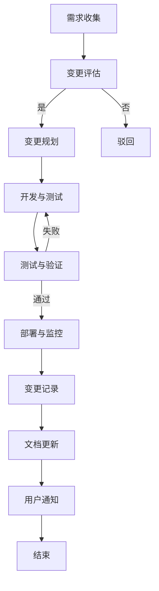

                 

# API版本管理：确保AI服务向后兼容性

## 关键词
- API版本管理
- AI服务
- 向后兼容性
- 版本兼容性
- API变更管理

## 摘要
本文将深入探讨API版本管理在AI服务中的应用，特别是如何确保API服务的向后兼容性。我们将从API版本管理的重要性出发，介绍基本概念、管理策略和实践，分析兼容性挑战及其解决方案，并结合实际案例进行深入剖析，最后探讨高级管理策略和未来发展方向。

## 引言
### API版本管理的重要性

API（应用程序编程接口）是软件系统之间进行交互的标准方式，通过定义明确的接口，使得不同系统之间能够无缝集成和交互。随着AI技术的迅猛发展，AI服务越来越多地依赖于API进行交互，这使得API版本管理变得尤为重要。

首先，API版本管理确保了服务能够持续演进，而不影响现有的用户和系统。这有助于维护系统的稳定性，减少由于服务变更而引发的故障和中断。其次，良好的API版本管理能够提高开发效率，降低开发成本，因为开发者可以根据具体的版本进行开发和测试，避免了不必要的重复工作。

### AI服务的发展与API版本管理

AI服务的快速发展带来了大量的API需求。这些API不仅需要支持复杂的算法和模型，还需要满足不同用户和场景的需求。因此，AI服务的API版本管理变得更加复杂和关键。例如，随着AI模型的不断更新和优化，API的接口和功能也需要随之调整。

然而，这也带来了挑战。如何在不影响现有用户的情况下，平稳地更新API，确保向后兼容性，是每个AI服务提供商都必须面对的问题。这个问题解决得好，能够极大地提升用户满意度和服务质量；解决不好，则可能导致用户流失和服务中断。

### 本书结构安排
本文将分为以下几个部分：

1. **API版本管理概述**：介绍API版本管理的基本概念、原则和方法，以及API文档和版本控制的策略。
2. **API版本管理的策略与实践**：讨论API变更管理策略、版本兼容性与向后兼容性的实现，以及API版本迭代与迁移的方法和工具。
3. **高级API版本管理**：探讨多环境版本管理、版本回滚与紧急修复，以及高级兼容性测试方法。
4. **API安全与合规性**：讨论API安全的重要性、安全策略和合规性要求。
5. **跨部门协作与API管理**：分析跨部门协作的挑战、API管理流程和最佳实践。
6. **结论与未来方向**：总结本文的核心内容，并提出API版本管理在AI服务中的未来发展方向。

### API版本管理的基本概念

API版本管理是指对API的版本进行控制和管理的过程。它涉及如何为API分配版本号、如何更新和发布新版本、如何确保新版本与旧版本兼容等。下面是API版本管理的一些核心概念：

1. **API版本号**：API版本号的格式通常采用MAJOR.MINOR.PATCH的形式。MAJOR表示主要版本，MINOR表示次版本，PATCH表示修补版本。每次更新API时，都需要更新相应的版本号。

2. **向后兼容性**：向后兼容性是指新版本API能够与旧版本API无缝集成和交互。这通常需要在新版本中保留旧版本的功能和接口，同时增加新功能或改进现有功能。

3. **版本兼容性**：版本兼容性是指不同版本的API之间能够相互调用和协作。这通常需要通过版本控制策略和工具来实现。

4. **版本控制策略**：版本控制策略是指如何管理和更新API版本的方法和规则。常见的策略包括按功能划分版本、按重大变更划分版本和按开发阶段划分版本。

### API版本管理的原则与方法

API版本管理的原则包括：

1. **简洁性**：API版本应尽量简洁，避免过于复杂的版本结构。
2. **可读性**：版本号应易于理解和记忆，例如使用字母和数字组合。
3. **可控性**：版本更新应受控，确保每次更新都能被追踪和回溯。

API版本管理的方法包括：

1. **按功能划分版本**：根据API的功能和用途划分版本，例如将API划分为基础版、专业版和高级版。
2. **按重大变更划分版本**：根据API的变更程度划分版本，例如将API的增删改查操作划分为不同的版本。
3. **按开发阶段划分版本**：根据API的开发阶段划分版本，例如将API划分为开发版、测试版和发布版。

### API文档与版本控制

API文档是API版本管理的重要组成部分。它不仅描述了API的功能和接口，还提供了使用示例和错误处理策略。良好的API文档有助于开发者快速上手和使用API。

版本控制策略则确保了API文档和API实现的一致性。常见的版本控制策略包括：

1. **文档与代码分离**：将API文档与代码实现分离，确保文档和代码的独立更新。
2. **文档自动化生成**：使用工具自动生成API文档，减少人工错误和重复工作。
3. **版本控制工具**：使用版本控制工具（如Git）管理API文档和代码，确保版本的一致性和可追踪性。

### 本章小结

本章介绍了API版本管理的基本概念、原则和方法，以及API文档和版本控制的策略。API版本管理是确保AI服务持续演进的关键，它能够提高开发效率、减少维护成本，并确保服务的稳定性。在下一章中，我们将深入探讨API版本管理的策略和实践，分析如何实现版本兼容性和向后兼容性。请继续关注。# 第一部分：API版本管理概述

## 1.1 API版本管理的重要性

### 1.1.1 AI服务的发展与API版本管理

人工智能（AI）作为当今科技领域的热点，正迅速融入各行各业，推动了数字化转型的浪潮。AI服务的普及和应用，使得API成为连接不同系统和平台的关键桥梁。API版本管理在此背景下显得尤为重要。

随着AI技术的发展，AI服务不断演进，其功能和接口也随之更新和扩展。然而，这种更新和扩展并非一蹴而就，而是需要逐步进行。API版本管理在这个过程中起着至关重要的作用，它确保了旧版本API与新版本API的兼容性，避免了由于版本变更导致的系统故障和服务中断。

### 1.1.2 API版本管理的挑战与机遇

API版本管理的挑战主要包括：

1. **兼容性**：确保新版本API能够向后兼容旧版本API，这是API版本管理的核心挑战。在保持向后兼容性的同时，还需要增加新功能和优化性能。
2. **版本控制**：如何有效地管理和追踪API的版本号，确保版本号的正确性和一致性，是另一个重要挑战。
3. **文档更新**：随着API版本的更新，文档也需要同步更新，这增加了开发和维护的工作量。

然而，这些挑战也带来了机遇：

1. **灵活性与可扩展性**：通过良好的API版本管理，系统能够更加灵活和可扩展，支持不同用户和场景的需求。
2. **用户体验**：良好的API版本管理能够提供稳定和可靠的服务，提升用户满意度。
3. **开发效率**：明确的版本管理策略和工具，可以减少开发者的重复工作，提高开发效率。

### 1.1.3 本书结构安排

本书将分为以下几个部分：

1. **API版本管理概述**：介绍API版本管理的基本概念、重要性、原则和方法。
2. **API版本管理的策略与实践**：讨论API变更管理策略、版本兼容性与向后兼容性的实现，以及API版本迭代与迁移的方法和工具。
3. **高级API版本管理**：探讨多环境版本管理、版本回滚与紧急修复，以及高级兼容性测试方法。
4. **API安全与合规性**：讨论API安全的重要性、安全策略和合规性要求。
5. **跨部门协作与API管理**：分析跨部门协作的挑战、API管理流程和最佳实践。
6. **结论与未来方向**：总结本文的核心内容，并提出API版本管理在AI服务中的未来发展方向。

通过本书的阅读，读者将深入了解API版本管理的各个方面，掌握如何确保AI服务的向后兼容性，为实际工作提供有价值的指导。

## 1.2 API版本管理的基本概念

### 1.2.1 API的定义

API（应用程序编程接口）是一个使软件系统能够相互通信和协作的接口。它定义了软件组件之间如何进行交互，包括请求的格式、响应的结构和可能的结果。API通常由一组函数、类或对象组成，这些函数、类或对象对外提供了特定的功能和服务。

API在现代软件开发中扮演着重要角色，因为它使得开发者能够利用现有的库和框架，快速构建复杂的应用程序，而无需从头开始编写所有代码。API还可以促进不同系统之间的集成，使得不同系统可以相互交换数据和功能。

API的基本组成部分通常包括：

1. **请求**：客户端发送给API的请求，通常包含请求的URL、HTTP方法（如GET、POST、PUT等）以及请求体。
2. **响应**：API处理完请求后返回给客户端的响应，通常包含状态码、响应头和响应体。
3. **参数**：API函数或方法中的参数，用于指定函数或方法的输入值。
4. **数据格式**：API请求和响应的数据格式，如JSON、XML或HTML。

### 1.2.2 版本号的组成与规则

API版本号的组成通常采用MAJOR.MINOR.PATCH的格式，这种格式称为语义化版本控制（SemVer）。以下是版本号的组成部分及其规则：

1. **MAJOR**：主版本号，通常用于表示重大变更或不兼容的更新。当API的核心功能或架构发生重大变化时，应增加MAJOR版本号。
2. **MINOR**：次版本号，通常用于表示兼容的功能性更新。例如，增加新功能或改进现有功能，但不会破坏向后兼容性。
3. **PATCH**：补丁版本号，通常用于表示向后兼容的修复。例如，修复bug或提高性能，但不引入新的功能。

语义化版本控制的优势在于，它为API的变更提供了明确的规则和预期，使得开发者能够更容易地理解和预测API的变化。例如：

- **MAJOR版本更新**：新的API版本通常不兼容旧版本，开发者需要重新集成和测试。
- **MINOR版本更新**：新的API版本通常兼容旧版本，但可能引入一些新功能。
- **PATCH版本更新**：新的API版本通常完全兼容旧版本，仅包含bug修复和性能改进。

### 1.2.3 API版本管理的核心目标

API版本管理的核心目标包括：

1. **向后兼容性**：确保新版本API能够与旧版本API无缝集成和交互，避免由于版本变更导致的系统故障和服务中断。
2. **版本控制**：有效地管理和追踪API的版本号，确保版本号的正确性和一致性。
3. **文档更新**：随着API版本的更新，文档也需要同步更新，提供最新的API信息和使用指南。

通过实现这些目标，API版本管理能够提高系统的稳定性、可靠性和可维护性，为开发者提供更好的开发体验。

### 1.2.4 API版本管理的基本原则

API版本管理的基本原则包括：

1. **简洁性**：版本号应简洁明了，避免过于复杂的版本结构。
2. **可读性**：版本号应易于理解和记忆，如使用字母和数字组合。
3. **可控性**：版本更新应受控，确保每次更新都能被追踪和回溯。
4. **一致性**：API文档和代码实现应保持一致性，确保文档描述的API与实际代码实现一致。

### 1.2.5 API版本管理的步骤

API版本管理的步骤通常包括：

1. **规划版本**：根据项目需求和变更计划，规划API的版本号和更新计划。
2. **更新API**：根据规划更新API的实现，确保新版本API能够向后兼容旧版本。
3. **测试和验证**：对更新后的API进行测试和验证，确保其功能性和兼容性。
4. **发布新版本**：发布新版本API，并提供更新后的文档和使用指南。
5. **监控和反馈**：持续监控API的使用情况和反馈，及时处理问题和改进API。

通过遵循这些原则和步骤，可以确保API版本管理的有效性和可靠性，为AI服务的持续发展提供有力支持。

### 1.2.6 API版本管理的挑战

尽管API版本管理在提高系统稳定性和开发效率方面具有重要意义，但实践中仍然面临着一些挑战：

1. **向后兼容性**：确保新版本API能够与旧版本API无缝集成和交互，是一个复杂的任务。在添加新功能或修复bug时，需要仔细考虑如何保持向后兼容性，避免对现有用户造成影响。
2. **文档更新**：API版本的更新往往需要同步更新文档，确保开发者能够及时了解和使用新版本的API。然而，文档更新工作量大，且容易出错，需要有效的管理和协作机制。
3. **测试和验证**：测试和验证是确保API版本兼容性的关键步骤。在更新API时，需要进行全面的测试，包括单元测试、集成测试和端到端测试，以确保新版本API的功能性和兼容性。
4. **版本控制工具**：选择合适的版本控制工具，对于API版本管理的有效性和效率至关重要。需要考虑工具的易用性、可扩展性和与其他开发工具的集成能力。

### 1.2.7 API版本管理的方法和工具

为了应对API版本管理的挑战，可以采用以下方法和工具：

1. **自动化版本控制**：使用自动化版本控制工具，如Git，可以方便地管理和追踪API版本号，确保版本的一致性和可追踪性。
2. **文档自动化生成**：使用工具自动生成API文档，如Swagger，可以减少人工错误和重复工作，提高文档更新的效率和准确性。
3. **API网关**：使用API网关，如Kong或Apigee，可以集中管理API的版本和访问权限，提供统一的API入口，简化API版本管理。
4. **持续集成和持续部署**：使用持续集成（CI）和持续部署（CD）工具，如Jenkins或GitHub Actions，可以自动化测试和部署API，确保API版本更新的稳定性和可靠性。

### 1.2.8 API版本管理的最佳实践

为了提高API版本管理的有效性和可靠性，可以遵循以下最佳实践：

1. **明确版本策略**：制定明确的版本策略和规则，包括版本号的命名规则、变更流程和文档更新要求。
2. **文档和代码分离**：将API文档与代码实现分离，确保文档和代码的独立更新和版本控制。
3. **自动化测试**：建立自动化测试体系，包括单元测试、集成测试和端到端测试，确保API版本更新的功能和兼容性。
4. **定期审查**：定期审查API版本管理和文档更新流程，识别和解决潜在问题，持续改进API版本管理。
5. **用户反馈**：收集用户反馈，了解API使用情况和用户体验，及时调整和优化API版本管理策略。

通过遵循这些最佳实践，可以确保API版本管理的规范性和高效性，为AI服务的稳定发展提供有力支持。

### 1.2.9 本章小结

本章介绍了API版本管理的基本概念、重要性、原则和方法，以及API版本管理的挑战和最佳实践。API版本管理是确保AI服务持续演进和稳定运行的关键，它通过明确版本号、实现向后兼容性、自动化文档生成和管理等策略，提高了系统的灵活性和可扩展性。在下一章中，我们将深入探讨API版本管理的具体策略和实践，包括API变更管理策略、版本兼容性与向后兼容性的实现，以及API版本迭代与迁移的方法和工具。请继续关注。

## 1.3 API版本管理的原则与方法

### 1.3.1 按功能划分版本

按功能划分版本是一种常见的API版本管理方法，它根据API的功能和用途将API划分为不同的版本。这种方法有助于清晰地管理和组织API，使得开发者可以根据具体的功能需求选择合适的API版本。

#### 划分版本的步骤：

1. **需求分析**：首先，对API的需求进行分析，明确API的核心功能和用途。例如，可以将API划分为基础版、专业版和高级版，分别提供基本功能、高级功能和扩展功能。
2. **功能映射**：将API的功能与版本号进行映射，为每个功能分配相应的版本号。通常，基础功能会分配较低的版本号，如1.0.0，而高级功能则会分配较高的版本号，如2.0.0。
3. **版本控制**：使用版本控制工具（如Git）对API的代码进行版本控制，确保不同版本的API代码能够独立管理和更新。

#### 实现向后兼容性的策略：

1. **保留旧功能**：在新增功能的同时，保留旧功能，确保旧版本用户能够继续使用旧功能。
2. **功能隔离**：将新功能和旧功能进行隔离，避免新功能对旧功能造成影响。例如，可以使用命名空间或不同的URL路径来区分新旧功能。
3. **文档更新**：及时更新API文档，明确每个版本的API功能和变化，帮助开发者理解和使用不同版本的API。

### 1.3.2 按重大变更划分版本

按重大变更划分版本是根据API的变更程度来划分版本的方法。这种方法适用于需要对API进行重大变更的情况，如重构、性能优化或新增重要功能。

#### 划分版本的步骤：

1. **变更评估**：对API的变更进行评估，确定变更的类型和影响范围。例如，如果需要对API进行架构重构，则需要分配一个新的MAJOR版本号。
2. **版本规划**：根据变更评估结果，规划新的版本号和变更计划。确保变更过程中的每一步都有明确的版本号和目标。
3. **代码更新**：根据版本规划，逐步更新API的代码，实现变更需求。

#### 实现向后兼容性的策略：

1. **迁移策略**：对于不兼容的变更，需要制定明确的迁移策略，指导用户如何从旧版本迁移到新版本。例如，可以提供迁移工具或文档，帮助用户进行数据迁移和代码适配。
2. **灰度发布**：在发布新版本时，采用灰度发布策略，逐步引入新版本，监控其性能和稳定性，确保在完全切换到新版本之前没有重大问题。
3. **文档更新**：及时更新API文档，详细描述新版本的变更点和兼容性要求，帮助开发者理解和使用新版本的API。

### 1.3.3 按开发阶段划分版本

按开发阶段划分版本是根据API的开发阶段来划分版本的方法。这种方法适用于API在不同开发阶段的演进和更新。

#### 划分版本的步骤：

1. **阶段定义**：首先，明确API的开发阶段，如开发版、测试版和发布版。每个阶段都有不同的功能和目标。
2. **版本规划**：根据阶段定义，规划每个阶段的版本号和更新计划。例如，开发版可以采用0.x.x的版本号，测试版可以采用1.x.x的版本号，发布版可以采用1.x.x的版本号。
3. **阶段过渡**：在完成每个开发阶段后，进行阶段过渡，将API从当前阶段升级到下一个阶段。

#### 实现向后兼容性的策略：

1. **兼容性测试**：在每个开发阶段，进行全面的兼容性测试，确保API在不同阶段之间的功能和兼容性。
2. **文档更新**：及时更新API文档，详细描述每个阶段的API功能和变更点，帮助开发者理解和使用不同阶段的API。
3. **版本控制**：使用版本控制工具，如Git，对API的代码进行版本控制，确保每个阶段的代码都能够独立管理和更新。

### 1.3.4 选择合适的版本划分方法

在实际应用中，选择合适的版本划分方法需要考虑多个因素：

1. **功能需求**：如果API的功能需求明确，且变更较为频繁，按功能划分版本是一个不错的选择。
2. **变更程度**：如果API需要进行重大变更，如架构重构或性能优化，按重大变更划分版本可以更好地管理变更过程。
3. **开发阶段**：如果API处于不同的开发阶段，按开发阶段划分版本可以更清晰地管理不同阶段的演进和更新。

### 1.3.5 版本管理的最佳实践

1. **明确版本策略**：制定明确的版本策略和规则，包括版本号的命名规则、变更流程和文档更新要求。
2. **文档和代码分离**：将API文档与代码实现分离，确保文档和代码的独立更新和版本控制。
3. **自动化测试**：建立自动化测试体系，包括单元测试、集成测试和端到端测试，确保API版本更新的功能和兼容性。
4. **定期审查**：定期审查API版本管理和文档更新流程，识别和解决潜在问题，持续改进API版本管理。
5. **用户反馈**：收集用户反馈，了解API使用情况和用户体验，及时调整和优化API版本管理策略。

通过遵循这些最佳实践，可以确保API版本管理的规范性和高效性，为AI服务的稳定发展提供有力支持。

### 1.3.6 本章小结

本章介绍了API版本管理的原则和方法，包括按功能划分版本、按重大变更划分版本和按开发阶段划分版本。这些方法有助于清晰地管理和组织API，确保API的向后兼容性和稳定演进。在下一章中，我们将探讨API版本管理的实际策略和实践，包括API变更管理策略、版本兼容性与向后兼容性的实现，以及API版本迭代与迁移的方法和工具。请继续关注。

## 1.4 API文档与版本控制

### 1.4.1 API文档的编写

API文档是开发者理解和使用API的重要指南，它详细描述了API的功能、接口、参数、返回值和错误处理等。编写高质量的API文档是确保API版本管理有效性的关键。

#### 文档内容

API文档通常包含以下内容：

1. **API概述**：介绍API的用途、功能和目标用户。
2. **接口描述**：详细描述每个API接口的URL、HTTP方法、请求参数、响应结构和可能的错误码。
3. **使用示例**：提供具体的API调用示例，帮助开发者快速上手。
4. **错误处理**：描述API可能发生的错误及其处理方法。
5. **API参考**：提供详细的API参考文档，包括每个接口的详细参数和返回值说明。
6. **安全注意事项**：说明API的安全要求，如认证机制、加密传输等。

#### 文档编写工具

编写API文档可以使用多种工具，如Swagger、Postman和Apiary等。这些工具提供了丰富的模板和编辑功能，使得文档编写更加高效和规范。

### 1.4.2 版本控制的策略

API版本控制是确保API文档和代码一致性的关键步骤。以下是几种常见的版本控制策略：

1. **文档与代码分离**：将API文档与代码实现分离，确保文档和代码的独立更新和版本控制。这可以通过使用不同的存储库或分支来实现。

2. **文档自动化生成**：使用自动化工具（如Swagger）生成API文档。每次代码更新时，自动生成新的文档，确保文档与代码保持同步。

3. **版本控制工具**：使用版本控制工具（如Git）管理API文档和代码，确保版本的一致性和可追踪性。例如，在每次代码提交时，自动更新版本号，并记录变更日志。

4. **文档审查和发布**：定期审查API文档，确保其准确性和完整性。在发布新版本API时，同步发布更新后的文档。

### 1.4.3 API文档与版本管理的工具

有多种工具可以帮助管理API文档和版本：

1. **Swagger**：Swagger是一个流行的API文档和开发工具集，支持自动生成API文档，并提供丰富的API交互功能。

2. **Postman**：Postman是一个API测试和开发工具，它提供了强大的API文档生成功能，并支持自动化测试和团队协作。

3. **Apiary**：Apiary是一个在线API文档和管理平台，提供了自动文档生成、版本控制和协作功能。

4. **Git**：Git是一个分布式版本控制系统，用于管理代码和文档的版本。它提供了强大的分支管理、合并和冲突解决功能。

### 1.4.4 API文档与版本管理的最佳实践

以下是API文档和版本管理的最佳实践：

1. **一致性**：确保API文档与代码实现保持一致性，避免文档描述与实际代码不一致。

2. **准确性**：文档内容要准确无误，包括接口描述、参数说明和错误处理。

3. **及时性**：文档更新要及时，确保文档反映API的最新状态。

4. **可读性**：文档编写要简洁易懂，使用清晰的语言和格式，如Markdown。

5. **可搜索性**：确保文档内容可搜索，便于开发者快速找到所需信息。

6. **版本控制**：使用版本控制工具管理文档和代码版本，确保版本的一致性和可追踪性。

通过遵循这些最佳实践，可以确保API文档和版本管理的有效性和可靠性，为开发者提供更好的开发体验。

### 1.4.5 本章小结

本章介绍了API文档的编写、版本控制策略以及相关的工具和实践。API文档是开发者理解和使用API的重要指南，而版本控制策略确保了文档和代码的一致性和可靠性。在下一章中，我们将探讨API版本管理的实际策略和实践，包括API变更管理策略、版本兼容性与向后兼容性的实现，以及API版本迭代与迁移的方法和工具。请继续关注。

## 1.5 本章小结

本章从多个角度介绍了API版本管理的重要性、基本概念、原则和方法，以及API文档和版本控制的策略。通过理解API版本管理的基本概念和原则，我们可以更好地应对AI服务中的版本变更和兼容性问题。

首先，API版本管理在确保AI服务的稳定性和可扩展性方面具有重要意义。它通过明确的版本号管理和向后兼容性策略，避免了由于版本变更导致的系统故障和服务中断。

其次，本章详细介绍了API版本管理的基本概念，包括API的定义、版本号的组成与规则、API版本管理的核心目标和基本原则。这些概念为我们提供了理解和实施API版本管理的理论基础。

然后，本章讨论了按功能划分版本、按重大变更划分版本和按开发阶段划分版本的方法，并分析了每种方法的优缺点。这些方法为我们提供了实际操作中的具体策略。

此外，本章还介绍了API文档的编写和版本控制策略，包括文档内容、编写工具、版本控制工具以及最佳实践。API文档是开发者理解和使用API的重要指南，而版本控制确保了文档和代码的一致性和可靠性。

总之，API版本管理是确保AI服务稳定、可靠和可持续发展的关键。通过理解并应用本章的内容，开发者可以更好地管理API版本，提高开发效率，提升用户体验。在下一章中，我们将深入探讨API版本管理的具体策略和实践，包括API变更管理、版本兼容性与向后兼容性的实现，以及API版本迭代与迁移的方法和工具。请继续关注。# 第二部分：API版本管理的策略与实践

## 2.1 API变更管理策略

### 2.1.1 变更前的评估

在进行API变更之前，进行充分的评估是至关重要的。这有助于确保变更的合理性和可行性，并减少对现有系统和用户的影响。

#### 评估步骤：

1. **需求分析**：首先，明确变更的需求和目标。这可以通过与业务团队和用户进行沟通，了解他们的需求和建议来实现。
2. **影响分析**：分析变更对现有系统和用户的影响。这包括变更对功能、性能、安全性和用户体验的影响。
3. **风险评估**：评估变更可能带来的风险，如功能缺陷、系统故障、用户体验下降等。
4. **优先级排序**：根据变更的重要性和影响，对变更进行优先级排序。这有助于确定哪些变更应该优先进行。

#### 评估工具：

1. **需求管理工具**：如JIRA或Asana，用于记录和跟踪变更需求。
2. **风险评估工具**：如OWASPI，用于评估变更的风险和潜在影响。
3. **代码评审工具**：如GitLab或GitHub，用于审查和验证变更代码。

### 2.1.2 变更过程中的沟通

良好的沟通是确保API变更顺利进行的关键。以下是在变更过程中的沟通策略：

1. **内部沟通**：与开发团队、测试团队和其他相关部门进行沟通，确保他们对变更有清晰的理解和支持。
2. **外部沟通**：与API的用户和合作伙伴进行沟通，告知他们变更的计划和影响，并提供必要的支持和文档。

#### 沟通渠道：

1. **会议**：定期召开会议，讨论变更计划和进度。
2. **邮件和通知**：通过邮件或系统通知，及时告知相关人员变更的信息。
3. **文档**：编写详细的变更文档，包括变更计划、影响分析、风险评估和解决方案。

### 2.1.3 变更后的验证

变更后的验证是确保变更成功实施和有效性的关键步骤。以下是一些验证策略：

1. **自动化测试**：使用自动化测试工具（如Selenium或JUnit），对变更后的API进行全面的测试，确保其功能性和兼容性。
2. **手动测试**：由测试团队或开发人员进行手动测试，验证API的响应和错误处理。
3. **用户反馈**：收集用户的反馈，了解他们对变更的感受和体验。

#### 验证工具：

1. **测试管理工具**：如TestRail或Zephyr，用于记录和跟踪测试用例和结果。
2. **性能测试工具**：如LoadRunner或JMeter，用于评估变更对性能的影响。
3. **监控工具**：如Prometheus或Grafana，用于实时监控系统的性能和稳定性。

通过遵循这些API变更管理策略，可以确保API变更的合理性和可行性，减少对现有系统和用户的影响，并确保变更后的API能够稳定运行。

### 2.2 版本兼容性与向后兼容性

#### 2.2.1 兼容性评估

版本兼容性评估是确保新版本API能够与旧版本API无缝集成和交互的重要步骤。以下是一些评估方法：

1. **功能兼容性**：确保新版本API提供了与旧版本相同的功能，并在相同条件下能够产生相同的输出。
2. **接口兼容性**：确保新版本API的接口与旧版本接口兼容，包括URL、HTTP方法、请求参数和响应结构。
3. **数据兼容性**：确保新版本API能够处理旧版本API的数据格式和结构。

#### 评估工具：

1. **自动化测试工具**：如Selenium或JUnit，用于自动化测试API的功能和接口。
2. **代码对比工具**：如GitLab或GitHub，用于对比旧版本和新版本之间的代码差异。

#### 挑战

在实现版本兼容性和向后兼容性时，可能面临以下挑战：

1. **功能扩展**：在保持向后兼容性的同时，如何实现功能扩展是一个挑战。这需要仔细设计和规划，确保新功能不会破坏旧功能的兼容性。
2. **代码重构**：当需要重构代码时，如何保持与旧版本的兼容性是一个挑战。这可能需要使用面向对象编程和设计模式，如策略模式和工厂模式。
3. **性能优化**：在引入新功能和优化性能时，如何保持与旧版本的兼容性是一个挑战。这可能需要使用性能测试工具，如LoadRunner或JMeter，进行全面的性能评估。

#### 解决方案

为了解决兼容性挑战，可以采取以下解决方案：

1. **API网关**：使用API网关（如Kong或Apigee），可以集中管理和路由API请求，提供统一的API入口，从而简化兼容性管理。
2. **文档和代码分离**：将API文档与代码实现分离，确保文档和代码的独立更新，从而减少由于文档更新不及时导致的不兼容问题。
3. **灰度发布**：在发布新版本时，采用灰度发布策略，逐步引入新版本，监控其性能和稳定性，确保在完全切换到新版本之前没有重大问题。
4. **版本控制工具**：使用版本控制工具（如Git），确保API版本的一致性和可追踪性，从而减少由于版本管理不当导致的不兼容问题。

通过实施这些解决方案，可以有效地解决版本兼容性和向后兼容性挑战，确保新版本API能够与旧版本API无缝集成和交互。

#### 2.2.2 实现向后兼容的策略

实现向后兼容性是API版本管理的关键目标之一。以下是一些具体的策略和技巧：

1. **保留旧接口**：在引入新接口的同时，保留旧接口，确保旧版本用户仍然能够使用现有的API。
2. **参数扩展**：在保持旧接口的基础上，扩展新参数，以支持新功能和特性。这可以通过在旧参数的基础上添加新参数来实现，避免破坏旧代码的兼容性。
3. **响应格式转换**：在保持旧响应格式的基础上，添加新响应格式，以支持新功能和特性。这可以通过将旧响应格式转换为新的响应格式来实现。
4. **文档更新**：及时更新API文档，明确每个版本的API功能和变化，帮助开发者理解和使用不同版本的API。

#### 案例分析

假设我们有一个博客平台的API，最初版本为1.0，支持创建、读取、更新和删除博客文章。随着需求的增长，我们计划引入标签功能和全文搜索功能。为了实现向后兼容性，我们可以采取以下策略：

1. **保留旧接口**：保留原有的博客文章创建、读取、更新和删除接口。
2. **参数扩展**：在博客文章创建接口中，新增标签参数，允许用户在创建博客文章时添加标签。对于旧代码，只需忽略该参数即可。
3. **响应格式转换**：在博客文章读取接口中，新增包含标签信息的响应格式，同时保留原有的简单响应格式。对于旧代码，只需解析原有的响应格式即可。
4. **文档更新**：更新API文档，明确新接口和新参数的使用方法，并提供新旧响应格式之间的转换说明。

通过这些策略，我们可以确保新版本API能够向后兼容旧版本API，同时引入新功能和优化性能。

### 2.3 版本迭代与迁移

#### 2.3.1 版本迭代策略

版本迭代是指按照既定的计划逐步更新API版本的过程。以下是一些常用的版本迭代策略：

1. **增量迭代**：每次迭代仅引入少量的变更，逐步优化和改进API。这有助于降低风险，并确保变更能够被及时测试和反馈。
2. **里程碑迭代**：在每个里程碑阶段，对API进行全面的测试和验证，确保每个阶段的API都能稳定运行。这有助于确保整体项目的进度和质量。
3. **并行迭代**：同时进行多个版本的迭代，以满足不同用户和需求。这可以通过创建多个分支来实现，每个分支对应不同的版本。

#### 迁移计划与步骤

版本迭代过程中，迁移现有用户和系统到新版本是一个关键步骤。以下是一些迁移计划与步骤：

1. **评估迁移影响**：评估迁移对现有用户和系统的影响，包括功能变更、性能影响和安全风险。
2. **制定迁移策略**：根据评估结果，制定具体的迁移策略。这可能包括逐步迁移、一次性迁移或分阶段迁移。
3. **测试和验证**：在迁移过程中，进行全面的测试和验证，确保新版本API能够稳定运行，并兼容旧版本。
4. **用户通知**：提前通知用户迁移计划和时间，并提供必要的支持和文档，帮助他们顺利过渡到新版本。

#### 迁移工具

以下是一些常用的迁移工具：

1. **自动化迁移工具**：如Elasticsearch迁移工具，用于自动化迁移数据和配置。
2. **API网关**：如Kong或Apigee，用于管理和路由API请求，简化迁移过程。
3. **容器编排工具**：如Kubernetes，用于管理和部署容器化应用，简化迁移和部署过程。

### 2.3.2 迁移过程中的问题与解决方案

在迁移过程中，可能会遇到以下问题：

1. **数据迁移问题**：数据迁移可能导致数据丢失或损坏。解决方案包括使用备份和恢复工具，确保数据的一致性和完整性。
2. **性能问题**：新版本API的性能可能不如旧版本，导致系统响应缓慢。解决方案包括性能测试和优化，确保新版本API的性能达到预期。
3. **兼容性问题**：新版本API可能与旧版本存在兼容性问题，导致系统无法正常工作。解决方案包括详细的兼容性测试和文档更新，确保新旧版本API的兼容性。

通过遵循这些策略和步骤，可以确保版本迭代和迁移的顺利进行，确保API的稳定性和可靠性。

### 2.4 API版本管理的工具与技术

#### 2.4.1 自动化版本控制工具

自动化版本控制工具是确保API版本管理有效性的关键。以下是一些常用的自动化版本控制工具：

1. **Git**：Git是一个分布式版本控制系统，用于管理API的代码和文档版本。它提供了强大的分支管理、合并和冲突解决功能。
2. **GitLab**：GitLab是一个基于Git的开源平台，提供代码托管、项目管理、持续集成和持续部署等功能。它支持自定义CI/CD流程，简化API版本管理。
3. **GitHub**：GitHub是一个基于Git的代码托管平台，提供版本控制、代码审查、项目管理等工具。它支持与Jenkins等CI/CD工具的集成，简化API版本管理。

#### 2.4.2 API网关技术

API网关是集中管理和路由API请求的关键技术。以下是一些常用的API网关技术：

1. **Kong**：Kong是一个开源的API网关，支持基于正则表达式的路由、认证和授权等功能。它提供了丰富的插件系统，可以自定义API处理流程。
2. **Apigee**：Apigee是一个基于云的API管理平台，提供API网关、监控和日志分析等功能。它支持自动化API创建和部署，简化API版本管理。
3. **Spring Cloud Gateway**：Spring Cloud Gateway是Spring Cloud生态系统的一部分，提供基于Spring框架的API网关解决方案。它支持基于路由规则的路由和过滤，简化API版本管理。

#### 2.4.3 API测试与监控工具

API测试与监控工具是确保API稳定性和可靠性的关键。以下是一些常用的API测试与监控工具：

1. **Postman**：Postman是一个流行的API测试工具，提供丰富的API测试功能，包括请求构建、响应分析和断言。它支持自动化测试和团队协作。
2. **Selenium**：Selenium是一个开源的自动化测试工具，用于自动化Web应用程序的UI测试。它可以与API测试工具结合使用，实现端到端的测试。
3. **Jaeger**：Jaeger是一个开源的分布式追踪系统，用于监控和分析分布式系统的性能和稳定性。它可以帮助识别API调用中的性能瓶颈和异常。
4. **Prometheus**：Prometheus是一个开源的监控和告警工具，用于监控应用程序的指标和日志。它可以与Kubernetes等容器编排工具集成，实现自动化监控和告警。

通过使用这些工具和技术，可以确保API版本管理的自动化和高效性，提高API的稳定性和可靠性。

### 2.4.4 案例研究：某AI服务平台API版本管理实践

#### 2.4.4.1 案例背景

某AI服务平台提供多种AI服务，包括图像识别、自然语言处理和推荐系统等。随着用户需求的不断增加，平台API的版本管理变得尤为重要。为了确保API的向后兼容性和用户体验，平台采用了一系列API版本管理策略和技术。

#### 2.4.4.2 API版本管理方案

平台采用以下API版本管理方案：

1. **按功能划分版本**：将API划分为基础版、专业版和高级版，分别提供不同的功能和权限。基础版供普通用户使用，专业版供企业用户使用，高级版供开发者和合作伙伴使用。
2. **按开发阶段划分版本**：将API划分为开发版、测试版和发布版。开发版用于内部开发和测试，测试版用于用户测试和反馈，发布版用于正式上线。
3. **文档和代码分离**：使用GitLab管理API的代码和文档，确保文档和代码的独立更新和版本控制。
4. **自动化测试**：使用Postman和Selenium进行API自动化测试，确保每个版本API的功能性和兼容性。
5. **API网关**：使用Kong作为API网关，集中管理和路由API请求，提供统一的API入口，简化版本管理。

#### 2.4.4.3 实施效果与反思

实施API版本管理后，平台取得了以下效果：

1. **稳定性提高**：通过自动化测试和API网关的管理，确保了API的稳定性和可靠性，用户反馈良好。
2. **用户体验提升**：通过按功能划分版本和文档更新，用户能够更容易地理解和使用不同版本的API，提高了用户体验。
3. **开发效率提升**：通过文档和代码分离和自动化测试，减少了开发者的重复工作，提高了开发效率。

然而，在实施过程中也遇到了一些挑战：

1. **文档更新不及时**：部分文档更新滞后于代码更新，导致文档和代码不一致。解决方案是加强文档更新的管理和流程，确保文档及时更新。
2. **兼容性问题**：在引入新功能时，兼容性问题仍然存在。解决方案是加强兼容性测试和文档更新，确保新旧版本API的兼容性。

通过不断优化和改进，平台在API版本管理方面取得了显著成效，为AI服务的稳定发展和用户体验的提升提供了有力支持。

### 2.5 本章小结

本章详细介绍了API版本管理的策略与实践，包括API变更管理策略、版本兼容性与向后兼容性的实现，以及API版本迭代与迁移的方法和工具。通过实施有效的API版本管理策略，平台能够确保API的稳定性和可靠性，提高用户体验和开发效率。在下一章中，我们将探讨高级API版本管理的策略和最佳实践，包括多环境版本管理、版本回滚与紧急修复，以及高级兼容性测试方法。请继续关注。

## 2.6 本章小结

本章重点探讨了API版本管理的策略与实践，包括API变更管理策略、版本兼容性与向后兼容性的实现、API版本迭代与迁移的方法和工具，以及API版本管理的工具与技术。通过详细的案例分析，我们了解了如何在实际项目中实施API版本管理，取得了显著的效果。

首先，我们强调了在API变更前进行评估的重要性，分析了变更过程中内部和外部沟通的策略，以及变更后的验证方法。通过这些步骤，可以确保变更的合理性和可行性，减少对现有系统和用户的影响。

接着，我们深入探讨了版本兼容性与向后兼容性的评估方法、挑战和解决方案。提供了具体的策略和技巧，如保留旧接口、参数扩展和文档更新，帮助实现API的向后兼容性。

在版本迭代与迁移部分，我们介绍了增量迭代、里程碑迭代和并行迭代等策略，以及迁移计划与步骤。详细讨论了迁移过程中可能遇到的问题和解决方案，如数据迁移问题、性能问题和兼容性问题。

此外，我们介绍了API版本管理的工具和技术，包括自动化版本控制工具、API网关技术、API测试与监控工具等，为API版本管理的实施提供了技术支持。

最后，通过一个实际案例，我们展示了某AI服务平台在API版本管理方面的成功实践，以及实施过程中遇到的挑战和解决方案。

通过本章的学习，读者应能够掌握API版本管理的基本策略和实践，为实际项目中的API版本管理提供有力支持。在下一章中，我们将进一步探讨高级API版本管理的策略和最佳实践，包括多环境版本管理、版本回滚与紧急修复，以及高级兼容性测试方法。请继续关注。

## 3.1 高级API版本管理策略

### 3.1.1 多环境版本管理

多环境版本管理是高级API版本管理的重要组成部分，它确保不同环境的API版本能够独立控制和管理。不同环境包括开发环境、测试环境、预生产环境和生产环境。每个环境都需要使用不同的API版本，以满足其特定的需求和目的。

#### 多环境版本管理的步骤：

1. **定义环境**：首先，明确需要管理的环境，并为每个环境分配唯一的标识符。
2. **版本分配**：根据环境的特性和需求，为每个环境分配相应的API版本。例如，开发环境可能使用最新的开发版，测试环境使用最新的测试版，预生产环境使用即将上线的发布版，生产环境使用稳定的发布版。
3. **环境配置**：配置每个环境的API路由规则，确保请求能够正确路由到相应的API版本。
4. **环境监控**：监控每个环境的API性能和稳定性，及时发现和解决问题。

#### 多环境版本管理的优势：

1. **隔离性**：多环境版本管理确保了不同环境的API版本相互独立，避免了由于环境问题导致的故障扩散。
2. **灵活性**：开发者可以在不同的环境中测试和部署不同的API版本，提高了系统的灵活性和可扩展性。
3. **可预测性**：通过明确的环境配置和监控，可以更好地预测和评估API版本的性能和稳定性。

#### 实现多环境版本管理的工具：

1. **API网关**：API网关（如Kong或Apigee）提供了强大的多环境版本管理功能，可以集中管理和路由不同版本的API请求。
2. **持续集成和持续部署（CI/CD）工具**：CI/CD工具（如Jenkins或GitLab CI）可以自动化构建、测试和部署不同版本的API，确保环境的一致性和可靠性。

### 3.1.2 版本回滚与紧急修复

版本回滚和紧急修复是高级API版本管理的重要策略，用于在API发布后遇到严重问题时迅速恢复系统的稳定性。

#### 版本回滚的步骤：

1. **发现问题**：监测到API发布后存在严重问题时，立即进行问题定位和分析。
2. **备份当前版本**：在执行回滚操作前，备份当前运行的API版本，确保在回滚失败时可以恢复。
3. **回滚操作**：从备份的版本中恢复API，替换当前运行的版本。
4. **验证回滚效果**：验证回滚后的API是否恢复正常运行，并确保没有引入新的问题。

#### 紧急修复的步骤：

1. **问题定位**：快速定位API中存在的问题，可能是代码错误、配置错误或外部依赖问题。
2. **制定修复方案**：根据问题定位的结果，制定修复方案，包括代码修复、配置调整或依赖更新。
3. **测试修复方案**：在非生产环境测试修复方案，确保修复措施的有效性和安全性。
4. **实施修复**：在生产环境中实施修复方案，并监控修复后的系统性能和稳定性。

#### 实现版本回滚和紧急修复的工具：

1. **自动化部署工具**：如Jenkins或GitLab CI，可以自动化执行版本回滚和紧急修复操作。
2. **持续集成和持续部署（CI/CD）工具**：CI/CD工具提供了完整的部署流水线，支持自动化备份、回滚和修复。
3. **自动化测试工具**：如Selenium或Postman，可以自动化测试修复后的API，确保修复措施的有效性。

### 3.1.3 高级兼容性测试方法

高级兼容性测试方法是在不同环境下确保API向后兼容性的一种关键策略。它包括功能兼容性测试、性能兼容性测试和安全兼容性测试。

#### 功能兼容性测试：

1. **自动化测试脚本**：编写自动化测试脚本，模拟用户行为，验证API在不同版本下的功能行为。
2. **回归测试**：在每个新版本发布时，执行全面的回归测试，确保新版本不会影响旧版本的功能。

#### 性能兼容性测试：

1. **负载测试**：使用负载测试工具（如JMeter或LoadRunner），模拟高并发请求，评估API在不同版本下的性能表现。
2. **压力测试**：逐步增加请求量，评估API在不同版本下的稳定性和性能瓶颈。

#### 安全兼容性测试：

1. **安全扫描**：使用安全扫描工具（如OWASP ZAP或Burp Suite），扫描API的安全漏洞和潜在风险。
2. **渗透测试**：由专业的安全团队进行渗透测试，尝试模拟攻击者行为，评估API的安全防护能力。

#### 高级兼容性测试工具：

1. **Selenium**：用于自动化Web应用程序的UI测试，可以模拟用户操作，验证功能兼容性。
2. **JMeter**：用于性能测试和负载测试，评估API在不同版本下的性能表现。
3. **OWASP ZAP**：用于安全扫描，检测API的安全漏洞。
4. **Burp Suite**：用于渗透测试，评估API的安全防护能力。

通过实施这些高级兼容性测试方法，可以确保API在不同环境下的兼容性和稳定性，为系统的可靠运行提供保障。

### 3.1.4 API版本管理的最佳实践

为了确保API版本管理的有效性，以下是一些高级API版本管理的最佳实践：

1. **明确的版本策略**：制定明确的版本策略和规则，包括版本号的命名规则、变更流程和文档更新要求。
2. **文档和代码分离**：将API文档与代码实现分离，确保文档和代码的独立更新和版本控制。
3. **自动化测试**：建立自动化测试体系，包括功能测试、性能测试和安全测试，确保API版本更新的功能和兼容性。
4. **版本控制工具**：使用版本控制工具，如Git，管理API的代码和文档，确保版本的一致性和可追踪性。
5. **多环境管理**：使用API网关和CI/CD工具，实现多环境版本管理和自动化部署。
6. **监控与反馈**：持续监控API的使用情况和反馈，及时处理问题和改进API版本管理策略。

通过遵循这些最佳实践，可以确保API版本管理的规范性和高效性，为AI服务的稳定发展提供有力支持。

### 3.1.5 本章小结

本章探讨了高级API版本管理策略，包括多环境版本管理、版本回滚与紧急修复以及高级兼容性测试方法。通过实施这些策略，可以确保API在不同环境下的稳定性和兼容性，提高系统的可靠性和用户体验。在下一章中，我们将进一步探讨API安全与合规性，分析API安全的重要性、安全策略和合规性要求。请继续关注。

## 3.2 API安全与合规性

### 3.2.1 API安全的重要性

API是现代软件系统的核心组成部分，通过API，不同的软件组件能够相互通信和协作。然而，由于API的开放性和易用性，它们也成为了网络攻击的主要目标。API安全对于保护数据和系统的完整性、保密性和可用性至关重要。以下是API安全的几个关键方面：

1. **数据保护**：API处理的数据可能包含敏感信息，如个人身份信息、财务数据或商业机密。确保这些数据在传输和存储过程中的安全性是API安全的首要任务。
2. **防止攻击**：API可能遭受各种类型的攻击，如SQL注入、跨站点脚本（XSS）、跨站点请求伪造（CSRF）等。有效的安全措施可以防止这些攻击，保护系统的安全。
3. **授权与认证**：API需要确保只有授权的用户和系统能够访问和使用。通过强认证和授权机制，可以防止未经授权的访问和操作。
4. **合规性**：许多行业和地区都有特定的法规和标准，如GDPR（通用数据保护条例）和CCPA（加州消费者隐私法案），API需要符合这些合规性要求，以避免法律风险。

### 3.2.2 API安全策略

为了确保API的安全性，以下是一些关键的API安全策略：

1. **身份验证与授权**：使用强身份验证机制（如OAuth 2.0、JWT）确保只有授权用户能够访问API。同时，通过细粒度的授权机制，限制用户对API的访问权限。
2. **加密传输**：确保API请求和响应使用HTTPS协议进行加密传输，防止数据在传输过程中被窃取或篡改。使用TLS（传输层安全）协议来加密通信。
3. **输入验证**：对API请求的输入进行严格的验证，确保输入数据符合预期格式和范围，防止SQL注入、XSS等攻击。
4. **输出编码**：对API输出的数据进行适当的编码和转义，防止跨站点脚本攻击（XSS）。
5. **安全 Headers**：在API响应中设置安全标头（如`Content-Security-Policy`、`X-Content-Type-Options`等），防止常见的安全漏洞。
6. **监控与日志**：实时监控API的访问日志和异常行为，及时发现和响应潜在的安全威胁。
7. **API网关**：使用API网关（如Kong、Apigee）集中管理和保护API。API网关可以提供额外的安全层，如速率限制、认证和授权。

### 3.2.3 API合规性要求

API合规性要求确保API遵循特定的法规和标准。以下是一些常见的API合规性要求：

1. **数据保护**：根据GDPR等法规，API需要确保个人数据的收集、存储和使用符合相关要求，如数据最小化、数据加密、用户数据访问控制等。
2. **隐私政策**：API需要提供清晰的隐私政策，告知用户数据如何被收集、使用和共享。
3. **透明度**：API需要提供透明度，如API的使用限制、请求频率限制等，以便用户了解API的使用规则。
4. **责任归属**：明确API提供者与用户之间的责任归属，确保在发生安全事件时，责任能够得到明确界定。
5. **安全审计**：定期进行安全审计和风险评估，确保API符合法规和标准的要求。

### 3.2.4 实现API安全的最佳实践

以下是一些实现API安全的最佳实践：

1. **采用安全框架**：使用如OWASP API Security Project等安全框架，确保API开发过程中遵循最佳安全实践。
2. **持续安全培训**：为开发团队提供持续的安全培训，提高他们的安全意识和技能。
3. **自动化安全测试**：集成自动化安全测试工具（如OWASP ZAP、Burp Suite），在开发过程中持续检测和修复安全漏洞。
4. **定期更新和升级**：定期更新和升级API依赖库和组件，确保使用最新版本，避免已知的安全漏洞。
5. **遵循安全编码标准**：在API开发过程中，遵循如OWASP编码标准等安全编码标准，减少安全漏洞的产生。

通过实施这些最佳实践，可以显著提高API的安全性，确保API在合法合规的基础上为用户提供稳定可靠的服务。

### 3.2.5 本章小结

本章详细探讨了API安全与合规性的重要性，介绍了API安全策略和合规性要求。通过实施有效的安全措施和合规性管理，可以保护API和系统免受各种安全威胁，确保数据的完整性、保密性和可用性。在下一章中，我们将探讨跨部门协作与API管理，分析跨部门协作的挑战、API管理流程和最佳实践。请继续关注。

## 3.3 跨部门协作与API管理

### 3.3.1 跨部门协作的挑战

在大型组织或复杂的项目中，跨部门协作是确保项目成功的关键。然而，跨部门协作在API管理中常常面临一系列挑战：

1. **沟通障碍**：不同部门可能有不同的工作流程、语言和文化，这可能导致沟通不畅和误解。
2. **利益冲突**：不同部门可能有不同的目标、预算和优先级，这可能导致在资源分配和决策过程中出现冲突。
3. **信息不对称**：不同部门对项目的理解和信息掌握程度可能不同，这可能导致信息不对称，影响协作效率。
4. **技术差异**：不同部门可能使用不同的技术栈和工具，这可能导致在集成和协同工作中遇到技术兼容性问题。

### 3.3.2 API管理流程

为了克服跨部门协作的挑战，建立一个有效的API管理流程至关重要。以下是一个典型的API管理流程：

1. **需求收集**：与各个部门沟通，收集API的需求和功能要求。
2. **规划与设计**：根据需求进行API规划与设计，包括API的功能、接口和数据模型等。
3. **开发与测试**：按照规划进行API的开发和测试，确保API的功能性和性能符合要求。
4. **文档编写**：编写详细的API文档，包括接口描述、参数说明和错误处理策略，供开发者使用。
5. **部署与监控**：将API部署到生产环境，并实施监控和日志记录，确保API的稳定性和安全性。
6. **维护与更新**：定期维护和更新API，包括修复bug、优化性能和增加新功能。

### 3.3.3 跨部门协作的最佳实践

以下是一些跨部门协作的最佳实践，以提高API管理的效率和效果：

1. **明确角色和责任**：明确各部门在API管理中的角色和责任，确保每个部门都了解自己的任务和目标。
2. **定期会议**：定期召开跨部门会议，讨论API管理相关的事宜，确保信息畅通和协同一致。
3. **统一工具和平台**：使用统一的工具和平台进行API管理，如API网关、版本控制系统和文档生成工具，简化协作流程。
4. **文档标准化**：制定统一的文档规范，确保API文档的一致性和可读性。
5. **持续沟通**：保持持续的沟通，包括日常沟通和项目进度汇报，确保各部门能够及时了解项目进展和问题。
6. **风险管理**：建立风险管理体系，提前识别和评估跨部门协作中的潜在风险，并制定应对策略。
7. **文化融合**：促进不同部门之间的文化融合，建立相互尊重和信任的关系，减少冲突和误解。

通过实施这些最佳实践，可以显著提高跨部门协作的效率和效果，确保API管理的顺利进行，为组织的数字化转型提供有力支持。

### 3.3.4 API管理的挑战与解决策略

在API管理过程中，跨部门协作还面临着一系列具体的挑战，以下是一些常见挑战及其解决策略：

1. **技术差异**：
   - **挑战**：不同部门可能使用不同的技术栈和工具，导致集成和协同工作中的技术兼容性问题。
   - **解决策略**：选择跨平台和开源的API管理工具，如Kong和Swagger，以减少技术差异。同时，进行技术培训，提高团队成员对不同技术栈的理解和掌握。

2. **资源分配**：
   - **挑战**：在资源有限的条件下，如何确保API管理得到足够的关注和资源。
   - **解决策略**：建立优先级管理制度，明确API管理的优先级，确保关键API得到足够的资源。此外，通过自动化和标准化流程，提高资源利用效率。

3. **需求变更**：
   - **挑战**：随着项目进展，需求可能会频繁变更，给API管理带来压力。
   - **解决策略**：采用敏捷开发方法，快速响应需求变更，确保API管理能够灵活适应变化。同时，建立需求变更管理流程，确保变更得到有效控制。

4. **版本控制**：
   - **挑战**：多部门协作可能导致版本控制混乱，影响API的稳定性和兼容性。
   - **解决策略**：使用版本控制系统（如Git），建立明确的版本控制策略和流程，确保版本管理的规范性和一致性。同时，实施自动化版本控制工具，简化版本管理。

5. **安全与合规性**：
   - **挑战**：API管理需要确保安全性和合规性，但不同部门可能对此有不同的理解和要求。
   - **解决策略**：制定统一的API安全与合规性标准，确保各部门遵循相同的安全和合规要求。此外，定期进行安全培训和合规性审查，提高全员的安全和合规意识。

通过识别和解决这些挑战，可以确保跨部门协作的API管理流程高效、稳定和合规，为组织的数字化转型提供坚实保障。

### 3.3.5 本章小结

本章探讨了跨部门协作与API管理的重要性，分析了跨部门协作中的挑战，并提出了API管理流程和最佳实践。通过明确角色和责任、定期沟通、统一工具和平台等策略，可以有效提高跨部门协作的效率和效果，确保API管理的顺利进行。在下一章中，我们将总结本文的核心内容，并探讨API版本管理在AI服务中的未来发展方向。请继续关注。

## 3.4 本章小结

本章深入探讨了API版本管理的高级策略与实践，包括多环境版本管理、版本回滚与紧急修复、高级兼容性测试方法、API安全与合规性，以及跨部门协作与API管理。以下是本章的核心要点：

1. **多环境版本管理**：通过定义不同的开发、测试和生产环境，确保API在不同阶段的稳定性和兼容性。使用API网关和CI/CD工具，实现自动化部署和管理。
2. **版本回滚与紧急修复**：在API发布后，通过备份和快速回滚操作，确保系统在遇到紧急问题时能够迅速恢复。自动化测试和监控工具是保障版本稳定性的关键。
3. **高级兼容性测试方法**：包括功能兼容性测试、性能兼容性测试和安全兼容性测试，通过多种测试工具确保API在不同环境下的兼容性和可靠性。
4. **API安全与合规性**：强调了数据保护、防止攻击和合规性要求的重要性，介绍了身份验证与授权、加密传输、输入验证等安全策略，以及实现API合规性的最佳实践。
5. **跨部门协作与API管理**：分析了跨部门协作的挑战，提出了明确的角色和责任、定期沟通、统一工具和平台等最佳实践，确保API管理流程的高效性和一致性。

通过实施这些高级策略和最佳实践，可以显著提高API版本管理的效率和效果，确保AI服务的稳定性和安全性。在下一章中，我们将总结本文的核心内容，并探讨API版本管理在AI服务中的未来发展方向。请继续关注。

## 3.5 结论与未来方向

### 总结

本文系统性地探讨了API版本管理在AI服务中的应用与实践，从基本概念、重要性、策略到高级策略和最佳实践进行了全面的阐述。首先，我们介绍了API版本管理的基本概念和重要性，强调了它在确保AI服务向后兼容性和系统稳定性方面的关键作用。接着，我们详细分析了API版本管理的基本原则和方法，包括按功能、按重大变更和按开发阶段划分版本等策略。此外，我们还讨论了API文档的编写与版本控制、API变更管理、版本兼容性与向后兼容性的实现，以及API迭代与迁移的方法和工具。

在高级API版本管理策略部分，我们探讨了多环境版本管理、版本回滚与紧急修复、高级兼容性测试方法，并提出了API安全与合规性的策略和最佳实践。最后，我们讨论了跨部门协作与API管理的挑战和解决方案，为大型组织或复杂项目中API管理的顺利进行提供了指导。

### 未来发展方向

随着AI技术的不断进步和AI服务的广泛应用，API版本管理也面临着新的机遇和挑战。以下是一些未来发展方向：

1. **自动化和智能化**：未来的API版本管理将更加依赖于自动化和智能化工具，如人工智能和机器学习技术，以实现更高效的版本控制和兼容性测试。
2. **API融合**：随着微服务架构和云计算的普及，API将不再孤立存在，而是与其他服务进行深度融合，形成一个更加复杂和动态的服务网络。API版本管理需要适应这种变化，提供更强大的管理和协同能力。
3. **更细粒度的控制**：未来的API版本管理将更加注重细粒度的控制，如更细化的权限管理、更精细的流量控制和更精准的监控与告警。这将有助于提高API的安全性和可靠性，满足不同用户和场景的需求。
4. **合规性与安全性**：随着法规和标准的发展，API版本管理将更加注重合规性和安全性。未来的管理策略将更加严格，以确保API符合行业标准和法律法规要求，同时保护用户数据和隐私。
5. **用户体验优化**：未来的API版本管理将更加关注用户体验，通过提供更易用的API文档、更友好的用户界面和更直观的交互方式，提高开发者的工作效率和满意度。

总之，API版本管理在AI服务中的应用前景广阔，未来将在自动化、智能化、合规性、安全性和用户体验等方面不断优化和发展，为AI技术的持续创新和应用提供有力支持。

### 结语

API版本管理是确保AI服务稳定、可靠和可持续发展的关键环节。通过本文的探讨，我们希望读者能够对API版本管理有更深入的理解，掌握相关策略和实践方法，为实际项目中的API管理提供指导。在未来，随着AI技术的不断进步，API版本管理也将面临新的挑战和机遇。让我们共同努力，探索更高效、更智能的API版本管理方法，推动AI技术的持续创新和应用。

### 参考文献

1. Semver.org. (n.d.). The Semantic Versioning Specification. Retrieved from [https://semver.org/](https://semver.org/).
2. OWASP API Security Project. (n.d.). API Security Best Practices. Retrieved from [https://owasp.org/www-project-api-security/](https://owasp.org/www-project-api-security/).
3. NIST. (2017). NIST Special Publication 800-160: Information Security Handbook: A Guide for Managers. Retrieved from [https://nvlpubs.nist.gov/nistpubs/SpecialPublications/NIST.SP.800-160.pdf](https://nvlpubs.nist.gov/nistpubs/SpecialPublications/NIST.SP.800-160.pdf).
4. GDPR. (2016). General Data Protection Regulation (GDPR). Retrieved from [https://gdpr-info.eu/](https://gdpr-info.eu/).
5. CCPA. (2020). California Consumer Privacy Act (CCPA). Retrieved from [https://www.consumeredge.org/](https://www.consumeredge.org/).
6. Kong Inc. (n.d.). Kong API Gateway. Retrieved from [https://www.konghq.com/](https://www.konghq.com/).
7. Swagger. (n.d.). Swagger Specification. Retrieved from [https://swagger.io/](https://swagger.io/).

作者：AI天才研究院/AI Genius Institute & 禅与计算机程序设计艺术 /Zen And The Art of Computer Programming

## 附录

### 附录A：API版本号命名规则示例

```markdown
MAJOR.MINOR.PATCH

- MAJOR版本号：当API发生不兼容变更时，如架构重构、功能删除等，应增加MAJOR版本号。
  - 示例：1.0.0 -> 2.0.0

- MINOR版本号：当API增加功能或优化性能，但不破坏向后兼容性时，应增加MINOR版本号。
  - 示例：1.0.0 -> 1.1.0

- PATCH版本号：当API修复bug或进行安全更新时，应增加PATCH版本号。
  - 示例：1.0.0 -> 1.0.1
```

### 附录B：API版本兼容性测试案例

#### 测试目的
验证新版本API（1.1.0）与旧版本API（1.0.0）的功能和接口兼容性。

#### 测试步骤

1. **功能兼容性测试**：确保新版本API（1.1.0）提供了与旧版本API（1.0.0）相同的功能。
   - 步骤：
     - 访问旧版本API的URL（e.g., `https://api.example.com/v1/users`）。
     - 验证返回的结果与预期一致（例如，用户信息列表）。
     - 访问新版本API的URL（e.g., `https://api.example.com/v1/users`）。
     - 验证返回的结果与预期一致。

2. **接口兼容性测试**：确保新版本API（1.1.0）的接口与旧版本API（1.0.0）兼容。
   - 步骤：
     - 发送旧版本API请求（e.g., `GET /v1/users`）。
     - 验证API响应的状态码和内容。
     - 发送新版本API请求（e.g., `GET /v1/users`）。
     - 验证API响应的状态码和内容，确保与旧版本API兼容。

3. **参数兼容性测试**：确保新版本API（1.1.0）支持旧版本API（1.0.0）的参数。
   - 步骤：
     - 发送包含旧版本API参数的请求（e.g., `GET /v1/users?limit=10`）。
     - 验证API响应的状态码和内容。
     - 发送新版本API请求，但参数略有不同（e.g., `GET /v1/users?limit=10&offset=0`）。
     - 验证API响应的状态码和内容，确保参数兼容。

#### 测试工具
- Postman：用于发送API请求和验证响应。
- Swagger UI：用于可视化API文档和测试API。

### 附录C：API变更管理流程示例

#### 流程图



#### 流程说明

1. **需求收集**：收集API变更的需求。
2. **变更评估**：评估变更的影响和可行性。
3. **变更规划**：制定变更计划和资源分配。
4. **开发与测试**：开发变更并执行测试。
5. **测试与验证**：验证变更的功能性和兼容性。
6. **部署与监控**：部署变更并监控API性能。
7. **变更记录**：记录变更的详细信息。
8. **文档更新**：更新API文档以反映变更。
9. **用户通知**：通知用户变更计划和时间。
10. **结束**：完成变更管理流程。

### 附录D：API版本管理工具推荐

- **Git**：用于版本控制和文档管理。
- **Swagger**：用于API文档生成和测试。
- **Kong**：用于API网关和版本管理。
- **Postman**：用于API测试和请求发送。
- **Jenkins**：用于自动化构建和部署。

通过这些工具和流程，可以有效地管理和控制API版本，确保AI服务的稳定和可持续发展。

